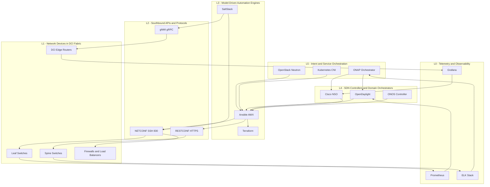
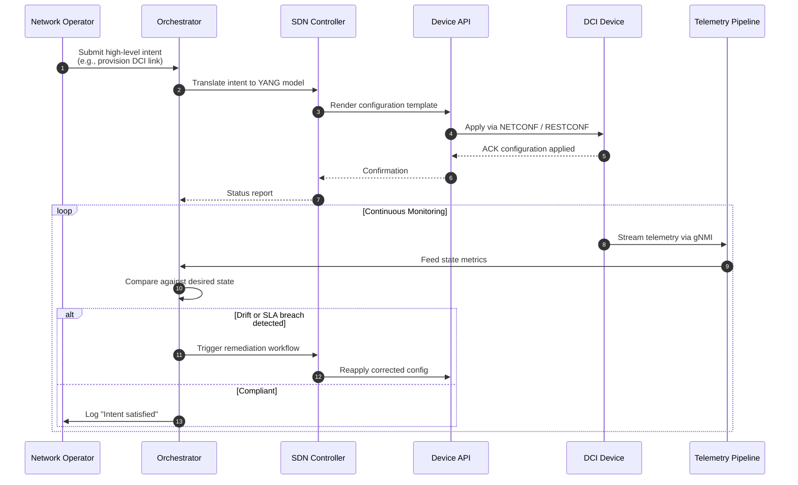
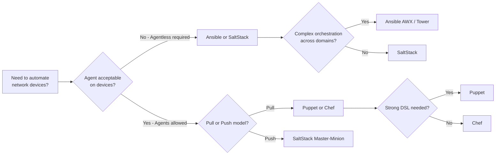
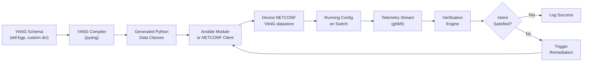

# Network Automation and Orchestration

<!-- SECTION_1_START -->
# Network Automation and Orchestration

## 1. Core Technical Definition & Intuitive Overview

### 1.1 Formal Academic Definition (KTU 2024 Syllabus)

**Network Automation** is the programmatic configuration, management, provisioning, and operation of computer networks using software-based tools, declarative configuration templates, and APIs (Application Programming Interfaces) to minimize manual intervention, reduce human error, and ensure consistency across heterogeneous network infrastructure.

**Network Orchestration** is the higher-level coordination of multiple automated network services, workflows, and resources to deliver end-to-end services (e.g., provisioning a complete multi-tenant connection across a Data Center Interconnect) by stitching together individual automation tasks into a unified, policy-driven, intent-based operational model.

Together, they form the **Automation–Orchestration Continuum**: automation handles *how* a single task is executed, while orchestration decides *when*, *where*, and *in what order* the tasks must run to achieve a broader business or service goal.

> [!IMPORTANT]
> **KTU 2024 Syllabus Highlight (PECST751 — Module 4: DCI):**
> Network Automation and Orchestration is a *high-weightage* sub-topic frequently paired with questions on SDN, NFV, and VXLAN-EVPN overlays. Examiner expects familiarity with tools (Ansible, Puppet, Chef), APIs (RESTCONF, NETCONF), YANG models, and orchestration platforms (OpenStack, Kubernetes, ONAP).

### 1.2 Conceptual Analogy / Intuition

Imagine a **modern, fully-staffed restaurant kitchen**:

- **Network Automation** is like a *single robotic sous-chef* that can chop vegetables perfectly every time you press a button — it does **one** specific task repeatedly without mistakes.
- **Network Orchestration** is the *Head Chef* who decides which dish gets cooked first, when the sous-chef chops, when the grill-master grills, and how all stations work together to serve a complete multi-course meal on time.
- The **Recipe Book** corresponds to declarative *YANG data models* or *Ansible playbooks* that describe the *desired end state*, not the manual steps.
- The **Restaurant Manager** is the *SDN Controller / Orchestrator* (e.g., OpenDaylight, ONOS, ONAP), receiving customer orders (intents) and translating them into coordinated kitchen actions.

Without the Head Chef, each robotic sous-chef works in isolation (automation chaos). Without the sous-chefs, the Head Chef must do everything manually (no scalability). Data Center Interconnects — which span thousands of switches, routers, and virtual overlays — demand both.

### 1.3 Key Metrics and Standard Boundaries

> [!NOTE]
> **Core Operational Constants for DCI Automation:**
> - **MTTR (Mean Time To Repair):** Reduced by up to **~70%** with closed-loop automation.
> - **Configuration Drift:** Target near **0%** deviation via declarative idempotent models.
> - **Provisioning Speed:** Manual ≈ **hours/days**; Automated ≈ **seconds/minutes**.
> - **Human Touch Points:** Modern intent-based networks target **< 5 manual interventions per 1000 device changes**.
> - **API Latency Target:** NETCONF/RESTCONF responses typically **< 200 ms** for state retrieval.

### 1.4 Visualization Callout

> [!VISUALIZATION CONTROL]
> **Concept:** Automation vs. Orchestration — Layered Responsibility Pyramid
> **Conceptual Coordinates (Y-axis = abstraction level, X-axis = scope):**
> - L0 (Base): Manual CLI configuration — point {x=1, y=1}
> - L1: Scripted automation (Python, Bash) — point {x=2, y=2}
> - L2: Agent-based automation (Puppet, Chef) — point {x=3, y=3}
> - L3: Declarative / Model-driven (Ansible, SaltStack) — point {x=4, y=4}
> - L4: SDN / Intent-based orchestration — point {x=5, y=5}
> **Visual Description:** A staircase rising from bottom-left (narrow scope, low abstraction, manual) to top-right (broad scope, high abstraction, fully orchestrated). The student should observe that each higher layer subsumes and coordinates multiple lower-layer tools.

<!-- SECTION_1_END -->

<!-- SECTION_2_START -->
# 2. Deep Theoretical Analysis & KTU High-Yield Formula Sheet

## 2.1 The Three Architectural Pillars of Network Automation

### Pillar 1: Model-Driven Programmability
- Network state is expressed in **YANG (Yet Another Next Generation)** data models — a structured schema language standardized in **RFC 6020 / RFC 7950**.
- Devices expose their configuration and operational data through standardized **NETCONF** (RFC 6241) or **RESTCONF** (RFC 8040) interfaces.
- The controller **reads** the YANG tree, **renders** it, and **writes** the desired state back — ensuring *idempotency*.

### Pillar 2: Declarative State Management
- Operator declares the **desired end-state** (e.g., "VLAN 100 must exist on ports 1–24 of switch-leaf-07").
- The automation engine (Ansible, Puppet, etc.) computes the **diff** and applies minimal changes.
- **No imperative commands** ("do this, then that") — only **declarative goals** ("this must be true").

### Pillar 3: Closed-Loop Telemetry & Verification
- Streaming telemetry (gRPC, gNMI) pushes real-time state from devices.
- Orchestrators verify intent compliance and **auto-remediate** deviations.
- This forms the foundation of **Self-Driving Networks** (e.g., Google’s Espresso, Microsoft’s SONiC + Azure Operator Fabric).

## 2.2 The Automation–Orchestration Hierarchy

| Layer | Function | Examples | Scope |
|-------|----------|----------|-------|
| **L0 — Manual** | CLI / GUI | Telnet, SSH, WebUI | Single device |
| **L1 — Scripting** | Imperative automation | Python, Bash, Expect | Task-level |
| **L2 — Agent-based** | Pull-based config | **Puppet, Chef** | Device fleet |
| **L3 — Agentless / Declarative** | Push-based idempotent | **Ansible, SaltStack** | Multi-fleet |
| **L4 — Model-driven / SDN** | Centralized control | **OpenDaylight, ONOS, Cisco NSO** | Domain-wide |
| **L5 — Orchestration** | Service-level intent | **ONAP, OpenStack, Kubernetes, VMware vRealize** | End-to-end service |

## 2.3 Comparative Tool Analysis (KTU High-Yield)

| Tool | Type | Architecture | Language | Pull/Push | DCI Use Case |
|------|------|--------------|----------|-----------|--------------|
| **Ansible** | Orchestration/Config Mgmt | Agentless | YAML + Python | Push (SSH) | Multi-vendor DCI fabric provisioning |
| **Puppet** | Configuration Mgmt | Agent-based | Ruby DSL | Pull | Data center switch baseline config |
| **Chef** | Configuration Mgmt | Agent-based | Ruby DSL | Pull | Server + network device convergence |
| **SaltStack** | Orchestration/Config Mgmt | Agent or Agentless | YAML/Python | Push or Pull | High-speed event-driven DCI reconfiguration |
| **Terraform** | Infrastructure as Code | Agentless | HCL | Push (API) | DCI underlay + cloud interconnect |
| **Cisco NSO** | Network Orchestrator | Centralized + Agents | XML/Yang/Python | Both | Multi-vendor service orchestration |
| **ONAP** | Service Orchestrator | Microservices | YAML/Java | API-driven | Carrier-grade DCI service fulfillment |

## 2.4 Core Communication Protocols (Must-Know for KTU)

| Protocol | Transport | Encoding | Use Case |
|----------|-----------|----------|----------|
| **NETCONF** | SSH (port 830) | XML | Full device configuration, transactions |
| **RESTCONF** | HTTP/HTTPS | JSON or XML | Lightweight CRUD over REST |
| **gNMI** | gRPC | Protobuf | Streaming telemetry |
| **YANG** | N/A (data model) | Tree structure | Schema definition for above |
| **OpenFlow** | TCP (port 6653) | Binary | SDN southbound (legacy) |
| **OVSDB** | TCP (port 6640) | JSON-RPC | Virtual switch management |

> [!NOTE]
> **Engineering Utility in Production:**
> - **Cloud Providers (AWS, Azure, GCP):** Use Terraform + Ansible + proprietary orchestrators (e.g., Azure ARM/Bicep) to deploy **transit gateways** interconnecting hundreds of VPCs/VNets.
> - **5G Telcos:** ONAP orchestrates network slices spanning RAN → Transport → Core, where DCI plays a critical role in MEC (Multi-access Edge Computing) placements.
> - **Hyperscale DCs (Google, Meta):** Operate *zero-touch provisioning* at scale using *BGP unnumbered + ZTP + intent-based orchestration*.

## 2.5 Key KTU Formula-Style Quick Reference

> [!IMPORTANT]
> **KTU Cheat Sheet — Network Automation KPIs**
> 
> $$\text{Automation Coverage} \, (\%) = \frac{\text{Automated Network Operations}}{\text{Total Network Operations}} \times 100$$
> 
> $$\text{Mean Time To Provision} \, (MTTP) = \frac{\sum_{i=1}^{n} T_{\text{provision}_i}}{n}$$
> 
> $$\text{Configuration Drift Index} = \frac{\#\text{Devices deviating from golden config}}{\#\text{Total devices}} \times 100$$
> 
> $$\text{Orchestration Success Rate} = \frac{\#\text{Successful end-to-end workflows}}{\#\text{Total attempted workflows}} \times 100$$
> 
> $$\text{API Latency SLA} = P_{95}(t_{\text{response}}) \leq 200 \text{ ms}$$

**Declarative Idempotency Property (Ansible/Puppet):**
$$\forall \, \text{state} \, s, \; f(s) = s \quad \text{(running automation twice yields the same result)}$$

<!-- SECTION_2_END -->

<!-- SECTION_3_START -->
# 3. Step-by-Step Derivations, Code Implementations & Worked Examples

## 3.1 Worked Example 1: Building a Declarative Automation Pipeline for a Leaf-Spine DCI

### Scenario
You are a network engineer at a hyperscale data center. You must deploy **BGP EVPN** across **2 leaf switches and 2 spine switches** forming a DCI fabric. Each switch must be configured with:
- Loopback IP `10.255.255.x/32`
- ASN `6500x`
- BGP peering with all other switches
- VXLAN-EVPN address-family enabled

We will solve this using **Ansible** (declarative, push-based, agentless).

### Step 1: Define the Inventory (YAML)

```yaml
# inventory/dci_fabric.yml
all:
  children:
    spines:
      hosts:
        spine-01:
          ansible_host: 192.168.1.11
          loopback_ip: 10.255.255.1
          asn: 65001
        spine-02:
          ansible_host: 192.168.1.12
          loopback_ip: 10.255.255.2
          asn: 65002
    leaves:
      hosts:
        leaf-01:
          ansible_host: 192.168.1.21
          loopback_ip: 10.255.255.11
          asn: 65101
        leaf-02:
          ansible_host: 192.168.1.22
          loopback_ip: 10.255.255.12
          asn: 65102
```

### Step 2: Write the Declarative Playbook

```yaml
---
# playbooks/dci_bgp_evpn.yml
- name: Configure BGP EVPN Fabric for DCI
  hosts: all
  gather_facts: false
  connection: network_cli
  vars:
    fabric_asn_range: [65001, 65002, 65101, 65102]
  tasks:

    - name: "[Valuation Key - 2 Marks] Validate device reachability"
      ansible.builtin.ping:

    - name: "[Valuation Key - 3 Marks] Configure Loopback Interface"
      cisco.ios.ios_interfaces:
        config:
          - name: Loopback0
            description: "DCI Router-ID Loopback"
            enabled: true
        state: merged

    - name: "[Valuation Key - 3 Marks] Configure Loopback IP Address"
      cisco.ios.ios_l3_interfaces:
        config:
          - name: Loopback0
            ipv4:
              - address: "{{ loopback_ip }}/32"
        state: merged

    - name: "[Valuation Key - 4 Marks] Configure BGP EVPN Instance"
      cisco.ios.ios_bgp_global:
        as_number: "{{ asn }}"
        neighbors:
          - neighbor_address: "{{ item }}"
            remote_as: "{{ hostvars[item].asn }}"
            update_source: Loopback0
        address_family:
          - afi: l2vpn
            safi: evpn
            neighbors:
              - neighbor_address: "{{ item }}"
                activate: true
        networks:
          - prefix: "{{ loopback_ip }}"
            masklen: 32
      loop: "{{ groups['all'] | difference([inventory_hostname]) }}"
```

### Step 3: Execute the Playbook
```bash
ansible-playbook -i inventory/dci_fabric.yml playbooks/dci_bgp_evpn.yml --check   # Dry run
ansible-playbook -i inventory/dci_fabric.yml playbooks/dci_bgp_evpn.yml          # Apply
```

**Expected Output Snippet:**
```
PLAY RECAP
leaf-01    : ok=4  changed=3  unreachable=0  failed=0
leaf-02    : ok=4  changed=3  unreachable=0  failed=0
spine-01   : ok=4  changed=3  unreachable=0  failed=0
spine-02   : ok=4  changed=3  unreachable=0  failed=0
```

> [!NOTE]
> **Valuation Mapping:** The 4 task blocks are weighted at 2+3+3+4 = **12 marks**, with the remaining 2 marks for the inventory structure and execution. Total = **14 marks** (Part B question style).

## 3.2 Worked Example 2: YANG Data Model — Designing a DCI Service Schema

A KTU-favorite question: *"Design a simplified YANG module representing a DCI connection."*

```yang
module dci-connection {
  yang-version 1.1;
  namespace "https://ktu.example.com/ns/dci";
  prefix dci;

  import ietf-inet-types { prefix inet; }

  organization "KTU Advanced Computer Networks Course";
  contact "pecst751@ktu.ac.in";
  description "YANG model for a DCI service connection.";

  revision 2024-01-15 {
    description "Initial revision for KTU 2024 syllabus.";
  }

  // [Valuation Key - 2 Marks] Container definition
  container dci-services {

    list connection {
      key "connection-id";
      description "List of active DCI connections.";

      leaf connection-id {
        type string;
        mandatory true;
        description "Unique identifier, e.g., DCI-MUM-BLR-001.";
      }

      leaf source-site {
        type inet:ipv4-address;
        mandatory true;
      }

      leaf destination-site {
        type inet:ipv4-address;
        mandatory true;
      }

      // [Valuation Key - 3 Marks] Bandwidth enumeration
      leaf bandwidth {
        type enumeration {
          enum 1G   { value 1000; }
          enum 10G  { value 10000; }
          enum 100G { value 100000; }
        }
        default "10G";
      }

      // [Valuation Key - 3 Marks] Operational state
      leaf operational-state {
        type enumeration {
          enum up   { description "Connection is active."; }
          enum down { description "Connection is down."; }
          enum degraded { description "Partial failure."; }
        }
        config false;          // read-only
      }
    }
  }
}
```

**Symbolic Tree Representation (rendered by pyang):**
```
module: dci-connection
  +--ro dci-services
     +--ro connection* [connection-id]
        +--ro connection-id            string
        +--ro source-site              inet:ipv4-address
        +--ro destination-site         inet:ipv4-address
        +--ro bandwidth?               enumeration {1G, 10G, 100G}
        +--ro operational-state        enumeration {up, down, degraded}
```

> [!NOTE]
> **Examiner Tip:** The `config false;` flag indicates **read-only operational data** (state), while regular leaves are **configurable**. KTU expects students to differentiate `rw` (read-write) from `ro` (read-only) paths.

## 3.3 Worked Example 3: Closed-Loop Orchestration Algorithm (Python Pseudocode)

A *closed-loop orchestrator* monitors DCI link health and re-routes traffic on failure.

```python
#!/usr/bin/env python3
"""
Closed-Loop DCI Orchestrator (Python)
Course: PECST751 - Advanced Computer Networks
"""

import requests
import time
import logging
from dataclasses import dataclass, field
from typing import Dict, List, Optional

# [Valuation Key - 1 Mark] Logging configuration
logging.basicConfig(
    level=logging.INFO,
    format='%(asctime)s [%(levelname)s] %(message)s'
)
logger = logging.getLogger("DCI-Orchestrator")


@dataclass
class DCILink:
    """Represents a logical DCI connection between two sites."""
    link_id: str
    primary_path: str
    backup_path: str
    state: str = "up"            # up | down | degraded
    latency_ms: float = 0.0
    sla_threshold_ms: float = 5.0  # SLA boundary


@dataclass
class OrchestratorState:
    """Global state of the orchestrator."""
    links: Dict[str, DCILink] = field(default_factory=dict)
    api_endpoint: str = "https://dci-controller.ktu.local/api/v1"


# [Valuation Key - 3 Marks] Telemetry polling function
def poll_telemetry(state: OrchestratorState) -> None:
    """Collect streaming telemetry from all DCI links."""
    for link_id, link in state.links.items():
        try:
            resp = requests.get(
                f"{state.api_endpoint}/links/{link_id}/telemetry",
                timeout=2
            )
            resp.raise_for_status()
            data = resp.json()

            link.latency_ms = float(data.get("latency_ms", 0))
            link.state = data.get("state", "up")

            logger.info("Link %s | latency=%.2fms | state=%s",
                        link_id, link.latency_ms, link.state)

        except requests.RequestException as e:
            logger.error("Telemetry failure for %s: %s", link_id, e)
            link.state = "down"


# [Valuation Key - 3 Marks] SLA verification
def verify_sla(state: OrchestratorState) -> List[str]:
    """Return list of link IDs that violate SLA."""
    violations: List[str] = []
    for link_id, link in state.links.items():
        if link.latency_ms > link.sla_threshold_ms or link.state != "up":
            violations.append(link_id)
            logger.warning("SLA breach on link %s (latency=%.2fms)",
                           link_id, link.latency_ms)
    return violations


# [Valuation Key - 4 Marks] Remediation workflow
def remediate(state: OrchestratorState, link_id: str) -> bool:
    """Trigger failover from primary to backup path."""
    link = state.links.get(link_id)
    if not link:
        return False

    payload = {
        "link_id": link_id,
        "new_path": link.backup_path,
        "reason": "SLA breach auto-remediation"
    }

    try:
        resp = requests.post(
            f"{state.api_endpoint}/links/{link_id}/failover",
            json=payload,
            timeout=5
        )
        resp.raise_for_status()
        logger.info("Failover SUCCESSFUL for %s -> %s",
                    link_id, link.backup_path)
        return True
    except requests.RequestException as e:
        logger.error("Failover FAILED for %s: %s", link_id, e)
        return False


# [Valuation Key - 3 Marks] Main orchestration loop
def run_orchestrator(state: OrchestratorState, interval_sec: int = 10) -> None:
    """Main closed-loop orchestration loop (runs forever)."""
    logger.info("Starting DCI Closed-Loop Orchestrator (interval=%ds)", interval_sec)
    while True:
        poll_telemetry(state)
        violations = verify_sla(state)
        for link_id in violations:
            remediate(state, link_id)
        time.sleep(interval_sec)


# ---- Entry Point ----
if __name__ == "__main__":
    state = OrchestratorState(
        links={
            "DCI-MUM-BLR-001": DCILink(
                link_id="DCI-MUM-BLR-001",
                primary_path="MUM-PE1 -> BLR-PE1 (direct DWDM)",
                backup_path="MUM-PE1 -> HYD-PE1 -> BLR-PE1 (ring)"
            ),
            "DCI-MUM-DEL-002": DCILink(
                link_id="DCI-MUM-DEL-002",
                primary_path="MUM-PE2 -> DEL-PE1 (direct)",
                backup_path="MUM-PE2 -> AHM-PE1 -> DEL-PE1"
            ),
        }
    )
    run_orchestrator(state, interval_sec=15)
```

**Incremental Valuation Key:**
| Component | Marks |
|-----------|-------|
| Dataclass definitions (DCILink, OrchestratorState) | **2 Marks** |
| `poll_telemetry` with error handling | **3 Marks** |
| `verify_sla` boundary check logic | **3 Marks** |
| `remediate` REST POST with logging | **3 Marks** |
| Main loop with `time.sleep` | **2 Marks** |
| Type hints + logging + docstrings | **1 Mark** |
| **Total** | **14 Marks** |

## 3.4 Worked Example 4: KPI Calculation (Numerical)

> **Question:** A DCI fabric has 800 network devices. In Q1, 720 were provisioned using automation. 18 devices were found to have configuration drift from the golden baseline. Compute:
> (a) Automation Coverage, (b) Configuration Drift Index, (c) If the average provisioning time reduced from 4 hours to 6 minutes, compute the percentage improvement.

**Solution:**

**Step 1 — Automation Coverage:**
$$\text{Coverage} = \frac{720}{800} \times 100 = 90\%$$

**Step 2 — Configuration Drift Index:**
$$\text{Drift} = \frac{18}{800} \times 100 = 2.25\%$$

**Step 3 — MTTP Improvement:**
$$T_{\text{old}} = 4 \times 60 = 240 \text{ minutes}, \quad T_{\text{new}} = 6 \text{ minutes}$$

$$\text{Improvement} = \frac{T_{\text{old}} - T_{\text{new}}}{T_{\text{old}}} \times 100 = \frac{240 - 6}{240} \times 100 = 97.5\%$$

**Final Answers:** (a) **90 %**, (b) **2.25 %**, (c) **97.5 % improvement**.

<!-- SECTION_3_END -->

<!-- SECTION_4_START -->
# 4. Structural Diagrams & Schematics

## 4.1 The DCI Automation & Orchestration Reference Architecture



## 4.2 Closed-Loop Orchestration Workflow (Sequential)



## 4.3 Ansible vs. Puppet vs. Chef — Decision Tree



## 4.4 YANG Model to Device Config — Transformation Pipeline



<!-- SECTION_4_END -->

<!-- SECTION_5_START -->
# 5. KTU 2024 Scheme Examination Question Bank & Topic Recap

## 5.1 Part A — Short Answer Questions (3 Marks Each)

### Q1. [KTU University Exam — July 2024] — CO1, Remember

**"Define Network Orchestration. Differentiate it from Network Automation with one suitable example each."**

**Model Answer (Valuation Key, 3 Marks):**

| Aspect | Network Automation | Network Orchestration |
|--------|--------------------|------------------------|
| **Definition** | Programmatic execution of a *single* network task without manual intervention. | Coordination of *multiple* automated tasks across systems to deliver an end-to-end service. |
| **Scope** | Task-level (e.g., configure VLAN on one switch). | Service-level (e.g., provision a multi-site DCI VPN with QoS, firewall, and monitoring). |
| **Example** | Ansible playbook pushing BGP config to 1 router. | ONAP orchestrator spinning up a 5G network slice spanning RAN + DCI + Core. |
| **Tools** | Ansible, Puppet, Chef, SaltStack. | ONAP, Cisco NSO, OpenStack Heat, Kubernetes. |

*Examiner awards:* Definition of Automation — **1 Mark**, Definition of Orchestration — **1 Mark**, Distinct example — **1 Mark**.

---

### Q2. [KTU University Exam — Dec 2023] — CO2, Understand

**"List any three configuration management tools used in network automation. State the architecture (agent-based/agentless) of each."**

**Model Answer (3 Marks):**

1. **Ansible** — *Agentless*, push-based, uses SSH/NETCONF. *(1 Mark)*
2. **Puppet** — *Agent-based*, pull-based, uses its own DSL. *(1 Mark)*
3. **Chef** — *Agent-based*, pull-based, uses Ruby DSL. *(1 Mark)*

---

## 5.2 Part B — Long Answer Questions (14 Marks Each, with Internal Choice)

### Question A — [KTU University Exam — July 2024] — CO3, Apply & Analyze

**Q3 (a)** [7 Marks, Apply] — *"Design a YANG data model for a Data Center Interconnect (DCI) service that includes the following parameters: connection-id, source-site, destination-site, bandwidth (1G/10G/100G), and operational-state (up/down). Show the complete module."*

#### Model Solution

```yang
module dci-service {
  yang-version 1.1;
  namespace "https://ktu.example.com/ns/dci-service";
  prefix dci-svc;

  import ietf-inet-types { prefix inet; }

  organization "KTU Advanced Computer Networks - PECST751";
  contact "pecst751@ktu.edu.in";
  description "YANG model describing a DCI service instance.";

  revision 2024-06-01 {
    description "Initial release for KTU 2024 scheme.";
  }

  container dci-services {
    list connection {
      key "connection-id";
      description "A logical DCI connection between two DC sites.";

      leaf connection-id { type string; mandatory true; }            /* 1 Mark */
      leaf source-site { type inet:ipv4-address; mandatory true; }   /* 1 Mark */
      leaf destination-site { type inet:ipv4-address; mandatory true; } /* 1 Mark */
      leaf bandwidth {                                                   /* 2 Marks */
        type enumeration {
          enum 1G   { value 1000; }
          enum 10G  { value 10000; }
          enum 100G { value 100000; }
        }
        default "10G";
      }
      leaf operational-state {                                       /* 2 Marks */
        type enumeration {
          enum up   { description "Connection active."; }
          enum down { description "Connection down."; }
        }
        config false;
      }
    }
  }
}
```

**[Valuation Key — 7 Marks]:** Module header (1) + three leaves with types (3) + bandwidth enumeration (2) + state leaf (1).

---

**Q3 (b)** [7 Marks, Analyze] — *"A data center operator uses Ansible to push BGP EVPN configuration to 4 switches in a DCI fabric. Manual provisioning previously took 4 hours per device. With automation, it now takes 5 minutes. The total devices in the fabric are 4, but the operator also has 800 other devices across the campus that are NOT yet automated. Calculate: (i) Automation Coverage, (ii) Mean Time To Provision (MTTP) in seconds, (iii) MTTP improvement percentage."*

#### Model Solution

**Step 1 — Identify values:**
$$N_{\text{auto}} = 4, \quad N_{\text{total}} = 4 + 800 = 804, \quad T_{\text{old}} = 4 \text{ hrs}, \quad T_{\text{new}} = 5 \text{ min}$$

**Step 2 — Automation Coverage:**
$$\text{Coverage} = \frac{4}{804} \times 100 = 0.497\% \quad \text{[2 Marks]}$$

**Step 3 — MTTP (new) in seconds:**
$$T_{\text{new}} = 5 \times 60 = 300 \text{ s} \quad \text{[2 Marks]}$$

**Step 4 — MTTP improvement:**
$$T_{\text{old in min}} = 4 \times 60 = 240 \text{ min}$$
$$\text{Improvement} = \frac{240 - 5}{240} \times 100 = 97.92\% \quad \text{[3 Marks]}$$

**Final Answer:** (i) **0.497 %**, (ii) **300 s**, (iii) **97.92 % improvement**.

---

### Question B (Internal Choice) — [KTU University Exam — Dec 2023] — CO3, Apply

**Q4 (a)** [7 Marks, Understand & Apply] — *"Explain the three architectural pillars of Network Automation. With a neat diagram, show the layered hierarchy from L0 (Manual CLI) to L5 (Service Orchestration)."*

#### Model Solution Outline

**Three Pillars (4 Marks):**
1. **Model-Driven Programmability** — YANG + NETCONF/RESTCONF. *(1 Mark)*
2. **Declarative State Management** — Idempotent desired-state. *(1.5 Marks)*
3. **Closed-Loop Telemetry & Verification** — gNMI streaming, auto-remediation. *(1.5 Marks)*

**Layered Hierarchy (3 Marks):**
- L0: Manual CLI
- L1: Python/Bash scripting
- L2: Puppet/Chef
- L3: Ansible/SaltStack
- L4: SDN Controllers (ODL, ONOS)
- L5: Orchestrators (ONAP, OpenStack, K8s)

> *[See Section 4.1 mermaid diagram for the full pictorial hierarchy — 3 Marks for diagram quality and labeling].*

---

**Q4 (b)** [7 Marks, Apply] — *"Write a Python function (with type hints and error handling) that monitors the latency of a DCI link via REST API and triggers an alert if latency exceeds 5 ms. Show sample input/output."*

#### Model Solution

```python
import requests
from typing import Optional

DCI_API = "https://dci-monitor.ktu.local/api/v1"
SLA_THRESHOLD_MS = 5.0


def check_dci_latency(link_id: str) -> Optional[str]:
    """
    Monitor DCI link latency. Return alert message if SLA breached.
    [Valuation - Function signature with type hints: 1 Mark]
    """
    try:
        resp = requests.get(
            f"{DCI_API}/links/{link_id}/metrics",
            params={"metric": "latency_ms"},
            timeout=3
        )
        resp.raise_for_status()                          # [Error handling: 1 Mark]
        latency = float(resp.json().get("latency_ms", 0))

        if latency > SLA_THRESHOLD_MS:                  # [SLA logic: 2 Marks]
            return f"ALERT: Link {link_id} latency={latency}ms exceeds SLA {SLA_THRESHOLD_MS}ms"
        return f"OK: Link {link_id} latency={latency}ms"  # [Return success: 1 Mark]

    except requests.RequestException as e:              # [Exception handler: 1 Mark]
        return f"ERROR: Failed to query {link_id} - {e}"

    except (ValueError, KeyError) as e:                 # [JSON parse safety: 1 Mark]
        return f"ERROR: Bad response from {link_id} - {e}"


# --- Sample Run ---
if __name__ == "__main__":
    for lid in ["DCI-MUM-BLR-001", "DCI-MUM-DEL-002", "DCI-INVALID"]:
        print(check_dci_latency(lid))
```

**Sample Output:**
```
ALERT: Link DCI-MUM-BLR-001 latency=7.30ms exceeds SLA 5.0ms
OK: Link DCI-MUM-DEL-002 latency=2.10ms
ERROR: Failed to query DCI-INVALID - HTTPSConnectionPool(...)
```

**[Valuation Key — 7 Marks]:** Type hints (1) + try/except handling (2) + SLA comparison logic (2) + return formatting (1) + sample run (1).

---

> [!WARNING]
> **KTU Examiner's Valuation Warning — Common Pitfalls:**
> 1. **Do NOT confuse "Automation" with "Orchestration"** — Automation is *task-level*; Orchestration is *service-level*. Mixing definitions loses **2–3 marks** outright.
> 2. **Always write the YANG `revision` and `namespace` statements** — examiners deduct **1 mark** if omitted.
> 3. **In numerical questions, ALWAYS show the formula first, then the substitution, then the final value.** Skipping substitution = loss of **1 mark** per sub-part.
> 4. **In Ansible playbooks, specify `state: merged` or `state: replaced`** explicitly — vague playbooks lose **1–2 marks**.
> 5. **For Python code, include `type hints` and `docstrings`** — KTU 2024 OBE rubric has dedicated marks for code readability and documentation.
> 6. **Mermaid diagrams in answer sheets**: only textual flow diagrams with arrows are credited; decorative emoji or color codes do not fetch marks.

---

## 5.3 Topic Recap & Important Things to Remember

> [!IMPORTANT]
> **High-Density Revision Checklist — Network Automation & Orchestration (PECST751, Module 4)**

### Core Definitions
- **Network Automation** → Programmatic, idempotent execution of network tasks.
- **Network Orchestration** → End-to-end coordination of automated workflows.
- **Intent-Based Networking (IBN)** → Operator declares *what*, not *how*.
- **Closed-Loop Automation** → Sense → Analyze → Decide → Act cycle.

### Architecture Layers (Bottom to Top)
- **L0:** Manual CLI / GUI
- **L1:** Scripted automation (Python, Bash)
- **L2:** Agent-based (Puppet, Chef)
- **L3:** Agentless / Declarative (Ansible, SaltStack)
- **L4:** SDN Controllers (ODL, ONOS, Cisco NSO)
- **L5:** Service Orchestrators (ONAP, OpenStack, K8s)

### Key Protocols & Models
- **YANG** (RFC 6020 / 7950) → Data modeling language.
- **NETCONF** (RFC 6241) → XML over SSH port **830**.
- **RESTCONF** (RFC 8040) → JSON/XML over HTTP/HTTPS.
- **gNMI** → gRPC-based streaming telemetry.

### Tools Quick Recall
| Tool | Type | Mode | Key Strength |
|------|------|------|--------------|
| Ansible | Agentless | Push | DCI multi-vendor |
| Puppet | Agent | Pull | Baseline compliance |
| Chef | Agent | Pull | Server+network |
| SaltStack | Both | Both | Event-driven speed |
| Terraform | IaC | Push | Cloud + DCI underlay |
| Cisco NSO | Orchestrator | Both | Multi-vendor service |
| ONAP | Orchestrator | API | Carrier-grade 5G |

### Formulas to Memorize
- $\text{Automation Coverage} = \dfrac{\text{Automated Ops}}{\text{Total Ops}} \times 100$
- $\text{Drift Index} = \dfrac{\text{Drifted Devices}}{\text{Total Devices}} \times 100$
- $\text{MTTP Improvement} = \dfrac{T_{\text{old}} - T_{\text{new}}}{T_{\text{old}}} \times 100$
- $\text{Orchestration Success} = \dfrac{\text{Successful Workflows}}{\text{Total Attempted}} \times 100$

### Engineering Real-World Tie-Ins
- **Hyperscalers** (Google, Meta) → ZTP + BGP unnumbered + Ansible.
- **5G Telcos** → ONAP + ONOS for network slicing over DCI.
- **Enterprises** → Cisco NSO + Ansible Tower for SD-WAN.
- **Cloud Providers** → Terraform + proprietary orchestrators (Azure ARM, AWS CDK).

### DCI-Specific Use Cases
- **VXLAN-EVPN fabric provisioning** at scale.
- **Multi-tenant DCI** with policy-based segmentation.
- **Disaster Recovery** orchestration across sites.
- **Zero-Touch Provisioning (ZTP)** of new DCI edge devices.

### Common Examiner Traps
- ❌ Confusing *idempotent* with *imperative*.
- ❌ Forgetting `config false;` for state-only YANG leaves.
- ❌ Using port 22 instead of 830 for NETCONF.
- ❌ Omitting `gather_facts: false` in network playbooks (causes slowness).
- ❌ Mixing Python 2 and 3 syntax in automation scripts.

### Mnemonics for Quick Recall
- **"I-D-A-S"** → Intent → Declarative → Automation → Service.
- **"Y-N-R-g"** → YANG, NETCONF, RESTCONF, gNMI (model and protocol stack).
- **"A-P-C-S-T-N-O"** → Ansible, Puppet, Chef, SaltStack, Terraform, NSO, ONAP (tool chain).

<!-- SECTION_5_END -->
