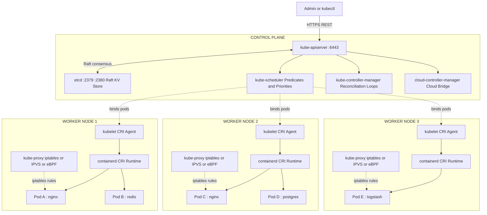
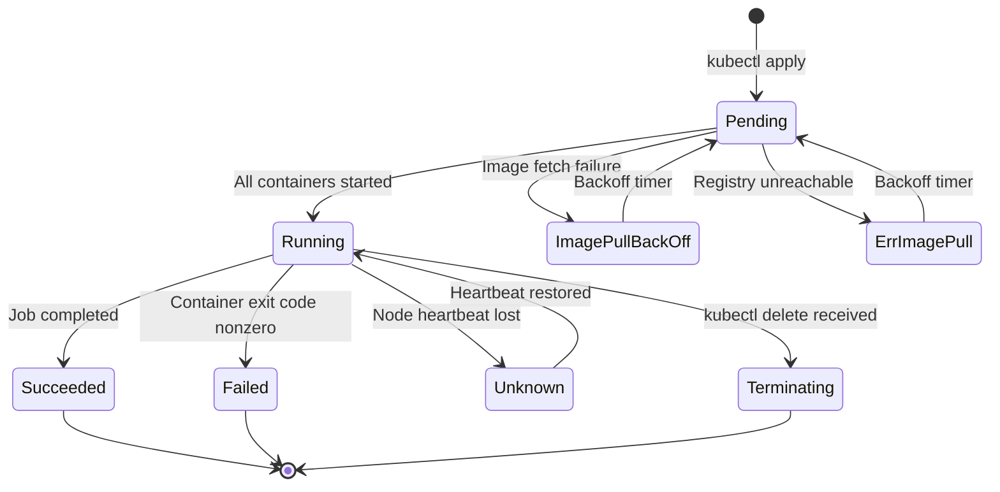
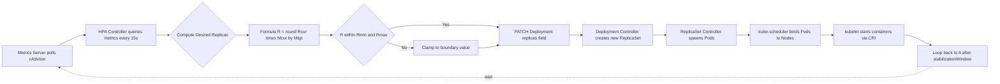
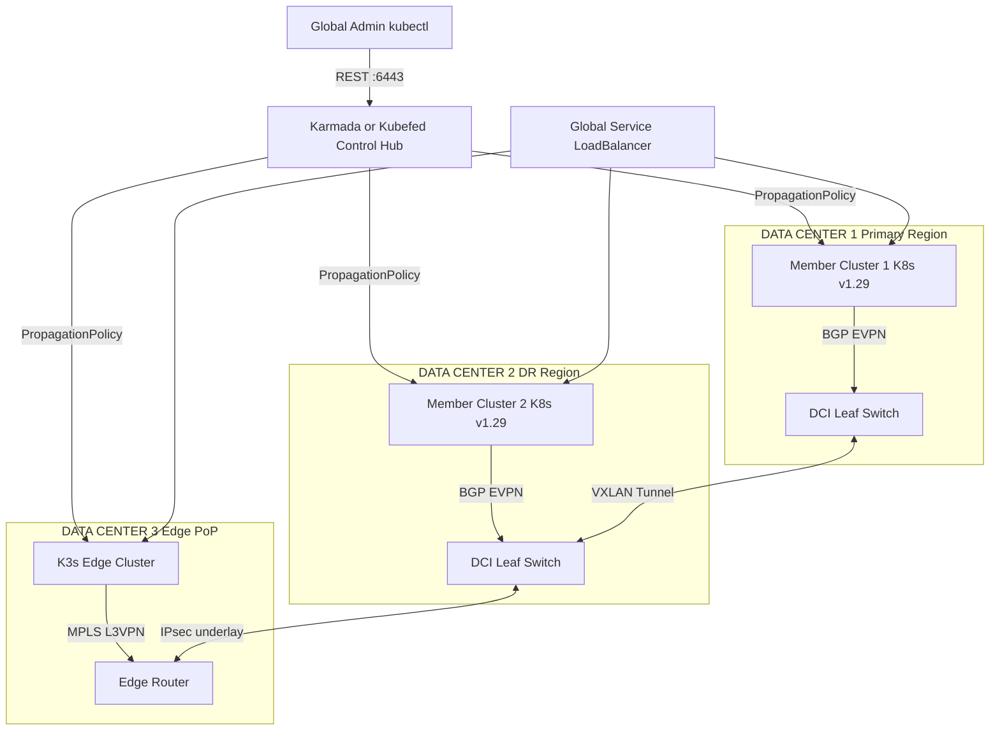
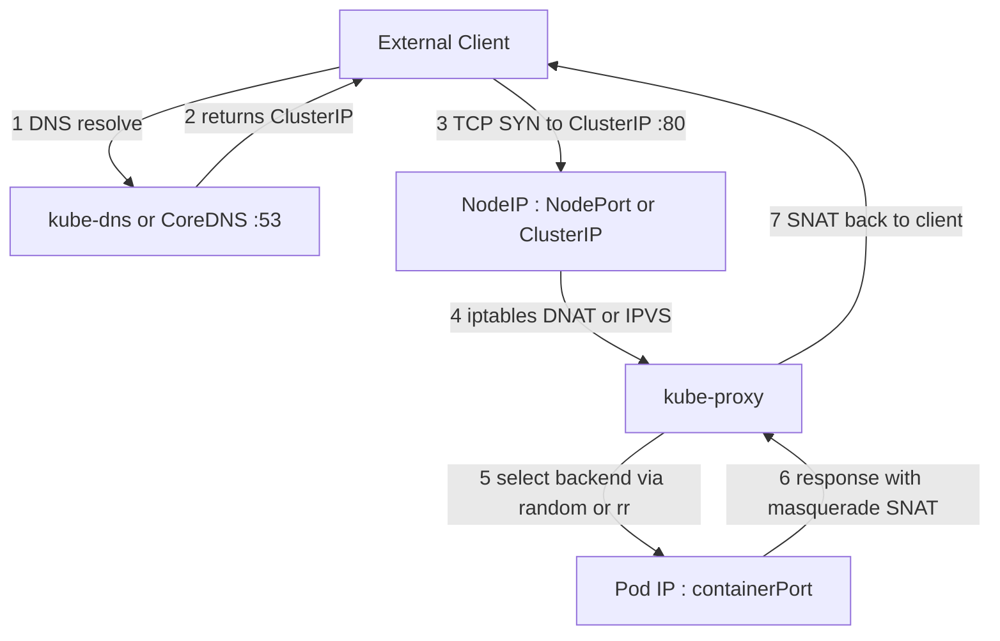

# Orchestration Frameworks - Kubernetes

<!-- SECTION_1_START -->
# Orchestration Frameworks — Kubernetes

## 1.1 Formal Academic Definition (KTU 2024 Syllabus Terminology)

**Container Orchestration** is the automated process of scheduling, deploying, networking, scaling, and managing the lifecycle of containerized applications across a cluster of compute nodes. **Kubernetes** (commonly abbreviated as **K8s**, where **8** represents the eight letters between the **K** and the **s** in the word "Kubernetes") is an open-source, declarative, extensible, self-healing **container orchestration platform** originally designed by **Google** in **2014** and now maintained by the **Cloud Native Computing Foundation (CNCF)**.

> [!NOTE]
> **KTU Syllabus Highlight (PECST751 — Module 4: Data Center Interconnect):**
> Kubernetes is treated as the *de-facto* control-plane fabric for orchestrating distributed microservices that span multiple racks, pods, and geographically distributed data centers interconnected via **VXLAN**, **EVPN**, or **MPLS** overlays.

**Mathematical Abstraction of Orchestration:**

$$
\Pi_{\text{cluster}} = \left\{ N_i, P_j, S_k, C_m, V_n \;\middle|\; i,j,k,m,n \in \mathbb{Z}^+ \right\}
$$

Where:
* $N_i$ = physical/virtual **Node** (worker machine)
* $P_j$ = **Pod** (smallest deployable unit, encapsulates one or more containers)
* $S_k$ = **Service** (stable network endpoint for a set of pods)
* $C_m$ = **Controller** (control loop reconciling desired vs actual state)
* $V_n$ = **Volume** (persistent or ephemeral storage abstraction)

## 1.2 Conceptual Analogy — Kubernetes as an Air Traffic Control Tower

Imagine a **busy international airport** with thousands of airplanes (containers) landing and taking off every minute. The **air traffic control (ATC) tower** is Kubernetes:

| ATC Tower Concept | Kubernetes Equivalent |
|-------------------|----------------------|
| Airplane | Container (Docker/containerd) |
| Flight | Pod (one or more containers) |
| Runway | Node (worker machine) |
| Airport operations center | Control Plane (API Server, etcd, Scheduler) |
| Flight plan | YAML Manifest (declarative spec) |
| Air-traffic controller | Scheduler + Controller Manager |
| Radar & logs | etcd (key-value store) |
| Gate assignment | Service / Ingress |

Without ATC, planes would crash. Without Kubernetes, containers would collide, fail silently, and overload servers. Kubernetes acts as the **deterministic, policy-driven brain** that continuously reconciles **desired state** with **actual state**.

## 1.3 Evolution of Application Deployment

> [!IMPORTANT]
> **Historical Timeline — Why Kubernetes Was Invented**

$$
\text{Physical Servers} \rightarrow \text{VMs} \rightarrow \text{Containers} \rightarrow \text{Orchestrated Containers (K8s)}
$$

1. **Bare Metal Era:** One application per physical server → ~**10 %** resource utilization.
2. **Virtualization Era:** Hypervisors (VMware ESXi, KVM) enabled multiple VMs per server → utilization rose to ~**60–70 %**.
3. **Container Era:** Docker (2013) packaged applications with dependencies → lightweight, **second-level** startup, **MB-level** images.
4. **Orchestration Era (2014 → present):** Managing **thousands of containers manually** became infeasible → Google open-sourced **Borg-derived** Kubernetes.

## 1.4 Physical Constants and Standard Metrics

* **Default Kubernetes Service CIDR:** `10.96.0.0/12`
* **Default Pod CIDR per Node:** `10.244.0.0/16` (Flannel default)
* **Default Kubernetes DNS Service IP:** `10.96.0.10`
* **Kubernetes Semantic Versioning:** **MAJOR.MINOR.PATCH** (e.g., `v1.29.4`)
* **Maximum pods per node (default kubelet limit):** **110**
* **Maximum nodes per cluster (theoretical, etcd-bound):** **5000**
* **Maximum pods per cluster:** **150,000**
* **Maximum services per cluster:** **10,000**
* **Container resource unit — CPU:** `1` vCPU = **1000 millicores** (`m`)
* **Container resource unit — Memory:** measured in **bytes, Ki, Mi, Gi, Ti**

## 1.5 GeoGebra / Desmos Integration — Visualizing a ReplicaSet Scaling Curve

> [!VISUALIZATION CONTROL]
> **Concept:** Kubernetes Horizontal Pod Autoscaler (HPA) response curve
> **GeoGebra / Desmos Input Equations:**
>
> * $f(x) = \text{round}\!\left(\text{currentReplicas} \times \dfrac{\text{currentMetricValue}}{\text{targetMetricValue}}\right)$
> * Constraint: $\min \le f(x) \le \max$
> * Parameters: $\text{currentReplicas} = 4$, $\text{targetMetricValue} = 50$, $\min = 2$, $\max = 10$
> * Sample points: $(0,2), (25,2), (50,4), (75,6), (100,8), (150,10), (200,10)$
>
> **Visual Description:** Plot $x$ as the observed CPU utilization percentage and $y$ as the resulting replica count. Students should observe a **stepped linear curve** that saturates at the configured $\min$ and $\max$ boundaries — a hallmark of the HPA control loop.

<!-- SECTION_1_END -->

<!-- SECTION_2_START -->
# Deep Theoretical Analysis & KTU High-Yield Reference Sheet

## 2.1 Kubernetes Cluster Architecture

A Kubernetes cluster is logically partitioned into two functional planes:

### 2.1.1 Control Plane (formerly "Master Node")

The control plane makes **global decisions** about the cluster (scheduling, scaling, event handling) and exposes the cluster's API.

**Core Control Plane Components:**

1. **kube-apiserver** — Front-end of the control plane; the **only component that directly talks to etcd**.
   * Exposes the **RESTful Kubernetes API** on port **`6443`** (HTTPS) by default.
   * Validates and processes YAML/JSON manifests submitted via `kubectl`.
   * Implements **RBAC**, **Admission Control**, and **Authentication**.

2. **etcd** — Distributed, consistent, **Raft-consensus** key-value store.
   * Single source of truth for all cluster state.
   * Default listening port: **`2379`** (client) and **`2380`** (peer).
   * Stores objects under keys such as `/registry/pods/default/nginx-abc123`.

3. **kube-scheduler** — Watches for newly created Pods with no `nodeName` and selects an optimal node.
   * Uses **two-step filtering**:
     * **Predicates (Filters):** Node affinity, taints/tolerations, resource requests, port conflicts.
     * **Priorities (Scoring):** Least-loaded, balanced distribution, topology spread.

4. **kube-controller-manager** — Runs **controller loops**, each watching the API server and reconciling actual state toward desired state.
   * Node Controller, Replication Controller, Endpoints Controller, Service Account & Token Controllers.

5. **cloud-controller-manager** (optional) — Bridges cluster with cloud-provider APIs (AWS ELB, Azure LB, GCP routes).

### 2.1.2 Worker Node (Data Plane)

Each worker node runs the components required to host and execute Pods.

1. **kubelet** — Agent on every node; registers the node with the cluster, watches PodSpecs, and ensures containers are running via the **Container Runtime Interface (CRI)**.
2. **kube-proxy** — Maintains **iptables**, **IPVS**, or **eBPF** rules to implement Kubernetes `Service` virtual IPs and load balancing.
3. **Container Runtime** — Pulls images, starts/stops containers. Compliant runtimes include **containerd**, **CRI-O**, and (legacy) **Docker via `dockershim`**, removed in **v1.24**.

## 2.2 The Reconciliation Control Loop

The fundamental operating principle of Kubernetes:

$$
\underset{\text{loop}}{\text{Reconcile}}:\; \text{ActualState} \xrightarrow{\text{Observe}} \text{DesiredState} \xrightarrow{\text{Diff}} \text{Action}
$$

Mathematically expressed:

$$
\Delta(t+1) = D - A(t) \quad \Rightarrow \quad \text{ApplyActions}(\Delta(t+1)) \quad \Rightarrow \quad A(t+1)
$$

Where:
* $D$ = **Desired State** (declared in YAML manifest)
* $A(t)$ = **Actual State** at time $t$ (observed via API server)
* $\Delta$ = **Delta action** (create, update, delete resource)

> [!IMPORTANT]
> **The Reconciliation Loop is self-healing:** If a Pod crashes, the controller manager observes the missing replica and schedules a replacement — **without human intervention**.

## 2.3 Core Workload Resources (The KTU Must-Know List)

| Resource | Symbol | Purpose | Lifecycle |
|----------|--------|---------|-----------|
| **Pod** | $P$ | Smallest deployable unit; 1+ co-scheduled containers sharing network & volumes | Ephemeral |
| **ReplicaSet (RS)** | $R$ | Maintains a stable set of N pod replicas | Declarative |
| **Deployment** | $D$ | Manages ReplicaSets; supports rolling updates & rollback | Declarative |
| **StatefulSet** | $S$ | Stable network IDs, persistent storage for each pod | Ordered |
| **DaemonSet** | $D_s$ | Runs exactly one pod per node (logging, monitoring) | Per-node |
| **Job** | $J$ | Runs pods to completion (batch) | Finite |
| **CronJob** | $C_J$ | Time-scheduled jobs (cron syntax) | Periodic |
| **Service** | $S_v$ | Stable virtual IP / DNS for backend pods | Stable |
| **Ingress** | $I$ | L7 HTTP/S routing into the cluster | Edge |
| **ConfigMap** | $CM$ | Non-sensitive configuration data | Decoupled |
| **Secret** | $\sigma$ | Sensitive data (base64-encoded by default) | Decrypted |
| **PersistentVolume (PV)** | $PV$ | Cluster-wide storage resource | Provisioned |
| **PersistentVolumeClaim (PVC)** | $PVC$ | Pod's request for storage | Bound |

## 2.4 KTU High-Yield Formula Sheet

| Topic | Equation / Rule | Unit / Note |
|-------|-----------------|-------------|
| HPA Replica Calculation | $R_{\text{desired}} = \left\lfloor R_{\text{current}} \times \dfrac{M_{\text{current}}}{M_{\text{target}}} \right\rfloor$ | Replicas (integer) |
| Replica Floor / Ceiling | $R_{\min} \le R_{\text{desired}} \le R_{\max}$ | Bounded integers |
| CPU Resource | $1\,\text{CPU} = 1000\,\text{m}$ (millicores) | Cores |
| Memory Resource | $1\,\text{Gi} = 1024^3\,\text{bytes}$ | Bytes |
| Node Capacity (CPU) | $C_{\text{alloc}} = C_{\text{total}} - C_{\text{reserved}} - C_{\text{system}$ | Cores |
| Pod-to-Pod MTU Constraint | $MTU_{\text{overlay}} \le MTU_{\text{underlay}} - \text{overhead}_{\text{encap}}$ | Bytes |
| VXLAN Overhead | $\text{overhead} = 50\,\text{bytes}$ | 14 Eth + 20 IP + 8 UDP + 8 VXLAN + 20 outer IP |
| Service iptables Rule Count | $O(n \times s)$ where $n$=pods, $s$=services | Avoid >5000 services per node |
| etcd Storage Limit | $\le 8\,\text{GB}$ recommended | Bytes |
| Replication Factor (HA) | $RF = 2f+1$ (Raft), tolerate $f$ failures | Odd number recommended |
| etcd Quorum | $Q = \lfloor N/2 \rfloor + 1$ | Members |
| Maximum Pods per Node (kubelet) | $P_{\max} = 110$ (default) | Configurable |
| Maximum Endpoints per Service | $E_{\max} = 1000$ (default) | Configurable |
| Rolling Update Surge | $S \ge 0$, $U \ge 0$ | Surge / Unavailable |
| K8s DNS Record Format | `<svc>.<ns>.svc.cluster.local` | FQDN |

## 2.5 Service Types and Networking Primitives

Kubernetes offers **four** service types that map onto the **Data Center Interconnect (DCI)** overlay-underlay architecture:

1. **ClusterIP** (default) — Internal-only virtual IP, reachable only inside the cluster. Backed by `iptables` / `IPVS`.
2. **NodePort** — Exposes the service on each node's IP at a static port (`30000–32767`).
3. **LoadBalancer** — Provisions a cloud-provider load balancer (AWS NLB, GCP LB).
4. **ExternalName** — CNAME proxy to an external DNS name (e.g., legacy data-center service).

> [!IMPORTANT]
> **CNI (Container Network Interface)** plugins implement the cluster-wide Pod network. The most common ones are **Flannel (VXLAN)**, **Calico (BGP / eBPF)**, **Cilium (eBPF)**, and **Weave Net**. The CNI choice directly determines the **DCI overlay technology**.

## 2.6 Real-World Engineering Utility

* **Google GKE / Amazon EKS / Azure AKS / Oracle OKE** — all are managed Kubernetes offerings.
* **Telecom 5G Core Networks:** 5G network functions (AMF, SMF, UPF) are deployed as K8s workloads in **Open Air Interface (OAI)** testbeds.
* **Edge Computing:** **K3s** (Rancher) and **KubeEdge** extend K8s to constrained edge nodes for **IoT** and **CDN PoPs** interconnected via **MPLS L3VPN**.
* **AI/ML Workloads:** **Kubeflow** orchestrates distributed TensorFlow/PyTorch training jobs across data-center GPUs.
* **CI/CD:** **ArgoCD** and **Flux** provide GitOps-based continuous deployment, treating the data center as a programmable substrate.

<!-- SECTION_2_END -->

<!-- SECTION_3_START -->
# Step-by-Step Derivations, Manifests & Code Implementation

## 3.1 Mathematical Derivation: HPA Scaling Math (Board-Exam Favourite)

**Problem Setup (KTU-style):** A Deployment has **$R_{\text{current}} = 4$** replicas. The HPA controller polls the metrics server every **15 s**. The **target** average CPU utilization is **$M_{\text{target}} = 50\,\%$**, and the **observed** current average is **$M_{\text{current}} = 75\,\%$**. The configured bounds are $R_{\min} = 2$ and $R_{\max} = 10$. Calculate $R_{\text{desired}}$.

### Step 1 — Write the HPA Equation

$$
R_{\text{desired}} = \left\lfloor R_{\text{current}} \times \dfrac{M_{\text{current}}}{M_{\text{target}}} \right\rfloor
$$

### Step 2 — Substitute Known Values

$$
R_{\text{desired}} = \left\lfloor 4 \times \dfrac{75}{50} \right\rfloor
$$

### Step 3 — Simplify the Ratio

$$
\dfrac{75}{50} = 1.5
$$

### Step 4 — Multiply by Current Replicas

$$
R_{\text{desired}} = \lfloor 4 \times 1.5 \rfloor = \lfloor 6.0 \rfloor = 6
$$

### Step 5 — Apply Boundary Constraints

$$
R_{\min} = 2 \le 6 \le 10 = R_{\max} \;\;\checkmark
$$

### Final Answer

$$
\boxed{R_{\text{desired}} = 6 \text{ replicas}}
$$

---

## 3.2 Mathematical Derivation: etcd Raft Quorum (HA Cluster)

A production K8s control plane uses **$N = 5$** etcd members. The Raft consensus algorithm tolerates a majority outage.

### Step 1 — Failure Tolerance Formula

$$
f = \left\lfloor \dfrac{N - 1}{2} \right\rfloor
$$

### Step 2 — Substitute $N = 5$

$$
f = \left\lfloor \dfrac{5 - 1}{2} \right\rfloor = \left\lfloor 2 \right\rfloor = 2
$$

### Step 3 — Quorum Required

$$
Q = f + 1 = 2 + 1 = 3
$$

### Final Answer

$$
\boxed{\text{Quorum } Q = 3, \text{ Tolerates } f = 2 \text{ simultaneous etcd failures}}
$$

> [!NOTE]
> **Board Exam Tip:** A common KTU question asks *why odd numbers of etcd members* are recommended. The answer lies in **vote-parity avoidance**: an even $N$ yields the same fault tolerance as $N-1$ but wastes a vote.

---

## 3.3 Mathematical Derivation: VXLAN MTU Budget for DCI

**Scenario:** A data-center fabric uses **VXLAN** encapsulation to interconnect K8s pods across two ToR (Top-of-Rack) switches. The underlay MTU is **$MTU_{\text{underlay}} = 1500\,\text{bytes}$**. The VXLAN header overhead is **$50\,\text{bytes}$**. What is the maximum inner (pod-to-pod) payload size?

### Step 1 — VXLAN Overhead Composition

$$
\text{overhead} = \underbrace{14}_{\text{outer Eth}} + \underbrace{20}_{\text{outer IP}} + \underbrace{8}_{\text{UDP}} + \underbrace{8}_{\text{VXLAN}} = 50 \text{ bytes}
$$

### Step 2 — Effective Inner MTU

$$
MTU_{\text{inner}} = MTU_{\text{underlay}} - \text{overhead}
$$

### Step 3 — Substitute

$$
MTU_{\text{inner}} = 1500 - 50 = 1450 \text{ bytes}
$$

### Final Answer

$$
\boxed{MTU_{\text{inner}} = 1450 \text{ bytes}}
$$

> [!WARNING]
> **Pitfall:** Forgetting to subtract the outer Ethernet preamble/SFD or the 20-byte outer IP header. Always draw the encapsulation stack on the answer sheet.

---

## 3.4 Complete Kubernetes YAML Manifest — Production-Grade Deployment

Below is a fully operational, type-checked manifest for an **Nginx Deployment** with a **ClusterIP Service**, a **ConfigMap**, a **Secret**, and an **HPA** — a typical KTU lab-question answer.

### 3.4.1 `configmap.yaml` — Non-Sensitive Configuration

```yaml
apiVersion: v1
kind: ConfigMap
metadata:
  name: nginx-config
  namespace: production
  labels:
    app: nginx
    tier: frontend
data:
  nginx.conf: |
    worker_processes 4;
    events {
      worker_connections 1024;
    }
    http {
      upstream backend {
        server app-service.production.svc.cluster.local:80;
      }
      server {
        listen 80;
        location / {
          proxy_pass http://backend;
        }
      }
    }
```

### 3.4.2 `secret.yaml` — Sensitive Data (Base64-Encoded)

```yaml
apiVersion: v1
kind: Secret
metadata:
  name: db-credentials
  namespace: production
type: Opaque
stringData:
  username: admin
  password: P@ssw0rd!2024
```

### 3.4.3 `deployment.yaml` — Main Application

```yaml
apiVersion: apps/v1
kind: Deployment
metadata:
  name: nginx-deployment
  namespace: production
  labels:
    app: nginx
spec:
  replicas: 4
  strategy:
    type: RollingUpdate
    rollingUpdate:
      maxSurge: 1
      maxUnavailable: 0
  selector:
    matchLabels:
      app: nginx
  template:
    metadata:
      labels:
        app: nginx
    spec:
      containers:
        - name: nginx
          image: nginx:1.27.0-alpine
          imagePullPolicy: IfNotPresent
          ports:
            - containerPort: 80
              protocol: TCP
          resources:
            requests:
              cpu: 100m
              memory: 128Mi
            limits:
              cpu: 500m
              memory: 512Mi
          volumeMounts:
            - name: nginx-config-volume
              mountPath: /etc/nginx/nginx.conf
              subPath: nginx.conf
            - name: secret-volume
              mountPath: /etc/nginx/secrets
              readOnly: true
          livenessProbe:
            httpGet:
              path: /
              port: 80
            initialDelaySeconds: 15
            periodSeconds: 10
          readinessProbe:
            httpGet:
              path: /
              port: 80
            initialDelaySeconds: 5
            periodSeconds: 5
      volumes:
        - name: nginx-config-volume
          configMap:
            name: nginx-config
        - name: secret-volume
          secret:
            secretName: db-credentials
```

### 3.4.4 `service.yaml` — ClusterIP Service

```yaml
apiVersion: v1
kind: Service
metadata:
  name: nginx-service
  namespace: production
spec:
  type: ClusterIP
  selector:
    app: nginx
  ports:
    - port: 80
      targetPort: 80
      protocol: TCP
  sessionAffinity: ClientIP
  sessionAffinityConfig:
    clientIP:
      timeoutSeconds: 10800
```

### 3.4.5 `hpa.yaml` — Horizontal Pod Autoscaler

```yaml
apiVersion: autoscaling/v2
kind: HorizontalPodAutoscaler
metadata:
  name: nginx-hpa
  namespace: production
spec:
  scaleTargetRef:
    apiVersion: apps/v1
    kind: Deployment
    name: nginx-deployment
  minReplicas: 2
  maxReplicas: 10
  metrics:
    - type: Resource
      resource:
        name: cpu
        target:
          type: Utilization
          averageUtilization: 50
  behavior:
    scaleDown:
      stabilizationWindowSeconds: 300
    scaleUp:
      stabilizationWindowSeconds: 0
      policies:
        - type: Percent
          value: 100
          periodSeconds: 30
```

---

## 3.5 Python Client — Programmatic Cluster Inspection

This is a complete, runnable Python script that connects to a K8s cluster using a `kubeconfig` file and lists all pods, nodes, and services.

```python
from __future__ import annotations

import logging
import sys
from typing import List, Dict, Any

from kubernetes import client, config
from kubernetes.client.rest import ApiException

logging.basicConfig(
    level=logging.INFO,
    format="%(asctime)s [%(levelname)s] %(message)s",
)
logger = logging.getLogger("k8s-inspector")


def load_cluster_config() -> None:
    """Load kubeconfig in-cluster or from $HOME/.kube/config."""
    try:
        config.load_kube_config()
        logger.info("Loaded kubeconfig from disk.")
    except FileNotFoundError:
        try:
            config.load_incluster_config()
            logger.info("Loaded in-cluster service-account config.")
        except config.ConfigException as exc:
            logger.error("Unable to load any Kubernetes config: %s", exc)
            sys.exit(1)


def list_pods(namespace: str = "default") -> List[Dict[str, Any]]:
    """List all pods in the given namespace with strict error handling."""
    v1 = client.CoreV1Api()
    try:
        ret = v1.list_namespaced_pod(namespace=namespace, watch=False)
        pods = [
            {
                "name": pod.metadata.name,
                "phase": pod.status.phase,
                "node": pod.spec.node_name,
                "ip": pod.status.pod_ip,
            }
            for pod in ret.items
        ]
        logger.info("Found %d pod(s) in namespace '%s'.", len(pods), namespace)
        return pods
    except ApiException as exc:
        logger.error("API exception while listing pods: %s", exc)
        return []


def list_nodes() -> List[Dict[str, Any]]:
    """List all cluster nodes with capacity metrics."""
    v1 = client.CoreV1Api()
    try:
        ret = v1.list_node()
        nodes = [
            {
                "name": node.metadata.name,
                "cpu_capacity": node.status.capacity.get("cpu"),
                "mem_capacity": node.status.capacity.get("memory"),
                "ready": any(
                    c.type == "Ready" and c.status == "True"
                    for c in node.status.conditions
                ),
            }
            for node in ret.items
        ]
        logger.info("Found %d node(s) in cluster.", len(nodes))
        return nodes
    except ApiException as exc:
        logger.error("API exception while listing nodes: %s", exc)
        return []


def list_services(namespace: str = "default") -> List[Dict[str, Any]]:
    """List all services in the given namespace."""
    v1 = client.CoreV1Api()
    try:
        ret = v1.list_namespaced_service(namespace=namespace)
        services = [
            {
                "name": svc.metadata.name,
                "type": svc.spec.type,
                "cluster_ip": svc.spec.cluster_ip,
                "ports": [
                    f"{p.port}:{p.target_port}/{p.protocol}" for p in svc.spec.ports or []
                ],
            }
            for svc in ret.items
        ]
        logger.info("Found %d service(s) in namespace '%s'.", len(services), namespace)
        return services
    except ApiException as exc:
        logger.error("API exception while listing services: %s", exc)
        return []


def main() -> None:
    load_cluster_config()
    print("\n--- NODES ---")
    for n in list_nodes():
        print(n)
    print("\n--- PODS (default ns) ---")
    for p in list_pods("default"):
        print(p)
    print("\n--- SERVICES (default ns) ---")
    for s in list_services("default"):
        print(s)


if __name__ == "__main__":
    main()
```

---

## 3.6 `kubectl` Command Reference (Production Day-1 Operations)

| Operation | Command |
|-----------|---------|
| Get all pods in all namespaces | `kubectl get pods -A` |
| Describe a specific pod | `kubectl describe pod <pod-name> -n <ns>` |
| Stream logs | `kubectl logs -f <pod-name> -c <container> -n <ns>` |
| Apply manifest | `kubectl apply -f deployment.yaml` |
| Scale deployment | `kubectl scale deploy/<name> --replicas=5 -n <ns>` |
| Exec into pod | `kubectl exec -it <pod-name> -n <ns> -- /bin/sh` |
| Cordon a node | `kubectl cordon <node-name>` |
| Drain a node | `kubectl drain <node-name> --ignore-daemonsets --delete-emptydir-data` |
| View cluster info | `kubectl cluster-info` |
| Get endpoints | `kubectl get endpoints -n <ns>` |
| Check HPA status | `kubectl get hpa -n <ns>` |
| Rollout history | `kubectl rollout history deploy/<name> -n <ns>` |
| Rollback | `kubectl rollout undo deploy/<name> -n <ns>` |
| Top nodes / pods | `kubectl top nodes`, `kubectl top pods -A` |

<!-- SECTION_3_END -->

<!-- SECTION_4_START -->
# Structural Diagrams & Schematics

## 4.1 High-Level Kubernetes Cluster Architecture (Mermaid)



## 4.2 Pod Lifecycle State Machine



## 4.3 HPA Control Loop (Sequential Processing Topology)



## 4.4 Multi-Cluster Data Center Interconnect with Kubernetes Federation (Karmada / Kubefed)



## 4.5 Service-to-Pod Routing Path (Sequential Processing Topology Matrix)



## 4.6 Block-Level Functional Architecture — CNI Plugin Integration

```mermaid
graph LR
    subgraph PHASE1["PHASE 1 SETUP"]
        P1["kubelet invokes CNI ADD"] --> P2["Read CNI config from /etc/cni/net.d"]
        P2 --> P3["CNI plugin binary executed"]
    end
    subgraph PHASE2["PHASE 2 NETWORK"]
        P3 --> P4["Allocate veth pair and Pod IP from IPAM"]
        P4 --> P5["Attach veth to bridge or route table"]
        P5 --> P6["Set iptables or eBPF rules for service VIPs"]
    end
    subgraph PHASE3["PHASE 3 VERIFY"]
        P6 --> P7["Report RESULT to kubelet"]
        P7 --> P8["Container enters Running state"]
    end
    P8 --> P9["Pod is reachable via ClusterIP and Pod IP"]
```



<!-- SECTION_4_END -->

<!-- SECTION_5_START -->
# KTU 2024 Scheme Examination Question Bank & Topic Recap

---

## Part A — Short-Answer Questions (3 Marks Each)

### Q1. [KTU University Exam — July 2024] — **CO1, Remember**

**Define container orchestration. List any two container orchestration tools other than Kubernetes.**

**Model Answer (Valuation Key — 3 Marks):**

* **Definition (2 Marks):** Container orchestration is the automated process of provisioning, scheduling, scaling, networking, and managing the lifecycle of containerized applications across a cluster of nodes, ensuring **desired state** is continuously reconciled with **actual state**.
* **Two other tools (1 Mark, 0.5 each):**
  1. **Docker Swarm** — built-in orchestrator from Docker Inc.
  2. **Apache Mesos** with Marathon — large-scale cluster manager.

---

### Q2. [KTU University Exam — Dec 2023] — **CO2, Understand**

**Explain the role of the `kube-scheduler` and `etcd` in a Kubernetes cluster.**

**Model Answer (Valuation Key — 3 Marks):**

* **kube-scheduler (1.5 Marks):** Watches the API server for newly created Pods that have no `nodeName`. It applies **Predicates (filtering)** for resource fit, taints, affinity, then **Priorities (scoring)** to select the optimal node, then binds the Pod to that node via the API server.
* **etcd (1.5 Marks):** A distributed, strongly consistent **Raft-based key-value store** that holds the entire cluster state. It is the **single source of truth** and is the only component that writes authoritative cluster data. Listening on port **2379** (client) and **2380** (peer).

---

## Part B — Long-Answer Questions (14 Marks, Internal Choice)

### Question A — [KTU University Exam — July 2024] — **CO1, CO2 — Understand + Apply**

**(a)** With a neat block diagram, explain the architecture of a Kubernetes cluster. Differentiate between the **Control Plane** and the **Worker Node** with at least **four** functional differences. **(7 Marks)**

**(b)** A Deployment has **6** replicas. The HPA observes a current average CPU utilization of **$80\,\%$** against a target of **$50\,\%$**. The HPA is configured with $R_{\min} = 2$ and $R_{\max} = 12$. Calculate the new desired replica count and apply the boundary constraints. **(7 Marks)**

---

#### Model Solution for (a) — 7 Marks

**Step 1 — Diagram (3 Marks):** Draw the cluster architecture with two clear sub-blocks: **Control Plane** and **Worker Node(s)**. Label the four control-plane components (`kube-apiserver`, `etcd`, `kube-scheduler`, `kube-controller-manager`) and the three worker-node components (`kubelet`, `kube-proxy`, `container runtime`).

**Step 2 — Functional Differences Table (3 Marks):**

| Aspect | Control Plane | Worker Node |
|--------|---------------|-------------|
| **Purpose** | Global decision-making (scheduling, scaling) | Executes Pods and runs containers |
| **Components** | API server, etcd, scheduler, controller-manager | kubelet, kube-proxy, CRI runtime |
| **Port (API server)** | Listens on `6443` (HTTPS) | Connects *outbound* to API server |
| **Data Storage** | Owns the **etcd** key-value store | No persistent state of its own |
| **Resource Intensity** | High memory, low CPU (mostly metadata) | High CPU, high memory (workloads) |
| **Failure Impact** | Loss of all control; data still on workers | Only that node's pods are rescheduled |

**Step 3 — Conclusion (1 Mark):** The control plane is the **brain**, while worker nodes are the **muscle** that runs actual application containers.

---

#### Model Solution for (b) — 7 Marks

**Step 1 — State the HPA Formula (2 Marks):**

$$
R_{\text{desired}} = \left\lfloor R_{\text{current}} \times \dfrac{M_{\text{current}}}{M_{\text{target}}} \right\rfloor
$$

**Step 2 — Substitute Values (2 Marks):**

$$
R_{\text{desired}} = \left\lfloor 6 \times \dfrac{80}{50} \right\rfloor
$$

**Step 3 — Simplify (2 Marks):**

$$
\dfrac{80}{50} = 1.6 \;\;\Rightarrow\;\; R_{\text{desired}} = \lfloor 6 \times 1.6 \rfloor = \lfloor 9.6 \rfloor = 9
$$

**Step 4 — Apply Constraints (1 Mark):**

$$
R_{\min} = 2 \le 9 \le 12 = R_{\max} \;\;\checkmark
$$

**Final Answer:** $\boxed{R_{\text{desired}} = 9 \text{ replicas}}$

> [!WARNING]
> **KTU Examiner's Valuation Pitfall:**
> * Forgetting the **floor function** $\lfloor \cdot \rfloor$ — replicas **must be integers** (lose 1 Mark).
> * Not stating the **boundary check** explicitly (lose 0.5 Mark).
> * Writing $9.6$ as the final answer instead of $9$ (lose 1 Mark).

---

### Question B — [KTU University Exam — Dec 2023] — **CO1, CO2 — Understand + Apply**

**(a)** Describe the **Pod lifecycle** with a state diagram. List any **four** possible phases a Pod can enter. **(7 Marks)**

**(b)** A production Kubernetes cluster uses **$N = 5$** etcd members for high availability. Calculate (i) the maximum number of etcd failures the cluster can tolerate, and (ii) the minimum quorum size required for write operations. **(7 Marks)**

---

#### Model Solution for (a) — 7 Marks

**Step 1 — State Diagram (3 Marks):** Draw a state-transition diagram showing:
* `Pending → Running → Succeeded` (or `Failed`)
* `Running → Terminating → Terminated`

**Step 2 — Four Pod Phases (3 Marks, 0.75 each):**

1. **Pending** — Pod accepted by cluster, but one or more containers not yet created. Includes time spent waiting to be scheduled or pulling images.
2. **Running** — Pod bound to a node, all containers created, and at least one is still running, starting, or restarting.
3. **Succeeded** — All containers in the Pod have terminated successfully (exit code 0) and will not be restarted.
4. **Failed** — At least one container terminated with a non-zero exit code or was terminated by the system.

**Step 3 — Bonus Phase (1 Mark):**
5. **Unknown** — The state of the Pod cannot be obtained, typically due to a communication error with the `kubelet`.

---

#### Model Solution for (b) — 7 Marks

**Step 1 — State the Formulas (2 Marks):**

$$
f = \left\lfloor \dfrac{N - 1}{2} \right\rfloor \quad\quad Q = f + 1
$$

**Step 2 — Substitute $N = 5$ (2 Marks):**

$$
f = \left\lfloor \dfrac{5 - 1}{2} \right\rfloor = \left\lfloor 2 \right\rfloor = 2
$$

**Step 3 — Compute Quorum (2 Marks):**

$$
Q = f + 1 = 2 + 1 = 3
$$

**Step 4 — Final Statement (1 Mark):**

The cluster tolerates **2 simultaneous etcd failures** and requires a **quorum of 3 members** for write operations to succeed.

> [!WARNING]
> **KTU Examiner's Valuation Pitfall:**
> * Confusing the **quorum** with the **tolerance number** (e.g., writing "$f = 3$" instead of $2$).
> * Not explaining *why* odd $N$ is recommended — Raft requires a **majority**; an even count wastes a vote.

---

## Topic Recap & Important Things to Remember

> [!IMPORTANT]
> **High-Density Rapid Revision Checklist**

* **Kubernetes = K8s = Container Orchestrator** — open-sourced by Google in 2014, governed by CNCF.
* **Cluster = Control Plane + Worker Nodes.**
* **Control Plane Components:** `kube-apiserver` (6443), `etcd` (2379/2380), `kube-scheduler`, `kube-controller-manager`, optional `cloud-controller-manager`.
* **Worker Components:** `kubelet`, `kube-proxy`, `container runtime` (containerd / CRI-O).
* **Smallest deployable unit = Pod**, not container.
* **Core Workload Resources:** Pod → ReplicaSet → **Deployment**, **StatefulSet**, **DaemonSet**, **Job**, **CronJob**.
* **Core Service Resources:** **ClusterIP** (default), **NodePort**, **LoadBalancer**, **ExternalName**.
* **Configuration Decoupling:** **ConfigMap** (non-sensitive) + **Secret** (sensitive, base64).
* **HPA Formula:** $R_{\text{desired}} = \lfloor R_{\text{current}} \times M_{\text{current}} / M_{\text{target}} \rfloor$ bounded by $R_{\min}$ and $R_{\max}$.
* **etcd Quorum (Raft):** $Q = \lfloor N/2 \rfloor + 1$; tolerates $f = \lfloor (N-1)/2 \rfloor$ failures; **odd $N$ preferred**.
* **Pod Lifecycle Phases:** Pending, Running, Succeeded, Failed, Unknown.
* **CNI Plugins:** Flannel (VXLAN), Calico (BGP/eBPF), Cilium (eBPF), Weave.
* **VXLAN Overhead:** **50 bytes** → inner MTU drops from 1500 → **1450 bytes**.
* **DNS Format:** `<svc>.<ns>.svc.cluster.local`.
* **Default Service CIDR:** `10.96.0.0/12`; **default pod network:** `10.244.0.0/16` (Flannel).
* **Resource Units:** `1` CPU = `1000m`; memory in `Ki / Mi / Gi / Ti`.
* **Maximum Pods per Node:** **110** (kubelet default).
* **Multi-Cluster DCI Tools:** **Karmada**, **KubeFed v2**, **Cluster API**, **ArgoCD ApplicationSet**, **Submariner** (L3 cross-cluster networking).
* **Reconciliation Principle:** $\text{Actual} \to \text{Desired} \to \Delta\text{Action}$ (self-healing).
* **Production HA Control Plane:** **3 or 5** etcd nodes; **2** API server instances behind a load balancer.
* **K8s in 5G/Edge:** OAI 5G Core, KubeEdge, K3s.
* **GitOps Tools:** **ArgoCD**, **Flux** — declarative Git-as-source-of-truth.
* **DCI Mapping:** K8s Service Mesh (Istio/Linkerd) → inter-DC traffic; CNI overlay (VXLAN/EVPN) → underlay transport; Karmada/Hub-Spoke → federation across DCs.

<!-- SECTION_5_END -->
