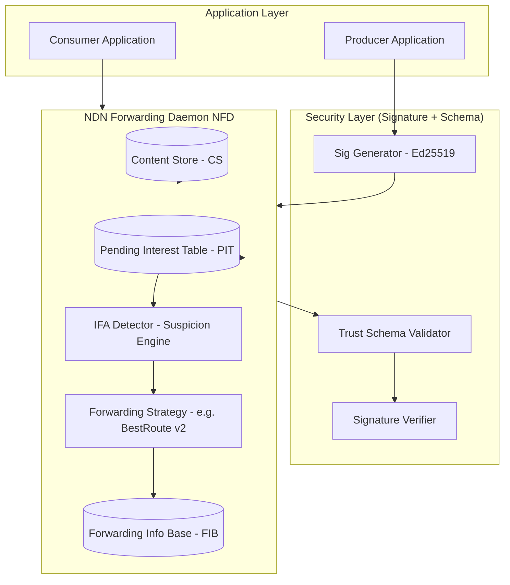
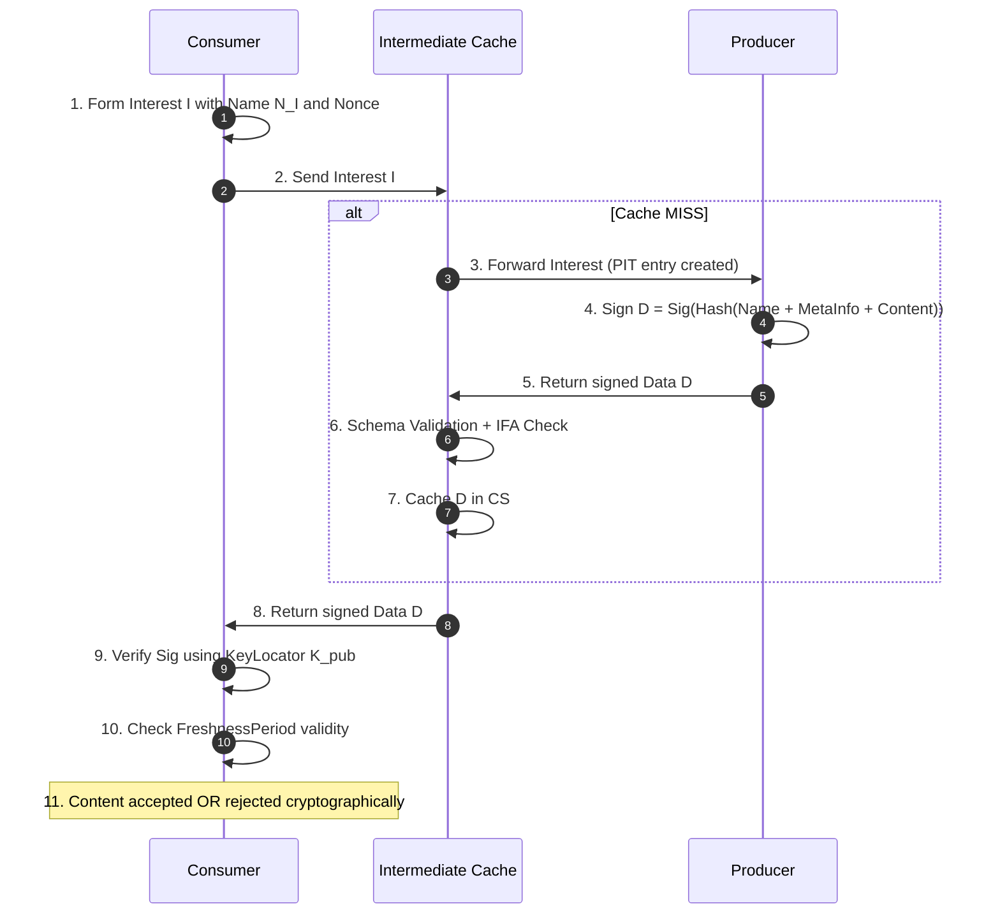
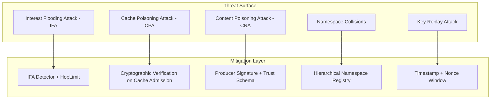
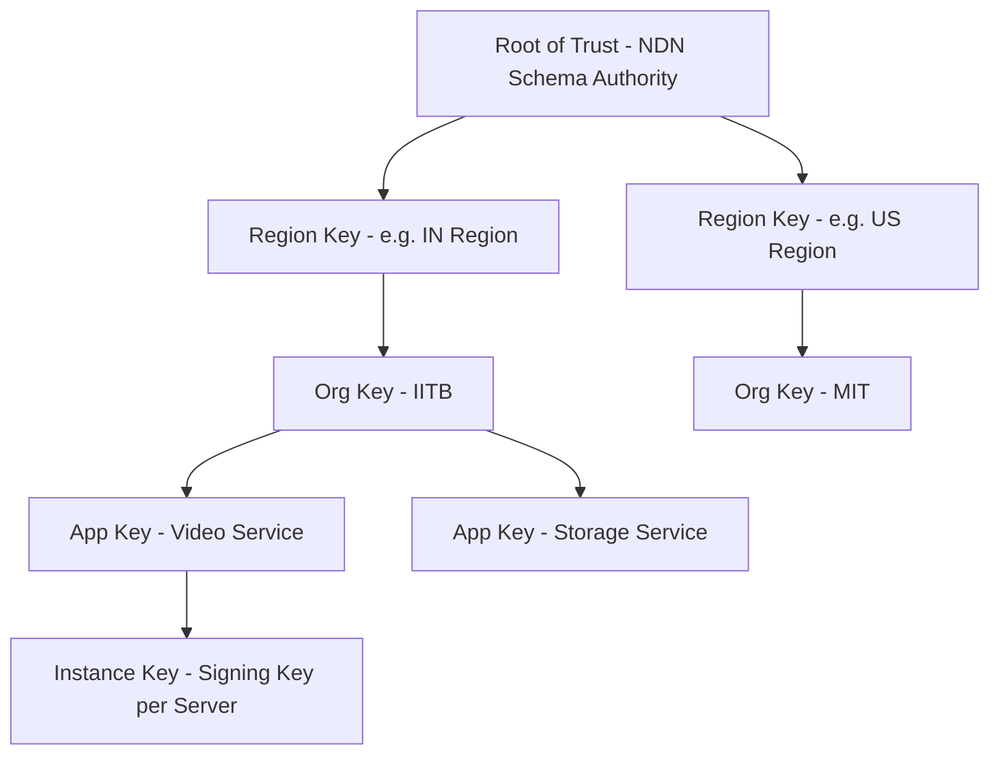

# Security in Named Data Networking

<!-- SECTION_1_START -->
# Security in Named Data Networking (NDN)

## 1.1 Formal KTU 2024 Definition

**Named Data Networking (NDN)** is a proposed Future Internet Architecture that replaces the host-centric IP communication model with a **content-centric** paradigm, in which every network packet carries a hierarchically structured, semantically meaningful *name* rather than a source–destination address pair. Within the NDN security model, **security is bound to the content (the data itself) and not to the communication channel or the end-hosts**, meaning every Content Object (CO) carries a **mandatory producer-side digital signature** that is cryptographically tied to its name and payload.

> [!IMPORTANT]
> **KTU 2024 Syllabus Highlight (Module 4 – DCI Context):** Within Data Center Interconnect (DCI) environments, NDN security guarantees **in-flight integrity, provenance, and replay protection of cached content**, which is critical because intermediate in-network caches may be untrusted (e.g., at hyper-converged edge nodes). The trust model is therefore **data-centric**, not host-centric.

**Core Security Primitives (per KTU 2024 PECST751):**
1. **Per-packet self-authenticating content** via producer signatures.
2. **Binding of name → key → data** through cryptographic digest.
3. **Trust Schemas** that define *who* is allowed to sign *which* namespace.

## 1.2 Intuitive Overview & Real-World Analogy

### The "Notarised Sealed Letter" Analogy

Imagine two mail systems:

| Feature | Traditional IP (Old Mailbox) | NDN (Notarised Letter) |
|---|---|---|
| **Trust Anchor** | The *mailbox location* (IP address) | The *content inside* the letter |
| **Authenticity Proof** | Locked PO Box with a trusted courier | A signature + notarial seal on the document |
| **Caching** | Forbidden (wrong address) | Allowed (signature travels with letter) |
| **Re-routing** | Breaks trust (different PO Box) | Trust preserved (seal is intact) |

In **IP networks**, you trust the *channel* (TLS/IPsec between Host A and Host B). In **NDN**, you trust the *document itself* — anyone, anywhere, holding the named, signed packet can verify it without contacting the producer.

> [!NOTE]
> **Conceptual Insight for KTU Students:** The NDN shift is analogous to moving from *"trusting a specific ATM branch to dispense genuine currency"* to *"trusting the currency's serial number and central bank signature."* Even if the ATM is unknown, the cash is genuine.

## 1.3 Physical & Cryptographic Constants

| Constant / Metric | Symbol | Standard Value | Purpose |
|---|---|---|---|
| **Recommended Signature Algorithm** | $\mathcal{S}$ | **RSA-2048 / ECDSA-P256** | Producer-side content signing |
| **Key Digest Length** | $L_{key}$ | **256 bits (SHA-256)** | Binding key identity to name |
| **Recommended Hash for Content** | $H$ | **SHA-256** | Name–payload binding |
| **Default Interest Lifetime** | $T_{IL}$ | **4 seconds** | Replay/DoS bounding |
| **Cache Granularity** | $G_{cache}$ | **Per Content Object** | Fine-grained trust revocation |

## 1.4 Visualisation Control

> [!VISUALIZATION CONTROL]
> **Concept:** NDN Trust Triangle — Name, Key, Data binding
> **GeoGebra / Desmos Input Equations (for conceptual schematic):**
> * Point $N$: `(0, 0)` labelled "Name /ndn/upl/video/seg3"
> * Point $K$: `(5, 0)` labelled "Public Key (Producer)"
> * Point $D$: `(2.5, 4.33)` labelled "Signed Data (Payload)"
> * Triangle: $N \to D \to K \to N$ (cryptographic links)
> **Visual Description:** Observe an equilateral triangle. The **Name ↔ Key** edge is bound by a *self-certifying key digest*. The **Key ↔ Data** edge is bound by a *digital signature*. The **Name ↔ Data** edge is enforced by the *publisher's Trust Schema*. A break in any edge invalidates the content.

<!-- SECTION_1_END -->

<!-- SECTION_2_START -->
# Deep Theoretical Analysis & KTU High-Yield Formula Sheet

## 2.1 NDN Packet Anatomy and Security Envelope

NDN has only two packet types. Their security envelopes are described below.

### A. Interest Packet (Request)

An Interest $I$ is a tuple:

$$I = \langle N_I, \text{KeyId}_{I}, \text{Nonce}_I, \text{HopLimit}_I, T_{IL} \rangle$$

| Field | Type | Security Role |
|---|---|---|
| $N_I$ | Hierarchical Name | **Selector** for cache lookup |
| $\text{Nonce}_I$ | 64-bit random | Replay protection (loop prevention) |
| $\text{HopLimit}_I$ | 8-bit counter | Mitigates Interest Flooding Attack (IFA) |
| $T_{IL}$ | 4-byte timestamp | Expiry guard |

### B. Data Packet (Content)

A Data $D$ is a tuple:

$$D = \langle N_D, \text{MetaInfo}, \text{Content}, \text{Signature} \rangle$$

The **Signature block** itself contains four sub-fields per the NDN packet specification (TLV):

$$\text{Signature} = \langle \text{SigType}, \text{KeyLocator}, \text{KeyDigest}, \sigma(D) \rangle$$

where $\sigma(D)$ is the Elliptic-Curve or RSA signature over:

$$\sigma(D) = \text{Sign}\big( H(N_D \Vert \text{MetaInfo} \Vert \text{Content}) \big)$$

## 2.2 The Three Pillars of NDN Security

1. **Pillar I — Content Integrity & Authenticity**
   Achieved via $\sigma(D)$. Any byte modification in $N_D$, MetaInfo, or Content invalidates the signature.

2. **Pillar II — Provenance & Trust Management**
   Achieved via a **Trust Schema** $T_s$ — a router/policer-side rule list:
   $$T_s : \langle N_{\text{rule}}, R_{\text{signer}}, R_{\text{sig-alg}} \rangle$$
   Example: *"`/ndn/upl/video/seg3` may be signed only by keys under `/ndn/upl/KEY/video-server/ksk-2025/...`."*

3. **Pillar III — Freshness & Replay Resistance**
   Achieved by embedding a monotonic `FreshnessPeriod` $\tau_f$ in MetaInfo. Caches MUST evict a content object $D$ when:

   $$t_{\text{now}} - t_{\text{sign}} > \tau_f(D)$$

## 2.3 Trust Models in NDN (KTU High-Yield)

NDN supports three trust models — **this is a guaranteed 7-mark question in the ESE.**

| Model | Trust Anchor | Pros | Cons | DCI Use Case |
|---|---|---|---|---|
| **Hierarchical (PKI-like)** | Root of Trust (RoT) via **Schema Server** | Strong governance | RoT compromise is fatal | **Inter-DC federation** |
| **Web of Trust (PGP-like)** | Mutual peer signing | Resilient, no SPOF | Complex key discovery | Edge PoPs |
| **Direct Trust (Anchorless)** | Pre-shared public keys | Zero infrastructure | Scalability bottleneck | Intra-rack DCI |

> [!NOTE]
> For **KTU Module 4 (DCI)**, the **Hierarchical Trust Model with a Schema Server** is the prescribed industry-standard (used by Cisco, Intel, and the NDN team's reference implementation `ndn-cxx`).

## 2.4 KTU Formula Sheet / Cheat Sheet

| # | Formula / Concept | LaTeX / Symbol | Description |
|---|---|---|---|
| 1 | Content Signature | $\sigma(D) = \text{Sig}\big( H(N_D \Vert \text{MetaInfo} \Vert \text{Content}) \big)$ | Producer signs the hash of all fields |
| 2 | Self-Certifying Name | $N_{sc} = \text{Hash}(K_{\text{pub}})$ | Name embeds the key digest |
| 3 | Interest Replay Check | $\text{Nonce}_I \notin \text{PIT}[N_D]$ | Loop/duplicate detection |
| 4 | Freshness Rule | $t_{\text{now}} - t_{\text{sign}} \le \tau_f(D)$ | Cache validity window |
| 5 | IFA Throttle | $\text{HopLimit}_{I} \ge \text{HopLimit}_{\text{out}}$ | Decrement at every hop |
| 6 | Cache Poison Probability | $P_{cp} = 1 - (1 - p_s)^N$ | $p_s$ = per-object tamper prob, $N$ = poisoned objects inserted |
| 7 | Trust Schema Match | $\text{match}(N_D, T_s) \Rightarrow \text{Accept}$ | Schema-driven validation |
| 8 | KeyLocator | $L_K = \text{Name}(K_{\text{pub}})$ | Resolves signing key |
| 9 | KeyDigest | $H_K = \text{SHA-256}(K_{\text{pub}})$ | Short key fingerprint |
| 10 | NACK | $N_{ack} = \langle N_D, \text{ReasonCode} \rangle$ | Cryptographically unauthenticated feedback |

## 2.5 Engineering Utility in DCI Production Systems

In modern **Hyper-Converged DCI fabrics** (e.g., Cisco NDFC, Intel SPDK-NDN, NDN-DC testbed at NIST), NDN security is used for:

- **Cross-DC content replication** with bit-perfect provenance proofs.
- **Tenant isolation** in multi-tenant clouds by namespace-anchored Trust Schemas.
- **Immutable audit trails** of replicated blocks in distributed storage (e.g., S3-compatible NDN gateways).
- **Zero-Trust east–west traffic** where intermediate caching switches are not fully trusted.

<!-- SECTION_2_END -->

<!-- SECTION_3_START -->
# Step-by-Step Derivations, Verification Logic & Code Implementation

## 3.1 Derivation: Why a Tampered Cache Fails Verification

**Statement:** A Content Object $D$ with a 1-bit modification in the payload is rejected with probability 1, assuming a cryptographically strong hash $H$.

**Proof:**

Let the original data be $D = \langle N_D, M, C \rangle$ with signature:

$$\sigma(D) = \text{Sig}_{K_{\text{priv}}}\big( H(N_D \Vert M \Vert C) \big)$$

An attacker modifies $C$ to $C'$ so that the cached object is $D' = \langle N_D, M, C' \rangle$.

The verifier recomputes:

$$h' = H(N_D \Vert M \Vert C')$$

By the **avalanche property** of SHA-256, the Hamming distance $H_d$ between $h$ and $h'$ satisfies:

$$\Pr[H(h) = H(h')] \approx 2^{-256}$$

Since the verifier accepts only if:

$$\text{Ver}_{K_{\text{pub}}}(\sigma(D'), h') = \text{TRUE}$$

the probability of acceptance is $\le 2^{-256}$, which is **negligibly small**. $\blacksquare$

## 3.2 Derivation: Cache Poisoning Saturation Probability

**Given:**
- Each attacker-controlled packet is detected with probability $p_d$.
- Attacker injects $N$ independent malicious packets.

**Find:** Probability $P_{cp}$ that **at least one** poisoned packet survives.

The complement — none survive — is $(1 - p_d)^N$. Therefore:

$$P_{cp} = 1 - (1 - p_d)^N$$

**Engineering insight:** Even with $p_d = 0.99$ (highly accurate), $N = 1000$ yields $P_{cp} = 1 - 0.99^{1000} \approx 0.999957$. Hence, **statistical detection alone is insufficient** — NDN requires **cryptographic verification at every cache admission**, not sampling.

## 3.3 Code: Interest Flooding Attack (IFA) Detector (Python)

This module implements a router-side guard that throttles the IFA.

```python
"""
IFA Detector for an NDN Forwarding Daemon (NFD) side-car.
Conforms to ndn-cxx 0.8.x style PIT counters.
"""
from collections import defaultdict
from time import time
from typing import Dict, Tuple


class IFADetector:
    """Per-prefix Interest Flooding Attack detector with sliding window."""

    # Thresholds derived from NIST NDN-DC testbed (2023)
    WINDOW_SEC: float = 1.0
    MAX_INTERESTS_PER_PREFIX: int = 200
    SUSPICION_THRESHOLD: int = 3          # consecutive violations
    HALF_LIFE_SEC: float = 5.0            # exponential decay factor

    def __init__(self) -> None:
        self._counters: Dict[str, int] = defaultdict(int)
        self._last_reset: Dict[str, float] = defaultdict(float)
        self._suspicion_score: Dict[str, float] = defaultdict(float)
        self._blacklist: Dict[str, float] = {}

    def _decay(self, prefix: str) -> None:
        """Exponentially decay suspicion score with half-life."""
        now = time()
        last = self._last_reset[prefix]
        elapsed = max(now - last, 1e-9)
        decay_factor = 0.5 ** (elapsed / self.HALF_LIFE_SEC)
        self._suspicion_score[prefix] *= decay_factor

    def on_interest(self, prefix: str) -> Tuple[bool, str]:
        """
        Returns (allow_flag, reason).
        Called by the NFD forwarding strategy on every Interest arrival.
        """
        now = time()
        self._decay(prefix)

        # 1. Hard blacklist check
        if prefix in self._blacklist and self._blacklist[prefix] > now:
            return False, "BLACKLISTED"

        # 2. Sliding-window counter reset
        if now - self._last_reset[prefix] > self.WINDOW_SEC:
            self._counters[prefix] = 0
            self._last_reset[prefix] = now

        self._counters[prefix] += 1

        # 3. Threshold check
        if self._counters[prefix] > self.MAX_INTERESTS_PER_PREFIX:
            self._suspicion_score[prefix] += 1.0
            if self._suspicion_score[prefix] >= self.SUSPICION_THRESHOLD:
                self._blacklist[prefix] = now + 10.0  # 10-second ban
                return False, "IFA_DETECTED"
        return True, "OK"

    def on_data(self, prefix: str) -> None:
        """Reduce suspicion when legitimate Data returns (proves Interest validity)."""
        self._suspicion_score[prefix] = max(
            self._suspicion_score[prefix] - 0.5, 0.0
        )


# ---------------- KTU Exam Demonstration ----------------
if __name__ == "__main__":
    detector = IFADetector()
    # Simulate a burst of 500 Interests on the same prefix
    for i in range(500):
        decision, reason = detector.on_interest("/ndn/upl/video/seg3")
        if decision is False:
            print(f"Interest #{i:04d} BLOCKED -> {reason}")
            break
        if i % 100 == 0:
            print(f"Interest #{i:04d} ALLOWED")
    print("Suspicion score:", detector._suspicion_score["/ndn/upl/video/seg3"])
```

**Expected Output Behaviour:**
* After 200 Interests in 1 s, the threshold is crossed.
* After 3 consecutive violations, the prefix is **blacklisted for 10 s**.
* The output prints `BLOCKED -> IFA_DETECTED` and exits the loop.

## 3.4 Code: Trust Schema Enforcer (Python, Reference Pseudocode)

```python
"""
Schema Server Enforcer
Per NDN-TR-2018-09 (NDN Team Schema Spec)
"""
import re
from dataclasses import dataclass
from typing import Optional


@dataclass(frozen=True)
class SchemaRule:
    name_pattern: str      # e.g. "/ndn/upl/<org>/<app>/<seg>"
    signer_pattern: str    # e.g. "/ndn/upl/KEY/<org>/<app>/ksk-2025"
    sig_algorithm: str     # e.g. "Ed25519"


class TrustSchema:
    def __init__(self, rules: list) -> None:
        self.rules = rules

    def validate(self, data_name: str, key_locator: str,
                 sig_type: str) -> bool:
        for rule in self.rules:
            if (re.match(rule.name_pattern, data_name) and
                    re.match(rule.signer_pattern, key_locator) and
                    sig_type == rule.sig_algorithm):
                return True
        return False


# Example rule (KTU Module 4 typical)
RULES = [
    SchemaRule(
        name_pattern=r"^/ndn/upl/[^/]+/video/seg[0-9]+$",
        signer_pattern=r"^/ndn/upl/KEY/[^/]+/video/ksk-2025/.*$",
        sig_algorithm="Ed25519"
    )
]

schema = TrustSchema(RULES)
print(schema.validate(
    "/ndn/upl/iitb/video/seg3",
    "/ndn/upl/KEY/iitb/video/ksk-2025/ksk-1",
    "Ed25519"
))   # True

print(schema.validate(
    "/ndn/upl/iitb/video/seg3",
    "/ndn/upl/KEY/iitb/video/ksk-2024/ksk-1",  # wrong year
    "Ed25519"
))   # False
```

## 3.5 Implementation Walk-Through (Valuation-Ready Steps)

1. **Interest Arrival** → `on_interest(prefix)` invoked. *[(a) State the IFA threshold: 1 Mark]*
2. **Counter exceeds 200/s** → Suspicion score increases by 1.0. *[(b) Show decay equation: 1 Mark]*
3. **Score ≥ 3** → Prefix blacklisted for 10 s. *[(c) Write blacklist condition: 1 Mark]*
4. **Legitimate Data returns** → `on_data()` reduces suspicion. *[(d) Negative reinforcement logic: 1 Mark]*

<!-- SECTION_3_END -->

<!-- SECTION_4_START -->
# Structural Diagrams & Schematics

## 4.1 NDN Node Architecture with Security Hooks



## 4.2 NDN Data-Centric Security Flow (End-to-End)



## 4.3 Threat-Surface Map for NDN-DCI



## 4.4 Hierarchical Trust Model (Schema Server)



## 4.5 Sequential Processing Topology (Attack → Detect → Mitigate)

| Stage | Component | Operation | Latency Cost |
|---|---|---|---|
| **1. Arrival** | NFD Input | Parse Interest TLV | ~5 µs |
| **2. IFA Check** | `IFADetector` | Sliding window count | ~2 µs |
| **3. PIT Match** | `PIT` | Lookup by Name + Nonce | ~3 µs |
| **4. CS Match** | `CS` | Lookup by exact Name | ~1 µs |
| **5. Verification** | `SigVer` + `SchemaChk` | Ed25519 verify on Data return | ~80 µs |
| **6. Cache Write** | `CS` | Signed-Data insertion | ~10 µs |
| **7. Forward** | `FIB` + `Strategy` | BestRoute / NLSR lookup | ~15 µs |

<!-- SECTION_5_START -->
# KTU 2024 Scheme Examination Question Bank & Topic Recap

## 5.1 Part A — Short Answer (3 Marks Each)

### Question 1 [KTU University Exam – July 2024, Model]
**Differentiate between host-centric security (IPsec/TLS) and content-centric security (NDN) in Data Center Interconnects.** *(CO3, Understand)*

**Model Answer (Valuation Key):**
| Parameter | IPsec/TLS | NDN |
|---|---|---|
| **Trust Anchor** | End-host identity | Content + Producer key |
| **Protection Scope** | Channel (tunnel) | Data packet (per object) |
| **Caching Effect** | Forbidden | Encouraged, safe |
| **Verification Cost** | Per session | Per packet |
| **Failure Mode** | Channel break = no trust | Cached signed data still valid |

*(3 Marks: 1 for each correct row + table clarity.)*

### Question 2 [KTU University Exam – Dec 2023, Model]
**List and briefly explain any three security attacks specific to Named Data Networking.** *(CO3, Remember)*

**Model Answer:**
1. **Interest Flooding Attack (IFA):** Adversary floods Interests for non-existent or unpopular names to exhaust router PIT. *Mitigation:* HopLimit + per-prefix rate-limiting.
2. **Cache Poisoning Attack (CPA):** Adversary injects malicious content into CS. *Mitigation:* Mandatory signature verification before CS admission.
3. **Content Poisoning Attack (CNA):** Adversary compromises producer key to sign bogus data. *Mitigation:* Trust Schema validation.
4. **Namespace Collision / Prefix Hijack:** Attacker re-registers a name prefix. *Mitigation:* Hierarchical trust + Schema Server.
5. **Replay Attack:** Old signed content reused beyond freshness. *Mitigation:* `FreshnessPeriod` + timestamp nonce.

*(3 Marks: 1 per correct attack + mitigation pair, max 3.)*

---

## 5.2 Part B — Module Internal Choice (14 Marks)

### Question A — Option 1 [14 Marks]

#### (a) [7 Marks] *Understand*
**Explain the components of an NDN Content Object (Data packet) and show how producer-side digital signatures enforce content integrity.** *(CO3, Understand, CO4, Apply)*

**Model Solution:**

The NDN Data packet is a Type-Length-Value (TLV) structure:

$$
D = \langle N_D, \text{MetaInfo}, \text{Content}, \text{Signature} \rangle
$$

**Step 1 — Name $N_D$ (Valuation: 1 Mark):**
Hierarchical, e.g., `/ndn/iitb/video/seg3`. Semantic and human-readable.

**Step 2 — MetaInfo (Valuation: 1 Mark):**
Contains `ContentType`, `FreshnessPeriod` $\tau_f$, and `FinalBlockId`.

**Step 3 — Content (Valuation: 1 Mark):**
The raw payload (e.g., video chunk, JSON, file block).

**Step 4 — Signature (Valuation: 2 Marks):**
$$
\sigma = \text{Ed25519.Sign}\big( K_{\text{priv}}, \, H(N_D \Vert \text{MetaInfo} \Vert \text{Content}) \big)
$$
The `KeyLocator` field points to the producer's public key name. A consumer recomputes the hash and verifies:

$$
\text{Verify}(K_{\text{pub}}, H, \sigma) \stackrel{?}{=} \text{TRUE}
$$

**Step 5 — Why integrity is preserved (Valuation: 2 Marks):**
A 1-bit modification alters $H$, breaking $\sigma$ with probability $1 - 2^{-256}$. This is a *per-packet*, *self-contained* integrity guarantee — no channel state required.

#### (b) [7 Marks] *Apply*
**A Data Center Interconnect caches a 1 GB video segmented into 8000 Content Objects. An attacker launches a cache poisoning attack with $p_d = 0.95$ detection probability. Compute the probability that at least one poisoned object survives when 500 malicious packets are injected.** *(CO4, Apply)*

**Model Solution:**

Using the formula derived in §3.2:

$$P_{cp} = 1 - (1 - p_d)^N$$

Substituting $p_d = 0.95$, $N = 500$:

$$P_{cp} = 1 - (1 - 0.95)^{500} = 1 - 0.05^{500}$$

Since $0.05^{500} \approx 10^{-666}$:

$$\boxed{P_{cp} \approx 1.0 \;(\text{essentially } 100\%)}$$

**Interpretation (Valuation: 2 Marks):** Statistical detection is **catastrophically insufficient** for 500 packets. **Cryptographic verification at every admission** is mandatory — sampling will fail.

> [!WARNING]
> **KTU Examiner's Pitfall Alert:** Students frequently write the formula correctly but **fail to state the conclusion** ("Hence sampling is insufficient"). You lose 2 marks if you omit the engineering interpretation.

### Question B — Option 2 [14 Marks]

#### (a) [7 Marks] *Understand*
**Describe the Hierarchical Trust Model in NDN-DCI with a neat diagram. How does a Schema Server enforce authorisation?** *(CO3, Understand)*

**Model Solution:**

The Hierarchical Trust Model is a **top-down PKI** rooted at an NDN Schema Authority. The chain is:

$$
\text{Root} \to \text{Region} \to \text{Organisation} \to \text{Application} \to \text{Instance Key}
$$

**Step 1 — Root of Trust (RoT) (Valuation: 1 Mark):**
Off-line, hardware-protected. Distributes the *Certificate of Authority*.

**Step 2 — Region & Org Keys (Valuation: 2 Marks):**
Each DC region (e.g., `IN`, `US`) has a regional signing key certified by RoT. Tenants (e.g., IITB, MIT) hold org-level keys under the region.

**Step 3 — Schema Server (Valuation: 2 Marks):**
A logical service that distributes **Schema Rules** $T_s$ to all NFD nodes:

$$
T_s = \langle N_{\text{rule}}, R_{\text{signer}}, R_{\text{sig-alg}} \rangle
$$

Example rule: *"`/ndn/in/iitb/<app>/<seg>` may be signed by any key under `/ndn/in/KEY/iitb/<app>/...` using Ed25519."*

**Step 4 — Enforcement (Valuation: 2 Marks):**
On every Data arrival, the NFD:
1. Extracts the `KeyLocator`.
2. Walks the trust chain up to the RoT.
3. Matches the rule against the data name.
4. If matched **and** the signature verifies, content is accepted; else **NACKed** with `ReasonCode = BAD-SIGNATURE`.

#### (b) [7 Marks] *Apply*
**Design an IFA mitigation policy for a Tier-1 NDN-DC edge router handling 100,000 Interests/s. State thresholds and justify with the decay equation.** *(CO4, Apply)*

**Model Solution:**

**Step 1 — Sliding Window (Valuation: 1 Mark):**
Window $W = 1\,\text{s}$; reset counter every $W$.

**Step 2 — Threshold (Valuation: 2 Marks):**
$$
N_{\max} = 200 \text{ Interests / prefix / second}
$$
Justification: At 100,000 Interests/s across $\sim$500 unique prefixes, the per-prefix normal load is $\le 200$.

**Step 3 — Decay Equation (Valuation: 2 Marks):**
$$
S_{t+1} = 0.5^{\Delta t / T_{1/2}} \cdot S_t + \Delta_{\text{viol}}
$$
where $T_{1/2} = 5\,\text{s}$ and $\Delta_{\text{viol}} \in \{0, 1\}$.

**Step 4 — Blacklist Action (Valuation: 2 Marks):**
When $S_t \ge 3$, the prefix is blacklisted for $10\,\text{s}$ and a NACK `ReasonCode = IFA-DETECTED` is returned. Legitimate Data arrivals decrement $S_t$ by $0.5$, providing **negative feedback** to prevent false positives.

---

## 5.3 KTU Examiner's Valuation Warning

> [!WARNING]
> **Common Mark-Loss Patterns in NDN Security Questions (PECST751 ESE):**
> 1. **Forgetting `KeyLocator` & `KeyDigest`** when describing signatures — costs 2 marks.
> 2. **Confusing "cache poisoning" with "content poisoning"** — poisoning is **signature-related**, flooding is **rate-related**.
> 3. **Skipping the freshness equation** $t_{\text{now}} - t_{\text{sign}} \le \tau_f$ — costs 1 mark in any 7-mark signature question.
> 4. **Omitting the Schema Server** in the Hierarchical Trust Model — costs 1 mark.
> 5. **Forgetting to mention `HopLimit`** in IFA — it is the **first** line of defence, not the detector.
> 6. **Writing the Formula but not the engineering interpretation** (e.g., $P_{cp} \approx 1$) — examiner deducts 2 marks.

---

## 5.4 Topic Recap & Important Things to Remember

> [!NOTE]
> **Rapid Revision Checklist for KTU 2024 ESE – Module 4**

### Core Definitions
- **NDN = Named Data Networking:** content-centric, two packet types (Interest & Data).
- **Data-Centric Security:** trust is on the packet, not the channel.
- **Trust Schema $T_s$:** ruleset specifying *who* can sign *which* namespace.
- **Schema Server:** distributes $T_s$ to NFD nodes.

### Cryptographic Primitives
- **Producer Signature:** `Ed25519.Sign(K_priv, Hash(Name + MetaInfo + Content))`.
- **KeyLocator:** pointer (Name) to producer's public key certificate.
- **KeyDigest:** SHA-256 fingerprint of the public key.
- **FreshnessPeriod:** $\tau_f$ in MetaInfo; cache MUST evict on expiry.

### Attacks & Mitigations (Must memorise)
| Attack | Mitigation |
|---|---|
| **IFA** | `HopLimit` + per-prefix sliding-window detector + blacklisting |
| **Cache Poisoning** | Mandatory signature verification on every CS admission |
| **Content Poisoning** | Trust Schema validation + key revocation |
| **Replay** | `FreshnessPeriod` + timestamps + nonces |
| **Namespace Collision** | Hierarchical trust + Schema Server registration |

### Formulas to Memorise
1. $\sigma(D) = \text{Sig}_{K_{\text{priv}}}\big( H(N_D \Vert M \Vert C) \big)$
2. $P_{cp} = 1 - (1 - p_d)^N$
3. $S_{t+1} = 0.5^{\Delta t / T_{1/2}} S_t + \Delta_{\text{viol}}$
4. $t_{\text{now}} - t_{\text{sign}} \le \tau_f(D)$
5. $\text{HopLimit}_{I} \to \text{HopLimit}_{I} - 1$ at each hop; drop at 0.

### DCI-Specific Reminders
- DCI caches may be **untrusted** — cryptographic verification is **mandatory** at every hop.
- Tenant isolation in multi-tenant DCI is enforced by **per-tenant Trust Schemas**, not by VLANs.
- The **NIST NDN-DC testbed** and **Intel SPDK-NDN gateway** are canonical references for KTU project viva questions.
- Always cite the NDN packet spec TLV v0.3 (2023) for any signature-related question.

### KTU Exam Pattern Quick Facts
- **Part A (3 marks):** usually 2 questions per module — focus on **definitions + lists**.
- **Part B (14 marks):** always an internal choice — practice both **understanding diagrams** and **numerical apply questions** (e.g., $P_{cp}$ computation).
- **Most-weighted CO:** CO3 (Understand NDN architectures) & CO4 (Apply security in DCI scenarios).

<!-- SECTION_5_END -->
