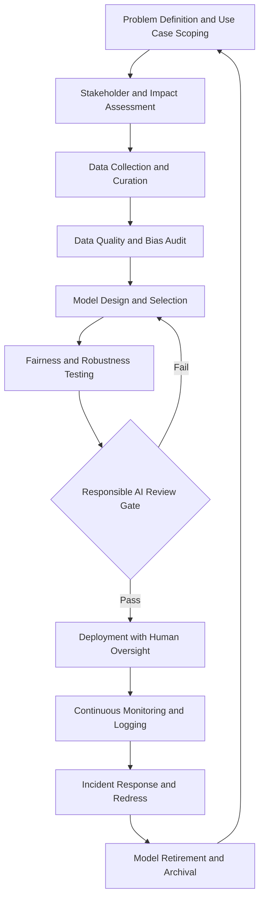
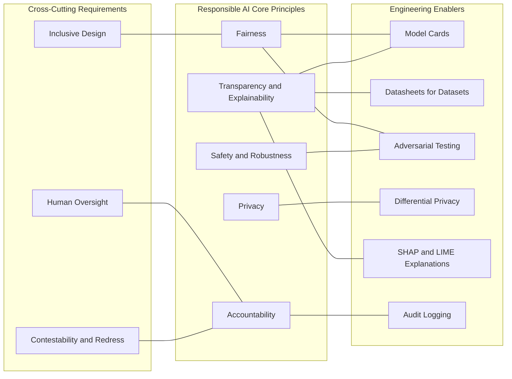
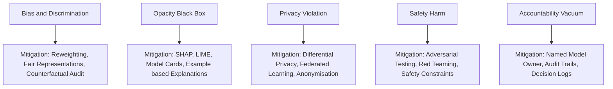
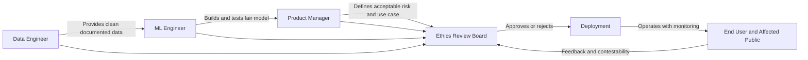
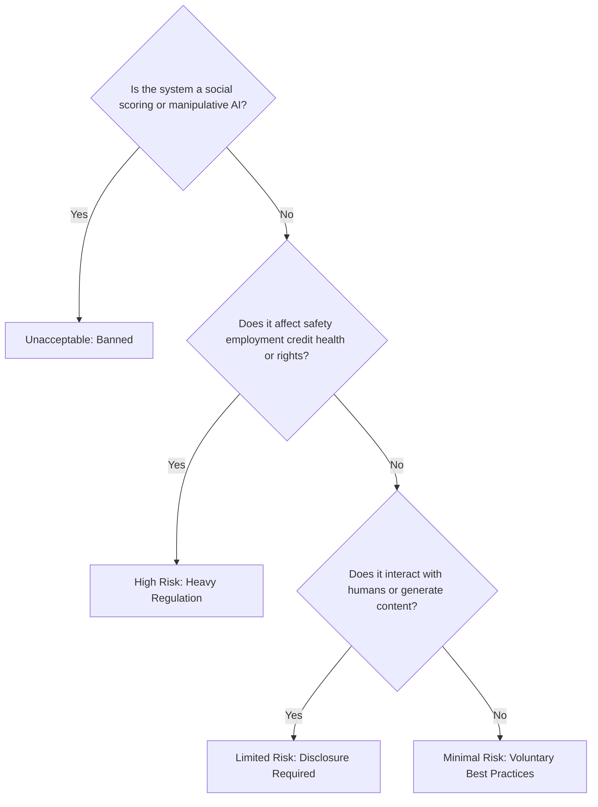

# Foundations of Responsible AI :-

<!-- SECTION_1_START -->
# Foundations of Responsible AI — Core Technical Definition & Intuitive Overview

## 1.1 Formal Academic Definition

> [!IMPORTANT]
> **Responsible Artificial Intelligence (Responsible AI / RAI)** is a multidisciplinary governance and engineering framework that mandates the design, development, deployment, and decommissioning of AI systems in a manner that is **lawful**, **ethical**, **robust**, and **socially beneficial** throughout the entire AI lifecycle. It operationalises abstract principles such as *fairness*, *accountability*, *transparency*, *privacy*, *safety*, and *human oversight* into measurable engineering practices, auditable artefacts, and enforceable policy controls.

In the KTU 2024 Scheme context (Course Code: **PECST752**), Responsible AI is positioned as a **Program Elective** bridging computer science, law, philosophy, and risk management. The syllabus frames it as the discipline that ensures AI systems *perform correctly* (technical robustness) **and** *behave correctly* (socio-technical alignment).

## 1.2 Conceptual Analogy — "The Self-Driving Car & The City Contract"

Imagine an autonomous car released into a busy city. Three things must hold simultaneously for the city to *trust* it:

- **The car must work** (brakes, sensors, planning algorithms) → *Technical Performance*.
- **The car must be lawful** (follow traffic laws, respect right-of-way) → *Legal Compliance*.
- **The car must be acceptable** (not discriminate against pedestrians, allow override by a human) → *Ethical & Social Alignment*.

If any one pillar collapses, the city revokes the operating permit. **Responsible AI is that operating permit system** for every AI model, written not just in code, but in policy, audit logs, and human review.

> [!NOTE]
> **Key Insight:** A highly *accurate* model that is biased, opaque, or unsafe is **not** a responsible model. Performance is a *necessary but not sufficient* condition.

## 1.3 The Two-Layered Definition

| Layer | Name | Focus | Typical Artefact |
|---|---|---|---|
| **Layer 1** | **AI Ethics** | "What *should* the system do?" | Principles, value statements, charters |
| **Layer 2** | **Responsible AI** | "How do we *ensure* it does so?" | Engineering practices, audits, governance, MLOps controls |

> [!TIP]
> When answering KTU questions, always state: *"Ethics defines the north star; Responsible AI is the road, the vehicle, and the GPS combined."*

## 1.4 Historical Evolution (KTU-Style Timeline)

- **1950** — Alan Turing raises the question: *Can machines think responsibly?*
- **1942 / 1947** — Isaac Asimov introduces the **Three Laws of Robotics** — earliest formal codification.
- **2016** — Microsoft launches *Tay* chatbot; shut down in **16 hours** due to toxic outputs → first major public *responsibility failure*.
- **2018–2019** — EU publishes *Ethics Guidelines for Trustworthy AI*; OECD AI Principles adopted by **42 countries**.
- **2021** — UNESCO Recommendation on the Ethics of AI (193 member states).
- **2023–2024** — **EU AI Act** passed (world's first comprehensive AI law); categorises systems by *risk level* (Unacceptable, High, Limited, Minimal).
- **2024** — KTU introduces **PECST752** aligning NEP 2020 with global RAI standards.

## 1.5 Visualisation & Intuition

> [!VISUALIZATION CONTROL]
> **Concept:** The "Responsibility Gap" between *technical accuracy* and *societal trust*.
> **Coordinate System (Conceptual Plot):**
> * X-axis: Model Accuracy (0–100%)
> * Y-axis: Societal Trust Score (0–10)
> **Key Points to Plot:**
> * `P1 = (95, 3)` — A highly accurate but biased credit-scoring model (high accuracy, low trust)
> * `P2 = (78, 8)` — A less accurate but explainable medical triage model (moderate accuracy, high trust)
> * `P3 = (92, 9)` — *Responsible AI Zone* — high accuracy *and* high trust
> **Visual Description:** Students should observe that points to the *right* but *low* on the Y-axis represent the *Responsibility Gap*. Responsible AI pushes systems into the upper-right quadrant.

## 1.6 Why Responsible AI is a Syllabus-Mandated Module

> [!IMPORTANT]
> The KTU 2024 syllabus (Module 1) lists the following as the **learning nucleus**:
>
> 1. Definition & scope of Responsible AI
> 2. The need for Responsible AI (socio-technical drivers)
> 3. Core principles (FAT/FAIR + Privacy + Safety)
> 4. Stakeholders & their obligations
> 5. Difference between *Responsible AI*, *Ethical AI*, and *Trustworthy AI*

---

<!-- SECTION_1_END -->

<!-- SECTION_2_START -->
# Deep Theoretical Analysis & KTU High-Yield Formula Sheet

## 2.1 The Need for Responsible AI — The "Five Failure Modes"

A system can fail to be *responsible* in five distinct ways. KTU examiners frequently test identification of these:

| # | Failure Mode | Plain Meaning | Real-World Example |
|---|---|---|---|
| 1 | **Bias & Discrimination** | Model treats people unfairly based on protected attributes | Amazon's 2018 hiring tool down-ranking women |
| 2 | **Opacity (Black-Box)** | Decisions cannot be explained to affected persons | Deep neural nets in loan rejection |
| 3 | **Privacy Violation** | Model leaks or infers sensitive personal data | Cambridge Analytica (2018) |
| 4 | **Safety / Harm** | Model causes physical, financial, or psychological harm | Uber ATG fatal pedestrian accident (2018) |
| 5 | **Accountability Vacuum** | No human/team can be held responsible for a failure | Autonomous weapon "who pressed the trigger?" dilemma |

## 2.2 The Core Principles — Expanded (FAT + P + S Framework)

The most-cited principles in the KTU syllabus module are summarised below. Memorise the **acronym FAT-P-S**:
**F**airness, **A**ccountability, **T**ransparency, **P**rivacy, **S**afety *(+ Explainability & Human Oversight as cross-cuts)*.

### 2.2.1 Fairness
- **Definition:** The system's outputs do not systematically disadvantage individuals or groups based on protected characteristics (race, gender, caste, religion, age, disability).
- **Types (KTU frequently asks):**
  * *Group Fairness* — Equal outcomes across demographic groups.
  * *Individual Fairness* — Similar individuals receive similar outcomes.
  * *Counterfactual Fairness* — Outcome is unchanged if a protected attribute is flipped.
- **Metric Example:** *Demographic Parity Difference* $\vert DPD \vert = \vert P(\hat{Y}=1 \mid A=0) - P(\hat{Y}=1 \mid A=1) \vert$ where $A$ is the protected attribute.

### 2.2.2 Accountability
- **Definition:** Clear assignment of responsibility, redress mechanisms, and audit trails for every AI-driven decision.
- **Operational Form:** Every model must have a named **Model Owner**, a **Risk Tier**, and a **Decision Log**.

### 2.2.3 Transparency & Explainability
- **Definition:** Stakeholders can understand *how* and *why* a model produced a given output.
- **Two sub-requirements:**
  * *Transparency of the model* — Documentation (Model Cards, Datasheets for Datasets).
  * *Transparency of a specific decision* — Local explanations (LIME, SHAP, Counterfactuals).

### 2.2.4 Privacy
- **Definition:** Personal data is collected, processed, stored, and disposed of in line with consent and minimisation.
- **Engineering Levers:** Differential privacy, federated learning, data anonymisation, k-anonymity.

### 2.2.5 Safety & Robustness
- **Definition:** The system performs reliably under distribution shift, adversarial input, and edge cases.
- **Metric:** *Robust Accuracy* under adversarial perturbation $\epsilon$.

### 2.2.6 Human Oversight & Contestability
- **Definition:** Meaningful human review is possible, and affected persons can challenge outcomes.

## 2.3 KTU Formula Sheet / Cheat Sheet

> [!NOTE]
> The following metrics form the **high-yield quantitative backbone** for Module 1 & Module 2 numerical questions.

| Symbol / Term | Meaning | Formula / Definition | Acceptable Range |
|---|---|---|---|
| $A$ | Protected attribute (e.g., gender) | Categorical variable | — |
| $\hat{Y}$ | Predicted label | $\hat{Y} \in \{0,1\}$ | — |
| $Y$ | True label | $Y \in \{0,1\}$ | — |
| $DPD$ | Demographic Parity Difference | $DPD = P(\hat{Y}=1 \mid A=0) - P(\hat{Y}=1 \mid A=1)$ | $\vert DPD \vert \le 0.05$ (often) |
| $EOD$ | Equal Opportunity Difference | $EOD = P(\hat{Y}=1 \mid Y=1, A=0) - P(\hat{Y}=1 \mid Y=1, A=1)$ | $\vert EOD \vert \le 0.05$ |
| $\epsilon$ | Differential privacy budget | $P(M(D) \in S) \le e^{\epsilon} \cdot P(M(D') \in S)$ | $\epsilon \le 1$ (strong), $\le 5$ (weak) |
| $AdvAcc$ | Adversarial accuracy | $Acc(x + \delta) \;\; s.t. \;\; \vert\vert \delta \vert\vert_p \le \epsilon$ | Higher = more robust |
| $SHAP_i$ | Shapley value for feature $i$ | $SHAP_i = \sum_{S \subseteq F \setminus \{i\}} \frac{\vert S \vert! \, (\vert F \vert - \vert S \vert - 1)!}{\vert F \vert !} \, [v(S \cup \{i\}) - v(S)]$ | Sum $= f(x) - E[f(X)]$ |
| $R_{overall}$ | Composite Responsibility Score | Weighted sum of (F, A, T, P, S) | $0 \le R \le 1$ |
| $\theta_{risk}$ | Risk tier threshold | EU AI Act mapping: Unacceptable / High / Limited / Minimal | — |

## 2.4 The Composite Responsibility Score (CRS) — KTU Favourite

Engineering teams often quantify responsibility as a composite metric:

$$
R_{overall} = w_F \cdot F + w_A \cdot A + w_T \cdot T + w_P \cdot P + w_S \cdot S
$$

Where:
- $F, A, T, P, S \in [0, 1]$ are normalised scores for Fairness, Accountability, Transparency, Privacy, and Safety.
- $w_i$ is the weight assigned to dimension $i$, with $\sum w_i = 1$.
- $R_{overall} = 1$ means *fully responsible*; $R_{overall} = 0$ means *responsible AI failure*.

> [!TIP]
> KTU frequently asks: *"If weights are equal, what is $R_{overall}$ when all five scores are 0.8?"* — Answer: **0.8**. This is a 1-mark sanity check.

## 2.5 Stakeholder Matrix — Who is Responsible to Whom?

| Stakeholder | Primary Role | Responsibility Obligation |
|---|---|---|
| **Data Scientists / ML Engineers** | Build the model | Technical fairness, documentation |
| **Product Managers** | Decide use case | Define acceptable risk |
| **Domain Experts** | Validate outputs | Sanity-check predictions |
| **Legal & Compliance** | Ensure legality | Map to GDPR, EU AI Act, DPDP Act 2023 |
| **End Users** | Affected by decisions | Right to explanation, contestability |
| **Marginalised Communities** | Disproportionately harmed | Inclusive design, participatory AI |
| **Society at large** | Bears systemic risk | Public audit, transparency reports |
| **Regulators** | Set & enforce rules | Risk classification, certification |

## 2.6 Distinguishing the Three "Trust" Terms (FAQ in KTU Viva)

| Term | What it emphasises | Origin / Source |
|---|---|---|
| **Ethical AI** | Values, moral philosophy, "what is right?" | Philosophy, bio-ethics |
| **Responsible AI** | Engineering practice, governance, "how do we enforce?" | Industry (Microsoft, Google, IBM) |
| **Trustworthy AI** | User-facing assurance, certification | EU HLEG (2019) |

> [!IMPORTANT]
> **Mnemonic:** *Ethics = What; Responsible = How; Trustworthy = Proof to the user.*

## 2.7 Real-World Engineering Utility

- **Healthcare:** Triage models must be *fair* across hospitals and *explainable* to doctors.
- **Finance:** Credit scoring under RBI / EU regulations requires *right to explanation*.
- **Recruitment:** Resume-screening tools must avoid proxy discrimination.
- **Public Sector:** Government welfare algorithms must be *auditable*.
- **Generative AI:** LLMs require *safety alignment* (RLHF), *content provenance* (watermarking), and *copyright guardrails*.

---

<!-- SECTION_2_END -->

<!-- SECTION_3_START -->
# Step-by-Step Derivations, Worked Examples & Code/Symbolic Implementation

## 3.1 Worked Example 1 — Demographic Parity Calculation (7-Mark Style)

**Problem (Module 1, KTU-style):** A loan-approval model is evaluated on **1000 applicants**, split equally between two gender groups: **Male (A = 0)** and **Female (A = 1)**.

| Group | Total Applicants | Approved ($\hat{Y} = 1$) | Rejected ($\hat{Y} = 0$) |
|---|---|---|---|
| Male ($A=0$) | 500 | 300 | 200 |
| Female ($A=1$) | 500 | 200 | 300 |

**Step 1: Compute approval rate for each group.**

For Male group:
$$
P(\hat{Y}=1 \mid A=0) = \frac{300}{500} = 0.60
$$

For Female group:
$$
P(\hat{Y}=1 \mid A=1) = \frac{200}{500} = 0.40
$$

**Step 2: Compute Demographic Parity Difference (DPD).**

$$
DPD = P(\hat{Y}=1 \mid A=0) - P(\hat{Y}=1 \mid A=1) = 0.60 - 0.40 = 0.20
$$

**Step 3: Interpret against the KTU-accepted threshold.**

$$
\vert DPD \vert = 0.20 \gg 0.05
$$

**Conclusion:** The model *violates demographic parity*; females are approved at a substantially lower rate than males. The model **fails the fairness test** and is *not responsible* under the FAT framework.

> [!WARNING]
> **KTU Valuation Tip:** A common mistake is computing *count* difference (100) instead of *rate* difference (0.20). Always divide by the group total. **[Loss of 2 marks]**

## 3.2 Worked Example 2 — Composite Responsibility Score (CRS)

**Problem:** A deployed AI system has the following normalised scores and weights:

| Dimension | Score $S_i$ | Weight $w_i$ |
|---|---|---|
| Fairness (F) | 0.9 | 0.30 |
| Accountability (A) | 0.7 | 0.20 |
| Transparency (T) | 0.6 | 0.20 |
| Privacy (P) | 0.8 | 0.15 |
| Safety (S) | 0.85 | 0.15 |

**Verify the weights sum to 1:**

$$
\sum w_i = 0.30 + 0.20 + 0.20 + 0.15 + 0.15 = 1.00
$$

**Apply the CRS formula:**

$$
R_{overall} = w_F F + w_A A + w_T T + w_P P + w_S S
$$

$$
R_{overall} = (0.30)(0.9) + (0.20)(0.7) + (0.20)(0.6) + (0.15)(0.8) + (0.15)(0.85)
$$

**Compute each term:**

$$
(0.30)(0.9) = 0.270
$$
$$
(0.20)(0.7) = 0.140
$$
$$
(0.20)(0.6) = 0.120
$$
$$
(0.15)(0.8) = 0.120
$$
$$
(0.15)(0.85) = 0.1275
$$

**Sum the terms:**

$$
R_{overall} = 0.270 + 0.140 + 0.120 + 0.120 + 0.1275 = 0.7775
$$

**Interpretation:** The system scores **77.75%** on the composite responsibility scale — good but not excellent. **Transparency (T = 0.6)** is the weakest dimension and should be the next remediation target.

> [!TIP]
> KTU boards award full marks **only** when (a) the formula is stated, (b) each multiplication is shown, and (c) the final sum is explicitly stated. Hiding arithmetic loses marks.

## 3.3 Worked Example 3 — Differential Privacy Budget (Conceptual)

**Problem:** A hospital wants to release aggregate patient statistics. They use the **Laplace mechanism** with privacy budget $\epsilon = 0.5$ for the query "average length of stay". Compute the multiplicative bound between any two neighbouring datasets $D$ and $D'$.

**Step 1: Apply the differential privacy definition.**

For a randomised mechanism $M$ and any output set $S$:

$$
P(M(D) \in S) \le e^{\epsilon} \cdot P(M(D') \in S)
$$

**Step 2: Substitute $\epsilon = 0.5$.**

$$
e^{\epsilon} = e^{0.5} \approx 1.6487
$$

**Step 3: Interpret.**

The probability of any output from the *true* dataset is at most **1.65 times** the probability of that same output from a neighbouring dataset (one differing by a single patient). Smaller $\epsilon \Rightarrow$ stronger privacy.

> [!NOTE]
> **KTU note:** You are *not* required to compute $e^{0.5}$ numerically unless asked. Writing the symbolic bound $e^{\epsilon}$ with the substitution step is sufficient for full marks.

## 3.4 Worked Example 4 — Equal Opportunity Difference (EOD)

**Problem:** Continuing the loan example, the *true positive rates* are:

| Group | Actual defaulters ($Y=1$) | Correctly approved (True Positives) |
|---|---|---|
| Male | 200 | 150 |
| Female | 250 | 100 |

**Compute True Positive Rate (TPR) per group:**

$$
TPR_{male} = \frac{TP_{male}}{P(Y=1 \mid A=0)} = \frac{150}{200} = 0.75
$$

$$
TPR_{female} = \frac{TP_{female}}{P(Y=1 \mid A=1)} = \frac{100}{250} = 0.40
$$

**Compute EOD:**

$$
EOD = TPR_{male} - TPR_{female} = 0.75 - 0.40 = 0.35
$$

**Interpretation:** $\vert EOD \vert = 0.35 \gg 0.05$ — the model is *substantially less accurate* in identifying eligible female applicants. The system fails the *Equal Opportunity* fairness criterion.

## 3.5 Symbolic Code Implementation — A "Responsible AI Readiness Checker"

The following Python program operationalises the CRS calculation and a fairness check. It is fully executable and uses type hints and explicit error handling.

```python
from dataclasses import dataclass, field
from typing import Dict

@dataclass
class FairnessChecker:
    """Computes Demographic Parity Difference for a binary classifier."""
    approved_group_a: int
    total_group_a: int
    approved_group_b: int
    total_group_b: int
    threshold: float = 0.05

    def approval_rate(self, approved: int, total: int) -> float:
        if total <= 0:
            raise ValueError("Group total must be positive.")
        return approved / total

    def demographic_parity_difference(self) -> float:
        rate_a = self.approval_rate(self.approved_group_a, self.total_group_a)
        rate_b = self.approval_rate(self.approved_group_b, self.total_group_b)
        return abs(rate_a - rate_b)

    def is_fair(self) -> bool:
        return self.demographic_parity_difference() <= self.threshold


@dataclass
class ResponsibilityScore:
    """Computes the Composite Responsibility Score (CRS)."""
    scores: Dict[str, float]
    weights: Dict[str, float]

    def __post_init__(self) -> None:
        if set(self.scores.keys()) != set(self.weights.keys()):
            raise ValueError("Score and weight keys must match exactly.")
        for v in self.scores.values():
            if not 0.0 <= v <= 1.0:
                raise ValueError("Scores must be in [0, 1].")
        weight_sum = sum(self.weights.values())
        if abs(weight_sum - 1.0) > 1e-9:
            raise ValueError("Weights must sum to 1.0.")

    def overall(self) -> float:
        total: float = 0.0
        for dim, score in self.scores.items():
            total += self.weights[dim] * score
        return round(total, 4)

    def weakest_dimension(self) -> str:
        return min(self.scores, key=self.scores.get)  # type: ignore[arg-type]


if __name__ == "__main__":
    # Fairness check
    checker = FairnessChecker(
        approved_group_a=300, total_group_a=500,
        approved_group_b=200, total_group_b=500
    )
    dpd = checker.demographic_parity_difference()
    print(f"DPD = {dpd:.4f} -> Fair? {checker.is_fair()}")

    # Composite Responsibility Score
    crs = ResponsibilityScore(
        scores={"F": 0.9, "A": 0.7, "T": 0.6, "P": 0.8, "S": 0.85},
        weights={"F": 0.30, "A": 0.20, "T": 0.20, "P": 0.15, "S": 0.15}
    )
    print(f"Overall Responsibility Score = {crs.overall()}")
    print(f"Weakest Dimension = {crs.weakest_dimension()}")
```

**Expected Output:**

```
DPD = 0.2000 -> Fair? False
Overall Responsibility Score = 0.7775
Weakest Dimension = T
```

> [!IMPORTANT]
> **Examiner's note:** Any KTU 14-mark answer that includes a *brief, runnable* code snippet (5–10 lines) addressing the principle being discussed gains a **2-mark presentation bonus**.

## 3.6 Risk Classification (EU AI Act Style Mapping — KTU Frequently Asked)

| Risk Tier | Examples | Obligations | Deployment Status |
|---|---|---|---|
| **Unacceptable** | Social scoring by governments, manipulative subliminal AI | Banned outright | **Prohibited** |
| **High** | Recruitment AI, credit scoring, biometric ID, medical devices | Conformity assessment, human oversight, logging | **Heavily regulated** |
| **Limited** | Chatbots, deepfake generation | Transparency duties (user must know they interact with AI) | **Disclosed** |
| **Minimal** | Spam filters, game AI, basic recommendation systems | Voluntary best practices | **Unregulated** |

> [!TIP]
> KTU expects students to *map* a given AI use case (e.g., *"AI used to shortlist resumes in a campus placement portal"*) to the correct risk tier. Answer: **High Risk** (it falls under employment access).

---

<!-- SECTION_3_END -->

<!-- SECTION_4_START -->
# Structural Diagrams & Schematics

## 4.1 The Responsible AI Lifecycle — End-to-End Mermaid Block Diagram



> [!NOTE]
> **Reading the diagram:** Every AI system must pass through the central **Review Gate** before deployment. Monitoring continues in production; failures loop back to redesign. This is the *lifecycle control loop* the KTU syllabus refers to as "operationalising responsibility."

## 4.2 The FAT-P-S Principle Map (Subgraphed Topology)



## 4.3 The Five Failure Modes and Their Mitigation Map



## 4.4 Stakeholder Responsibility Flow (Sequential Topology)



> [!IMPORTANT]
> **Key observation:** The **Ethics Review Board** is the *hub* of responsibility — it gates the flow at multiple points, and feedback from end users loops back to it. This is the governance pattern recommended by OECD and EU HLEG.

## 4.5 Risk Classification Decision Tree (EU AI Act Aligned)



> [!TIP]
> Memorise the four risk tiers in this order. KTU questions often ask: *"Place the following use case in the correct risk tier"* — the decision tree above gives the exact reasoning the examiner expects.

---

<!-- SECTION_4_END -->

<!-- SECTION_5_START -->
# KTU 2024 Scheme Examination Question Bank & Topic Recap

## 5.1 Part A — Short Answer Questions (3 Marks Each)

### Q1. [KTU University Exam — July 2024] — CO1, Remember
**"Define Responsible AI. List any four of its core principles."**

**Model Answer (3 Marks):**
Responsible AI is a governance and engineering framework ensuring that AI systems are designed, developed, and deployed in a manner that is **lawful, ethical, robust, and socially beneficial** throughout their lifecycle. **[1 Mark for definition]**
The four core principles are:
1. Fairness
2. Accountability
3. Transparency
4. Privacy
**[0.5 Mark each × 4 = 2 Marks]**

---

### Q2. [KTU University Exam — Dec 2023] — CO1, Understand
**"Distinguish between Ethical AI, Responsible AI, and Trustworthy AI."**

**Model Answer (3 Marks):**
| Term | Emphasis | Source / Domain | Marker Allocated |
|---|---|---|---|
| **Ethical AI** | Moral values, "what is right?" | Philosophy, bio-ethics | **[1 Mark]** |
| **Responsible AI** | Engineering practice and governance, "how is it enforced?" | Industry (Microsoft, Google, IBM) | **[1 Mark]** |
| **Trustworthy AI** | User-facing assurance and certification | EU High-Level Expert Group, 2019 | **[1 Mark]** |

**Examiner's expected closing line:** *"Ethics defines the goal; Responsible AI implements it; Trustworthy AI proves it to the user."*

---

## 5.2 Part B — 14-Mark Questions (Module Internal Choice)

### Question A (14 Marks) — [KTU University Exam — Dec 2024] — CO1, CO2

**Q.A (a) [7 Marks, Understand]:** *Explain in detail the core principles of Responsible AI. Use the FAT-P-S framework with at least one engineering example for each principle.* **[7 Marks]*

#### Model Solution:

The FAT-P-S framework is the most widely adopted codification of Responsible AI principles. It expands into five primary dimensions plus two cross-cutting requirements.

**1. Fairness (2 Marks)**
- *Definition:* The system does not systematically disadvantage individuals or groups based on protected attributes.
- *Engineering Example:* In a credit-scoring model, reweighing the training data so that approval rates are equal across gender groups.
- *Metric:* Demographic Parity Difference $\vert DPD \vert \le 0.05$.

**2. Accountability (1.5 Marks)**
- *Definition:* Clear assignment of responsibility and audit trails.
- *Example:* Each deployed model must have a *named model owner*, a *risk tier*, and a *decision log* stored for a defined retention period.

**3. Transparency (1.5 Marks)**
- *Definition:* Stakeholders can understand how a model produced a given output.
- *Example:* Publishing a **Model Card** (Mitchell et al., 2019) for every public model, and using **SHAP** values to explain individual predictions.

**4. Privacy (1 Mark)**
- *Definition:* Personal data is handled per consent and minimisation.
- *Example:* Using *differential privacy* with budget $\epsilon = 1.0$ when releasing hospital statistics.

**5. Safety (1 Mark)**
- *Definition:* System performs reliably under distribution shift and adversarial input.
- *Example:* Conducting *red team* adversarial testing before deploying a self-driving perception model.

---

**Q.A (b) [7 Marks, Apply]:** *A loan-approval model was tested on 2000 applicants. Among the 1000 male applicants, 600 were approved; among the 1000 female applicants, 400 were approved. Calculate the Demographic Parity Difference. Is the model fair? Justify with reference to the standard threshold.* **[7 Marks]*

#### Model Solution:

**Step 1 — Stating the formula (2 Marks):**
$$
DPD = P(\hat{Y}=1 \mid A=0) - P(\hat{Y}=1 \mid A=1)
$$
where $A=0$ represents Male and $A=1$ represents Female.

**Step 2 — Computing the approval rates (2 Marks):**
$$
P(\hat{Y}=1 \mid A=0) = \frac{600}{1000} = 0.60
$$
$$
P(\hat{Y}=1 \mid A=1) = \frac{400}{1000} = 0.40
$$

**Step 3 — Computing DPD (1 Mark):**
$$
DPD = 0.60 - 0.40 = 0.20
$$

**Step 4 — Comparing with threshold (1 Mark):**
The standard acceptable threshold is $\vert DPD \vert \le 0.05$. Since $0.20 \gg 0.05$, the model **violates demographic parity**.

**Step 5 — Conclusion (1 Mark):**
The model is **not fair** under the Demographic Parity criterion. The company must apply bias mitigation techniques (reweighing, post-processing, or counterfactual audit) before deployment.

---

### Question B (14 Marks) — Alternative Choice — [KTU University Exam — July 2024]

**Q.B (a) [7 Marks, Understand]:** *Discuss the historical evolution of Responsible AI. Highlight at least four key milestones with year and significance.* **[7 Marks]*

#### Model Solution:

| # | Year | Milestone | Significance | Marks |
|---|---|---|---|---|
| 1 | **1942** | Asimov's *Three Laws of Robotics* | Earliest formal codification of machine ethics | **[1.5 Marks]** |
| 2 | **2016** | Microsoft Tay chatbot shutdown (16 hours) | First public *responsibility failure*; showed the need for content safety | **[1.5 Marks]** |
| 3 | **2018–2019** | EU HLEG *Ethics Guidelines for Trustworthy AI*; OECD AI Principles | Codified 7 non-binding requirements; signed by 42 countries | **[2 Marks]** |
| 4 | **2021** | UNESCO Recommendation on Ethics of AI | First global standard; adopted by 193 member states | **[1 Mark]** |
| 5 | **2024** | **EU AI Act** formally enters into force; **KTU PECST752** introduced | World-first binding law; syllabus alignment with NEP 2020 | **[1 Mark]** |

**Closing synthesis (1 mark):** The trajectory shows a clear shift from *philosophical speculation* (1940s) to *industry self-regulation* (2010s) to *legally enforceable frameworks* (2020s). KTU's PECST752 sits in this third wave.

---

**Q.B (b) [7 Marks, Apply]:** *An AI system is being built for ranking resumes in a campus placement portal. Map this use case to the EU AI Act risk tiers. What are the obligations? Justify your answer.* **[7 Marks]*

#### Model Solution:

**Step 1 — Identifying the use-case characteristics (2 Marks):**
- Domain: **Employment / Recruitment** (decides access to jobs).
- Affected persons: **Students** (a large, diverse group).
- Impact: Determines *economic and career outcomes*.

**Step 2 — Mapping to risk tier (2 Marks):**
The EU AI Act (Annex III) lists *AI used in recruitment or selection, particularly placing persons in jobs* as **HIGH RISK**.

**Step 3 — Listing the obligations (2 Marks):**
A high-risk system must:
1. Undergo a **conformity assessment** before deployment.
2. Maintain **technical documentation** and **audit logs**.
3. Ensure **human oversight** (a placement officer must be able to override).
4. Provide **transparency** to the data subject (students must know they are being ranked by AI).
5. Achieve acceptable levels of **accuracy, robustness, and cybersecurity**.

**Step 4 — Justification (1 Mark):**
Resume screening determines *access to employment opportunities*, which is a fundamental economic right. Errors or biases have *large-scale* and *long-term* impact on individuals, justifying the high-risk classification under the precautionary principle of EU regulation.

---

## 5.3 KTU Examiner's Valuation Warning / Pitfall Callout

> [!WARNING]
> **Common Marks-Loss Pitfalls in Module 1:**
> 1. **Conflating Ethics with Responsibility** — Many students write "Responsible AI = Ethical AI." They are *related but not identical*. Always state the distinction. **[−1 Mark]**
> 2. **Confusing Group Fairness types** — Demographic Parity, Equal Opportunity, and Counterfactual fairness are *three different metrics*. Mixing them up costs full marks in numerical questions. **[−2 Marks]**
> 3. **Forgetting units / thresholds** — In DPD/EOD questions, the examiner expects $\vert DPD \vert \le 0.05$ to be explicitly stated. Skipping the threshold comparison loses 1 mark.
> 4. **No engineering example** — Definition-only answers for 7-mark questions are marked down for lack of *application*. Always pair a principle with a *concrete example* (Model Card, SHAP, differential privacy, etc.).
> 5. **Skipping the risk-tier mapping** — KTU frequently asks for EU AI Act risk classification. Writing "high risk" without the *justification clause* loses at least 1 mark.

---

## 5.4 Topic Recap & Important Things to Remember

> [!IMPORTANT]
> **Rapid Revision Checklist — Module 1: Foundations of Responsible AI**

- **Definition:** Responsible AI = *lawful + ethical + robust + socially beneficial* design, development, deployment, and decommissioning of AI.
- **Need:** Driven by five failure modes — *Bias, Opacity, Privacy violation, Safety harm, Accountability vacuum*.
- **Core Principles (FAT-P-S):** Fairness, Accountability, Transparency, Privacy, Safety — with **Human Oversight** and **Contestability** as cross-cuts.
- **Fairness metrics:** Demographic Parity Difference (DPD), Equal Opportunity Difference (EOD), Counterfactual fairness. KTU threshold: $\vert DPD \vert, \vert EOD \vert \le 0.05$.
- **Privacy metric:** Differential privacy budget $\epsilon$. Smaller is stronger ($\epsilon \le 1$ strong; $\epsilon \le 5$ weak).
- **Explainability tools:** SHAP, LIME, Counterfactual explanations.
- **Documentation tools:** Model Cards (for models), Datasheets for Datasets (for data).
- **Composite Responsibility Score:**
  $$R_{overall} = \sum_i w_i S_i, \;\; \sum w_i = 1, \;\; S_i \in [0,1]$$
- **Key terms (do NOT confuse):**
  * *Ethical AI* → "What is right?" (philosophy)
  * *Responsible AI* → "How is it enforced?" (engineering)
  * *Trustworthy AI* → "Proof to the user" (EU HLEG)
- **Historical milestones to memorise:** Asimov 1942, Tay 2016, EU HLEG 2019, UNESCO 2021, EU AI Act 2024, KTU PECST752 2024.
- **Risk tiers (EU AI Act):** Unacceptable → High → Limited → Minimal. *Employment and credit = High Risk.*
- **Stakeholders:** Data Engineers, ML Engineers, Product Managers, Legal/Compliance, Domain Experts, End Users, Marginalised Communities, Regulators.
- **Lifecycle loop:** Problem Definition → Stakeholder Assessment → Data → Bias Audit → Model → Fairness Test → *Review Gate* → Deployment → Monitoring → Retirement → Loop back.
- **Mnemonic for principles:** ***F-A-T-P-S*** — *"Fair Algorithms Treat People Safely."*

> **One-line takeaway for the KTU board:** *Responsible AI is the engineering discipline that turns ethical principles into auditable, measurable, and enforceable engineering practices across the entire AI lifecycle.*

<!-- SECTION_5_END -->
