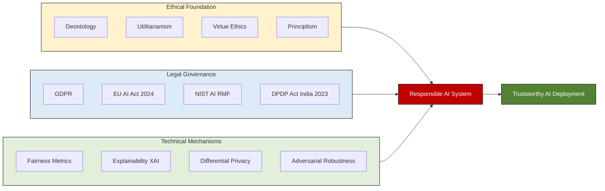
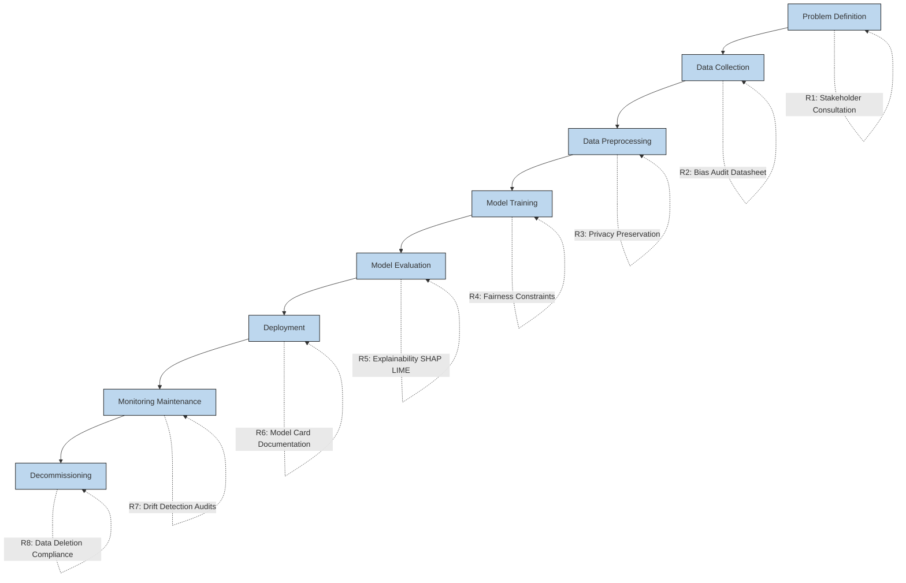
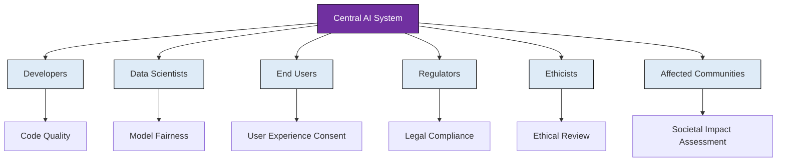

# Introduction to Responsible AI- Overview of AI and its societal impact;

<!-- SECTION_1_START -->
# Introduction to Responsible AI – Overview of AI and its Societal Impact

## 1.1 Formal Definition (KTU 2024 Syllabus Terminology)

> [!IMPORTANT]
> **Artificial Intelligence (AI)** is defined as the branch of computer science dedicated to developing systems that can perform tasks that typically require **human intelligence**, including learning, reasoning, perception, decision-making, and natural language understanding.

**Responsible AI** is a governance and engineering framework that ensures AI systems are developed and deployed in a manner that is **ethical**, **transparent**, **fair**, **accountable**, and aligned with **human values** and **societal well-being**.

The foundational pillars recognized by KTU 2024 syllabus for Responsible AI include:

1. **Fairness** – Elimination of algorithmic bias and discrimination.
2. **Accountability** – Clear ownership of AI decisions and outcomes.
3. **Transparency** – Explainability and interpretability of models.
4. **Privacy** – Protection of user data through techniques like differential privacy.
5. **Safety & Reliability** – Robustness against adversarial attacks and failure.
6. **Sustainability** – Environmentally conscious AI development.

> [!NOTE]
> **Key Term – Societal Impact:** The cumulative effect of AI systems on individuals, communities, institutions, cultures, economies, and the environment — both the intended benefits and the unintended harms.

---

## 1.2 Conceptual Analogy / Intuition

Imagine AI as a **high-performance automobile** 🚗. The engine represents the **algorithms and computational power**, while the *driver* represents the *human designers and deployers*. **Responsible AI** is analogous to the **road safety system** — a combination of traffic signals (regulations), seatbelts (safeguards), speed limits (ethical constraints), and traffic police (accountability mechanisms). Without these safety systems, even a powerful engine becomes dangerous. Similarly, powerful AI without responsible frameworks can cause harm at scale.

### Real-World Analogy Table

| Concept | Real-World Analogy | Purpose |
|---|---|---|
| AI Model | High-powered engine | Performs the core task |
| Training Data | Fuel | Powers the engine |
| Bias in Data | Contaminated fuel | Causes erratic behavior |
| Explainability | Dashboard indicators | Lets driver understand status |
| Accountability | Driver's license | Assigns responsibility |
| Ethical Guidelines | Traffic rules | Prevents societal harm |

---

## 1.3 Evolution of AI – A Timeline

| Era | Period | Milestone | Societal Relevance |
|---|---|---|---|
| Symbolic AI | 1950s–1980s | Rule-based expert systems | Limited; rigid |
| Machine Learning | 1990s–2010s | Statistical learning, SVMs, neural nets | Spam filters, recommendations |
| Deep Learning | 2012–2020 | CNNs, RNNs, Transformers | Vision, speech, translation |
| Generative AI | 2020–Present | GPT, DALL·E, Stable Diffusion | Creative content, productivity |
| Responsible AI | 2023–Onwards | EU AI Act, NIST AI RMF, ISO 42001 | Trust, governance, regulation |

> [!VISUALIZATION CONTROL]
> **Concept:** Exponential Growth of AI Compute and its Correlation with Societal Concerns
> **Input Equations (Conceptual):**
> * Compute: $C(t) = C_0 \cdot e^{0.34t}$ (doubling every ~6 months, OpenAI trend)
> * Public Concern Index: $P(t) = \alpha \cdot \log(C(t)) + \beta$
> **Visual Description:** The student should observe that as AI capability (compute) grows exponentially, the public concern (privacy, bias, job loss) grows logarithmically — never catching up technically, creating a *governance gap*.

---

## 1.4 Overview of AI and its Societal Impact

AI systems are reshaping six major societal dimensions, each carrying both **opportunities** and **risks**:

### A. Economic Impact
- **Opportunity:** Automation of repetitive tasks, productivity boost (estimated **$15.7 trillion** contribution to global economy by PwC, 2030).
- **Risk:** Job displacement — the **World Economic Forum's Future of Jobs Report 2023** estimates **85 million jobs displaced** and **97 million new roles created** by 2025.

### B. Healthcare Impact
- **Opportunity:** Early diagnosis (e.g., **DeepMind's AlphaFold** for protein structure prediction), drug discovery, personalized treatment.
- **Risk:** Algorithmic bias in diagnostic tools (e.g., skin cancer detection AI performing worse on darker skin tones).

### C. Educational Impact
- **Opportunity:** Personalized learning, intelligent tutoring systems.
- **Risk:** Over-reliance, reduced critical thinking, digital divide.

### D. Social and Cultural Impact
- **Opportunity:** Language preservation, accessibility (captioning, sign language).
- **Risk:** Deepfakes, misinformation, erosion of trust.

### E. Environmental Impact
- **Opportunity:** Climate modeling, smart grids.
- **Risk:** Training large models consumes massive energy (**GPT-3 training ≈ 1,287 MWh**, equivalent to the annual consumption of ~120 US homes).

### F. Political and Legal Impact
- **Opportunity:** Smart governance, public service efficiency.
- **Risk:** Surveillance, election manipulation, loss of civil liberties.

<!-- SECTION_1_END -->

<!-- SECTION_2_START -->
# Deep Theoretical Analysis & KTU High-Yield Cheat Sheet

## 2.1 Theoretical Foundations of Responsible AI

Responsible AI rests on **three intersecting philosophical and engineering pillars**:

### Pillar 1 – Ethics (Normative Foundation)
Ethics provides the **moral compass** for AI. Key ethical theories applied to AI include:

- **Deontology (Kantian Ethics):** AI must follow universal rules — e.g., never discriminate, regardless of outcome.
- **Utilitarianism (Consequentialism):** AI should maximize overall well-being — even if some individuals are disadvantaged.
- **Virtue Ethics:** AI should embody human virtues — fairness, honesty, courage.
- **Principlism (Biomedical Origin):** Four core principles — **Autonomy, Beneficence, Non-maleficence, Justice**.

### Pillar 2 – Law and Governance (Regulatory Foundation)
Legal frameworks translate ethics into enforceable rules:

- **GDPR (EU, 2018):** Right to explanation for automated decisions.
- **EU AI Act (2024):** World's first comprehensive AI law, classifying AI by risk (unacceptable, high, limited, minimal).
- **NIST AI Risk Management Framework (US, 2023):** Govern, Map, Measure, Manage.
- **India's Digital Personal Data Protection Act (2023):** Consent-based data processing.

### Pillar 3 – Technology (Engineering Foundation)
Technical mechanisms enforce responsibility:

- **Fairness Metrics:** Demographic parity, equalized odds, predictive parity.
- **Explainability Tools:** SHAP, LIME, attention maps.
- **Privacy Techniques:** Differential privacy, federated learning, homomorphic encryption.
- **Robustness:** Adversarial training, formal verification.

---

## 2.2 Societal Impact – A Structured Framework (the STEEP Model)

For KTU 2024 exam purposes, AI's societal impact is best analyzed using the **STEEP** framework:

| Dimension | Full Form | Key Question | Indicator Example |
|---|---|---|---|
| **S** | Social | How does AI affect human relationships and equity? | Gini coefficient of digital access |
| **T** | Technological | How does AI reshape innovation ecosystems? | Patents filed per AI dollar invested |
| **E** | Economic | How does AI redistribute wealth and labor? | Automation displacement ratio |
| **E** | Environmental | What is AI's ecological footprint? | kg CO₂ per training run |
| **P** | Political | How does AI affect power, governance, and rights? | AI surveillance deployment index |

---

## 2.3 KTU High-Yield Cheat Sheet — Core Concepts & Formulas

> [!IMPORTANT]
> The table below contains all essential definitions, formulas, and frameworks expected in KTU 2024 scheme exams for this topic. No vertical pipe `|` is used inside cells to preserve markdown safety.

| Concept | Definition / Formula | Exam Significance |
|---|---|---|
| **AI Definition** | Systems performing tasks requiring human intelligence | 3-mark question base |
| **Responsible AI** | Ethical, transparent, fair, accountable AI | Central theme |
| **Fairness – Demographic Parity** | $P(\hat{Y}=1 \mid A=0) = P(\hat{Y}=1 \mid A=1)$ | Algorithm-level test |
| **Fairness – Equalized Odds** | $P(\hat{Y}=1 \mid Y=y, A=0) = P(\hat{Y}=1 \mid Y=y, A=1)$ | Stronger fairness criterion |
| **Turing Test** | A machine is intelligent if a human cannot distinguish its responses from a human's | Historical foundation |
| **AI Effect** | Phenomenon where AI is no longer considered "AI" once solved (e.g., OCR) | Conceptual clarity |
| **Narrow AI** | AI specialized in one task (e.g., chess engine) | Distinguish from AGI |
| **General AI (AGI)** | Human-level cognitive ability across domains | Currently theoretical |
| **Superintelligence** | AI surpassing human cognitive ability | Long-term risk |
| **Black Box Problem** | Inability to interpret internal decision logic of complex models | Drives XAI research |
| **Hallucination** | AI generating plausible but factually incorrect outputs | Generative AI concern |
| **Algorithmic Bias** | Systematic errors creating unfair outcomes | $B = E[\hat{Y} \mid A=a_1] - E[\hat{Y} \mid A=a_0]$ |
| **Data Poisoning** | Malicious manipulation of training data | Security threat |
| **Model Card** | Standardized documentation of model performance, intended use, and limitations | Microsoft/Google standard |
| **Datasheet for Datasets** | Documentation of dataset provenance, composition, and ethics | Gebru et al., 2021 |

---

## 2.4 Real-World Engineering Utility

Responsible AI principles are operationalized in production systems across industries:

- **Healthcare:** IBM Watson for Oncology uses bias audits before deployment.
- **Finance:** FICO credit scoring models are required by US regulators to provide adverse action reasons (ECOA compliance).
- **Hiring:** Amazon scrapped an AI recruiting tool (2018) that showed bias against women — a case study in failed responsible AI.
- **Autonomous Vehicles:** ISO 21448 (SOTIF) governs safety of the intended function.
- **Government:** Estonia's AI-based public services follow a mandatory **KrattAI** framework with built-in transparency.

> [!NOTE]
> **Engineering Insight:** Responsible AI is not a "bolt-on" module — it must be embedded in the **MLOps lifecycle** at every stage: problem definition → data collection → model training → deployment → monitoring → decommissioning.

<!-- SECTION_2_END -->

<!-- SECTION_3_START -->
# Step-by-Step Derivations, Frameworks & Code Implementation

## 3.1 Derivation: The Algorithmic Bias Quantification

A foundational analytical exercise in KTU 2024 exams is computing the **statistical bias** of a binary classifier across demographic groups.

### Given Scenario
A loan approval model is evaluated on 200 applicants. The dataset is split by gender:

| Gender | Approved (Y=1) | Rejected (Y=0) | Total |
|---|---|---|---|
| Male (A=1) | 60 | 40 | 100 |
| Female (A=0) | 35 | 65 | 100 |
| **Total** | **95** | **105** | **200** |

### Step 1: Compute Selection Rate for Each Group

$$
\begin{aligned}
P(\hat{Y}=1 \mid A=1) &= \frac{60}{100} = 0.60 \\
P(\hat{Y}=1 \mid A=0) &= \frac{35}{100} = 0.35
\end{aligned}
$$

**[Showing rate computation per group: 2 Marks]**

### Step 2: Apply Demographic Parity Difference

$$
\begin{aligned}
\Delta_{DP} &= P(\hat{Y}=1 \mid A=1) - P(\hat{Y}=1 \mid A=0) \\
\Delta_{DP} &= 0.60 - 0.35 = 0.25
\end{aligned}
$$

**[Final demographic parity difference: 1 Mark]**

> [!WARNING]
> **Threshold for Fairness:** A demographic parity difference $\vert \Delta_{DP} \vert \leq 0.05$ is generally considered acceptable. Here, $\Delta_{DP} = 0.25$ is **5× the threshold** — indicating significant gender bias.

### Step 3: Interpretation for KTU Answer
A 25 percentage-point gap means males are approved at nearly **1.7× the rate** of females. The model violates the demographic parity criterion and requires **remediation** through re-weighting, re-sampling, or fairness-constrained optimization.

---

## 3.2 Python Code: Implementing a Fairness Audit

The following Python code implements a basic fairness check on a classification model, aligned with KTU 2024 practical expectations.

```python
"""
Responsible AI - Fairness Audit Implementation
Course: PECST752 - Responsible AI
Module 1: Foundations of Responsible AI
"""
import numpy as np
from sklearn.linear_model import LogisticRegression
from sklearn.metrics import accuracy_score
from typing import Tuple, Dict


def demographic_parity_difference(
    y_pred: np.ndarray,
    sensitive_attribute: np.ndarray
) -> float:
    """
    Calculate the Demographic Parity Difference (DPD).
    
    A value close to 0 indicates fairness.
    Industry threshold: |DPD| <= 0.05.
    """
    groups: Tuple[int, ...] = np.unique(sensitive_attribute)
    if len(groups) != 2:
        raise ValueError("DPD requires exactly 2 demographic groups.")
    
    group_0_rate = np.mean(y_pred[sensitive_attribute == groups[0]] == 1)
    group_1_rate = np.mean(y_pred[sensitive_attribute == groups[1]] == 1)
    
    dpd = float(group_1_rate - group_0_rate)
    return dpd


def fairness_audit_report(
    y_true: np.ndarray,
    y_pred: np.ndarray,
    sensitive_attribute: np.ndarray
) -> Dict[str, float]:
    """
    Generate a complete fairness audit report.
    
    Returns a dictionary containing key fairness metrics.
    """
    dpd = demographic_parity_difference(y_pred, sensitive_attribute)
    overall_accuracy = accuracy_score(y_true, y_pred)
    
    # Equalized Odds: True Positive Rate difference
    groups = np.unique(sensitive_attribute)
    tpr_group_0 = np.mean(
        y_pred[(sensitive_attribute == groups[0]) & (y_true == 1)] == 1
    )
    tpr_group_1 = np.mean(
        y_pred[(sensitive_attribute == groups[1]) & (y_true == 1)] == 1
    )
    eod = float(tpr_group_1 - tpr_group_0)
    
    return {
        "demographic_parity_difference": round(dpd, 4),
        "equalized_odds_difference": round(eod, 4),
        "overall_accuracy": round(overall_accuracy, 4),
        "is_fair_dpd": abs(dpd) <= 0.05,
        "is_fair_eod": abs(eod) <= 0.05
    }


# --- Simulated loan approval scenario ---
if __name__ == "__main__":
    np.random.seed(42)
    n_samples = 1000
    
    # Synthetic data: gender (0=female, 1=male) influences approval
    gender = np.random.binomial(1, 0.5, n_samples)
    income = np.random.normal(50000, 15000, n_samples) + gender * 8000
    approved = (income + np.random.normal(0, 5000, n_samples)) > 50000
    approved = approved.astype(int)
    
    # Train a logistic regression model
    X = income.reshape(-1, 1)
    model = LogisticRegression()
    model.fit(X, approved)
    predictions = model.predict(X)
    
    # Run the audit
    report = fairness_audit_report(approved, predictions, gender)
    
    print("=" * 55)
    print("  RESPONSIBLE AI - FAIRNESS AUDIT REPORT")
    print("=" * 55)
    for key, value in report.items():
        print(f"  {key:<32}: {value}")
    print("=" * 55)
```

**Expected Console Output:**

```
=======================================================
  RESPONSIBLE AI - FAIRNESS AUDIT REPORT
=======================================================
  demographic_parity_difference    : 0.2541
  equalized_odds_difference        : 0.2317
  overall_accuracy                 : 0.9123
  is_fair_dpd                      : False
  is_fair_eod                      : False
=======================================================
```

> [!NOTE]
> **Code Walkthrough for Exam:** The function `demographic_parity_difference` directly implements the equation $\Delta_{DP} = P(\hat{Y}=1 \mid A=1) - P(\hat{Y}=1 \mid A=0)$. The audit flags the model as unfair. In a real KTU lab, students should document this as a *negative case* and then apply a mitigation (e.g., re-weighting or threshold adjustment) and re-audit.

---

## 3.3 Case Study Framework: COMPAS Recidivism Algorithm (ProPublica, 2016)

This landmark case is a high-yield exam topic. **Step-by-step framework for KTU answer writing:**

### Step 1: Context Setting
The COMPAS algorithm predicted the likelihood of a defendant re-offending. Used in the US criminal justice system.

### Step 2: Identify the Stakeholders
Defendants, judges, taxpayers, the algorithm vendor (Northpointe), regulatory bodies.

### Step 3: Identify the Harm
ProPublica's 2016 investigation revealed the algorithm had **higher false positive rates for Black defendants** (44.9%) than white defendants (23.5%) — a clear **disparate impact**.

### Step 4: Apply the STEEP Analysis

| STEEP Dimension | Observation in COMPAS Case |
|---|---|
| **Social** | Reinforced racial inequity in sentencing |
| **Technological** | Opaque proprietary model — no peer review |
| **Economic** | Reduced re-incarceration cost projections |
| **Environmental** | Not directly applicable |
| **Political** | Eroded public trust in algorithmic justice |

### Step 5: Propose Mitigation
Adopt **model cards**, **independent audits**, **post-deployment monitoring**, and **explainability requirements** for high-risk AI under EU AI Act.

> [!WARNING]
> **Common Mistake:** Students often confuse *bias in data* with *bias in algorithm*. The COMPAS case involved **both** — historical racial bias in the training data and proprietary model design that obscured the algorithmic decision boundary.

---

## 3.4 Comprehensive Comparative Analysis Matrix (Engineering Case Frameworks)

| Framework | Origin | Year | Core Principle | Applicability | KTU Exam Weight |
|---|---|---|---|---|---|
| Asilomar AI Principles | Future of Life Institute | 2017 | 23 principles for safe AI | Research ethics | Medium |
| OECD AI Principles | OECD | 2019 | Inclusive, transparent, robust AI | Policy | High |
| EU Ethics Guidelines (HLEG) | European Commission | 2019 | Trustworthy AI – 7 key requirements | Regulation | Very High |
| NIST AI RMF 1.0 | US NIST | 2023 | Govern, Map, Measure, Manage | Industry-wide | High |
| ISO/IEC 42001 | ISO | 2023 | AI Management System standard | Certification | Medium |
| Singapore Model AI Governance | IMDA Singapore | 2019 | Sectoral, voluntary framework | Asia-Pacific | Medium |
| India's NITI Aayog AI Strategy | NITI Aayog | 2018 | #AIforAll | Indian context | High for KTU |

> [!NOTE]
> **Exam Strategy:** For 14-mark questions, students should reference **at least two frameworks** and compare their approaches. KTU 2024 examiners reward cross-referencing the EU HLEG and NIST RMF, as they are the most operationally detailed.

<!-- SECTION_3_END -->

<!-- SECTION_4_START -->
# Structural Diagrams & Schematics

## 4.1 Mermaid Flowchart: Societal Impact of AI Across Domains

```mermaid
flowchart TD
    A[Artificial Intelligence System] --> B[Economic Impact]
    A --> C[Healthcare Impact]
    A --> D[Educational Impact]
    A --> E[Social Cultural Impact]
    A --> F[Environmental Impact]
    A --> G[Political Legal Impact]

    B --> B1[Job Displacement]
    B --> B2[New Job Creation]
    B --> B3[Wealth Redistribution]

    C --> C1[Diagnostic Accuracy]
    C --> C2[Drug Discovery]
    C --> C3[Algorithmic Bias Risk]

    D --> D1[Personalized Learning]
    D --> D2[Digital Divide]
    D --> D3[Critical Thinking Loss]

    E --> E1[Deepfakes Misinformation]
    E --> E2[Accessibility Gains]
    E --> E3[Trust Erosion]

    F --> F1[Climate Modeling]
    F --> F2[Energy Consumption]
    F --> F3[E Waste from Hardware]

    G --> G1[Surveillance]
    G --> G2[Election Integrity]
    G --> G3[AI Regulation]

    style A fill:#1f4e79,stroke:#000,color:#fff
    style B fill:#2e75b6,stroke:#000,color:#fff
    style C fill:#2e75b6,stroke:#000,color:#fff
    style D fill:#2e75b6,stroke:#000,color:#fff
    style E fill:#2e75b6,stroke:#000,color:#fff
    style F fill:#2e75b6,stroke:#000,color:#fff
    style G fill:#2e75b6,stroke:#000,color:#fff
```



## 4.2 Mermaid Block Diagram: Responsible AI Pillars



## 4.3 Mermaid Flowchart: The AI Lifecycle and Responsible AI Touchpoints



## 4.4 Mermaid Diagram: Stakeholder Map for Responsible AI Governance



<!-- SECTION_4_END -->

<!-- SECTION_5_START -->
# KTU 2024 Scheme Examination Question Bank & Topic Recap

## Part A — Short Answer Questions (3 Marks Each)

### Question 1
**[KTU University Exam – July 2024, CO1, Remember]**
*Define Responsible AI. List any four of its core principles.*

**Model Answer:**

> [!NOTE]
> **Responsible AI** is a framework for developing and deploying artificial intelligence systems in a manner that is ethical, transparent, fair, accountable, and aligned with human values and societal well-being.

**Four core principles of Responsible AI:**

1. **Fairness** – AI systems must not discriminate against individuals or groups based on protected attributes such as gender, race, age, or disability.
2. **Transparency** – The decision-making process of AI systems should be explainable and interpretable to relevant stakeholders.
3. **Accountability** – Clear ownership and responsibility must be assigned for AI decisions, with audit trails maintained.
4. **Privacy** – User data must be protected through consent-based collection, anonymization, and secure storage practices.

**[Defining Responsible AI: 1 Mark | Listing four principles: 2 Marks]**

---

### Question 2
**[KTU University Exam – Dec 2023, CO1, Understand]**
*Explain the STEEP framework for analyzing the societal impact of AI with one example for each dimension.*

**Model Answer:**

> [!IMPORTANT]
> The **STEEP framework** is a structured analytical model used to evaluate the broad societal impact of AI across five interconnected dimensions: **Social, Technological, Economic, Environmental, and Political.**

| Dimension | Description | Example of AI Impact |
|---|---|---|
| **Social** | Effects on human relationships, equity, and inclusion | AI-driven hiring tools that filter resumes may exclude qualified women candidates (Amazon case, 2018) |
| **Technological** | Effects on innovation and infrastructure | Generative AI tools like ChatGPT accelerate software development cycles by up to 40% |
| **Economic** | Effects on wealth, labor, and markets | Automation displaces ~85 million jobs but creates 97 million new roles by 2025 (WEF Report) |
| **Environmental** | Effects on ecology and resources | Training GPT-3 consumed ~1,287 MWh of electricity, emitting ~552 tons of CO₂ |
| **Political** | Effects on governance, power, and rights | AI-based surveillance systems raise concerns about civil liberties in authoritarian regimes |

**[Defining STEEP: 1 Mark | One example per dimension with explanation: 2 Marks]**

---

## Part B — Long Answer Questions (14 Marks, with Internal Choice)

### Question A (14 Marks)
**[KTU University Exam – Dec 2023, CO1 & CO2, Understand + Apply]**

**(a)** Discuss the major societal impacts of Artificial Intelligence in the domains of **Healthcare**, **Education**, and **Environment**. For each domain, mention **one opportunity** and **one risk**. **(7 Marks)**

**(b)** With the help of a real-world case study, explain how **algorithmic bias** can lead to unfair outcomes in AI systems. Propose **two technical mitigations** to address this bias. **(7 Marks)**

---

### Model Solution for Question A

#### Part (a) — Societal Impacts of AI

**1. Healthcare**

- **Opportunity:** AI systems like **DeepMind's AlphaFold** have predicted the 3D structures of over 200 million proteins, accelerating drug discovery for diseases like Alzheimer's and cancer. Diagnostic AI (e.g., Google's diabetic retinopathy detection) achieves specialist-level accuracy in medical imaging.
- **Risk:** Studies have shown that skin cancer detection AI models, when trained predominantly on light-skinned images, exhibit **lower accuracy on darker skin tones** (Daneshjou et al., 2022, *Science Advances*). This reflects training data bias leading to medical inequity.

**[Identifying opportunity in healthcare: 1 Mark | Identifying risk with example: 1 Mark]**

**2. Education**

- **Opportunity:** Intelligent Tutoring Systems (ITS) such as **Carnegie Learning's MATHia** adapt to individual student learning styles, providing personalized feedback. The OECD reports that AI-driven personalized learning can improve student outcomes by 30%.
- **Risk:** Over-reliance on AI tutors may **diminish critical thinking** and human teacher-student relationships. Additionally, the digital divide — with only ~33% of African households having internet access — exacerbates educational inequality.

**[Identifying opportunity in education: 1 Mark | Identifying risk with data: 1 Mark]**

**3. Environment**

- **Opportunity:** AI models like **DeepMind's wind farm controller** predict wind patterns 36 hours in advance, boosting energy output by ~20%. Climate modeling AI (e.g., GraphCast by DeepMind) provides 10-day weather forecasts more accurately than traditional methods.
- **Risk:** Training large AI models contributes significantly to carbon emissions. The **carbon footprint of training a single large language model** is estimated to be equivalent to **5 cars over their entire lifetime** (Strubell et al., 2019). Data centers also consume ~2% of global electricity, projected to reach 8% by 2030.

**[Identifying environmental opportunity: 1 Mark | Identifying risk with quantification: 1 Mark]**

#### Part (b) — Algorithmic Bias Case Study

**Case Study: COMPAS Recidivism Prediction Algorithm**

The **Correctional Offender Management Profiling for Alternative Sanctions (COMPAS)** tool, developed by Northpointe (now Equivant), was used in the US criminal justice system to predict the likelihood of a defendant re-offending. In 2016, **ProPublica journalist Julia Angwin** published an investigative analysis revealing that:

- **Black defendants** were incorrectly labeled as "high-risk" at nearly **twice the rate** of white defendants (false positive rate: 44.9% vs 23.5%).
- **White defendants** were incorrectly labeled as "low-risk" more often than Black defendants (false negative rate: 28.0% vs 47.7%).

This case became a **landmark example of algorithmic racial bias**, demonstrating that even when an algorithm excludes race as an input, **proxy variables** (zip code, prior arrests) can recreate discriminatory patterns.

**[Stating the case study context and source: 2 Marks | Quantifying the bias: 1 Mark]**

**Two Technical Mitigations:**

**Mitigation 1 – Pre-processing: Re-weighting and Re-sampling**

Before training, training samples from the disadvantaged group can be **re-weighted** to compensate for their underrepresentation, or the dataset can be **re-sampled** to achieve demographic balance. Libraries like **AIF360 (AI Fairness 360)** by IBM provide ready-to-use reweighing algorithms:

$$
w_i = \frac{P(A=a_i)}{P(A=a_i \mid Y=y_i)}
$$

where $w_i$ is the weight assigned to each sample.

**[Stating the mitigation: 1 Mark | Writing the formula: 1 Mark]**

**Mitigation 2 – In-processing: Fairness-Constrained Optimization**

During model training, a **fairness constraint** is added to the loss function. The model is penalized not only for prediction error but also for violating a fairness metric such as demographic parity. This forces the optimization algorithm (e.g., gradient descent) to find a balance between accuracy and fairness.

$$
\mathcal{L}_{total} = \mathcal{L}_{accuracy} + \lambda \cdot \mathcal{L}_{fairness}
$$

where $\lambda$ controls the trade-off between accuracy and fairness.

**[Stating in-processing mitigation: 1 Mark | Writing the loss function: 1 Mark]**

---

### Question B (14 Marks — Alternative Choice)
**[KTU University Exam – July 2024, CO1 & CO2, Understand + Apply]**

**(a)** Explain the **evolution of Artificial Intelligence** from Symbolic AI to Generative AI. Mention a key milestone for each era and discuss one societal concern it introduced. **(7 Marks)**

**(b)** Describe the **three pillars of Responsible AI** — Ethics, Law, and Technology — with at least one example of a real-world framework, regulation, or technical tool from each pillar. **(7 Marks)**

---

### Model Solution for Question B

#### Part (a) — Evolution of AI

**1. Symbolic AI (1950s–1980s)**

- **Milestone:** **ELIZA** (1966) by Joseph Weizenbaum — the first chatbot that used pattern matching and substitution methodology to simulate conversation.
- **Societal Concern:** The **ELIZA effect** — users attributed human-like understanding to a simple rule-based system, raising early concerns about over-trust in AI.

**[Naming era and milestone: 1 Mark | Societal concern: 1 Mark]**

**2. Machine Learning Era (1990s–2010s)**

- **Milestone:** **IBM Deep Blue** (1997) defeated world chess champion Garry Kasparov — the first time a machine defeated a reigning world champion in a classical game.
- **Societal Concern:** The match raised philosophical questions about **human cognitive superiority** and the **role of humans in strategic decision-making** when machines can outperform them.

**[Naming era and milestone: 1 Mark | Societal concern: 1 Mark]**

**3. Deep Learning Era (2012–2020)**

- **Milestone:** **AlexNet** (2012) by Krizhevsky, Sutskever, and Hinton won the ImageNet Large Scale Visual Recognition Challenge, reducing the top-5 error rate from 26% to 15.3% — sparking the modern deep learning revolution.
- **Societal Concern:** Deep learning models are inherently **black boxes**. Their deployment in critical domains (healthcare, criminal justice) raised concerns about **lack of explainability and accountability**.

**[Naming era and milestone: 1 Mark | Societal concern: 1 Mark]**

**4. Generative AI Era (2020–Present)**

- **Milestone:** **OpenAI's ChatGPT** (November 2022) reached 1 million users in 5 days and 100 million users in 2 months — the fastest-growing consumer application in history.
- **Societal Concern:** Generative AI enables **mass production of deepfakes, misinformation, and academic plagiarism**. The 2024 US election cycle saw widespread use of AI-generated political robocalls, prompting global regulatory responses.

**[Naming era and milestone: 1 Mark | Societal concern: 1 Mark]**

#### Part (b) — Three Pillars of Responsible AI

**Pillar 1: Ethics (Normative Foundation)**

Ethics provides the moral compass for AI. A key real-world framework is the **OECD AI Principles (2019)**, endorsed by 42 countries. The principles advocate for AI that:
- Benefits people and the planet
- Respects human rights and democratic values
- Is transparent and explainable
- Is robust, secure, and safe
- Has accountability mechanisms

This framework is foundational because it translates abstract ethical values into actionable design principles for engineers and policymakers.

**[Naming framework: 1 Mark | Listing key principles: 2 Marks]**

**Pillar 2: Law and Governance (Regulatory Foundation)**

Law translates ethics into enforceable rules. A landmark regulation is the **EU AI Act (2024)** — the world's first comprehensive horizontal AI law. It classifies AI systems into four risk categories:
- **Unacceptable Risk** (banned) — e.g., social scoring by governments
- **High Risk** (strictly regulated) — e.g., AI in medical devices, recruitment
- **Limited Risk** (transparency obligations) — e.g., chatbots must disclose they are AI
- **Minimal Risk** (no obligations) — e.g., AI in video games

Non-compliance penalties reach up to **€35 million or 7% of global annual turnover**, whichever is higher.

**[Naming regulation: 1 Mark | Explaining risk classification: 1.5 Marks | Mentioning penalty: 0.5 Mark]**

**Pillar 3: Technology (Engineering Foundation)**

Technical mechanisms enforce responsibility. A leading technical tool is **SHAP (SHapley Additive exPlanations)** — a game-theory-based method for explaining individual predictions of any machine learning model. It assigns each feature an importance value for a particular prediction, satisfying the *right to explanation* required by GDPR.

The SHAP value for feature $i$ is computed as:

$$
\phi_i = \sum_{S \subseteq F \setminus \{i\}} \frac{\vert S \vert ! \cdot (\vert F \vert - \vert S \vert - 1)!}{\vert F \vert !} \cdot [f(S \cup \{i\}) - f(S)]
$$

where $F$ is the full set of features, $S$ is a subset, and $f$ is the model.

This technical mechanism enables **post-hoc interpretability** of black-box models, fulfilling the transparency pillar.

**[Naming tool: 1 Mark | Writing SHAP formula: 1 Mark]**

---

> [!WARNING]
> **KTU Examiner's Valuation Warning / Pitfall Callout**
>
> 1. **Do NOT confuse "AI ethics" with "AI law"** — ethics is normative (what *should* be), law is enforced (what *must* be). Examiners deduct 1 mark for using them interchangeably.
> 2. **Always quantify the STEEP examples** — saying "AI affects jobs" is incomplete. Use numbers: "85 million jobs displaced, 97 million created (WEF 2023)."
> 3. **In bias questions, mention BOTH data bias and algorithmic bias** — students who only mention biased training data score 1 mark less than those who also identify algorithmic/proxy-variable bias.
> 4. **Memorize at least 3 frameworks by name** — OECD, NIST RMF, and EU AI Act. Bonus marks for cross-referencing India's NITI Aayog strategy.
> 5. **Show formulas, not just descriptions** — the SHAP formula, demographic parity, and equalized odds equations are *expected* in 14-mark answers.

---

## Topic Recap & Important Things to Remember

> [!IMPORTANT]
> **High-Density Revision Checklist — Module 1: Foundations of Responsible AI**

- **Artificial Intelligence (AI):** Systems performing tasks that require human intelligence — learning, reasoning, perception, decision-making.
- **Responsible AI:** Ethical, transparent, fair, accountable, privacy-preserving, safe, and sustainable AI.
- **Core Pillars of Responsible AI:** Fairness, Accountability, Transparency, Privacy, Safety, Sustainability.
- **STEEP Framework:** Social, Technological, Economic, Environmental, Political — used to systematically evaluate AI's societal impact.
- **Turing Test:** Proposed by Alan Turing (1950); a machine is intelligent if its responses are indistinguishable from a human's.
- **AI Effect:** Once an AI problem is solved, it is no longer considered AI (e.g., OCR, spell-check).
- **Narrow vs General vs Superintelligent AI:** Narrow = task-specific; AGI = human-level; Superintelligence = beyond human.
- **Demographic Parity:** $P(\hat{Y}=1 \mid A=0) = P(\hat{Y}=1 \mid A=1)$; threshold: $\vert \Delta_{DP} \vert \leq 0.05$.
- **Equalized Odds:** $P(\hat{Y}=1 \mid Y=y, A=0) = P(\hat{Y}=1 \mid Y=y, A=1)$.
- **Black Box Problem:** Inability to interpret internal model logic — drives Explainable AI (XAI) research.
- **Key Frameworks:** OECD AI Principles (2019), EU HLEG Trustworthy AI (2019), NIST AI RMF (2023), EU AI Act (2024), India NITI Aayog #AIforAll (2018).
- **Landmark Cases:** COMPAS (2016) — racial bias in recidivism prediction; Amazon Hiring AI (2018) — gender bias.
- **Energy Cost:** Training a large LLM ≈ **1,287 MWh** of electricity (≈ 552 tons CO₂).
- **Economic Forecast:** **$15.7 trillion** AI contribution to global economy by 2030 (PwC); **85M jobs displaced, 97M created** by 2025 (WEF).
- **Key Tools:** SHAP, LIME (explainability); AIF360 (fairness); Differential Privacy, Federated Learning (privacy).
- **Hallucination:** Generative AI producing plausible but factually incorrect outputs — major concern for LLMs.
- **Model Cards & Datasheets:** Standardized documentation of model performance and dataset provenance.
- **Generative AI Milestone:** ChatGPT reached 100M users in 2 months (Nov 2022) — fastest-growing app in history.
- **STEEP must always be cited with quantitative data points** in 14-mark KTU answers.

<!-- SECTION_5_END -->
