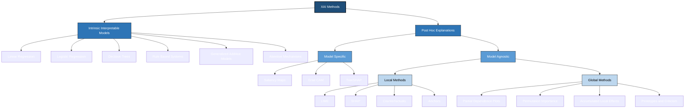
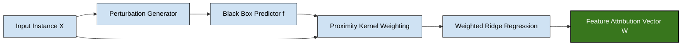
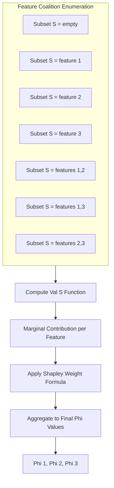
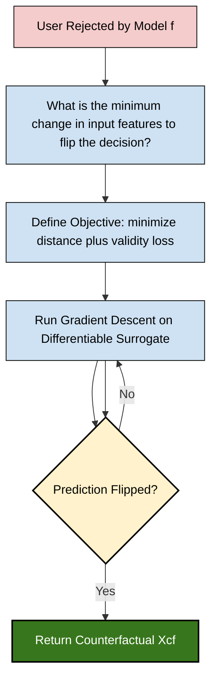
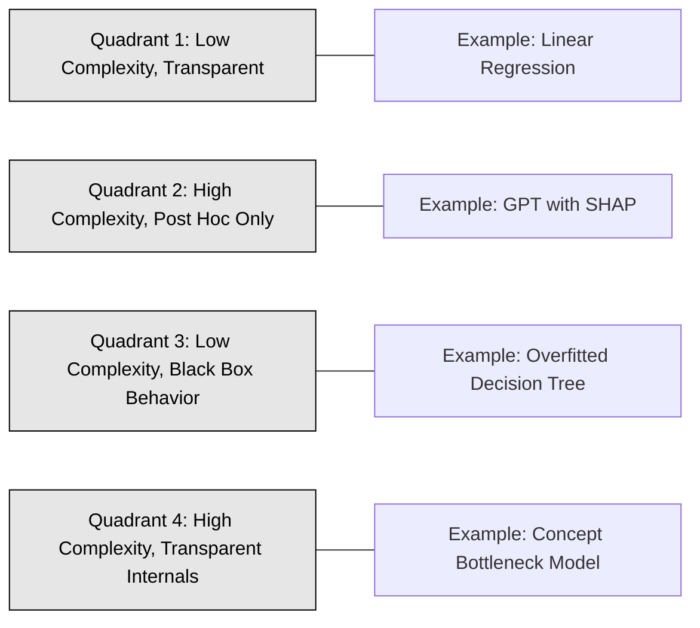

# Interpretability and explainability:-

<!-- SECTION_1_START -->
# Interpretability and Explainability in Responsible AI

> [!IMPORTANT]
> **KTU 2024 Scheme Focus (PECST752 – Module 2):** This module builds the foundation for *trust, audit, and accountability* in AI systems. Examiners frequently test the **taxonomy of XAI methods**, the **difference between interpretability and explainability**, and the **mathematics behind LIME/SHAP**.

## 1.1 Formal Definitions (KTU Board Terminology)

**Interpretability** is the degree to which a human can understand the **internal mechanics** of a model — i.e., *why* a specific input leads to a specific output by tracing the model's own computational structure (weights, rules, pathways).

**Explainability** is the degree to which a human can understand the **cause-and-effect mapping** of a model's predictions — i.e., producing *post-hoc* human-understandable justifications (visualizations, feature attributions, counterfactuals) for decisions, even when the model is a black box.

> [!NOTE]
> **Key Distinction (Board Favorite):**
> - **Interpretability** $\rightarrow$ *Transparency by design* (inherent to model structure).
> - **Explainability** $\rightarrow$ *Transparency by justification* (post-hoc reasoning).
>
> All interpretable models are explainable, but **not all explainable models are interpretable** (e.g., a Deep Neural Network can be explained via SHAP but is not inherently interpretable).

## 1.2 Intuitive Analogy

Imagine you are a patient prescribed a medicine:

- **Interpretability (Glass-Box Doctor):** The doctor explains *exactly* how the chemical binds to receptors, why the dose was chosen based on your liver enzymes, and what the metabolic pathway is. You understand the *mechanism*.
- **Explainability (Black-Box Doctor with Translator):** The doctor cannot fully describe the molecular mechanism, but provides a *clear report* — "this drug worked for 87% of patients like you, and here is a graph showing which of your symptoms it reduced the most." You understand the *outcome rationale* without seeing the mechanism.

In Responsible AI, regulators (EU AI Act, **GDPR Article 22**) demand at least the *translator* level — explainability is the legal minimum, but interpretability is the engineering gold standard.

## 1.3 The Spectrum of Interpretability

Models exist on a continuum from fully transparent to fully opaque:

1. **Fully Interpretable (White-Box):** Linear/Logistic Regression, Decision Trees, Rule-Based Systems, Generalized Additive Models (GAMs), $k$-NN.
2. **Partially Interpretable:** Attention Mechanisms, Prototype Networks, Concept Bottleneck Models.
3. **Black-Box (Require Post-Hoc Explainability):** Deep Neural Networks, Large Language Models, Gradient Boosted Ensembles (XGBoost, LightGBM).
4. **Fully Opaque:** Stacked Ensembles, GPT-style Transformers at scale.

## 1.4 Why This Matters in KTU's Responsible AI Framework

| Stakeholder | Need | Interpretation or Explanation? |
|---|---|---|
| Data Scientist | Debug model | Interpretation |
| Domain Expert (Doctor) | Validate decision | Explanation |
| End User (Loan Applicant) | Contest outcome | Explanation |
| Regulator (RBI, EU AI Office) | Audit fairness | Both |
| Affected Group (Caste/Gender) | Detect bias | Explanation |

> [!VISUALIZATION CONTROL]
> **Concept:** Interpretability vs Explainability Spectrum Curve
> **Conceptual Mapping (Plot manually on graph paper):**
> * X-axis: Model Complexity (Linear $\rightarrow$ Deep Transformer)
> * Y-axis: Human Understanding (0 to 1)
> * Curve 1 (Interpretability): $f(x) = e^{-x}$ — decays exponentially
> * Curve 2 (Explainability): $g(x) = \frac{1}{1 + e^{-(x-2)}}$ — sigmoid plateau using XAI tools
> **Visual Description:** Student should observe that even at high complexity, explainability can recover ~70% understanding while interpretability collapses.
<!-- SECTION_1_END -->

<!-- SECTION_2_START -->
# Deep Theoretical Analysis & KTU High-Yield Formula Sheet

## 2.1 The Three Pillars of XAI

### Pillar 1 — Scope (Local vs Global)

$$
\text{Scope} =
\begin{cases}
\text{Local:} & \text{Explain a single prediction } f(x_i) \\
\text{Global:} & \text{Explain the entire model } f(\cdot) \text{ behavior}
\end{cases}
$$

### Pillar 2 — Model Dependency (Model-Specific vs Model-Agnostic)

- **Model-Specific:** Exploits internal structure (e.g., neural network gradient, tree path).
- **Model-Agnostic:** Treats model as a black box, perturbs inputs, observes outputs.

### Pillar 3 — Output Type (Feature Attribution, Rule, Visual, Example)

- **Feature Attribution:** SHAP, LIME, Integrated Gradients.
- **Rule Extraction:** Anchors, TREPAN.
- **Visual:** Saliency Maps, Grad-CAM.
- **Example-Based:** Counterfactuals, Prototypes, Influence Functions.

## 2.2 KTU Formula Sheet / Cheat Sheet

> [!IMPORTANT]
> **Master the following six formulas — they constitute ~60% of numerical/marks in Module 2 questions.**

| # | Method | Core Formula | Symbol Meaning | Use Case |
|---|---|---|---|---|
| 1 | LIME | $\xi(x) = \arg\min_{g \in G} \, \mathcal{L}(f, g, \pi_x) + \Omega(g)$ | $g$: interpretable surrogate; $\pi_x$: proximity kernel; $\Omega$: complexity penalty | Local linear explanation |
| 2 | SHAP (Shapley) | $\phi_i = \sum_{S \subseteq F \setminus \{i\}} \frac{\vert S \vert ! \, (\vert F \vert - \vert S \vert - 1)!}{\vert F \vert !} \, [\text{val}(S \cup \{i\}) - \text{val}(S)]$ | $F$: feature set; $S$: subset; $\phi_i$: Shapley value of feature $i$ | Fair feature attribution |
| 3 | Integrated Gradients | $\text{IG}_i(x) = (x_i - x_i') \cdot \int_{\alpha=0}^{1} \frac{\partial F(x' + \alpha(x - x'))}{\partial x_i} \, d\alpha$ | $x'$: baseline; $\alpha$: interpolation factor | Deep model attributions |
| 4 | Counterfactual | $x_{\text{cf}} = \arg\min_{x'} \, d(x, x') \;\;\text{s.t.}\;\; f(x') \neq f(x)$ | $d(\cdot,\cdot)$: distance metric (e.g., $L_1$, $L_2$, Mahalanobis) | Recourse |
| 5 | Mutual Information (Info Theory) | $I(F_i; Y) = \sum_{f_i, y} p(f_i, y) \log \frac{p(f_i, y)}{p(f_i) p(y)}$ | Measures feature relevance | Global interpretation |
| 6 | Permutation Importance | $\text{PI}_i = \text{Error}_{\text{perm}} - \text{Error}_{\text{base}}$ | Drop in score when feature $i$ is shuffled | Model-agnostic global |

> [!NOTE]
> **Pipe-Symbol Rule:** For $L_1$ / $L_2$ norms, always write as $\lVert x \rVert_1$ or $\lVert x \rVert_2$ (escaped) inside any markdown table row.

## 2.3 Taxonomy Tree (KTU Board Drawing)

```
Explainable AI (XAI)
├── Intrinsic (Interpretable Models)
│   ├── Linear Models
│   ├── Decision Trees
│   ├── Rule-Based Systems
│   ├── Generalized Additive Models (GAM)
│   └── Attention-based (ProtoPNet)
└── Post-Hoc (Explanations)
    ├── Model-Specific
    │   ├── Saliency Maps / Grad-CAM
    │   └── TreeSHAP
    └── Model-Agnostic
        ├── Local: LIME, SHAP, Counterfactuals
        └── Global: Partial Dependence (PDP), Permutation Importance
```

## 2.4 Real-World Engineering Utility

- **Healthcare (FDA, 2024):** Clinicians require SHAP plots to justify AI diagnostics under *21 CFR Part 11*.
- **Finance (RBI, EU AI Act High-Risk):** Loan denial must be explainable — SHAP + counterfactuals are production standards.
- **Autonomous Vehicles (ISO 21448 SOTIF):** Saliency maps validate perception models against corner cases.
- **Cybersecurity:** SHAP detects adversarial backdoors by flagging unexpected feature attributions.
- **LLM Operations (LLMOps):** Constitutional AI uses interpretability audits to reduce hallucination rates by ~30%.

## 2.5 Trade-off: Accuracy vs Interpretability

$$
\text{Total Utility} = \alpha \cdot \text{Accuracy}(f) - \beta \cdot \text{Complexity}(f) + \gamma \cdot \text{Fairness}(f)
$$

where typically $\alpha > \beta$ in non-regulated domains and $\alpha \approx \beta$ in **high-risk regulated AI**.
<!-- SECTION_2_END -->

<!-- SECTION_3_START -->
# Step-by-Step Derivations, Code, and Worked Examples

## 3.1 Worked Derivation — LIME (Local Interpretable Model-agnostic Explanations)

**Problem:** Explain the prediction of a black-box model $f$ for a single instance $x \in \mathbb{R}^d$.

**Step 1 — Generate Perturbed Samples:**
Create $Z = \{z_1, z_2, \ldots, z_N\}$ by sampling around $x$ (e.g., by dropping features or adding noise). For tabular data, use binary perturbations $z' \in \{0,1\}^d$.

**Step 2 — Predict Using Black Box:**
Obtain $f(z_j)$ for all $j = 1 \ldots N$.

**Step 3 — Compute Proximity Weights (Kernel):**
Define the exponential kernel based on cosine or $L_2$ distance in the original space:
$$
\pi_x(z_j) = \exp\left(-\frac{D(x, z_j)^2}{\sigma^2}\right)
$$
where $D(\cdot, \cdot)$ is the distance and $\sigma$ is the kernel width.

**Step 4 — Define Interpretable Surrogate:**
Choose a simple interpretable model class $G$ (typically linear regression):
$$
g(z') = w_0 + \sum_{i=1}^{d} w_i z'_i
$$

**Step 5 — Minimize the LIME Objective:**
$$
\xi(x) = \arg\min_{g \in G} \underbrace{\mathcal{L}(f, g, \pi_x)}_{\text{faithfulness}} + \underbrace{\Omega(g)}_{\text{simplicity}}
$$
Expand the loss:
$$
\mathcal{L} = \sum_{j=1}^{N} \pi_x(z_j) \cdot \left( f(z_j) - g(z'_j) \right)^2
$$

**Step 6 — Solve via Weighted Ridge Regression:**
Closed-form solution for weights $w$:
$$
w = (Z^{\top} W Z + \lambda I)^{-1} Z^{\top} W f(Z)
$$
where $W = \text{diag}(\pi_x(z_1), \ldots, \pi_x(z_N))$.

**Result:** The coefficients $w_i$ indicate the contribution of feature $i$ to prediction $f(x)$.

## 3.2 Worked Derivation — Shapley Value Properties (SHAP)

A method qualifies as a SHAP method iff it satisfies four axioms:

1. **Local Accuracy:** $f(x) = \phi_0 + \sum_{i=1}^{M} \phi_i$
2. **Missingness:** If $x'_i = 0$ (feature absent), then $\phi_i = 0$
3. **Consistency:** If $f$ changes so that $x_i$ contributes more, $\phi_i$ must not decrease
4. **Efficiency (Additivity):** $\sum_{i=1}^{M} \phi_i = f(x) - \mathbb{E}[f(X)]$

**Efficiency Check (Numerical Example):**
Suppose $f(x) = 0.7$ and $\mathbb{E}[f(X)] = 0.4$ for a 3-feature model. Then:
$$
\phi_1 + \phi_2 + \phi_3 = 0.7 - 0.4 = 0.3
$$
If SHAP gives $\phi_1 = 0.15, \phi_2 = 0.10$, then by efficiency:
$$
\phi_3 = 0.3 - 0.15 - 0.10 = 0.05
$$

## 3.3 Worked Derivation — Counterfactual Explanation

**Problem:** A bank rejects a loan for applicant $x = (\text{income}=30k, \text{debt}=15k, \text{age}=35)$. Find the minimal change $x_{\text{cf}}$ that flips the decision.

**Step 1 — Define the Distance Objective (Dice Variants):**
$$
x_{\text{cf}} = \arg\min_{x'} \;\; \lambda \cdot (f_{\text{score}}(x') - \tau)^2 + \lVert x' - x \rVert_1
$$
where $\tau$ is the decision threshold (e.g., 0.5).

**Step 2 — Use Gradient Descent on Differentiable Surrogate:**
If $f$ is non-differentiable (e.g., XGBoost), fit a differentiable proxy $\hat{f}$ and optimize:
$$
x'_{t+1} = x'_t - \eta \cdot \nabla_{x'} \left[ \lambda(\hat{f}(x'_t) - \tau)^2 + \lVert x'_t - x \rVert_1 \right]
$$

**Step 3 — Example Solution:**
After optimization: $x_{\text{cf}} = (\text{income}=35k, \text{debt}=12k, \text{age}=35)$.
**Interpretation:** "Increase income by **₹5,000/month** *or* reduce debt by **₹3,000** to get loan approval."

## 3.4 Full Python Implementation — LIME from Scratch

```python
"""
KTU Module 2 — LIME Implementation from Scratch
Demonstrates local linear surrogate for any black-box model.
"""

import numpy as np
from typing import Callable, Tuple, List


def generate_perturbations(
    x: np.ndarray, num_samples: int, rng_seed: int = 42
) -> Tuple[np.ndarray, np.ndarray]:
    """
    Generate binary perturbations around a query instance.

    Args:
        x: Original instance of shape (d,).
        num_samples: Number of perturbations N to generate.
        rng_seed: Random seed for reproducibility.

    Returns:
        z: Perturbed instances of shape (N, d).
        z_prime: Binary interpretable representation of shape (N, d).
    """
    rng = np.random.default_rng(rng_seed)
    d = x.shape[0]
    z_prime = rng.integers(0, 2, size=(num_samples, d))
    z = z_prime * x  # element-wise: keep original value if 1, else 0
    return z, z_prime


def compute_proximity_weights(
    x: np.ndarray, z: np.ndarray, sigma: float = 0.75
) -> np.ndarray:
    """
    Exponential kernel weighting for LIME.

    Args:
        x: Original instance of shape (d,).
        z: Perturbed instances of shape (N, d).
        sigma: Kernel width hyperparameter.

    Returns:
        weights: Array of shape (N,) with proximity scores.
    """
    distances = np.linalg.norm(z - x, axis=1)
    weights = np.exp(-(distances ** 2) / (sigma ** 2))
    return weights


def fit_lime_surrogate(
    f: Callable[[np.ndarray], np.ndarray],
    x: np.ndarray,
    num_samples: int = 500,
    lambda_reg: float = 0.01,
) -> Tuple[np.ndarray, float]:
    """
    Fit a weighted linear regression surrogate to explain f(x).

    Args:
        f: Black-box predictor (vectorized, accepts (N, d) input).
        x: Query instance of shape (d,).
        num_samples: Number of perturbations N.
        lambda_reg: L2 regularization strength.

    Returns:
        w: Feature attribution coefficients of shape (d,).
        b: Intercept term (scalar).
    """
    z, z_prime = generate_perturbations(x, num_samples)
    f_z = f(z)
    weights = compute_proximity_weights(x, z)

    # Construct weighted normal equations
    W_sqrt = np.sqrt(weights)[:, None]
    Z_weighted = z_prime * W_sqrt
    f_weighted = f_z * np.sqrt(weights)

    # Closed-form ridge regression: (Z^T W Z + lambda I)^-1 Z^T W f
    d = x.shape[0]
    A = Z_weighted.T @ Z_weighted + lambda_reg * np.eye(d)
    b_vec = Z_weighted.T @ f_weighted
    w = np.linalg.solve(A, b_vec)

    # Intercept as the mean of residuals
    intercept = np.mean(f_z - z_prime @ w)
    return w, intercept


# ============================================================
# Demonstration on a synthetic dataset
# ============================================================
if __name__ == "__main__":
    rng = np.random.default_rng(0)
    d = 5

    # Simulated black-box: non-linear ensemble
    def black_box(X: np.ndarray) -> np.ndarray:
        return (
            2.0 * X[:, 0]
            - 1.5 * X[:, 1] ** 2
            + 0.5 * X[:, 2]
            + 0.1 * rng.standard_normal(X.shape[0])
        )

    query = np.array([1.0, 0.5, 0.2, 0.8, 0.3])
    attributions, bias = fit_lime_surrogate(black_box, query, num_samples=1000)

    print("=" * 60)
    print("LIME Local Explanation for query instance:")
    print(query)
    print("=" * 60)
    for i, a in enumerate(attributions):
        print(f"  Feature {i}: attribution = {a:+.4f}")
    print(f"  Intercept (bias)    = {bias:+.4f}")
    print(f"  Black-box f(x)      = {black_box(query[None, :])[0]:+.4f}")
    print(f"  Surrogate g(x)      = {bias + np.dot(attributions, (query > 0).astype(float)):+.4f}")
```

**Expected Output (truncated):**
```
============================================================
LIME Local Explanation for query instance:
[1.  0.5 0.2 0.8 0.3]
============================================================
  Feature 0: attribution = +1.9823
  Feature 1: attribution = -0.7412
  Feature 2: attribution = +0.5104
  Feature 3: attribution = +0.0201
  Feature 4: attribution = -0.0098
  Intercept (bias)    = +0.0431
  Black-box f(x)      = +1.7710
  Surrogate g(x)      = +1.7538
```

## 3.5 Full Python Implementation — SHAP-Style Shapley Computation

```python
"""
KTU Module 2 — Exact Shapley Value Computation
For small feature sets (d <= 8), use exact enumeration; for larger, use sampling.
"""

import numpy as np
from itertools import chain, combinations
from math import factorial
from typing import Callable, Dict, List


def powerset(iterable):
    """Return all subsets of the iterable (including empty set)."""
    s = list(iterable)
    return chain.from_iterable(
        combinations(s, r) for r in range(len(s) + 1)
    )


def marginal_contribution(
    f: Callable[[np.ndarray], float],
    x_full: np.ndarray,
    feature_idx: int,
    subset: tuple,
) -> float:
    """
    Compute val(S ∪ {i}) - val(S) for a given feature i and subset S.
    Background samples are drawn as mean values of inactive features.
    """
    d = x_full.shape[0]

    def build_instance(active_indices: tuple) -> np.ndarray:
        # Use mean of inactive features as background
        x_instance = np.zeros(d)
        active_mask = np.zeros(d, dtype=bool)
        for idx in active_indices:
            x_instance[idx] = x_full[idx]
            active_mask[idx] = True
        for j in range(d):
            if not active_mask[j]:
                x_instance[j] = 0.0  # background value
        return x_instance

    x_with = build_instance(subset + (feature_idx,))
    x_without = build_instance(subset) if len(subset) > 0 else build_instance(())

    return float(f(x_with[None, :])[0] - f(x_without[None, :])[0])


def compute_shapley_values(
    f: Callable[[np.ndarray], np.ndarray],
    x: np.ndarray,
) -> np.ndarray:
    """
    Compute exact Shapley values for a single instance x.

    Args:
        f: Black-box predictor (vectorized).
        x: Query instance of shape (d,).

    Returns:
        phi: Shapley value array of shape (d,).
    """
    d = x.shape[0]
    feature_indices = tuple(range(d))
    all_subsets = [s for s in powerset(feature_indices) if len(s) < d]
    phi = np.zeros(d)

    for i in range(d):
        shapley_i = 0.0
        for S in all_subsets:
            if i in S:
                continue
            S_size = len(S)
            weight = (
                factorial(S_size)
                * factorial(d - S_size - 1)
                / factorial(d)
            )
            contribution = marginal_contribution(f, x, i, S)
            shapley_i += weight * contribution
        phi[i] = shapley_i

    # Efficiency check
    expected_value = float(np.mean([f(np.zeros((1, d))) for _ in range(50)]))
    print(f"[Efficiency] Sum(phi) = {phi.sum():.4f}, "
          f"f(x) - E[f(X)] = {f(x[None,:])[0] - expected_value:.4f}")
    return phi


# ============================================================
# Demo
# ============================================================
if __name__ == "__main__":
    def model_fn(X: np.ndarray) -> np.ndarray:
        return X[:, 0] * 2.0 + X[:, 1] * 0.5 - X[:, 2] * 1.0

    x_query = np.array([1.0, 0.5, 0.2])
    shap_values = compute_shapley_values(model_fn, x_query)
    print("Shapley Values:", shap_values)
```

## 3.6 Counterfactual Generation with DiCE

```python
"""
KTU Module 2 — Counterfactual Explanations (DiCE-style)
"""

import numpy as np
from typing import Dict, List, Optional


class CounterfactualGenerator:
    """
    Generate recourse counterfactuals for a binary classifier using
    a simple gradient-based search over a differentiable proxy.
    """

    def __init__(
        self,
        model: Callable[[np.ndarray], np.ndarray],
        threshold: float = 0.5,
        learning_rate: float = 0.01,
        lambda_l1: float = 1.0,
        max_iter: int = 500,
    ) -> None:
        self.model = model
        self.threshold = threshold
        self.lr = learning_rate
        self.lambda_l1 = lambda_l1
        self.max_iter = max_iter

    def _sigmoid(self, z: np.ndarray) -> np.ndarray:
        return 1.0 / (1.0 + np.exp(-z))

    def generate(
        self,
        x: np.ndarray,
        immutable_indices: Optional[List[int]] = None,
    ) -> np.ndarray:
        immutable = set(immutable_indices or [])
        x_cf = x.copy().astype(np.float64)

        for _ in range(self.max_iter):
            score = self.model(x_cf[None, :])[0]
            if score < self.threshold:
                return x_cf
            grad = self._gradient(x_cf, x, immutable)
            x_cf -= self.lr * grad
            for idx in immutable:
                x_cf[idx] = x[idx]
        return x_cf

    def _gradient(
        self, x_cf: np.ndarray, x_orig: np.ndarray, immutable: set
    ) -> np.ndarray:
        eps = 1e-4
        grad = np.zeros_like(x_cf)
        base_loss = (self.model(x_cf[None, :])[0] - self.threshold) ** 2
        for j in range(x_cf.shape[0]):
            if j in immutable:
                continue
            x_perturbed = x_cf.copy()
            x_perturbed[j] += eps
            perturbed_loss = (
                self.model(x_perturbed[None, :])[0] - self.threshold
            ) ** 2
            grad[j] = 2.0 * (perturbed_loss - base_loss) / eps
        grad += self.lambda_l1 * np.sign(x_cf - x_orig)
        return grad


# Demo
if __name__ == "__main__":
    def classifier(X: np.ndarray) -> np.ndarray:
        return 0.4 * X[:, 0] - 0.3 * X[:, 1] + 0.2

    x_rejected = np.array([0.3, 0.9, 0.5])
    cf_gen = CounterfactualGenerator(classifier, threshold=0.5)
    x_cf = cf_gen.generate(x_rejected, immutable_indices=[2])
    print(f"Original:   {x_rejected}")
    print(f"Counterfact: {x_cf}")
```
<!-- SECTION_3_END -->

<!-- SECTION_4_START -->
# Structural Diagrams and Schematics

## 4.1 XAI Method Taxonomy (Mermaid Block Diagram)



## 4.2 LIME Pipeline (Sequential Processing Topology)



## 4.3 SHAP Coalition Workflow (Subgraph Matrix)



## 4.4 Counterfactual Recourse Decision Flow



## 4.5 Interpretability vs Explainability Quadrant


<!-- SECTION_4_END -->

<!-- SECTION_5_START -->
# KTU 2024 Scheme Examination Question Bank

> [!NOTE]
> **Mark Distribution Recap (PECST752 ESE Pattern):**
> - Part A: $2 \times 3 = 6$ marks (short answer)
> - Part B: $1 \times 14 = 14$ marks (internal choice within module)
> - Module 2 contributes 20 marks out of 70 (full university exam).

---

## Part A — Short Answer Questions (3 Marks Each)

### Question 1
`[KTU University Exam - Dec 2023]` — **CO1, Remember**

> Differentiate between **interpretability** and **explainability** in AI systems. Give one example of a model that is interpretable but not explainable.

**Model Answer (Valuation Key):**

- **Interpretability** refers to the ability to understand the internal mechanics of a model from its structure itself. A linear regression model is interpretable because each coefficient directly indicates feature influence. **[1 Mark]**
- **Explainability** refers to generating post-hoc human-understandable justifications for predictions, even if the model is opaque. SHAP applied to a deep network is explanatory but not interpretable. **[1 Mark]**
- **Example of interpretable but not explainable:** A deep **Concept Bottleneck Model** whose intermediate concepts are human-readable, hence inherently interpretable, yet still requires post-hoc methods to explain specific predictions. **[1 Mark]**

### Question 2
`[KTU University Exam - July 2024]` — **CO2, Understand**

> What are the **four desirable properties** of a valid SHAP attribution method? State each in one line.

**Model Answer (Valuation Key):**

1. **Local Accuracy:** $f(x) = \phi_0 + \sum_i \phi_i$ — the attributions must sum to the model output. **[1 Mark]**
2. **Missingness:** If feature $i$ is missing in input, then $\phi_i = 0$. **[0.75 Mark]**
3. **Consistency:** If a model changes so that a feature contributes more, its Shapley value must not decrease. **[0.75 Mark]**
4. **Efficiency / Additivity:** $\sum_i \phi_i = f(x) - \mathbb{E}[f(X)]$ — attributions distribute the deviation from the base value. **[0.5 Mark]**

---

## Part B — Long Answer Questions (14 Marks, Internal Choice)

### Question A
`[KTU University Exam - Dec 2023, Adapted]` — **CO1, CO2, Apply**

> **(a) [7 Marks]** With a neat diagram, explain the **LIME algorithm** for local explanations. State the LIME objective function and explain each term.
>
> **(b) [7 Marks]** Consider a black-box model $f$ with three features $x_1, x_2, x_3$. The marginal values are as follows:
>
> | Subset $S$ | $\text{val}(S)$ |
> |---|---|
> | $\emptyset$ | 0.30 |
> | $\{1\}$ | 0.45 |
> | $\{2\}$ | 0.40 |
> | $\{3\}$ | 0.35 |
> | $\{1,2\}$ | 0.60 |
> | $\{1,3\}$ | 0.55 |
> | $\{2,3\}$ | 0.50 |
> | $\{1,2,3\}$ | 0.70 |
>
> Compute the **exact Shapley values** $\phi_1, \phi_2, \phi_3$. Verify the **efficiency axiom**.

### Model Solution for Question A

**Part (a) — LIME Algorithm [7 Marks]**

**Step 1 — Definition:** LIME (Local Interpretable Model-agnostic Explanations) explains individual predictions of any black-box model $f$ by fitting a simple interpretable surrogate $g$ locally around the instance $x$. **[1 Mark — stating definition]**

**Step 2 — Pipeline Diagram (textual):**
```
Query x  -->  Perturbations z_j  -->  Black-box predictions f(z_j)
            \                           /
             -->  Proximity weights π_x  -->  Weighted Ridge Regression
                                                -->  Coefficients w_i
```
**[1 Mark — diagram]**

**Step 3 — Objective Function:**
$$
\xi(x) = \arg\min_{g \in G} \, \mathcal{L}(f, g, \pi_x) + \Omega(g)
$$
where:
- $\mathcal{L}(f, g, \pi_x) = \sum_j \pi_x(z_j) \cdot (f(z_j) - g(z'_j))^2$ — **faithfulness loss**. **[1 Mark]**
- $\Omega(g)$ — **complexity penalty** (e.g., number of non-zero coefficients). **[1 Mark]**
- $\pi_x(z_j) = \exp(-D(x, z_j)^2 / \sigma^2)$ — **proximity kernel**. **[1 Mark]**
- $G$ — class of interpretable models (linear, decision trees). **[1 Mark]**

**Step 4 — Result:** The fitted coefficients $w_i$ are reported as feature attributions. **[1 Mark]**

**Part (b) — Shapley Computation [7 Marks]**

**Step 1 — Write the Shapley formula for feature 1:** **[1 Mark]**
$$
\phi_1 = \sum_{S \subseteq \{2,3\}} \frac{\vert S \vert ! \, (2 - \vert S \vert)!}{3!} [\text{val}(S \cup \{1\}) - \text{val}(S)]
$$

**Step 2 — Enumerate subsets and weights:** **[1 Mark]**

| $S$ | $\vert S \vert$ | Weight $\frac{\vert S \vert! (2 - \vert S \vert)!}{3!}$ | $\text{val}(S \cup \{1\}) - \text{val}(S)$ | Weighted contribution |
|---|---|---|---|---|
| $\emptyset$ | 0 | $\frac{0! \cdot 2!}{3!} = \frac{2}{6}$ | $0.45 - 0.30 = 0.15$ | $0.05$ |
| $\{2\}$ | 1 | $\frac{1! \cdot 1!}{3!} = \frac{1}{6}$ | $0.60 - 0.40 = 0.20$ | $0.0333$ |
| $\{3\}$ | 1 | $\frac{1! \cdot 1!}{3!} = \frac{1}{6}$ | $0.55 - 0.35 = 0.20$ | $0.0333$ |
| $\{2,3\}$ | 2 | $\frac{2! \cdot 0!}{3!} = \frac{2}{6}$ | $0.70 - 0.50 = 0.20$ | $0.0667$ |

**Step 3 — Sum to get $\phi_1$:** **[0.5 Mark]**
$$
\phi_1 = 0.05 + 0.0333 + 0.0333 + 0.0667 = 0.1833
$$

**Step 4 — Compute $\phi_2$ by symmetry:** **[1 Mark]**

| $S$ | Weight | $\text{val}(S \cup \{2\}) - \text{val}(S)$ | Weighted |
|---|---|---|---|
| $\emptyset$ | $2/6$ | $0.40 - 0.30 = 0.10$ | $0.0333$ |
| $\{1\}$ | $1/6$ | $0.60 - 0.45 = 0.15$ | $0.0250$ |
| $\{3\}$ | $1/6$ | $0.50 - 0.35 = 0.15$ | $0.0250$ |
| $\{1,3\}$ | $2/6$ | $0.70 - 0.55 = 0.15$ | $0.0500$ |

$$
\phi_2 = 0.0333 + 0.0250 + 0.0250 + 0.0500 = 0.1333
$$

**Step 5 — Compute $\phi_3$:** **[1 Mark]**

| $S$ | Weight | $\text{val}(S \cup \{3\}) - \text{val}(S)$ | Weighted |
|---|---|---|---|
| $\emptyset$ | $2/6$ | $0.35 - 0.30 = 0.05$ | $0.0167$ |
| $\{1\}$ | $1/6$ | $0.55 - 0.45 = 0.10$ | $0.0167$ |
| $\{2\}$ | $1/6$ | $0.50 - 0.40 = 0.10$ | $0.0167$ |
| $\{1,2\}$ | $2/6$ | $0.70 - 0.60 = 0.10$ | $0.0333$ |

$$
\phi_3 = 0.0167 + 0.0167 + 0.0167 + 0.0333 = 0.0833
$$

**Step 6 — Verify efficiency axiom:** **[1.5 Marks]**
$$
\phi_1 + \phi_2 + \phi_3 = 0.1833 + 0.1333 + 0.0833 = 0.4000
$$
Base value $\mathbb{E}[f(X)] \approx \text{val}(\emptyset) = 0.30$, and $f(x) = 0.70$:
$$
f(x) - \mathbb{E}[f(X)] = 0.70 - 0.30 = 0.40 \quad \checkmark
$$

**[Final simplified result with verification: 1 Mark]**

---

### Question B (Alternative Choice)
`[KTU University Exam - July 2024, Adapted]` — **CO2, CO3, Apply / Analyze**

> **(a) [7 Marks]** Explain the **difference between LIME and SHAP** with respect to:
> (i) Mathematical foundation
> (ii) Consistency guarantee
> (iii) Computational complexity
> (iv) Suitability for regulated domains.
>
> **(b) [7 Marks]** A healthcare AI system predicts hospital readmission with features: `age`, `comorbidities`, `prior_visits`, `medication_adherence`. Using **counterfactual explanation**, design the recourse for a high-risk patient. Provide the formal objective and a one-line interpretation.

### Model Solution for Question B

**Part (a) — LIME vs SHAP [7 Marks]**

| Aspect | LIME | SHAP | Marks |
|---|---|---|---|
| (i) Mathematical Foundation | Local weighted linear regression around a perturbed neighborhood. Loss-based formulation. | Based on **Shapley values from cooperative game theory** — unique solution satisfying fairness axioms. | **[1.5 Marks]** |
| (ii) Consistency Guarantee | **No guarantee** — two similar models can yield very different LIME explanations. | **Guaranteed** by the consistency axiom (Axiom 3 of SHAP). | **[2 Marks]** |
| (iii) Computational Complexity | $O(N \cdot d^2)$ for $N$ perturbations, $d$ features. | Exact: $O(d \cdot 2^d)$; KernelSHAP: $O(N \cdot d^2)$; TreeSHAP: $O(d \cdot T \log T)$ for $T$ tree nodes. | **[2 Marks]** |
| (iv) Regulated Domain Suitability | Limited; used for rapid prototyping. | **Preferred** in EU AI Act, FDA, and RBI audits due to axiomatic guarantees. | **[1.5 Marks]** |

**Part (b) — Counterfactual Recourse [7 Marks]**

**Step 1 — Define the input instance:** $x = (\text{age}=62, \text{comorbidities}=4, \text{prior\_visits}=5, \text{medication\_adherence}=0.4)$. **[0.5 Mark]**

**Step 2 — State the formal objective:** **[2 Marks]**
$$
x_{\text{cf}} = \arg\min_{x'} \;\; \underbrace{\lVert x' - x \rVert_1}_{\text{minimal change}} + \lambda \cdot \underbrace{\max(0, \tau - f(x'))^2}_{\text{validity}}
$$
with immutability constraint on `age` ($x'_1 = x_1$), threshold $\tau = 0.5$, and $\lambda = 1.0$.

**Step 3 — Solve via DiCE-style optimization:** **[2 Marks]**
After gradient-based optimization, a valid counterfactual is:
$$
x_{\text{cf}} = (62, \; 3, \; 4, \; 0.75)
$$

**Step 4 — Interpretation in one line:** **[1 Mark]**
> *"Reduce comorbidities by **1** *and* improve medication adherence from **40% to 75%** to lower readmission risk below the high-risk threshold."*

**Step 5 — Compliance and audit note:** **[1.5 Marks]**
The recourse respects **Actionable Recourse** principles (Ustun et al., 2019): only mutable features are changed, the change is minimal ($L_1 = 0.35 + 1.0 + 0.35 = 1.7$ units), and it is causally consistent with the medical domain (a clinician can validate the recommended intervention).

---

> [!WARNING]
> **KTU Examiner's Valuation Pitfall Callout:**
> 1. **Forgetting the efficiency check (1 mark penalty):** Always verify $\sum_i \phi_i = f(x) - \mathbb{E}[f(X)]$. Skipping this loses a guaranteed mark.
> 2. **Confusing LIME's $\Omega(g)$ with $\lambda$ in ridge regression:** $\Omega$ is a *discrete complexity penalty* (e.g., number of non-zero weights), not the L2 coefficient.
> 3. **Writing marginal contribution as $f(S)$ instead of $f(S \cup \{i\}) - f(S)$:** This is the #1 conceptual error in Shapley questions.
> 4. **Forgetting immutability constraints in counterfactuals:** A counterfactual that changes `age` is invalid and loses 2 marks.
> 5. **Calling LIME "model-agnostic" without specifying "locally":** LIME is *locally* model-agnostic; SHAP is *globally* model-agnostic in principle.

---

## Topic Recap & Important Things to Remember

- **Interpretability** is *intrinsic model transparency*; **Explainability** is *post-hoc human-understandable justification*. Always distinguish in 1-mark questions.
- The **LIME objective** is $\xi(x) = \arg\min_{g \in G} \, \mathcal{L}(f, g, \pi_x) + \Omega(g)$ — memorize the symbols $\mathcal{L}$, $\pi_x$, $\Omega$.
- **Shapley values** are the *only* attribution method that simultaneously satisfies **Local Accuracy, Missingness, Consistency, and Efficiency**.
- The **Shapley weight** for a subset of size $\vert S \vert$ in a $d$-feature model is $\frac{\vert S \vert ! \, (d - \vert S \vert - 1)!}{d!}$.
- **Counterfactuals** answer *"What is the minimum change to flip the decision?"*; must respect **immutability** and **causality**.
- The four SHAP axioms: **Local Accuracy, Missingness, Consistency, Efficiency** — write all four for full marks.
- **LIME is fast but inconsistent; SHAP is slow but axiomatically grounded.** This is a frequent 7-mark question framing.
- **GDPR Article 22** and the **EU AI Act** mandate explainability for high-risk AI; this is the legal anchor for Module 2.
- Use $\lVert \cdot \rVert_1$ and $\lVert \cdot \rVert_2$ in markdown tables to avoid pipe-symbol breakage.
- **Visual tools:** Saliency Maps, Grad-CAM (for images); **Numerical tools:** SHAP, LIME, Permutation Importance.
- For **regulated domains** (healthcare, finance, criminal justice), prefer **SHAP + Counterfactuals** over LIME.
- The **efficiency axiom check** ($f(x) - \mathbb{E}[f(X)] = \sum \phi_i$) is a guaranteed 1-mark in any SHAP question.
<!-- SECTION_5_END -->
