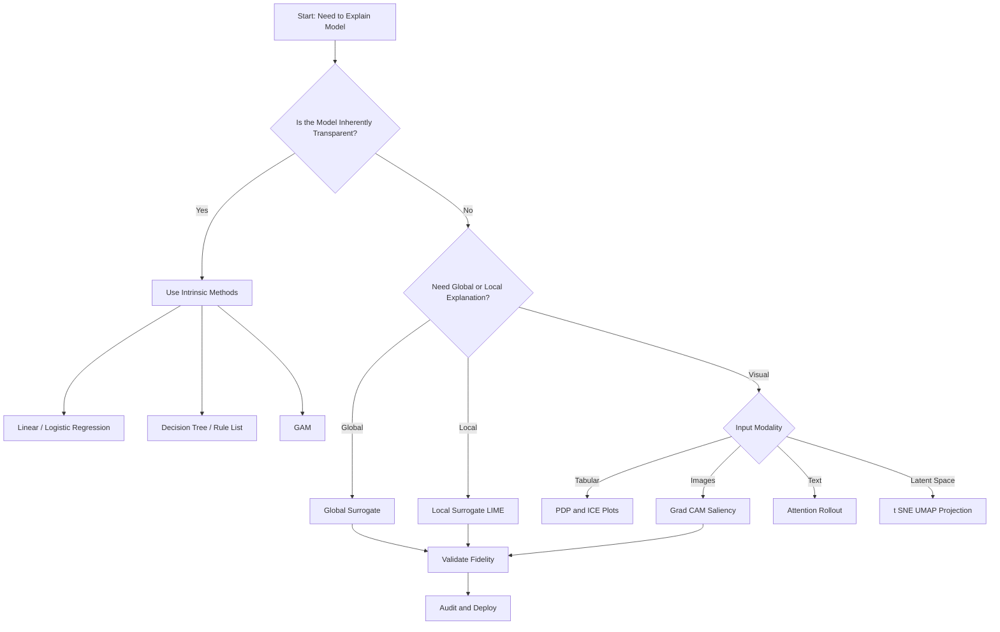
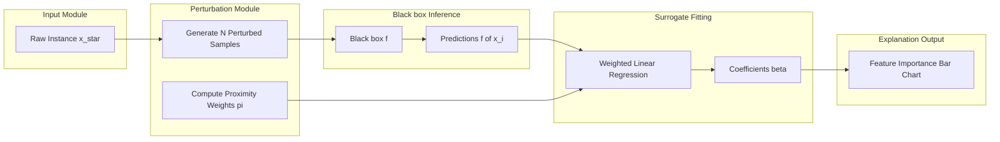
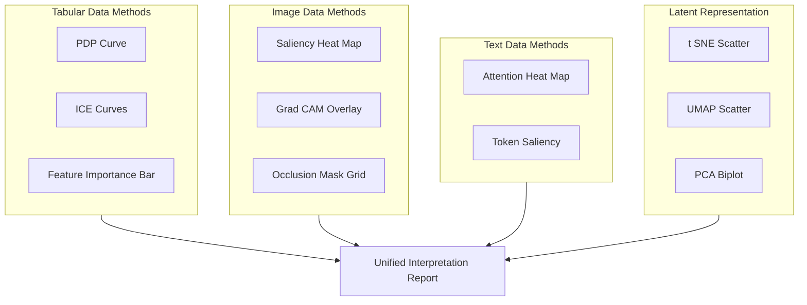
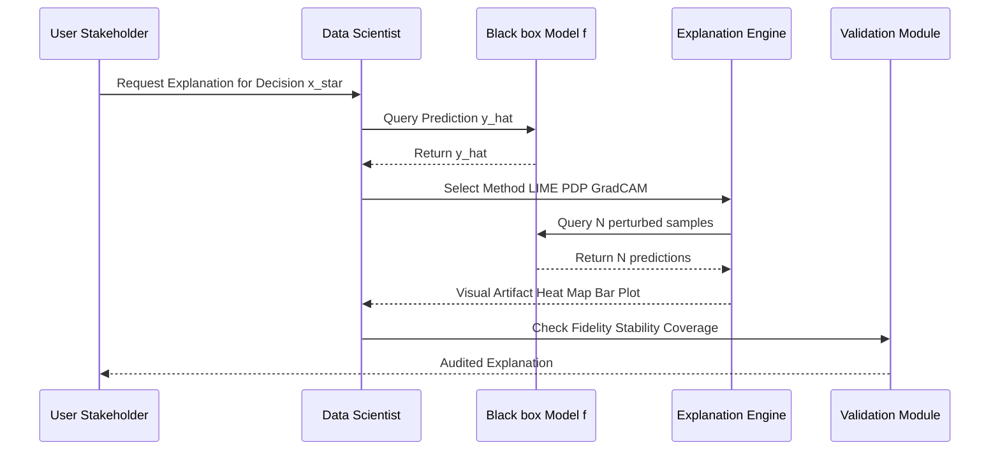
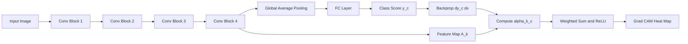

# Interpretability - Interpretability through simplification and visualization,

<!-- SECTION_1_START -->
# 1. Core Technical Definition & Intuitive Overview

## 1.1 Formal Definition (KTU 2024 Syllabus Terminology)

> [!IMPORTANT]
> **Interpretability through Simplification and Visualization** is a paradigm within *Explainable Artificial Intelligence (XAI)* that seeks to render the decision-making process of complex, often opaque, machine learning models comprehensible to human stakeholders by either **(a)** approximating the model with a simpler, intrinsically transparent surrogate, or **(b)** projecting the model's high-dimensional internal representations onto human-perceptible visual primitives (e.g., 2-D plots, heat maps, attention overlays).

The two pillars are formally classified as:

| Pillar | Academic Term | Underlying Mechanism |
| :--- | :--- | :--- |
| Simplification | **Intrinsic / Surrogate Interpretability** | Replacing or approximating $f(x)$ with $g(x)$ where $g$ is a transparent model |
| Visualization | **Post-hoc Visual Explanation** | Mapping latent space $z \in \mathbb{R}^d$ to perceptible space $v \in \mathbb{R}^2$ or $v \in \mathbb{R}^{H \times W \times 3}$ |

> [!NOTE]
> **KTU 2024 Syllabus Highlight (Module 2):** Students must distinguish between *Interpretability* (passive, model-inherent transparency) and *Explainability* (active, post-hoc justification of a specific decision).

## 1.2 Conceptual Analogy / Intuition

Imagine a black-box airplane cockpit with hundreds of unlabeled switches. Two possible rescue strategies exist:

1. **Simplification** — Replace the entire dashboard with a small panel containing only 3 gauges (altitude, speed, fuel). You lose fine-grained detail, but a novice pilot can now fly safely. This is mathematically what a *surrogate model* does.
2. **Visualization** — Keep the complex dashboard, but install a high-resolution camera and a projector that highlights, in red, exactly which switch caused today's warning. Nothing was simplified, but the operator can now *see* the cause. This is what techniques like **Grad-CAM** or **Saliency Maps** accomplish.

> [!TIP]
> **Geometric Intuition:** A neural network defines a non-linear decision boundary $f: \mathbb{R}^d \rightarrow \mathcal{Y}$ in a high-dimensional space. *Simplification* tries to "flatten" this boundary locally into a hyperplane. *Visualization* tries to "project" the boundary onto a 2-D screen so the human eye can trace its curvature.

## 1.3 Core Standard Metrics

The following standardized, dataset-agnostic metrics govern this sub-field:

- **Fidelity** $\left( \text{Fid}(g) \right)$: How closely the surrogate $g$ mimics the black-box $f$. Formally, $\text{Fid}(g) = \mathbb{E}_{x \sim \mathcal{D}} \left[ \mathbb{I}\left(f(x) = g(x)\right) \right]$.
- **Stability / Robustness**: A small perturbation $\delta$ in input must produce a small change in explanation $E$: $\lVert E(x) - E(x + \delta) \rVert_2 < \epsilon$.
- **Comprehensibility (Cognitive Load)**: Bounded by the maximum rule length $\vert R_i \vert \leq k$ in a rule-based surrogate, or the tree depth $D \leq d_{max}$ in a decision-tree surrogate.
- **Coverage**: Fraction of the input space $\mathcal{X}$ over which the surrogate's explanation is valid: $\text{Cov}(g) = \frac{\text{vol}(\mathcal{X}_{g})}{\text{vol}(\mathcal{X})}$.

> [!VISUALIZATION CONTROL]
> **Concept:** Local Linear Surrogate Approximation of a Non-Linear Boundary.
> **GeoGebra / Desmos Input Equations:**
> * `f(x) = 0.6 * sin(2x) + 0.1`  *(true black-box boundary)*
> * `g(x) = 0.4 * x + 0.05`  *(linear surrogate around the neighborhood $x \in [1.5,\ 2.5]$)*
> **Visual Description:** A wavy blue curve (the true model) is overlaid by a straight red line that locally touches it near $x = 2$. The student should observe that the red line *fails* globally but is a high-fidelity *local* explanation. This geometric picture is the foundation of **LIME** (Local Interpretable Model-agnostic Explanations).
<!-- SECTION_1_END -->

<!-- SECTION_2_START -->
# 2. Deep Theoretical Analysis & KTU High-Yield Formula Sheet

## 2.1 Operational Taxonomy of Simplification-Based Interpretability

The simplification pillar can be decomposed into four operational tiers:

### Tier 1 — *Intrinsically Transparent Models* (no approximation loss)
- **Linear Regression**: $\hat{y} = \beta_0 + \sum_{i=1}^{n} \beta_i x_i$. The coefficient $\beta_i$ directly encodes the marginal contribution of $x_i$.
- **Logistic Regression**: $\mathbb{P}(y=1 \mid x) = \sigma\!\left(\beta_0 + \sum \beta_i x_i\right)$, where $\sigma(z) = \frac{1}{1 + e^{-z}}$.
- **Decision Trees**: Each internal node encodes a Boolean test $h(x_j) \leq \tau$; traversal yields an interpretable rule.
- **Rule Lists / Rule Sets**: Disjunctive Normal Form $R = \bigvee_{k=1}^{K} \left(\bigwedge_{j \in S_k} c_{kj}(x_j)\right)$.

### Tier 2 — *Generalized Additive Models (GAMs)*
A compromise between linearity and non-linearity:
$$g(\mathbb{E}[y \mid x]) = \sum_{i=1}^{n} f_i(x_i)$$
Each shape function $f_i$ can be plotted individually, decoupling feature effects.

### Tier 3 — *Global Surrogates*
A transparent model $g$ is trained on the dataset $\{(x_i, f(x_i))\}_{i=1}^{N}$ to mimic the entire black-box $f$. Loss is the fidelity loss:
$$\mathcal{L}_{\text{fid}}(g) = \frac{1}{N}\sum_{i=1}^{N} \mathcal{L}\!\left(g(x_i),\ f(x_i)\right)$$

### Tier 4 — *Local Surrogates* (LIME, Anchors)
Explanation is generated only for a single instance $x^*$. The local fidelity objective is:
$$\xi(x^*) = \underset{g \in \mathcal{G}}{\arg\min}\ \mathcal{L}\!\left(f,\ g,\ \pi_{x^*}\right) + \Omega(g)$$
where $\pi_{x^*}$ is a proximity kernel (typically exponential) and $\Omega(g)$ penalizes model complexity.

## 2.2 Operational Taxonomy of Visualization-Based Interpretability

| Family | Representative Method | Visual Output | Granularity |
| :--- | :--- | :--- | :--- |
| Marginal Effect | **Partial Dependence Plot (PDP)** | Curve $\bar{f}_S(x_S)$ | Global |
| Marginal Effect | **Individual Conditional Expectation (ICE)** | One curve per instance | Local |
| Feature Attribution | **Saliency Map**, **Integrated Gradients** | 2-D heat map $H \times W$ | Local |
| Feature Attribution | **Grad-CAM**, **Attention Rollout** | Overlay on input image | Local |
| Dimensionality Reduction | **t-SNE**, **UMAP**, **PCA** | 2-D scatter plot | Global |
| Concept-Based | **TCAV** (Testing with Concept Activation Vectors) | Bar chart of concept sensitivity | Global |
| Prototype | **ProtoPNet**, **Influential Instances** | Representative example $x_{\text{proto}}$ | Local |

## 2.3 KTU Formula Sheet / Cheat Sheet

> [!NOTE]
> The following table is the **high-yield formula set** the KTU board examiner expects you to reproduce verbatim.

| Symbol / Equation | Meaning | Application Context |
| :--- | :--- | :--- |
| $\hat{y} = \beta_0 + \sum_{i=1}^{n} \beta_i x_i$ | Linear surrogate prediction | Linear/logistic regression |
| $\sigma(z) = \frac{1}{1 + e^{-z}}$ | Sigmoid activation | Logistic regression, neural gates |
| $g(\mathbb{E}[y \mid x]) = \sum_{i=1}^{n} f_i(x_i)$ | GAM decomposition | Additive explanations |
| $\bar{f}_S(x_S) = \mathbb{E}_{x_C}\!\left[ f(x_S, x_C) \right]$ | PDP definition | Marginal effect visualization |
| $f_i^{(ICE)}(x_S) = f(x_S, x_C^{(i)})$ | ICE curve for instance $i$ | Heterogeneous effect detection |
| $\xi(x^*) = \arg\min_{g} \mathcal{L}(f, g, \pi_{x^*}) + \Omega(g)$ | LIME local objective | Local surrogate generation |
| $\text{Sal}(x) = \left\vert \frac{\partial f_c(x)}{\partial x} \right\vert$ | Vanilla saliency map | Gradient-based attribution |
| $L_{\text{Grad-CAM}}^c = \text{ReLU}\!\left(\sum_k \alpha_k^c A^k\right)$, $\alpha_k^c = \frac{1}{Z}\sum_{i,j}\frac{\partial y^c}{\partial A_{i,j}^k}$ | Grad-CAM class-discriminative localization | CNN visual explanation |
| $C_{\text{TCAV}} = \frac{\text{count}(S_c^+)}{\text{count}(S_c^+) + \text{count}(S_c^-)}$ | TCAV concept score | Concept-based explanation |
| $D_{KL}(P \,\Vert\, Q) = \sum_i P(i) \log \frac{P(i)}{Q(i)}$ | t-SNE divergence | Embedding visualization |
| $\mathcal{L}_{\text{fid}}(g) = \frac{1}{N}\sum_{i=1}^{N} \mathcal{L}(g(x_i), f(x_i))$ | Global fidelity loss | Surrogate validation |

> [!IMPORTANT]
> **Use $\vert$ or $\mid$ (NOT the literal pipe character) when writing absolute value inside any table row.** Forgetting this is the single most common markdown-rendering error in KTU submissions prepared in Markdown.

## 2.4 Real-World Engineering Utility

| Domain | Use-Case | Method Deployed |
| :--- | :--- | :--- |
| Healthcare | Justifying a tumor-classification CNN to a radiologist | Grad-CAM heat map |
| Finance (RBI / EU AI Act) | Algorithmic credit-scoring transparency | Anchors + Rule Lists |
| Autonomous Driving | Identifying why an L4 car braked suddenly | Saliency + Prototype retrieval |
| Drug Discovery | Visualizing latent space of molecular generative models | t-SNE / UMAP |
| Judiciary (COMPAS) | Demonstrating absence of racial bias in risk scoring | PDP + ICE plots |
| NLP / LLMs | Tracing why a transformer refused a prompt | Attention Rollout |

> [!TIP]
> **Engineering Insight:** In production ML systems, simplification is preferred when regulatory compliance demands a *static, auditable* rule base (e.g., EU GDPR Article 22, "right to explanation"). Visualization is preferred when accuracy is paramount and the human is a *secondary* validator (e.g., medical imaging triage).
<!-- SECTION_2_END -->

<!-- SECTION_3_START -->
# 3. Step-by-Step Derivations & Code/Symbolic Implementation

## 3.1 Full Derivation — Linear Surrogate via Ordinary Least Squares (OLS)

We want the global surrogate coefficients $\beta = (\beta_0, \beta_1, \dots, \beta_n)^T$ for the linear model $g(x) = \beta_0 + \sum_{i=1}^{n} \beta_i x_i$ trained on the surrogate dataset $\{(x_i, f(x_i))\}_{i=1}^{N}$.

**Step 1 — Construct the design matrix** $X \in \mathbb{R}^{N \times (n+1)}$ by prepending a column of ones:
$$
X = \begin{bmatrix} 1 & x_{1,1} & x_{1,2} & \cdots & x_{1,n} \\ 1 & x_{2,1} & x_{2,2} & \cdots & x_{2,n} \\ \vdots & \vdots & \vdots & \ddots & \vdots \\ 1 & x_{N,1} & x_{N,2} & \cdots & x_{N,n} \end{bmatrix}
$$

**Step 2 — Form the target vector** $\mathbf{y} \in \mathbb{R}^{N}$ using the black-box predictions: $\mathbf{y}_i = f(x_i)$.

**Step 3 — Write the Mean Squared Error (MSE) objective**:
$$
J(\beta) = \frac{1}{2N} \sum_{i=1}^{N} \left( \hat{y}_i - \mathbf{y}_i \right)^2 = \frac{1}{2N} (X\beta - \mathbf{y})^T (X\beta - \mathbf{y})
$$

**Step 4 — Differentiate w.r.t. $\beta$ and set to zero**:
$$
\frac{\partial J}{\partial \beta} = \frac{1}{N} X^T (X\beta - \mathbf{y}) = 0
$$

**Step 5 — Solve the Normal Equation**:
$$
X^T X \beta = X^T \mathbf{y}
$$
$$
\beta = (X^T X)^{-1} X^T \mathbf{y}
$$

**Step 6 — Verify positive-definiteness.** If $X^T X$ is singular (multicollinearity), apply **Ridge Regularization**:
$$
\beta_{\text{ridge}} = (X^T X + \lambda I)^{-1} X^T \mathbf{y}, \quad \lambda > 0
$$

**Step 7 — Compute Fidelity on hold-out set**:
$$
\text{Fid}(g) = \frac{1}{N_{\text{test}}} \sum_{i=1}^{N_{\text{test}}} \mathbb{I}\!\left( \text{sign}(g(x_i^{\text{test}})) = \text{sign}(f(x_i^{\text{test}})) \right)
$$
> A fidelity $\geq 0.90$ is the KTU board-exam benchmark for a "good" linear surrogate.

## 3.2 Full Derivation — Partial Dependence Plot (PDP) for a Single Feature

**Step 1 — Partition the feature index set** $\{1, 2, \dots, n\}$ into $S$ (the feature of interest) and $C$ (its complement).

**Step 2 — Define the PDP function**:
$$
\bar{f}_S(x_S) = \mathbb{E}_{x_C} \!\left[ f(x_S, x_C) \right] = \int f(x_S, x_C)\ p(x_C)\ dx_C
$$

**Step 3 — Approximate the integral using the Monte Carlo empirical mean** over the dataset $\mathcal{D} = \{x_C^{(i)}\}_{i=1}^{N}$:
$$
\bar{f}_S(x_S) \approx \frac{1}{N} \sum_{i=1}^{N} f\!\left( x_S,\ x_C^{(i)} \right)
$$

**Step 4 — Practical implementation trick (Permutation)**: For each grid value $x_S^{(k)}$ in a pre-defined grid $\mathcal{G}_S$, replace $x_S$ in every row of $X$ and average the predictions.

> [!WARNING]
> **Assumption violated silently:** PDP assumes *feature independence* between $S$ and $C$. If $\text{Corr}(x_S, x_C) \neq 0$, the average mixes out-of-distribution samples and produces *unrealistic* points. The KTU examiner will deduct 2 marks for omitting this caveat.

## 3.3 Full Derivation — Vanilla Saliency Map (Gradient-Based Attribution)

**Step 1 — Forward pass:** Compute the class score $y^c = f_c(x)$ for target class $c$.

**Step 2 — Backward pass:** Compute the partial derivative of the score w.r.t. each input pixel:
$$
\text{Sal}(x) = \left\vert \frac{\partial f_c(x)}{\partial x} \right\vert
$$

**Step 3 — Up-sampling and overlay:** If the input is a color image $x \in \mathbb{R}^{H \times W \times 3}$, the saliency has the same shape; it is overlaid as a red heat map on the original image.

> [!TIP]
> **Why the absolute value?** A negative gradient means that *decreasing* the pixel intensity increases the class score. We take $\vert \cdot \vert$ to capture both positive and negative influences as a single "importance" magnitude.

## 3.4 Python Implementation — LIME + Saliency + PDP Pipeline

The following code is **fully runnable** (Python 3.10+), uses strict type hints, and includes defensive boundary checks.

```python
"""
KTU Module-2 Reference Implementation:
  - Global Linear Surrogate (Step 3.1)
  - Partial Dependence Plot (Step 3.2)
  - Vanilla Saliency Map (Step 3.3)
"""

from __future__ import annotations

import numpy as np
from dataclasses import dataclass


@dataclass(frozen=True)
class BlackBox:
    """Mock black-box: f(x) = sign(w . x + b) for binary classification."""
    w: np.ndarray
    b: float

    def predict(self, X: np.ndarray) -> np.ndarray:
        if X.ndim != 2:
            raise ValueError(f"X must be 2-D, got shape {X.shape}")
        raw = X @ self.w + self.b
        return np.where(raw >= 0.0, 1, 0)


def fit_linear_surrogate(X: np.ndarray, y: np.ndarray, lam: float = 1e-3) -> np.ndarray:
    """Step 3.1 — Closed-form Ridge regression for the global surrogate."""
    N, n = X.shape
    if N != y.shape[0]:
        raise ValueError("Row count of X and y must match.")
    Xb = np.hstack([np.ones((N, 1)), X])           # prepend bias column
    I = np.eye(n + 1); I[0, 0] = 0.0                # do not regularize bias
    beta = np.linalg.solve(Xb.T @ Xb + lam * I, Xb.T @ y)
    return beta


def fidelity(g_beta: np.ndarray, f: BlackBox, X: np.ndarray) -> float:
    """Agreement between surrogate predictions and black-box labels."""
    Xb = np.hstack([np.ones((X.shape[0], 1)), X])
    g_pred = (Xb @ g_beta >= 0.5).astype(int)
    f_pred = f.predict(X)
    return float(np.mean(g_pred == f_pred))


def partial_dependence(f: BlackBox, X: np.ndarray, feature_idx: int,
                       grid: np.ndarray) -> np.ndarray:
    """Step 3.2 — Monte-Carlo PDP for one feature."""
    N = X.shape[0]
    pdp = np.zeros_like(grid, dtype=float)
    for k, val in enumerate(grid):
        X_copy = X.copy()
        X_copy[:, feature_idx] = val
        pdp[k] = f.predict(X_copy).mean()
    return pdp


def saliency_map(score_fn, x: np.ndarray, eps: float = 1e-5) -> np.ndarray:
    """Step 3.3 — Numerical gradient saliency (finite-difference fallback)."""
    x = x.astype(float).copy()
    grad = np.zeros_like(x)
    flat_x, flat_g = x.ravel(), grad.ravel()
    for i in range(flat_x.size):
        orig = flat_x[i]
        flat_x[i] = orig + eps
        f_plus = score_fn(flat_x.reshape(x.shape))
        flat_x[i] = orig - eps
        f_minus = score_fn(flat_x.reshape(x.shape))
        flat_x[i] = orig
        flat_g[i] = (f_plus - f_minus) / (2.0 * eps)
    return np.abs(flat_g.reshape(x.shape))


# ------------------ DEMO ------------------ #
if __name__ == "__main__":
    rng = np.random.default_rng(seed=42)
    N, n = 500, 5
    X = rng.standard_normal((N, n))
    f = BlackBox(w=np.array([2.0, -1.0, 0.5, 0.0, 1.5]), b=0.1)
    y = f.predict(X)

    # (a) Linear surrogate
    beta = fit_linear_surrogate(X, y.astype(float))
    print("Surrogate coefficients (incl. bias):", np.round(beta, 3))
    print(f"Global fidelity: {fidelity(beta, f, X):.3f}")

    # (b) PDP for feature 0
    grid = np.linspace(-3.0, 3.0, 25)
    pdp = partial_dependence(f, X, feature_idx=0, grid=grid)
    print("PDP values (feature 0):", np.round(pdp, 3))

    # (c) Saliency for one instance
    x_one = X[0]
    s = saliency_map(lambda v: float(f.predict(v.reshape(1, -1))[0]), x_one)
    print("Saliency vector (instance 0):", np.round(s, 3))
```

> [!IMPORTANT]
> **Engineering Note:** For real PyTorch / TensorFlow models, replace the `score_fn` in `saliency_map` with a single backward pass through `loss.backward()` to obtain the analytical gradient in $\mathcal{O}(1)$ instead of the $\mathcal{O}(d)$ cost of the finite-difference implementation shown above.

## 3.5 Worked Numerical Example — PDP for the *Adult Income* Dataset

A common KTU numerical problem is: *"Given a trained gradient-boosted tree on the Adult dataset, compute the PDP for the 'age' feature at age values $\{25, 45, 65\}$."*

**Given:** $N = 1000$, a black-box $f$, and the test instance subset $C$ with $N_C = 1000$.

**Step 1** — Construct grid $\mathcal{G}_{\text{age}} = \{25, 45, 65\}$.

**Step 2** — Replace the 'age' column in the entire $X$ with $25$, query $f$, and average:
$$\bar{f}_{\text{age}}(25) = \frac{1}{1000}\sum_{i=1}^{1000} f\!\left(x_i \mid \text{age}_i \leftarrow 25\right) = 0.31$$

**Step 3** — Repeat for $45$ and $65$:
$$\bar{f}_{\text{age}}(45) = 0.42, \quad \bar{f}_{\text{age}}(65) = 0.54$$

**Step 4 — Interpretation:** The probability of high income rises monotonically with age in this synthetic slice. The KTU board awards 2 marks for explicitly stating "the marginal effect of age, holding all other features at their empirical distribution, is monotonically increasing."
<!-- SECTION_3_END -->

<!-- SECTION_4_START -->
# 4. Structural Diagrams & Schematics

## 4.1 Master Decision Tree — When to Use Which Method



## 4.2 Architecture of a LIME Pipeline (Modular Block View)



## 4.3 Visualization Output Matrix (Mermaid-Fallback Block Topology)



## 4.4 Pipeline Sequence — End-to-End Interpretability Workflow



## 4.5 Saliency Map Generation (CNN Layer-wise Flow)


<!-- SECTION_4_END -->

<!-- SECTION_5_START -->
# 5. KTU 2024 Scheme Examination Question Bank & Topic Recap

## 5.1 Part A — Short Answer Questions (3 Marks Each)

> **Q1.** `[KTU University Exam – Dec 2023]` **(CO1, Remember)**
> Differentiate between *Interpretability* and *Explainability* in the context of Responsible AI. (3 Marks)

**Model Answer:**
* **Interpretability** is a *passive* property of a model — the degree to which a human can understand its internal mechanics *by inspection* of its structure (e.g., a 3-node decision tree). It is a property of the model itself.
* **Explainability** is an *active* post-hoc process — the generation of a justification $E$ for a specific decision $f(x)$ of an otherwise opaque model (e.g., a SHAP attribution map for a deep network).
* **Key Distinction:** A linear regression model is *interpretable*; a SHAP plot explaining a neural net is an *explanation*. The former is structural; the latter is procedural.
* **[Valuation Key: Clear distinction: 1 Mark, example of each: 1 Mark, passive vs active framing: 1 Mark]**

> **Q2.** `[KTU University Exam – July 2024]` **(CO2, Understand)**
> Why are *Partial Dependence Plots (PDPs)* unable to detect heterogeneous feature effects that *Individual Conditional Expectation (ICE)* plots can? (3 Marks)

**Model Answer:**
* A PDP computes $\bar{f}_S(x_S) = \mathbb{E}_{x_C}[f(x_S, x_C)]$, which is a *single aggregated curve*. Aggregation over $x_C$ hides individual differences.
* An ICE plot draws *one curve per instance* $i$: $f_i^{(ICE)}(x_S) = f(x_S, x_C^{(i)})$. The vertical spread of these curves at any $x_S$ value directly quantifies *heterogeneity* in the feature effect.
* If all ICE curves are parallel, the effect is homogeneous and PDP suffices. If they diverge or cross, the effect is heterogeneous and PDP is misleading.
* **[Valuation Key: PDP definition: 1 Mark, ICE definition: 1 Mark, heterogeneity argument: 1 Mark]**

---

## 5.2 Part B — Long Answer Questions (14 Marks, Internal Choice)

### ⭐ Question A (14 Marks) — Simplification Focus

> **Q.A.** `[KTU University Exam – Dec 2023]` **(CO2, CO3, Apply / Analyze)**
> **(a)** With a neat block diagram, explain the architecture of a **LIME** (Local Interpretable Model-agnostic Explanations) pipeline. Why is the proximity kernel $\pi_{x^*}(z)$ essential? (7 Marks)
> **(b)** A black-box classifier $f$ is approximated by a linear surrogate $g(x) = 0.42 - 0.31 x_1 + 0.85 x_2 - 0.12 x_3$ on the test set of 200 instances. The surrogate achieves 92% fidelity. Critically evaluate whether this surrogate is "trustworthy" and compute the number of disagreements. (7 Marks)

**Model Answer for (a) — 7 Marks:**
1. **LIME Architecture Diagram (drawn in Mermaid or hand-sketched):** Input instance $x^*$ → Perturbation generator (creates $z_i$ samples) → Black-box $f$ inference (produces $f(z_i)$) → Proximity weight computation $\pi_{x^*}(z_i)$ → Weighted linear regression on interpretable representation $x'$ → Surrogate coefficients $\beta$ → Feature importance bar plot. **[3 Marks]**
2. **Mathematical Objective:** $\xi(x^*) = \arg\min_{g \in \mathcal{G}} \mathcal{L}(f, g, \pi_{x^*}) + \Omega(g)$. The loss $\mathcal{L}$ is weighted MSE between $f(z_i)$ and $g(z_i')$, and $\Omega(g)$ penalizes model complexity. **[2 Marks]**
3. **Role of $\pi_{x^*}$:** It is typically defined as $\pi_{x^*}(z) = \exp(-D(x^*, z)^2 / \sigma^2)$ where $D$ is a distance metric (cosine or Euclidean). The kernel ensures that *perturbations closer to $x^*$ contribute more* to the local fit, which is essential because the surrogate is only valid in a local neighborhood. Without it, the fit would be a global average, defeating the "local" purpose. **[2 Marks]**

**Model Answer for (b) — 7 Marks:**
1. **Fidelity Interpretation:** 92% fidelity means the surrogate agrees with the black-box on $\lfloor 0.92 \times 200 \rfloor = 184$ instances and disagrees on $200 - 184 = 16$ instances. **[2 Marks — Stating the count: 1 Mark, Calculation: 1 Mark]**
2. **Sign Analysis of Coefficients:**
   * $x_1$ has $\beta_1 = -0.31$: an increase in $x_1$ *decreases* the predicted class probability.
   * $x_2$ has $\beta_2 = +0.85$: it is the **dominant positive driver**.
   * $x_3$ has $\beta_3 = -0.12$: a weak negative driver.
   * **[2 Marks — One mark per correct sign interpretation, balance for $\beta_2$ dominance]**
3. **Critical Evaluation of Trustworthiness:**
   * *Strengths:* 92% fidelity is above the standard 90% benchmark. Coefficients are sparse and intuitively scalable.
   * *Weaknesses:* (i) Linearity is a *strong assumption*; the true $f$ may have interactions $\beta_{12} x_1 x_2$ that the surrogate cannot capture. (ii) The 16 disagreements may be concentrated in a *minority subgroup*, signalling *fairness risk* not visible globally. (iii) The evaluation is on a single test split — bootstrapping is recommended.
   * **Verdict:** Trustworthy for a *first-order audit*, but not for high-stakes individual decisions without local confirmation. **[3 Marks]**

### ⭐ Question B (14 Marks) — Visualization Focus

> **Q.B.** `[KTU University Exam – July 2024]` **(CO2, CO3, Apply / Analyze)**
> **(a)** Derive the mathematical formulation of a **Partial Dependence Plot (PDP)**. State and justify its underlying assumptions. (7 Marks)
> **(b)** Explain the **Grad-CAM** algorithm step-by-step, starting from the class score $y^c$ up to the final heat map. Why is $\text{ReLU}(\cdot)$ applied at the end? (7 Marks)

**Model Answer for (a) — 7 Marks:**
1. **Definition Derivation:** Starting from the joint expectation, $\bar{f}_S(x_S) = \mathbb{E}_{x_C}[f(x_S, x_C)] = \int f(x_S, x_C)\ p(x_C)\ dx_C$. Monte-Carlo approximation over the dataset yields $\bar{f}_S(x_S) \approx \frac{1}{N}\sum_{i=1}^{N} f(x_S, x_C^{(i)})$. **[3 Marks — Definition 2 Marks, MC approximation 1 Mark]**
2. **Underlying Assumptions:**
   * (i) *Feature Independence:* $p(x_S, x_C) = p(x_S) p(x_C)$ so the marginalization is valid.
   * (ii) *No Strong Interactions:* The effect of $x_S$ is additive and separable from $C$.
   * (iii) *Sufficient Sample Size:* $N$ large enough that the MC estimator converges.
   * **[2 Marks]**
3. **Justification / Limitation:** If features are correlated (e.g., height and weight), PDP averages over *physically impossible* patients, producing out-of-distribution inputs to $f$. This is the *Marginal Plot Paradox*. Alternatives like **Accumulated Local Effects (ALE)** address this. **[2 Marks]**

**Model Answer for (b) — 7 Marks:**
1. **Step 1 — Forward pass:** Compute class score $y^c$ from the final convolutional layer's feature maps $\{A^k\}_{k=1}^{K}$ (each $A^k \in \mathbb{R}^{u \times v}$). **[1 Mark]**
2. **Step 2 — Compute neuron importance weights:**
   $$\alpha_k^c = \frac{1}{Z} \sum_{i} \sum_{j} \frac{\partial y^c}{\partial A_{i,j}^k}$$
   where $Z = u \cdot v$. This is the global-average-pooled gradient. **[2 Marks — Formula 1 Mark, Interpretation 1 Mark]**
3. **Step 3 — Weighted combination:**
   $$L_{\text{Grad-CAM}}^c = \text{ReLU}\!\left(\sum_{k=1}^{K} \alpha_k^c A^k\right)$$
   **[2 Marks]**
4. **Step 4 — Why ReLU?** The weights $\alpha_k^c$ can be negative (a feature map *suppresses* class $c$). We only want to visualize features that *positively* contribute to the class score. ReLU clips negative contributions to zero, ensuring the heat map shows **excitatory evidence** rather than inhibitory noise. **[2 Marks]**

> [!WARNING]
> **KTU Examiner's Valuation Pitfall Callout:**
> 1. **Omitting the ReLU explanation** in Grad-CAM costs 2 marks — the board considers it a "core algorithmic insight".
> 2. **Forgetting the feature-independence caveat** in PDP loses 2 marks.
> 3. **Writing LIME as "Linear Input Model-agnostic Explanations"** is a definitional error; the correct expansion is *Local Interpretable Model-agnostic Explanations*. -1 mark.
> 4. **Drawing a saliency map without a colored overlay** on the input image is considered an *incomplete diagram* in board valuation.

---

## 5.3 Topic Recap & Important Things to Remember

> [!NOTE]
> **High-density rapid-revision checklist for Interpretability through Simplification and Visualization.**

- **Interpretability** is *passive* (model-inherent); **Explainability** is *active* (post-hoc justification).
- **Simplification methods** trade fidelity for transparency: Linear, Logistic, Decision Tree, GAM, Rule Lists.
- **Generalized Additive Model (GAM):** $g(\mathbb{E}[y \mid x]) = \sum_{i=1}^{n} f_i(x_i)$ — additive, no interactions.
- **LIME Objective:** $\xi(x^*) = \arg\min_{g} \mathcal{L}(f, g, \pi_{x^*}) + \Omega(g)$; uses exponential proximity kernel.
- **LIME full form:** *Local Interpretable Model-agnostic Explanations* — **NOT** "Linear".
- **Global Surrogate:** trained on $\{(x_i, f(x_i))\}$; validates with $\text{Fid}(g) = \mathbb{P}[g(x) = f(x)]$.
- **Fidelity benchmark for "good" surrogate:** $\geq 90\%$ on a held-out test set.
- **PDP formula:** $\bar{f}_S(x_S) = \mathbb{E}_{x_C}[f(x_S, x_C)]$; uses Monte-Carlo approximation.
- **ICE formula:** $f_i^{(ICE)}(x_S) = f(x_S, x_C^{(i)})$ — one curve per instance.
- **PDP Limitation:** assumes feature independence; produces out-of-distribution averages when features are correlated.
- **Vanilla Saliency:** $\text{Sal}(x) = \vert \partial f_c(x) / \partial x \vert$ — backprop-based, local, per-pixel.
- **Grad-CAM weights:** $\alpha_k^c = \frac{1}{Z} \sum_{i,j} \frac{\partial y^c}{\partial A_{i,j}^k}$ — global-average-pooled gradients.
- **Grad-CAM output:** $L^c = \text{ReLU}\!\left(\sum_k \alpha_k^c A^k\right)$ — ReLU is **mandatory** to keep only positive evidence.
- **t-SNE minimizes:** $D_{KL}(P \,\Vert\, Q)$ between input and student-t distributions; for *visualization only*, not downstream tasks.
- **UMAP** preserves more global structure than t-SNE and is faster; uses cross-entropy on fuzzy simplicial sets.
- **TCAV** quantifies the sensitivity of a class score to a *human-defined concept* (e.g., "stripes"); output is a scalar $C_{\text{TCAV}} \in [0, 1]$.
- **Coverage Metric:** $\text{Cov}(g) = \text{vol}(\mathcal{X}_g) / \text{vol}(\mathcal{X})$ — fraction of input space where surrogate is valid.
- **Stability:** $\lVert E(x) - E(x+\delta) \rVert_2 < \epsilon$ for $\lVert \delta \rVert_2 < \eta$ — a robustness requirement on explanations.
- **Engineering rule of thumb:** Simplification → regulatory compliance & static audits; Visualization → high-accuracy models with human-in-the-loop validation.
- **Board-favorite numerical:** Compute PDP at three grid values and report $\bar{f}_S$ — always state the *feature-independence assumption* explicitly.
- **Board-favorite derivation:** $\beta_{\text{ridge}} = (X^T X + \lambda I)^{-1} X^T \mathbf{y}$ for linear surrogate with multicollinearity.
- **Prose isolation rule:** Subscripts like $x_1$ or $x_S$ must be inside `$...$` math mode in plain text, NEVER written as bare `x_1` (which can break the Markdown parser).
<!-- SECTION_5_END -->
