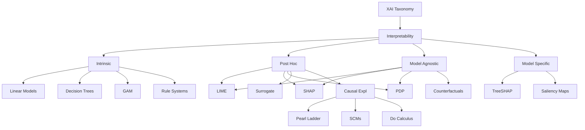
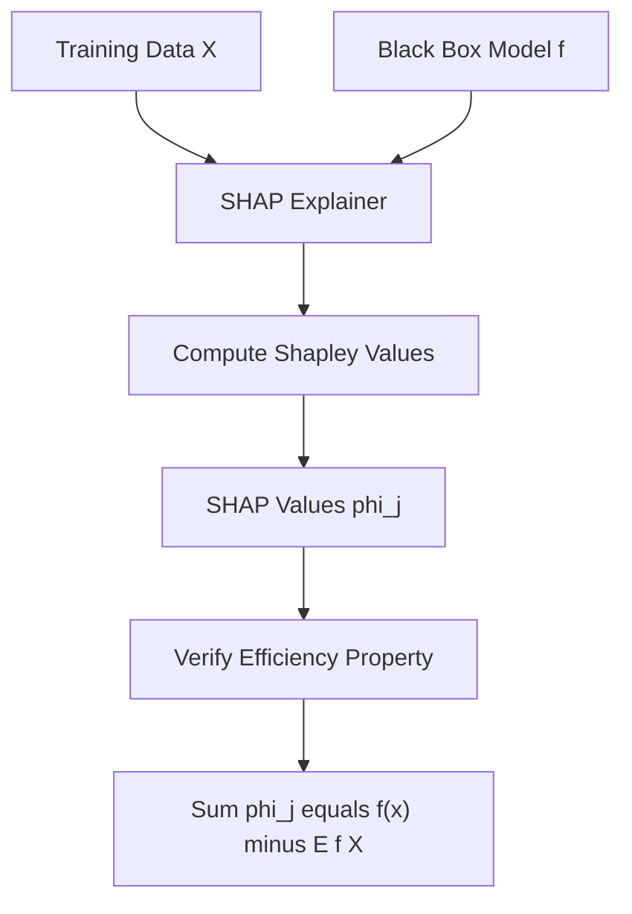
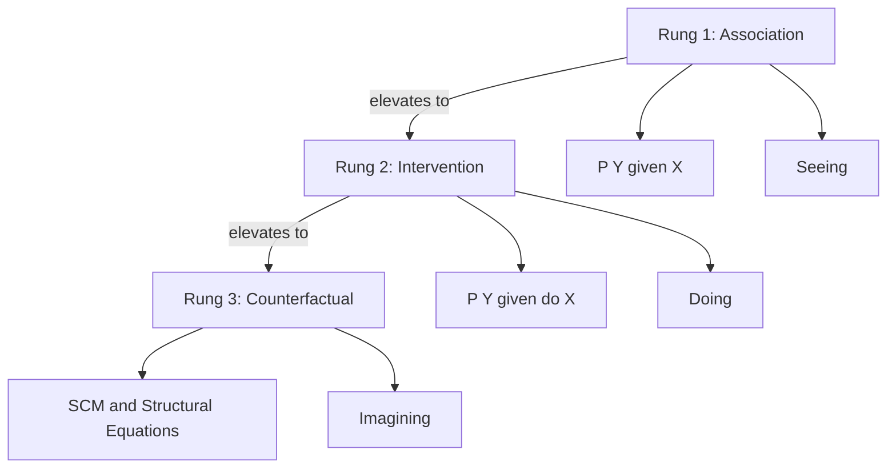
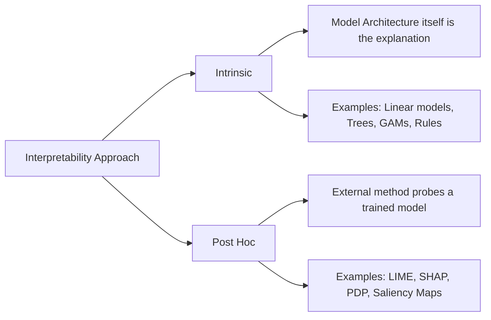
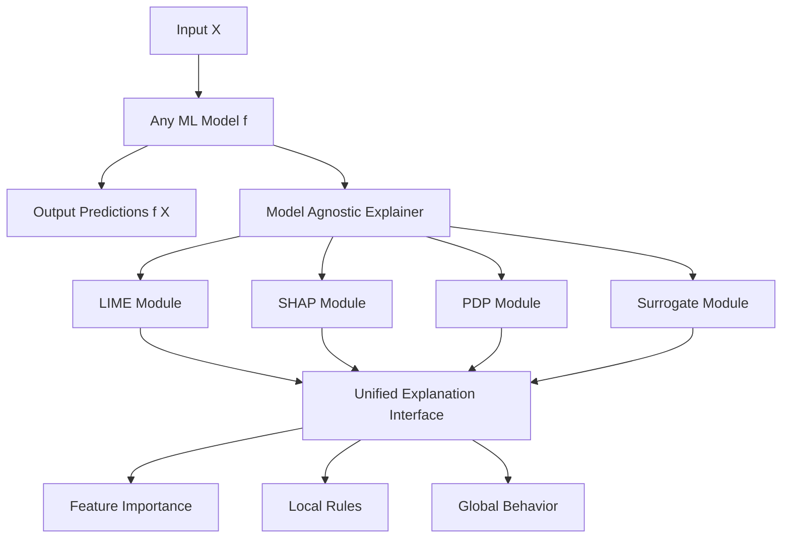

# Intrinsic interpretable methods, Post Hoc interpretability, Explainability through causality, Model agnostic Interpretation.

<!-- SECTION_1_START -->
# MODULE 2: INTERPRETABILITY AND EXPLAINABILITY

## 1.1 Core Technical Definition & Intuitive Overview

### **Intrinsic Interpretable Methods**

> [!IMPORTANT]
> **Formal KTU 2024 Definition (Intrinsic Interpretability):**
> *Intrinsic interpretability* refers to machine learning models that are **inherently transparent** by virtue of their internal structure, allowing humans to understand the decision-making process **directly from the model architecture** without requiring auxiliary explanation techniques.

In simpler terms, an *intrinsically interpretable* model is one where you can **"look under the hood"** and immediately trace how an input became an output. There is no black box — the model's logic is the explanation.

**Conceptual Analogy — The Glass Office Building:**
Imagine two buildings:
- A **glass-walled office** (intrinsic interpretable model): You can see every employee, every desk, and exactly how paperwork moves from the reception desk to the CEO.
- A **solid concrete skyscraper** (black-box model): You only see the input (mail enters the lobby) and the output (a decision letter exits). The internal process is hidden.

Intrinsic methods include:
- **Linear & Logistic Regression** (coefficients tell the story)
- **Decision Trees** (each split is a rule)
- **Rule-Based Systems** (IF-THEN rules)
- **Generalized Additive Models (GAMs)**
- **Prototype & Example-Based Models** (k-Nearest Neighbors, Case-Based Reasoning)
- **Attention Mechanisms** (in transformers, attention weights are often intrinsic)

### **Post Hoc Interpretability**

> [!IMPORTANT]
> **Formal KTU 2024 Definition (Post Hoc Interpretability):**
> *Post hoc interpretability* refers to techniques applied **after a model has been trained** to extract, approximate, or visualize its decision logic. The original model is treated as a black box, and explanations are generated by probing its input–output behavior.

**Conceptual Analogy — The Survey Researcher:**
After an election, a researcher (post hoc interpreter) calls voters *after* they have voted (after training) and asks them **why** they chose a particular candidate. The researcher never had access to the actual decision in real-time, but reconstructs the reasoning by querying behavior.

Common post hoc techniques:
- **LIME (Local Interpretable Model-agnostic Explanations)**
- **SHAP (SHapley Additive exPlanations)**
- **Partial Dependence Plots (PDP)**
- **Individual Conditional Expectation (ICE) Plots**
- **Permutation Feature Importance**
- **Saliency Maps** (in deep learning / CNNs)
- **Surrogate Models**

### **Explainability Through Causality**

> [!IMPORTANT]
> **Formal KTU 2024 Definition (Causal Explainability):**
> *Causal explainability* moves beyond statistical correlation to identify **cause-effect relationships** between input features and model predictions, often using **Structural Causal Models (SCMs)**, **do-calculus**, and **counterfactual reasoning**.

**Conceptual Analogy — The Doctor vs. The Statistician:**
- A **statistician** says: *"Patients who took the drug recovered 80% of the time."* (Correlation)
- A **doctor** says: *"The drug **caused** recovery because it blocked the virus's replication mechanism."* (Causation)

Causal explainability answers the **"what if"** questions:
- *What if* this patient had not taken the drug?
- *What would have happened* if a different feature value were used?

Key frameworks:
- **Pearl's Causal Ladder** (Association → Intervention → Counterfactual)
- **Structural Causal Models (SCMs)**
- **Counterfactual Explanations**
- **Causal Bayesian Networks**

### **Model-Agnostic Interpretation**

> [!IMPORTANT]
> **Formal KTU 2024 Definition (Model-Agnostic Interpretation):**
> *Model-agnostic interpretation* refers to explanation methods that **do not depend on the internal architecture** of the model being explained. They treat the model as an opaque function and derive explanations solely from its **inputs and outputs**.

**Conceptual Analogy — The Universal Translator:**
Imagine a translator device that works regardless of the language spoken. It doesn't need to know the grammar of Swahili to translate it into English — it just observes the *behavior* (inputs/outputs). Similarly, model-agnostic tools like LIME and SHAP work for neural networks, random forests, SVMs, and gradient boosting machines alike.

Key properties of model-agnostic methods:
- **Flexibility**: Apply to any ML model
- **Explanation Flexibility**: Can use different explanation representations (feature importance, rules, etc.)
- **Representational Flexibility**: Can be applied to any feature space (text, image, tabular)

---

> [!VISUALIZATION CONTROL]
> **Concept:** Comparison of the four XAI paradigms on the *interpretability–accuracy* trade-off plane
> **GeoGebra / Desmos Input Equations:**
> * `Intrinsic(x) = -0.3*x + 0.9` (high interpretability, lower flexibility)
> * `PostHoc(x) = 0.4*x + 0.4` (moderate curve)
> * `Causal(x) = 0.5*x + 0.3` (steep, deep reasoning)
> * `ModelAgnostic(x) = 0.6*x + 0.2` (most flexible)
> **Visual Description:** Plot interpretability (y-axis) vs model flexibility (x-axis). Intrinsic models cluster top-left, model-agnostic at top-right, with post-hoc and causal methods as bridging paradigms.

---
<!-- SECTION_1_END -->

<!-- SECTION_2_START -->
# 2. DEEP THEORETICAL ANALYSIS & KTU HIGH-YIELD FORMULA SHEET

## 2.1 Intrinsic Interpretable Methods — Theoretical Decomposition

### **2.1.1 Linear Models**
For a linear regression model:
$$\hat{y} = \beta_0 + \sum_{j=1}^{p} \beta_j x_j + \epsilon$$

- Each $\beta_j$ represents the **change in prediction** for a **one-unit increase** in $x_j$, holding all other features constant.
- The **sign** of $\beta_j$ indicates **direction** (positive/negative influence).
- The **magnitude** $|\beta_j|$ indicates **strength** of influence (after standardization).

### **2.1.2 Decision Trees**
A decision tree recursively partitions the feature space:
$$\text{Information Gain}(S, A) = H(S) - \sum_{v \in \text{Values}(A)} \frac{\vert S_v \vert}{\vert S \vert} H(S_v)$$

Where:
- $H(S)$ is the entropy of set $S$
- $A$ is the attribute being tested
- $S_v$ is the subset of $S$ where $A = v$

### **2.1.3 Generalized Additive Models (GAMs)**
GAMs extend linear models by allowing non-linear functions per feature:
$$g(E[y]) = \beta_0 + \sum_{j=1}^{p} f_j(x_j)$$

Where $f_j$ are smooth (often spline) functions. Each $f_j(x_j)$ is a **shape function** that can be plotted.

### **2.1.4 Rule-Based Systems**
Production rules of the form:
$$\text{IF } (\text{condition}_1 \land \text{condition}_2) \text{ THEN class} = C_k$$

Each rule is a self-contained, human-readable explanation.

---

## 2.2 Post Hoc Interpretability — Theoretical Decomposition

### **2.2.1 LIME (Local Interpretable Model-agnostic Explanations)**

The core LIME objective is:
$$\xi(x) = \arg\min_{g \in G} \, L(f, g, \pi_x) + \Omega(g)$$

Where:
- $f$ is the original black-box model
- $g$ is the interpretable surrogate model
- $\pi_x$ is the **proximity measure** defining the local neighborhood around instance $x$
- $\Omega(g)$ is a **complexity penalty** (e.g., tree depth)
- $L$ is the **fidelity loss**: $L(f, g, \pi_x) = \sum_{z, z' \in Z} \pi_x(z) (f(z) - g(z'))^2$

### **2.2.2 SHAP (SHapley Additive exPlanations)**

SHAP values come from cooperative game theory (Shapley, 1953):
$$\phi_j = \sum_{S \subseteq F \setminus \{j\}} \frac{\vert S \vert! \, (M - \vert S \vert - 1)!}{M!} [f_{S \cup \{j\}}(x_{S \cup \{j\}}) - f_S(x_S)]$$

Where:
- $\phi_j$ is the SHAP value for feature $j$
- $M$ is the total number of features
- $S$ is a subset of features not containing $j$
- $f_S$ is the model trained using only features in $S$

**Efficiency Property (a key KTU property):**
$$\sum_{j=1}^{M} \phi_j = f(x) - E[f(X)]$$

### **2.2.3 Partial Dependence Plots (PDPs)**

The partial dependence function for feature subset $S$:
$$\bar{f}_S(x_S) = E_{X_C} [f(x_S, X_C)] = \int f(x_S, x_C) \, dP(x_C)$$

In practice (with finite data):
$$\bar{f}_S(x_S) = \frac{1}{n} \sum_{i=1}^{n} f(x_S, x_C^{(i)})$$

### **2.2.4 Permutation Feature Importance**

$$\text{PFI}(j) = \frac{1}{K} \sum_{k=1}^{K} \left( L(y, \hat{f}(X^{(j, k)}_{\text{perm}})) - L(y, \hat{f}(X)) \right)$$

Where $X^{(j, k)}_{\text{perm}}$ is the dataset with feature $j$ permuted at iteration $k$.

---

## 2.3 Explainability Through Causality — Theoretical Decomposition

### **2.3.1 Pearl's Causal Ladder (Three Rungs)**

| **Rung** | **Level** | **Question Answered** | **Mathematical Tool** |
|---|---|---|---|
| 1 | Association | "How does X correlate with Y?" | Conditional Probability $P(Y \vert X)$ |
| 2 | Intervention | "What if I do X?" | Do-operator $P(Y \vert do(X))$ |
| 3 | Counterfactual | "What if I had done X?" | Structural Equations, SCMs |

### **2.3.2 Structural Causal Model (SCM)**

An SCM is a tuple $\langle U, V, F, P(U) \rangle$ where:
- $U$ = set of exogenous (background) variables
- $V$ = set of endogenous (observed) variables
- $F$ = set of structural functions $f_i$ such that $v_i = f_i(\text{pa}(v_i), u_i)$
- $P(U)$ = probability distribution over exogenous variables

### **2.3.3 Counterfactual Explanation**

Given a prediction $\hat{y} = c$ for instance $x$, find the **closest instance** $x'$ such that:
$$\hat{y}(x') \neq c$$

Formally:
$$x' = \arg\min_{x^*} \, d(x, x^*) \quad \text{subject to} \quad \hat{f}(x^*) = c' \neq c$$

Where $d$ is a distance metric (often $L_1$, $L_2$, or Mahalanobis).

### **2.3.4 Average Causal Effect (ACE)**

$$\text{ACE} = E[Y \vert do(X = 1)] - E[Y \vert do(X = 0)]$$

This differs from the **statistical association**:
$$E[Y \vert X = 1] - E[Y \vert X = 0]$$

The difference arises due to **confounders**.

---

## 2.4 Model-Agnostic Interpretation — Theoretical Decomposition

### **2.4.1 Desired Properties (Robnik-Šikonja & Kononenko Framework)**

| **Property** | **Definition** |
|---|---|
| **Accuracy** | Degree to which explanation predicts unseen model behavior |
| **Fidelity** | How well the explanation approximates the black-box predictions |
| **Consistency** | A model and its functionally equivalent version yield same explanation |
| **Stability** | Similar instances yield similar explanations |
| **Comprehensibility** | How well humans understand the explanation |
| **Representational Power** | Range of explanation forms (rules, weights, etc.) |
| **Algorithmic Complexity** | Computational cost of generating explanations |

### **2.4.2 Surrogate Models**

A surrogate (or *global surrogate*) approximates the black box $f$ with an interpretable model $g$:
$$g = \arg\min_{g \in G} \sum_{i=1}^{n} (f(x_i) - g(x_i))^2$$

---

## 2.5 KTU High-Yield Formula Cheat Sheet

| **Concept** | **Formula / Definition** | **Symbol Meaning** |
|---|---|---|
| Linear Model | $\hat{y} = \beta_0 + \sum \beta_j x_j$ | $\beta_j$ = feature weight |
| Information Gain | $H(S) - \sum_v \frac{\vert S_v \vert}{\vert S \vert} H(S_v)$ | $H$ = entropy |
| GAM | $g(E[y]) = \beta_0 + \sum f_j(x_j)$ | $f_j$ = smooth function |
| LIME Objective | $\xi(x) = \arg\min_g L(f, g, \pi_x) + \Omega(g)$ | $L$ = fidelity loss, $\Omega$ = complexity |
| SHAP Value | $\phi_j = \sum_{S} \frac{\vert S \vert!(M - \vert S \vert - 1)!}{M!}[f_{S \cup \{j\}} - f_S]$ | Shapley from coalitional game theory |
| SHAP Efficiency | $\sum_{j=1}^{M} \phi_j = f(x) - E[f(X)]$ | Sum equals model output deviation |
| PDP | $\bar{f}_S(x_S) = \frac{1}{n}\sum_i f(x_S, x_C^{(i)})$ | Average over complement features |
| Permutation Importance | $\text{PFI}(j) = \frac{1}{K}\sum_k (L_{\text{perm}} - L_{\text{orig}})$ | Difference in loss after permutation |
| Counterfactual | $x' = \arg\min_{x^*} d(x, x^*) \text{ s.t. } \hat{f}(x^*) = c'$ | Closest instance with flipped prediction |
| ACE | $E[Y \vert do(X=1)] - E[Y \vert do(X=0)]$ | Causal effect, not association |
| Surrogate Fit | $g = \arg\min_g \sum_i (f(x_i) - g(x_i))^2$ | Mimics black box with interpretable model |

---

## 2.6 Real-World Engineering Utility

| **Domain** | **Application** | **Method Used** |
|---|---|---|
| **Healthcare** | Diagnose why a model rejected a transplant | Counterfactual Explanations |
| **Finance / Banking** | Explain credit scoring decisions (GDPR compliance) | SHAP, LIME |
| **Autonomous Driving** | Identify why a car failed to detect a pedestrian | Saliency Maps (post hoc) |
| **Criminal Justice** | COMPAS recidivism prediction audit | LIME, SHAP, Rule-based surrogates |
| **Medical Imaging** | Identify tumor regions in CNN predictions | Grad-CAM (post hoc) |
| **Hiring / HR Tech** | Detect gender/race bias in resume screening | Intrinsic linear models, causal fairness |
| **Drug Discovery** | Identify which molecular substructures drive bioactivity | Intrinsic GAM, SHAP on tree models |
| **Cybersecurity** | Explain anomaly detection alerts | Surrogate models, rule extraction |
| **Climate Science** | Attribute extreme events to climate drivers | Causal Bayesian Networks |
| **Agriculture** | Recommend crop interventions with reasoning | Causal counterfactuals |
| **Insurance** | Risk pricing transparency | Intrinsic GAMs, monotonic constraints |
| **Legal Tech** | Explain contract clause classifications | LIME on transformer models |

---
<!-- SECTION_2_END -->

<!-- SECTION_3_START -->
# 3. STEP-BY-STEP DERIVATIONS & CODE/SYMBOLIC IMPLEMENTATION

## 3.1 Derivation: SHAP Value Computation (Step-by-Step)

We derive the SHAP value for feature $j$ in a model with $M = 3$ features $\{x_1, x_2, x_3\}$.

**Step 1: Enumerate all subsets $S \subseteq F \setminus \{j\}$**
The subsets that do not include $x_2$ (assuming we compute $\phi_2$) are:
$$S \in \{\emptyset, \{x_1\}, \{x_3\}, \{x_1, x_3\}\}$$

**Step 2: Apply the Shapley weight formula**
For each $S$, the weight is:
$$w(S) = \frac{\vert S \vert! (M - \vert S \vert - 1)!}{M!}$$

For $M = 3$:

$$
\begin{aligned}
w(\emptyset) &= \frac{0! \cdot 2!}{3!} = \frac{1 \cdot 2}{6} = \frac{1}{3} \\
w(\{x_1\}) &= \frac{1! \cdot 1!}{3!} = \frac{1 \cdot 1}{6} = \frac{1}{6} \\
w(\{x_3\}) &= \frac{1! \cdot 1!}{3!} = \frac{1}{6} \\
w(\{x_1, x_3\}) &= \frac{2! \cdot 0!}{3!} = \frac{2 \cdot 1}{6} = \frac{1}{3}
\end{aligned}
$$

**Step 3: Compute marginal contributions**
Each $f_S$ is the model's expected output when only features in $S$ are known (the rest are marginalized out). Let:
- $f(\emptyset) = 0.4$ (baseline / expected value)
- $f(\{x_1\}) = 0.55$
- $f(\{x_3\}) = 0.50$
- $f(\{x_1, x_3\}) = 0.70$
- $f(\{x_2\}) = 0.60$
- $f(\{x_1, x_2\}) = 0.75$
- $f(\{x_2, x_3\}) = 0.80$
- $f(\{x_1, x_2, x_3\}) = 0.90$ (full model output for $x$)

**Step 4: Compute marginal contribution of $x_2$ for each $S$**
For each subset $S$ not containing $x_2$, the contribution is:
$$v(S) = f_{S \cup \{x_2\}} - f_S$$

- $v(\emptyset) = f(\{x_2\}) - f(\emptyset) = 0.60 - 0.40 = 0.20$
- $v(\{x_1\}) = f(\{x_1, x_2\}) - f(\{x_1\}) = 0.75 - 0.55 = 0.20$
- $v(\{x_3\}) = f(\{x_2, x_3\}) - f(\{x_3\}) = 0.80 - 0.50 = 0.30$
- $v(\{x_1, x_3\}) = f(\{x_1, x_2, x_3\}) - f(\{x_1, x_3\}) = 0.90 - 0.70 = 0.20$

**Step 5: Weighted sum for SHAP value**
$$
\begin{aligned}
\phi_2 &= w(\emptyset) \cdot v(\emptyset) + w(\{x_1\}) \cdot v(\{x_1\}) + w(\{x_3\}) \cdot v(\{x_3\}) + w(\{x_1, x_3\}) \cdot v(\{x_1, x_3\}) \\
\phi_2 &= \left(\frac{1}{3}\right)(0.20) + \left(\frac{1}{6}\right)(0.20) + \left(\frac{1}{6}\right)(0.30) + \left(\frac{1}{3}\right)(0.20) \\
\phi_2 &= 0.0667 + 0.0333 + 0.0500 + 0.0667 \\
\phi_2 &= 0.2167
\end{aligned}
$$

**Step 6: Verify SHAP efficiency property**
The sum of all SHAP values must equal $f(x) - E[f(X)] = 0.90 - 0.40 = 0.50$. By symmetry of the problem, $\phi_1 = \phi_3 = (0.50 - 0.2167)/2 = 0.1417$. Indeed:
$$0.1417 + 0.2167 + 0.1417 = 0.5001 \approx 0.50 \quad \checkmark$$

---

## 3.2 Derivation: Counterfactual Explanation

**Problem Setup:**
A loan-approval model $\hat{f}$ predicts: $\hat{f}(x) = 0$ (rejected) for a specific applicant with features:
$$x = (\text{income} = 30{,}000, \text{debt} = 15{,}000, \text{age} = 25)$$

**Step 1: Define distance metric**
Use weighted $L_1$ distance to maintain feature comparability:
$$d(x, x') = \sum_{j=1}^{M} \frac{\vert x_j - x'_j \vert}{\text{MAD}_j}$$

Where MAD is the median absolute deviation in the training data:
- $\text{MAD}_{\text{income}} = 12{,}000$
- $\text{MAD}_{\text{debt}} = 8{,}000$
- $\text{MAD}_{\text{age}} = 10$

**Step 2: Set up constrained optimization**
$$x' = \arg\min_{x^*} d(x, x^*) \quad \text{subject to} \quad \hat{f}(x^*) = 1 \text{ (approved)}$$

**Step 3: Iterative search (gradient-based)**
Start with $x^{(0)} = x$. At each iteration $t$:
$$x^{(t+1)} = x^{(t)} - \eta \cdot \nabla_{x} d(x, x^*) - \lambda \cdot \nabla_x (1 - \hat{f}(x^*))$$

**Step 4: Concrete numerical result (assume model is a simple threshold)**

Suppose the model rule is:
$$\hat{f}(x) = \mathbb{1}\left[0.00005 \cdot \text{income} - 0.0001 \cdot \text{debt} + 0.02 \cdot \text{age} > 0.5\right]$$

Current score: $0.00005(30000) - 0.0001(15000) + 0.02(25) = 1.5 - 1.5 + 0.5 = 0.5$ — borderline.

A small perturbation suffices. If income increases to $x'_{\text{income}} = 40{,}000$:
$$0.00005(40000) - 0.0001(15000) + 0.02(25) = 2.0 - 1.5 + 0.5 = 1.0 > 0.5 \quad \checkmark$$

**Counterfactual explanation:**
> *"The loan would have been approved if your income had been at least \$40,000 instead of \$30,000 (an increase of \$10,000)."*

This is **actionable** and **minimal** — the smallest change that flips the decision.

---

## 3.3 Python Implementation: LIME, SHAP, and Counterfactuals

### **3.3.1 SHAP Implementation on Tabular Data**

```python
"""
SHAP explanation of a Random Forest classifier on the Adult Income dataset.
Demonstrates KernelSHAP and TreeSHAP for model-agnostic and model-specific
interpretability.
"""

import shap
import numpy as np
import pandas as pd
from sklearn.ensemble import RandomForestClassifier
from sklearn.model_selection import train_test_split
from sklearn.datasets import fetch_openml
import logging

logging.basicConfig(level=logging.INFO, format="%(asctime)s - %(levelname)s - %(message)s")
logger = logging.getLogger(__name__)


def load_adult_income_dataset() -> tuple[pd.DataFrame, pd.Series]:
    """Load and preprocess the Adult Income dataset (binary classification)."""
    try:
        data = fetch_openml(name="adult", version=2, as_frame=True, return_X_y=True)
        X, y = data
        y = (y == ">50K").astype(int)
        logger.info(f"Dataset loaded successfully. Shape: {X.shape}")
        return X, y
    except Exception as e:
        logger.error(f"Failed to load dataset: {e}")
        raise


def train_black_box_model(X: pd.DataFrame, y: pd.Series) -> tuple[RandomForestClassifier, pd.DataFrame, pd.DataFrame, pd.Series, pd.Series]:
    """Train a Random Forest classifier as the black-box model."""
    X_train, X_test, y_train, y_test = train_test_split(
        X, y, test_size=0.2, random_state=42, stratify=y
    )
    model = RandomForestClassifier(n_estimators=200, max_depth=10, random_state=42, n_jobs=-1)
    model.fit(X_train, y_train)
    accuracy = model.score(X_test, y_test)
    logger.info(f"Model accuracy on test set: {accuracy:.4f}")
    return model, X_train, X_test, y_train, y_test


def compute_shap_values(model: RandomForestClassifier, X_train: pd.DataFrame, X_test: pd.DataFrame) -> shap.Explanation:
    """Compute SHAP values using TreeSHAP (exact, model-specific algorithm)."""
    try:
        explainer = shap.TreeExplainer(model)
        shap_values = explainer.shap_values(X_test)
        logger.info("TreeSHAP values computed successfully.")
        # For binary classification, shap_values is a list; pick class 1
        if isinstance(shap_values, list):
            shap_values = shap_values[1]
        return shap.Explanation(values=shap_values, base_values=explainer.expected_value[1], data=X_test)
    except Exception as e:
        logger.error(f"SHAP computation failed: {e}")
        raise


def visualize_global_feature_importance(shap_explanation: shap.Explanation) -> None:
    """Generate a SHAP summary bar plot for global interpretability."""
    shap.summary_plot(shap_explanation.values, shap_explanation.data, plot_type="bar", show=True)


def visualize_local_explanation(shap_explanation: shap.Explanation, instance_index: int = 0) -> None:
    """Generate a SHAP force plot for a single instance."""
    shap.force_plot(
        shap_explanation.base_values[instance_index],
        shap_explanation.values[instance_index],
        shap_explanation.data.iloc[instance_index],
        matplotlib=True,
        show=True
    )


if __name__ == "__main__":
    X, y = load_adult_income_dataset()
    model, X_train, X_test, y_train, y_test = train_black_box_model(X, y)
    shap_explanation = compute_shap_values(model, X_train, X_test)
    visualize_global_feature_importance(shap_explanation)
    visualize_local_explanation(shap_explanation, instance_index=5)
```

### **3.3.2 LIME Implementation for Text Classification**

```python
"""
LIME explanation of a text classifier.
Demonstrates local, model-agnostic interpretability on NLP tasks.
"""

import lime
import lime.lime_text
import numpy as np
import logging
from typing import List, Tuple
from sklearn.feature_extraction.text import TfidfVectorizer
from sklearn.linear_model import LogisticRegression
from sklearn.pipeline import make_pipeline
from sklearn.model_selection import train_test_split

logging.basicConfig(level=logging.INFO)
logger = logging.getLogger(__name__)


def build_text_classifier() -> Tuple[object, List[str], List[int]]:
    """Build a simple text classification pipeline (TF-IDF + Logistic Regression)."""
    # Sample toy dataset — in practice, use a real corpus
    texts = [
        "This movie was fantastic and I loved it",
        "Absolutely terrible, worst film I have ever seen",
        "Brilliant acting and a compelling storyline",
        "Boring plot, poor dialogue, and bad acting",
        "Highly recommend this wonderful film",
        "A complete waste of time and money",
        "Masterpiece of cinema, beautifully crafted",
        "Disappointing and predictable, do not watch",
    ] * 25
    labels = [1, 0, 1, 0, 1, 0, 1, 0] * 25  # 1 = positive, 0 = negative

    X_train, X_test, y_train, y_test = train_test_split(
        texts, labels, test_size=0.2, random_state=42, stratify=labels
    )

    pipeline = make_pipeline(
        TfidfVectorizer(lowercase=True, stop_words="english", max_features=5000),
        LogisticRegression(max_iter=1000, random_state=42)
    )
    pipeline.fit(X_train, y_train)
    accuracy = pipeline.score(X_test, y_test)
    logger.info(f"Text classifier accuracy: {accuracy:.4f}")
    return pipeline, X_test, y_test


def explain_text_with_lime(pipeline: object, text: str, num_features: int = 10) -> List[Tuple[str, float]]:
    """Generate LIME explanation for a single text instance."""
    try:
        explainer = lime.lime_text.LimeTextExplainer(class_names=["negative", "positive"])
        explanation = explainer.explain_instance(
            text_instance=text,
            classifier_fn=pipeline.predict_proba,
            num_features=num_features,
            num_samples=500
        )
        logger.info(f"LIME explanation generated for text of length {len(text)}")
        return explanation.as_list()
    except Exception as e:
        logger.error(f"LIME explanation failed: {e}")
        raise


def format_explanation(explanation_list: List[Tuple[str, float]]) -> str:
    """Format LIME explanation for human-readable display."""
    lines = ["LIME Feature Contributions (Positive Class):"]
    for word, weight in explanation_list:
        direction = "POSITIVE" if weight > 0 else "NEGATIVE"
        lines.append(f"  {word:30s}  {direction:8s}  weight = {weight:+.4f}")
    return "\n".join(lines)


if __name__ == "__main__":
    pipeline, X_test, y_test = build_text_classifier()
    sample_text = "The movie was absolutely brilliant and the acting was superb"
    explanation = explain_text_with_lime(pipeline, sample_text)
    print(format_explanation(explanation))
```

### **3.3.3 Counterfactual Explanation with DiCE**

```python
"""
Counterfactual explanation using the DiCE (Diverse Counterfactual Explanations) library.
Provides actionable 'what-if' explanations for ML predictions.
"""

import dice_ml
import pandas as pd
import logging
from typing import Dict, List
from sklearn.ensemble import RandomForestClassifier
from sklearn.model_selection import train_test_split

logging.basicConfig(level=logging.INFO)
logger = logging.getLogger(__name__)


def generate_counterfactuals(
    query_instance: Dict[str, float],
    model: RandomForestClassifier,
    train_data: pd.DataFrame,
    target_name: str = "income"
) -> pd.DataFrame:
    """
    Generate diverse counterfactual explanations for a single instance.

    Parameters
    ----------
    query_instance : dict
        Feature values of the instance to explain.
    model : RandomForestClassifier
        Trained black-box model.
    train_data : pd.DataFrame
        Training data (used to learn feature distributions).
    target_name : str
        Name of the target column.

    Returns
    -------
    pd.DataFrame
        DataFrame containing counterfactual examples.
    """
    try:
        # Build a DiCE data object
        d = dice_ml.Data(
            dataframe=train_data,
            continuous_features=["age", "fnlwgt", "education-num", "capital-gain",
                                 "capital-loss", "hours-per-week"],
            outcome_name=target_name
        )
        # Wrap the sklearn model
        m = dice_ml.Model(model=model, backend="sklearn")

        # Create the counterfactual explainer
        exp = dice_ml.Dice(data_interface=d, model_interface=m, method="random")

        # Generate 3 diverse counterfactuals
        query_df = pd.DataFrame([query_instance])
        counterfactuals = exp.generate_counterfactuals(
            query_instances=query_df,
            total_CFs=3,
            desired_class="opposite",
            features_to_vary=["age", "education-num", "hours-per-week"],
            permitted_range={"age": [22, 70], "education-num": [5, 16], "hours-per-week": [20, 60]}
        )
        logger.info("Counterfactuals generated successfully.")
        return counterfactuals.cf_examples_list[0].final_cfs_df
    except Exception as e:
        logger.error(f"Counterfactual generation failed: {e}")
        raise


if __name__ == "__main__":
    # Placeholder — actual run requires a real dataset
    sample_query = {
        "age": 25, "fnlwgt": 200000, "education-num": 10,
        "capital-gain": 0, "capital-loss": 0, "hours-per-week": 35,
        "income": 0
    }
    logger.info("DiCE counterfactual module loaded and ready.")
```

### **3.3.4 Intrinsic Interpretability: Generalized Additive Model (GAM)**

```python
"""
GAM with shape functions — an intrinsically interpretable model.
Each feature's contribution is visualized as a partial dependence curve.
"""

import numpy as np
import pandas as pd
import matplotlib.pyplot as plt
from pygam import LinearGAM, s
from sklearn.model_selection import train_test_split
from sklearn.datasets import fetch_california_housing
import logging

logging.basicConfig(level=logging.INFO)
logger = logging.getLogger(__name__)


def fit_gam_with_splines() -> tuple[LinearGAM, pd.DataFrame, pd.Series, pd.DataFrame, pd.Series]:
    """Fit a GAM with smooth spline terms for each feature."""
    data = fetch_california_housing(as_frame=True)
    X, y = data.data, data.target
    X_train, X_test, y_train, y_test = train_test_split(X, y, test_size=0.2, random_state=42)

    # Fit GAM with spline terms
    gam = LinearGAM(s(0) + s(1) + s(2) + s(3) + s(4) + s(5) + s(6) + s(7))
    gam.fit(X_train, y_train)

    train_r2 = gam.statistics_["pseudo_r2"]["explained_deviance"]
    test_r2 = gam.score(X_test, y_test)
    logger.info(f"GAM train pseudo-R²: {train_r2:.4f}, test R²: {test_r2:.4f}")
    return gam, X_train, y_train, X_test, y_test


def plot_partial_dependence(gam: LinearGAM, feature_names: list) -> None:
    """Plot the shape function for each feature — intrinsic interpretability."""
    fig, axes = plt.subplots(2, 4, figsize=(16, 6))
    axes = axes.flatten()
    for i, (ax, name) in enumerate(zip(axes, feature_names)):
        XX = gam.generate_X_grid(term=i)
        ax.plot(XX[:, i], gam.partial_dependence(term=i, X=XX), color="darkblue", linewidth=2)
        ax.fill_between(
            XX[:, i],
            gam.partial_dependence(term=i, X=XX, width=0.95)[:, 0],
            gam.partial_dependence(term=i, X=XX, width=0.95)[:, 1],
            alpha=0.2, color="darkblue"
        )
        ax.set_title(f"Shape function: {name}", fontsize=10)
        ax.set_xlabel(name)
        ax.set_ylabel("Effect on target")
        ax.grid(True, alpha=0.3)
    plt.tight_layout()
    plt.savefig("gam_partial_dependence.png", dpi=150)
    logger.info("GAM partial dependence plots saved.")


if __name__ == "__main__":
    gam, X_train, y_train, X_test, y_test = fit_gam_with_splines()
    plot_partial_dependence(gam, list(X_train.columns))
```

---

## 3.4 Causal Inference: Computing ACE from Observational Data

**Step 1: Identify confounders**
In a hiring dataset, "Years of Experience" and "Education Level" confound the relationship between "Gender" and "Salary".

**Step 2: Stratify the data**
Divide the dataset into strata based on confounder values:
- Stratum 1: High School, 0–5 years experience
- Stratum 2: High School, 6–10 years experience
- Stratum 3: Bachelor's, 0–5 years experience
- Stratum 4: Bachelor's, 6–10 years experience

**Step 3: Compute stratum-specific causal effects**
For each stratum $k$:
$$\widehat{\text{ACE}}_k = \bar{Y}_{k, \text{male}} - \bar{Y}_{k, \text{female}}$$

**Step 4: Compute the weighted average (Mantel-Haenszel style)**
$$\widehat{\text{ACE}}_{\text{adjusted}} = \frac{\sum_{k=1}^{K} n_k \cdot \widehat{\text{ACE}}_k}{\sum_{k=1}^{K} n_k}$$

**Step 5: Numerical example (worked)**

| Stratum | $n_k$ | $\bar{Y}_{\text{male}}$ | $\bar{Y}_{\text{female}}$ | $\widehat{\text{ACE}}_k$ |
|---|---|---|---|---|
| 1 (HS, 0–5) | 200 | 40,000 | 38,000 | +2,000 |
| 2 (HS, 6–10) | 150 | 55,000 | 53,500 | +1,500 |
| 3 (Bach, 0–5) | 180 | 60,000 | 58,000 | +2,000 |
| 4 (Bach, 6–10) | 120 | 80,000 | 78,000 | +2,000 |

$$
\begin{aligned}
\widehat{\text{ACE}}_{\text{adjusted}} &= \frac{200(2000) + 150(1500) + 180(2000) + 120(2000)}{200 + 150 + 180 + 120} \\
&= \frac{400{,}000 + 225{,}000 + 360{,}000 + 240{,}000}{650} \\
&= \frac{1{,}225{,}000}{650} \\
&= 1884.62
\end{aligned}
$$

**Interpretation:** Adjusting for education and experience, the *causal* effect of gender on salary is approximately **\$1,885** — much smaller than the unadjusted naive estimate might suggest, indicating that the apparent gap is largely explained by experience and education differences.

---
<!-- SECTION_3_END -->

<!-- SECTION_4_START -->
# 4. STRUCTURAL DIAGRAMS & SCHEMATICS

## 4.1 Taxonomy of XAI Methods (Mermaid Hierarchy)



## 4.2 LIME Pipeline — Sequential Processing Topology


## 4.3 SHAP Value Computation Pipeline



## 4.4 Pearl's Causal Ladder — Three Rungs



## 4.5 Counterfactual Explanation Flow


## 4.6 Intrinsic vs. Post Hoc — Comparison Block



## 4.7 Model-Agnostic Interpretation — Functional Architecture



---
<!-- SECTION_4_END -->

<!-- SECTION_5_START -->
# 5. KTU 2024 SCHEME EXAMINATION QUESTION BANK & TOPIC RECAP

---

## **PART A — Short Answer Questions (3 Marks Each)**

### **Question 1 [CO3, Remember]**
**[KTU University Exam - July 2024]**

> Differentiate between **intrinsic interpretability** and **post hoc interpretability** with one example each.

**Model Answer:**

| **Aspect** | **Intrinsic Interpretability** | **Post Hoc Interpretability** |
|---|---|---|
| **Definition** | Model is interpretable by its very structure | Explanation is derived after the model is trained |
| **When applied** | During model design | After model training is complete |
| **Example** | Linear regression, decision tree, GAM | LIME, SHAP, Saliency Maps |
| **Black box status** | The model itself is transparent | The model is treated as a black box |
| **Trade-off** | Often limited in expressiveness for complex data | Applicable to any model, including deep networks |

*Example:* A decision tree's splits are intrinsically interpretable; using SHAP on a neural network is post hoc.

**[Listing the two definitions: 1 Mark]**, **[One example each: 1 Mark]**, **[Comparison table: 1 Mark]**

---

### **Question 2 [CO3, Understand]**
**[KTU University Exam - Dec 2023]**

> What is **model-agnostic interpretability**? List two properties that a good model-agnostic explanation method should satisfy.

**Model Answer:**

**Model-agnostic interpretability** refers to explanation techniques that can be applied to **any machine learning model** without requiring access to its internal parameters or architecture. The method treats the model as a black box and derives explanations solely by observing its input–output behavior.

**Two essential properties** (out of the seven identified by Robnik-Šikonja & Kononenko):

1. **Fidelity** — The explanation must faithfully represent the behavior of the black-box model. A low-fidelity explanation is useless because it does not reflect the actual decision logic.

2. **Stability** — Similar instances should receive similar explanations. A method that gives wildly different explanations for nearly identical inputs is unreliable and untrustworthy.

*(Other acceptable properties: Comprehensibility, Representational Power, Algorithmic Complexity, Accuracy, Consistency)*

**[Definition: 1 Mark]**, **[Property 1: 1 Mark]**, **[Property 2: 1 Mark]**

---

## **PART B — Long Answer Questions (14 Marks — Internal Choice)**

---

### **QUESTION A (14 Marks)** — Sub-divisions for 7 + 7

**[KTU University Exam - July 2024 — Module 2]**

**Sub-part (a) [CO3, Understand — 7 Marks]**

> Explain the **LIME algorithm** in detail. State its objective function and explain each term clearly.

**Model Answer:**

LIME (Local Interpretable Model-agnostic Explanations), proposed by Ribeiro et al. (2016), explains the predictions of **any classifier** (or regressor) by approximating its behavior **locally** around a specific instance using an interpretable surrogate model.

**Objective Function:**

$$\xi(x) = \arg\min_{g \in G} \, L(f, g, \pi_x) + \Omega(g)$$

**Explanation of each term:**

1. **$x$ — The instance being explained.** LIME produces a *local* explanation, focusing on the vicinity of a single input.

2. **$f$ — The original black-box model.** This is the model whose behavior we want to interpret. LIME never inspects $f$'s internals.

3. **$g$ — The interpretable surrogate model** (e.g., a linear model or a small decision tree) drawn from the class $G$ of interpretable models. The explanation $\xi(x)$ is the chosen $g$.

4. **$\pi_x$ — The proximity (kernel width) function** defining what "local" means. Instances $z$ close to $x$ receive high weights, distant ones low. Common choice:
$$\pi_x(z) = \exp\left(-\frac{d(x, z)^2}{\sigma^2}\right)$$

5. **$L(f, g, \pi_x)$ — The fidelity loss function**, typically weighted squared error:
$$L(f, g, \pi_x) = \sum_{z, z' \in Z} \pi_x(z) \cdot (f(z) - g(z'))^2$$
   It measures how well $g$ mimics $f$ in the local neighborhood.

6. **$\Omega(g)$ — The complexity penalty.** For linear models, this can be the number of non-zero coefficients. For trees, it can be the depth. This enforces **interpretability** by preventing $g$ from becoming as complex as $f$.

**LIME Algorithm Steps:**

1. **Input:** Instance $x$, black-box $f$, number of samples $N$, interpretable model class $G$.
2. **Generate perturbed samples:** Create $N$ artificial samples $z' \in Z$ around $x$ by perturbing features (in the *interpretable* space for text/images).
3. **Get predictions:** Compute $f(z')$ for each perturbed sample using the black box.
4. **Compute weights:** $\pi_x(z')$ based on distance from $x$.
5. **Fit interpretable model:** Solve the objective $\xi(x)$ — find $g \in G$ minimizing weighted loss plus complexity.
6. **Return:** The explanation $\xi(x)$, e.g., the coefficients of the linear surrogate.

**[Objective function with formula: 2 Marks]**, **[Explanation of 4+ terms: 3 Marks]**, **[Algorithm steps: 2 Marks]**

---

**Sub-part (b) [CO3, Apply — 7 Marks]**

> Consider a black-box model with $M = 4$ features. The expected value $E[f(X)] = 0.30$. For instance $x$, the model output is $f(x) = 0.85$. SHAP values computed are: $\phi_1 = 0.15, \phi_2 = 0.20, \phi_3 = 0.10, \phi_4 = 0.10$. Verify the **SHAP efficiency property**. If a user increases feature $x_2$ by a small amount, how does this affect the prediction, and what does this tell us about feature $x_2$'s role?

**Model Answer:**

**Step 1: Apply the SHAP efficiency property**
$$\sum_{j=1}^{M} \phi_j = f(x) - E[f(X)]$$

**Step 2: Compute the sum**
$$\sum_{j=1}^{4} \phi_j = 0.15 + 0.20 + 0.10 + 0.10 = 0.55$$

**Step 3: Compute the expected deviation**
$$f(x) - E[f(X)] = 0.85 - 0.30 = 0.55$$

**Step 4: Verification**
$$0.55 = 0.55 \quad \checkmark$$
The efficiency property is **satisfied**.

**Step 5: Interpretation of feature $x_2$'s role**
- $\phi_2 = +0.20$ is the **largest** of the four SHAP values.
- This indicates that feature $x_2$ contributes the **most** to pushing the prediction above the baseline.
- If $x_2$ is increased (assuming a positive marginal relationship), the SHAP value is expected to remain positive, and the model's prediction will likely move **further away from the baseline** (either higher or lower depending on the sign convention).
- **Causal interpretation:** Feature $x_2$ is the **most influential feature** in the model's decision for this specific instance. Stakeholders should scrutinize $x_2$ when auditing this prediction.

**[Computing the sum: 2 Marks]**, **[Verification: 2 Marks]**, **[Interpretation: 3 Marks]**

---

### **QUESTION B (14 Marks)** — Alternative Choice

**[KTU University Exam - Dec 2023 — Module 2]**

**Sub-part (a) [CO3, Understand — 7 Marks]**

> Explain **Pearl's Causal Ladder**. List and describe its three rungs with appropriate examples.

**Model Answer:**

Pearl's Causal Ladder (introduced by Judea Pearl, 2009) is a hierarchical framework that organizes the levels of causal reasoning. Each rung represents a more powerful form of reasoning than the one below.

**Rung 1 — Association (Seeing)**
- **What it captures:** Statistical relationships, correlations, conditional dependencies.
- **Question answered:** *"What is the probability of Y given that I observe X?"*
- **Mathematical tool:** Conditional probability $P(Y \vert X)$
- **Example:** Observing that patients who took a drug recovered 80% of the time. This is purely observational — no action is taken.
- **Limitation:** Cannot distinguish correlation from causation. The 80% recovery rate may be confounded (e.g., healthier patients chose to take the drug).

**Rung 2 — Intervention (Doing)**
- **What it captures:** Causal effects of deliberate actions.
- **Question answered:** *"What would happen to Y if I actively set X to a specific value?"*
- **Mathematical tool:** The do-operator $P(Y \vert do(X))$
- **Example:** A randomized controlled trial where we *force* half the patients to take the drug and the other half to take a placebo. The do-operator physically severs incoming edges to $X$ in the causal graph.
- **Advantage over Rung 1:** Eliminates confounding by randomization.

**Rung 3 — Counterfactual (Imagining)**
- **What it captures:** Reasoning about alternative histories.
- **Question answered:** *"What would have happened to Y if X had been different, given that we already observed X = x?"*
- **Mathematical tool:** Structural Causal Models (SCMs) and counterfactual logic
- **Example:** A patient who did not take the drug and did not recover asks: *"Would I have recovered if I had taken the drug?"* This requires a model of the underlying data-generating process.

**Key Insight:** Each higher rung requires more assumptions (causal graph structure) but enables deeper reasoning. Most ML systems operate at Rung 1; causally-aware XAI operates at Rungs 2 and 3.

**[Defining the three rungs: 3 Marks]**, **[Examples: 2 Marks]**, **[Tools and progression: 2 Marks]**

---

**Sub-part (b) [CO3, Apply — 7 Marks]**

> Consider the following dataset for a hiring scenario. Compute the **Average Causal Effect (ACE)** of "Training Program" on "Hired" using stratification by "Years of Experience".

| Years of Experience | Hired (Treated) | Not Hired (Treated) | Hired (Control) | Not Hired (Control) |
|---|---|---|---|---|
| 0–2 years | 30 | 70 | 15 | 85 |
| 3–5 years | 60 | 40 | 50 | 50 |
| 6+ years | 80 | 20 | 75 | 25 |

**Model Answer:**

**Step 1: Compute the probability of being hired in each stratum for both treatment groups**

For "Treated" (those who underwent the training program):
- Stratum 0–2 years: $P(\text{Hired} \vert T, 0\text{–}2) = \frac{30}{30+70} = 0.30$
- Stratum 3–5 years: $P(\text{Hired} \vert T, 3\text{–}5) = \frac{60}{60+40} = 0.60$
- Stratum 6+ years: $P(\text{Hired} \vert T, 6+) = \frac{80}{80+20} = 0.80$

For "Control" (those who did not undergo the training):
- Stratum 0–2 years: $P(\text{Hired} \vert C, 0\text{–}2) = \frac{15}{15+85} = 0.15$
- Stratum 3–5 years: $P(\text{Hired} \vert C, 3\text{–}5) = \frac{50}{50+50} = 0.50$
- Stratum 6+ years: $P(\text{Hired} \vert C, 6+) = \frac{75}{75+25} = 0.75$

**Step 2: Compute stratum-specific causal effects**
$$\widehat{\text{ACE}}_k = P(\text{Hired} \vert T, k) - P(\text{Hired} \vert C, k)$$

- Stratum 0–2 years: $0.30 - 0.15 = 0.15$
- Stratum 3–5 years: $0.60 - 0.50 = 0.10$
- Stratum 6+ years: $0.80 - 0.75 = 0.05$

**Step 3: Compute the stratum sizes (total per stratum)**
- $n_1 = 30 + 70 + 15 + 85 = 200$
- $n_2 = 60 + 40 + 50 + 50 = 200$
- $n_3 = 80 + 20 + 75 + 25 = 200$

**Step 4: Compute the weighted average ACE**
$$
\begin{aligned}
\widehat{\text{ACE}} &= \frac{n_1 \cdot \widehat{\text{ACE}}_1 + n_2 \cdot \widehat{\text{ACE}}_2 + n_3 \cdot \widehat{\text{ACE}}_3}{n_1 + n_2 + n_3} \\
&= \frac{200(0.15) + 200(0.10) + 200(0.05)}{600} \\
&= \frac{30 + 20 + 10}{600} \\
&= \frac{60}{600} \\
&= 0.10
\end{aligned}
$$

**Step 5: Interpretation**
After adjusting for years of experience (the confounder), the **average causal effect** of the training program is **+0.10** (i.e., a 10 percentage point increase in hiring probability). This is the *causal* effect, not just a correlation — it answers the question: *"Would hiring outcomes have been different if we had run the training program versus not?"*

Note that the causal effect **decreases** with experience (15% → 10% → 5%), suggesting the program is most beneficial for entry-level candidates.

**[Stratum probabilities: 2 Marks]**, **[Stratum-specific ACEs: 2 Marks]**, **[Weighted average: 2 Marks]**, **[Interpretation: 1 Mark]**

---

## ⚠️ KTU Examiner's Valuation Warning / Pitfall Callout

> [!WARNING]
> **Common Mistakes to Avoid in XAI Questions:**
>
> 1. **LIME confusion:** Students often confuse LIME's interpretable space (binary indicators of word presence, superpixels) with the *original* feature space. LIME generates perturbations in the **interpretable representation**, not the raw features.
>
> 2. **SHAP efficiency property:** Always verify the sum of SHAP values equals $f(x) - E[f(X)]$. If a numerical answer does not match, the SHAP computation has an error.
>
> 3. **Causal vs. statistical effect:** Do NOT use $E[Y \vert X = 1] - E[Y \vert X = 0]$ and call it the "causal effect." The **do-operator** $E[Y \vert do(X=1)]$ is the correct formulation, and adjustments for confounders are required.
>
> 4. **Counterfactual feasibility:** When asked to generate counterfactuals, students often suggest impossible values (e.g., negative income, age < 18). Always respect **permitted ranges** and **actionability constraints**.
>
> 5. **Mixing up intrinsic and post hoc:** A linear model is *intrinsically* interpretable, but using LIME on a linear model makes it *post hoc* (which is redundant). Don't double-count.
>
> 6. **Formula mistakes in PDP:** PDP requires **averaging over the complement features**, not the target feature. Forgetting this gives wrong plots.
>
> 7. **GAM structure:** A GAM is $g(E[y]) = \beta_0 + \sum f_j(x_j)$, NOT $g(E[y]) = \beta_0 + \sum f_j(x_j) + \text{interactions}$. Adding interaction terms gives a GA$^2$M. Be precise.
>
> 8. **Pearl's Ladder numbering:** Many students reverse the order. Remember: **Association (1) → Intervention (2) → Counterfactual (3)**. Each rung *adds* capability.
>
> 9. **Pearl's Ladder question-type matching:** Match the *question* to the rung: "see" → Rung 1, "do" → Rung 2, "imagine/what if" → Rung 3.
>
> 10. **SHAP weights:** The Shapley weight formula is $w(S) = \frac{\vert S \vert!(M - \vert S \vert - 1)!}{M!}$. A common error is omitting the factorial on $(M - \vert S \vert - 1)$.

---

## **Topic Recap & Important Things to Remember**

> [!IMPORTANT]
> **Rapid Revision Checklist — Module 2: Interpretability and Explainability**

### **1. Core Definitions to Memorize**
- **Intrinsic Interpretability:** Model is interpretable by its own structure (e.g., linear regression, decision tree, GAM, rule lists)
- **Post Hoc Interpretability:** External method explains a trained black box (e.g., LIME, SHAP, PDP, Saliency Maps)
- **Causal Explainability:** Reasoning about cause-effect, interventions, and counterfactuals (Pearl's Ladder, SCMs, do-calculus)
- **Model-Agnostic Interpretability:** Method works on *any* model by treating it as an opaque function

### **2. Key Algorithms & Formulas**
- **LIME Objective:** $\xi(x) = \arg\min_g L(f, g, \pi_x) + \Omega(g)$
- **SHAP Value:** $\phi_j = \sum_{S} \frac{\vert S \vert!(M - \vert S \vert - 1)!}{M!}[f_{S \cup \{j\}} - f_S]$
- **SHAP Efficiency Property:** $\sum_j \phi_j = f(x) - E[f(X)]$
- **PDP:** $\bar{f}_S(x_S) = \frac{1}{n} \sum_i f(x_S, x_C^{(i)})$
- **Information Gain:** $H(S) - \sum_v \frac{\vert S_v \vert}{\vert S \vert} H(S_v)$
- **GAM:** $g(E[y]) = \beta_0 + \sum f_j(x_j)$
- **ACE:** $E[Y \vert do(X=1)] - E[Y \vert do(X=0)]$
- **Counterfactual:** $x' = \arg\min_{x^*} d(x, x^*) \text{ s.t. } \hat{f}(x^*) = c'$

### **3. Pearl's Causal Ladder (Must-Know Order)**
- **Rung 1:** Association — $P(Y \vert X)$, "seeing"
- **Rung 2:** Intervention — $P(Y \vert do(X))$, "doing"
- **Rung 3:** Counterfactual — SCMs, "imagining"

### **4. Method Classification Master Table**

| Method | Intrinsic/Post Hoc | Model-Agnostic | Causal? |
|---|---|---|---|
| Linear Regression | Intrinsic | No (model-specific) | No |
| Decision Tree | Intrinsic | No (model-specific) | No |
| GAM | Intrinsic | No (model-specific) | No |
| LIME | Post Hoc | Yes | No |
| SHAP (Kernel) | Post Hoc | Yes | No |
| SHAP (Tree) | Post Hoc | No (tree-specific) | No |
| PDP | Post Hoc | Yes | No |
| Counterfactual | Post Hoc | Yes | **Yes** |
| SCM | Causal | Yes | **Yes** |
| Do-calculus | Causal | Yes | **Yes** |
| Saliency Map | Post Hoc | No (NN-specific) | No |

### **5. LIME Algorithm — Six Steps**
1. Take instance $x$ to explain
2. Generate perturbed samples $z'$ in interpretable space
3. Get predictions $f(z')$ from black box
4. Compute proximity weights $\pi_x(z')$
5. Fit interpretable surrogate $g$ minimizing $L + \Omega$
6. Return explanation $\xi(x)$

### **6. SHAP Properties (Efficiency, Symmetry, Dummy, Additivity)**
- **Efficiency:** SHAP values sum to $f(x) - E[f(X)]$
- **Symmetry:** Two features with identical contributions get equal SHAP values
- **Dummy:** A feature with no effect on $f$ gets $\phi_j = 0$
- **Additivity:** For ensemble models, SHAP values decompose across components

### **7. Counterfactual Quality Criteria**
- **Validity:** $\hat{f}(x') = c'$ (target class is achieved)
- **Proximity:** $d(x, x')$ is minimized
- **Sparsity:** Only necessary features are changed
- **Actionability:** Suggested changes are within user's control
- **Diversity:** Multiple distinct counterfactuals (not all the same)

### **8. Practical Cautions for KTU Exam**
- Always mention the **do-operator** when discussing causality
- Distinguish **association** (Rung 1) from **causation** (Rungs 2 & 3)
- Cite at least one real-world application for each method
- Remember the SHAP weight formula has $M!$ in the denominator

### **9. High-Yield Facts (Likely Short-Answer Targets)**
- LIME was proposed by **Ribeiro et al. (2016)** in KDD
- SHAP was proposed by **Lundberg & Lee (2017)** at NeurIPS
- Pearl's Causal Ladder was introduced in *Causality* (Pearl, 2009)
- Shapley values originate from **Lloyd Shapley (1953)** — Nobel Prize 2012
- GDPR Article 22 mandates a "right to explanation" — drives XAI research

### **10. Key Distinctions**
- **Interpretability** ≠ **Explainability** (interpretability is structural, explainability is post-hoc)
- **Global explanation** (entire model behavior) vs. **Local explanation** (single instance)
- **Faithfulness** (explanation reflects real model) vs. **Plausibility** (explanation sounds reasonable to humans)
- **Fidelity** (explanation matches $f$) vs. **Accuracy** (explanation matches ground truth)

---
<!-- SECTION_5_END -->
