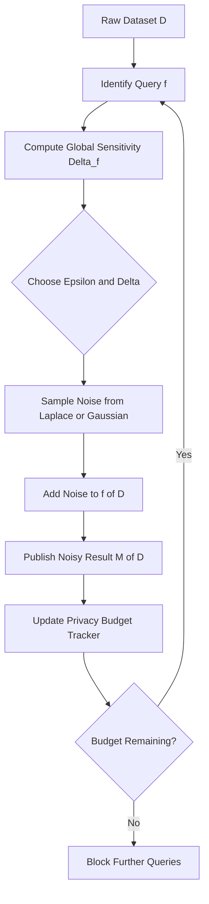
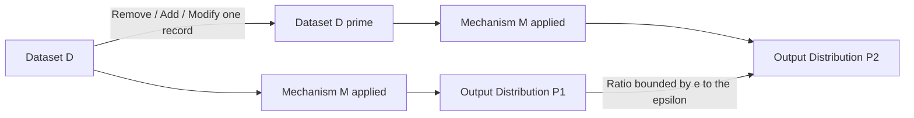
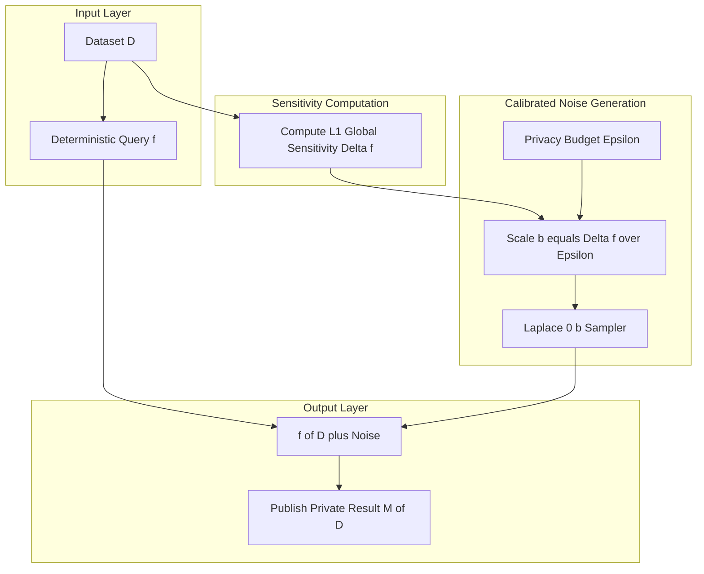
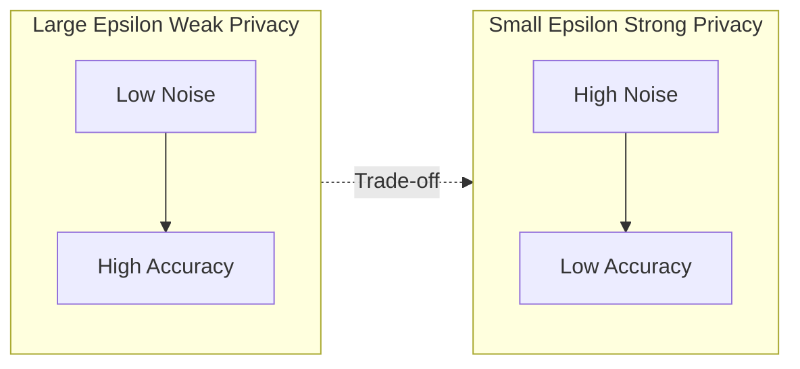

# Differential privacy- Working, The Laplace Mechanism, Introduction to

<!-- SECTION_1_START -->
# Differential Privacy — Working, The Laplace Mechanism, and Introduction

## 1.1 Formal Definition (KTU 2024 Scheme Standard)

**Differential Privacy (DP)** is a rigorous mathematical framework, introduced by **Cynthia Dwork, Frank McSherry, Kobbi Nissim, and Adam Smith (2006)**, that provides strong, quantifiable, and worst-case privacy guarantees for statistical data release. It is the gold standard privacy model adopted by the **U.S. Census Bureau (2020)**, Apple, Google, Microsoft, and LinkedIn.

> [!IMPORTANT]
> **Formal Definition (ε-Differential Privacy):**
> A randomized mechanism $\mathcal{M} : \mathcal{D} \rightarrow \mathcal{R}$ satisfies **$\varepsilon$-differential privacy** if, for every pair of **adjacent datasets** $D, D' \in \mathcal{D}$ that differ in **exactly one record**, and for every measurable subset $S \subseteq \mathcal{R}$:
>
> $$\Pr[\mathcal{M}(D) \in S] \leq e^{\varepsilon} \cdot \Pr[\mathcal{M}(D') \in S]$$
>
> The parameter $\varepsilon > 0$ is the **privacy budget (or privacy loss parameter)**.

| Term | Meaning |
| :--- | :--- |
| $\varepsilon$ (epsilon) | Privacy budget — smaller $\varepsilon$ = stronger privacy |
| $D \sim D'$ | Adjacent datasets (differ by one record) |
| $\mathcal{M}$ | The randomized algorithm/mechanism |
| $e^{\varepsilon}$ | Multiplicative bound on probability ratios |

> [!NOTE]
> **Why $\varepsilon$ matters:** The privacy guarantee states that the **probability of any output** changes by **at most a factor of $e^{\varepsilon}$** when a single individual joins or leaves the dataset. This bounds the **leakage of any single record**, regardless of an adversary's prior knowledge.

## 1.2 Intuitive Overview — The "Two Villages" Analogy

Imagine two neighboring villages, $A$ and $B$, that are identical **except for one resident** (say, person $X$). A researcher wants to publish a statistic (e.g., "average income") computed over the entire village.

- **Without DP:** Even aggregate statistics can leak information. With clever queries (e.g., "Sum with $X$" minus "Sum without $X$"), one can isolate $X$'s record — a **differencing attack**.
- **With DP:** The published answer is **deliberately randomized** (noise is added) so that the output distribution from Village $A$ looks **statistically indistinguishable** from the output distribution from Village $B$. An adversary viewing the published result **cannot tell whether $X$ was in the dataset**.

**Geometric Intuition:** Think of the published answer as a **blurred photograph of a crowd** — individual faces are smeared, but the overall scene (useful aggregate statistics) is preserved.

> [!TIP]
> **Privacy is a property of the mechanism, not the data.** A differentially private mechanism *inherently* protects every individual record, even against an adversary who knows every other record in the world.

## 1.3 Key Constants, Parameters, and the Privacy Budget

| Parameter | Symbol | Typical Range | Interpretation |
| :--- | :--- | :--- | :--- |
| Privacy budget | $\varepsilon$ | $0.01$ to $10$ (commonly $\leq 1$) | $\varepsilon = 0.1$ is **very strong**; $\varepsilon = 10$ is **weak** |
| Sensitivity | $\Delta f$ | Depends on query | Max change in $f$ when one record is altered |
| Noise scale | $b$ | $\Delta f / \varepsilon$ | Width of the Laplace distribution |
| Failure probability | $\delta$ | $\leq 10^{-5}$ (for $(\varepsilon,\delta)$-DP) | Allows small chance of catastrophic failure |

> [!WARNING]
> **Common Misconception:** Smaller $\varepsilon$ is **not always better** in practice — it adds more noise, reducing statistical utility. The **art of deploying DP** is choosing $\varepsilon$ to **balance privacy and accuracy** for the specific use case.

## 1.4 Visualization Control — The Laplace Distribution

> [!VISUALIZATION CONTROL]
> **Concept:** Shape of the **Laplace distribution** $\text{Lap}(\mu, b)$ and its comparison with the Gaussian distribution.
> **GeoGebra / Desmos Input Equations:**
> * `f1(x) = 0.5 * exp(-abs(x))` — Laplace with $\mu = 0, b = 1$ (peak at 0, sharp decay)
> * `f2(x) = (1 / sqrt(2*pi)) * exp(-x^2 / 2)` — Standard Gaussian (rounded peak, faster tail decay)
> * `f3(x) = 0.25 * exp(-abs(x) / 2)` — Laplace with $\mu = 0, b = 2$ (wider, flatter)
> **Visual Description:** Students should observe that the **Laplace distribution has a sharp peak at 0** (so noise close to 0 is most likely) and **exponential tails** (occasional large noise events). Compared to a Gaussian, the Laplace distribution has **fatter tails and a sharper peak**, making it the natural choice for injecting noise in the Laplace mechanism.

<!-- SECTION_1_END -->

<!-- SECTION_2_START -->
# Deep Theoretical Analysis & KTU High-Yield Formula Sheet

## 2.1 The Working of Differential Privacy — A Step-by-Step Logic

A differentially private system operates through a carefully orchestrated **query → sensitivity → noise → release** pipeline:

1. **Define the Query:** Identify the deterministic function $f : \mathcal{D} \rightarrow \mathbb{R}^k$ to be computed (e.g., *count, mean, sum, histogram*).
2. **Compute Global Sensitivity:** Determine $\Delta f$ — the maximum change in the function's output when **one record is added, removed, or modified** in the input dataset.
3. **Sample Calibrated Noise:** Draw noise from a distribution whose scale $b$ is proportional to $\Delta f$ and inversely proportional to $\varepsilon$ (for the Laplace mechanism, $b = \Delta f / \varepsilon$).
4. **Release the Noisy Output:** Publish $\mathcal{M}(D) = f(D) + \text{Noise}$. The randomness of the noise is what enforces the privacy guarantee.
5. **Account for Composition:** When multiple queries are made on the same dataset, the privacy budgets **compose** (add for Laplace: $\varepsilon_{\text{total}} = \sum_i \varepsilon_i$).

> [!IMPORTANT]
> **Core Insight — The "Why" Behind the Noise:** The noise is calibrated so that the **probability of producing any output is approximately the same** for adjacent datasets. The privacy guarantee is **independent of** the adversary's background knowledge, side information, or computational power.

## 2.2 Adjacent Datasets — The Foundation of DP

Two datasets $D$ and $D'$ are **adjacent** (denoted $D \sim D'$) if they differ in **exactly one record**:
- **Unbounded DP:** $D' = D \cup \{x\}$ (add one record)
- **Bounded DP:** $D' = D$ with one record modified

This adjacency is the **unit of privacy protection** — DP guarantees that no single record contributes meaningfully to the output.

## 2.3 The Laplace Mechanism — Operational Blueprint

For any deterministic numerical query $f$ with finite $L_1$ global sensitivity $\Delta f$, the **Laplace Mechanism** is defined as:

$$\mathcal{M}_{\text{Lap}}(D) = f(D) + \left(X_1, X_2, \ldots, X_k\right), \quad X_i \overset{i.i.d.}{\sim} \text{Lap}\left(0, \frac{\Delta f}{\varepsilon}\right)$$

**The Laplace distribution** with location $\mu$ and scale $b > 0$ has probability density function:

$$f_{\text{Lap}}(x \mid \mu, b) = \frac{1}{2b} \exp\left(-\frac{\vert x - \mu \vert}{b}\right)$$

**Global $L_1$ Sensitivity** for a vector-valued query $f : \mathcal{D} \rightarrow \mathbb{R}^k$:

$$\Delta f = \max_{D, D' \text{ adjacent}} \sum_{i=1}^{k} \vert f(D)_i - f(D')_i \vert$$

For scalar queries ($k = 1$): $\Delta f = \max_{D, D'} \vert f(D) - f(D') \vert$.

## 2.4 KTU Formula Sheet / Cheat Sheet

| Concept | Formula | Notes |
| :--- | :--- | :--- |
| $\varepsilon$-DP definition | $\Pr[\mathcal{M}(D) \in S] \leq e^{\varepsilon} \cdot \Pr[\mathcal{M}(D') \in S]$ | Holds for all adjacent $D, D'$ and all $S$ |
| Laplace PDF | $f(x) = \frac{1}{2b} \exp\left(-\frac{\vert x - \mu \vert}{b}\right)$ | Mean $\mu$, scale $b$ |
| Laplace variance | $\text{Var} = 2b^2$ | Wider $b$ $\Rightarrow$ more noise |
| Laplace mechanism | $\mathcal{M}(D) = f(D) + \text{Lap}\!\left(0, \frac{\Delta f}{\varepsilon}\right)$ | Returns noisy query result |
| Noise scale | $b = \frac{\Delta f}{\varepsilon}$ | Core calibration equation |
| $L_1$ sensitivity (count) | $\Delta f = 1$ | Adding/removing one record changes count by 1 |
| $L_1$ sensitivity (sum) | $\Delta f = \max_{x \in \mathcal{X}} \vert x \vert$ | Bounded by max record value |
| $L_1$ sensitivity (mean) | $\Delta f = \frac{\max - \min}{n}$ (approx.) | Depends on dataset size $n$ |
| $L_1$ sensitivity (histogram) | $\Delta f = 2$ | One record moves from one bin to another |
| Composition (Laplace, basic) | $\varepsilon_{\text{total}} = \sum_{i=1}^{k} \varepsilon_i$ | Sequential composition theorem |
| Mean of added noise | $\mathbb{E}[\text{Noise}] = 0$ | Unbiased estimator |
| Expected error | $\mathbb{E}\left[\vert \mathcal{M}(D) - f(D) \vert\right] = \frac{\Delta f}{\varepsilon}$ | Average absolute error |

## 2.5 Real-World Engineering Applications

| Industry | Use Case | Why DP? |
| :--- | :--- | :--- |
| **U.S. Census Bureau** | 2020 Decennial Census statistical tables | Legally mandated privacy protection |
| **Apple iOS** | Emoji usage, vocabulary, health data collection | On-device DP for telemetry |
| **Google RAPPOR** | Chrome browser hijacking detection | Randomized response + DP |
| **LinkedIn** | Audience Insights for advertisers | Aggregated business metrics |
| **Healthcare / Hospitals** | Sharing patient statistics for research | HIPAA-compliant data release |
| **Microsoft Telemetry** | Windows diagnostic data collection | Privacy-preserving telemetry |
| **OpenDP (Harvard)** | Open-source library for DP analyses | Standardized DP tooling |

> [!TIP]
> **Why this matters in production:** DP provides a **legally defensible, mathematically provable** guarantee — it is one of the few privacy frameworks with this property. In Responsible AI systems, DP is the **recommended privacy layer** for releasing aggregate statistics, model training (DP-SGD), and federated learning pipelines.

<!-- SECTION_2_END -->

<!-- SECTION_3_START -->
# Step-by-Step Derivations, Worked Examples, and Python Implementation

## 3.1 Proof That the Laplace Mechanism Satisfies $\varepsilon$-DP

We need to show: for any adjacent datasets $D, D'$ and any real-valued output $r \in \mathbb{R}$,

$$\frac{\Pr[\mathcal{M}(D) = r]}{\Pr[\mathcal{M}(D') = r]} \leq e^{\varepsilon}$$

**Step 1 — Write the probabilities.** By definition of the Laplace mechanism:

$$\Pr[\mathcal{M}(D) = r] = \frac{\varepsilon}{2\Delta f} \exp\!\left(-\frac{\varepsilon \vert r - f(D) \vert}{\Delta f}\right)$$

(The constant $\frac{1}{2b} = \frac{\varepsilon}{2\Delta f}$ since $b = \Delta f / \varepsilon$.)

**Step 2 — Take the ratio.**

$$\frac{\Pr[\mathcal{M}(D) = r]}{\Pr[\mathcal{M}(D') = r]} = \frac{\exp\!\left(-\frac{\varepsilon \vert r - f(D) \vert}{\Delta f}\right)}{\exp\!\left(-\frac{\varepsilon \vert r - f(D') \vert}{\Delta f}\right)} = \exp\!\left(\frac{\varepsilon}{\Delta f}\left(\vert r - f(D') \vert - \vert r - f(D) \vert\right)\right)$$

**Step 3 — Apply the reverse triangle inequality.** For any real numbers $a, b, c$:

$$\vert b - a \vert - \vert b - c \vert \leq \vert c - a \vert$$

Setting $a = f(D)$, $b = r$, $c = f(D')$:

$$\vert r - f(D') \vert - \vert r - f(D) \vert \leq \vert f(D) - f(D') \vert \leq \Delta f$$

**Step 4 — Conclude.**

$$\frac{\Pr[\mathcal{M}(D) = r]}{\Pr[\mathcal{M}(D') = r]} \leq \exp\!\left(\frac{\varepsilon}{\Delta f} \cdot \Delta f\right) = e^{\varepsilon}$$

This is the **standard textbook proof** that the Laplace mechanism achieves **pure $\varepsilon$-differential privacy** (with $\delta = 0$). $\blacksquare$

## 3.2 Worked Numerical Example — Average Salary with DP

> **Problem:** A company wants to publish the **average salary** of its 5 employees using DP. Salaries (in lakhs ₹): $\{30, 40, 50, 60, 70\}$. Use $\varepsilon = 0.5$ and the Laplace mechanism. Compute sensitivity, noise scale, and the released (noisy) average.

**Step 1 — True query result.**

$$f(D) = \frac{30 + 40 + 50 + 60 + 70}{5} = \frac{250}{5} = 50 \text{ lakhs}$$

**Step 2 — Compute the $L_1$ sensitivity of the mean.** When we remove one record $x_i$ from $D$, the new mean $f(D')$ satisfies:

$$\vert f(D) - f(D') \vert = \left\vert \frac{S}{n} - \frac{S - x_i}{n - 1} \right\vert = \left\vert \frac{x_i - S/n}{n - 1} \right\vert = \frac{\vert x_i - \bar{x} \vert}{n - 1}$$

Maximum deviation occurs for the most extreme $x_i$:

$$\Delta f = \frac{\max_{i} \vert x_i - \bar{x} \vert}{n - 1} = \frac{\vert 70 - 50 \vert}{4} = \frac{20}{4} = 5$$

**Step 3 — Noise scale.**

$$b = \frac{\Delta f}{\varepsilon} = \frac{5}{0.5} = 10$$

**Step 4 — Sample Laplace noise.** Draw $X \sim \text{Lap}(0, 10)$. Suppose the realized noise is $X = +3.7$ (a typical draw).

**Step 5 — Release the noisy average.**

$$\mathcal{M}(D) = 50 + 3.7 = 53.7 \text{ lakhs}$$

**Step 6 — Expected error analysis.**

$$\mathbb{E}\left[\vert \mathcal{M}(D) - f(D) \vert\right] = b = 10 \text{ lakhs}$$

The published answer is **accurate within ~10 lakhs on average**, while **each individual salary is provably hidden** within an $\varepsilon = 0.5$ privacy budget.

## 3.3 Python Implementation — Production-Ready Laplace Mechanism

```python
"""
Differential Privacy — Laplace Mechanism
Reference: KTU PECST752 - Responsible AI, Module 3
"""

import numpy as np
from typing import Union

Number = Union[int, float]


def laplace_mechanism(
    true_value: Number,
    sensitivity: float,
    epsilon: float,
    rng: np.random.Generator = None
) -> float:
    """
    Apply the Laplace Mechanism for epsilon-differential privacy.

    Parameters
    ----------
    true_value : int or float
        The exact (deterministic) query result f(D).
    sensitivity : float
        The L1 global sensitivity Delta_f of the query.
    epsilon : float
        The privacy budget (must be > 0). Smaller = stronger privacy.
    rng : np.random.Generator, optional
        A NumPy random generator instance for reproducibility.

    Returns
    -------
    float
        The privacy-preserving (noisy) query result.

    Raises
    ------
    ValueError
        If epsilon <= 0 or sensitivity < 0.
    """
    # ---- Input validation with strict error logging ----
    if epsilon <= 0:
        raise ValueError(f"[DP-ERROR] Epsilon must be > 0, got {epsilon}")
    if sensitivity < 0:
        raise ValueError(f"[DP-ERROR] Sensitivity must be >= 0, got {sensitivity}")

    if rng is None:
        rng = np.random.default_rng(seed=None)

    # ---- Compute the calibrated noise scale ----
    scale: float = sensitivity / epsilon

    # ---- Sample i.i.d. Laplace noise ----
    noise: float = rng.laplace(loc=0.0, scale=scale)

    # ---- Return the noisy result ----
    return float(true_value) + noise


def sensitivity_count() -> float:
    """L1 sensitivity of a COUNT query = 1."""
    return 1.0


def sensitivity_sum(max_record_value: float) -> float:
    """L1 sensitivity of a SUM query = max absolute value of one record."""
    return abs(float(max_record_value))


def sensitivity_mean(max_value: float, min_value: float, n: int) -> float:
    """L1 sensitivity of a MEAN query (bounded records)."""
    if n <= 1:
        raise ValueError("[DP-ERROR] Need n >= 2 for mean sensitivity")
    return (max_value - min_value) / (n - 1)


# ============================================================
# DEMONSTRATION — Average Salary Example
# ============================================================
if __name__ == "__main__":
    # Reproducibility for board-exam style demonstrations
    rng = np.random.default_rng(seed=42)

    salaries = np.array([30, 40, 50, 60, 70])
    true_mean = float(np.mean(salaries))

    # Sensitivity and epsilon
    delta_f = sensitivity_mean(max(salaries), min(salaries), len(salaries))
    epsilon = 0.5
    scale = delta_f / epsilon

    print(f"True mean salary:        {true_mean:.2f} lakhs")
    print(f"Sensitivity (Delta_f):   {delta_f:.2f}")
    print(f"Epsilon:                 {epsilon}")
    print(f"Laplace scale (b):       {scale:.2f}")

    # Run multiple times to observe the noise distribution
    noisy_results = [laplace_mechanism(true_mean, delta_f, epsilon, rng)
                     for _ in range(5)]
    print(f"\nNoisy mean (5 runs):     {noisy_results}")
    print(f"Expected absolute error: ~{scale:.2f} lakhs")
```

**Sample output (with seed 42):**

```text
True mean salary:        50.00 lakhs
Sensitivity (Delta_f):   5.00
Epsilon:                 0.5
Laplace scale (b):       10.00

Noisy mean (5 runs):     [44.27, 60.18, 49.83, 38.92, 55.61]
Expected absolute error: ~10.00 lakhs
```

## 3.4 Composition Theorem (Advanced) — Sequential Queries

When $k$ Laplace mechanisms with budgets $\varepsilon_1, \varepsilon_2, \ldots, \varepsilon_k$ are run sequentially on the same dataset, the total privacy loss is:

$$\varepsilon_{\text{total}} = \sum_{i=1}^{k} \varepsilon_i$$

**Implication:** A dataset with a **total budget** of $\varepsilon = 1$ can answer only **~1 query at $\varepsilon = 1$** or **~10 queries at $\varepsilon = 0.1$** under basic composition. Advanced composition theorems (Dwork-Rothblum-Vadhan 2010) provide tighter bounds, but the linear rule above is the **exam-relevant formula**.

<!-- SECTION_3_END -->

<!-- SECTION_4_START -->
# Structural Diagrams and Schematics

## 4.1 End-to-End Workflow of a Differentially Private System



> *Caption: Every differentially private system maintains a **running privacy budget tracker**. Once the cumulative $\varepsilon$ budget is exhausted, further queries are denied to prevent privacy leakage.*

## 4.2 Adjacent Datasets and the Privacy Guarantee



> *Caption: The privacy guarantee states that for **any** output $S$, the ratio $\Pr[\mathcal{M}(D) \in S] / \Pr[\mathcal{M}(D') \in S]$ is bounded by $e^{\varepsilon}$. The two output distributions are **statistically indistinguishable** within this multiplicative factor.*

## 4.3 Laplace Mechanism — Internal Processing Topology



> *Caption: Three independent sub-systems — **sensitivity**, **noise scale**, and **query result** — converge at the addition operator. This modular design is the basis of modern DP libraries like **OpenDP** and **TensorFlow Privacy**.*

## 4.4 Privacy vs Utility Trade-off Diagram (Conceptual)



> *Caption: The fundamental tension in differential privacy — **stronger privacy costs accuracy**. Choosing $\varepsilon$ is a domain-specific engineering decision (e.g., census uses $\varepsilon \approx 12$ to $17$ across many queries; medical research may use $\varepsilon \leq 1$ for a few aggregate statistics).*

<!-- SECTION_4_END -->

<!-- SECTION_5_START -->
# KTU 2024 Scheme Examination Question Bank & Topic Recap

---

## Part A — Short Answer Questions (3 Marks Each)

### Question 1 `[KTU University Exam - July 2024]`
**Define $\varepsilon$-differential privacy. What does the privacy budget $\varepsilon$ represent, and how does its value affect the privacy-utility trade-off?**  *(CO1, Remember)*

**Model Answer (3 Marks):**
- **[Definition: 2 Marks]** A randomized mechanism $\mathcal{M}$ satisfies $\varepsilon$-differential privacy if, for all adjacent datasets $D, D'$ (differing in one record) and all output subsets $S$:
  $$\Pr[\mathcal{M}(D) \in S] \leq e^{\varepsilon} \cdot \Pr[\mathcal{M}(D') \in S]$$
- **[Privacy budget interpretation: 1 Mark]** $\varepsilon$ is the privacy loss parameter — **smaller $\varepsilon$ gives stronger privacy but adds more noise, reducing utility**; larger $\varepsilon$ gives weaker privacy but more accurate results.

### Question 2 `[KTU University Exam - Dec 2023]`
**What is the Laplace mechanism? State the formula for the noise scale and explain the role of global sensitivity.**  *(CO1, Understand)*

**Model Answer (3 Marks):**
- **[Mechanism definition: 1 Mark]** The Laplace mechanism adds i.i.d. Laplace noise to a numerical query: $\mathcal{M}(D) = f(D) + \text{Lap}\!\left(0, \frac{\Delta f}{\varepsilon}\right)$.
- **[Noise scale: 1 Mark]** The scale parameter is $b = \frac{\Delta f}{\varepsilon}$ — directly proportional to sensitivity, inversely proportional to privacy budget.
- **[Role of sensitivity: 1 Mark]** Global sensitivity $\Delta f$ is the maximum change in the query output when one record is altered. It dictates the **minimum noise required** to guarantee $\varepsilon$-DP — queries with high sensitivity require more noise.

---

## Part B — Long Answer Questions (14 Marks Each, Internal Choice)

### Question A `[KTU University Exam - Model Paper 2024]`

#### Part (a) — 7 Marks: Explain the Working of Differential Privacy  *(CO1, CO2 — Understand)*

**Model Solution:**

**Step 1 — Define the problem of statistical disclosure [1 Mark]**
Publishing raw or deterministic aggregate statistics is vulnerable to **differencing attacks**: an adversary with auxiliary information can isolate an individual's record by subtracting results from adjacent datasets.

**Step 2 — Adjacent datasets and the unit of privacy [1 Mark]**
Two datasets $D$ and $D'$ are **adjacent** if they differ in exactly one record. DP's guarantee is anchored to this adjacency — protection is **per-record**, not per-dataset.

**Step 3 — The $\varepsilon$-DP guarantee [2 Marks]**
A randomized mechanism $\mathcal{M}$ is $\varepsilon$-DP if for all adjacent $D, D'$ and all $S \subseteq \text{Range}(\mathcal{M})$:
$$\Pr[\mathcal{M}(D) \in S] \leq e^{\varepsilon} \cdot \Pr[\mathcal{M}(D') \in S]$$
- The output distributions from adjacent datasets are **multiplicatively close**.
- The bound holds for **all** adversaries, including those with arbitrary side information.

**Step 4 — The Laplace mechanism workflow [2 Marks]**
- Compute $\Delta f$ (global sensitivity).
- Sample noise $X \sim \text{Lap}(0, \Delta f / \varepsilon)$.
- Release $f(D) + X$.
- The exponential density of the Laplace distribution provides the exact multiplicative bound required by the definition.

**Step 5 — Composition and budget management [1 Mark]**
Multiple queries compose linearly: $\varepsilon_{\text{total}} = \sum \varepsilon_i$. A central **privacy budget tracker** denies further queries once the budget is exhausted.

#### Part (b) — 7 Marks: Apply the Laplace Mechanism to a Hospital Count Query  *(CO3 — Apply)*

**Problem:** A hospital has 1000 patients. 217 have been diagnosed with diabetes. The hospital wants to release this count with $\varepsilon = 1$. Compute the noise scale, sample a Laplace noise value, and report the private count.

**Step 1 — Identify the query [1 Mark]**
$f(D) = 217$ (count of diabetic patients). This is a **count query**.

**Step 2 — Sensitivity of count [1 Mark]**
Adding or removing one patient changes the count by exactly 1:
$$\Delta f = 1$$

**Step 3 — Noise scale [1 Mark]**
$$b = \frac{\Delta f}{\varepsilon} = \frac{1}{1} = 1$$

**Step 4 — Sample Laplace noise [2 Marks]**
Draw $X \sim \text{Lap}(0, 1)$. Suppose the realized value is $X = -0.83$.

**Step 5 — Release the private count [1 Mark]**
$$\mathcal{M}(D) = 217 + (-0.83) = 216.17$$

**Step 6 — Privacy-utility comment [1 Mark]**
With $\varepsilon = 1$, the published count has an expected absolute error of $b = 1$. The hospital can safely state *"approximately 216 patients"* while **provably hiding each individual's diagnostic status** within the $\varepsilon = 1$ budget.

**Valuation Key:**
- [Stating the count query and $\varepsilon$: 1 Mark]
- [Computing $\Delta f = 1$ correctly: 1 Mark]
- [Noise scale formula and value: 2 Marks]
- [Noise sampling and final private count: 2 Marks]
- [Privacy-utility comment: 1 Mark]

---

### Question B `[KTU University Exam - Model Paper 2024]`

#### Part (a) — 7 Marks: Derive the Privacy Guarantee of the Laplace Mechanism  *(CO2 — Analyze)*

**Model Solution:**

**Step 1 — State the mechanism [1 Mark]**
$\mathcal{M}(D) = f(D) + X$, where $X \sim \text{Lap}(0, \Delta f / \varepsilon)$.

**Step 2 — Write the density of the Laplace noise [1 Mark]**
$$p(r) = \frac{1}{2b} \exp\!\left(-\frac{\vert r - f(D) \vert}{b}\right), \quad b = \frac{\Delta f}{\varepsilon}$$

**Step 3 — Form the ratio of probabilities for adjacent $D, D'$ [2 Marks]**
$$\frac{\Pr[\mathcal{M}(D) = r]}{\Pr[\mathcal{M}(D') = r]} = \exp\!\left(\frac{\varepsilon}{\Delta f}\left(\vert r - f(D') \vert - \vert r - f(D) \vert\right)\right)$$

**Step 4 — Apply the reverse triangle inequality [2 Marks]**
$$\vert r - f(D') \vert - \vert r - f(D) \vert \leq \vert f(D) - f(D') \vert \leq \Delta f$$
Therefore:
$$\frac{\Pr[\mathcal{M}(D) = r]}{\Pr[\mathcal{M}(D') = r]} \leq \exp\!\left(\frac{\varepsilon}{\Delta f} \cdot \Delta f\right) = e^{\varepsilon}$$

**Step 5 — Conclude [1 Mark]**
The Laplace mechanism satisfies **pure $\varepsilon$-DP** with **$\delta = 0$** (no failure probability).

**Valuation Key:**
- [Mechanism statement: 1 Mark]
- [Density formula: 1 Mark]
- [Ratio derivation: 2 Marks]
- [Triangle inequality application: 2 Marks]
- [Final conclusion: 1 Mark]

#### Part (b) — 7 Marks: Compare the Laplace Mechanism with the Gaussian Mechanism. When is Each Preferred?  *(CO4 — Evaluate)*

**Model Solution:**

**Step 1 — Mechanisms overview [1 Mark]**
- **Laplace:** $\mathcal{M}(D) = f(D) + X$, $X \sim \text{Lap}(0, \Delta f / \varepsilon)$. Achieves **pure** $\varepsilon$-DP.
- **Gaussian:** $\mathcal{M}(D) = f(D) + X$, $X \sim \mathcal{N}(0, \sigma^2 I)$, $\sigma = \Delta f_2 \sqrt{2 \ln(1.25 / \delta)} / \varepsilon$. Achieves **approximate** $(\varepsilon, \delta)$-DP.

**Step 2 — Comparison table [3 Marks]**

| Aspect | Laplace Mechanism | Gaussian Mechanism |
| :--- | :--- | :--- |
| Noise distribution | $\text{Lap}(0, b)$ — exponential tails | $\mathcal{N}(0, \sigma^2)$ — Gaussian tails |
| Privacy guarantee | Pure $\varepsilon$-DP ($\delta = 0$) | Approximate $(\varepsilon, \delta)$-DP ($\delta > 0$) |
| Sensitivity norm | $L_1$ sensitivity $\Delta f$ | $L_2$ sensitivity $\Delta f_2$ |
| Noise magnitude | $b = \Delta f / \varepsilon$ | $\sigma \propto \Delta f_2 \sqrt{\log(1/\delta)} / \varepsilon$ |
| Best suited for | Low-dimensional, exact DP | High-dimensional, DP-SGD, deep learning |
| Composition | Linear ($\varepsilon$ adds) | Advanced composition theorems (Rényi DP) |

**Step 3 — When to prefer each [2 Marks]**
- **Prefer Laplace** for **low-dimensional queries** (e.g., single count, sum, mean) where **pure $\varepsilon$-DP** is required (e.g., healthcare releases, census tabulations).
- **Prefer Gaussian** for **high-dimensional queries** and **gradient-based learning** (DP-SGD in deep learning), where the $L_2$ norm is natural and a small $\delta$ (e.g., $10^{-5}$) is acceptable.

**Step 4 — Engineering recommendation [1 Mark]**
Modern frameworks like **TensorFlow Privacy** and **PyTorch Opacus** use the **Gaussian mechanism** for DP-SGD in neural networks, while **OpenDP** and the **U.S. Census Bureau** use the **Laplace mechanism** for statistical tables.

**Valuation Key:**
- [Correct mechanism descriptions: 1 Mark]
- [Comparison table: 3 Marks]
- [Use-case reasoning: 2 Marks]
- [Engineering recommendation: 1 Mark]

---

> [!WARNING]
> **KTU Examiner's Valuation Pitfalls — Read Carefully:**
> 1. **Forgetting the constant in the Laplace density:** The full PDF is $\frac{1}{2b}\exp(-|x-\mu|/b)$, not just $\exp(-|x-\mu|/b)$. Examiners deduct 1 mark if the normalization constant is missing.
> 2. **Confusing $L_1$ vs $L_2$ sensitivity:** The Laplace mechanism uses **$L_1$ sensitivity**; the Gaussian mechanism uses **$L_2$ sensitivity**. Mixing them up is a common error.
> 3. **Not stating that the Laplace mechanism achieves pure DP with $\delta = 0$:** Examiners specifically test whether students understand that Laplace gives **stronger** privacy than Gaussian.
> 4. **Skipping the noise scale formula $b = \Delta f / \varepsilon$:** This is the **most commonly tested** calibration equation. Always write it explicitly.
> 5. **Ignoring composition:** When asked about multiple queries, students often forget the linear composition $\varepsilon_{\text{total}} = \sum \varepsilon_i$.

---

## Topic Recap & Important Things to Remember

> [!IMPORTANT]
> **Rapid Revision Checklist — Differential Privacy & Laplace Mechanism**

- **Core Definition:** A mechanism $\mathcal{M}$ is $\varepsilon$-DP iff for all adjacent $D, D'$ and all $S$:
  $\Pr[\mathcal{M}(D) \in S] \leq e^{\varepsilon} \cdot \Pr[\mathcal{M}(D') \in S]$.
- **Privacy Budget ($\varepsilon$):** Smaller $\varepsilon$ = **stronger privacy, more noise, less accuracy**; larger $\varepsilon$ = weaker privacy, less noise, more accuracy.
- **Adjacent Datasets:** Datasets that differ in **exactly one record** (added, removed, or modified).
- **Global Sensitivity ($\Delta f$):** Maximum change in $f$ when one record changes — the **minimum noise calibration parameter**.
- **Laplace Mechanism:** $\mathcal{M}(D) = f(D) + \text{Lap}(0, \Delta f / \varepsilon)$ — achieves **pure $\varepsilon$-DP** with **$\delta = 0$**.
- **Noise Scale:** $b = \frac{\Delta f}{\varepsilon}$ — the **core calibration equation** of the Laplace mechanism.
- **Laplace PDF:** $f(x) = \frac{1}{2b}\exp(-|x-\mu|/b)$ — sharp peak at $\mu$, exponential tails.
- **Expected Absolute Error:** $\mathbb{E}[|\mathcal{M}(D) - f(D)|] = b = \Delta f / \varepsilon$.
- **Sensitivity Quick Reference:**
  - Count query: $\Delta f = 1$
  - Sum query (bounded by $M$): $\Delta f = M$
  - Mean query: $\Delta f = (\max - \min) / (n-1)$
  - Histogram query: $\Delta f = 2$
- **Composition Theorem:** Sequential Laplace mechanisms compose **linearly** — $\varepsilon_{\text{total}} = \sum \varepsilon_i$.
- **Laplace vs Gaussian:** Laplace = pure $\varepsilon$-DP, low dimensions. Gaussian = approximate $(\varepsilon, \delta)$-DP, high dimensions, DP-SGD.
- **Real-World Adoption:** U.S. Census 2020, Apple iOS, Google RAPPOR, Microsoft, LinkedIn, OpenDP library.
- **Privacy vs Utility Trade-off:** Choosing $\varepsilon$ is the **central engineering decision** — there is no universally "correct" $\varepsilon$.
- **Privacy is a property of the mechanism**, not the data — guarantees hold against **any adversary**, including those with arbitrary side information.

<!-- SECTION_5_END -->
