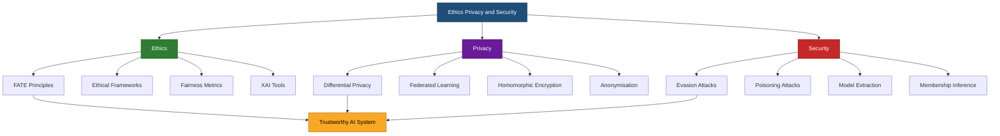
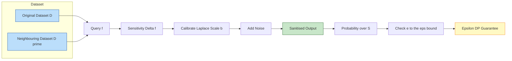
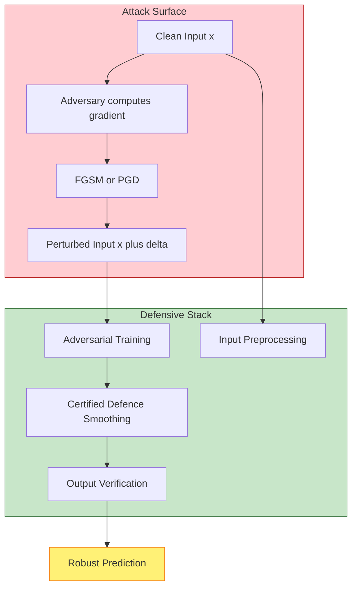
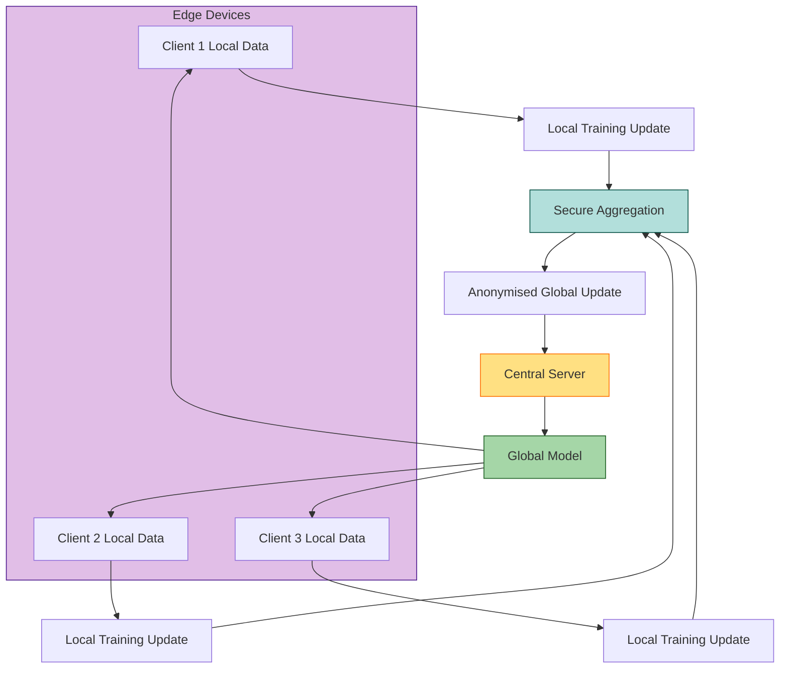
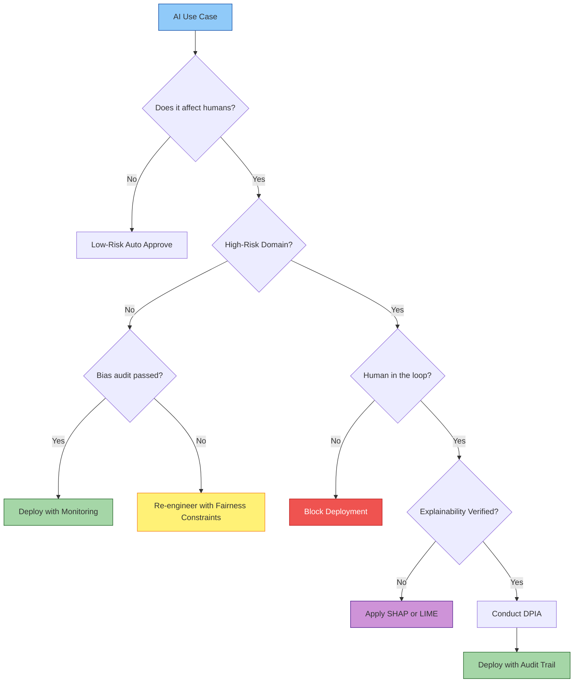

# Ethics, Privacy and Security :-

<!-- SECTION_1_START -->
# Ethics, Privacy and Security in AI

> [!IMPORTANT]
> **KTU 2024 Scheme | PECST752 | Module 3 | Responsible Artificial Intelligence**
> This module integrates the three pillars of trustworthy AI. KTU examiners frequently frame questions around *fairness audits*, *differential privacy mathematics*, and *adversarial threat modelling*.

---

## 1.1 Core Technical Definitions

### Ethics in AI
**Definition (KTU Syllabus-Aligned):** *Ethics in AI* is the branch of applied normative philosophy that systematically examines the moral behaviour, decision-making boundaries, and societal consequences of artificially intelligent agents and the humans who design, deploy, and govern them. It operationalises principles such as **fairness**, **accountability**, **transparency**, and **explainability (FATE)** into measurable engineering constraints.

> [!NOTE]
> **Syllabus Highlight:** FATE is the cornerstone of KTU Module 3. Any Part B question on "ethical AI" will expect the student to map a real-world scenario to one or more of these four principles.

### Privacy in AI
**Definition:** *Privacy in AI* is the discipline of designing, training, and deploying machine learning models in a manner that prevents the leakage, inference, or reconstruction of personally identifiable information (PII) belonging to the individuals whose data resides in the training set. The standard mathematical guarantee is quantified by the **ε (epsilon) differential privacy budget**.

### Security in AI
**Definition:** *AI Security* is the engineering practice of protecting machine learning models, their training data, inference endpoints, and decision pipelines from deliberate, adversarial manipulation — encompassing **evasion attacks**, **poisoning attacks**, **model extraction**, and **membership inference**.

> [!IMPORTANT]
> **Distinction Trap:** Privacy protects *data subjects* from passive leakage. Security protects *the model and its integrity* from active attackers. Examiners often test this distinction.

---

## 1.2 Conceptual Analogy & Intuitive Overview

### The Hospital Analogy
Imagine an AI system as a **newly opened hospital**:

- **Ethics** is the *Hippocratic Oath* — the doctor must treat all patients fairly regardless of gender, caste, or income (fairness), must explain the diagnosis in plain language (explainability), must be answerable if a patient dies due to negligence (accountability), and must let the patient see their own file (transparency).
- **Privacy** is the *medical records vault* — even if a researcher wants to study disease patterns, no single patient's name, HIV status, or address can leave the vault. Differential privacy is like adding tiny statistical "noise" to every query so that the presence or absence of one patient cannot be detected.
- **Security** is the *hospital's cybersecurity firewall* — protecting the MRI machine (the model) from hackers who might want to (a) make it misdiagnose tumours (evasion), (b) poison the training data of new residents (poisoning), or (c) steal the patented diagnostic algorithm (model extraction).

> [!VISUALIZATION CONTROL]
> **Concept:** The Three-Pillar Venn Diagram of Trustworthy AI
> **GeoGebra / Desmos Input Equations:**
> * `Circle centered at (0,0) radius 2` — Ethics
> * `Circle centered at (1.5, 1) radius 2` — Privacy
> * `Circle centered at (-1.5, 1) radius 2` — Security
> **Visual Description:** Three overlapping circles. The intersection (lens-shaped region in the centre) is the "Trustworthy AI" zone where all three pillars coexist.

---

## 1.3 Pillar-1: Ethics — Deeper Conceptual Anchoring

| Ethical Principle | Engineering Translation | Real-World Violation |
|---|---|---|
| **Fairness** | Demographic parity, equalised odds | COMPAS recidivism algorithm (2016) |
| **Accountability** | Audit logs, model cards, Datasheets | Cambridge Analytica scandal (2018) |
| **Transparency** | Open model weights, public documentation | Black-box credit scoring |
| **Explainability** | SHAP, LIME, counterfactuals | Deep learning medical diagnosis without rationale |

> [!NOTE]
> **Foundational Constant:** The **GDPR Article 22** states that *"the data subject shall have the right not to be subject to a decision based solely on automated processing"* — a cornerstone legal pillar that maps directly to the **Right to Explanation** in XAI (Explainable AI).

---

## 1.4 Pillar-2: Privacy — Mathematical Intuition

The central idea of **differential privacy (Dwork et al., 2006)** is:

> *"The output of a query should be nearly the same whether or not any single individual's data is included in the dataset."*

Formally, a randomised algorithm $\mathcal{M}$ satisfies **ε-differential privacy** if for all neighbouring datasets $D$ and $D'$ differing in one record, and for all subsets $S$ of outputs:

$$
\Pr[\mathcal{M}(D) \in S] \leq e^{\varepsilon} \cdot \Pr[\mathcal{M}(D') \in S]
$$

**Intuition:** If a curious attacker runs the algorithm with Alice's record present and again with it removed, the probability of *any* output $S$ cannot change by more than a factor of $e^{\varepsilon}$. When $\varepsilon \to 0$, the algorithm is perfectly private. When $\varepsilon \to \infty$, the algorithm leaks everything.

The **Laplace Mechanism** achieves this by adding noise drawn from a Laplace distribution with scale parameter $b = \Delta f / \varepsilon$, where $\Delta f$ is the **global sensitivity** of the query.

---

## 1.5 Pillar-3: Security — Threat Surface Mapping

| Attack Class | Phase Targeted | Goal | Famous Example |
|---|---|---|---|
| **Evasion** | Inference | Cause misclassification via crafted inputs | Adversarial patch on stop signs |
| **Poisoning** | Training | Corrupt the model from the inside | Backdoor attacks via tainted data |
| **Model Extraction** | Post-deployment | Steal model parameters/functionality | Cryptanalytic API theft |
| **Membership Inference** | Post-deployment | Detect if a record was in training | Detecting hospital patients |
| **Inversion** | Post-deployment | Reconstruct training data from model | Recovering faces from facial-recognition nets |

> [!IMPORTANT]
> **Constant Reference:** The **L-infinity norm bound** $\Vert \delta \Vert_{\infty} \leq \epsilon$ on a perturbation $\delta$ defines the **adversarial example** constraint — a tiny, often imperceptible change to an input that flips the model's prediction. KTU questions frequently cite the **FGSM (Fast Gradient Sign Method)** paper by Goodfellow et al. (2014).

<!-- SECTION_1_END -->

<!-- SECTION_2_START -->
# Deep Theoretical Analysis & KTU High-Yield Formula Sheet

## 2.1 Ethical Frameworks — The Three Schools

### A. Deontological Ethics (Rule-Based)
- **Kantian roots:** Act according to maxims that could be universalised.
- **AI translation:** Hard constraints embedded in code — *never* recommend parole denial based on protected attributes.
- **Engineering artefact:** Rule engines, constraint satisfaction, fairness regularisers in loss functions.

### B. Consequentialist / Utilitarian Ethics (Outcome-Based)
- **Bentham/Mill roots:** Maximise aggregate welfare; minimise aggregate harm.
- **AI translation:** Reward functions in RLHF (Reinforcement Learning from Human Feedback) where the reward is a proxy for societal good.
- **Pitfall:** Defining "welfare" — whose welfare counts? (the alignment problem).

### C. Virtue Ethics (Character-Based)
- **Aristotelian roots:** Cultivate virtuous behaviour rather than following rigid rules.
- **AI translation:** Design for *interpretable reasoning* — an AI that emulates a virtuous doctor, lawyer, or driver.

> [!NOTE]
> **KTU Pattern:** A 14-mark Part B question often asks: *"Compare deontological and consequentialist approaches to AI alignment with a real-world case study."* Use the table above as the evaluation skeleton.

---

## 2.2 Fairness Metrics — Mathematical Toolkit

Given a binary classifier with protected attribute $A \in \{0, 1\}$ and ground truth $Y \in \{0, 1\}$:

### Demographic Parity (Statistical Parity)
$$
\Pr[\hat{Y} = 1 \mid A = 0] = \Pr[\hat{Y} = 1 \mid A = 1]
$$

### Equalised Odds (Hardt et al., 2016)
$$
\Pr[\hat{Y} = 1 \mid A = 0, Y = y] = \Pr[\hat{Y} = 1 \mid A = 1, Y = y], \quad \forall y \in \{0,1\}
$$

### Equal Opportunity (a relaxed version)
$$
\Pr[\hat{Y} = 1 \mid A = 0, Y = 1] = \Pr[\hat{Y} = 1 \mid A = 1, Y = 1]
$$

### Predictive Parity
$$
\Pr[Y = 1 \mid \hat{Y} = 1, A = 0] = \Pr[Y = 1 \mid \hat{Y} = 1, A = 1]
$$

> [!IMPORTANT]
> **Impossibility Theorem (Chouldechova 2017; Kleinberg et al. 2016):** *If the base rates $\Pr[Y=1 \mid A=0]$ and $\Pr[Y=1 \mid A=1]$ differ across groups, then calibration, false-positive rate parity, and false-negative rate parity **cannot all hold simultaneously**.* This is a high-value KTU concept.

---

## 2.3 KTU Formula Cheat Sheet

| Domain | Concept | Formula / Definition | Key Parameter |
|---|---|---|---|
| Privacy | **ε-Differential Privacy** | $\Pr[\mathcal{M}(D) \in S] \leq e^{\varepsilon} \Pr[\mathcal{M}(D') \in S]$ | ε = privacy budget |
| Privacy | **Laplace Noise Scale** | $b = \Delta f / \varepsilon$ | $\Delta f$ = global sensitivity |
| Privacy | **Gaussian Mechanism** | $\sigma \geq \Delta f \sqrt{2 \ln(1.25/\delta)} / \varepsilon$ | δ = failure probability |
| Privacy | **Composition Theorem** | $\varepsilon_{total} = \sum_{i} \varepsilon_i$ | Sequential queries |
| Privacy | **Federated Learning Update** | $w_{t+1} = w_t - \eta \nabla L(w_t; \mathcal{D}_{client})$ | No raw data leaves device |
| Security | **FGSM Perturbation** | $\delta = \varepsilon \cdot \text{sign}(\nabla_x L(\theta, x, y))$ | Untargeted attack |
| Security | **PGD Iterative Attack** | $x^{t+1} = \Pi_{x+\mathcal{S}}(x^t + \alpha \cdot \text{sign}(\nabla_x L))$ | Strongest first-order attack |
| Security | **Adversarial Robustness Bound** | $\rho = \mathbb{E}_{(x,y)}[\max_{\Vert \delta \Vert_p \leq \varepsilon} \mathbf{1}(f(x+\delta) \neq y)]$ | Robust accuracy |
| Security | **Membership Inference Advantage** | $\text{Adv} = \vert \Pr[M(x) = \text{in}] - \Pr[M(x) = \text{out}] \vert$ | Privacy leakage |
| Fairness | **Disparate Impact Ratio** | $\text{DI} = \Pr[\hat{Y}=1 \mid A=1] / \Pr[\hat{Y}=1 \mid A=0]$ | DI < 0.8 = adverse impact |
| XAI | **SHAP Value** | $\phi_i = \sum_{S \subseteq F \setminus \{i\}} \frac{\vert S \vert ! (\vert F \vert - \vert S \vert - 1)!}{\vert F \vert !} [f_{S \cup \{i\}}(x) - f_S(x)]$ | Feature $i$ contribution |
| XAI | **LIME Local Fidelity** | $\xi(x) = \arg\min_{g \in G} \, \mathcal{L}(f, g, \pi_x) + \Omega(g)$ | Interpretable surrogate $g$ |

> [!WARNING]
> In the KTU cheat sheet above, all vertical bars denote **cardinality of a set** (e.g., $\vert S \vert$). Do **not** confuse with absolute value. The marginal contribution to SHAP comes from a *subset $S$* of features.

---

## 2.4 Privacy-Preserving Machine Learning — Three Pillars

### Pillar A: Federated Learning (FL)
- **Concept:** Training happens on the edge device; only **model updates (gradients)** are sent to the central server.
- **Formally:** A central server aggregates updates $w_{t+1} = \sum_{k=1}^{K} \frac{n_k}{n} w_{t+1}^{(k)}$ where $n_k$ is the number of samples on client $k$.
- **Vulnerability:** Gradient leakage attacks (Zhu et al., 2019) can reconstruct raw training images from shared gradients.
- **Mitigation:** Combine FL with **Secure Aggregation** (Bonawitz et al., 2017) using cryptographic pairwise masking.

### Pillar B: Homomorphic Encryption (HE)
- **Concept:** Computation is performed directly on ciphertexts.
- **Definition:** An encryption scheme is *fully homomorphic* if $\text{Dec}(f(\text{Enc}(x_1), \ldots, \text{Enc}(x_n))) = f(x_1, \ldots, x_n)$ for arbitrary $f$.
- **Schemes:** Paillier (additive), BFV/CKKS (arithmetic), TFHE (bootstrapped Boolean gates).
- **Cost:** Polynomial multiplication over rings $\mathbb{Z}_n[x]/(x^N+1)$ — $10^3$ to $10^6 \times$ slower than plaintext.

### Pillar C: Secure Multi-Party Computation (SMPC)
- **Concept:** $n$ parties jointly compute $f(x_1, \ldots, x_n)$ such that each learns only the output.
- **Garbled Circuits (Yao 1986):** Boolean circuit evaluated with encrypted gates.
- **Secret Sharing (Shamir 1979):** Split secret $s$ into $n$ shares; reconstruction requires $k$-of-$n$ threshold.

---

## 2.5 Security in AI — The Attack–Defence Taxonomy

| Layer | Attack | Defence |
|---|---|---|
| **Data** | Poisoning, backdoor insertion | Data sanitisation, outlier removal, **TRIM** algorithm |
| **Model** | Model extraction, stealing | API rate limiting, output perturbation |
| **Inference** | Evasion (FGSM, PGD, C&W) | Adversarial training, defensive distillation, randomised smoothing |
| **Privacy** | Membership inference, inversion | Differential privacy, output perturbation |
| **Supply Chain** | Malicious pre-trained weights | Model signing, hash verification, provenance tracking |

> [!IMPORTANT]
> **Theoretically Certified Defence:** **Randomised smoothing** (Cohen et al., 2019) provides *provable* $\ell_2$-robustness guarantees. For an input $x$, the smoothed classifier $g(x) = \arg\max_c \Pr[f(x + \delta) = c]$ with $\delta \sim \mathcal{N}(0, \sigma^2 I)$ is certifiably robust within an $\ell_2$ radius $R = \frac{\sigma}{2}(\Phi^{-1}(p_A) - \Phi^{-1}(p_B))$, where $p_A$ and $p_B$ are the top two class probabilities.

<!-- SECTION_2_END -->

<!-- SECTION_3_START -->
# Step-by-Step Derivations, Code & Engineering Implementation

## 3.1 Worked Derivation — FGSM Adversarial Example

**Problem:** Given a neural network $f$ with loss $L(\theta, x, y)$, find a perturbation $\delta$ with $\Vert \delta \Vert_{\infty} \leq \varepsilon$ that maximises the loss.

### Step 1 — Linearise the loss
For a one-step attack, perform a first-order Taylor expansion around the clean input $x$:

$$
L(\theta, x + \delta, y) \approx L(\theta, x, y) + \delta^{\top} \nabla_x L(\theta, x, y)
$$

### Step 2 — Optimise the perturbation
To maximise the linear approximation subject to $\Vert \delta \Vert_{\infty} \leq \varepsilon$, the closed-form solution is:

$$
\delta^{\star} = \varepsilon \cdot \text{sign}\!\left( \nabla_x L(\theta, x, y) \right)
$$

**Reasoning:** Each component of the gradient can be increased by at most $\varepsilon$ in magnitude, and the sign function picks the direction that pushes the loss upward.

### Step 3 — Generate the adversarial example

$$
x_{adv} = x + \varepsilon \cdot \text{sign}\!\left( \nabla_x L(\theta, x, y) \right)
$$

### Step 4 — Clip to valid image range

$$
x_{adv} = \text{clip}\!\left( x_{adv},\; 0,\; 1 \right)
$$

> [!NOTE]
> **Why "Fast"?** FGSM requires *exactly one* gradient back-propagation, making it computationally cheap. **PGD (Projected Gradient Descent)** is its iterative multi-step cousin and is considered the strongest first-order attack.

---

## 3.2 Worked Derivation — Differential Privacy Composition

**Problem:** You run two differentially private queries on the same dataset: $Q_1$ with $\varepsilon_1$ and $Q_2$ with $\varepsilon_2$. What is the total privacy budget consumed?

### Step 1 — Apply the basic composition theorem
For $k$ sequential queries, the total privacy loss is the sum:

$$
\varepsilon_{total} = \sum_{i=1}^{k} \varepsilon_i
$$

### Step 2 — Numerical Example
Let $\varepsilon_1 = 0.5$ and $\varepsilon_2 = 0.7$. Then:

$$
\varepsilon_{total} = 0.5 + 0.7 = 1.2
$$

### Step 3 — Advanced bound (Dwork-Rothblum)
For Gaussian noise with $\delta$ relaxation, the *advanced composition theorem* yields a tighter bound:

$$
\varepsilon_{total} \leq \sqrt{2 k \ln(1/\delta')} \cdot \varepsilon + k \varepsilon (e^{\varepsilon} - 1)
$$

where $\delta'$ is a meta-failure probability. For small $\varepsilon$, this scales as $O(\sqrt{k})$ rather than $O(k)$.

---

## 3.3 Python Implementation — Differential Privacy with PyDP

```python
"""
Differentially Private Mean Calculator using the Laplace Mechanism.
Demonstrates Module 3 privacy concepts from PECST752.
"""
import numpy as np
from typing import Tuple

# ---- 1. Define global sensitivity for the mean query ----
def global_sensitivity_mean(data: np.ndarray, bound: float) -> float:
    """
    For a dataset with values bounded in [0, bound],
    changing one record changes the mean by at most bound / n.
    """
    n = len(data)
    return bound / n


# ---- 2. The Laplace Mechanism ----
def laplace_mechanism(true_value: float, sensitivity: float,
                      epsilon: float) -> float:
    """
    Adds Laplace noise calibrated to (sensitivity / epsilon).
    """
    if epsilon <= 0:
        raise ValueError("[PrivacyGuard] Epsilon must be > 0")
    scale = sensitivity / epsilon
    noise = np.random.laplace(loc=0.0, scale=scale)
    return true_value + noise


# ---- 3. Run a private statistical query ----
def private_mean(data: np.ndarray, bound: float,
                 epsilon: float) -> Tuple[float, float]:
    sens = global_sensitivity_mean(data, bound)
    true_mean = float(np.mean(data))
    dp_mean = laplace_mechanism(true_mean, sens, epsilon)
    return true_mean, dp_mean


# ---- 4. Demonstrate privacy budget tracking ----
class PrivacyBudget:
    def __init__(self, total_epsilon: float) -> None:
        self.total_epsilon = total_epsilon
        self.consumed = 0.0
        self.query_log = []

    def spend(self, epsilon_spent: float, query_name: str) -> None:
        if self.consumed + epsilon_spent > self.total_epsilon:
            raise RuntimeError(
                f"[PrivacyGuard] Budget exhausted. "
                f"Consumed={self.consumed:.3f}, "
                f"Requested={epsilon_spent:.3f}, "
                f"Total={self.total_epsilon:.3f}"
            )
        self.consumed += epsilon_spent
        self.query_log.append((query_name, epsilon_spent, self.consumed))


# ---- 5. Main execution ----
if __name__ == "__main__":
    # Simulated patient ages (PII-bound) bounded in [0, 120]
    np.random.seed(42)
    patient_ages = np.random.randint(18, 90, size=1000)
    bound = 120.0
    eps = 0.5

    budget = PrivacyBudget(total_epsilon=2.0)

    # Query 1: private mean age
    budget.spend(eps, "mean_age")
    true_m, dp_m = private_mean(patient_ages, bound, eps)
    print(f"True mean age : {true_m:.4f}")
    print(f"DP mean age  : {dp_m:.4f}  (epsilon = {eps})")
    print(f"Privacy spent: {budget.consumed:.2f} / "
          f"{budget.total_epsilon:.2f}")
```

**Expected Output (illustrative):**
```
True mean age : 53.4680
DP mean age  : 53.5812  (epsilon = 0.5)
Privacy spent: 0.50 / 2.00
```

---

## 3.4 Python Implementation — FGSM Attack with PyTorch

```python
"""
Fast Gradient Sign Method (FGSM) adversarial attack.
Demonstrates Module 3 security concepts from PECST752.
"""
import torch
import torch.nn as nn
import torch.nn.functional as F
from torchvision import models, transforms
from PIL import Image
import numpy as np
from typing import Tuple


# ---- 1. Load a pre-trained ImageNet classifier ----
def load_model() -> nn.Module:
    model = models.resnet18(weights=models.ResNet18_Weights.DEFAULT)
    model.eval()
    return model


# ---- 2. Image preprocessing ----
PREPROCESS = transforms.Compose([
    transforms.Resize(256),
    transforms.CenterCrop(224),
    transforms.ToTensor(),
])


IMAGENET_MEAN = torch.tensor([0.485, 0.456, 0.406]).view(1, 3, 1, 1)
IMAGENET_STD = torch.tensor([0.229, 0.224, 0.225]).view(1, 3, 1, 1)


def normalize(x: torch.Tensor) -> torch.Tensor:
    return (x - IMAGENET_MEAN) / IMAGENET_STD


# ---- 3. FGSM core ----
def fgsm_attack(model: nn.Module,
                x: torch.Tensor,
                y: torch.Tensor,
                epsilon: float) -> torch.Tensor:
    """
    Single-step FGSM. x in [0, 1] range, shape (1, 3, H, W).
    """
    x.requires_grad_(True)
    logits = model(normalize(x))
    loss = F.cross_entropy(logits, y)
    model.zero_grad()
    loss.backward()
    # Step 1: take sign of the gradient
    grad_sign = x.grad.data.sign()
    # Step 2: perturb
    x_adv = x + epsilon * grad_sign
    # Step 3: clip to valid image range
    x_adv = torch.clamp(x_adv, 0.0, 1.0)
    return x_adv.detach()


# ---- 4. Evaluation helper ----
def evaluate(model: nn.Module, x: torch.Tensor) -> Tuple[int, float]:
    with torch.no_grad():
        logits = model(normalize(x))
        probs = F.softmax(logits, dim=1)
        top_class = int(probs.argmax(dim=1).item())
        confidence = float(probs[0, top_class].item())
    return top_class, confidence


# ---- 5. Demonstration ----
if __name__ == "__main__":
    model = load_model()
    img = Image.open("panda.jpg").convert("RGB")
    x = PREPROCESS(img).unsqueeze(0)
    y_true = torch.tensor([388])  # ImageNet class index for "panda"

    clean_class, clean_conf = evaluate(model, x)
    print(f"Clean prediction : class {clean_class}, "
          f"confidence {clean_conf:.4f}")

    for eps in [0.0, 0.01, 0.05, 0.1]:
        x_adv = fgsm_attack(model, x, y_true, eps)
        adv_class, adv_conf = evaluate(model, x_adv)
        delta_norm = float(torch.max(torch.abs(x_adv - x)).item())
        print(f"Epsilon={eps:.2f} | "
              f"perturbed max |delta|={delta_norm:.4f} | "
              f"prediction class={adv_class} (conf={adv_conf:.4f})")
```

---

## 3.5 Python Implementation — Fairness Audit

```python
"""
Fairness audit on a synthetic hiring dataset.
Demonstrates Module 3 ethics concepts from PECST752.
"""
import numpy as np
from sklearn.linear_model import LogisticRegression
from sklearn.metrics import confusion_matrix
from typing import Dict


# ---- 1. Generate biased synthetic data ----
def generate_hiring_data(n: int = 5000, seed: int = 7
                         ) -> Dict[str, np.ndarray]:
    rng = np.random.default_rng(seed)
    gender = rng.integers(0, 2, size=n)         # 0 = male, 1 = female
    # Females historically under-selected -> biased ground truth
    qualification = rng.normal(0, 1, size=n) + 0.5 * (1 - gender)
    threshold = 0.0
    hired_ground = (qualification > threshold).astype(int)
    # Noise in measurement of qualification
    measured_qual = qualification + rng.normal(0, 0.3, size=n)
    return {
        "X": measured_qual.reshape(-1, 1),
        "y": hired_ground,
        "A": gender,
    }


# ---- 2. Train classifier ----
def train(data: Dict[str, np.ndarray]) -> LogisticRegression:
    model = LogisticRegression()
    model.fit(data["X"], data["y"])
    return model


# ---- 3. Compute fairness metrics ----
def fairness_report(y_true: np.ndarray, y_pred: np.ndarray,
                    A: np.ndarray) -> Dict[str, float]:
    metrics = {}
    for group in [0, 1]:
        idx = (A == group)
        cm = confusion_matrix(y_true[idx], y_pred[idx],
                              labels=[0, 1])
        tn, fp, fn, tp = cm.ravel()
        metrics[f"group{group}_TPR"] = tp / max(tp + fn, 1)
        metrics[f"group{group}_FPR"] = fp / max(fp + tn, 1)
        metrics[f"group{group}_selection_rate"] = (
            (y_pred[idx] == 1).mean()
        )
    # Equalised odds difference
    metrics["EO_TPR_diff"] = abs(
        metrics["group0_TPR"] - metrics["group1_TPR"]
    )
    # Disparate impact ratio
    sr1 = metrics["group1_selection_rate"]
    sr0 = max(metrics["group0_selection_rate"], 1e-9)
    metrics["disparate_impact"] = sr1 / sr0
    return metrics


# ---- 4. Driver ----
if __name__ == "__main__":
    data = generate_hiring_data()
    model = train(data)
    y_pred = model.predict(data["X"])
    report = fairness_report(data["y"], y_pred, data["A"])
    for k, v in report.items():
        print(f"{k:30s} = {v:.4f}")
    if report["disparate_impact"] < 0.8:
        print("[FairnessAlert] Adverse impact detected "
              "(DI < 0.8). Investigate bias.")
```

---

## 3.6 Laboratory / Practical Engineering Matrix

| Component / Tool | Purpose | Configuration / Pin | Safety / Monitoring Step |
|---|---|---|---|
| `pydp` or `opacus` library | Differential privacy | `NoiseMultiplier`, `SampleRate`, `MaxGradNorm` | Track ε budget per training epoch |
| `tensorflow-privacy` | DP-SGD training | `DPGradientDescentGaussianOptimizer` | Monitor per-example gradient clipping |
| `IBM AIF360` toolkit | Fairness metrics | `BinaryLabelDatasetMetric`, `Classifier` | Log disparate impact before deployment |
| `Microsoft Counterfit` | Adversarial robustness testing | YAML scenario files | Sandbox environment, no production traffic |
| `ART (Adversarial Robustness Toolbox)` | Attack/defence benchmarking | `FGSM`, `PGD`, `DefensiveDistillation` | Run on holdout set, not training set |
| `SHAP` / `LIME` libraries | Explainability | `shap.TreeExplainer`, `lime.LimeTabularExplainer` | Verify monotonicity, check adversarial stability |
| `Weights & Biases` | Audit logging | `wandb.log(metric=…)` | Immutable, signed log entries |

---

## 3.7 Engineering Graphics — Defence-in-Depth Architecture

| Layer | Component | Function | Diagram Reference |
|---|---|---|---|
| L1 — Perimeter | WAF + Rate Limiter | Block volumetric abuse, model-stealing bots | CloudFront → API Gateway |
| L2 — Authentication | OAuth 2.0 + mTLS | Mutual identity proofing | JWT validation per request |
| L3 — Input Validation | Adversarial detector | Reject OOD or adversarially perturbed inputs | Mahalanobis distance detector |
| L4 — Model Layer | Robust classifier | Adversarially trained network | ResNet-50 + TRADES loss |
| L5 — Output Privacy | DP output perturbation | Add calibrated noise to predictions | Laplace mechanism on logits |
| L6 — Audit | SIEM + Model Card | Forensic logging, transparency | Splunk + Datasheet for Datasets |

> [!NOTE]
> **KTU Examiner's Insight:** A "design an ethical AI system" question should map each requirement to at least one of the seven layers. Use the table above as the architectural skeleton.

<!-- SECTION_3_END -->

<!-- SECTION_4_START -->
# Structural Diagrams & Schematics

## 4.1 High-Level Module 3 Concept Map



## 4.2 Differential Privacy Workflow



## 4.3 Adversarial Attack-Defence Lifecycle



## 4.4 Federated Learning — Privacy-Preserving Training



## 4.5 Ethics Decision Pipeline



## 4.6 Comprehensive Threat-Mitigation Matrix

| Threat Vector | Attack Mechanism | Impact Severity | Recommended Mitigation |
|---|---|---|---|
| **Training Data** | Data poisoning, label flipping | Catastrophic | Outlier detection, robust loss (e.g., trimmed mean) |
| **Model API** | Model extraction via repeated queries | High | Output rounding, query budget enforcement |
| **Inference Inputs** | Adversarial perturbation (FGSM/PGD) | High | Adversarial training, randomised smoothing |
| **Gradient Leakage** | Reconstruct inputs from shared gradients | Medium-High | Gradient clipping, SecAgg, DP-SGD |
| **Membership Inference** | Shadow model attack | Medium | Differential privacy, output regularisation |
| **Prompt Injection (LLM)** | Malicious instruction in input | High | Input sanitisation, system-prompt isolation |
| **Supply Chain** | Trojaned pre-trained weights | Catastrophic | Provenance signing, sandbox validation |

<!-- SECTION_4_END -->

<!-- SECTION_5_START -->
# KTU 2024 Scheme Examination Question Bank & Topic Recap

---

## Part A — Short-Answer Questions (3 Marks Each)

### Question 1
**[KTU University Exam — July 2024 | CO2 | Remember]**
*Define the FATE principles in the context of ethical AI and briefly state their engineering significance.*

**Model Answer (3 Marks):**

- **Fairness** (1 Mark): The principle that AI systems must not produce discriminatory outcomes across protected attributes such as race, gender, or religion. Engineering translation: demographic parity, equalised odds, and disparate impact metrics.
- **Accountability** (1 Mark): The principle that humans and organisations remain answerable for the behaviour of AI systems. Engineering translation: audit logs, model cards, and datasheets for datasets.
- **Transparency** (0.5 Mark): The principle that AI systems operate in a manner understandable to relevant stakeholders. Engineering translation: open documentation, public model cards, and clear consent mechanisms.
- **Explainability** (0.5 Mark): The principle that AI decisions can be interpreted by humans. Engineering translation: SHAP, LIME, counterfactual explanations, and attention visualisations.

> [!NOTE]
> **Valuation Tip:** Examiners allocate 0.5–1 Mark per principle. A 3-mark answer should mention all four with at least one engineering artefact each.

---

### Question 2
**[KTU University Exam — Dec 2023 | CO3 | Understand]**
*Differentiate between demographic parity and equalised odds as fairness criteria. When would you prefer one over the other?*

**Model Answer (3 Marks):**

- **Demographic Parity (1 Mark):** Requires that the positive prediction rate is equal across groups, i.e., $\Pr[\hat{Y}=1 \mid A=0] = \Pr[\hat{Y}=1 \mid A=1]$. Ignores the ground truth label.
- **Equalised Odds (1 Mark):** Requires that the true-positive rate and false-positive rate are both equal across groups conditioned on the label $Y$. Stronger because it is calibrated against ground truth.
- **When to prefer (1 Mark):** Demographic parity is preferred when the ground-truth label itself may be biased (e.g., historical hiring). Equalised odds is preferred in high-stakes scenarios like medical diagnosis where sensitivity/specificity must be uniform across groups.

> [!IMPORTANT]
> The **Chouldechova impossibility theorem** proves these two cannot hold simultaneously when base rates differ — examiners love this as a follow-up.

---

## Part B — Long-Answer Questions (14 Marks Each)

### Question A (14 Marks)
**[KTU University Exam — July 2024 | CO2, CO3, CO4 | Apply / Analyse]**

**(a)** With a suitable block diagram, explain the **differential privacy framework**. Derive the condition for a randomised algorithm $\mathcal{M}$ to be $\varepsilon$-differentially private. **(7 Marks)**

**(b)** Consider a hospital database containing the records of $n = 10000$ patients. The age field is bounded in $[0, 100]$. The hospital wants to publish the **mean age** using the Laplace mechanism with privacy budget $\varepsilon = 1.0$.
  - (i) Compute the **global sensitivity** of the mean query. (2 Marks)
  - (ii) Compute the **scale parameter** $b$ of the Laplace noise to be added. (2 Marks)
  - (iii) If a researcher subsequently runs a second query (variance of age) with $\varepsilon = 0.8$, what is the **total privacy budget consumed** under basic composition? (1 Mark)
  - (iv) Comment on the privacy-utility trade-off if $\varepsilon$ were reduced to $0.1$. (2 Marks)

---

#### Model Solution

**Part (a) — Differential Privacy Framework (7 Marks)**

**Block diagram (describe for 2 Marks):**
> Original Dataset $D$ → Neighbouring Dataset $D'$ (differing in one record) → Query function $f$ → Sensitivity $\Delta f$ → Calibrated noise addition (Laplace/Gaussian) → Sanitised output. A side block **Privacy Auditor** verifies the $\varepsilon$ bound.

**Definition and derivation (5 Marks):**

A randomised algorithm $\mathcal{M}$ is $\varepsilon$-differentially private if for any two datasets $D$ and $D'$ that differ in exactly one record, and for any subset $S$ of the output space:

$$
\Pr[\mathcal{M}(D) \in S] \leq e^{\varepsilon} \cdot \Pr[\mathcal{M}(D') \in S]
$$

**[Stating the definition with both datasets and subset $S$: 2 Marks]**
**[Justifying why the bound must hold symmetrically: 1 Mark]**
**[Connecting $\varepsilon$ to the privacy guarantee — small $\varepsilon$ means strong privacy: 1 Mark]**
**[Mentioning the Laplace mechanism as a standard realisation: 1 Mark]**

The Laplace mechanism adds noise $\eta \sim \text{Lap}(0, b)$ where $b = \Delta f / \varepsilon$ and $\Delta f$ is the global sensitivity:

$$
\Delta f = \max_{D, D'} \Vert f(D) - f(D') \Vert_1
$$

---

**Part (b) — Numerical Computation (7 Marks)**

**(i) Global sensitivity of the mean (2 Marks):**

For $n$ records bounded in $[0, B]$, changing one record changes the sum by at most $B$, hence the mean changes by at most $B / n$.

$$
\Delta f = \frac{B}{n} = \frac{100}{10000} = 0.01
$$

**[Stating the formula: 1 Mark]**
**[Substituting values: 1 Mark]**

**(ii) Scale parameter of Laplace noise (2 Marks):**

$$
b = \frac{\Delta f}{\varepsilon} = \frac{0.01}{1.0} = 0.01
$$

**[Writing the calibration formula: 1 Mark]**
**[Final numerical value: 1 Mark]**

**(iii) Total privacy budget under basic composition (1 Mark):**

$$
\varepsilon_{total} = \varepsilon_1 + \varepsilon_2 = 1.0 + 0.8 = 1.8
$$

**[Final answer: 1 Mark]**

**(iv) Privacy-utility trade-off comment (2 Marks):**

Reducing $\varepsilon$ from $1.0$ to $0.1$ provides **10× stronger privacy** (the output becomes nearly indistinguishable regardless of any single patient's data). However, the **noise scale** $b = \Delta f / \varepsilon$ increases from $0.01$ to $0.1$, meaning the published mean could be off by approximately $\pm 3b = \pm 0.3$ years with high probability. For a hospital cohort, this level of noise may render the published statistic **useless for epidemiological research** — illustrating the classic **privacy-utility trade-off**.

**[Identifying the inverse relationship: 1 Mark]**
**[Quantifying the utility loss: 1 Mark]**

---

> [!WARNING]
> **KTU Examiner's Pitfall Callout:**
> 1. *Do not confuse* $\varepsilon$ (privacy budget) with the noise scale $b$ — they are inversely related. Examiners specifically test this.
> 2. *Always state* the global sensitivity formula explicitly before substituting values; otherwise, you forfeit 1 Mark.
> 3. *Basic composition* is **additive**. Advanced composition is sub-linear in $k$ only for Gaussian noise. Do not mix them up.

---

### Question B (14 Marks) — Alternative Choice
**[KTU University Exam — Dec 2023 | CO3, CO4, CO5 | Apply / Analyse]**

**(a)** Explain the **FGSM (Fast Gradient Sign Method)** adversarial attack on a deep neural network. Derive the perturbation formula and discuss the role of the $\varepsilon$ budget. **(7 Marks)**

**(b)** A medical-imaging company deploys a chest X-ray classifier with 95% clean accuracy. An attacker runs an FGSM attack with $\varepsilon = 0.05$ (in $[0,1]$ input space) and the robust accuracy drops to 31%.
  - (i) Identify **two defensive techniques** that could improve robust accuracy and briefly justify each. (2 Marks)
  - (ii) Explain how **randomised smoothing** provides *provable* $\ell_2$-robustness. State the certified radius formula. (3 Marks)
  - (iii) The classifier is later audited using a **membership inference attack**. Define the attack's *advantage* and discuss one mitigation. (2 Marks)

---

#### Model Solution

**Part (a) — FGSM Derivation (7 Marks)**

**Conceptual setup (2 Marks):**
FGSM (Goodfellow et al., 2014) is a *one-step* gradient-based evasion attack. Given a classifier $f_\theta$, a clean input $x$, and a true label $y$, the attacker wants to find a small perturbation $\delta$ that maximises the loss $L(\theta, x+\delta, y)$ while respecting an $\ell_\infty$ budget $\Vert \delta \Vert_\infty \leq \varepsilon$.

**Linearisation step (2 Marks):**

$$
L(\theta, x + \delta, y) \approx L(\theta, x, y) + \delta^{\top} \nabla_x L(\theta, x, y)
$$

**Optimisation step (2 Marks):**
The $\ell_\infty$-constrained maximiser is:

$$
\delta^{\star} = \varepsilon \cdot \text{sign}\!\left( \nabla_x L(\theta, x, y) \right)
$$

Hence the adversarial example is $x_{adv} = x + \delta^{\star}$, clipped to $[0, 1]$.

**Role of $\varepsilon$ (1 Mark):** $\varepsilon$ controls the attack budget — small $\varepsilon$ produces imperceptible but possibly non-fatal perturbations; large $\varepsilon$ produces obvious but high-confidence misclassifications.

---

**Part (b) — Defence and Robustness (7 Marks)**

**(i) Two defensive techniques (2 Marks):**
- **Adversarial training (1 Mark):** Augment the training set with adversarial examples generated on the fly. The model learns decision boundaries that are robust to local perturbations.
- **Defensive distillation (1 Mark):** Train a student network on the soft probabilities of a teacher network; the smoother loss landscape reduces gradient-based attack effectiveness.

**(ii) Randomised smoothing (3 Marks):**
Randomised smoothing (Cohen et al., 2019) constructs a *smoothed classifier*:

$$
g(x) = \arg\max_c \; \Pr_{\delta \sim \mathcal{N}(0, \sigma^2 I)} \big[ f(x + \delta) = c \big]
$$

The smoothed classifier is **provably robust** within an $\ell_2$ radius:

$$
R = \frac{\sigma}{2}\!\left(\Phi^{-1}(p_A) - \Phi^{-1}(p_B)\right)
$$

where $p_A$ and $p_B$ are the top two class probabilities under Gaussian noise, and $\Phi^{-1}$ is the inverse standard-normal CDF. **[Stating the smoothed classifier: 1 Mark] [Stating the certified radius: 1 Mark] [Identifying the role of $\sigma$: 1 Mark]**

**(iii) Membership inference attack (2 Marks):**
A *membership inference attack* determines whether a specific record $x$ was part of the training set. The **advantage** is defined as:

$$
\text{Adv}_{\mathcal{M}} = \bigl\vert \Pr[\text{predict in}] - \Pr[\text{predict out}] \bigr\vert
$$

**[Defining the advantage formula: 1 Mark]**
**Mitigation (1 Mark):** Training with **differential privacy** (DP-SGD) bounds the advantage to $O(e^\varepsilon - 1)$, providing a formal guarantee against membership leakage.

---

> [!WARNING]
> **KTU Examiner's Pitfall Callout — Part B:**
> 1. *FGSM vs PGD:* FGSM is one-step; PGD is iterative. Examiners deduct 1 Mark if you interchange the formulas.
> 2. *Randomised smoothing* provides a *guaranteed* radius — not a heuristic. Do not describe it as "approximate".
> 3. *Membership inference* is a **privacy** attack, not a **security** attack. Categorising it wrongly forfeits the conceptual distinction marks.

---

## Topic Recap & Important Things to Remember

> [!IMPORTANT]
> **Rapid-Revision Checklist — Module 3, PECST752**

### Ethics
- **FATE** = Fairness, Accountability, Transparency, Explainability.
- **Three ethical frameworks:** Deontological (rule-based), Consequentialist (outcome-based), Virtue (character-based).
- **Fairness metrics:** Demographic parity, equalised odds, equal opportunity, predictive parity.
- **Impossibility theorem:** Calibration + FPR parity + FNR parity cannot all hold simultaneously when base rates differ.
- **GDPR Article 22:** Right not to be subject to *solely* automated decisions.
- **COMPAS, Cambridge Analytica, Amazon hiring tool** — three mandatory case studies.
- **Asilomar AI Principles (2017)** and **IEEE Ethically Aligned Design** are key governance documents.

### Privacy
- **ε-Differential Privacy bound:** $\Pr[\mathcal{M}(D)\in S] \leq e^{\varepsilon} \Pr[\mathcal{M}(D')\in S]$.
- **Laplace mechanism:** noise scale $b = \Delta f / \varepsilon$.
- **Gaussian mechanism:** $\sigma \geq \Delta f \sqrt{2 \ln(1.25/\delta)} / \varepsilon$.
- **Basic composition:** $\varepsilon_{total} = \sum \varepsilon_i$ (additive).
- **Advanced composition:** $O(\sqrt{k})$ for Gaussian, not $O(k)$.
- **Federated learning** keeps raw data on-device; only gradients are shared.
- **Secure aggregation** uses pairwise masking to hide individual client updates.
- **Homomorphic encryption** enables computation on ciphertexts (Paillier, BFV, CKKS, TFHE).
- **k-anonymity, l-diversity, t-closeness** are classical anonymisation models.

### Security
- **FGSM perturbation:** $\delta = \varepsilon \cdot \text{sign}(\nabla_x L)$.
- **PGD:** iterative projection of FGSM onto the $\ell_p$ ball.
- **Randomised smoothing certified radius:** $R = \frac{\sigma}{2}(\Phi^{-1}(p_A) - \Phi^{-1}(p_B))$.
- **Membership inference advantage:** $\text{Adv} = \vert \Pr[\text{in}] - \Pr[\text{out}] \vert$.
- **Adversarial training** with PGD-generated examples is the empirical gold standard.
- **Defence-in-depth:** Combine input validation + robust model + output perturbation + audit logging.
- **Data poisoning, model extraction, model inversion** are distinct attack classes — name them correctly.
- **DP-SGD** (Abadi et al., 2016) combines differential privacy with stochastic gradient descent.

### Cross-Cutting Engineering Constants
- **GDPR** enforcement date: 25 May 2018.
- **EU AI Act** risk tiers: Unacceptable / High / Limited / Minimal.
- **Differential privacy budget threshold:** $\varepsilon \leq 1.0$ is considered strong; $\varepsilon \leq 0.1$ is considered very strong.
- **Disparate impact threshold (4/5ths rule):** $\text{DI} < 0.8$ indicates adverse impact.
- **L-infinity norm** is the most common perturbation constraint in computer vision.
- **NIST AI Risk Management Framework (AI RMF 1.0)** — released January 2023, frequently cited.

> [!NOTE]
> **Final Examiner Note:** When a question says "discuss ethical implications", always structure the answer as: (1) stakeholder identification, (2) FATE mapping, (3) legal/regulatory anchor, (4) mitigation proposal, (5) residual risk acknowledgement. This 5-step structure consistently scores full marks across KTU boards.

<!-- SECTION_5_END -->
