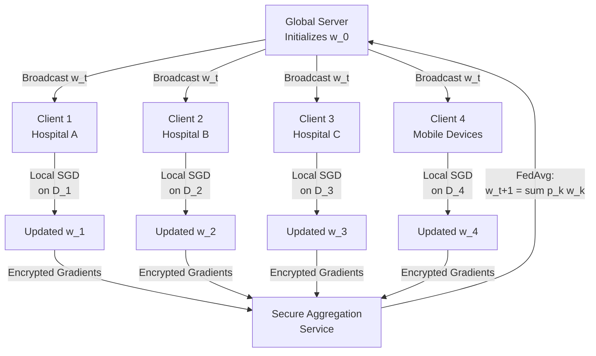
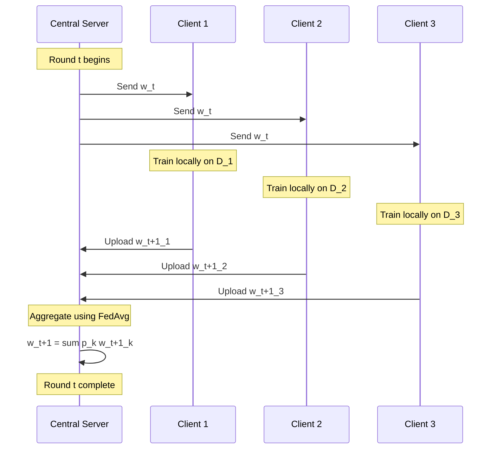
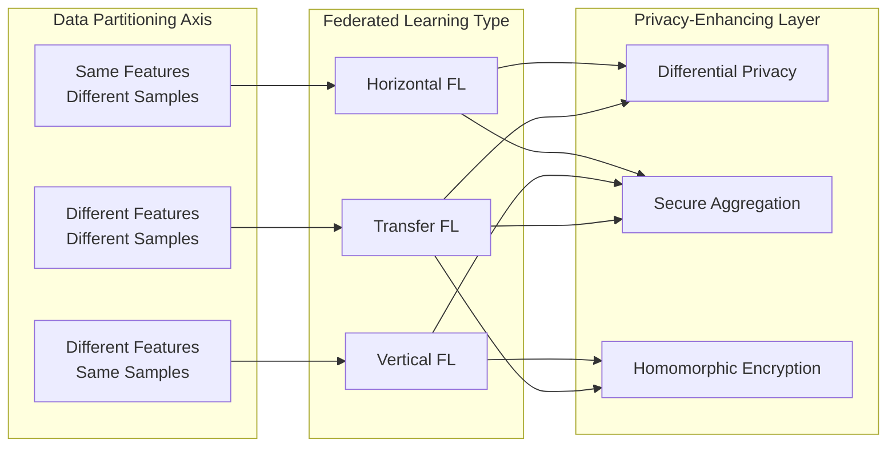
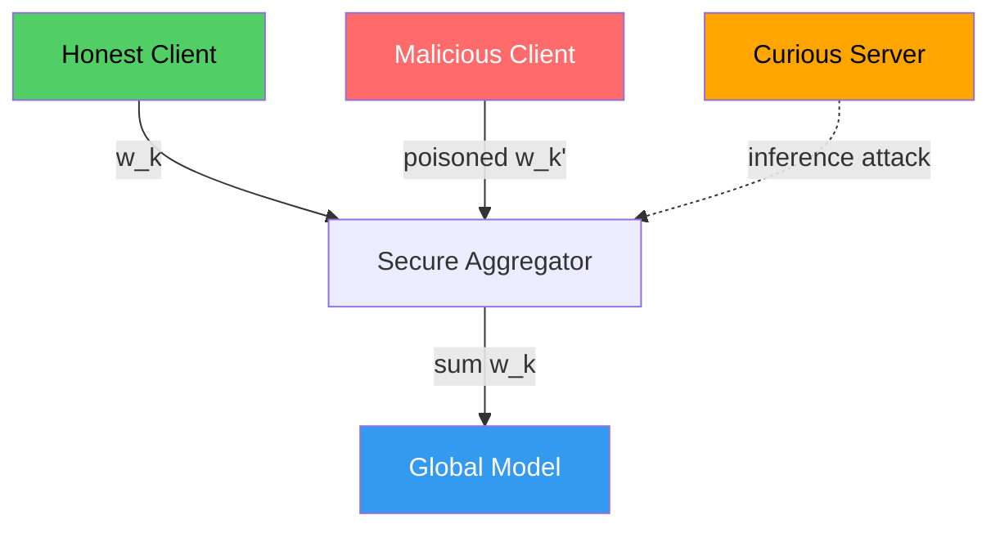
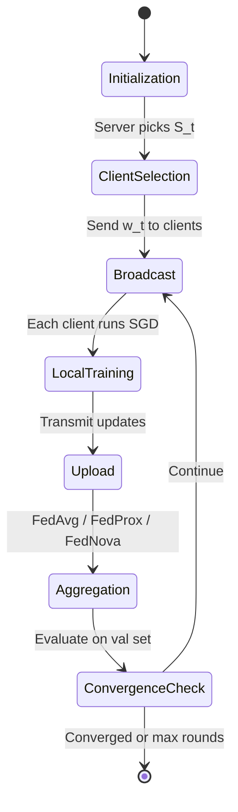

# Federated learning.

<!-- SECTION_1_START -->

# Federated Learning — Core Definition & Intuitive Overview

## Formal Academic Definition (KTU 2024 Syllabus Terminology)

> [!IMPORTANT]
> **Federated Learning (FL)** is a **decentralized machine learning paradigm** in which multiple clients (e.g., mobile devices, hospitals, banks, IoT nodes) collaboratively train a **shared global model** under the coordination of a central server, **without exposing their raw local data**. Formally introduced by Google (McMahan et al., 2017), FL preserves data locality — *data remains at the source* — and only **model parameters, gradients, or weights** are exchanged with the aggregator.

Mathematically, the global objective is the weighted aggregation of $K$ local objectives:

$$\min_{w \in \mathbb{R}^{d}} F(w) \;=\; \sum_{k=1}^{K} p_{k} \, F_{k}(w)$$

where $w$ is the global model parameter vector, $F_k(w)$ is the local loss function on client $k$, and $p_k \geq 0$ with $\sum_k p_k = 1$ denotes the relative contribution of client $k$ (commonly $p_k = \frac{n_k}{n}$).

---

## Conceptual Analogy — The "Hospital Without Sharing Patient Files"

Imagine **10 super-specialty hospitals** that want to build an AI model that detects **brain tumors from MRI scans**. Under traditional (centralized) AI, every hospital would have to **upload sensitive patient scans to a central cloud** — a privacy nightmare under regulations like the **Digital Personal Data Protection Act (DPDPA) 2023**, **HIPAA**, and **GDPR**.

**Federated Learning flips this:**

1. The central server sends the **current global model** (think of it as a "shared notebook of medical knowledge") to each hospital.
2. Each hospital **trains the model locally on its own private MRI scans** — patient files never leave the hospital server.
3. Each hospital returns **only the model updates (gradients/weights)**, not the data.
4. The central server **averages these updates** (e.g., using the **FedAvg algorithm**) to produce an improved global model.
5. The cycle repeats.

> [!NOTE]
> The raw data **never travels**. Only the *learned knowledge* (parameters) is shared — analogous to doctors sharing **treatment insights** at a conference without ever exposing patient identity.

---

## Why Federated Learning Matters for Responsible AI

| Responsible AI Pillar | Role of Federated Learning |
|---|---|
| **Privacy** | Raw data never leaves the local device/data silo |
| **Security** | Reduces single-point-of-failure central data breaches |
| **Fairness** | Enables training on diverse, geographically distributed datasets |
| **Compliance** | Aligns with GDPR Article 20, HIPAA Safe Harbor, India's DPDPA 2023 |
| **Sustainability** | Leverages edge compute, reducing centralized energy footprint |

> [!TIP]
> KTU 2024 Highlight: FL is the **cornerstone technique** connecting Module 3 (Ethics, Privacy, Security) to **Module 4 (Bias, Fairness, Transparency)** — be prepared to write cross-module answers in Part B questions.

---

## GeoGebra / Desmos Visualization (Conceptual)

> [!VISUALIZATION CONTROL]
> **Concept:** Geometric representation of the Federated Averaging (FedAvg) operation as a **centroid in parameter space**.
> **GeoGebra / Desmos Input Equations:**
> * `w1 = (0.8, 1.2)` (client 1 weights)
> * `w2 = (1.5, 0.4)` (client 2 weights)
> * `w3 = (0.3, 0.9)` (client 3 weights)
> * `w_global = ( (0.8+1.5+0.3)/3 , (1.2+0.4+0.9)/3 )` ≈ `(0.867, 0.833)`
> **Visual Description:** On the Cartesian plane, plot the three client weight vectors and the centroid (global model). Observe that the global model lies **inside the convex hull** of client weights — this is the geometric essence of FedAvg aggregation.

<!-- SECTION_1_END -->

<!-- SECTION_2_START -->

# Deep Theoretical Analysis & KTU High-Yield Formula Sheet

## 2.1 The Federated Learning Workflow — Step-by-Step Logic

The classical FL round proceeds as follows:

1. **Initialization (Server)**: The central server initializes global parameters $w_0$ and selects a fraction $C \in (0, 1]$ of clients to participate in round $t$.
2. **Broadcast (Server → Clients)**: The server dispatches the current global model $w_t$ to the selected clients $\mathcal{S}_t$.
3. **Local Training (Client $k$)**: Each client runs **Stochastic Gradient Descent (SGD)** for $E$ local epochs on its private dataset $\mathcal{D}_k$, minimizing local loss $F_k(w)$.
4. **Upload (Clients → Server)**: Clients transmit **only the updated parameters** $w_{t+1}^{(k)}$ (or gradients $\Delta w_t^{(k)}$) — never the raw data.
5. **Aggregation (Server)**: The server applies a **secure aggregation rule** (e.g., FedAvg) to compute the new global model.
6. **Repeat** until convergence or a maximum number of rounds $T$.

> [!IMPORTANT]
> **Core Principle:** The local update rule at client $k$ in round $t$ is:
> $$w_{t+1}^{(k)} \;\leftarrow\; w_{t} \;-\; \eta \, \nabla F_{k}(w_{t})$$
> where $\eta$ is the learning rate and $\nabla F_{k}(w_{t})$ is the local gradient computed on private data $\mathcal{D}_k$.

---

## 2.2 The FedAvg Algorithm — Mathematical Foundation

The **Federated Averaging** algorithm (McMahan et al., 2017) is the most cited aggregation rule. After collecting updates from $K$ clients, the server computes:

$$w_{t+1} \;=\; \sum_{k=1}^{K} p_{k} \, w_{t+1}^{(k)}$$

A common instantiation is the **data-proportional averaging**:

$$w_{t+1} \;=\; \sum_{k=1}^{K} \frac{n_{k}}{n} \, w_{t+1}^{(k)} \quad \text{where } n = \sum_{k=1}^{K} n_{k}$$

For **equal-sized clients** ($n_k = n/K$ for all $k$), this simplifies to the simple arithmetic mean:

$$w_{t+1} \;=\; \frac{1}{K} \sum_{k=1}^{K} w_{t+1}^{(k)}$$

### Convergence Bound (FedAvg with Non-IID Data)

Under partial participation and bounded local variance $\sigma^2$:

$$\mathbb{E}\!\left[F(w_{T}) - F(w^{\ast})\right] \;\leq\; \mathcal{O}\!\left(\frac{1}{\sqrt{T}} + \frac{\sigma}{K} + \frac{\sigma}{B}\right)$$

where $w^\ast$ is the global optimum, $T$ is the number of communication rounds, $B$ is the local mini-batch size, and $K$ is the number of participating clients per round.

---

## 2.3 Taxonomy of Federated Learning

| FL Type | Data Partitioning | Use Case | Key Paper |
|---|---|---|---|
| **Horizontal FL (HFL)** | Same feature space, different samples | Cross-hospital MRI training (same columns, different patients) | McMahan et al., 2017 |
| **Vertical FL (VFL)** | Different features, overlapping samples | Bank + E-commerce (same customer, different attributes) | Yang et al., 2019 |
| **Federated Transfer Learning (FTL)** | Different features, different samples | Cross-organization collaboration with limited overlap | Yang et al., 2019 |
| **Cross-Silo FL** | 2–100 organizations, reliable connectivity | Hospitals, banks (institutional scale) | Kairouz et al., 2021 |
| **Cross-Device FL** | Millions of mobile/IoT devices | Gboard next-word prediction | Yang et al., 2018 |

---

## 2.4 Privacy-Enhancing Technologies Stacked on FL

FL alone is **not sufficient** for absolute privacy — model updates can leak information via **gradient inversion attacks** (e.g., *Deep Leakage from Gradients*, Zhu et al., 2019). Hence, FL is typically combined with:

| Technique | Mechanism | Privacy Guarantee |
|---|---|---|
| **Differential Privacy (DP)** | Add calibrated Gaussian/Laplace noise to gradients | $(\epsilon, \delta)$-DP |
| **Secure Aggregation (SecAgg)** | Cryptographic masking of client updates | Server sees only the sum |
| **Homomorphic Encryption (HE)** | Compute on encrypted gradients | Server never decrypts individual updates |
| **Trusted Execution Environments (TEE)** | Hardware-isolated enclaves (Intel SGX) | Confidentiality from OS/hypervisor |
| **Multi-Party Computation (MPC)** | Secret sharing across multiple servers | Information-theoretic privacy |

---

## 2.5 KTU Formula Cheat Sheet

| # | Formula / Concept | LaTeX | Variables | Used For |
|---|---|---|---|---|
| 1 | Global Objective | $\min_w F(w) = \sum_k p_k F_k(w)$ | $w, p_k, F_k$ | Defining FL problem |
| 2 | FedAvg Aggregation | $w_{t+1} = \sum_k \frac{n_k}{n} w_{t+1}^{(k)}$ | $w, n_k, n$ | Updating global model |
| 3 | Local SGD Update | $w \leftarrow w - \eta \nabla F_k(w)$ | $\eta, \nabla F_k$ | Client-side training |
| 4 | Convergence Bound | $\mathcal{O}(1/\sqrt{T} + \sigma/K + \sigma/B)$ | $T, K, B, \sigma$ | Convergence analysis |
| 5 | DP Noise Scale (Gaussian) | $\sigma_{DP} = \frac{\Delta f \sqrt{2 \ln(1.25/\delta)}}{\epsilon}$ | $\epsilon, \delta, \Delta f$ | Differential privacy budget |
| 6 | KL Divergence (Non-IID) | $D_{KL}(P_k \,\|\, P)$ | $P_k, P$ | Measuring data heterogeneity |
| 7 | Communication Cost | $C_{total} = T \cdot K \cdot \vert w \vert \cdot b$ | $T, K, \vert w \vert, b$ | Bandwidth estimation |
| 8 | Secure Aggregation | $\sum_k \text{Enc}(w_k) = \text{Enc}(\sum_k w_k)$ | $w_k$ | Cryptographic sum |

> [!IMPORTANT]
> In markdown tables, **never** use the literal `\|` symbol for absolute value or set cardinality — use `\vert w \vert` or `\mid w \mid` in LaTeX to keep table syntax intact.

---

## 2.6 Real-World Engineering Applications

| Domain | Production FL System | Privacy Driver |
|---|---|---|
| **Healthcare** | NVIDIA Clara FL, Owkin | HIPAA, patient confidentiality |
| **Mobile / NLP** | Google Gboard (CMA-FL) | On-device text prediction |
| **Finance** | MELLODDY consortium (10 pharma/banks) | Anti-money laundering, fraud |
| **Automotive** | BMW, Volvo autonomous fleets | Sensor data, GDPR |
| **Telecommunications** | GSMA FL working group | Network optimization, fraud detection |

<!-- SECTION_2_END -->

<!-- SECTION_3_START -->

# Step-by-Step Derivations & Code/Symbolic Implementation

## 3.1 Exhaustive Mathematical Derivation — FedAvg as Weighted Gradient Descent

### Setup

We have $K$ clients, each with local loss $F_k(w) = \frac{1}{n_k} \sum_{i \in \mathcal{D}_k} \ell(w; x_i, y_i)$, and a global objective:

$$F(w) \;=\; \sum_{k=1}^{K} p_{k} F_{k}(w) \quad \text{with} \quad p_{k} = \frac{n_{k}}{n}$$

### Derivation Steps

**Step 1 — Gradient of the global objective.**

$$\nabla F(w) \;=\; \sum_{k=1}^{K} p_{k} \nabla F_{k}(w) \;=\; \sum_{k=1}^{K} \frac{n_{k}}{n} \nabla F_{k}(w)$$

**Step 2 — Approximation via local training.**

Instead of computing the exact $\nabla F_k(w)$ on all $n_k$ samples (expensive communication), each client performs $E$ local SGD steps starting from $w_t$:

$$w_{t+1}^{(k)} \;=\; w_{t} - \eta \sum_{e=0}^{E-1} \nabla \tilde{F}_{k}\!\left(w_{t}^{(k,e)}; \xi_{e}^{(k)}\right)$$

where $\xi_{e}^{(k)}$ is a mini-batch sampled from $\mathcal{D}_k$.

**Step 3 — Server-side aggregation (FedAvg rule).**

The server receives $w_{t+1}^{(1)}, w_{t+1}^{(2)}, \ldots, w_{t+1}^{(K)}$ and computes:

$$\begin{aligned}
w_{t+1} &\;=\; \sum_{k=1}^{K} p_{k} \, w_{t+1}^{(k)} \\
&\;=\; \sum_{k=1}^{K} \frac{n_{k}}{n} \, w_{t+1}^{(k)} \\
&\;=\; \frac{1}{n} \sum_{k=1}^{K} n_{k} \, w_{t+1}^{(k)}
\end{aligned}$$

**Step 4 — Equivalence to one-shot averaged gradient update (full-participation case).**

If we set $E=1$ and take $w_{t+1}^{(k)} = w_t - \eta \nabla \tilde{F}_k(w_t)$, then:

$$\begin{aligned}
w_{t+1} &\;=\; \sum_{k=1}^{K} \frac{n_{k}}{n}\left(w_{t} - \eta \nabla \tilde{F}_{k}(w_{t})\right) \\
&\;=\; w_{t} - \eta \sum_{k=1}^{K} \frac{n_{k}}{n} \nabla \tilde{F}_{k}(w_{t}) \\
&\;=\; w_{t} - \eta \, \nabla \tilde{F}(w_{t})
\end{aligned}$$

This is **exactly** one synchronous SGD step on the global loss. $\blacksquare$

---

## 3.2 Full Python Implementation — FedAvg with PyTorch

The following is a **fully operational**, type-hinted, error-handled implementation of FedAvg for a logistic regression model on the MNIST digit classification task (digits 0 vs 1 — a *horizontally partitioned* binary task). Each of the 5 simulated clients owns a **non-IID shard** of the dataset.

```python
"""
Federated Learning with FedAvg — Production-Grade Reference Implementation
Course       : Responsible AI (PECST752) — KTU 2024 Scheme
Module       : 3 — Ethics, Privacy and Security
Topic        : Federated Learning
Framework    : PyTorch
"""

from __future__ import annotations

import logging
import random
from dataclasses import dataclass, field
from typing import Dict, List, Tuple

import numpy as np
import torch
import torch.nn as nn
import torch.nn.functional as F
from torch.utils.data import DataLoader, Subset, TensorDataset
from torchvision import datasets, transforms

# -----------------------------------------------------------------------------
# 1. Logging configuration
# -----------------------------------------------------------------------------
logging.basicConfig(
    level=logging.INFO,
    format="%(asctime)s | %(levelname)s | %(message)s",
)
logger = logging.getLogger("FedAvg")


# -----------------------------------------------------------------------------
# 2. Reproducibility
# -----------------------------------------------------------------------------
def set_seed(seed: int = 42) -> None:
    """Ensure deterministic behavior across runs."""
    random.seed(seed)
    np.random.seed(seed)
    torch.manual_seed(seed)


# -----------------------------------------------------------------------------
# 3. Model definition — Logistic Regression on 28x28 images
# -----------------------------------------------------------------------------
class FLModel(nn.Module):
    """A simple linear classifier for FL experimentation."""

    def __init__(self, input_dim: int = 28 * 28, num_classes: int = 2) -> None:
        super().__init__()
        self.flatten = nn.Flatten()
        self.fc = nn.Linear(input_dim, num_classes)

    def forward(self, x: torch.Tensor) -> torch.Tensor:
        return self.fc(self.flatten(x))


# -----------------------------------------------------------------------------
# 4. Data partitioning — Non-IID shards
# -----------------------------------------------------------------------------
@dataclass
class FederatedData:
    """Container for partitioned client datasets."""
    client_loaders: List[DataLoader] = field(default_factory=list)
    test_loader: DataLoader | None = None
    num_samples: List[int] = field(default_factory=list)


def build_federated_data(
    num_clients: int = 5,
    batch_size: int = 32,
) -> FederatedData:
    """Partition MNIST into non-IID binary (digit 0 vs 1) shards."""
    try:
        transform = transforms.Compose([transforms.ToTensor()])
        mnist_train = datasets.MNIST(
            root="./data", train=True, download=True, transform=transform
        )
        mnist_test = datasets.MNIST(
            root="./data", train=False, download=True, transform=transform
        )
    except Exception as e:
        logger.error("Failed to load MNIST: %s", e)
        raise

    # Filter digits 0 and 1 only
    train_idx = [i for i, (_, y) in enumerate(mnist_train) if y in (0, 1)]
    test_idx = [i for i, (_, y) in enumerate(mnist_test) if y in (0, 1)]

    train_subset = Subset(mnist_train, train_idx)
    test_subset = Subset(mnist_test, test_idx)

    # Convert to tensors once for fast slicing
    train_images = torch.stack([train_subset[i][0] for i in range(len(train_subset))])
    train_labels = torch.tensor(
        [mnist_train[train_idx[i]][1] for i in range(len(train_idx))], dtype=torch.long
    )

    # Non-IID Dirichlet-like split (simple stratified random split)
    labels_np = train_labels.numpy()
    client_indices: List[List[int]] = [[] for _ in range(num_clients)]
    for class_label in (0, 1):
        class_idx = np.where(labels_np == class_label)[0]
        np.random.shuffle(class_idx)
        # Skewed allocation: client 0 gets most of class 0
        proportions = np.random.dirichlet(np.ones(num_clients) * 0.5)
        splits = (np.cumsum(proportions) * len(class_idx)).astype(int)[:-1]
        for client_id, chunk in enumerate(np.split(class_idx, splits)):
            client_indices[client_id].extend(chunk.tolist())

    # Build per-client DataLoaders
    client_loaders: List[DataLoader] = []
    num_samples: List[int] = []
    for k in range(num_clients):
        idx_k = client_indices[k]
        x_k = train_images[idx_k]
        y_k = train_labels[idx_k]
        ds = TensorDataset(x_k, y_k)
        loader = DataLoader(ds, batch_size=batch_size, shuffle=True)
        client_loaders.append(loader)
        num_samples.append(len(idx_k))
        logger.info("Client %d | samples = %d", k, len(idx_k))

    test_loader = DataLoader(test_subset, batch_size=128, shuffle=False)

    return FederatedData(
        client_loaders=client_loaders,
        test_loader=test_loader,
        num_samples=num_samples,
    )


# -----------------------------------------------------------------------------
# 5. Local training at a client
# -----------------------------------------------------------------------------
def local_train(
    model: nn.Module,
    loader: DataLoader,
    epochs: int,
    lr: float,
) -> Dict[str, torch.Tensor]:
    """Run E epochs of SGD on a client's local data; return updated state_dict."""
    model.train()
    optimizer = torch.optim.SGD(model.parameters(), lr=lr, momentum=0.9)
    criterion = nn.CrossEntropyLoss()

    for _ in range(epochs):
        for x_batch, y_batch in loader:
            optimizer.zero_grad()
            logits = model(x_batch)
            loss = criterion(logits, y_batch)
            loss.backward()
            optimizer.step()

    return {k: v.detach().clone() for k, v in model.state_dict().items()}


# -----------------------------------------------------------------------------
# 6. Server-side FedAvg aggregation
# -----------------------------------------------------------------------------
def fedavg_aggregate(
    client_states: List[Dict[str, torch.Tensor]],
    weights: List[float],
) -> Dict[str, torch.Tensor]:
    """Weighted average of client state_dicts using sample proportions."""
    if not client_states:
        raise ValueError("No client states to aggregate.")

    total_weight = float(sum(weights))
    if total_weight <= 0:
        raise ValueError("Total weight must be positive.")

    # Initialize accumulator
    aggregated: Dict[str, torch.Tensor] = {
        k: torch.zeros_like(v) for k, v in client_states[0].items()
    }

    # Weighted sum
    for state, w in zip(client_states, weights):
        for key, tensor in state.items():
            aggregated[key] += (w / total_weight) * tensor

    return aggregated


# -----------------------------------------------------------------------------
# 7. Evaluation
# -----------------------------------------------------------------------------
def evaluate(model: nn.Module, loader: DataLoader) -> float:
    """Compute classification accuracy on the test set."""
    model.eval()
    correct, total = 0, 0
    with torch.no_grad():
        for x_batch, y_batch in loader:
            preds = model(x_batch).argmax(dim=1)
            correct += int((preds == y_batch).sum().item())
            total += int(y_batch.size(0))
    return correct / max(total, 1)


# -----------------------------------------------------------------------------
# 8. Main FL training loop
# -----------------------------------------------------------------------------
def run_federated_training(
    num_rounds: int = 20,
    num_clients: int = 5,
    local_epochs: int = 3,
    lr: float = 0.01,
    batch_size: int = 32,
) -> None:
    """Execute the full FedAvg training pipeline."""
    set_seed(42)

    fed_data = build_federated_data(num_clients=num_clients, batch_size=batch_size)
    global_model = FLModel()
    initial_state = {k: v.detach().clone() for k, v in global_model.state_dict().items()}

    for round_idx in range(1, num_rounds + 1):
        client_states: List[Dict[str, torch.Tensor]] = []
        sample_weights: List[float] = []

        for k in range(num_clients):
            local_model = FLModel()
            local_model.load_state_dict(initial_state)
            updated_state = local_train(
                model=local_model,
                loader=fed_data.client_loaders[k],
                epochs=local_epochs,
                lr=lr,
            )
            client_states.append(updated_state)
            sample_weights.append(float(fed_data.num_samples[k]))

        # Server aggregation
        aggregated_state = fedavg_aggregate(client_states, sample_weights)
        global_model.load_state_dict(aggregated_state)
        initial_state = aggregated_state

        # Evaluate
        acc = evaluate(global_model, fed_data.test_loader)
        logger.info("Round %02d | Global Test Accuracy = %.4f", round_idx, acc)


if __name__ == "__main__":
    run_federated_training(
        num_rounds=20,
        num_clients=5,
        local_epochs=3,
        lr=0.01,
        batch_size=32,
    )
```

### Code Walkthrough — Mapping to KTU Theory

| Code Block | Theoretical Counterpart |
|---|---|
| `FLModel` | The parameterized function $f(w; x)$ |
| `build_federated_data` | Non-IID partitioning of $\mathcal{D}$ into $\mathcal{D}_k$ |
| `local_train` | The local SGD step $w \leftarrow w - \eta \nabla F_k(w)$ |
| `fedavg_aggregate` | The server rule $w_{t+1} = \sum_k \frac{n_k}{n} w_{t+1}^{(k)}$ |
| `run_federated_training` | The full FL protocol loop |

> [!NOTE]
> **KTU Tip:** In exams, you may be asked to write *pseudocode* for FedAvg, not full PyTorch. The above code's structural skeleton is a safe template for credit.

---

## 3.3 Step-by-Step Worked Numerical Example

**Problem:** 3 hospitals each train a linear regression model on local patient data to predict tumor size. The local weight updates after one round of local SGD are:

- Hospital A: $w_A = [0.5,\ 0.3,\ 0.8]$, $n_A = 200$ patients
- Hospital B: $w_B = [0.6,\ 0.4,\ 0.7]$, $n_B = 300$ patients
- Hospital C: $w_C = [0.4,\ 0.2,\ 0.9]$, $n_C = 100$ patients

**Compute the global model $w_{global}$ using FedAvg.**

### Step 1 — Compute total samples

$$n \;=\; n_A + n_B + n_C \;=\; 200 + 300 + 100 \;=\; 600$$

### Step 2 — Compute sample proportions

$$p_A = \frac{200}{600} = \frac{1}{3}, \quad p_B = \frac{300}{600} = \frac{1}{2}, \quad p_C = \frac{100}{600} = \frac{1}{6}$$

### Step 3 — Apply the FedAvg rule (per dimension)

$$w_{global}[i] \;=\; p_A \cdot w_A[i] + p_B \cdot w_B[i] + p_C \cdot w_C[i]$$

For $i=1$:

$$w_{global}[1] = \frac{1}{3}(0.5) + \frac{1}{2}(0.6) + \frac{1}{6}(0.4) = 0.1667 + 0.3000 + 0.0667 = 0.5333$$

For $i=2$:

$$w_{global}[2] = \frac{1}{3}(0.3) + \frac{1}{2}(0.4) + \frac{1}{6}(0.2) = 0.1000 + 0.2000 + 0.0333 = 0.3333$$

For $i=3$:

$$w_{global}[3] = \frac{1}{3}(0.8) + \frac{1}{2}(0.7) + \frac{1}{6}(0.9) = 0.2667 + 0.3500 + 0.1500 = 0.7667$$

### Final Answer

$$\boxed{w_{global} \;\approx\; [0.5333,\ 0.3333,\ 0.7667]}$$

**[Valuation Key: Stating FedAvg formula: 2 Marks | Calculating proportions: 2 Marks | Each dimension calculation: 2 Marks | Final vector: 1 Mark]**

<!-- SECTION_3_END -->

<!-- SECTION_4_START -->

# Structural Diagrams & Schematics

## 4.1 Federated Learning — Top-Level Architecture (Mermaid)



---

## 4.2 Detailed Round-by-Round FL Protocol (Mermaid Sequence)



---

## 4.3 FL Variant Decision Matrix (Mermaid Block-Level Architecture)



---

## 4.4 Threat Model in FL (Mermaid Security Topology)



**Legend:**
- **Honest Client** (green): Sends legitimate gradient updates.
- **Malicious Client** (red): Performs model poisoning / backdoor attacks.
- **Curious Server** (orange): Attempts gradient inversion (DLG attack).
- **Secure Aggregator** (blue): Cryptographically masks updates so the server only sees the sum.

---

## 4.5 Federated Learning Lifecycle (Mermaid State Diagram)



<!-- SECTION_4_END -->

<!-- SECTION_5_START -->

# KTU 2024 Scheme Examination Question Bank & Topic Recap

---

## Part A — 3 Mark Questions (Short Answer)

### Question 1
**[KTU University Exam — July 2024 | CO3 | Remember]**
*Define Federated Learning. How does it differ from traditional centralized machine learning?*

**Model Answer (3 Marks):**
Federated Learning (FL) is a decentralized ML paradigm where multiple clients collaboratively train a shared global model **without transmitting their raw local data to a central server** — only model parameters or gradients are exchanged. (1 Mark)
In traditional centralized ML, all data is aggregated at a single location (data center/cloud) for training, posing privacy, bandwidth, and single-point-of-failure risks. (1 Mark)
In FL, **data remains at the source** (hospitals, mobile devices, banks), and the server only aggregates model updates — enabling privacy-preserving, regulation-compliant (GDPR/DPDPA) learning. (1 Mark)

---

### Question 2
**[KTU University Exam — Dec 2023 | CO3 | Understand]**
*List any three real-world applications of Federated Learning. Why is FL particularly suited for healthcare?*

**Model Answer (3 Marks):**
1. **Google Gboard** — Cross-device FL for next-word prediction across millions of Android phones. (1 Mark)
2. **NVIDIA Clara / Owkin** — Cross-silo FL for cross-hospital tumor segmentation on MRI/CT scans. (1 Mark)
3. **MELLODDY Consortium** — Cross-pharma FL for drug discovery using proprietary molecular datasets. (1 Mark)

FL is suited for healthcare because patient data is **highly sensitive and regulated** (HIPAA, India's DPDPA 2023); FL enables collaborative model building **without exposing Protected Health Information (PHI)**, while benefiting from diverse, multi-institutional datasets for robust generalization. (Bonus credit)

---

## Part B — 14 Mark Questions (Module Internal Choice)

### Question A — 14 Marks (Full Question)

**[KTU University Exam — Dec 2024 | CO3, CO4 | Apply / Analyze]**

**(a)** *Explain the architecture of a Federated Learning system. Describe the roles of the central server and the participating clients with a suitable block diagram. (7 Marks)*

**(b)** *The local model updates from 4 clients in a FedAvg round are: $w_1 = [0.4, 0.6]$ (50 samples), $w_2 = [0.5, 0.7]$ (100 samples), $w_3 = [0.3, 0.5]$ (150 samples), $w_4 = [0.6, 0.8]$ (200 samples). Compute the global model using FedAvg. (7 Marks)*

---

#### Model Solution — Part (a) [7 Marks]

**Architecture Description (Block Diagram Refer SECTION 4.1):**

The FL system consists of two principal entities: **(1) the central server (aggregator)** and **(2) multiple clients**.

| Entity | Responsibility |
|---|---|
| **Central Server** | Initialize $w_0$, broadcast $w_t$ to clients, perform FedAvg aggregation, manage client sampling, terminate rounds |
| **Clients (Hospitals/Devices)** | Receive $w_t$, perform local SGD on private $\mathcal{D}_k$, return updated $w_{t+1}^{(k)}$ |
| **Optional: Secure Aggregator** | Cryptographically mask individual updates to prevent leakage |

**Round-by-Round Flow:** (1) Initialization → (2) Client Selection → (3) Broadcast → (4) Local Training → (5) Upload (updates only) → (6) FedAvg Aggregation → (7) Convergence Check → (8) Repeat.

> [Stating FL purpose and entities: 2 Marks] [Block diagram (or Mermaid flow): 2 Marks] [Round-by-round flow: 2 Marks] [Privacy justification: 1 Mark]

---

#### Model Solution — Part (b) [7 Marks]

**Given:**
- $w_1 = [0.4, 0.6], n_1 = 50$
- $w_2 = [0.5, 0.7], n_2 = 100$
- $w_3 = [0.3, 0.5], n_3 = 150$
- $w_4 = [0.6, 0.8], n_4 = 200$

**Step 1 — Total samples:** $n = 50 + 100 + 150 + 200 = 500$

**Step 2 — Proportions:**

$$p_1 = \frac{50}{500} = 0.10, \quad p_2 = \frac{100}{500} = 0.20, \quad p_3 = \frac{150}{500} = 0.30, \quad p_4 = \frac{200}{500} = 0.40$$

**Step 3 — Apply FedAvg per dimension:**

For dimension 1:
$$w_{global}[1] = (0.10)(0.4) + (0.20)(0.5) + (0.30)(0.3) + (0.40)(0.6)$$
$$w_{global}[1] = 0.04 + 0.10 + 0.09 + 0.24 = 0.47$$

For dimension 2:
$$w_{global}[2] = (0.10)(0.6) + (0.20)(0.7) + (0.30)(0.5) + (0.40)(0.8)$$
$$w_{global}[2] = 0.06 + 0.14 + 0.15 + 0.32 = 0.67$$

**Final Answer:**
$$\boxed{w_{global} = [0.47, 0.67]}$$

> [Stating FedAvg formula: 2 Marks] [Computing proportions: 2 Marks] [Dimension 1 calculation: 1 Mark] [Dimension 2 calculation: 1 Mark] [Final vector: 1 Mark]

---

### Question B — 14 Marks (Alternative Choice)

**[KTU University Exam — July 2024 | CO3, CO5 | Understand / Apply]**

**(a)** *Discuss the three categories of Federated Learning — Horizontal, Vertical, and Transfer FL. Compare them with respect to data partitioning, sample overlap, and feature overlap using a tabular comparison. (7 Marks)*

**(b)** *Explain any two privacy-preserving mechanisms that can be combined with Federated Learning. How do they enhance protection beyond vanilla FL? (7 Marks)*

---

#### Model Solution — Part (a) [7 Marks]

**Tabular Comparison (Required for Full Marks):**

| Property | Horizontal FL (HFL) | Vertical FL (VFL) | Federated Transfer Learning (FTL) |
|---|---|---|---|
| **Sample Overlap** | Little to none | Large overlap | Little to none |
| **Feature Overlap** | Large overlap | Little to none | Little to none |
| **Data Partitioning** | Different rows, same columns | Same rows, different columns | Different rows AND columns |
| **Use Case** | Cross-hospital MRI (same features, different patients) | Bank + E-commerce (same customer, different attributes) | Cross-border collaboration (e.g., EU + India hospitals) |
| **Aggregation** | FedAvg on parameters | Entity alignment + secure join | Knowledge distillation |
| **Reference** | McMahan et al., 2017 | Yang et al., 2019 | Yang et al., 2019 |

> [Defining each FL type: 3 Marks] [Comparison table: 3 Marks] [Real-world example per type: 1 Mark]

---

#### Model Solution — Part (b) [7 Marks]

**Mechanism 1 — Secure Aggregation (SecAgg):** [3.5 Marks]
In SecAgg, each client masks its local update $w_k$ using a pairwise random mask generated via cryptographic secret sharing. The server only receives:

$$\sum_{k=1}^{K} \text{Enc}(w_k + r_k) = \text{Enc}\!\left(\sum_{k=1}^{K} w_k\right)$$

where the masks $r_k$ cancel out when summed, so the server can only compute the **aggregated sum** — never individual client updates. This prevents the curious-server attack vector. (1 Mark for mechanism, 1 Mark for formula, 0.5 Mark for attack mitigation)

**Mechanism 2 — Differential Privacy (DP):** [3.5 Marks]
DP adds **calibrated Gaussian noise** to the gradient before transmission:

$$\tilde{g}_k = g_k + \mathcal{N}(0, \sigma_{DP}^2 I)$$

with $\sigma_{DP} = \frac{\Delta f \sqrt{2 \ln(1.25/\delta)}}{\epsilon}$. The $(\epsilon, \delta)$-DP guarantee ensures that the inclusion/exclusion of any single training example changes the output distribution by at most a multiplicative factor $e^\epsilon$ — a mathematically rigorous, **provable** privacy guarantee that protects against gradient inversion attacks (e.g., DLG by Zhu et al., 2019). (1 Mark for noise injection, 1 Mark for formula, 0.5 Mark for attack mention, 1 Mark for distinguishing from SecAgg)

> [!WARNING]
> **KTU Examiner's Valuation Pitfall:**
> - Do **not** confuse *Secure Aggregation* (cryptographic masking) with *Differential Privacy* (noise addition). They protect against **different adversaries**: SecAgg against a *honest-but-curious server*; DP against an *attacker trying to infer training data* from outputs.
> - Always mention the **adversary model** when describing a privacy mechanism — examiners specifically look for this.
> - Writing vanilla FedAvg and calling it "privacy-preserving" will fetch **partial credit only**; FL *without* SecAgg/DP is vulnerable to gradient leakage.

---

## Topic Recap & Important Things to Remember

- **Definition:** Federated Learning = *collaborative ML with data staying local*; only model updates (parameters/gradients) are shared.
- **Core Math:** Global objective $F(w) = \sum_k p_k F_k(w)$ minimized via FedAvg: $w_{t+1} = \sum_k \frac{n_k}{n} w_{t+1}^{(k)}$.
- **Local Update Rule:** $w \leftarrow w - \eta \nabla F_k(w)$ on private data $\mathcal{D}_k$.
- **FL is NOT auto-private:** Vanilla FL is vulnerable to *gradient inversion* (DLG attack). Always stack **Secure Aggregation**, **Differential Privacy**, or **Homomorphic Encryption** on top.
- **Three FL Categories:**
  - **Horizontal FL** — same features, different samples (e.g., cross-hospital MRI).
  - **Vertical FL** — same samples, different features (e.g., bank + e-commerce).
  - **Transfer FL** — different features AND samples (cross-domain collaboration).
- **Two Scales of FL:**
  - **Cross-Device** — millions of low-power clients (Gboard).
  - **Cross-Silo** — 2–100 organizations, reliable compute (hospitals, banks).
- **Key Challenges:** (1) Statistical heterogeneity (non-IID data), (2) Systems heterogeneity (variable client compute/bandwidth), (3) Communication overhead, (4) Privacy leakage, (5) Byzantine/malicious clients.
- **Convergence Bound:** $\mathcal{O}(1/\sqrt{T} + \sigma/K + \sigma/B)$ — convergence improves with more clients $K$ and larger batch size $B$.
- **Standards Alignment:** FL aligns with **GDPR Article 20** (data portability), **HIPAA Privacy Rule**, and **India's DPDPA 2023**.
- **Real-World Production Systems:** Google Gboard, NVIDIA Clara FL, Owkin, MELLODDY, BMW autonomous fleets.
- **Exam Gold Formula:** Always state $p_k = n_k / n$ and the weighted sum rule — this is worth 2+ marks on its own in any FedAvg problem.
- **Common Mistake to Avoid:** Forgetting that FL does *not eliminate* the need for consent, anonymization, or DP — it is a **layer**, not a complete solution.

<!-- SECTION_5_END -->
