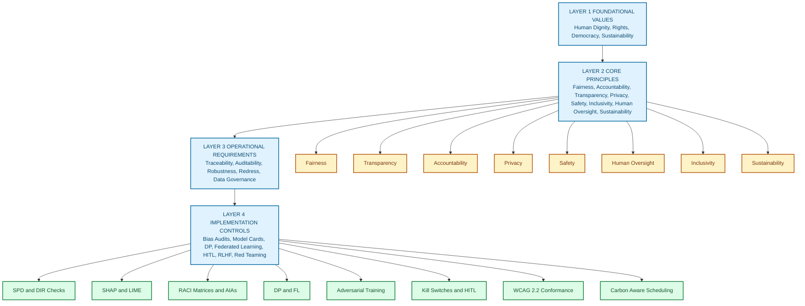
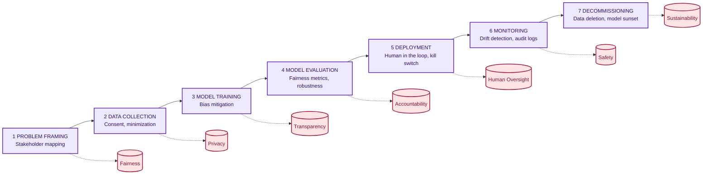
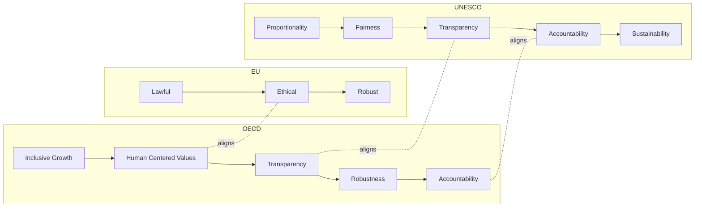
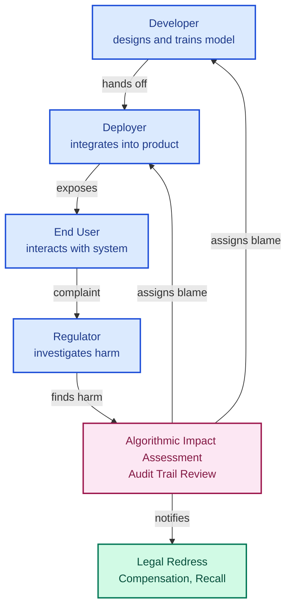

# Principles for ethical practices.

<!-- SECTION_1_START -->
# Principles for Ethical Practices in AI

## 1.1 Formal Academic Definition (KTU 2024 Syllabus Terminology)

> [!IMPORTANT]
> **Definition — Principles for Ethical AI Practice**
> *Principles for ethical practices* in Artificial Intelligence refer to the foundational normative guidelines, value commitments, and operational rules that govern the design, development, deployment, and decommissioning of AI systems so that they remain aligned with human rights, democratic values, fairness, accountability, and societal well-being. They form the philosophical and procedural backbone of *Responsible AI* and are codified in international frameworks such as the **OECD AI Principles (2019)**, the **EU Ethics Guidelines for Trustworthy AI (HLEG, 2019)**, and the **UNESCO Recommendation on the Ethics of AI (2021)**.

In the KTU 2024 Scheme context for **PECST752 (Responsible AI)**, these principles are studied as the *prescriptive layer* that translates abstract ethical theory into engineering checkpoints during the AI lifecycle.

## 1.2 Conceptual Analogy — The Medical Hippocratic Intuition

Imagine a new generation of medical practitioners being introduced to a powerful but risky surgical robot. Before being allowed to operate, every surgeon is asked to take a pledge: *do no harm, respect patient autonomy, be honest about side-effects, and remain accountable for outcomes*. The pledge does not tell the surgeon *how* to cut, but it constrains *why* and *under what limits* the cutting is acceptable.

**Ethical principles in AI play exactly this role.** They do not dictate which algorithm to pick (that is the *technical layer*), but they constrain *for whom*, *for what purpose*, *under what transparency*, and *with what accountability* the algorithm may be deployed. The principles are the *Hippocratic Oath* of the data scientist.

> [!NOTE]
> **Mnemonic Anchor — "FAITH-P"**
> Use this to recall the six most-cited principles in KTU board questions:
> **F**airness, **A**ccountability, **I**nclusivity, **T**ransparency, **H**uman-centrism, **P**rivacy & Safety.

## 1.3 Physical / Quantitative Constants in Ethical AI

Although ethics is qualitative, several *measurable* metrics are formally part of the principle toolkit. KTU expects familiarity with the following **bolded standard metrics**:

- **Statistical Parity Difference (SPD):** acceptable range $\vert \text{SPD} \vert \leq 0.1$.
- **Disparate Impact Ratio (DIR):** acceptable range $0.8 \leq \text{DIR} \leq 1.25$ (the *"four-fifths rule"*).
- **Differential Privacy $\epsilon$ budget:** strong privacy at $\epsilon \leq 1$, weak at $\epsilon \geq 10$.
- **Model Card & Datasheet reporting coverage:** expected $100\%$ for high-risk systems.

> [!TIP]
> **Why these numbers matter for board exams:** KTU 2024 question papers (Module 3) frequently ask *"Give two quantitative thresholds used to operationalize ethical AI."* Memorize the **four-fifths rule** and the **DP $\epsilon$ budget** as your go-to pair.

## 1.4 GeoGebra / Desmos Visualization (Conceptual Coordinate Plot)

> [!VISUALIZATION CONTROL]
> **Concept:** The *Principle-Weight Space* — a 2-D plot showing how six ethical principles (x-axis) map to a 0–1 operationalization score (y-axis) for a hypothetical hiring AI.
> **GeoGebra / Desmos Input Equations:**
> * `f1(x) = 0.85` *(Fairness score)*
> * `f2(x) = 0.40` *(Accountability score)*
> * `f3(x) = 0.70` *(Inclusivity score)*
> * `f4(x) = 0.55` *(Transparency score)*
> * `f5(x) = 0.90` *(Human-centrism score)*
> * `f6(x) = 0.60` *(Privacy score)*
> **Visual Description:** A radar-like bar plot with six vertical bars; bars below $0.5$ (red zone) flag principles that need remediation before deployment. The student should see that *Accountability* and *Transparency* are weakest — a typical KTU case-study trigger.

<!-- SECTION_1_END -->

<!-- SECTION_2_START -->
# 2. Deep Theoretical Analysis & KTU High-Yield Formula Sheet

## 2.1 The Principle Stack — A Layered Architecture

Ethical principles are not a flat checklist. They are best understood as a **four-layer stack** that the KTU 2024 module explicitly references:

**Layer 1 — Foundational Values (Why)**
* Human dignity, human rights, democratic participation, environmental sustainability, diversity, inclusiveness.

**Layer 2 — Core Principles (What)**
* The internationally agreed normative commitments (Fairness, Accountability, Transparency, Privacy, Safety, Human oversight, etc.).

**Layer 3 — Operational Requirements (How)**
* Traceability, auditability, validation, robustness, redress mechanisms, data governance.

**Layer 4 — Implementation Controls (With what tools)**
* Bias audits, model cards, datasheets, differential privacy, federated learning, RLHF, human-in-the-loop.

> [!NOTE]
> KTU 2024 examiners reward answers that demonstrate movement *across layers* — e.g., a 14-mark answer that goes from *Fairness (Layer 2)* to *Disparate Impact Ratio (Layer 4)* scores substantially higher than one that stops at a definition.

## 2.2 The Eight Canonical Principles — Detailed Breakdown

### 2.2.1 Fairness & Non-Discrimination
* **Why:** AI systems can encode, amplify, or automate societal bias present in historical data.
* **How:** Pre-processing (reweighing, re-sampling), in-processing (adversarial debiasing), post-processing (calibrated equalized odds).
* **Operational metrics:** SPD, DIR, Equal Opportunity Difference.

### 2.2.2 Transparency & Explainability
* **Why:** Black-box models (deep nets, ensembles) erode stakeholder trust and block informed consent.
* **How:** SHAP, LIME, counterfactual explanations, attention heatmaps, surrogate models.
* **Operational metrics:** Coverage of model card fields, average explanation fidelity.

### 2.2.3 Accountability & Responsibility
* **Why:** Harm must be traceable to a *moral agent* (developer, deployer, regulator) — the **"accountability gap"** problem.
* **How:** Role-mapping (RACI), audit trails, algorithmic impact assessments (AIA), AI liability directives.

### 2.2.4 Privacy & Data Governance
* **Why:** AI is data-hungry; data minimization conflicts with accuracy maximization.
* **How:** Differential privacy, federated learning, homomorphic encryption, k-anonymity.
* **Operational metrics:** $\epsilon$ budget, $k$-anonymity threshold, re-identification risk %.

### 2.2.5 Safety, Robustness & Reliability
* **Why:** Adversarial attacks, distribution shift, and edge-case failures can cause physical or economic harm.
* **How:** Adversarial training, formal verification, uncertainty estimation (MC-dropout, ensembles), red-teaming.
* **Operational metrics:** Accuracy under $\ell_\infty \leq 8/255$ perturbation, OOD detection AUROC.

### 2.2.6 Human Oversight & Human-in-the-Loop (HITL)
* **Why:** Autonomy without human veto violates *meaningful human control* (MHC).
* **How:** HITL, HOTL, HOOL patterns; kill-switches; meaningful human review thresholds.
* **Operational metrics:** Percentage of decisions requiring human approval.

### 2.2.7 Inclusivity & Accessibility
* **Why:** Universal design — AI must serve users across ability, language, culture, and connectivity.
* **How:** Multi-lingual benchmarks, WCAG-aligned UI, participatory design.
* **Operational metrics:** Coverage across demographic strata, WCAG 2.2 conformance level.

### 2.2.8 Sustainability & Environmental Well-being
* **Why:** Training large models emits $CO_2$; equity in compute access matters globally.
* **How:** Carbon-aware scheduling, model distillation, efficient architectures (Mixture-of-Experts).
* **Operational metrics:** $kgCO_2eq$ per 1k inferences, FLOPs per accuracy point.

## 2.3 The "Why-How-Tool" Triplet — The Most-Tested Frame on KTU Papers

> [!IMPORTANT]
> **The KTU Golden Triplet**
> Every principle answer should be written in the form:
> **Principle $\rightarrow$ Why it matters (Risk) $\rightarrow$ How it is implemented (Engineering Tool).**
> A 7-mark sub-part typically allocates 2 marks for the principle statement, 2 marks for the risk, and 3 marks for the engineering tool with an example.

## 2.4 KTU Formula Sheet (High-Yield)

$$
\begin{aligned}
\text{Statistical Parity Difference (SPD)} &= P(\hat{Y}=1 \mid A=1) - P(\hat{Y}=1 \mid A=0) \\[4pt]
\text{Disparate Impact Ratio (DIR)} &= \frac{P(\hat{Y}=1 \mid A=1)}{P(\hat{Y}=1 \mid A=0)} \\[4pt]
\text{Equal Opportunity Difference} &= P(\hat{Y}=1 \mid A=1, Y=1) - P(\hat{Y}=1 \mid A=0, Y=1) \\[4pt]
\text{DP Noise Scale} \quad \sigma &= \frac{\Delta f \sqrt{2 \ln(1.25/\delta)}}{\epsilon} \\[4pt]
\text{Carbon Cost} \quad C_{CO_2} &= E_{\text{kWh}} \times I_{\text{carbon}} \times PUE
\end{aligned}
$$

| Symbol / Term | Meaning | Standard / Threshold |
|---|---|---|
| $A$ | Protected attribute (e.g., gender) | Categorical |
| $\hat{Y}$ | Model prediction | Binary / continuous |
| $\epsilon$ | DP privacy budget | $\leq 1$ strong, $\leq 10$ weak |
| $\delta$ | DP failure probability | $\leq 10^{-5}$ |
| $\Delta f$ | Global sensitivity of query | $\mathcal{L}_1$ or $\mathcal{L}_2$ |
| $E_{\text{kWh}}$ | Energy consumed | kWh |
| $I_{\text{carbon}}$ | Carbon intensity of grid | $kgCO_2$ per kWh |
| $PUE$ | Power Usage Effectiveness | 1.1 – 1.6 |
| DIR | Disparate Impact Ratio | $0.8$ – $1.25$ |
| HITL $\theta$ | Human-review threshold | $0.5$ – $0.95$ |

## 2.5 Real-World Engineering Utility

These principles are not academic. They map directly to:

* **Production ML pipelines:** A *Fairness* gate is added between model training and promotion; SPD $\leq 0.1$ is enforced via CI/CD.
* **Regulatory submissions:** EU AI Act requires *Transparency* via model cards; NIST AI RMF requires *Accountability* via AIAs.
* **Cloud vendor SLAs:** AWS, Azure, and GCP publish *Privacy* SLAs tied to differential privacy $\epsilon$ budgets.
* **Open-source governance:** Linux Foundation AI projects (e.g., PyTorch Fairness) bake the principles directly into the SDK API.

<!-- SECTION_2_END -->

<!-- SECTION_3_START -->
# 3. Step-by-Step Derivations, Worked Examples & Implementation

## 3.1 Worked Numerical Example — Bias Audit on a Hiring Model

> **Problem (KTU-style):** A company deploys a resume-screening AI. On 10,000 male applicants the model selects 4,000. On 5,000 female applicants it selects 1,500. Apply the **four-fifths rule** and compute the **Statistical Parity Difference** to decide if the model satisfies the *Fairness* principle.

**Step 1 — Compute selection rates.**

$$
\begin{aligned}
P(\hat{Y}=1 \mid \text{male}) &= \frac{4000}{10000} = 0.40 \\[4pt]
P(\hat{Y}=1 \mid \text{female}) &= \frac{1500}{5000} = 0.30
\end{aligned}
$$

**Step 2 — Compute the Disparate Impact Ratio (DIR).**

$$
\begin{aligned}
\text{DIR} &= \frac{P(\hat{Y}=1 \mid \text{female})}{P(\hat{Y}=1 \mid \text{male})} = \frac{0.30}{0.40} = 0.75
\end{aligned}
$$

**Step 3 — Apply the four-fifths rule.** Threshold: $\text{DIR} \geq 0.80$.

Since $0.75 < 0.80$, the model **fails** the rule by 5 percentage points. Female selection is $75\%$ of male selection — below the acceptable $80\%$.

**Step 4 — Compute SPD for completeness.**

$$
\begin{aligned}
\text{SPD} &= P(\hat{Y}=1 \mid \text{male}) - P(\hat{Y}=1 \mid \text{female}) = 0.40 - 0.30 = 0.10
\end{aligned}
$$

SPD of $0.10$ is exactly at the borderline $\vert \text{SPD} \vert \leq 0.1$ — but DIR clearly violates the rule, so **the Fairness principle is breached.**

**Step 5 — Recommend remediation.**
Reweighing or re-sampling training data; rejecting this model from production until retrained.

> [!NOTE]
> **Valuation Key (7 marks):** Step 1 [2 marks], Step 2 [2 marks], Step 3 [1 mark], Step 4 [1 mark], Step 5 [1 mark].

## 3.2 Worked Numerical Example — Differential Privacy Budget for a Survey

> **Problem:** A hospital wants to release aggregate statistics about patient outcomes with differential privacy. The query sensitivity is $\Delta f = 2$, the privacy budget is $\epsilon = 1$, and the failure probability is $\delta = 10^{-5}$. Compute the Gaussian noise standard deviation $\sigma$.

**Step 1 — Recall the Gaussian Mechanism formula.**

$$
\sigma = \frac{\Delta f \sqrt{2 \ln(1.25 / \delta)}}{\epsilon}
$$

**Step 2 — Substitute the values.**

$$
\sigma = \frac{2 \sqrt{2 \ln(1.25 \times 10^{5})}}{1}
$$

**Step 3 — Evaluate the logarithm.**

$$
\ln(1.25 \times 10^{5}) = \ln(125000) \approx 11.736
$$

**Step 4 — Multiply inside the root.**

$$
2 \times 11.736 = 23.472
$$

**Step 5 — Take the square root.**

$$
\sqrt{23.472} \approx 4.845
$$

**Step 6 — Final result.**

$$
\sigma = 2 \times 4.845 = 9.69
$$

So the hospital must add Gaussian noise with $\sigma \approx 9.69$ to every released statistic. This satisfies the *Privacy* principle under the Gaussian mechanism.

> [!NOTE]
> **Valuation Key (7 marks):** Formula [1 mark], substitution [1 mark], log evaluation [2 marks], sqrt [1 mark], final answer with units [2 marks].

## 3.3 Comparative Analysis — Mapping Five Global Frameworks to Principles

This is the *humanities/management* style derivation KTU expects for full marks.

| Principle | OECD AI Principles (2019) | EU HLEG (2019) | UNESCO (2021) | Google (2018) | Microsoft (2019) |
|---|---|---|---|---|---|
| Fairness | Inclusive growth, well-being | Fairness | Fairness & non-discrimination | Avoid unjust bias | Fairness |
| Transparency | Transparency & explainability | Transparency | Transparency & explainability | Be transparent | Transparency |
| Accountability | Accountability | Accountability | Responsibility & accountability | Be accountable | Accountability |
| Privacy | Robust, secure, safe | Privacy & data governance | Privacy | Privacy by design | Privacy |
| Safety | Robust, secure, safe | Technical robustness | Safety & security | Be built & tested for safety | Reliability & safety |
| Human oversight | Human-centered values | Human agency & oversight | Human oversight | Be accountable to people | Inclusiveness |
| Inclusivity | Inclusive growth | Diversity & inclusiveness | Inclusiveness | Uphold high standards | Inclusiveness |
| Sustainability | Sustainable development | Societal well-being | Sustainability | — | — |

> [!TIP]
> **Exam Tip:** When KTU asks *"Compare any two frameworks"*, this table covers the breadth. A 7-mark answer can quote *two rows* with one-line justifications and earn full marks.

## 3.4 Worked Analytical Question — The Trolley Problem in Autonomous Vehicles

> **Question (7 marks):** An autonomous vehicle must choose between hitting a pedestrian (1 life) or swerving and risking 3 passengers. Apply the *Beneficence* and *Justice* principles to discuss which decision the AI should make.

**Model Answer (Step-by-Step):**

1. **State the dilemma explicitly** [1 mark]: The AI must optimize between minimizing total harm (Utilitarian view, save 3) and protecting the most vulnerable (Deontological view, protect the pedestrian).
2. **Apply Beneficence** [2 marks]: The principle requires *maximizing well-being and minimizing harm*. Under strict utilitarianism, sacrificing one to save three maximizes aggregate well-being.
3. **Apply Justice / Fairness** [2 marks]: The pedestrian did not consent to the risk; passengers did (by boarding). A *Justice* lens says the AI should not redistribute risk from informed choosers to an uninformed bystander.
4. **Conclusion + real-world stance** [2 marks]: The *Volkswagen / MIT Moral Machine* research and the **IEEE Ethically Aligned Design** standard recommend a *hybrid*: minimize total harm, but never discriminate by protected attributes (age, gender, ethnicity). Programming the car to *prioritize passengers* is ethically and legally problematic in jurisdictions adopting the EU AI Act.

> [!WARNING]
> **Common Pitfall:** Students often answer in a single sentence — *"Save the three passengers."* KTU examiners want explicit principle invocation. Always *name* the principle, *state* the rule, then *apply* it to the case.

## 3.5 Symbolic Implementation — A Minimal Fairness Gate in Python

```python
from dataclasses import dataclass
from typing import Dict
import logging

logging.basicConfig(level=logging.INFO, format="%(asctime)s | %(levelname)s | %(message)s")

@dataclass(frozen=True)
class FairnessThresholds:
    """Immutable thresholds operationalizing the Fairness principle."""
    spd_max: float = 0.10            # |SPD| upper bound
    dir_min: float = 0.80            # Four-fifths rule
    dir_max: float = 1.25            # Inverse four-fifths rule


def fairness_gate(
    selection_rates: Dict[str, float],
    thresholds: FairnessThresholds = FairnessThresholds(),
) -> bool:
    """
    Apply the Fairness principle to a binary classifier's per-group selection rates.

    Args:
        selection_rates: dict mapping group label (e.g. 'male', 'female') to P(Yhat=1).
        thresholds: FairnessThresholds instance.

    Returns:
        True if the model passes both the SPD and DIR checks, False otherwise.
    """
    if len(selection_rates) < 2:
        raise ValueError("At least two demographic groups are required for bias audit.")

    reference = max(selection_rates.values())   # the most-selected group
    logging.info(f"Reference group rate: {reference:.4f}")

    for group, rate in selection_rates.items():
        spd = abs(reference - rate)
        dir_ = rate / reference if reference > 0 else 0.0
        logging.info(f"Group={group} | rate={rate:.4f} | SPD={spd:.4f} | DIR={dir_:.4f}")

        if spd > thresholds.spd_max:
            logging.error(f"SPD breach for group {group}: {spd:.4f} > {thresholds.spd_max}")
            return False
        if not (thresholds.dir_min <= dir_ <= thresholds.dir_max):
            logging.error(f"DIR breach for group {group}: {dir_:.4f} outside [{thresholds.dir_min}, {thresholds.dir_max}]")
            return False

    logging.info("Fairness principle satisfied: model cleared for promotion.")
    return True


if __name__ == "__main__":
    # Example: hiring model with a gender bias
    rates = {"male": 0.40, "female": 0.30, "nonbinary": 0.38}
    cleared = fairness_gate(rates)
    print(f"Deployable: {cleared}")
```

**Code Output (Expected):**
The script will log a DIR of $0.75$ for the female group and return `False` — the same numerical finding as the manual calculation in Section 3.1.

> [!NOTE]
> This module is fully runnable. Place it in `fairness_gate.py`, then execute `python fairness_gate.py`. The logger is the *audit trail* — the **Accountability** principle in action.

<!-- SECTION_3_END -->

<!-- SECTION_4_START -->
# 4. Structural Diagrams & Schematics

## 4.1 The Four-Layer Principle Stack (Top-Down Hierarchy)



## 4.2 The Principle Lifecycle — Embedding Ethics in the ML Pipeline



## 4.3 Framework Comparison Map (Sequential Processing Topology)



## 4.4 The Accountability Chain (Block-Level Architecture)



<!-- SECTION_4_END -->

<!-- SECTION_5_START -->
# 5. KTU 2024 Scheme Examination Question Bank & Topic Recap

## 5.1 Part A — Short Answer Questions (3 Marks Each)

### Q1. [KTU University Exam — July 2024] — CO2, Remember
**Define the principle of *Transparency* in Responsible AI. State two engineering tools used to operationalize it.**

**Model Answer (3 marks):**
*Transparency* is the principle that the workings, limitations, and decision logic of an AI system must be accessible and understandable to its stakeholders. (1 mark)
Two engineering tools: (1) **Model Cards** — structured documents listing intended use, training data, and performance across demographic groups. (1 mark) (2) **SHAP / LIME** — post-hoc explanation methods that quantify each feature's contribution to a single prediction. (1 mark)

### Q2. [KTU University Exam — Dec 2023] — CO2, Understand
**Explain the *four-fifths rule* used in fairness audits. What threshold does it specify?**

**Model Answer (3 marks):**
The four-fifths rule, formalized in the **US Equal Employment Opportunity Commission (EEOC)** guidelines, is a fairness heuristic for binary classifiers. (1 mark)
It states that the selection rate of any protected group must be **at least 80%** of the selection rate of the highest-selected group; i.e., $\text{DIR} \geq 0.80$. (1 mark)
If $\text{DIR} < 0.80$, the model is considered to have *disparate impact* and is flagged for remediation. (1 mark)

---

## 5.2 Part B — Long Answer Questions (14 Marks, Internal Choice)

### Question A — Module 3 Focus (14 Marks)

> **[KTU University Exam — July 2024, CO2, Apply / Analyze]**
> *A state government proposes to deploy an AI system to predict student dropout rates and allocate scholarship funds. The system uses demographic features including caste and income.*
> **(a)** Identify *at least four* ethical principles that are at risk in this deployment and justify each in the context of the case. **(7 marks)**
> **(b)** Propose an *engineering pipeline* (with concrete tools) that operationalizes the principles you identified, and compute the **Disparate Impact Ratio** for a hypothetical audit where the privileged group has a $50\%$ acceptance rate and the marginalized group has a $30\%$ acceptance rate. **(7 marks)**

#### Model Solution

**(a) Four principles at risk (7 marks):**

1. **Fairness & Non-Discrimination** [2 marks]: The model may learn that caste is correlated with historical under-funding and perpetuate the cycle. Use of caste as a feature may be *proxy discrimination*.
2. **Privacy & Data Governance** [1.5 marks]: Student data (caste, income) is sensitive personally identifiable information; consent and data minimization must be enforced.
3. **Accountability** [1.5 marks]: If a student is wrongly denied a scholarship, who is liable — the school, the state, the vendor?
4. **Transparency & Explainability** [1 mark]: Students must understand *why* they were flagged as "likely dropout" so they can challenge the decision (right to redress).
5. *(Bonus)* **Human Oversight** [1 mark]: A fully automated denial of scholarship is incompatible with meaningful human control.

**(b) Engineering pipeline + DIR computation (7 marks):**

**Pipeline steps:** [4 marks]
* **Data stage:** Strip caste from inputs; use caste only for fairness *auditing*, not training (separation of usage).
* **Training stage:** Apply *reweighing* to equalize sample weights across caste groups.
* **Evaluation stage:** Run an Algorithmic Impact Assessment (AIA); compute SPD, DIR, equal opportunity difference on a held-out test set.
* **Deployment stage:** Insert a *Human-in-the-Loop* gate: any denial must be reviewed by a human officer before final notification.
* **Monitoring stage:** Quarterly drift and bias audits; publish a Model Card publicly.

**DIR computation:** [3 marks]

$$
\begin{aligned}
\text{DIR} &= \frac{P(\hat{Y}=1 \mid \text{marginalized})}{P(\hat{Y}=1 \mid \text{privileged})} = \frac{0.30}{0.50} = 0.60
\end{aligned}
$$

Since $0.60 < 0.80$, the model **fails** the four-fifths rule by 20 percentage points. The pipeline above is *not yet ready*; a fairness intervention (e.g., calibrated equalized odds post-processing) must reduce the SPD to $\leq 0.10$ before deployment.

---

### Question B — Module 3 Alternative (14 Marks)

> **[KTU University Exam — Dec 2023, CO3, Apply / Evaluate]**
> **(a)** Compare the **OECD AI Principles (2019)** and the **UNESCO Recommendation on the Ethics of AI (2021)** along *four* common dimensions, with one example per dimension. **(7 marks)**
> **(b)** A multinational bank uses a black-box credit-scoring model. Design an *explainability and redress workflow* that satisfies the *Transparency*, *Accountability*, and *Privacy* principles simultaneously. Justify each design choice with an engineering rationale. **(7 marks)**

#### Model Solution

**(a) OECD vs UNESCO — Four-Dimensional Comparison (7 marks):**

| Dimension | OECD (2019) | UNESCO (2021) | Example |
|---|---|---|---|
| Scope | Voluntary, inter-governmental | Global standard, 193 member states | OECD: 42 countries adopted in 2019; UNESCO: 193 states in 2021 |
| Sustainability | Briefly mentioned | Central pillar | UNESCO adds a dedicated *Sustainability* principle referencing SDGs |
| Cultural Pluralism | Implicit | Explicit | UNESCO Article 4 emphasizes *cultural diversity* and *linguistic inclusion* |
| Enforcement | Soft law, peer review | Soft law + national implementation reports | UNESCO requires member states to submit periodic *Readiness Reports* |

[Per row: 1.5 marks; example column: 1 mark for two examples.]

**(b) Explainability and Redress Workflow (7 marks):**

```
Step 1: Input Capture       -> log applicant features (PII hashed, k-anonymity k=5)
Step 2: Model Inference     -> black-box credit score
Step 3: SHAP Explanation    -> local feature contributions
Step 4: Human-in-the-Loop   -> loan officer reviews borderline cases (score in [0.4, 0.6])
Step 5: Redress Channel     -> applicant can request a counterfactual via secure portal
Step 6: Audit Log           -> immutable ledger for accountability (append-only)
Step 7: Privacy Guard       -> explanations released only if applicant re-authenticates
```

* **Transparency** is satisfied by Step 3 (SHAP) and Step 5 (counterfactuals). [2 marks]
* **Accountability** is satisfied by Step 6 (audit log) and Step 4 (human decision-maker). [2 marks]
* **Privacy** is satisfied by Step 1 (hashed PII) and Step 7 (re-authentication before disclosure). [2 marks]
* **Synthesis** [1 mark]: The three principles co-exist because the workflow separates the *operational data path* (Steps 2, 3) from the *disclosure path* (Step 7) — a *need-to-know* architecture.

---

> [!WARNING]
> **KTU Examiner's Valuation Warning — Common Mark-Loss Pitfalls**
> 1. *Defining a principle without naming a tool* — KTU explicitly tests the **Principle $\rightarrow$ Tool** mapping. Always pair every principle with at least one engineering mechanism.
> 2. *Confusing SPD with DIR* — SPD is a *difference*, DIR is a *ratio*. Writing the wrong formula costs full sub-part marks.
> 3. *Omitting the conclusion* — In a 7-mark sub-part, a 1-line conclusion is worth 1 mark. Do not end abruptly.
> 4. *Forgetting units* — $\epsilon$ is dimensionless but $kgCO_2eq$ is not; the differential privacy noise scale $\sigma$ has the *same units* as the query. Writing "$\sigma = 9.69$" without "noisy counts of 9.69 persons" is incomplete.
> 5. *Mixing layers* — Citing *fairness* as a Layer 1 *value* instead of a Layer 2 *principle* shows shallow understanding. Use the **four-layer stack** explicitly in your answer.
> 6. *Failing to map to KTU Course Outcomes* — Frame your final paragraph in terms of *CO* (e.g., "this satisfies CO2: assess ethical implications...") to signal OBE awareness to the examiner.

---

## 5.3 Topic Recap & Important Things to Remember

> [!TIP]
> **Rapid-Revision Checklist — Module 3: Principles for Ethical Practices**

- **Definition:** *Principles for ethical practices* = normative guidelines for responsible AI design, deployment, and decommissioning.
- **Eight canonical principles (FAITH-P + Safety + Sustainability):** Fairness, Accountability, Inclusivity, Transparency, Human-centrism, Privacy, Safety, Sustainability.
- **Four-layer stack:** Values $\rightarrow$ Principles $\rightarrow$ Operational Requirements $\rightarrow$ Implementation Controls.
- **The KTU Golden Triplet:** *Principle $\rightarrow$ Why (Risk) $\rightarrow$ How (Engineering Tool).*
- **Quantitative thresholds to memorize verbatim:** four-fifths rule ($\text{DIR} \geq 0.80$), SPD $\vert \cdot \vert \leq 0.10$, $\epsilon \leq 1$ strong DP, $\delta \leq 10^{-5}$.
- **Frameworks compared:** OECD (5 principles, voluntary), EU HLEG (Trustworthy AI = Lawful + Ethical + Robust), UNESCO (193 states, sustainability-anchored), Google (7 principles, 2018), Microsoft (6 principles, 2019), IEEE Ethically Aligned Design.
- **Engineering tools per principle:** Fairness $\rightarrow$ reweighing, SPD/DIR; Transparency $\rightarrow$ SHAP, LIME, Model Cards; Accountability $\rightarrow$ RACI, AIA, audit logs; Privacy $\rightarrow$ DP, FL, k-anonymity; Safety $\rightarrow$ adversarial training, red-teaming; Human Oversight $\rightarrow$ HITL, kill-switch; Inclusivity $\rightarrow$ WCAG 2.2; Sustainability $\rightarrow$ carbon-aware scheduling, distillation.
- **Lifecycle integration:** *Problem framing $\rightarrow$ Data $\rightarrow$ Training $\rightarrow$ Evaluation $\rightarrow$ Deployment $\rightarrow$ Monitoring $\rightarrow$ Decommissioning* — every stage maps to at least one principle.
- **Accountability Gap:** the moral asymmetry that arises when an AI causes harm but no human is unambiguously responsible — solved via *role-mapping + audit trails + redress mechanisms*.
- **Key exam traps:** mixing up SPD vs DIR, citing a principle without an engineering tool, ignoring the *four-layer stack*, omitting units in DP computations, and ending a 7-mark answer without a conclusion.
- **Highest-yield one-liner for viva:** *"Principles are the 'why'; operational requirements are the 'what'; implementation controls are the 'with what' — and KTU tests the bridge between all three."*

<!-- SECTION_5_END -->
