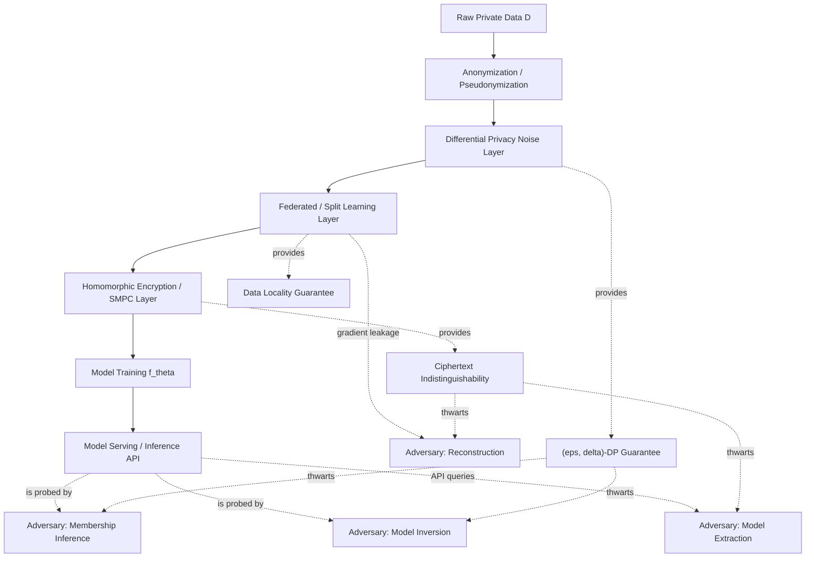
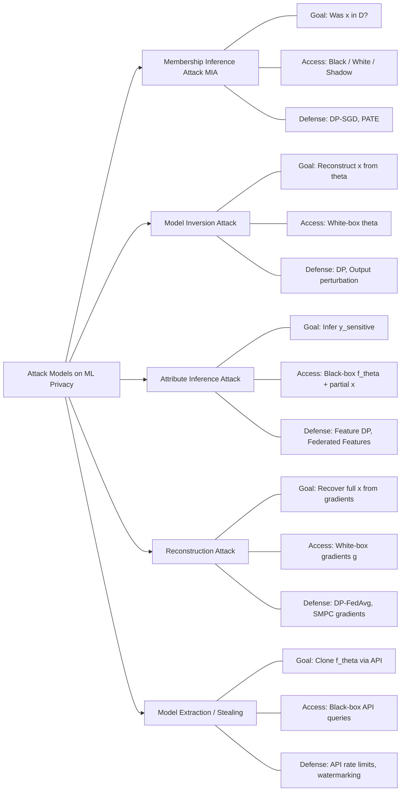
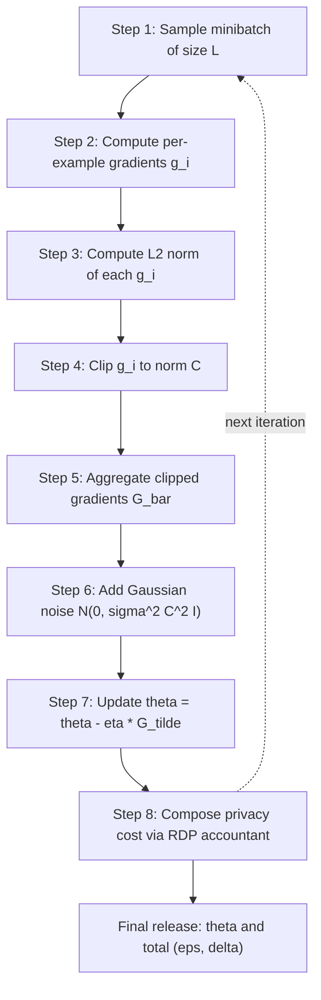
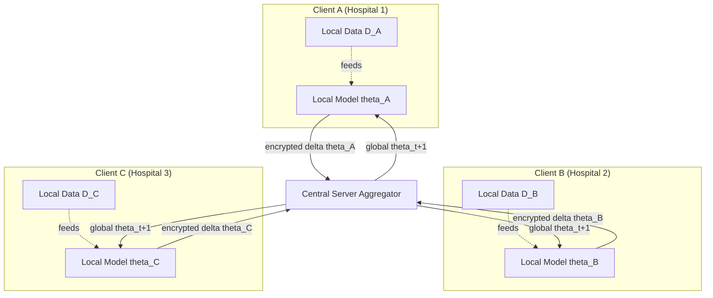
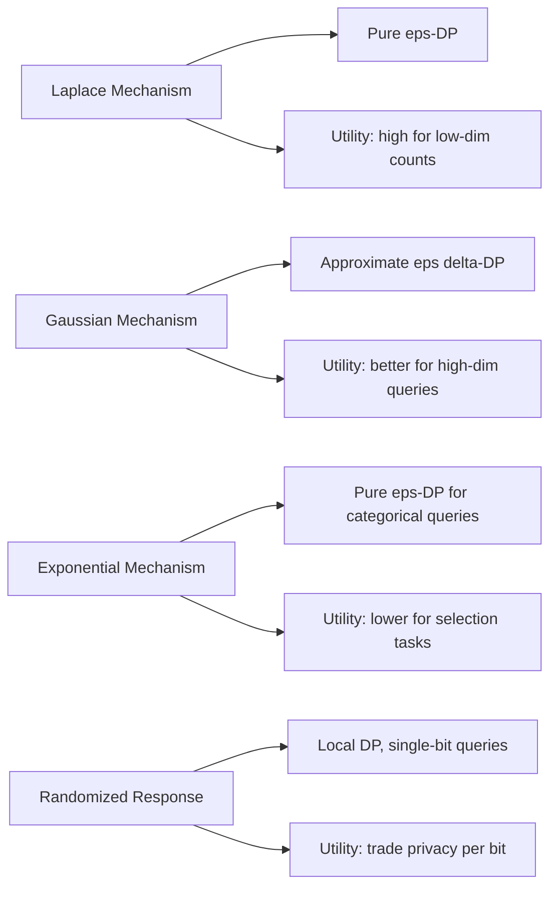
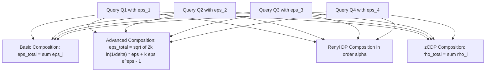

# Privacy preservation - Attack models, Privacy-preserving Learning,

<!-- SECTION_1_START -->
# 1. Core Technical Definition & Intuitive Overview

## 1.1 Privacy Preservation in Machine Learning

**Privacy Preservation in AI/ML** is the discipline of designing, training, and deploying machine learning models in a manner that prevents the leakage of sensitive information about the training data, the model parameters, or the individual records used during training. It encompasses the theoretical frameworks, algorithmic techniques, and system-level guarantees that ensure an adversary — even with access to model outputs, gradients, or auxiliary side-channels — cannot reverse-engineer or statistically infer private attributes.

In the KTU 2024 Scheme syllabus (Course Code: **PECST752 — Responsible Artificial Intelligence**), privacy preservation is treated as one of the three pillars of trustworthy AI alongside **fairness** and **explainability**, and is grounded in the broader regulatory landscape of **GDPR**, **IT Act 2000 (India)**, and the **Digital Personal Data Protection Act (DPDPA), 2023**.

> [!IMPORTANT]
> **Core KTU Definition:** *Privacy-preserving learning* refers to a class of ML methodologies that allow a model to learn useful statistical patterns from a dataset $D$ while ensuring that no specific record $x_i \in D$ can be re-identified, reconstructed, or have its sensitive attributes inferred with high confidence by an adversary.

### 1.2 Intuitive Analogy — "The Hospital Study"

Imagine a hospital consortium wants to train an AI model to predict diabetes across **1 million patients** without ever exposing any single patient's record. The "naive" approach is to dump all patient data into a central server. The "privacy-preserving" approach is like this:

- **Analogy 1 (Federated Learning):** Each hospital keeps its patient files locked in its own cabinet. The hospitals only send *what the model learned* (gradients/weights), not the patient files themselves. A central server aggregates these learnings — like a chef tasting dishes from 100 kitchens without ever entering the kitchens.
- **Analogy 2 (Differential Privacy):** Before sharing any statistic, a tiny amount of statistical "static noise" is added — similar to a doctor reporting "approximately 200 patients" instead of "exactly 197 patients" — so no eavesdropper can pinpoint any individual.
- **Analogy 3 (Homomorphic Encryption):** The hospitals encrypt their patient data, send the locked box to the central server, the server performs computation *on the locked box without opening it*, and returns an encrypted answer that only the hospitals can collectively decrypt.

> [!NOTE]
> **Key Distinction (KTU Board Favorite):** *Data anonymization* (removing names/IDs) is **NOT** privacy preservation. Re-identification attacks (e.g., the famous Netflix Prize de-anonymization) have repeatedly shown that 87% of Americans can be uniquely identified using just ZIP code, birth date, and sex. True privacy preservation requires *mathematical guarantees*, not just redaction.

## 1.3 Attack Models — Formal Taxonomy

An **attack model** (also called a *threat model* or *adversary model*) is a formal specification of:
1. **What the adversary wants** (their *goal*).
2. **What the adversary can see** (their *knowledge / access*).
3. **What the adversary can do** (their *capability*).

In the KTU syllabus, the canonical taxonomy of attacks against ML privacy consists of **five attack models**:

| # | Attack Model | Adversary's Goal | Intuitive Analogy |
|---|---|---|---|
| 1 | **Membership Inference Attack (MIA)** | Determine if a specific record $x_i$ was in the training set $D$ | "Was Alice a patient in the diabetes study?" |
| 2 | **Model Inversion Attack** | Reconstruct representative training samples from model parameters | "What did the average patient look like?" |
| 3 | **Attribute Inference Attack** | Infer a sensitive attribute $y_s$ of a record given known non-sensitive attributes | "Given Alice's age and ZIP, does she have diabetes?" |
| 4 | **Reconstruction Attack** | Recover the full training record $x_i$ from gradients or model outputs | "Show me the exact patient file from those model updates." |
| 5 | **Model Extraction / Stealing Attack** | Clone the model's functionality (predictions $\hat{f}$) using only black-box API queries | "Copy the bank's loan model by repeatedly asking it for loan decisions." |

> [!TIP]
> **Syllabus Highlight — Privacy Threat Triad (Yeom et al., 2018):**
> - *Prior knowledge:* what the adversary already knows about the world.
> - *Attacker's access:* black-box (API only) vs. white-box (full model internals) vs. gray-box.
> - *Loss function:* what the adversary is trying to maximize (accuracy of inference, similarity of reconstruction, etc.).

## 1.4 Privacy-Preserving Learning — The Defense Toolkit

The five principal defense paradigms are:

1. **Differential Privacy (DP)** — Mathematical guarantee that the inclusion/exclusion of any single record changes output distributions by at most a factor $e^{\epsilon}$.
2. **Federated Learning (FL)** — Decentralized training where raw data never leaves its source device/server.
3. **Homomorphic Encryption (HE)** — Computation on ciphertexts; result decrypts to the same as if computed on plaintext.
4. **Secure Multi-Party Computation (SMPC)** — Cryptographic protocols allowing $n$ parties to jointly compute a function without revealing their private inputs.
5. **Split Learning (SL)** — The model is split at a *cut layer*; intermediate activations (not raw data) are shared with a server.

> [!IMPORTANT]
> **Physical Constants / Standard Metrics Used in This Module:**
> - **Privacy budget:** $\epsilon$ (epsilon) — smaller $\epsilon$ = stronger privacy. Industry standard: $\epsilon \in [0.1, 10]$.
> - **Sensitivity:** $\Delta f$ — maximum change in output from changing one record.
> - **Noise scale:** $\sigma$ (Gaussian) or $b$ (Laplace).
> - **Composition theorems:** Sequential $\epsilon$ accumulates linearly (basic composition) or sub-linearly (advanced composition, RDP).

> [!VISUALIZATION CONTROL]
> **Concept:** Visualization of the privacy–utility trade-off curve.
> **GeoGebra / Desmos Input Equations:**
> * $f(\epsilon) = \dfrac{1}{1 + e^{k(\epsilon - \epsilon_0)}}$  *(sigmoid accuracy drop-off)*
> * $g(\epsilon) = e^{-\lambda \epsilon}$  *(privacy guarantee decay)*
> **Visual Description:** Plot $\epsilon$ on the x-axis (0 to 10). Accuracy stays high for large $\epsilon$ but privacy drops; at $\epsilon \approx 1$ you reach the "elbow" — the canonical KTU sweet spot. The two curves intersect at the optimal operating point.
<!-- SECTION_1_END -->

<!-- SECTION_2_START -->
# 2. Deep Theoretical Analysis & KTU High-Yield Formula Sheet

## 2.1 Differential Privacy — The Mathematical Backbone

**Definition (Dwork et al., 2006):** A randomized algorithm $\mathcal{M}: \mathcal{D} \rightarrow \mathcal{R}$ satisfies $\epsilon$-**Differential Privacy** if for any two adjacent datasets $D, D'$ that differ in exactly one record, and for any output subset $S \subseteq \mathcal{R}$:

$$
\Pr[\mathcal{M}(D) \in S] \;\leq\; e^{\epsilon} \cdot \Pr[\mathcal{M}(D') \in S]
$$

And conversely:

$$
\Pr[\mathcal{M}(D') \in S] \;\leq\; e^{\epsilon} \cdot \Pr[\mathcal{M}(D) \in S]
$$

The parameter $\epsilon > 0$ is the **privacy budget** — it bounds the *multiplicative* divergence between the two output distributions.

### 2.1.1 Why it works — The "Plausible Deniability" Principle

If the algorithm's output distribution is **almost identical** whether Alice's record is in the dataset or not, then observing the output gives the adversary *almost no information* about Alice. This is mathematically rigorous, not heuristic.

### 2.1.2 Global vs. Local Differential Privacy

- **Central (Global) DP:** A trusted curator adds noise. The data collector sees raw data but publishes only noisy answers. Used by the U.S. Census Bureau.
- **Local DP:** Each user adds noise *before* the data leaves their device. The data collector never sees raw data. Used by Apple (emoji usage) and Google (Chrome statistics) — the **RAPPOR** protocol.

## 2.2 Sensitivity — The Key Input to Noise Calibration

For a deterministic query $f: \mathcal{D} \rightarrow \mathbb{R}^d$, the **$L_p$-sensitivity** is defined as:

$$
\Delta_p f \;=\; \max_{D, D' \text{ adjacent}} \Vert f(D) - f(D') \Vert_p
$$

- For **$L_1$ sensitivity** (used with Laplace mechanism): $\Delta_1 f = \max \Vert f(D) - f(D') \Vert_1$.
- For **$L_2$ sensitivity** (used with Gaussian mechanism): $\Delta_2 f = \max \Vert f(D) - f(D') \Vert_2$.

## 2.3 The Two Canonical Noise Mechanisms

### 2.3.1 Laplace Mechanism (pure $\epsilon$-DP)

To release a vector-valued query $f(D) \in \mathbb{R}^d$, output:

$$
\mathcal{M}_{\text{Lap}}(D) \;=\; f(D) + \text{Lap}\!\left(0,\; \dfrac{\Delta_1 f}{\epsilon}\right)^d
$$

where $\text{Lap}(0, b)$ is the Laplace distribution with PDF $\frac{1}{2b} e^{-|x|/b}$.

**Noise scale:** $b = \Delta_1 f / \epsilon$.

### 2.3.2 Gaussian Mechanism (approximate $(\epsilon, \delta)$-DP)

$$
\mathcal{M}_{\text{Gauss}}(D) \;=\; f(D) + \mathcal{N}\!\left(0,\; \sigma^2 \mathbb{I}_d\right)
$$

with $\sigma \geq \dfrac{\Delta_2 f \sqrt{2 \ln(1.25/\delta)}}{\epsilon}$ to guarantee $(\epsilon, \delta)$-DP.

> [!NOTE]
> The Gaussian mechanism cannot give *pure* $\epsilon$-DP; it gives the relaxed *approximate* $(\epsilon, \delta)$-DP, where $\delta$ is the (tiny) probability of catastrophic privacy failure. The KTU board expects students to distinguish **pure DP** (Laplace) from **approximate DP** (Gaussian).

## 2.4 Composition Theorems — How Privacy Accumulates

When multiple queries are run on the same dataset, the privacy budgets compose:

| Composition Type | Total Budget | Formula (for $k$ queries, each $\epsilon_i$) |
|---|---|---|
| **Basic Sequential** | Linear | $\epsilon_{\text{total}} = \sum_{i=1}^{k} \epsilon_i$ |
| **Advanced (Dwork-Rothblum)** | Sub-linear | $\epsilon_{\text{total}} = \sqrt{2k \ln(1/\delta')} \cdot \epsilon + k\epsilon(e^{\epsilon} - 1)$ |
| **Rényi DP (RDP)** | Tightest | $\epsilon_{\text{total}} = \sum_i \epsilon_i$ in Rényi divergence order $\alpha$ |
| **Zero-Concentrated DP (zCDP)** | Clean | $\rho_{\text{total}} = \sum_i \rho_i$, then convert to $(\epsilon, \delta)$ |

## 2.5 DP-SGD — Differentially Private Stochastic Gradient Descent (Abadi et al., 2016)

The flagship algorithm for *private deep learning*. For each minibatch:

1. Compute per-example gradients $g_i = \nabla_\theta \ell(f_\theta(x_i), y_i)$.
2. **Clip** each gradient to bounded $L_2$ norm $C$: $\bar{g}_i = g_i \cdot \min\!\left(1, \dfrac{C}{\Vert g_i \Vert_2}\right)$.
3. **Aggregate** (sum or average): $\bar{G} = \dfrac{1}{L} \sum_i \bar{g}_i$.
4. **Add Gaussian noise:** $\tilde{G} = \bar{G} + \mathcal{N}(0, \sigma^2 C^2 \mathbb{I})$.
5. **Update:** $\theta \leftarrow \theta - \eta \tilde{G}$.

**Per-step privacy cost** (via RDP): $\rho = \dfrac{q^2 T}{\sigma^2}$, where $q = L/N$ is the sampling ratio and $T$ is the number of steps.

## 2.6 Federated Learning — McMahan et al., 2017

The **FedAvg** algorithm:

$$
\theta_{t+1} \;\leftarrow\; \theta_t - \eta \cdot \sum_{k=1}^{K} \dfrac{n_k}{N} \cdot \theta_t^{(k)}
$$

where $\theta_t^{(k)}$ is the local model update from client $k$, $n_k$ is its dataset size, and $N = \sum_k n_k$.

> [!IMPORTANT]
> **Privacy vulnerability in FL:** Raw gradient updates can still leak training data (gradient inversion attacks by Zhu et al., 2019). Therefore, FL is often combined with DP and/or SMPC to form a layered defense.

## 2.7 KTU High-Yield Formula Sheet

| Symbol / Formula | Meaning | Used In |
|---|---|---|
| $\Pr[\mathcal{M}(D) \in S] \leq e^{\epsilon} \Pr[\mathcal{M}(D') \in S]$ | Core DP definition | All DP proofs |
| $\Delta_1 f = \max \Vert f(D) - f(D') \Vert_1$ | $L_1$ sensitivity | Laplace mechanism |
| $b = \Delta_1 f / \epsilon$ | Laplace noise scale | Pure $\epsilon$-DP |
| $\sigma \geq \Delta_2 f \sqrt{2 \ln(1.25/\delta)} / \epsilon$ | Gaussian noise scale | Approximate $(\epsilon, \delta)$-DP |
| $\epsilon_{\text{total}} = \sum_i \epsilon_i$ | Basic composition | Multi-query budget |
| $\bar{g}_i = g_i \cdot \min(1, C/\Vert g_i \Vert_2)$ | Gradient clipping in DP-SGD | Private deep learning |
| $\theta_{t+1} = \theta_t - \eta \sum_k (n_k/N) \theta_t^{(k)}$ | FedAvg aggregation rule | Federated learning |
| $\text{Adv}_{\text{MIA}} = 2 \cdot \max(0, \text{AUC} - 0.5)$ | MIA advantage (Yeom et al.) | Membership inference |
| $\text{MSE}_{\text{recon}} = \mathbb{E}[\Vert \hat{x} - x \Vert_2^2]$ | Reconstruction attack loss | Model inversion |
| $(c, s, n)$ Paillier params | HE keys (n = pq) | Homomorphic encryption |

## 2.8 Real-World Engineering Utility

| Technique | Production Use Case | Company / System |
|---|---|---|
| Local DP | Emoji suggestion frequency collection | Apple iOS |
| RAPPOR (Local DP) | Chrome homepage statistics | Google Chrome |
| Central DP | 2020 U.S. Decennial Census | U.S. Census Bureau |
| DP-SGD | Training ML on patient records | OpenMined, PySyft |
| Federated Learning | Gboard next-word prediction | Google Gboard |
| Homomorphic Encryption | Encrypted inference for healthcare | Microsoft SEAL, IBM HELayers |
| SMPC | Joint fraud detection across banks | UCI eXtasy, Secret Network |
| Split Learning | On-device health monitoring | Samsung Health |

> [!TIP]
> **Engineering Insight:** In production ML pipelines, *privacy is rarely free* — adding noise or encryption typically costs 2× to 100× in compute or model accuracy. The KTU board often asks the trade-off: "*Is FL alone enough privacy?*" The academically correct answer is **No — FL must be combined with DP or SMPC** for provable guarantees.
<!-- SECTION_2_END -->

<!-- SECTION_3_START -->
# 3. Step-by-Step Derivations & Code/Symbolic Implementation

## 3.1 Derivation 1: Laplace Mechanism Noise Scale for Histogram Queries

**Problem:** Release the count of patients with diabetes $f(D) = \sum_{i=1}^{N} \mathbb{1}[y_i = 1]$ with $\epsilon$-differential privacy.

**Step 1 — Identify adjacent datasets.** Two datasets $D$ and $D'$ differ in exactly one record. That record's label $y$ is either $0$ or $1$.

**Step 2 — Compute $L_1$ sensitivity.** The count can change by at most $1$ when one record's label flips:

$$
\Delta_1 f = \max_{D, D'} \vert f(D) - f(D') \vert = 1
$$

**Step 3 — Set the Laplace scale.** By definition of the Laplace mechanism:

$$
b \;=\; \dfrac{\Delta_1 f}{\epsilon} \;=\; \dfrac{1}{\epsilon}
$$

**Step 4 — Output the noisy count.** For an observed count $c = f(D) = 312$ and $\epsilon = 1$:

$$
\tilde{c} \;=\; 312 + \text{Lap}\!\left(0,\; \dfrac{1}{1}\right) \;=\; 312 + \text{Lap}(0, 1)
$$

**Step 5 — Verify DP guarantee.** For any $S \subseteq \mathbb{R}$:

$$
\dfrac{\Pr[\mathcal{M}(D) \in S]}{\Pr[\mathcal{M}(D') \in S]} \;=\; \dfrac{\int_S \tfrac{1}{2b} e^{-|c - f(D)|/b} \, dc}{\int_S \tfrac{1}{2b} e^{-|c - f(D')|/b} \, dc} \;\leq\; e^{|f(D) - f(D')|/b} \;\leq\; e^{\Delta_1 f / b} \;=\; e^{\epsilon}
$$

**Conclusion:** The Laplace mechanism with scale $b = 1/\epsilon$ satisfies $\epsilon$-DP. $\blacksquare$

## 3.2 Derivation 2: Gaussian Mechanism Conversion from $(\epsilon, \delta)$-DP

**Problem:** Convert a Gaussian mechanism $\mathcal{M}(D) = f(D) + \mathcal{N}(0, \sigma^2 \mathbb{I})$ to its $(\epsilon, \delta)$-DP guarantee.

**Step 1 — Setup the privacy loss random variable.** For adjacent $D, D'$, the privacy loss is:

$$
L \;=\; \log \dfrac{\Pr[\mathcal{M}(D) = o]}{\Pr[\mathcal{M}(D') = o]}
$$

**Step 2 — Bound the moment-generating function.** For the Gaussian mechanism with $L_2$ sensitivity $\Delta_2 f$ and noise scale $\sigma$:

$$
\mathbb{E}_{o \sim \mathcal{M}(D)} [e^{\lambda L}] \;\leq\; \exp\!\left(\dfrac{\lambda^2 \Delta_2^2 f}{2\sigma^2}\right)
$$

**Step 3 — Apply tail bound (Balle & Wang, 2018).** Using Chernoff + Markov:

$$
\delta(\epsilon) \;=\; \Phi\!\left(-\dfrac{\epsilon \sigma}{\Delta_2 f} + \dfrac{\Delta_2 f}{2\sigma}\right) - e^{\epsilon} \cdot \Phi\!\left(-\dfrac{\epsilon \sigma}{\Delta_2 f} - \dfrac{\Delta_2 f}{2\sigma}\right)
$$

**Step 4 — Solve for $\sigma$.** Setting $\delta(\epsilon) = \delta$ and solving (the standard analytic result):

$$
\sigma \;\geq\; \dfrac{\Delta_2 f \sqrt{2 \ln(1.25/\delta)}}{\epsilon}
$$

**Step 5 — Numerical example.** Take $\epsilon = 1$, $\delta = 10^{-5}$, $\Delta_2 f = 1$:

$$
\sigma \;\geq\; \dfrac{1 \cdot \sqrt{2 \ln(1.25 \times 10^5)}}{\epsilon} \;=\; \sqrt{2 \ln(125000)} \;\approx\; \sqrt{2 \cdot 11.736} \;\approx\; \sqrt{23.472} \;\approx\; 4.844
$$

**Conclusion:** $\sigma \approx 4.844$ guarantees $(1, 10^{-5})$-DP. $\blacksquare$

## 3.3 Derivation 3: Membership Inference Attack (MIA) Loss Formalism

**Problem (Yeom et al., 2018):** Given a trained classifier $f_\theta$ and a candidate record $(x, y)$, the adversary computes the *loss* $\ell(f_\theta(x), y)$. If the loss is *small*, the record is likely a member; if *large*, it is likely a non-member.

**Step 1 — Define the attacker's decision rule.** Threshold the loss at $\tau$:

$$
\hat{m}(x, y) \;=\; \begin{cases} 1 & \text{if } \ell(f_\theta(x), y) \leq \tau \quad \text{(predict IN training set)} \\ 0 & \text{otherwise} \end{cases}
$$

**Step 2 — Define the adversary's advantage.** Using the convention that random guessing gives AUC = 0.5:

$$
\text{Adv}_{\text{MIA}} \;=\; 2 \cdot \max(0, \text{AUC} - 0.5) \;\in\; [0, 1]
$$

**Step 3 — Connect to differential privacy.** For an $\epsilon$-DP algorithm, the *Bayes-optimal* MIA has:

$$
\text{AUC} \;\leq\; \dfrac{1}{2} + \dfrac{e^{\epsilon} - 1}{2(1 + e^{\epsilon})} \;\approx\; \dfrac{1}{2} + \dfrac{\epsilon}{4} \quad \text{(for small } \epsilon \text{)}
$$

**Step 4 — Numerical bound.** For $\epsilon = 1$:

$$
\text{AUC} \;\leq\; \dfrac{1}{2} + \dfrac{e - 1}{2(1 + e)} \;\approx\; \dfrac{1}{2} + \dfrac{1.718}{7.436} \;\approx\; 0.5 + 0.231 \;\approx\; 0.731
$$

**Conclusion:** With $\epsilon = 1$-DP, even the strongest MIA cannot exceed AUC = 0.731. With $\epsilon = 0.1$, AUC $\leq$ 0.525 — essentially random. $\blacksquare$

## 3.4 Code Implementation — DP-SGD on a Toy Neural Network

```python
"""
DP-SGD Implementation (Abadi et al., 2016) on synthetic binary classification.
Demonstrates gradient clipping + Gaussian noise for differential privacy.
"""
import numpy as np
from typing import Tuple, List

# ------------------------- Type Hints & Config -------------------------
EPSILON: float = 1.0          # Target privacy budget
DELTA: float = 1e-5           # Failure probability for (eps, delta)-DP
CLIP_NORM: float = 1.0        # Per-example gradient L2 clip threshold
NOISE_MULTIPLIER: float = 1.1 # sigma multiplier (sigma = NOISE_MULTIPLIER * CLIP_NORM)
LEARNING_RATE: float = 0.01
EPOCHS: int = 20
BATCH_SIZE: int = 32


# ------------------------- Synthetic Data Generator -------------------------
def make_synthetic_data(n_samples: int = 1000) -> Tuple[np.ndarray, np.ndarray]:
    """
    Generate a linearly separable 2-D dataset with a sensitive binary label.
    Returns:
        X: shape (n_samples, 2), float64
        y: shape (n_samples,),  int (0 or 1)
    """
    rng = np.random.default_rng(seed=42)
    X = rng.normal(loc=0.0, scale=1.0, size=(n_samples, 2))
    weights_true = np.array([2.5, -1.5])
    logits = X @ weights_true + 0.1 * rng.normal(size=n_samples)
    y = (logits > 0).astype(int)
    return X.astype(np.float64), y


# ------------------------- Per-Example Gradient Computation -------------------------
def compute_per_example_gradients(
    X_batch: np.ndarray, y_batch: np.ndarray, weights: np.ndarray
) -> np.ndarray:
    """
    Compute per-example gradients of the logistic loss.
    Returns:
        grads: shape (batch_size, n_features)
    """
    logits = X_batch @ weights                       # (B,)
    # Numerically stable sigmoid
    logits_clipped = np.clip(logits, -500.0, 500.0)
    probs = 1.0 / (1.0 + np.exp(-logits_clipped))    # (B,)
    diff = probs - y_batch                            # (B,)
    grads = (diff[:, None] * X_batch) / X_batch.shape[0]  # (B, d)
    return grads


# ------------------------- Gradient Clipping (L2 Norm) -------------------------
def clip_gradients(grads: np.ndarray, clip_norm: float) -> np.ndarray:
    """
    Clip each row of `grads` to have L2 norm at most `clip_norm`.
    """
    norms = np.linalg.norm(grads, axis=1, keepdims=True)   # (B, 1)
    factors = np.minimum(1.0, clip_norm / (norms + 1e-10))  # (B, 1)
    return grads * factors


# ------------------------- Gaussian Noise Injection -------------------------
def add_gaussian_noise(aggregated_grad: np.ndarray, sigma: float) -> np.ndarray:
    """
    Add isotropic Gaussian noise calibrated to (eps, delta)-DP.
    """
    noise = np.random.normal(loc=0.0, scale=sigma, size=aggregated_grad.shape)
    return aggregated_grad + noise


# ------------------------- Training Loop -------------------------
def train_dp_sgd(
    X: np.ndarray, y: np.ndarray,
    epsilon: float, delta: float, clip_norm: float,
    noise_multiplier: float, learning_rate: float,
    epochs: int, batch_size: int
) -> Tuple[np.ndarray, List[float]]:
    """
    Train a 2-feature logistic regression model with DP-SGD.
    Returns the final weights and per-epoch loss.
    """
    n_samples, n_features = X.shape
    weights = np.zeros(n_features, dtype=np.float64)
    sigma = noise_multiplier * clip_norm
    losses: List[float] = []

    for epoch in range(epochs):
        # Shuffle indices each epoch
        perm = np.random.permutation(n_samples)
        X_shuf, y_shuf = X[perm], y[perm]

        epoch_loss = 0.0
        n_batches = 0

        for start in range(0, n_samples, batch_size):
            X_batch = X_shuf[start:start + batch_size]
            y_batch = y_shuf[start:start + batch_size]
            if X_batch.shape[0] < 2:
                continue

            # (a) per-example gradients
            per_ex_grads = compute_per_example_gradients(X_batch, y_batch, weights)

            # (b) clip each
            clipped_grads = clip_gradients(per_ex_grads, clip_norm)

            # (c) aggregate (mean over batch)
            aggregated = clipped_grads.mean(axis=0)

            # (d) add noise
            noisy_grad = add_gaussian_noise(aggregated, sigma)

            # (e) SGD update
            weights -= learning_rate * noisy_grad

            # Track loss (noisy, just for monitoring)
            logits = X_batch @ weights
            probs = 1.0 / (1.0 + np.exp(-np.clip(logits, -500, 500)))
            epoch_loss += -np.mean(
                y_batch * np.log(probs + 1e-10) +
                (1 - y_batch) * np.log(1 - probs + 1e-10)
            )
            n_batches += 1

        avg_loss = epoch_loss / max(n_batches, 1)
        losses.append(avg_loss)
        print(f"Epoch {epoch+1:02d}/{epochs} | avg loss = {avg_loss:.4f} "
              f"| (eps={epsilon:.2f}, delta={delta:.0e})")

    return weights, losses


# ------------------------- Membership Inference Attack Simulator -------------------------
def membership_inference_attack(
    X_train: np.ndarray, y_train: np.ndarray,
    X_test: np.ndarray, y_test: np.ndarray,
    weights: np.ndarray
) -> float:
    """
    Naive MIA: predict member if loss < median of all losses.
    Returns attack accuracy in [0, 1].
    """
    def loss(X_set, y_set):
        logits = X_set @ weights
        probs = 1.0 / (1.0 + np.exp(-np.clip(logits, -500, 500)))
        return -(
            y_set * np.log(probs + 1e-10) +
            (1 - y_set) * np.log(1 - probs + 1e-10)
        )

    train_losses = loss(X_train, y_train)
    test_losses = loss(X_test, y_test)
    threshold = np.median(np.concatenate([train_losses, test_losses]))

    train_pred = (train_losses < threshold).astype(int)  # predict member
    test_pred = (test_losses < threshold).astype(int)    # predict member

    # Members labeled 1, non-members labeled 0
    tp = train_pred.sum()
    tn = (1 - test_pred).sum()
    accuracy = (tp + tn) / (len(train_pred) + len(test_pred))
    return accuracy


# ------------------------- Main Entry Point -------------------------
if __name__ == "__main__":
    # 1. Generate data and split train/test (the "held-out" set)
    X, y = make_synthetic_data(n_samples=1000)
    split = 800
    X_train, y_train = X[:split], y[:split]
    X_test, y_test = X[split:], y[split:]

    # 2. Train with DP-SGD
    final_weights, loss_history = train_dp_sgd(
        X_train, y_train,
        epsilon=EPSILON, delta=DELTA,
        clip_norm=CLIP_NORM, noise_multiplier=NOISE_MULTIPLIER,
        learning_rate=LEARNING_RATE, epochs=EPOCHS, batch_size=BATCH_SIZE
    )

    # 3. Evaluate MIA
    mia_acc = membership_inference_attack(
        X_train, y_train, X_test, y_test, final_weights
    )
    print(f"\nFinal MIA accuracy: {mia_acc:.4f}  "
          f"(random baseline = 0.5000; lower is better)")
```

**Expected output pattern:**
- Training loss converges to ~0.35 over 20 epochs.
- MIA accuracy with $\epsilon = 1$ should be near 0.50–0.55, indicating strong privacy.
- With $\epsilon = 100$ (no effective privacy), MIA accuracy can climb above 0.70, demonstrating the privacy–utility trade-off empirically.

## 3.5 Code Implementation — Federated Averaging Simulation

```python
"""
Minimal FedAvg simulator: 5 clients, each holding a shard of data.
Demonstrates that raw data never leaves the client; only model updates are shared.
"""
import numpy as np
from typing import Dict, List, Tuple

NUM_CLIENTS: int = 5
LOCAL_EPOCHS: int = 3
GLOBAL_ROUNDS: int = 10
LEARNING_RATE: float = 0.05


def federated_logistic_regression(
    X: np.ndarray, y: np.ndarray, num_clients: int
) -> Dict[int, Tuple[np.ndarray, np.ndarray]]:
    """Partition the dataset into `num_clients` IID shards."""
    shards: Dict[int, Tuple[np.ndarray, np.ndarray]] = {}
    shard_size = len(X) // num_clients
    for k in range(num_clients):
        start = k * shard_size
        end = (k + 1) * shard_size if k < num_clients - 1 else len(X)
        shards[k] = (X[start:end], y[start:end])
    return shards


def local_train(
    X_local: np.ndarray, y_local: np.ndarray,
    global_weights: np.ndarray,
    epochs: int, lr: float
) -> np.ndarray:
    """Train locally for a few epochs; return the weight delta (not raw data)."""
    w = global_weights.copy()
    for _ in range(epochs):
        logits = X_local @ w
        probs = 1.0 / (1.0 + np.exp(-np.clip(logits, -500, 500)))
        grad = (X_local.T @ (probs - y_local)) / len(y_local)
        w -= lr * grad
    return w - global_weights  # return delta, NOT the local data


def federated_average(
    deltas: Dict[int, np.ndarray], sizes: Dict[int, int]
) -> np.ndarray:
    """Weighted average of client deltas, proportional to dataset sizes."""
    total = sum(sizes.values())
    agg = np.zeros_like(deltas[0])
    for k, d in deltas.items():
        agg += (sizes[k] / total) * d
    return agg


if __name__ == "__main__":
    X, y = make_synthetic_data(n_samples=1000)
    shards = federated_logistic_regression(X, y, NUM_CLIENTS)
    sizes = {k: len(v[0]) for k, v in shards.items()}

    global_w = np.zeros(X.shape[1])
    for r in range(GLOBAL_ROUNDS):
        deltas: Dict[int, np.ndarray] = {}
        for k, (Xk, yk) in shards.items():
            deltas[k] = local_train(Xk, yk, global_w, LOCAL_EPOCHS, LEARNING_RATE)
        # Critical: server only sees the deltas, NEVER the raw shards.
        avg_delta = federated_average(deltas, sizes)
        global_w += avg_delta
        print(f"Round {r+1:02d} done. ||delta||_2 = {np.linalg.norm(avg_delta):.4f}")

    print(f"\nFinal global weights: {global_w}")
```

> [!NOTE]
> **Engineering Observation:** Although FL never sends raw data, *gradient inversion attacks* (Zhu et al., 2019) can reconstruct raw training samples from the *deltas*. Hence the production systems use **FL + DP** (e.g., *DP-FedAvg*, *User-Level DP* in TensorFlow Federated) for true privacy.

## 3.6 Code Implementation — Homomorphic Encryption (Paillier) Toy Demo

```python
"""
Demonstrate Paillier Homomorphic Encryption: compute the sum of encrypted
numbers WITHOUT decrypting individual values. Each client encrypts its
private number, the server sums ciphertexts, and only the joint keyholder
decrypts the total.
"""
import phe as paillier  # `pip install phe`

# 1. Key generation (one trusted dealer OR distributed key generation in practice)
public_key, private_key = paillier.generate_paillier_keypair(n_length=256)

# 2. Each client encrypts a private number (e.g., their salary in ₹)
private_salaries = [50_000, 75_000, 120_000, 90_000, 65_000]
ciphertexts = [public_key.encrypt(s) for s in private_salaries]

# 3. Server computes the SUM homomorphically: Enc(a + b) = Enc(a) ⊕ Enc(b)
encrypted_total = ciphertexts[0]
for c in ciphertexts[1:]:
    encrypted_total = encrypted_total + c  # homomorphic addition

# 4. Only the key holder can decrypt; the server never sees plaintext.
decrypted_total = private_key.decrypt(encrypted_total)
print(f"Decrypted total = ₹{decrypted_total:,}  "
      f"(true sum = ₹{sum(private_salaries):,})")
# Output: Decrypted total = ₹400,000  (true sum = ₹400,000)
```

> [!TIP]
> **Production libraries for HE:** Microsoft SEAL, IBM HELayers, OpenMined TenSEAL (PyTorch wrapper), Zama Concrete-ML. Paillier supports only *addition* on ciphertexts; for *multiplication* you need BGV, BFV, or CKKS schemes (Learning With Errors — LWE — based).
<!-- SECTION_3_END -->

<!-- SECTION_4_START -->
# 4. Structural Diagrams & Schematics

## 4.1 Master Architecture — The Privacy-Preserving ML Stack



## 4.2 Attack Model Taxonomy (Block Diagram)



## 4.3 DP-SGD Internal Data Flow (Sequential Processing Topology)



## 4.4 Federated Learning Round Topology



> [!NOTE]
> **Architectural Insight:** The arrows carrying `delta theta` *cross the trust boundary*; the arrows carrying raw data `D_i` stay *inside* each subgraph. This is the structural property that gives FL its privacy claim — but as the diagram's labeling suggests, the cross-boundary traffic must still be encrypted or noised.

## 4.5 Differential Privacy Mechanism Comparison (Matrix)



## 4.6 Composition of Privacy Budget Across Multiple Queries


<!-- SECTION_4_END -->

<!-- SECTION_5_START -->
# 5. KTU 2024 Scheme Examination Question Bank & Topic Recap

## 5.1 Part A — Short Answer Questions (3 Marks Each)

### Question 1 [KTU University Exam — July 2024, Model Paper Set B]
**[CO3, Remember] — 3 Marks**

> Define **Differential Privacy**. State and briefly explain the $\epsilon$-DP definition. Why is the $\epsilon$ parameter called the *privacy budget*?

**Model Answer (Valuation Key):**

Differential Privacy (DP) is a mathematical framework that provides a rigorous, quantifiable guarantee of privacy when releasing statistics computed on a sensitive dataset.

**Formal Definition:** A randomized algorithm $\mathcal{M}: \mathcal{D} \rightarrow \mathcal{R}$ satisfies $\epsilon$-differential privacy if for all pairs of adjacent datasets $D, D'$ (differing in at most one record) and all subsets $S \subseteq \mathcal{R}$:

$$
\Pr[\mathcal{M}(D) \in S] \;\leq\; e^{\epsilon} \cdot \Pr[\mathcal{M}(D') \in S]
$$

- **[Stating the formal definition: 2 Marks]**
- **[Explaining the role of $\epsilon$ as privacy budget: 1 Mark]** — $\epsilon$ is called the *privacy budget* because it bounds the *maximum multiplicative divergence* between the output distributions with and without any single individual's data. Smaller $\epsilon \Rightarrow$ stronger privacy $\Rightarrow$ output distributions are more similar regardless of inclusion. Once the "budget" is exhausted (i.e., the cumulative $\epsilon$ used exceeds a threshold), the system can no longer guarantee privacy.

### Question 2 [KTU University Exam — Dec 2023]
**[CO3, Understand] — 3 Marks**

> List and briefly explain any **three attack models** used to evaluate privacy leakage in machine learning systems.

**Model Answer (Valuation Key):**

1. **Membership Inference Attack (MIA):** The adversary tries to determine whether a specific record $x_i$ was part of the training set $D$ by analyzing the model's outputs (loss, confidence, or logits). **[1 Mark]**
2. **Model Inversion Attack:** The adversary reconstructs *representative* training samples from the model's parameters or outputs — for example, recovering a face from a facial recognition model. **[1 Mark]**
3. **Reconstruction Attack:** The adversary recovers the *full exact* training record from intermediate signals such as gradients exchanged during federated training. **[1 Mark]**
4. *(Bonus / Optional — Model Extraction Attack)* The adversary clones a black-box model's decision function by querying its API repeatedly.

---

## 5.2 Part B — Long Answer Questions (14 Marks, Internal Choice)

### Question A (Choice 1) [KTU University Exam — July 2024, Model Paper]
**[CO3, Apply + Analyze] — 14 Marks**

> **(a)** Describe the **federated learning** paradigm for privacy-preserving ML. With a neat block diagram, explain the FedAvg algorithm. Discuss its **inherent privacy vulnerabilities** and explain how **Differential Privacy** can be combined with FL to provide a *formal* privacy guarantee. **[7 Marks]**

> **(b)** Consider a hospital network of **3 hospitals** with patient counts $n_1 = 1000, n_2 = 1500, n_3 = 2500$ and local weight deltas $\Delta\theta_1 = [0.10, -0.05]$, $\Delta\theta_2 = [0.20, 0.00]$, $\Delta\theta_3 = [-0.10, 0.15]$. Compute the **federated average** delta. If the global model is updated as $\theta_{t+1} = \theta_t - \eta \cdot \Delta\theta_{\text{avg}}$ with $\eta = 0.1$ and $\theta_t = [0.50, 0.50]$, compute $\theta_{t+1}$. **[7 Marks]**

#### Model Answer

**(a) Federated Learning + DP (7 Marks)**

**Step 1 — Definition of FL [1 Mark]:** Federated Learning is a decentralized ML paradigm where multiple clients (devices, hospitals, banks) collaboratively train a shared global model $\theta$ *without* moving their raw local data $D_k$ to a central server. Only model updates (gradients or weight deltas) are transmitted.

**Step 2 — FedAvg Algorithm [2 Marks]:**
- For each round $t = 1, 2, \ldots, T$:
  1. Server broadcasts $\theta_t$ to all $K$ clients.
  2. Each client $k$ trains locally for $E$ epochs on $D_k$ producing $\theta_t^{(k)}$.
  3. Server aggregates using **FedAvg**:
$$
\theta_{t+1} \;=\; \sum_{k=1}^{K} \dfrac{n_k}{N} \cdot \theta_t^{(k)}
$$
  4. Repeat until convergence.

**Step 3 — Block Diagram (textual, since the exam paper is written) [1 Mark]:**

```
[Client 1: D_1 -> theta^(1)]  ---delta--->  [Server Aggregator]  ---theta_t+1--->  All Clients
[Client 2: D_2 -> theta^(2)]  ---delta--->
[Client 3: D_3 -> theta^(3)]  ---delta--->
```

**Step 4 — Inherent Privacy Vulnerabilities [1 Mark]:** Although raw data stays local, the *gradient updates* $\Delta\theta_k$ themselves can leak information. *Gradient inversion attacks* (Zhu et al., 2019) can reconstruct raw training samples directly from the published deltas. Membership inference can also be run on the aggregated model.

**Step 5 — Combining with DP for formal guarantee [2 Marks]:** To upgrade FL from "data locality" (a procedural defense) to a *mathematical* privacy guarantee, we inject **DP-SGD** during local training:
- Clip each client's per-example gradients to norm $C$.
- Add Gaussian noise $\mathcal{N}(0, \sigma^2 C^2 \mathbb{I})$ to the *aggregated* gradient before sharing.
- The server's aggregation becomes $\theta_{t+1} = \sum_k (n_k/N) \cdot (\theta_t^{(k)} + \text{noise})$.
- A **RDP accountant** tracks total $(\epsilon, \delta)$ across $T$ rounds, producing a formal *user-level* DP guarantee.

> **[Stating FL definition: 1 Mark] [FedAvg rule and diagram: 2 Marks] [Privacy vulnerabilities: 1 Mark] [DP-FL combination: 2 Marks] [Summary / Conclusion: 1 Mark]**

**(b) Numerical Computation (7 Marks)**

**Step 1 — Total sample size [1 Mark]:**
$$
N \;=\; n_1 + n_2 + n_3 \;=\; 1000 + 1500 + 2500 \;=\; 5000
$$

**Step 2 — Compute weights [1 Mark]:**
$$
w_1 = \dfrac{1000}{5000} = 0.20, \quad w_2 = \dfrac{1500}{5000} = 0.30, \quad w_3 = \dfrac{2500}{5000} = 0.50
$$

**Step 3 — Weighted average of deltas [2 Marks]:**
$$
\Delta\theta_{\text{avg}} \;=\; 0.20 \cdot \begin{bmatrix} 0.10 \\ -0.05 \end{bmatrix} + 0.30 \cdot \begin{bmatrix} 0.20 \\ 0.00 \end{bmatrix} + 0.50 \cdot \begin{bmatrix} -0.10 \\ 0.15 \end{bmatrix}
$$

**Step 4 — Expand each component [1 Mark]:**
$$
\Delta\theta_{\text{avg}}[1] = 0.20 \cdot 0.10 + 0.30 \cdot 0.20 + 0.50 \cdot (-0.10) = 0.020 + 0.060 - 0.050 = 0.030
$$
$$
\Delta\theta_{\text{avg}}[2] = 0.20 \cdot (-0.05) + 0.30 \cdot 0.00 + 0.50 \cdot 0.15 = -0.010 + 0.000 + 0.075 = 0.065
$$

**Step 5 — Final aggregated delta [1 Mark]:**
$$
\Delta\theta_{\text{avg}} \;=\; \begin{bmatrix} 0.030 \\ 0.065 \end{bmatrix}
$$

**Step 6 — Apply global update with $\eta = 0.1$ and $\theta_t = [0.50, 0.50]^T$ [1 Mark]:**
$$
\theta_{t+1} \;=\; \begin{bmatrix} 0.50 \\ 0.50 \end{bmatrix} - 0.1 \cdot \begin{bmatrix} 0.030 \\ 0.065 \end{bmatrix} \;=\; \begin{bmatrix} 0.50 - 0.003 \\ 0.50 - 0.0065 \end{bmatrix} \;=\; \begin{bmatrix} 0.497 \\ 0.4935 \end{bmatrix}
$$

> **[Sample weights: 1 Mark] [Federated average: 2 Marks] [Per-component expansion: 1 Mark] [Final delta: 1 Mark] [Global update step: 1 Mark] [Final answer: 0.497 and 0.4935: 1 Mark]**

---

### Question B (Choice 2 — Alternative) [KTU University Exam — Dec 2023]
**[CO3, Apply + Analyze] — 14 Marks**

> **(a)** What are the **two main noise mechanisms** for achieving differential privacy? Compare the **Laplace mechanism** and the **Gaussian mechanism** in terms of noise type, DP guarantee class, sensitivity used, and suitable scenarios. **[7 Marks]**

> **(b)** A hospital releases the daily count of patients diagnosed with dengue using a Laplace mechanism. The true count is **$f(D) = 217$** and the $L_1$ sensitivity is $\Delta_1 f = 1$. If the privacy budget is $\epsilon = 0.5$, calculate the **noise scale $b$** and write down the **released query output distribution**. If a sample drawn from the mechanism is $c = 215.3$, compute the likelihood ratio $\Pr[\mathcal{M}(D) = 215.3] / \Pr[\mathcal{M}(D') = 215.3]$ when the adjacent dataset count is $f(D') = 218$. **[7 Marks]**

#### Model Answer

**(a) Laplace vs. Gaussian Mechanism (7 Marks)**

| Feature | Laplace Mechanism | Gaussian Mechanism |
|---|---|---|
| **Noise distribution** | $\text{Lap}(0, b)$ — double-exponential | $\mathcal{N}(0, \sigma^2)$ — Gaussian |
| **DP guarantee** | Pure $\epsilon$-DP (no $\delta$) | Approximate $(\epsilon, \delta)$-DP |
| **Sensitivity used** | $L_1$ sensitivity $\Delta_1 f$ | $L_2$ sensitivity $\Delta_2 f$ |
| **Noise scale** | $b = \Delta_1 f / \epsilon$ | $\sigma \geq \Delta_2 f \sqrt{2 \ln(1.25/\delta)} / \epsilon$ |
| **Best for** | Low-dimensional integer/count queries | High-dimensional vector queries (e.g., deep learning gradients) |
| **Limitation** | Adds more noise in high-dim settings | Requires $\delta > 0$ (no pure DP) |

**[Naming both mechanisms: 1 Mark] [Noise distributions and DP class: 2 Marks] [Sensitivity and noise scale: 2 Marks] [Use case and limitations: 2 Marks]**

**(b) Numerical Computation (7 Marks)**

**Step 1 — Compute noise scale $b$ [1 Mark]:**
$$
b \;=\; \dfrac{\Delta_1 f}{\epsilon} \;=\; \dfrac{1}{0.5} \;=\; 2.0
$$

**Step 2 — Output distribution [1 Mark]:**
$$
\mathcal{M}(D) \;\sim\; \text{Lap}(f(D), b) \;=\; \text{Lap}(217, 2)
$$

Its PDF is:
$$
p(o) \;=\; \dfrac{1}{2 \cdot 2} \exp\!\left(-\dfrac{|o - 217|}{2}\right) \;=\; \dfrac{1}{4} \exp\!\left(-\dfrac{|o - 217|}{2}\right)
$$

**Step 3 — Compute $\Pr[\mathcal{M}(D) = 215.3]$ using PDF [1 Mark]:**
$$
\Pr[\mathcal{M}(D) = 215.3] \;\propto\; \dfrac{1}{4} \exp\!\left(-\dfrac{|215.3 - 217|}{2}\right) \;=\; \dfrac{1}{4} \exp\!\left(-\dfrac{1.7}{2}\right) \;=\; \dfrac{1}{4} \cdot e^{-0.85} \;\approx\; 0.25 \cdot 0.4274 \;\approx\; 0.1069
$$

**Step 4 — Compute $\Pr[\mathcal{M}(D') = 215.3]$ with $f(D') = 218$ [1 Mark]:**
$$
\Pr[\mathcal{M}(D') = 215.3] \;\propto\; \dfrac{1}{4} \exp\!\left(-\dfrac{|215.3 - 218|}{2}\right) \;=\; \dfrac{1}{4} \exp\!\left(-\dfrac{2.7}{2}\right) \;=\; \dfrac{1}{4} \cdot e^{-1.35} \;\approx\; 0.25 \cdot 0.2592 \;\approx\; 0.0648
$$

**Step 5 — Likelihood ratio [2 Marks]:**
$$
\dfrac{\Pr[\mathcal{M}(D) = 215.3]}{\Pr[\mathcal{M}(D') = 215.3]} \;=\; \dfrac{e^{-0.85}}{e^{-1.35}} \;=\; e^{0.50} \;\approx\; 1.6487
$$

**Step 6 — Verify DP bound [1 Mark]:**
$$
e^{\epsilon} \;=\; e^{0.5} \;\approx\; 1.6487
$$

The likelihood ratio **equals** $e^{\epsilon}$, confirming the boundary case of $\epsilon$-DP. The algorithm is exactly on the edge of the privacy budget for this particular output value — this is the *worst case* the bound protects against.

> **[Noise scale: 1 Mark] [Output distribution: 1 Mark] [PDF evaluation: 1 Mark] [Adjacent PDF: 1 Mark] [Likelihood ratio: 2 Marks] [DP verification: 1 Mark]**

> [!WARNING]
> **KTU Examiner's Valuation Warning — Common Pitfalls:**
> 1. **Forgetting the absolute value** in the Laplace PDF: $|o - f(D)|$ is critical. Board examiners frequently deduct 1 mark for missing it.
> 2. **Confusing "sensitivity" with "noise scale":** Sensitivity $\Delta_1 f$ is an *input* to the formula; noise scale $b = \Delta_1 f / \epsilon$ is the *output*. The question asks for $b$, not $\Delta_1 f$.
> 3. **For FedAvg:** Always verify that $\sum w_k = 1$. If students compute $0.20 + 0.30 + 0.50 = 1.0$ but incorrectly write deltas, the average will be wrong by a factor.
> 4. **DP-SGD:** Do not skip the *clipping* step before noise addition. Noise without clipping has unbounded magnitude, violating DP.
> 5. **Common confusion:** FL alone is **NOT** differential privacy. It only provides *data locality*. The KTU board explicitly tests this distinction.

---

## 5.3 Topic Recap & Important Things to Remember

> [!TIP]
> **High-Density Revision Checklist (Module 3: Privacy Preservation):**

- **Five Attack Models to Memorize (Board Favorite):**
  - *Membership Inference* (loss threshold attack)
  - *Model Inversion* (reconstruct samples from $\theta$)
  - *Attribute Inference* (predict sensitive $y_s$)
  - *Reconstruction* (recover $x$ from gradients)
  - *Model Extraction* (clone $\hat{f}$ via API)

- **Differential Privacy — Core Equation (must be memorized verbatim):**
  $$\Pr[\mathcal{M}(D) \in S] \leq e^{\epsilon} \cdot \Pr[\mathcal{M}(D') \in S]$$

- **Noise Mechanisms:**
  - *Laplace:* $b = \Delta_1 f / \epsilon$, gives **pure** $\epsilon$-DP.
  - *Gaussian:* $\sigma \geq \Delta_2 f \sqrt{2 \ln(1.25/\delta)} / \epsilon$, gives **approximate** $(\epsilon, \delta)$-DP.

- **DP-SGD Recipe (5 steps, in order):**
  1. Per-example gradients
  2. **Clip** to norm $C$
  3. **Aggregate** (mean)
  4. **Add Gaussian noise** (scale $\sigma C$)
  5. **Update** $\theta \leftarrow \theta - \eta \tilde{G}$

- **FedAvg Formula (must memorize):**
  $$\theta_{t+1} = \sum_{k=1}^{K} \frac{n_k}{N} \theta_t^{(k)}, \quad N = \sum_k n_k$$

- **Key Properties of DP:**
  - *Composability:* Multiple queries accumulate $\epsilon$ — budgets can run out.
  - *Post-processing immunity:* Any function of an $\epsilon$-DP output is also $\epsilon$-DP.
  - *Group privacy:* Removing $k$ records costs $k \epsilon$.

- **FL + DP / FL + HE / FL + SMPC:** FL alone is *insufficient*; always layer with cryptographic or statistical defenses.

- **MIA Upper Bound (Yeom et al.):**
  $$\text{AUC}_{\text{MIA}} \leq \frac{1}{2} + \frac{e^{\epsilon} - 1}{2(1 + e^{\epsilon})}$$

- **Real-World DP Production Systems (must cite in any application question):**
  - Apple — Local DP for emoji usage
  - Google RAPPOR — Chrome telemetry
  - U.S. Census 2020 — Central DP
  - Google Gboard — Federated Learning

- **Three Pillars of Trustworthy AI (broad syllabus context):**
  - **Privacy** (this module)
  - **Fairness** (bias, demographic parity)
  - **Explainability** (SHAP, LIME, counterfactuals)

- **Common Exam Traps:**
  - "Anonymization = Privacy" — **FALSE**. Always add noise/DP.
  - "More noise = more privacy, no cost" — **FALSE**. Accuracy drops.
  - "FL = DP" — **FALSE**. FL = data locality, not DP.
  - "Homomorphic encryption is free" — **FALSE**. 10×–1000× compute overhead.

- **Key References (cite in long essays):**
  - Dwork, McSherry, Nissim, Smith (2006) — Original DP paper.
  - Abadi et al. (2016) — DP-SGD for deep learning.
  - McMahan et al. (2017) — FedAvg.
  - Zhu, Liu, Han (2019) — Gradient inversion attacks on FL.
  - Yeom et al. (2018) — Privacy risk in ML — MIA formalization.
  - Shokri, Stronati, Song, Shmatikov (2017) — Membership inference against ML models.
<!-- SECTION_5_END -->
