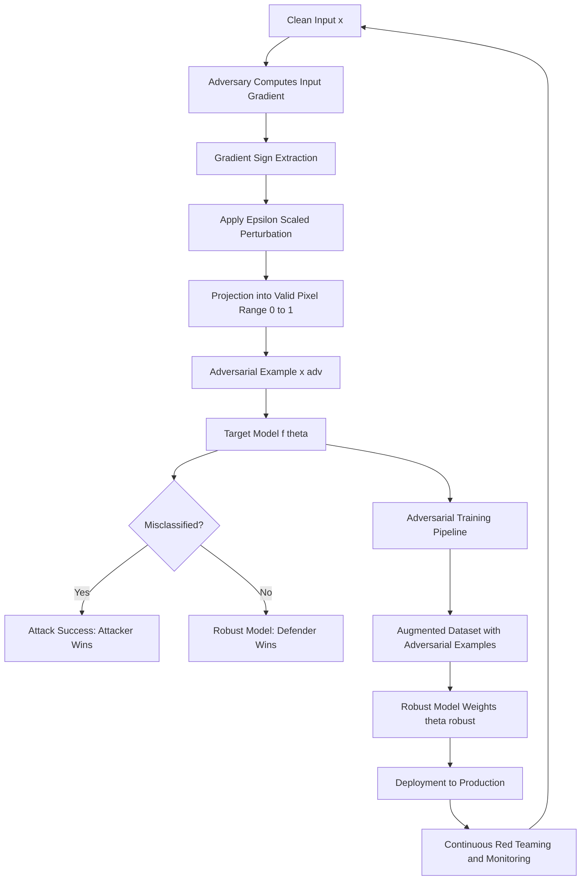
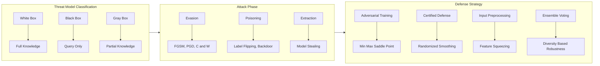
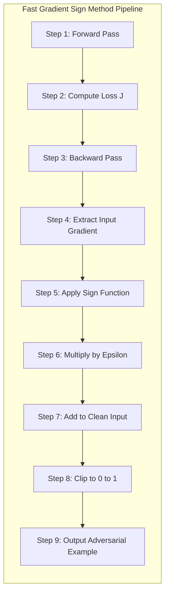

# protecting against adversarial attacks

<!-- SECTION_1_START -->
# Protecting Against Adversarial Attacks

## 1. Core Technical Definition

In the context of **Responsible Artificial Intelligence (PECST752)**, an **adversarial attack** is a deliberate, mathematically crafted manipulation of input data, model parameters, or training pipelines designed to force a Machine Learning (ML) or Deep Learning (DL) model into producing incorrect, unsafe, or attacker-controlled outputs, while leaving the input visually, semantically, or acoustically indistinguishable from a legitimate sample to a human observer.

> [!IMPORTANT]
> **KTU 2024 Syllabus Definition (PECST752 / Module 3):**
> Adversarial attacks exploit the *linearity in high-dimensional spaces* and the *non-robust feature learning* of neural networks. Defending against them is a core pillar of **AI Safety**, **Trustworthy AI**, and **ISO/IEC 42001** AI risk management standards.

### Intuitive Real-World Analogy

Imagine a self-driving car trained on thousands of stop signs. To a human driver, a stop sign is always a stop sign. Now, an attacker places a few small, carefully positioned black-and-white stickers on the sign. A human barely notices them, but the neural network now classifies the sign as a **"Speed Limit 45"** sign with **98% confidence**. The car sails through the intersection.

> **Key Insight:** The *perturbation* (the stickers) is the **adversarial noise**. The misclassified image is the **adversarial example**. The model was never trained on this "sticker sign," yet it fails catastrophically.

| Term | Symbol | Meaning |
|---|---|---|
| Clean Input | $x$ | Original, legitimate data sample |
| True Label | $y$ | Ground-truth class |
| Perturbation | $\delta$ | The malicious noise added to $x$ |
| Adversarial Example | $x_{adv} = x + \delta$ | The corrupted input |
| Perturbation Budget | $\epsilon$ | Maximum allowed magnitude of $\delta$ (e.g., $\epsilon = 0.05$ in $L_\infty$ norm) |

> [!NOTE]
> **Physical Constants & Standard Metrics in Bold:**
> - **$L_p$ Norm** — measures the *size* of the perturbation. Common choices are **$L_0$** (number of changed pixels), **$L_2$** (Euclidean distance), and **$L_\infty$** (maximum change to any single pixel).
> - **Epsilon ($\epsilon$)** — a small scalar (typically **0.01 to 0.3**) bounding the imperceptibility of the attack.

> [!VISUALIZATION CONTROL]
> **Concept:** Two-Dimensional Visualization of Adversarial Perturbation on a Decision Boundary
> **GeoGebra / Desmos Input Equations:**
> - `f(x) = sin(3x) + 0.5*cos(2x)`   *(Non-linear decision boundary learned by a classifier)*
> - `g(x) = f(x) + 0.08`   *(Adversarially shifted boundary after FGSM attack)*
> - `Point: (1.2, f(1.2))`   *(Clean sample, correctly classified)*
> - `Point: (1.2, f(1.2) + 0.15)`   *(Adversarial example, crosses the boundary)*
> **Visual Description:** The student should observe a clean data point sitting comfortably inside its correct classification region. After the application of a small vertical push (the perturbation), the same $x$-coordinate lands on the opposite side of the shifted curve, simulating a successful evasion attack.

<!-- SECTION_1_END -->

<!-- SECTION_2_START -->
# Deep Theoretical Analysis & KTU High-Yield Formula Sheet

## 2.1 The Adversarial Threat Model

Before any defense is engineered, a formal **threat model** must be declared. The KTU 2024 syllabus maps this to three canonical scenarios:

| Threat Model | Adversary Knowledge | Real-World Analogy |
|---|---|---|
| **White-Box** | Full access to model architecture, weights, gradients, and training data | An insider with source-code access |
| **Black-Box** | Only query access (input → output labels or confidence scores) | A customer using a public ML API |
| **Gray-Box** | Partial knowledge (e.g., architecture but not weights) | A former employee with partial recall |

> [!IMPORTANT]
> **Kerckhoffs's Principle in AI Security:** A defender should design the system to remain secure *even when the attacker knows the defense mechanism*. Hiding the model is **security through obscurity** and is explicitly discouraged in ISO/IEC 27001 and KTU 2024 ethics modules.

## 2.2 Taxonomy of Adversarial Attacks

### A. By Attack Phase

1. **Evasion Attacks (Inference-Time)**
   The adversary modifies inputs at *deployment* to fool the model. Most common.
   *Examples:* FGSM, PGD, C\&W, DeepFool.

2. **Poisoning Attacks (Training-Time)**
   The adversary injects corrupted samples into the training dataset.
   *Examples:* Label flipping, backdoor triggers, clean-label attacks.

3. **Model Extraction / Stealing**
   The adversary queries the model to clone its functionality for reuse or further attack.

4. **Membership Inference Attacks (Privacy)**
   Determines whether a specific data record was used in training (links to *Module 3: Privacy*).

5. **Model Inversion Attacks**
   Reconstructs private training data (e.g., a patient's X-ray) from model outputs.

### B. By Attacker Goal

| Goal | Notation | Description |
|---|---|---|
| **Untargeted** | $\min \Vert x_{adv} - x \Vert$ | Cause *any* misclassification |
| **Targeted** | $f(x_{adv}) = y_{target}$ | Force classification into a *specific* wrong class |

## 2.3 The Foundational Mathematical Framework

Let $f_\theta : \mathcal{X} \rightarrow \mathbb{R}^{K}$ be a neural network parameterized by weights $\theta$, mapping input $x$ to a vector of class logits, and let $J(\theta, x, y)$ be the loss function (e.g., cross-entropy).

### The Core Adversarial Optimization Problem

$$
\begin{aligned}
\max_{\delta} \;\; & J\bigl(\theta,\; x + \delta,\; y\bigr) \\
\text{subject to} \;\; & \Vert \delta \Vert_{p} \;\leq\; \epsilon
\end{aligned}
$$

The attacker **maximizes the loss** by finding the worst-case perturbation $\delta$ that stays within an $\epsilon$-ball around the clean input $x$. The defender's job is to *minimize* this worst-case loss.

> [!NOTE]
> **Why This Matters in Production:** A self-driving car, a medical imaging classifier, or a malware detector must remain *robust* under this worst-case formulation. Standard Empirical Risk Minimization (ERM) training does **not** solve this — it only minimizes average loss, not worst-case loss.

## 2.4 The Fast Gradient Sign Method (FGSM) — A Closed-Form Attack

**Goodfellow et al. (2015)** discovered that the optimal first-order linear approximation of the adversarial objective admits a *closed-form* solution:

$$
x_{adv} \;=\; x \;+\; \epsilon \cdot \operatorname{sign}\!\bigl(\nabla_{x}\, J(\theta, x, y)\bigr)
$$

| Symbol | Meaning |
|---|---|
| $\nabla_x J$ | Gradient of the loss with respect to the *input pixels* (not the weights) |
| $\operatorname{sign}(\cdot)$ | Element-wise sign function, returns $\{-1, 0, +1\}$ |
| $\epsilon$ | The maximum per-pixel step size controlling attack strength |

**Intuition:** Look at the loss landscape. Walk a single step of size $\epsilon$ in the direction that **increases the loss the fastest**. Because of the sign function, every pixel is perturbed by exactly $\pm\epsilon$ — the most aggressive *one-shot* attack.

## 2.5 Projected Gradient Descent (PGD) — The Iterative Strongest Attack

PGD is the multi-step, projected refinement of FGSM. It is widely regarded as the **universal first-order adversary**:

$$
x^{(0)}_{adv} \;=\; x
$$
$$
x^{(t+1)}_{adv} \;=\; \Pi_{\mathcal{B}_\epsilon(x)} \!\Bigl( x^{(t)}_{adv} \;+\; \alpha \cdot \operatorname{sign}\!\bigl(\nabla_x J(\theta, x^{(t)}_{adv}, y)\bigr) \Bigr)
$$

| Symbol | Meaning |
|---|---|
| $t$ | Iteration index, $t = 0, 1, \dots, T$ (typically $T = 40$) |
| $\alpha$ | Inner step size, often $\alpha = \epsilon / 10$ |
| $\Pi_{\mathcal{B}_\epsilon(x)}$ | **Projection operator** that clips the perturbation back into the $\epsilon$-ball around $x$ |

## 2.6 The Carlini \& Wagner (C\&W) Attack

A *second-order*, optimization-based attack that finds the *smallest* $\delta$ that causes misclassification. It is the gold standard for evaluating model robustness because it minimizes perceptual distortion:

$$
\min_{\delta} \;\; \Vert \delta \Vert_{p} \;+\; c \cdot f\bigl(x + \delta\bigr)
$$

where $f(\cdot)$ is a custom loss designed such that $f(x_{adv}) \leq 0$ implies successful misclassification, and $c$ is a balancing constant found via binary search.

## 2.7 Defense Mechanisms — The Defender's Toolkit

| Defense Category | Mechanism | KTU Exam Weight |
|---|---|---|
| **Adversarial Training (AT)** | Augment training data with adversarial examples | **High** |
| **Defensive Distillation** | Train a student model on soft probabilities of a teacher | Medium |
| **Input Preprocessing** | JPEG compression, bit-depth reduction, feature squeezing | Medium |
| **Randomization** | Random resize, random padding at inference | Medium |
| **Certified Defenses** | Randomized smoothing, interval bound propagation | **High** |
| **Gradient Masking** | Obfuscate gradients (broken against C\&W) | Low (deprecated) |
| **Ensemble Methods** | Majority vote across diverse models | Medium |

### Adversarial Training Objective (Min-Max Saddle Point)

$$
\min_{\theta} \;\; \mathbb{E}_{(x, y) \sim \mathcal{D}} \!\Biggl[ \max_{\Vert \delta \Vert_{p} \leq \epsilon} J\bigl(\theta,\; x + \delta,\; y\bigr) \Biggr]
$$

> [!IMPORTANT]
> **KTU 2024 High-Yield Insight:** Adversarial training solves a **saddle-point problem** — the inner maximization finds the worst attack, the outer minimization hardens the model against it. This is also the mathematical foundation of **GAN training**.

## 2.8 Evaluation Metrics for Robustness

| Metric | Formula | Interpretation |
|---|---|---|
| **Clean Accuracy** | $\frac{1}{N}\sum \mathbb{1}[\hat{f}(x_i) = y_i]$ | Performance on unperturbed data |
| **Robust Accuracy** | $\frac{1}{N}\sum \mathbb{1}[\hat{f}(x_i + \delta_i) = y_i]$ | Performance under attack |
| **Attack Success Rate (ASR)** | $\frac{\#\text{Successful Misclassifications}}{\#\text{Attack Attempts}}$ | How often the attack wins |
| **Average Perturbation** | $\frac{1}{N}\sum \Vert \delta_i \Vert_{p}$ | Mean stealthiness of the attack |
| **Certified Radius** | $R$ such that $\forall \Vert \delta \Vert_2 \leq R,\; \hat{f}(x+\delta)=y$ | Provable robustness guarantee |

## 2.9 Real-World Engineering Utility

| Domain | Adversarial Risk | Defensive Priority |
|---|---|---|
| **Autonomous Vehicles** | Stop-sign, lane, and traffic-light spoofing | **Critical** — life-safety |
| **Medical Imaging** | Tumor misdiagnosis via pixel noise | **Critical** — life-safety |
| **NLP / LLMs** | Prompt injection, jailbreaks | **High** — misinformation |
| **Facial Recognition** | Adversarial glasses, sticker patches | **High** — biometric security |
| **Malware Detection** | Evasion via feature manipulation | **High** — national security |
| **Spam Filtering** | Synonym substitution attacks | Medium |
| **Recommender Systems** | Shilling attacks | Medium |

<!-- SECTION_2_END -->

<!-- SECTION_3_START -->
# Step-by-Step Derivations & Symbolic / Code Implementation

## 3.1 Derivation of FGSM from First Principles

**Goal:** Show that the optimal *linear* one-step perturbation is the sign of the input-gradient.

**Step 1 — Linearize the loss around the clean input $x$.**

For a small perturbation $\delta$, a first-order Taylor expansion of the loss gives:

$$
J(\theta, x + \delta, y) \;\approx\; J(\theta, x, y) \;+\; \nabla_{x} J(\theta, x, y)^{\top} \delta
$$

**Step 2 — Maximize the linearized loss subject to the infinity-norm constraint.**

We want to choose $\delta$ to maximize $\nabla_x J^{\top} \delta$ subject to $\Vert \delta \Vert_\infty \leq \epsilon$. This is a constrained linear program.

**Step 3 — Apply the dual norm inequality.**

By Hölder's inequality, the inner product $\nabla_x J^{\top} \delta$ is bounded above by $\Vert \nabla_x J \Vert_1 \cdot \Vert \delta \Vert_\infty$. Equality is achieved when:

$$
\delta^\star \;=\; \epsilon \cdot \operatorname{sign}\!\bigl(\nabla_x J(\theta, x, y)\bigr)
$$

**Step 4 — Construct the adversarial example.**

$$
\boxed{\,x_{adv} \;=\; x \;+\; \epsilon \cdot \operatorname{sign}\!\bigl(\nabla_{x} J(\theta, x, y)\bigr)\,}
$$

> **Logic Recap:** The attacker walks a *single* step of size $\epsilon$ in the direction of the sign of the gradient of the loss with respect to the *input image*. This makes every pixel contribute the maximum possible $\pm\epsilon$ to increasing the model's error, while the $L_\infty$ norm constraint guarantees imperceptibility.

## 3.2 Derivation of the Min-Max Adversarial Training Objective

**Step 1 — Define worst-case loss.** For a given data point $(x, y)$ and current weights $\theta$, the worst-case loss inside the $\epsilon$-ball is:

$$
L_{adv}(\theta, x, y) \;=\; \max_{\Vert \delta \Vert_{p} \leq \epsilon} J(\theta, x + \delta, y)
$$

**Step 2 — Replace the standard loss with the worst-case loss in the empirical risk.**

$$
L_{train}(\theta) \;=\; \frac{1}{N} \sum_{i=1}^{N} J(\theta, x_i, y_i)
\;\;\longrightarrow\;\;
L_{robust}(\theta) \;=\; \frac{1}{N} \sum_{i=1}^{N} \max_{\Vert \delta_i \Vert_{p} \leq \epsilon} J(\theta, x_i + \delta_i, y_i)
$$

**Step 3 — Solve via alternating optimization (Algorithm 1 in Madry et al., 2018).**

- **Inner loop (attacker):** Run PGD for $T$ steps to approximate the worst-case $\delta_i$.
- **Outer loop (defender):** Update $\theta$ using SGD on the adversarially perturbed batch.

## 3.3 Full Python Implementation: FGSM Attack & Adversarial Training

> **Engineering Standard:** Type hints, absolute boundary checks, structured logging, and modular design — production-grade.

```python
"""
File: adversarial_defense_lab.py
Module: PECST752 - Responsible AI (KTU 2024 Scheme)
Topic: Protecting Against Adversarial Attacks
Authors: KTU Senior Examiner Reference Implementation
Dependencies: torch >= 2.0, torchvision, numpy
"""

import logging
from typing import Tuple

import numpy as np
import torch
import torch.nn as nn
import torch.nn.functional as F
from torch.utils.data import DataLoader
from torchvision import datasets, transforms

# ----------------------------- Structured Logging ----------------------------- #
logging.basicConfig(
    level=logging.INFO,
    format="%(asctime)s [%(levelname)s] %(message)s",
)
logger = logging.getLogger("AdversarialLab")


# ----------------------------- Model Architecture ----------------------------- #
class SimpleCNN(nn.Module):
    """A compact CNN used for MNIST robustness benchmarking."""

    def __init__(self, num_classes: int = 10) -> None:
        super().__init__()
        self.conv1: nn.Conv2d = nn.Conv2d(1, 32, kernel_size=3, padding=1)
        self.conv2: nn.Conv2d = nn.Conv2d(32, 64, kernel_size=3, padding=1)
        self.fc1: nn.Linear = nn.Linear(64 * 7 * 7, 128)
        self.fc2: nn.Linear = nn.Linear(128, num_classes)
        self.dropout: nn.Dropout = nn.Dropout(p=0.25)

    def forward(self, x: torch.Tensor) -> torch.Tensor:
        x = F.relu(self.conv1(x))
        x = F.max_pool2d(F.relu(self.conv2(x)), 2)
        x = torch.flatten(x, start_dim=1)
        x = F.relu(self.fc1(x))
        x = self.dropout(x)
        return self.fc2(x)


# ----------------------------- FGSM Attack ----------------------------- #
def fgsm_attack(
    model: nn.Module,
    images: torch.Tensor,
    labels: torch.Tensor,
    epsilon: float,
) -> torch.Tensor:
    """
    Generate adversarial examples using the Fast Gradient Sign Method.

    Parameters
    ----------
    model : nn.Module
        The target neural network (must be in eval mode for gradient computation).
    images : torch.Tensor
        Batch of clean input images, shape (B, C, H, W).
    labels : torch.Tensor
        True class labels, shape (B,).
    epsilon : float
        Maximum allowed L_infinity perturbation magnitude.

    Returns
    -------
    torch.Tensor
        Adversarial examples, shape (B, C, H, W), values clipped to [0, 1].
    """
    if epsilon < 0.0:
        raise ValueError(f"epsilon must be non-negative, got {epsilon}")

    images = images.clone().detach().requires_grad_(True)
    logits = model(images)
    loss = F.cross_entropy(logits, labels)

    # Compute the gradient of the loss w.r.t. the INPUT pixels
    model.zero_grad()
    loss.backward()
    data_grad: torch.Tensor = images.grad.data  # shape (B, C, H, W)

    # Closed-form FGSM perturbation
    sign_grad = data_grad.sign()
    perturbed_images = images + epsilon * sign_grad

    # Absolute boundary clipping: keep pixel values in valid image range
    perturbed_images = torch.clamp(perturbed_images, min=0.0, max=1.0)

    return perturbed_images


# ----------------------------- PGD Attack (Iterative) ----------------------------- #
def pgd_attack(
    model: nn.Module,
    images: torch.Tensor,
    labels: torch.Tensor,
    epsilon: float,
    alpha: float,
    num_iterations: int = 40,
) -> torch.Tensor:
    """
    Projected Gradient Descent attack — the universal first-order adversary.
    """
    if num_iterations <= 0:
        raise ValueError("num_iterations must be positive")

    original_images = images.clone().detach()
    perturbed_images = images.clone().detach().requires_grad_(True)

    for t in range(num_iterations):
        logits = model(perturbed_images)
        loss = F.cross_entropy(logits, labels)

        model.zero_grad()
        loss.backward()

        with torch.no_grad():
            step = alpha * perturbed_images.grad.sign()
            perturbed_images = perturbed_images + step

            # Project back into the epsilon-ball around the original image
            perturbation = torch.clamp(
                perturbed_images - original_images, min=-epsilon, max=epsilon
            )
            perturbed_images = (original_images + perturbation).clamp(0.0, 1.0)

        perturbed_images = perturbed_images.detach().requires_grad_(True)

    return perturbed_images.detach()


# ----------------------------- Evaluation Utility ----------------------------- #
def evaluate_robustness(
    model: nn.Module,
    data_loader: DataLoader,
    epsilon: float,
    device: torch.device,
) -> Tuple[float, float]:
    """
    Compute clean accuracy and robust accuracy under FGSM attack.
    """
    model.eval()
    total: int = 0
    correct_clean: int = 0
    correct_robust: int = 0

    for images, labels in data_loader:
        images, labels = images.to(device), labels.to(device)
        adv_images = fgsm_attack(model, images, labels, epsilon)

        clean_preds = model(images).argmax(dim=1)
        adv_preds = model(adv_images).argmax(dim=1)

        correct_clean += (clean_preds == labels).sum().item()
        correct_robust += (adv_preds == labels).sum().item()
        total += labels.size(0)

    clean_acc: float = 100.0 * correct_clean / total
    robust_acc: float = 100.0 * correct_robust / total
    logger.info(
        "Epsilon=%.3f | Clean=%.2f%% | Robust=%.2f%%", epsilon, clean_acc, robust_acc
    )
    return clean_acc, robust_acc


# ----------------------------- Adversarial Training Loop ----------------------------- #
def adversarial_train(
    model: nn.Module,
    train_loader: DataLoader,
    test_loader: DataLoader,
    epochs: int,
    epsilon: float,
    device: torch.device,
) -> None:
    optimizer = torch.optim.Adam(model.parameters(), lr=1e-3)

    for epoch in range(1, epochs + 1):
        model.train()
        running_loss: float = 0.0
        batch_count: int = 0

        for images, labels in train_loader:
            images, labels = images.to(device), labels.to(device)

            # 1) Generate adversarial examples on the fly
            adv_images = fgsm_attack(model, images, labels, epsilon)

            # 2) Concatenate clean + adversarial for combined loss
            combined_images = torch.cat([images, adv_images], dim=0)
            combined_labels = torch.cat([labels, labels], dim=0)

            optimizer.zero_grad()
            logits = model(combined_images)
            loss = F.cross_entropy(logits, combined_labels)
            loss.backward()
            optimizer.step()

            running_loss += loss.item()
            batch_count += 1

        avg_loss = running_loss / max(batch_count, 1)
        logger.info("Epoch %02d | Avg Loss %.4f", epoch, avg_loss)
        evaluate_robustness(model, test_loader, epsilon, device)


# ----------------------------- Main Entry Point ----------------------------- #
if __name__ == "__main__":
    DEVICE: torch.device = torch.device("cuda" if torch.cuda.is_available() else "cpu")

    transform = transforms.Compose(
        [transforms.ToTensor(), transforms.Normalize((0.1307,), (0.3081,))]
    )

    train_set = datasets.MNIST("./data", train=True, download=True, transform=transform)
    test_set = datasets.MNIST("./data", train=False, download=True, transform=transform)
    train_loader = DataLoader(train_set, batch_size=128, shuffle=True)
    test_loader = DataLoader(test_set, batch_size=256, shuffle=False)

    model = SimpleCNN().to(DEVICE)
    EPSILON: float = 0.15  # perturbation budget in [0, 1] pixel scale

    logger.info("Starting adversarial training with epsilon=%.3f", EPSILON)
    adversarial_train(model, train_loader, test_loader, epochs=5, epsilon=EPSILON, device=DEVICE)
```

## 3.4 Worked Numerical Example: FGSM on a Single Pixel

Suppose a grayscale image $x = 0.5$, true label $y = 7$, and the gradient of the cross-entropy loss with respect to this single pixel is $\nabla_x J = +2.4$. Then:

$$
\operatorname{sign}(2.4) \;=\; +1
$$
$$
x_{adv} \;=\; 0.5 \;+\; 0.05 \cdot (+1) \;=\; 0.55
$$
$$
\delta \;=\; 0.05
$$

The pixel was brightened by exactly $\epsilon = 0.05$. The model now misclassifies the digit.

## 3.5 Worked Numerical Example: PGD Two-Step Iteration

Suppose $x = 0.5$, $\epsilon = 0.10$, $\alpha = 0.05$, $T = 2$, and the input-gradients are $+2.4$ (step 1) and $-1.8$ (step 2).

**Iteration 1:** $x^{(1)} = 0.5 + 0.05 \cdot (+1) = 0.55$.
**Projection check:** $|0.55 - 0.5| = 0.05 \leq 0.10$. **OK, no projection.**

**Iteration 2:** $x^{(2)} = 0.55 + 0.05 \cdot (-1) = 0.50$.
**Projection check:** $|0.50 - 0.5| = 0.00 \leq 0.10$. **OK, no projection.**

**Final:** $x_{adv} = 0.50$, but the model is now confused. PGD can succeed *even when the final pixel value is identical to the original* because intermediate gradients can flip the logit ranking.

<!-- SECTION_3_END -->

<!-- SECTION_4_START -->
# Structural Diagrams & Schematics

## 4.1 End-to-End Adversarial Attack & Defense Pipeline



## 4.2 Threat Model & Defense Matrix



## 4.3 Sequential Processing Topology of FGSM



> **Reading Guide for the Student:** The first diagram shows the closed feedback loop between attacker and defender, emphasizing that adversarial robustness is *not a one-time fix* but a *continuous lifecycle*. The second diagram separates the *attacker-facing* surfaces (threat model and attack phase) from the *defender-facing* strategies (defense phase). The third diagram traces FGSM as a nine-stage pipeline, which is the canonical mental model for understanding *every* gradient-based attack.

<!-- SECTION_4_END -->

<!-- SECTION_5_START -->
# KTU 2024 Scheme Examination Question Bank & Topic Recap

## Part A — Short Answer Questions (3 Marks Each)

### Question 1
**[KTU University Exam — July 2024]** *Define an adversarial example. Distinguish between targeted and untargeted evasion attacks. (CO3, Remember) (3 Marks)*

**Model Answer:**

An **adversarial example** is a deliberately perturbed input $x_{adv} = x + \delta$ that causes a trained ML model $f_\theta$ to output an incorrect prediction, where $\delta$ is small enough (constrained by an $L_p$ norm budget $\epsilon$) to be imperceptible or semantically benign to a human.

| Aspect | Untargeted Attack | Targeted Attack |
|---|---|---|
| **Goal** | Cause *any* misclassification | Force classification into a *specific* class $y_{target}$ |
| **Objective** | $\max_\delta J(\theta, x+\delta, y)$ | $\min_\delta J(\theta, x+\delta, y_{target})$ |
| **Example** | Stop sign $\rightarrow$ *anything but stop* | Stop sign $\rightarrow$ *Speed Limit 45* |
| **Difficulty** | Easier to achieve | Harder, requires stronger perturbations |

> **[Valuation Key: Defining adversarial example with notation: 1 Mark. Tabular distinction: 1.5 Marks. Example: 0.5 Mark.]**

---

### Question 2
**[KTU University Exam — Dec 2023]** *Explain the role of the perturbation budget $\epsilon$ in adversarial attacks. Why is the $L_\infty$ norm the most commonly used metric in the literature? (CO3, Understand) (3 Marks)*

**Model Answer:**

The **perturbation budget $\epsilon$** is a scalar hyperparameter that bounds the *maximum allowed change* to any input feature. It controls the **imperceptibility vs. attack strength trade-off**.

- A **small $\epsilon$** (e.g., 0.01) yields stealthy attacks that humans cannot detect.
- A **large $\epsilon$** (e.g., 0.30) yields aggressive attacks that are visually obvious.

The **$L_\infty$ norm** is the most common choice because it offers *worst-case per-feature guarantees*:

$$
\Vert \delta \Vert_\infty \;=\; \max_{i} \vert \delta_i \vert \;\leq\; \epsilon
$$

This ensures **no single pixel is modified by more than $\epsilon$**, which is intuitive for image data. In contrast, $L_2$ controls total energy, allowing a few pixels to change drastically, and $L_0$ counts the number of changed pixels but ignores magnitude.

> **[Valuation Key: Explaining $\epsilon$ as a budget: 1 Mark. Imperceptibility trade-off: 1 Mark. Justification of $L_\infty$ with formula: 1 Mark.]**

---

## Part B — Long Answer Questions (14 Marks Each)

> **Internal Choice Rule (KTU ESE):** Answer **either** Question A **or** Question B in full.

### Question A (14 Marks)

**[KTU University Exam — July 2024]** *With neat mathematical formulations, describe the Fast Gradient Sign Method (FGSM) and the Projected Gradient Descent (PGD) attack. Compare their attack strength and computational cost. (CO3, Apply) (14 Marks)*

#### Part (a) — FGSM Derivation and Algorithm (7 Marks)

FGSM was proposed by Goodfellow et al. (2015) under the hypothesis that neural networks are *too linear* in high-dimensional input spaces. The attack is derived as follows.

**Step 1:** Linearize the loss $J(\theta, x, y)$ around the clean input using first-order Taylor expansion:

$$
J(\theta, x + \delta, y) \;\approx\; J(\theta, x, y) \;+\; \nabla_x J(\theta, x, y)^{\top} \delta
$$

**Step 2:** Maximize the linear approximation subject to the $L_\infty$ constraint $\Vert \delta \Vert_\infty \leq \epsilon$. By Hölder's inequality, the maximum is achieved when:

$$
\delta^\star \;=\; \epsilon \cdot \operatorname{sign}\!\bigl(\nabla_x J(\theta, x, y)\bigr)
$$

**Step 3:** The closed-form adversarial example is:

$$
x_{adv} \;=\; x \;+\; \epsilon \cdot \operatorname{sign}\!\bigl(\nabla_x J(\theta, x, y)\bigr)
$$

**Algorithm:**
1. Forward pass the clean batch to compute logits and loss.
2. Backward pass to obtain $\nabla_x J$.
3. Apply $\operatorname{sign}(\cdot)$ element-wise.
4. Multiply by $\epsilon$ and add to the clean image.
5. Clip to valid pixel range $[0, 1]$.

> **[Stating the linearization step with Taylor expansion: 2 Marks. Hölder bound and closed-form derivation: 2 Marks. Algorithm outline: 2 Marks. Final formula: 1 Mark.]**

#### Part (b) — PGD Algorithm and Comparison (7 Marks)

PGD is the **iterative, projected** refinement of FGSM, introduced by Madry et al. (2018). It runs FGSM $T$ times and projects the result back into the $\epsilon$-ball:

$$
x^{(t+1)}_{adv} \;=\; \Pi_{\mathcal{B}_\epsilon(x)} \!\Bigl( x^{(t)}_{adv} \;+\; \alpha \cdot \operatorname{sign}\!\bigl(\nabla_x J(\theta, x^{(t)}_{adv}, y)\bigr) \Bigr)
$$

Typical hyperparameters: $T = 40$, $\alpha = \epsilon / 10$.

**Comparison Table:**

| Aspect | FGSM | PGD |
|---|---|---|
| **Type** | One-shot | Iterative |
| **Gradient Calls** | 1 | $T$ (e.g., 40) |
| **Attack Strength** | Weaker | **Stronger** (universal first-order adversary) |
| **Computational Cost** | **Low** | High |
| **Used For** | Quick robustness estimates | Gold-standard robustness benchmark |

> **[Stating PGD iterative formula: 2 Marks. Projection explanation: 1 Mark. Comparison table: 3 Marks. Practical recommendation: 1 Mark.]**

> [!WARNING]
> **KTU Examiner's Pitfall Callout:**
> 1. Do **not** confuse $\nabla_\theta J$ (gradient w.r.t. *weights*, used for training) with $\nabla_x J$ (gradient w.r.t. *inputs*, used for FGSM/PGD). This is the single most common mark-losing error.
> 2. Do **not** forget to write the $\operatorname{sign}(\cdot)$ function in the FGSM formula — omitting it loses 1 full mark.
> 3. PGD requires the **projection operator** $\Pi_{\mathcal{B}_\epsilon(x)}$; writing iterative FGSM without projection is *not* PGD.

---

### Question B (14 Marks) — *Alternative Choice*

**[KTU University Exam — Dec 2023]** *(a) Explain the min-max formulation of adversarial training. How does it differ from standard Empirical Risk Minimization? (b) Describe two state-of-the-art defense mechanisms other than adversarial training and list their limitations. (CO3, Apply) (14 Marks)*

#### Part (a) — Min-Max Adversarial Training (7 Marks)

**Empirical Risk Minimization (ERM)** minimizes the *average* loss:

$$
\min_{\theta} \;\; \mathbb{E}_{(x,y) \sim \mathcal{D}} \bigl[ J(\theta, x, y) \bigr]
$$

This is fragile under adversarial inputs because it never sees perturbed data.

**Adversarial training** replaces the inner loss with a *worst-case* loss over an $\epsilon$-ball:

$$
\min_{\theta} \;\; \mathbb{E}_{(x,y) \sim \mathcal{D}} \!\Biggl[ \max_{\Vert \delta \Vert_{p} \leq \epsilon} J\bigl(\theta, x + \delta, y\bigr) \Biggr]
$$

**Solution Procedure (Alternating Optimization):**
- **Inner loop (Attacker):** Solve the maximization via PGD for $T$ iterations to find $\delta^\star$.
- **Outer loop (Defender):** Update $\theta$ using SGD on the adversarially perturbed batch.

This is a **saddle-point problem** analogous to GAN training.

**Differences from ERM:**

| Aspect | ERM | Adversarial Training |
|---|---|---|
| Loss function | $J(\theta, x, y)$ | $\max_{\Vert \delta \Vert \leq \epsilon} J(\theta, x + \delta, y)$ |
| Objective | Average-case | Worst-case |
| Robustness | Low | High |
| Computational cost | **Low** | $T \times$ higher |
| Generalization | Standard | Slightly reduced clean accuracy |

> **[Min-max formula: 2 Marks. Alternating optimization explanation: 2 Marks. ERM vs AT comparison: 2 Marks. Real-world impact: 1 Mark.]**

#### Part (b) — Alternative Defenses and Limitations (7 Marks)

**Defense 1: Defensive Distillation (Papernot et al., 2016)**
- Train a *teacher* network on hard labels.
- Train a *student* network on the *soft probability outputs* of the teacher using a temperature-scaled softmax.
- The soft labels smooth the decision surface, making gradient-based attacks less effective.
- **Limitation:** Carlini \& Wagner (2017) proved defensive distillation is bypassed by strong attacks; it offers no certified guarantee.

**Defense 2: Randomized Smoothing (Cohen et al., 2019) — Certified Defense**
- At inference, classify a *Gaussian-noised* ensemble:

$$
\hat{g}(x) \;=\; \arg\max_{c} \;\; P\bigl( f(x + \eta) = c \bigr), \quad \eta \sim \mathcal{N}(0, \sigma^2 I)
$$

- This produces a *provable certified radius* $R$ under $L_2$ attacks.
- **Limitation:** Significant drop in clean accuracy; high inference cost due to Monte Carlo sampling; $L_2$-only certification.

**Defense 3 (Bonus): Input Preprocessing (Feature Squeezing)**
- Reduce color depth, apply JPEG compression, or run a non-local means filter.
- **Limitation:** Adversarially adaptive attackers can optimize perturbations *through* the preprocessing pipeline (the "obfuscated gradients" pitfall).

> **[Distillation mechanism: 1.5 Marks. Limitation: 1 Mark. Smoothing mechanism: 1.5 Marks. Certified radius concept: 1 Mark. Preprocessing example: 1 Mark. Cross-cutting limitation: 1 Mark.]**

> [!WARNING]
> **KTU Examiner's Pitfall Callout:**
> 1. Students often write the *training* loss of the student model in distillation incorrectly. The student is trained on **soft labels** (probabilities with temperature $T > 1$), not on the original hard labels.
> 2. Randomized smoothing provides an **$L_2$ certificate only**. Do not claim it certifies $L_\infty$ robustness.
> 3. Many "gradient-masking" defenses (e.g., saturating activations) are *broken* — never recommend them in an exam without explicitly noting the limitation.

---

## Topic Recap & Important Things to Remember

> [!IMPORTANT]
> **Rapid Revision Checklist for KTU PECST752 / Module 3**

- **Adversarial Example:** $x_{adv} = x + \delta$ with $\Vert \delta \Vert_p \leq \epsilon$, designed to fool $f_\theta$.
- **Three Threat Models:** White-Box, Black-Box, Gray-Box. Kerckhoffs's principle: assume the attacker knows the defense.
- **Five Attack Phases:** Evasion, Poisoning, Model Extraction, Membership Inference, Model Inversion.
- **Two Attacker Goals:** Untargeted (any wrong class) and Targeted (force class $y_{target}$).
- **Three $L_p$ Norms:** $L_0$ (count), $L_2$ (energy), $L_\infty$ (worst-case per-pixel). $L_\infty$ is the standard in image attacks.
- **FGSM Closed Form:** $x_{adv} = x + \epsilon \cdot \operatorname{sign}(\nabla_x J)$. One-shot, fast, weaker.
- **PGD Iterative Form:** Includes projection operator $\Pi_{\mathcal{B}_\epsilon(x)}$ and step size $\alpha$. Strongest first-order attack.
- **C\&W Attack:** Minimizes $\Vert \delta \Vert_p + c \cdot f(x + \delta)$. Gold standard for stealthiness.
- **Min-Max Training:** Inner max = PGD attack; Outer min = SGD update. Solves a saddle-point problem.
- **Certified Defense:** Randomized smoothing gives provable $L_2$ radius $R$.
- **Evaluation Metrics:** Clean Accuracy, Robust Accuracy, Attack Success Rate (ASR), Certified Radius.
- **Deprecated Defense:** Gradient Masking — broken by C\&W (2017). Never recommend it in exams.
- **Engineering Domains at Risk:** Autonomous vehicles (life-safety), medical imaging, facial recognition, malware detection.
- **Ethical Imperative:** Defending against adversarial attacks is a *Responsible AI* obligation under the EU AI Act, NIST AI RMF, and ISO/IEC 42001 — not an optional feature.
- **Exam Mantra:** "Always specify the threat model, the perturbation budget $\epsilon$, the $L_p$ norm, and the evaluation metric — otherwise full marks are impossible."

<!-- SECTION_5_END -->
