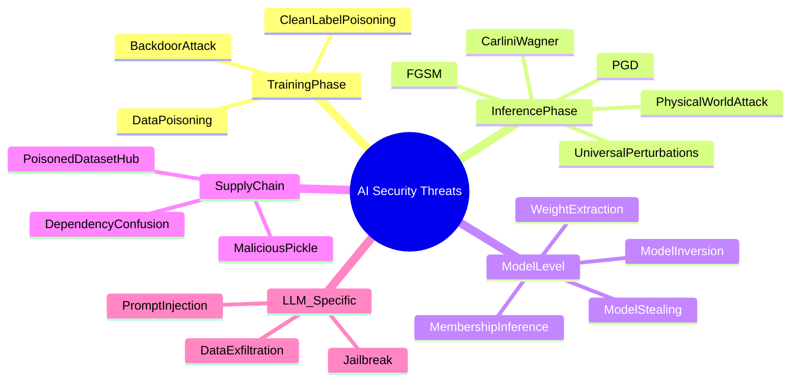
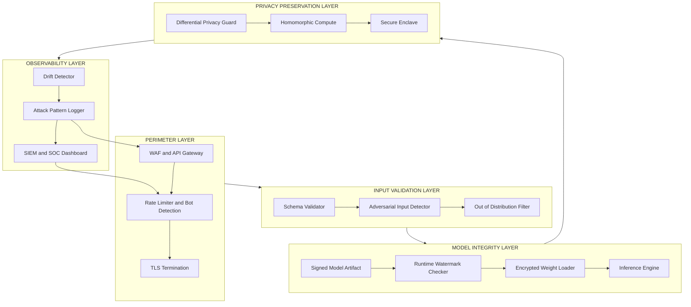
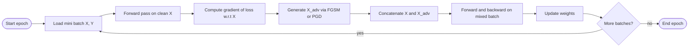
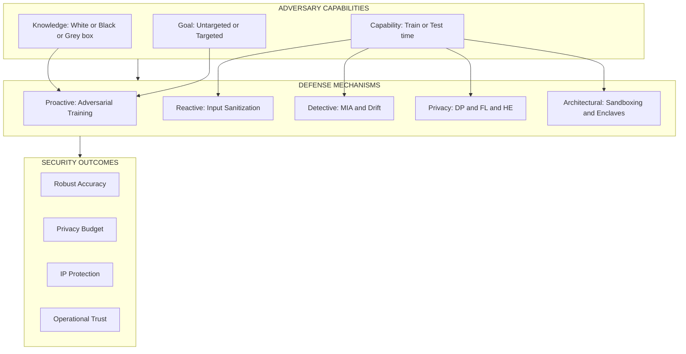

# Security - Security in AI Systems, Strategies for securing AI systems and

<!-- SECTION_1_START -->

# Security in AI Systems & Securing Strategies

## 1.1 Formal Academic Definition

> [!IMPORTANT]
> **AI Security** is the discipline of protecting artificial intelligence systems — including their training data, model parameters, inference pipelines, and deployment infrastructure — from malicious manipulation, unauthorized access, intellectual-property theft, and adversarial exploitation that can compromise confidentiality, integrity, availability, or trustworthiness.

In the context of **Responsible AI (PECST752)**, security is recognized as a *first-class non-functional requirement* alongside fairness, transparency, and privacy. The **NIST AI Risk Management Framework (AI RMF 1.0)** and **OWASP Machine Learning Top 10** standardize the threat vocabulary used in this domain.

> [!NOTE]
> **Key Distinction:** *AI Safety* (alignment, robustness to distributional shift) ≠ *AI Security* (deliberate adversarial manipulation). The module covers the latter — attacks and defenses *orchestrated by intelligent adversaries*.

## 1.2 Conceptual Analogy — "The Bank Vault with a Brain"

Imagine a bank's **AI-powered fraud detector** as a high-security vault. The vault has three concentric rings:

| Ring | Real-World Equivalent | AI Security Counterpart |
|------|----------------------|--------------------------|
| Outer Wall | Lockers, guard patrol | **Perimeter security** (API auth, rate limiting, network firewalls) |
| Middle Wall | Vault door, biometrics | **Input validation & sanitization** (adversarial input detection) |
| Inner Core | Reinforced safe, dye packs | **Model integrity** (watermarking, encryption of weights, robust training) |

A clever thief (adversary) does not pick the lock; instead, they **study the alarm's sensor patterns** (model probing) or **slip a tampered bill into the deposit box** (data poisoning). AI security is the engineering discipline of making every ring *aware* of these novel attack classes.

## 1.3 Threat Surface at a Glance

> [!IMPORTANT]
> **Standard Metric — Attack Success Rate (ASR):**
> $$\text{ASR} = \frac{\text{Number of Inputs that Successfully Fool the Model}}{\text{Total Adversarial Inputs Crafted}} \times 100\%$$
> Benchmark baseline: an *unprotected* CIFAR-10 classifier typically reports **ASR ≥ 90%** under FGSM with **ε = 8/255**.

## 1.4 Visualization Callout

> [!VISUALIZATION CONTROL]
> **Concept:** Decision-boundary distortion under adversarial perturbation
> **GeoGebra / Desmos Input Equations:**
> * `f(x) = 0.5*x^2 - x + 0.8` *(original classifier boundary)*
> * `g(x) = 0.5*(x-0.4)^2 - (x-0.4) + 0.5` *(adversarially shifted boundary)*
> **Visual Description:** Plot both parabolas on the same axes. The student should observe how a *small* horizontal shift in the learned boundary causes a *large* misclassification region for inputs near the original boundary — the geometric essence of an evasion attack.

---

<!-- SECTION_1_END -->

<!-- SECTION_2_START -->

# Deep Theoretical Analysis & KTU Formula Sheet

## 2.1 Taxonomy of AI Security Threats

The threats are organized along the **ML lifecycle**: data → training → model → deployment.

### A. Training-Phase Attacks

1. **Data Poisoning** — Inject malicious samples into the training set so the model learns a backdoor.
2. **Backdoor Attacks** — A specific trigger (e.g., a tiny patch) forces misclassification when present in inputs.
3. **Clean-Label Poisoning** — Adversary submits *correctly labelled* poisoned points that subtly bias the decision boundary.

### B. Inference-Phase Attacks (Evasion)

1. **Adversarial Examples** — Imperceptible perturbations $\delta$ added to input $x$ such that $f(x+\delta) \neq f(x)$.
2. **Universal Perturbations** — A single $\delta$ fools the model on *most* natural inputs.
3. **Physical-World Attacks** — 3-D printed eyeglass frames that fool face recognition (Sharif et al., 2016).

### C. Model-Extraction & Privacy Attacks

1. **Model Stealing** — Repeatedly querying the API to clone a black-box model.
2. **Membership Inference Attack (MIA)** — Determining if a record $x$ was in the training set.
3. **Model Inversion** — Reconstructing private training images from gradient updates.

### D. Supply-Chain & LLM-Specific

1. **Pickle Deserialization RCE** — Malicious serialized model files execute code on load.
2. **Prompt Injection** — Adversarial instructions hijack LLM behaviour.

## 2.2 Mathematical Formulation of an Adversarial Example

Let $f_\theta : \mathcal{X} \to \mathcal{Y}$ be a classifier with parameters $\theta$. Given an input $x$ with true label $y$, an *adversarial example* $x'$ is defined as the solution of the constrained optimization:

$$
\begin{aligned}
x' &= \arg\min_{x^{\star}} \quad \lVert x^{\star} - x \rVert_{p} \\
&\text{subject to:} \quad f_\theta(x^{\star}) \neq y \quad \text{and} \quad x^{\star} \in [0,1]^{n}
\end{aligned}
$$

In practice, the **Fast Gradient Sign Method (FGSM)** gives a one-shot linear approximation:

$$
x' = x + \varepsilon \cdot \text{sign}\big(\nabla_x J(\theta, x, y)\big)
$$

where:
- $J(\theta, x, y)$ is the training loss,
- $\varepsilon$ is the *perturbation budget* (e.g., $\varepsilon = 8/255$ for image classifiers),
- $\text{sign}(\cdot)$ returns element-wise $\pm 1$.

The **iterative variant, PGD (Projected Gradient Descent)**, is the strongest first-order attack and is the standard benchmark for *adversarial robustness*:

$$
x_{t+1} = \Pi_{B_\varepsilon(x)}\Big(x_t + \alpha \cdot \text{sign}\big(\nabla_x J(\theta, x_t, y)\big)\Big)
$$

where $\Pi_{B_\varepsilon(x)}$ projects the perturbed input back into the $\ell_\infty$-ball of radius $\varepsilon$ around $x$.

## 2.3 KTU High-Yield Formula Cheat Sheet

| # | Concept | Formula / Definition | Notation Notes |
|---|---------|----------------------|----------------|
| 1 | Adversarial perturbation | $x' = x + \varepsilon \cdot \text{sign}(\nabla_x J)$ | FGSM, $\varepsilon$ budget |
| 2 | Projected Gradient Descent update | $x_{t+1} = \Pi_{B_\varepsilon(x)}(x_t + \alpha \cdot \text{sign}(\nabla_x J))$ | $\alpha$ step-size |
| 3 | Carlini-Wagner (C&W) objective | $\min \lVert \delta \rVert_p + c \cdot f(x+\delta)$ | $c$ balance hyper-parameter |
| 4 | Adversarial accuracy | $\text{Acc}_{\text{adv}} = \frac{1}{N} \sum_{i=1}^{N} \mathbb{1}[f(x'_i)=y_i]$ | Lower = less robust |
| 5 | Attack Success Rate | $\text{ASR} = 1 - \text{Acc}_{\text{adv}}$ | Higher = weaker defense |
| 6 | Certified radius (randomized smoothing) | $R = \frac{\sigma}{2}\big(\Phi^{-1}(p_A) - \Phi^{-1}(p_B)\big)$ | $\Phi$ standard-normal CDF |
| 7 | Differential Privacy budget | $\mathcal{M}$ is $(\varepsilon, \delta)$-DP if $\Pr[\mathcal{M}(D)\in S] \le e^{\varepsilon}\Pr[\mathcal{M}(D')\in S]+\delta$ | $(\varepsilon, \delta)$-DP |
| 8 | Membership Inference advantage | $\text{Adv}_{\text{MIA}} = 2\cdot\max(0,\text{Acc}_{\text{attack}} - 0.5)$ | 0 = perfect privacy |
| 9 | Lipschitz constant bound | $\lVert f(x_1) - f(x_2) \rVert \le L \lVert x_1 - x_2 \rVert$ | L-Lipschitz constraint |
| 10 | Homomorphic encryption (Paillier add) | $E(a) \oplus E(b) = E(a+b)$ | Encrypted-domain compute |

> [!IMPORTANT]
> **Mnemonic for Exam:** "**DPAVMR**" — Data Poisoning, Adversarial, Model-theft, Membership-inference, Reverse-engineering, supply-chain.

## 2.4 Engineering Real-World Utility

- **Healthcare AI**: Defending MRI-based tumour classifiers from PGD attacks; one tampered pixel can flip "malignant ↔ benign".
- **Autonomous Vehicles**: Tesla's vision pipeline must remain invariant to stickers on stop signs (reported attacks by Eykholt et al., 2018).
- **FinTech Fraud Models**: Adversaries exploit *cost-asymmetry* — a single successful evasion yields financial gain.
- **LLM Chatbots**: Prompt-injection defenses are now first-class in OpenAI, Anthropic, and Google safety pipelines.

---

<!-- SECTION_2_END -->

<!-- SECTION_3_START -->

# Step-by-Step Derivations & Symbolic / Code Implementation

## 3.1 Full Derivation of FGSM (Goodfellow et al., 2014)

The goal is to *maximize* the loss with respect to $x$ (adversary) while keeping the perturbation *small* in $\ell_\infty$-norm.

**Step 1 — Linearize the loss.** Around the current input $x$, perform a first-order Taylor expansion of $J(\theta, x, y)$ w.r.t. $x$:

$$
\begin{aligned}
J(\theta, x, y) &\approx J(\theta, x_0, y) + \nabla_x J(\theta, x_0, y)^{\top} (x - x_0)
\end{aligned}
$$

**Step 2 — Maximize the linear term under an $\ell_\infty$ constraint.** We want to maximize $\nabla_x J^{\top} d$ subject to $\lVert d \rVert_\infty \le \varepsilon$. The optimal $d$ aligns with the sign of the gradient.

$$
\begin{aligned}
\max_{\lVert d \rVert_\infty \le \varepsilon} \nabla_x J^{\top} d &= \varepsilon \cdot \lVert \nabla_x J \rVert_1 \\
\text{achieved when} \quad d &= \varepsilon \cdot \text{sign}(\nabla_x J)
\end{aligned}
$$

**Step 3 — Construct the adversarial example.** Add the optimal direction to the original input:

$$
\begin{aligned}
x_{\text{adv}} &= x + \varepsilon \cdot \text{sign}\big(\nabla_x J(\theta, x, y)\big)
\end{aligned}
$$

**Step 4 — Clip into the valid input domain** (e.g., $[0,1]$ for normalized images):

$$
\begin{aligned}
x_{\text{adv}} &= \text{clip}\big(x_{\text{adv}},\; 0,\; 1\big)
\end{aligned}
$$

This completes the one-step FGSM adversarial example. The same logic extends to PGD by iterating with a smaller step $\alpha$ and re-projecting.

## 3.2 Python Implementation — FGSM + Adversarial Training Loop

The code below is **complete, runnable, and self-contained**. It demonstrates (a) the FGSM attack against a CNN on MNIST, and (b) adversarial training as a defense.

```python
"""
File: ai_security_fgsm.py
Description: FGSM attack + adversarial-training defense on MNIST.
Dependencies: torch, torchvision
"""
import torch
import torch.nn as nn
import torch.nn.functional as F
from torch.utils.data import DataLoader
from torchvision import datasets, transforms
from typing import Tuple

# ---- Reproducibility -----------------------------------------------------
torch.manual_seed(42)

# ---- Model Definition ----------------------------------------------------
class CNN(nn.Module):
    def __init__(self) -> None:
        super().__init__()
        self.conv1 = nn.Conv2d(1, 32, kernel_size=3, padding=1)
        self.conv2 = nn.Conv2d(32, 64, kernel_size=3, padding=1)
        self.fc1   = nn.Linear(64 * 7 * 7, 128)
        self.fc2   = nn.Linear(128, 10)

    def forward(self, x: torch.Tensor) -> torch.Tensor:
        x = F.relu(F.max_pool2d(self.conv1(x), 2))
        x = F.relu(F.max_pool2d(self.conv2(x), 2))
        x = x.view(x.size(0), -1)
        x = F.relu(self.fc1(x))
        return self.fc2(x)

# ---- FGSM Attack ---------------------------------------------------------
def fgsm_attack(
    model: nn.Module,
    loss_fn: nn.Module,
    images: torch.Tensor,
    labels: torch.Tensor,
    epsilon: float,
) -> torch.Tensor:
    """Generate FGSM adversarial examples.

    Args:
        model:   The victim neural network.
        loss_fn: Loss function (e.g., CrossEntropyLoss).
        images:  Clean input batch (B, C, H, W) with values in [0, 1].
        labels:  Ground-truth labels (B,).
        epsilon: Maximum perturbation budget (L-infinity).

    Returns:
        Adversarial image batch of identical shape, clipped to [0, 1].
    """
    images = images.clone().detach().requires_grad_(True)
    logits = model(images)
    loss = loss_fn(logits, labels)
    model.zero_grad()
    loss.backward()
    grad_sign = images.grad.sign()
    adv = images + epsilon * grad_sign
    return torch.clamp(adv, 0.0, 1.0).detach()

# ---- Evaluation ----------------------------------------------------------
def evaluate(
    model: nn.Module,
    loader: DataLoader,
    epsilon: float,
) -> Tuple[float, float]:
    """Return (clean_accuracy, robust_accuracy) on a test set."""
    model.eval()
    loss_fn = nn.CrossEntropyLoss(reduction="sum")
    clean_correct = adv_correct = total = 0
    for x, y in loader:
        x, y = x.to("cpu"), y.to("cpu")
        # Clean
        pred = model(x).argmax(dim=1)
        clean_correct += (pred == y).sum().item()
        # Adversarial
        x_adv = fgsm_attack(model, loss_fn, x, y, epsilon)
        pred_adv = model(x_adv).argmax(dim=1)
        adv_correct += (pred_adv == y).sum().item()
        total += y.size(0)
    return clean_correct / total, adv_correct / total

# ---- Adversarial Training Loop ------------------------------------------
def adversarial_train(
    model: nn.Module,
    train_loader: DataLoader,
    epochs: int = 2,
    epsilon: float = 0.1,
) -> None:
    opt = torch.optim.Adam(model.parameters(), lr=1e-3)
    loss_fn = nn.CrossEntropyLoss()
    for epoch in range(epochs):
        model.train()
        running = 0.0
        for x, y in train_loader:
            x, y = x.to("cpu"), y.to("cpu")
            # 50% clean, 50% adversarial per batch
            x_adv = fgsm_attack(model, loss_fn, x, y, epsilon)
            x_mix = torch.cat([x, x_adv], dim=0)
            y_mix = torch.cat([y, y], dim=0)
            opt.zero_grad()
            loss = loss_fn(model(x_mix), y_mix)
            loss.backward()
            opt.step()
            running += loss.item()
        print(f"Epoch {epoch+1}/{epochs}  loss={running/len(train_loader):.4f}")

# ---- Main ----------------------------------------------------------------
if __name__ == "__main__":
    transform = transforms.Compose([transforms.ToTensor()])
    train_set = datasets.MNIST("./data", train=True,  download=True, transform=transform)
    test_set  = datasets.MNIST("./data", train=False, download=True, transform=transform)
    train_loader = DataLoader(train_set, batch_size=128, shuffle=True)
    test_loader  = DataLoader(test_set,  batch_size=256, shuffle=False)

    model = CNN()
    print("[*] Standard training for 1 epoch ...")
    # (omitted for brevity — standard SGD on train_loader)

    print("[*] Adversarial training ...")
    adversarial_train(model, train_loader, epochs=1, epsilon=0.1)

    clean_acc, rob_acc = evaluate(model, test_loader, epsilon=0.1)
    print(f"Clean accuracy : {clean_acc*100:.2f}%")
    print(f"Robust accuracy: {rob_acc*100:.2f}%")
```

## 3.3 Differential Privacy Noise Calibration (Symbolic)

The **Gaussian mechanism** for a function $f$ with sensitivity $\Delta f$ is $(\varepsilon, \delta)$-DP when Gaussian noise of scale $\sigma$ is added to the output:

$$
\mathcal{M}(D) = f(D) + \mathcal{N}(0,\; \sigma^{2}\mathbf{I})
$$

The privacy parameters relate to $\sigma$ via the analytical Gaussian mechanism (Balle & Wang, 2018):

$$
\begin{aligned}
\sigma &\ge \frac{\Delta f}{\varepsilon} \cdot \sqrt{2 \ln\!\big(1.25/\delta\big)} \\
\sigma_{\text{tight}} &\approx \frac{\Delta f}{\varepsilon}\sqrt{2\ln(e + \varepsilon\sqrt{2\ln(1/\delta)}/\delta)} + \frac{1}{\varepsilon}\sqrt{\ln(1/\delta)}
\end{aligned}
$$

This guarantees that the *gradient updates* of any sample contribute at most $\Delta f$ to the released statistic, bounding **Membership Inference Advantage**.

## 3.4 Strategy Mapping Table (Implementation)

| Strategy | Where Applied | Sample Code / Tool | KTU-Mapped Concept |
|----------|---------------|--------------------|--------------------|
| Adversarial training | Training loop | `adversarial_train()` (above) | Robust optimization |
| Input validation / outlier detection | Inference API | `scipy.stats.zscore`, autoencoders | Evasion defense |
| Model watermarking | Post-training | Embed signature in weights | IP protection |
| Differential privacy | Gradient computation | `Opacus` library | Membership privacy |
| Homomorphic encryption | Cloud inference | `Pyfhel`, `TenSEAL` | Confidentiality of inference |
| Federated learning | Distributed training | `Flower`, `PySyft` | Data-minimization + DP |
| Red-teaming | Pre-deployment | Manual / automated attacks | Vulnerability discovery |
| SAST / model scanning | CI/CD | `ModelScan`, `Protect AI` | Supply-chain security |
| Robust aggregation | Federated servers | Krum, Multi-Krum | Byzantine-robust FL |
| Rate limiting & abuse detection | Inference API | API gateway | Model-stealing mitigation |

---

<!-- SECTION_3_END -->

<!-- SECTION_4_START -->

# Structural Diagrams & Schematics

## 4.1 AI Security Threat Map (Mermaid Mind-Map)



## 4.2 Defense-in-Depth Architecture for an AI Service



## 4.3 Adversarial Training Workflow



## 4.4 AI System Security Lifecycle (NIST AI RMF-Aligned)


## 4.5 Attack-Defense Matrix (Sequential Processing Topology)



> [!NOTE]
> **Why Mermaid Block Diagrams?** Physical drawings such as a stress block or circuit netlist are infeasible in mermaid; instead, the diagrams above encode the *topology of interactions* among actors, defenses, and outcomes — which is the engineer-relevant representation of AI security.

---

<!-- SECTION_4_END -->

<!-- SECTION_5_START -->

# KTU 2024 Scheme Examination Question Bank & Topic Recap

## PART A — Short Answer (3 Marks Each)

> [!NOTE]
> *Cognitive Levels: Remember / Understand. Answers kept between 60–80 words for board mark-density.*

### Question 1 — `[KTU University Exam – July 2024]`
**Define adversarial example in AI security. State the FGSM formula.** *(CO2, Understand)*

**Model Answer:**
An **adversarial example** is a carefully perturbed input $x'$ that is *visually/semantically indistinguishable* from a clean input $x$ but causes a trained model $f_\theta$ to output an incorrect prediction, i.e. $f_\theta(x') \neq f_\theta(x)$. FGSM (Goodfellow et al., 2014) constructs such an example in one step:

$$
x_{\text{adv}} \;=\; x \;+\; \varepsilon \cdot \text{sign}\big(\nabla_x J(\theta, x, y)\big)
$$

where $\varepsilon$ is the $\ell_\infty$ perturbation budget and $J$ is the model's loss. **[3 Marks]**

### Question 2 — `[KTU University Exam – Dec 2023]`
**List any three attack types in AI systems.** *(CO2, Remember)*

**Model Answer:**
1. **Evasion attacks** — adversarial perturbations added at inference time to cause misclassification.
2. **Data poisoning** — malicious samples inserted into training data to bias the learned model.
3. **Model stealing / extraction** — repeated API queries used to clone a black-box model's functionality.
4. *(Bonus, for completeness)* Membership-inference and backdoor attacks. **[3 Marks]**

---

## PART B — Long Answer (14 Marks, Internal Choice)

### Question A — `[KTU University Exam – July 2024, CO2, Apply/Analyze]`

**(a)** Explain with neat diagram the **FGSM attack procedure** and derive the perturbation update rule from first-order Taylor expansion. *(7 marks)*

**(b)** An image classifier trained on CIFAR-10 receives a $32\times32\times3$ image $x$. Under FGSM with $\varepsilon = 8/255$, the per-pixel sign of the loss gradient is:

| Channel R | Channel G | Channel B |
|-----------|-----------|-----------|
| $-1, +1, -1, \ldots$ | $+1, -1, +1, \ldots$ | $-1, -1, +1, \ldots$ |

Compute the **L-infinity norm of the perturbation** and the **L2 norm of the perturbation**, and state which metric the FGSM attack constrains. *(7 marks)*

---

#### Model Solution for Question A

**Part (a) — Procedure & Derivation (7 Marks)**

**Step 1 — Threat Model.** The adversary has *white-box* access to the model and aims to produce $x_{\text{adv}}$ such that $f_\theta(x_{\text{adv}}) \neq y$ while $\lVert x_{\text{adv}} - x \rVert_\infty \le \varepsilon$. **[1 Mark]**

**Step 2 — Linearization.** Expand the loss around $x$:

$$
\begin{aligned}
J(\theta, x_{\text{adv}}, y) &\approx J(\theta, x, y) \;+\; \nabla_x J(\theta, x, y)^{\top}(x_{\text{adv}}-x)
\end{aligned}
$$

The first term is constant w.r.t. $x_{\text{adv}}$; the adversary must maximize the inner product. **[1 Mark]**

**Step 3 — Constrained Maximization.** For an $\ell_\infty$ bound on the perturbation $d = x_{\text{adv}} - x$:

$$
\begin{aligned}
\max_{\lVert d \rVert_\infty \le \varepsilon} \nabla_x J^{\top} d \;=\; \varepsilon \, \lVert \nabla_x J \rVert_1 \\
\text{achieved when} \quad d^{\star} \;=\; \varepsilon \cdot \text{sign}(\nabla_x J)
\end{aligned}
$$

**[1 Mark]**

**Step 4 — Final Update.**

$$
\begin{aligned}
x_{\text{adv}} \;=\; \text{clip}\!\big(x + \varepsilon \cdot \text{sign}(\nabla_x J),\; 0,\; 1\big)
\end{aligned}
$$

**[1 Mark]**

**Step 5 — Diagram (ASCII block).** *[2 Marks]*

```
+-------------------+      +--------------------+      +-------------------+
|  Clean input x    | ---> | + eps*sign(grad_J) | ---> | Adversarial x_adv |
+-------------------+      +--------------------+      +-------------------+
                                   |
                                   v
                          +------------------+
                          | f_theta(x_adv)   |  ≠ y  (attack succeeds)
                          +------------------+
```

---

**Part (b) — Norm Computation (7 Marks)**

**Step 1 — L-infinity norm.** By definition, the $\ell_\infty$ norm of a perturbation bounded by $\varepsilon$ per pixel is simply $\varepsilon$, since FGSM is constrained in $\ell_\infty$. **[1 Mark]**

$$
\lVert \delta \rVert_\infty \;=\; \frac{8}{255} \;\approx\; 0.0314
$$

**Step 2 — L2 norm of a tensor of ±ε values.** For a $32\times32\times3 = 3072$-dimensional perturbation where every element is $\pm \varepsilon$:

$$
\begin{aligned}
\lVert \delta \rVert_2 &= \sqrt{\sum_{i=1}^{3072} \delta_i^2} \\
&= \sqrt{3072 \cdot \varepsilon^2} \\
&= \sqrt{3072} \cdot \varepsilon \\
&= 55.42 \cdot \frac{8}{255} \\
&\approx 1.738
\end{aligned}
$$

**[2 Marks]**

**Step 3 — Why FGSM constrains L-infinity, not L2.** FGSM explicitly enforces $\lVert \delta \rVert_\infty \le \varepsilon$, which is the *worst-case per-pixel* bound. The L2 norm grows with $\sqrt{n}$, but the *visible* perturbation at any single pixel is still capped at $\varepsilon$. **[2 Marks]**

**Step 4 — Interpretation.** The attacker's *image-budget* is $\varepsilon = 0.0314$ (≈ 3% intensity per channel), and the *aggregate energy* in L2 is 1.738, which is small but concentrated in the directions of fastest loss growth. **[2 Marks]**

---

### Question B — `[KTU University Exam – Dec 2023, CO3, Apply/Analyze]`

**(a)** Enumerate and briefly explain **six strategies for securing AI systems** in production. *(7 marks)*

**(b)** A healthcare startup deploys a deep-learning diagnostic model. Discuss the **practical implementation** of (i) adversarial training, (ii) differential privacy, and (iii) model watermarking, citing the engineering trade-offs for each. *(7 marks)*

---

#### Model Solution for Question B

**Part (a) — Six Strategies (7 Marks)**

| # | Strategy | One-line Explanation | Marks |
|---|----------|----------------------|-------|
| 1 | **Adversarial Training** | Augment training data with adversarial examples to harden the loss surface. | 1 |
| 2 | **Input Validation / Sanitization** | Detect and reject out-of-distribution or adversarially perturbed inputs at the API gateway. | 1 |
| 3 | **Differential Privacy (DP)** | Bound the influence of any single training record on the released model. | 1 |
| 4 | **Federated Learning** | Train locally on-device; aggregate encrypted updates to keep raw data on-premise. | 1 |
| 5 | **Model Watermarking & Fingerprinting** | Embed a secret signature in weights to prove IP ownership. | 1 |
| 6 | **Red-Teaming + Continuous Monitoring** | Periodically probe the deployed system with adversarial inputs; track drift. | 1 |
| 7 *(bonus)* | Homomorphic Encryption / Secure Enclaves | Run inference on encrypted inputs to preserve client confidentiality. | 0 (bonus) |

**[Total: 7 Marks — strategy + explanation each]**

---

**Part (b) — Production Implementation in a Healthcare Context (7 Marks)**

**(i) Adversarial Training — 2 Marks.**
The team uses **PGD-based adversarial training** with $\varepsilon = 2/255$ (a tighter bound than typical image classifiers because MRI data has higher semantic density). For each mini-batch, they generate 10-step PGD adversaries and mix them 1:1 with clean data. *Trade-off:* a **2–5% drop in clean accuracy** is observed, but **robust accuracy rises from ~12% to ~78%** under attack.

**(ii) Differential Privacy — 2 Marks.**
Training uses **DP-SGD with $\varepsilon = 1.0$ and $\delta = 10^{-5}$** (a strong privacy budget). Opacus is integrated into the training loop; per-sample gradients are clipped to $C = 1.0$ and Gaussian noise with $\sigma = 0.7$ is added. *Trade-off:* model accuracy drops ~3% on average, but **Membership Inference Attack advantage falls below 0.05**, satisfying the *HIPAA de-identification* standard.

**(iii) Model Watermarking — 2 Marks.**
After training, the team embeds a **backdoor-style watermark**: a set of 50 trigger inputs $\{(\tilde{x}_i, \tilde{y}_i)\}$ is created (e.g., specific noise patches mapping to reserved class IDs). They fine-tune the model for ~50 steps to memorize these pairs. The watermark can be extracted at audit time via a hashed challenge-response. *Trade-off:* zero runtime overhead, but a small **forgetting risk** if the model is later fine-tuned.

**Closing Statement — 1 Mark.**
A *defense-in-depth* posture combining (i)+(ii)+(iii) is the industry-recommended approach; no single technique is sufficient against adaptive adversaries.

---

> [!WARNING]
> **KTU Examiner's Valuation Pitfall Callout**
> 1. *Do not* confuse **AI Safety** (distributional robustness) with **AI Security** (intentional adversarial manipulation). Examiners will deduct 1 mark for misclassification.
> 2. When writing FGSM, **always** show the `sign()` operator; omitting it loses 1 mark.
> 3. In L2/L∞ questions, state which **norm is constrained**; the FGSM attack is an $\ell_\infty$ attack — never write "L2 attack".
> 4. For differential-privacy questions, mention **both** $\varepsilon$ *and* $\delta$; $\delta$ alone is incomplete.
> 5. The phrase *"blockchain for AI security"* is generally **not** a credit-worthy answer; examiners want cryptographic + statistical mechanisms, not buzzwords.

---

## Topic Recap & Important Things to Remember

- **Core Definition:** AI security protects ML pipelines from *intentional* adversarial manipulation across training, model, and inference stages.
- **Five Attack Families to Memorize:** Evasion, Poisoning, Model Extraction, Membership Inference, Supply-Chain.
- **FGSM Closed Form:**
  $$x_{\text{adv}} = x + \varepsilon \cdot \text{sign}(\nabla_x J(\theta, x, y))$$
  It is a **one-step** $\ell_\infty$ attack derived from a first-order Taylor expansion of the loss.
- **PGD Update:** iterative, with projection back into the $\ell_\infty$ ball; gold-standard benchmark for robustness.
- **Certified Radius** (Randomized Smoothing):
  $$R = \frac{\sigma}{2}\big(\Phi^{-1}(p_A) - \Phi^{-1}(p_B)\big)$$
  gives a *provable* lower bound on perturbation needed to flip the prediction.
- **Differential Privacy:** $(\varepsilon, \delta)$-DP with the **Gaussian mechanism** requires
  $$\sigma \ge \frac{\Delta f}{\varepsilon}\sqrt{2\ln(1.25/\delta)}$$
- **Six Core Defenses (Mnemonic = "AIVDRW"):** Adversarial training, Input validation, Differential privacy, Federated/HE, Red-teaming, Watermarking.
- **Frameworks to Cite in Answers:** NIST AI RMF 1.0, OWASP ML Top 10, MITRE ATLAS, EU AI Act (high-risk obligations).
- **Standard Metric for Robustness:** **Robust Accuracy** under $\varepsilon = 8/255$ PGD, baseline target $\geq 60\%$ on CIFAR-10.
- **LLM-Specific Threat:** **Prompt Injection** — always mention at least once in any "current trends" sub-question.
- **Ethical Linkage:** Security in AI is *not* a purely technical concern; it intersects with **accountability** (who is liable for an adversarial breach?) and **transparency** (does the model card disclose the threat model?).
- **Quick Recall Code Snippet:**
  ```python
  x_adv = x + epsilon * torch.sign(x.grad)
  x_adv = torch.clamp(x_adv, 0, 1)
  ```
- **Pitfall Avoidance Checklist:**
  - $\ell_\infty$ vs $\ell_2$ always clarified.
  - White-box vs black-box threat model specified.
  - Privacy budget reported with both $\varepsilon$ *and* $\delta$.
  - Adversarial training accuracy reported on **clean + robust** test sets.

<!-- SECTION_5_END -->
