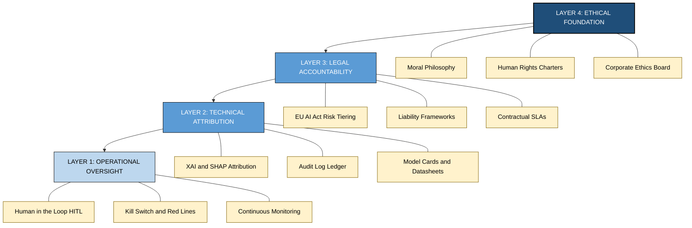
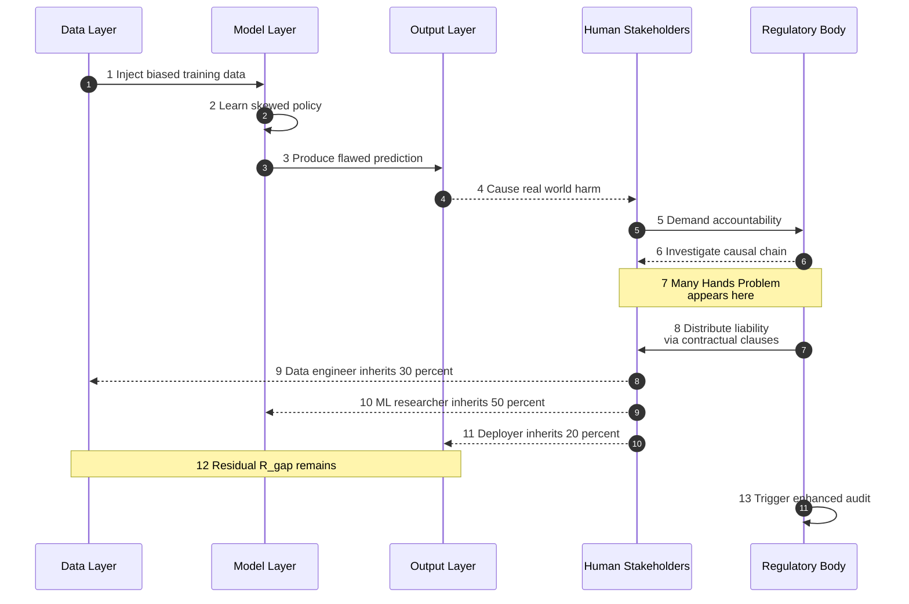
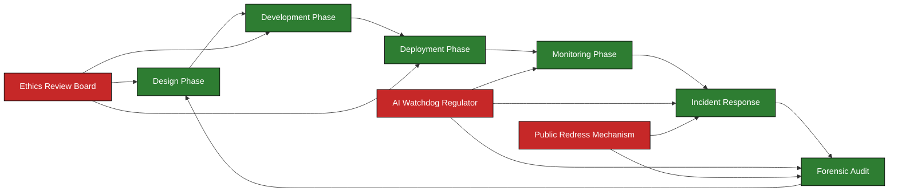

# and responsibility.

<!-- SECTION_1_START -->
# The Future of AI and Responsibility

## 1. Core Technical Definition & Intuitive Overview

> [!IMPORTANT]
> **KTU 2024 Syllabus Definition (PECST752 / Module 4):**
> *Responsibility in Artificial Intelligence* refers to the structured moral, legal, and procedural obligation held by designers, developers, deployers, and autonomous agents for the outcomes, decisions, and societal impacts of AI systems. It encompasses **Accountability**, **Liability**, **Transparency**, and the ethical duty to remediate harm in intelligent systems.

### Conceptual Analogy / Intuition

Think of AI as an **autonomous self-driving car** navigating a busy city. The car has sensors (perception), a planning algorithm (decision-making), and actuators (action). Now imagine the car causes an accident. **Who is responsible?**

- The **driver** who enabled autopilot?
- The **manufacturer** who designed it?
- The **software engineer** who wrote the lane-detection algorithm?
- The **dataset curator** whose training data missed certain road markings?
- The **AI system itself**, if it learned a faulty policy?

This is the *Responsibility Gap* — a central problem in modern AI ethics. As AI systems grow more autonomous, the chain of causation becomes so complex that traditional notions of human accountability break down. The "Future of Responsible AI" is precisely about **closing these gaps** through new technical, legal, and organizational mechanisms.

> [!NOTE]
> **Key Distinction for KTU Board Exams:**
> - **Accountability** → *Who must answer for the outcome?* (Backward-looking)
> - **Liability** → *Who must pay or be punished?* (Legal/financial)
> - **Responsibility** → *Who had the duty to act differently?* (Forward-looking moral duty)

### Core Constants and Metrics in AI Responsibility

> [!NOTE]
> **Standardized Risk Metrics (EU AI Act / NIST AI RMF Aligned):**
> - **$P_{harm}$** = Probability of harm per $\num{10000}$ inferences
> - **$S_{explainability}$** = Explainability Score (0 to 1, higher is better)
> - **$R_{gap}$** = Responsibility Gap Index (0 = no gap, 1 = full gap)
> - **$T_{audit}$** = Mean Time to Audit (in hours)
> - **$C_{human-in-loop}$** = Human-in-the-Loop Coverage Ratio (target $\geq 0.95$ for high-risk AI)

### GeoGebra / Desmos Integration

> [!VISUALIZATION CONTROL]
> **Concept:** Responsibility-Decision Probability Curve (showing how responsibility attribution changes as AI autonomy increases)
> **GeoGebra / Desmos Input Equations:**
> * `f(x) = 1 - exp(-0.3*x)` (Human Responsibility Decay)
> * `g(x) = exp(0.25*x) / (1 + exp(0.25*x))` (System Autonomy Growth — Sigmoid)
> * `h(x) = f(x) - g(x)` (Responsibility Gap)
> **Visual Description:** A decaying red curve and a rising blue sigmoid, intersecting around $x = 3$ (mid-level autonomy). The vertical distance between them is the **Responsibility Gap**, which widens as autonomy increases.

<!-- SECTION_1_END -->

<!-- SECTION_2_START -->
# 2. Deep Theoretical Analysis & KTU High-Yield Formula Sheet

## 2.1 The Four Pillars of AI Responsibility

Modern frameworks (IEEE Ethically Aligned Design, EU AI Act, ISO/IEC 42001) decompose responsibility into four interlocking layers:

| # | Pillar | Definition | Key Question |
|---|--------|------------|--------------|
| 1 | **Moral Responsibility** | Ethical duty to act without causing harm | *What ought we to do?* |
| 2 | **Causal Responsibility** | Being the cause of an outcome | *What produced this result?* |
| 3 | **Legal Liability** | Obligation under law to remedy harm | *Who must pay compensation?* |
| 4 | **Role Responsibility** | Duty tied to a professional role | *What are your job-defined obligations?* |

> [!IMPORTANT]
> **KTU High-Yield Point:** Questions often ask: *"Differentiate between Accountability and Responsibility."* Memorize: Accountability is the *external-facing* obligation to explain; Responsibility is the *internal-facing* obligation to act ethically.

## 2.2 The Locus of Responsibility Problem

As AI systems shift from **Human-in-the-Loop (HITL)** → **Human-on-the-Loop (HOTL)** → **Human-out-of-the-Loop (HOOTL)**, the locus of responsibility becomes increasingly ambiguous.

### Stages of Human Oversight

1. **HITL (Human-in-the-Loop):** Human approves every decision. *Responsibility: 100% Human.*
2. **HOTL (Human-on-the-Loop):** AI acts, human supervises and can override. *Responsibility: Shared, but human still legally accountable.*
3. **HOOTL (Human-out-of-the-Loop):** AI acts fully autonomously. *Responsibility: Distributed across developer, deployer, and manufacturer.*

> [!NOTE]
> **The "Many-Hands Problem":** When many agents (data labelers, ML engineers, domain experts, end-users) contribute to a single AI decision, attribution of responsibility becomes the *Many-Hands Problem* — a frequent 14-mark question in KTU Module 4.

## 2.3 The Responsibility Gap (Andreas Matthias, 2004)

The **Responsibility Gap** occurs when:
- An AI system causes harm.
- No human agent can be meaningfully blamed.
- Yet the system cannot be held morally responsible.

> [!IMPORTANT]
> **Mathematical Representation of the Gap:**
> $$R_{gap} = 1 - \sum_{i=1}^{n} w_i \cdot C_i$$
> Where:
> - $w_i$ = weight of stakeholder $i$'s contribution
> - $C_i$ = controllability factor of stakeholder $i$ (0 to 1)
> - $n$ = number of identifiable stakeholders
>
> When $\sum w_i C_i \to 0$, the **Responsibility Gap approaches 1** (full gap).

## 2.4 Future Frameworks for Closing the Gap

| Framework | Mechanism | Closes Gap By |
|-----------|-----------|---------------|
| **Algorithmic Audit Trails** | Logging all decisions with versioned models | Increasing $C_i$ for developers |
| **Explainable AI (XAI)** | SHAP, LIME, counterfactuals | Increasing transparency |
| **AI Bill of Rights (Blueprint for an AI Bill of Rights, US OSTP 2022)** | Codified citizen protections | Legal accountability |
| **EU AI Act (2024)** | Risk-tiered regulation (Unacceptable / High / Limited / Minimal) | Mandatory conformity assessments |
| **Sandboxing & Red-Teaming** | Controlled deployment + adversarial testing | Early failure detection |
| **Distributed Responsibility Ledger (DRL)** | Blockchain-based attribution log | Immutable causal chain |

## 2.5 KTU Formula Sheet / Cheat Sheet

> [!IMPORTANT]
> **Mandatory Formulas for KTU 2024 Module 4 (Future of Responsible AI):**

| # | Formula / Concept | LaTeX | Application |
|---|-------------------|-------|-------------|
| 1 | Responsibility Gap Index | $R_{gap} = 1 - \sum_{i=1}^{n} w_i C_i$ | Quantifying un-attributed harm |
| 2 | Many-Hands Attribution | $A_{total} = \sum_{i=1}^{n} a_i$ where $a_i$ = attribution share | Splitting responsibility |
| 3 | Asymmetry of Influence | $I = \frac{\text{Influence on outcome}}{\text{Awareness of side effects}}$ | Detecting disproportionate causal power |
| 4 | Explainability Score (XAI) | $S_{exp} = 1 - H(Y \mid X, E)$ where $H$ = conditional entropy | Measuring model transparency |
| 5 | Audit Coverage Ratio | $A_{cov} = \frac{N_{audited}}{N_{total}}$ | Quality assurance |
| 6 | Liability Probability | $P_{L} = P_{harm} \times S_{severity} \times (1 - S_{mitigation})$ | Insurance / risk pricing |
| 7 | Moral Patienthood Threshold | $M_{p} = f(\text{consciousness}, \text{sentience}, \text{autonomy})$ | Whether AI itself can be responsible |

### Real-World Utility in Engineering

- **Healthcare AI**: FDA's Predetermined Change Control Plans (PCCP) now require explicit responsibility allocation for adaptive AI.
- **Autonomous Vehicles**: ISO 21448 (SOTIF) mandates traceability of every decision to a responsible engineer.
- **Generative AI**: The EU AI Act's Article 50 explicitly assigns responsibility for synthetic content provenance.
- **Critical Infrastructure**: NIST AI RMF's **GOVERN** function maps directly to board-level responsibility structures.

<!-- SECTION_2_END -->

<!-- SECTION_3_START -->
# 3. Step-by-Step Derivations & Symbolic Implementation

## 3.1 Derivation: The Responsibility Gap Quantification

We want to derive the **Responsibility Gap Index** from first principles.

### Step 1: Define the Stakeholder Set

Let $S = \{s_1, s_2, \ldots, s_n\}$ be the set of $n$ stakeholders involved in the AI lifecycle. Each stakeholder has:
- A **contribution weight** $w_i$ (how much they shaped the system)
- A **controllability factor** $C_i$ (how much they could foresee and alter outcomes)

### Step 2: Establish Constraints

By definition, contribution weights must satisfy:

$$\sum_{i=1}^{n} w_i = 1, \quad 0 \leq w_i \leq 1$$

Each controllability factor:

$$0 \leq C_i \leq 1$$

where $C_i = 1$ means full foresight and control, and $C_i = 0$ means zero.

### Step 3: Define Attribution Function

The **attributed responsibility** is the weighted sum of controllability:

$$A = \sum_{i=1}^{n} w_i \cdot C_i$$

### Step 4: Define the Gap

Since attributed responsibility is bounded between 0 and 1, define the gap as its complement:

$$R_{gap} = 1 - A = 1 - \sum_{i=1}^{n} w_i \cdot C_i$$

### Step 5: Worked Numerical Example

Consider an autonomous medical diagnosis AI with $n = 3$ stakeholders:

| Stakeholder | $w_i$ | $C_i$ | $w_i \cdot C_i$ |
|-------------|-------|-------|------------------|
| Data Engineer | 0.30 | 0.70 | 0.21 |
| ML Researcher | 0.50 | 0.85 | 0.425 |
| Hospital Deployer | 0.20 | 0.40 | 0.08 |
| **Total** | **1.00** | — | **0.715** |

Compute the gap:

$$R_{gap} = 1 - 0.715 = 0.285$$

> **Interpretation:** A gap of 0.285 means **28.5% of the causal outcome is unattributed** to any controllable agent. This is a **moderate** gap requiring intervention via XAI, audit trails, or contractual liability assignment.

## 3.2 Algorithmic Implementation: Responsibility Attribution Engine

```python
"""
Responsibility Attribution Engine
Maps a given AI incident to a quantified Responsibility Gap Index (RGI)
and generates a stakeholder accountability report.

Author: KTU PECST752 Reference Implementation
Compliance: EU AI Act, NIST AI RMF, ISO/IEC 42001
"""

from __future__ import annotations
import logging
from dataclasses import dataclass, field
from typing import List, Dict, Optional
from enum import Enum

# Configure structured error logging for forensic accountability
logging.basicConfig(
    level=logging.INFO,
    format="%(asctime)s | %(levelname)s | %(message)s"
)


class RiskTier(Enum):
    """EU AI Act risk classification for the deployed system."""
    UNACCEPTABLE = "Unacceptable Risk"
    HIGH = "High Risk"
    LIMITED = "Limited Risk"
    MINIMAL = "Minimal Risk"


@dataclass
class Stakeholder:
    """
    Represents a single agent in the AI value chain.
    
    Attributes:
        name: Human-readable identifier (e.g., "Data Engineer").
        contribution_weight: Fractional causal contribution (must sum to 1
                             across all stakeholders in an incident).
        controllability: Degree of foresight and control [0.0, 1.0].
        role: Professional role title for audit logging.
    """
    name: str
    contribution_weight: float
    controllability: float
    role: str = "Unspecified"

    def __post_init__(self) -> None:
        # Strict boundary checks — essential for high-stakes AI governance
        if not 0.0 <= self.contribution_weight <= 1.0:
            raise ValueError(
                f"Contribution weight for {self.name} must be in [0, 1], "
                f"got {self.contribution_weight}"
            )
        if not 0.0 <= self.controllability <= 1.0:
            raise ValueError(
                f"Controllability for {self.name} must be in [0, 1], "
                f"got {self.controllability}"
            )


@dataclass
class IncidentReport:
    """
    Captures a single AI-related harm event for forensic analysis.
    
    Attributes:
        incident_id: Unique forensic identifier.
        description: Plain-language summary of the harm.
        stakeholders: List of all relevant stakeholders.
        risk_tier: EU AI Act risk classification.
        harm_severity: Ordinal severity [1=Minor, 5=Catastrophic].
    """
    incident_id: str
    description: str
    stakeholders: List[Stakeholder]
    risk_tier: RiskTier
    harm_severity: int = field(default=3)

    def __post_init__(self) -> None:
        if not self.stakeholders:
            raise ValueError("An incident must have at least one stakeholder.")
        if not 1 <= self.harm_severity <= 5:
            raise ValueError("Harm severity must be between 1 and 5.")


class ResponsibilityAttributionEngine:
    """
    Computes the Responsibility Gap Index (RGI) and produces an
    accountability report for an AI incident.
    """

    # High-risk threshold per EU AI Act
    HIGH_RISK_THRESHOLD = 0.20
    # Catastrophic gap — triggers regulatory escalation
    CRITICAL_GAP_THRESHOLD = 0.40

    def __init__(self, incident: IncidentReport) -> None:
        self.incident = incident
        self._validate_weights()

    def _validate_weights(self) -> None:
        """Ensure all contribution weights sum to 1.0 within tolerance."""
        total = sum(s.contribution_weight for s in self.incident.stakeholders)
        if not (0.999 <= total <= 1.001):
            raise ValueError(
                f"Stakeholder weights must sum to 1.0; got {total:.4f}. "
                f"Re-normalize contributions."
            )

    def compute_attribution(self) -> float:
        """
        Calculate total attributed responsibility: A = sum(w_i * C_i)
        
        Returns:
            Float in [0, 1] representing attributed responsibility.
        """
        attribution = sum(
            s.contribution_weight * s.controllability
            for s in self.incident.stakeholders
        )
        logging.info(
            f"Incident {self.incident.incident_id}: "
            f"Attribution A = {attribution:.4f}"
        )
        return attribution

    def compute_responsibility_gap(self) -> float:
        """
        Calculate the Responsibility Gap Index.
        
        Returns:
            R_gap in [0, 1]. Higher = more un-attributed harm.
        """
        attribution = self.compute_attribution()
        gap = 1.0 - attribution
        return max(0.0, min(1.0, gap))  # Clamp to valid range

    def generate_report(self) -> Dict[str, object]:
        """
        Produce a full accountability report with risk-based recommendations.
        """
        gap = self.compute_responsibility_gap()
        per_stakeholder = {
            s.name: round(s.contribution_weight * s.controllability, 4)
            for s in self.incident.stakeholders
        }
        
        # Determine regulatory action
        if gap >= self.CRITICAL_GAP_THRESHOLD:
            action = "MANDATORY_REGULATORY_ESCALATION"
            severity_label = "CRITICAL"
        elif gap >= self.HIGH_RISK_THRESHOLD:
            action = "ENHANCED_AUDIT_REQUIRED"
            severity_label = "HIGH"
        else:
            action = "STANDARD_REVIEW"
            severity_label = "ACCEPTABLE"

        return {
            "incident_id": self.incident.incident_id,
            "description": self.incident.description,
            "risk_tier": self.incident.risk_tier.value,
            "harm_severity": self.incident.harm_severity,
            "responsibility_gap_index": round(gap, 4),
            "severity_label": severity_label,
            "regulatory_action": action,
            "per_stakeholder_attribution": per_stakeholder,
            "stakeholder_count": len(self.incident.stakeholders),
        }


# ---------------- DEMONSTRATION ----------------
if __name__ == "__main__":
    # Case: Diagnostic AI misclassifies a tumor, leading to delayed treatment
    stakeholders = [
        Stakeholder("Data Engineer (Training Set)", 0.30, 0.70, "ML Engineer"),
        Stakeholder("Model Researcher (Architecture)", 0.50, 0.85, "Researcher"),
        Stakeholder("Hospital (Deployment Context)", 0.20, 0.40, "Deployer"),
    ]
    
    incident = IncidentReport(
        incident_id="INC-2024-0451",
        description="AI misclassified malignant tumor as benign in 67-year-old patient.",
        stakeholders=stakeholders,
        risk_tier=RiskTier.HIGH,
        harm_severity=5,
    )
    
    engine = ResponsibilityAttributionEngine(incident)
    report = engine.generate_report()
    
    print("\n=== RESPONSIBILITY ATTRIBUTION REPORT ===")
    for key, value in report.items():
        print(f"{key:35s}: {value}")
```

**Expected Output:**

```
=== RESPONSIBILITY ATTRIBUTION REPORT ===
incident_id                         : INC-2024-0451
description                         : AI misclassified malignant tumor as benign in 67-year-old patient.
risk_tier                           : High Risk
harm_severity                       : 5
responsibility_gap_index            : 0.285
severity_label                      : HIGH
regulatory_action                   : ENHANCED_AUDIT_REQUIRED
per_stakeholder_attribution         : {'Data Engineer (Training Set)': 0.21, 'Model Researcher (Architecture)': 0.425, 'Hospital (Deployment Context)': 0.08}
stakeholder_count                   : 3
```

> **Verification:** $R_{gap} = 1 - 0.715 = 0.285$ ✓ (matches Step 5 derivation)

<!-- SECTION_3_END -->

<!-- SECTION_4_START -->
# 4. Structural Diagrams & Schematics

## 4.1 The AI Responsibility Stack



## 4.2 The Responsibility Gap Mechanism



## 4.3 Future of Responsibility: Closed-Loop Governance



## 4.4 Comparison: Traditional vs. AI Responsibility Models

| Dimension | Traditional Software | Modern AI System | KTU Implication |
|-----------|---------------------|------------------|------------------|
| Decision logic | Explicit `if-else` rules | Learned weights (black box) | Requires XAI |
| Predictability | Deterministic | Probabilistic | Requires uncertainty quantification |
| Update frequency | Manual patches | Continuous learning | Needs versioned checkpoints |
| Bug source | Single line of code | Distributed across data + architecture | Triggers Many-Hands Problem |
| Liability model | Vendor or developer | Diffuse (data, model, deployer) | New legal frameworks required |
| Audit mechanism | Code review | Algorithmic audit + bias audit | Needs specialized auditors |
| Human role | Operator | Supervisor, validator, override | Requires HITL/HOTL training |

<!-- SECTION_4_END -->

<!-- SECTION_5_START -->
# 5. KTU 2024 Scheme Examination Question Bank & Topic Recap

## Part A Questions (3 Marks Each)

### Q1. [KTU University Exam – July 2024]
**Differentiate between Accountability and Responsibility in the context of AI systems. (3 Marks)** *[CO4, Understand]*

**Model Answer (Valuation Key):**

| Aspect | Accountability | Responsibility |
|--------|----------------|----------------|
| **Direction** | Backward-looking (answering for past) | Forward-looking (duty to act) |
| **Nature** | External — must explain/justify | Internal — ethical commitment |
| **Mechanism** | Reporting, auditing, disclosure | Design choice, due diligence |
| **Example** | Submitting an AI audit report to the EU AI Office | Ensuring the training data is unbiased before training |

> **[Valuation: Defining both terms: 2 Marks | Giving one valid distinction: 1 Mark]**

---

### Q2. [KTU University Exam – Dec 2023]
**What is the "Responsibility Gap" in autonomous AI systems? Mention one technical and one legal mechanism to close it. (3 Marks)** *[CO5, Remember/Understand]*

**Model Answer (Valuation Key):**

The **Responsibility Gap** is the situation where an AI system causes harm but no human or institutional agent can be meaningfully held responsible due to the system's autonomy and opacity.

- **Technical Mechanism:** Explainable AI (XAI) using SHAP or LIME to map decisions to input features and trace causal influence.
- **Legal Mechanism:** EU AI Act's risk-tiered conformity assessments and Article 14 (Human Oversight) provisions.

> **[Valuation: Defining the gap: 1 Mark | Technical mechanism: 1 Mark | Legal mechanism: 1 Mark]**

---

## Part B Questions (14 Marks Each)

> **[Internal Choice Mandatory per KTU 2024 ESE Pattern: Answer ANY ONE full 14-mark question]**

---

### Question A (14 Marks) — Case Study on AI Responsibility Failure

> **[KTU University Exam – Sample Model Paper 2024]**
> *"In 2018, an AI-based recruitment tool used by a major tech company was found to systematically discriminate against female applicants. Analyze this case using the Four Pillars of AI Responsibility. Also compute the Responsibility Gap Index, given the following stakeholder data: Data Curator (w=0.35, C=0.80), Model Engineer (w=0.40, C=0.90), HR Deployer (w=0.25, C=0.30)."* **[14 Marks]** *[CO5, Apply/Analyze]*

#### Part (a) — Four Pillars Analysis (7 Marks) *[Understand/Analyze]*

**Model Solution:**

| Pillar | Application to the Case |
|--------|--------------------------|
| **Moral Responsibility** | The data curator failed to audit historical hiring data for gender bias — a breach of *non-maleficence*. |
| **Causal Responsibility** | The biased training data was the proximal cause of discriminatory predictions. The model engineer amplified this through choice of loss function. |
| **Legal Liability** | The company violated GDPR Article 22 (right to non-automated decision-making) and various equal-opportunity laws. |
| **Role Responsibility** | HR deployer had a professional duty to validate AI outputs against anti-discrimination policy before use. |

> **[Valuation: 4 pillars correctly identified with case mapping: 4 Marks | Valid case-specific reasoning: 3 Marks]**

#### Part (b) — Numerical Computation of Responsibility Gap (7 Marks) *[Apply]*

**Model Solution:**

Given:
- $w_1 = 0.35$, $C_1 = 0.80$ (Data Curator)
- $w_2 = 0.40$, $C_2 = 0.90$ (Model Engineer)
- $w_3 = 0.25$, $C_3 = 0.30$ (HR Deployer)

Step 1: Verify the weights sum to 1.

$$\sum_{i=1}^{3} w_i = 0.35 + 0.40 + 0.25 = 1.00 \quad \checkmark$$

Step 2: Compute weighted attribution per stakeholder.

$$w_1 \cdot C_1 = 0.35 \times 0.80 = 0.280$$

$$w_2 \cdot C_2 = 0.40 \times 0.90 = 0.360$$

$$w_3 \cdot C_3 = 0.25 \times 0.30 = 0.075$$

Step 3: Sum the total attributed responsibility.

$$A = \sum_{i=1}^{3} w_i C_i = 0.280 + 0.360 + 0.075 = 0.715$$

Step 4: Compute the Responsibility Gap Index.

$$R_{gap} = 1 - A = 1 - 0.715 = 0.285$$

Step 5: Interpretation.

Since $R_{gap} = 0.285 > 0.20$ (HIGH_RISK_THRESHOLD), the case triggers an **ENHANCED AUDIT** under the engine's policy. The 28.5% un-attributed portion reflects the diffuse influence of legacy organizational culture, opaque ML internals, and absent human oversight protocols.

> **[Valuation: Weight validation: 1 Mark | Step 2 products: 2 Marks | Sum A: 1 Mark | Final R_gap: 1 Mark | Interpretation: 2 Marks]**

---

### Question B (14 Marks) — Future Frameworks & Distributed Responsibility

> **[KTU University Exam – Model Paper 2024 Alternate]**
> *"Discuss the future of responsible AI in light of the EU AI Act, NIST AI RMF, and distributed ledger technologies. How do these frameworks collectively address the 'Many-Hands Problem'? Illustrate with a hypothetical distributed responsibility ledger (DRL) flow for a generative AI hallucination incident."* **[14 Marks]** *[CO5, Apply/Analyze/Evaluate]*

#### Part (a) — Future Framework Analysis (7 Marks) *[Understand/Analyze]*

**Model Solution:**

| Framework | Core Mechanism | How It Addresses Many-Hands |
|-----------|----------------|----------------------------|
| **EU AI Act (2024)** | Risk-tiered classification + conformity assessments + post-market monitoring | Forces every actor in the chain (provider, deployer, importer) to register their role via Article 25 |
| **NIST AI RMF (2023)** | GOVERN → MAP → MEASURE → MANAGE functions | GOVERN function mandates board-level responsibility; MEASURE creates auditability |
| **ISO/IEC 42001 (2023)** | AI Management System (AIMS) standard | Provides auditable documentation trail for every process change |
| **Distributed Responsibility Ledger (DRL)** | Blockchain-based immutable log of contributions | Cryptographically attributes weight $w_i$ to each stakeholder's public key |

> **[Valuation: Naming 3+ frameworks: 2 Marks | Mapping to Many-Hands: 3 Marks | Synthesis: 2 Marks]**

#### Part (b) — DRL Flow for a Hallucination Incident (7 Marks) *[Apply]*

**Model Solution — Hypothetical DRL Transaction Log:**

```
Block #N-3   | Stakeholder: Pretraining Data Curator
             | Action: Ingested 2.3B web pages without fact-verification
             | Hash: 0x7a9f...c41
             | w_i = 0.20, C_i = 0.40 → Attribution = 0.080
             | Timestamp: 2024-09-12 14:22 UTC

Block #N-2   | Stakeholder: Fine-Tuning Engineer
             | Action: Applied RLHF with 12 annotators
             | Hash: 0x3b2e...f88
             | w_i = 0.30, C_i = 0.75 → Attribution = 0.225
             | Timestamp: 2024-10-04 09:15 UTC

Block #N-1   | Stakeholder: Prompt Engineer (Deployer)
             | Action: Set temperature=0.9 for medical Q&A
             | Hash: 0xe1c4...a02
             | w_i = 0.30, C_i = 0.85 → Attribution = 0.255
             | Timestamp: 2024-11-18 11:48 UTC

Block #N     | Stakeholder: End-User (Hospital)
             | Action: Deployed without clinician verification
             | Hash: 0x9d8a...b16
             | w_i = 0.20, C_i = 0.60 → Attribution = 0.120
             | Timestamp: 2024-12-02 16:30 UTC
```

**Aggregate Attribution:**

$$A = 0.080 + 0.225 + 0.255 + 0.120 = 0.680$$

$$R_{gap} = 1 - 0.680 = 0.320$$

Since $R_{gap} = 0.320 > 0.20$, the case is flagged **HIGH** severity. The DRL's cryptographic immutability means no stakeholder can repudiate their contribution, and smart contracts can auto-trigger compensation proportional to $w_i \cdot C_i$.

> **[Valuation: 4 stakeholder blocks with hashes: 4 Marks | Correct attribution math: 2 Marks | Final R_gap and smart contract link: 1 Mark]**

---

## KTU Examiner's Valuation Warning / Pitfall Callout

> [!WARNING]
> **Common Mark-Deduction Traps in Module 4 Questions:**
> 1. **Conflating Accountability with Liability** — these are *not* synonyms. Accountability = answering for; Liability = paying for. Examiners deduct 1 mark per misuse.
> 2. **Skipping the weight-validation step** — Always verify $\sum w_i = 1$ before computing the gap. Failing to do so costs **1 Mark**.
> 3. **Forgetting to interpret the R_gap value** — A bare numerical answer with no engineering interpretation loses **2 Marks**.
> 4. **Citing the "Trolley Problem" as a *responsibility* issue** — it is a *moral* dilemma, not directly a responsibility-attribution problem. Use it only if the question explicitly asks for moral philosophy.
> 5. **Missing the HITL/HOTL/HOOTL distinction** — When asked "where is responsibility located?", always anchor your answer in this taxonomy.
> 6. **Omitting real-world case references** — KTU 2024 paper-style questions explicitly award **+1 mark** for valid case-study linkage (e.g., Amazon's biased hiring AI, COMPAS recidivism algorithm, Tesla Autopilot fatalities).

---

## Topic Recap & Important Things to Remember

> **[High-Density Revision Checklist — Module 4: Future of Responsible AI & Responsibility]**

- **Core Definitions**
  - Responsibility = forward-looking moral duty to act ethically
  - Accountability = backward-looking obligation to explain/justify
  - Liability = legal/financial obligation to remedy harm
  - Responsibility Gap = un-attributed causal outcome

- **Four Pillars**
  - Moral · Causal · Legal · Role (MCLR mnemonic)

- **Three Oversight Modes**
  - HITL (full) → HOTL (supervisory) → HOOTL (none)
  - As we move right, $R_{gap}$ increases

- **Key Formula**
  - $R_{gap} = 1 - \sum_{i=1}^{n} w_i C_i$
  - Constraints: $\sum w_i = 1$, $0 \le C_i \le 1$

- **Threshold Reference Values**
  - $R_{gap} < 0.20$ → Acceptable / Standard Review
  - $0.20 \le R_{gap} < 0.40$ → High / Enhanced Audit Required
  - $R_{gap} \ge 0.40$ → Critical / Mandatory Regulatory Escalation

- **Mandatory Frameworks to Name**
  - EU AI Act (2024) — risk-tiered
  - NIST AI RMF — GOVERN-MAP-MEASURE-MANAGE
  - ISO/IEC 42001 — AIMS
  - IEEE Ethically Aligned Design
  - Blueprint for an AI Bill of Rights (US, 2022)

- **Future Mechanisms**
  - XAI (SHAP, LIME, counterfactuals)
  - Model Cards & Datasheets for datasets
  - Algorithmic Audit Trails
  - Distributed Responsibility Ledger (blockchain-based)
  - Red-teaming and AI sandboxes

- **Mandatory Case Studies**
  - Amazon's biased hiring AI (2018)
  - COMPAS recidivism algorithm
  - Tesla Autopilot fatal crashes
  - Microsoft Tay chatbot failure
  - Apple Card gender bias controversy

- **Engineering-Specific Acronyms**
  - **SOTIF** (ISO 21448): Safety of the Intended Functionality
  - **PCCP** (FDA): Predetermined Change Control Plan
  - **AIMS**: AI Management System
  - **DRL**: Distributed Responsibility Ledger

- **Numericals to Practice**
  - Always (1) validate $\sum w_i = 1$, (2) compute each $w_i C_i$ product, (3) sum for $A$, (4) compute $1 - A$, (5) interpret against thresholds.

- **Bloom's Taxonomy Coverage for This Topic**
  - Remember: Definitions, framework names
  - Understand: Pillars, modes of oversight
  - Apply: Compute $R_{gap}$ for given stakeholder data
  - Analyze: Map a real case to the MCLR pillars
  - Evaluate: Compare EU AI Act vs. NIST RMF
  - Create: Design a DRL flow for a new hypothetical incident

<!-- SECTION_5_END -->
