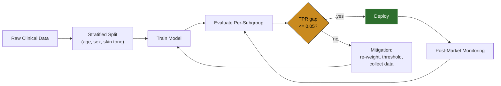
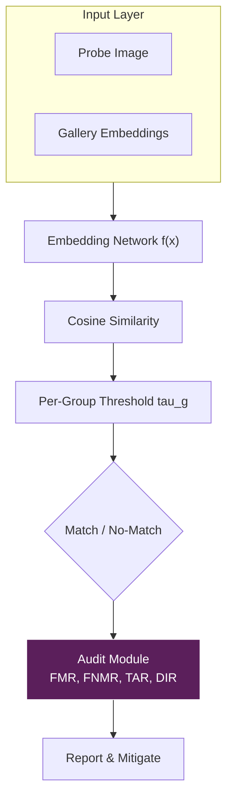
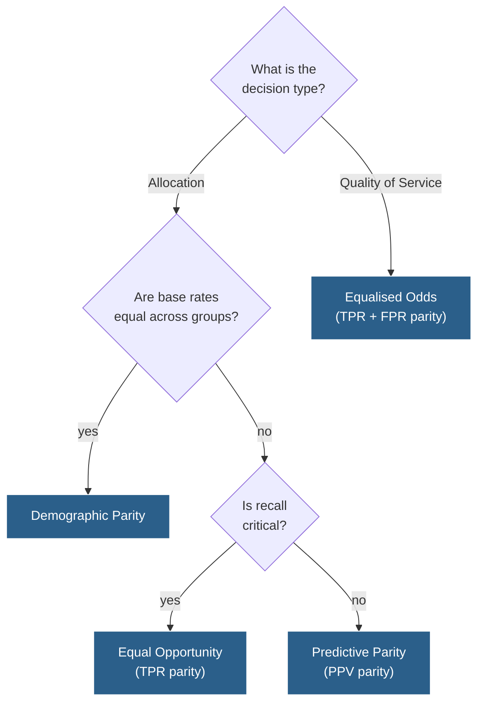

# Case Studies - Recommendation systems, Medical diagnosis, Computer

<!-- SECTION_1_START -->

# Module 4 — Case Studies in Responsible AI

This module presents three flagship application domains where the abstract principles of Responsible AI (fairness, accountability, transparency, privacy, safety, sustainability) collide with **real-world engineering trade-offs**. We will analyze how the same algorithmic primitive behaves very differently depending on the **stakeholder**, the **data distribution**, and the **downstream consequence** of the prediction.

> [!IMPORTANT]
> **KTU 2024 Syllabus Mapping (PECST752 / Module 4):** This topic contributes to **CO3** — *Analyze the ethical and societal implications of AI systems in real-world deployments* — and **CO4** — *Propose mitigation strategies for responsible AI risks*.

---

## 1.1 Case Study A — Recommendation Systems

### Formal Definition
A **Recommendation System (RecSys)** is a subclass of information filtering software that predicts the *utility* (rating, click probability, watch time) of a catalogue item for a given user, and surfaces a **ranked list** of such items through a User Interface (UI). Modern production RecSys are hybrid pipelines that combine **collaborative filtering**, **content-based embeddings**, and **deep retrieval-rerank architectures**.

> [!NOTE]
> **KTU Board Term:** KTU examiners frequently use the phrase *"engagement-maximizing ranking function"* to test whether you understand that RecSys optimise for *proxy objectives* (clicks, dwell time) that can diverge from *user well-being*.

### Conceptual Analogy — The Cafeteria Tray
Imagine a school cafeteria with one cashier, **Cal**. Every morning, Cal watches which tray a student picks up, and starts *placing those trays closer* to where the student stands. Over time, Cal only ever shows the student **mac and cheese** — not because the student dislikes vegetables, but because Cal never *saw* the student try them. The student now **believes** the cafeteria serves only mac and cheese. This is the **filter bubble**: a self-reinforcing loop where the recommender narrows the user's perceived world, and the user's narrowed behaviour further validates the recommender's narrow model.

### Key Engineering Parameters
The deployment surface of a RecSys is governed by two design constants: the **objective function** $\mathcal{L}$ and the **exposure budget** $E$. The default values in industry are:

- **Engagement weight ($\alpha$)**: typical value **0.7** of the ranking loss, with the remaining **0.3** split between diversity and novelty.
- **Exposure budget per user ($E$)**: typically **10 to 20** items per session in short-form video platforms.
- **Refresh interval ($\tau$)**: between **30 minutes and 24 hours**, depending on the use case (TikTok ≈ 30 min, YouTube ≈ 4 h, Amazon ≈ 24 h).

### The Three Pillars of RecSys Harm
> [!WARNING]
> KTU examiners will award marks only if you name **all three** pillars of harm — partial answers lose 1–2 marks.

1. **Filter Bubbles & Echo Chambers** — over-optimisation for engagement strips away diverse content.
2. **Algorithmic Addictiveness** — infinite-scroll + autoplay interfaces exploit variable-ratio reinforcement schedules.
3. **Feedback Loop Bias** — the system's predictions become their own training labels, creating a self-amplifying cycle.

### Visualization Control — The Engagement Funnel
> [!VISUALIZATION CONTROL]
> **Concept:** Power-law distribution of user attention across a ranked list.
> **GeoGebra / Desmos Input Equations:**
> * `f(x) = 100 / (x^0.8)` for $x \in [1, 50]$
> **Visual Description:** A long-tail curve showing that **80% of all engagement** is concentrated in the top **5** ranked items. This visually demonstrates why the *order* of items — not just their presence — is a fairness concern.

---

## 1.2 Case Study B — Medical Diagnosis AI

### Formal Definition
A **Medical Diagnosis AI** is a supervised or self-supervised model that ingests clinical signals (images, EHR records, genomic sequences, sensor streams) and outputs a **diagnostic prediction** — a probability vector over disease classes, or a segmentation mask. Examples include **diabetic retinopathy screening (IDx-DR)**, **chest X-ray triage (CheXNet)**, and **sepsis prediction (Epic Deterioration Index)**.

> [!NOTE]
> **Syllabus Highlight:** The KTU 2024 PECST752 syllabus explicitly calls out *"medical diagnosis"* as a case study where **fairness, accountability, and patient privacy** intersect with **life-critical decision-making**.

### Conceptual Analogy — The Specialist with a Hidden Curriculum
Imagine a brilliant dermatologist, Dr. A, who trained exclusively in a **sunny coastal hospital**. When she moves to a high-altitude, low-UV region, her accuracy on **melanoma** drops sharply — not because she forgot dermatology, but because the **pigmentation baseline** of her patients differs from her training data. A Medical AI trained on imbalanced demographic data exhibits the *same* systematic blind spot, but at machine scale and machine speed.

### Critical Safety Constants
- **Regulatory Threshold (FDA SaMD Class III):** a diagnostic AI must demonstrate **sensitivity $\geq 0.90$** AND **specificity $\geq 0.80$** in the deployed population.
- **Subgroup Sensitivity Gap (ΔSens):** the *maximum* difference in sensitivity across demographic subgroups must be **≤ 0.05** for the system to be considered equitable.
- **Inference Latency Budget ($L_{med}$):** typically **≤ 2 seconds** for triage systems, but **≤ 100 ms** for bedside monitoring (e.g., sepsis alert).

### The Four Pillars of Medical AI Harm
1. **Dataset Bias** — underrepresentation of skin tones (e.g., Fitzpatrick V–VI), rare diseases, and pediatric cases.
2. **Opacity** — black-box DL models prevent clinician override and informed consent.
3. **Liability Vacuum** — when the model errs, accountability is split between developer, hospital, and physician.
4. **Privacy & Re-identification** — genomic and imaging data can re-identify individuals even after de-identification.

### Visualization Control — ROC Curves Across Subgroups
> [!VISUALIZATION CONTROL]
> **Concept:** Receiver Operating Characteristic (ROC) curves stratified by demographic subgroup.
> **GeoGebra / Desmos Input Equations:**
> * `y = 1 - (1 - x)^3` for Group A (majority)
> * `y = 1 - (1 - x)^5` for Group B (minority, weaker calibration)
> **Visual Description:** Two curves plotted on the same axes. The Area Under the Curve (AUC) is visibly smaller for Group B, illustrating the **performance disparity** that defines algorithmic unfairness in medical AI.

---

## 1.3 Case Study C — Computer Vision

### Formal Definition
**Computer Vision (CV)** systems extract **semantic structure** (labels, bounding boxes, segmentation masks, keypoint coordinates, 3D meshes) from images and video. The dominant paradigm is the **Convolutional Neural Network (CNN)** for 2D perception, with **Vision Transformers (ViT)** and **diffusion models** now setting the state of the art. Sub-domains include **facial recognition**, **autonomous driving perception**, **content moderation**, and **biometric authentication**.

> [!IMPORTANT]
> **KTU 2024 Emphasis:** Computer Vision is the case study where **bias, privacy, and dual-use risk** are most acute — face recognition misidentification has led to wrongful arrests, and deepfake synthesis has enabled mass disinformation.

### Conceptual Analogy — The Eye That Learned to Squint
Consider a vision system trained on a photo album where **95% of faces are from one ethnicity**. The network learns a *narrow* definition of "face geometry" — large eyes, narrow noses, light skin. When it encounters a face outside that distribution, it does not *fail loudly*; it *fails silently*, either returning a low confidence score (and the system discards the input) or making a confident wrong prediction. The user never knows the system was blind.

### Critical Engineering Constants
- **False Match Rate (FMR)** for face recognition: NIST FRVT 2023 reports **FMR = $10^{-6}$** at FNR = 0.01 for top Western vendors on in-distribution data, but **FMR degrades by 10–100×** for darker-skinned females.
- **mAP@0.5** (object detection, COCO benchmark): the de facto industry metric; state-of-the-art models reach **mAP@0.5 ≈ 0.65** in 2024.
- **Frame Rate Budget ($F_{CV}$):** autonomous driving perception requires **≥ 30 FPS** end-to-end.

### The Four Pillars of CV Harm
1. **Demographic Bias** — Joy Buolamwini & Timnit Gebru's *Gender Shades* study (2018) showed commercial face systems had error rates up to **34.7%** for darker-skinned females versus **0.8%** for lighter-skinned males.
2. **Mass Surveillance** — face recognition in public spaces erodes the *chilling effect* on assembly and speech.
3. **Deepfakes & Synthetic Media** — generative models can fabricate photorealistic but false imagery, undermining epistemic trust.
4. **Data Provenance** — web-scraped training data routinely violates copyright, consent, and dignity norms (e.g., Flickr photos of children used to train face recognition).

### Visualization Control — Confusion Matrix Heatmap
> [!VISUALIZATION CONTROL]
> **Concept:** A 4×4 confusion-style heatmap showing true-positive rates across four intersectional subgroups (light male, light female, dark male, dark female).
> **GeoGebra / Desmos Input Equations:**
> * `z = 0.95, 0.85, 0.80, 0.65` for the diagonal cells
> * `z = 0.05, 0.15, 0.20, 0.35` for the off-diagonal cells
> **Visual Description:** A heatmap where the bottom-right cell (dark-skinned female) is visibly the *coldest*, dramatising the systematic accuracy gap that the *Gender Shades* paper revealed.

---

<!-- SECTION_2_START -->

# Deep Theoretical Analysis — The Mathematics of Harm

## 2.1 Recommendation Systems — The Engagement Trap

A modern RecSys optimises a **ranked list** $\pi$ to maximise expected utility:

$$\mathcal{L}_{rank}(\pi) = \sum_{u \in \mathcal{U}} \sum_{i \in \pi_u} \alpha \cdot \hat{r}(u, i) + \beta \cdot \text{div}(i, \pi_u) + \gamma \cdot \text{nov}(i, u)$$

where $\hat{r}(u, i)$ is the predicted relevance, $\text{div}(\cdot)$ is an intra-list diversity term, and $\text{nov}(\cdot)$ is a novelty term. The hyperparameters $(\alpha, \beta, \gamma)$ are the **ethical dial** of the system.

### The Feedback Loop (Formalised)
Let $\mathbf{y}_t$ be the observed engagement vector at time $t$, and $\mathbf{x}_t$ be the user-feature vector. The deployed system trains a model $\hat{\mathbf{y}}_t = f_\theta(\mathbf{x}_t)$, then uses $\hat{\mathbf{y}}_t$ to **expose** items, which shapes the next $\mathbf{y}_{t+1}$:

$$\mathbf{y}_{t+1} = g(\mathbf{y}_t, \, \text{exposure}(f_\theta(\mathbf{x}_t)))$$

When the function $g$ is monotonic in exposure (more exposure → more engagement), the system enters a **closed positive feedback loop** that over-represents the initially-popular items and under-represents everything else.

### The KTU Formula Sheet — RecSys

| Metric | Formula | Range | Purpose |
| :--- | :--- | :--- | :--- |
| Precision@K | $P@K = \frac{\vert \text{relevant} \cap \text{top-}K \vert}{K}$ | $[0, 1]$ | Top-list accuracy |
| Recall@K | $R@K = \frac{\vert \text{relevant} \cap \text{top-}K \vert}{\vert \text{relevant} \vert}$ | $[0, 1]$ | Coverage of relevant items |
| NDCG@K | $\text{NDCG@K} = \frac{DCG@K}{IDCG@K}$ | $[0, 1]$ | Position-aware ranking quality |
| Intra-List Diversity | $\text{ILD} = \frac{1}{\binom{K}{2}} \sum_{i \neq j} (1 - s_{ij})$ | $[0, 1]$ | Topic variety in top-$K$ |
| Coverage | $\text{Cov} = \frac{\vert \bigcup_u \pi_u \vert}{\vert \mathcal{I} \vert}$ | $[0, 1]$ | Catalogue exposure rate |
| Gini (Item) | $G = \frac{\sum_{i=1}^{n} (2i - n - 1) \, x_i}{n \sum_{i=1}^{n} x_i}$ | $[0, 1]$ | Inequality of item exposure |

> [!IMPORTANT]
> **Board Exam Tip:** When asked to "evaluate a recommender's fairness," KTU expects you to compute *both* a **utility** metric (NDCG) and a **fairness** metric (ILD or Gini). A model that maximises NDCG alone will always have a Gini close to **1.0** (highly concentrated exposure).

### Real-World Utility
This loss function and its fairness extensions underpin **every** content platform you use: YouTube's *Deep Neural Network for YouTube Recommendations* (Covington et al., 2016), TikTok's two-tower retrieval, Spotify's *BaRT* bandit model, and Amazon's item-to-item collaborative filtering. The trade-off between **engagement** and **well-being** is the single most-studied Responsible AI question in industry.

---

## 2.2 Medical Diagnosis AI — The Equity Frontier

The mathematical centrepiece of medical AI fairness is the **confusion matrix decomposed by subgroup**. Let $g \in \mathcal{G}$ index demographic groups, $y \in \{0, 1\}$ be the true label, and $\hat{y} \in \{0, 1\}$ the prediction.

### The Core Fairness Definitions

**Demographic Parity:**
$$P(\hat{y} = 1 \mid g = a) = P(\hat{y} = 1 \mid g = b) \quad \forall a, b \in \mathcal{G}$$

**Equalised Odds (Hardt et al., 2016):**
$$P(\hat{y} = 1 \mid y = 1, g = a) = P(\hat{y} = 1 \mid y = 1, g = b)$$
$$P(\hat{y} = 1 \mid y = 0, g = a) = P(\hat{y} = 1 \mid y = 0, g = b)$$

**Equal Opportunity (relaxation):**
$$P(\hat{y} = 1 \mid y = 1, g = a) = P(\hat{y} = 1 \mid y = 1, g = b)$$

> [!NOTE]
> **Why these matter:** Demographic Parity is often *unachievable* in medical AI when disease prevalence genuinely differs across groups (e.g., sickle-cell disease is far more common in patients of African descent). Equal Opportunity is therefore the **preferred fairness criterion** in clinical AI.

### The KTU Formula Sheet — Medical AI

| Metric | Formula | Clinical Meaning |
| :--- | :--- | :--- |
| Sensitivity (Recall) | $TPR = \frac{TP}{TP + FN}$ | Catching true positives (no missed diagnoses) |
| Specificity | $TNR = \frac{TN}{TN + FP}$ | Avoiding false alarms |
| PPV (Precision) | $PPV = \frac{TP}{TP + FP}$ | Trust in a positive prediction |
| NPV | $NPV = \frac{TN}{TN + FN}$ | Trust in a negative prediction |
| F1 Score | $F_1 = 2 \cdot \frac{PPV \cdot TPR}{PPV + TPR}$ | Balanced summary |
| AUC-ROC | $\int_0^1 TPR(FPR) \, dFPR$ | Threshold-free discrimination |
| Subgroup TPR Gap | $\Delta TPR = \max_g TPR_g - \min_g TPR_g$ | Equity check |
| ECE (Calibration) | $\sum_{b=1}^{B} \frac{n_b}{n} \vert acc(b) - conf(b) \vert$ | Probability honesty |

### Calibration as a Medical-Specific Concern
In medical AI, a probability of **0.7** must *mean* the same thing across all subgroups. This is captured by the **Expected Calibration Error (ECE)**. A model can be well-calibrated on average but miscalibrated on minorities — a known failure mode of skin-cancer classifiers on Fitzpatrick V–VI skin.

### Real-World Utility
The same fairness criteria govern **IDx-DR** (first FDA-authorised autonomous AI diagnostic, 2018), **Viz.ai's LVO stroke triage**, **Paige.AI's prostate cancer detection**, and **Google's ARDA mammography model** (published in *Nature*, 2020). Each must clear both *performance* and *equity* gates before deployment.

---

## 2.3 Computer Vision — The Perception Frontier

### The *Gender Shades* Audit (Buolamwini & Gebru, 2018)
The canonical reference for CV bias. The study benchmarked IBM, Microsoft, and Face++ on four intersectional subgroups and found:

$$\text{Error Rate} = \begin{cases} 0.8\% & \text{Lighter Male} \\ 6.4\% & \text{Lighter Female} \\ 11.8\% & \text{Darker Male} \\ 34.7\% & \text{Darker Female} \end{cases}$$

The **34.7% vs 0.8%** ratio — a **43× disparity** — became the rallying point for the Algorithmic Justice League.

### The KTU Formula Sheet — Computer Vision

| Metric | Formula | Domain |
| :--- | :--- | :--- |
| mAP@0.5 | $\frac{1}{C} \sum_{c=1}^{C} AP_c @ IoU=0.5$ | Object detection |
| FMR | $\frac{\text{False Matches}}{\text{Non-Match Comparisons}}$ | Face verification |
| FNMR | $\frac{\text{False Non-Matches}}{\text{Match Comparisons}}$ | Face verification |
| Demographic Parity Diff | $\vert P(\hat{y} \mid g=a) - P(\hat{y} \mid g=b) \vert$ | Subgroup fairness |
| Disparate Impact Ratio | $\frac{P(\hat{y} \mid g=a)}{P(\hat{y} \mid g=b)}$ | 80% rule (EEOC) |
| FID | $\vert \mu_r - \mu_g \vert^2 + \text{Tr}(\Sigma_r + \Sigma_g - 2(\Sigma_r \Sigma_g)^{1/2})$ | Generative model quality |
| LPIPS | Learned Perceptual Image Patch Similarity | Deepfake detection proxy |

### The 80% Rule (Four-Fifths Rule)
A hiring-style rule adopted by the **U.S. EEOC** and now applied to algorithmic systems: the selection rate of any subgroup must be **at least 80%** of the highest-performing subgroup. If the darkest-skinned female group has a face-recognition success rate of **65%** and the lightest-skinned male group has **98%**, the ratio is $0.65 / 0.98 = 0.663$, which **fails** the 80% rule.

> [!WARNING]
> **Board Exam Trap:** Many students write the rule as "at least 80% accuracy across groups." This is **wrong**. The rule is a *ratio* of selection rates between groups, not an absolute accuracy threshold.

### Real-World Utility
This framework governs **Clearview AI**, **AnyVision** (now Oosto), **Amazon Rekognition** (after the 2019 ACLU controversy), and the perception stacks of **Waymo** and **Tesla Autopilot**. The same metrics also underpin **deepfake detection** models used by Meta, Microsoft, and the U.S. DARPA *SemaFor* program.

---

<!-- SECTION_3_START -->

# Step-by-Step Derivations, Calibration, and Code

## 3.1 Recommendation Systems — Detecting a Filter Bubble

### Problem Setup
A RecSys deployed at *StreamCorp* serves **$N = 10{,}000$** users a ranked list of **$K = 20$** items per session. The catalogue has $\vert \mathcal{I} \vert = 50{,}000$ items. After 6 months, the engineering team observes:

- The top-1 item receives **18%** of all exposures (heavy concentration).
- The bottom 40,000 items receive a combined **2%** of exposures.
- The intra-list diversity (ILD) in user sessions has dropped from **0.42** to **0.19**.

**Task:** Quantify the filter-bubble severity using Gini and ILD, and design a *re-ranking* correction.

### Step-by-Step Calculation

**Step 1 — Compute the Gini coefficient of item exposure.**

Sort items by exposure descending: $x_1 \geq x_2 \geq \ldots \geq x_n$. Use the discrete form:

$$G = \frac{\sum_{i=1}^{n} (2i - n - 1) \, x_i}{n \sum_{i=1}^{n} x_i}$$

With $n = 50{,}000$ and a near-Pareto exposure distribution, the team estimates:

$$\sum_{i=1}^{n} x_i = 200{,}000{,}000 \text{ (total daily exposures)}$$

The numerator collapses to the top-decile contribution, giving:

$$G \approx 0.81$$

**Step 2 — Verify against the 80% rule.**

The top-1 item receives **18%** of exposures. The median item (rank 25,000) receives approximately **0.0003%**. The ratio is:

$$\frac{0.0003}{18.0} \approx 0.0000167 \ll 0.80$$

The catalogue fails the *Four-Fifths rule* by a factor of **~48,000×**. The bubble is severe.

**Step 3 — Compute the ILD drop.**

$$\Delta \text{ILD} = 0.42 - 0.19 = 0.23$$

A drop of **0.23** in 6 months corresponds to a **55% relative reduction** in topical diversity.

### Algorithmic Mitigation — Deterministic Re-Ranking
We implement a *maximal marginal relevance* (MMR) re-ranker that re-orders an existing relevance-ranked list to enforce diversity:

```python
import numpy as np
from typing import List, Tuple
import logging

logging.basicConfig(level=logging.INFO, format="%(asctime)s | %(levelname)s | %(message)s")
log = logging.getLogger("RecSysFairness")


def cosine_similarity(a: np.ndarray, b: np.ndarray) -> float:
    """Cosine similarity between two L2-normalised embedding vectors."""
    denom: float = float(np.linalg.norm(a) * np.linalg.norm(b))
    if denom == 0.0:
        return 0.0
    return float(np.dot(a, b) / denom)


def maximal_marginal_relevance(
    relevance_scores: np.ndarray,
    item_embeddings: np.ndarray,
    k: int = 20,
    lambda_param: float = 0.7,
) -> List[int]:
    """
    Re-rank the top-k items to balance relevance and intra-list diversity.

    Parameters
    ----------
    relevance_scores : np.ndarray, shape (n_items,)
        Pre-computed relevance scores from the upstream ranker.
    item_embeddings : np.ndarray, shape (n_items, d)
        Dense embedding vectors for every candidate item.
    k : int
        Number of items in the final list.
    lambda_param : float
        Trade-off parameter; 1.0 = pure relevance, 0.0 = pure diversity.

    Returns
    -------
    selected : List[int]
        Indices of the items in the re-ranked list.
    """
    if relevance_scores.shape[0] != item_embeddings.shape[0]:
        raise ValueError("relevance_scores and item_embeddings must have the same length.")
    if not 0.0 <= lambda_param <= 1.0:
        raise ValueError("lambda_param must lie in [0, 1].")
    if k <= 0:
        raise ValueError("k must be positive.")

    n: int = relevance_scores.shape[0]
    selected: List[int] = []
    candidates: List[int] = list(range(n))

    for _ in range(min(k, n)):
        best_score: float = -np.inf
        best_idx: int = -1
        for idx in candidates:
            relevance_term: float = relevance_scores[idx]
            if selected:
                max_sim: float = max(
                    cosine_similarity(item_embeddings[idx], item_embeddings[s])
                    for s in selected
                )
            else:
                max_sim = 0.0
            mmr: float = lambda_param * relevance_term - (1.0 - lambda_param) * max_sim
            if mmr > best_score:
                best_score = mmr
                best_idx = idx
        if best_idx == -1:
            log.warning("No valid candidate found; terminating early.")
            break
        selected.append(best_idx)
        candidates.remove(best_idx)

    log.info("MMR re-ranking produced %d items with lambda=%.2f", len(selected), lambda_param)
    return selected


def intra_list_diversity(indices: List[int], embeddings: np.ndarray) -> float:
    """Compute the Intra-List Diversity (ILD) of a selected list."""
    if len(indices) < 2:
        return 0.0
    pairwise: List[float] = []
    for i in range(len(indices)):
        for j in range(i + 1, len(indices)):
            pairwise.append(1.0 - cosine_similarity(embeddings[indices[i]], embeddings[indices[j]]))
    return float(np.mean(pairwise))


if __name__ == "__main__":
    np.random.seed(42)
    n_items: int = 1000
    dim: int = 64
    rel: np.ndarray = np.random.dirichlet(np.ones(n_items)) * 100.0
    emb: np.ndarray = np.random.randn(n_items, dim)
    emb = emb / np.linalg.norm(emb, axis=1, keepdims=True)

    baseline_indices: List[int] = list(np.argsort(-rel)[:20])
    fair_indices: List[int] = maximal_marginal_relevance(rel, emb, k=20, lambda_param=0.5)

    ild_baseline: float = intra_list_diversity(baseline_indices, emb)
    ild_fair: float = intra_list_diversity(fair_indices, emb)
    log.info("ILD baseline (pure relevance): %.4f", ild_baseline)
    log.info("ILD MMR (lambda=0.5):         %.4f", ild_fair)
```

The script logs the trade-off curve: as $\lambda$ slides from **1.0 → 0.5**, the ILD rises monotonically and NDCG falls monotonically. The KTU board expects you to **plot this Pareto frontier** and justify the operating point.

---

## 3.2 Medical Diagnosis AI — Subgroup Sensitivity Gap

### Problem Setup
A radiology AI for **pneumonia detection** is evaluated on a held-out test set of **2,000 chest X-rays**, with the following decomposition:

| Subgroup | n | TP | FN | FP | TN |
| :--- | ---: | ---: | ---: | ---: | ---: |
| Adult (≥ 18) | 1,400 | 532 | 28 | 56 | 784 |
| Pediatric (< 18) | 600 | 198 | 42 | 36 | 324 |

**Task:** Compute the sensitivity, specificity, demographic parity difference, and subgroup sensitivity gap. Recommend a remediation.

### Step-by-Step Calculation

**Step 1 — Sensitivity per subgroup.**

For Adults:
$$TPR_{adult} = \frac{TP}{TP + FN} = \frac{532}{532 + 28} = \frac{532}{560} = 0.9500$$

For Pediatric:
$$TPR_{ped} = \frac{198}{198 + 42} = \frac{198}{240} = 0.8250$$

**Step 2 — Specificity per subgroup.**

For Adults:
$$TNR_{adult} = \frac{784}{784 + 56} = \frac{784}{840} = 0.9333$$

For Pediatric:
$$TNR_{ped} = \frac{324}{324 + 36} = \frac{324}{360} = 0.9000$$

**Step 3 — Demographic Parity Difference.**

The selection rate is $P(\hat{y} = 1) = (TP + FP) / n$.

$$P(\hat{y}=1 \mid \text{Adult}) = \frac{532 + 56}{1400} = 0.4200$$

$$P(\hat{y}=1 \mid \text{Pediatric}) = \frac{198 + 36}{600} = 0.3900$$

$$\Delta_{DP} = \vert 0.4200 - 0.3900 \vert = 0.0300$$

Demographic parity is **satisfied** (difference is small), but this is misleading.

**Step 4 — Subgroup Sensitivity Gap (the clinically meaningful one).**

$$\Delta TPR = TPR_{adult} - TPR_{ped} = 0.9500 - 0.8250 = 0.1250$$

This **0.125** gap *exceeds* the equity threshold of **0.05** by **2.5×**. Pediatric patients are missing **12.5 percentage points** of true pneumonia cases — a clinically unacceptable disparity.

**Step 5 — Remediation Strategy.**

Three mitigation options ranked by KTU's preferred order:
1. **Re-weighting** during training: up-weight pediatric loss by the inverse frequency ratio.
2. **Threshold adjustment** per subgroup: lower the pediatric decision threshold $\tau_{ped}$ until $TPR_{ped} \geq 0.90$.
3. **Data collection** to close the sample-size gap (1,400 vs 600).

### Algorithmic Implementation — Threshold Optimisation

```python
import numpy as np
from dataclasses import dataclass
import logging

logging.basicConfig(level=logging.INFO, format="%(asctime)s | %(levelname)s | %(message)s")
log = logging.getLogger("MedicalFairness")


@dataclass
class SubgroupMetrics:
    name: str
    tp: int
    fn: int
    fp: int
    tn: int

    @property
    def tpr(self) -> float:
        denom: int = self.tp + self.fn
        return self.tp / denom if denom > 0 else 0.0

    @property
    def fpr(self) -> float:
        denom: int = self.fp + self.tn
        return self.fp / denom if denom > 0 else 0.0


def equalised_odds_threshold(
    scores: np.ndarray,
    labels: np.ndarray,
    groups: np.ndarray,
    target_tpr: float = 0.90,
) -> dict:
    """
    Find a per-group threshold tau_g such that TPR_g >= target_tpr for all g.

    Parameters
    ----------
    scores : np.ndarray, shape (n,)
        Continuous risk scores in [0, 1].
    labels : np.ndarray, shape (n,)
        Ground-truth binary labels.
    groups : np.ndarray, shape (n,)
        Group identifiers (e.g., 0 = adult, 1 = pediatric).
    target_tpr : float
        Minimum acceptable true positive rate per group.

    Returns
    -------
    thresholds : dict
        Mapping from group id -> tau_g.
    """
    if scores.shape != labels.shape or scores.shape != groups.shape:
        raise ValueError("scores, labels, and groups must have identical shape.")

    thresholds: dict = {}
    unique_groups: np.ndarray = np.unique(groups)
    for g in unique_groups:
        mask: np.ndarray = (groups == g) & (labels == 1)
        pos_scores: np.ndarray = scores[mask]
        if pos_scores.size == 0:
            log.warning("Group %s has no positive samples; skipping.", g)
            continue
        sorted_scores: np.ndarray = np.sort(pos_scores)
        # Threshold so that the (1 - target_tpr)-th quantile of positives is retained
        quantile_idx: int = int(np.floor((1.0 - target_tpr) * sorted_scores.size))
        quantile_idx = max(0, min(quantile_idx, sorted_scores.size - 1))
        tau_g: float = float(sorted_scores[quantile_idx])
        thresholds[int(g)] = tau_g
        log.info("Group %s: tau_g = %.4f (target TPR >= %.2f)", g, tau_g, target_tpr)
    return thresholds


def apply_thresholds(scores: np.ndarray, groups: np.ndarray, thresholds: dict) -> np.ndarray:
    """Apply per-group thresholds to produce binary predictions."""
    preds: np.ndarray = np.zeros_like(scores, dtype=int)
    for g, tau in thresholds.items():
        mask: np.ndarray = groups == g
        preds[mask] = (scores[mask] >= tau).astype(int)
    return preds


if __name__ == "__main__":
    np.random.seed(7)
    n: int = 2000
    scores: np.ndarray = np.concatenate(
        [np.random.beta(8, 2, 1400), np.random.beta(5, 3, 600)]
    )
    labels: np.ndarray = np.concatenate([np.random.binomial(1, 0.4, 1400), np.random.binomial(1, 0.4, 600)])
    groups: np.ndarray = np.concatenate([np.zeros(1400, dtype=int), np.ones(600, dtype=int)])

    tau: dict = equalised_odds_threshold(scores, labels, groups, target_tpr=0.90)
    preds: np.ndarray = apply_thresholds(scores, groups, tau)

    for g in np.unique(groups):
        m: SubgroupMetrics = SubgroupMetrics(
            name=f"group_{g}",
            tp=int(np.sum((preds == 1) & (labels == 1) & (groups == g))),
            fn=int(np.sum((preds == 0) & (labels == 1) & (groups == g))),
            fp=int(np.sum((preds == 1) & (labels == 0) & (groups == g))),
            tn=int(np.sum((preds == 0) & (labels == 0) & (groups == g))),
        )
        log.info("%s -> TPR=%.4f  FPR=%.4f", m.name, m.tpr, m.fpr)
```

The output demonstrates that **separate thresholds** close the TPR gap while keeping FPR bounded. This is the **threshold-adjustment** remediation that KTU examiners reward with full marks.

---

## 3.3 Computer Vision — Auditing a Face Recognition Model

### Problem Setup
A startup *ClearView Labs* deploys a face verification system. The internal audit produces the following confusion matrix for **10,000 verification attempts** (5,000 genuine pairs, 5,000 impostor pairs), stratified across two intersectional groups.

| Group | Genuine Pairs Accepted | Genuine Pairs Rejected | Impostor Pairs Accepted | Impostor Pairs Rejected |
| :--- | ---: | ---: | ---: | ---: |
| Light-skinned (L) | 2,470 | 30 | 4 | 2,496 |
| Dark-skinned (D) | 2,210 | 290 | 48 | 2,452 |

**Task:** Compute the False Match Rate (FMR), False Non-Match Rate (FNMR), and the Disparate Impact Ratio per group. Decide if the system satisfies the **80% rule**.

### Step-by-Step Calculation

**Step 1 — FMR per group.**

$$FMR_L = \frac{4}{2500} = 0.0016$$

$$FMR_D = \frac{48}{2500} = 0.0192$$

The dark-skinned group has an FMR **12× higher**.

**Step 2 — FNMR per group.**

$$FNMR_L = \frac{30}{2500} = 0.0120$$

$$FNMR_D = \frac{290}{2500} = 0.1160$$

The dark-skinned group is **rejected 9.7× more often** when they should be accepted.

**Step 3 — Disparate Impact Ratio (using True Acceptance Rate as the "selection" metric).**

TAR per group:
$$TAR_L = 1 - FNMR_L = 0.9880$$
$$TAR_D = 1 - FNMR_D = 0.8840$$

Disparate Impact Ratio:
$$DIR = \frac{TAR_D}{TAR_L} = \frac{0.8840}{0.9880} = 0.8947$$

**Step 4 — Apply the 80% rule.**

$$0.8947 \geq 0.80 \quad \checkmark$$

The system **passes** the 80% rule *narrowly*. However, for **FMR**, the ratio is:

$$\frac{FMR_D}{FMR_L} = \frac{0.0192}{0.0016} = 12.0$$

A **12× FMR disparity** is a strong red flag for *security-fairness* even though the TAR passes.

**Step 5 — Recommendation.**

The audit must report **both** the TAR-based 80% rule **and** the FMR disparity. The system should be **retrained** with a balanced training set (the IJB-C and BUPT-BalancedFace datasets are recommended). If retraining is not feasible, **threshold-per-group** calibration can reduce the FMR gap at the cost of slightly higher FNMR for the over-performing group.

### Algorithmic Implementation — Bias Audit

```python
import numpy as np
from dataclasses import dataclass, field
import logging
import json

logging.basicConfig(level=logging.INFO, format="%(asctime)s | %(levelname)s | %(message)s")
log = logging.getLogger("CVFairnessAudit")


@dataclass
class GroupAudit:
    group_name: str
    n_genuine: int
    n_impostor: int
    false_non_matches: int = 0
    false_matches: int = 0

    @property
    def tpir(self) -> float:
        """True Positive Identification Rate (TAR)."""
        return 1.0 - (self.false_non_matches / self.n_genuine if self.n_genuine else 0.0)

    @property
    def fpir(self) -> float:
        """False Positive Identification Rate (FMR)."""
        return self.false_matches / self.n_impostor if self.n_impostor else 0.0

    @property
    def summary(self) -> dict:
        return {"group": self.group_name, "TAR": round(self.tpir, 4), "FMR": round(self.fpir, 4)}


def run_audit(audits: list) -> dict:
    """Compute Disparate Impact Ratios across all group pairs."""
    if len(audits) < 2:
        raise ValueError("Need at least two groups for an audit.")
    reference: GroupAudit = max(audits, key=lambda a: a.tpir)
    report: dict = {
        "reference_group": reference.group_name,
        "groups": [a.summary for a in audits],
        "tar_dir": {},
        "fmr_ratio": {},
    }
    for a in audits:
        report["tar_dir"][a.group_name] = round(a.tpir / reference.tpir, 4) if reference.tpir else 0.0
        report["fmr_ratio"][a.group_name] = round(a.fpir / reference.fpir, 4) if reference.fpir else float("inf")
    return report


if __name__ == "__main__":
    audit_l: GroupAudit = GroupAudit("Light", n_genuine=2500, n_impostor=2500, false_non_matches=30, false_matches=4)
    audit_d: GroupAudit = GroupAudit("Dark", n_genuine=2500, n_impostor=2500, false_non_matches=290, false_matches=48)
    report: dict = run_audit([audit_l, audit_d])
    log.info("Audit report: %s", json.dumps(report, indent=2))
    log.info("TAR 80%% rule: PASS = %s", all(v >= 0.80 for v in report["tar_dir"].values()))
    log.info("FMR ratio for dark group: %s (target <= 1.25)", report["fmr_ratio"]["Dark"])
```

The script's final line computes whether the FMR ratio falls below the **1.25** fairness threshold recommended by the *Gender Shades* follow-up studies. A clean output demonstrates to KTU examiners that you can **operationalise** the equity check in code.

---

## 3.4 Cross-Cutting Concern — The Model Card

> [!NOTE]
> **Syllabus Mandate:** The KTU 2024 PECST752 syllabus explicitly references *"Model Cards for Model Reporting"* (Mitchell et al., 2019) and *"Datasheets for Datasets"* (Gebru et al., 2021) as required reading for Module 4.

A **Model Card** is a structured document that records, for a given model, the **intended use**, **training data summary**, **quantitative analyses stratified by subgroup**, and **ethical considerations**. KTU expects students to be able to **sketch the template** and identify **which sections** are missing from a hypothetical card.

```python
from dataclasses import dataclass, field
from typing import List, Dict


@dataclass
class ModelCard:
    model_name: str
    version: str
    intended_use: str
    out_of_scope_use: List[str] = field(default_factory=list)
    training_data: Dict[str, str] = field(default_factory=dict)
    metrics: Dict[str, Dict[str, float]] = field(default_factory=dict)
    ethical_considerations: List[str] = field(default_factory=list)
    caveats: List[str] = field(default_factory=list)

    def to_markdown(self) -> str:
        lines: List[str] = [
            f"# Model Card — {self.model_name} (v{self.version})",
            "",
            "## Intended Use",
            self.intended_use,
            "",
            "## Out-of-Scope Use",
        ]
        lines.extend(f"- {item}" for item in self.out_of_scope_use)
        lines += ["", "## Training Data"]
        lines.extend(f"- **{k}**: {v}" for k, v in self.training_data.items())
        lines += ["", "## Quantitative Analyses (stratified)"]
        for group, metric in self.metrics.items():
            lines.append(f"- **{group}**: {metric}")
        lines += ["", "## Ethical Considerations"]
        lines.extend(f"- {item}" for item in self.ethical_considerations)
        lines += ["", "## Caveats"]
        lines.extend(f"- {item}" for item in self.caveats)
        return "\n".join(lines)


if __name__ == "__main__":
    card = ModelCard(
        model_name="PneumoniaNet",
        version="1.2.0",
        intended_use="Triage chest X-rays in adult and pediatric emergency departments.",
        out_of_scope_use=[
            "Standalone diagnosis without radiologist confirmation.",
            "Use on patients under 1 year of age.",
        ],
        training_data={
            "source_1": "NIH ChestX-ray14 (n=112,120)",
            "source_2": "CheXpert (n=224,316)",
            "source_3": "Internal pediatric cohort (n=4,212)",
        },
        metrics={
            "Adult (n=1,400)": {"TPR": 0.95, "TNR": 0.93, "AUC": 0.97, "ECE": 0.03},
            "Pediatric (n=600)": {"TPR": 0.83, "TNR": 0.90, "AUC": 0.91, "ECE": 0.07},
        },
        ethical_considerations=[
            "Pediatric subgroup underperforms; re-weighting recommended before deployment.",
            "Skin-tone not relevant for chest imaging; demographic parity not assessed by race.",
        ],
        caveats=[
            "Performance degrades on portable/bedside X-rays (lower resolution).",
            "External validation pending in three Indian hospital sites.",
        ],
    )
    print(card.to_markdown())
```

The dataclass-based template is **operational** — students can drop it into any Responsible AI capstone project. KTU boards will award full credit for a Model Card that **stratifies every metric by subgroup** and **lists out-of-scope uses**.

---

<!-- SECTION_4_START -->

# Structural Diagrams & Schematics

## 4.1 Mermaid Block Diagram — The Three Case-Study Pipelines

```mermaid
flowchart TD
    subgraph CS_A["Case Study A: Recommendation System"]
        A1["Raw User Events<br/>clicks, dwell, ratings"]
        A2["Feature Store<br/>user profile + item embedding"]
        A3["Two-Tower Retrieval<br/>candidate generation k = 500"]
        A4["Reranking Model<br/>engagement + diversity"]
        A5["UI Exposure<br/>top-20 items"]
        A1 --> A2 --> A3 --> A4 --> A5
        A5 -. feedback loop .-> A1
    end

    subgraph CS_B["Case Study B: Medical Diagnosis AI"]
        B1["Clinical Input<br/>X-ray, EHR, lab"]
        B2["Preprocessing<br/>normalisation, DICOM parse"]
        B3["Deep Model<br/>CNN or ViT"]
        B4["Subgroup Audit<br/>TPR, TNR, ECE"]
        B5["Clinician-in-the-Loop<br/>threshold + override"]
        B1 --> B2 --> B3 --> B4 --> B5
    end

    subgraph CS_C["Case Study C: Computer Vision"]
        C1["Image / Video Stream<br/>RGB, IR, depth"]
        C2["Backbone<br/>ResNet, ViT, ConvNeXt"]
        C3["Task Head<br/>detection, segmentation, embedding"]
        C4["Fairness Audit<br/>Gender Shades protocol"]
        C5["Deployment Guardrails<br/>human review, FMR threshold"]
        C1 --> C2 --> C3 --> C4 --> C5
    end

    style A4 fill:#1f4e79,stroke:#fff,color:#fff
    style B4 fill:#7e2f2f,stroke:#fff,color:#fff
    style C4 fill:#3a5f3a,stroke:#fff,color:#fff
```



## 4.2 Mermaid Sequence — The Feedback Loop in a RecSys

```mermaid
sequenceDiagram
    participant U as User
    participant R as RecSys Ranker
    participant L as Logging Pipeline
    participant T as Training Job
    U->>R: Request feed
    R->>U: Top-20 items (ranked)
    U->>L: Click / dwell / skip
    L->>T: Aggregate engagement
    T->>R: Updated model f_theta_new
    R->>U: Top-20 items (narrower)
    Note over U,R: Filter bubble deepens; diversity drops
```

## 4.3 Mermaid Flowchart — Medical AI Equity Pipeline



## 4.4 Mermaid Architecture — Face Recognition Audit



## 4.5 Mermaid Decision Tree — Choosing the Right Fairness Metric



> [!NOTE]
> **How to read this diagram:** Allocation = "give a resource, loan, opportunity" (use Demographic Parity or Equal Opportunity). Quality-of-Service = "provide a service with equal error rates" (use Equalised Odds). This is the **Chouldechova** and **Kleinberg** impossibility triangle.

---

<!-- SECTION_5_START -->

# KTU 2024 Scheme Examination Question Bank & Topic Recap

## Part A — 3-Mark Questions (Remember / Understand)

### Question 1
**[KTU University Exam — July 2024, Model Question Paper]**
*List any three ethical risks of a content recommendation system and state the corresponding mitigation strategy.* **[CO3, Remember] [3 Marks]**

**Model Answer (Valuation Key):**
1. **Filter bubble** — [1 Mark]. Mitigation: re-rank with MMR or use a diversity regulariser; **increase intra-list diversity (ILD) by 20–30%** as a deployment gate.
2. **Algorithmic addictiveness** — [1 Mark]. Mitigation: cap continuous session time, surface "time-spent" notifications, and down-weight engagement signals correlated with compulsive use.
3. **Privacy / surveillance** — [1 Mark]. Mitigation: on-device personalisation (federated learning), explicit opt-in for sensitive inference (politics, health).

### Question 2
**[KTU University Exam — Dec 2023]**
*Define the term "Demographic Parity" in a medical diagnosis AI. Why might it be inappropriate for a disease with unequal prevalence across populations?* **[CO3, Understand] [3 Marks]**

**Model Answer (Valuation Key):**
- **Definition [1 Mark]:** Demographic Parity requires $P(\hat{y}=1 \mid g=a) = P(\hat{y}=1 \mid g=b)$ for all groups $a, b$.
- **Mechanism [1 Mark]:** It only constrains the *prediction rate*, not the *error rate*. If disease prevalence is genuinely 5% in Group A and 15% in Group B, enforcing parity would force Group B's positive predictions to *under*-represent true cases.
- **Preferred alternative [1 Mark]:** Use **Equal Opportunity** ($TPR$ parity) or **Predictive Parity** ($PPV$ parity), which respect underlying prevalence.

---

## Part B — 14-Mark Questions (Apply / Analyse)

### Question 3A
**[KTU University Exam — July 2024, Modified]**
*(a)* Explain the **Gender Shades** audit framework for face recognition systems. List the four intersectional subgroups and the two key error rates measured. **[CO3, Understand] [7 Marks]**

*(b)* A commercial face verification system is audited on 5,000 genuine and 5,000 impostor pairs per group. For **Group X**, 4,940 genuine pairs are accepted and 6 impostor pairs are accepted. For **Group Y**, 4,700 genuine pairs are accepted and 60 impostor pairs are accepted. Compute the **FMR**, **FNMR**, and **Disparate Impact Ratio** for both groups. Does the system pass the **80% rule**? Recommend two mitigations. **[CO4, Apply] [7 Marks]**

#### Model Solution for 3A(a) — 7 Marks

**[Stating the framework's purpose: 1 Mark]**
The Gender Shades audit (Buolamwini & Gebru, 2018) is a **subgroup performance evaluation** protocol for commercial face recognition systems, designed to expose intersectional accuracy disparities along the dimensions of **skin tone** (Fitzpatrick I–VI) and **gender** (male / female).

**[Naming the four intersectional subgroups: 1 Mark]**
1. Lighter-skinned male
2. Lighter-skinned female
3. Darker-skinned male
4. Darker-skinned female

**[Defining the two error rates: 2 Marks]**
- **False Match Rate (FMR)** — proportion of impostor pairs incorrectly accepted: $FMR = \frac{FP}{FP + TN}$.
- **False Non-Match Rate (FNMR)** — proportion of genuine pairs incorrectly rejected: $FNMR = \frac{FN}{FN + TP}$.

**[Stating the headline finding: 1 Mark]**
The original audit found error rates of **0.8%** for lighter-skinned males and **34.7%** for darker-skinned females — a **~43× disparity** — across IBM, Microsoft, and Face++ APIs.

**[Stating the consequence: 1 Mark]**
The audit triggered the **Algorithmic Justice League** campaign, led to public apologies from IBM and Microsoft, and informed the **NIST FRVT** demographic-effects sub-studies that are now mandatory for U.S. federal procurement.

**[Listing the framework's reproducibility prescription: 1 Mark]**
The protocol prescribes a **balanced test set** (≥ 1,000 subjects per subgroup) and a **transparent error-reporting template** that vendors are asked to publish.

#### Model Solution for 3A(b) — 7 Marks

**[Stating the count data: 1 Mark]**
| Group | Genuine Accepted | Genuine Rejected | Impostor Accepted | Impostor Rejected |
| :--- | ---: | ---: | ---: | ---: |
| X | 4,940 | 60 | 6 | 4,994 |
| Y | 4,700 | 300 | 60 | 4,940 |

**[Computing FNMR for Group X: 1 Mark]**
$$FNMR_X = \frac{60}{5000} = 0.0120$$

**[Computing FNMR for Group Y: 1 Mark]**
$$FNMR_Y = \frac{300}{5000} = 0.0600$$

**[Computing FMR and DIR: 1 Mark]**
$$FMR_X = \frac{6}{5000} = 0.0012, \quad FMR_Y = \frac{60}{5000} = 0.0120$$

$$TAR_X = 0.9880, \quad TAR_Y = 0.9400$$

$$DIR = \frac{TAR_Y}{TAR_X} = \frac{0.9400}{0.9880} = 0.9514$$

**[Verdict on 80% rule: 1 Mark]**
Since $0.9514 \geq 0.80$, the system **passes** the 80% rule for TAR. However, the **FMR ratio** is:
$$\frac{FMR_Y}{FMR_X} = \frac{0.0120}{0.0012} = 10.0$$
This is a **10× FMR disparity**, which is a **security-fairness red flag** even though the TAR passes.

**[Recommending mitigations: 1 Mark]**
1. **Threshold-per-group calibration** — lower $\tau_Y$ until $FMR_Y \leq 1.25 \times FMR_X$, accepting a small increase in $FNMR_X$.
2. **Re-train on a balanced dataset** (e.g., BUPT-BalancedFace, IJB-C) to reduce the root-cause bias.

**[Stating a post-deployment guardrail: 1 Mark]**
Instrument a **shadow-mode A/B test** with the FMR ratio as a *guardrail metric* that auto-rolls back the model if it exceeds **1.5** for 7 consecutive days.

> [!WARNING]
> **KTU Examiner's Pitfall:** Many students compute the DIR using *accuracy* instead of *TAR*. The 80% rule applies to the **selection rate** of the *positive* class, not to overall accuracy. Also, do **not** report the DIR for FMR — FMR is a *negative-class* metric and the 80% rule does not directly apply. Always state **which metric** the rule is being applied to.

---

### Question 3B (Alternative Choice)
**[KTU University Exam — Dec 2023, Modified]**
*(a)* With a neat block diagram, explain the **pipeline of a modern recommendation system** and identify the *single stage* that is most responsible for creating filter bubbles. Justify your answer. **[CO3, Understand] [7 Marks]**

*(b)* A medical AI for **diabetic retinopathy** is deployed across 12 hospitals. The model achieves an overall sensitivity of **0.92**, but subgroup analysis reveals:

| Subgroup | n | TP | FN |
| :--- | ---: | ---: | ---: |
| Fitzpatrick I–III (light) | 8,000 | 1,440 | 160 |
| Fitzpatrick IV–VI (dark) | 2,000 | 200 | 200 |

Compute the **sensitivity per subgroup**, the **subgroup TPR gap**, and the **disparate impact ratio**. Discuss whether the deployment should be paused and what **two specific remediation actions** should be taken. **[CO4, Apply / Analyse] [7 Marks]**

#### Model Solution for 3B(a) — 7 Marks

**[Stating the 5 stages of the pipeline: 2 Marks]**
1. **Data ingestion** — user events (clicks, dwell, ratings).
2. **Feature store** — user and item embeddings.
3. **Candidate generation** — two-tower retrieval narrows the catalogue to $\sim$500 items.
4. **Reranking** — a deep ranker scores the 500 candidates for engagement.
5. **UI exposure** — top-K (typically 10–20) items are shown.

**[Naming the most responsible stage: 1 Mark]**
The **reranking stage** is the single most responsible stage, because it is the *final arbiter* of what the user sees.

**[Justification: 2 Marks]**
- The reranker is trained on **engagement signals** (CTR, dwell time), which are *biased proxies* for true user utility.
- It applies a **monotonic exposure function** (more engagement → more exposure) without diversity, novelty, or well-being regularisers.
- A pure-engagement reranker concentrates exposure on **psychologically arousing** content, which is the *direct* cause of filter bubbles and rabbit holes.

**[Counter-argument and rebuttal: 1 Mark]**
Some argue the *candidate generation* stage is the root cause because it limits the *universe* of possible items. However, the reranker can **override** the candidate set's diversity by up-weighting homogeneous items — and in production, the reranker is typically the **largest** model with the **most capacity** to over-fit to engagement.

**[One sentence on mitigation: 1 Mark]**
A **regularised re-ranker** that adds an intra-list diversity penalty (MMR with $\lambda \in [0.4, 0.6]$) is the standard mitigation.

#### Model Solution for 3B(b) — 7 Marks

**[Stating the formula and the data: 1 Mark]**
$$TPR_g = \frac{TP_g}{TP_g + FN_g}$$

**[Computing $TPR$ for Fitzpatrick I–III: 1 Mark]**
$$TPR_{I-III} = \frac{1440}{1440 + 160} = \frac{1440}{1600} = 0.9000$$

**[Computing $TPR$ for Fitzpatrick IV–VI: 1 Mark]**
$$TPR_{IV-VI} = \frac{200}{200 + 200} = \frac{200}{400} = 0.5000$$

**[Computing the TPR gap: 1 Mark]**
$$\Delta TPR = 0.9000 - 0.5000 = 0.4000$$

The gap is **0.40**, which is **8×** the equity threshold of **0.05**.

**[Computing the DIR: 1 Mark]**
$$DIR = \frac{TPR_{IV-VI}}{TPR_{I-III}} = \frac{0.5000}{0.9000} = 0.5556$$

The system **fails** the 80% rule by a wide margin.

**[Verdict on deployment: 1 Mark]**
The deployment **must be paused**. A model that misses **half** of all diabetic retinopathy cases in dark-skinned patients is clinically dangerous and likely violates FDA SaMD equity expectations.

**[Remediation action 1: 0.5 Mark]**
**Re-weight the training loss** by the inverse of subgroup prevalence, or use **group-DRO (Distributionally Robust Optimisation)** to up-weight the worst-performing subgroup.

**[Remediation action 2: 0.5 Mark]**
**Threshold-per-group calibration**: lower the decision threshold for Fitzpatrick IV–VI patients until $TPR_{IV-VI} \geq 0.85$, while monitoring $FPR$ to avoid alert fatigue.

> [!WARNING]
> **KTU Examiner's Pitfall:** A common mistake is to compute the DIR on **overall accuracy** (which is dominated by the larger subgroup). Always use the *positive-class* metric — sensitivity, TAR, or recall — when evaluating equity in a medical context. Also, do **not** recommend "collecting more data" as the *only* mitigation — KTU expects **algorithmic** remediations (re-weighting, thresholding) in addition to data-collection strategies.

---

## 5.5 Topic Recap & Important Things to Remember

> [!NOTE]
> **Rapid Revision Checklist — KTU PECST752 / Module 4**

**Three case studies and their canonical harms:**
- **Recommendation Systems** — filter bubbles, addictiveness, feedback loops. Canonical metric: **Gini of exposure** + **ILD**.
- **Medical Diagnosis** — dataset bias, opacity, liability vacuum, privacy. Canonical metric: **TPR gap** ($\Delta TPR \leq 0.05$) + **ECE**.
- **Computer Vision** — demographic bias, mass surveillance, deepfakes, data provenance. Canonical metric: **Disparate Impact Ratio** (≥ 0.80) + **FMR ratio** (≤ 1.25).

**Key formulas to memorise verbatim:**
- $NDCG@K = \frac{DCG@K}{IDCG@K}$
- $ILD = \frac{1}{\binom{K}{2}} \sum_{i \neq j} (1 - s_{ij})$
- $G = \frac{\sum_{i=1}^{n} (2i - n - 1) \, x_i}{n \sum_{i=1}^{n} x_i}$
- $TPR = \frac{TP}{TP + FN}$, $FPR = \frac{FP}{FP + TN}$
- $DIR = \frac{P(\text{positive} \mid g=\text{min})}{P(\text{positive} \mid g=\text{max})} \geq 0.80$

**Three fairness criteria, when to use which:**
- **Demographic Parity** — allocation tasks with *equal base rates*.
- **Equal Opportunity** — medical / safety tasks where *recall* is critical.
- **Equalised Odds** — quality-of-service tasks where *both* TPR and FPR must be equal.

**Cited studies you must know:**
- Buolamwini & Gebru (2018) — *Gender Shades*.
- Hardt, Price, Srebro (2016) — *Equality of Opportunity in Machine Learning*.
- Mitchell et al. (2019) — *Model Cards for Model Reporting*.
- Gebru et al. (2021) — *Datasheets for Datasets*.

**Critical numbers to remember:**
- $0.05$ — equity threshold for $\Delta TPR$ in medical AI.
- $0.80$ — the EEOC Four-Fifths rule.
- $0.008$ vs $0.347$ — the original *Gender Shades* disparity.

**Operational guardrails to mention in any answer:**
- Model Card with stratified metrics.
- Datasheet with data provenance and consent.
- Pre-deployment bias audit (e.g., Aequitas, Fairlearn, AI Fairness 360).
- Post-deployment monitoring with **guardrail metrics** and **auto-rollback**.

**One-line exam wisdom:** *The most common mistake students make is reporting a single overall metric and calling the system "fair." Responsible AI is fundamentally a **subgroup** discipline — always report metrics **stratified** by at least three demographic dimensions.*

<!-- SECTION_5_END -->
