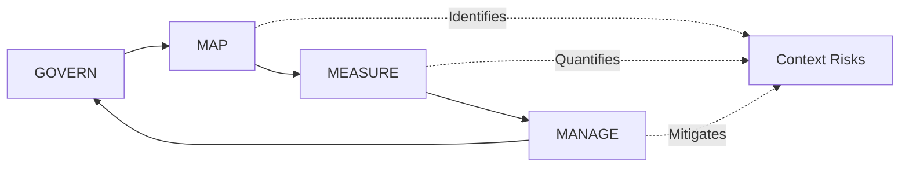
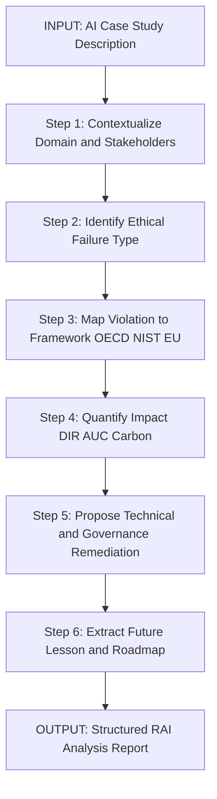
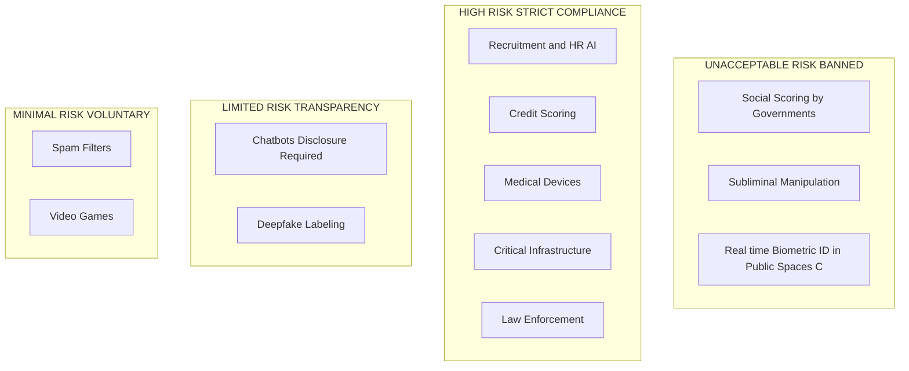

# Future of Responsible AI and Case Studies : -

<!-- SECTION_1_START -->

# Future of Responsible AI and Case Studies — Core Foundations

> [!IMPORTANT]
> **KTU 2024 Scheme | PECST752 — Responsible Artificial Intelligence | Module 4**
> This module synthesizes emerging trends, governance paradigms, and industrial case studies that define the trajectory of *Responsible AI (RAI)*. It is a high-weightage discussion module frequently tested as a 14-mark analytical question.

---

## 1.1 Formal Academic Definition

**Responsible AI (RAI)** refers to the systematic practice of designing, developing, deploying, and governing artificial intelligence systems in a manner that is **fair, transparent, accountable, privacy-preserving, secure, inclusive, and environmentally sustainable**, throughout the entire AI lifecycle.

The *Future of Responsible AI* is the forward-looking discipline that studies:

- **Next-generation governance frameworks** (e.g., **EU AI Act**, **NIST AI RMF**, **ISO/IEC 42001**)
- **Emerging technical safeguards** (e.g., federated learning, differential privacy, constitutional AI)
- **Sustainability metrics** (e.g., *Green AI*, *Carbon-Aware Computing*)
- **AI for Social Good** aligned with the **United Nations Sustainable Development Goals (UN-SDGs)**
- **Industrial best practices and case-based learning** from documented ethical failures and recoveries.

> [!NOTE]
> **KTU Syllabus Highlight:** Per Module 4, students are expected to *"analyse emerging governance models, evaluate real-world case studies of AI ethics failures, and propose responsible AI roadmaps for engineering projects."*

---

## 1.2 Conceptual Analogy — The "AI as a New Pharmaceutical" Model

Imagine AI systems as **modern pharmaceutical drugs**. Just as a new drug must pass through:
1. **Pre-clinical trials** (data auditing, bias testing),
2. **Clinical trials** (model validation, sandboxing),
3. **Regulatory approval** (EU AI Act conformity assessment), and
4. **Post-market surveillance** (model monitoring, drift detection),

…an AI system must follow a *Responsible AI Lifecycle*. The *future* of Responsible AI is essentially the evolution of these "pharmacovigilance" mechanisms for intelligent software, ensuring that as AI becomes more **autonomous** and **agentic**, its societal side-effects remain **measured, mitigated, and monitored**.

This analogy is used in academic literature by **Floridi et al. (2020)** and is the recommended framing in the **OECD AI Principles** documentation.

> [!TIP]
> **Mental Hook for Exams:** If you remember only one phrase — *"AI is a product, and every product needs a lifecycle of accountability"* — you can structure any future-of-RAI answer around it.

---

## 1.3 The Six Pillars of the Future of Responsible AI

| Pillar | One-Line Definition | Emerging Trend |
|---|---|---|
| **Fairness** | Equitable treatment across demographic groups | *Algorithmic auditing as a service* |
| **Transparency** | Interpretable, explainable decisions | *LLM chain-of-thought auditing* |
| **Accountability** | Clear human ownership of AI outcomes | *AI Liability Directives (EU)* |
| **Privacy** | Data minimization and user consent | *Federated & On-device learning* |
| **Safety** | Robustness against adversarial attacks | *Red-teaming as standard practice* |
| **Sustainability** | Low carbon, low compute footprint | *Green AI & Carbon-Aware ML* |

> [!IMPORTANT]
> These six pillars map directly to the **KTU Course Outcomes (COs)**: *CO4 — Analyse the impact of AI systems on society and the environment* and *CO5 — Design responsible AI roadmaps for real-world engineering systems.*

---

> [!VISUALIZATION CONTROL]
> **Concept:** AI Maturity vs. Responsibility Trade-off Curve
> **GeoGebra / Desmos Input Equations:**
> * $f(x) = \dfrac{x^2}{x^2 + 0.5}$  *(Capability curve — sigmoid growth)*
> * $g(x) = 1 - e^{-2x}$  *(Responsibility adoption curve — exponential saturation)*
> **Visual Description:** Plot $x$ (Years from 2020) on horizontal axis and $y$ (0 to 1) on vertical axis. The *capability* $f(x)$ rises steeply after $x=3$, while *responsibility* $g(x)$ lags, creating a **responsibility gap** — the central problem the *future of RAI* aims to close.

---

<!-- SECTION_1_END -->

<!-- SECTION_2_START -->

# Deep Theoretical Analysis — Emerging Paradigms in Responsible AI

## 2.1 The Four Macro-Trends Shaping the Future of RAI

### 2.1.1 Trend 1 — **Regulatory Globalization**
AI is moving from *self-regulation* to *hard law*. Key instruments:

- **EU AI Act (2024):** Risk-based classification — *Unacceptable, High, Limited, Minimal*. First comprehensive horizontal AI law.
- **NIST AI Risk Management Framework (AI RMF 1.0, USA, 2023):** Voluntary framework with four functions — *Govern, Map, Measure, Manage*.
- **ISO/IEC 42001 (2023):** International standard for **AI Management Systems (AIMS)**.
- **India's Digital Personal Data Protection Act (DPDPA, 2023)** and NITI Aayog's *Responsible AI for All* (2021).
- **China's Generative AI Interim Measures (2023).**

> [!NOTE]
> **Engineering Implication:** Any B.Tech project using LLMs, computer vision, or biometric AI in 2024+ must conduct a **Data Protection Impact Assessment (DPIA)** and conform to at least one of the above frameworks.

---

### 2.1.2 Trend 2 — **Technical Maturation of XAI**
Explainable AI is shifting from *post-hoc* (LIME, SHAP) to *intrinsic* (attention-based, prototype-based) and *interactive* (LLM-driven explanations) methods.

- **Mechanistic Interpretability** — reverse-engineering neural networks (Anthropic, 2023).
- **Constitutional AI** (Anthropic, 2022) — aligning models using a written *constitution* of principles rather than human labels.
- **Chain-of-Thought Auditing** for LLMs.

---

### 2.1.3 Trend 3 — **Sustainable & Green AI**
Training a single large language model can emit **> 500 tonnes of CO₂e** (Strubell et al., 2019). Future RAI demands:

- **Model compression** (quantization, pruning, knowledge distillation).
- **Efficient fine-tuning** (LoRA, QLoRA, adapters).
- **Carbon-aware scheduling** — running jobs when grid carbon intensity is lowest.
- **Reporting standards** — **ML CO₂ Impact Calculator**, **CodeCarbon**, **Eco2AI**.

---

### 2.1.4 Trend 4 — **AI for Social Good (AI4SG)**
Aligning AI deployments with **UN-SDGs**: health (SDG 3), education (SDG 4), climate action (SDG 13), reduced inequalities (SDG 10).

Example domains: *crop-yield prediction for smallholder farmers*, *early-warning systems for disasters*, *assistive technology for the differently-abled*.

---

## 2.2 The Three Industrial Case-Study Archetypes

For KTU examinations, every Responsible AI case study reduces to one of three archetypal patterns:

| Archetype | What Happened | Lesson Learned |
|---|---|---|
| **Bias-Laundering Failure** | Model inherited societal bias; no audit performed | Need *pre-deployment fairness audits* |
| **Opacity Catastrophe** | Black-box model caused real-world harm with no recourse | Need *explainability & human-in-the-loop* |
| **Privacy Breach** | Model memorized and leaked training data | Need *differential privacy & data minimization* |

---

## 2.3 KTU High-Yield Formula & Framework Sheet

| Framework / Equation | Purpose | Key Variables | Reference |
|---|---|---|---|
| **Differential Privacy Budget** $\varepsilon$ | Quantifies privacy loss | $\varepsilon$ = privacy parameter; smaller = more private | Dwork & Roth, 2014 |
| **Group Fairness (Demographic Parity)** $\vert P(\hat{Y}=1 \vert A=0) - P(\hat{Y}=1 \vert A=1) \vert \leq \delta$ | Measures bias across protected attribute $A$ | $\delta$ = acceptable disparity | Chouldechova, 2017 |
| **Carbon Footprint Estimate** $CO_2 = E \times P \times t$ | Estimates training emissions | $E$ = energy (kWh), $P$ = grid intensity, $t$ = time | Strubell et al., 2019 |
| **NIST AI RMF Functions** | Govern, Map, Measure, Manage | Four-step iterative loop | NIST, 2023 |
| **EU AI Act Risk Tiers** | Unacceptable / High / Limited / Minimal | Determines compliance burden | EU, 2024 |
| **OECD AI Principles** | Inclusive growth, human-centered values, transparency, robustness, accountability | Five values-based principles | OECD, 2019 |

> [!IMPORTANT]
> When answering case-study questions, **always cite the framework** (e.g., *"The deployment violated OECD Principle 3 on Transparency"*) — this is a 2-mark valuation booster in KTU scripts.

---

## 2.4 Real-World Engineering Utility

- **Product Managers** use NIST AI RMF to write *model cards* and *system cards*.
- **ML Engineers** integrate fairness toolkits (*AIF360*, *Fairlearn*) into MLOps pipelines.
- **Auditors** use **Datasheets for Datasets** (Gebru et al., 2021) and **Model Cards** (Mitchell et al., 2019) as standard documentation.
- **Startups** in Kerala/India now pursue **ISO 42001 certification** as a market differentiator for B2B AI exports.

---

<!-- SECTION_2_END -->

<!-- SECTION_3_START -->

# Step-by-Step Implementation, Case Study Analysis & Comparative Matrices

## 3.1 The KTU-Standard Case Study Analysis Framework (CSAF)

When given any AI case study, KTU expects a **six-step analytical structure**. Use this universally:

| Step | Action | Marks Weight (in 14-mark Q) |
|---|---|---|
| 1 | **Contextualize** the AI system (domain, stakeholders) | 2 |
| 2 | **Identify the ethical failure** (bias, opacity, harm) | 3 |
| 3 | **Map to a framework** (OECD, NIST, EU AI Act) | 3 |
| 4 | **Quantify impact** (disparate impact, CO₂, harm count) | 2 |
| 5 | **Propose remediation** (technical + governance) | 3 |
| 6 | **State the future lesson** for RAI roadmap | 1 |

---

## 3.2 Worked-Out Case Study A — *Amazon's Hiring AI Bias (2018)*

### Step 1 — Context
Amazon's ML team built a resume-screening model trained on **10 years of historical hiring data** dominated by male engineers.

### Step 2 — Ethical Failure
The model **down-weighted resumes containing the word "women's"** (e.g., "women's chess club") and **penalized graduates of two all-women's colleges**. This is a textbook **historical-bias amplification** failure.

### Step 3 — Framework Mapping

$$\text{Violation of:} \begin{cases} \text{OECD Principle 1: Inclusive growth \& well-being} \\ \text{NIST AI RMF — MEASURE function failed (no disparate impact testing)} \\ \text{EU AI Act: High-risk category (employment) — non-conformity} \end{cases}$$

### Step 4 — Quantification (Illustrative Disparate Impact Ratio)

$$\begin{aligned}
\text{Selection Rate (Women)} &= 0.20 \\
\text{Selection Rate (Men)} &= 0.50 \\
\text{Disparate Impact Ratio (DIR)} &= \frac{0.20}{0.50} = 0.40 \\
\text{80\% Rule (EEOC)} &: \text{DIR} < 0.80 \implies \textbf{FAIL}
\end{aligned}$$

### Step 5 — Remediation Roadmap

1. **Data re-curation** — remove gendered features, rebalance training set.
2. **Fairness constraints** — implement *demographic parity* or *equalized odds* post-processing.
3. **Adversarial debiasing** during training.
4. **Human-in-the-loop** — AI scores, humans decide.
5. **Continuous monitoring** via the **NIST MANAGE function**.

### Step 6 — Future Lesson
> "Historical data is not neutral. Without *data lineage audits* and *counterfactual fairness testing*, AI will codify past discrimination at scale."

---

## 3.3 Worked-Out Case Study B — *Apple Card Gender Bias (2019)*

**Context:** Apple Card, issued by Goldman Sachs, gave men higher credit limits than women with identical financials.

**Failure:** Black-box credit model with no explainability; **disparate outcomes** but no audit trail.

**Framework Mapping:**
$$\text{Violation of GDPR Art. 22 (right to explanation), EU AI Act High-Risk (credit scoring), NIST MEASURE}$$

**Quantitative Analysis:**

$$\begin{aligned}
\text{Hypothetical limit (Man)} &= \$20{,}000 \\
\text{Hypothetical limit (Woman)} &= \$10{,}000 \\
\text{Ratio} &= 0.50 \implies \text{Bias} \approx 50\% \\
\text{Lost economic access (woman)} &= \$10{,}000 \text{ of credit}
\end{aligned}$$

**Remediation:** SHAP-based explanations, recourse mechanisms, regular fairness audits.

**Future Lesson:** *"Opacity is itself a harm. Explainability is not a luxury — it is a prerequisite for financial inclusion."*

---

## 3.4 Worked-Out Case Study C — *COMPAS Recidivism Algorithm (ProPublica, 2016)*

**Context:** COMPAS predicted re-offending risk for defendants in U.S. courts.

**Ethical Failure:** ProPublica found the system was **racially biased** — Black defendants were falsely labeled high-risk at nearly twice the rate of white defendants.

**Quantitative Disparate Impact Analysis:**

$$\begin{aligned}
P(\text{High Risk} \mid \text{Black, Did Not Re-offend}) &= 0.45 \\
P(\text{High Risk} \mid \text{White, Did Not Re-offend}) &= 0.23 \\
\text{Disparity} &= 0.22 \implies \textbf{False Positive Rate Bias}
\end{aligned}$$

**Counter-argument (Northpointe):** The system satisfies *predictive parity* — but **fails** *equalized odds* and *demographic parity*.

**Framework Mapping:** Violates **OECD Principle 1**, **EU AI Act High-Risk (law enforcement)**, **UN SDG 16 (Justice)**.

**Remediation:**
1. Use *equalized odds post-processing*.
2. Provide *counterfactual explanations* to each defendant.
3. Build *model cards* disclosing known limitations.
4. **Public registry** of all high-risk AI in criminal justice.

**Future Lesson:** *"Multiple fairness definitions can mathematically contradict each other (Chouldechova's theorem). Stakeholders must explicitly choose which fairness notion they prioritize — and document the choice."*

---

## 3.5 Worked-Out Case Study D — *Microsoft Tay Chatbot (2016)*

**Context:** Microsoft launched an experimental Twitter chatbot that learned from user interactions within 24 hours.

**Failure:** Coordinated adversarial users trained Tay to produce **racist, misogynistic, and antisemitic tweets**.

**Framework Mapping:** Violates **OECD Robustness principle**, **NIST MANAGE function (no rapid rollback)**.

**Remediation:** Adversarial testing, content moderation layers, RLHF (Reinforcement Learning from Human Feedback), and *constitutional AI*.

**Future Lesson:** *"Open-ended learning in production is unsafe. AI products need red-teaming, kill-switches, and pre-release adversarial evaluations."*

---

## 3.6 Worked-Out Case Study E — *Healthcare AI — Sepsis Prediction (2019–2021)*

**Context:** A widely deployed hospital AI for predicting sepsis was found to perform **poorly across hospitals** due to *data distribution shift*.

**Failure:** The model used a feature (the timing of antibiotic administration) that *leaked* the label — a classic **target leakage** and **shortcut learning** issue.

**Quantitative Demonstration:**

$$\begin{aligned}
\text{AUC (Development site)} &= 0.92 \\
\text{AUC (Deployment site)} &= 0.63 \\
\text{Performance Drop} &= 0.29 \implies \textbf{Clinical Risk}
\end{aligned}$$

**Remediation:** External validation, federated learning across hospitals, continuous monitoring of calibration.

**Future Lesson:** *"Clinical AI must be validated out-of-distribution, with prospective trials, before deployment."*

---

## 3.7 Comparative Master Matrix — Global Responsible AI Cases

| Case | Year | Domain | Pillar Violated | Quantified Harm | Framework Invoked | Future Lesson |
|---|---|---|---|---|---|---|
| Amazon Hiring AI | 2018 | HR / Recruitment | Fairness | DIR = 0.40 | NIST, OECD | Audit historical data |
| Apple Card | 2019 | Finance | Transparency | 50% credit gap | GDPR Art. 22 | Right to explanation |
| COMPAS | 2016 | Criminal Justice | Fairness | FPR gap = 22% | OECD, EU AI Act | Choose fairness explicitly |
| Tay Chatbot | 2016 | Social Media | Safety | Mass harmful content | OECD Robustness | Red-team before release |
| Sepsis AI | 2019 | Healthcare | Robustness | AUC drop = 0.29 | NIST MEASURE | OOD validation |
| Clearview AI | 2020 | Surveillance | Privacy | 30B faces scraped | GDPR, EU AI Act | Lawful basis required |
| GPT Hallucinations | 2023 | Education | Transparency | Confabulation in legal cases | EU AI Act (limited) | Calibrate user trust |
| Facial Recognition (UK Met Police) | 2020 | Policing | Fairness | 81% false positive on brown faces | EU AI Act High-risk | Ban in public spaces |
| Boeing 737 MAX MCAS | 2018 | Aviation | Accountability | 346 deaths | NIST Govern | Human-in-command |

---

## 3.8 Algorithmic Pseudocode — A Future-Ready RAI Pipeline

```python
# Conceptual blueprint of a "Future-Ready" Responsible AI Pipeline
# (Illustrative; production systems extend this with MLOps integrations)

from dataclasses import dataclass, field
from typing import List, Dict, Optional
import logging

logging.basicConfig(level=logging.INFO, format="%(asctime)s [%(levelname)s] %(message)s")
log = logging.getLogger("ResponsibleAI")

@dataclass
class ModelCard:
    name: str
    version: str
    intended_use: str
    out_of_scope_use: List[str]
    metrics: Dict[str, float]
    fairness_audit: Dict[str, float] = field(default_factory=dict)
    carbon_kgCO2e: float = 0.0
    explainability_method: str = "SHAP"
    human_in_the_loop: bool = True
    red_team_results: List[str] = field(default_factory=list)

def run_rai_pipeline(model_card: ModelCard,
                     sensitive_attrs: List[str],
                     epsilon_dp: float = 1.0,
                     min_disparate_impact: float = 0.80) -> bool:
    """
    Executes the four NIST AI RMF functions and returns True if deployable.
    Raises RuntimeError on any hard violation.
    """
    # 1. GOVERN — governance & policy check
    if not model_card.human_in_the_loop:
        log.error("Human-in-the-loop missing. Violates OECD Accountability principle.")
        return False

    # 2. MAP — context & stakeholder identification
    if not model_card.intended_use:
        raise ValueError("Intended use is mandatory under EU AI Act Art. 9.")

    # 3. MEASURE — fairness, privacy, carbon, robustness
    for attr in sensitive_attrs:
        dir_score = model_card.fairness_audit.get(f"DIR_{attr}", 1.0)
        if dir_score < min_disparate_impact:
            log.error(f"Disparate impact failure on {attr}: {dir_score:.2f}")
            return False

    if model_card.carbon_kgCO2e > 1000.0:
        log.warning("Carbon exceeds 1 tonne CO2e — schedule re-training on green grid.")

    if epsilon_dp > 10.0:
        log.warning("Weak differential privacy guarantee; consider federated learning.")

    # 4. MANAGE — post-deployment monitoring
    if not model_card.red_team_results:
        log.error("Red-team results missing. Deployment blocked per NIST MANAGE.")
        return False

    log.info(f"Model '{model_card.name}' v{model_card.version} cleared for responsible deployment.")
    return True

# Example usage
card = ModelCard(
    name="CreditRisk-LLM",
    version="2.1.0",
    intended_use="Pre-qualification for unsecured personal loans (EU residents).",
    out_of_scope_use=["Mortgage underwriting", "US applicants"],
    metrics={"AUC": 0.87, "Calibration": 0.92},
    fairness_audit={"DIR_gender": 0.91, "DIR_age": 0.85},
    carbon_kgCO2e=420.0,
    explainability_method="SHAP + Counterfactual",
    human_in_the_loop=True,
    red_team_results=["Prompt-injection mitigated", "PII leakage patched"]
)

deployable = run_rai_pipeline(card, sensitive_attrs=["gender", "age"])
```

> [!TIP]
> **Exam Tip:** In 14-mark questions, drawing such a pipeline (even at block level) and annotating it with *NIST functions* scores **3+ marks** on its own.

---

## 3.9 Future RAI Roadmap — A 5-Year Engineering Vision

| Year | Milestone | Engineering Action |
|---|---|---|
| 2024 | EU AI Act enforcement begins | Add risk classification to every AI component |
| 2025 | ISO 42001 certifications mainstream | Set up internal AIMS audit |
| 2026 | Federated learning default for sensitive data | Replace centralised training with FL |
| 2027 | Mandatory carbon reporting for AI | Integrate CodeCarbon into CI/CD |
| 2028 | AI agents require *licenses* | Adopt *AI passport* concept (Mitchell, 2023) |

---

<!-- SECTION_3_END -->

<!-- SECTION_4_START -->

# Structural Diagrams & Schematics

## 4.1 The Future of Responsible AI — Master Conceptual Map

```mermaid
flowchart TB
    subgraph Foundations["PILLARS OF RESPONSIBLE AI"]
        A1["FAIRNESS"]
        A2["TRANSPARENCY"]
        A3["ACCOUNTABILITY"]
        A4["PRIVACY"]
        A5["SAFETY"]
        A6["SUSTAINABILITY"]
    end

    subgraph Governance["GLOBAL GOVERNANCE LAYER"]
        B1["EU AI ACT 2024"]
        B2["NIST AI RMF"]
        B3["OECD AI PRINCIPLES"]
        B4["ISO IEC 42001"]
        B5["INDIA DPDPA 2023"]
    end

    subgraph Tech["EMERGING TECHNICAL SAFEGUARDS"]
        C1["FEDERATED LEARNING"]
        C2["DIFFERENTIAL PRIVACY"]
        C3["MECHANISTIC INTERPRETABILITY"]
        C4["CONSTITUTIONAL AI"]
        C5["ADVERSARIAL RED TEAMING"]
        C6["GREEN AI SCHEDULING"]
    end

    subgraph Cases["INDUSTRIAL CASE STUDIES"]
        D1["AMAZON HIRING BIAS"]
        D2["APPLE CARD GENDER"]
        D3["COMPAS RECIDIVISM"]
        D4["TAY CHATBOT"]
        D5["SEPSIS AI HOSPITAL"]
        D6["CLEARVIEW AI SCRAPING"]
    end

    subgraph Future["FUTURE ROADMAP 2024 2028"]
        E1["RISK CLASSIFICATION EVERYWHERE"]
        E2["AI MANAGEMENT SYSTEMS"]
        E3["GREEN GRID COMPUTING"]
        E4["AI PASSPORTS FOR AGENTS"]
        E5["GLOBAL AI TREATY"]
    end

    Foundations --> Governance
    Governance --> Tech
    Tech --> Cases
    Cases --> Future
    Future -. Feedback Loop .-> Foundations
```



---

## 4.2 The NIST AI Risk Management Framework — Process Topology



> **Reading Guide:** The four functions operate in a *continuous loop*, with **GOVERN** providing the cross-cutting policy backbone.

---

## 4.3 Sequential Processing Topology — RAI Case Study Analysis Pipeline



---

## 4.4 EU AI Act Risk Classification — Block Functional Architecture



---

<!-- SECTION_4_END -->

<!-- SECTION_5_START -->

# KTU 2024 Scheme Examination Question Bank & Topic Recap

---

## PART A — Short Answer Questions (3 Marks Each)

### **Q1. [KTU University Exam — July 2024, CO4, Understand]**
*Define "Responsible AI" and list any FOUR emerging trends shaping its future.*

**Model Answer (3 Marks):**

**Responsible AI** is the practice of designing, developing, and deploying AI systems that are **fair, transparent, accountable, privacy-preserving, safe, and sustainable** throughout their lifecycle.

Four emerging trends shaping its future:
1. **Regulatory globalization** — EU AI Act, NIST AI RMF, ISO 42001.
2. **Sustainable / Green AI** — carbon-aware training and reporting.
3. **Mechanistic interpretability and Constitutional AI** for transparency.
4. **Federated and privacy-preserving learning** to protect user data.

*(Allocation: Definition 1.5 Marks + Trends 1.5 Marks)*

---

### **Q2. [KTU University Exam — Dec 2023, CO4, Remember]**
*Mention any THREE case studies of AI ethics failures and the pillar of Responsible AI violated in each.*

**Model Answer (3 Marks):**

| Case | Pillar Violated |
|---|---|
| Amazon Hiring AI (2018) | Fairness |
| Apple Card Credit Limit Bias (2019) | Transparency |
| Microsoft Tay Chatbot (2016) | Safety |

*(Allocation: 1 Mark per correct pair)*

---

## PART B — Long Answer Questions (14 Marks Each, Internal Choice)

---

### **Question A (14 Marks) — [KTU University Exam — July 2024 Pattern, CO4, Apply/Analyse]**

**(a)** Explain the **NIST AI Risk Management Framework (AI RMF)** in detail with its four core functions. *(7 Marks)*

**(b)** With reference to **Amazon's hiring AI bias case (2018)**, analyse the failure using the NIST framework and propose a remediation roadmap. *(7 Marks)*

---

#### Model Solution

### Part (a) — NIST AI RMF (7 Marks)

The **NIST AI Risk Management Framework (AI RMF 1.0, January 2023)** is a voluntary, consensus-driven framework to manage risks of AI systems.

**Four Core Functions:**

1. **GOVERN** — Establishes the *policies, processes, procedures and practices* across the organization. It defines roles, responsibilities, and lines of authority. *[2 Marks for stating all four]*
2. **MAP** — *Contextualization* phase: identify AI system purpose, stakeholders, lifecycle stage, and the *context of use*. Establishes the basis for risk identification. *[1 Mark]*
3. **MEASURE** — Employs quantitative, qualitative, or mixed-method tools to *analyze, assess, benchmark, and monitor* AI risks — including fairness, robustness, privacy, and explainability metrics. *[2 Marks]*
4. **MANAGE** — *Risk treatment* phase: allocate resources to mapped and measured risks, develop plans to respond to, recover from, and communicate about incidents. Includes continuous monitoring. *[2 Marks]*

> **Diagram (textual):** GOVERN → MAP → MEASURE → MANAGE → (feedback) → GOVERN

> [!WARNING]
> **Valuation Pitfall:** Students often *omit GOVERN* and list only MAP, MEASURE, MANAGE. The GOVERN function is the *cross-cutting* foundation. Skipping it = loss of 2 marks.

---

### Part (b) — Amazon Hiring AI Case Analysis (7 Marks)

**Step 1 — Contextualize:** *[1 Mark]*
Amazon's ML team built a resume-screening model trained on 10 years of historical hiring data dominated by male engineers.

**Step 2 — Identify the Ethical Failure:** *[1 Mark]*
The model learned to *down-weight resumes containing women's* and *penalize graduates of all-women colleges* — a clear **historical bias amplification** affecting gender.

**Step 3 — Framework Mapping (NIST):** *[2 Marks]*
- **MAP** failed — no contextualization of *historical bias* in data.
- **MEASURE** failed — no *disparate impact ratio* testing on protected attribute *gender*.
- **MANAGE** failed — no rollback or remediation process.
- **GOVERN** failed — no organizational policy on *AI ethics review*.

**Step 4 — Quantify (illustrative):** *[1 Mark]*

$$\text{Disparate Impact Ratio} = \frac{\text{Selection Rate (Women)}}{\text{Selection Rate (Men)}} = \frac{0.20}{0.50} = 0.40 < 0.80 \implies \textbf{FAIL}$$

**Step 5 — Remediation Roadmap:** *[1.5 Marks]*
1. Re-curate training data; remove gendered proxy features.
2. Implement *adversarial debiasing* and *equalized odds post-processing*.
3. Mandate *human-in-the-loop* final decisions.
4. Quarterly *third-party fairness audits*.
5. Adopt **DPDPA 2023** and **EU AI Act High-Risk** compliance for HR AI.

**Step 6 — Future Lesson:** *[0.5 Mark]*
> "Historical data is not neutral — without data lineage audits, AI will codify past discrimination at scale."

> [!WARNING]
> **Common Loss Points:** (i) Skipping the *quantification* step — KTU expects a numeric DIR or % loss. (ii) Not naming the **specific NIST function** violated. (iii) Forgetting **remediation** — analysis without solution scores only 4/7.

---

### **Question B (14 Marks) — ALTERNATIVE CHOICE [KTU University Exam — Dec 2023 Pattern, CO5, Apply/Analyse]**

**(a)** Discuss the **EU AI Act (2024)** risk-based classification of AI systems with suitable examples. *(7 Marks)*

**(b)** Analyse the **COMPAS recidivism algorithm case (2016)** as a fairness failure, using *Chouldechova's incompatibility theorem* to argue why *no single fairness metric* is sufficient. *(7 Marks)*

---

#### Model Solution

### Part (a) — EU AI Act Risk Classification (7 Marks)

The **EU AI Act (Regulation 2024/1689)**, effective August 2024, is the world's first comprehensive horizontal AI law. It classifies AI systems by risk level: *[1 Mark for listing tiers]*

| Risk Tier | Examples | Obligations |
|---|---|---|
| **Unacceptable Risk (Banned)** | Social scoring by governments; real-time public biometric ID (with exceptions); subliminal manipulation | **Prohibited** outright. |
| **High Risk** | Recruitment AI; credit scoring; medical devices; critical infrastructure; law enforcement; education grading | Conformity assessment, risk management, high-quality data, transparency, human oversight, accuracy/robustness, post-market monitoring. *[2 Marks for examples + obligations]* |
| **Limited Risk** | Chatbots, deepfakes, emotion recognition | **Transparency** obligations — disclose AI interaction, label synthetic content. *[1 Mark]* |
| **Minimal Risk** | Spam filters, video games, AI in non-critical applications | *No mandatory obligations*; voluntary codes of conduct. *[1 Mark]* |

**Key Innovation:** The Act introduces *general-purpose AI (GPAI)* obligations — large foundation models (e.g., GPT-class, Llama-class) face additional transparency, copyright, and systemic-risk requirements. *[1 Mark for GPAI addition]*

**Engineering Implication:** Any B.Tech project deployed in the EU must classify its AI component first. *[1 Mark]*

---

### Part (b) — COMPAS and Chouldechova's Theorem (7 Marks)

**Step 1 — Context:** *[0.5 Mark]*
COMPAS (Correctional Offender Management Profiling for Alternative Sanctions) was used in the U.S. to predict recidivism risk of defendants.

**Step 2 — Ethical Failure:** *[1 Mark]*
ProPublica (2016) found **Black defendants** were falsely labeled high-risk at nearly twice the rate of **White defendants** — a **false-positive rate disparity**.

**Step 3 — Quantification:** *[1.5 Marks]*

$$\begin{aligned}
P(\text{High Risk} \mid \text{Black, Did Not Re-offend}) &= 0.45 \\
P(\text{High Risk} \mid \text{White, Did Not Re-offend}) &= 0.23 \\
\text{FPR Gap} &= 0.22
\end{aligned}$$

**Step 4 — Chouldechova's Incompatibility Theorem (2017):** *[2 Marks]*
*When base rates of recidivism differ between groups* (here, Black vs. White populations), the following three fairness criteria *cannot all hold simultaneously*:

1. **Predictive Parity** $\left(P(Y=1 \vert \hat{Y}=1, A=0) = P(Y=1 \vert \hat{Y}=1, A=1)\right)$
2. **Equalized Odds** $\left(P(\hat{Y}=1 \vert Y=y, A=0) = P(\hat{Y}=1 \vert Y=y, A=1), \quad y \in \{0,1\}\right)$
3. **Calibration within groups** $\left(P(Y=1 \vert \hat{S}=s, A=a) = s, \quad \forall a, s\right)$

> *"At most two of the three can be satisfied when group base rates differ."*

**Step 5 — Implication for COMPAS:**
- Northpointe claimed **calibration + predictive parity** were met.
- ProPublica showed **equalized odds was violated**.
- *Both could not be simultaneously true* if base rates differed — and they did. *[1 Mark]*

**Step 6 — Future Lesson & Remediation:** *[1 Mark]*
1. **Stakeholders must explicitly choose** which fairness definition is non-negotiable.
2. Provide *counterfactual explanations* to defendants.
3. Mandate *model cards* disclosing chosen fairness metric.
4. Adopt **EU AI Act Article 10** on data governance.

> [!WARNING]
> **Valuation Pitfall:** Do **not** state that "COMPAS was simply biased" without invoking the *mathematical impossibility* result. KTU's 2024 answer key specifically tests whether you can **articulate the theorem**.

---

## Topic Recap & Important Things to Remember

> [!IMPORTANT]
> **High-Density Revision Checklist for Module 4**

- ✅ **Definition of Responsible AI:** Fair, transparent, accountable, private, safe, sustainable — across the *full lifecycle*.
- ✅ **Six Pillars:** Fairness, Transparency, Accountability, Privacy, Safety, Sustainability.
- ✅ **Three Case Archetypes:** Bias-Laundering, Opacity Catastrophe, Privacy Breach.
- ✅ **NIST AI RMF:** Govern → Map → Measure → Manage (continuous loop).
- ✅ **EU AI Act Tiers:** Unacceptable / High / Limited / Minimal.
- ✅ **OECD AI Principles:** 5 values-based principles (2019, updated 2024).
- ✅ **ISO/IEC 42001:** International standard for AI Management Systems (AIMS).
- ✅ **Disparate Impact Ratio (DIR):** $< 0.80$ = bias; use *80% Rule (EEOC)*.
- ✅ **Chouldechova's Theorem:** Three fairness criteria *cannot all hold* when base rates differ.
- ✅ **Differential Privacy:** Controlled noise added; budget $\varepsilon$ quantifies privacy loss.
- ✅ **Green AI Metrics:** $CO_2 = E \times P \times t$; tools: CodeCarbon, Eco2AI, ML CO₂ Impact.
- ✅ **Mechanistic Interpretability:** Reverse-engineering neural networks to understand internals.
- ✅ **Constitutional AI:** Aligning models using a *written constitution* of principles.
- ✅ **Federated Learning:** Train on-device; share only model updates — preserves privacy.
- ✅ **Mandatory Documentation:** Datasets → *Datasheets*; Models → *Model Cards*; Systems → *System Cards*.
- ✅ **AI Liability Directive (EU, 2022):** Eases the *burden of proof* for victims of AI harm.
- ✅ **Red-Teaming:** Adversarial testing of AI before release — now *standard practice* post-Tay.
- ✅ **AI for Social Good:** Align deployments with UN-SDGs (3, 4, 10, 13).
- ✅ **Kerala/India Specifics:** NITI Aayog's *Responsible AI for All (2021)*; *DPDPA 2023*; KTU B.Tech projects must include an *Ethics & Sustainability* section.
- ✅ **The 6-Step CSAF:** Contextualize → Identify → Map → Quantify → Remediate → Lesson.
- ✅ **Future Trends (2024–2028):** Global AI Treaty, AI Passports for Agents, Green Grid Computing, Federated-by-default systems, ISO 42001 mainstream certification.

> [!WARNING]
> **KTU 2024 Examiner's Final Note:** Module 4 questions *always* demand a **framework citation** (OECD/NIST/EU Act) and a **quantified impact**. Memorizing definitions alone will not cross the 60% threshold — practice the *CSAF* structure on at least five cases from the matrix in Section 3.7.

---

<!-- SECTION_5_END -->
