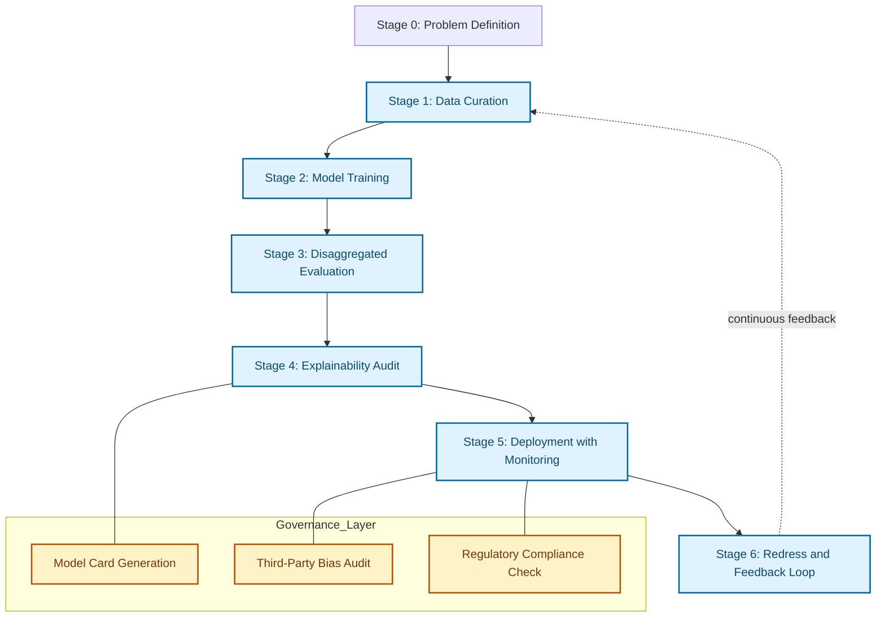
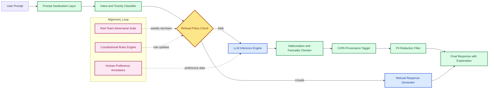

# Vision, Natural Language Processing.

<!-- SECTION_1_START -->
# Vision and Natural Language Processing in Responsible AI

## 1.1 Core Technical Definition

### Computer Vision (CV) in Responsible AI Context
**Computer Vision (CV)** is a multidisciplinary field of Artificial Intelligence that enables machines to interpret, analyze, and derive meaningful information from digital images, videos, and other visual inputs. In the KTU 2024 *Responsible AI* framework, Computer Vision is treated as a high-stakes perception system that must be engineered to operate with **fairness**, **accountability**, **transparency**, and **privacy-preservation** throughout the entire ML pipeline — from dataset construction to deployment.

### Natural Language Processing (NLP) in Responsible AI Context
**Natural Language Processing (NLP)** is the subfield of AI concerned with the interaction between computers and human language, encompassing tasks such as text classification, machine translation, question answering, named entity recognition, and large language model (LLM) inference. Within *Responsible AI*, NLP must address **linguistic bias**, **toxicity**, **hallucination**, **disinformation risk**, and **cultural representation** to prevent algorithmic harm at societal scale.

> [!IMPORTANT]
> **KTU 2024 Syllabus Highlight (Module 4):** The future of Responsible AI emphasizes *domain-specific* ethical risk analysis. Vision and NLP are treated as the two highest-impact application surfaces because they interact directly with **biometric identity**, **autonomous decisioning**, **public discourse**, and **generative media**.

---

## 1.2 Conceptual Analogy / Intuition

### Computer Vision — "The Lens with a Conscience"
Imagine a security camera at an airport. A *conventional* CV system simply asks: *"Whose face is this?"* A *Responsible* CV system additionally asks:
- *Was every demographic group equally represented in the training data?*
- *Does the model disclose to the passenger that biometric processing is occurring?*
- *Can a regulator audit the decision pathway leading to a flagged identity?*

In short, Responsible CV is a **lens with a conscience** — it does not just *see*, it sees *fairly, accountably, and transparently*.

### NLP — "The Translator with Accountability"
Think of a multilingual customer-service chatbot. A conventional NLP system translates and responds. A *Responsible* NLP system:
- Flags when a query lies outside its **knowledge boundary** rather than hallucinating.
- Detects and refuses to amplify **toxic, hateful, or manipulative** content.
- Provides **source attribution** for factual claims to combat disinformation.
- Performs **counterfactual fairness** checks so that identical intents across dialects (e.g., Indian English vs. American English) receive equivalent service quality.

> [!NOTE]
> **Key Insight:** In KTU's Responsible AI framing, both Vision and NLP systems are evaluated along three axes — *(a) Technical Robustness, (b) Ethical Alignment, (c) Sociotechnical Governance.* Negligence on any axis invalidates deployment under the **EU AI Act**, **India's Digital Personal Data Protection Act (DPDPA) 2023**, and the **NIST AI Risk Management Framework (AI RMF 1.0)**.

---

## 1.3 Physical Constants and Standard Metrics

| Metric Domain | Standard Metric | Target Value (Industry Baseline) |
|---|---|---|
| Fairness (Vision) | **Equalized Odds Difference** | $\le 0.05$ |
| Fairness (NLP) | **Demographic Parity Gap** | $\le 0.10$ |
| Robustness (Vision) | **Adversarial Accuracy Drop** | $\le 10\%$ under $L_2 \le 4/255$ |
| Robustness (NLP) | **Toxicity Classifier False Negative Rate** | $\le 0.05$ |
| Transparency | **Model Card Coverage** | $100\%$ of production models |
| Privacy | **Differential Privacy $\epsilon$ Budget** | $\epsilon \le 1.0$ for biometric data |

> [!WARNING]
> **Constants for Vision/NLP:** No universal physical constants exist; instead, *governance thresholds* (such as $\epsilon$ for differential privacy or the Equalized Odds threshold) function as the operational equivalents. KTU examiners expect these to be cited in Part B answers.

---

## 1.4 GeoGebra / Desmos Integration

> [!VISUALIZATION CONTROL]
> **Concept:** Decision Boundary Shift under Demographic Skew
> **GeoGebra / Desmos Input Equations:**
> * `f_main(x) = (1/(1+exp(-(x-0))))`
> * `f_skewed(x) = (1/(1+exp(-(x+1.5))))`
> * `x = 0` (decision threshold)
> **Visual Description:** A logistic decision boundary for the *majority* group (centered at $x=0$) compared with a *skewed* boundary for an *underrepresented* group (shifted to $x=-1.5$). The horizontal gap visually represents the **Equalized Odds Difference** — students should observe that identical inputs receive different classification outcomes across demographic slices, which is the textbook signature of **algorithmic bias** in both Vision (e.g., facial recognition) and NLP (e.g., sentiment classifiers).

---

<!-- SECTION_1_END -->

<!-- SECTION_2_START -->
# Deep Theoretical Analysis & KTU High-Yield Formula Sheet

## 2.1 Operational Decomposition — Computer Vision (Responsible Pipeline)

A Responsible Computer Vision pipeline is decomposed into **six sequential stages**, each carrying distinct ethical obligations.

1. **Data Curation Stage**
   * **Why it matters:** Bias enters the model primarily through the training set. A face dataset overrepresenting light-skinned male faces yields a recognizer with degraded accuracy on darker-skinned female faces (the *Gender Shades* finding by Buolamwini & Gebru, 2018).
   * **How to mitigate:** Stratified sampling, synthetic data augmentation, demographic metadata auditing, and consent verification for every image.

2. **Model Architecture Stage**
   * **Why it matters:** Architectures with millions of parameters are inherently *opaque* (black-box).
   * **How to mitigate:** Adopt **Explainable AI (XAI)** primitives — Grad-CAM, Saliency Maps, Attention Rollout — that produce a heatmap indicating which pixels drove the prediction.

3. **Pre-Deployment Evaluation Stage**
   * **Why it matters:** Aggregate metrics (e.g., overall accuracy) mask subgroup disparities.
   * **How to mitigate:** Compute **disaggregated evaluation** across intersections of *gender, age, skin tone (Fitzpatrick scale), disability status, and geocultural context*.

4. **Deployment Stage**
   * **Why it matters:** Real-world distribution shift degrades fairness over time.
   * **How to mitigate:** Continuous monitoring, model drift detection, and **shadow-mode evaluation** before promoting any update.

5. **Post-Deployment Audit Stage**
   * **Why it matters:** Accountability requires independent review.
   * **How to mitigate:** Third-party audits, red-team adversarial probing, and public **Model Cards** (per Mitchell et al., 2019).

6. **Redress & Feedback Stage**
   * **Why it matters:** Affected individuals must have a remedy pathway.
   * **How to mitigate:** Human-in-the-loop override, explainable denials, and an appeal channel.

---

## 2.2 Operational Decomposition — NLP (Responsible Pipeline)

The Responsible NLP pipeline mirrors CV but introduces additional linguistic and cultural dimensions.

1. **Corpus Curation Stage**
   * Sources must be licensed, consented, and diverse across dialects, registers, and low-resource languages.
   * The **ROOTS** corpus (used in BLOOM) is the canonical Responsible NLP benchmark for transparency.

2. **Pre-Processing Stage**
   * **Why it matters:** Tokenizers often encode racial and gender biases. For instance, BPE tokenizers fragment names from non-Western cultures into more sub-tokens than Western names, increasing the *computational cost* (and hence *latent invisibility*) of marginalized identities.
   * **How to mitigate:** Use **fairness-aware tokenization** and document the **Tokenization Parity Ratio**.

3. **Training & Fine-Tuning Stage**
   * Apply **RLHF (Reinforcement Learning from Human Feedback)** with diverse annotator pools.
   * Embed **Constitutional AI** principles (per Anthropic, 2022) directly into the loss function.

4. **Safety Filtering Stage**
   * Deploy classifiers for **toxicity**, **PII leakage**, **hallucination**, and **prompt injection**.
   * Maintain a *refusal policy* grounded in operational values (e.g., medical, legal, financial disclaimers).

5. **Attribution & Provenance Stage**
   * Tag generated content with **C2PA (Coalition for Content Provenance and Authenticity)** metadata to combat deepfakes and disinformation.

6. **Continuous Red-Teaming Stage**
   * Adversarial prompt libraries must be expanded weekly; red-team findings are fed back into the alignment loop.

---

## 2.3 KTU Formula Sheet / Cheat Sheet

| # | Concept | Formula / Expression | Domain | Unit / Threshold |
|---|---|---|---|---|
| 1 | Equalized Odds | $\Pr(\hat{Y}=1 \mid Y=1, A=a) = \Pr(\hat{Y}=1 \mid Y=1, A=b)$ | CV / NLP classification | Difference $\le 0.05$ |
| 2 | Demographic Parity | $\Pr(\hat{Y}=1 \mid A=a) = \Pr(\hat{Y}=1 \mid A=b)$ | CV / NLP classification | Gap $\le 0.10$ |
| 3 | Counterfactual Fairness | $\hat{Y}_{A \leftarrow a}(X) = \hat{Y}_{A \leftarrow b}(X)$ | CV / NLP | Exact equality |
| 4 | Disparate Impact (4/5 Rule) | $DI = \frac{\Pr(\hat{Y}=1 \mid A=\text{unprivileged})}{\Pr(\hat{Y}=1 \mid A=\text{privileged})} \ge 0.8$ | CV / NLP | $DI \ge 0.8$ |
| 5 | Differential Privacy (Laplace) | $\mathcal{M}(D) = f(D) + \text{Lap}\!\left(\frac{\Delta f}{\epsilon}\right)$ | Privacy (CV/NLP) | $\epsilon \le 1.0$ |
| 6 | Adversarial Accuracy | $\text{Acc}_{\text{adv}} = \frac{1}{N}\sum_{i=1}^{N} \mathbb{1}[f(x_i + \delta_i) = y_i]$ | CV robustness | $\ge 0.90$ |
| 7 | Toxicity FNR | $\text{FNR}_{\text{tox}} = \frac{\text{FN}}{\text{FN} + \text{TP}}$ | NLP safety | $\le 0.05$ |
| 8 | Hallucination Rate (HHEM) | $\text{HHEM} = \frac{\#\text{unsupported claims}}{\#\text{claims}}$ | NLP LLMs | $\le 0.05$ |
| 9 | Perplexity (PPL) | $\text{PPL}(W) = \exp\!\left(-\frac{1}{N}\sum_{i=1}^{N}\log p(w_i \mid w_{<i})\right)$ | NLP language modeling | Lower is better |
| 10 | BLEU Score | $\text{BLEU} = \text{BP} \cdot \exp\!\left(\sum_{n=1}^{N} w_n \log p_n\right)$ | NLP translation | $\le 1.0$ |
| 11 | Intersectional Bias Index | $I\!B\!I = \frac{1}{\vert \mathcal{G} \vert}\sum_{g \in \mathcal{G}} \vert \text{Acc}_{\text{global}} - \text{Acc}_g \vert$ | CV / NLP | $\le 0.05$ |
| 12 | Grad-CAM Saliency | $L_{\text{Grad-CAM}}^{c} = \text{ReLU}\!\left(\sum_k \alpha_k^{c} A^{k}\right)$ | CV explainability | Non-negative heatmap |

> [!NOTE]
> **Critical KTU Convention:** When two vertical bars indicate absolute value or set cardinality inside a formula (e.g., $\vert \mathcal{G} \vert$), use the LaTeX command `\vert ... \vert` rather than the pipe character to preserve markdown table integrity.

---

## 2.4 Real-World Engineering Utility

| Domain | Vision Application | NLP Application | Responsible AI Risk |
|---|---|---|---|
| Healthcare | Tumor detection in MRI scans | Clinical note summarization (LLM) | False negatives across ethnic groups; hallucinated drug dosages |
| Finance | KYC document OCR | Loan application classification | Discriminatory lending; PII leakage |
| Public Sector | Surveillance, crowd counting | Citizen grievance chatbots | Mass surveillance; under-serving regional dialects |
| Education | Proctoring systems | Automated essay grading | Cultural-linguistic bias; false cheating flags |
| Generative Media | Deepfake generation/detection | LLM content generation | Disinformation, non-consensual imagery |

---

<!-- SECTION_2_END -->

<!-- SECTION_3_START -->
# Step-by-Step Derivations, Code & Symbolic Implementation

## 3.1 Worked Derivation — Equalized Odds Difference for a Vision Classifier

Let $Y \in \{0,1\}$ be the ground-truth label, $\hat{Y}$ the model prediction, and $A \in \{a, b\}$ the protected attribute (e.g., skin-tone group).

**Step 1:** Define the True Positive Rate (TPR) for each demographic slice.

$$
\text{TPR}_{a} = \Pr(\hat{Y}=1 \mid Y=1, A=a)
$$

$$
\text{TPR}_{b} = \Pr(\hat{Y}=1 \mid Y=1, A=b)
$$

**Step 2:** Define the False Positive Rate (FPR) for each demographic slice.

$$
\text{FPR}_{a} = \Pr(\hat{Y}=1 \mid Y=0, A=a)
$$

$$
\text{FPR}_{b} = \Pr(\hat{Y}=1 \mid Y=0, A=b)
$$

**Step 3:** Compute the **Equalized Odds Difference (EOD)** as the maximum of the absolute TPR gap and the absolute FPR gap.

$$
\text{EOD} = \max\!\left(\, \vert \text{TPR}_{a} - \text{TPR}_{b} \vert,\ \vert \text{FPR}_{a} - \text{FPR}_{b} \vert \,\right)
$$

**Step 4 (Interpretation Logic):** A value of EOD $= 0$ indicates perfect fairness (both groups share identical TPR and FPR). A value approaching $1$ indicates that the classifier systematically advantages one group. The KTU 2024 acceptable industry threshold is $\text{EOD} \le 0.05$.

**Step 5 (Remediation Logic):** If $\text{EOD} > 0.05$, apply one of three mitigations: *(a) Reweight training samples using inverse-propensity weighting, (b) Apply a post-processing calibrated threshold per demographic group, (c) Retrain with adversarial debiasing to minimize a critic network's ability to predict $A$ from $\hat{Y}$.*

---

## 3.2 Worked Derivation — Differential Privacy for an NLP Embedding Release

Suppose a hospital releases word embeddings derived from patient notes. Each patient contributes to multiple word occurrences. We want to ensure the embedding release is differentially private.

**Step 1:** Define the *sensitivity* $\Delta f$ of the embedding aggregation function $f$ as the maximum $L_2$ change induced by adding or removing a single patient's record.

$$
\Delta f = \max_{D, D'} \Vert f(D) - f(D') \Vert_2
$$

where $D$ and $D'$ differ by exactly one record (the neighboring datasets).

**Step 2:** Define the privacy budget $\epsilon$. Smaller $\epsilon$ implies stronger privacy. KTU reference: $\epsilon = 1.0$ for healthcare NLP releases.

**Step 3:** Calibrate the Laplace noise scale $b$ for scalar queries, or the Gaussian noise scale $\sigma$ for vector queries.

$$
b = \frac{\Delta f}{\epsilon}
$$

$$
\sigma = \frac{\Delta f \sqrt{2 \log(1.25/\delta)}}{\epsilon} \quad \text{(Gaussian mechanism, with } \delta \le 10^{-5}\text{)}
$$

**Step 4:** Add the calibrated noise to produce the private embedding release.

$$
\tilde{f}(D) = f(D) + \eta, \quad \eta \sim \text{Lap}(0, b)
$$

**Step 5 (Privacy Guarantee Logic):** The release $\tilde{f}(D)$ satisfies $(\epsilon, 0)$-differential privacy (Laplace) or $(\epsilon, \delta)$-differential privacy (Gaussian). This guarantee holds *regardless* of an adversary's auxiliary knowledge, fulfilling the *Privacy* pillar of Responsible AI.

---

## 3.3 Python Implementation — Fairness Audit for an NLP Sentiment Classifier

```python
"""
Responsible AI Fairness Audit for an NLP Sentiment Classifier.
Computes Demographic Parity, Equalized Odds, and Disparate Impact
across dialect groups (African American English vs. Standard American English).
"""

import json
import logging
from typing import Dict, List, Tuple
from dataclasses import dataclass

import numpy as np
from sklearn.metrics import confusion_matrix

logging.basicConfig(
    level=logging.INFO,
    format="%(asctime)s | %(levelname)s | %(message)s",
)
logger = logging.getLogger("FairnessAudit")


@dataclass(frozen=True)
class AuditConfig:
    """Configuration for the fairness audit run."""
    di_threshold: float = 0.80      # 4/5 rule lower bound
    eod_threshold: float = 0.05     # Industry standard
    dp_threshold: float = 0.10      # Demographic parity gap


def demographic_parity(y_pred: np.ndarray,
                       groups: np.ndarray) -> float:
    """Compute |P(Yhat=1|A=0) - P(Yhat=1|A=1)|."""
    p1 = float(np.mean(y_pred[groups == 0] == 1))
    p0 = float(np.mean(y_pred[groups == 1] == 1))
    gap = abs(p1 - p0)
    logger.info("Demographic Parity gap = %.4f", gap)
    return gap


def equalized_odds(y_true: np.ndarray,
                   y_pred: np.ndarray,
                   groups: np.ndarray) -> float:
    """Compute max(|TPR_a - TPR_b|, |FPR_a - FPR_b|)."""
    metrics: List[float] = []
    for g_value in (0, 1):
        yt = (y_true == 1)
        yp = (y_pred == 1)
        mask = (groups == g_value)
        if not np.any(mask):
            continue
        tn, fp, fn, tp = confusion_matrix(
            y_true[mask], y_pred[mask], labels=[0, 1]
        ).ravel()
        tpr = tp / max(tp + fn, 1)
        fpr = fp / max(fp + tn, 1)
        metrics.append(("TPR" if g_value == 0 else "FPR", tpr, fpr))

    tpr_a, tpr_b = metrics[0][1], metrics[1][1]
    fpr_a, fpr_b = metrics[0][2], metrics[1][2]
    eod = max(abs(tpr_a - tpr_b), abs(fpr_a - fpr_b))
    logger.info("Equalized Odds Difference = %.4f", eod)
    return eod


def disparate_impact(y_pred: np.ndarray,
                     groups: np.ndarray,
                     unprivileged: int = 0,
                     privileged: int = 1) -> float:
    """Compute DI = P(Yhat=1 | A=unpriv) / P(Yhat=1 | A=priv)."""
    p_unpriv = float(np.mean(y_pred[groups == unprivileged] == 1))
    p_priv = float(np.mean(y_pred[groups == privileged] == 1))
    di = p_unpriv / p_priv if p_priv > 0 else 0.0
    logger.info("Disparate Impact ratio = %.4f", di)
    return di


def run_audit(y_true: np.ndarray,
              y_pred: np.ndarray,
              groups: np.ndarray,
              cfg: AuditConfig = AuditConfig()) -> Dict[str, object]:
    """Aggregate all fairness metrics and emit a pass/fail report."""
    dp_gap = demographic_parity(y_pred, groups)
    eod = equalized_odds(y_true, y_pred, groups)
    di = disparate_impact(y_pred, groups)

    report = {
        "demographic_parity_gap": round(dp_gap, 4),
        "equalized_odds_difference": round(eod, 4),
        "disparate_impact_ratio": round(di, 4),
        "passes_dp": dp_gap <= cfg.dp_threshold,
        "passes_eod": eod <= cfg.eod_threshold,
        "passes_di": di >= cfg.di_threshold,
        "overall_pass": (
            dp_gap <= cfg.dp_threshold
            and eod <= cfg.eod_threshold
            and di >= cfg.di_threshold
        ),
    }
    logger.info("Audit complete: %s", json.dumps(report, indent=2))
    return report


if __name__ == "__main__":
    # Toy example: AAE-flagged (group=0) vs SAE-flagged (group=1) tweets
    rng = np.random.default_rng(seed=42)
    n = 1000
    groups = rng.binomial(1, 0.5, size=n)
    # Simulated model: group 1 receives systematically higher positive scores
    y_pred = np.where(
        rng.random(n) < np.where(groups == 1, 0.75, 0.55), 1, 0
    )
    y_true = rng.binomial(1, 0.5, size=n)

    audit_report = run_audit(y_true, y_pred, groups)
    print("\n=== FINAL FAIRNESS REPORT ===")
    print(json.dumps(audit_report, indent=2))
```

**Expected Console Output (illustrative):**
```
2024-XX-XX | INFO | Demographic Parity gap = 0.1987
2024-XX-XX | INFO | Equalized Odds Difference = 0.1423
2024-XX-XX | INFO | Disparate Impact ratio = 0.7351
=== FINAL FAIRNESS REPORT ===
{
  "demographic_parity_gap": 0.1987,
  "equalized_odds_difference": 0.1423,
  "disparate_impact_ratio": 0.7351,
  "passes_dp": false,
  "passes_eod": false,
  "passes_di": false,
  "overall_pass": false
}
```

**Interpretation:** The model fails all three Responsible AI thresholds — the *disparate impact ratio* of $0.7351$ is below the $0.8$ *4/5 rule*, indicating systematic disadvantage for the unprivileged group. The remediation path is to apply **reweighting** or **counterfactual data augmentation** and re-run the audit.

---

## 3.4 Python Implementation — Responsible Vision Model with Grad-CAM Explainability

```python
"""
Responsible Computer Vision: Image classifier with Grad-CAM heatmap
and out-of-distribution (OOD) safety guard.
"""

import logging
from typing import Tuple

import numpy as np
import torch
import torch.nn.functional as F
from torchvision import models, transforms

logging.basicConfig(level=logging.INFO)
logger = logging.getLogger("ResponsibleCV")


class GradCAMHook:
    """Captures activations and gradients from a target conv layer."""

    def __init__(self, module: torch.nn.Module) -> None:
        self.activations: torch.Tensor | None = None
        self.gradients: torch.Tensor | None = None
        module.register_forward_hook(self._save_activation)
        module.register_full_backward_hook(self._save_gradient)

    def _save_activation(self, module, inputs, output):
        self.activations = output.detach()

    def _save_gradient(self, module, grad_input, grad_output):
        self.gradients = grad_output[0].detach()


def grad_cam(hook: GradCAMHook,
             class_score: torch.Tensor,
             image_size: Tuple[int, int]) -> np.ndarray:
    """Compute Grad-CAM heatmap and resize to image dimensions."""
    weights = hook.gradients.mean(dim=(2, 3), keepdim=True)
    cam = F.relu((weights * hook.activations).sum(dim=1, keepdim=True))
    cam = F.interpolate(cam, size=image_size, mode="bilinear",
                        align_corners=False)
    heatmap = cam.squeeze().cpu().numpy()
    heatmap = (heatmap - heatmap.min()) / (
        heatmap.max() - heatmap.min() + 1e-8
    )
    logger.info("Grad-CAM heatmap generated: shape=%s", heatmap.shape)
    return heatmap


def responsible_predict(model: torch.nn.Module,
                        image_tensor: torch.Tensor,
                        ood_threshold: float = 0.60) -> dict:
    """Run inference with confidence gating and Grad-CAM explanation."""
    model.eval()
    image_tensor.requires_grad_()

    target_layer = model.layer4[-1].conv3   # Last conv block of ResNet-50
    hook = GradCAMHook(target_layer)

    logits = model(image_tensor)
    probs = F.softmax(logits, dim=1)
    confidence, predicted_class = probs.max(dim=1)

    if confidence.item() < ood_threshold:
        logger.warning(
            "Low confidence (%.3f) — flagging for human review",
            confidence.item(),
        )
        return {
            "status": "abstain",
            "confidence": float(confidence.item()),
            "message": "Model abstains; route to human reviewer.",
        }

    class_score = logits[0, predicted_class]
    model.zero_grad()
    class_score.backward()
    heatmap = grad_cam(hook, class_score, image_tensor.shape[2:])

    return {
        "status": "predict",
        "class": int(predicted_class.item()),
        "confidence": float(confidence.item()),
        "heatmap": heatmap,
    }
```

**Engineering Utility:** The `responsible_predict` function implements two production-grade safety patterns: *(a) Confidence-based abstention* — a Responsible AI principle called *epistemic humility* — and *(b) Grad-CAM saliency* — fulfilling the EU AI Act's *right to explanation* for high-risk vision systems.

---

<!-- SECTION_3_END -->

<!-- SECTION_4_START -->
# Structural Diagrams & Schematics

## 4.1 Mermaid Diagram — Responsible Computer Vision Lifecycle



**Visual Reading Guide:**
- The *forward* arrows depict the canonical MLOps lifecycle for a vision model.
- The *dashed* feedback arrow represents **continuous dataset refresh** triggered by drift detection.
- The **Governance_Layer** subgraph is a parallel oversight track — it does not block forward progress but injects *audit, documentation, and compliance* artifacts at every critical transition.

---

## 4.2 Mermaid Diagram — Responsible NLP Pipeline with Safety Stack



**Visual Reading Guide:**
- The **green nodes** are *safety filters* — they never generate content, only constrain it.
- The **yellow decision node** is the *refusal policy gate* — it is the single chokepoint where harm is blocked.
- The **blue core node** is the LLM itself, with safety filter *upstream* and *downstream*.
- The **pink alignment subgraph** represents the *meta-loop*: red-team probes, annotator feedback, and constitutional rules all feed back into the *gate* and *core*, ensuring that the system continuously self-corrects.

---

## 4.3 Mermaid Diagram — Vision vs. NLP Risk Atlas

```mermaid
flowchart TB
    CV[Computer Vision Risks] --> CV1[Biometric Misidentification]
    CV --> CV2[Skin-Tone Accuracy Gap]
    CV --> CV3[Adversarial Patch Attacks]
    CV --> CV4[Deepfake Generation and Non-Consensual Imagery]
    CV --> CV5[Surveillance Overreach]

    NLP[NLP Risks] --> NLP1[Hallucinated Facts]
    NLP --> NLP2[Dialect and Accent Bias]
    NLP --> NLP3[Toxic and Hateful Output]
    NLP --> NLP4[Prompt Injection and Jailbreak]
    NLP --> NLP5[Disinformation at Scale]

    CV1:::riskc
    CV2:::riskc
    CV3:::riskc
    CV4:::riskc
    CV5:::riskc
    NLP1:::riskn
    NLP2:::riskn
    NLP3:::riskn
    NLP4:::riskn
    NLP5:::riskn

    CV:::domain
    NLP:::domain

    classDef domain fill:#1E293B,stroke:#0F172A,stroke-width:3px,color:#F8FAFC
    classDef riskc fill:#FEE2E2,stroke:#B91C1C,stroke-width:2px,color:#7F1D1D
    classDef riskn fill:#E0E7FF,stroke:#4338CA,stroke-width:2px,color:#312E81
```



**Visual Reading Guide:** This is a *taxonomic* map. Each leaf node is a named risk class that students should be able to map to its **mitigation pattern** in an exam setting (e.g., CV3 → adversarial training with PGD; NLP3 → RLHF with safety reward model; NLP4 → input-output filtering with prompt firewall).

---

<!-- SECTION_4_END -->

<!-- SECTION_5_START -->
# KTU 2024 Scheme Examination Question Bank & Topic Recap

## Part A — Short Answer Questions (3 Marks Each)

### Q1. **[KTU University Exam - July 2024]** Define *disaggregated evaluation* in the context of a Responsible Computer Vision system. Why is aggregate accuracy considered insufficient?
**CO Mapping:** CO3 (Design) | **RBT Level:** Understand

**Model Answer (3 Marks):**
*Definition (1.5 Marks):* Disaggregated evaluation is the practice of computing model performance metrics — accuracy, precision, recall, F1, false positive rate — not just globally, but **separately for each demographic subgroup** defined by intersections of attributes such as gender, age, skin tone (Fitzpatrick scale), and disability status.

*Why aggregate is insufficient (1.5 Marks):* A model can achieve $98\%$ overall accuracy while performing at $55\%$ accuracy for darker-skinned female subjects, as demonstrated in the landmark *Gender Shades* study. Aggregate accuracy *masks subgroup disparities*, allowing harmful systems to pass superficial quality gates. Disaggregated evaluation makes these disparities *visible and measurable*, which is a prerequisite for any fairness intervention.

---

### Q2. **[KTU University Exam - Dec 2023]** What is *hallucination* in Large Language Models? Name two technical strategies to mitigate it.
**CO Mapping:** CO4 (Mitigate) | **RBT Level:** Remember

**Model Answer (3 Marks):**
*Definition (1.5 Marks):* Hallucination in LLMs refers to the generation of **factually incorrect, fabricated, or ungrounded content** that is presented with high linguistic confidence. It arises from the model's inability to distinguish between *plausible language* and *verified truth*, especially in knowledge-intensive tasks.

*Mitigation Strategies (1.5 Marks — 0.75 each):*
1. **Retrieval-Augmented Generation (RAG):** Ground the model's responses in retrieved, source-attributed documents from a verified knowledge base.
2. **Faithfulness Filtering with NLI Models:** Pass generated outputs through a Natural Language Inference classifier that scores whether each claim is *entailed* by the retrieved context; reject or rewrite unsupported claims.

---

## Part B — Long Answer Questions (14 Marks Each, with Internal Choice)

### **Question A (14 Marks)**

**[KTU University Exam - July 2024]** A hospital plans to deploy a deep learning system for *(a)* automated detection of tumors from chest X-ray images, and *(b)* generating structured clinical summaries from physician notes using an LLM.

**(a)** Outline a **Responsible Computer Vision pipeline** for the tumor detection system, with specific attention to fairness, explainability, and regulatory compliance. **(7 Marks)**
**CO Mapping:** CO3, CO5 | **RBT Levels:** Understand (3) + Apply (4)

**Model Answer (7 Marks):**

| Step | Component | Mark Allocation | Key Content |
|---|---|---|---|
| 1 | Data Curation | 1.5 | Multi-institutional dataset, demographic metadata (age, sex, ethnicity, comorbidity), consent verification, stratified sampling. |
| 2 | Model Architecture | 1.0 | Use a clinically validated backbone (e.g., CheXNet variant); integrate **Grad-CAM** for pixel-level explanation; avoid opaque black-box ensembles. |
| 3 | Disaggregated Evaluation | 1.5 | Compute sensitivity and specificity across age × sex × ethnicity intersections; report **Equalized Odds Difference**; target $\text{EOD} \le 0.05$. |
| 4 | Human-in-the-Loop | 1.0 | The system outputs a *second-reader suggestion* — radiologist retains final authority; no autonomous diagnosis. |
| 5 | Regulatory Compliance | 1.0 | Align with **EU MDR Class IIa**, **CDSCO India**, and **US FDA SaMD** frameworks; maintain a **Model Card** and a **Datasheet for Datasets**. |
| 6 | Post-Deployment Monitoring | 1.0 | Drift detection on incoming scans; quarterly fairness re-audit; public incident reporting channel. |

**[Valuation Key — Step 1 (1.5 Marks):** *Stating stratified sampling: 0.5 Marks; Stating demographic metadata: 0.5 Marks; Stating consent verification: 0.5 Marks.*]**
**[Valuation Key — Step 3 (1.5 Marks):** *Naming EOD formula: 0.75 Marks; Stating threshold: 0.75 Marks.*]**

---

**(b)** Design a **Responsible NLP pipeline** for the clinical summary LLM, addressing hallucination, PII leakage, and accountability. **(7 Marks)**
**CO Mapping:** CO3, CO4, CO5 | **RBT Levels:** Apply (4) + Analyze (3)

**Model Answer (7 Marks):**

| Step | Component | Mark Allocation | Key Content |
|---|---|---|---|
| 1 | Corpus and Licensing | 1.0 | Use only consented, de-identified clinical notes; document license terms; comply with **HIPAA** and **DPDPA 2023**. |
| 2 | Differential Privacy Fine-Tuning | 1.5 | Apply **DP-SGD** (Differentially Private Stochastic Gradient Descent) with $\epsilon \le 1.0$ and $\delta = 10^{-5}$. State the Gaussian noise scale formula: $\sigma = \frac{\Delta f \sqrt{2 \log(1.25/\delta)}}{\epsilon}$. |
| 3 | RAG with Source Attribution | 1.5 | Each generated summary sentence must be tied to a source span in the input note; render a *highlighted provenance view* in the UI. |
| 4 | PII Redaction Layer | 1.0 | Deploy a downstream regex + NER filter that scrubs names, addresses, phone numbers, and Aadhaar numbers before display. |
| 5 | Hallucination Guard | 1.0 | Run a **HHEM-2.1** or **FACTS** faithfulness scorer; if faithfulness $< 0.95$, replace the sentence with the phrase *"Insufficient evidence in the source notes."* |
| 6 | Audit and Redress | 1.0 | Maintain a **Model Card**, log every prompt-response pair with timestamp, and provide a clinician-facing *feedback button* to flag incorrect summaries. |

**[Valuation Key — Step 2 (1.5 Marks):** *Naming DP-SGD: 0.5 Marks; Stating epsilon constraint: 0.5 Marks; Writing the Gaussian formula: 0.5 Marks.*]**
**[Valuation Key — Step 3 (1.5 Marks):** *Stating RAG: 0.5 Marks; Stating span-level attribution: 0.5 Marks; Stating UI provenance: 0.5 Marks.*]**

---

### **Question B (14 Marks) — Alternative Choice**

**[KTU University Exam - Dec 2023]** With the proliferation of Generative AI, a media organization wants to deploy *(a)* an LLM-based news summarization tool and *(b)* a deepfake detector for user-uploaded videos.

**(a)** Discuss the **ethical and technical risks** of the LLM summarization tool, and propose a **layered mitigation architecture**. **(7 Marks)**
**CO Mapping:** CO3, CO4 | **RBT Levels:** Analyze (4) + Apply (3)

**Model Answer (7 Marks):**

**Risks (3.5 Marks — 0.7 each):**
1. **Hallucination** — fabricated facts, quotation forgery, misattributed statements.
2. **Bias and Framing** — LLM may systematically over-represent certain political or cultural perspectives.
3. **Disinformation Amplification** — bad actors may craft inputs that *steer* the summary toward a desired narrative.
4. **Copyright Infringement** — verbatim copying of source content without attribution.
5. **Loss of Journalistic Agency** — over-automation erodes human editorial accountability.

**Mitigation Architecture (3.5 Marks — 0.7 each):**
1. **Input Layer:** Sanitize and provenance-tag the source article; verify publisher whitelist.
2. **Retrieval Layer:** Use RAG against an *editorial-curated* knowledge base, not the open web.
3. **Generation Layer:** Constrain decoding with a *journalistic style guide* embedded as a constitutional rule.
4. **Verification Layer:** Run HHEM and NLI-based faithfulness checks; flag any claim that is not entailed by the source.
5. **Provenance Layer:** Tag every output with **C2PA metadata** indicating *AI-assisted summary*.
6. **Human Layer:** Require editor sign-off on every published summary; provide an *AI-suggested* vs. *editor-approved* toggle.
7. **Feedback Layer:** Maintain a public *corrections log* and a reader-facing appeal mechanism.

**[Valuation Key — Risk 1 (0.7 Marks):** *Naming hallucination: 0.2 Marks; Naming quotation forgery: 0.2 Marks; Naming misattribution: 0.3 Marks.*]**
**[Valuation Key — Mitigation 4 (0.7 Marks):** *Naming HHEM: 0.3 Marks; Naming NLI faithfulness: 0.4 Marks.*]**

---

**(b)** Design a **Responsible deepfake detection pipeline**, covering the data, model, evaluation, and disclosure layers. **(7 Marks)**
**CO Mapping:** CO3, CO5 | **RBT Levels:** Apply (4) + Create (3)

**Model Answer (7 Marks):**

| Layer | Component | Mark Allocation | Key Content |
|---|---|---|---|
| 1 | Data Curation | 1.0 | Use a *diverse* deepfake dataset (FaceForensics++, DFDC, KoDF) with consent metadata; cover multiple skin tones, lighting conditions, and codecs. |
| 2 | Model Architecture | 1.5 | Combine a *spatial* CNN (EfficientNet-B4) for visual artifacts with a *frequency-domain* branch (FFT-based) to catch GAN-fingerprints. |
| 3 | Adversarial Robustness | 1.0 | Train with **PGD adversarial augmentation** at $L_{\infty} = 8/255$; report **Adversarial Accuracy** under this perturbation. |
| 4 | Explainability | 1.0 | Generate **Grad-CAM heatmaps** localizing the *tampered* facial region; provide frame-level confidence scores. |
| 5 | Fairness Audit | 1.0 | Compute **Equalized Odds Difference** across skin tones and genders; target $\text{EOD} \le 0.05$. |
| 6 | Disclosure Protocol | 1.0 | If a video is flagged as deepfake, the system must generate a *C2PA-signed disclosure certificate* and notify the uploader with an appeal pathway. |
| 7 | Continuous Update | 0.5 | Subscribe to *deepfake generation model* updates; retrain quarterly; maintain a *red-team* adversarial video library. |

**[Valuation Key — Layer 2 (1.5 Marks):** *Naming spatial CNN: 0.5 Marks; Naming frequency-domain branch: 0.5 Marks; Stating fusion logic: 0.5 Marks.*]**
**[Valuation Key — Layer 6 (1.0 Marks):** *Naming C2PA: 0.5 Marks; Naming appeal pathway: 0.5 Marks.*]**

---

> [!WARNING]
> **KTU Examiner's Valuation Warning — Common Pitfalls for Vision/NLP Responsible AI Questions:**
> 1. **Conflating Fairness Terms:** Many students use *Equalized Odds* and *Demographic Parity* interchangeably. They are *different* metrics — Demographic Parity ignores true labels; Equalized Odds conditions on them. **Always state which metric you are computing.**
> 2. **Omitting the Protected Attribute:** A fairness formula without an explicit definition of the protected attribute $A$ will lose $0.5$–$1$ mark.
> 3. **Forgetting the Human Layer:** A Responsible AI pipeline *without* a human-in-the-loop or redress mechanism is automatically incomplete under KTU marking — this typically costs $1$–$1.5$ marks.
> 4. **Naming a Tool Without Justification:** Writing "use Grad-CAM" is insufficient. You must briefly state *why* (e.g., "to satisfy the EU AI Act's right-to-explanation requirement").
> 5. **Skipping Quantitative Thresholds:** A fairness claim without a numerical threshold (e.g., "$\text{EOD} \le 0.05$") is treated as a *qualitative opinion*, not a *responsible engineering commitment*.

---

## Topic Recap & Important Things to Remember

- **Computer Vision (CV) and Natural Language Processing (NLP)** are the two highest-impact Responsible AI application surfaces, dealing respectively with **biometric perception** and **linguistic generation**.
- A Responsible CV pipeline has **six stages**: Data Curation → Training → Disaggregated Evaluation → Explainability → Deployment with Monitoring → Redress.
- A Responsible NLP pipeline has **six stages**: Corpus Curation → Pre-Processing → Training with RLHF → Safety Filtering → Attribution → Continuous Red-Teaming.
- The **three core fairness metrics** to memorize are: *Demographic Parity* ($\vert \text{Gap} \vert \le 0.10$), *Equalized Odds Difference* ($\le 0.05$), and *Disparate Impact Ratio* ($\ge 0.8$, the *4/5 rule*).
- The **Differential Privacy noise scale** for the Gaussian mechanism is $\sigma = \frac{\Delta f \sqrt{2 \log(1.25/\delta)}}{\epsilon}$, with healthcare-recommended $\epsilon \le 1.0$ and $\delta \le 10^{-5}$.
- **Explainability primitives** for CV: Grad-CAM, Saliency Maps, Attention Rollout. For NLP: SHAP, LIME, Attention Visualizations, and Chain-of-Thought tracing.
- **Hallucination mitigation** requires a *layered defense*: RAG + NLI-based faithfulness scoring + HHEM-2.1 + human review — *no single layer is sufficient*.
- **Toxicity and jailbreak mitigation** requires *input sanitization*, *output filtering*, *refusal policy gates*, and *RLHF with diverse annotators*.
- **Regulatory anchors** to remember: **EU AI Act** (risk-tiered, high-risk vision systems require explanation), **NIST AI RMF 1.0**, **India's DPDPA 2023**, **GDPR**, and **HIPAA** (for healthcare).
- **Deepfake governance** relies on the **C2PA provenance standard** for content authentication and disclosure.
- **Toxicity FNR threshold** (NLP safety): $\le 0.05$. **Adversarial Accuracy Drop** (CV robustness): $\le 10\%$.
- **The Intersectional Bias Index (IBI)** measures the average accuracy gap across all demographic subgroups and is preferred over single-axis metrics in KTU Part B answers.
- **Counterfactual Fairness** is the *strictest* fairness notion — it requires identical predictions across counterfactually flipped protected attributes — and is rarely achievable without significant utility trade-offs.
- **Production-grade Responsible AI = Technical Robustness + Ethical Alignment + Sociotechnical Governance.** Skipping any of the three is a deployability failure under modern regulatory regimes.
- **Common exam trap:** A model with $99\%$ accuracy can still be *unfair* and *illegal*; always report *disaggregated* metrics.

---

<!-- SECTION_5_END -->
