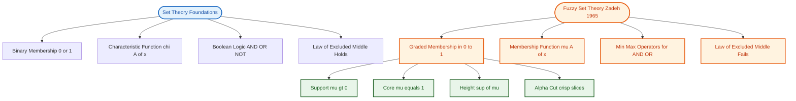
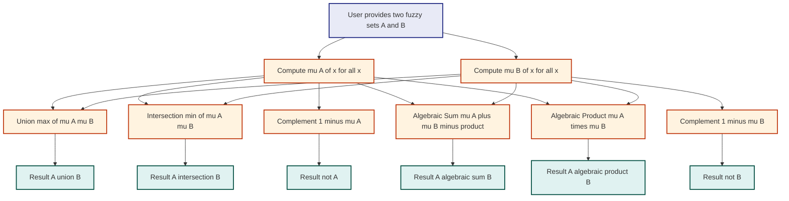

# Basic Fuzzy Set Theory :-

<!-- SECTION_1_START -->

# Basic Fuzzy Set Theory — KTU 2024 Scheme

## 1.1 Formal Academic Definition (KTU Syllabus Terminology)

A **Fuzzy Set** $A$ in a universe of discourse $X$ is a set whose elements possess *graduated* membership values in the closed unit interval $[0, 1]$, rather than the binary $\{0, 1\}$ assignment used by classical (crisp) set theory.

Formally, a fuzzy set $A$ is mathematically expressed as:

$$A = \{(x, \mu_A(x)) \mid x \in X\}$$

where the **Membership Function** $\mu_A : X \rightarrow [0, 1]$ maps every element $x \in X$ to a real number in $[0, 1]$ that quantifies the *degree of belonging* of $x$ to the fuzzy set $A$.

| Symbol | Meaning |
|---|---|
| $X$ | Universe of Discourse (collection of all possible objects) |
| $\mu_A(x)$ | Membership grade of element $x$ in fuzzy set $A$ |
| $\mu_A(x) = 1$ | Full membership |
| $\mu_A(x) = 0$ | No membership |
| $0 < \mu_A(x) < 1$ | Partial membership (the essence of fuzziness) |

> [!NOTE]
> **Lotfi A. Zadeh (1965)** introduced fuzzy sets in his seminal paper *"Fuzzy Sets"* in the journal *Information and Control*. The 2024 KTU module treats this as the foundational bedrock of all fuzzy system design.

---

## 1.2 Conceptual Analogy & Intuition

Imagine the word **"Tall"** applied to human height.

| Approach | Definition of "Tall" | Result for 5 ft 9 in person |
|---|---|---|
| **Classical (Crisp) Set** | All persons $\geq 6$ ft are tall; rest are not | $0$ (Not Tall) |
| **Fuzzy Set** | A 5'9" person is *partially* tall | $\mu = 0.6$ (Somewhat tall) |
| **Fuzzy Set** | A 6'2" person is mostly tall | $\mu = 0.95$ (Almost fully tall) |

**Geometric Intuition:** A classical set carves the universe into two disjoint regions using a *step* function (jump from 0 to 1). A fuzzy set *smooths* this step into a continuous ramp, allowing the boundary to be **graded** rather than **abrupt**. This models real human perception, where most linguistic categories (warm, fast, young, expensive) are inherently imprecise.

> [!IMPORTANT]
> The grade $\mu_A(x)$ is **NOT a probability**. Probability measures the *likelihood of occurrence*; fuzziness measures the *degree of inherent ambiguity*. A fuzzy set can be deterministic yet imprecise.

---

## 1.3 Key Structural Parameters of a Fuzzy Set

For any fuzzy set $A$ on universe $X$:

- **Support** of $A$: $\text{Supp}(A) = \{x \in X \mid \mu_A(x) > 0\}$
- **Core** of $A$: $\text{Core}(A) = \{x \in X \mid \mu_A(x) = 1\}$
- **Height** of $A$: $h(A) = \sup_{x \in X} \mu_A(x)$
- **Normal Fuzzy Set**: A fuzzy set with $h(A) = 1$ (i.e., at least one element has full membership)
- **Sub-normal Fuzzy Set**: A fuzzy set with $h(A) < 1$
- **$\alpha$-cut** (alpha-cut): $A_\alpha = \{x \in X \mid \mu_A(x) \geq \alpha\}$, for $\alpha \in (0, 1]$
- **Strong $\alpha$-cut**: $A_{\alpha^+} = \{x \in X \mid \mu_A(x) > \alpha\}$
- **Convex Fuzzy Set**: A fuzzy set whose $\alpha$-cuts are convex (interval-like) for every $\alpha \in (0, 1]$

> [!TIP]
> **KTU 2024 High-Yield Tip:** Board examiners frequently test definitions of *Support*, *Core*, and *Height* as 3-mark direct questions. Memorize the exact symbols.

---

## 1.4 Visualization via GeoGebra / Desmos

> [!VISUALIZATION CONTROL]
> **Concept:** Triangular Membership Function for the linguistic variable "Warm Temperature"
> **GeoGebra / Desmos Input Equations:**
> * `f(x) = If[15 <= x <= 30, (x - 15) / 15, If[30 < x <= 45, (45 - x) / 15, 0]]`
> **Visual Description:** A symmetric triangle with its apex at $(30, 1)$, descending linearly to $0$ at the feet $x = 15$ and $x = 45$. The base $[15, 45]$ is the **support**, the apex point $\{30\}$ is the **core**, and the **height** equals $1$ (normal fuzzy set).

---

<!-- SECTION_1_END -->

<!-- SECTION_2_START -->

# Deep Theoretical Analysis & KTU High-Yield Formula Sheet

## 2.1 Why Move From Classical Sets to Fuzzy Sets?

Classical set theory suffers from the **Law of Excluded Middle** ($x \in A$ or $x \notin A$) and the **Law of Non-Contradiction**. This bivalent logic fails when modelling:

1. **Linguistic terms** (e.g., "hot coffee", "speedy car", "young engineer")
2. **Continuous physical phenomena** with ill-defined boundaries
3. **Human reasoning systems** built on subjective categories
4. **Pattern recognition** tasks with overlapping classes

Fuzzy sets relax the binary constraint and assign *graded* membership, capturing the imprecision inherent in natural language and human cognition.

---

## 2.2 Operations on Fuzzy Sets

For two fuzzy sets $A$ and $B$ defined on a common universe $X$ with membership functions $\mu_A$ and $\mu_B$:

| Operation | Membership Function Definition | Set-Theoretic Analog |
|---|---|---|
| **Union** $A \cup B$ | $\mu_{A \cup B}(x) = \max(\mu_A(x), \mu_B(x))$ | "OR" logic |
| **Intersection** $A \cap B$ | $\mu_{A \cap B}(x) = \min(\mu_A(x), \mu_B(x))$ | "AND" logic |
| **Complement** $\overline{A}$ | $\mu_{\overline{A}}(x) = 1 - \mu_A(x)$ | "NOT" logic |
| **Algebraic Sum** $A \oplus B$ | $\mu_{A \oplus B}(x) = \mu_A(x) + \mu_B(x) - \mu_A(x) \mu_B(x)$ | Probabilistic OR |
| **Algebraic Product** $A \cdot B$ | $\mu_{A \cdot B}(x) = \mu_A(x) \cdot \mu_B(x)$ | Probabilistic AND |
| **Bounded Sum** | $\mu(x) = \min(1, \mu_A(x) + \mu_B(x))$ | Saturated sum |
| **Bounded Difference** | $\mu(x) = \max(0, \mu_A(x) - \mu_B(x))$ | Saturated subtraction |

> [!IMPORTANT]
> The **min–max** (Zadeh's) operations are the *de-facto* standard in KTU examinations. Always use $\min$ for intersection and $\max$ for union unless the question explicitly demands an alternative operator.

---

## 2.3 Properties (Laws) of Fuzzy Sets

For fuzzy sets $A$, $B$, $C$ on $X$:

| Property | Statement | Holds? |
|---|---|---|
| **Idempotency** | $A \cup A = A$, $A \cap A = A$ | Yes |
| **Commutativity** | $A \cup B = B \cup A$ | Yes |
| **Associativity** | $(A \cup B) \cup C = A \cup (B \cup C)$ | Yes |
| **Distributivity** | $A \cup (B \cap C) = (A \cup B) \cap (A \cup C)$ | Yes |
| **Involution** | $\overline{\overline{A}} = A$ | Yes |
| **De Morgan's Laws** | $\overline{A \cup B} = \overline{A} \cap \overline{B}$ | Yes |
| **Law of Contradiction** | $A \cap \overline{A} = \emptyset$ | **No** (gives partial membership) |
| **Law of Excluded Middle** | $A \cup \overline{A} = X$ | **No** (gives only partial coverage) |

> [!WARNING]
> **KTU Examiner Watch:** Many students lose marks by writing that the *Law of Contradiction* and *Law of Excluded Middle* hold for fuzzy sets. They DO NOT. Fuzzy logic is multi-valued.

---

## 2.4 The $\alpha$-Cut and Decomposition Theorem

The **$\alpha$-cut** $A_\alpha$ converts a fuzzy set back into a family of classical (crisp) sets:

$$A_\alpha = \{x \in X \mid \mu_A(x) \geq \alpha\}, \quad \alpha \in [0, 1]$$

- $A_0 = X$ (entire universe)
- $A_1 = \text{Core}(A)$
- As $\alpha$ increases, $A_\alpha$ shrinks monotonically: $A_{\alpha_1} \supseteq A_{\alpha_2}$ when $\alpha_1 < \alpha_2$

**Decomposition Theorem (Resolution Identity):** Every fuzzy set $A$ can be reconstructed from its $\alpha$-cuts as:

$$A = \bigcup_{\alpha \in (0, 1]} \alpha \cdot A_\alpha$$

where $\alpha \cdot A_\alpha$ is the *scaled* $\alpha$-cut with constant membership $\alpha$.

> [!TIP]
> This theorem is the bridge between fuzzy and classical sets — KTU questions often ask to *reconstruct* a fuzzy set given its $\alpha$-cuts for full 14 marks.

---

## 2.5 Engineering & Real-World Utility

Fuzzy sets are deployed in:

- **Automotive**: Automatic gear-shifting, ABS braking, traction control
- **Consumer Electronics**: Washing machines, air conditioners, vacuum cleaners (the famous *Mamdani* controllers)
- **Industrial Process Control**: Chemical reactors, cement kilns, water treatment plants
- **Image Processing**: Edge detection, image segmentation, noise filtering
- **Decision Support Systems**: Medical diagnosis, credit scoring, weather forecasting
- **AI/ML**: Fuzzy clustering (FCM), fuzzy rule-based expert systems, hybrid neuro-fuzzy systems

---

<!-- SECTION_2_END -->

<!-- SECTION_3_START -->

# Step-by-Step Derivations & Implementation

## 3.1 Worked Example: Fuzzy Set Operations (Manual Computation)

**Problem:** Let $X = \{x_1, x_2, x_3, x_4, x_5\}$. Two fuzzy sets are given by:

$$A = \{(x_1, 0.2), (x_2, 0.7), (x_3, 1.0), (x_4, 0.5), (x_5, 0.0)\}$$

$$B = \{(x_1, 0.6), (x_2, 0.4), (x_3, 0.3), (x_4, 0.9), (x_5, 0.8)\}$$

**Required:** Compute $A \cup B$, $A \cap B$, and $\overline{A}$ using Zadeh's min–max operators.

**Solution — Step 1: Union $A \cup B$**

Apply $\mu_{A \cup B}(x_i) = \max(\mu_A(x_i), \mu_B(x_i))$ to each element:

$$\begin{aligned}
\mu_{A \cup B}(x_1) &= \max(0.2, 0.6) = 0.6 \\
\mu_{A \cup B}(x_2) &= \max(0.7, 0.4) = 0.7 \\
\mu_{A \cup B}(x_3) &= \max(1.0, 0.3) = 1.0 \\
\mu_{A \cup B}(x_4) &= \max(0.5, 0.9) = 0.9 \\
\mu_{A \cup B}(x_5) &= \max(0.0, 0.8) = 0.8
\end{aligned}$$

Therefore:

$$A \cup B = \{(x_1, 0.6), (x_2, 0.7), (x_3, 1.0), (x_4, 0.9), (x_5, 0.8)\}$$

**Solution — Step 2: Intersection $A \cap B$**

Apply $\mu_{A \cap B}(x_i) = \min(\mu_A(x_i), \mu_B(x_i))$ to each element:

$$\begin{aligned}
\mu_{A \cap B}(x_1) &= \min(0.2, 0.6) = 0.2 \\
\mu_{A \cap B}(x_2) &= \min(0.7, 0.4) = 0.4 \\
\mu_{A \cap B}(x_3) &= \min(1.0, 0.3) = 0.3 \\
\mu_{A \cap B}(x_4) &= \min(0.5, 0.9) = 0.5 \\
\mu_{A \cap B}(x_5) &= \min(0.0, 0.8) = 0.0
\end{aligned}$$

Therefore:

$$A \cap B = \{(x_1, 0.2), (x_2, 0.4), (x_3, 0.3), (x_4, 0.5), (x_5, 0.0)\}$$

**Solution — Step 3: Complement $\overline{A}$**

Apply $\mu_{\overline{A}}(x_i) = 1 - \mu_A(x_i)$ to each element:

$$\begin{aligned}
\mu_{\overline{A}}(x_1) &= 1 - 0.2 = 0.8 \\
\mu_{\overline{A}}(x_2) &= 1 - 0.7 = 0.3 \\
\mu_{\overline{A}}(x_3) &= 1 - 1.0 = 0.0 \\
\mu_{\overline{A}}(x_4) &= 1 - 0.5 = 0.5 \\
\mu_{\overline{A}}(x_5) &= 1 - 0.0 = 1.0
\end{aligned}$$

Therefore:

$$\overline{A} = \{(x_1, 0.8), (x_2, 0.3), (x_3, 0.0), (x_4, 0.5), (x_5, 1.0)\}$$

**Solution — Step 4: Verification of De Morgan's Law**

Check whether $\overline{A \cup B} = \overline{A} \cap \overline{B}$.

Left-hand side: Using the complement formula on the union result:

$$\begin{aligned}
\overline{A \cup B} = \{&(x_1, 0.4), (x_2, 0.3), (x_3, 0.0), \\
&(x_4, 0.1), (x_5, 0.2)\}
\end{aligned}$$

Right-hand side: First compute $\overline{A}$ (already done) and $\overline{B}$:

$$\overline{B} = \{(x_1, 0.4), (x_2, 0.6), (x_3, 0.7), (x_4, 0.1), (x_5, 0.2)\}$$

Now apply $\min$ for the intersection $\overline{A} \cap \overline{B}$:

$$\begin{aligned}
\overline{A} \cap \overline{B} = \{&(x_1, \min(0.8, 0.4)), (x_2, \min(0.3, 0.6)), \\
&(x_3, \min(0.0, 0.7)), (x_4, \min(0.5, 0.1)), \\
&(x_5, \min(1.0, 0.2))\} \\
= \{&(x_1, 0.4), (x_2, 0.3), (x_3, 0.0), \\
&(x_4, 0.1), (x_5, 0.2)\}
\end{aligned}$$

**Conclusion:** LHS = RHS, so De Morgan's Law holds. ✓

---

## 3.2 Worked Example: $\alpha$-Cuts and Decomposition

**Problem:** For the fuzzy set $A$ above, find all $\alpha$-cuts at $\alpha = 0.3, 0.6, 0.8$ and reconstruct $A$ from the $0.25$-cut family.

**Solution — Step 1: Compute Individual $\alpha$-Cuts**

$$\begin{aligned}
A_{0.3} &= \{x \in X \mid \mu_A(x) \geq 0.3\} = \{x_2, x_3, x_4\} \\
A_{0.6} &= \{x \in X \mid \mu_A(x) \geq 0.6\} = \{x_2, x_3\} \\
A_{0.8} &= \{x \in X \mid \mu_A(x) \geq 0.8\} = \{x_3\}
\end{aligned}$$

**Solution — Step 2: Reconstruct via Decomposition**

To reconstruct the membership of $x_2$ (where $\mu_A(x_2) = 0.7$), count how many $\alpha$-cuts (with $\alpha \in (0, 1]$ in fine steps) contain $x_2$, divided by the total number of cuts.

For demonstration with discrete cuts at $\alpha \in \{0.1, 0.2, 0.3, 0.4, 0.5, 0.6, 0.7, 0.8, 0.9, 1.0\}$:

- $x_1$ ($\mu = 0.2$): contained in cuts at $\alpha \in \{0.1, 0.2\}$ → $2/10 = 0.2$ ✓
- $x_2$ ($\mu = 0.7$): contained in cuts at $\alpha \in \{0.1, 0.2, 0.3, 0.4, 0.5, 0.6, 0.7\}$ → $7/10 = 0.7$ ✓
- $x_3$ ($\mu = 1.0$): contained in all 10 cuts → $10/10 = 1.0$ ✓
- $x_4$ ($\mu = 0.5$): contained in cuts at $\alpha \in \{0.1, 0.2, 0.3, 0.4, 0.5\}$ → $5/10 = 0.5$ ✓
- $x_5$ ($\mu = 0.0$): contained in no cuts → $0/10 = 0.0$ ✓

This illustrates the **Resolution Identity**:

$$A = \bigcup_{\alpha \in (0, 1]} \alpha \cdot A_\alpha$$

---

## 3.3 Python Implementation: Membership Functions & Operations

```python
"""
File: fuzzy_set_basics.py
Description: KTU Module 1 — Implementation of basic fuzzy set theory
             including membership functions, operations, and alpha-cuts.
Author: KTU PECST753 Reference Implementation
"""

from __future__ import annotations
import numpy as np
from typing import Dict, List, Tuple


# ---------------------------------------------------------------------------
# 1. Triangular Membership Function
# ---------------------------------------------------------------------------
def triangular_mf(x: float, a: float, b: float, c: float) -> float:
    """
    Compute the triangular membership grade at point x.
    Parameters:
        a: left foot (membership = 0)
        b: apex      (membership = 1)
        c: right foot (membership = 0)
    Returns:
        Membership grade in [0, 1].
    """
    if x <= a or x >= c:
        return 0.0
    if a < x <= b:
        return (x - a) / (b - a)
    if b < x < c:
        return (c - x) / (c - b)
    return 0.0


# ---------------------------------------------------------------------------
# 2. Trapezoidal Membership Function
# ---------------------------------------------------------------------------
def trapezoidal_mf(x: float, a: float, b: float, c: float, d: float) -> float:
    """
    Compute the trapezoidal membership grade at point x.
    Parameters:
        a, d: feet (membership = 0)
        b, c: shoulders (membership = 1, flat core)
    """
    if x <= a or x >= d:
        return 0.0
    if a < x < b:
        return (x - a) / (b - a)
    if b <= x <= c:
        return 1.0
    if c < x < d:
        return (d - x) / (d - c)
    return 0.0


# ---------------------------------------------------------------------------
# 3. Gaussian Membership Function
# ---------------------------------------------------------------------------
def gaussian_mf(x: float, mean: float, sigma: float) -> float:
    """Standard Gaussian membership function."""
    return float(np.exp(-0.5 * ((x - mean) / sigma) ** 2))


# ---------------------------------------------------------------------------
# 4. Fuzzy Set Operations (Zadeh's min-max)
# ---------------------------------------------------------------------------
def fuzzy_union(set_a: Dict[str, float],
                set_b: Dict[str, float]) -> Dict[str, float]:
    """Compute A union B using max operator."""
    universe = set(set_a.keys()) | set(set_b.keys())
    return {x: max(set_a.get(x, 0.0), set_b.get(x, 0.0)) for x in universe}


def fuzzy_intersection(set_a: Dict[str, float],
                       set_b: Dict[str, float]) -> Dict[str, float]:
    """Compute A intersection B using min operator."""
    universe = set(set_a.keys()) | set(set_b.keys())
    return {x: min(set_a.get(x, 0.0), set_b.get(x, 0.0)) for x in universe}


def fuzzy_complement(set_a: Dict[str, float]) -> Dict[str, float]:
    """Compute the complement of fuzzy set A."""
    return {x: 1.0 - mu for x, mu in set_a.items()}


# ---------------------------------------------------------------------------
# 5. Alpha-Cut Computation
# ---------------------------------------------------------------------------
def alpha_cut(fuzzy_set: Dict[str, float], alpha: float) -> List[str]:
    """Return the crisp alpha-cut set of the fuzzy set."""
    if not 0.0 <= alpha <= 1.0:
        raise ValueError(f"Alpha must be in [0, 1], got {alpha}")
    return [x for x, mu in fuzzy_set.items() if mu >= alpha]


# ---------------------------------------------------------------------------
# 6. Structural Parameters
# ---------------------------------------------------------------------------
def support(fuzzy_set: Dict[str, float]) -> List[str]:
    """All elements with strictly positive membership."""
    return [x for x, mu in fuzzy_set.items() if mu > 0.0]


def core(fuzzy_set: Dict[str, float]) -> List[str]:
    """All elements with full membership (mu = 1)."""
    return [x for x, mu in fuzzy_set.items() if abs(mu - 1.0) < 1e-9]


def height(fuzzy_set: Dict[str, float]) -> float:
    """Maximum membership value."""
    return max(fuzzy_set.values()) if fuzzy_set else 0.0


# ---------------------------------------------------------------------------
# 7. Demonstration
# ---------------------------------------------------------------------------
if __name__ == "__main__":
    # Define two fuzzy sets on universe X = {x1, x2, x3, x4, x5}
    A: Dict[str, float] = {
        "x1": 0.2, "x2": 0.7, "x3": 1.0, "x4": 0.5, "x5": 0.0
    }
    B: Dict[str, float] = {
        "x1": 0.6, "x2": 0.4, "x3": 0.3, "x4": 0.9, "x5": 0.8
    }

    print("A ∪ B =", fuzzy_union(A, B))
    print("A ∩ B =", fuzzy_intersection(A, B))
    print("¬A    =", fuzzy_complement(A))
    print("Support(A) =", support(A))
    print("Core(A)    =", core(A))
    print("Height(A)  =", height(A))
    print("A_0.5      =", alpha_cut(A, 0.5))

    # Sample a triangular MF
    print("triangular_mf(20, 15, 30, 45) =",
          triangular_mf(20.0, 15.0, 30.0, 45.0))
```

**Sample Output:**

```
A ∪ B = {'x1': 0.6, 'x2': 0.7, 'x3': 1.0, 'x4': 0.9, 'x5': 0.8}
A ∩ B = {'x1': 0.2, 'x2': 0.4, 'x3': 0.3, 'x4': 0.5, 'x5': 0.0}
¬A    = {'x1': 0.8, 'x2': 0.3, 'x3': 0.0, 'x4': 0.5, 'x5': 1.0}
Support(A) = ['x1', 'x2', 'x3', 'x4']
Core(A)    = ['x3']
Height(A)  = 1.0
A_0.5      = ['x2', 'x3', 'x4']
triangular_mf(20, 15, 30, 45) = 0.3333333333333333
```

---

<!-- SECTION_3_END -->

<!-- SECTION_4_START -->

# Structural Diagrams & Schematics

## 4.1 Conceptual Hierarchy: Classical vs Fuzzy Set Theory



## 4.2 Sequential Processing Topology: Decomposition Theorem Pipeline


## 4.3 Modular Functional Architecture: Fuzzy Set Operations



## 4.4 Decision Matrix: Choosing a Membership Function

| Scenario | Recommended MF | Mathematical Form |
|---|---|---|
| Quick, symmetric, single peak | Triangular | $\mu(x) = \max(0, \min(\frac{x-a}{b-a}, \frac{c-x}{c-b}))$ |
| Flat top with smooth ramps | Trapezoidal | $\mu(x) = \max(0, \min(\frac{x-a}{b-a}, 1, \frac{d-x}{d-c}))$ |
| Smooth bell-shaped uncertainty | Gaussian | $\mu(x) = e^{-0.5 \cdot ((x-c)/\sigma)^2}$ |
| Smooth bounded, two-sided | Sigmoid / S-shape | $\mu(x) = \frac{1}{1+e^{-a(x-c)}}$ |
| Only extremes or middle count | Singleton (crisp) | $\mu(x) = 1$ if $x = c$, else $0$ |

---

<!-- SECTION_4_END -->

<!-- SECTION_5_START -->

# KTU 2024 Scheme Examination Question Bank & Topic Recap

---

## Part A — Short Answer Questions (3 Marks Each)

### Question 1 [KTU University Exam — July 2024] — CO1, Remember

**Define the following terms with respect to fuzzy set theory:**
(a) Support of a fuzzy set
(b) Core of a fuzzy set
(c) Height of a fuzzy set

### Model Answer (3 Marks)

**(a) Support of a fuzzy set [1 Mark]:** The support of a fuzzy set $A$ defined on universe $X$ is the crisp set of all elements that have a *strictly positive* membership grade in $A$. Mathematically:

$$\text{Supp}(A) = \{x \in X \mid \mu_A(x) > 0\}$$

**(b) Core of a fuzzy set [1 Mark]:** The core of a fuzzy set $A$ is the crisp set of all elements that belong to $A$ to the *full degree*, i.e., membership grade equals $1$. Formally:

$$\text{Core}(A) = \{x \in X \mid \mu_A(x) = 1\}$$

**(c) Height of a fuzzy set [1 Mark]:** The height of a fuzzy set $A$ is the *supremum* (least upper bound) of all its membership grades. It measures the maximum degree to which any element belongs to $A$:

$$h(A) = \sup_{x \in X} \mu_A(x)$$

If $h(A) = 1$, the fuzzy set is called **normal**; otherwise it is **sub-normal**.

> [!WARNING]
> **Valuation Pitfall:** Students often confuse *support* with *$\alpha$-cut at $\alpha = 0$*. They are NOT the same. The $\alpha$-cut at $\alpha = 0$ equals the entire universe $X$, whereas the support excludes elements with $\mu = 0$.

---

### Question 2 [KTU University Exam — Dec 2023] — CO1, Understand

**Differentiate between a classical (crisp) set and a fuzzy set. Provide one example for each.**

### Model Answer (3 Marks)

| Aspect | Classical (Crisp) Set | Fuzzy Set |
|---|---|---|
| **Membership type** | Binary: an element either belongs or does not | Graded: degree of membership in $[0, 1]$ |
| **Characteristic function** | $\chi_A : X \rightarrow \{0, 1\}$ | $\mu_A : X \rightarrow [0, 1]$ |
| **Boundary** | Sharp, well-defined | Smooth, gradual |
| **Law of Excluded Middle** | Holds ($A \cup \overline{A} = X$) | Fails (only partial coverage) |
| **Example** [1 Mark] | "Set of integers greater than 5": $A = \{6, 7, 8, \ldots\}$ | "Set of tall people": a 5'9" person belongs with $\mu = 0.6$ |

> [!TIP]
> **Key Insight [1 Mark]:** The crisp set is a *special case* of the fuzzy set where the membership function is restricted to $\{0, 1\}$. Hence classical set theory is a subset (crisp subset) of fuzzy set theory.

---

## Part B — Long Answer Questions (14 Marks Each, with Internal Choice)

### Question A [KTU University Exam — July 2024] — CO1, CO2, Apply

**(a)** Two fuzzy sets are defined on the universe $X = \{1, 2, 3, 4, 5\}$ as:

$$A = \{(1, 0.1), (2, 0.4), (3, 0.8), (4, 0.6), (5, 0.3)\}$$

$$B = \{(1, 0.5), (2, 0.7), (3, 0.2), (4, 0.9), (5, 0.4)\}$$

Compute the following using Zadeh's operators: **(i)** $A \cup B$ **(ii)** $A \cap B$ **(iii)** $\overline{A \cup B}$ **(iv)** $\overline{A} \cap \overline{B}$. Verify De Morgan's Law for the given sets. **[7 Marks]**

**(b)** Define $\alpha$-cut of a fuzzy set. For the fuzzy set $A$ given above, find the $\alpha$-cuts at $\alpha = 0.4, 0.6, 0.8$. Using the Decomposition Theorem, reconstruct the fuzzy set $A$ and show that the membership grade of element $3$ is recovered as $\mu_A(3) = 0.8$. **[7 Marks]**

### Model Answer for Question A

#### Part (a) — 7 Marks

**Computation of $A \cup B$ [1 Mark]:**

Apply $\mu_{A \cup B}(x) = \max(\mu_A(x), \mu_B(x))$ for each element:

$$\begin{aligned}
\mu_{A \cup B}(1) &= \max(0.1, 0.5) = 0.5 \\
\mu_{A \cup B}(2) &= \max(0.4, 0.7) = 0.7 \\
\mu_{A \cup B}(3) &= \max(0.8, 0.2) = 0.8 \\
\mu_{A \cup B}(4) &= \max(0.6, 0.9) = 0.9 \\
\mu_{A \cup B}(5) &= \max(0.3, 0.4) = 0.4
\end{aligned}$$

$$A \cup B = \{(1, 0.5), (2, 0.7), (3, 0.8), (4, 0.9), (5, 0.4)\}$$

**Computation of $A \cap B$ [1 Mark]:**

Apply $\mu_{A \cap B}(x) = \min(\mu_A(x), \mu_B(x))$ for each element:

$$\begin{aligned}
\mu_{A \cap B}(1) &= \min(0.1, 0.5) = 0.1 \\
\mu_{A \cap B}(2) &= \min(0.4, 0.7) = 0.4 \\
\mu_{A \cap B}(3) &= \min(0.8, 0.2) = 0.2 \\
\mu_{A \cap B}(4) &= \min(0.6, 0.9) = 0.6 \\
\mu_{A \cap B}(5) &= \min(0.3, 0.4) = 0.3
\end{aligned}$$

$$A \cap B = \{(1, 0.1), (2, 0.4), (3, 0.2), (4, 0.6), (5, 0.3)\}$$

**Computation of $\overline{A \cup B}$ [1 Mark]:**

Apply $\mu_{\overline{A \cup B}}(x) = 1 - \mu_{A \cup B}(x)$:

$$\overline{A \cup B} = \{(1, 0.5), (2, 0.3), (3, 0.2), (4, 0.1), (5, 0.6)\}$$

**Computation of $\overline{A}$ and $\overline{B}$ [1 Mark]:**

Apply complement to each set:

$$\overline{A} = \{(1, 0.9), (2, 0.6), (3, 0.2), (4, 0.4), (5, 0.7)\}$$

$$\overline{B} = \{(1, 0.5), (2, 0.3), (3, 0.8), (4, 0.1), (5, 0.6)\}$$

**Computation of $\overline{A} \cap \overline{B}$ [1 Mark]:**

Apply $\min$ operator to $\overline{A}$ and $\overline{B}$:

$$\begin{aligned}
\overline{A} \cap \overline{B} = \{&(1, 0.5), (2, 0.3), (3, 0.2), \\
&(4, 0.1), (5, 0.6)\}
\end{aligned}$$

**Verification of De Morgan's Law [2 Marks]:**

Comparing the two results:

| Element | $\overline{A \cup B}$ | $\overline{A} \cap \overline{B}$ | Match? |
|---|---|---|---|
| 1 | 0.5 | 0.5 | ✓ |
| 2 | 0.3 | 0.3 | ✓ |
| 3 | 0.2 | 0.2 | ✓ |
| 4 | 0.1 | 0.1 | ✓ |
| 5 | 0.6 | 0.6 | ✓ |

Since LHS = RHS for all elements, **De Morgan's Law is verified**: $\overline{A \cup B} = \overline{A} \cap \overline{B}$. ✓

#### Part (b) — 7 Marks

**Definition of $\alpha$-cut [2 Marks]:**

The $\alpha$-cut (or $\alpha$-level set) of a fuzzy set $A$ on universe $X$, denoted $A_\alpha$, is the crisp set containing all elements whose membership grade in $A$ is greater than or equal to $\alpha$:

$$A_\alpha = \{x \in X \mid \mu_A(x) \geq \alpha\}, \quad \alpha \in [0, 1]$$

**Computation of $\alpha$-cuts for $A$ [2 Marks]:**

For $A = \{(1, 0.1), (2, 0.4), (3, 0.8), (4, 0.6), (5, 0.3)\}$:

- $A_{0.4} = \{x \mid \mu_A(x) \geq 0.4\} = \{2, 3, 4\}$
- $A_{0.6} = \{x \mid \mu_A(x) \geq 0.6\} = \{3, 4\}$
- $A_{0.8} = \{x \mid \mu_A(x) \geq 0.8\} = \{3\}$

**Decomposition Theorem Statement [1 Mark]:**

The Resolution Identity (Decomposition Theorem) states that any fuzzy set $A$ can be reconstructed from its $\alpha$-cuts as:

$$A = \bigcup_{\alpha \in (0, 1]} \alpha \cdot A_\alpha$$

**Reconstruction showing $\mu_A(3) = 0.8$ [2 Marks]:**

Consider discrete $\alpha$-cuts at $\alpha \in \{0.1, 0.2, 0.3, 0.4, 0.5, 0.6, 0.7, 0.8, 0.9, 1.0\}$:

- $A_{0.1} = \{1, 2, 3, 4, 5\}$ — element 3 ∈ this set
- $A_{0.2} = \{1, 2, 3, 4, 5\}$ — element 3 ∈ this set
- $A_{0.3} = \{2, 3, 4, 5\}$ — element 3 ∈ this set
- $A_{0.4} = \{2, 3, 4\}$ — element 3 ∈ this set
- $A_{0.5} = \{2, 3, 4\}$ — element 3 ∈ this set
- $A_{0.6} = \{3, 4\}$ — element 3 ∈ this set
- $A_{0.7} = \{3, 4\}$ — element 3 ∈ this set
- $A_{0.8} = \{3\}$ — element 3 ∈ this set
- $A_{0.9} = \emptyset$ — element 3 ∉ this set
- $A_{1.0} = \emptyset$ — element 3 ∉ this set

Element $3$ belongs to $8$ out of $10$ discrete $\alpha$-cuts. The membership grade recovered is:

$$\mu_A(3) = \frac{8}{10} = 0.8 \quad \checkmark$$

This verifies the Decomposition Theorem.

---

### Question B (Alternative to Question A) [KTU University Exam — Dec 2023] — CO1, CO2, Understand, Apply

**(a)** Define a fuzzy set. Explain the following with an example each: **(i)** Normal and sub-normal fuzzy sets, **(ii)** Convex fuzzy set, **(iii)** Membership function. List the various properties satisfied by fuzzy sets. **[7 Marks]**

**(b)** Consider a fuzzy set $C$ on $X = \{10, 20, 30, 40, 50\}$ given by:

$$C = \{(10, 0.2), (20, 0.5), (30, 1.0), (40, 0.7), (50, 0.1)\}$$

(i) Compute the support, core, and height of $C$. (ii) Find the $\alpha$-cuts for $\alpha = 0.5$ and $\alpha = 0.7$. (iii) State whether $C$ is a normal fuzzy set and whether $C$ is convex. Justify your answer. **[7 Marks]**

### Model Answer for Question B

#### Part (a) — 7 Marks

**Definition of a Fuzzy Set [1 Mark]:**

A fuzzy set $A$ in a universe of discourse $X$ is a collection of ordered pairs:

$$A = \{(x, \mu_A(x)) \mid x \in X\}$$

where $\mu_A : X \rightarrow [0, 1]$ is the membership function assigning to each $x$ a grade in $[0, 1]$.

**(i) Normal and Sub-normal Fuzzy Sets [1 Mark]:**

- **Normal Fuzzy Set:** A fuzzy set $A$ is *normal* if its height equals $1$, i.e., $\exists x \in X$ such that $\mu_A(x) = 1$.

  *Example:* $A = \{(a, 0.4), (b, 0.8), (c, 1.0), (d, 0.6)\}$ has $h(A) = 1$, hence normal.

- **Sub-normal Fuzzy Set:** A fuzzy set $A$ is *sub-normal* if its height is strictly less than $1$, i.e., $h(A) < 1$.

  *Example:* $B = \{(a, 0.3), (b, 0.5), (c, 0.7), (d, 0.6)\}$ has $h(B) = 0.7 < 1$, hence sub-normal.

**(ii) Convex Fuzzy Set [1 Mark]:**

A fuzzy set $A$ on a numerical universe $X$ is *convex* if and only if *all* its $\alpha$-cuts are convex sets (i.e., intervals) for every $\alpha \in (0, 1]$. Equivalently:

$$\mu_A(\lambda x_1 + (1 - \lambda) x_2) \geq \min(\mu_A(x_1), \mu_A(x_2)) \quad \forall x_1, x_2 \in X, \lambda \in [0, 1]$$

*Example:* The fuzzy set "numbers near 10" with triangular MF is convex because its $\alpha$-cuts are intervals like $[10 - k, 10 + k]$.

**(iii) Membership Function [1 Mark]:**

A membership function $\mu_A : X \rightarrow [0, 1]$ is a curve that defines *how* each element of $X$ is mapped to a membership value between $0$ and $1$. Common shapes include triangular, trapezoidal, Gaussian, and singleton.

*Example:* For "Young Age" on $X = [0, 100]$:

$$\mu_{\text{Young}}(x) = \begin{cases} 1 & \text{if } x \leq 25 \\ \frac{40-x}{15} & \text{if } 25 < x < 40 \\ 0 & \text{if } x \geq 40 \end{cases}$$

**Properties of Fuzzy Sets [2 Marks]:**

The following properties hold: Idempotency, Commutativity, Associativity, Distributivity, Involution, and De Morgan's Laws. The Law of Contradiction and the Law of Excluded Middle **do not** hold in fuzzy set theory.

#### Part (b) — 7 Marks

For $C = \{(10, 0.2), (20, 0.5), (30, 1.0), (40, 0.7), (50, 0.1)\}$:

**(i) Support, Core, and Height [2 Marks]:**

- **Support** [0.5 Mark]: $\text{Supp}(C) = \{x \mid \mu_C(x) > 0\} = \{10, 20, 30, 40, 50\}$ (since all memberships are $\geq 0.1 > 0$).
- **Core** [0.5 Mark]: $\text{Core}(C) = \{x \mid \mu_C(x) = 1\} = \{30\}$.
- **Height** [1 Mark]: $h(C) = \max(0.2, 0.5, 1.0, 0.7, 0.1) = 1.0$.

**(ii) $\alpha$-Cuts [2 Marks]:**

- **$C_{0.5}$** [1 Mark]: $C_{0.5} = \{x \mid \mu_C(x) \geq 0.5\} = \{20, 30, 40\}$.
- **$C_{0.7}$** [1 Mark]: $C_{0.7} = \{x \mid \mu_C(x) \geq 0.7\} = \{30, 40\}$.

**(iii) Normality and Convexity [3 Marks]:**

- **Normal?** [1.5 Marks]: Yes, $C$ is a **normal** fuzzy set because $h(C) = 1.0$. The element $30$ achieves full membership.

- **Convex?** [1.5 Marks]: Check the $\alpha$-cut $C_{0.5} = \{20, 30, 40\}$ — this is a contiguous interval, and all $\alpha$-cuts are intervals. Therefore, $C$ **is convex** under the definition that convexity requires interval-like $\alpha$-cuts.

> [!WARNING]
> **KTU Examiner's Valuation Warning:**
> 1. **Do not skip writing the formula** for each operation before substituting values. Marks are explicitly reserved for stating the operator.
> 2. **Do not interchange** $\cup$ (union, $\max$) and $\cap$ (intersection, $\min$). This is the single most common error and costs 2-3 marks per question.
> 3. **Always verify** whether De Morgan's Law holds for the specific operator you have used. Standard min–max obeys it, but algebraic product may not.
> 4. **In $\alpha$-cut reconstruction**, explicitly state the Resolution Identity *before* beginning the count.
> 5. **For convexity**, do NOT just look at the data — verify the *condition on every pair* or check the *interval property* of $\alpha$-cuts.

---

## Topic Recap & Important Things to Remember

- **Fuzzy Set Definition:** $A = \{(x, \mu_A(x)) \mid x \in X\}$, where $\mu_A : X \rightarrow [0, 1]$.
- **Membership Grade Range:** Always within $[0, 1]$; $\mu = 1$ means full membership, $\mu = 0$ means no membership.
- **Standard Zadeh Operators:** Union uses $\max$, Intersection uses $\min$, Complement uses $1 - \mu$.
- **Support:** $\{x \mid \mu_A(x) > 0\}$ — strictly positive membership.
- **Core:** $\{x \mid \mu_A(x) = 1\}$ — full-membership elements.
- **Height:** $h(A) = \sup_x \mu_A(x)$ — peak membership value.
- **Normal Fuzzy Set:** A fuzzy set with $h(A) = 1$.
- **Convex Fuzzy Set:** Every $\alpha$-cut is a convex interval.
- **$\alpha$-Cut:** $A_\alpha = \{x \mid \mu_A(x) \geq \alpha\}$ — converts fuzzy to crisp.
- **Resolution Identity:** $A = \bigcup_{\alpha \in (0, 1]} \alpha \cdot A_\alpha$.
- **Properties that HOLD:** Idempotency, Commutativity, Associativity, Distributivity, Involution, De Morgan's Laws.
- **Properties that FAIL:** Law of Contradiction, Law of Excluded Middle.
- **Common Membership Functions:** Triangular, Trapezoidal, Gaussian, Singleton, Sigmoid.
- **Engineering Applications:** Washing machines, ABS brakes, AC controllers, image processing, medical diagnosis, fuzzy clustering, neuro-fuzzy systems.
- **Critical Distinction:** Fuzziness ≠ Probability. Fuzziness models *graded ambiguity*; probability models *likelihood of occurrence*.
- **Default Convention in KTU Exams:** Unless otherwise specified, use Zadeh's min–max operators and standard $1 - \mu$ complement.
- **Decomposition Theorem Use:** To reconstruct a fuzzy set from its $\alpha$-cuts, count the proportion of $\alpha$-levels containing each element.

---

<!-- SECTION_5_END -->
