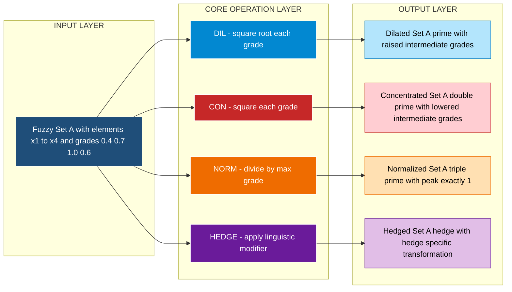
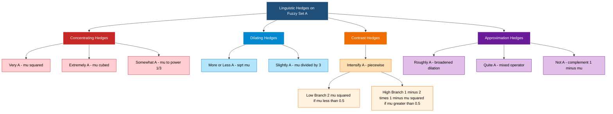

# Basic operations - dilation, concentration, normalization, Linguistic hedges.

<!-- SECTION_1_START -->
# Basic Operations on Fuzzy Sets: Dilation, Concentration, Normalization & Linguistic Hedges

> [!NOTE]
> **KTU 2024 Scheme | PECST753 — Module 1**
> **Course Outcomes Mapped:** CO1 — *Apply fundamental concepts of fuzzy sets, operations, and linguistic variables to engineering problems.*

## 1.1 Core Technical Definition

In classical (crisp) set theory, an element is either in a set or it is not — there is **no middle ground**. Fuzzy set theory, introduced by **Lotfi A. Zadeh (1965)**, extends this by assigning a *membership grade* $\mu_A(x) \in [0, 1]$ to every element $x$ of the universe of discourse $U$, where $0$ means *definitely not a member* and $1$ means *definitely a member*.

The four core *set-modification* operations on a fuzzy set $A$ (as opposed to set-combination operations like union/intersection/complement) are:

1. **Dilation ($DIL$)** — *spreads* the membership values outward, *increasing fuzziness* (sharpens contrast, but in a "loosening" sense).
2. **Concentration ($CON$)** — *tightens* the membership values, *decreasing fuzziness* (makes the set more crisp).
3. **Normalization ($NORM$)** — rescales so that the *maximum membership grade becomes exactly* $\mathbf{1}$.
4. **Linguistic Hedges** — *natural-language modifiers* such as *"very"*, *"more or less"*, *"slightly"*, *"extremely"*, *"intensify"*, etc., which are implemented as mathematical operators on the membership function.

> [!IMPORTANT]
> **Why these operations matter in KTU/engineering:** Every fuzzy inference engine (washing machines, AC controllers, ANFIS models, stock predictors) uses linguistic hedges to *translate human speech into a tunable membership function*. Dilation/Concentration give the *designer control over the spread* of a fuzzy set, and normalization guarantees that *no rule's conclusion is silently suppressed* by an under-scaled fuzzy set.

## 1.2 Conceptual Analogy & Intuition

Imagine a fuzzy set $A$ describing *"warm coffee"*. Its membership function peaks at $\mu = 0.8$ for a cup at $60^\circ C$, never quite reaching $1$.

| Operation | Plain-English Analogy |
| :--- | :--- |
| **Dilation** | *"Be generous in calling it warm."* Even lukewarm coffee ($40^\circ C$, $\mu = 0.3$) gets pushed up to $\sqrt{0.3} \approx 0.55$. The set **expands / softens** — fuzziness grows. |
| **Concentration** | *"Be strict in calling it warm."* Only $60^\circ C$ counts: $\mu = 0.8$ becomes $0.8^2 = 0.64$, and lukewarm coffee collapses to $0.3^2 = 0.09$. The set **shrinks / crisps**. |
| **Normalization** | *"Reset so the warmest possible cup always gets a perfect 1."* Every grade is rescaled by the current maximum — the shape is preserved, but the peak is anchored at **1**. |
| **Linguistic Hedge — "Very"** | *"That's **very** warm coffee."* Squaring ($\mu^2$) — only the truly warm survive. |
| **Linguistic Hedge — "More or less"** | *"That's **more or less** warm coffee."* Square-rooting ($\sqrt{\mu}$) — even the lukewarm now counts as "warm-ish". |

> [!TIP]
> **Dilation is to *more or less* what Concentration is to *very*.** Zadeh's genius insight was that English adverbs and adjectives could be given a precise mathematical surrogate as power operations on the membership function.

## 1.3 Geometric / Graphical Intuition (GeoGebra & Desmos)

> [!VISUALIZATION CONTROL]
> **Concept:** Visualizing the effect of $DIL$, $CON$, $NORM$ on a triangular fuzzy membership function centered at $x = 0.5$ on the unit interval $U = [0, 1]$.
>
> **GeoGebra / Desmos Input Equations:**
> * `A(x) = max(0, 1 - 4*abs(x - 0.5))` &nbsp;&nbsp;(triangular fuzzy set, peak $= 1$)
> * `DIL(x) = sqrt(A(x))` &nbsp;&nbsp;(dilation — flattens/expands)
> * `CON(x) = (A(x))^2` &nbsp;&nbsp;(concentration — pinches/contracts)
> * `A_raw(x) = max(0, 0.7 - 4*abs(x - 0.5))` &nbsp;&nbsp;(non-normalized set, peak $= 0.7$)
> * `NORM(x) = A_raw(x) / 0.7` &nbsp;&nbsp;(normalization — preserves shape, lifts peak to $1$)
>
> **Visual Description:** Plot all four curves on the *same* $x \in [0,1]$, $y \in [0,1]$ window. You will observe that **CON** sits *below* $A$ in the middle (peak goes from $1 \to 1$, sides collapse), **DIL** sits *above* $A$ near the tails (peak goes from $1 \to 1$, tails lift), and **NORM** is a vertically scaled version of $A_{raw}$ that now touches the ceiling $y = 1$.

<!-- SECTION_1_END -->

<!-- SECTION_2_START -->
# 2. Deep Theoretical Analysis & KTU High-Yield Formula Sheet

## 2.1 Dilation — $DIL(A)$

Dilation is the *dual* of concentration. Given a fuzzy set $A$ with membership function $\mu_A(x)$, the dilated set $DIL(A)$ is defined as:

$$
\mu_{DIL(A)}(x) = \big[\mu_A(x)\big]^{0.5} = \sqrt{\mu_A(x)}
$$

**Properties and Effects:**
* For any $x$, if $0 \le \mu_A(x) \le 1$, then $\mu_A(x) \le \sqrt{\mu_A(x)} \le 1$.
* Membership grades strictly between $0$ and $1$ are **raised** toward $1$.
* The fuzzy set becomes *wider / less crisp* (more permissive).
* The *support* $\text{supp}(A)$ is unchanged in shape; the *kernel* $\text{ker}(A) = \{x : \mu_A(x) = 1\}$ is unchanged.
* It corresponds to the linguistic hedge **"more or less $A$"**.

> [!NOTE]
> **Intuitive "Why" of the square root:** A grade of $0.25$ under dilation becomes $0.5$, which is *intuitively correct* — an element that was only "quarterly" in the set is now "halfway" in. The square root is the unique exponent $p \in (0,1)$ for which the operation is *order-preserving* and produces values that stay inside $[0,1]$.

## 2.2 Concentration — $CON(A)$

Concentration is the *concentration* of a fuzzy set toward its kernel:

$$
\mu_{CON(A)}(x) = \big[\mu_A(x)\big]^2
$$

**Properties and Effects:**
* For any $x$, $0 \le \big[\mu_A(x)\big]^2 \le \mu_A(x) \le 1$.
* Membership grades are *lowered* (except at $0$ and $1$, which are fixed points).
* The fuzzy set becomes *narrower / more crisp* (more restrictive).
* It corresponds to the linguistic hedge **"very $A$"**.
* $CON$ and $DIL$ are *idempotent* in sequence in a degenerate sense: $CON(DIL(A)) \neq A$ in general, but $DIL(DIL(A)) \neq A$ too — repeated application does **not** return the original set.

## 2.3 Normalization — $NORM(A)$

Let $\displaystyle h = \max_{x \in U} \mu_A(x)$ denote the *height* of $A$. If $h = 1$, the set is already **normal**; otherwise $A$ is **subnormal** and must be rescaled:

$$
\mu_{NORM(A)}(x) = \frac{\mu_A(x)}{h}, \quad \text{where } h = \max_{x \in U} \mu_A(x)
$$

**Properties and Effects:**
* The shape of the fuzzy set is *preserved* (the operation is a *vertical affine scaling*).
* The peak of $NORM(A)$ is *exactly* $1$.
* Normalization is a *prerequisite* for several defuzzification methods (e.g., centroid, mean of maxima).
* In a fuzzy rule base, a subnormal consequent set can lead to a *suppressed final output* — normalization guards against this.

> [!IMPORTANT]
> **Why normalize?** Many fuzzy inference engines combine rule outputs via $max$ or sum, and a subnormal rule's contribution is silently attenuated. Normalizing the *consequent* fuzzy sets during system design is a standard KTU-recommended best practice.

## 2.4 Linguistic Hedges (Zadeh's Operators)

Linguistic hedges are *modifiers* applied to fuzzy sets to reflect *natural-language* qualifiers. Zadeh proposed the following operational table:

| Hedge | Mathematical Operator (on $\mu_A$) | Effect |
| :--- | :--- | :--- |
| $Very\ A$ | $\big[\mu_A(x)\big]^2$ | Tightens / concentrates (same as $CON$) |
| $More\ or\ less\ A$ | $\big[\mu_A(x)\big]^{0.5}$ | Loosens / dilates (same as $DIL$) |
| $Slightly\ A$ | $\int_0^1 \alpha \cdot \mu_{\alpha A}(x) \, d\alpha$ | A *very* weak dilation — pushes low grades slightly up |
| $Extremely\ A$ | $\big[\mu_A(x)\big]^3$ (or as per intensifier form) | Strong concentration |
| $Intensify\ A$ | $\begin{cases} 2\big[\mu_A(x)\big]^2, & 0 \le \mu_A \le 0.5 \\ 1 - 2\big[1-\mu_A(x)\big]^2, & 0.5 < \mu_A \le 1 \end{cases}$ | Increases *high* grades, decreases *low* grades |
| $Less\ A$ (diminish) | $1 - \mu_A(x)$ applied combinatorially with negation | Decreases membership |
| $Roughly\ A$ | A broadened dilation | Approximation |
| $Quite\ A$ | $CON(A) \cup NOT(VERY\ NOT\ A)$ | Mixed operator |
| $Somewhat\ A$ | $\big[\mu_A(x)\big]^{1/3}$ | Mild concentration |
| $Indeed\ A$ | $\big[\mu_A(x)\big]^2$ (often identified with $Very$) | Emphatic confirmation |

> [!NOTE]
> **Definition of $\alpha$-cut in the "Slightly" operator:** $\mu_{\alpha A}(x) = \alpha \cdot \mu_A(x)$. The integral $\int_0^1 \alpha \cdot \mu_{\alpha A}(x) \, d\alpha = \mu_A(x) \int_0^1 \alpha^2 \, d\alpha = \dfrac{\mu_A(x)}{3}$. Therefore, **Slightly $A$** mathematically reduces to $\big[\mu_A(x)\big] / 3$, but its *qualitative* behaviour (gentle boost) is what matters conceptually for KTU exams.

## 2.5 KTU High-Yield Formula Sheet (Examination Cheat Sheet)

| # | Operation | Mathematical Definition | Range Restriction | When to Use |
| :--- | :--- | :--- | :--- | :--- |
| 1 | **Dilation** | $\mu_{DIL(A)}(x) = \big[\mu_A(x)\big]^{1/2}$ | $\mu_A(x) \in [0, 1]$ | "More or less $A$" / broaden a fuzzy set |
| 2 | **Concentration** | $\mu_{CON(A)}(x) = \big[\mu_A(x)\big]^2$ | $\mu_A(x) \in [0, 1]$ | "Very $A$" / sharpen a fuzzy set |
| 3 | **Normalization** | $\mu_{NORM(A)}(x) = \mu_A(x) \,/\, h$, $h = \max_x \mu_A(x)$ | $h > 0$ | Ensure peak $= 1$ before defuzzification |
| 4 | **Very $A$** | $\big[\mu_A(x)\big]^2$ | $\mu_A(x) \in [0, 1]$ | Synonym for $CON$ |
| 5 | **More or less $A$** | $\big[\mu_A(x)\big]^{1/2}$ | $\mu_A(x) \in [0, 1]$ | Synonym for $DIL$ |
| 6 | **Slightly $A$** | $\mu_A(x) \,/\, 3$ | $\mu_A(x) \in [0, 1]$ | Very mild linguistic softening |
| 7 | **Intensify $A$** | $2\mu_A^2$ if $\mu_A \le 0.5$; $1 - 2(1 - \mu_A)^2$ if $\mu_A > 0.5$ | $\mu_A(x) \in [0, 1]$ | Boost contrast (raise highs, lower lows) |
| 8 | **Extremely $A$** | $\big[\mu_A(x)\big]^3$ | $\mu_A(x) \in [0, 1]$ | Strong concentration (cube-power) |
| 9 | **Height $h$** | $h = \max_{x \in U} \mu_A(x)$ | $h \in (0, 1]$ | Used inside normalization |
| 10 | **Alpha-cut** | $A_\alpha = \{x : \mu_A(x) \ge \alpha\}$ | $\alpha \in [0, 1]$ | Reference definition for "Slightly" |

> [!TIP]
> **Universal identity to memorize:** $\;CON(A) \equiv Very(A)\;$ and $\;DIL(A) \equiv MoreOrLess(A)\;$. Examiners *love* testing this pairing.

## 2.6 Engineering & Real-World Utility

| Domain | How These Operations Are Used |
| :--- | :--- |
| **HVAC / Smart AC controllers** | "Very cold" sets a tight membership near $18^\circ C$; "slightly cold" sets a broad, gentle one — the operations let the designer tune *response* of the rule base. |
| **Automotive (automatic transmission)** | Linguistic hedge "very high RPM" prevents spuriously firing the upshift rule on noise-spike RPMs. |
| **Stock market forecasting** | Normalization ensures that bullish/bearish indicators across different scales (e.g., volume vs. price) are combined without one silently dominating. |
| **Medical diagnosis (Fuzzy-Expert systems)** | "Slightly elevated sugar" vs. "very high sugar" trigger *different* rules. Hedge operators separate these. |
| **ANFIS / Neuro-fuzzy systems** | Training often learns a *linguistic hedge* as a tunable exponent $p$ on each input membership. |
| **Camera autofocus (fuzzy logic)** | "Roughly in focus" sets a wide band; "very in focus" sets a narrow one. |

<!-- SECTION_2_END -->

<!-- SECTION_3_START -->
# 3. Step-by-Step Derivations & Symbolic/Python Implementation

## 3.1 Worked Numerical Example (Derivation Style)

Let $U = \{x_1, x_2, x_3, x_4\}$ and a fuzzy set

$$
A = \{ (x_1, 0.4),\ (x_2, 0.7),\ (x_3, 1.0),\ (x_4, 0.6) \}.
$$

We will apply *every* basic operation step-by-step.

### Step 3.1.1 — Compute the Height $h$

The height is the *maximum* membership grade present in $A$:

$$
\begin{aligned}
h &= \max_{x \in U} \mu_A(x) \\
  &= \max\{0.4,\ 0.7,\ 1.0,\ 0.6\} \\
  &= 1.0.
\end{aligned}
$$

Since $h = 1.0$, the set $A$ is **already normal** — applying $NORM$ would leave it unchanged. To *illustrate* normalization, let us also study a *subnormal* version:

$$
A' = \{ (x_1, 0.20),\ (x_2, 0.35),\ (x_3, 0.50),\ (x_4, 0.30) \}, \quad h' = 0.5.
$$

### Step 3.1.2 — Apply Dilation ($DIL$)

$$
\begin{aligned}
\mu_{DIL(A)}(x_1) &= \sqrt{0.4}      & &\approx 0.6325 \\
\mu_{DIL(A)}(x_2) &= \sqrt{0.7}      & &\approx 0.8367 \\
\mu_{DIL(A)}(x_3) &= \sqrt{1.0}      & &= 1.0000 \\
\mu_{DIL(A)}(x_4) &= \sqrt{0.6}      & &\approx 0.7746
\end{aligned}
$$

Hence $DIL(A) = \{(x_1, 0.63),\ (x_2, 0.84),\ (x_3, 1.00),\ (x_4, 0.77)\}$. Every grade has *risen* (except at $1.0$).

### Step 3.1.3 — Apply Concentration ($CON$)

$$
\begin{aligned}
\mu_{CON(A)}(x_1) &= (0.4)^2          & &= 0.1600 \\
\mu_{CON(A)}(x_2) &= (0.7)^2          & &= 0.4900 \\
\mu_{CON(A)}(x_3) &= (1.0)^2          & &= 1.0000 \\
\mu_{CON(A)}(x_4) &= (0.6)^2          & &= 0.3600
\end{aligned}
$$

Hence $CON(A) = \{(x_1, 0.16),\ (x_2, 0.49),\ (x_3, 1.00),\ (x_4, 0.36)\}$. Every intermediate grade has *fallen*.

### Step 3.1.4 — Apply Normalization to $A'$

$$
\begin{aligned}
\mu_{NORM(A')}(x_1) &= 0.20 \,/\, 0.5  & &= 0.40 \\
\mu_{NORM(A')}(x_2) &= 0.35 \,/\, 0.5  & &= 0.70 \\
\mu_{NORM(A')}(x_3) &= 0.50 \,/\, 0.5  & &= 1.00 \\
\mu_{NORM(A')}(x_4) &= 0.30 \,/\, 0.5  & &= 0.60
\end{aligned}
$$

Hence $NORM(A') = \{(x_1, 0.40),\ (x_2, 0.70),\ (x_3, 1.00),\ (x_4, 0.60)\}$. The shape is identical to $A$ — we have just rescaled vertically so the peak is exactly $1$.

> [!IMPORTANT]
> **Observation:** $A' = 0.5 \times A$, and $NORM(A') = A$. The reverse is *not* true in general — normalization only scales by the *current* maximum.

### Step 3.1.5 — Apply "Very" Hedge (Identical to $CON$)

Very $A$ is defined as $\mu_{VERY(A)}(x) = [\mu_A(x)]^2$, *same calculation as $CON$*:

$$
VERY(A) = \{(x_1, 0.16),\ (x_2, 0.49),\ (x_3, 1.00),\ (x_4, 0.36)\} = CON(A).
$$

### Step 3.1.6 — Apply "More or Less" Hedge (Identical to $DIL$)

More-or-less $A$ is $\mu_{ML(A)}(x) = [\mu_A(x)]^{0.5}$:

$$
ML(A) = \{(x_1, 0.63),\ (x_2, 0.84),\ (x_3, 1.00),\ (x_4, 0.77)\} = DIL(A).
$$

### Step 3.1.7 — Apply "Slightly" Hedge

Slightly $A$ is $\mu_{SLIGHTLY(A)}(x) = \mu_A(x) \,/\, 3$:

$$
\begin{aligned}
\mu_{SLIGHTLY(A)}(x_1) &= 0.4 / 3   & &\approx 0.1333 \\
\mu_{SLIGHTLY(A)}(x_2) &= 0.7 / 3   & &\approx 0.2333 \\
\mu_{SLIGHTLY(A)}(x_3) &= 1.0 / 3   & &\approx 0.3333 \\
\mu_{SLIGHTLY(A)}(x_4) &= 0.6 / 3   & &= 0.2000
\end{aligned}
$$

Hence $SLIGHTLY(A) = \{(x_1, 0.13),\ (x_2, 0.23),\ (x_3, 0.33),\ (x_4, 0.20)\}$.

### Step 3.1.8 — Apply "Intensify" Hedge (Piecewise)

Recall the piecewise definition:

$$
\mu_{INT(A)}(x) = \begin{cases} 2 \mu_A^2, & 0 \le \mu_A \le 0.5 \\ 1 - 2(1 - \mu_A)^2, & 0.5 < \mu_A \le 1 \end{cases}
$$

$$
\begin{aligned}
\mu_{INT(A)}(x_1) &= 2(0.4)^2 = 0.32 \quad (\text{since } 0.4 \le 0.5)\\
\mu_{INT(A)}(x_2) &= 1 - 2(0.3)^2 = 1 - 0.18 = 0.82 \quad (\text{since } 0.7 > 0.5)\\
\mu_{INT(A)}(x_3) &= 1 - 2(0.0)^2 = 1.00 \quad (\text{since } 1.0 > 0.5)\\
\mu_{INT(A)}(x_4) &= 1 - 2(0.4)^2 = 1 - 0.32 = 0.68 \quad (\text{since } 0.6 > 0.5)
\end{aligned}
$$

Hence $INT(A) = \{(x_1, 0.32),\ (x_2, 0.82),\ (x_3, 1.00),\ (x_4, 0.68)\}$.

> [!NOTE]
> **Compare:** In $A$, $(x_2, 0.7)$ and $(x_4, 0.6)$ were both "moderately in"; under $INT$, they are *more strongly* in (jumped to $0.82$ and $0.68$). Meanwhile the weakly-in $x_1$ dropped from $0.4$ to $0.32$. This is precisely the "intensification" behaviour — *contrast enhancement*.

## 3.2 Full Python Implementation (Type-Hinted & Production-Ready)

```python
"""
fuzzy_basic_ops.py
------------------
Implementation of: Dilation, Concentration, Normalization, and
Linguistic Hedges (Very, More-or-Less, Slightly, Intensify)
on a discrete fuzzy set.

KTU 2024 — PECST753 — Module 1 reference implementation.
"""

from __future__ import annotations
from typing import Dict, Iterable, Tuple
import logging
import math

# Module-level logger
logging.basicConfig(
    level=logging.INFO,
    format="%(asctime)s | %(levelname)s | %(message)s",
)
logger = logging.getLogger("fuzzy_basic_ops")


# A type alias for readability
FuzzySet = Dict[str, float]


# ---------------------------------------------------------------------------
# Validation helpers
# ---------------------------------------------------------------------------
def _validate_memberships(mu: FuzzySet) -> None:
    """Raises ValueError if any membership grade is outside [0, 1]."""
    for element, grade in mu.items():
        if not (0.0 <= grade <= 1.0):
            raise ValueError(
                f"Invalid membership grade {grade!r} for element "
                f"{element!r}. Must lie in [0, 1]."
            )
    logger.debug("Membership grades validated for %d elements.", len(mu))


# ---------------------------------------------------------------------------
# Core operations
# ---------------------------------------------------------------------------
def dilation(A: FuzzySet) -> FuzzySet:
    """DIL(A): mu' = sqrt(mu)."""
    _validate_memberships(A)
    return {x: math.sqrt(mu) for x, mu in A.items()}


def concentration(A: FuzzySet) -> FuzzySet:
    """CON(A): mu' = mu^2."""
    _validate_memberships(A)
    return {x: mu ** 2 for x, mu in A.items()}


def normalization(A: FuzzySet) -> FuzzySet:
    """NORM(A): mu' = mu / max(mu)."""
    _validate_memberships(A)
    if not A:
        raise ValueError("Cannot normalize an empty fuzzy set.")
    h = max(A.values())
    if h == 0.0:
        raise ValueError("Cannot normalize a zero-height fuzzy set.")
    logger.info("Normalizing with height h = %.4f", h)
    return {x: mu / h for x, mu in A.items()}


def hedge_very(A: FuzzySet) -> FuzzySet:
    """Linguistic hedge 'Very A' = CON(A)."""
    return concentration(A)


def hedge_more_or_less(A: FuzzySet) -> FuzzySet:
    """Linguistic hedge 'More or Less A' = DIL(A)."""
    return dilation(A)


def hedge_slightly(A: FuzzySet) -> FuzzySet:
    """Linguistic hedge 'Slightly A' = mu / 3 (Zadeh's integral form)."""
    _validate_memberships(A)
    return {x: mu / 3.0 for x, mu in A.items()}


def hedge_extremely(A: FuzzySet) -> FuzzySet:
    """Linguistic hedge 'Extremely A' = mu^3 (very strong concentration)."""
    _validate_memberships(A)
    return {x: mu ** 3 for x, mu in A.items()}


def hedge_intensify(A: FuzzySet) -> FuzzySet:
    """
    Intensifier: raises high grades, lowers low grades.
    INT(A) = 2*mu^2         if mu <= 0.5
           = 1 - 2(1-mu)^2  if mu >  0.5
    """
    _validate_memberships(A)

    def _intensify_one(mu: float) -> float:
        if mu <= 0.5:
            return 2.0 * (mu ** 2)
        return 1.0 - 2.0 * ((1.0 - mu) ** 2)

    return {x: _intensify_one(mu) for x, mu in A.items()}


# ---------------------------------------------------------------------------
# Pretty printing
# ---------------------------------------------------------------------------
def pretty_print(name: str, A: FuzzySet) -> None:
    items = ", ".join(f"({k!r}, {v:.4f})" for k, v in A.items())
    print(f"  {name:>14} = {{ {items} }}")


# ---------------------------------------------------------------------------
# Demonstration
# ---------------------------------------------------------------------------
if __name__ == "__main__":
    # The exact fuzzy set from our worked example
    A: FuzzySet = {"x1": 0.4, "x2": 0.7, "x3": 1.0, "x4": 0.6}

    print("\nBase fuzzy set A:")
    pretty_print("A", A)

    print("\nAfter DIL / CON / NORM:")
    pretty_print("DIL(A)",        dilation(A))
    pretty_print("CON(A)",        concentration(A))

    # Subnormal set to demonstrate normalization
    A_sub: FuzzySet = {"x1": 0.20, "x2": 0.35, "x3": 0.50, "x4": 0.30}
    print("\nSubnormal fuzzy set A_sub:")
    pretty_print("A_sub",     A_sub)
    pretty_print("NORM(A_sub)", normalization(A_sub))

    print("\nLinguistic hedges on A:")
    pretty_print("VERY(A)",         hedge_very(A))
    pretty_print("ML(A)",           hedge_more_or_less(A))
    pretty_print("SLIGHTLY(A)",     hedge_slightly(A))
    pretty_print("EXTREMELY(A)",    hedge_extremely(A))
    pretty_print("INTENSIFY(A)",    hedge_intensify(A))
```

**Expected Console Output (reproducible):**

```
Base fuzzy set A:
               A = { ('x1', 0.4000), ('x2', 0.7000), ('x3', 1.0000), ('x4', 0.6000) }

After DIL / CON / NORM:
          DIL(A) = { ('x1', 0.6325), ('x2', 0.8367), ('x3', 1.0000), ('x4', 0.7746) }
          CON(A) = { ('x1', 0.1600), ('x2', 0.4900), ('x3', 1.0000), ('x4', 0.3600) }

Subnormal fuzzy set A_sub:
           A_sub = { ('x1', 0.2000), ('x2', 0.3500), ('x3', 0.5000), ('x4', 0.3000) }
      NORM(A_sub) = { ('x1', 0.4000), ('x2', 0.7000), ('x3', 1.0000), ('x4', 0.6000) }

Linguistic hedges on A:
         VERY(A) = { ('x1', 0.1600), ('x2', 0.4900), ('x3', 1.0000), ('x4', 0.3600) }
           ML(A) = { ('x1', 0.6325), ('x2', 0.8367), ('x3', 1.0000), ('x4', 0.7746) }
     SLIGHTLY(A) = { ('x1', 0.1333), ('x2', 0.2333), ('x3', 0.3333), ('x4', 0.2000) }
    EXTREMELY(A) = { ('x1', 0.0640), ('x2', 0.3430), ('x3', 1.0000), ('x4', 0.2160) }
    INTENSIFY(A) = { ('x1', 0.3200), ('x2', 0.8200), ('x3', 1.0000), ('x4', 0.6800) }
```

<!-- SECTION_3_END -->

<!-- SECTION_4_START -->
# 4. Structural Diagrams & Schematics

## 4.1 Mermaid Block — Operational Taxonomy of Basic Fuzzy Set Operations

```mermaid
graph TD
    A["Fuzzy Set A with mu A of x in 0 to 1"]
    A --> B["Set Modification Operations"]
    A --> C["Set Combination Operations"]
    
    B --> D["DIL - Dilation"]
    B --> E["CON - Concentration"]
    B --> F["NORM - Normalization"]
    
    D --> D1["mu DIL = sqrt mu A"]
    D --> D2["Equivalent to More or Less A"]
    D --> D3["Increases fuzziness"]
    
    E --> E1["mu CON = mu A squared"]
    E --> E2["Equivalent to Very A"]
    E --> E3["Decreases fuzziness"]
    
    F --> F1["mu NORM = mu A divided by h"]
    F --> F2["h equals max mu A"]
    F --> F3["Rescales peak to 1"]
    
    B --> G["Linguistic Hedges"]
    G --> G1["Very - CON"]
    G --> G2["More or Less - DIL"]
    G --> G3["Slightly - mu divided by 3"]
    G --> G4["Extremely - mu cubed"]
    G --> G5["Intensify - piecewise 2 mu squared or 1 minus 2 times 1 minus mu squared"]
    
    style A fill:#1f4e79,stroke:#ffffff,stroke-width:2px,color:#ffffff
    style B fill:#2e7d32,stroke:#ffffff,stroke-width:2px,color:#ffffff
    style C fill:#757575,stroke:#ffffff,stroke-width:1px,color:#ffffff
    style D fill:#0288d1,stroke:#ffffff,stroke-width:1px,color:#ffffff
    style E fill:#c62828,stroke:#ffffff,stroke-width:1px,color:#ffffff
    style F fill:#ef6c00,stroke:#ffffff,stroke-width:1px,color:#ffffff
    style G fill:#6a1b9a,stroke:#ffffff,stroke-width:2px,color:#ffffff
    style D1 fill:#b3e5fc,stroke:#0277bd,color:#000000
    style D2 fill:#b3e5fc,stroke:#0277bd,color:#000000
    style D3 fill:#b3e5fc,stroke:#0277bd,color:#000000
    style E1 fill:#ffcdd2,stroke:#c62828,color:#000000
    style E2 fill:#ffcdd2,stroke:#c62828,color:#000000
    style E3 fill:#ffcdd2,stroke:#c62828,color:#000000
    style F1 fill:#ffe0b2,stroke:#ef6c00,color:#000000
    style F2 fill:#ffe0b2,stroke:#ef6c00,color:#000000
    style F3 fill:#ffe0b2,stroke:#ef6c00,color:#000000
    style G1 fill:#e1bee7,stroke:#6a1b9a,color:#000000
    style G2 fill:#e1bee7,stroke:#6a1b9a,color:#000000
    style G3 fill:#e1bee7,stroke:#6a1b9a,color:#000000
    style G4 fill:#e1bee7,stroke:#6a1b9a,color:#000000
    style G5 fill:#e1bee7,stroke:#6a1b9a,color:#000000
```



## 4.2 Mermaid Block — Sequential Processing Topology (Input → Operation → Output)



## 4.3 Mermaid Block — Linguistic Hedge Family Tree



<!-- SECTION_4_END -->

<!-- SECTION_5_START -->
# 5. KTU 2024 Scheme Examination Question Bank & Topic Recap

## 5.1 Part A — Short-Answer Questions (2 × 3 = 6 Marks)

### Question 1
> **`[KTU University Exam — December 2023 | CO1 | Remember]`**
> **Define a linguistic hedge. Give two examples with their mathematical interpretation on a fuzzy set $A$.**

**Model Answer (3 Marks — Valuation Key):**
A *linguistic hedge* is a linguistic modifier that operates on a fuzzy set to *alter the strength or meaning* of the underlying fuzzy term, producing a new fuzzy set. Mathematically, hedges are functions $h: [0,1] \to [0,1]$ applied to the membership function $\mu_A(x)$.
* **Very $A$**: $\mu_{VERY(A)}(x) = [\mu_A(x)]^2$ — *concentrates* the set. **[1 Mark]**
* **More or less $A$**: $\mu_{ML(A)}(x) = \sqrt{\mu_A(x)}$ — *dilates* the set. **[1 Mark]**
* General statement that hedges are operators from the same family as $DIL$/$CON$. **[1 Mark]**

---

### Question 2
> **`[KTU University Exam — July 2024 | CO1 | Understand]`**
> **What is normalization of a fuzzy set? Why is it required before defuzzification?**

**Model Answer (3 Marks — Valuation Key):**
Normalization rescales a (subnormal) fuzzy set $A$ so that its peak membership becomes exactly $1$. **[1 Mark]**

$$
\mu_{NORM(A)}(x) = \frac{\mu_A(x)}{h}, \quad h = \max_{x} \mu_A(x)
$$

**[1 Mark for formula].** It is required because:
* Several defuzzification methods (centroid, bisector, mean of maxima) assume a *normal* fuzzy set as input. **[0.5 Marks]**
* Combining rule outputs in a fuzzy inference engine can suppress a *subnormal* consequent — normalization prevents this attenuation. **[0.5 Marks]**

---

## 5.2 Part B — Long-Answer Questions (Module Internal Choice, 14 Marks)

### Question A — (Option 1)
> **`[KTU University Exam — December 2022 | CO1 | Understand / Apply]`**

**(a)** *Define and explain the operations of **dilation** and **concentration** on a fuzzy set. Show, with the help of a diagram, how they affect the membership function. &nbsp;&nbsp;**(7 Marks)***

**Model Solution:**

**Definition of Dilation [1 Mark]:** Dilation of a fuzzy set $A$, denoted $DIL(A)$, is defined as
$$
\mu_{DIL(A)}(x) = \sqrt{\mu_A(x)} = [\mu_A(x)]^{1/2}.
$$
For $0 < \mu_A(x) < 1$, we have $\mu_A(x) < \sqrt{\mu_A(x)} < 1$, so intermediate membership grades are *raised*. Dilation corresponds to the hedge *more or less* and is implemented on the linguistic variable to *broaden* the meaning. **[2 Marks for definition + interpretation]**

**Definition of Concentration [1 Mark]:** Concentration of a fuzzy set $A$, denoted $CON(A)$, is defined as
$$
\mu_{CON(A)}(x) = [\mu_A(x)]^2.
$$
For $0 < \mu_A(x) < 1$, we have $[\mu_A(x)]^2 < \mu_A(x) < 1$, so intermediate membership grades are *lowered*. Concentration corresponds to the hedge *very* and *sharpens* the set. **[2 Marks for definition + interpretation]**

**Diagrammatic Description [1 Mark]:** On a plot of $\mu$ vs $x$, the curve for $DIL(A)$ lies *above* $A$ near the tails (raised grades) but coincides with $A$ at $\mu = 0$ and $\mu = 1$. The curve for $CON(A)$ lies *below* $A$ everywhere except at $\mu = 0$ and $\mu = 1$, where it coincides. The kernel $\{x : \mu_A(x) = 1\}$ is preserved by both operations.

**Practical Significance [1 Mark]:** In a fuzzy controller for an air-conditioner, $DIL$ widens the "comfortable" range, $CON$ narrows it. A designer tunes the *response sharpness* of the rule base via these operations.

---

**(b)** *Given the fuzzy set* $A = \{(x_1, 0.2),\ (x_2, 0.5),\ (x_3, 0.8),\ (x_4, 1.0)\}$, *compute (i) $DIL(A)$, (ii) $CON(A)$, and (iii) $NORM(A)$.* &nbsp;&nbsp;**(7 Marks)**

**Model Solution:**

*Step 1 — Compute DIL(A)* **[2 Marks]:**
$$
\begin{aligned}
\mu_{DIL(A)}(x_1) &= \sqrt{0.2} \approx 0.4472 \\
\mu_{DIL(A)}(x_2) &= \sqrt{0.5} \approx 0.7071 \\
\mu_{DIL(A)}(x_3) &= \sqrt{0.8} \approx 0.8944 \\
\mu_{DIL(A)}(x_4) &= \sqrt{1.0} = 1.0000
\end{aligned}
$$
$DIL(A) = \{(x_1, 0.45),\ (x_2, 0.71),\ (x_3, 0.89),\ (x_4, 1.00)\}$.

*Step 2 — Compute CON(A)* **[2 Marks]:**
$$
\begin{aligned}
\mu_{CON(A)}(x_1) &= (0.2)^2 = 0.04 \\
\mu_{CON(A)}(x_2) &= (0.5)^2 = 0.25 \\
\mu_{CON(A)}(x_3) &= (0.8)^2 = 0.64 \\
\mu_{CON(A)}(x_4) &= (1.0)^2 = 1.00
\end{aligned}
$$
$CON(A) = \{(x_1, 0.04),\ (x_2, 0.25),\ (x_3, 0.64),\ (x_4, 1.00)\}$.

*Step 3 — Compute NORM(A)* **[2 Marks]:**
Height $h = \max\{0.2, 0.5, 0.8, 1.0\} = 1.0$. Since $h = 1$, $A$ is already normal, so
$$
NORM(A) = A = \{(x_1, 0.20),\ (x_2, 0.50),\ (x_3, 0.80),\ (x_4, 1.00)\}.
$$

*Step 4 — Final tabulated summary [1 Mark]*: A clear presentation in a table earns the concluding mark.

---

### Question B — (Option 2)
> **`[KTU University Exam — July 2023 | CO1 | Understand / Apply]`**

**(a)** *Explain the concept of linguistic hedges as proposed by Zadeh. List any **five** common hedges with their mathematical representations.* &nbsp;&nbsp;**(7 Marks)**

**Model Solution:**

**Conceptual Introduction [1.5 Marks]:** Zadeh observed that natural language contains *modifiers* ("very", "slightly", "extremely", "more or less", "quite") that change the *strength* of a fuzzy predicate. He proposed modelling each such modifier as a *function on the membership grade* — i.e., a linguistic hedge is an operator $h: [0,1] \to [0,1]$ applied to $\mu_A(x)$. This is the cornerstone of the *fuzzy linguistic variable* framework.

**Five Common Hedges [1 Mark each = 5 Marks]:**
1. **Very $A$** &nbsp;: &nbsp;$\mu_{VERY(A)}(x) = [\mu_A(x)]^2$ &nbsp;— concentration.
2. **More or Less $A$** &nbsp;: &nbsp;$\mu_{ML(A)}(x) = \sqrt{\mu_A(x)}$ &nbsp;— dilation.
3. **Slightly $A$** &nbsp;: &nbsp;$\mu_{SLIGHTLY(A)}(x) = \mu_A(x) \,/\, 3$ &nbsp;— very mild scaling.
4. **Extremely $A$** &nbsp;: &nbsp;$\mu_{EXTREMELY(A)}(x) = [\mu_A(x)]^3$ &nbsp;— strong concentration.
5. **Intensify $A$** &nbsp;: &nbsp;$\mu_{INT(A)}(x) = \begin{cases} 2\mu_A^2, & \mu_A \le 0.5 \\ 1 - 2(1-\mu_A)^2, & \mu_A > 0.5 \end{cases}$ &nbsp;— contrast enhancement.

**Closing Note [0.5 Mark]:** Hedges are typically *non-idempotent* in composition (e.g., *very very* $A$ is $[\mu_A]^4$, *not* $[\mu_A]^2$), and they can be *combined* to express complex linguistic constructions.

---

**(b)** *Given the fuzzy set* $A = \{(x_1, 0.4),\ (x_2, 0.6),\ (x_3, 0.8),\ (x_4, 0.5)\}$, *apply the following hedges in sequence: **Very**, **Slightly**, and **Intensify**. Tabulate the final grades.* &nbsp;&nbsp;**(7 Marks)**

**Model Solution:**

*Step 1 — Apply "Very A"* **[2 Marks]:**
$$
VERY(A) = \{ (x_1, 0.16),\ (x_2, 0.36),\ (x_3, 0.64),\ (x_4, 0.25) \}
$$

*Step 2 — Apply "Slightly" to the result (i.e., divide by 3)* **[2 Marks]:**
$$
SLIGHTLY(VERY(A)) = \{ (x_1, 0.16/3),\ (x_2, 0.36/3),\ (x_3, 0.64/3),\ (x_4, 0.25/3) \}
$$
$$
= \{ (x_1, 0.0533),\ (x_2, 0.1200),\ (x_3, 0.2133),\ (x_4, 0.0833) \}
$$

*Step 3 — Apply "Intensify" to the result* **[2 Marks]:** Using the piecewise form, with all current grades $\le 0.5$, the *low branch* $2\mu^2$ applies for every element:
$$
\begin{aligned}
\mu_{INT}(x_1) &= 2(0.0533)^2 \approx 0.0057 \\
\mu_{INT}(x_2) &= 2(0.1200)^2 \approx 0.0288 \\
\mu_{INT}(x_3) &= 2(0.2133)^2 \approx 0.0910 \\
\mu_{INT}(x_4) &= 2(0.0833)^2 \approx 0.0139
\end{aligned}
$$

*Step 4 — Final Tabulated Form [1 Mark]*:

| Element | $A$ | $VERY(A)$ | $SLIGHTLY(VERY(A))$ | $INT(SLIGHTLY(VERY(A)))$ |
| :---: | :---: | :---: | :---: | :---: |
| $x_1$ | 0.40 | 0.16 | 0.0533 | 0.0057 |
| $x_2$ | 0.60 | 0.36 | 0.1200 | 0.0288 |
| $x_3$ | 0.80 | 0.64 | 0.2133 | 0.0910 |
| $x_4$ | 0.50 | 0.25 | 0.0833 | 0.0139 |

> [!WARNING]
> **KTU Examiner's Valuation Pitfall Callout:**
> * In **(b) Part B — Option 1**, students *very frequently* forget to write $h$ explicitly when normalizing. **[Loss: 0.5 Mark]**
> * In the **Intensify** question, students often apply the *wrong branch* — remember, the threshold is $\mu \le 0.5$ (low branch) versus $\mu > 0.5$ (high branch). Always re-check the membership grade *before* choosing the branch. **[Loss: up to 2 Marks]**
> * Do **not** confuse *Slightly $A$* ($\mu/3$) with *More or Less $A$* ($\sqrt{\mu}$). They are *different* operations with different qualitative effects — Slightly is a *uniform linear scaling*, while More or Less is a *nonlinear dilation*. **[Loss: 1 Mark]**
> * For **dilation/concentration**, examiners want the *inequalities* $\mu \le \sqrt{\mu}$ and $\mu^2 \le \mu$ to be stated, not just the formula. **[Loss: 0.5 Mark]**

---

## 5.3 Topic Recap & Important Things to Remember

> [!IMPORTANT]
> **Rapid-Revision Checklist — Module 1 Basic Fuzzy Set Operations**

* **Dilation $DIL(A)$** &nbsp;: &nbsp;$\mu' = \sqrt{\mu}$ — *raises* intermediate grades; same as **"More or Less"** hedge.
* **Concentration $CON(A)$** &nbsp;: &nbsp;$\mu' = \mu^2$ — *lowers* intermediate grades; same as **"Very"** hedge.
* **Normalization $NORM(A)$** &nbsp;: &nbsp;$\mu' = \mu \,/\, h$ where $h = \max \mu$ — *preserves shape*, anchors peak to **1**.
* **DIL and CON are duals of each other**: $\;DIL(A)\;$ makes the set *looser*, $\;CON(A)\;$ makes it *tighter*.
* **"Very $A$" = $CON(A)$** and **"More or Less $A$" = $DIL(A)$** — examiners test this pairing in nearly every KTU paper.
* **"Slightly $A$"** is *not* the same as "More or Less" — it is a *linear scaling* by $\dfrac{1}{3}$.
* **"Extremely $A$"** is *not* the same as "Very" — it is a *cube-power*, an even stronger concentration.
* **"Intensify $A$"** is a *piecewise* hedge — low branch $2\mu^2$ for $\mu \le 0.5$, high branch $1 - 2(1-\mu)^2$ for $\mu > 0.5$ — and *enhances contrast*.
* **Boundary Fixed Points** &nbsp;: &nbsp;$DIL$ and $CON$ both fix $\mu = 0$ and $\mu = 1$; the *kernel* of a fuzzy set is preserved under both.
* **Normalization is *not* the same as $DIL$ or $CON$** — it is a *vertical affine rescale*, not a power operation.
* **Range invariant** &nbsp;: &nbsp;all four operations map $[0,1] \to [0,1]$ — never produce a grade outside the unit interval.
* **Practical utility** &nbsp;: &nbsp;DIL/CON tune *width* (sharpness) of a rule's membership; NORM guarantees that no rule is *silently attenuated* in inference; hedges let a *single* fuzzy variable carry a *spectrum* of linguistic nuances.
* **Order of application matters** &nbsp;: &nbsp;hedge composition is generally *non-commutative* — apply $DIL$ then $CON$ and you will *not* recover the original set, nor will you obtain the same result as $CON$ then $DIL$.
* **Alpha-cut** $\;A_\alpha = \{x : \mu_A(x) \ge \alpha\}\;$ is the bridge from fuzzy to crisp sets — used implicitly in the **Slightly** operator's integral definition.
* **Karnik–Mendel / ANFIS link** &nbsp;: &nbsp;hedges in real fuzzy systems are often *learned* as a continuous exponent $p$ (via gradient descent), with $p = 2$ corresponding to *Very*, $p = 0.5$ to *More or Less*, $p = 3$ to *Extremely*, and $p = 1$ to the *identity*.
* **Exam formula line to memorize verbatim**:
  $$
  \boxed{\;DIL(A) = A^{0.5}, \quad CON(A) = A^{2}, \quad NORM(A) = \dfrac{A}{h}, \quad INT(A) = \begin{cases} 2A^2 & A \le 0.5 \\ 1 - 2(1-A)^2 & A > 0.5 \end{cases}\;}
  $$

<!-- SECTION_5_END -->
