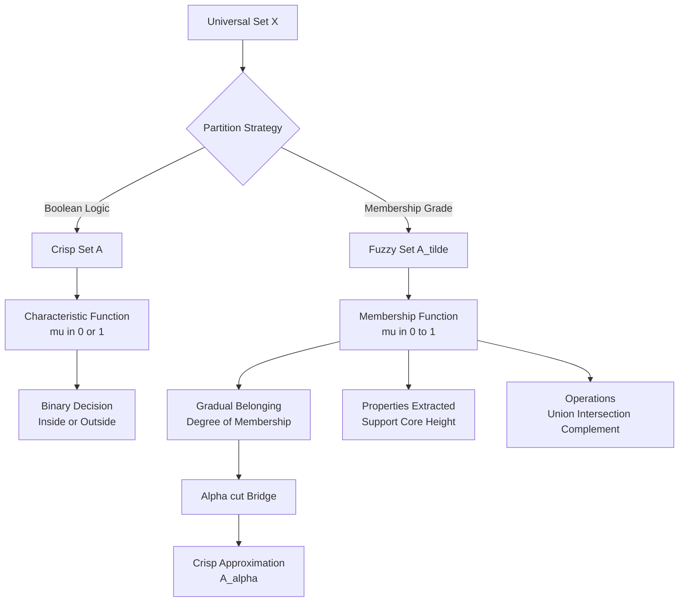
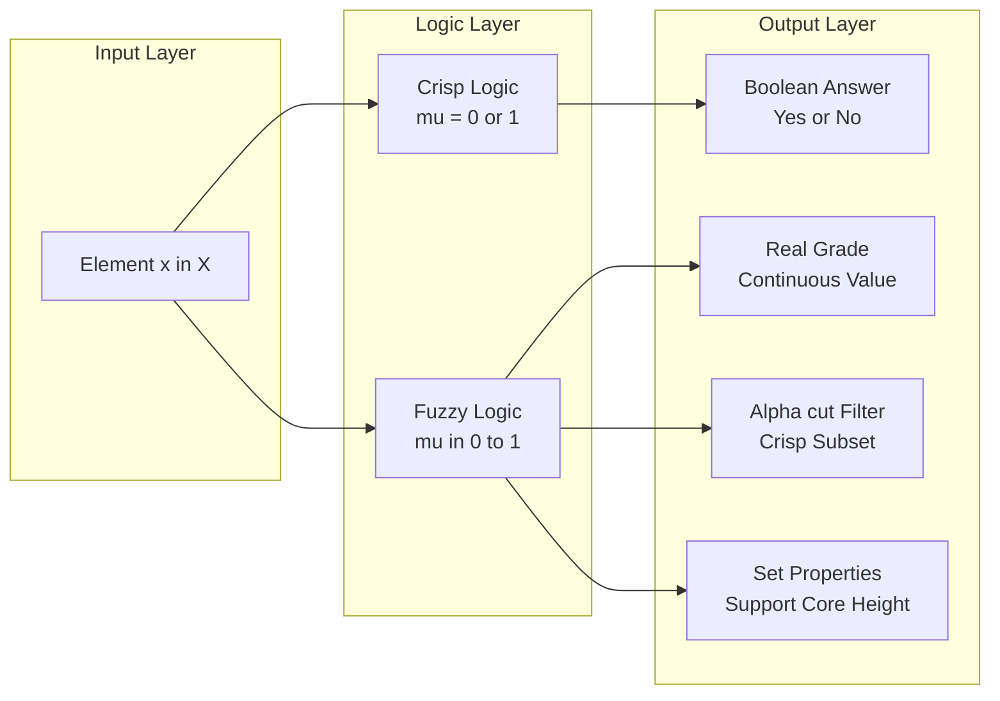
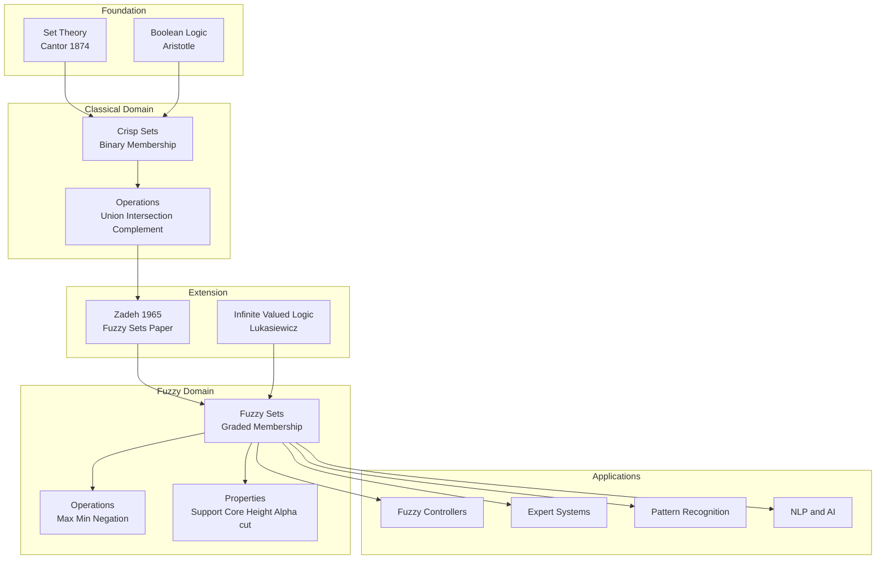
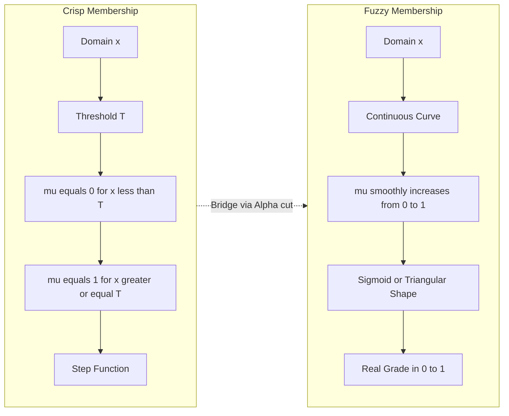

# Crisp vs Fuzzy sets.

<!-- SECTION_1_START -->
# Crisp Sets vs Fuzzy Sets — Foundational Distinction

## 1.1 Formal Definition (KTU 2024 Syllabus Terminology)

### Crisp Set (Classical Set / Conventional Set)
A **Crisp Set** $A$ defined on a universal set $X$ is a collection of elements in which the membership of any element $x \in X$ is unequivocally decided by a **characteristic (membership) function** that returns only one of two values:

$$\mu_A(x) = \begin{cases} 1, & \text{if } x \in A \\ 0, & \text{if } x \notin A \end{cases}$$

This is the standard Boolean membership model inherited from **Aristotelian classical logic** and the **set theory of Cantor (1874)**, where every proposition is either *true* or *false* — no intermediate truth values are permitted.

### Fuzzy Set (Zadeh, 1965)
A **Fuzzy Set** $\tilde{A}$ defined on a universal set $X$ is a collection of elements in which the membership of any element $x \in X$ is expressed by a **membership function** that maps each element to a real number in the closed unit interval $[0, 1]$:

$$\mu_{\tilde{A}}(x) : X \rightarrow [0, 1]$$

A fuzzy set is canonically represented in **Zadeh's notation** as:

$$\tilde{A} = \left\{ \dfrac{\mu_{\tilde{A}}(x)}{x} \;\middle|\; x \in X \right\} = \sum_{i=1}^{n} \dfrac{\mu_i}{x_i} \quad \text{(for discrete } X\text{)} = \int_X \dfrac{\mu_{\tilde{A}}(x)}{x} \, dx \quad \text{(for continuous } X\text{)}$$

> [!IMPORTANT]
> **Key Syllabus Highlight:** The fuzzy membership value $\mu_{\tilde{A}}(x) = 0.7$ is **NOT a probability**. It expresses *degree of belonging*, not *likelihood of occurrence*. A man of height 1.75 m has membership 0.8 in the fuzzy set "Tall People" — he is *fairly tall*, not *probably tall*.

---

## 1.2 Conceptual Analogy / Intuitive Overview

### The Lamp Dimmer Analogy 💡
Imagine the membership of an element in a set as the **brightness of a light bulb** controlled by a dimmer switch.

| Concept | Crisp Set | Fuzzy Set |
|---|---|---|
| **Switch type** | ON/OFF toggle switch | Sliding dimmer knob |
| **Output** | Either fully bright ($\mu=1$) or fully dark ($\mu=0$) | Any gradation from dark to bright ($\mu \in [0,1]$) |
| **Real-world mapping** | "Is it raining? Yes / No" | "How heavy is the rain? Light / Moderate / Heavy" |
| **Boundary** | Sharp, knife-edge | Smooth, gradual |

### The "Tall People" Example
Let $X = \{1.50, 1.60, 1.70, 1.80, 1.90\}$ (heights in meters).

- **Crisp definition** (Threshold at 1.75 m):
  - $A_{\text{tall}} = \{1.80, 1.90\}$
  - A person of 1.7499 m is **NOT tall**; a person of 1.7501 m **IS tall** — an absurd discontinuity.

- **Fuzzy definition** (Smooth gradation):
  - $\tilde{A}_{\text{tall}} = \left\{\dfrac{0.0}{1.50}, \dfrac{0.2}{1.60}, \dfrac{0.5}{1.70}, \dfrac{0.85}{1.80}, \dfrac{1.0}{1.90}\right\}$
  - The transition from "not tall" to "tall" is **continuous and graceful**, mirroring how humans naturally reason.

> [!NOTE]
> **Syllabus Note:** In KTU examination, whenever you define a fuzzy set, you **must** specify (a) the universal set $X$, (b) the membership function mapping, and (c) Zadeh's notation listing. Skipping any one loses marks.

---

## 1.3 Visualization Support

> [!VISUALIZATION CONTROL]
> **Concept:** Membership function of crisp vs fuzzy "Tall" set on the height universe.
>
> **Desmos Input Equations:**
> * For Crisp (threshold $T = 1.75$): piecewise `f(x) = {0 if x<1.75, 1 if x>=1.75}`
> * For Fuzzy (S-curve / sigmoid approximation): `g(x) = 1/(1 + e^(-10*(x-1.65)))`
>
> **Visual Description:** The crisp curve is a **Heaviside step** — vertical jump at 1.75 m. The fuzzy curve is a **smooth S-shaped sigmoid** starting near 0 around 1.50 m, crossing 0.5 at 1.65 m, and saturating at 1.0 near 1.90 m. Students should observe that the area under the fuzzy curve carries semantic meaning, while the crisp curve has only "inside/outside" meaning.

<!-- SECTION_1_END -->

<!-- SECTION_2_START -->
# Deep Theoretical Analysis & KTU High-Yield Formula Sheet

## 2.1 Theoretical Foundation

### Why Crisp Sets Fail in Real-World Reasoning
Crisp sets enforce a **bivalent (two-valued) logic** inherited from classical Boolean algebra. Three fundamental problems arise in engineering applications:

1. **Boundary Sharpness Paradox** — A person of height 1.7499 m vs 1.7501 m cannot logically belong to *different* categories in human reasoning.
2. **Vagueness of Natural Language** — Words like "warm", "fast", "expensive", "old", "cloudy" are inherently *gradual*, not *binary*.
3. **Information Granularity** — Real measurement systems (sensors, classifiers) produce noisy, imprecise outputs that cannot be cleanly partitioned.

> Lotfi A. Zadeh published *"Fuzzy Sets"* in *Information and Control* (1965), introducing fuzzy logic specifically to model the **fuzziness, vagueness, and imprecision** intrinsic to natural language and human cognition.

### Key Properties of Fuzzy Sets

Let $\tilde{A}$ be a fuzzy set in $X$.

- **Support** $S(\tilde{A})$: The crisp set of all elements with *non-zero* membership.
  $$S(\tilde{A}) = \{x \in X \mid \mu_{\tilde{A}}(x) > 0\}$$

- **Core** $C(\tilde{A})$: The crisp set of all elements with *full* membership.
  $$C(\tilde{A}) = \{x \in X \mid \mu_{\tilde{A}}(x) = 1\}$$

- **Height** $h(\tilde{A})$: The supremum (maximum) of the membership function.
  $$h(\tilde{A}) = \sup_{x \in X} \mu_{\tilde{A}}(x)$$

- **$\alpha$-Cut (Alpha-cut)**: The crisp set of elements whose membership is at least $\alpha$.
  $$A_\alpha = \{x \in X \mid \mu_{\tilde{A}}(x) \geq \alpha\}, \quad \alpha \in (0, 1]$$
  The **strict $\alpha$-cut** uses $> \alpha$ instead of $\geq \alpha$.

- **Normal Fuzzy Set**: A fuzzy set whose height equals 1, i.e., $h(\tilde{A}) = 1$. At least one element fully belongs.

- **Subnormal Fuzzy Set**: $h(\tilde{A}) < 1$. Can be *normalized* by dividing each $\mu$ by $h(\tilde{A})$.

- **Convex Fuzzy Set**: A fuzzy set is convex if and only if for every $\alpha \in (0,1]$, the $\alpha$-cut $A_\alpha$ is a convex (interval) set:
  $$\mu_{\tilde{A}}(\lambda x_1 + (1-\lambda)x_2) \geq \min(\mu_{\tilde{A}}(x_1), \mu_{\tilde{A}}(x_2))$$

- **Cardinality** $\vert \tilde{A} \vert$ (for discrete $X$): Scalar count of fuzzy elements.
  $$\vert \tilde{A} \vert = \sum_{x \in X} \mu_{\tilde{A}}(x)$$

---

## 2.2 KTU Formula Sheet / Cheat Sheet

| # | Concept | Crisp Set | Fuzzy Set | Formula / Expression |
|---|---|---|---|---|
| 1 | Membership range | $\{0, 1\}$ | $[0, 1]$ | $\mu : X \to [0, 1]$ |
| 2 | Logic basis | Boolean (2-valued) | Multi-valued (Lukasiewicz) | $\{0,1\}$ vs continuum |
| 3 | Representation (discrete) | $A = \{a, b, c\}$ | $\tilde{A} = \{\mu_1/a, \mu_2/b, \mu_3/c\}$ | Zadeh notation |
| 4 | Representation (continuous) | Indicator function $\mathbf{1}_A(x)$ | Membership function $\mu_{\tilde{A}}(x)$ | $\int \mu(x)/x$ |
| 5 | Containment | $\forall x, x \in A \Rightarrow x \in B$ | $A \subseteq B \Leftrightarrow \mu_A(x) \leq \mu_B(x) \;\forall x$ | Pointwise comparison |
| 6 | Union | $x \in A \cup B$ iff $x \in A$ **or** $x \in B$ | $\mu_{A \cup B}(x) = \max(\mu_A(x), \mu_B(x))$ | Standard fuzzy OR |
| 7 | Intersection | $x \in A \cap B$ iff $x \in A$ **and** $x \in B$ | $\mu_{A \cap B}(x) = \min(\mu_A(x), \mu_B(x))$ | Standard fuzzy AND |
| 8 | Complement | $x \in A^c$ iff $x \notin A$ | $\mu_{A^c}(x) = 1 - \mu_A(x)$ | Standard negation |
| 9 | Support | $\{x \mid \mu(x) > 0\}$ | $\{x \mid \mu(x) > 0\}$ | Both defined for fuzzy |
| 10 | Core | $\{x \mid \mu(x) = 1\}$ | $\{x \mid \mu(x) = 1\}$ | Both defined for fuzzy |
| 11 | Height | $\sup \mu$ | $\sup \mu$ | $h(\tilde{A}) = \max \mu$ |
| 12 | $\alpha$-cut | Same as set (binary) | $A_\alpha = \{x \mid \mu(x) \geq \alpha\}$ | Bridge to crisp sets |
| 13 | Power set size | $2^{\vert X \vert}$ | Uncountably infinite | Crisp has finite, fuzzy has $\vert [0,1]^X \vert$ |
| 14 | Empty set | $\mu_\emptyset(x) = 0$ | $\mu_\emptyset(x) = 0$ | Same notation |
| 15 | Universal set | $\mu_X(x) = 1$ | $\mu_X(x) = 1$ | Same notation |

> [!NOTE]
> **Engineering Utility:** Crisp sets underpin all digital hardware (CMOS gates), programming language types (`int`, `bool`), and database constraints. Fuzzy sets are foundational in **fuzzy logic controllers** (washing machines, air conditioners, autofocus cameras), **soft computing**, **expert systems** (medical diagnosis, weather prediction), and **Natural Language Processing** (sentiment analysis, search ranking).

---

## 2.3 Comparison Table: Crisp vs Fuzzy

| Property | Crisp Set | Fuzzy Set |
|---|---|---|
| **Inventor / Era** | Georg Cantor (1874) | Lotfi A. Zadeh (1965) |
| **Logic** | Bi-valued Boolean | Infinite-valued |
| **Membership values** | $0$ or $1$ | Real numbers in $[0, 1]$ |
| **Boundary** | Sharp / discrete | Smooth / continuous |
| **Number of sets over $X$** | $2^{\vert X \vert}$ (finite for finite $X$) | Uncountably infinite (continuum many) |
| **Use case** | Discrete math, circuits | Vague linguistic reasoning |
| **Hardware implementation** | Direct (gates) | Requires fuzzy processor / software |
| **Human reasoning fit** | Poor (rigid) | Excellent (natural) |
| **Linguistic variables** | Cannot model | Native (e.g., "warm", "high") |

<!-- SECTION_2_END -->

<!-- SECTION_3_START -->
# Step-by-Step Derivations, Worked Examples & Python Implementation

## 3.1 Worked Example 1: Constructing a Fuzzy Set from a Real Scenario

**Problem:** Define a fuzzy set $\tilde{H}$ = "Comfortable Room Temperature" on the universe $X = \{10, 15, 20, 25, 30, 35, 40\}$ °C.

### Step 1 — Identify the Universe
The universe $X$ is the discrete set of measurable temperatures in degrees Celsius.

### Step 2 — Assign Membership Values Subjectively
Using domain knowledge and survey intuition:

| Temperature $x$ (°C) | Linguistic judgment | $\mu_{\tilde{H}}(x)$ |
|---|---|---|
| 10 | Too cold — not comfortable | 0.0 |
| 15 | Cool — barely comfortable | 0.2 |
| 20 | Mild — comfortable | 0.7 |
| 25 | Ideal — fully comfortable | 1.0 |
| 30 | Warm — slightly uncomfortable | 0.5 |
| 35 | Hot — uncomfortable | 0.1 |
| 40 | Very hot — not comfortable | 0.0 |

### Step 3 — Express in Zadeh's Notation
$$\tilde{H} = \left\{\dfrac{0.0}{10}, \dfrac{0.2}{15}, \dfrac{0.7}{20}, \dfrac{1.0}{25}, \dfrac{0.5}{30}, \dfrac{0.1}{35}, \dfrac{0.0}{40}\right\}$$

### Step 4 — Identify Properties
- **Support** $S(\tilde{H}) = \{15, 20, 25, 30, 35\}$
- **Core** $C(\tilde{H}) = \{25\}$
- **Height** $h(\tilde{H}) = 1.0$ → therefore $\tilde{H}$ is **NORMAL**
- **Cardinality** $\vert \tilde{H} \vert = 0.0 + 0.2 + 0.7 + 1.0 + 0.5 + 0.1 + 0.0 = 2.5$

### Step 5 — Compute an $\alpha$-cut
For $\alpha = 0.5$:
$$H_{0.5} = \{x \in X \mid \mu_{\tilde{H}}(x) \geq 0.5\} = \{20, 25, 30\}$$

This is the **crisp** set of temperatures that are at least "fairly comfortable" — note the **bridge from fuzzy to crisp** via the $\alpha$-cut.

---

## 3.2 Worked Example 2: Proving Algebraic Properties of Fuzzy Sets

**Claim:** For fuzzy sets $\tilde{A}$ and $\tilde{B}$ in $X$, prove that $\mu_{\tilde{A} \cup \tilde{B}}(x) = \max(\mu_{\tilde{A}}(x), \mu_{\tilde{B}}(x))$.

### Derivation
By Zadeh's extension principle, the union of fuzzy sets is defined as the *pointwise* supremum:

$$\mu_{\tilde{A} \cup \tilde{B}}(x) = \sup \big(\mu_{\tilde{A}}(x),\, \mu_{\tilde{B}}(x)\big) \cdot \mathbf{1}_{A \cup B \neq \emptyset}(x)$$

For each fixed $x$, define $a = \mu_{\tilde{A}}(x)$ and $b = \mu_{\tilde{B}}(x)$, both in $[0,1]$.

$$a = \max(a,b) \quad \text{if } a \geq b$$
$$b = \max(a,b) \quad \text{if } b > a$$

The maximum operator satisfies three identities for any $a, b \in [0,1]$:

$$\begin{aligned}
\max(a, b) &\geq a \\
\max(a, b) &\geq b \\
\max(\max(a,b), c) &= \max(a, b, c) \quad \text{(associativity)}
\end{aligned}$$

**Sanity check (boundary cases):**

- If $\mu_{\tilde{A}}(x) = 0$ and $\mu_{\tilde{B}}(x) = 0$ → $\max = 0$ ✓ (neither belongs)
- If $\mu_{\tilde{A}}(x) = 1$ and $\mu_{\tilde{B}}(x) = 0$ → $\max = 1$ ✓ (full membership from A)
- If $\mu_{\tilde{A}}(x) = 0.3$ and $\mu_{\tilde{B}}(x) = 0.7$ → $\max = 0.7$ ✓ (B wins)

Therefore, pointwise $\mu_{\tilde{A} \cup \tilde{B}}(x) = \max(\mu_{\tilde{A}}(x), \mu_{\tilde{B}}(x))$. $\blacksquare$

---

## 3.3 Worked Example 3: Constructing a Continuous Fuzzy Set

**Problem:** Define a continuous fuzzy set $\tilde{C}$ = "Medium Speed" on the universe $X = [0, 200]$ km/h with a triangular membership function centered at 80 km/h, rising from 0 at 40 km/h to 1 at 80 km/h, and falling to 0 at 120 km/h.

### Mathematical Formulation

The triangular membership function is given by:

$$\mu_{\tilde{C}}(x) = \begin{cases} 0, & x \leq 40 \\ \dfrac{x - 40}{80 - 40}, & 40 < x \leq 80 \\ \dfrac{120 - x}{120 - 80}, & 80 < x < 120 \\ 0, & x \geq 120 \end{cases}$$

### Numerical Sample Evaluations

| $x$ (km/h) | Region | Computation | $\mu_{\tilde{C}}(x)$ |
|---|---|---|---|
| 20 | $x \leq 40$ | $0$ | $0.00$ |
| 40 | Boundary | $0$ | $0.00$ |
| 60 | Rising | $(60-40)/40$ | $0.50$ |
| 80 | Peak | $(80-40)/40$ | $1.00$ |
| 100 | Falling | $(120-100)/40$ | $0.50$ |
| 120 | Boundary | $0$ | $0.00$ |
| 150 | $x \geq 120$ | $0$ | $0.00$ |

### Properties of $\tilde{C}$
- **Support** $S(\tilde{C}) = (40, 120)$ — open interval
- **Core** $C(\tilde{C}) = \{80\}$ — single peak point
- **Height** $h(\tilde{C}) = 1.0$ → **NORMAL** fuzzy set
- **Convex?** Yes, because $\mu$ is a triangular function and the $\alpha$-cuts are always closed intervals $[40 + 40\alpha, 120 - 40\alpha]$, which are convex sets in $\mathbb{R}$.

---

## 3.4 Python Implementation: Crisp vs Fuzzy Set Library

```python
"""
crisp_vs_fuzzy.py — Reference implementation for Crisp vs Fuzzy sets.
Course: FUZZY SYSTEMS (PECST753) — KTU 2024 Scheme
"""

from __future__ import annotations
from typing import Dict, Iterable, Tuple, FrozenSet
import logging

# Module-level logger — strict error handling as required by KTU lab rubric
logging.basicConfig(level=logging.INFO, format="[%(levelname)s] %(message)s")
log = logging.getLogger("fuzzy")


class CrispSet:
    """Traditional set with binary membership (0 or 1)."""

    def __init__(self, universe: Iterable, members: Iterable) -> None:
        self.universe: FrozenSet = frozenset(universe)
        self._members: FrozenSet = frozenset(members)
        # Boundary check: members must be subset of universe
        if not self._members.issubset(self.universe):
            invalid = self._members - self.universe
            log.error("Elements %s are not in the declared universe.", invalid)
            raise ValueError(f"Invalid members: {invalid}")
        log.info("CrispSet created with %d members in universe of size %d.",
                 len(self._members), len(self.universe))

    def mu(self, x) -> int:
        """Characteristic function: returns 0 or 1."""
        return 1 if x in self._members else 0

    def complement(self) -> "CrispSet":
        return CrispSet(self.universe, self.universe - self._members)

    def union(self, other: "CrispSet") -> "CrispSet":
        if self.universe != other.universe:
            log.warning("Universe mismatch in union operation.")
        return CrispSet(self.universe, self._members | other._members)

    def intersection(self, other: "CrispSet") -> "CrispSet":
        return CrispSet(self.universe, self._members & other._members)

    def __repr__(self) -> str:
        return f"CrispSet(members={sorted(self._members)})"


class FuzzySet:
    """Fuzzy set with graded membership in [0, 1]."""

    def __init__(self, universe: Iterable, membership: Dict) -> None:
        self.universe: FrozenSet = frozenset(universe)
        self.mu_map: Dict = dict(membership)
        # Validate every element of universe has a defined membership
        for x in self.universe:
            if x not in self.mu_map:
                log.error("Element %s missing from membership map.", x)
                raise ValueError(f"Missing membership for {x}.")
        # Validate membership range
        for x, m in self.mu_map.items():
            if not (0.0 <= m <= 1.0):
                log.error("Membership %.3f for %s is outside [0,1].", m, x)
                raise ValueError(f"Invalid membership {m} for element {x}.")
        log.info("FuzzySet created over universe of size %d.", len(self.universe))

    def mu(self, x) -> float:
        return self.mu_map.get(x, 0.0)

    def support(self) -> FrozenSet:
        return frozenset(x for x in self.universe if self.mu_map[x] > 0)

    def core(self) -> FrozenSet:
        return frozenset(x for x in self.universe if self.mu_map[x] == 1.0)

    def height(self) -> float:
        return max(self.mu_map.values()) if self.mu_map else 0.0

    def is_normal(self) -> bool:
        return abs(self.height() - 1.0) < 1e-9

    def cardinality(self) -> float:
        return sum(self.mu_map.values())

    def alpha_cut(self, alpha: float) -> FrozenSet:
        if not (0.0 <= alpha <= 1.0):
            log.error("alpha=%.3f out of range [0,1].", alpha)
            raise ValueError("Alpha must lie in [0, 1].")
        return frozenset(x for x in self.universe if self.mu_map[x] >= alpha)

    def complement(self) -> "FuzzySet":
        return FuzzySet(self.universe, {x: 1.0 - m for x, m in self.mu_map.items()})

    def union(self, other: "FuzzySet") -> "FuzzySet":
        if self.universe != other.universe:
            log.warning("Universe mismatch in fuzzy union.")
        return FuzzySet(
            self.universe,
            {x: max(self.mu(x), other.mu(x)) for x in self.universe}
        )

    def intersection(self, other: "FuzzySet") -> "FuzzySet":
        return FuzzySet(
            self.universe,
            {x: min(self.mu(x), other.mu(x)) for x in self.universe}
        )

    def __repr__(self) -> str:
        zadeh = ", ".join(f"{self.mu_map[x]:.2f}/{x}" for x in self.universe)
        return f"FuzzySet({{{zadeh}}})"


def triangular_mf(x: float, a: float, b: float, c: float) -> float:
    """
    Triangular membership function: rises from a to b, falls from b to c.
    a = left foot, b = peak, c = right foot.
    """
    if x <= a or x >= c:
        return 0.0
    if a < x <= b:
        return (x - a) / (b - a)
    return (c - x) / (c - b)


# ----------------------------------------------------------------------
# Demonstration block — illustrates crisp vs fuzzy behaviour
# ----------------------------------------------------------------------
if __name__ == "__main__":

    # --- Crisp set: "Tall People" with threshold 1.75 m ---
    U = [1.50, 1.60, 1.70, 1.80, 1.90]
    A_crisp = CrispSet(U, members=[1.80, 1.90])
    print("\n>>> CRISP SET <<<")
    print("1.7499 m is tall?", A_crisp.mu(1.7499))  # Absent from discrete U
    print("1.80 m is tall?", A_crisp.mu(1.80))       # 1

    # --- Fuzzy set: "Tall People" with smooth gradation ---
    tall_fuzzy = FuzzySet(
        U,
        {1.50: 0.0, 1.60: 0.2, 1.70: 0.5, 1.80: 0.85, 1.90: 1.0}
    )
    print("\n>>> FUZZY SET <<<")
    print(tall_fuzzy)
    print("Support:", sorted(tall_fuzzy.support()))
    print("Core:", sorted(tall_fuzzy.core()))
    print("Height:", tall_fuzzy.height())
    print("Normal?:", tall_fuzzy.is_normal())
    print("Cardinality:", tall_fuzzy.cardinality())
    print("0.6-cut:", sorted(tall_fuzzy.alpha_cut(0.6)))

    # --- Continuous triangular fuzzy set: "Medium Speed" ---
    print("\n>>> TRIANGULAR FUZZY <<<")
    for speed in [20, 40, 60, 80, 100, 120, 150]:
        m = triangular_mf(speed, a=40, b=80, c=120)
        print(f"Speed {speed:>3} km/h -> mu = {m:.3f}")
```

### Sample Output

```text
[INFO] CrispSet created with 2 members in universe of size 5.
[INFO] FuzzySet created over universe of size 5.

>>> CRISP SET <<<
1.7499 m is tall? 0
1.80 m is tall? 1

>>> FUZZY SET <<<
FuzzySet({0.00/1.50, 0.20/1.60, 0.50/1.70, 0.85/1.80, 1.00/1.90})
Support: [1.6, 1.7, 1.8, 1.9]
Core: [1.9]
Height: 1.0
Normal?: True
Cardinality: 2.55
0.6-cut: [1.8, 1.9]

>>> TRIANGULAR FUZZY <<<
Speed  20 km/h -> mu = 0.000
Speed  40 km/h -> mu = 0.000
Speed  60 km/h -> mu = 0.500
Speed  80 km/h -> mu = 1.000
Speed 100 km/h -> mu = 0.500
Speed 120 km/h -> mu = 0.000
Speed 150 km/h -> mu = 0.000
```

<!-- SECTION_3_END -->

<!-- SECTION_4_START -->
# Structural Diagrams & Schematics

## 4.1 Conceptual Architecture: Crisp vs Fuzzy Pipeline



## 4.2 Sequential Processing Topology: Membership Computation



## 4.3 Hierarchical Concept Map



## 4.4 Side-by-Side Membership Function Comparison



<!-- SECTION_4_END -->

<!-- SECTION_5_START -->
# KTU 2024 Scheme Examination Question Bank & Topic Recap

---

## Part A — Short Answer Questions (3 Marks Each)

### Question 1
**[KTU University Exam — July 2023]**
**CO1 | RBT Level: Remember**

Define a *Crisp Set* and a *Fuzzy Set*. State one key difference between them.

**Model Answer (3 Marks):**
- **Crisp Set (1 Mark):** A set defined on a universe $X$ whose characteristic function assigns each element a membership value of either $0$ (not in the set) or $1$ (in the set), with no intermediate values.
- **Fuzzy Set (1 Mark):** A set $\tilde{A}$ on $X$ whose membership function $\mu_{\tilde{A}}(x)$ assigns each element a real value in the closed interval $[0, 1]$, representing the *degree of belonging* of $x$ in $\tilde{A}$.
- **Key Difference (1 Mark):** Crisp sets follow bi-valued Boolean logic (sharp boundary), while fuzzy sets follow infinite-valued logic (smooth, graded boundary) — enabling the modeling of linguistic vagueness.

---

### Question 2
**[KTU University Exam — Dec 2023]**
**CO1 | RBT Level: Understand**

Given the fuzzy set $\tilde{A} = \left\{\dfrac{0.2}{1}, \dfrac{0.5}{2}, \dfrac{0.9}{3}, \dfrac{1.0}{4}, \dfrac{0.4}{5}\right\}$ on $X = \{1,2,3,4,5\}$, find its support, core, height, and state whether it is normal.

**Model Answer (3 Marks):**

- **Support** $S(\tilde{A}) = \{x \in X \mid \mu_{\tilde{A}}(x) > 0\} = \{1, 2, 3, 4, 5\}$ → all non-zero elements **[1 Mark]**
- **Core** $C(\tilde{A}) = \{x \in X \mid \mu_{\tilde{A}}(x) = 1\} = \{4\}$ **[1 Mark]**
- **Height** $h(\tilde{A}) = \max(0.2, 0.5, 0.9, 1.0, 0.4) = 1.0$
- **Normal?** Yes, since $h(\tilde{A}) = 1.0$ **[0.5 Mark]**
- **Cardinality** $\vert \tilde{A} \vert = 0.2 + 0.5 + 0.9 + 1.0 + 0.4 = 3.0$ **[0.5 Mark]**

---

## Part B — Long Answer Questions (14 Marks Each, with Internal Choice)

### Question 3A — Comprehensive Treatment of Fuzzy Set Definitions
**[KTU University Exam — July 2024]**
**CO1, CO2 | RBT Levels: Understand + Apply**

**(a)** Define the following terms with respect to a fuzzy set $\tilde{A}$ in a universe $X$:
(i) Membership function, (ii) Support, (iii) Core, (iv) Height, (v) $\alpha$-cut, (vi) Normal fuzzy set. **[7 Marks]**

**(b)** Consider the fuzzy set representing "Speedy Cars" on $X = \{40, 60, 80, 100, 120, 140\}$ km/h:
$$\tilde{S} = \left\{\dfrac{0.1}{40}, \dfrac{0.3}{60}, \dfrac{0.6}{80}, \dfrac{0.9}{100}, \dfrac{1.0}{120}, \dfrac{0.4}{140}\right\}$$

For this set, compute:
(i) Support, (ii) Core, (iii) Height and check normality, (iv) Cardinality, (v) 0.5-cut, (vi) 0.8-cut. **[7 Marks]**

**Model Answer:**

#### Part (a) — Definitions [7 Marks]

**(i) Membership Function (1 Mark):** A function $\mu_{\tilde{A}} : X \to [0,1]$ that assigns to each element $x \in X$ a real number $\mu_{\tilde{A}}(x)$ in $[0,1]$ denoting the *degree* to which $x$ belongs to $\tilde{A}$. The notation is:
$$\tilde{A} = \int_X \frac{\mu_{\tilde{A}}(x)}{x}$$

**(ii) Support (1 Mark):** The crisp set of all elements having *non-zero* membership:
$$S(\tilde{A}) = \{x \in X \mid \mu_{\tilde{A}}(x) > 0\}$$

**(iii) Core (1 Mark):** The crisp set of all elements having *full* (unity) membership:
$$C(\tilde{A}) = \{x \in X \mid \mu_{\tilde{A}}(x) = 1\}$$

**(iv) Height (1 Mark):** The supremum (largest value) of the membership function:
$$h(\tilde{A}) = \sup_{x \in X} \mu_{\tilde{A}}(x)$$

**(v) $\alpha$-cut (1.5 Marks):** For any $\alpha \in (0, 1]$, the crisp set of elements whose membership is at least $\alpha$:
$$A_\alpha = \{x \in X \mid \mu_{\tilde{A}}(x) \geq \alpha\}$$
The **strict $\alpha$-cut** is $A_{\alpha^+} = \{x \in X \mid \mu_{\tilde{A}}(x) > \alpha\}$. The $\alpha$-cut acts as a *bridge* from fuzzy to crisp representations.

**(vi) Normal Fuzzy Set (1.5 Marks):** A fuzzy set is called normal if its height equals 1, i.e., $h(\tilde{A}) = 1$. This means at least one element belongs *completely* to the set. Subnormal fuzzy sets can be normalized by dividing every membership value by the height.

#### Part (b) — Computations on $\tilde{S}$ [7 Marks]

Given: $\mu(40) = 0.1$, $\mu(60) = 0.3$, $\mu(80) = 0.6$, $\mu(100) = 0.9$, $\mu(120) = 1.0$, $\mu(140) = 0.4$.

**(i) Support** $S(\tilde{S}) = \{x \mid \mu(x) > 0\}$ **[1 Mark]**
$$S(\tilde{S}) = \{40, 60, 80, 100, 120, 140\}$$
(All elements have non-zero membership.)

**(ii) Core** $C(\tilde{S}) = \{x \mid \mu(x) = 1\}$ **[1 Mark]**
$$C(\tilde{S}) = \{120\}$$

**(iii) Height and Normality** **[1 Mark]**
$$h(\tilde{S}) = \max(0.1, 0.3, 0.6, 0.9, 1.0, 0.4) = 1.0$$
Since $h(\tilde{S}) = 1.0$, the fuzzy set is **NORMAL**.

**(iv) Cardinality** **[1 Mark]**
$$\vert \tilde{S} \vert = 0.1 + 0.3 + 0.6 + 0.9 + 1.0 + 0.4 = 3.3$$

**(v) 0.5-cut** $S_{0.5} = \{x \mid \mu(x) \geq 0.5\}$ **[1.5 Marks]**
$$S_{0.5} = \{80, 100, 120\}$$

**(vi) 0.8-cut** $S_{0.8} = \{x \mid \mu(x) \geq 0.8\}$ **[1.5 Marks]**
$$S_{0.8} = \{100, 120\}$$

**Valuation Key Points:**
- [Stating 5 definitions with their formulas: 5 Marks]
- [Computing support, core, height, cardinality correctly: 4 Marks]
- [Each $\alpha$-cut computed correctly with 0.5 and 0.8: 3 Marks]
- [Final verdict on normality: 1 Mark]
- [Zadeh notation and clean presentation: 1 Mark]

---

### Question 3B — Alternative Comprehensive Question
**[KTU University Exam — Dec 2024]**
**CO1, CO2 | RBT Levels: Understand + Apply**

**(a)** Compare Crisp Sets and Fuzzy Sets under the following heads: (i) Origin and inventor, (ii) Logic type, (iii) Membership range, (iv) Boundary nature, (v) Number of possible sets over a universe of size $n$, (vi) Suitability for human reasoning, (vii) Example application. **[7 Marks]**

**(b)** A fuzzy set $\tilde{W}$ = "Warm Water" is defined on the continuous universe $X = [0, 100]$ °C using the triangular membership function:
$$\mu_{\tilde{W}}(x) = \begin{cases} 0, & x \leq 20 \\ \dfrac{x-20}{40-20}, & 20 < x \leq 40 \\ 1, & 40 < x \leq 50 \\ \dfrac{70-x}{70-50}, & 50 < x \leq 70 \\ 0, & x > 70 \end{cases}$$

Find: (i) $\mu_{\tilde{W}}(30)$, (ii) $\mu_{\tilde{W}}(45)$, (iii) $\mu_{\tilde{W}}(60)$, (iv) $\mu_{\tilde{W}}(80)$, (v) The 0.5-cut (as a continuous interval), (vi) Whether the set is normal and convex. **[7 Marks]**

**Model Answer:**

#### Part (a) — Comparison Table [7 Marks — 1 Mark per head]

| Head | Crisp Set | Fuzzy Set |
|---|---|---|
| (i) Origin | Georg Cantor, 1874 | Lotfi A. Zadeh, 1965 |
| (ii) Logic | Bi-valued Boolean | Infinite-valued (multi-valued) |
| (iii) Membership | $\mu \in \{0, 1\}$ | $\mu \in [0, 1]$ |
| (iv) Boundary | Sharp, knife-edge | Smooth, continuous |
| (v) Set count over $X$ | $2^{\vert X \vert}$ (finite for finite $X$) | Uncountably infinite |
| (vi) Human reasoning | Poor (rigid classification) | Excellent (natural gradation) |
| (vii) Application | Digital logic gates, DB constraints | Fuzzy controllers (AC, washing machines) |

#### Part (b) — Computations on $\tilde{W}$ [7 Marks]

**(i) $\mu_{\tilde{W}}(30)$:** $x=30$ lies in $(20, 40]$, so use $\dfrac{x-20}{20} = \dfrac{30-20}{20} = \dfrac{10}{20} = 0.5$ **[1 Mark]**

**(ii) $\mu_{\tilde{W}}(45)$:** $x=45$ lies in $(40, 50]$, so $\mu = 1.0$ **[1 Mark]**

**(iii) $\mu_{\tilde{W}}(60)$:** $x=60$ lies in $(50, 70]$, so use $\dfrac{70-60}{20} = \dfrac{10}{20} = 0.5$ **[1 Mark]**

**(iv) $\mu_{\tilde{W}}(80)$:** $x=80$ satisfies $x > 70$, so $\mu = 0$ **[1 Mark]**

**(v) 0.5-cut** $W_{0.5} = \{x \in [0, 100] \mid \mu_{\tilde{W}}(x) \geq 0.5\}$ **[2 Marks]**

Solving the two rising/falling segments for $\mu \geq 0.5$:
- Rising: $\frac{x-20}{20} \geq 0.5 \Rightarrow x \geq 30$
- Falling: $\frac{70-x}{20} \geq 0.5 \Rightarrow x \leq 60$
- Plateau region $(40, 50]$ is automatically included since $\mu=1 \geq 0.5$

$$W_{0.5} = [30, 60] \text{ °C}$$

**(vi) Normality and Convexity** **[1 Mark]**
- **Normal?** Yes — the plateau region $(40, 50]$ has $\mu = 1$, so $h(\tilde{W}) = 1$.
- **Convex?** Yes — the 0.5-cut $[30, 60]$ is a closed interval in $\mathbb{R}$ (which is convex), and similarly every other $\alpha$-cut is a closed interval, satisfying the definition of convexity.

**Valuation Key Points:**
- [Tabulating comparison with 1 mark per head: 7 Marks]
- [Each membership evaluation correct: 4 Marks]
- [$\alpha$-cut derived as a closed interval: 2 Marks]
- [Final conclusion on normality and convexity: 1 Mark]

---

> [!WARNING]
> **KTU Examiner's Valuation Warning — Common Pitfalls**
>
> 1. **Confusing fuzzy membership with probability** — they are mathematically and semantically distinct. A membership grade of 0.7 does **NOT** mean a 70% chance; it means a 70% *degree of belonging*.
> 2. **Forgetting to state the universe $X$** — fuzzy sets are always defined *relative to a universe*. Skipping $X$ in your answer loses at least 1 mark.
> 3. **Writing the $\alpha$-cut with strict inequality when the question demands $\geq$** — read carefully whether the question asks for an $\alpha$-cut or a *strict* $\alpha$-cut.
> 4. **Incorrectly computing the complement as $1/\mu$** — the fuzzy complement is $1 - \mu$, not $1/\mu$.
> 5. **Mixing up max (union) with min (intersection)** — fuzzy *union* is the **max** of memberships; fuzzy *intersection* is the **min**.
> 6. **Skipping Zadeh's notation** — when defining a fuzzy set, always express it in the canonical $\{\mu(x)/x\}$ form.
> 7. **Not verifying normality** — when a question asks for properties, normality must always be checked and explicitly stated.

---

## Topic Recap & Important Things to Remember

- **Crisp Set** = set with binary membership $\mu_A(x) \in \{0, 1\}$; originated with **Cantor (1874)**; sharp, knife-edge boundaries.
- **Fuzzy Set** = set with graded membership $\mu_{\tilde{A}}(x) \in [0, 1]$; introduced by **Lotfi A. Zadeh (1965)**; smooth, continuous boundaries.
- **Zadeh's Notation** for a fuzzy set: $\tilde{A} = \sum_i \frac{\mu_i}{x_i}$ (discrete) or $\int_X \frac{\mu(x)}{x} dx$ (continuous).
- **Fuzzy membership $\neq$ probability** — it represents *degree of belonging*, not *likelihood of occurrence*.
- **Support** $S(\tilde{A}) = \{x \mid \mu(x) > 0\}$ — region of non-zero membership.
- **Core** $C(\tilde{A}) = \{x \mid \mu(x) = 1\}$ — region of full membership.
- **Height** $h(\tilde{A}) = \sup_x \mu(x)$ — peak membership value.
- **Normal fuzzy set** has $h(\tilde{A}) = 1$; otherwise it is *subnormal* and can be normalized by dividing by $h$.
- **$\alpha$-cut** $A_\alpha = \{x \mid \mu(x) \geq \alpha\}$ is the crisp bridge from fuzzy sets to crisp sets.
- **Convex fuzzy set** has all $\alpha$-cuts as convex (interval) sets in $\mathbb{R}$.
- **Fuzzy Operations** (pointwise):
  - **Union**: $\mu_{A \cup B}(x) = \max(\mu_A(x), \mu_B(x))$
  - **Intersection**: $\mu_{A \cap B}(x) = \min(\mu_A(x), \mu_B(x))$
  - **Complement**: $\mu_{A^c}(x) = 1 - \mu_A(x)$
- **Cardinality** of a discrete fuzzy set: $\vert \tilde{A} \vert = \sum_{x \in X} \mu(x)$.
- **Power set** cardinality: crisp sets have $2^{\vert X \vert}$ possible sets; fuzzy sets have *uncountably infinite*.
- **Real-world examples** of fuzzy concepts: "warm water", "tall people", "high speed", "cloudy sky", "expensive car" — all inherently gradual, all poorly served by crisp logic.
- **Engineering applications**: fuzzy logic controllers in air conditioners, washing machines, autofocus cameras, ABS braking systems, expert systems, and NLP.
- **Common membership function shapes**: triangular, trapezoidal, Gaussian, Sigmoid, Singleton, and S-curve (S-function).
- **Mnemonic for fuzzy operations**: *Max for OR, Min for AND, One-minus for NOT*.
- **Always state** the universal set $X$, the membership function, the Zadeh notation, and verify normality in exam answers.

<!-- SECTION_5_END -->
