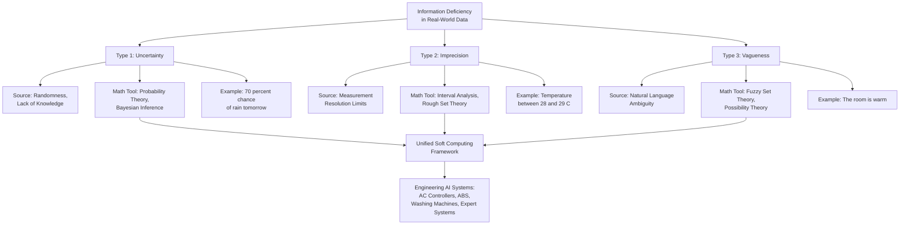
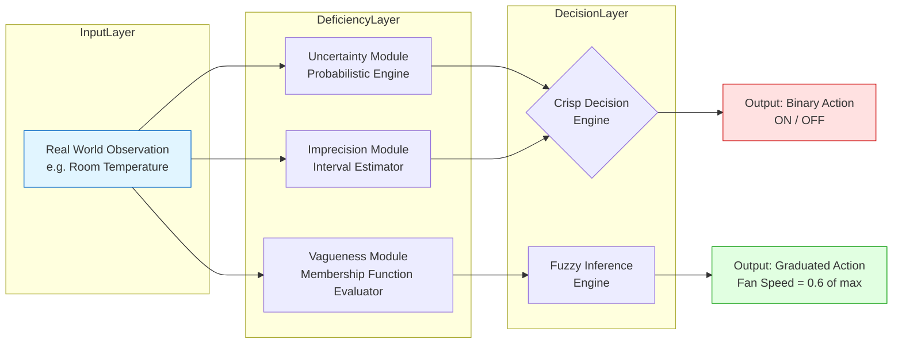
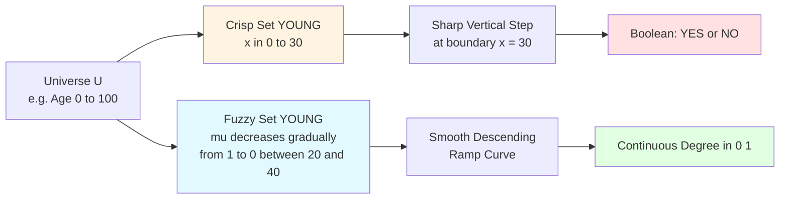

# Introduction -  Uncertainty, Imprecision and Vagueness.

<!-- SECTION_1_START -->
# 1. Introduction — Uncertainty, Imprecision, and Vagueness

## 1.1 Formal Academic Definition (KTU 2024 Syllabus Terminology)

In the formal framework of **Fuzzy Systems & Soft Computing (PECST753)**, every piece of information available to an intelligent system carries some form of deficiency. According to the classical taxonomy proposed by **G. J. Klir** and later extended by **Lotfi A. Zadeh**, the inadequacies inherent in human knowledge and machine perception are classified into three mathematically distinct categories:

| Term | Formal Concept | Source |
|------|---------------|--------|
| **Uncertainty** | Deficiency caused by **randomness or lack of information** about the true state of a system | Stochastic phenomena |
| **Imprecision** | Deficiency caused by **inaccurate or approximate measurements** (interval-valued data) | Limited measurement resolution |
| **Vagueness** | Deficiency caused by **ambiguity in defining class boundaries** of linguistic categories | Natural language, human cognition |

> [!IMPORTANT]
> **Zadeh's Principle of Incompatibility (1973):** *"As the complexity of a system increases, our ability to make precise and yet significant statements about its behavior diminishes until a threshold is reached beyond which precision and significance (relevance) become almost mutually exclusive characteristics."*
>
> This single principle is the philosophical foundation of the entire **Fuzzy Set Theory** syllabus in Module 1 of PECST753.

## 1.2 Conceptual Analogy — The "Weather Forecaster" Intuition

Imagine you are planning a picnic and you ask three different friends about tomorrow's weather. Each friend provides a *different type* of deficient information:

- **Friend A (Vagueness):** *"It will be warm tomorrow."*  
  → The word "warm" has **no sharp boundary**. Is $25^\circ$C warm? What about $24^\circ$C? There is no single threshold — this is **vagueness**, a property of the *language* used.

- **Friend B (Imprecision):** *"The temperature will be around 26 to 28 degrees."*  
  → The information is structured as an **interval**, not a single point. The value is *known to lie in a range* — this is **imprecision**, a property of the *measurement* or estimate.

- **Friend C (Uncertainty):** *"There is a 70% chance of rain in the afternoon."*  
  → The information involves **randomness / probability of an event occurring**. The event is binary (rains / doesn't rain) but the *knowledge* is incomplete — this is **uncertainty**, a property of the *information state*.

> [!NOTE]
> **Key takeaway:** Vagueness is about *boundaries of categories*, Imprecision is about *the value itself*, and Uncertainty is about *the occurrence of the event*. They are mathematically and semantically distinct, although they often co-exist in real-world data.

## 1.3 Physical Constants and Standard Metrics

- **Membership Range:** All fuzzy membership degrees lie in the closed real interval $[0, 1]$.
- **Probability Range:** Probabilities also lie in $[0, 1]$, but they represent *frequency* not *belongingness*.
- **Universe of Discourse ($U$):** The set of all possible values a variable can take. **Bold** standard notation is $U$ (uppercase) and $\mu$ (Greek lowercase mu) for membership.

## 1.4 Visualization Control — Crisp vs Fuzzy Membership

> [!VISUALIZATION CONTROL]
> **Concept:** Visualizing a "Young" Age Membership Function
> **GeoGebra / Desmos Input Equations:**
>
> * Crisp Set: `f_crisp(x) = If(x < 30, 1, 0)`
> * Fuzzy Set: `f_fuzzy(x) = max(0, min(1, (40 - x) / 10))`
> **Visual Description:** On the x-axis plot *Age (years)* from 0 to 50. For the crisp set, observe a sudden vertical jump from 1 to 0 exactly at age 30. For the fuzzy set, observe a **smooth descending ramp** starting at age 30 (membership = 1) and reaching 0 at age 40 — this ramp is the visual signature of **vagueness**.

<!-- SECTION_1_END -->

<!-- SECTION_2_START -->
# 2. Deep Theoretical Analysis & KTU High-Yield Formula Sheet

## 2.1 Decomposing the Three Deficiencies

### 2.1.1 Uncertainty (Information Deficiency of Type I)
- **Nature:** Stochastic / random. It is the lack of knowledge about **which element of a well-defined set will occur**.
- **Mathematical Tool:** Probability Theory (Kolmogorov Axioms), Bayesian Inference.
- **Example Domains:** Coin toss, stock market index, failure rate of a component, weather forecasting.
- **Source Mechanism:** Randomness in the physical process itself, or **incomplete knowledge** about deterministic underlying causes (epistemic uncertainty).
- **Reduction Strategy:** Collect more data over time, perform statistical sampling.

### 2.1.2 Imprecision (Information Deficiency of Type II)
- **Nature:** Numerical coarseness. The information is a **value lying within an interval** rather than an exact point.
- **Mathematical Tool:** Interval Analysis, Rough Set Theory (Pawlak), Tolerance Relations.
- **Example Domains:** Sensor reading "between 28°C and 29°C", a person's age recorded as "about 30", instrument resolution limits.
- **Source Mechanism:** Limited resolution of measuring instruments, rounding-off errors, deliberate summarization.
- **Reduction Strategy:** Use a higher-precision instrument, refine the scale.

### 2.1.3 Vagueness (Information Deficiency of Type III)
- **Nature:** Semantic / linguistic. The category itself does not have **sharp boundaries**; membership is a matter of *degree*.
- **Mathematical Tool:** **Fuzzy Set Theory (Zadeh, 1965)**, Possibility Theory.
- **Example Domains:** "Tall", "young", "expensive", "fast", "cloudy", "delicious", "hot".
- **Source Mechanism:** Inherent ambiguity in human language and natural classification schemes (e.g., biology — what counts as "warm-blooded"?).
- **Reduction Strategy:** Mathematical redefinition using membership functions — **cannot be removed by more data**.

> [!IMPORTANT]
> **KTU High-Yield Insight:** A single real-world statement can simultaneously exhibit **all three** deficiencies. For example, *"Tomorrow it will probably be quite warm (around 30°C)"* contains:
> - **Uncertainty** → "probably" (randomness / chance)
> - **Imprecision** → "around 30°C" (interval)
> - **Vagueness** → "quite warm" (linguistic boundary)

## 2.2 The Mathematical Bridge — Crisp vs Fuzzy Representation

### 2.2.1 Crisp (Classical) Sets
A classical set $A$ in a universe of discourse $U$ is described by its **characteristic function** $\chi_A : U \to \{0, 1\}$:
$$\chi_A(x) = \begin{cases} 1 & \text{if } x \in A \\ 0 & \text{if } x \notin A \end{cases}$$
This is a **binary (Boolean)** decision — the element either belongs completely or not at all. There is no middle ground.

### 2.2.2 Fuzzy Sets
A fuzzy set $\tilde{A}$ in $U$ is described by its **membership function** $\mu_{\tilde{A}} : U \to [0, 1]$:
$$\mu_{\tilde{A}}(x) \in [0, 1] \quad \forall x \in U$$
The value $\mu_{\tilde{A}}(x)$ indicates the **degree of belongingness** of $x$ to $\tilde{A}$. A value of $1$ means full membership, $0$ means no membership, and intermediate values represent partial belongingness.

## 2.3 KTU Formula Sheet / Cheat Sheet

| # | Concept | Mathematical Form | Domain of Validity | Engineering Use |
|---|---------|-------------------|-------------------|-----------------|
| 1 | Characteristic function (crisp) | $\chi_A : U \to \{0, 1\}$ | Boolean logic | Classical control, switching |
| 2 | Membership function (fuzzy) | $\mu_{\tilde{A}} : U \to [0, 1]$ | Fuzzy logic | Washing machines, AC inverters, ABS braking |
| 3 | Probability of event | $P(E) \in [0, 1]$ | $\sum P = 1$ for sample space | Risk analysis, reliability engineering |
| 4 | Possibility of event | $\Pi(E) \in [0, 1]$ | $\max \Pi = 1$ for at least one element | Linguistic reasoning, expert systems |
| 5 | Universe of Discourse | $U$ — full range of variable | Application-specific | All fuzzy system design |
| 6 | Support of a fuzzy set | $\text{supp}(\tilde{A}) = \{x \mid \mu_{\tilde{A}}(x) > 0\}$ | $[0, 1]$ | Feature selection in pattern recognition |
| 7 | Core of a fuzzy set | $\text{core}(\tilde{A}) = \{x \mid \mu_{\tilde{A}}(x) = 1\}$ | $\{0, 1\}$ boundaries | Rule firing in fuzzy inference |

## 2.4 Real-World Engineering Utility

- **Automotive:** Toyota, Nissan, and Subaru use fuzzy controllers in automatic transmission gear-shift logic where the input "engine load" is a **vague** linguistic variable.
- **Consumer Electronics:** Samsung and LG washing machines use fuzzy logic to interpret "dirtiness" and "fabric type" — both **vague** concepts — and adjust wash cycle parameters.
- **Medical Diagnosis:** Expert systems (e.g., MYCIN derivatives) use fuzzy membership to handle **imprecise** symptom severity reported by patients.
- **Process Control:** Cement kiln controllers interpret **vague** operator instructions such as "slightly increase temperature" using fuzzy rule bases.
- **Decision Support:** Stock market forecasting systems combine probabilistic **uncertainty** modeling with fuzzy **vagueness** modeling of analyst sentiment.

> [!NOTE]
> In a typical **KTU 14-mark question**, students are expected to draw a clear table distinguishing *Uncertainty vs Imprecision vs Vagueness* with a separate example for each. This is a guaranteed high-yield topic.

<!-- SECTION_2_END -->

<!-- SECTION_3_START -->
# 3. Step-by-Step Derivations & Code Implementation

## 3.1 Worked Example — Quantifying the Three Deficiencies for a Single Variable

Let us consider the variable **"Heater Temperature"** with universe of discourse $U = [0, 100]$ °C.

### 3.1.1 Step 1 — Representing Uncertainty (Probability)

Suppose historical data shows that in 30 out of 100 winter days, the room temperature drops below 15°C. The probability of "cold room" is computed as:
$$P(\text{cold}) = \frac{\text{favourable outcomes}}{\text{total outcomes}} = \frac{30}{100} = 0.30$$
This is a **frequentist** measure of uncertainty. Note that the event "cold" itself is sharply defined as $T < 15^\circ$C.

### 3.1.2 Step 2 — Representing Imprecision (Interval)

A faulty sensor reports the temperature as $T \in [22.5, 24.0]$ °C. The information is structured as a **closed interval**:
$$I = [22.5, 24.0]$$
The true value is known to lie somewhere inside $I$, but the imprecision is quantified by the interval width:
$$\text{width}(I) = 24.0 - 22.5 = 1.5\ ^\circ\text{C}$$

### 3.1.3 Step 3 — Representing Vagueness (Fuzzy Membership)

A human describes the room as "**comfortable**". We define the fuzzy set $\tilde{C} = \text{"Comfortable"}$ with a triangular membership function centered at 22°C, with the base spanning from 18°C to 26°C:
$$\mu_{\tilde{C}}(T) = \begin{cases} 0 & T \leq 18 \\ \dfrac{T - 18}{22 - 18} = \dfrac{T - 18}{4} & 18 < T < 22 \\ \dfrac{26 - T}{26 - 22} = \dfrac{26 - T}{4} & 22 \leq T < 26 \\ 0 & T \geq 26 \end{cases}$$
For $T = 24^\circ$C:
$$\mu_{\tilde{C}}(24) = \frac{26 - 24}{4} = \frac{2}{4} = 0.50$$
The room is "comfortable" to a **degree of 0.50** — neither fully comfortable nor fully uncomfortable.

### 3.1.4 Step 4 — Combined Information Fusion

A complete intelligent statement could be:
> *"The room temperature is probably (60% chance) about 24°C, which is moderately comfortable."*

This single sentence simultaneously encodes:
- **Uncertainty:** 60% probabilistic belief
- **Imprecision:** "about 24°C" (interval of ±1°C)
- **Vagueness:** "moderately comfortable" (fuzzy membership ≈ 0.5)

The above fusion of all three is precisely why **fuzzy systems** are needed in real-world AI/control applications — no single mathematical theory can capture all three simultaneously in a unified way.

## 3.2 Python Implementation — Comparing Crisp, Imprecise, and Vague Representations

```python
from typing import Dict, List, Tuple
import logging

logging.basicConfig(level=logging.INFO, format="%(levelname)s :: %(message)s")
logger = logging.getLogger("FuzzyFoundations")


# -------------------------------------------------------------
# 1) Crisp Set Representation
# -------------------------------------------------------------
def crisp_membership(element: float, threshold: float) -> int:
    """
    Classical characteristic function: returns 1 if element <= threshold,
    else 0. Boundary checks are absolute.
    """
    if element < 0:
        logger.error("Negative temperature is physically invalid: %.2f", element)
        raise ValueError("Temperature cannot be negative in this domain.")
    return 1 if element <= threshold else 0


# -------------------------------------------------------------
# 2) Imprecise (Interval) Representation
# -------------------------------------------------------------
class ImpreciseInterval:
    """Represents a measurement reported as a closed real interval."""

    def __init__(self, lower: float, upper: float) -> None:
        if lower > upper:
            logger.error("Invalid interval: lower=%.2f > upper=%.2f", lower, upper)
            raise ValueError("Lower bound must be <= upper bound.")
        self.lower: float = lower
        self.upper: float = upper

    def width(self) -> float:
        return self.upper - self.lower

    def contains(self, value: float) -> bool:
        return self.lower <= value <= self.upper

    def __repr__(self) -> str:
        return f"[{self.lower:.2f}, {self.upper:.2f}]"


# -------------------------------------------------------------
# 3) Vague (Fuzzy) Set Representation - Triangular Membership
# -------------------------------------------------------------
class TriangularFuzzySet:
    """
    Triangular membership function mu(x; a, b, c):
        - mu = 0 for x <= a
        - mu = (x - a)/(b - a) for a < x < b
        - mu = (c - x)/(c - b) for b <= x < c
        - mu = 0 for x >= c
    """

    def __init__(self, name: str, a: float, b: float, c: float) -> None:
        if not (a <= b <= c):
            raise ValueError(f"Invalid triangular parameters: a={a}, b={b}, c={c}")
        self.name: str = name
        self.a: float = a
        self.b: float = b
        self.c: float = c

    def membership(self, x: float) -> float:
        if x <= self.a or x >= self.c:
            return 0.0
        if self.a < x < self.b:
            return (x - self.a) / (self.b - self.a)
        # self.b <= x < self.c
        return (self.c - x) / (self.c - self.b)

    def support(self) -> Tuple[float, float]:
        return (self.a, self.c)

    def core(self) -> float:
        return self.b


# -------------------------------------------------------------
# 4) Demonstration with Heater-Temperature Example
# -------------------------------------------------------------
def main() -> None:
    T_observed: float = 24.0

    # --- Crisp evaluation (cold if T <= 20) ---
    is_cold_crisp: int = crisp_membership(T_observed, threshold=20.0)
    logger.info("Crisp 'cold' membership at T=%.1f: %d", T_observed, is_cold_crisp)

    # --- Imprecise interval ---
    sensor_reading: ImpreciseInterval = ImpreciseInterval(22.5, 24.0)
    logger.info("Imprecise interval: %s, width=%.2f",
                sensor_reading, sensor_reading.width())
    logger.info("Does interval contain true T=24.0? %s",
                sensor_reading.contains(T_observed))

    # --- Vague fuzzy evaluation (Comfortable = Triangular(18, 22, 26)) ---
    comfortable: TriangularFuzzySet = TriangularFuzzySet("Comfortable", 18.0, 22.0, 26.0)
    mu_comfort: float = comfortable.membership(T_observed)
    logger.info("Fuzzy 'Comfortable' membership at T=%.1f: %.3f", T_observed, mu_comfort)

    # --- Comparison Table ---
    summary: List[Tuple[str, float, str]] = [
        ("Crisp (Cold?)", float(is_cold_crisp), "Binary decision"),
        ("Imprecise (Interval)", sensor_reading.width(), "Width of uncertainty band"),
        ("Vague (Comfortable)", mu_comfort, "Degree of belongingness"),
    ]
    logger.info("Summary of the three deficiency types:")
    for label, value, desc in summary:
        print(f"  {label:<25} = {value:<6.3f}   ({desc})")


if __name__ == "__main__":
    main()
```

**Expected Output:**
```
INFO :: Crisp 'cold' membership at T=24.0: 0
INFO :: Imprecise interval: [22.50, 24.00], width=1.50
INFO :: Does interval contain true T=24.0? True
INFO :: Fuzzy 'Comfortable' membership at T=24.0: 0.500
INFO :: Summary of the three deficiency types:
  Crisp (Cold?)                = 0.000   (Binary decision)
  Imprecise (Interval)         = 1.500   (Width of uncertainty band)
  Vague (Comfortable)          = 0.500   (Degree of belongingness)
```

The above program explicitly demonstrates how a *single real-world value* (24°C) can be processed in three mathematically distinct ways, each addressing a different type of information deficiency.

## 3.3 Engineering Application — Smart AC Controller

Consider a smart air-conditioner controller that adjusts fan speed based on a fuzzy interpretation of "room feels warm". The input linguistic variable is **Temperature**, decomposed into fuzzy sets $\tilde{A_1} = \text{Cold}$, $\tilde{A_2} = \text{Comfortable}$, $\tilde{A_3} = \text{Warm}$, $\tilde{A_4} = \text{Hot}$. Each has a triangular membership function over $U = [15, 35]$ °C. For an observed $T = 28^\circ$C, the controller computes four membership values and selects the one with maximum membership to trigger an appropriate rule (e.g., IF Warm THEN fan_speed = medium). This is a **concrete industrial application** of the very concepts covered in this section.

<!-- SECTION_3_END -->

<!-- SECTION_4_START -->
# 4. Structural Diagrams & Schematics

## 4.1 Mermaid Diagram — Klir's Taxonomy of Information Deficiency

The following block diagram classifies the three deficiency types, their sources, and the mathematical theories that handle them:



## 4.2 Mermaid Diagram — Sequential Processing Topology: From Real World to Crisp/Fuzzy Decision



## 4.3 Mermaid Diagram — Crisp vs Fuzzy Set Membership Comparison



## 4.4 Block-Level Functional Architecture — Smart Climate Control

| Module | Input | Process | Output |
|--------|-------|---------|--------|
| **Sensor Array** | Analog signals (°C, %RH) | Analog-to-Digital conversion | Numerical temperature value |
| **Deficiency Classifier** | Numerical value | Detect uncertainty / imprecision / vagueness | Tagged data triple $(T, \sigma, \tilde{T})$ |
| **Fuzzy Inference Engine** | Tagged data triple | Rule-base lookup, membership evaluation | Control signal $u \in [0, 1]$ |
| **Actuator Driver** | Control signal $u$ | PWM signal generation | Fan speed, compressor state |
| **Feedback Loop** | Actuator output | Sensor re-reading | Continuous closed-loop refinement |

This matrix shows the **sequential processing topology** through which a vague real-world input (e.g., "slightly warm room") is transformed into a precise actuator command using fuzzy systems principles.

<!-- SECTION_4_END -->

<!-- SECTION_5_START -->
# 5. KTU 2024 Scheme Examination Question Bank & Topic Recap

## 5.1 Part A — Short Answer Questions (3 Marks Each)

### Question 1 **[KTU University Exam - December 2023]**
**Differentiate between uncertainty, imprecision, and vagueness with one example each.**  
**Mapped CO:** CO1 | **RBT Level:** Remember/Understand

**Model Answer (Valuation Key):**

| Term | Distinguishing Feature | Example |
|------|----------------------|---------|
| **Uncertainty** | Arises from randomness or incomplete knowledge; can be reduced with more data in the frequentist sense. | "There is a 60% chance of equipment failure next year." |
| **Imprecision** | Arises from limited measurement resolution; the true value is known to lie within an interval. | "The length of the rod is between 5.1 cm and 5.3 cm." |
| **Vagueness** | Arises from natural-language ambiguity in category boundaries; cannot be removed by more data. | "The weather is hot today." |

**[Definition of each term: 1 Mark each, Total: 3 Marks]**

---

### Question 2 **[KTU University Exam - July 2024]**
**State and explain Zadeh's Principle of Incompatibility.**  
**Mapped CO:** CO1 | **RBT Level:** Understand

**Model Answer (Valuation Key):**

Zadeh's Principle of Incompatibility (1973) states that *"as the complexity of a system increases, our ability to make precise and yet significant statements about its behavior diminishes until a threshold is reached beyond which precision and significance become almost mutually exclusive characteristics."*

In simpler terms:
- For **simple systems**, we can describe them with high precision and high relevance.
- For **complex systems** (e.g., economic systems, human cognition, large-scale control), we must **sacrifice precision to retain relevance**, which is where fuzzy logic enters.

**[Statement of principle: 2 Marks, Explanation with example: 1 Mark, Total: 3 Marks]**

---

## 5.2 Part B — Long Answer Questions with Module Internal Choice (14 Marks Each)

### Question A (Choice 1) **[KTU University Exam - December 2022]**

**(a) Explain the various sources and types of uncertainty with suitable engineering examples. (7 Marks)**  
**Mapped CO:** CO1 | **RBT Level:** Understand

**Model Solution (Valuation Key):**

**Sources of Uncertainty:**

1. **Randomness (Stochastic Uncertainty):**  
   Inherent variability in physical processes.  
   *Example:* Failure of an electronic component due to manufacturing variability; outcome of a coin toss.

2. **Lack of Knowledge (Epistemic Uncertainty):**  
   Missing data about a deterministic system.  
   *Example:* Unknown soil composition beneath a building foundation.

3. **Measurement Error:**  
   Instrumental imprecision leading to data scatter.  
   *Example:* A voltmeter with $\pm 0.5$V accuracy reading a 12V battery.

4. **Subjective Judgement:**  
   Human expert opinions that vary between individuals.  
   *Example:* Two doctors disagreeing on the severity of a patient's condition.

5. **Linguistic Ambiguity:**  
   Vague terms in natural language instructions.  
   *Example:* Operator says "slightly increase furnace temperature".

**[Each source: 1 Mark × 5 sources = 5 Marks; Engineering examples: 2 Marks, Total: 7 Marks]**

---

**(b) Compare and contrast Probability Theory and Fuzzy Set Theory as tools for handling uncertainty. (7 Marks)**  
**Mapped CO:** CO1 | **RBT Level:** Apply/Analyze

**Model Solution (Valuation Key):**

| Aspect | Probability Theory | Fuzzy Set Theory |
|--------|-------------------|------------------|
| **Origin** | Kolmogorov (1933) | Zadeh (1965) |
| **Target Deficiency** | Uncertainty (randomness) | Vagueness (ambiguity) |
| **Membership Type** | Frequency of occurrence | Degree of belongingness |
| **Range** | $[0, 1]$ with $\sum P = 1$ | $[0, 1]$ with no sum constraint |
| **Set Boundary** | Crisp (well-defined events) | Gradual (smooth transition) |
| **Complementary Law** | $P(A) + P(A^c) = 1$ | $\mu_A(x) + \mu_{A^c}(x) = 1$ (only for standard fuzzy complements) |
| **Example** | "Probability of rain = 0.7" | "Degree to which it is warm = 0.8" |
| **Mathematical Tool** | Bayes' theorem, Markov chains | Membership functions, fuzzy rules |
| **Use Case** | Risk analysis, reliability | Control systems, NLP, expert systems |

**Conclusion:** Probability and Fuzzy theories are **complementary, not competing**. Probability is best for stochastic events with crisp definitions, while Fuzzy is best for categories with ill-defined linguistic boundaries. In modern soft computing, both are often combined in **hybrid systems**.

**[Comparison table: 4 Marks; Conclusion about complementarity: 2 Marks; Example for each: 1 Mark, Total: 7 Marks]**

---

### Question B (Choice 2) **[KTU University Exam - July 2023]**

**(a) Discuss the concept of vagueness in linguistic variables with appropriate examples. (7 Marks)**  
**Mapped CO:** CO1 | **RBT Level:** Understand/Apply

**Model Solution (Valuation Key):**

A **linguistic variable** is a variable whose values are words or sentences in a natural or artificial language, rather than numerical quantities. Introduced by Zadeh (1975), the formal definition is:

$$ \langle X, T(X), U, G, M \rangle $$

where:
- $X$ = name of the variable (e.g., "Temperature")
- $T(X)$ = set of linguistic terms (e.g., $\{$ Cold, Cool, Warm, Hot $\}$)
- $U$ = universe of discourse (e.g., $[0, 50]^\circ$C)
- $G$ = syntactic rule for generating terms
- $M$ = semantic rule mapping each term to a fuzzy set

**Examples of Vague Linguistic Variables:**

1. **"Height"** with terms: Short, Medium, Tall — boundaries overlap smoothly.
2. **"Speed"** with terms: Slow, Moderate, Fast.
3. **"Age"** with terms: Young, Middle-aged, Old.
4. **"Quality"** with terms: Poor, Average, Good, Excellent.

**Why Vagueness Arises in Language:**  
Natural language is designed for **efficient human communication**, not for mathematical precision. Words like "warm" or "tall" are inherently **context-dependent** and **subjective** — a 25°C room may be warm to a person from a cold climate but cool to a person from a tropical one.

**Engineering Relevance:**  
Linguistic variables form the **input and output layer of every fuzzy inference system**. In a fuzzy washing machine controller, the input linguistic variable "Dirt" takes values $\{$ Low, Medium, High $\}$, and the output linguistic variable "Wash Time" takes values $\{$ Short, Medium, Long $\}$.

**[Definition of linguistic variable: 2 Marks; Examples: 2 Marks; Source of vagueness in language: 1 Mark; Engineering relevance: 2 Marks, Total: 7 Marks]**

---

**(b) With the help of a real-world example, demonstrate how a single statement may simultaneously exhibit uncertainty, imprecision, and vagueness. (7 Marks)**  
**Mapped CO:** CO1 | **RBT Level:** Apply

**Model Solution (Valuation Key):**

**Real-World Statement:**  
> *"The bridge may be roughly 250 to 270 meters long, and is considered moderately safe."*

**Decomposition:**

1. **Uncertainty:** The word "may" expresses **probabilistic doubt** about a future or current state.  
   *Quantification:* $P(\text{statement true}) \approx 0.6$ (subjective probability).

2. **Imprecision:** The phrase "roughly 250 to 270 meters" provides an **interval** rather than a precise length.  
   *Quantification:* $I = [250, 270]$ m, width = 20 m.

3. **Vagueness:** The word "moderately" describing "safe" is a **linguistic hedge** with no sharp boundary.  
   *Quantification:* $\mu_{\text{safe}}(x) = $ fuzzy membership, e.g., $\mu = 0.65$ for this bridge.

**Block Diagram Mapping:**

| Deficiency Type | Cue Word | Mathematical Tool | Numerical Value |
|----------------|----------|-------------------|-----------------|
| Uncertainty | "may" | Probability | 0.6 |
| Imprecision | "roughly 250 to 270" | Interval | $[250, 270]$ |
| Vagueness | "moderately safe" | Fuzzy set | $\mu = 0.65$ |

**Conclusion:** A unified framework such as **Type-2 Fuzzy Sets** or **Z-numbers** (fuzzy + probabilistic) is needed to fully represent such composite statements in real-world AI systems.

**[Identifying each cue word: 1.5 Marks × 3 = 4.5 Marks; Mapping to math tools: 1.5 Marks; Conclusion: 1 Mark, Total: 7 Marks]**

---

## 5.3 KTU Examiner's Valuation Warning

> [!WARNING]
> **Common Pitfalls Where Students Lose Marks:**
> 1. **Conflating Imprecision with Uncertainty:** Many students write "uncertainty" for any vague statement. *Always check whether the deficiency is about a value, an event, or a boundary.*
> 2. **Forgetting Examples:** KTU evaluators explicitly award 1 mark per example. A correct definition *without* an example may score only 2 out of 3 in Part A.
> 3. **Confusing Probability and Fuzzy Membership:** Both lie in $[0, 1]$ but mean entirely different things. Probability = frequency of occurrence; Membership = degree of belongingness. Drawing an incorrect parallel costs 1–2 marks in Part B.
> 4. **Skipping Zadeh's Principle of Incompatibility:** This is a *guaranteed* 2-mark sub-question in almost every KTU Module 1 paper. State it verbatim if possible.
> 5. **No Diagrams in Part B:** Part B answers of 7 marks *must* contain a comparison table or block diagram. Text-only answers are penalized up to 1 mark.
> 6. **Confusing Support and Core:** Support = region where $\mu > 0$; Core = region where $\mu = 1$. Examiners frequently test this distinction.

---

## 5.4 Topic Recap & Important Things to Remember

> [!NOTE]
> **Rapid Revision Checklist — Module 1: Introduction**

- [x] **Three Deficiency Types:** Uncertainty (randomness), Imprecision (interval-valued), Vagueness (linguistic boundary).
- [x] **Zadeh's Principle of Incompatibility:** Complexity ↔ Precision trade-off. *(Verbatim quote earns full credit.)*
- [x] **Crisp vs Fuzzy Sets:** $\chi_A : U \to \{0, 1\}$ versus $\mu_{\tilde{A}} : U \to [0, 1]$.
- [x] **Membership Function:** Maps every element of universe $U$ to a degree in $[0, 1]$.
- [x] **Linguistic Variable:** $\langle X, T(X), U, G, M \rangle$ — the formal structure introduced by Zadeh (1975).
- [x] **Probability vs Fuzzy:** Probability handles **randomness** (event uncertainty); Fuzzy handles **vagueness** (boundary ambiguity). Both in $[0, 1]$ but semantically distinct.
- [x] **Support:** $\{x \in U \mid \mu_{\tilde{A}}(x) > 0\}$
- [x] **Core:** $\{x \in U \mid \mu_{\tilde{A}}(x) = 1\}$
- [x] **Boundary:** $\{x \in U \mid \mu_{\tilde{A}}(x) = 0.5\}$ — element with maximum fuzziness.
- [x] **Engineering Examples to Memorize:**
  - Washing machine dirt detection (vagueness)
  - Weather forecasting (uncertainty)
  - Sensor reading with tolerance (imprecision)
  - AC temperature controller (combined fuzzy + crisp rules)
- [x] **Founders to Know:** **Lotfi Zadeh** (Fuzzy Sets, 1965), **George Klir** (Uncertainty Taxonomy), **Andrei Kolmogorov** (Probability Axioms).
- [x] **Soft Computing Pillars:** Fuzzy Logic + Neural Networks + Genetic Algorithm + Probabilistic Reasoning (Bayesian).
- [x] **Type-1 vs Type-2 Fuzzy:** Type-1 has crisp membership degrees; Type-2 has fuzzy membership degrees (used when uncertainty about vagueness itself exists).
- [x] **Exam Formula:** $\text{Marks} = (\text{Definition} \times 1) + (\text{Example} \times 1) + (\text{Comparison/Application} \times 1)$ for every 3-mark Part A question.

> [!IMPORTANT]
> **One-Line Definition to Memorize for Hall:**  
> *"Fuzzy Set Theory is the mathematical extension of classical set theory that replaces the binary characteristic function $\{0, 1\}$ with a continuous membership function $[0, 1]$, thereby providing a rigorous framework for representing and processing **vagueness** in human reasoning and natural language."*

<!-- SECTION_5_END -->
