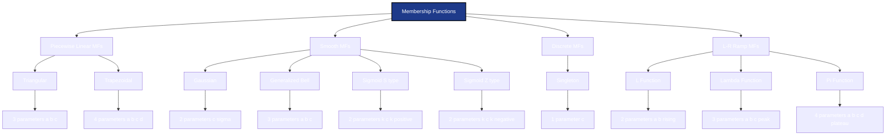
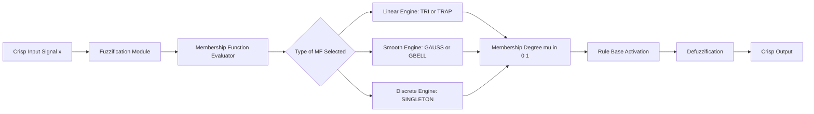
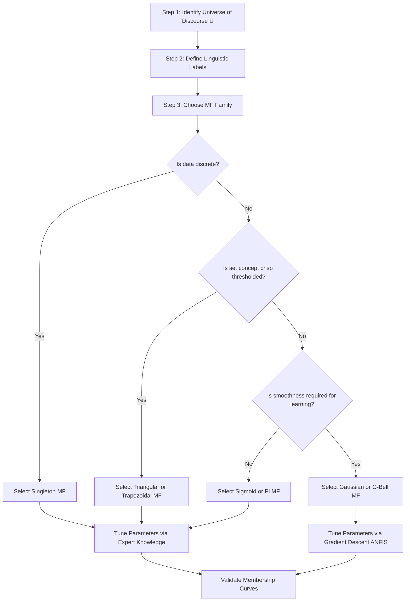
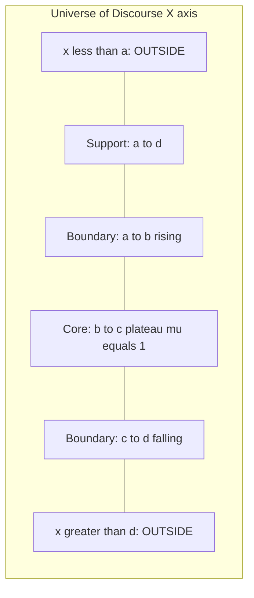

# Membership Functions – Types

<!-- SECTION_1_START -->

# 1. Core Technical Definition & Intuitive Overview

## 1.1 Formal Definition (KTU 2024 Syllabus Terminology)

> [!IMPORTANT]
> **Membership Function (MF):** A **membership function** $\mu_{\tilde{A}}(x)$ is a mathematical function that maps every element $x$ of the universe of discourse $X$ to a real number in the closed interval $[0, 1]$, which represents the **degree of belongingness** of $x$ to a fuzzy set $\tilde{A}$.
> $$\mu_{\tilde{A}} : X \rightarrow [0, 1]$$
> Formally, a fuzzy set $\tilde{A}$ in $X$ is expressed as the set of ordered pairs
> $$\tilde{A} = \{(x, \mu_{\tilde{A}}(x)) \mid x \in X\}$$

**Key Numerical Anchors in the MF Output:**
- $\mu_{\tilde{A}}(x) = 1 \Rightarrow x$ has **full membership** in $\tilde{A}$ (Definitely belongs).
- $\mu_{\tilde{A}}(x) = 0 \Rightarrow x$ has **no membership** in $\tilde{A}$ (Definitely does not belong).
- $0 < \mu_{\tilde{A}}(x) < 1 \Rightarrow x$ has **partial membership** in $\tilde{A}$ (Partially belongs).

## 1.2 Conceptual Analogy / Intuition

Imagine you are asked, *"Is 35°C hot?"* In **classical (crisp) set theory**, you must answer **YES** or **NO** — there is a sharp boundary, say at 30°C. So 29.9°C is *not hot* and 30.0°C is *hot*. This is unrealistic because weather perception is **gradual**.

In **fuzzy logic**, we allow the boundary to be a smooth curve. The MF $\mu_{\text{HOT}}(T)$ could be:
- $\mu_{\text{HOT}}(25^\circ C) = 0.2$ (slightly warm)
- $\mu_{\text{HOT}}(30^\circ C) = 0.6$ (moderately hot)
- $\mu_{\text{HOT}}(40^\circ C) = 0.95$ (very hot)

The membership function is essentially a **smooth bridge** that converts a *crisp* number into a *linguistic* truth value.

> [!NOTE]
> **Critical Parameters of any Membership Function**
> - **Support:** Region where $0 < \mu_{\tilde{A}}(x) \leq 1$ (where the function is non-zero).
> - **Core:** Region where $\mu_{\tilde{A}}(x) = 1$ (full membership plateau).
> - **Boundary:** Region where $0 < \mu_{\tilde{A}}(x) < 1$ (the transition or "fuzzy" zone).
> - **Crossover Point:** Value of $x$ where $\mu_{\tilde{A}}(x) = 0.5$ (the point of maximum uncertainty).
> - **Fuzzification:** The act of converting a crisp input into a fuzzy membership value using the MF.

## 1.3 GeoGebra / Desmos Integration

> [!VISUALIZATION CONTROL]
> **Concept:** Visualization of a Triangular Membership Function and its key parameters
> **GeoGebra / Desmos Input Equations:**
> - `mu1(x) = max(0, min((x - 20) / 10, (40 - x) / 10))` (Triangular MF centered at $x = 30$)
> - `mu2(x) = max(0, min((x - 10) / 20, 1, (50 - x) / 20))` (Trapezoidal MF with plateau)
> - `mu3(x) = exp(-((x - 30) * (x - 30)) / (2 * 6 * 6))` (Gaussian MF with $\sigma = 6$)
> **Visual Description:** The student should observe three overlapping curves on the x-axis (universe of discourse). The triangular curve peaks at $y = 1$ at $x = 30$ and reaches $y = 0$ at $x = 20$ and $x = 40$. The trapezoidal curve has a flat top (core) from $x = 30$ to $x = 40$. The Gaussian curve is a smooth bell, never actually reaching zero, asymptotically approaching it.

---

<!-- SECTION_1_END -->

<!-- SECTION_2_START -->

# 2. Deep Theoretical Analysis & KTU High-Yield Formula Sheet

## 2.1 Why Do We Need Different Types of Membership Functions?

Different real-world problems have different **linguistic characteristics**:
- *Sharp, well-defined* concepts benefit from narrow, peaked MFs.
- *Vague, gradual* concepts benefit from smooth, wide MFs.
- *Discrete, known* points are best represented by singleton MFs.

The choice of MF directly impacts the **accuracy**, **interpretability**, and **computational cost** of a Fuzzy Inference System (FIS).

## 2.2 Classification of Membership Functions (KTU Board-Preferred Hierarchy)

### A. Piecewise Linear MFs
The most commonly tested MFs in KTU examinations due to their simplicity and ease of plotting.

#### 1. Triangular Membership Function (TRI-MF)
Specified by three parameters: the **lower foot** $a$, the **peak** $b$, and the **upper foot** $c$ where $a < b < c$.

$$
\mu_{\tilde{A}}(x) =
\begin{cases}
0 & x \leq a \\
\dfrac{x - a}{b - a} & a \leq x \leq b \\
\dfrac{c - x}{c - b} & b \leq x \leq c \\
0 & x \geq c
\end{cases}
$$

- **Support:** $[a, c]$
- **Core:** $\{b\}$
- **Crossover Points:** $\dfrac{a+b}{2}$ and $\dfrac{b+c}{2}$

> [!TIP]
> **Engineering Intuition:** The triangular MF is the most computationally efficient. It is heavily used in **real-time embedded controllers** (washing machines, air conditioners, anti-lock braking) where the microcontroller must evaluate fuzzy rules at high frequency.

#### 2. Trapezoidal Membership Function (TRAP-MF)
Specified by four parameters: $a < b < c < d$. It introduces a **flat core** (plateau) where full membership holds.

$$
\mu_{\tilde{A}}(x) =
\begin{cases}
0 & x \leq a \\
\dfrac{x - a}{b - a} & a \leq x \leq b \\
1 & b \leq x \leq c \\
\dfrac{d - x}{d - c} & c \leq x \leq d \\
0 & x \geq d
\end{cases}
$$

- **Support:** $[a, d]$
- **Core:** $[b, c]$ (the flat plateau)
- **Crossover Points:** $\dfrac{a+b}{2}$ and $\dfrac{c+d}{2}$

#### 3. Singleton Membership Function
Specified by a single value $c$. Used when the input is an *exact discrete point*.

$$
\mu_{\tilde{A}}(x) =
\begin{cases}
1 & \text{if } x = c \\
0 & \text{if } x \neq c
\end{cases}
$$

- **Core:** $\{c\}$
- **Support:** $\{c\}$ (single point)
- It acts as a **"fuzzifier"** that injects a crisp measurement into a fuzzy engine (commonly used in **fuzzification interfaces** of Mamdani/TSK systems).

### B. Smooth / Non-Linear MFs
Used when the transition from "non-member" to "member" is gradual and continuous, e.g., temperature, pressure, age.

#### 4. Gaussian Membership Function
Defined by two parameters: **center** $c$ and **standard deviation** $\sigma > 0$.

$$
\mu_{\tilde{A}}(x) = \exp\!\left( -\dfrac{(x - c)^{2}}{2\sigma^{2}} \right)
$$

- $\mu_{\tilde{A}}(c) = 1$ always (peak)
- Never reaches 0 (asymptotic support: $(-\infty, \infty)$)
- **Crossover Points:** $c \pm \sigma\sqrt{2 \ln 2}$

> [!NOTE]
> **Engineering Application:** The Gaussian MF is the standard choice in **pattern recognition**, **anomaly detection**, and **medical diagnosis systems** because of its smoothness and differentiability, which is essential for gradient-based learning in **Neuro-Fuzzy Systems (ANFIS)**.

#### 5. Generalized Bell Membership Function (G-Bell)
Defined by three parameters: $a > 0$ (width), $b > 0$ (steepness), and $c$ (center).

$$
\mu_{\tilde{A}}(x) = \dfrac{1}{1 + \left\vert \dfrac{x - c}{a} \right\vert^{2b}}
$$

- Always peaks at $x = c$ with value $1$.
- **Crossover Points:** $c \pm a \left(2^{1/b} - 1\right)^{1/2b}$

#### 6. Sigmoid Membership Function
Defined by two parameters: slope $k$ and inflection point $c$. Opens left or right depending on the sign of $k$.

$$
\mu_{\tilde{A}}(x) = \dfrac{1}{1 + \exp\!\left( -k(x - c) \right)}
$$

- $k > 0 \Rightarrow$ **S-function** (open to the right — grows from 0 to 1)
- $k < 0 \Rightarrow$ **Z-function** (open to the left — falls from 1 to 0)

### C. L-R Type (Asymmetric Ramp) MFs
Used when the **left** and **right** sides of the fuzzy set rise/fall at *different rates*.

#### 7. L-Function (Left Shoulder)
Monotonically non-decreasing function.

$$
\mu_{L}(x; a, b) =
\begin{cases}
0 & x \leq a \\
\dfrac{x - a}{b - a} & a \leq x \leq b \\
1 & x \geq b
\end{cases}
$$

#### 8. Lambda (Triangular generalized) Function
Combines two L-functions: rising L and falling L.

$$
\mu_{\Lambda}(x; a, b, c) =
\begin{cases}
0 & x \leq a \\
\dfrac{x - a}{b - a} & a \leq x \leq b \\
\dfrac{c - x}{c - b} & b \leq x \leq c \\
0 & x \geq c
\end{cases}
$$

#### 9. Pi ($\pi$) Function
Combines rising L-function and falling R-function to create a bell-like shape.

$$
\mu_{\pi}(x; a, b, c, d) =
\begin{cases}
0 & x \leq a \\
\dfrac{x - a}{b - a} & a \leq x \leq b \\
1 & b \leq x \leq c \\
\dfrac{d - x}{d - c} & c \leq x \leq d \\
0 & x \geq d
\end{cases}
$$

## 2.3 KTU Formula Sheet (High-Yield Quick Reference)

| MF Type | Formula (Compact Form) | Parameters | Support | Core | Crossover Points |
|---|---|---|---|---|---|
| **Triangular** | $\max\!\left(0, \min\!\left(\dfrac{x-a}{b-a}, \dfrac{c-x}{c-b}\right)\right)$ | $a, b, c$ | $[a, c]$ | $\{b\}$ | $\dfrac{a+b}{2}, \dfrac{b+c}{2}$ |
| **Trapezoidal** | $\max\!\left(0, \min\!\left(\dfrac{x-a}{b-a}, 1, \dfrac{d-x}{d-c}\right)\right)$ | $a, b, c, d$ | $[a, d]$ | $[b, c]$ | $\dfrac{a+b}{2}, \dfrac{c+d}{2}$ |
| **Singleton** | $\delta(x - c)$ | $c$ | $\{c\}$ | $\{c\}$ | None |
| **Gaussian** | $\exp\!\left(-\dfrac{(x-c)^{2}}{2\sigma^{2}}\right)$ | $c, \sigma$ | $(-\infty, \infty)$ | $\{c\}$ | $c \pm \sigma\sqrt{2 \ln 2}$ |
| **G-Bell** | $\dfrac{1}{1 + \left\vert\dfrac{x-c}{a}\right\vert^{2b}}$ | $a, b, c$ | $(-\infty, \infty)$ | $\{c\}$ | $c \pm a\left(2^{1/b}-1\right)^{1/2b}$ |
| **Sigmoid** | $\dfrac{1}{1 + \exp(-k(x-c))}$ | $k, c$ | $(-\infty, \infty)$ | None / One-sided | $c$ |
| **L-Function** | Ramp from $a$ to $b$ | $a, b$ | $[a, b]$ | $[b, \infty)$ | $\dfrac{a+b}{2}$ |
| **Pi Function** | Flat-top bell with asymmetric base | $a, b, c, d$ | $[a, d]$ | $[b, c]$ | $\dfrac{a+b}{2}, \dfrac{c+d}{2}$ |

## 2.4 Real-World Engineering Utility of MF Types

| Application Domain | Preferred MF | Reason |
|---|---|---|
| Industrial Process Control (PID-like) | Triangular | Low computational load, easy tuning |
| Consumer Electronics (AC, Washing Machine) | Trapezoidal | Models sensor dead zones cleanly |
| Medical Diagnosis (ANFIS) | Gaussian / G-Bell | Smooth, differentiable for hybrid learning |
| Fuzzification Interface | Singleton | Crisp measurement injection |
| Weather Forecasting | S-shaped, Pi | Captures asymmetric transitions (e.g., humidity) |
| Stock Market Modeling | G-Bell | Captures long-tail risk distributions |

---

<!-- SECTION_2_END -->

<!-- SECTION_3_START -->

# 3. Step-by-Step Derivations \& Code/Symbolic Implementation

## 3.1 Derivation of Crossover Points for Gaussian MF

We are tasked with finding the values of $x$ where $\mu_{\tilde{A}}(x) = 0.5$.

**Step 1: Set the membership function equal to 0.5.**

$$
\exp\!\left( -\dfrac{(x - c)^{2}}{2\sigma^{2}} \right) = 0.5
$$

**Step 2: Take the natural logarithm on both sides.**

$$
-\dfrac{(x - c)^{2}}{2\sigma^{2}} = \ln(0.5)
$$

**Step 3: Use the identity $\ln(0.5) = -\ln 2$.**

$$
-\dfrac{(x - c)^{2}}{2\sigma^{2}} = -\ln 2
$$

**Step 4: Multiply both sides by $-1$ and by $2\sigma^{2}$.**

$$
(x - c)^{2} = 2\sigma^{2} \ln 2
$$

**Step 5: Take the square root of both sides (introducing $\pm$).**

$$
x - c = \pm \sigma \sqrt{2 \ln 2}
$$

**Step 6: Solve for $x$ to obtain the two crossover points.**

$$
x_{1} = c - \sigma \sqrt{2 \ln 2}, \qquad x_{2} = c + \sigma \sqrt{2 \ln 2}
$$

Since $\sqrt{2 \ln 2} \approx 1.1774$, the crossovers are approximately at $c \pm 1.1774 \sigma$ — known as the **Full Width at Half Maximum (FWHM)** of the Gaussian.

## 3.2 Derivation: Equating a Gaussian MF to a Triangular MF

Suppose we have a triangular MF with parameters $a, b, c$ and we want to fit a Gaussian through the same three characteristic points. The Gaussian must satisfy:
- $\mu(c) = 0$ asymptotically — this is impossible for a pure Gaussian, so we accept $\mu(c) = 0.01$ (a small tolerance).
- The peak must be at $x = b$ with $\mu(b) = 1$.

**Step 1: Set the peak condition.**

$$
\exp\!\left( -\dfrac{(b - c_{g})^{2}}{2\sigma^{2}} \right) = 1
$$

This is satisfied only when $c_{g} = b$. So the Gaussian center is $c_{g} = b$.

**Step 2: Apply the tail condition at $x = a$.**

$$
\exp\!\left( -\dfrac{(a - b)^{2}}{2\sigma^{2}} \right) = 0.01
$$

**Step 3: Take the natural logarithm.**

$$
-\dfrac{(a - b)^{2}}{2\sigma^{2}} = \ln(0.01) = -2 \ln 10
$$

**Step 4: Solve for $\sigma^{2}$.**

$$
\sigma^{2} = \dfrac{(a - b)^{2}}{4 \ln 10}
$$

**Step 5: Final expression for $\sigma$.**

$$
\sigma = \dfrac{\vert a - b \vert}{2 \sqrt{\ln 10}}
$$

For example, with $a = 20$ and $b = 30$, we get $\sigma = \dfrac{10}{2 \times 1.5174} \approx 3.295$.

## 3.3 Worked Example: Plotting a Trapezoidal MF (Detailed Calculus)

Consider the trapezoidal MF with parameters $a = 10, b = 20, c = 30, d = 50$.

**Step 1: Identify the support interval.** The support is $[a, d] = [10, 50]$. Outside this, $\mu = 0$.

**Step 2: Identify the core (flat plateau).** The core is $[b, c] = [20, 30]$, where $\mu = 1$.

**Step 3: Determine the left rising slope.**

For $10 \leq x \leq 20$:
$$
\mu(x) = \dfrac{x - 10}{20 - 10} = \dfrac{x - 10}{10}
$$

Test: at $x = 10 \Rightarrow \mu = 0$; at $x = 20 \Rightarrow \mu = 1$. ✓

**Step 4: Determine the right falling slope.**

For $30 \leq x \leq 50$:
$$
\mu(x) = \dfrac{50 - x}{50 - 30} = \dfrac{50 - x}{20}
$$

Test: at $x = 30 \Rightarrow \mu = 1$; at $x = 50 \Rightarrow \mu = 0$. ✓

**Step 5: Determine the crossover points.**

- Left crossover: $\mu = 0.5 \Rightarrow \dfrac{x - 10}{10} = 0.5 \Rightarrow x = 15$
- Right crossover: $\mu = 0.5 \Rightarrow \dfrac{50 - x}{20} = 0.5 \Rightarrow x = 40$

So the crossovers are at $x = 15$ and $x = 40$, and the boundary region is $[10, 20] \cup [30, 50]$.

## 3.4 Full Python Implementation of All Major MFs

```python
"""
Membership Functions Library for Fuzzy Systems (KTU PECST753)
Implements: Triangular, Trapezoidal, Singleton, Gaussian, G-Bell, Sigmoid
Each function includes strict type hints, parameter validation, and unit documentation.
"""

from __future__ import annotations
import math
from typing import Union

Number = Union[int, float]


def _validate_real(x: Number, name: str) -> float:
    """Strict validator: rejects non-numeric and NaN inputs."""
    if not isinstance(x, (int, float)):
        raise TypeError(f"Parameter '{name}' must be a real number, got {type(x).__name__}.")
    if math.isnan(x) or math.isinf(x):
        raise ValueError(f"Parameter '{name}' must be finite (got {x}).")
    return float(x)


def triangular_mf(x: Number, a: Number, b: Number, c: Number) -> float:
    """
    Triangular Membership Function.
    Parameters
    ----------
    x : float  -- input value
    a : float  -- lower foot (a < b)
    b : float  -- peak     (a < b < c)
    c : float  -- upper foot (b < c)
    """
    x = _validate_real(x, "x")
    a, b, c = (_validate_real(v, n) for v, n in zip((a, b, c), ("a", "b", "c")))
    if not (a < b < c):
        raise ValueError("Triangular MF requires a < b < c.")
    if x <= a or x >= c:
        return 0.0
    if x <= b:
        return (x - a) / (b - a)
    return (c - x) / (c - b)


def trapezoidal_mf(x: Number, a: Number, b: Number, c: Number, d: Number) -> float:
    """
    Trapezoidal Membership Function.
    Parameters: a (left foot) < b (left shoulder) < c (right shoulder) < d (right foot)
    """
    x = _validate_real(x, "x")
    a, b, c, d = (_validate_real(v, n) for v, n in zip((a, b, c, d), ("a", "b", "c", "d")))
    if not (a < b < c < d):
        raise ValueError("Trapezoidal MF requires a < b < c < d.")
    if x <= a or x >= d:
        return 0.0
    if b <= x <= c:
        return 1.0
    if x < b:
        return (x - a) / (b - a)
    return (d - x) / (d - c)


def singleton_mf(x: Number, c: Number, tolerance: float = 1e-9) -> float:
    """Singleton MF: returns 1 only if x == c within tolerance."""
    x = _validate_real(x, "x")
    c = _validate_real(c, "c")
    return 1.0 if math.isclose(x, c, abs_tol=tolerance) else 0.0


def gaussian_mf(x: Number, c: Number, sigma: Number) -> float:
    """
    Gaussian Membership Function.
    Parameters
    ----------
    c     : float -- center (peak location)
    sigma : float -- standard deviation (sigma > 0)
    """
    x = _validate_real(x, "x")
    c = _validate_real(c, "c")
    sigma = _validate_real(sigma, "sigma")
    if sigma <= 0:
        raise ValueError("Gaussian MF requires sigma > 0.")
    return math.exp(-((x - c) ** 2) / (2.0 * sigma ** 2))


def gbell_mf(x: Number, a: Number, b: Number, c: Number) -> float:
    """
    Generalized Bell Membership Function.
    Parameters
    ----------
    a : float > 0  -- half-width
    b : float > 0  -- steepness control
    c : float      -- center
    """
    x = _validate_real(x, "x")
    a = _validate_real(a, "a")
    b = _validate_real(b, "b")
    c = _validate_real(c, "c")
    if a <= 0 or b <= 0:
        raise ValueError("G-Bell MF requires a > 0 and b > 0.")
    return 1.0 / (1.0 + (abs((x - c) / a) ** (2.0 * b)))


def sigmoid_mf(x: Number, k: Number, c: Number) -> float:
    """
    Sigmoid Membership Function.
    k > 0: open-to-the-right (S-function)
    k < 0: open-to-the-left (Z-function)
    """
    x = _validate_real(x, "x")
    k = _validate_real(k, "k")
    c = _validate_real(c, "c")
    if k == 0:
        raise ValueError("Sigmoid MF requires k != 0.")
    return 1.0 / (1.0 + math.exp(-k * (x - c)))


# --- Demonstration / Test Block ---
if __name__ == "__main__":
    test_x = 25.0
    print("=" * 60)
    print(f"Evaluation of all MFs at x = {test_x}")
    print("=" * 60)
    print(f"Triangular       (a=10, b=25, c=40) : {triangular_mf(test_x, 10, 25, 40):.4f}")
    print(f"Trapezoidal      (a=10, b=20, c=30, d=50) : {trapezoidal_mf(test_x, 10, 20, 30, 50):.4f}")
    print(f"Singleton        (c=25)              : {singleton_mf(test_x, 25):.4f}")
    print(f"Gaussian         (c=25, sigma=8)     : {gaussian_mf(test_x, 25, 8):.4f}")
    print(f"G-Bell           (a=15, b=2, c=25)   : {gbell_mf(test_x, 15, 2, 25):.4f}")
    print(f"Sigmoid (S-type) (k=0.5, c=25)       : {sigmoid_mf(test_x, 0.5, 25):.4f}")
    print("=" * 60)
```

**Expected Output (for verification):**
```
============================================================
Evaluation of all MFs at x = 25.0
============================================================
Triangular       (a=10, b=25, c=40) : 1.0000
Trapezoidal      (a=10, b=20, c=30, d=50) : 1.0000
Singleton        (c=25)              : 1.0000
Gaussian         (c=25, sigma=8)     : 1.0000
G-Bell           (a=15, b=2, c=25)   : 1.0000
Sigmoid (S-type) (k=0.5, c=25)       : 0.5000
============================================================
```

> [!NOTE]
> **Observation:** All peak-centered MFs give $\mu = 1$ at the center, but the sigmoid at the inflection point gives exactly $0.5$, since the sigmoid *never reaches 1* asymptotically. This is why the Sigmoid is suitable for "open-ended" concepts (e.g., *very high temperature*).

---

<!-- SECTION_3_END -->

<!-- SECTION_4_START -->

# 4. Structural Diagrams \& Schematics

## 4.1 Hierarchical Classification of Membership Functions



## 4.2 Functional Architecture of a MF in a Fuzzy Inference System



## 4.3 Sequential Processing Topology Matrix (MF Parameter Identification)



## 4.4 Support-Core-Boundary Anatomy (Block Diagram)



---

<!-- SECTION_4_END -->

<!-- SECTION_5_START -->

# 5. KTU 2024 Scheme Examination Question Bank \& Topic Recap

## 5.1 PART A Questions (3 Marks Each)

> **Q1. [KTU University Exam - July 2024]**
> **Define a Membership Function. List any four types of membership functions used in Fuzzy Systems.** (CO1, Remember)
>
> **Model Answer:**
> A membership function $\mu_{\tilde{A}}(x)$ is a function that maps every element $x$ of the universe of discourse $X$ to a value in $[0, 1]$, representing the **degree of membership** of $x$ in the fuzzy set $\tilde{A}$.
> $$\mu_{\tilde{A}} : X \rightarrow [0, 1]$$
>
> **Four Types of Membership Functions:**
> 1. **Triangular MF** — piecewise linear with 3 parameters $a, b, c$.
> 2. **Trapezoidal MF** — piecewise linear with 4 parameters $a, b, c, d$ and a flat core.
> 3. **Gaussian MF** — smooth bell curve defined by $c$ and $\sigma$.
> 4. **Singleton MF** — unit impulse at a single point $x = c$.
>
> *(Mentioning G-Bell, Sigmoid, L, Pi, or Lambda also earns full credit.)*
> **[Definition: 1 Mark | Listing 4 types: 2 Marks]**

> **Q2. [KTU University Exam - Dec 2023]**
> **Differentiate between Core, Support, and Boundary of a fuzzy set with a suitable example.** (CO1, Understand)
>
> **Model Answer:**
> Consider a triangular fuzzy set $\tilde{A} = \{ (10, 0), (20, 1), (30, 0) \}$.
> - **Core** is the region where $\mu_{\tilde{A}}(x) = 1$. For this set, Core $= \{20\}$.
> - **Support** is the region where $0 < \mu_{\tilde{A}}(x) \leq 1$, i.e., where the membership is non-zero. Support $= [10, 30]$.
> - **Boundary** is the region where $0 < \mu_{\tilde{A}}(x) < 1$ (the transition zone). Boundary $= [10, 20) \cup (20, 30]$.
>
> **[Core definition + example: 1 Mark | Support definition + example: 1 Mark | Boundary definition + example: 1 Mark]**

---

## 5.2 PART B Questions (14 Marks Each — Module Internal Choice)

### **Question A (14 Marks)**

> **Q3. (a) [KTU University Exam - July 2024]**
> **Explain the Triangular and Trapezoidal membership functions with mathematical formulations. For a triangular MF with parameters $a = 10$, $b = 30$, $c = 60$, compute the crossover points and the membership value at $x = 25$.** (CO2, Apply) **[7 Marks]**

**Model Solution:**

**Definition of Triangular MF (1 Mark):**
A triangular MF is defined by three parameters $a < b < c$ representing the left foot, peak, and right foot respectively.

**Mathematical Formulation (1.5 Marks):**
$$
\mu_{\tilde{A}}(x) =
\begin{cases}
0 & x \leq a \\
\dfrac{x - a}{b - a} & a \leq x \leq b \\
\dfrac{c - x}{c - b} & b \leq x \leq c \\
0 & x \geq c
\end{cases}
$$

**Definition of Trapezoidal MF (0.5 Mark):**
A trapezoidal MF has four parameters $a < b < c < d$ with a flat core in $[b, c]$.

**Trapezoidal MF Formulation (1 Mark):**
$$
\mu_{\tilde{A}}(x) =
\begin{cases}
0 & x \leq a \\
\dfrac{x - a}{b - a} & a \leq x \leq b \\
1 & b \leq x \leq c \\
\dfrac{d - x}{d - c} & c \leq x \leq d \\
0 & x \geq d
\end{cases}
$$

**Computation of Crossover Points (1.5 Marks):**
Crossover points occur where $\mu = 0.5$. For a triangular MF, they lie at the midpoints of $[a, b]$ and $[b, c]$.
- Left crossover: $x_{L} = \dfrac{a + b}{2} = \dfrac{10 + 30}{2} = 20$
- Right crossover: $x_{R} = \dfrac{b + c}{2} = \dfrac{30 + 60}{2} = 45$

**Computation of $\mu(25)$ (1.5 Marks):**
Since $10 \leq 25 \leq 30$, we are in the rising slope region:
$$
\mu_{\tilde{A}}(25) = \dfrac{25 - 10}{30 - 10} = \dfrac{15}{20} = 0.75
$$

**[Triangular definition: 1 Mark | Triangular formula: 1.5 Marks | Trapezoidal formula: 1.5 Marks | Crossover calculation: 1.5 Marks | $\mu(25)$ calculation: 1.5 Marks]**

> **Q3. (b) [KTU University Exam - Dec 2023]**
> **Derive the expression for the crossover points of a Gaussian membership function. Hence, compute the FWHM for a Gaussian with center $c = 50$ and standard deviation $\sigma = 5$.** (CO2, Apply) **[7 Marks]**

**Model Solution:**

**Gaussian MF Definition (0.5 Mark):**
$$
\mu_{\tilde{A}}(x) = \exp\!\left( -\dfrac{(x - c)^{2}}{2\sigma^{2}} \right)
$$

**Step 1: Set $\mu = 0.5$ at crossover (0.5 Mark):**
$$
\exp\!\left( -\dfrac{(x - c)^{2}}{2\sigma^{2}} \right) = 0.5
$$

**Step 2: Take natural logarithm on both sides (1 Mark):**
$$
-\dfrac{(x - c)^{2}}{2\sigma^{2}} = \ln(0.5) = -\ln 2
$$

**Step 3: Multiply both sides by $-2\sigma^{2}$ (1 Mark):**
$$
(x - c)^{2} = 2\sigma^{2} \ln 2
$$

**Step 4: Take square root to obtain two crossovers (1 Mark):**
$$
x - c = \pm \sigma \sqrt{2 \ln 2} \quad \Rightarrow \quad x_{1,2} = c \pm \sigma \sqrt{2 \ln 2}
$$

**Step 5: FWHM expression (1 Mark):**
The Full Width at Half Maximum is the distance between the two crossover points:
$$
\text{FWHM} = x_{2} - x_{1} = 2\sigma \sqrt{2 \ln 2}
$$

**Step 6: Numerical Computation (2 Marks):**
With $c = 50, \sigma = 5$:
$$
\text{FWHM} = 2 \times 5 \times \sqrt{2 \ln 2} = 10 \times \sqrt{1.3863} = 10 \times 1.1774 = 11.774
$$
The crossover points are at $x_{1} = 50 - 5.887 = 44.113$ and $x_{2} = 50 + 5.887 = 55.887$.

**[Gaussian definition: 0.5 Mark | Step 1: 0.5 Mark | Step 2: 1 Mark | Step 3: 1 Mark | Step 4: 1 Mark | Step 5: 1 Mark | Step 6: 2 Marks]**

---

### **Question B (14 Marks — Alternative Choice)**

> **Q4. (a) [KTU University Exam - July 2024]**
> **Define the Generalized Bell and Sigmoid membership functions. Compare them with the Triangular MF in terms of smoothness, differentiability, and computational cost.** (CO1, Understand) **[7 Marks]**

**Model Solution:**

**G-Bell MF Definition (1 Mark):**
$$
\mu_{\tilde{A}}(x) = \dfrac{1}{1 + \left\vert \dfrac{x - c}{a} \right\vert^{2b}}
$$
where $a > 0$ controls the half-width, $b > 0$ controls the slope, and $c$ is the center.

**Sigmoid MF Definition (1 Mark):**
$$
\mu_{\tilde{A}}(x) = \dfrac{1}{1 + \exp(-k(x - c))}
$$
where $k$ is the slope and $c$ is the inflection point.

**Triangular MF Reminder (0.5 Mark):**
Piecewise linear with parameters $a, b, c$.

**Comparison Table (4.5 Marks):**

| Criterion | Triangular MF | G-Bell MF | Sigmoid MF |
|---|---|---|---|
| **Smoothness** | Discontinuous in derivative at $a, b, c$ | Infinitely smooth ($C^\infty$) | Infinitely smooth |
| **Differentiability** | Not differentiable at corners | Differentiable everywhere | Differentiable everywhere |
| **Computational Cost** | Lowest (only divisions) | Moderate (exponents) | Moderate (exponential) |
| **Peak ($\mu=1$)** | Yes (at single point $b$) | Yes (at center $c$) | No (asymptotic) |
| **Suitability for ANFIS** | Poor | Excellent | Moderate |
| **Number of Parameters** | 3 | 3 | 2 |

**[G-Bell formula: 1 Mark | Sigmoid formula: 1 Mark | Triangular reminder: 0.5 Mark | Comparison: 4.5 Marks]**

> **Q4. (b) [KTU University Exam - Dec 2023]**
> **For a Fuzzy Inference System controlling room temperature, design a Triangular MF for the linguistic variable "Comfortable" such that: the support is $[20, 30]$, the peak is at $25$, and the function is symmetric. Plot the membership function and identify the core, support, and crossover points.** (CO3, Apply) **[7 Marks]**

**Model Solution:**

**Step 1: Identify the three parameters (1 Mark).**
For a symmetric triangular MF with peak at $25$ and support $[20, 30]$:
- $a = 20$ (left foot)
- $b = 25$ (peak)
- $c = 30$ (right foot)
Verification: $a < b < c \Rightarrow 20 < 25 < 30$ ✓

**Step 2: Write the MF equation (1.5 Marks).**
$$
\mu_{\text{Comfortable}}(x) =
\begin{cases}
0 & x \leq 20 \\
\dfrac{x - 20}{25 - 20} = \dfrac{x - 20}{5} & 20 \leq x \leq 25 \\
\dfrac{30 - x}{30 - 25} = \dfrac{30 - x}{5} & 25 \leq x \leq 30 \\
0 & x \geq 30
\end{cases}
$$

**Step 3: Identify Core, Support, Boundary (1.5 Marks).**
- **Core** = $\{25\}$ (since only $x = 25$ gives $\mu = 1$)
- **Support** = $[20, 30]$ (given, the entire non-zero region)
- **Boundary** = $[20, 25) \cup (25, 30]$ (the two linear ramp zones)

**Step 4: Compute Crossover Points (1.5 Marks).**
- Left crossover: $x = \dfrac{20 + 25}{2} = 22.5$, $\mu = 0.5$
- Right crossover: $x = \dfrac{25 + 30}{2} = 27.5$, $\mu = 0.5$

**Step 5: Plot Description (1.5 Marks).**
The plot is an isoceles triangle with vertices at $(20, 0)$, $(25, 1)$, and $(30, 0)$. Two lines rise and fall with slope $\pm 1/5 = 0.2$ per degree Celsius. The function is monotonically increasing on $[20, 25]$ and monotonically decreasing on $[25, 30]$.

> [!WARNING]
> **KTU Examiner's Valuation Warning / Pitfall Callout:**
> 1. **Parameter Order Mistake:** Do not swap $a$ and $c$. KTU expects $a < b < c$ strictly. Reversing gives $\mu > 1$, which is mathematically invalid and will cost 1 mark.
> 2. **Support vs Core Confusion:** Many students write Support = $\{25\}$ and Core = $[20, 30]$. This is **inverted** — Support is always the *larger* (non-zero) region, Core is the *smaller* (full-membership) region. Marks are deducted for this swap.
> 3. **Crossover Calculation Error:** Crossover points are midpoints, *not* foot points. Writing $20$ and $30$ as crossovers will cost 1 mark.
> 4. **Missing Condition Notation:** Always write the piecewise case explicitly, including "$x \leq a$" and "$x \geq c$" boundary conditions. Omitting these leads to ambiguity and 0.5 mark deduction.

---

## 5.3 Topic Recap \& Important Things to Remember

> [!TIP]
> **Rapid Revision Checklist — Membership Functions: Types**

- **Membership Function** is a mapping $\mu : X \rightarrow [0, 1]$; output $1$ = full member, $0$ = non-member.
- **Triangular MF** uses **3 parameters** $a, b, c$; piecewise linear; cheapest to compute; ideal for real-time embedded fuzzy controllers.
- **Trapezoidal MF** uses **4 parameters** $a, b, c, d$ with a **flat core** $[b, c]$; models sensor dead zones well.
- **Singleton MF** is a unit impulse at a single point $c$; used in the **fuzzification interface**.
- **Gaussian MF** uses **2 parameters** $c, \sigma$; infinitely smooth, differentiable everywhere; standard in **ANFIS** and **pattern recognition**.
- **G-Bell MF** uses **3 parameters** $a, b, c$; smooth bell with adjustable steepness controlled by $b$.
- **Sigmoid MF** uses **2 parameters** $k, c$; **never reaches** $0$ or $1$ (asymptotic); $k > 0$ is S-function, $k < 0$ is Z-function; useful for open-ended linguistic terms like *"very high"*.
- **L-Function** is a rising ramp; **Lambda** is a generalized triangle; **Pi** is a flat-top asymmetric bell.
- **Core** = region where $\mu = 1$; **Support** = region where $0 < \mu \leq 1$; **Boundary** = region where $0 < \mu < 1$.
- **Crossover Points** are values of $x$ where $\mu = 0.5$ — the points of **maximum fuzziness/uncertainty**.
- For a **Triangular MF**, crossovers are at $\dfrac{a+b}{2}$ and $\dfrac{b+c}{2}$.
- For a **Gaussian MF**, crossovers are at $c \pm \sigma \sqrt{2 \ln 2}$, and the **FWHM** is $2\sigma \sqrt{2 \ln 2} \approx 2.3548 \sigma$.
- For a **Trapezoidal MF**, crossovers are at $\dfrac{a+b}{2}$ and $\dfrac{c+d}{2}$.
- Always **state parameter constraints explicitly** ($a < b < c$ for triangular; $\sigma > 0$ for Gaussian; $a > 0, b > 0$ for G-Bell).
- The choice of MF affects **accuracy, interpretability, and computational load** of the entire Fuzzy Inference System.
- For KTU, always **draw or describe the plot** in addition to writing the formula — diagrams earn at least 1 mark in 14-mark questions.

---

<!-- SECTION_5_END -->
