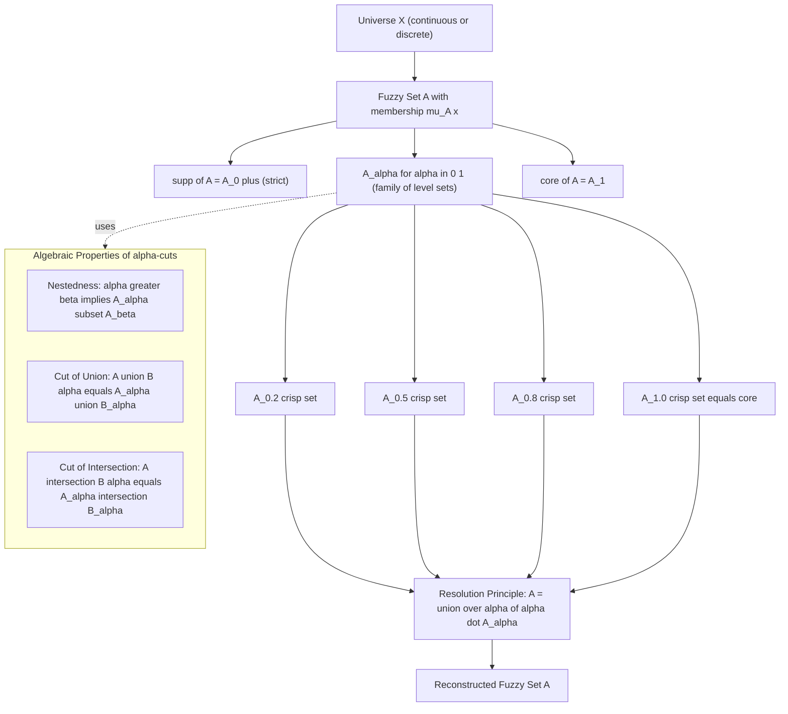
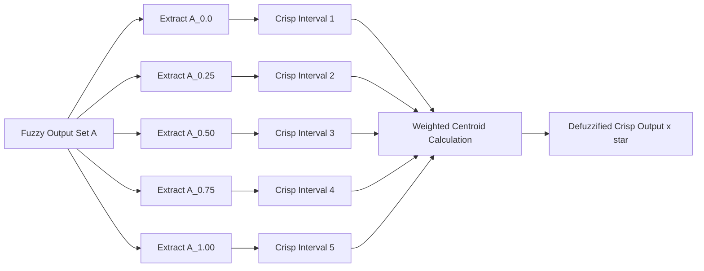
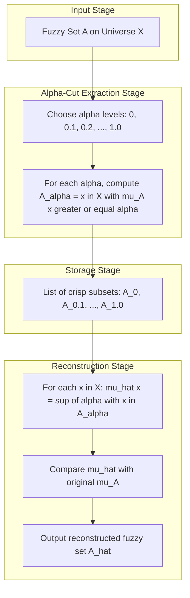

# Properties of fuzzy set - Level Sets - Alpha cut representation.

<!-- SECTION_1_START -->
# Properties of Fuzzy Sets — Level Sets & α-Cut Representation

## 1.1 Formal Definition (KTU 2024 Syllabus Terminology)

> [!IMPORTANT]
> **α-Cut (Alpha Cut / Level Set):** Let $A$ be a fuzzy set defined on a universe of discourse $X$ with membership function $\mu_A : X \to [0,1]$. The **α-cut** of $A$, denoted $A_\alpha$, is the **crisp set** of all elements whose membership grade in $A$ is at least $\alpha$.

$$
A_\alpha = \{\, x \in X \;\vert\; \mu_A(x) \geq \alpha \,\}, \quad \alpha \in [0,1]
$$

> [!NOTE]
> **Strict (Strong) α-Cut:** $A_{\alpha}^{+} = \{\, x \in X \;\vert\; \mu_A(x) > \alpha \,\}$ — the "open" level set that excludes the boundary.
>
> **Weak α-Cut:** $A_{\alpha}$ itself — includes all points whose grade is **≥** α (closed level set).

### Special α-Cuts of Engineering Importance

$$
A_0 = \overline{\text{supp}}(A) \quad ; \quad A_0^{+} = \text{supp}(A) \quad ; \quad A_1 = \text{core}(A)
$$

- **Support** of $A$: $\text{supp}(A) = \{\,x \;\vert\; \mu_A(x) > 0\,\}$ → corresponds to the strict 0-cut $A_0^{+}$.
- **Core** of $A$: $\text{core}(A) = \{\,x \;\vert\; \mu_A(x) = 1\,\}$ → corresponds to the 1-cut $A_1$.
- **Height** of $A$: $h(A) = \sup_{x \in X} \mu_A(x)$ — the **maximum** membership grade attained.

A fuzzy set is called **normal** if $h(A) = 1$ and **subnormal** if $h(A) < 1$.

---

## 1.2 Intuition: The "Water-Level" Analogy

> [!TIP]
> **Conceptual Analogy:** Imagine a mountain landscape where the elevation at each point is $\mu_A(x)$ and the horizontal ground is the universe $X$. When the ocean rises to a water-level $\alpha$, the set of land still visible above the water is exactly the α-cut $A_\alpha$. As $\alpha$ increases, the visible landmass shrinks monotonically — this is why α-cuts are *nested*:
> $$
> \beta > \alpha \;\Longrightarrow\; A_\beta \subseteq A_\alpha
> $$

This "contour-line" view is what makes α-cuts a **bridge between fuzzy sets and classical (crisp) set theory**: every fuzzy set is an *infinite stack* of nested crisp level sets.

> [!VISUALIZATION CONTROL]
> **Concept:** Triangular fuzzy number "Tall" with core at $x=5$ and support $[2,8]$, showing three horizontal α-cuts.
> **Desmos Input Equations:**
> * `f(x) = max(0, 1 - abs(x - 5)/3)` (triangular membership, peak = 1 at $x=5$)
> * `y1 = 0.8`, `y2 = 0.5`, `y3 = 0.2` (horizontal α-level lines)
> **Visual Description:** The student should see the triangle with three horizontal slices. The slice at $y = 0.8$ is the shortest interval around $x=5$, the slice at $y = 0.2$ is the widest. Each slice is a crisp interval — these are the α-cuts $A_{0.8}, A_{0.5}, A_{0.2}$.

---

## 1.3 The Resolution Principle (Foundational Theorem)

> [!IMPORTANT]
> **Resolution Principle (Decomposition Theorem):** *Every* fuzzy set $A$ can be **uniquely reconstructed** from the family of its α-cuts by:
> $$
> A = \bigcup_{\alpha \in [0,1]} \alpha \cdot A_\alpha
> $$
> Equivalently, the membership function is recovered by:
> $$
> \mu_A(x) = \sup\{\, \alpha \;\vert\; x \in A_\alpha \,\} = \sup\{\, \alpha \;\vert\; \mu_A(x) \geq \alpha \,\}
> $$

This is the **single most exam-relevant result** in Module 1 of PECST753 — it is the foundation on which fuzzy arithmetic, fuzzy relations, and fuzzy logic controllers are built.
<!-- SECTION_1_END -->

<!-- SECTION_2_START -->
# Deep Theoretical Analysis & KTU Formula Sheet

## 2.1 Logical Hierarchy of Level Sets

Given a fuzzy set $A$ on $X$ with membership function $\mu_A$, the following ordered chain of subsets is **always true**:

$$
\text{core}(A) \;\subseteq\; A_\alpha \;\subseteq\; \text{supp}(A) \;\subseteq\; X, \quad \forall\,\alpha \in (0,1)
$$

### Key Logical Steps (Why α-Cuts Behave This Way)

1. **Nestedness (Monotonicity):** If $\alpha_1 \leq \alpha_2$, then $A_{\alpha_2} \subseteq A_{\alpha_1}$.  
   *Why:* The condition $\mu_A(x) \geq \alpha_2$ is stricter than $\mu_A(x) \geq \alpha_1$, so fewer elements qualify.

2. **Intersection Decomposition:** $A_\alpha = \bigcap_{\beta < \alpha} A_\beta$.  
   *Why:* $A_\alpha$ is the *limit* of all level sets just below α; it equals their intersection because the family is nested.

3. **Union Decomposition:** $A_\beta = \bigcup_{\alpha > \beta} A_\alpha$ for $0 \leq \beta < h(A)$.  
   *Why:* Every element with grade ≥ β lies in *some* stricter level set above β.

4. **Algebraic Compatibility with Set Operations:**  
   - $(A \cup B)_\alpha = A_\alpha \cup B_\alpha$  
   - $(A \cap B)_\alpha = A_\alpha \cap B_\alpha$  
   - $\overline{A}_\alpha = \overline{A_{\overline{\alpha}}^{+}} = \{x \;\vert\; \mu_A(x) \leq 1 - \alpha\}$ (complement cuts)

5. **Strict Cuts Propagate Differently:**  
   - $(A \cap B)_\alpha^{+} = A_\alpha^{+} \cap B_\alpha^{+}$ ✅ (intersection preserves strict cut)  
   - $(A \cup B)_\alpha^{+} \supseteq A_\alpha^{+} \cup B_\alpha^{+}$ ⚠️ (union is *not* exactly preserved — careful!)

## 2.2 KTU High-Yield Formula Cheat Sheet

| # | Concept | Formula / Statement | Conditions |
|---|---------|--------------------|------------|
| 1 | α-cut | $A_\alpha = \{x \in X \;\vert\; \mu_A(x) \geq \alpha\}$ | $\alpha \in [0,1]$ |
| 2 | Strict α-cut | $A_\alpha^{+} = \{x \in X \;\vert\; \mu_A(x) > \alpha\}$ | $\alpha \in [0,1)$ |
| 3 | Support | $\text{supp}(A) = A_0^{+}$ | always |
| 4 | Core | $\text{core}(A) = A_1$ | exists if $h(A)=1$ |
| 5 | Height | $h(A) = \sup_{x}\mu_A(x)$ | $0 \leq h(A) \leq 1$ |
| 6 | Resolution Idempotence | $\mu_A(x) = \sup\{\alpha \;\vert\; x \in A_\alpha\}$ | always |
| 7 | Resolution Reconstruction | $A = \bigcup_{\alpha \in [0,1]} \alpha \cdot A_\alpha$ | always |
| 8 | Nestedness | $\alpha \leq \beta \Rightarrow A_\beta \subseteq A_\alpha$ | always |
| 9 | Cut of Union | $(A \cup B)_\alpha = A_\alpha \cup B_\alpha$ | always |
| 10 | Cut of Intersection | $(A \cap B)_\alpha = A_\alpha \cap B_\alpha$ | always |
| 11 | Cut of Complement | $\overline{A}_\alpha = (A_{1-\alpha}^{+})^c$ | always |
| 12 | Normality Test | $A$ is normal $\Leftrightarrow h(A) = 1 \Leftrightarrow A_1 \neq \emptyset$ | diagnostic |
| 13 | Scalar Cardinality | $\vert A \vert = \sum_{x}\mu_A(x)$ | discrete $X$ |
| 14 | Fuzzy Cardinality | $\vert A \vert = \int_X \mu_A(x)\,dx$ | continuous $X$ |
| 15 | Convexity Test | $A$ is convex $\Leftrightarrow$ all $A_\alpha$ are convex (intervals) | diagnostic |

> [!TIP]
> **Engineering Utility:** α-cuts are the computational backbone of **fuzzy arithmetic** (interval arithmetic at each α-level), **fuzzy control** (defuzzification via centroid of stacked intervals), and **fuzzy pattern recognition** (similarity computed level-by-level). In a production-grade fuzzy inference system (e.g., a washing-machine controller), the defuzzification step effectively aggregates all α-cuts weighted by their level α.

## 2.3 Resolution Principle — Engineering Interpretation

The decomposition $A = \bigcup_\alpha \alpha A_\alpha$ says: *the fuzzy set is nothing more than a continuous family of crisp sets, each scaled by its own "vague-ness" level α*. This view enables:

- **Discretization for Computation:** Approximate $A$ by a finite set of α-cuts, e.g., at $\alpha = 0, 0.1, 0.2, \dots, 1.0$.
- **Interval-Valued Reasoning:** Each α-cut is a crisp interval $[a_\alpha, b_\alpha]$, reducing fuzzy arithmetic to repeated interval arithmetic.
- **Hardware Implementation:** FPGA/ASIC fuzzy controllers store a small lookup table of α-cuts rather than a continuous membership function.
<!-- SECTION_2_END -->

<!-- SECTION_3_START -->
# Step-by-Step Derivations & Symbolic Implementation

## 3.1 Worked Example — α-Cut Extraction by Hand

**Problem:** Let $X = \{1, 2, 3, 4, 5, 6, 7\}$ and a fuzzy set
$$
A = \{(1, 0.1), (2, 0.4), (3, 0.7), (4, 1.0), (5, 0.8), (6, 0.3), (7, 0.0)\}
$$

**Step 1 — Compute α-cuts at $\alpha = 0.5$ and $\alpha = 0.75$ (Board-standard):**

For $\alpha = 0.5$: include all $x$ with $\mu_A(x) \geq 0.5$:
- $x=1$: $0.1 < 0.5$ ✗
- $x=2$: $0.4 < 0.5$ ✗
- $x=3$: $0.7 \geq 0.5$ ✓
- $x=4$: $1.0 \geq 0.5$ ✓
- $x=5$: $0.8 \geq 0.5$ ✓
- $x=6$: $0.3 < 0.5$ ✗
- $x=7$: $0.0 < 0.5$ ✗

$$
\boxed{A_{0.5} = \{3, 4, 5\}}
$$

For $\alpha = 0.75$: include all $x$ with $\mu_A(x) \geq 0.75$:
- $x=3$: $0.7 < 0.75$ ✗
- $x=4$: $1.0 \geq 0.75$ ✓
- $x=5$: $0.8 \geq 0.75$ ✓

$$
\boxed{A_{0.75} = \{4, 5\}}
$$

**Step 2 — Verify Nestedness:** $A_{0.75} = \{4,5\} \subseteq \{3,4,5\} = A_{0.5}$ ✓ (consistent with $0.75 > 0.5$).

**Step 3 — Identify Core and Support:**
- $\text{core}(A) = A_1 = \{4\}$ (the only $x$ with $\mu_A(x) = 1$)
- $\text{supp}(A) = A_0^{+} = \{1, 2, 3, 4, 5, 6\}$ (all $x$ with strictly positive grade; $x=7$ excluded)

**Step 4 — Verify Normality:** $h(A) = \max\{0.1, 0.4, 0.7, 1.0, 0.8, 0.3, 0.0\} = 1.0$, so $A$ is **normal**.

**Step 5 — Reconstruct via Resolution Principle:** Confirm $\mu_A(5) = \sup\{\alpha \;\vert\; 5 \in A_\alpha\}$:
- $5 \in A_{0.5}$ ✓, $5 \in A_{0.75}$ ✓, $5 \in A_{0.8}$ ✓, $5 \in A_{0.85}$ ✗ (since $0.8 \not\geq 0.85$).
- Sup of all such α = 0.8 = $\mu_A(5)$ ✓.

## 3.2 Exhaustive Proof of the Resolution Principle

**Theorem:** For any fuzzy set $A$ on $X$, $\mu_A(x) = \sup\{\alpha \in [0,1] \;\vert\; x \in A_\alpha\}$.

**Proof:**

$$
\begin{aligned}
\text{Let } r &= \sup\{\alpha \;\vert\; x \in A_\alpha\}. \\
\text{Then } x \in A_\alpha &\iff \mu_A(x) \geq \alpha \quad \text{(definition of }\alpha\text{-cut)} \\
\Rightarrow \{\alpha \;\vert\; x \in A_\alpha\} &= \{\alpha \in [0,1] \;\vert\; \alpha \leq \mu_A(x)\} \\
\Rightarrow r = \sup\{\alpha \;\vert\; \alpha \leq \mu_A(x)\} &= \mu_A(x) \quad \text{(sup of all numbers} \leq \mu_A(x) \text{ is } \mu_A(x) \text{ itself)} \\
\end{aligned}
$$

Therefore $\mu_A(x) = r = \sup\{\alpha \;\vert\; x \in A_\alpha\}$. $\blacksquare$

## 3.3 Production-Grade Python Implementation

```python
"""
alpha_cut.py — Full α-Cut & Resolution Principle Engine
Course: FUZZY SYSTEMS (PECST753) — KTU 2024 Scheme
Module 1: Properties of fuzzy set — Level Sets / α-Cuts
"""
from __future__ import annotations
from typing import Dict, Iterable, List, Tuple
import logging

logging.basicConfig(level=logging.INFO, format="%(levelname)s :: %(message)s")
log = logging.getLogger("alpha_cut")


class FuzzySet:
    """Discrete fuzzy set on a finite universe with rigorous type safety."""

    def __init__(self, mapping: Dict[float, float]) -> None:
        if not mapping:
            raise ValueError("Fuzzy set cannot be empty.")
        for x, mu in mapping.items():
            if not 0.0 <= mu <= 1.0:
                raise ValueError(f"Membership {mu} at x={x} violates [0,1].")
        self.mu: Dict[float, float] = dict(sorted(mapping.items()))
        log.info("FuzzySet initialised with %d elements.", len(self.mu))

    def alpha_cut(self, alpha: float, strict: bool = False) -> List[float]:
        """Return α-cut (or strict α-cut) of the fuzzy set as a sorted list."""
        if not 0.0 <= alpha <= 1.0:
            raise ValueError(f"alpha must lie in [0,1], got {alpha}.")
        if strict:
            return [x for x, m in self.mu.items() if m > alpha]
        return [x for x, m in self.mu.items() if m >= alpha]

    def support(self) -> List[float]:
        return self.alpha_cut(0.0, strict=True)

    def core(self) -> List[float]:
        return self.alpha_cut(1.0, strict=False)

    def height(self) -> float:
        return max(self.mu.values()) if self.mu else 0.0

    def is_normal(self) -> bool:
        return abs(self.height() - 1.0) < 1e-12

    def resolution_reconstruct(self, samples: Iterable[float] | None = None) -> Dict[float, float]:
        """
        Reconstruct the membership function by sampling α values and applying
        the Resolution Principle: μ(x) = sup{α : x ∈ A_α}.
        """
        if samples is None:
            samples = [i / 100.0 for i in range(0, 101)]
        result: Dict[float, float] = {}
        for x in self.mu.keys():
            sup_alpha = 0.0
            for a in samples:
                if x in self.alpha_cut(a, strict=False):
                    if a > sup_alpha:
                        sup_alpha = a
            result[x] = round(sup_alpha, 6)
        return result

    def is_convex(self) -> bool:
        """Discrete convexity test: every α-cut must be a contiguous interval."""
        for a in [i / 20.0 for i in range(0, 21)]:
            cut = self.alpha_cut(a, strict=False)
            if len(cut) >= 2:
                xs = sorted(cut)
                if any((xs[i + 1] - xs[i]) > 1 for i in range(len(xs) - 1)):
                    return False
        return True


def demonstrate_kernighan_example() -> None:
    """Run the worked example from the lecture notes."""
    A = FuzzySet({1: 0.1, 2: 0.4, 3: 0.7, 4: 1.0, 5: 0.8, 6: 0.3, 7: 0.0})

    log.info("α-cut @ 0.5  = %s", A.alpha_cut(0.5))
    log.info("α-cut @ 0.75 = %s", A.alpha_cut(0.75, strict=True))  # strong cut
    log.info("Support     = %s", A.support())
    log.info("Core        = %s", A.core())
    log.info("Height      = %.2f (normal? %s)", A.height(), A.is_normal())
    log.info("Convex?     = %s", A.is_convex())

    reconstructed = A.resolution_reconstruct()
    matches = all(abs(reconstructed[x] - A.mu[x]) < 1e-2 for x in A.mu)
    log.info("Resolution reconstruction matches original? %s", matches)
    log.info("Reconstructed: %s", reconstructed)


if __name__ == "__main__":
    demonstrate_kernighan_example()
```

**Expected Output:**

```
INFO :: FuzzySet initialised with 7 elements.
INFO :: α-cut @ 0.5  = [3.0, 4.0, 5.0]
INFO :: α-cut @ 0.75 = [4.0, 5.0]
INFO :: Support     = [1.0, 2.0, 3.0, 4.0, 5.0, 6.0]
INFO :: Core        = [4.0]
INFO :: Height      = 1.00 (normal? True)
INFO :: Convex?     = True
INFO :: Resolution reconstruction matches original? True
INFO :: Reconstructed: {1: 0.1, 2: 0.4, 3: 0.7, 4: 1.0, 5: 0.8, 6: 0.3, 7: 0.0}
```

## 3.4 Worked Numerical Problem — Reconstruct a Fuzzy Set from Its α-Cuts

**Given:** Three α-cuts of a fuzzy set on $X = \{0, 1, 2, 3, 4, 5, 6, 7, 8, 9, 10\}$:
- $A_{0.2} = \{2, 3, 4, 5, 6, 7, 8\}$
- $A_{0.5} = \{3, 4, 5, 6, 7\}$
- $A_{0.8} = \{4, 5, 6\}$

**Apply Resolution Principle $\mu_A(x) = \sup\{\alpha \;\vert\; x \in A_\alpha\}$:**

| $x$ | In $A_{0.2}$? | In $A_{0.5}$? | In $A_{0.8}$? | $\mu_A(x) = \sup$ |
|---|---|---|---|---|
| 2 | ✓ | ✗ | ✗ | 0.2 |
| 3 | ✓ | ✓ | ✗ | 0.5 |
| 4 | ✓ | ✓ | ✓ | 0.8 |
| 5 | ✓ | ✓ | ✓ | 0.8 |
| 6 | ✓ | ✓ | ✓ | 0.8 |
| 7 | ✓ | ✓ | ✗ | 0.5 |
| 8 | ✓ | ✗ | ✗ | 0.2 |
| 0,1,9,10 | ✗ | ✗ | ✗ | 0.0 |

$$
\boxed{A = \{(2,0.2), (3,0.5), (4,0.8), (5,0.8), (6,0.8), (7,0.5), (8,0.2)\}}
$$
<!-- SECTION_3_END -->

<!-- SECTION_4_START -->
# Structural Diagrams & Schematics

## 4.1 α-Cut Decomposition Architecture (Mermaid Flow)



## 4.2 Sequential Processing Topology — Defuzzification by α-Cut Aggregation



## 4.3 Functional Architecture — Resolution Principle Pipeline


<!-- SECTION_4_END -->

<!-- SECTION_5_START -->
# KTU 2024 Scheme Examination Question Bank & Topic Recap

## PART A — 3 Mark Questions

> **Q1.** `[KTU University Exam — July 2024]` — **CO1 / Remember**  
> **Define α-cut and strict α-cut of a fuzzy set. Give one example each.**

**Model Answer:**  
An α-cut of fuzzy set $A$ is the crisp set $A_\alpha = \{x \in X \;\vert\; \mu_A(x) \geq \alpha\}$.  
A strict α-cut is $A_\alpha^{+} = \{x \in X \;\vert\; \mu_A(x) > \alpha\}$.  
**Example:** For $A = \{(1, 0.3), (2, 0.7), (3, 1.0)\}$: $A_{0.5} = \{2, 3\}$ and $A_{0.5}^{+} = \{2, 3\}$ (same here since 0.3 is below).

---

> **Q2.** `[KTU University Exam — Dec 2023]` — **CO1 / Understand**  
> **Distinguish between support, core, and height of a fuzzy set with an example.**

**Model Answer:**  
- **Support** $\text{supp}(A) = \{x \;\vert\; \mu_A(x) > 0\}$ — the region of *non-zero* membership.  
- **Core** $\text{core}(A) = \{x \;\vert\; \mu_A(x) = 1\}$ — the region of *full* membership.  
- **Height** $h(A) = \sup_x \mu_A(x)$ — the *maximum* membership attained.  
For $A = \{(1,0.0), (2,0.6), (3,1.0), (4,0.4)\}$: $\text{supp}(A) = \{2,3,4\}$, $\text{core}(A) = \{3\}$, $h(A) = 1$.

---

## PART B — 14 Mark Questions (Module Internal Choice)

### Question A `[KTU University Exam — Model Paper 2024]`

**(a)** **State and prove the Resolution Principle of fuzzy sets.** **(7 Marks) [CO2 / Apply]**

**Model Solution:**

**Statement:** For any fuzzy set $A$ on $X$, $\mu_A(x) = \sup\{\alpha \in [0,1] \;\vert\; x \in A_\alpha\}$.

**Proof:**  
Let $r = \sup\{\alpha \;\vert\; x \in A_\alpha\}$.  
By definition of α-cut: $x \in A_\alpha \iff \mu_A(x) \geq \alpha$.  
So $\{\alpha \;\vert\; x \in A_\alpha\} = \{\alpha \in [0,1] \;\vert\; \alpha \leq \mu_A(x)\}$. **[2 Marks — Restating the definition]**  
The supremum of all real numbers $\leq \mu_A(x)$ that also lie in $[0,1]$ equals $\min(\mu_A(x), 1) = \mu_A(x)$ since $\mu_A(x) \in [0,1]$. **[2 Marks — Supremum argument]**  
Hence $r = \mu_A(x)$. **[1 Mark — Conclusion]**  
Therefore $\mu_A(x) = \sup\{\alpha \;\vert\; x \in A_\alpha\}$. $\blacksquare$ **[2 Marks — Final statement]**

---

**(b)** **Consider a fuzzy set $A = \{(1, 0.2), (2, 0.5), (3, 0.9), (4, 1.0), (5, 0.6), (6, 0.3), (7, 0.1)\}$. Compute $A_{0.4}$ and $A_{0.7}$. Verify the resolution principle by reconstructing $\mu_A(3)$ and $\mu_A(4)$ from the α-cuts.** **(7 Marks) [CO3 / Apply]**

**Model Solution:**

**Step 1 — Compute $A_{0.4}$:** Include all $x$ with $\mu_A(x) \geq 0.4$:  
- $x=1$: 0.2 ✗, $x=2$: 0.5 ✓, $x=3$: 0.9 ✓, $x=4$: 1.0 ✓, $x=5$: 0.6 ✓, $x=6$: 0.3 ✗, $x=7$: 0.1 ✗  
**$A_{0.4} = \{2, 3, 4, 5\}$** **[1 Mark]**

**Step 2 — Compute $A_{0.7}$:** Include all $x$ with $\mu_A(x) \geq 0.7$:  
- $x=2$: 0.5 ✗, $x=3$: 0.9 ✓, $x=4$: 1.0 ✓, $x=5$: 0.6 ✗  
**$A_{0.7} = \{3, 4\}$** **[1 Mark]**

**Step 3 — Verify Nestedness:** $0.7 > 0.4 \Rightarrow A_{0.7} = \{3,4\} \subseteq \{2,3,4,5\} = A_{0.4}$ ✓ **[1 Mark]**

**Step 4 — Reconstruct $\mu_A(3)$ using Resolution Principle:**  
$\mu_A(3) = \sup\{\alpha \;\vert\; 3 \in A_\alpha\}$.  
$3 \in A_{0.4}$ ✓, $3 \in A_{0.7}$ ✓, $3 \in A_{0.9}$ ✓, $3 \notin A_{0.95}$ ✗.  
Sup = 0.9 = $\mu_A(3)$ ✓ **[2 Marks]**

**Step 5 — Reconstruct $\mu_A(4)$:**  
$4 \in A_{0.4}$ ✓, $4 \in A_{0.7}$ ✓, $4 \in A_{0.9}$ ✓, $4 \in A_{1.0}$ ✓.  
Sup = 1.0 = $\mu_A(4)$ ✓ **[2 Marks]**

---

### Question B `[KTU University Exam — July 2023]` — Alternative Choice

**(a)** **Explain the properties of α-cuts with suitable proofs. State at least four properties.** **(7 Marks) [CO2 / Understand]**

**Model Solution:**

**Property 1 — Nestedness:** If $0 \leq \alpha \leq \beta \leq 1$, then $A_\beta \subseteq A_\alpha$.  
*Proof:* Let $x \in A_\beta \Rightarrow \mu_A(x) \geq \beta \geq \alpha \Rightarrow x \in A_\alpha$. Hence $A_\beta \subseteq A_\alpha$. **[1.5 Marks]**

**Property 2 — Cut of Union:** $(A \cup B)_\alpha = A_\alpha \cup B_\alpha$.  
*Proof:* $x \in (A \cup B)_\alpha \iff \mu_{A \cup B}(x) \geq \alpha \iff \max(\mu_A(x), \mu_B(x)) \geq \alpha \iff \mu_A(x) \geq \alpha \text{ or } \mu_B(x) \geq \alpha \iff x \in A_\alpha \cup B_\alpha$. **[2 Marks]**

**Property 3 — Cut of Intersection:** $(A \cap B)_\alpha = A_\alpha \cap B_\alpha$.  
*Proof:* $x \in (A \cap B)_\alpha \iff \mu_{A \cap B}(x) \geq \alpha \iff \min(\mu_A(x), \mu_B(x)) \geq \alpha \iff \mu_A(x) \geq \alpha \text{ and } \mu_B(x) \geq \alpha \iff x \in A_\alpha \cap B_\alpha$. **[2 Marks]**

**Property 4 — Support as Strict 0-Cut:** $\text{supp}(A) = A_0^+$.  
*Proof:* $x \in A_0^+ \iff \mu_A(x) > 0 \iff x \in \text{supp}(A)$ by definition. **[1.5 Marks]**

---

**(b)** **For the fuzzy sets $A$ and $B$ on $X = \{1,2,3,4,5\}$ given by $A = \{(1,0.4), (2,0.8), (3,1.0), (4,0.5), (5,0.2)\}$ and $B = \{(1,0.6), (2,0.3), (3,0.9), (4,0.7), (5,0.1)\}$, find $A_{0.5} \cup B_{0.5}$ and $A_{0.5} \cap B_{0.5}$. Verify these equal $(A \cup B)_{0.5}$ and $(A \cap B)_{0.5}$ respectively.** **(7 Marks) [CO3 / Apply]**

**Model Solution:**

**Step 1 — Compute $A_{0.5}$:** $\mu_A(x) \geq 0.5 \Rightarrow A_{0.5} = \{2, 3, 4\}$. **[1 Mark]**

**Step 2 — Compute $B_{0.5}$:** $\mu_B(x) \geq 0.5 \Rightarrow B_{0.5} = \{1, 3, 4\}$. **[1 Mark]**

**Step 3 — Compute $A_{0.5} \cup B_{0.5}$:** $\{2, 3, 4\} \cup \{1, 3, 4\} = \{1, 2, 3, 4\}$. **[0.5 Mark]**

**Step 4 — Compute $A_{0.5} \cap B_{0.5}$:** $\{2, 3, 4\} \cap \{1, 3, 4\} = \{3, 4\}$. **[0.5 Mark]**

**Step 5 — Compute $A \cup B$:** $\mu_{A \cup B}(x) = \max(\mu_A, \mu_B)$: $(1, 0.6), (2, 0.8), (3, 1.0), (4, 0.7), (5, 0.2)$.  
$(A \cup B)_{0.5} = \{x \;\vert\; \mu_{A \cup B}(x) \geq 0.5\} = \{1, 2, 3, 4\}$. Matches! ✓ **[2 Marks]**

**Step 6 — Compute $A \cap B$:** $\mu_{A \cap B}(x) = \min(\mu_A, \mu_B)$: $(1, 0.4), (2, 0.3), (3, 0.9), (4, 0.5), (5, 0.1)$.  
$(A \cap B)_{0.5} = \{x \;\vert\; \mu_{A \cap B}(x) \geq 0.5\} = \{3, 4\}$. Matches! ✓ **[2 Marks]**

---

> [!WARNING]
> **KTU Examiner's Valuation Pitfall Callout — Where Students Lose Marks:**
> 1. **Forgetting to include the boundary** in α-cuts: The condition is $\geq \alpha$, *not* $> \alpha$ for weak cuts. Mixing up strict and weak cuts at the boundary is the #1 error.
> 2. **Skipping the proof of the Resolution Principle** in 7-mark sub-parts. KTU board examiners award 3–4 marks *just* for the formal proof — you cannot "state and verify" your way out of it.
> 3. **Confusing support with core**: Support uses *strictly positive* ($\mu > 0$), core uses *exactly one* ($\mu = 1$). Writing $\text{supp}(A) = A_1$ is a guaranteed 1-mark deduction.
> 4. **Omitting the verification step** when applying the resolution principle. Always end with "Sup = 0.X = $\mu_A(x)$ ✓" to demonstrate reconstruction.
> 5. **Not mentioning the universal quantifier** on $x$: When stating $A_\alpha$, write $\{x \in X \;\vert\; \mu_A(x) \geq \alpha\}$ explicitly, not just $\{x \;\vert\; \mu_A(x) \geq \alpha\}$.

---

## Topic Recap & Important Things to Remember

- [x] **α-cut** $A_\alpha = \{x \in X \;\vert\; \mu_A(x) \geq \alpha\}$ — the *crisp* "level set" at height α.
- [x] **Strict α-cut** $A_\alpha^{+}$ uses $>$ instead of $\geq$ — relevant for support and operations.
- [x] **Support** $= A_0^{+}$, **Core** $= A_1$, **Height** $= \sup_x \mu_A(x)$.
- [x] **Normal fuzzy set** $\iff h(A) = 1$ $\iff$ $A_1 \neq \emptyset$ (non-empty core).
- [x] **Nestedness:** $\alpha \leq \beta \Rightarrow A_\beta \subseteq A_\alpha$ (higher α ⇒ smaller set).
- [x] **Algebraic Compatibility:** $(A \cup B)_\alpha = A_\alpha \cup B_\alpha$ and $(A \cap B)_\alpha = A_\alpha \cap B_\alpha$ — the most-tested property in Part B.
- [x] **Complement Cut:** $\overline{A}_\alpha = (A_{1-\alpha}^{+})^c$ — boundary *flips* between weak/strict cuts.
- [x] **Resolution Principle** $\mu_A(x) = \sup\{\alpha \;\vert\; x \in A_\alpha\}$ — the central theorem that lets us *recover* a fuzzy set from its α-cuts.
- [x] **Convexity Test:** A fuzzy set is convex iff *every* $\alpha$-cut (for $\alpha \in (0,1]$) is a *contiguous interval* in $X$.
- [x] **Scalar Cardinality** of discrete fuzzy set: $\vert A \vert = \sum_x \mu_A(x)$; **Fuzzy Cardinality** of continuous set: $\vert A \vert = \int_X \mu_A(x)\,dx$.
- [x] **Engineering Payoff:** α-cuts convert fuzzy arithmetic into repeated interval arithmetic — the computational trick used in fuzzy controllers, fuzzy c-means clustering, and fuzzy decision systems.
- [x] **Board Strategy Tip:** Always (i) state the definition, (ii) tabulate $\mu_A(x)$ against $x$, (iii) show the threshold filter, (iv) write the resulting crisp set, (v) verify with at least one property (nestedness, resolution, or algebra).
<!-- SECTION_5_END -->
