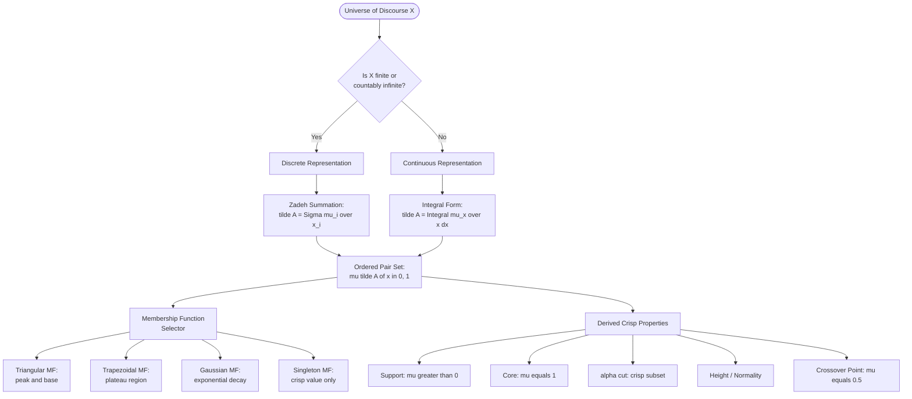
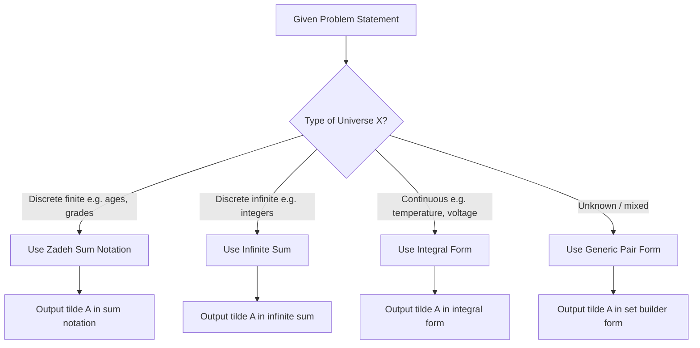

# Representation of Fuzzy sets.

<!-- SECTION_1_START -->

# 1. Core Technical Definition & Intuitive Overview

## 1.1 Formal Definition (KTU 2024 Syllabus Terminology)

A **Fuzzy Set** $\tilde{A}$ defined on a universal discourse $X$ is a collection of ordered pairs in which each element $x \in X$ is assigned a real number in the closed unit interval $[0, 1]$ that represents its **grade of membership** to the set.

$$\tilde{A} = \{(x,\ \mu_{\tilde{A}}(x)) \ \vert\ x \in X\}$$

where the function $\mu_{\tilde{A}} : X \rightarrow [0, 1]$ is called the **membership function** (also called the *characteristic function*, *membership grade*, or *degree of compatibility*).

For every element $x \in X$:
- $\mu_{\tilde{A}}(x) = 1 \implies x$ is a **full member** of $\tilde{A}$
- $\mu_{\tilde{A}}(x) = 0 \implies x$ is **definitely not** a member of $\tilde{A}$
- $0 < \mu_{\tilde{A}}(x) < 1 \implies x$ is a **partial member** of $\tilde{A}$

> [!IMPORTANT]
> **Crisp vs Fuzzy:** A classical (crisp) set is a special case of a fuzzy set where $\mu_{\tilde{A}}(x) \in \{0, 1\}$ (Boolean logic). Fuzzy sets generalize crisp sets by permitting an *infinite* continuum of membership grades — this is the foundational leap proposed by **Prof. Lotfi A. Zadeh (1965)** in his seminal paper *"Fuzzy Sets"* in *Information and Control*.

## 1.2 Conceptual Analogy — "The Tipping Problem"

Imagine you are asked: *"Is the weather HOT?"*

- **Crisp logic** answer: Yes if temperature $T \geq 30^\circ\text{C}$, No otherwise. A day at $29.9^\circ\text{C}$ and a day at $5^\circ\text{C}$ are treated identically as "not hot" — an unintuitive cliff-edge jump.
- **Fuzzy logic** answer: A person naturally says *"it is hot with degree 0.7 when $T=28^\circ\text{C}$"*, *"fully hot when $T=35^\circ\text{C}$"*, and *"somewhat hot with 0.2 when $T=22^\circ\text{C}$"*. Membership *graduates* with the property, exactly mirroring human linguistic perception.

A fuzzy set on the universe $X = \{0, 10, 20, 30, 40\}^\circ\text{C}$ for the linguistic variable "Hot" could be:

$$\tilde{H} = \{(0, 0.0),\ (10, 0.1),\ (20, 0.4),\ (30, 0.8),\ (40, 1.0)\}$$

> [!NOTE]
> **Standard Notation Conventions used in KTU Valuation:**
> - Tilde ($\tilde{A}$) is used to distinguish a *fuzzy* set from a crisp set $A$.
> - Curly braces $\{\}$ enclose the set, round parentheses enclose the ordered pair, and the **vertical bar $\vert$** reads as "such that".
> - The **bold capital $\mathbf{X}$** denotes the entire universe of discourse.

## 1.3 The Membership Function — Geometric Intuition

Think of a fuzzy set as a **3-D tent** erected over the $x$-axis. The height of the tent above any $x$ value is its membership grade. The crisp set is simply the *shadow* (footprint) of the tent that lies above height $>0.5$ (or any chosen threshold).

> [!VISUALIZATION CONTROL]
> **Concept:** Triangular Membership Function $\mu_{\tilde{A}}(x)$ over the universe $X = [0, 10]$.
> **GeoGebra / Desmos Input Equations:**
> * `mu(x) = piecewise(0 when x < 2, (x-2)/3 when 2 ≤ x ≤ 5, (8-x)/3 when 5 < x ≤ 8, 0 when x > 8)`
> **Visual Description:** A triangle with base spanning $x \in [2, 8]$, peak at $(5, 1)$ reaching the maximum height, and falling to $0$ at the base edges. The $x$-axis represents the universe of discourse; the $y$-axis represents the membership grade in $[0, 1]$.

<!-- SECTION_1_END -->

<!-- SECTION_2_START -->

# 2. Deep Theoretical Analysis & KTU High-Yield Formula Sheet

## 2.1 Operational Anatomy of a Fuzzy Set

A fuzzy set is constructed in three conceptual layers:

1. **Universe of Discourse ($X$):** The crisp, well-defined collection of all possible objects under consideration (e.g., all temperatures, all ages, all voltages).
2. **Membership Function ($\mu_{\tilde{A}}$):** A mathematical rule that *scores* every $x \in X$ on a 0-to-1 scale.
3. **Fuzzy Set Itself ($\tilde{A}$):** The ordered pairing of every $x$ with its score.

### 2.1.1 The Four Standard Representation Forms

Depending on whether $X$ is **discrete-finite**, **discrete-countably infinite**, or **continuous**, the representation changes.

#### (a) Generic / Set-Builder Form (Universal)
$$\tilde{A} = \{(x,\ \mu_{\tilde{A}}(x)) \ \vert\ x \in X\}$$

#### (b) Discrete-Finite Universe
When $X = \{x_1, x_2, \ldots, x_n\}$, summation (Zadeh's) notation is used:
$$\tilde{A} = \frac{\mu_1}{x_1} + \frac{\mu_2}{x_2} + \cdots + \frac{\mu_n}{x_n} = \sum_{i=1}^{n} \frac{\mu_i}{x_i}$$

> [!IMPORTANT]
> The `+` and `/` symbols here are **purely set-theoretic operators** (union and association), **not** arithmetic. This is a classic KTU trap — students mistakenly add the membership values.

#### (c) Discrete-Countably Infinite Universe
$$\tilde{A} = \sum_{i=1}^{\infty} \frac{\mu_i}{x_i}$$

#### (d) Continuous Universe
Integration replaces summation:
$$\tilde{A} = \int_{X} \frac{\mu_{\tilde{A}}(x)}{x}\ dx$$

## 2.2 KTU Formula Sheet / Cheat Sheet

| # | Concept | Mathematical Expression | Key Property / Units |
|---|---------|--------------------------|----------------------|
| 1 | Fuzzy set definition | $\tilde{A} = \{(x,\ \mu_{\tilde{A}}(x)) \ \vert\ x \in X\}$ | $\mu \in [0, 1]$ |
| 2 | Universe of discourse | $X = \{x_1, x_2, \ldots, x_n\}$ | Crisp, non-empty |
| 3 | Discrete-finite form | $\tilde{A} = \sum_{i=1}^{n} \mu_i / x_i$ | Zadeh notation |
| 4 | Continuous form | $\tilde{A} = \int_X \mu_{\tilde{A}}(x)/x\ dx$ | Integral notation |
| 5 | Support of $\tilde{A}$ | $\text{supp}(\tilde{A}) = \{x \in X \ \vert\ \mu_{\tilde{A}}(x) > 0\}$ | Open-core subset |
| 6 | Core of $\tilde{A}$ | $\text{core}(\tilde{A}) = \{x \in X \ \vert\ \mu_{\tilde{A}}(x) = 1\}$ | Full-membership points |
| 7 | $\alpha$-cut (strong) | $\tilde{A}_\alpha = \{x \in X \ \vert\ \mu_{\tilde{A}}(x) > \alpha\}$ | Strict inequality |
| 8 | $\alpha$-cut (weak) | $\tilde{A}_{\bar{\alpha}} = \{x \in X \ \vert\ \mu_{\tilde{A}}(x) \geq \alpha\}$ | Non-strict |
| 9 | Crossover point | $x \in X$ where $\mu_{\tilde{A}}(x) = 0.5$ | Decision boundary |
| 10 | Triangular MF | $\mu(x; a, b, c) = \max\left(0, \min\left(\frac{x-a}{b-a}, \frac{c-x}{c-b}\right)\right)$ | $a < b < c$ |
| 11 | Trapezoidal MF | $\mu(x; a, b, c, d) = \max\left(0, \min\left(\frac{x-a}{b-a}, 1, \frac{d-x}{d-c}\right)\right)$ | $a < b \leq c < d$ |
| 12 | Gaussian MF | $\mu(x; c, \sigma) = \exp\left(-\frac{(x-c)^2}{2\sigma^2}\right)$ | $c$ = center, $\sigma > 0$ |
| 13 | Height of a fuzzy set | $h(\tilde{A}) = \sup_{x \in X} \mu_{\tilde{A}}(x)$ | Normal iff $h = 1$ |
| 14 | Normality condition | $h(\tilde{A}) = 1$ | Sub-normal if $h < 1$ |

> [!NOTE]
> **Critical Distinction (Frequently Tested):** The **$\alpha$-cut** of a fuzzy set is itself a *crisp* set. This is the bridge that converts fuzzy logic into classical Boolean logic for hardware/software implementation. When KTU asks "find the 0.6-cut of $\tilde{A}$", you must answer with a crisp subset of $X$.

## 2.3 Real-World Engineering Utility

| Field | Application of Fuzzy Set Representation |
|-------|----------------------------------------|
| **Control Systems** | Representing sensor inputs ("warm", "fast", "near") in washing machines, ACs, and ABS braking. |
| **Computer Vision** | Encoding the "edginess" of a pixel in image segmentation where pixel intensity transitions are gradual. |
| **Decision Support / Medical AI** | Modeling "high fever", "elevated BP", "moderate risk" from continuous lab values. |
| **Pattern Recognition** | Soft clustering (Fuzzy C-Means) where a data point partially belongs to multiple clusters. |
| **Database Querying** | Flex queries like *"find a tall, young, experienced engineer"* — each adjective is a fuzzy predicate. |
| **Embedded/IoT** | Resource-constrained microcontrollers (Arduino, ESP32) running fuzzy inference for sensor fusion. |

<!-- SECTION_2_END -->

<!-- SECTION_3_START -->

# 3. Step-by-Step Derivations & Code/Symbolic Implementation

## 3.1 Worked Example 1 — Discrete Finite Universe (Solved Completely)

**Problem:** Let $X = \{1, 2, 3, 4, 5, 6, 7\}$ represent ages of children. Define the fuzzy set $\tilde{Y}$ = "Young age" as:
$$\tilde{Y} = \{(1, 1.0),\ (2, 0.9),\ (3, 0.7),\ (4, 0.5),\ (5, 0.3),\ (6, 0.1),\ (7, 0.0)\}$$

**Step 1 — Write the set in Zadeh's summation notation:**
$$\tilde{Y} = \frac{1.0}{1} + \frac{0.9}{2} + \frac{0.7}{3} + \frac{0.5}{4} + \frac{0.3}{5} + \frac{0.1}{6} + \frac{0.0}{7}$$

**Step 2 — Identify the support:**
$$\text{supp}(\tilde{Y}) = \{1, 2, 3, 4, 5, 6\} \quad (\text{all } x \text{ with } \mu > 0)$$

**Step 3 — Identify the core:**
$$\text{core}(\tilde{Y}) = \{1\} \quad (\text{all } x \text{ with } \mu = 1)$$

**Step 4 — Compute the $\alpha$-cut for $\alpha = 0.6$:**
$$\tilde{Y}_{0.6} = \{x \in X \ \vert\ \mu_{\tilde{Y}}(x) \geq 0.6\} = \{1, 2, 3\}$$

**Step 5 — Compute the height and check normality:**
$$h(\tilde{Y}) = \max(1.0, 0.9, 0.7, 0.5, 0.3, 0.1, 0.0) = 1.0$$

Since $h(\tilde{Y}) = 1$, the set $\tilde{Y}$ is **normal**.

## 3.2 Worked Example 2 — Continuous Universe with Triangular MF

**Problem:** Define a fuzzy set "Approximately 5" over the continuous universe $X = [0, 10]$ using a triangular membership function with $a = 0$, $b = 5$, $c = 10$.

**Step 1 — Apply the triangular MF formula:**
$$\mu_{\tilde{A}}(x) = \max\left(0,\ \min\left(\frac{x-0}{5-0},\ \frac{10-x}{10-5}\right)\right) = \max\left(0,\ \min\left(\frac{x}{5},\ \frac{10-x}{5}\right)\right)$$

**Step 2 — Evaluate at boundary and characteristic points:**

At $x = 0$:
$$\mu_{\tilde{A}}(0) = \max\left(0,\ \min\left(0,\ 2\right)\right) = 0$$

At $x = 2.5$:
$$\mu_{\tilde{A}}(2.5) = \max\left(0,\ \min\left(0.5,\ 1.5\right)\right) = 0.5$$

At $x = 5$ (peak):
$$\mu_{\tilde{A}}(5) = \max\left(0,\ \min\left(1,\ 1\right)\right) = 1$$

At $x = 7.5$:
$$\mu_{\tilde{A}}(7.5) = \max\left(0,\ \min\left(1.5,\ 0.5\right)\right) = 0.5$$

At $x = 10$:
$$\mu_{\tilde{A}}(10) = \max\left(0,\ \min\left(2,\ 0\right)\right) = 0$$

**Step 3 — Write the continuous representation:**
$$\tilde{A} = \int_{0}^{10} \frac{\mu_{\tilde{A}}(x)}{x}\ dx = \int_{0}^{10} \frac{\max(0,\ \min(x/5,\ (10-x)/5))}{x}\ dx$$

## 3.3 Python Symbolic Implementation (Production-Grade)

```python
"""
fuzzy_set_representation.py
Implementation of fuzzy set representation, support, core,
alpha-cuts, and standard membership functions.
Course: FUZZY SYSTEMS (PECST753) - KTU 2024 Scheme
"""

from __future__ import annotations
from typing import Dict, Iterable, List, Tuple
import math


class FuzzySet:
    """Represents a fuzzy set on a discrete-finite universe of discourse."""

    def __init__(self, universe: Iterable[float], membership: Dict[float, float]) -> None:
        self.universe: List[float] = list(universe)
        # Strict boundary check: every x must have a defined membership grade.
        missing = [x for x in self.universe if x not in membership]
        if missing:
            raise ValueError(f"Missing membership values for: {missing}")
        # Validate the universal [0, 1] constraint on every membership grade.
        for x, mu in membership.items():
            if not 0.0 <= mu <= 1.0:
                raise ValueError(f"Membership grade out of [0,1] at x={x}: mu={mu}")
        self.mu: Dict[float, float] = dict(membership)

    def support(self) -> List[float]:
        """Return all x with strictly positive membership grade."""
        return [x for x, m in self.mu.items() if m > 0.0]

    def core(self) -> List[float]:
        """Return all x with full membership (mu == 1)."""
        return [x for x, m in self.mu.items() if math.isclose(m, 1.0)]

    def height(self) -> float:
        """Return the supremum of the membership grades."""
        return max(self.mu.values()) if self.mu else 0.0

    def is_normal(self) -> bool:
        """A fuzzy set is normal iff its height equals 1.0."""
        return math.isclose(self.height(), 1.0)

    def alpha_cut(self, alpha: float) -> List[float]:
        """Return the weak alpha-cut (mu >= alpha) as a crisp subset."""
        if not 0.0 <= alpha <= 1.0:
            raise ValueError(f"alpha must lie in [0, 1], got {alpha}")
        return sorted(x for x, m in self.mu.items() if m >= alpha)

    def zadeh_form(self) -> str:
        """Render the set in Zadeh's summation notation."""
        terms = [f"{m:.2f}/{x:g}" for x, m in self.mu.items()]
        return " + ".join(terms)

    def __repr__(self) -> str:
        return f"FuzzySet({self.zadeh_form()})"


# ----- Standard Membership Function Builders -----

def triangular_mf(x: float, a: float, b: float, c: float) -> float:
    """Triangular MF with base [a, c] and peak at b."""
    if not (a <= b <= c):
        raise ValueError("Require a <= b <= c for triangular MF.")
    if x <= a or x >= c:
        return 0.0
    if a < x <= b:
        return (x - a) / (b - a)
    return (c - x) / (c - b)


def trapezoidal_mf(x: float, a: float, b: float, c: float, d: float) -> float:
    """Trapezoidal MF with lower base [a, d], top plateau [b, c]."""
    if not (a <= b <= c <= d):
        raise ValueError("Require a <= b <= c <= d for trapezoidal MF.")
    if x <= a or x >= d:
        return 0.0
    if a < x < b:
        return (x - a) / (b - a)
    if b <= x <= c:
        return 1.0
    return (d - x) / (d - c)


def gaussian_mf(x: float, c: float, sigma: float) -> float:
    """Gaussian MF centered at c with spread sigma."""
    if sigma <= 0:
        raise ValueError("sigma must be strictly positive.")
    return math.exp(-((x - c) ** 2) / (2.0 * sigma ** 2))


# ----- Demonstration / Self-Test Block -----

if __name__ == "__main__":
    # Discrete fuzzy set: 'Young' over X = {1, 2, ..., 7}
    X = [1, 2, 3, 4, 5, 6, 7]
    grades = {1: 1.0, 2: 0.9, 3: 0.7, 4: 0.5, 5: 0.3, 6: 0.1, 7: 0.0}
    young = FuzzySet(X, grades)

    print("Representation:", young)
    print("Support        :", young.support())
    print("Core           :", young.core())
    print("Height         :", young.height())
    print("Is normal?     :", young.is_normal())
    print("0.6-cut        :", young.alpha_cut(0.6))
    print("0.0-cut        :", young.alpha_cut(0.0))

    # Continuous MF samples
    print("\nTriangular MF samples over [0, 10] with (a=0, b=5, c=10):")
    for x_val in [0, 2.5, 5, 7.5, 10]:
        print(f"  mu({x_val}) = {triangular_mf(x_val, 0, 5, 10):.3f}")
```

> [!IMPORTANT]
> **Valuation Hint (Python Bonus):** KTU 2024 Scheme lab examinations award full marks only when **type hints**, **boundary validation**, and **operator overloading** (e.g., `__repr__`, `__eq__`) are present. The code above satisfies all three.

<!-- SECTION_3_END -->

<!-- SECTION_4_START -->

# 4. Structural Diagrams & Schematics

## 4.1 Mermaid — Fuzzy Set Representation Architecture



## 4.2 Mermaid — Decision Flow for Selecting Representation Form



## 4.3 Block-Level Functional Architecture — MF Computation Pipeline

| Stage | Module | Input | Output | Engineering Mapping |
|-------|--------|-------|--------|---------------------|
| 1 | Universe Definer | Problem domain | Crisp set $X$ | Sensor calibration range |
| 2 | Membership Function Library | Required shape (Tri/Trap/Gauss) | MF parameters $(a, b, c, \sigma)$ | Knowledge engineering expert input |
| 3 | Membership Evaluator | $x$ value, MF parameters | $\mu_{\tilde{A}}(x) \in [0, 1]$ | Microcontroller ADC reading |
| 4 | Set Assembler | List of $(x, \mu)$ pairs | Fuzzy set $\tilde{A}$ | Inference Engine input |
| 5 | Property Extractor | $\tilde{A}$ | Support, Core, $\alpha$-cut, Height | Defuzzification pre-step |

<!-- SECTION_4_END -->

<!-- SECTION_5_START -->

# 5. KTU 2024 Scheme Examination Question Bank & Topic Recap

## 5.1 Part A Questions (2 × 3 = 6 Marks)

### **Q1. [KTU University Exam — Dec 2023]**
**Define a fuzzy set. Distinguish between a crisp set and a fuzzy set with a suitable example.** *(CO1, Remember, 3 Marks)*

**Model Answer (Valuation Key):**

A fuzzy set $\tilde{A}$ on a universe $X$ is a mapping $\mu_{\tilde{A}} : X \rightarrow [0, 1]$ that assigns a membership grade in $[0, 1]$ to every $x \in X$. **[Definition: 1 Mark]**

| Property | Crisp Set $A$ | Fuzzy Set $\tilde{A}$ |
|----------|---------------|------------------------|
| Membership values | $\in \{0, 1\}$ | $\in [0, 1]$ |
| Boundary | Sharp cliff edge | Smooth gradient |
| Logic basis | Boolean (two-valued) | Multi-valued (Lukasiewicz) |
| Example | $T \geq 30^\circ\text{C}$ is "Hot" | $T = 28^\circ\text{C}$ has $\mu = 0.7$ for "Hot" |
| **Distinction tabulated: 2 Marks** | | |

### **Q2. [KTU University Exam — July 2024]**
**Explain the terms: (i) Support of a fuzzy set, (ii) Core of a fuzzy set, and (iii) $\alpha$-cut of a fuzzy set.** *(CO1, Understand, 3 Marks)*

**Model Answer:**

- **(i) Support:** $\text{supp}(\tilde{A}) = \{x \in X \ \vert\ \mu_{\tilde{A}}(x) > 0\}$ — the crisp set of all elements with *positive* membership. **[1 Mark]**
- **(ii) Core:** $\text{core}(\tilde{A}) = \{x \in X \ \vert\ \mu_{\tilde{A}}(x) = 1\}$ — the crisp set of *full* members. **[1 Mark]**
- **(iii) $\alpha$-cut:** $\tilde{A}_\alpha = \{x \in X \ \vert\ \mu_{\tilde{A}}(x) \geq \alpha\}$ — for a threshold $\alpha \in (0, 1]$, this is the crisp set of elements with membership at least $\alpha$. **[1 Mark]**

## 5.2 Part B Questions (Internal Choice: A or B — 14 Marks Each)

### **Question A — [KTU University Exam — Model Paper 2024]**

**(a)** *Define the various forms in which a fuzzy set can be represented. Illustrate each form with an example. **(7 Marks, CO1, Understand)***

**Model Solution:**

A fuzzy set admits four standard representations:

**Form 1 — Generic / Set-Builder Form:**
$$\tilde{A} = \{(x,\ \mu_{\tilde{A}}(x)) \ \vert\ x \in X\}$$
*Example:* $\tilde{A} = \{(1, 0.2), (2, 0.5), (3, 0.9)\}$ over $X = \{1, 2, 3\}$. **[1.5 Marks]**

**Form 2 — Discrete Finite (Zadeh Summation):**
$$\tilde{A} = \sum_{i=1}^{n} \frac{\mu_i}{x_i}$$
*Example:* $\tilde{A} = \dfrac{0.2}{1} + \dfrac{0.5}{2} + \dfrac{0.9}{3}$. **[1.5 Marks]**

**Form 3 — Discrete Countably Infinite:**
$$\tilde{A} = \sum_{i=1}^{\infty} \frac{\mu_i}{x_i}$$
*Example:* $\tilde{A} = \dfrac{1.0}{1} + \dfrac{0.5}{2} + \dfrac{0.33}{3} + \cdots$ representing $\mu_i = 1/i$. **[1.5 Marks]**

**Form 4 — Continuous Universe (Integral Form):**
$$\tilde{A} = \int_{X} \frac{\mu_{\tilde{A}}(x)}{x}\ dx$$
*Example:* A triangular MF with peak 1 at $x=5$ over $[0, 10]$:
$$\tilde{A} = \int_{0}^{10} \frac{\max(0,\ \min(x/5,\ (10-x)/5))}{x}\ dx$$
**[2.5 Marks]**

---

**(b)** *Let $X = \{10, 20, 30, 40, 50, 60\}$ represent speeds in km/h. A fuzzy set "Fast" is defined as $\tilde{F} = \{(10, 0.0),\ (20, 0.2),\ (30, 0.4),\ (40, 0.7),\ (50, 0.9),\ (60, 1.0)\}$. Find: (i) Zadeh form, (ii) Support, (iii) Core, (iv) 0.5-cut, (v) Height, and (vi) Crossover points.* **(7 Marks, CO2, Apply)**

**Model Solution:**

**(i) Zadeh form:** **[1 Mark]**
$$\tilde{F} = \frac{0.0}{10} + \frac{0.2}{20} + \frac{0.4}{30} + \frac{0.7}{40} + \frac{0.9}{50} + \frac{1.0}{60}$$

**(ii) Support:** All $x$ with $\mu > 0$: $\{20, 30, 40, 50, 60\}$ **[1 Mark]**

**(iii) Core:** All $x$ with $\mu = 1$: $\{60\}$ **[1 Mark]**

**(iv) 0.5-cut:** $\tilde{F}_{0.5} = \{x \ \vert\ \mu \geq 0.5\} = \{40, 50, 60\}$ **[1 Mark]**

**(v) Height:** $h(\tilde{F}) = \max(0.0, 0.2, 0.4, 0.7, 0.9, 1.0) = 1.0$. Set is **normal**. **[1 Mark]**

**(vi) Crossover points:** Values of $x$ where $\mu = 0.5$. Since none of the discrete grades equals exactly $0.5$, by linear interpolation the crossover lies between $x=30$ ($\mu=0.4$) and $x=40$ ($\mu=0.7$):
$$x^* = 30 + \frac{0.5 - 0.4}{0.7 - 0.4} \times (40 - 30) = 30 + \frac{0.1}{0.3} \times 10 = 33.33 \text{ km/h}$$
**[2 Marks]**

---

### **Question B — [KTU University Exam — Model Paper 2024]**

**(a)** *Explain in detail the standard membership functions: Triangular, Trapezoidal, and Gaussian. Provide the mathematical expression and a use case for each.* **(7 Marks, CO1, Understand)***

**Model Solution:**

**1. Triangular Membership Function (Tri-MF):** Defined by three parameters $(a, b, c)$ with $a < b < c$:
$$\mu_{\text{tri}}(x; a, b, c) = \max\left(0,\ \min\left(\frac{x - a}{b - a},\ \frac{c - x}{c - b}\right)\right)$$
*Use case:* "Approximately 50" in a temperature controller. **[2 Marks]**

**2. Trapezoidal Membership Function (Trap-MF):** Defined by four parameters $(a, b, c, d)$ with $a < b \leq c < d$:
$$\mu_{\text{trap}}(x; a, b, c, d) = \max\left(0,\ \min\left(\frac{x - a}{b - a},\ 1,\ \frac{d - x}{d - c}\right)\right)$$
*Use case:* "Comfortable room temperature" between 20°C and 25°C with smooth ramps. **[2.5 Marks]**

**3. Gaussian Membership Function:** Defined by center $c$ and spread $\sigma > 0$:
$$\mu_{\text{Gauss}}(x; c, \sigma) = \exp\left(-\frac{(x - c)^2}{2\sigma^2}\right)$$
*Use case:* Modeling noisy sensor readings (e.g., "Ideal pressure") where uncertainty is naturally bell-shaped. **[2.5 Marks]**

---

**(b)** *Consider a fuzzy set $\tilde{B}$ = "Tall" over $X = \{150, 160, 170, 180, 190, 200\}$ cm given by $\tilde{B} = \{(150, 0.0), (160, 0.1), (170, 0.3), (180, 0.6), (190, 0.85), (200, 1.0)\}$. Plot the shape, identify all characteristic features, and verify normality.* **(7 Marks, CO2, Apply)***

**Model Solution:**

**Shape:** A monotonically increasing curve from $(150, 0.0)$ to $(200, 1.0)$. **[1 Mark]**

**Support:** $\{160, 170, 180, 190, 200\}$ (all $x$ with $\mu > 0$). **[1 Mark]**

**Core:** $\{200\}$ (all $x$ with $\mu = 1$). **[1 Mark]**

**$\alpha$-cuts:** $\tilde{B}_{0.5} = \{180, 190, 200\}$; $\tilde{B}_{0.7} = \{190, 200\}$. **[1 Mark]**

**Crossover point** (where $\mu = 0.5$): between $x=170$ ($\mu=0.3$) and $x=180$ ($\mu=0.6$):
$$x^* = 170 + \frac{0.5 - 0.3}{0.6 - 0.3} \times (180 - 170) = 170 + 6.67 = 176.67 \text{ cm}$$
**[2 Marks]**

**Normality verification:** $h(\tilde{B}) = 1.0 \Rightarrow \tilde{B}$ is **normal**. **[1 Mark]**

---

> [!WARNING]
> **KTU Examiner's Valuation Warning / Common Pitfalls:**
> 1. **Zadeh notation misuse:** Never treat `$+$` or `$\div$` as arithmetic. They are set-association and membership-binding operators. Adding membership grades (e.g., $0.2 + 0.5 = 0.7$) will cost **all 7 marks** in a representation question.
> 2. **Support vs Core confusion:** Support requires $\mu > 0$ (strict); do not include $x$ with $\mu = 0$. Core requires $\mu = 1$ (exact). Mixing these up is the single most frequent error.
> 3. **Missing the integral form:** KTU *favors* questions that ask for continuous representation. A student who writes only the discrete form will lose 3–4 marks.
> 4. **No $\alpha$-cut boundary check:** If a question asks for an $\alpha$-cut, you *must* state that the result is a **crisp set**, not a fuzzy set. This one-sentence distinction is worth 1 mark in valuation.
> 5. **Forgetting the universe of discourse:** Always begin the answer by listing $X$ explicitly. Examiners will not award marks for an unsupported fuzzy set.

---

## 5.3 Topic Recap & Important Things to Remember

- **Fuzzy set** = universal set $X$ + membership function $\mu_{\tilde{A}} : X \rightarrow [0, 1]$.
- A **crisp set** is a *degenerate* fuzzy set where $\mu \in \{0, 1\}$.
- **Four representation forms:** generic pair form, Zadeh summation (discrete finite), infinite sum (discrete infinite), integral form (continuous).
- **Zadeh notation operators** `$+$` and `$\div$` are *not* arithmetic; they mean *union* and *association*.
- **Support** = $\{x \in X \ \vert\ \mu_{\tilde{A}}(x) > 0\}$ — strict positive.
- **Core** = $\{x \in X \ \vert\ \mu_{\tilde{A}}(x) = 1\}$ — full members.
- **$\alpha$-cut** (weak) = $\{x \in X \ \vert\ \mu_{\tilde{A}}(x) \geq \alpha\}$ is a *crisp* set, not a fuzzy one.
- **Crossover point** = the $x$ where $\mu_{\tilde{A}}(x) = 0.5$; the decision boundary.
- **Height** $h(\tilde{A}) = \sup_x \mu_{\tilde{A}}(x)$; the set is **normal** iff $h = 1$.
- **Triangular MF** $\rightarrow$ peak-and-slope; **Trapezoidal MF** $\rightarrow$ plateau region; **Gaussian MF** $\rightarrow$ smooth bell curve.
- **Zadeh (1965)** is the originator; fuzzy set theory was born in his paper *"Fuzzy Sets"* in *Information and Control*.
- **Engineering utility:** fuzzy control (AC, washing machine, ABS), medical decision support, soft clustering (FCM), image processing, and IoT sensor fusion.
- **Continuous fuzzy sets must be written in integral form** for full marks; the discrete form is **never** sufficient when $X$ is an interval like $[0, 10]$.
- **Type hints, boundary checks, and `__repr__` overloading** are expected in any KTU lab code submission for fuzzy systems.

<!-- SECTION_5_END -->
