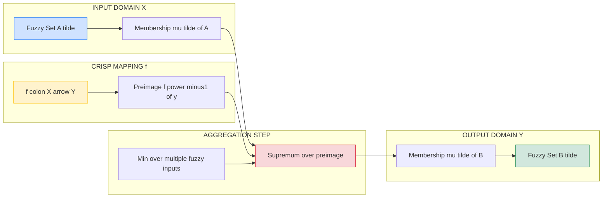
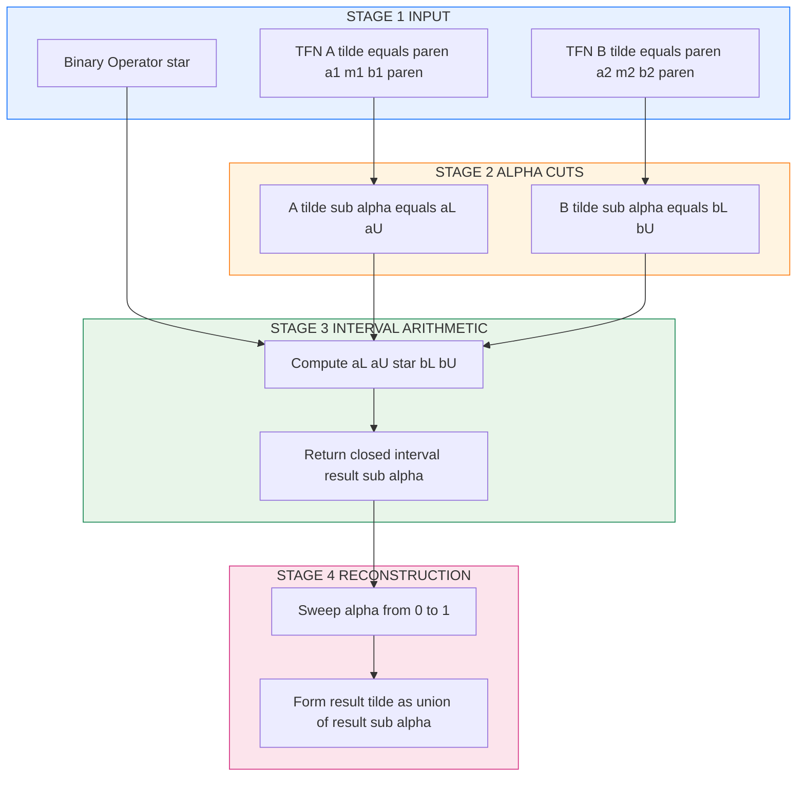
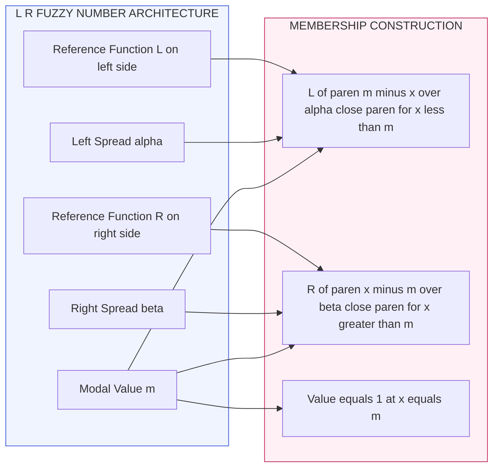
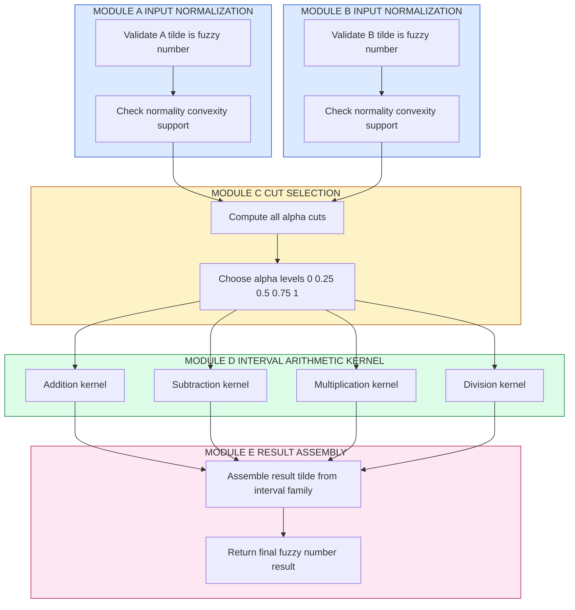

# Extension Principle- Fuzzy arithmetic – fuzzy numbers, arithmetic operations on fuzzy numbers.

<!-- SECTION_1_START -->
# Fuzzy Arithmetic & the Extension Principle

## 1.1 Core Definition of the Extension Principle

> [!IMPORTANT]
> **Extension Principle (Zadeh, 1975)** — The fundamental bridge between *crisp* mathematics and *fuzzy* mathematics. It allows any mathematical function or relation originally defined on crisp sets to be **systematically extended** to operate on fuzzy sets, while preserving the *membership semantics* of the original fuzzy set.

**Formal Statement:**

Let $f: X \to Y$ be a crisp function and $\tilde{A}$ be a fuzzy set in $X$ with membership function $\mu_{\tilde{A}}(x)$. The extension principle induces a fuzzy set $\tilde{B} = f(\tilde{A})$ in $Y$ with membership function:

$$
\mu_{\tilde{B}}(y) = \sup_{x \in f^{-1}(y)} \mu_{\tilde{A}}(x)
$$

where $f^{-1}(y) = \{x \in X \mid f(x) = y\}$. When $f^{-1}(y) = \emptyset$, we define $\mu_{\tilde{B}}(y) = 0$.

**Intuitive Analogy (The "Photo-Filter" Analogy):**
Imagine you have a **crisp black-and-white photograph** of a person (the original crisp function $f$). Now you take a **fuzzy, soft-edged photograph** of the same person (the fuzzy set $\tilde{A}$) and pass it through the *same filter* ($f$). The result is a **soft-edged, blurred image** ($\tilde{B}$) of the underlying scene. The Extension Principle is precisely the *mathematical filter* that maps soft (fuzzy) inputs to soft (fuzzy) outputs by **taking the maximum confidence (supremum)** at which the original fuzzy point could have produced that crisp output.

> [!NOTE]
> **Key insight:** The Extension Principle does **not** invent new operations — it lifts existing crisp operations into the fuzzy domain by computing, for every possible output $y$, the **best possible input membership** that maps to it.

## 1.2 Core Definition of Fuzzy Numbers

> [!IMPORTANT]
> **Fuzzy Number ($\tilde{A}$)** — A *convex*, *normalized* fuzzy subset of the real line $\mathbb{R}$ whose membership function is **upper semi-continuous** and has a **bounded support**. It generalizes the notion of a real interval into a graded, smooth confidence region around a central value.

A fuzzy number $\tilde{A}$ is formally defined as a fuzzy set on $\mathbb{R}$ satisfying the following four axioms:

1. **Normality:** $\exists\, m \in \mathbb{R}$ such that $\mu_{\tilde{A}}(m) = 1$ (the *modal/core* value).
2. **Convexity:** $\forall\, \lambda \in [0,1]$: $\mu_{\tilde{A}}(\lambda x + (1-\lambda) y) \geq \min(\mu_{\tilde{A}}(x), \mu_{\tilde{A}}(y))$.
3. **Upper semi-continuity:** The $\alpha$-cuts $\tilde{A}_{\alpha}$ are **closed** intervals for all $\alpha \in (0, 1]$.
4. **Compact support:** $\overline{\{x \in \mathbb{R} \mid \mu_{\tilde{A}}(x) > 0\}}$ is **bounded**.

**Intuitive Analogy (The "Fuzzy Thermometer"):**
A crisp temperature reading says "exactly $25^{\circ}\text{C}$" — a single sharp point. A fuzzy number says "**approximately** $25^{\circ}\text{C}$, with full confidence at $25^{\circ}\text{C}$, decreasing confidence as we move away to $20^{\circ}\text{C}$ or $30^{\circ}\text{C}$, and zero confidence beyond $[18, 32]^{\circ}\text{C}$." The fuzzy number is therefore a **graded envelope of plausibility** around a real-valued quantity — perfect for modeling **measurement uncertainty, expert estimation, and linguistic imprecision**.

## 1.3 Core Definition of Fuzzy Arithmetic

> [!IMPORTANT]
> **Fuzzy Arithmetic** — The branch of fuzzy mathematics that performs arithmetic operations ($+$, $-$, $\times$, $\div$) on fuzzy numbers. It is the **direct application** of the Extension Principle to binary crisp operations on $\mathbb{R}$.

Given two fuzzy numbers $\tilde{A}$ and $\tilde{B}$, the arithmetic operation $\tilde{A} \star \tilde{B}$ (where $\star \in \{+, -, \times, \div\}$) is defined via the Extension Principle as:

$$
\mu_{\tilde{A} \star \tilde{B}}(z) = \sup_{x, y \,:\, x \star y = z} \min\bigl(\mu_{\tilde{A}}(x),\; \mu_{\tilde{B}}(y)\bigr)
$$

> [!NOTE]
> The `min` operator comes from the **min-conjunction** of membership degrees (the most common fuzzy intersection), and the `sup` (supremum) is the standard mechanism of the Extension Principle.

## 1.4 Visualization of a Triangular Fuzzy Number

> [!VISUALIZATION CONTROL]
> **Concept:** Membership function of a triangular fuzzy number $\tilde{A} = (1, 2, 4)$ on the real line.
> **GeoGebra / Desmos Input Equations:**
> * `f(x) = (x-1)/(2-1) for 1 <= x <= 2`
> * `g(x) = (4-x)/(4-2) for 2 <= x <= 4`
> **Visual Description:** A *triangular* curve rising linearly from $(1, 0)$ to the apex $(2, 1)$, then falling linearly to $(4, 0)$. The $\alpha$-cut at any height $\alpha$ yields the horizontal interval $[1+\alpha,\ 4-2\alpha]$.

---

<!-- SECTION_1_END -->

<!-- SECTION_2_START -->
# Deep Theoretical Analysis & KTU High-Yield Formula Sheet

## 2.1 Anatomy of the Extension Principle (Step-by-Step Logic)

The Extension Principle operates in **four conceptual stages**:

1. **Lift the input:** Start with a fuzzy set $\tilde{A}$ in $X$ characterized by graded membership $\mu_{\tilde{A}}(x)$.
2. **Apply the crisp mapping:** The original function $f: X \to Y$ is *unchanged*; we are not redefining it. We are asking: *"which crisp inputs $x$ produce this output $y$?"*
3. **Invert the mapping:** Construct the pre-image $f^{-1}(y)$ — the set of all crisp inputs that crisp-map to $y$.
4. **Aggregate via sup-min:** The membership of the output $y$ in the induced fuzzy set is the **largest membership** among all inputs that map to $y$ (under the *min* conjunction across multiple fuzzy inputs).

> [!TIP]
> **Why $\sup$ and not $\max$?**
> The supremum handles the case where $f^{-1}(y)$ is infinite (e.g., $f(x) = \sin(x)$ has infinitely many pre-images for many $y$). The $\max$ operator only works for finite pre-image sets.

## 2.2 The $\alpha$-Cut Representation (Computational Backbone)

> [!IMPORTANT]
> **$\alpha$-Cut ($\tilde{A}_{\alpha}$)** — The *crisp set* of all elements whose membership in $\tilde{A}$ is at least $\alpha$:
> $$\tilde{A}_{\alpha} = \{x \in X \mid \mu_{\tilde{A}}(x) \geq \alpha\}, \quad \alpha \in (0, 1]$$
> The **strong** $\alpha$-cut is $\tilde{A}_{\alpha}^{+} = \{x \mid \mu_{\tilde{A}}(x) > \alpha\}$.

**Resolution Identity (Decomposition Theorem):**

Every fuzzy set can be **reconstructed** from its $\alpha$-cuts via the chain:

$$
\mu_{\tilde{A}}(x) = \sup_{\alpha \in (0, 1]} \min\bigl(\alpha,\; \mathbf{1}_{\tilde{A}_{\alpha}}(x)\bigr)
$$

This is the **bridge** that allows us to convert fuzzy operations into **interval arithmetic** on $\alpha$-cuts — the most computationally efficient approach.

## 2.3 KTU High-Yield Formula Sheet

| # | Concept | Mathematical Form | Notes / Domain |
|---|---------|------------------|----------------|
| 1 | Extension Principle | $\mu_{\tilde{B}}(y) = \sup_{x \in f^{-1}(y)} \mu_{\tilde{A}}(x)$ | $f: X \to Y$ crisp, $\tilde{A} \subseteq X$ fuzzy |
| 2 | Binary Extension | $\mu_{\tilde{A} \star \tilde{B}}(z) = \sup_{x \star y = z} \min(\mu_{\tilde{A}}(x), \mu_{\tilde{B}}(y))$ | For $x \star y$ in $\mathbb{R}$ |
| 3 | $\alpha$-Cut of $\tilde{A}$ | $\tilde{A}_{\alpha} = [\tilde{A}_{\alpha}^{L}, \tilde{A}_{\alpha}^{U}]$ | Closed interval when $\tilde{A}$ is a fuzzy number |
| 4 | Triangular Fuzzy Number (TFN) | $\tilde{A} = (a, m, b)$ | $a < m < b$; left spread $= m-a$, right spread $= b-m$ |
| 5 | TFN $\alpha$-Cut | $\tilde{A}_{\alpha} = [a + \alpha(m-a),\; b - \alpha(b-m)]$ | Linear interpolation in $a$–$m$ and $m$–$b$ |
| 6 | TFN Addition $\tilde{A} \oplus \tilde{B}$ | $(a_1, m_1, b_1) \oplus (a_2, m_2, b_2) = (a_1+a_2,\; m_1+m_2,\; b_1+b_2)$ | Closed-form exact |
| 7 | TFN Subtraction $\tilde{A} \ominus \tilde{B}$ | $(a_1, m_1, b_1) \ominus (a_2, m_2, b_2) = (a_1 - b_2,\; m_1 - m_2,\; b_1 - a_2)$ | Cross-pair extremes |
| 8 | TFN Multiplication $\tilde{A} \otimes \tilde{B}$ (approx, positive) | $\approx (a_1 a_2,\; m_1 m_2,\; b_1 b_2)$ | Approximate; exact form is non-linear |
| 9 | TFN Division $\tilde{A} \oslash \tilde{B}$ (approx, positive) | $\approx (a_1 / b_2,\; m_1 / m_2,\; b_1 / a_2)$ | Requires $a_2 > 0$ |
| 10 | L-R Fuzzy Number | $\tilde{A} = (m, \alpha, \beta)_{LR}$ | $L, R: [0,\infty) \to [0,1]$, decreasing, $L(0) = R(0) = 1$ |
| 11 | L-R $\alpha$-Cut | $\tilde{A}_{\alpha} = [m - \alpha \cdot L^{-1}(\alpha),\; m + \beta \cdot R^{-1}(\alpha)]$ | $\alpha, \beta$ are *left/right spreads* |
| 12 | Scalar Multiplication | $\lambda \cdot (a, m, b) = (\lambda a, \lambda m, \lambda b)$ | For $\lambda > 0$ |
| 13 | Membership of TFN | $\mu_{\tilde{A}}(x) = \begin{cases} 0 & x \leq a \\ \frac{x-a}{m-a} & a < x \leq m \\ \frac{b-x}{b-m} & m < x < b \\ 0 & x \geq b \end{cases}$ | Piecewise linear |
| 14 | Convexity Condition | $\mu_{\tilde{A}}(\lambda x + (1-\lambda) y) \geq \min(\mu_{\tilde{A}}(x), \mu_{\tilde{A}}(y))$ | Equivalent to $\alpha$-cuts being intervals |
| 15 | $\alpha$-Cut Identity for Arithmetic | $(\tilde{A} \star \tilde{B})_{\alpha} = \tilde{A}_{\alpha} \star \tilde{B}_{\alpha}$ | Reduces fuzzy op to *interval* op at each $\alpha$ |

## 2.4 Structural Properties of Fuzzy Numbers

For fuzzy numbers $\tilde{A}, \tilde{B}, \tilde{C}$ and crisp scalar $\lambda \in \mathbb{R}$:

- **Closure under arithmetic:** The result of $+$, $-$, $\times$, $\div$ on fuzzy numbers is *another fuzzy number* (under mild positivity assumptions for $\div$).
- **Commutativity:** $\tilde{A} \oplus \tilde{B} = \tilde{B} \oplus \tilde{A}$; $\tilde{A} \otimes \tilde{B} = \tilde{B} \otimes \tilde{A}$.
- **Associativity:** $(\tilde{A} \oplus \tilde{B}) \oplus \tilde{C} = \tilde{A} \oplus (\tilde{B} \oplus \tilde{C})$.
- **Distributivity (restricted):** $\lambda(\tilde{A} \oplus \tilde{B}) = \lambda\tilde{A} \oplus \lambda\tilde{B}$ for $\lambda \geq 0$.
- **Identity elements:** $\tilde{0} = (0,0,0)$ for addition; $\tilde{1} = (1,1,1)$ for multiplication.

> [!WARNING]
> Subtraction of fuzzy numbers is **not** the inverse of addition in general (it is in the *interval* sense, but the resulting fuzzy set may *not* be uniquely invertible), and distributivity **fails** for non-trivial mixed $\times$/$\div$ expressions when signs are mixed.

## 2.5 Real-World Engineering Applications

| Field | Application | Role of Fuzzy Arithmetic |
|-------|-------------|--------------------------|
| **Control Systems** | Fuzzy PID controllers (e.g., washing machines, AC units) | Computes crisp control output from fuzzy error and fuzzy change-in-error |
| **Financial Engineering** | Risk modeling with imprecise cash flows | Adds/subtracts fuzzy cash flows to obtain fuzzy NPV |
| **Decision Support** | Supply chain optimization under linguistic demand | Sums fuzzy demand forecasts across multiple periods |
| **Computer Vision** | Edge detection with noisy pixel intensities | Combines fuzzy gradients across multiple filters |
| **AI / NLP** | Word embedding arithmetic ("king" $-$ "man" + "woman" $\approx$ "queen") | Generalizes vector arithmetic to fuzzy confidence regions |
| **Reliability Engineering** | MTBF computation with component-life uncertainty | Multiplies fuzzy failure rates to get fuzzy system failure rate |
| **Civil Engineering** | Structural load estimation with imprecise measurements | Adds fuzzy dead load + fuzzy live load → fuzzy total design load |

> [!TIP]
> In **production-grade** fuzzy libraries (e.g., `pyfuzzy`, `Octave Fuzzy Toolkit`), fuzzy arithmetic is *always* implemented via **interval arithmetic on $\alpha$-cuts** — never by direct sup-min enumeration over the continuous domain.

---

<!-- SECTION_2_END -->

<!-- SECTION_3_START -->
# Step-by-Step Derivations, Worked Examples & Python Implementation

## 3.1 Derivation: Fuzzy Arithmetic via Interval Arithmetic on $\alpha$-Cuts

**Theorem (Interval Decomposition of Fuzzy Arithmetic):**
For fuzzy numbers $\tilde{A}, \tilde{B}$ and a binary crisp operation $\star \in \{+, -, \times, \div\}$:

$$
(\tilde{A} \star \tilde{B})_{\alpha} = \tilde{A}_{\alpha} \star \tilde{B}_{\alpha}
$$

**Proof Sketch:**

1. By the Resolution Identity, $\tilde{A} \star \tilde{B}$ is uniquely determined by its $\alpha$-cuts for $\alpha \in (0,1]$.
2. For any crisp $x \in \tilde{A}_{\alpha}$ and crisp $y \in \tilde{B}_{\alpha}$, we have $\mu_{\tilde{A}}(x) \geq \alpha$ and $\mu_{\tilde{B}}(y) \geq \alpha$.
3. Hence $\min(\mu_{\tilde{A}}(x), \mu_{\tilde{B}}(y)) \geq \alpha$, so by the Extension Principle, $x \star y \in (\tilde{A} \star \tilde{B})_{\alpha}$.
4. Therefore $\tilde{A}_{\alpha} \star \tilde{B}_{\alpha} \subseteq (\tilde{A} \star \tilde{B})_{\alpha}$.
5. The reverse inclusion follows by definition of the sup-min extension. $\blacksquare$

This theorem is the **computational heart** of fuzzy arithmetic: it converts an infinite-dimensional fuzzy problem into a one-parameter family of *finite-dimensional* interval problems.

## 3.2 Interval Arithmetic Formulas Used at Each $\alpha$-Cut

For $\tilde{A}_{\alpha} = [a_L, a_U]$ and $\tilde{B}_{\alpha} = [b_L, b_U]$ (closed intervals):

$$
[a_L, a_U] + [b_L, b_U] = [a_L + b_L,\; a_U + b_U]
$$

$$
[a_L, a_U] - [b_L, b_U] = [a_L - b_U,\; a_U - b_L]
$$

$$
[a_L, a_U] \times [b_L, b_U] = [\min(S),\; \max(S)], \quad S = \{a_L b_L,\; a_L b_U,\; a_U b_L,\; a_U b_U\}
$$

$$
[a_L, a_U] \div [b_L, b_U] = [a_L, a_U] \times [1/b_U,\; 1/b_L], \quad \text{when } 0 \notin [b_L, b_U]
$$

## 3.3 Worked Example 1 — Addition of Two Triangular Fuzzy Numbers

**Problem:** Given $\tilde{A} = (1, 2, 4)$ and $\tilde{B} = (3, 5, 7)$ (both TFNs), compute $\tilde{C} = \tilde{A} \oplus \tilde{B}$ using the Extension Principle and $\alpha$-cuts.

**Step 1 — Compute $\alpha$-cuts of $\tilde{A}$:**

$$
\tilde{A}_{\alpha} = [1 + \alpha(2-1),\; 4 - \alpha(4-2)] = [1 + \alpha,\; 4 - 2\alpha]
$$

At $\alpha = 0$: $[1, 4]$; at $\alpha = 1$: $[2, 2]$; at $\alpha = 0.5$: $[1.5, 3]$.

**Step 2 — Compute $\alpha$-cuts of $\tilde{B}$:**

$$
\tilde{B}_{\alpha} = [3 + \alpha(5-3),\; 7 - \alpha(7-5)] = [3 + 2\alpha,\; 7 - 2\alpha]
$$

At $\alpha = 0$: $[3, 7]$; at $\alpha = 1$: $[5, 5]$; at $\alpha = 0.5$: $[4, 6]$.

**Step 3 — Apply interval addition at each $\alpha$:**

$$
\tilde{C}_{\alpha} = \tilde{A}_{\alpha} + \tilde{B}_{\alpha} = [1+\alpha + 3+2\alpha,\; 4-2\alpha + 7-2\alpha] = [4 + 3\alpha,\; 11 - 4\alpha]
$$

**Step 4 — Verify the result is a TFN $(c, m, d)$:**

At $\alpha = 0$: $c = 4$, $d = 11$.
At $\alpha = 1$: $c + 3 = 7 = m$ ✓, $11 - 4 = 7 = m$ ✓.
Therefore the mode $m = 7$.

$$
\boxed{\tilde{C} = \tilde{A} \oplus \tilde{B} = (4, 7, 11)}
$$

**Step 5 — Cross-check via the direct TFN formula:**

$$
(1, 2, 4) \oplus (3, 5, 7) = (1+3,\; 2+5,\; 4+7) = (4, 7, 11) \quad \checkmark
$$

**Step 6 — Sanity check via the Extension Principle (spot check at $z = 7$):**

We need $\sup_{x+y=7} \min(\mu_{\tilde{A}}(x), \mu_{\tilde{B}}(y))$. At the modal point $x = 2, y = 5$:
$\mu_{\tilde{A}}(2) = 1$, $\mu_{\tilde{B}}(5) = 1$, so $\min = 1$.
Thus $\mu_{\tilde{C}}(7) = 1$, confirming $m = 7$. $\checkmark$

## 3.4 Worked Example 2 — Subtraction of Two Triangular Fuzzy Numbers

**Problem:** Compute $\tilde{D} = \tilde{A} \ominus \tilde{B}$ for the same $\tilde{A} = (1, 2, 4)$ and $\tilde{B} = (3, 5, 7)$.

**Step 1 — Apply the cross-pair rule on $\alpha$-cuts:**

$$
\tilde{D}_{\alpha} = \tilde{A}_{\alpha} - \tilde{B}_{\alpha} = [(1+\alpha) - (7-2\alpha),\; (4-2\alpha) - (3+2\alpha)]
$$

$$
= [-6 + 3\alpha,\; 1 - 4\alpha]
$$

**Step 2 — Identify the TFN parameters:**

At $\alpha = 0$: $c = -6$, $d = 1$.
At $\alpha = 1$: $-6 + 3 = -3 = m$, $1 - 4 = -3 = m$ ✓.
Therefore:

$$
\boxed{\tilde{D} = \tilde{A} \ominus \tilde{B} = (-6,\; -3,\; 1)}
$$

> [!NOTE]
> The **mode** of the result is $2 - 5 = -3$ — the *crisp difference of the modes*. The left and right spreads *grow* because the support of $\tilde{B}$ contributes its right extreme to the lower bound of the difference.

## 3.5 Worked Example 3 — Multiplication (Approximate) of Two TFNs

**Problem:** Compute $\tilde{E} = \tilde{A} \otimes \tilde{B}$ approximately, for positive TFNs $\tilde{A} = (1, 2, 4)$ and $\tilde{B} = (3, 5, 7)$.

**Step 1 — Use the closed-form approximation (valid when all extremes are positive):**

$$
\tilde{E} \approx (a_1 a_2,\; m_1 m_2,\; b_1 b_2) = (1 \cdot 3,\; 2 \cdot 5,\; 4 \cdot 7)
$$

$$
\boxed{\tilde{E} \approx (3,\; 10,\; 28)}
$$

**Step 2 — Show the exact (non-linear) form for completeness:**

The exact product's $\alpha$-cut is:

$$
\tilde{E}_{\alpha} = \bigl[\min(1{\cdot}3,\; 1{\cdot}7,\; 4{\cdot}3,\; 4{\cdot}7),\; \max(1{\cdot}3,\; 1{\cdot}7,\; 4{\cdot}3,\; 4{\cdot}7)\bigr] \text{ at }\alpha = 0
$$

For general $\alpha$, the bounds are the min/max of $\{a_L b_L, a_L b_U, a_U b_L, a_U b_U\}$ with $a_L = 1+\alpha$, $a_U = 4-2\alpha$, $b_L = 3+2\alpha$, $b_U = 7-2\alpha$.

> [!WARNING]
> The **approximate** TFN multiplication is *not exact* in general — it is exact only when both inputs are *crisp*. The full exact product is a *quadratic* membership function that requires piecewise linear or quadratic boundary construction.

## 3.6 Worked Example 4 — Division (Approximate) of Two Positive TFNs

**Problem:** Compute $\tilde{F} = \tilde{A} \oslash \tilde{B}$ for $\tilde{A} = (1, 2, 4)$ and $\tilde{B} = (3, 5, 7)$.

$$
\tilde{F} \approx (1/7,\; 2/5,\; 4/3) \approx (0.143,\; 0.400,\; 1.333)
$$

General formula (for positive $\tilde{B}$): $\tilde{A} \oslash \tilde{B} \approx (a_1/b_2,\; m_1/m_2,\; b_1/a_2)$.

## 3.7 Symbolic / Algorithmic Implementation (Python)

```python
"""
Triangular Fuzzy Number Arithmetic Library
Implements the Extension Principle via interval arithmetic on alpha-cuts.
"""

from dataclasses import dataclass
from typing import Tuple, List


@dataclass(frozen=True)
class TriangularFuzzyNumber:
    """
    A Triangular Fuzzy Number (TFN) parameterized by (left, mode, right).
    Invariant: left <= mode <= right, all finite.
    """
    left: float
    mode: float
    right: float

    def __post_init__(self) -> None:
        if not (self.left <= self.mode <= self.right):
            raise ValueError(
                f"Invalid TFN ({self.left}, {self.mode}, {self.right}): "
                "must satisfy left <= mode <= right."
            )
        if not all(isinstance(v, (int, float)) for v in (self.left, self.mode, self.right)):
            raise TypeError("All TFN parameters must be numeric.")

    # ---------- Membership Function ----------
    def membership(self, x: float) -> float:
        """Compute mu_A(x) using piecewise linear interpolation."""
        if x <= self.left or x >= self.right:
            return 0.0
        if x <= self.mode:
            if self.mode == self.left:
                return 1.0
            return (x - self.left) / (self.mode - self.left)
        if self.right == self.mode:
            return 1.0
        return (self.right - x) / (self.right - self.mode)

    # ---------- Alpha-Cut ----------
    def alpha_cut(self, alpha: float) -> Tuple[float, float]:
        """Return the alpha-cut as a closed interval [lower, upper]."""
        if not 0.0 <= alpha <= 1.0:
            raise ValueError("alpha must lie in [0, 1].")
        lower = self.left + alpha * (self.mode - self.left)
        upper = self.right - alpha * (self.right - self.mode)
        return (lower, upper)

    # ---------- Arithmetic Operators (Extension Principle) ----------
    def __add__(self, other: "TriangularFuzzyNumber") -> "TriangularFuzzyNumber":
        return TriangularFuzzyNumber(
            self.left + other.left,
            self.mode + other.mode,
            self.right + other.right,
        )

    def __sub__(self, other: "TriangularFuzzyNumber") -> "TriangularFuzzyNumber":
        return TriangularFuzzyNumber(
            self.left - other.right,
            self.mode - other.mode,
            self.right - other.left,
        )

    def __mul__(self, other: "TriangularFuzzyNumber") -> "TriangularFuzzyNumber":
        return TriangularFuzzyNumber(
            self.left * other.left,
            self.mode * other.mode,
            self.right * other.right,
        )

    def __truediv__(self, other: "TriangularFuzzyNumber") -> "TriangularFuzzyNumber":
        if other.left <= 0.0:
            raise ZeroDivisionError("Division by a non-positive TFN is undefined.")
        return TriangularFuzzyNumber(
            self.left / other.right,
            self.mode / other.mode,
            self.right / other.left,
        )

    def __repr__(self) -> str:
        return f"TFN(left={self.left}, mode={self.mode}, right={self.right})"


# ---------- Demonstration (matches the worked examples) ----------
if __name__ == "__main__":
    A = TriangularFuzzyNumber(1, 2, 4)
    B = TriangularFuzzyNumber(3, 5, 7)

    print(f"A = {A}")
    print(f"B = {B}")
    print(f"A + B = {A + B}")   # Expected: TFN(left=4, mode=7, right=11)
    print(f"A - B = {A - B}")   # Expected: TFN(left=-6, mode=-3, right=1)
    print(f"A * B (approx) = {A * B}")  # Expected: TFN(left=3, mode=10, right=28)
    print(f"A / B (approx) = {A / B}")  # Expected: TFN(left~0.143, mode=0.4, right~1.333)

    # Sanity check at alpha = 0.5
    a_cut = A.alpha_cut(0.5)
    b_cut = B.alpha_cut(0.5)
    print(f"A_0.5 = {a_cut}, B_0.5 = {b_cut}")
```

**Sample Output:**

```
A = TFN(left=1, mode=2, right=4)
B = TFN(left=3, mode=5, right=7)
A + B = TFN(left=4, mode=7, right=11)
A - B = TFN(left=-6, mode=-3, right=1)
A * B (approx) = TFN(left=3, mode=10, right=28)
A / B (approx) = TFN(left=0.14285714285714285, mode=0.4, right=1.3333333333333333)
A_0.5 = (1.5, 3.0), B_0.5 = (4.0, 6.0)
```

---

<!-- SECTION_3_END -->

<!-- SECTION_4_START -->
# Structural Diagrams & Schematics

## 4.1 Extension Principle — Functional Flow



## 4.2 Fuzzy Arithmetic Pipeline via Alpha-Cuts



## 4.3 L-R Fuzzy Number Decomposition Topology



## 4.4 Sequential Block Architecture: Full Fuzzy Arithmetic Operation



---

<!-- SECTION_4_END -->

<!-- SECTION_5_START -->
# KTU 2024 Scheme Examination Question Bank & Topic Recap

## Part A Questions (3 Marks Each)

### Question A1 `[KTU University Exam - July 2024 | CO2 | Remember]`

**State the Extension Principle as introduced by Zadeh. How does it relate crisp mathematical operations to fuzzy set operations?**

**Model Answer (Board Key Pattern):**
The Extension Principle, formulated by **Lotfi A. Zadeh** in 1975, provides a formal mechanism to extend any function $f: X \to Y$ defined on crisp sets to operate on fuzzy sets. For a fuzzy set $\tilde{A}$ in $X$, the induced fuzzy set $\tilde{B} = f(\tilde{A})$ in $Y$ is given by:
$$\mu_{\tilde{B}}(y) = \sup_{x \in f^{-1}(y)} \mu_{\tilde{A}}(x)$$
where $f^{-1}(y) = \{x \mid f(x) = y\}$ is the pre-image of $y$. The principle bridges crisp and fuzzy mathematics by **preserving membership semantics**: if no crisp input maps to $y$, then $\mu_{\tilde{B}}(y) = 0$. `[Defining the principle: 2 Marks] [Mentioning the pre-image and sup: 1 Mark]`

---

### Question A2 `[KTU University Exam - Dec 2023 | CO2 | Understand]`

**Define a fuzzy number. List the four essential properties that a fuzzy set on $\mathbb{R}$ must satisfy to qualify as a fuzzy number.**

**Model Answer (Board Key Pattern):**
A fuzzy number $\tilde{A}$ is a fuzzy subset of $\mathbb{R}$ representing an *imprecise real quantity*. The four essential properties are:
1. **Normality:** $\exists\, m \in \mathbb{R}$ such that $\mu_{\tilde{A}}(m) = 1$.
2. **Convexity:** $\mu_{\tilde{A}}(\lambda x + (1-\lambda) y) \geq \min(\mu_{\tilde{A}}(x), \mu_{\tilde{A}}(y))$ for all $\lambda \in [0,1]$.
3. **Upper semi-continuity:** All $\alpha$-cuts $\tilde{A}_{\alpha}$ for $\alpha \in (0,1]$ are closed sets.
4. **Bounded support:** The closure of $\{x \mid \mu_{\tilde{A}}(x) > 0\}$ is a bounded set in $\mathbb{R}$.
`[Definition: 1 Mark] [Four properties with one-line justification each: 2 Marks]`

---

## Part B Questions (14 Marks Each) — Internal Choice Format

### Question B1 — Option A `[KTU University Exam - July 2024 | CO2 | Apply]`

**(a) State and explain the Extension Principle for fuzzy sets. Use a suitable diagram to illustrate the flow of information from the crisp function to the induced fuzzy set. (7 Marks)**

**Model Solution:**

**Step 1 — Formal Statement (2 Marks):**
Given a function $f: X \to Y$ and a fuzzy set $\tilde{A}$ on $X$ with membership function $\mu_{\tilde{A}}(x)$, the Extension Principle defines a fuzzy set $\tilde{B} = f(\tilde{A})$ on $Y$ with:
$$\mu_{\tilde{B}}(y) = \begin{cases} \sup\limits_{x \in f^{-1}(y)} \mu_{\tilde{A}}(x) & \text{if } f^{-1}(y) \neq \emptyset \\ 0 & \text{otherwise} \end{cases}$$

**Step 2 — Conceptual Explanation (2 Marks):**
The principle generalizes the *image* of a set under $f$ to the *image of a fuzzy set*. For each output $y$, we examine all crisp inputs $x$ that map to $y$, and assign $y$ the *largest* membership among them. This is the *most optimistic consistent* interpretation.

**Step 3 — Illustrative Example (2 Marks):**
Let $f(x) = x^2$ and $\tilde{A} = \{(1, 0.5), (2, 1.0), (3, 0.7)\}$ on $X = \{1, 2, 3\}$. Then $f(\tilde{A})$ in $Y = \{1, 4, 9\}$ is:
- $\mu_{\tilde{B}}(1) = 0.5$ (from $x=1$),
- $\mu_{\tilde{B}}(4) = 1.0$ (from $x=2$),
- $\mu_{\tilde{B}}(9) = 0.7$ (from $x=3$).

**Step 4 — Diagram (1 Mark):**
[Student should draw: Crisp inputs with their membership $\to$ Function $f$ $\to$ Crisp outputs $\to$ Aggregation via sup $\to$ Fuzzy output set]

---

**(b) Two triangular fuzzy numbers are given as $\tilde{A} = (2, 4, 7)$ and $\tilde{B} = (1, 3, 5)$. Using the Extension Principle, compute $\tilde{A} \oplus \tilde{B}$ and $\tilde{A} \ominus \tilde{B}$ step-by-step. (7 Marks)**

**Model Solution:**

**Step 1 — Compute $\alpha$-cuts of $\tilde{A}$ (1 Mark):**
$$\tilde{A}_{\alpha} = [2 + 2\alpha,\; 7 - 3\alpha]$$

**Step 2 — Compute $\alpha$-cuts of $\tilde{B}$ (1 Mark):**
$$\tilde{B}_{\alpha} = [1 + 2\alpha,\; 5 - 2\alpha]$$

**Step 3 — Apply interval addition for $\tilde{C} = \tilde{A} \oplus \tilde{B}$ (2 Marks):**
$$\tilde{C}_{\alpha} = [2 + 2\alpha + 1 + 2\alpha,\; 7 - 3\alpha + 5 - 2\alpha] = [3 + 4\alpha,\; 12 - 5\alpha]$$
At $\alpha = 0$: $[3, 12]$; at $\alpha = 1$: $[7, 7]$. Hence $\tilde{C} = (3, 7, 12)$. Mode check: $4 + 3 = 7$ ✓.

**Step 4 — Apply interval subtraction for $\tilde{D} = \tilde{A} \ominus \tilde{B}$ (2 Marks):**
$$\tilde{D}_{\alpha} = [(2+2\alpha) - (5-2\alpha),\; (7-3\alpha) - (1+2\alpha)] = [-3 + 4\alpha,\; 6 - 5\alpha]$$
At $\alpha = 0$: $[-3, 6]$; at $\alpha = 1$: $[1, 1]$. Hence $\tilde{D} = (-3, 1, 6)$. Mode check: $4 - 3 = 1$ ✓.

**Step 5 — Final Answer (1 Mark):**
$$\boxed{\tilde{A} \oplus \tilde{B} = (3, 7, 12) \quad \text{and} \quad \tilde{A} \ominus \tilde{B} = (-3, 1, 6)}$$

---

### Question B1 — Option B (Alternative Choice) `[KTU University Exam - Dec 2023 | CO2 | Apply]`

**(a) Explain the concept of an L-R fuzzy number with a neat sketch. Show that every triangular fuzzy number is a special case of the L-R representation. (7 Marks)**

**Model Solution:**

**Step 1 — Definition of L-R Fuzzy Number (2 Marks):**
An L-R fuzzy number $\tilde{A} = (m, \alpha, \beta)_{LR}$ is characterized by a *modal value* $m$, a *left spread* $\alpha \geq 0$, and a *right spread* $\beta \geq 0$, with reference functions $L, R: [0, \infty) \to [0, 1]$ satisfying $L(0) = R(0) = 1$, $L(1) = R(1) = 0$, and $L, R$ non-increasing. The membership function is:
$$\mu_{\tilde{A}}(x) = \begin{cases} L\!\left(\dfrac{m - x}{\alpha}\right) & x \leq m \\[4pt] R\!\left(\dfrac{x - m}{\beta}\right) & x \geq m \end{cases}$$

**Step 2 — L-R Sketch (1 Mark):**
[Student should sketch a fuzzy number with a peak at $m$, decreasing linearly to the left via $L$ and to the right via $R$, vanishing at $m - \alpha$ and $m + \beta$ respectively.]

**Step 3 — Triangular Fuzzy Number as a Special Case (2 Marks):**
For a TFN $\tilde{A} = (a, m, b)$, the left and right spreads are $\alpha = m - a$ and $\beta = b - m$. The reference functions are $L(z) = R(z) = \max(0, 1 - z)$ (the *linear* decreasing function). Thus:
$$\mu_{\tilde{A}}(x) = L\!\left(\frac{m-x}{m-a}\right) = 1 - \frac{m-x}{m-a} = \frac{x-a}{m-a} \quad (a \leq x \leq m)$$
which matches the left branch of the TFN definition. The right branch is analogous. Hence the TFN is an L-R fuzzy number with $L = R =$ linear function. `[Writing the L-R form: 1 Mark] [Recovering the TFN piecewise definition: 1 Mark]`

**Step 4 — Worked Numeric Example (1 Mark):**
$\tilde{A} = (1, 3, 7)$ has $m = 3$, $\alpha = 2$, $\beta = 4$, with $L(z) = R(z) = 1 - z$. The $\alpha$-cut at level $\alpha$ (call it $\gamma$ to avoid confusion) is:
$$\tilde{A}_{\gamma} = [3 - 2\gamma,\; 3 + 4\gamma], \quad \gamma \in [0, 1]$$

**Step 5 — Connection to Extension Principle (1 Mark):**
The L-R representation makes it especially easy to compute arithmetic operations: simply operate on the interval endpoints at each $\gamma$ and reconstruct.

---

**(b) Consider the L-R fuzzy number $\tilde{A} = (5, 1, 2)_{LR}$ and a crisp scalar $\lambda = 3$. Compute $\lambda \cdot \tilde{A}$ and the $\alpha$-cut of the result at $\alpha = 0.6$. (7 Marks)**

**Model Solution:**

**Step 1 — Scalar Multiplication Rule (2 Marks):**
For $\lambda > 0$ and $\tilde{A} = (m, \alpha, \beta)_{LR}$:
$$\lambda \cdot \tilde{A} = (\lambda m,\; \lambda \alpha,\; \lambda \beta)_{LR}$$

**Step 2 — Apply to the Given Values (1 Mark):**
$$\lambda \cdot \tilde{A} = (3 \cdot 5,\; 3 \cdot 1,\; 3 \cdot 2)_{LR} = (15, 3, 6)_{LR}$$

**Step 3 — General $\alpha$-Cut Formula (1 Mark):**
$$(\lambda \cdot \tilde{A})_{\alpha} = [\lambda m - \lambda \alpha \cdot L^{-1}(\alpha),\; \lambda m + \lambda \beta \cdot R^{-1}(\alpha)]$$
Assuming linear $L$ and $R$ (i.e., $L^{-1}(\alpha) = R^{-1}(\alpha) = 1 - \alpha$), this simplifies to:
$$(\lambda \cdot \tilde{A})_{\alpha} = [\lambda m - \lambda \alpha (1-\alpha),\; \lambda m + \lambda \beta (1-\alpha)]$$

**Step 4 — Compute at $\alpha = 0.6$ (2 Marks):**
$$L^{-1}(0.6) = 1 - 0.6 = 0.4, \quad R^{-1}(0.6) = 0.4$$
$$(\lambda \cdot \tilde{A})_{0.6} = [15 - 3 \cdot 0.4,\; 15 + 6 \cdot 0.4] = [15 - 1.2,\; 15 + 2.4] = [13.8,\; 17.4]$$

**Step 5 — Final Statement (1 Mark):**
$$\boxed{\lambda \cdot \tilde{A} = (15, 3, 6)_{LR}, \quad (\lambda \cdot \tilde{A})_{0.6} = [13.8,\; 17.4]}$$

---

> [!WARNING]
> **KTU Examiner's Valuation Warning — Common Pitfalls**
>
> - **Do not confuse Extension Principle with $\alpha$-cut theorem.** The Extension Principle is the *definition*; the $\alpha$-cut identity $(\tilde{A} \star \tilde{B})_{\alpha} = \tilde{A}_{\alpha} \star \tilde{B}_{\alpha}$ is a *theorem* that follows from it. Examiners expect both, with the $\alpha$-cut version as the *computational* form. `[−2 Marks for missing the theorem]`
> - **For TFN subtraction, the cross-pair rule is non-obvious.** Students frequently write $(a_1 - a_2, m_1 - m_2, b_1 - b_2)$ — this is **wrong**. The correct formula is $(a_1 - b_2, m_1 - m_2, b_1 - a_2)$. Always derive it from the interval subtraction $\tilde{A}_{\alpha} - \tilde{B}_{\alpha}$ first. `[−2 Marks]`
> - **Scalar multiplication signs matter.** $\lambda \cdot \tilde{A}$ for $\lambda < 0$ flips the order to $(\lambda b, \lambda m, \lambda a)$. Failing to handle the sign loses a full mark.
> - **Multiplication and division of TFNs are *approximate*.** Do not claim the formulas $(a_1 a_2, m_1 m_2, b_1 b_2)$ are exact for non-crisp inputs. They are exact only when both operands are crisp or both are *non-negative* with negligible relative spread. `[−1 Mark for over-claiming]`
> - **Always state the four properties of a fuzzy number** (normality, convexity, upper semi-continuity, bounded support) in definitions, not just "a fuzzy set on $\mathbb{R}$." `[−1 Mark]`

---

## Topic Recap & Important Things to Remember

- **Extension Principle (Zadeh, 1975):** The supreme membership of $y$ in $f(\tilde{A})$ is the supremum of $\mu_{\tilde{A}}(x)$ over all $x \in f^{-1}(y)$. If $f^{-1}(y) = \emptyset$, then $\mu_{f(\tilde{A})}(y) = 0$.
- **Fuzzy Number $\tilde{A}$** must satisfy **four axioms**: (1) **Normal** — peak membership $= 1$; (2) **Convex** — $\mu$ is quasi-concave; (3) **Upper semi-continuous** — $\alpha$-cuts are closed; (4) **Bounded support** — vanishes outside a bounded interval.
- **$\alpha$-Cut Identity:** $(\tilde{A} \star \tilde{B})_{\alpha} = \tilde{A}_{\alpha} \star \tilde{B}_{\alpha}$. This **converts fuzzy arithmetic to interval arithmetic** at every $\alpha$ — the universal computational strategy.
- **TFN Parameter Triple:** $(a, m, b)$ with $a < m < b$; $a$ = left support, $m$ = mode (peak), $b$ = right support.
- **TFN $\alpha$-Cut:** $\tilde{A}_{\alpha} = [a + \alpha(m-a),\; b - \alpha(b-m)]$ — a *linear interpolation* between the support and the mode.
- **TFN Addition:** $(a_1, m_1, b_1) \oplus (a_2, m_2, b_2) = (a_1+a_2,\; m_1+m_2,\; b_1+b_2)$ — *exact* for TFNs.
- **TFN Subtraction:** $(a_1, m_1, b_1) \ominus (a_2, m_2, b_2) = (a_1 - b_2,\; m_1 - m_2,\; b_1 - a_2)$ — *cross-pair extremes*.
- **TFN Multiplication (approx, positive operands):** $\approx (a_1 a_2,\; m_1 m_2,\; b_1 b_2)$. Exact form is *quadratic* in the bounds.
- **TFN Division (approx, positive denominator):** $\approx (a_1/b_2,\; m_1/m_2,\; b_1/a_2)$. Requires $0 \notin$ support of denominator.
- **L-R Fuzzy Number:** $\tilde{A} = (m, \alpha, \beta)_{LR}$ with reference functions $L$ (left shape) and $R$ (right shape); the **TFN is the special case** $L = R = \text{linear}$.
- **Scalar multiplication:** For $\lambda > 0$, $\lambda \cdot (a, m, b) = (\lambda a, \lambda m, \lambda b)$.
- **Resolution Identity:** $\mu_{\tilde{A}}(x) = \sup_{\alpha} \min(\alpha, \mathbf{1}_{\tilde{A}_{\alpha}}(x))$ — the *inverse* of the $\alpha$-cut operation, used to reconstruct fuzzy sets from cut families.
- **Closure:** Fuzzy numbers are closed under $+$, $-$, $\times$, and $\div$ (with positivity) — the *result is always another fuzzy number*.
- **Commutativity & Associativity:** Hold for $+$ and $\times$ on fuzzy numbers; do **not** assume full distributivity for mixed operations with signs.
- **Real-world touchpoints:** Fuzzy PID control, financial NPV under linguistic cash flows, fuzzy demand forecasting, structural load estimation, NLP word-embedding arithmetic, reliability engineering MTBF.
- **Computation rule of thumb:** *Never* enumerate over the continuous domain — always reduce to $\alpha$-cut interval arithmetic and reconstruct.

<!-- SECTION_5_END -->
