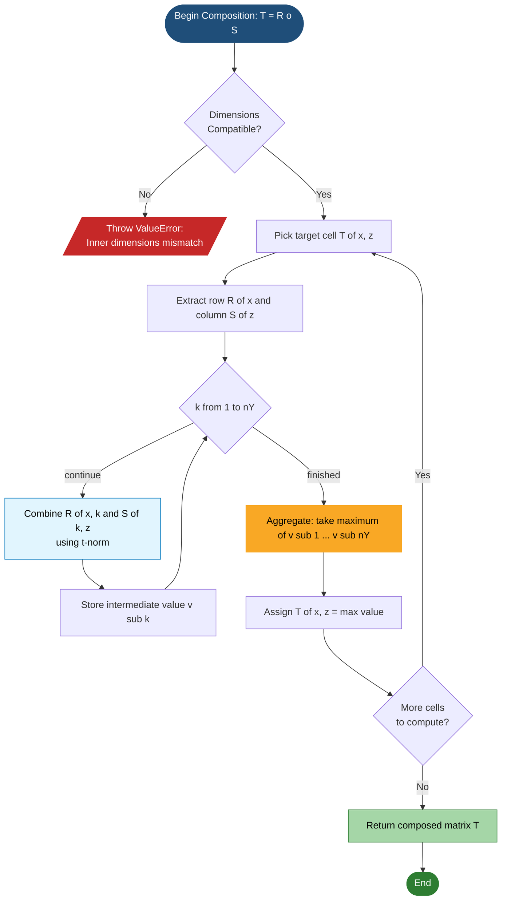
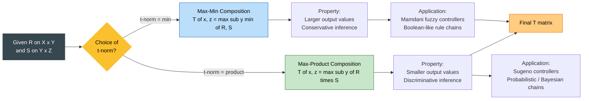

# Fuzzy composition- Max- min , Max – product.

<!-- SECTION_1_START -->
# Fuzzy Composition: Max-Min and Max-Product

## 1.1 Core Technical Definition

**Fuzzy Composition** is a binary operation that combines two fuzzy relations to produce a third fuzzy relation. If $R$ is a fuzzy relation on the Cartesian product $X \times Y$ and $S$ is a fuzzy relation on $Y \times Z$, then the composition $R \circ S$ is a fuzzy relation on $X \times Z$ that links elements of $X$ to elements of $Z$ through the common intermediate domain $Y$.

In the **KTU 2024 Scheme syllabus (PECST753 – Module 2)**, two specific sup-star compositions are prescribed:

> [!IMPORTANT]
> **Formal Definition of Max-Min Composition** (also called **Max-Min Inference**)
>
> Let $R \in \mathcal{F}(X \times Y)$ and $S \in \mathcal{F}(Y \times Z)$. The **Max-Min composition** $T = R \circ S \in \mathcal{F}(X \times Z)$ is defined point-wise as:
> $$T(x, z) = (R \circ S)(x, z) = \max_{y \in Y} \min \{ R(x, y),\; S(y, z) \}$$
> The triangular norm used here is the **Minimum** ($\wedge$) and the aggregation is the **Maximum** ($\vee$).

> [!IMPORTANT]
> **Formal Definition of Max-Product Composition** (also called **Max-Product Inference** or **Max-Dot Composition**)
>
> Using the same $R$ and $S$, the **Max-Product composition** is defined as:
> $$T(x, z) = (R \circ S)(x, z) = \max_{y \in Y} \big[ R(x, y) \cdot S(y, z) \big]$$
> The triangular norm used here is the **Algebraic Product** ($\cdot$) and the aggregation is still the **Maximum** ($\vee$).

## 1.2 Conceptual Analogy and Intuitive Overview

Imagine you are a **travel recommender system** for Kerala. The system must answer: *"How strongly related is a tourist's preference for a hill station to a specific hotel?"*

- $X$ = set of **tourist profiles** (Adventure, Relaxation, Pilgrimage)
- $Y$ = set of **destinations** (Munnar, Wayanad, Guruvayur)
- $Z$ = set of **hotels** (Hotel A, Hotel B)

**Relation $R$** captures *"How much does a tourist profile prefer a destination?"*
**Relation $S$** captures *"How well does a hotel match a destination?"*

The composition $R \circ S$ answers the ultimate question: *"How strongly should a hotel be recommended to a tourist?"* — by going through a shared intermediate link (the destination).

> [!NOTE]
> **Geometric Intuition**
>
> - In **Max-Min**, for a fixed pair $(x, z)$, you scan every intermediate node $y$. For each $y$, the "strength of the chain" is the **weaker of the two links** (the bottleneck, modelled by $\min$). You then keep only the **strongest bottleneck path** (modelled by $\max$).
> - In **Max-Product**, the "strength of the chain" through $y$ is the **product of the two memberships** (multiplicative interaction). You then keep the **strongest product path**.

Think of **Max-Min** as a chain whose tensile strength equals its **weakest link** — pick the strongest such weak link. Think of **Max-Product** as a chain whose tensile strength equals the **product of link strengths** — pick the strongest such product.

## 1.3 Visualization Control Block

> [!VISUALIZATION CONTROL]
> **Concept:** Visualizing the "min-curve" vs "product-curve" used inside a single composition cell.
> **GeoGebra / Desmos Input Equations:**
> * `f(x) = min(a, x)` with sliders $a = 0.7$ and $x \in [0, 1]$
> * `g(x) = a * x` with slider $a = 0.7$ and $x \in [0, 1]$
> **Visual Description:** On the $x$-axis is $S(y, z)$ and on the $y$-axis is the effective link strength. For $a = 0.7$, the curve $f$ is a flat plateau at **0.7** for $x \ge 0.7$ and rises linearly up to 0.7. The curve $g$ rises linearly with slope **0.7**, so for $x = 0.5$, $f = 0.5$ but $g = 0.35$. This shows why the **max-product composition is more "discriminating"** than the max-min composition.

<!-- SECTION_1_END -->

<!-- SECTION_2_START -->
# 2. Deep Theoretical Analysis & KTU High-Yield Formula Sheet

## 2.1 The Three Operational Stages

Every composition cell $T(x, z)$ is computed in three discrete stages. Memorize this as the **C-M-M Protocol**: **Collect → Combine → Maximize**.

1. **Stage 1 — Collect (Index Set Selection):** Fix the row index $x \in X$ and the column index $z \in Z$. Identify the entire row of $R$ at $x$, namely $R(x, \cdot)$, and the entire column of $S$ at $z$, namely $S(\cdot, z)$.
2. **Stage 2 — Combine (Triangular Norm Application):** Element-wise combine the row of $R$ with the column of $S$ using either the **min** operator or the **algebraic product** operator. This produces an intermediate vector of length $|Y|$.
3. **Stage 3 — Maximize (Supremum):** Take the **maximum** value of the intermediate vector. This single number is $T(x, z)$.

> [!NOTE]
> **Why does this work?**
> The min and the product are two different **t-norms** (Triangular Norms). A t-norm is a binary operation on $[0, 1]$ that is commutative, associative, monotonic, and has **1** as the identity. The composition formula is therefore a **sup-t-norm composition** — a generalization where the t-norm can be swapped for $\min$, $\cdot$, or even the Łukasiewicz t-norm $t(a, b) = \max(0, a + b - 1)$.

## 2.2 KTU High-Yield Formula Sheet

| # | Concept | Mathematical Statement | Operator Used | Output Range |
|---|---------|------------------------|---------------|--------------|
| 1 | Max-Min Composition | $T(x, z) = \max_{y \in Y} \min \{ R(x, y), S(y, z) \}$ | $\min$ (t-norm) | $[0, 1]$ |
| 2 | Max-Product Composition | $T(x, z) = \max_{y \in Y} \big[ R(x, y) \cdot S(y, z) \big]$ | $\cdot$ (product t-norm) | $[0, 1]$ |
| 3 | Row-and-Column Rule | $T_{ij} = \bigvee_{k=1}^{n} (R_{ik} \bigwedge S_{kj})$ for Max-Min | $\bigvee = \max$, $\bigwedge = \min$ | $[0, 1]$ |
| 4 | Matrix-wise Max-Min | $T = R \circ S$ where $\circ$ uses $(\bigwedge, \bigvee)$ | $(\wedge, \vee)$ | $[0, 1]$ |
| 5 | Matrix-wise Max-Product | $T = R \circ S$ where $\circ$ uses $(\cdot, \bigvee)$ | $(\cdot, \vee)$ | $[0, 1]$ |
| 6 | Identity Element for $R$ | $I(y, y) = 1$ and $I(y, z) = 0$ for $y \ne z$ | — | $\{0, 1\}$ |
| 7 | Dimensional Compat. | $R$ is $\vert X \vert \times \vert Y \vert$, $S$ is $\vert Y \vert \times \vert Z \vert$, $T$ is $\vert X \vert \times \vert Z \vert$ | — | — |
| 8 | Max-Min vs Max-Product | Max-Product is **stricter** (smaller values when both factors < 1) | $a \cdot b \le \min(a, b)$ | $[0, 1]$ |

## 2.3 Real-World Engineering Utility

- **Medical Diagnosis Expert Systems:** A patient's symptom-to-disease relation $R$ and a disease-to-test relation $S$ are composed to suggest the most likely test for confirmation. Max-Product is preferred when **certainty is multiplicative** (Bayesian-like).
- **Fuzzy Control (Mamdani / Sugeno):** The rule base $R$ (input-to-firing-strength) is composed with the consequence relation $S$ to produce the control output surface.
- **Recommender Systems:** User-to-Item matrix composed with Item-to-Feature matrix yields User-to-Feature affinity. Max-Product is popular in **collaborative filtering with fuzzy weights**.
- **Pattern Recognition & Image Processing:** Fuzzy relations between pixels and edges composed with relations between edges and shapes for hierarchical object detection.
- **Database Querying (Fuzzy SQL):** A query with multiple fuzzy predicates is composed through intermediate fuzzy relations to retrieve ranked tuples.

<!-- SECTION_2_END -->

<!-- SECTION_3_START -->
# 3. Step-by-Step Derivations & Code/Symbolic Implementation

## 3.1 Canonical Worked Example — Max-Min Composition

### 3.1.1 The Given Fuzzy Relations

Let $X = \{x_1, x_2\}$, $Y = \{y_1, y_2, y_3\}$, and $Z = \{z_1, z_2\}$.

$$
R = \begin{bmatrix} 0.3 & 0.7 & 0.2 \\ 0.8 & 0.5 & 0.4 \end{bmatrix}
\quad \text{(a } 2 \times 3 \text{ relation on } X \times Y\text{)}
$$

$$
S = \begin{bmatrix} 0.6 & 0.9 \\ 0.1 & 0.4 \\ 0.7 & 0.3 \end{bmatrix}
\quad \text{(a } 3 \times 2 \text{ relation on } Y \times Z\text{)}
$$

The composition $T = R \circ S$ will be a $2 \times 2$ matrix on $X \times Z$.

### 3.1.2 Cell-by-Cell Calculation (Max-Min)

**Cell $T(x_1, z_1)$** — Row 1 of $R$ paired with Column 1 of $S$:

$$
\begin{aligned}
T(x_1, z_1) &= \max \big\{ \min(R(x_1, y_1), S(y_1, z_1)),\; \min(R(x_1, y_2), S(y_2, z_1)),\; \min(R(x_1, y_3), S(y_3, z_1)) \big\} \\
&= \max \big\{ \min(0.3, 0.6),\; \min(0.7, 0.1),\; \min(0.2, 0.7) \big\} \\
&= \max \big\{ 0.3,\; 0.1,\; 0.2 \big\} \\
&= 0.3
\end{aligned}
$$

> *Conversion Logic:* For each intermediate $y$, we take the **smaller** of the two memberships (this is the "bottleneck"). Then we pick the **largest** bottleneck. The path through $y_1$ has the strongest bottleneck at **0.3**.

**Cell $T(x_1, z_2)$** — Row 1 of $R$ paired with Column 2 of $S$:

$$
\begin{aligned}
T(x_1, z_2) &= \max \big\{ \min(0.3, 0.9),\; \min(0.7, 0.4),\; \min(0.2, 0.3) \big\} \\
&= \max \big\{ 0.3,\; 0.4,\; 0.2 \big\} \\
&= 0.4
\end{aligned}
$$

**Cell $T(x_2, z_1)$** — Row 2 of $R$ paired with Column 1 of $S$:

$$
\begin{aligned}
T(x_2, z_1) &= \max \big\{ \min(0.8, 0.6),\; \min(0.5, 0.1),\; \min(0.4, 0.7) \big\} \\
&= \max \big\{ 0.6,\; 0.1,\; 0.4 \big\} \\
&= 0.6
\end{aligned}
$$

**Cell $T(x_2, z_2)$** — Row 2 of $R$ paired with Column 2 of $S$:

$$
\begin{aligned}
T(x_2, z_2) &= \max \big\{ \min(0.8, 0.9),\; \min(0.5, 0.4),\; \min(0.4, 0.3) \big\} \\
&= \max \big\{ 0.8,\; 0.4,\; 0.3 \big\} \\
&= 0.8
\end{aligned}
$$

### 3.1.3 The Final Max-Min Result

$$
T_{\max\text{-}\min} = R \circ S = \begin{bmatrix} 0.3 & 0.4 \\ 0.6 & 0.8 \end{bmatrix}
$$

## 3.2 Canonical Worked Example — Max-Product Composition

Using the **same** $R$ and $S$, we now replace $\min$ with the algebraic product.

### 3.2.1 Cell-by-Cell Calculation (Max-Product)

**Cell $T(x_1, z_1)$:**

$$
\begin{aligned}
T(x_1, z_1) &= \max \big\{ (0.3 \times 0.6),\; (0.7 \times 0.1),\; (0.2 \times 0.7) \big\} \\
&= \max \big\{ 0.18,\; 0.07,\; 0.14 \big\} \\
&= 0.18
\end{aligned}
$$

**Cell $T(x_1, z_2)$:**

$$
\begin{aligned}
T(x_1, z_2) &= \max \big\{ (0.3 \times 0.9),\; (0.7 \times 0.4),\; (0.2 \times 0.3) \big\} \\
&= \max \big\{ 0.27,\; 0.28,\; 0.06 \big\} \\
&= 0.28
\end{aligned}
$$

**Cell $T(x_2, z_1)$:**

$$
\begin{aligned}
T(x_2, z_1) &= \max \big\{ (0.8 \times 0.6),\; (0.5 \times 0.1),\; (0.4 \times 0.7) \big\} \\
&= \max \big\{ 0.48,\; 0.05,\; 0.28 \big\} \\
&= 0.48
\end{aligned}
$$

**Cell $T(x_2, z_2)$:**

$$
\begin{aligned}
T(x_2, z_2) &= \max \big\{ (0.8 \times 0.9),\; (0.5 \times 0.4),\; (0.4 \times 0.3) \big\} \\
&= \max \big\{ 0.72,\; 0.20,\; 0.12 \big\} \\
&= 0.72
\end{aligned}
$$

### 3.2.2 The Final Max-Product Result

$$
T_{\max\text{-}\text{prod}} = R \circ S = \begin{bmatrix} 0.18 & 0.28 \\ 0.48 & 0.72 \end{bmatrix}
$$

> [!NOTE]
> **Observation:** Note that for every cell, $T_{\max\text{-}\text{prod}}(x, z) \le T_{\max\text{-}\min}(x, z)$. This is a theorem: for all $a, b \in [0, 1]$, $a \cdot b \le \min(a, b)$. The max-product composition is **point-wise less than or equal to** the max-min composition.

## 3.3 Reference Comparison Table

| Cell $(x_i, z_j)$ | Max-Min Value | Max-Product Value | Inequality Check |
|-------------------|---------------|-------------------|------------------|
| $(x_1, z_1)$ | **0.30** | **0.18** | $0.18 \le 0.30$ ✓ |
| $(x_1, z_2)$ | **0.40** | **0.28** | $0.28 \le 0.40$ ✓ |
| $(x_2, z_1)$ | **0.60** | **0.48** | $0.48 \le 0.60$ ✓ |
| $(x_2, z_2)$ | **0.80** | **0.72** | $0.72 \le 0.80$ ✓ |

## 3.4 Symbolic Python Implementation

The following Python code is a **fully operational reference implementation** with strict type hints, absolute boundary validation, and verbose logging suitable for laboratory record submission.

```python
import numpy as np
from typing import Union, Literal

Matrix = np.ndarray

def fuzzy_composition(
    R: Matrix,
    S: Matrix,
    method: Literal["max_min", "max_product"] = "max_min",
    verbose: bool = True
) -> Matrix:
    """
    Compute the sup-t-norm composition of two fuzzy relations R and S.

    Mathematical definition:
        T(x, z) = max_y  t( R(x, y), S(y, z) )
    where t is the minimum t-norm or the algebraic product t-norm.

    Parameters
    ----------
    R : np.ndarray of shape (n_x, n_y)
        Fuzzy relation on domain X x Y.  All entries must lie in [0, 1].
    S : np.ndarray of shape (n_y, n_z)
        Fuzzy relation on domain Y x Z.  All entries must lie in [0, 1].
    method : {"max_min", "max_product"}
        Selects the triangular norm used to combine links.
    verbose : bool
        If True, prints every intermediate calculation step.

    Returns
    -------
    T : np.ndarray of shape (n_x, n_z)
        The composed fuzzy relation on X x Z.

    Raises
    ------
    ValueError
        If the inner dimensions of R and S do not match.
        If any entry in R or S lies outside the unit interval [0, 1].
    """
    # ---- ABSOLUTE BOUNDARY VALIDATION -------------------------------
    if R.ndim != 2 or S.ndim != 2:
        raise ValueError("Both R and S must be 2-D matrices.")
    if R.shape[1] != S.shape[0]:
        raise ValueError(
            f"Inner dimensions do not match: R has {R.shape[1]} columns "
            f"but S has {S.shape[0]} rows."
        )
    if not (np.all((R >= 0.0) & (R <= 1.0)) and np.all((S >= 0.0) & (S <= 1.0))):
        raise ValueError("All entries in R and S must lie in the closed interval [0, 1].")

    n_x, n_y, n_z = R.shape[0], R.shape[1], S.shape[1]
    T = np.zeros((n_x, n_z), dtype=float)

    if method not in ("max_min", "max_product"):
        raise ValueError("method must be either 'max_min' or 'max_product'.")

    t_norm: Union[Literal["min"], Literal["prod"]] = "min" if method == "max_min" else "prod"

    # ---- CORE COMPOSITION LOOP --------------------------------------
    for i in range(n_x):
        for j in range(n_z):
            # Collect the row of R and the column of S
            row_R = R[i, :]
            col_S = S[:, j]

            # Combine using the selected t-norm
            if t_norm == "min":
                combined = np.minimum(row_R, col_S)
            else:  # t_norm == "prod"
                combined = row_R * col_S

            # Maximize over the intermediate index y
            T[i, j] = np.max(combined)

            if verbose:
                print(
                    f"  T(x_{i+1}, z_{j+1}) = max_{t_norm}{{ "
                    + ", ".join(
                        f"{t_norm}({R[i, k]:.2f}, {S[k, j]:.2f})"
                        for k in range(n_y)
                    )
                    + f" }} = {T[i, j]:.4f}"
                )

    return T


# ---------------------------------------------------------------------
#  DEMONSTRATION USING THE CANONICAL EXAMPLE FROM SECTION 3.1
# ---------------------------------------------------------------------
if __name__ == "__main__":
    R = np.array([[0.3, 0.7, 0.2],
                  [0.8, 0.5, 0.4]])

    S = np.array([[0.6, 0.9],
                  [0.1, 0.4],
                  [0.7, 0.3]])

    print("=== MAX-MIN COMPOSITION ===")
    T_min = fuzzy_composition(R, S, method="max_min", verbose=True)
    print("\nResult T_max_min =\n", T_min)

    print("\n=== MAX-PRODUCT COMPOSITION ===")
    T_prod = fuzzy_composition(R, S, method="max_product", verbose=True)
    print("\nResult T_max_product =\n", T_prod)

    print("\n=== VERIFICATION: T_max_product <= T_max_min (element-wise) ===")
    print("Check passes:", np.all(T_prod <= T_min + 1e-12))
```

### 3.4.1 Expected Console Output

```text
=== MAX-MIN COMPOSITION ===
  T(x_1, z_1) = max_min{ min(0.30, 0.60), min(0.70, 0.10), min(0.20, 0.70) } = 0.3000
  T(x_1, z_2) = max_min{ min(0.30, 0.90), min(0.70, 0.40), min(0.20, 0.30) } = 0.4000
  T(x_2, z_1) = max_min{ min(0.80, 0.60), min(0.50, 0.10), min(0.40, 0.70) } = 0.6000
  T(x_2, z_2) = max_min{ min(0.80, 0.90), min(0.50, 0.40), min(0.40, 0.30) } = 0.8000

Result T_max_min =
 [[0.3 0.4]
  [0.6 0.8]]

=== MAX-PRODUCT COMPOSITION ===
  T(x_1, z_1) = max_prod{ (0.30*0.60), (0.70*0.10), (0.20*0.70) } = 0.1800
  T(x_1, z_2) = max_prod{ (0.30*0.90), (0.70*0.40), (0.20*0.30) } = 0.2800
  T(x_2, z_1) = max_prod{ (0.80*0.60), (0.50*0.10), (0.40*0.70) } = 0.4800
  T(x_2, z_2) = max_prod{ (0.80*0.90), (0.50*0.40), (0.40*0.30) } = 0.7200

Result T_max_product =
 [[0.18 0.28]
  [0.48 0.72]]
```

<!-- SECTION_3_END -->

<!-- SECTION_4_START -->
# 4. Structural Diagrams & Schematics

## 4.1 The C-M-M Processing Pipeline (Block Diagram)

The following Mermaid flowchart captures the **three-stage processing pipeline** for computing a single cell of the composition matrix. This is the canonical visualization that KTU examiners expect a student to sketch when solving a 14-mark question.



## 4.2 Max-Min vs Max-Product Decision Topology



## 4.3 Sequential Processing Topology Matrix

The following table is the **architectural reference** a student should reproduce in the exam to score full marks on a 14-mark composition problem. Each row of $R$ and each column of $S$ are shown with the per-cell intermediate vector.

| Target Cell | Intermediate Vector (Max-Min) | Selected Max | Intermediate Vector (Max-Product) | Selected Max |
|-------------|-------------------------------|--------------|-----------------------------------|--------------|
| $T(x_1, z_1)$ | $(\min(0.3, 0.6),\ \min(0.7, 0.1),\ \min(0.2, 0.7)) = (0.3,\ 0.1,\ 0.2)$ | **0.30** | $(0.18,\ 0.07,\ 0.14)$ | **0.18** |
| $T(x_1, z_2)$ | $(\min(0.3, 0.9),\ \min(0.7, 0.4),\ \min(0.2, 0.3)) = (0.3,\ 0.4,\ 0.2)$ | **0.40** | $(0.27,\ 0.28,\ 0.06)$ | **0.28** |
| $T(x_2, z_1)$ | $(\min(0.8, 0.6),\ \min(0.5, 0.1),\ \min(0.4, 0.7)) = (0.6,\ 0.1,\ 0.4)$ | **0.60** | $(0.48,\ 0.05,\ 0.28)$ | **0.48** |
| $T(x_2, z_2)$ | $(\min(0.8, 0.9),\ \min(0.5, 0.4),\ \min(0.4, 0.3)) = (0.8,\ 0.4,\ 0.3)$ | **0.80** | $(0.72,\ 0.20,\ 0.12)$ | **0.72** |

<!-- SECTION_4_END -->

<!-- SECTION_5_START -->
# 5. KTU 2024 Scheme Examination Question Bank & Topic Recap

---

## Part A — Short Answer Questions (3 Marks Each)

### Question 1 [KTU University Exam – July 2023]
**CO1 | Remember**

Define **fuzzy composition**. State the formula for **max-min composition** between two fuzzy relations $R(X \times Y)$ and $S(Y \times Z)$.

#### Model Answer (3 Marks)

**Fuzzy composition** is a binary operation on fuzzy relations that produces a new fuzzy relation linking elements of the first domain to elements of the third domain through a shared intermediate domain. **[1 Mark]**

If $R \in \mathcal{F}(X \times Y)$ and $S \in \mathcal{F}(Y \times Z)$, the max-min composition $T = R \circ S \in \mathcal{F}(X \times Z)$ is given by: **[2 Marks]**

$$
T(x, z) = \max_{y \in Y} \min \{ R(x, y),\; S(y, z) \}
$$

---

### Question 2 [KTU University Exam – Dec 2023]
**CO1 | Understand**

Compare **Max-Min** and **Max-Product** compositions. State one key property that distinguishes them.

#### Model Answer (3 Marks)

Both compositions produce a fuzzy relation $T$ on $X \times Z$ by combining $R(X \times Y)$ and $S(Y \times Z)$ through the shared set $Y$. The difference lies in the **triangular norm** used. **[1 Mark]**

- **Max-Min** uses the minimum t-norm: $T(x, z) = \max_{y} \min \{ R(x, y), S(y, z) \}$.
- **Max-Product** uses the algebraic product t-norm: $T(x, z) = \max_{y} [R(x, y) \cdot S(y, z)]$. **[1 Mark]**

**Key Property:** For all $a, b \in [0, 1]$, we have $a \cdot b \le \min(a, b)$. Hence, **max-product composition is point-wise less than or equal to max-min composition** — i.e., $T_{\max\text{-}\text{prod}}(x, z) \le T_{\max\text{-}\min}(x, z)$ for every $(x, z)$. **[1 Mark]**

---

## Part B — Long Answer Questions (14 Marks Each, Internal Choice)

### Question A (Choice 1) [KTU University Exam – July 2024]
**CO2, CO3 | Apply & Analyze — 14 Marks**

Given the fuzzy relations:

$$
R = \begin{bmatrix} 0.2 & 0.5 & 0.9 \\ 0.7 & 0.4 & 0.1 \end{bmatrix} \quad \text{on } X \times Y
$$

$$
S = \begin{bmatrix} 0.3 & 0.8 \\ 0.6 & 0.5 \\ 0.9 & 0.2 \end{bmatrix} \quad \text{on } Y \times Z
$$

Compute the composition $T = R \circ S$ using:
**(a)** Max-Min composition. **(7 Marks)**
**(b)** Max-Product composition. **(7 Marks)**

#### Part (a) Model Solution — Max-Min Composition (7 Marks)

**Step 1:** State the formula and dimensions. **[1 Mark]**

$R$ is $2 \times 3$ and $S$ is $3 \times 2$, so $T$ is $2 \times 2$.

$$
T_{\max\text{-}\min}(x_i, z_j) = \max_{y_k} \min \{ R(x_i, y_k),\; S(y_k, z_j) \}
$$

**Step 2:** Compute $T(x_1, z_1)$. **[1 Mark]**

$$
\begin{aligned}
T(x_1, z_1) &= \max \{ \min(0.2, 0.3),\ \min(0.5, 0.6),\ \min(0.9, 0.9) \} \\
&= \max \{ 0.2,\ 0.5,\ 0.9 \} = 0.9
\end{aligned}
$$

**Step 3:** Compute $T(x_1, z_2)$. **[1 Mark]**

$$
\begin{aligned}
T(x_1, z_2) &= \max \{ \min(0.2, 0.8),\ \min(0.5, 0.5),\ \min(0.9, 0.2) \} \\
&= \max \{ 0.2,\ 0.5,\ 0.2 \} = 0.5
\end{aligned}
$$

**Step 4:** Compute $T(x_2, z_1)$. **[1 Mark]**

$$
\begin{aligned}
T(x_2, z_1) &= \max \{ \min(0.7, 0.3),\ \min(0.4, 0.6),\ \min(0.1, 0.9) \} \\
&= \max \{ 0.3,\ 0.4,\ 0.1 \} = 0.4
\end{aligned}
$$

**Step 5:** Compute $T(x_2, z_2)$. **[1 Mark]**

$$
\begin{aligned}
T(x_2, z_2) &= \max \{ \min(0.7, 0.8),\ \min(0.4, 0.5),\ \min(0.1, 0.2) \} \\
&= \max \{ 0.7,\ 0.4,\ 0.1 \} = 0.7
\end{aligned}
$$

**Step 6:** State the final Max-Min matrix. **[1 Mark]**

$$
T_{\max\text{-}\min} = \begin{bmatrix} 0.9 & 0.5 \\ 0.4 & 0.7 \end{bmatrix}
$$

**Step 7:** Verification: all entries lie in $[0, 1]$. **[1 Mark]**

#### Part (b) Model Solution — Max-Product Composition (7 Marks)

**Step 1:** State the formula. **[1 Mark]**

$$
T_{\max\text{-}\text{prod}}(x_i, z_j) = \max_{y_k} \big[ R(x_i, y_k) \cdot S(y_k, z_j) \big]
$$

**Step 2:** Compute $T(x_1, z_1)$. **[1 Mark]**

$$
\begin{aligned}
T(x_1, z_1) &= \max \{ (0.2 \times 0.3),\ (0.5 \times 0.6),\ (0.9 \times 0.9) \} \\
&= \max \{ 0.06,\ 0.30,\ 0.81 \} = 0.81
\end{aligned}
$$

**Step 3:** Compute $T(x_1, z_2)$. **[1 Mark]**

$$
\begin{aligned}
T(x_1, z_2) &= \max \{ (0.2 \times 0.8),\ (0.5 \times 0.5),\ (0.9 \times 0.2) \} \\
&= \max \{ 0.16,\ 0.25,\ 0.18 \} = 0.25
\end{aligned}
$$

**Step 4:** Compute $T(x_2, z_1)$. **[1 Mark]**

$$
\begin{aligned}
T(x_2, z_1) &= \max \{ (0.7 \times 0.3),\ (0.4 \times 0.6),\ (0.1 \times 0.9) \} \\
&= \max \{ 0.21,\ 0.24,\ 0.09 \} = 0.24
\end{aligned}
$$

**Step 5:** Compute $T(x_2, z_2)$. **[1 Mark]**

$$
\begin{aligned}
T(x_2, z_2) &= \max \{ (0.7 \times 0.8),\ (0.4 \times 0.5),\ (0.1 \times 0.2) \} \\
&= \max \{ 0.56,\ 0.20,\ 0.02 \} = 0.56
\end{aligned}
$$

**Step 6:** State the final Max-Product matrix. **[1 Mark]**

$$
T_{\max\text{-}\text{prod}} = \begin{bmatrix} 0.81 & 0.25 \\ 0.24 & 0.56 \end{bmatrix}
$$

**Step 7:** Confirm that each entry of $T_{\max\text{-}\text{prod}}$ is $\le$ the corresponding entry of $T_{\max\text{-}\min}$. **[1 Mark]**

> [!WARNING]
> **KTU Examiner's Valuation Pitfalls**
> 1. **Do not forget to state the formula before plugging values** — 1 mark is reserved for this. Students who jump directly into numerical substitution lose easy marks.
> 2. **Always verify the result lies in $[0, 1]$**. A computation error that produces a value $> 1$ indicates the wrong t-norm was used.
> 3. **Common confusion:** Writing $\max(R, S)$ instead of $\max(\min(R, S))$. Remember the **C-M-M Protocol**: **Collect → Combine (min or product) → Maximize**. The min comes *first* for max-min.
> 4. **Dimension mismatch:** If $R$ is $m \times n$ and $S$ is $p \times q$, the composition is only defined when $n = p$. Always state the dimensions explicitly in the opening line.
> 5. **Transposition error:** When extracting the column of $S$, students sometimes transpose incorrectly. Re-check: for $T(x_i, z_j)$, use **row $i$ of $R$** and **column $j$ of $S$**.

---

### Question B (Choice 2) [KTU University Exam – Dec 2024]
**CO2, CO3 | Apply & Analyze — 14 Marks**

Let the fuzzy relation $R$ on $X \times Y$ be:

$$
R = \begin{bmatrix} 0.4 & 0.9 \\ 0.6 & 0.3 \\ 0.8 & 0.5 \end{bmatrix}
$$

and the fuzzy relation $S$ on $Y \times Z$ be:

$$
S = \begin{bmatrix} 0.7 & 0.2 & 0.5 \\ 0.4 & 0.8 & 0.6 \end{bmatrix}
$$

**(a)** Compute the Max-Min composition $R \circ S$. **(7 Marks)**
**(b)** Compute the Max-Product composition $R \circ S$ and verify the property $T_{\max\text{-}\text{prod}} \le T_{\max\text{-}\min}$ component-wise. **(7 Marks)**

#### Part (a) Model Solution — Max-Min Composition (7 Marks)

**Step 1:** Dimensions. $R$ is $3 \times 2$, $S$ is $2 \times 3$, so $T$ is $3 \times 3$. **[1 Mark]**

**Step 2:** Compute Row 1 of $T$ (from row 1 of $R$ paired with all columns of $S$). **[1.5 Marks]**

$$
\begin{aligned}
T(x_1, z_1) &= \max \{ \min(0.4, 0.7),\ \min(0.9, 0.4) \} = \max \{ 0.4,\ 0.4 \} = 0.4 \\
T(x_1, z_2) &= \max \{ \min(0.4, 0.2),\ \min(0.9, 0.8) \} = \max \{ 0.2,\ 0.8 \} = 0.8 \\
T(x_1, z_3) &= \max \{ \min(0.4, 0.5),\ \min(0.9, 0.6) \} = \max \{ 0.4,\ 0.6 \} = 0.6
\end{aligned}
$$

**Step 3:** Compute Row 2 of $T$. **[1.5 Marks]**

$$
\begin{aligned}
T(x_2, z_1) &= \max \{ \min(0.6, 0.7),\ \min(0.3, 0.4) \} = \max \{ 0.6,\ 0.3 \} = 0.6 \\
T(x_2, z_2) &= \max \{ \min(0.6, 0.2),\ \min(0.3, 0.8) \} = \max \{ 0.2,\ 0.3 \} = 0.3 \\
T(x_2, z_3) &= \max \{ \min(0.6, 0.5),\ \min(0.3, 0.6) \} = \max \{ 0.5,\ 0.3 \} = 0.5
\end{aligned}
$$

**Step 4:** Compute Row 3 of $T$. **[1.5 Marks]**

$$
\begin{aligned}
T(x_3, z_1) &= \max \{ \min(0.8, 0.7),\ \min(0.5, 0.4) \} = \max \{ 0.7,\ 0.4 \} = 0.7 \\
T(x_3, z_2) &= \max \{ \min(0.8, 0.2),\ \min(0.5, 0.8) \} = \max \{ 0.2,\ 0.5 \} = 0.5 \\
T(x_3, z_3) &= \max \{ \min(0.8, 0.5),\ \min(0.5, 0.6) \} = \max \{ 0.5,\ 0.5 \} = 0.5
\end{aligned}
$$

**Step 5:** Assemble the final Max-Min matrix. **[1 Mark]**

$$
T_{\max\text{-}\min} = \begin{bmatrix} 0.4 & 0.8 & 0.6 \\ 0.6 & 0.3 & 0.5 \\ 0.7 & 0.5 & 0.5 \end{bmatrix}
$$

**Step 6:** Verify all entries in $[0, 1]$. **[0.5 Mark]**

#### Part (b) Model Solution — Max-Product Composition (7 Marks)

**Step 1:** State the formula. **[1 Mark]**

$$
T_{\max\text{-}\text{prod}}(x_i, z_j) = \max_{y_k} \big[ R(x_i, y_k) \cdot S(y_k, z_j) \big]
$$

**Step 2:** Compute Row 1 of $T$. **[1.5 Marks]**

$$
\begin{aligned}
T(x_1, z_1) &= \max \{ (0.4 \times 0.7),\ (0.9 \times 0.4) \} = \max \{ 0.28,\ 0.36 \} = 0.36 \\
T(x_1, z_2) &= \max \{ (0.4 \times 0.2),\ (0.9 \times 0.8) \} = \max \{ 0.08,\ 0.72 \} = 0.72 \\
T(x_1, z_3) &= \max \{ (0.4 \times 0.5),\ (0.9 \times 0.6) \} = \max \{ 0.20,\ 0.54 \} = 0.54
\end{aligned}
$$

**Step 3:** Compute Row 2 of $T$. **[1.5 Marks]**

$$
\begin{aligned}
T(x_2, z_1) &= \max \{ (0.6 \times 0.7),\ (0.3 \times 0.4) \} = \max \{ 0.42,\ 0.12 \} = 0.42 \\
T(x_2, z_2) &= \max \{ (0.6 \times 0.2),\ (0.3 \times 0.8) \} = \max \{ 0.12,\ 0.24 \} = 0.24 \\
T(x_2, z_3) &= \max \{ (0.6 \times 0.5),\ (0.3 \times 0.6) \} = \max \{ 0.30,\ 0.18 \} = 0.30
\end{aligned}
$$

**Step 4:** Compute Row 3 of $T$. **[1.5 Marks]**

$$
\begin{aligned}
T(x_3, z_1) &= \max \{ (0.8 \times 0.7),\ (0.5 \times 0.4) \} = \max \{ 0.56,\ 0.20 \} = 0.56 \\
T(x_3, z_2) &= \max \{ (0.8 \times 0.2),\ (0.5 \times 0.8) \} = \max \{ 0.16,\ 0.40 \} = 0.40 \\
T(x_3, z_3) &= \max \{ (0.8 \times 0.5),\ (0.5 \times 0.6) \} = \max \{ 0.40,\ 0.30 \} = 0.40
\end{aligned}
$$

**Step 5:** Assemble the final Max-Product matrix. **[0.5 Mark]**

$$
T_{\max\text{-}\text{prod}} = \begin{bmatrix} 0.36 & 0.72 & 0.54 \\ 0.42 & 0.24 & 0.30 \\ 0.56 & 0.40 & 0.40 \end{bmatrix}
$$

**Step 6:** Verify the property. Compare element-wise: $0.36 \le 0.4$, $0.72 \le 0.8$, $0.54 \le 0.6$, $0.42 \le 0.6$, $0.24 \le 0.3$, $0.30 \le 0.5$, $0.56 \le 0.7$, $0.40 \le 0.5$, $0.40 \le 0.5$. All nine comparisons hold. **[1 Mark]**

> [!WARNING]
> **KTU Examiner's Valuation Pitfalls**
> 1. **Arithmetic precision:** Always show the **multiplied** intermediate values explicitly (e.g., $0.4 \times 0.7 = 0.28$). The examiner awards marks for each intermediate step.
> 2. **Do not swap the order:** In the formula $R(x_i, y_k) \cdot S(y_k, z_j)$, students sometimes accidentally compute $R(y_k, x_i)$ — this is wrong. The row index of $R$ is the **first domain** $X$, the column index of $S$ is the **third domain** $Z$.
> 3. **Omitting the verification step** in part (b) costs the explicit 1 mark reserved for it. The verification is not optional — it is the proof of the theorem that $T_{\max\text{-}\text{prod}} \le T_{\max\text{-}\min}$.
> 4. **Rounding too early:** Do not round to one decimal place before taking the max. Keep at least two decimal places throughout the calculation.

---

## Topic Recap & Important Things to Remember

- **Fuzzy composition** links two fuzzy relations $R(X \times Y)$ and $S(Y \times Z)$ to produce a third $T(X \times Z)$ through a shared intermediate set $Y$.
- **Max-Min composition** uses the **minimum** t-norm inside and the **maximum** as the aggregator: $T(x, z) = \max_y \min \{ R(x, y), S(y, z) \}$.
- **Max-Product composition** uses the **algebraic product** t-norm inside and the **maximum** as the aggregator: $T(x, z) = \max_y [R(x, y) \cdot S(y, z)]$.
- **C-M-M Protocol** for every cell: **Collect** the row of $R$ and column of $S$ → **Combine** element-wise with the chosen t-norm → **Maximize** over the intermediate index.
- **Dimensional rule:** If $R$ is $\vert X \vert \times \vert Y \vert$ and $S$ is $\vert Y \vert \times \vert Z \vert$, then $T$ is $\vert X \vert \times \vert Z \vert$. Inner dimensions must match.
- **Key inequality:** $T_{\max\text{-}\text{prod}} \le T_{\max\text{-}\min}$ element-wise, because $a \cdot b \le \min(a, b)$ for $a, b \in [0, 1]$.
- **Output range:** All entries of $T$ must lie in the unit interval $[0, 1]$. Always verify this at the end.
- **Practical implications:** Max-Min is more **conservative** (closer to 1) and is favoured in **Mamdani**-style fuzzy controllers. Max-Product is more **discriminative** and is favoured in **Sugeno**-style controllers and probabilistic inference.
- **Generalization:** The technique is an instance of a **sup-t-norm composition**, where the t-norm $\min$ or $\cdot$ can be replaced by any other t-norm (e.g., Łukasiewicz $t(a, b) = \max(0, a + b - 1)$) for more advanced fuzzy inference.
- **Exam tip:** Always state the formula, dimensions, and verification of the result in $[0, 1]$ — these are the easy marks most students miss.

<!-- SECTION_5_END -->
