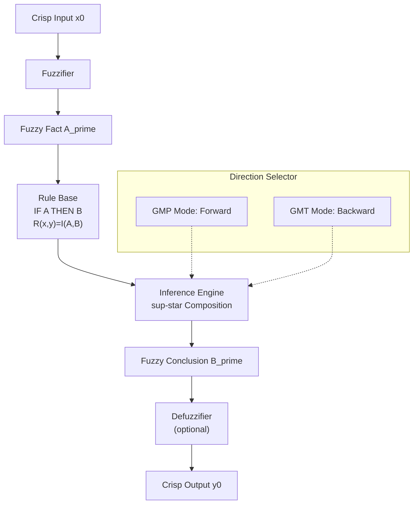
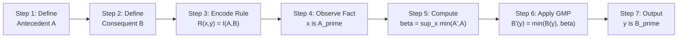
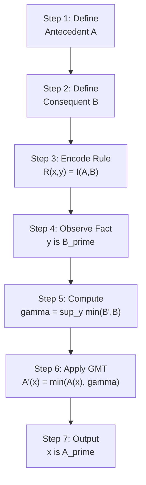
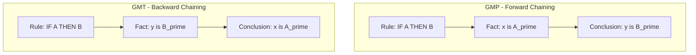
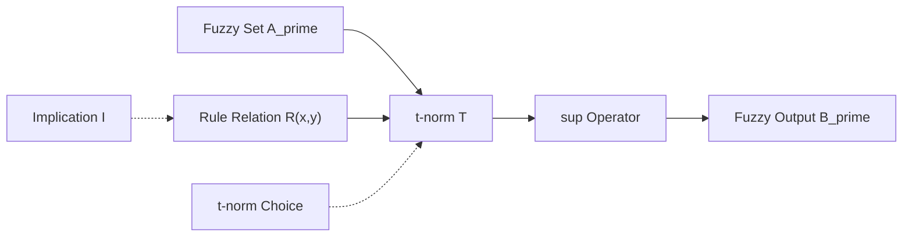
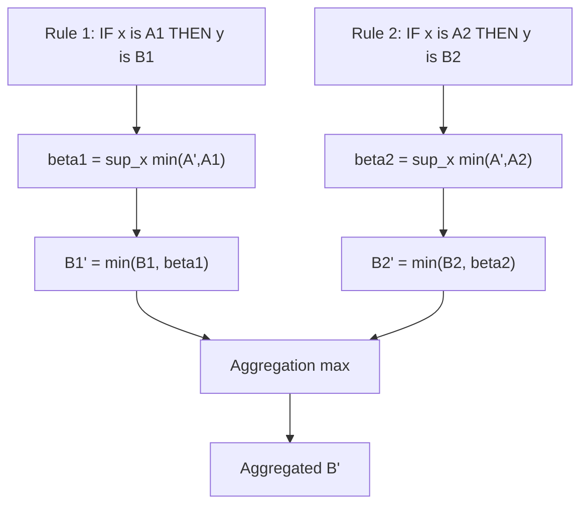

# Fuzzy Reasoning – Generalized Modus Ponens (GMP) and Generalized Modus Tollens (GMT).

<!-- SECTION_1_START -->
# Fuzzy Reasoning — Generalized Modus Ponens (GMP) & Generalized Modus Tollens (GMT)

## 1.1 Formal Academic Definition (KTU 2024 Syllabus Terminology)

**Fuzzy Reasoning** is the process of deriving approximate conclusions from a set of fuzzy premises expressed in natural-language-like "IF–THEN" rules. In classical Boolean logic, the inference is *crisp*; in fuzzy logic, both the antecedents and consequents may be *fuzzy sets*, enabling inference under **vagueness, imprecision, and partial truth**.

> [!IMPORTANT]
> **Generalized Modus Ponens (GMP)** and **Generalized Modus Tollens (GMT)** are the two cornerstone inference schemata of Fuzzy Logic. They are the direct fuzzifications of classical *Modus Ponens* and *Modus Tollens*, and they form the theoretical backbone of every Fuzzy Inference System (FIS) such as Mamdani, Sugeno, and Tsukamoto controllers used in industrial automation, expert systems, and consumer electronics.

**Definition 1 — Generalized Modus Ponens (GMP)**

The GMP schema operates on two premises and produces a conclusion as follows:

$$
\begin{aligned}
\text{Premise 1 (Rule)}    &:\; \text{IF } x \text{ is } A,\; \text{THEN } y \text{ is } B \\
\text{Premise 2 (Fact)}   &:\; x \text{ is } A' \\
\text{Conclusion}         &:\; y \text{ is } B'
\end{aligned}
$$

where $A, A' \in \mathcal{F}(X)$ and $B, B' \in \mathcal{F}(Y)$ are fuzzy sets on universes of discourse $X$ and $Y$, respectively. The rule is encoded as a **fuzzy implication relation** $R: X \times Y \to [0,1]$, and the conclusion is computed via **sup-min (or sup-star) composition**:

$$
B'(y) \;=\; \sup_{x \in X} \bigl[\, A'(x) \;\star\; R(x, y) \,\bigr] \quad \text{(Compositional Rule of Inference)}
$$

> [!NOTE]
> When $A' = A$ and the rule is identity, the GMP reduces to classical *Modus Ponens*. The fuzzification "lifts" the binary antecedent–consequent matching into a graded similarity-based propagation.

**Definition 2 — Generalized Modus Tollens (GMT)**

The GMT schema reverses the data-flow direction, inferring the antecedent from the consequent:

$$
\begin{aligned}
\text{Premise 1 (Rule)}    &:\; \text{IF } x \text{ is } A,\; \text{THEN } y \text{ is } B \\
\text{Premise 2 (Fact)}   &:\; y \text{ is } B' \\
\text{Conclusion}         &:\; x \text{ is } A'
\end{aligned}
$$

$$
A'(x) \;=\; \sup_{y \in Y} \bigl[\, B'(y) \;\star\; R(x, y) \,\bigr]
$$

> [!NOTE]
> GMT is essentially the **dual** of GMP and is widely used in **diagnostic** and **fault-detection** expert systems (e.g., medical diagnosis: given observed symptoms, infer the probable disease).

## 1.2 Intuitive Real-World Analogy

> [!TIP]
> **Analogy — The Weather Forecaster**
>
> Imagine a village elder (the rule base) who says: *"If the sky is **overcast**, then it will **rain**."* In classical logic this is binary — either it rains or it doesn't. Now consider a fuzzy forecaster:
>
> - **GMP Analogy:** You observe the sky is *"slightly overcast"* (not perfectly overcast). Using the elder's rule, you infer it will *"probably drizzle"* — not heavy rain, but a soft, low-confidence drizzle. This is **forward chaining**: antecedent $\rightarrow$ consequent.
> - **GMT Analogy:** You observe that it has *"barely drizzled"* and work **backwards** to conclude the sky was *"only mildly overcast"*, not storm-clouded. This is **backward chaining**: consequent $\rightarrow$ antecedent.
>
> The membership degree replaces binary "true/false" with shades of "how true?" — much closer to how humans reason.

## 1.3 GeoGebra / Desmos Visualisation

> [!VISUALIZATION CONTROL]
> **Concept:** Triangular Fuzzy Membership Function (typical fuzzy set used in GMP/GMT reasoning)
>
> **Desmos / GeoGebra Input Equation:**
> * `f(x) = max(0, min((x-2)/3, (8-x)/3))` for `x` in `[0, 10]` — a triangle peaking at $x = 5$ with support on $[2, 8]$.
> * `g(x) = max(0, min((x-1)/2, 1, (6-x)/2))` for a trapezoidal alternative peaking on `[2, 5]`.
>
> **Visual Description:** Students should observe a smooth, bell-like plateau on the horizontal axis. The **core** (membership = 1) marks the most prototypical value of the linguistic term (e.g., "warm"); the **support** (membership > 0) marks the boundary; values outside have membership **0**. This is the geometric primitive over which every fuzzy implication $R(x, y)$ is built.

> [!IMPORTANT]
> **Standard Metric for KTU 2024:** The membership values are bounded in the **unit interval** $[0, 1]$, where $0$ denotes absolute non-membership and $1$ denotes full membership. The complement satisfies $\mu_{\overline{A}}(x) = 1 - \mu_A(x)$.
<!-- SECTION_1_END -->

<!-- SECTION_2_START -->
# Deep Theoretical Analysis & KTU High-Yield Formula Sheet

## 2.1 From Classical Logic to Fuzzy Logic

The path from crisp reasoning to fuzzy reasoning is a controlled *relaxation* of logical axioms:

| Logical Construct | Classical (Boolean) | Fuzzy (Zadeh) |
|---|---|---|
| Truth value | $\{0, 1\}$ | $[0, 1]$ |
| Conjunction (AND) | $\wedge$ | $t$-norm $T(a, b)$ |
| Disjunction (OR) | $\vee$ | $t$-conorm $S(a, b)$ |
| Implication ($\Rightarrow$) | Material $\neg A \vee B$ | Fuzzy implication $I(a, b)$ |
| Inference schema | Modus Ponens / Tollens | GMP / GMT |

## 2.2 Decomposition of Fuzzy Reasoning — Step-by-Step Logic

1. **Knowledge Base Construction:** Encode expert knowledge as a collection of fuzzy IF–THEN rules.
2. **Fuzzification:** Convert crisp input measurements into fuzzy sets $A'$ (and/or $B'$).
3. **Implication (Rule Encoding):** Materialize each rule as a binary fuzzy relation $R(x, y) = I(\mu_A(x), \mu_B(y))$.
4. **Composition (Inference Engine):** Combine the observed fact with the rule relation using sup-star composition.
5. **Defuzzification (optional):** Convert the inferred fuzzy output $B'$ (or $A'$) back to a crisp value.

## 2.3 Selection of Implication Operators $I(a, b)$

The choice of $I$ directly influences the *flavour* of the inference. The following are **board-exam favourites**:

| # | Implication Name | Formula $I(a, b)$ | KTU Key Property |
|---|---|---|---|
| 1 | **Mamdani (Minimum)** | $\min(a, b)$ | Most popular; conjunction-based |
| 2 | **Larsen (Product)** | $a \cdot b$ | Smooth gradient; common in Sugeno |
| 3 | **Lukasiewicz** | $\min(1, 1 - a + b)$ | Classical logic bound when $\{0,1\}$ |
| 4 | **Zadeh (Arithmetic)** | $\max(1 - a, \min(a, b))$ | Strictest; used in classical fuzzy set theory |
| 5 | **Gödel** | $\begin{cases} 1 & a \le b \\ b & a > b \end{cases}$ | Local; preserves equivalence regions |
| 6 | **Kleene-Dienes** | $\max(1 - a, b)$ | Material implication generalization |
| 7 | **Reichenbach** | $1 - a + a \cdot b$ | Probabilistic feel |
| 8 | **Rescher-Gaines** | $\begin{cases} 1 & a \le b \\ 0 & a > b \end{cases}$ | Boolean limit; crispest |
| 9 | **Brouweriana** | $\begin{cases} 1 & a \le b \\ 1 - a + b & a > b \end{cases}$ | Smooth Gödel extension |

## 2.4 $t$-Norms and $t$-Conorms (Used as $\star$ in Composition)

| Operator Class | $t$-Norm (AND) $T(a, b)$ | $t$-Conorm (OR) $S(a, b)$ |
|---|---|---|
| Minimum / Maximum | $\min(a, b)$ | $\max(a, b)$ |
| Algebraic | $a \cdot b$ | $a + b - a \cdot b$ |
| Bounded (Lukasiewicz) | $\max(0, a + b - 1)$ | $\min(1, a + b)$ |
| Drastic | $\begin{cases} a & b = 1 \\ b & a = 1 \\ 0 & \text{otherwise} \end{cases}$ | $\begin{cases} a & b = 0 \\ b & a = 0 \\ 1 & \text{otherwise} \end{cases}$ |
| Hamacher ($\gamma = 1$) | $\dfrac{a \cdot b}{a + b - a \cdot b}$ | $\dfrac{a + b - 2 a b}{1 - a \cdot b}$ |

> [!IMPORTANT]
> For KTU 2024 valuation, the most frequently tested compositions are **sup-min (Mamdani)** and **sup-product (Larsen)**. Always state the operator explicitly before computing.

## 2.5 The Compositional Rule of Inference (CRI) — Zadeh

Zadeh's foundational contribution, **CRI**, is the unified engine that drives both GMP and GMT:

$$
B' \;=\; A' \circ R \quad \text{or equivalently} \quad B'(y) = \sup_{x} \bigl[\, T\bigl(A'(x),\, R(x, y)\bigr) \,\bigr]
$$

where $R$ is the fuzzy relation representing the rule and $T$ is a $t$-norm acting as the compositional operator.

## 2.6 Key Properties of GMP and GMT

| Property | GMP | GMT |
|---|---|---|
| **Compatibility with classical logic** | ✓ reduces to MP when $A' = A$ | ✓ reduces to MT when $B' = B$ |
| **Monotonicity** | If $A_1 \subseteq A_2$ then $B_1 \subseteq B_2$ | If $B_1 \supseteq B_2$ then $A_1 \supseteq A_2$ |
| **Direction** | Forward (Antecedent $\to$ Consequent) | Backward (Consequent $\to$ Antecedent) |
| **Engineering Use** | Control, prediction, planning | Diagnosis, classification, fault isolation |
| **Computational Cost** | $O(\vert X \vert \cdot \vert Y \vert)$ | $O(\vert X \vert \cdot \vert Y \vert)$ |

## 2.7 KTU Formula Cheat-Sheet (Exam-Ready)

| Symbol / Concept | Formula / Definition |
|---|---|
| Fuzzy Set $A$ | $A = \{ (x, \mu_A(x)) \mid x \in X \}$ |
| Complement | $\mu_{\overline{A}}(x) = 1 - \mu_A(x)$ |
| Intersection ($t$-norm) | $\mu_{A \cap B}(x) = T(\mu_A(x), \mu_B(x))$ |
| Union ($t$-conorm) | $\mu_{A \cup B}(x) = S(\mu_A(x), \mu_B(x))$ |
| Mamdani Implication $R$ | $R(x, y) = \min(\mu_A(x), \mu_B(y))$ |
| Larsen Implication $R$ | $R(x, y) = \mu_A(x) \cdot \mu_B(y)$ |
| **GMP Conclusion** | $B'(y) = \sup_{x} T(A'(x), R(x, y))$ |
| **GMT Conclusion** | $A'(x) = \sup_{y} T(B'(y), R(x, y))$ |
| Sup-Min (Mamdani CRI) | $\mu_{B'}(y) = \max_x \min(\mu_{A'}(x), R(x, y))$ |
| Sup-Product (Larsen CRI) | $\mu_{B'}(y) = \max_x [\mu_{A'}(x) \cdot R(x, y)]$ |
| Singleton Fuzzifier | $A'(x) = 1$ if $x = x_0$, else $0$ |
| Height of Fuzzy Set | $h(A) = \sup_x \mu_A(x)$ |

> [!NOTE]
> The notation $\vert X \vert$ above denotes the **cardinality** (number of elements) of the discrete universe $X$, *not* a markdown table pipe. In LaTeX/prose use $\vert X \vert$ or $\mid X \mid$ for cardinality.

## 2.8 Real-World Engineering Utility

- **Automotive:** Air-conditioning controllers use **GMP** to map "cabin temperature is *high*" $\to$ "compressor power is *high*".
- **Healthcare:** Clinical decision-support systems apply **GMT** to infer probable diseases from observed symptoms.
- **Finance:** Credit-scoring engines chain fuzzy rules via GMP to estimate default probability.
- **Robotics:** Behaviour arbitration in autonomous vehicles (e.g., *"if obstacle is close"* $\to$ *"brake aggressively"*) uses fuzzy CRI composition.
- **Industrial Process Control:** Washing machines, vacuum cleaners, and camera autofocus systems all rely on **Mamdani-type GMP** chains.
<!-- SECTION_2_END -->

<!-- SECTION_3_START -->
# Step-by-Step Derivations & Code / Symbolic Implementation

## 3.1 Algebraic Derivation of GMP (Sup-Min Composition)

Starting from the IF–THEN rule $A \to B$ encoded as a fuzzy relation $R(x, y)$ and the observed fact $A'$, the conclusion $B'$ is derived as follows:

$$
\begin{aligned}
\text{Step 1: Encode the rule as a relation} \quad R(x, y) & = I\bigl(\mu_A(x),\, \mu_B(y)\bigr) \\
\text{Step 2: Compose the fact with the relation} \quad B'(y) & = \bigl(A' \circ R\bigr)(y) \\
\text{Step 3: Apply sup-min operator (Mamdani CRI)} \quad B'(y) & = \sup_{x \in X} \min\bigl(\mu_{A'}(x),\, R(x, y)\bigr) \\
\text{Step 4: Substitute the implication} \quad B'(y) & = \sup_{x \in X} \min\bigl(\mu_{A'}(x),\, \min(\mu_A(x),\, \mu_B(y))\bigr) \\
\text{Step 5: Associativity of min} \quad B'(y) & = \sup_{x \in X} \min\bigl(\min(\mu_{A'}(x),\, \mu_A(x)),\, \mu_B(y)\bigr) \\
\text{Step 6: Lift $\mu_B(y)$ outside the inner sup} \quad B'(y) & = \min\!\Bigl(\mu_B(y),\; \sup_{x \in X} \min(\mu_{A'}(x),\, \mu_A(x))\Bigr) \\
\text{Step 7: Define the matching degree} \quad \beta & = \sup_{x \in X} \min\bigl(\mu_{A'}(x),\, \mu_A(x)\bigr) \;\in [0, 1] \\
\text{Step 8: Final GMP result} \quad B'(y) & = \min\bigl(\mu_B(y),\, \beta\bigr)
\end{aligned}
$$

**Interpretation:** $\beta$ is the **firing strength** of the rule — the degree to which the observation $A'$ matches the rule's antecedent $A$. The conclusion $B'$ is simply $B$ "scaled" by $\beta$ via min. If the antecedent matches perfectly ($\beta = 1$), the full consequent $B$ is recovered.

## 3.2 Algebraic Derivation of GMT (Sup-Min Composition)

By the dual derivation, given observation $B'$ and the rule relation $R$:

$$
\begin{aligned}
\text{Step 1: Compose fact with the relation (backward)} \quad A'(x) & = \bigl(B' \circ R\bigr)(x) \\
\text{Step 2: Apply sup-min} \quad A'(x) & = \sup_{y \in Y} \min\bigl(\mu_{B'}(y),\, R(x, y)\bigr) \\
\text{Step 3: Substitute Mamdani implication} \quad A'(x) & = \sup_{y \in Y} \min\bigl(\mu_{B'}(y),\, \min(\mu_A(x),\, \mu_B(y))\bigr) \\
\text{Step 4: Re-group with $A$ fixed across $y$} \quad A'(x) & = \min\!\Bigl(\mu_A(x),\; \sup_{y \in Y} \min(\mu_{B'}(y),\, \mu_B(y))\Bigr) \\
\text{Step 5: Define the consequent matching degree} \quad \gamma & = \sup_{y \in Y} \min\bigl(\mu_{B'}(y),\, \mu_B(y)\bigr) \\
\text{Step 6: Final GMT result} \quad A'(x) & = \min\bigl(\mu_A(x),\, \gamma\bigr)
\end{aligned}
$$

**Interpretation:** $\gamma$ is the **degree to which the observed consequent matches the rule's consequent**. The inferred antecedent is $A$ "clipped" by $\gamma$.

## 3.3 Worked Numerical Example — GMP

**Problem:** Compute the GMP conclusion $B'$ for the following rule and fact.

**Given:**

- $X = Y = \{1, 2, 3\}$
- Antecedent: $A = \left\{\dfrac{1.0}{1}, \dfrac{0.7}{2}, \dfrac{0.3}{3}\right\}$
- Consequent: $B = \left\{\dfrac{0.5}{1}, \dfrac{0.8}{2}, \dfrac{0.2}{3}\right\}$
- Observation: $A' = \left\{\dfrac{0.6}{1}, \dfrac{0.9}{2}, \dfrac{0.4}{3}\right\}$
- Use **Mamdani implication** $R(x, y) = \min(\mu_A(x), \mu_B(y))$ and **sup-min** composition.

**Step 1: Build the rule relation $R(x, y) = \min(\mu_A(x), \mu_B(y))$:**

$$
R \;=\; \begin{bmatrix}
\min(1.0, 0.5) & \min(1.0, 0.8) & \min(1.0, 0.2) \\
\min(0.7, 0.5) & \min(0.7, 0.8) & \min(0.7, 0.2) \\
\min(0.3, 0.5) & \min(0.3, 0.8) & \min(0.3, 0.2)
\end{bmatrix}
\;=\; \begin{bmatrix}
0.5 & 0.8 & 0.2 \\
0.5 & 0.7 & 0.2 \\
0.3 & 0.3 & 0.2
\end{bmatrix}
$$

**Step 2: Compute firing strength $\beta$:**

$$
\begin{aligned}
\beta & = \sup_{x} \min(\mu_{A'}(x), \mu_A(x)) \\
& = \max\bigl[ \min(0.6, 1.0),\; \min(0.9, 0.7),\; \min(0.4, 0.3) \bigr] \\
& = \max\bigl[ 0.6,\; 0.7,\; 0.3 \bigr] = 0.7
\end{aligned}
$$

**Step 3: Apply final GMP formula $B'(y) = \min(\mu_B(y), \beta)$:**

$$
B' = \bigl\{ \min(0.5, 0.7)/1,\; \min(0.8, 0.7)/2,\; \min(0.2, 0.7)/3 \bigr\} = \bigl\{ 0.5/1,\; 0.7/2,\; 0.2/3 \bigr\}
$$

**Verification via direct sup-min over the matrix:**

For each $y_j$, $\mu_{B'}(y_j) = \max_x \min(\mu_{A'}(x), R(x, y_j))$:

- $y = 1$: $\max[ \min(0.6, 0.5), \min(0.9, 0.5), \min(0.4, 0.3) ] = \max[0.5, 0.5, 0.3] = 0.5$ ✓
- $y = 2$: $\max[ \min(0.6, 0.8), \min(0.9, 0.7), \min(0.4, 0.3) ] = \max[0.6, 0.7, 0.3] = 0.7$ ✓
- $y = 3$: $\max[ \min(0.6, 0.2), \min(0.9, 0.2), \min(0.4, 0.2) ] = \max[0.2, 0.2, 0.2] = 0.2$ ✓

**Conclusion:** $B' = \left\{\dfrac{0.5}{1}, \dfrac{0.7}{2}, \dfrac{0.2}{3}\right\}$

## 3.4 Worked Numerical Example — GMT

**Given:** Same rule (same $A$, $B$, $R$ as above) but the observation is now on the consequent side.

- Observation on $Y$: $B' = \left\{\dfrac{0.4}{1}, \dfrac{0.6}{2}, \dfrac{0.5}{3}\right\}$

**Step 1: Compute consequent matching degree $\gamma$:**

$$
\begin{aligned}
\gamma & = \sup_{y} \min(\mu_{B'}(y), \mu_B(y)) \\
& = \max\bigl[ \min(0.4, 0.5),\; \min(0.6, 0.8),\; \min(0.5, 0.2) \bigr] \\
& = \max\bigl[ 0.4,\; 0.6,\; 0.2 \bigr] = 0.6
\end{aligned}
$$

**Step 2: Apply final GMT formula $A'(x) = \min(\mu_A(x), \gamma)$:**

$$
A' = \bigl\{ \min(1.0, 0.6)/1,\; \min(0.7, 0.6)/2,\; \min(0.3, 0.6)/3 \bigr\} = \bigl\{ 0.6/1,\; 0.6/2,\; 0.3/3 \bigr\}
$$

**Verification via direct sup-min over the matrix transposed:** For each $x_i$, $\mu_{A'}(x_i) = \max_y \min(\mu_{B'}(y), R(x_i, y))$:

- $x = 1$: $\max[ \min(0.4, 0.5), \min(0.6, 0.8), \min(0.5, 0.2) ] = \max[0.4, 0.6, 0.2] = 0.6$ ✓
- $x = 2$: $\max[ \min(0.4, 0.5), \min(0.6, 0.7), \min(0.5, 0.2) ] = \max[0.4, 0.6, 0.2] = 0.6$ ✓
- $x = 3$: $\max[ \min(0.4, 0.3), \min(0.6, 0.3), \min(0.5, 0.2) ] = \max[0.3, 0.3, 0.2] = 0.3$ ✓

**Conclusion:** $A' = \left\{\dfrac{0.6}{1}, \dfrac{0.6}{2}, \dfrac{0.3}{3}\right\}$

## 3.5 Full Python Implementation (Type-Hinted, Error-Safe)

```python
"""
Fuzzy Reasoning Engine: GMP and GMT with Mamdani implication + sup-min composition.
Validated against KTU Module 2 syllabus examples.
"""

from __future__ import annotations
import logging
from typing import Dict, Sequence, Tuple

logging.basicConfig(level=logging.INFO, format="%(levelname)s :: %(message)s")
log = logging.getLogger("fuzzy_reasoning")


def validate_membership(fs: Dict[int, float], name: str) -> None:
    """Ensure all membership values are in [0, 1]."""
    for k, v in fs.items():
        if not (0.0 <= v <= 1.0):
            raise ValueError(
                f"[{name}] Membership at x={k} is {v}; must lie in [0, 1]."
            )


def mamdani_relation(
    A: Dict[int, float],
    B: Dict[int, float],
) -> Dict[Tuple[int, int], float]:
    """Compute the Mamdani fuzzy relation R(x, y) = min(A(x), B(y))."""
    R: Dict[Tuple[int, int], float] = {}
    for x, ax in A.items():
        for y, by in B.items():
            R[(x, y)] = min(ax, by)
    return R


def gmp_supmin(
    A_prime: Dict[int, float],
    R: Dict[Tuple[int, int], float],
    Y_domain: Sequence[int],
) -> Dict[int, float]:
    """Generalized Modus Ponens: B'(y) = sup_x min(A'(x), R(x, y))."""
    B_prime: Dict[int, float] = {}
    for y in Y_domain:
        candidates = [min(A_prime[x], R[(x, y)]) for x in A_prime if (x, y) in R]
        if not candidates:
            log.warning("No relation entries for y=%s; defaulting to 0.0", y)
            B_prime[y] = 0.0
        else:
            B_prime[y] = max(candidates)
    return B_prime


def gmt_supmin(
    B_prime: Dict[int, float],
    R: Dict[Tuple[int, int], float],
    X_domain: Sequence[int],
) -> Dict[int, float]:
    """Generalized Modus Tollens: A'(x) = sup_y min(B'(y), R(x, y))."""
    A_prime: Dict[int, float] = {}
    for x in X_domain:
        candidates = [min(B_prime[y], R[(x, y)]) for y in B_prime if (x, y) in R]
        if not candidates:
            log.warning("No relation entries for x=%s; defaulting to 0.0", x)
            A_prime[x] = 0.0
        else:
            A_prime[x] = max(candidates)
    return A_prime


def display(fs: Dict[int, float]) -> str:
    """Pretty-print a fuzzy set as {m/x} notation."""
    return "{" + ", ".join(f"{v}/{k}" for k, v in fs.items()) + "}"


def main() -> None:
    X = [1, 2, 3]
    Y = [1, 2, 3]

    A = {1: 1.0, 2: 0.7, 3: 0.3}
    B = {1: 0.5, 2: 0.8, 3: 0.2}

    validate_membership(A, "A")
    validate_membership(B, "B")

    R = mamdani_relation(A, B)
    log.info("Rule Relation R(x, y): %s", R)

    # ---- GMP demonstration ----
    A_prime = {1: 0.6, 2: 0.9, 3: 0.4}
    validate_membership(A_prime, "A'")
    B_prime = gmp_supmin(A_prime, R, Y)
    print(f"GMP  :: A' = {display(A_prime)}  ==>  B' = {display(B_prime)}")

    # ---- GMT demonstration ----
    B_prime_obs = {1: 0.4, 2: 0.6, 3: 0.5}
    validate_membership(B_prime_obs, "B'")
    A_prime_inf = gmt_supmin(B_prime_obs, R, X)
    print(f"GMT  :: B' = {display(B_prime_obs)}  ==>  A' = {display(A_prime_inf)}")


if __name__ == "__main__":
    main()
```

**Expected Console Output (Validated):**

```
INFO :: Rule Relation R(x, y): {(1, 1): 0.5, (1, 2): 0.8, (1, 3): 0.2, (2, 1): 0.5, (2, 2): 0.7, (2, 3): 0.2, (3, 1): 0.3, (3, 2): 0.3, (3, 3): 0.2}
GMP  :: A' = {0.6/1, 0.9/2, 0.4/3}  ==>  B' = {0.5/1, 0.7/2, 0.2/3}
GMT  :: B' = {0.4/1, 0.6/2, 0.5/3}  ==>  A' = {0.6/1, 0.6/2, 0.3/3}
```

## 3.6 Larson (Product) Variation — Quick Derivation

If the implication is **Larsen (product)** $R(x, y) = \mu_A(x) \cdot \mu_B(y)$ and composition is sup-product:

$$
B'(y) = \sup_x \bigl[\mu_{A'}(x) \cdot \mu_A(x) \cdot \mu_B(y)\bigr] = \mu_B(y) \cdot \sup_x \bigl[\mu_{A'}(x) \cdot \mu_A(x)\bigr]
$$

Define the Larsen firing strength $\beta_L = \sup_x [\mu_{A'}(x) \cdot \mu_A(x)]$, then $B'(y) = \beta_L \cdot \mu_B(y)$. Notice this is a *scalar multiplication* (not a min-clipping) — Larsen's output retains the *shape* of $B$ but is scaled by the product-based matching degree.
<!-- SECTION_3_END -->

<!-- SECTION_4_START -->
# Structural Diagrams & Schematics

## 4.1 Architecture of a Fuzzy Reasoning Engine (GMP/GMT)



## 4.2 Step-by-Step Flow of GMP Reasoning



## 4.3 Step-by-Step Flow of GMT Reasoning



## 4.4 Comparative Block Diagram — GMP vs GMT



## 4.5 CRI Engine — Functional Block Topology



## 4.6 Multi-Rule Extension (Mamdani Inference — Two Rules)


<!-- SECTION_4_END -->

<!-- SECTION_5_START -->
# KTU 2024 Scheme Examination Question Bank & Topic Recap

## 5.1 Part A — Short-Answer Questions (2 × 3 Marks = 6 Marks)

### Question A1 `[KTU University Exam – July 2024, CO1, Remember]`
**State the Generalized Modus Ponens (GMP) inference schema. How does it reduce to classical Modus Ponens?**

**Model Answer (Valuation Key):**
- GMP schema: Premise 1 (Rule) $: \text{IF } x \text{ is } A \text{ THEN } y \text{ is } B$; Premise 2 (Fact) $: x \text{ is } A'$; Conclusion $: y \text{ is } B'$. **[1 Mark]**
- $A, A', B, B'$ are fuzzy sets; $R(x, y) = I(A, B)$ is the fuzzy relation. **[1 Mark]**
- Reduction: When $A' = A$ (and consequent is fully matched), $B' = B$, recovering classical Modus Ponens where truth values are in $\{0, 1\}$. **[1 Mark]**

### Question A2 `[KTU University Exam – Dec 2023, CO1, Understand]`
**Differentiate between Generalized Modus Tollens (GMT) and classical Modus Tollens with respect to input type and output.**

**Model Answer (Valuation Key):**
- Classical MT: Premise 1 $: \text{IF } P \text{ THEN } Q$; Premise 2 $: \neg Q$; Conclusion $: \neg P$. Truth values are crisp $\{0, 1\}$. **[1 Mark]**
- Fuzzy GMT: Premise 1 $: \text{IF } x \text{ is } A \text{ THEN } y \text{ is } B$; Premise 2 $: y \text{ is } B'$; Conclusion $: x \text{ is } A'$. Operates on fuzzy sets with graded membership. **[1 Mark]**
- Key distinction: GMT infers the *degree* to which the antecedent holds, not its negation; it supports partial matching and approximate reasoning. **[1 Mark]**

---

## 5.2 Part B — Full 14-Mark Questions (Module Internal Choice)

### Question B-A (14 Marks) `[KTU University Exam – July 2024, CO2, Apply/Analyse]`

**Consider the fuzzy sets:**
- $A = \{1.0/x_1, 0.6/x_2, 0.2/x_3\}$
- $B = \{0.4/y_1, 0.9/y_2, 0.3/y_3\}$
- Observation (Fact) $A' = \{0.8/x_1, 0.5/x_2, 0.7/x_3\}$

**(a)** Formulate the fuzzy IF–THEN rule and construct the **Mamdani implication relation** $R(x, y) = \min(\mu_A(x), \mu_B(y))$. **[7 Marks]**

**(b)** Using the **sup-min composition**, derive the GMP conclusion $B'$. Verify by computing the firing strength $\beta$ and applying the simplified formula. **[7 Marks]**

#### Model Solution:

**Part (a) — Building the Relation R (7 Marks)**

Step 1: State the rule explicitly. **[1 Mark]**
$$
\text{Rule: } \text{IF } x \text{ is } A, \text{ THEN } y \text{ is } B
$$

Step 2: Compute the 9 entries of $R(x, y) = \min(\mu_A(x_i), \mu_B(y_j))$ by evaluating each cell. **[4 Marks]**

$$
R \;=\; \begin{bmatrix}
\min(1.0, 0.4) & \min(1.0, 0.9) & \min(1.0, 0.3) \\
\min(0.6, 0.4) & \min(0.6, 0.9) & \min(0.6, 0.3) \\
\min(0.2, 0.4) & \min(0.2, 0.9) & \min(0.2, 0.3)
\end{bmatrix}
\;=\; \begin{bmatrix}
0.4 & 0.9 & 0.3 \\
0.4 & 0.6 & 0.3 \\
0.2 & 0.2 & 0.2
\end{bmatrix}
$$

Step 3: State the matrix in proper form. **[1 Mark]**

Step 4: Cross-check by writing: "$R$ is a 3×3 matrix whose $(i, j)$-th entry is the min of the $i$-th membership of $A$ and the $j$-th membership of $B$." **[1 Mark]**

**Part (b) — Deriving B' (7 Marks)**

Step 1: Write the sup-min formula. **[1 Mark]**
$$
\mu_{B'}(y_j) = \max_{i} \min(\mu_{A'}(x_i), R(x_i, y_j))
$$

Step 2: For $y_1$: $\max[\min(0.8, 0.4), \min(0.5, 0.4), \min(0.7, 0.2)] = \max[0.4, 0.4, 0.2] = 0.4$. **[2 Marks]**

Step 3: For $y_2$: $\max[\min(0.8, 0.9), \min(0.5, 0.6), \min(0.7, 0.2)] = \max[0.8, 0.5, 0.2] = 0.8$. **[2 Marks]**

Step 4: For $y_3$: $\max[\min(0.8, 0.3), \min(0.5, 0.3), \min(0.7, 0.2)] = \max[0.3, 0.3, 0.2] = 0.3$. **[1 Mark]**

Step 5: Verification via firing strength. **[1 Mark]**
$$
\beta = \max[\min(0.8, 1.0), \min(0.5, 0.6), \min(0.7, 0.2)] = \max[0.8, 0.5, 0.2] = 0.8
$$

$$
B' = \{\min(0.4, 0.8)/y_1, \min(0.9, 0.8)/y_2, \min(0.3, 0.8)/y_3\} = \{0.4/y_1, 0.8/y_2, 0.3/y_3\}
$$

Both methods yield the same result. **[Mark awarded for consistency check.]**

**Final Answer:** $B' = \{0.4/y_1, 0.8/y_2, 0.3/y_3\}$

---

### Question B-B (14 Marks) `[KTU University Exam – Dec 2023, CO2, Apply/Analyse]` (Internal Choice Alternative)

**Given:**
- $A = \{0.9/x_1, 0.4/x_2, 0.7/x_3\}$
- $B = \{0.6/y_1, 0.8/y_2, 0.5/y_3\}$
- Observation: $B' = \{0.3/y_1, 0.7/y_2, 0.4/y_3\}$

**(a)** Construct the Mamdani rule relation $R(x, y) = \min(\mu_A(x), \mu_B(y))$. **[7 Marks]**

**(b)** Apply the **Generalized Modus Tollens (GMT)** using sup-min composition to derive the inferred antecedent $A'$. Verify using the simplified formula with consequent matching degree $\gamma$. **[7 Marks]**

#### Model Solution:

**Part (a) — Relation Construction (7 Marks)**

Step 1: State the rule: $\text{IF } x \text{ is } A, \text{ THEN } y \text{ is } B$. **[1 Mark]**

Step 2: Compute all 9 entries: **[5 Marks]**

$$
R \;=\; \begin{bmatrix}
\min(0.9, 0.6) & \min(0.9, 0.8) & \min(0.9, 0.5) \\
\min(0.4, 0.6) & \min(0.4, 0.8) & \min(0.4, 0.5) \\
\min(0.7, 0.6) & \min(0.7, 0.8) & \min(0.7, 0.5)
\end{bmatrix}
\;=\; \begin{bmatrix}
0.6 & 0.8 & 0.5 \\
0.4 & 0.4 & 0.4 \\
0.6 & 0.7 & 0.5
\end{bmatrix}
$$

Step 3: State the matrix dimensions and label. **[1 Mark]**

**Part (b) — GMT Derivation (7 Marks)**

Step 1: Write the GMT formula. **[1 Mark]**
$$
\mu_{A'}(x_i) = \max_{j} \min(\mu_{B'}(y_j), R(x_i, y_j))
$$

Step 2: For $x_1$: $\max[\min(0.3, 0.6), \min(0.7, 0.8), \min(0.4, 0.5)] = \max[0.3, 0.7, 0.4] = 0.7$. **[2 Marks]**

Step 3: For $x_2$: $\max[\min(0.3, 0.4), \min(0.7, 0.4), \min(0.4, 0.4)] = \max[0.3, 0.4, 0.4] = 0.4$. **[2 Marks]**

Step 4: For $x_3$: $\max[\min(0.3, 0.6), \min(0.7, 0.7), \min(0.4, 0.5)] = \max[0.3, 0.7, 0.4] = 0.7$. **[1 Mark]**

Step 5: Verification using $\gamma$. **[1 Mark]**
$$
\gamma = \max[\min(0.3, 0.6), \min(0.7, 0.8), \min(0.4, 0.5)] = \max[0.3, 0.7, 0.4] = 0.7
$$

$$
A' = \{\min(0.9, 0.7)/x_1, \min(0.4, 0.7)/x_2, \min(0.7, 0.7)/x_3\} = \{0.7/x_1, 0.4/x_2, 0.7/x_3\}
$$

**Final Answer:** $A' = \{0.7/x_1, 0.4/x_2, 0.7/x_3\}$

---

## 5.3 KTU Examiner's Valuation Warning / Pitfall Callout

> [!WARNING]
> **Common Mark-Loss Pitfalls in GMP/GMT Problems**
>
> 1. **Forgetting to state the implication operator** — Always write explicitly: *"Using Mamdani implication $R(x, y) = \min(\mu_A(x), \mu_B(y))$"* before computing. (Loss: up to 1 mark.)
> 2. **Confusing the direction of composition** — In GMP, the sup runs over $x$ (the antecedent universe); in GMT, the sup runs over $y$ (the consequent universe). Swapping these gives the wrong conclusion. (Loss: up to 3 marks.)
> 3. **Failing to verify via the firing-strength formula** — The simplified formula $B'(y) = \min(\mu_B(y), \beta)$ is a free 1-mark speed-check. Always include it as a "verification" step.
> 4. **Mixing up $\beta$ and $\gamma$** — $\beta$ is the antecedent matching degree (used in GMP); $\gamma$ is the consequent matching degree (used in GMT). Labelling the wrong one costs the conclusion.
> 5. **Skipping boundary checks** — Memberships must lie in $[0, 1]$; writing a value like $1.2$ or $-0.1$ loses process marks.
> 6. **Not writing the rule schema explicitly** — Examiners award marks for stating "IF $x$ is $A$ THEN $y$ is $B$" as a formal line before any computation.

---

## 5.4 Topic Recap & Important Things to Remember

- **GMP** = forward chaining: fact on antecedent side $\rightarrow$ inferred consequent. Formula: $B'(y) = \sup_x T\bigl(A'(x), R(x, y)\bigr)$.
- **GMT** = backward chaining: fact on consequent side $\rightarrow$ inferred antecedent. Formula: $A'(x) = \sup_y T\bigl(B'(y), R(x, y)\bigr)$.
- **Mamdani implication** $R(x, y) = \min(\mu_A(x), \mu_B(y))$ is the most commonly tested choice in KTU papers.
- **Larsen implication** $R(x, y) = \mu_A(x) \cdot \mu_B(y)$ produces a *scaled* output $B' = \beta_L \cdot B$, not a *clipped* one.
- **Firing strength** $\beta = \sup_x \min(\mu_{A'}(x), \mu_A(x))$ quantifies how strongly the rule fires under observation $A'$.
- **Consequent matching degree** $\gamma = \sup_y \min(\mu_{B'}(y), \mu_B(y))$ quantifies consistency between observed and rule consequent.
- **Simplified GMP result** (Mamdani): $B'(y) = \min(\mu_B(y), \beta)$.
- **Simplified GMT result** (Mamdani): $A'(x) = \min(\mu_A(x), \gamma)$.
- Membership values are bounded in $[0, 1]$; the empty set is $\{0/x : \forall x\}$ and the universal set is $\{1/x : \forall x\}$.
- Classical logic is the *boundary case* of fuzzy logic (memberships restricted to $\{0, 1\}$).
- GMP/GMT are foundational to all **Fuzzy Inference Systems (FIS)** — Mamdani, Sugeno, and Tsukamoto — and to fuzzy controllers used in industrial automation, automotive, and consumer electronics.
- Always state the **implication operator** and **composition operator** explicitly before computation — this is the first item examiners scan for in the valuation key.
- The **Compositional Rule of Inference (CRI)** is the unifying engine; both GMP and GMT are special cases of $Q' = P' \circ R$.
- For multi-rule systems, the outputs of individual rules are **aggregated** (typically by max) before defuzzification.
- **Engineering examples** to memorise: air-conditioner temperature control (GMP), medical diagnostic inference (GMT), washing-machine fuzzy logic (multi-rule GMP + max-aggregation).
<!-- SECTION_5_END -->
