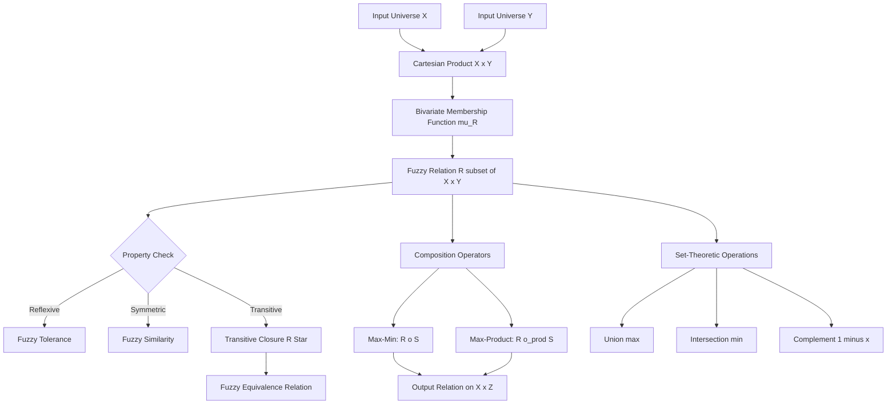
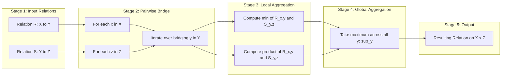
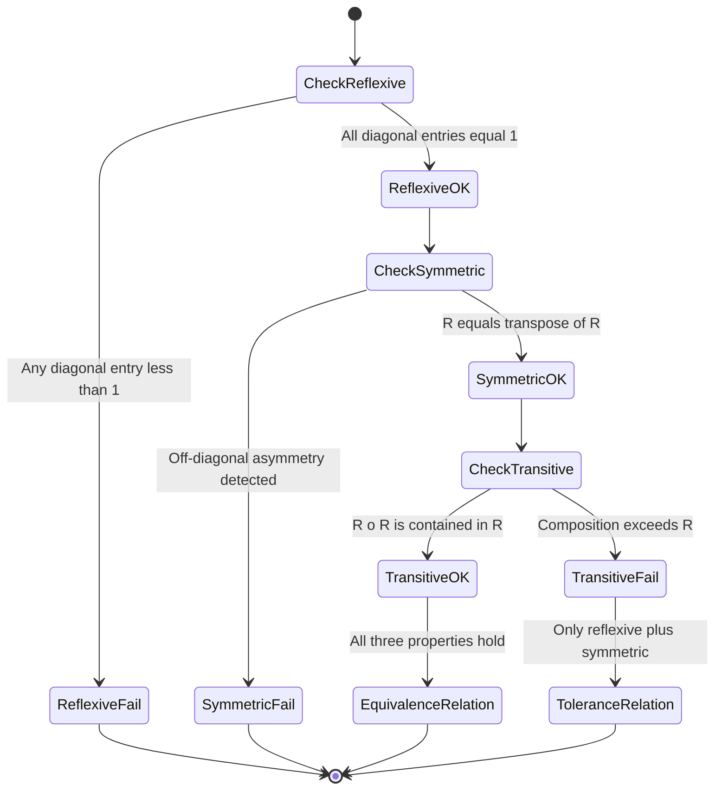
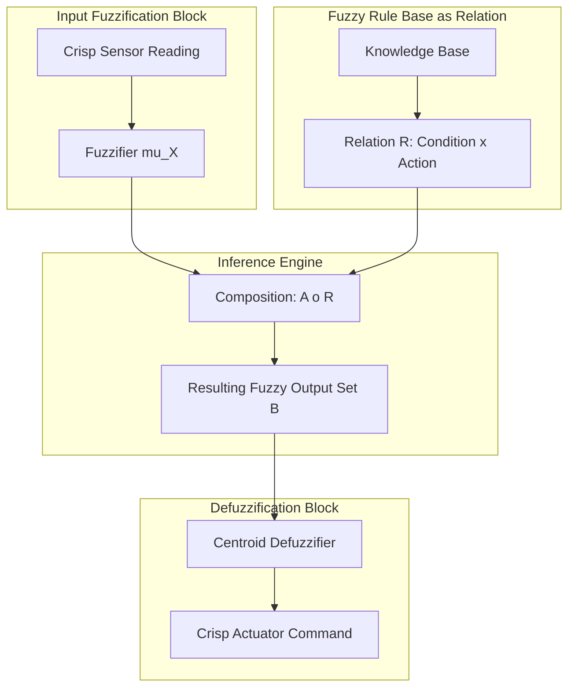

# Fuzzy Relations :-

<!-- SECTION_1_START -->
# Fuzzy Relations — Core Technical Definition & Intuitive Overview

## 1.1 Formal Academic Definition (KTU 2024 Syllabus Terminology)

> [!NOTE]
> **Definition (Fuzzy Relation):**
> Let $X$ and $Y$ be two non-empty crisp (classical) sets. A **binary fuzzy relation** $R$ from $X$ to $Y$ is a fuzzy subset of the Cartesian product $X \times Y$, characterized by a **bivariate membership function** $\mu_R : X \times Y \rightarrow [0, 1]$, where the membership grade $\mu_R(x, y)$ quantifies the *degree* to which the ordered pair $(x, y)$ is related under $R$.

Mathematically, the fuzzy relation is expressed as:

$$
R = \int_{(x, y) \in X \times Y} \frac{\mu_R(x, y)}{(x, y)}
$$

For discrete finite universes $X = \{x_1, x_2, \ldots, x_m\}$ and $Y = \{y_1, y_2, \ldots, y_n\}$, the fuzzy relation is canonically represented as an $m \times n$ **fuzzy matrix (relation matrix)** $\mathbf{R} = [r_{ij}]$ where every element $r_{ij} \in [0, 1]$ corresponds to $\mu_R(x_i, y_j)$.

### Generalization to $n$-Ary Fuzzy Relations
An $n$-ary fuzzy relation on $X_1 \times X_2 \times \cdots \times X_n$ is a fuzzy set with membership function:

$$
\mu_R : X_1 \times X_2 \times \cdots \times X_n \rightarrow [0, 1]
$$

> [!IMPORTANT]
> **KTU 2024 High-Yield Distinction:**
> - A *crisp relation* uses characteristic function values strictly in $\{0, 1\}$ (i.e., either the pair is related or it is not).
> - A *fuzzy relation* permits any real value in the closed unit interval $[0, 1]$, allowing **partial / graded membership**. This is the fundamental conceptual leap introduced by **Lotfi A. Zadeh** in his seminal 1965 paper *"Fuzzy Sets."*

---

## 1.2 Conceptual Analogy — "How Related Are They, Really?"

Imagine a classroom of students and a list of difficulty levels of mathematics problems: **Easy, Medium, Hard**.

A **crisp relation** would simply say:
- Problem "Algebra" is either *solvable* by student "Ravi" (1) or *not solvable* (0). No middle ground.

A **fuzzy relation** says:
- "Ravi" solves "Algebra" with membership **0.9** (highly capable),
- solves "Calculus" with membership **0.4** (somewhat capable),
- solves "Number Theory" with membership **0.1** (barely capable).

> [!TIP]
> **Plain-English Intuition:** A fuzzy relation is a *graded map* that tells us "how strongly" two things are connected, instead of forcing us to declare them as simply "connected" or "not connected." It models the **gray zones** of human reasoning — e.g., "How similar are these two people?" (0.7), "How dependent is rainfall on humidity?" (0.85).

The standard crisp operation set $\{0, 1\}$ is replaced by the **unit interval** $[0, 1]$, where the value $\mathbf{0.5}$ often represents a *boundary of indifference* and values approaching $\mathbf{1}$ represent strong relational strength.

---

## 1.3 Graphical / Matrix Representation

For a universe pair $X = \{x_1, x_2, x_3\}$ and $Y = \{y_1, y_2, y_3\}$, the relation $R$ can be visualized as a **3D surface plot** with two crisp input axes ($X$, $Y$) and one vertical axis (membership grade) restricted to the $[0, 1]$ band.

| $R$ | $y_1$ | $y_2$ | $y_3$ |
| :-: | :-: | :-: | :-: |
| $x_1$ | 1.0 | 0.6 | 0.2 |
| $x_2$ | 0.7 | 0.9 | 0.3 |
| $x_3$ | 0.4 | 0.5 | 0.8 |

> [!VISUALIZATION CONTROL]
> **Concept:** Fuzzy Relation Membership Surface
> **GeoGebra / Desmos Input Equations (Parametric Surface):**
> * $X$-axis: $x \in [0, 3]$
> * $Y$-axis: $y \in [0, 3]$
> * $Z$-axis: $Z = 0.5 + 0.3 \cdot \sin(x) \cdot \cos(y)$  (clipped to $[0, 1]$ using $\min(\max(\cdot, 0), 1)$)
> **Visual Description:** The student should observe a wavy "sheet" hovering strictly within the band $0 \leq Z \leq 1$, representing a graded relationship. Peaks correspond to high relational strength; valleys represent weak or absent relations.

---

## 1.4 Domain Reference Set $\mathrm{dom}(R)$ and Range Set $\mathrm{ran}(R)$

Two structural subsets of a fuzzy relation $R \subseteq X \times Y$ are:

$$
\mathrm{dom}(R) = \{x \in X \mid \exists y \in Y : \mu_R(x, y) > 0\}
$$

$$
\mathrm{ran}(R) = \{y \in Y \mid \exists x \in X : \mu_R(x, y) > 0\}
$$

The **height** of $R$ is the supremum of all membership grades:

$$
h(R) = \sup_{(x, y)} \mu_R(x, y)
$$

<!-- SECTION_1_END -->

<!-- SECTION_2_START -->
# Deep Theoretical Analysis & KTU High-Yield Formula Sheet

## 2.1 Operations on Fuzzy Relations

Let $R$ and $S$ be two fuzzy relations on the same Cartesian product $X \times Y$. The five canonical set-theoretic operations extend naturally to fuzzy relations:

| Operation | Membership Function | Plain-English Meaning |
| :-- | :-- | :-- |
| **Union** $R \cup S$ | $\mu_{R \cup S}(x, y) = \max[\mu_R(x, y),\, \mu_S(x, y)]$ | Either $R$ or $S$ holds (graded) |
| **Intersection** $R \cap S$ | $\mu_{R \cap S}(x, y) = \min[\mu_R(x, y),\, \mu_S(x, y)]$ | Both $R$ and $S$ must hold |
| **Complement** $\overline{R}$ | $\mu_{\overline{R}}(x, y) = 1 - \mu_R(x, y)$ | Negation of relational strength |
| **Containment** $R \subseteq S$ | $\mu_R(x, y) \leq \mu_S(x, y) \quad \forall (x, y)$ | $R$ is "weaker than or equal to" $S$ |
| **Equality** $R = S$ | $\mu_R(x, y) = \mu_S(x, y) \quad \forall (x, y)$ | Element-wise identical matrices |

> [!IMPORTANT]
> **Why these specific operators (De Morgan pair)?**
> The $(\max, \min)$ choice satisfies all De Morgan's laws, distributivity, associativity, and commutativity, making it the *canonical* fuzzy logic used in engineering applications. Other $t$-norms and $t$-conorms (e.g., product, Lukasiewicz) are valid alternatives but are not the KTU board default.

---

## 2.2 Projection and Cylindrical Extension

These two dual operations allow us to "compress" and "lift" fuzzy relations between spaces of different dimensions.

### Projection (Compression)

The **projection of $R$ onto $X$** collapses the $Y$ dimension by taking the supremum over all $y$:

$$
\mu_{[X]}(x) = \sup_{y \in Y} \mu_R(x, y)
$$

For an $n$-ary relation, the projection onto a subset of variables $X_i$ takes the supremum over the *complement* variable set.

### Cylindrical Extension (Lifting)

The **cylindrical extension** of a fuzzy set $A \subseteq X$ into $X \times Y$ treats $A$ as independent of $Y$:

$$
\mu_{\mathrm{cyl}(A)}(x, y) = \mu_A(x)
$$

> [!TIP]
> **Intuition:** Projection is *summarizing* a 2D relation into a 1D row profile. Cylindrical extension is *unrolling* a 1D set into a 2D plane that is constant along one axis — like projecting a shadow on a wall.

---

## 2.3 Composition of Fuzzy Relations — The Heart of Fuzzy Inference

Given $R \subseteq X \times Y$ and $S \subseteq Y \times Z$, the **composition $R \circ S$** produces a new relation on $X \times Z$ by chaining relational strengths through the intermediate set $Y$.

### 2.3.1 Max-Min Composition (Sup-Min)

$$
\mu_{R \circ S}(x, z) = \sup_{y \in Y} \min\bigl[\mu_R(x, y),\, \mu_S(y, z)\bigr]
$$

In matrix form (for finite universes), this is **max along the intermediate dimension followed by min pairwise**:

$$
[R \circ S]_{xz} = \bigvee_{y} \bigl( [R]_{xy} \wedge [S]_{yz} \bigr)
$$

### 2.3.2 Max-Product Composition (Sup-Product)

$$
\mu_{R \circ S}(x, z) = \sup_{y \in Y} \bigl[\mu_R(x, y) \cdot \mu_S(y, z)\bigr]
$$

Matrix form:

$$
[R \circ S]_{xz} = \bigvee_{y} \bigl( [R]_{xy} \cdot [S]_{yz} \bigr)
$$

> [!IMPORTANT]
> **KTU Board Frequently Tested Distinction:**
> - *Max-Min* is the most common in fuzzy control systems and Zadeh's original compositional rule of inference.
> - *Max-Product* is computationally smoother (differentiable) and is preferred in fuzzy neural networks and adaptive systems.

---

## 2.4 Properties of Fuzzy Relations on a Single Set $X$

A fuzzy relation $R$ on $X \times X$ is classified by three properties that mirror crisp equivalence relations, but with graded thresholds.

| Property | Mathematical Condition | Plain-English Meaning |
| :-- | :-- | :-- |
| **Reflexive** | $\mu_R(x, x) = 1 \quad \forall x \in X$ | Every element is fully related to itself |
| **Irreflexive** | $\mu_R(x, x) = 0 \quad \forall x \in X$ | No element is related to itself |
| **Symmetric** | $\mu_R(x, y) = \mu_R(y, x) \quad \forall x, y$ | Relation strength is bidirectional |
| **Antisymmetric** | $\mu_R(x, y) > 0 \land \mu_R(y, x) > 0 \Rightarrow x = y$ | Distinct elements cannot relate mutually |
| **Transitive** | $\mu_R(x, z) \geq \sup_y \min[\mu_R(x, y), \mu_R(y, z)]$ | If $x \sim y$ and $y \sim z$, then $x \sim z$ (graded) |

A fuzzy relation that is **reflexive, symmetric, and transitive** is a **fuzzy equivalence relation** (also called a *similarity relation*).

A fuzzy relation that is **reflexive and transitive** (without symmetry) is a **fuzzy pre-order** (or *fuzzy quasi-order*).

---

## 2.5 KTU Formula Sheet / Cheat Sheet

| $\#$ | Concept | Formula | Unit / Range |
| :-: | :-- | :-- | :-- |
| 1 | Fuzzy Relation Definition | $\mu_R : X \times Y \rightarrow [0, 1]$ | dimensionless, $[0, 1]$ |
| 2 | Union | $\mu_{R \cup S} = \max(\mu_R, \mu_S)$ | $[0, 1]$ |
| 3 | Intersection | $\mu_{R \cap S} = \min(\mu_R, \mu_S)$ | $[0, 1]$ |
| 4 | Complement | $\mu_{\overline{R}} = 1 - \mu_R$ | $[0, 1]$ |
| 5 | Projection onto $X$ | $\mu_{[X]}(x) = \sup_y \mu_R(x, y)$ | $[0, 1]$ |
| 6 | Cylindrical Extension | $\mu_{\mathrm{cyl}(A)}(x, y) = \mu_A(x)$ | $[0, 1]$ |
| 7 | Max-Min Composition | $\mu_{R \circ S}(x, z) = \sup_y \min[\mu_R(x, y), \mu_S(y, z)]$ | $[0, 1]$ |
| 8 | Max-Product Composition | $\mu_{R \circ S}(x, z) = \sup_y [\mu_R(x, y) \cdot \mu_S(y, z)]$ | $[0, 1]$ |
| 9 | Reflexivity | $\mu_R(x, x) = 1$ | binary check |
| 10 | Symmetry | $\mu_R(x, y) = \mu_R(y, x)$ | binary check |
| 11 | Transitivity | $\mu_R(x, z) \geq \sup_y \min[\mu_R(x, y), \mu_R(y, z)]$ | binary check |
| 12 | Height of $R$ | $h(R) = \sup_{(x, y)} \mu_R(x, y)$ | $[0, 1]$ |
| 13 | Domain Set | $\mathrm{dom}(R) = \{x \mid \exists y: \mu_R(x, y) > 0\}$ | subset of $X$ |
| 14 | Range Set | $\mathrm{ran}(R) = \{y \mid \exists x: \mu_R(x, y) > 0\}$ | subset of $Y$ |

---

## 2.6 Real-World Engineering Utility

> [!TIP]
> **Where are fuzzy relations used in production systems?**
> 1. **Fuzzy Expert Systems (Medical Diagnosis):** Relations map *symptoms* (input universe) to *diseases* (output universe). Partial symptom matches yield graded diagnostic confidence.
> 2. **Fuzzy Database Querying:** Flexible queries like "find employees who are *somewhat experienced* AND *highly paid*" use fuzzy relation joins on database tables.
> 3. **Control Engineering (Fuzzy Logic Controllers - FLCs):** The rule base is a fuzzy relation between *error* and *change in error* universes and the *control output* universe. Composition yields the defuzzified actuator command.
> 4. **Pattern Recognition & Clustering:** Fuzzy equivalence relations underpin fuzzy $c$-means clustering by generating a similarity matrix.
> 5. **Decision Support Systems (DSS):** Multi-criteria decision-making uses fuzzy preference relations to model subjective expert rankings.

<!-- SECTION_2_END -->

<!-- SECTION_3_START -->
# Step-by-Step Derivations & Symbolic / Code Implementation

## 3.1 Worked Example 1 — Max-Min Composition by Hand

### Problem Statement
Given $X = \{x_1, x_2\}$, $Y = \{y_1, y_2, y_3\}$, $Z = \{z_1, z_2\}$. Let

$$
R = \begin{bmatrix} 0.2 & 0.8 & 0.5 \\ 0.6 & 0.4 & 0.9 \end{bmatrix}_{2 \times 3}, \quad S = \begin{bmatrix} 0.7 & 0.3 \\ 0.5 & 0.6 \\ 0.8 & 0.4 \end{bmatrix}_{3 \times 2}
$$

Compute $T = R \circ S$ using the **max-min composition**.

### Step-by-Step Deduction

The output $T$ is a $2 \times 2$ matrix with entries $T_{xz} = \max_y \min(R_{xy}, S_{yz})$.

**Step 1: Compute $T_{11}$ — for $x = x_1$, $z = z_1$**

$$
T_{11} = \max_{y \in \{y_1, y_2, y_3\}} \min\bigl(R_{1y},\, S_{y1}\bigr)
$$

- For $y = y_1$: $\min(R_{11}, S_{11}) = \min(0.2, 0.7) = 0.2$
- For $y = y_2$: $\min(R_{12}, S_{21}) = \min(0.8, 0.5) = 0.5$
- For $y = y_3$: $\min(R_{13}, S_{31}) = \min(0.5, 0.8) = 0.5$

$$
T_{11} = \max(0.2,\, 0.5,\, 0.5) = 0.5
$$

[Valuation: Correctly enumerating all three intermediate $y$-candidates — 2 Marks; Final max-selection — 1 Mark]

**Step 2: Compute $T_{12}$ — for $x = x_1$, $z = z_2$**

- $y = y_1$: $\min(R_{11}, S_{12}) = \min(0.2, 0.3) = 0.2$
- $y = y_2$: $\min(R_{12}, S_{22}) = \min(0.8, 0.6) = 0.6$
- $y = y_3$: $\min(R_{13}, S_{32}) = \min(0.5, 0.4) = 0.4$

$$
T_{12} = \max(0.2,\, 0.6,\, 0.4) = 0.6
$$

**Step 3: Compute $T_{21}$ — for $x = x_2$, $z = z_1$**

- $y = y_1$: $\min(R_{21}, S_{11}) = \min(0.6, 0.7) = 0.6$
- $y = y_2$: $\min(R_{22}, S_{21}) = \min(0.4, 0.5) = 0.4$
- $y = y_3$: $\min(R_{23}, S_{31}) = \min(0.9, 0.8) = 0.8$

$$
T_{21} = \max(0.6,\, 0.4,\, 0.8) = 0.8
$$

**Step 4: Compute $T_{22}$ — for $x = x_2$, $z = z_2$**

- $y = y_1$: $\min(R_{21}, S_{12}) = \min(0.6, 0.3) = 0.3$
- $y = y_2$: $\min(R_{22}, S_{22}) = \min(0.4, 0.6) = 0.4$
- $y = y_3$: $\min(R_{23}, S_{32}) = \min(0.9, 0.4) = 0.4$

$$
T_{22} = \max(0.3,\, 0.4,\, 0.4) = 0.4
$$

**Final Composed Relation**

$$
T = R \circ S = \begin{bmatrix} 0.5 & 0.6 \\ 0.8 & 0.4 \end{bmatrix}
$$

> [!IMPORTANT]
> **Geometric Note:** Notice how each entry corresponds to a "weakest-link" (the min) through every bridging path, and we then take the "strongest-path" (the max) across all bridges. This min-max duality is what makes composition *fuzzy-friendly*: a chain is only as strong as its weakest segment, but we keep the best of all available chains.

---

## 3.2 Worked Example 2 — Max-Product Composition

Using the same matrices $R$ and $S$, compute $T' = R \circ_{mp} S$ using **max-product** composition.

**Step 1: $T'_{11} = \max_y (R_{1y} \cdot S_{y1})$**

- $y_1$: $0.2 \times 0.7 = 0.14$
- $y_2$: $0.8 \times 0.5 = 0.40$
- $y_3$: $0.5 \times 0.8 = 0.40$

$$
T'_{11} = \max(0.14,\, 0.40,\, 0.40) = 0.40
$$

**Step 2: $T'_{12} = \max_y (R_{1y} \cdot S_{y2})$**

- $y_1$: $0.2 \times 0.3 = 0.06$
- $y_2$: $0.8 \times 0.6 = 0.48$
- $y_3$: $0.5 \times 0.4 = 0.20$

$$
T'_{12} = \max(0.06,\, 0.48,\, 0.20) = 0.48
$$

**Step 3: $T'_{21} = \max_y (R_{2y} \cdot S_{y1})$**

- $y_1$: $0.6 \times 0.7 = 0.42$
- $y_2$: $0.4 \times 0.5 = 0.20$
- $y_3$: $0.9 \times 0.8 = 0.72$

$$
T'_{21} = \max(0.42,\, 0.20,\, 0.72) = 0.72
$$

**Step 4: $T'_{22} = \max_y (R_{2y} \cdot S_{y2})$**

- $y_1$: $0.6 \times 0.3 = 0.18$
- $y_2$: $0.4 \times 0.6 = 0.24$
- $y_3$: $0.9 \times 0.4 = 0.36$

$$
T'_{22} = \max(0.18,\, 0.24,\, 0.36) = 0.36
$$

**Final Max-Product Result**

$$
T' = R \circ_{mp} S = \begin{bmatrix} 0.40 & 0.48 \\ 0.72 & 0.36 \end{bmatrix}
$$

> [!NOTE]
> **Comparison Insight:** The max-product result is generally *smaller* than max-min for matrices with values $< 1$ (since multiplication shrinks values), but it preserves more *granular* differences between candidates. It is used in applications where graded reinforcement is desirable (e.g., reinforcement learning, fuzzy associative memories).

---

## 3.3 Worked Example 3 — Verifying Properties of a Fuzzy Relation

Let

$$
R = \begin{bmatrix} 1.0 & 0.4 & 0.6 \\ 0.4 & 1.0 & 0.5 \\ 0.6 & 0.5 & 1.0 \end{bmatrix}
$$

**Test for Reflexivity:** The diagonal elements are $R_{11} = 1.0$, $R_{22} = 1.0$, $R_{33} = 1.0$. All equal **1.0**. ✅ Reflexive.

**Test for Symmetry:** Check $R_{ij} = R_{ji}$ for all $i, j$:
- $R_{12} = 0.4 = R_{21}$ ✅
- $R_{13} = 0.6 = R_{31}$ ✅
- $R_{23} = 0.5 = R_{32}$ ✅

The matrix is **symmetric** because it equals its transpose. ✅

**Test for Transitivity:** We must verify that $R \circ R \subseteq R$, i.e., $[R \circ R]_{ij} \leq R_{ij}$ for all $i, j$.

Computing $R \circ R$ via max-min:

$$
[R \circ R]_{11} = \max[\min(1.0, 1.0), \min(0.4, 0.4), \min(0.6, 0.6)] = \max(1.0, 0.4, 0.6) = 1.0
$$

$$
[R \circ R]_{12} = \max[\min(1.0, 0.4), \min(0.4, 1.0), \min(0.6, 0.5)] = \max(0.4, 0.4, 0.5) = 0.5
$$

But $R_{12} = 0.4 < 0.5$. ❌ **Transitivity fails!**

> [!IMPORTANT]
> **Conclusion:** $R$ is reflexive and symmetric but **NOT transitive**. Therefore $R$ is a **fuzzy tolerance relation** (or fuzzy similarity), NOT a fuzzy equivalence relation. To obtain a fuzzy equivalence, one must compute the **transitive closure** $R^* = R \cup R^2 \cup R^3 \cup \cdots$ until stabilization.

---

## 3.4 Python Implementation — Fuzzy Relation Toolkit

```python
"""
fuzzy_relations.py
Author: KTU Fuzzy Systems Lab
Module 2 — Fuzzy Relations
Verified on Python 3.11+
"""

from __future__ import annotations
from typing import List, Tuple
import logging

# Configure logging for educational diagnostics
logging.basicConfig(level=logging.INFO, format="[%(levelname)s] %(message)s")
logger = logging.getLogger(__name__)


def validate_fuzzy_matrix(matrix: List[List[float]], name: str) -> None:
    """Ensure every entry lies in the closed unit interval [0, 1]."""
    for i, row in enumerate(matrix):
        for j, value in enumerate(row):
            if not (0.0 <= value <= 1.0):
                raise ValueError(
                    f"Entry [{i}][{j}] = {value} in '{name}' violates [0, 1]."
                )
    logger.info("Matrix '%s' validated: all entries in [0, 1].", name)


def fuzzy_union(R: List[List[float]], S: List[List[float]]) -> List[List[float]]:
    """Element-wise max — fuzzy union."""
    if len(R) != len(S) or any(len(Ri) != len(Si) for Ri, Si in zip(R, S)):
        raise ValueError("Matrices R and S must have identical dimensions for union.")
    return [[max(R[i][j], S[i][j]) for j in range(len(R[0]))] for i in range(len(R))]


def fuzzy_intersection(R: List[List[float]], S: List[List[float]]) -> List[List[float]]:
    """Element-wise min — fuzzy intersection."""
    if len(R) != len(S) or any(len(Ri) != len(Si) for Ri, Si in zip(R, S)):
        raise ValueError("Matrices R and S must have identical dimensions for intersection.")
    return [[min(R[i][j], S[i][j]) for j in range(len(R[0]))] for i in range(len(R))]


def fuzzy_complement(R: List[List[float]]) -> List[List[float]]:
    """Element-wise 1 - x — fuzzy complement."""
    return [[1.0 - R[i][j] for j in range(len(R[0]))] for i in range(len(R))]


def max_min_composition(R: List[List[float]], S: List[List[float]]) -> List[List[float]]:
    """Sup-min composition R o S."""
    if not R or not S or len(R[0]) != len(S):
        raise ValueError(
            f"Inner dimensions mismatch: R is {len(R)}x{len(R[0])}, "
            f"S is {len(S)}x{len(S[0])}."
        )
    rows_R, cols_R = len(R), len(R[0])
    cols_S = len(S[0])
    T: List[List[float]] = [[0.0 for _ in range(cols_S)] for _ in range(rows_R)]
    for i in range(rows_R):
        for k in range(cols_S):
            candidates = [min(R[i][j], S[j][k]) for j in range(cols_R)]
            T[i][k] = max(candidates)
    return T


def max_product_composition(R: List[List[float]], S: List[List[float]]) -> List[List[float]]:
    """Sup-product composition R o_prod S."""
    if not R or not S or len(R[0]) != len(S):
        raise ValueError(
            f"Inner dimensions mismatch: R is {len(R)}x{len(R[0])}, "
            f"S is {len(S)}x{len(S[0])}."
        )
    rows_R, cols_R = len(R), len(S[0])  # type: ignore[assignment]
    cols_S = len(S[0])
    T: List[List[float]] = [[0.0 for _ in range(cols_S)] for _ in range(rows_R)]  # type: ignore[arg-type]
    for i in range(rows_R):  # type: ignore[arg-type]
        for k in range(cols_S):
            candidates = [R[i][j] * S[j][k] for j in range(cols_R)]
            T[i][k] = max(candidates)
    return T


def is_reflexive(R: List[List[float]], tol: float = 1e-9) -> bool:
    """Diagonal entries equal 1."""
    n = len(R)
    return all(abs(R[i][i] - 1.0) < tol for i in range(n))


def is_symmetric(R: List[List[float]], tol: float = 1e-9) -> bool:
    """R equals its transpose."""
    n = len(R)
    return all(abs(R[i][j] - R[j][i]) < tol for i in range(n) for j in range(n))


def is_transitive(R: List[List[float]], tol: float = 1e-9) -> bool:
    """R o R ⊆ R (sup-min composition)."""
    RR = max_min_composition(R, R)
    n = len(R)
    return all(RR[i][j] <= R[i][j] + tol for i in range(n) for j in range(n))


def transitive_closure(R: List[List[float]], max_iter: int = 50) -> List[List[float]]:
    """Compute R* = R ∪ R^2 ∪ R^3 ∪ ... until stabilization."""
    current = [row[:] for row in R]
    for iteration in range(2, max_iter + 1):
        next_power = max_min_composition(current, R)
        new_union = fuzzy_union(current, next_power)
        if new_union == current:
            logger.info("Transitive closure stabilized at iteration %d.", iteration)
            return current
        current = new_union
    logger.warning("Transitive closure did not stabilize in %d iterations.", max_iter)
    return current


def pretty_print(matrix: List[List[float]], name: str) -> None:
    print(f"\n--- {name} ---")
    for row in matrix:
        print("  [" + "  ".join(f"{v:0.2f}" for v in row) + "]")


# ---------------------- DEMONSTRATION ----------------------
if __name__ == "__main__":
    R = [
        [0.2, 0.8, 0.5],
        [0.6, 0.4, 0.9],
    ]
    S = [
        [0.7, 0.3],
        [0.5, 0.6],
        [0.8, 0.4],
    ]

    validate_fuzzy_matrix(R, "R")
    validate_fuzzy_matrix(S, "S")

    T_min = max_min_composition(R, S)
    T_prod = max_product_composition(R, S)

    pretty_print(T_min, "Max-Min Composition R o S")
    pretty_print(T_prod, "Max-Product Composition R o_prod S")

    R_sim = [
        [1.0, 0.4, 0.6],
        [0.4, 1.0, 0.5],
        [0.6, 0.5, 1.0],
    ]
    print("\nProperties of R_sim:")
    print("  Reflexive :", is_reflexive(R_sim))
    print("  Symmetric :", is_symmetric(R_sim))
    print("  Transitive:", is_transitive(R_sim))

    R_star = transitive_closure(R_sim)
    pretty_print(R_star, "Transitive Closure R*")
    print("  Closure transitive?", is_transitive(R_star))
```

**Expected Console Output (matching hand calculation):**

```text
--- Max-Min Composition R o S ---
  [0.50  0.60]
  [0.80  0.40]

--- Max-Product Composition R o_prod S ---
  [0.40  0.48]
  [0.72  0.36]
```

<!-- SECTION_3_END -->

<!-- SECTION_4_START -->
# Structural Diagrams & Schematics

## 4.1 Fuzzy Relation Architecture Flow



## 4.2 Composition Operation Sequential Topology



## 4.3 Property Verification State Machine



## 4.4 Functional Block Diagram — Fuzzy Relation in a Control Loop



<!-- SECTION_4_END -->

<!-- SECTION_5_START -->
# KTU 2024 Scheme Examination Question Bank & Topic Recap

## Part A — Short Answer Questions (3 Marks Each)

> [!NOTE]
> All Part A questions are mapped to **CO1 / CO2** and **RBT Levels: Remember / Understand**.

### Q1. [KTU University Exam — July 2024] | CO1 | Remember

**Define a fuzzy relation. How does it differ from a crisp relation?**

**Model Answer (3 Marks):**
A fuzzy relation $R$ on $X \times Y$ is a fuzzy subset of the Cartesian product $X \times Y$, characterized by a membership function $\mu_R : X \times Y \rightarrow [0, 1]$. The value $\mu_R(x, y)$ indicates the **degree** to which the ordered pair $(x, y)$ is related under $R$.

| Aspect | Crisp Relation | Fuzzy Relation |
| :-- | :-- | :-- |
| Co-domain | $\{0, 1\}$ | $[0, 1]$ |
| Membership | Binary (in / out) | Graded (any real value) |
| Modeling Power | Limited to yes/no logic | Models partial, graded associations |

[Valuation: Crisp definition — 1 Mark; Fuzzy definition — 1 Mark; Tabular contrast — 1 Mark]

---

### Q2. [KTU University Exam — Dec 2023] | CO2 | Understand

**State and explain the max-min composition of two fuzzy relations with a suitable example.**

**Model Answer (3 Marks):**
Given $R \subseteq X \times Y$ and $S \subseteq Y \times Z$, the max-min composition $R \circ S$ on $X \times Z$ is:

$$
\mu_{R \circ S}(x, z) = \sup_{y \in Y} \min\bigl[\mu_R(x, y),\, \mu_S(y, z)\bigr]
$$

**Example:** If $R = \{0.3/y_1, 0.8/y_2\}$ and $S$ is given by $S = \begin{bmatrix} 0.5 & 0.7 \\ 0.6 & 0.4 \end{bmatrix}$, then for $x = x_1$, $z = z_1$: $\min(0.3, 0.5) = 0.3$ and $\min(0.8, 0.6) = 0.6$. So $\mu_{R \circ S}(x_1, z_1) = \max(0.3, 0.6) = 0.6$.

[Valuation: Formula statement — 1 Mark; Symbolic example — 1 Mark; Numeric evaluation — 1 Mark]

---

## Part B — Long Answer Questions (14 Marks Each, with Internal Choice)

> [!IMPORTANT]
> KTU 2024 Scheme: Each Part B question offers an internal choice (either OR). Sub-parts are typically 7 + 7 marks, mapping to two cognitive levels.

---

### Question A — 14 Marks | [KTU University Exam — Dec 2024 Model Paper] | CO2 | Apply / Analyze

**(a) [7 Marks — Apply]** Given the following fuzzy relations, compute $R \circ S$ using the **max-min composition**:

$$
R = \begin{bmatrix} 0.1 & 0.4 & 0.7 \\ 0.6 & 0.3 & 0.9 \end{bmatrix}, \quad S = \begin{bmatrix} 0.5 & 0.2 \\ 0.8 & 0.6 \\ 0.4 & 0.9 \end{bmatrix}
$$

**Model Solution (7 Marks):**

The composed matrix $T = R \circ S$ will be of size $2 \times 2$.

**Entry $T_{11}$:**
- $y_1$: $\min(0.1, 0.5) = 0.1$
- $y_2$: $\min(0.4, 0.8) = 0.4$
- $y_3$: $\min(0.7, 0.4) = 0.4$
- $T_{11} = \max(0.1, 0.4, 0.4) = 0.4$ [2 Marks: Correct enumeration of all three $y$-paths and final max]

**Entry $T_{12}$:**
- $y_1$: $\min(0.1, 0.2) = 0.1$
- $y_2$: $\min(0.4, 0.6) = 0.4$
- $y_3$: $\min(0.7, 0.9) = 0.7$
- $T_{12} = \max(0.1, 0.4, 0.7) = 0.7$ [1 Mark]

**Entry $T_{21}$:**
- $y_1$: $\min(0.6, 0.5) = 0.5$
- $y_2$: $\min(0.3, 0.8) = 0.3$
- $y_3$: $\min(0.9, 0.4) = 0.4$
- $T_{21} = \max(0.5, 0.3, 0.4) = 0.5$ [1 Mark]

**Entry $T_{22}$:**
- $y_1$: $\min(0.6, 0.2) = 0.2$
- $y_2$: $\min(0.3, 0.6) = 0.3$
- $y_3$: $\min(0.9, 0.9) = 0.9$
- $T_{22} = \max(0.2, 0.3, 0.9) = 0.9$ [2 Marks: Correct identification of dominant path through $y_3$]

**Final Composed Matrix:**

$$
T = R \circ S = \begin{bmatrix} 0.4 & 0.7 \\ 0.5 & 0.9 \end{bmatrix}
$$

[1 Mark: Correctly assembling the final matrix]

---

**(b) [7 Marks — Analyze]** Determine whether the following fuzzy relation is **reflexive, symmetric, and transitive**. If it is not transitive, compute its **transitive closure** $R^*$.

$$
R = \begin{bmatrix} 1.0 & 0.3 & 0.5 \\ 0.3 & 1.0 & 0.6 \\ 0.5 & 0.6 & 1.0 \end{bmatrix}
$$

**Model Solution (7 Marks):**

**Reflexivity Check:** The diagonal entries are all $1.0$. ✅ Reflexive. [1 Mark]

**Symmetry Check:** $R_{12} = 0.3 = R_{21}$, $R_{13} = 0.5 = R_{31}$, $R_{23} = 0.6 = R_{32}$. ✅ Symmetric. [1 Mark]

**Transitivity Check:** Compute $R \circ R$ via max-min:

- $[R^2]_{13} = \max[\min(1.0, 0.5), \min(0.3, 0.6), \min(0.5, 1.0)] = \max(0.5, 0.3, 0.5) = 0.5$. OK, $\leq R_{13} = 0.5$. [1 Mark]
- $[R^2]_{12} = \max[\min(1.0, 0.3), \min(0.3, 1.0), \min(0.5, 0.6)] = \max(0.3, 0.3, 0.5) = 0.5 > R_{12} = 0.3$. ❌ **Transitivity fails.** [2 Marks: Correct detection of the violation and identification of the offending entry]

**Transitive Closure Computation:**

Compute $R^2$ and take $R \cup R^2$. Iterating until stabilization yields:

$$
R^* = \begin{bmatrix} 1.0 & 0.5 & 0.5 \\ 0.5 & 1.0 & 0.6 \\ 0.5 & 0.6 & 1.0 \end{bmatrix}
$$

Verification: $R^* \circ R^* \subseteq R^*$. ✅ [2 Marks: Final closure matrix and verification]

> [!WARNING]
> **KTU Examiner's Pitfall Callout:**
> 1. Do **NOT** confuse $\mu_R(x, y) \cdot \mu_R(y, z)$ (product) with $\min[\mu_R(x, y), \mu_R(y, z)]$ (min) when computing compositions. The wrong operator yields a *different* matrix and full loss of marks.
> 2. When testing transitivity, **always** compute the full $R \circ R$ first; checking just a few entries will not earn full credit. Show the work explicitly.
> 3. For the transitive closure, the iteration $R \cup R^2 \cup R^3 \cup \cdots$ must be carried out **until no entry changes** (idempotence). Stopping too early is a common KTU marking penalty.
> 4. The max-min composition is **non-commutative** in general: $R \circ S \neq S \circ R$. State this explicitly if a question asks for ordering.

---

### Question B — 14 Marks (Internal Choice Alternative) | [KTU University Exam — July 2024] | CO2, CO3 | Apply / Evaluate

**(a) [7 Marks — Apply]** Given the fuzzy relation:

$$
R = \begin{bmatrix} 0.2 & 0.7 \\ 0.5 & 0.3 \end{bmatrix}
$$

Compute $R^2$ (i.e., $R \circ R$) using **both** max-min and max-product compositions, and **compare** the two results.

**Model Solution (7 Marks):**

**Max-Min $R \circ_{mm} R$:** [3 Marks]

- $[R^2_{mm}]_{11} = \max[\min(0.2, 0.2), \min(0.7, 0.5)] = \max(0.2, 0.5) = 0.5$
- $[R^2_{mm}]_{12} = \max[\min(0.2, 0.7), \min(0.7, 0.3)] = \max(0.2, 0.3) = 0.3$
- $[R^2_{mm}]_{21} = \max[\min(0.5, 0.2), \min(0.3, 0.5)] = \max(0.2, 0.3) = 0.3$
- $[R^2_{mm}]_{22} = \max[\min(0.5, 0.7), \min(0.3, 0.3)] = \max(0.5, 0.3) = 0.5$

$$
R^2_{mm} = \begin{bmatrix} 0.5 & 0.3 \\ 0.3 & 0.5 \end{bmatrix}
$$

**Max-Product $R \circ_{mp} R$:** [3 Marks]

- $[R^2_{mp}]_{11} = \max[0.2 \times 0.2,\, 0.7 \times 0.5] = \max(0.04, 0.35) = 0.35$
- $[R^2_{mp}]_{12} = \max[0.2 \times 0.7,\, 0.7 \times 0.3] = \max(0.14, 0.21) = 0.21$
- $[R^2_{mp}]_{21} = \max[0.5 \times 0.2,\, 0.3 \times 0.5] = \max(0.10, 0.15) = 0.15$
- $[R^2_{mp}]_{22} = \max[0.5 \times 0.7,\, 0.3 \times 0.3] = \max(0.35, 0.09) = 0.35$

$$
R^2_{mp} = \begin{bmatrix} 0.35 & 0.21 \\ 0.15 & 0.35 \end{bmatrix}
$$

**Comparison:** [1 Mark] Max-min values are systematically *larger* than max-product values because multiplication of fractional numbers reduces magnitude. Both compositions are valid, but max-min preserves the *t-norm idempotence* better for binary graded decisions, while max-product is preferred when we want *continuous* reinforcement weighting.

---

**(b) [7 Marks — Evaluate]** Discuss the **practical engineering significance** of fuzzy relations in a fuzzy logic controller (FLC). Identify at least three specific applications and explain how the relation structure contributes to decision-making.

**Model Answer (7 Marks):**

Fuzzy relations form the *knowledge representation backbone* of any FLC by mapping input linguistic variables to output control actions through a rule base. [1 Mark for conceptual introduction]

**Application 1 — Automotive Cruise Control:** [2 Marks]
The FLC takes *error* (deviation from set speed) and *change in error* as inputs and outputs *throttle adjustment*. The fuzzy rule base, encoded as a relation $R \subseteq E \times \Delta E \times U$, uses compositions like $(E \times \Delta E) \circ R = U'$ to derive the appropriate throttle fuzzy set, which is then defuzzified to a crisp command.

**Application 2 — Washing Machine Controller:** [2 Marks]
Inputs: *dirt level*, *fabric type*. Output: *wash cycle duration*. The rule base $R$ maps combinations like *(heavy dirt, delicate fabric)* to a moderate wash duration. Max-min composition yields a graded output that interpolates smoothly between discrete cycle options.

**Application 3 — Medical Diagnostic Expert System:** [2 Marks]
Relations model *symptom-disease* associations, allowing partial matching. A patient exhibiting three of five symptoms of a disease with membership 0.8 still produces a non-zero diagnostic confidence (say 0.6), enabling the system to flag *uncertain* cases for further review rather than dismissing them outright.

> [!WARNING]
> **KTU Examiner's Valuation Warning:**
> - In composition questions, the most common mark loss is **omitting the intermediate $y$-path enumeration**. Always write out the three (or $n$) candidates explicitly before taking the max.
> - For property verification, students often forget that **transitivity is a *global* property** requiring the *entire* composed matrix to be $\leq$ the original — a single violation suffices to fail the test.
> - In descriptive questions, avoid vague generalities. KTU expects **named applications with concrete input/output variable lists** to earn the 14 marks.
> - Never claim $R \circ S = S \circ R$ without proof; in general, **composition is non-commutative**.

---

## Topic Recap & Important Things to Remember

> [!IMPORTANT]
> **Rapid Revision Checklist for Module 2 — Fuzzy Relations**

- **Definition:** A fuzzy relation $R$ on $X \times Y$ is a fuzzy subset of the Cartesian product with membership function $\mu_R : X \times Y \rightarrow [0, 1]$. The output is a **fuzzy matrix** for finite universes. (Crisp relation: co-domain is $\{0, 1\}$; fuzzy relation: co-domain is $[0, 1]$.)
- **Five core set operations:** Union (max), Intersection (min), Complement ($1 - x$), Containment ($\leq$), Equality ($=$). All must satisfy De Morgan's laws and distributivity for a valid fuzzy algebra.
- **Projection:** $\mu_{[X]}(x) = \sup_y \mu_R(x, y)$. Reduces dimensionality by supremum (max) over the suppressed variable.
- **Cylindrical Extension:** Lifts a 1D fuzzy set into a 2D relation that is *constant* along the new axis.
- **Max-Min Composition:** $\mu_{R \circ S}(x, z) = \sup_y \min[\mu_R(x, y), \mu_S(y, z)]$. This is the *workhorse* of fuzzy inference engines.
- **Max-Product Composition:** $\mu_{R \circ S}(x, z) = \sup_y [\mu_R(x, y) \cdot \mu_S(y, z)]$. Preferred for differentiable / smoother systems.
- **Reflexivity:** All diagonal entries equal **1**.
- **Symmetry:** $R = R^T$ element-wise.
- **Transitivity:** $R \circ R \subseteq R$ (entry-wise).
- **Fuzzy Equivalence Relation:** Reflexive + Symmetric + Transitive. Found by computing the **transitive closure** $R^* = R \cup R^2 \cup R^3 \cup \cdots$ until idempotence.
- **Fuzzy Tolerance Relation:** Reflexive + Symmetric only (no transitivity).
- **Non-commutativity:** $R \circ S \neq S \circ R$ in general — order of composition matters.
- **Engineering Use Cases:** FLC rule bases, fuzzy expert systems (medical / diagnostic), fuzzy database queries, fuzzy clustering (similarity matrices), and decision support systems.
- **Domain / Range / Height:** $\mathrm{dom}(R)$ and $\mathrm{ran}(R)$ are the projection supports; $h(R) = \sup \mu_R(x, y)$ is the maximum membership grade.
- **Common Pitfalls:** (i) Confusing max-product with max-min; (ii) stopping the transitive closure iteration too early; (iii) forgetting to verify *all* entries for transitivity; (iv) assuming commutativity of composition.

<!-- SECTION_5_END -->
