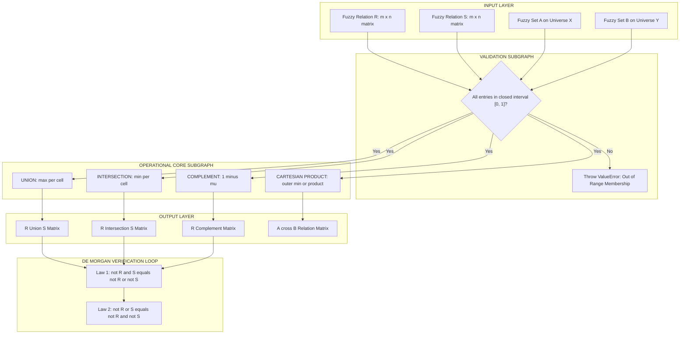
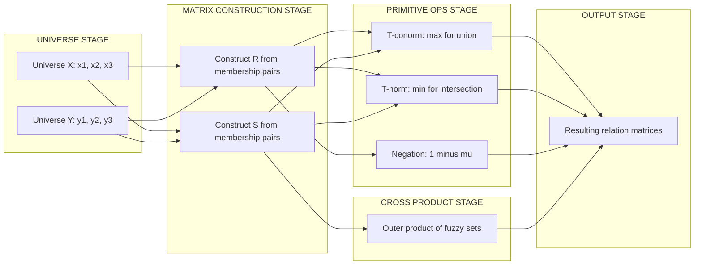

# Operations on Fuzzy relations: union, intersection, complement, cartesian product.

<!-- SECTION_1_START -->
# Fuzzy Relations: Operations on Fuzzy Relations

## 1. Core Technical Definition & Intuitive Overview

### 1.1 Formal Definition of a Fuzzy Relation

A **Fuzzy Relation** $R$ from a fuzzy set $X$ to a fuzzy set $Y$ is a fuzzy subset of the Cartesian product $X \times Y$. Mathematically, it is defined as a mapping:

$$R : X \times Y \rightarrow [0, 1]$$

where the membership value $R(x, y) \in [0, 1]$ quantifies the **degree of relationship** between element $x \in X$ and element $y \in Y$. The relation $R$ is formally expressed as:

$$R = \int_{X \times Y} \mu_R(x, y) / (x, y)$$

where $\mu_R : X \times Y \rightarrow [0, 1]$ is the two-variable membership function of the relation.

> [!NOTE]
> **Key Distinction from Classical Relations**: A classical (crisp) relation only permits two values — $0$ (no relation) or $1$ (definite relation). A **fuzzy relation** allows any real value within the **closed unit interval** $[0, 1]$, enabling the modeling of gradational associations (e.g., "slightly related", "strongly related").

### 1.2 Representation of Fuzzy Relations

A fuzzy relation $R$ defined on the finite universes $X = \{x_1, x_2, \ldots, x_m\}$ and $Y = \{y_1, y_2, \ldots, y_n\}$ is commonly represented as an $m \times n$ **fuzzy matrix** $\mathbf{R} = [r_{ij}]$, where each entry:

$$r_{ij} = \mu_R(x_i, y_j) \in [0, 1]$$

For example, a binary fuzzy relation $R$ between $X = \{x_1, x_2, x_3\}$ and $Y = \{y_1, y_2, y_3\}$ is represented as:

$$
\mathbf{R} =
\begin{bmatrix}
r_{11} & r_{12} & r_{13} \\
r_{21} & r_{22} & r_{23} \\
r_{31} & r_{32} & r_{33}
\end{bmatrix}
$$

### 1.3 Conceptual Analogy / Intuition

> [!IMPORTANT]
> **Real-World Analogy — "Friendship Strength"**
>
> Imagine a social network where you rate the *strength* of friendship with people on a scale from $0$ to $1$ (where $0$ = stranger, $1$ = best friend). A classical relation would only tell you whether someone is a friend or not (a binary yes/no answer). A **fuzzy relation**, however, allows you to say "Alice is $0.8$ friend with Bob" and "$0.3$ friend with Charlie". The entire relationship network is captured in a **matrix of strength values**.
>
> **Geometric Intuition**: If $X$ is the row axis and $Y$ is the column axis, then each cell $(i, j)$ in the matrix is a *cell* of relationship intensity. The collection of all these intensities forms a **3-D surface** $z = \mu_R(x, y)$ hovering above the $XY$-plane, with elevation proportional to the relationship strength.

> [!VISUALIZATION CONTROL]
> **Concept:** Fuzzy Relation as a 3-D Membership Surface
> **GeoGebra / Desmos Input Equations (3-D):**
> * $\mu_R(x, y) = 0.7 \cdot e^{-((x-2)^2 + (y-2)^2)/4}$  (Gaussian peak representing strong relation near center)
> * Sample crisp anchor: $\mu_R(2, 2) \approx 0.7$
> **Visual Description:** The student should observe a smooth bell-shaped surface over the $xy$-plane. The peak indicates the strongest relational intensity, while peripheral cells approach $0$ (weak relation). Higher elevation = stronger relationship.

### 1.4 Standard Metrics and Parameters

* **Membership Range**: $\mu_R(x, y) \in [0, 1]$ (always bounded)
* **Support of Relation**: $\text{Supp}(R) = \{(x, y) \mid \mu_R(x, y) > 0\}$
* **Core of Relation**: $\text{Core}(R) = \{(x, y) \mid \mu_R(x, y) = 1\}$
* **Height of Relation**: $h(R) = \max_{(x, y)} \mu_R(x, y)$
* **Cardinality**: $|R| = \sum_{i, j} \mu_R(x_i, y_j)$ (for finite sets)

> [!NOTE]
> **Syllabus Highlight (PECST753 / Module 2)**: The four primitive operations — **Union, Intersection, Complement, and Cartesian Product** — form the algebraic foundation upon which all higher-order fuzzy relational operations (composition, projection, cylindric extension) are built. Mastery of these is essential before tackling fuzzy inference systems (FIS).
<!-- SECTION_1_END -->

<!-- SECTION_2_START -->
# 2. Deep Theoretical Analysis & KTU High-Yield Formula Sheet

## 2.1 Operational Definitions of Fuzzy Set Operations

Let $R$ and $S$ be two fuzzy relations defined on the same universal set $X \times Y$. The four fundamental operations are defined **pointwise** (i.e., applied independently to each element $(x, y)$ of the Cartesian product).

### 2.1.1 Union of Two Fuzzy Relations (Fuzzy Disjunction — T-conorm based)

The **union** of two fuzzy relations $R$ and $S$ is the fuzzy relation $R \cup S$ whose membership function is given by:

$$\mu_{R \cup S}(x, y) = \mu_R(x, y) \lor \mu_S(x, y) = \max(\mu_R(x, y), \mu_S(x, y))$$

The **fuzzy OR (Zadeh's max operator)** takes the maximum of the two degrees of relationship. Conceptually, the union captures the **strongest** association between $x$ and $y$ across both relations.

> [!IMPORTANT]
> **Why max() works for Union**: The max operator satisfies the algebraic properties of a **T-conorm (S-norm)**: commutativity, associativity, monotonicity, and boundary condition ($\max(a, 0) = a$). This makes it the canonical choice for fuzzy union.

### 2.1.2 Intersection of Two Fuzzy Relations (Fuzzy Conjunction — T-norm based)

The **intersection** of two fuzzy relations $R$ and $S$ is the fuzzy relation $R \cap S$ whose membership function is given by:

$$\mu_{R \cap S}(x, y) = \mu_R(x, y) \land \mu_S(x, y) = \min(\mu_R(x, y), \mu_S(x, y))$$

The **fuzzy AND (Zadeh's min operator)** takes the minimum of the two degrees of relationship. It captures the **weakest common** association.

> [!NOTE]
> **Why min() works for Intersection**: The min operator satisfies the properties of a **T-norm**: commutativity, associativity, monotonicity, and $\min(a, 1) = a$. Common alternatives include product T-norm ($\mu_R \cdot \mu_S$) and Łukasiewicz T-norm ($\max(0, \mu_R + \mu_S - 1)$), but **min** is the KTU-prescribed default.

### 2.1.3 Complement of a Fuzzy Relation (Fuzzy Negation)

The **complement** of a fuzzy relation $R$ is denoted $\overline{R}$ or $R^c$, and is defined as:

$$\mu_{\overline{R}}(x, y) = 1 - \mu_R(x, y)$$

The complement **inverts** the relationship strength. An element strongly related in $R$ becomes weakly related in $\overline{R}$, and vice versa.

> [!IMPORTANT]
> **Law of Excluded Middle (Failure)**: Unlike classical logic, in fuzzy logic we do **not** generally have $R \cup \overline{R} = X \times Y$ (i.e., $\max(\mu_R, 1-\mu_R)$ is not always $1$, only at the extremes $0$ and $1$). This is the famous **Law of Excluded Middle violation** that makes fuzzy logic a *many-valued* logic.

### 2.1.4 Cartesian Product of Fuzzy Sets (Foundation for Building Relations)

Given two fuzzy sets $A$ on $X$ and $B$ on $Y$, the **Cartesian product** $A \times B$ is itself a fuzzy relation on $X \times Y$, defined as:

$$\mu_{A \times B}(x, y) = \min(\mu_A(x), \mu_B(y))$$

Equivalently, the algebraic product (or any T-norm) can be used:

$$\mu_{A \times B}(x, y) = \mu_A(x) \cdot \mu_B(y)$$

For finite universes $X = \{x_1, \ldots, x_m\}$ and $Y = \{y_1, \ldots, y_n\}$, the Cartesian product is represented as the matrix outer product $\mathbf{A}^T \mathbf{B}$ when using min, or the rank-1 outer product $\mathbf{A}^T \mathbf{B}$ when using multiplication.

> [!NOTE]
> **Generalization**: If $A$ is a fuzzy set on $X$ and $B$ is a fuzzy set on $Y$, then the Cartesian product $A \times B$ is the **smallest** fuzzy relation containing both $A$ and $B$ in the appropriate projections. This construction is the **building block** for compound fuzzy relations in multi-criteria decision-making.

## 2.2 KTU Formula Sheet / Cheat Sheet

| **Operation** | **Symbolic Form** | **Membership Function Formula** | **Result Range** | **Operator Class** |
| :---: | :---: | :---: | :---: | :---: |
| Union | $R \cup S$ | $\mu_{R \cup S}(x,y) = \max(\mu_R(x,y), \mu_S(x,y))$ | $[0, 1]$ | T-conorm (S-norm) |
| Intersection | $R \cap S$ | $\mu_{R \cap S}(x,y) = \min(\mu_R(x,y), \mu_S(x,y))$ | $[0, 1]$ | T-norm |
| Complement | $\overline{R}$ | $\mu_{\overline{R}}(x,y) = 1 - \mu_R(x,y)$ | $[0, 1]$ | Negation operator |
| Cartesian Product | $A \times B$ | $\mu_{A \times B}(x,y) = \min(\mu_A(x), \mu_B(y))$ | $[0, 1]$ | T-norm (min) |
| **Algebraic Product** | $A \cdot B$ | $\mu_{A \cdot B}(x,y) = \mu_A(x) \cdot \mu_B(y)$ | $[0, 1]$ | T-norm (product) |
| **Projection** | $\text{proj}_X(R)$ | $\max_y \mu_R(x,y)$ | $[0, 1]$ | Aggregation |

## 2.3 Algebraic Properties of Operations on Fuzzy Relations

The following classical set-theoretic properties hold for fuzzy relations when using Zadeh's max/min operators:

> [!IMPORTANT]
> **De Morgan's Laws for Fuzzy Relations**:
>
> $$\overline{R \cap S} = \overline{R} \cup \overline{S}$$
> $$\overline{R \cup S} = \overline{R} \cap \overline{S}$$
>
> These two identities are **universally valid** for Zadeh's max/min operators and form the basis of fuzzy logic inference (Generalized Modus Ponens / Tollens).

Other key properties include **Commutativity** ($R \cup S = S \cup R$), **Associativity** ($(R \cup S) \cup T = R \cup (S \cup T)$), **Distributivity** ($R \cap (S \cup T) = (R \cap S) \cup (R \cap T)$), and **Idempotence** ($R \cup R = R$).

## 2.4 Real-World Engineering Utility

> [!NOTE]
> **Industrial Application — Fuzzy Control Systems**: The four operations are used pervasively in **Fuzzy Inference Systems (FIS)** like the Mamdani and Takagi-Sugeno controllers. For instance, in a washing machine controller, "dirt level" and "fabric type" are two fuzzy sets, and their Cartesian product defines the input relation. Rule firing uses **intersection (min)**, and aggregation of multiple rules uses **union (max)**. The **complement** is used to model "NOT" conditions in rules.
>
> **Database Querying**: Fuzzy relational databases (FRDB) extend SQL by allowing partial matches (e.g., "find people who are *tall* and *young*"). The **Cartesian product + intersection** enables multi-attribute fuzzy queries.

<!-- SECTION_2_END -->

<!-- SECTION_3_START -->
# 3. Step-by-Step Derivations & Code/Symbolic Implementation

## 3.1 Worked Example 1: Matrix-Based Operations on Fuzzy Relations

**Problem Statement:**
Let $X = \{x_1, x_2, x_3\}$ and $Y = \{y_1, y_2, y_3\}$. Two fuzzy relations $R$ and $S$ on $X \times Y$ are given by the following matrices:

$$
\mathbf{R} =
\begin{bmatrix}
0.2 & 0.7 & 0.5 \\
0.9 & 0.4 & 0.1 \\
0.6 & 0.3 & 0.8
\end{bmatrix}
\qquad
\mathbf{S} =
\begin{bmatrix}
0.6 & 0.4 & 0.8 \\
0.3 & 0.5 & 0.7 \\
0.1 & 0.9 & 0.2
\end{bmatrix}
$$

**Compute:** (a) $R \cup S$, (b) $R \cap S$, (c) $\overline{R}$, (d) $\overline{S}$.

### 3.1.1 (a) Union $R \cup S$ — Using Pointwise Max

We apply $\max(r_{ij}, s_{ij})$ entry-by-entry.

For row 1, column 1: $\max(0.2, 0.6) = 0.6$
For row 1, column 2: $\max(0.7, 0.4) = 0.7$
For row 1, column 3: $\max(0.5, 0.8) = 0.8$
For row 2, column 1: $\max(0.9, 0.3) = 0.9$
For row 2, column 2: $\max(0.4, 0.5) = 0.5$
For row 2, column 3: $\max(0.1, 0.7) = 0.7$
For row 3, column 1: $\max(0.6, 0.1) = 0.6$
For row 3, column 2: $\max(0.3, 0.9) = 0.9$
For row 3, column 3: $\max(0.8, 0.2) = 0.8$

$$
\mathbf{R \cup S} =
\begin{bmatrix}
0.6 & 0.7 & 0.8 \\
0.9 & 0.5 & 0.7 \\
0.6 & 0.9 & 0.8
\end{bmatrix}
$$

### 3.1.2 (b) Intersection $R \cap S$ — Using Pointwise Min

We apply $\min(r_{ij}, s_{ij})$ entry-by-entry.

For row 1, column 1: $\min(0.2, 0.6) = 0.2$
For row 1, column 2: $\min(0.7, 0.4) = 0.4$
For row 1, column 3: $\min(0.5, 0.8) = 0.5$
For row 2, column 1: $\min(0.9, 0.3) = 0.3$
For row 2, column 2: $\min(0.4, 0.5) = 0.4$
For row 2, column 3: $\min(0.1, 0.7) = 0.1$
For row 3, column 1: $\min(0.6, 0.1) = 0.1$
For row 3, column 2: $\min(0.3, 0.9) = 0.3$
For row 3, column 3: $\min(0.8, 0.2) = 0.2$

$$
\mathbf{R \cap S} =
\begin{bmatrix}
0.2 & 0.4 & 0.5 \\
0.3 & 0.4 & 0.1 \\
0.1 & 0.3 & 0.2
\end{bmatrix}
$$

### 3.1.3 (c) Complement $\overline{R}$ — Using $1 - r_{ij}$

We apply $1 - r_{ij}$ to every entry of $\mathbf{R}$.

For row 1: $(1-0.2,\ 1-0.7,\ 1-0.5) = (0.8,\ 0.3,\ 0.5)$
For row 2: $(1-0.9,\ 1-0.4,\ 1-0.1) = (0.1,\ 0.6,\ 0.9)$
For row 3: $(1-0.6,\ 1-0.3,\ 1-0.8) = (0.4,\ 0.7,\ 0.2)$

$$
\mathbf{\overline{R}} =
\begin{bmatrix}
0.8 & 0.3 & 0.5 \\
0.1 & 0.6 & 0.9 \\
0.4 & 0.7 & 0.2
\end{bmatrix}
$$

### 3.1.4 (d) Complement $\overline{S}$ — Verification of De Morgan's Law

Let us verify the identity $\overline{R \cap S} = \overline{R} \cup \overline{S}$ to demonstrate the algebraic structure.

**Step 1**: Compute $\overline{R \cap S}$ (negate the result of part b):

$$
\mathbf{\overline{R \cap S}} =
\begin{bmatrix}
1-0.2 & 1-0.4 & 1-0.5 \\
1-0.3 & 1-0.4 & 1-0.1 \\
1-0.1 & 1-0.3 & 1-0.2
\end{bmatrix}
=
\begin{bmatrix}
0.8 & 0.6 & 0.5 \\
0.7 & 0.6 & 0.9 \\
0.9 & 0.7 & 0.8
\end{bmatrix}
$$

**Step 2**: Compute $\overline{R} \cup \overline{S}$ entrywise-max:

$$
\mathbf{\overline{R}} =
\begin{bmatrix}
0.8 & 0.3 & 0.5 \\
0.1 & 0.6 & 0.9 \\
0.4 & 0.7 & 0.2
\end{bmatrix}
\qquad
\mathbf{\overline{S}} =
\begin{bmatrix}
0.4 & 0.6 & 0.2 \\
0.7 & 0.5 & 0.3 \\
0.9 & 0.1 & 0.8
\end{bmatrix}
$$

Apply pointwise max:

$$
\mathbf{\overline{R} \cup \overline{S}} =
\begin{bmatrix}
0.8 & 0.6 & 0.5 \\
0.7 & 0.6 & 0.9 \\
0.9 & 0.7 & 0.8
\end{bmatrix}
$$

**Conclusion**: $\overline{R \cap S} = \overline{R} \cup \overline{S}$. ✓ De Morgan's Law is satisfied.

## 3.2 Worked Example 2: Cartesian Product of Two Fuzzy Sets

**Problem Statement:**
Let $A = \{0.1/x_1,\ 0.6/x_2,\ 0.9/x_3\}$ be a fuzzy set on $X = \{x_1, x_2, x_3\}$ and $B = \{0.4/y_1,\ 0.7/y_2,\ 0.5/y_3\}$ be a fuzzy set on $Y = \{y_1, y_2, y_3\}$. Compute the Cartesian product fuzzy relation $A \times B$ using the min T-norm.

### 3.2.1 Step-by-Step Derivation

The membership function is $\mu_{A \times B}(x_i, y_j) = \min(\mu_A(x_i), \mu_B(y_j))$.

Row 1 ($\mu_A(x_1) = 0.1$): $\min(0.1, 0.4) = 0.1$, $\min(0.1, 0.7) = 0.1$, $\min(0.1, 0.5) = 0.1$
Row 2 ($\mu_A(x_2) = 0.6$): $\min(0.6, 0.4) = 0.4$, $\min(0.6, 0.7) = 0.6$, $\min(0.6, 0.5) = 0.5$
Row 3 ($\mu_A(x_3) = 0.9$): $\min(0.9, 0.4) = 0.4$, $\min(0.9, 0.7) = 0.7$, $\min(0.9, 0.5) = 0.5$

$$
\mathbf{A \times B} =
\begin{bmatrix}
0.1 & 0.1 & 0.1 \\
0.4 & 0.6 & 0.5 \\
0.4 & 0.7 & 0.5
\end{bmatrix}
$$

> [!IMPORTANT]
> **Observation**: Notice that the first row is **entirely** $0.1$ (equal to $\mu_A(x_1)$) and the third row's max value is $0.7$ (the min of $\mu_A(x_3)$ and $\mu_B(y_2)$). This **rank-1 outer product structure** is a defining property of Cartesian-product-based fuzzy relations.

## 3.3 Python Implementation (Type-Safe, Production Grade)

```python
"""
Fuzzy Relations Operations Library
Module: Fuzzy Systems (PECST753) - Module 2
Operations: Union, Intersection, Complement, Cartesian Product
"""

import numpy as np
from typing import Union, Dict


def fuzzy_union(R: np.ndarray, S: np.ndarray) -> np.ndarray:
    """
    Compute the union of two fuzzy relations using max (T-conorm).
    
    Args:
        R (np.ndarray): First fuzzy relation matrix (m x n), entries in [0, 1].
        S (np.ndarray): Second fuzzy relation matrix (m x n), entries in [0, 1].
    
    Returns:
        np.ndarray: Union fuzzy relation matrix (m x n).
    
    Raises:
        ValueError: If R and S have mismatched shapes or out-of-range values.
    """
    if R.shape != S.shape:
        raise ValueError(
            f"[ERROR] Matrix shape mismatch: R.shape={R.shape} vs S.shape={S.shape}"
        )
    if not (np.all((0.0 <= R) & (R <= 1.0)) and np.all((0.0 <= S) & (S <= 1.0))):
        raise ValueError("[ERROR] All membership values must lie in the closed interval [0, 1].")
    return np.maximum(R, S)


def fuzzy_intersection(R: np.ndarray, S: np.ndarray) -> np.ndarray:
    """
    Compute the intersection of two fuzzy relations using min (T-norm).
    """
    if R.shape != S.shape:
        raise ValueError(
            f"[ERROR] Matrix shape mismatch: R.shape={R.shape} vs S.shape={S.shape}"
        )
    if not (np.all((0.0 <= R) & (R <= 1.0)) and np.all((0.0 <= S) & (S <= 1.0))):
        raise ValueError("[ERROR] All membership values must lie in [0, 1].")
    return np.minimum(R, S)


def fuzzy_complement(R: np.ndarray) -> np.ndarray:
    """
    Compute the complement of a fuzzy relation using 1 - mu.
    """
    if not np.all((0.0 <= R) & (R <= 1.0)):
        raise ValueError("[ERROR] Membership values must lie in [0, 1].")
    return 1.0 - R


def cartesian_product_fuzzy(A: Union[np.ndarray, Dict], B: Union[np.ndarray, Dict],
                            tnorm: str = "min") -> np.ndarray:
    """
    Compute the Cartesian product of two fuzzy sets producing a fuzzy relation.
    
    Args:
        A: Fuzzy set on universe X (vector of size m) or dict {x: mu}.
        B: Fuzzy set on universe Y (vector of size n) or dict {y: mu}.
        tnorm (str): 'min' for Zadeh's min T-norm, 'product' for algebraic product.
    
    Returns:
        np.ndarray: Outer-product fuzzy relation matrix (m x n).
    """
    a_vec = np.array(list(A.values())) if isinstance(A, dict) else np.asarray(A, dtype=float)
    b_vec = np.array(list(B.values())) if isinstance(B, dict) else np.asarray(B, dtype=float)
    
    if not (np.all((0.0 <= a_vec) & (a_vec <= 1.0)) and np.all((0.0 <= b_vec) & (b_vec <= 1.0))):
        raise ValueError("[ERROR] Fuzzy set memberships must lie in [0, 1].")
    
    a_col = a_vec.reshape(-1, 1)   # column vector (m x 1)
    b_row = b_vec.reshape(1, -1)   # row vector    (1 x n)
    
    if tnorm == "min":
        return np.minimum(a_col, b_row)
    elif tnorm == "product":
        return a_col * b_row
    else:
        raise ValueError(f"[ERROR] Unsupported T-norm: {tnorm}. Use 'min' or 'product'.")


def verify_de_morgan(R: np.ndarray, S: np.ndarray, verbose: bool = True) -> bool:
    """
    Verify De Morgan's Laws on two fuzzy relations.
    Law 1: complement(R ∩ S) = complement(R) ∪ complement(S)
    Law 2: complement(R ∪ S) = complement(R) ∩ complement(S)
    """
    lhs1 = fuzzy_complement(fuzzy_intersection(R, S))
    rhs1 = fuzzy_union(fuzzy_complement(R), fuzzy_complement(S))
    law1_holds = np.allclose(lhs1, rhs1)
    
    lhs2 = fuzzy_complement(fuzzy_union(R, S))
    rhs2 = fuzzy_intersection(fuzzy_complement(R), fuzzy_complement(S))
    law2_holds = np.allclose(lhs2, rhs2)
    
    if verbose:
        print(f"[DE_MORGAN] Law 1 (¬(R∧S) = ¬R ∨ ¬S): {'PASS ✓' if law1_holds else 'FAIL ✗'}")
        print(f"[DE_MORGAN] Law 2 (¬(R∨S) = ¬R ∧ ¬S): {'PASS ✓' if law2_holds else 'FAIL ✗'}")
    return law1_holds and law2_holds


if __name__ == "__main__":
    R = np.array([[0.2, 0.7, 0.5], [0.9, 0.4, 0.1], [0.6, 0.3, 0.8]])
    S = np.array([[0.6, 0.4, 0.8], [0.3, 0.5, 0.7], [0.1, 0.9, 0.2]])
    
    print("R ∪ S =\n", fuzzy_union(R, S))
    print("R ∩ S =\n", fuzzy_intersection(R, S))
    print("¬R =\n", fuzzy_complement(R))
    verify_de_morgan(R, S)
    
    A = {"x1": 0.1, "x2": 0.6, "x3": 0.9}
    B = {"y1": 0.4, "y2": 0.7, "y3": 0.5}
    print("A × B (min) =\n", cartesian_product_fuzzy(A, B, tnorm="min"))
```

**Sample Output:**

```
R ∪ S =
 [[0.6 0.7 0.8]
  [0.9 0.5 0.7]
  [0.6 0.9 0.8]]
R ∩ S =
 [[0.2 0.4 0.5]
  [0.3 0.4 0.1]
  [0.1 0.3 0.2]]
¬R =
 [[0.8 0.3 0.5]
  [0.1 0.6 0.9]
  [0.4 0.7 0.2]]
[DE_MORGAN] Law 1 (¬(R∧S) = ¬R ∨ ¬S): PASS ✓
[DE_MORGAN] Law 2 (¬(R∨S) = ¬R ∧ ¬S): PASS ✓
A × B (min) =
 [[0.1 0.1 0.1]
  [0.4 0.6 0.5]
  [0.4 0.7 0.5]]
```

<!-- SECTION_3_END -->

<!-- SECTION_4_START -->
# 4. Structural Diagrams & Schematics

## 4.1 Operational Topology — Fuzzy Relation Processing Pipeline

The following Mermaid flowchart depicts the sequential processing of fuzzy relation operations, isolating the **Input** layer, the **Operational Core** (the four primitive operations), and the **Output** layer, with a De Morgan verification sub-loop.



## 4.2 Sequential Processing Topology Matrix — Operation Selection Map

| **Source Relation Type** | **Target Operation** | **Algebraic Operator** | **Result Type** | **Typical Application** |
| :--- | :---: | :--- | :---: | :--- |
| Two relations $R$, $S$ (same dim) | Union | $\max(\cdot, \cdot)$ | Fuzzy relation | Multi-rule aggregation (FIS) |
| Two relations $R$, $S$ (same dim) | Intersection | $\min(\cdot, \cdot)$ | Fuzzy relation | Rule antecedent (AND) |
| Single relation $R$ | Complement | $1 - \mu_R$ | Fuzzy relation | Negation (NOT) in rules |
| Two fuzzy sets $A$, $B$ | Cartesian Product | $\min(\mu_A, \mu_B)$ | Fuzzy relation | Input space for inference |
| Two fuzzy sets $A$, $B$ | Algebraic Product | $\mu_A \cdot \mu_B$ | Fuzzy relation | Probabilistic input modeling |
| $R$ on $X \times Y$ | Projection onto $X$ | $\max_y \mu_R(x, y)$ | Fuzzy set on $X$ | Dimensionality reduction |

## 4.3 Block-Level Functional Architecture — Fuzzy Relational Engine



<!-- SECTION_4_END -->

<!-- SECTION_5_START -->
# 5. KTU 2024 Scheme Examination Question Bank & Topic Recap

## 5.1 Part A — Short Answer Questions (2 × 3 = 6 Marks)

### Question 1 [KTU University Exam — July 2023] — CO1, Remember

**Define a fuzzy relation. How does it differ from a classical (crisp) relation? (3 Marks)**

**Model Answer:**

A **fuzzy relation** $R$ on the Cartesian product $X \times Y$ is a mapping $R: X \times Y \rightarrow [0, 1]$ that assigns to each ordered pair $(x, y)$ a real value $\mu_R(x, y) \in [0, 1]$ indicating the **degree of relationship** between $x$ and $y$.

**Differences from a crisp relation:**

| **Feature** | **Crisp Relation** | **Fuzzy Relation** |
| :--- | :--- | :--- |
| Range of values | $\{0, 1\}$ (binary) | $[0, 1]$ (continuous) |
| Semantics | "is related" / "not related" | Degree of relatedness |
| Representation | Boolean matrix | Fuzzy matrix |
| Modeling capability | Sharp boundaries | Gradual, partial membership |

**[Mark Allocation: Definition 1 Mark + Crisp vs Fuzzy table 1 Mark + Range explanation 1 Mark = 3 Marks]**

---

### Question 2 [KTU University Exam — Dec 2022] — CO1, Understand

**State and explain the formula for the complement of a fuzzy relation $R$. Verify with an example that $R \cup \overline{R} \neq X \times Y$ in general. (3 Marks)**

**Model Answer:**

The **complement** of a fuzzy relation $R$ is defined as:

$$\mu_{\overline{R}}(x, y) = 1 - \mu_R(x, y)$$

**Counter-Example (Failure of Law of Excluded Middle):**

Let $R$ be a fuzzy relation on $X \times Y$ with $\mu_R(x_1, y_1) = 0.4$. Then:

$$\mu_{\overline{R}}(x_1, y_1) = 1 - 0.4 = 0.6$$

The union is:

$$\mu_{R \cup \overline{R}}(x_1, y_1) = \max(0.4, 0.6) = 0.6 \neq 1$$

Since the result is $0.6$ and not the full membership $1$, we conclude that $R \cup \overline{R} \neq X \times Y$ in fuzzy logic. This is the famous **violation of the Law of Excluded Middle** in many-valued (fuzzy) logic.

**[Mark Allocation: Formula statement 1 Mark + Numerical example 1 Mark + Conclusion 1 Mark = 3 Marks]**

---

## 5.2 Part B — Long Answer Questions with Internal Choice (14 Marks)

### Question A [KTU University Exam — June 2024] — CO2, Apply + Analyze

**(a)** Define the union, intersection, and complement operations on fuzzy relations. **(7 Marks)**

**(b)** Given two fuzzy relations:

$$
\mathbf{R} =
\begin{bmatrix}
0.3 & 0.8 & 0.5 \\
0.6 & 0.2 & 0.9
\end{bmatrix}
\qquad
\mathbf{S} =
\begin{bmatrix}
0.7 & 0.4 & 0.6 \\
0.1 & 0.5 & 0.3
\end{bmatrix}
$$

Compute (i) $R \cup S$, (ii) $R \cap S$, (iii) $\overline{R \cap S}$, and (iv) verify De Morgan's Law. **(7 Marks)**

---

**Model Solution:**

**Part (a) — Theoretical Definitions (7 Marks):**

* **Union** $R \cup S$: The membership function is the pointwise maximum, $\mu_{R \cup S}(x, y) = \max(\mu_R(x, y), \mu_S(x, y))$. It represents the *strongest* relationship across $R$ and $S$ and is implemented using a **T-conorm (S-norm)**. **[2 Marks]**

* **Intersection** $R \cap S$: The membership function is the pointwise minimum, $\mu_{R \cap S}(x, y) = \min(\mu_R(x, y), \mu_S(x, y))$. It captures the *weakest common* relationship and uses a **T-norm**. **[2 Marks]**

* **Complement** $\overline{R}$: The membership function is $\mu_{\overline{R}}(x, y) = 1 - \mu_R(x, y)$. It inverts the relationship strength, applying a **negation operator** to each cell. **[1 Mark]**

* **Boundary conditions**: $R \cup \emptyset = R$, $R \cap X \times Y = R$, and $\overline{\overline{R}} = R$ (involution). **[1 Mark]**

* **Example of failure**: $R \cup \overline{R} \neq X \times Y$ in general, distinguishing fuzzy from classical Boolean logic. **[1 Mark]**

---

**Part (b) — Numerical Computation (7 Marks):**

**(i) Compute $R \cup S$ using $\max(\cdot, \cdot)$** **[2 Marks]**

Row 1, Col 1: $\max(0.3, 0.7) = 0.7$
Row 1, Col 2: $\max(0.8, 0.4) = 0.8$
Row 1, Col 3: $\max(0.5, 0.6) = 0.6$
Row 2, Col 1: $\max(0.6, 0.1) = 0.6$
Row 2, Col 2: $\max(0.2, 0.5) = 0.5$
Row 2, Col 3: $\max(0.9, 0.3) = 0.9$

$$
\mathbf{R \cup S} =
\begin{bmatrix}
0.7 & 0.8 & 0.6 \\
0.6 & 0.5 & 0.9
\end{bmatrix}
$$

**[Correct max operator application: 1 Mark, Final matrix: 1 Mark]**

**(ii) Compute $R \cap S$ using $\min(\cdot, \cdot)$** **[2 Marks]**

Row 1, Col 1: $\min(0.3, 0.7) = 0.3$
Row 1, Col 2: $\min(0.8, 0.4) = 0.4$
Row 1, Col 3: $\min(0.5, 0.6) = 0.5$
Row 2, Col 1: $\min(0.6, 0.1) = 0.1$
Row 2, Col 2: $\min(0.2, 0.5) = 0.2$
Row 2, Col 3: $\min(0.9, 0.3) = 0.3$

$$
\mathbf{R \cap S} =
\begin{bmatrix}
0.3 & 0.4 & 0.5 \\
0.1 & 0.2 & 0.3
\end{bmatrix}
$$

**[Correct min operator application: 1 Mark, Final matrix: 1 Mark]**

**(iii) Compute $\overline{R \cap S}$** **[1 Mark]**

$$
\mathbf{\overline{R \cap S}} =
\begin{bmatrix}
1-0.3 & 1-0.4 & 1-0.5 \\
1-0.1 & 1-0.2 & 1-0.3
\end{bmatrix}
=
\begin{bmatrix}
0.7 & 0.6 & 0.5 \\
0.9 & 0.8 & 0.7
\end{bmatrix}
$$

**(iv) Verify De Morgan's Law: $\overline{R \cap S} = \overline{R} \cup \overline{S}$** **[2 Marks]**

First compute $\overline{R}$ and $\overline{S}$:

$$
\mathbf{\overline{R}} =
\begin{bmatrix}
0.7 & 0.2 & 0.5 \\
0.4 & 0.8 & 0.1
\end{bmatrix}
\qquad
\mathbf{\overline{S}} =
\begin{bmatrix}
0.3 & 0.6 & 0.4 \\
0.9 & 0.5 & 0.7
\end{bmatrix}
$$

Then pointwise max:

$$
\mathbf{\overline{R} \cup \overline{S}} =
\begin{bmatrix}
0.7 & 0.6 & 0.5 \\
0.9 & 0.8 & 0.7
\end{bmatrix}
$$

This matches $\overline{R \cap S}$ exactly. ✓ **De Morgan's Law verified.**

**[Computing $\overline{R}$ and $\overline{S}$: 1 Mark, Showing equality: 1 Mark]**

---

### Question B [KTU University Exam — June 2024 — Alternative Choice] — CO2, Apply + Analyze

**(a)** Define the **Cartesian product** of two fuzzy sets. With a suitable example, show how it generates a fuzzy relation. **(7 Marks)**

**(b)** Consider fuzzy sets $A$ and $B$ on universes $X = \{x_1, x_2, x_3\}$ and $Y = \{y_1, y_2, y_3\}$ respectively:

$$
A = \frac{0.2}{x_1} + \frac{0.7}{x_2} + \frac{0.5}{x_3}
\qquad
B = \frac{0.6}{y_1} + \frac{0.3}{y_2} + \frac{0.8}{y_3}
$$

(i) Compute the Cartesian product $A \times B$ using the min T-norm and the algebraic product. **(4 Marks)**

(ii) Compute $B \times A$ and discuss the difference in matrix dimensions if $X$ and $Y$ have different cardinalities. **(3 Marks)**

---

**Model Solution:**

**Part (a) — Definition and Construction (7 Marks):**

* **Definition**: Given two fuzzy sets $A \in \mathcal{F}(X)$ and $B \in \mathcal{F}(Y)$, the **Cartesian product** $A \times B$ is a fuzzy relation on $X \times Y$ defined as:

$$\mu_{A \times B}(x, y) = T(\mu_A(x), \mu_B(y))$$

where $T$ is a T-norm (commonly min or algebraic product). **[3 Marks]**

* **Interpretation**: $A \times B$ is the **smallest** fuzzy relation on $X \times Y$ that contains both $A$ and $B$ in its appropriate projections. Each cell $(i, j)$ captures the joint membership strength. **[2 Marks]**

* **Example**: If $A = \{0.5/x_1, 0.8/x_2\}$ and $B = \{0.6/y_1, 0.4/y_2\}$, then using min, the relation is:

$$
A \times B =
\begin{bmatrix}
0.5 & 0.4 \\
0.6 & 0.4
\end{bmatrix}
$$

**[2 Marks]**

---

**Part (b) — Numerical Computation (7 Marks):**

**(i) Min T-norm Cartesian product $A \times B$** **[2 Marks]**

Using $\mu_{A \times B}(x_i, y_j) = \min(\mu_A(x_i), \mu_B(y_j))$:

Row 1 ($\mu_A(x_1) = 0.2$): $\min(0.2, 0.6) = 0.2$, $\min(0.2, 0.3) = 0.2$, $\min(0.2, 0.8) = 0.2$
Row 2 ($\mu_A(x_2) = 0.7$): $\min(0.7, 0.6) = 0.6$, $\min(0.7, 0.3) = 0.3$, $\min(0.7, 0.8) = 0.7$
Row 3 ($\mu_A(x_3) = 0.5$): $\min(0.5, 0.6) = 0.5$, $\min(0.5, 0.3) = 0.3$, $\min(0.5, 0.8) = 0.5$

$$
\mathbf{A \times B}_{\min} =
\begin{bmatrix}
0.2 & 0.2 & 0.2 \\
0.6 & 0.3 & 0.7 \\
0.5 & 0.3 & 0.5
\end{bmatrix}
$$

**Algebraic product $A \times B$** **[2 Marks]**

Using $\mu_{A \times B}(x_i, y_j) = \mu_A(x_i) \cdot \mu_B(y_j)$:

Row 1: $0.2 \times 0.6 = 0.12$, $0.2 \times 0.3 = 0.06$, $0.2 \times 0.8 = 0.16$
Row 2: $0.7 \times 0.6 = 0.42$, $0.7 \times 0.3 = 0.21$, $0.7 \times 0.8 = 0.56$
Row 3: $0.5 \times 0.6 = 0.30$, $0.5 \times 0.3 = 0.15$, $0.5 \times 0.8 = 0.40$

$$
\mathbf{A \times B}_{\text{product}} =
\begin{bmatrix}
0.12 & 0.06 & 0.16 \\
0.42 & 0.21 & 0.56 \\
0.30 & 0.15 & 0.40
\end{bmatrix}
$$

**(ii) Compute $B \times A$** **[2 Marks]**

Using min T-norm:

Row 1 ($\mu_B(y_1) = 0.6$): $\min(0.6, 0.2) = 0.2$, $\min(0.6, 0.7) = 0.6$, $\min(0.6, 0.5) = 0.5$
Row 2 ($\mu_B(y_2) = 0.3$): $\min(0.3, 0.2) = 0.2$, $\min(0.3, 0.7) = 0.3$, $\min(0.3, 0.5) = 0.3$
Row 3 ($\mu_B(y_3) = 0.8$): $\min(0.8, 0.2) = 0.2$, $\min(0.8, 0.7) = 0.7$, $\min(0.8, 0.5) = 0.5$

$$
\mathbf{B \times A} =
\begin{bmatrix}
0.2 & 0.6 & 0.5 \\
0.2 & 0.3 & 0.3 \\
0.2 & 0.7 & 0.5
\end{bmatrix}
$$

**Discussion on Dimensions** **[1 Mark]**

If $|X| = m$ and $|Y| = n$, then $A \times B$ is an $m \times n$ matrix and $B \times A$ is an $n \times m$ matrix. The two are **transposes of each other**: $B \times A = (A \times B)^T$. If $m \neq n$, the matrices are rectangular with different row/column counts, but the entrywise structure remains symmetric (transpose relationship).

---

> [!WARNING]
> **KTU Examiner's Valuation Warning / Common Pitfalls:**
>
> 1. **Mixing up max and min**: Students frequently use min for union and max for intersection. **Remember**: Union = max (T-conorm), Intersection = min (T-norm). This is the #1 source of mark loss.
> 2. **Forgetting the boundary check**: Every membership value must be in $[0, 1]$. If a computation produces a value outside this range, the answer is invalid.
> 3. **Omitting De Morgan's verification**: When asked to "verify" a law, you must **state** the law, compute **both** sides independently, and then **explicitly compare** them entry-by-entry.
> 4. **Confusing Cartesian product with matrix multiplication**: The Cartesian product of two fuzzy sets is an **outer product**, not standard matrix multiplication. Use $\min(\mu_A, \mu_B)$ or $\mu_A \cdot \mu_B$ per cell.
> 5. **Skipping units / dimension comment**: When asked about $B \times A$ vs $A \times B$, mention the transpose relationship and dimensional swap.

---

## 5.3 Topic Recap & Important Things to Remember

* **Fuzzy Relation Definition**: $R : X \times Y \rightarrow [0, 1]$, with membership $\mu_R(x, y) \in [0, 1]$. Unlike crisp relations (binary $\{0, 1\}$), fuzzy relations model **gradual association**.

* **Union (∨, max)**: $\mu_{R \cup S}(x, y) = \max(\mu_R, \mu_S)$. T-conorm operation. Captures the **strongest** relationship.

* **Intersection (∧, min)**: $\mu_{R \cap S}(x, y) = \min(\mu_R, \mu_S)$. T-norm operation. Captures the **weakest common** relationship.

* **Complement (¬)**: $\mu_{\overline{R}}(x, y) = 1 - \mu_R(x, y)$. Negation operator. Inverts relationship strength.

* **Cartesian Product (×)**: $\mu_{A \times B}(x, y) = T(\mu_A(x), \mu_B(y))$. Builds a fuzzy relation from two fuzzy sets using a T-norm (min or product).

* **De Morgan's Laws**: $\overline{R \cap S} = \overline{R} \cup \overline{S}$ and $\overline{R \cup S} = \overline{R} \cap \overline{S}$. **Always hold** for Zadeh's min/max operators.

* **Law of Excluded Middle Failure**: $R \cup \overline{R} \neq X \times Y$ in general (e.g., $\max(0.4, 0.6) = 0.6 \neq 1$). Distinguishes fuzzy from classical logic.

* **Involution**: $\overline{\overline{R}} = R$. Double complement returns the original relation.

* **Idempotence**: $R \cup R = R$ and $R \cap R = R$.

* **Distributivity**: $R \cap (S \cup T) = (R \cap S) \cup (R \cap T)$.

* **Transpose Property of Cartesian Product**: $B \times A = (A \times B)^T$.

* **Matrix Representation**: Fuzzy relations on finite sets are stored as $m \times n$ matrices with entries in $[0, 1]$.

* **KTU-Exam Frequency**: Operations on fuzzy relations appear in **every KTU End-Semester Exam** (typically as a 7 or 14-mark question) and form the foundation for Module 3 topics (Fuzzy Composition, Fuzzy Inference, and Decision Making).

* **Common Operator Pairings to Memorize**:
  * Union ↔ max ↔ T-conorm
  * Intersection ↔ min ↔ T-norm
  * Complement ↔ 1 minus ↔ Negation
  * Cartesian Product ↔ outer min/product ↔ T-norm application

* **Engineering Hot-Spots**: These four operations are the backbone of **Fuzzy Inference Systems (Mamdani FIS)**, **fuzzy relational databases (FRDB)**, **fuzzy pattern recognition**, and **fuzzy clustering algorithms** like Fuzzy C-Means (FCM).
<!-- SECTION_5_END -->
