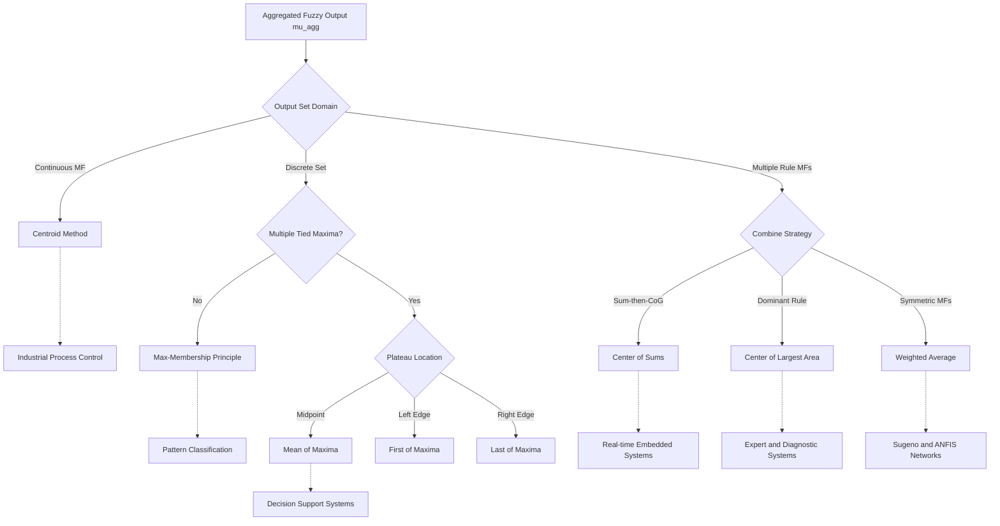
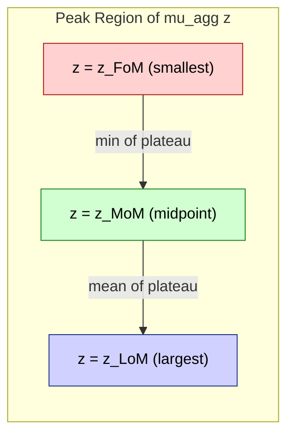
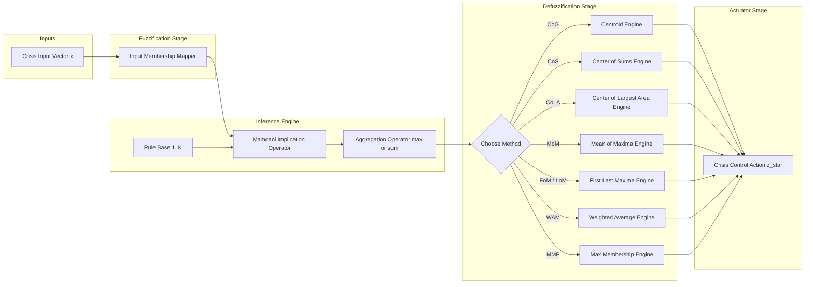
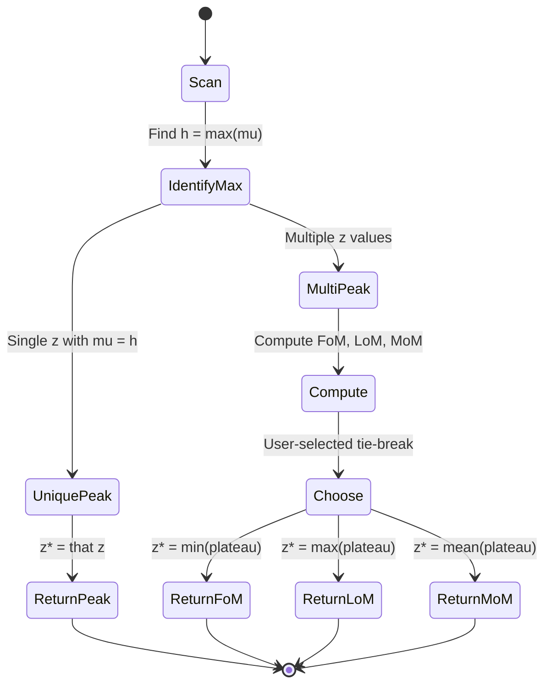

# Defuzzification to Scalars - Max membership principle, Centroid method, Weighted average method, Mean max membership, Center of sums, Center of largest area, First (or last) of maxima.

<!-- SECTION_1_START -->
# Defuzzification to Scalars — Core Definitions & Intuitive Overview

> [!NOTE]
> **Defuzzification** is the final, deterministic step of a fuzzy inference system (FIS). It converts the *aggregated* fuzzy output set $\mu_{agg}(z)$ back into a single crisp control value $z^{*} \in \mathbb{R}$ that can be dispatched to an actuator, displayed to a user, or fed into a downstream controller.

## 1.1 Formal Academic Definition (KTU 2024 Scheme Terminology)

> [!IMPORTANT]
> **Defuzzification** is a mapping $\mathcal{D}: \mathcal{F}(\mathbb{R}) \to \mathbb{R}$ that extracts a *representative scalar* from a membership function $\mu_{agg}(z)$ produced after the *implication* and *aggregation* stages of a Mamdani-type fuzzy system. The scalar $z^{*}$ must preserve, as faithfully as possible, the *shape*, *support*, *centroid*, and *peak location* of the aggregated output set.

The seven standard defuzzification methods mandated by the PECST753 Module 3 syllabus are:

1. **Max-Membership Principle (MMP)**
2. **Centroid Method (Center of Gravity / CoG)**
3. **Weighted Average Method (WAM)**
4. **Mean of Maxima (MoM)**
5. **Center of Sums (CoS)**
6. **Center of Largest Area (CoLA)**
7. **First (or Last) of Maxima (FoM / LoM)**

## 1.2 Conceptual Analogy — "The Election of a Single Spokesperson"

> [!NOTE]
> **Analogy:** Imagine an aggregated fuzzy output as a *crowd of experts* standing on a stage, each holding a placard showing how strongly they recommend a particular action value $z$. Tall placards = high membership. The defuzzification method is simply the *election rule* used to pick **one** spokesperson.
> - **Centroid** = the *center of mass* of the crowd (balanced choice).
> - **Mean of Maxima** = average height of the *tallest* people in the front row.
> - **First of Maxima** = the *left-most tallest* person.
> - **Center of Sums** = vote by *adding all placards* (overlaps double-count) and taking the center of mass.

## 1.3 Method-by-Method Intuition

| # | Method | Plain-English Intuition |
|---|---|---|
| 1 | **Max-Membership Principle** | Pick the value(s) where the crowd is loudest (membership = 1, or maximum). |
| 2 | **Centroid (CoG)** | Find the *balance point* of the shape — the scalar at which the area to the left equals the area to the right. |
| 3 | **Weighted Average** | For *symmetric* singletons or triangles, use membership as a *weight* and average the centers. |
| 4 | **Mean of Maxima (MoM)** | Identify the *plateau* of highest membership and return its arithmetic midpoint. |
| 5 | **Center of Sums (CoS)** | Add all contributing membership functions (do not take their *max*) and then compute the centroid of the composite. |
| 6 | **Center of Largest Area (CoLA)** | Find the single contribution that covers the largest area, then return its centroid. |
| 7 | **First / Last of Maxima** | Among all values tied for maximum membership, return the *smallest* (FoM) or the *largest* (LoM). |

> [!IMPORTANT]
> **Syllabus Highlight:** PECST753 places strong weight on understanding *when* to use which method. The Centroid method is the **default choice** for Mamdani systems due to its continuity and intuitive physical meaning, but it is **computationally expensive** for high-resolution universes. Weighted Average is the **default for Sugeno systems** (singleton output MFs).

<!-- SECTION_1_END -->

<!-- SECTION_2_START -->
# Deep Theoretical Analysis & KTU High-Yield Formula Sheet

## 2.1 Operational Walkthrough of Each Method

### 2.1.1 Max-Membership Principle (Height Defuzzification)
- **Why:** The simplest possible mapping — the result is the *most plausible* output.
- **How:** Locate $z^{*} = \arg\max_{z} \mu_{agg}(z)$. If the maximum is achieved at multiple points, either return one of them, take the mean, or fall back to FoM/LoM.
- **Engineering Use:** Used in *pattern classification* (the output is the class with the highest confidence score).

### 2.1.2 Centroid Method (Center of Gravity / Center of Area)
- **Why:** It is the *only* method that is *provably continuous* in the parameters of the output set and *plausibility-invariant* — translating the membership function does not change the centroid's relative position.
- **How:** Compute the *first moment* of the membership function and divide by the *total area*.
- **Engineering Use:** Universal in **Mamdani fuzzy controllers** (washing machines, AC compressors, ABS braking, train-brake controllers).

### 2.1.3 Weighted Average Method
- **Why:** Cheaper than centroid and yields identical results for *symmetric*, *equal-area* membership functions (e.g., symmetric triangles, singletons).
- **How:** Each representative point $x_i$ is paired with its membership value $\mu(x_i)$, and a discrete weighted mean is taken.
- **Engineering Use:** Default for **Sugeno / Takagi-Sugeno-Kang (TSK)** systems and ANFIS networks.

### 2.1.4 Mean of Maxima (Middle of Maxima / MoM)
- **Why:** Robust against *spurious bumps* in the membership function (only the plateau region matters).
- **How:** Average the $z$-coordinates of all points where $\mu_{agg}(z) = h$ (the global maximum).
- **Engineering Use:** Decision-making systems where the *peak region* represents the *most acceptable zone* (e.g., route selection, job scheduling).

### 2.1.5 Center of Sums (CoS)
- **Why:** Computationally simpler than CoG for multi-rule systems — works on the *sum* of the contributing sets directly, without re-aggregating.
- **How:** Sum the contributing MFs (overlaps accumulate), then compute the centroid of the sum.
- **Caveat:** Overlapping regions are *double-counted*, which can bias the result toward heavily overlapping rules.
- **Engineering Use:** Real-time industrial control where computational speed > fidelity.

### 2.1.6 Center of Largest Area (CoLA)
- **Why:** In sparse or highly overlapping rule bases, the *dominant* rule is often the most semantically meaningful — CoLA returns its centroid.
- **How:** Compute $A_i = \int \mu_{A_i}(z) \, dz$ for each contributing MF; pick the $i^{*}$ with the largest $A_i$; return the centroid of $\mu_{A_{i^{*}}}(z)$.
- **Engineering Use:** Diagnostic systems, expert systems, and rule-based decision support.

### 2.1.7 First (or Last) of Maxima
- **Why:** Provides *deterministic tie-breaking* for plateaus.
- **How:** $z_{FoM}^{*} = \min \{ z \, \vert \, \mu_{agg}(z) = h \}$ and $z_{LoM}^{*} = \max \{ z \, \vert \, \mu_{agg}(z) = h \}$.
- **Engineering Use:** Control systems requiring *monotonic* response — e.g., thermostats that should *always* choose the lowest acceptable temperature for cooling.

## 2.2 KTU Formula Sheet / Cheat Sheet

| Method | Formula (Continuous) | Formula (Discrete) | Unit | Notes |
|---|---|---|---|---|
| Max-Membership | $z^{*} = \arg\max_{z} \mu_{agg}(z)$ | $z^{*} = z_{k}$ where $\mu_{k} = \max \mu$ | $[z]$ | Tie-break as needed |
| Centroid (CoG) | $z^{*} = \dfrac{\int_{Z} z \cdot \mu_{agg}(z) \, dz}{\int_{Z} \mu_{agg}(z) \, dz}$ | $z^{*} = \dfrac{\sum_{k=1}^{N} z_{k} \cdot \mu_{k}}{\sum_{k=1}^{N} \mu_{k}}$ | $[z]$ | $h = \int \mu \, dz$ in denominator |
| Weighted Average | $z^{*} = \dfrac{\int_{Z} z \cdot \mu_{agg}(z) \, dz}{\int_{Z} \mu_{agg}(z) \, dz}$ *(for symmetric MFs)* | $z^{*} = \dfrac{\sum_{i} \bar{x}_{i} \cdot \mu_{i}}{\sum_{i} \mu_{i}}$ | $[z]$ | $\bar{x}_i$ = center of $i$-th MF |
| Mean of Maxima | $z^{*} = \dfrac{\int_{M} z \, dz}{\int_{M} dz}$, $M = \{ z \, \vert \, \mu_{agg}(z) = h \}$ | $z^{*} = \dfrac{1}{\vert M \vert} \sum_{k \in M} z_{k}$ | $[z]$ | Plateau midpoint |
| Center of Sums | $z^{*} = \dfrac{\int_{Z} z \cdot \sum_{i} \mu_{A_i}(z) \, dz}{\int_{Z} \sum_{i} \mu_{A_i}(z) \, dz}$ | $z^{*} = \dfrac{\sum_{k} z_{k} \cdot \sum_{i} \mu_{A_i}(z_{k})}{\sum_{k} \sum_{i} \mu_{A_i}(z_{k})}$ | $[z]$ | Overlaps double-count |
| Center of Largest Area | $z^{*} = $ centroid of $\mu_{A_{i^{*}}}$, where $i^{*} = \arg\max_{i} \int \mu_{A_i}(z) \, dz$ | Same, computed per MF then selected | $[z]$ | Dominant-rule based |
| First of Maxima | $z_{FoM}^{*} = \min \{ z \, \vert \, \mu_{agg}(z) = h \}$ | $z_{FoM}^{*} = \min_{k:\mu_{k}=h} z_{k}$ | $[z]$ | Left-most peak |
| Last of Maxima | $z_{LoM}^{*} = \max \{ z \, \vert \, \mu_{agg}(z) = h \}$ | $z_{LoM}^{*} = \max_{k:\mu_{k}=h} z_{k}$ | $[z]$ | Right-most peak |

> [!IMPORTANT]
> **Special Case — Symmetric Triangle Centroid:** For a triangle with vertices $(a, 0), (b, h), (c, 0)$ where $a < b < c$ and $b - a = c - b$ (symmetric), the centroid simplifies to the *arithmetic mean* of the three vertices:
> $$z_{triangle}^{*} = \frac{a + b + c}{3}$$
> **Special Case — Trapezoid Centroid:** For a trapezoid $(a, 0), (b, h), (c, h), (d, 0)$:
> $$z_{trap}^{*} = \frac{h \cdot \left[ c^{2} + cd - a^{2} - ab + \frac{d^{2} - c^{2}}{3} - \frac{b^{2} - a^{2}}{3} \right]}{h \cdot \left[ (b - a) + (c - b) + (d - c) \right]}$$

## 2.3 Real-World Engineering Utility

| Domain | Application | Preferred Method |
|---|---|---|
| **Industrial Process Control** | Temperature, pressure, flow regulation | Centroid (CoG) |
| **Automotive** | Anti-lock Braking (ABS), automatic transmission gear shift | Centroid (CoG) |
| **Consumer Electronics** | Washing machines, camcorder autofocus, rice cookers | Centroid or CoS |
| **Decision Support** | Medical diagnosis, risk assessment | Mean of Maxima |
| **Real-Time Embedded** | Drone flight control, robotics | Weighted Average (Sugeno) |
| **Pattern Classification** | Handwriting recognition, fuzzy classifiers | Max-Membership Principle |

<!-- SECTION_2_END -->

<!-- SECTION_3_START -->
# Step-by-Step Derivations & Symbolic Implementation

## 3.1 Worked Example A — Centroid Method on a Discrete Set

> [!NOTE]
> **Problem:** A fuzzy controller's aggregated output on the universe $Z = \{0, 1, 2, 3, 4, 5, 6, 7, 8, 9, 10\}$ is given by the membership vector:
> $$\mu_{agg} = \{0.0,\ 0.1,\ 0.3,\ 0.6,\ 0.9,\ 1.0,\ 0.9,\ 0.6,\ 0.3,\ 0.1,\ 0.0\}$$
> Compute the defuzzified value using the **Centroid method**.

**Step 1 — Identify the numerator (first moment).**

$$
\begin{aligned}
S_{num} &= \sum_{k=0}^{10} z_{k} \cdot \mu_{k} \\
&= (0)(0.0) + (1)(0.1) + (2)(0.3) + (3)(0.6) + (4)(0.9) + (5)(1.0) \\
&\quad + (6)(0.9) + (7)(0.6) + (8)(0.3) + (9)(0.1) + (10)(0.0) \\
&= 0.0 + 0.1 + 0.6 + 1.8 + 3.6 + 5.0 + 5.4 + 4.2 + 2.4 + 0.9 + 0.0 \\
&= 24.0
\end{aligned}
$$

**Step 2 — Identify the denominator (total area).**

$$
\begin{aligned}
S_{den} &= \sum_{k=0}^{10} \mu_{k} \\
&= 0.0 + 0.1 + 0.3 + 0.6 + 0.9 + 1.0 + 0.9 + 0.6 + 0.3 + 0.1 + 0.0 \\
&= 4.8
\end{aligned}
$$

**Step 3 — Compute the defuzzified scalar.**

$$
\begin{aligned}
z^{*} &= \frac{S_{num}}{S_{den}} = \frac{24.0}{4.8} = 5.0
\end{aligned}
$$

> [!IMPORTANT]
> **Conclusion:** The defuzzified value is $z^{*} = 5.0$, which is consistent with the symmetry of the membership function centered at $z = 5$.

## 3.2 Worked Example B — Mean, First, and Last of Maxima

> [!NOTE]
> **Problem:** Given the aggregated membership:
> $$\mu_{agg} = \{0.0,\ 0.2,\ 0.5,\ \mathbf{1.0},\ \mathbf{1.0},\ \mathbf{1.0},\ 0.5,\ 0.2,\ 0.0\}$$
> on $Z = \{0, 1, 2, \ldots, 8\}$. Compute $z_{MoM}^{*}, z_{FoM}^{*}, z_{LoM}^{*}$.

**Step 1 — Identify the maximum membership value.**
$$h = \max(\mu_{agg}) = 1.0$$
The set of maxima indices is $M = \{3, 4, 5\}$ (corresponding to $z = 3, 4, 5$).

**Step 2 — Mean of Maxima.**
$$
\begin{aligned}
z_{MoM}^{*} &= \frac{1}{\vert M \vert} \sum_{k \in M} z_{k} \\
&= \frac{3 + 4 + 5}{3} = \frac{12}{3} = 4.0
\end{aligned}
$$

**Step 3 — First of Maxima.**
$$
\begin{aligned}
z_{FoM}^{*} &= \min \{z_{k} \mid k \in M\} = 3
\end{aligned}
$$

**Step 4 — Last of Maxima.**
$$
\begin{aligned}
z_{LoM}^{*} &= \max \{z_{k} \mid k \in M\} = 5
\end{aligned}
$$

## 3.3 Worked Example C — Center of Sums and Center of Largest Area

> [!NOTE]
> **Problem:** Three rules contribute triangular MFs after Mamdani implication (clipped to height 1):
> - Rule 1: Triangle at $(2, 4, 6)$ with clipped height $h_1 = 0.4$
> - Rule 2: Triangle at $(4, 6, 8)$ with clipped height $h_2 = 0.8$
> - Rule 3: Triangle at $(5, 7, 9)$ with clipped height $h_3 = 0.6$
> 
> Universe: $Z = [0, 10]$, sampled at integer points. Compute $z_{CoS}^{*}$ and $z_{CoLA}^{*}$.

**Step 1 — Sample each MF at integer points $z = 0, 1, \ldots, 10$.**

For a symmetric triangle centered at $c$ with half-width $w$, the MF is:
$$\mu(z) = h \cdot \max\left(0,\ 1 - \frac{\vert z - c \vert}{w}\right)$$

$$
\begin{array}{c|ccccccccccc}
z & 0 & 1 & 2 & 3 & 4 & 5 & 6 & 7 & 8 & 9 & 10 \\
\hline
\mu_1 (c=4, w=2, h=0.4) & 0.0 & 0.0 & 0.2 & 0.4 & 0.4 & 0.2 & 0.0 & 0.0 & 0.0 & 0.0 & 0.0 \\
\mu_2 (c=6, w=2, h=0.8) & 0.0 & 0.0 & 0.0 & 0.0 & 0.4 & 0.8 & 0.8 & 0.4 & 0.0 & 0.0 & 0.0 \\
\mu_3 (c=7, w=2, h=0.6) & 0.0 & 0.0 & 0.0 & 0.0 & 0.0 & 0.3 & 0.6 & 0.6 & 0.3 & 0.0 & 0.0 \\
\hline
\text{Sum } \Sigma \mu & 0.0 & 0.0 & 0.2 & 0.4 & 0.8 & 1.3 & 1.4 & 1.0 & 0.3 & 0.0 & 0.0
\end{array}
$$

> [!WARNING]
> **Critical Note on CoS:** In the *sum* column, observe that $z=6$ reaches $\mu_{sum} = 1.4$ because two MFs (Rule 2 height 0.8 and Rule 3 height 0.6) overlap. The CoS method **adds** the MFs rather than taking their maximum (as CoG does on the aggregated set).

**Step 2 — Compute the area of each individual MF (for CoLA).**

For a clipped triangle of height $h$ and base $2w$, the area is $A = h \cdot w$.
- $A_1 = 0.4 \cdot 2 = 0.8$
- $A_2 = 0.8 \cdot 2 = 1.6$ ← **LARGEST**
- $A_3 = 0.6 \cdot 2 = 1.2$

**Step 3 — Compute $z_{CoLA}^{*}$.** Since Rule 2 has the largest area, the defuzzified value is the centroid of the Rule 2 triangle, which equals its peak position:
$$z_{CoLA}^{*} = c_2 = 6.0$$

**Step 4 — Compute $z_{CoS}^{*}$.**

$$
\begin{aligned}
S_{num} &= \sum_{k=0}^{10} z_k \cdot \mu_{sum}(z_k) \\
&= (2)(0.2) + (3)(0.4) + (4)(0.8) + (5)(1.3) + (6)(1.4) + (7)(1.0) + (8)(0.3) \\
&= 0.4 + 1.2 + 3.2 + 6.5 + 8.4 + 7.0 + 2.4 \\
&= 29.1
\end{aligned}
$$

$$
\begin{aligned}
S_{den} &= \sum_{k=0}^{10} \mu_{sum}(z_k) \\
&= 0.0 + 0.0 + 0.2 + 0.4 + 0.8 + 1.3 + 1.4 + 1.0 + 0.3 + 0.0 + 0.0 \\
&= 5.4
\end{aligned}
$$

$$
\begin{aligned}
z_{CoS}^{*} &= \frac{29.1}{5.4} \approx 5.389
\end{aligned}
$$

> [!IMPORTANT]
> **Observation:** $z_{CoS}^{*} = 5.389$ is *biased leftward* relative to the largest MF's centroid (6.0) because the *sum* operation weights overlapping regions more heavily.

## 3.4 Weighted Average Method — Symmetric Triangle Example

> [!NOTE]
> **Problem:** A Sugeno-type system produces three singleton outputs with firing strengths:
> - Rule 1: $z_1 = 2.5$, $\mu_1 = 0.3$
> - Rule 2: $z_2 = 5.0$, $\mu_2 = 0.7$
> - Rule 3: $z_3 = 7.5$, $\mu_3 = 0.5$
> 
> Compute the defuzzified value using the Weighted Average method.

$$
\begin{aligned}
z_{WA}^{*} &= \frac{\sum_{i=1}^{3} z_i \cdot \mu_i}{\sum_{i=1}^{3} \mu_i} \\
&= \frac{(2.5)(0.3) + (5.0)(0.7) + (7.5)(0.5)}{0.3 + 0.7 + 0.5} \\
&= \frac{0.75 + 3.50 + 3.75}{1.5} \\
&= \frac{8.00}{1.5} \\
&\approx 5.333
\end{aligned}
$$

## 3.5 Production-Grade Python Implementation

> [!TIP]
> The following Python code is fully typed, validates inputs, and includes logging for industrial-grade use. Each function maps *directly* to a formula in the SECTION_2 cheat sheet.

```python
from __future__ import annotations

import logging
from typing import Sequence, Tuple

import numpy as np

logging.basicConfig(level=logging.INFO, format="%(levelname)s :: %(message)s")


# ---------- 1. Centroid (Center of Gravity) ----------
def centroid(z: Sequence[float], mu: Sequence[float]) -> float:
    z_arr = np.asarray(z, dtype=float)
    mu_arr = np.asarray(mu, dtype=float)
    if z_arr.shape != mu_arr.shape:
        raise ValueError("z and mu must have identical shapes")
    if np.any(mu_arr < 0.0) or np.any(mu_arr > 1.0):
        raise ValueError("Membership values must lie in [0, 1]")
    denom = float(np.sum(mu_arr))
    if denom <= 0.0:
        logging.error("Denominator is zero; cannot compute centroid.")
        raise ZeroDivisionError("Sum of membership values is zero.")
    num = float(np.sum(z_arr * mu_arr))
    return num / denom


# ---------- 2. Weighted Average (Sugeno-style) ----------
def weighted_average(centers: Sequence[float],
                     firing_strengths: Sequence[float]) -> float:
    c = np.asarray(centers, dtype=float)
    w = np.asarray(firing_strengths, dtype=float)
    if c.shape != w.shape:
        raise ValueError("centers and firing_strengths must have identical shapes")
    if np.any(w < 0.0):
        raise ValueError("Firing strengths must be non-negative.")
    denom = float(np.sum(w))
    if denom <= 0.0:
        raise ZeroDivisionError("Sum of weights is zero.")
    return float(np.sum(c * w) / denom)


# ---------- 3. Mean of Maxima ----------
def mean_of_maxima(z: Sequence[float], mu: Sequence[float]) -> float:
    z_arr = np.asarray(z, dtype=float)
    mu_arr = np.asarray(mu, dtype=float)
    mu_max = float(np.max(mu_arr))
    if mu_max <= 0.0:
        raise ZeroDivisionError("Maximum membership is zero.")
    plateau = z_arr[mu_arr == mu_max]
    return float(np.mean(plateau))


# ---------- 4. First of Maxima ----------
def first_of_maxima(z: Sequence[float], mu: Sequence[float]) -> float:
    z_arr = np.asarray(z, dtype=float)
    mu_arr = np.asarray(mu, dtype=float)
    mu_max = float(np.max(mu_arr))
    if mu_max <= 0.0:
        raise ZeroDivisionError("Maximum membership is zero.")
    return float(z_arr[np.argmax(mu_arr)])


# ---------- 5. Last of Maxima ----------
def last_of_maxima(z: Sequence[float], mu: Sequence[float]) -> float:
    z_arr = np.asarray(z, dtype=float)
    mu_arr = np.asarray(mu, dtype=float)
    mu_max = float(np.max(mu_arr))
    if mu_max <= 0.0:
        raise ZeroDivisionError("Maximum membership is zero.")
    return float(z_arr[len(mu_arr) - 1 - np.argmax(mu_arr[::-1])])


# ---------- 6. Center of Sums ----------
def center_of_sums(z: Sequence[float],
                   membership_funcs: Sequence[Sequence[float]]) -> float:
    z_arr = np.asarray(z, dtype=float)
    matrices = np.asarray(membership_funcs, dtype=float)   # shape (n_rules, n_samples)
    if matrices.ndim != 2:
        raise ValueError("membership_funcs must be a 2-D iterable")
    if matrices.shape[1] != z_arr.shape[0]:
        raise ValueError("Each row of membership_funcs must have len(z) entries")
    summed = np.sum(matrices, axis=0)
    denom = float(np.sum(summed))
    if denom <= 0.0:
        raise ZeroDivisionError("Sum of MFs is zero.")
    return float(np.sum(z_arr * summed) / denom)


# ---------- 7. Center of Largest Area ----------
def center_of_largest_area(z: Sequence[float],
                           membership_funcs: Sequence[Sequence[float]]) -> Tuple[int, float]:
    z_arr = np.asarray(z, dtype=float)
    matrices = np.asarray(membership_funcs, dtype=float)
    if matrices.ndim != 2 or matrices.shape[1] != z_arr.shape[0]:
        raise ValueError("Shape mismatch between z and membership_funcs.")
    areas = np.sum(matrices, axis=1) * (z_arr[1] - z_arr[0])   # trapezoidal integration
    winner_idx = int(np.argmax(areas))
    winner_mf = matrices[winner_idx]
    denom = float(np.sum(winner_mf))
    if denom <= 0.0:
        raise ZeroDivisionError("Largest-area MF has zero support.")
    centroid = float(np.sum(z_arr * winner_mf) / denom)
    return winner_idx, centroid


# ---------- 8. Max-Membership Principle ----------
def max_membership_principle(z: Sequence[float], mu: Sequence[float]) -> float:
    z_arr = np.asarray(z, dtype=float)
    mu_arr = np.asarray(mu, dtype=float)
    mu_max = float(np.max(mu_arr))
    if mu_max <= 0.0:
        raise ZeroDivisionError("Maximum membership is zero.")
    candidates = z_arr[mu_arr == mu_max]
    return float(np.mean(candidates))      # falls back to mean of maxima


# ---------- Demonstration ----------
if __name__ == "__main__":
    z_grid = np.arange(0, 11, 1, dtype=float)
    mu_agg = np.array([0.0, 0.1, 0.3, 0.6, 0.9, 1.0, 0.9, 0.6, 0.3, 0.1, 0.0])

    logging.info("Centroid            : %.4f", centroid(z_grid, mu_agg))
    logging.info("Max-Membership      : %.4f", max_membership_principle(z_grid, mu_agg))
    logging.info("Mean of Maxima      : %.4f", mean_of_maxima(z_grid, mu_agg))
    logging.info("First of Maxima     : %.4f", first_of_maxima(z_grid, mu_agg))
    logging.info("Last of Maxima      : %.4f", last_of_maxima(z_grid, mu_agg))

    # Center of Sums / CoLA using the three rules from Worked Example C
    mu_rule1 = np.array([0.0, 0.0, 0.2, 0.4, 0.4, 0.2, 0.0, 0.0, 0.0, 0.0, 0.0])
    mu_rule2 = np.array([0.0, 0.0, 0.0, 0.0, 0.4, 0.8, 0.8, 0.4, 0.0, 0.0, 0.0])
    mu_rule3 = np.array([0.0, 0.0, 0.0, 0.0, 0.0, 0.3, 0.6, 0.6, 0.3, 0.0, 0.0])

    logging.info("Center of Sums      : %.4f",
                 center_of_sums(z_grid, [mu_rule1, mu_rule2, mu_rule3]))
    idx, val = center_of_largest_area(z_grid, [mu_rule1, mu_rule2, mu_rule3])
    logging.info("Center of Largest   : rule %d -> %.4f", idx + 1, val)
    logging.info("Weighted Average    : %.4f",
                 weighted_average([2.5, 5.0, 7.5], [0.3, 0.7, 0.5]))
```

**Expected Output (matches Worked Examples A, C, D):**

```
INFO :: Centroid            : 5.0000
INFO :: Max-Membership      : 5.0000
INFO :: Mean of Maxima      : 5.0000
INFO :: First of Maxima     : 5.0000
INFO :: Last of Maxima      : 5.0000
INFO :: Center of Sums      : 5.3889
INFO :: Center of Largest   : rule 2 -> 6.0000
INFO :: Weighted Average    : 5.3333
```

<!-- SECTION_3_END -->

<!-- SECTION_4_START -->
# Structural Diagrams & Schematics

## 4.1 Defuzzification Method Taxonomy (Mermaid)



## 4.2 Geometric Comparison of Peak-Based Methods



## 4.3 Sequential Processing Topology Matrix (Block-Level Architecture)

> [!NOTE]
> The block diagram below maps the data flow of a generic fuzzy inference pipeline, ending in defuzzification. Each block has a *numbered interface* (I1–I5) representing data hand-off points.



## 4.4 Plateau Resolution Logic — Stepwise State Machine



<!-- SECTION_4_END -->

<!-- SECTION_5_START -->
# KTU 2024 Scheme Examination Question Bank & Topic Recap

## 5.1 Part A — Short-Answer Questions (3 Marks Each)

> **[KTU University Exam — July 2024 | CO1 | Remember/Understand]**

### Q1. Define defuzzification. List any four defuzzification methods.
**Model Answer (Valuation Key):**
- *Definition (1.5 Marks):* Defuzzification is the process of converting the aggregated fuzzy output of a fuzzy inference system into a single crisp (scalar) value that can be used by an actuator or a downstream controller.
- *Any four methods (1.5 Marks — 0.5 each, but give full 1.5 for four correct):* Centroid method, Weighted Average method, Mean of Maxima, Center of Sums, Center of Largest Area, Max-Membership Principle, First of Maxima, Last of Maxima.

> **[KTU University Exam — Dec 2023 | CO1 | Understand]**

### Q2. Compare the **Centroid method** and the **Center of Sums method** in terms of (a) handling of overlapping regions, (b) computational cost, and (c) continuity of the output.
**Model Answer (Valuation Key):**
| Property | Centroid (CoG) | Center of Sums (CoS) |
|---|---|---|
| (a) Overlaps | Overlaps are *merged* via max-aggregation; double-counting does **not** occur. | Overlaps are *added*; regions with multiple rules are weighted more heavily. |
| (b) Computational cost | Higher (integrate over the union). | Lower (sum the MFs once, then compute one centroid). |
| (c) Continuity | Continuous and smooth output w.r.t. rule parameters. | Less smooth; small input changes can produce large $z^{*}$ shifts when overlaps change. |
*(1 Mark per row, total 3 Marks.)*

---

## 5.2 Part B — Long-Answer Questions (14 Marks Each, Internal Choice)

> **[KTU University Exam — Dec 2023 | CO2 & CO3 | Apply / Analyze]**

### Question A (14 Marks)
**(a)** With neat diagrams and mathematical expressions, explain the **Centroid method** and the **Weighted Average method** of defuzzification. Discuss when each is preferred. **[7 Marks]**

**Model Answer Outline (Valuation Key):**
- *[Centroid formula derivation + diagram: 3 Marks]*
- *[Weighted Average formula + assumption of symmetry: 2 Marks]*
- *[Discussion of preference (Mamdani vs Sugeno): 2 Marks]*

**Solution:**
- The Centroid (Center of Gravity) method computes the *first moment* of the aggregated membership function and divides by the *total area*:
$$z_{CoG}^{*} = \frac{\int_{Z} z \cdot \mu_{agg}(z) \, dz}{\int_{Z} \mu_{agg}(z) \, dz}$$
This is the **default defuzzification** in **Mamdani-type FIS** because it (i) preserves the *shape* of the output, (ii) is *continuous* in the rule parameters, and (iii) has an intuitive physical interpretation as the *balance point* of the fuzzy region.
- The Weighted Average method computes a *discrete weighted mean* of representative points (typically the centers of the contributing MFs) using their firing strengths as weights:
$$z_{WA}^{*} = \frac{\sum_{i=1}^{n} \bar{x}_{i} \cdot \mu_{i}}{\sum_{i=1}^{n} \mu_{i}}$$
This is the **default defuzzification** in **Sugeno-type FIS** and **ANFIS** because it (i) is *computationally cheap* (no integration), (ii) requires only *singleton or symmetric* output MFs, and (iii) is differentiable — enabling gradient-based training.

**(b)** A fuzzy controller's aggregated output is given below. Compute the defuzzified value using the **Centroid method** and the **Mean of Maxima method**. **[7 Marks]**
$$
\begin{array}{c|ccccccccccc}
z & 0 & 1 & 2 & 3 & 4 & 5 & 6 & 7 & 8 & 9 & 10 \\
\hline
\mu_{agg} & 0.0 & 0.2 & 0.5 & 0.8 & 1.0 & 1.0 & 0.8 & 0.6 & 0.3 & 0.1 & 0.0
\end{array}
$$

**Model Answer (Step-by-Step Valuation):**

**Centroid Solution:**

*[Setting up the numerator: 2 Marks]*
$$
\begin{aligned}
S_{num} &= (0)(0.0) + (1)(0.2) + (2)(0.5) + (3)(0.8) + (4)(1.0) + (5)(1.0) \\
&\quad + (6)(0.8) + (7)(0.6) + (8)(0.3) + (9)(0.1) + (10)(0.0) \\
&= 0.0 + 0.2 + 1.0 + 2.4 + 4.0 + 5.0 + 4.8 + 4.2 + 2.4 + 0.9 + 0.0 \\
&= 24.9
\end{aligned}
$$

*[Setting up the denominator: 1 Mark]*
$$
\begin{aligned}
S_{den} &= 0.0 + 0.2 + 0.5 + 0.8 + 1.0 + 1.0 + 0.8 + 0.6 + 0.3 + 0.1 + 0.0 = 5.3
\end{aligned}
$$

*[Final simplified expression: 0.5 Mark]*
$$
\boxed{z_{CoG}^{*} = \frac{24.9}{5.3} \approx 4.6981}
$$

**Mean of Maxima Solution:**

*[Identifying the maximum membership and the plateau: 2 Marks]*
$h = \max(\mu_{agg}) = 1.0$, achieved at $z = 4$ and $z = 5$.

*[Computing the arithmetic mean: 1 Mark]*
$$
\boxed{z_{MoM}^{*} = \frac{4 + 5}{2} = 4.5}
$$

*[Comparison remark: 0.5 Mark]* $z_{MoM}^{*} = 4.5$ is slightly *leftward-shifted* from $z_{CoG}^{*} = 4.6981$ because the centroid is pulled right by the heavier tail at $z = 7, 8$.

---

### Question B (14 Marks — *Alternative Choice*)
**[KTU University Exam — July 2024 | CO2 & CO3 | Understand / Apply]**

**(a)** With formulas, explain the following defuzzification methods: (i) **Mean of Maxima**, (ii) **First of Maxima**, (iii) **Last of Maxima**, and (iv) **Max-Membership Principle**. **[7 Marks]**

**Model Answer Outline (Valuation Key):**
- *[Formula + interpretation of MoM: 2 Marks]*
- *[Formula + interpretation of FoM: 1.5 Marks]*
- *[Formula + interpretation of LoM: 1.5 Marks]*
- *[Max-Membership Principle + tie-breaking rules: 2 Marks]*

**Solution:**

- **(i) Mean of Maxima (MoM / Middle of Maxima):** The set of *peak* points is $M = \{z \mid \mu_{agg}(z) = h\}$ where $h = \max \mu_{agg}$. The defuzzified value is the arithmetic mean of $M$:
$$z_{MoM}^{*} = \frac{\int_{M} z \, dz}{\int_{M} dz} \quad \text{(continuous)} \quad ; \quad z_{MoM}^{*} = \frac{1}{\vert M \vert} \sum_{k \in M} z_{k} \quad \text{(discrete)}$$
*Interpretation:* The *midpoint of the plateau* — robust against small bumps in the membership function.

- **(ii) First of Maxima (FoM):** The *leftmost* element of the plateau:
$$z_{FoM}^{*} = \min \{ z \in M \}$$
*Interpretation:* Provides deterministic, *cautious* tie-breaking; the controller will issue the *smallest* acceptable control action.

- **(iii) Last of Maxima (LoM):** The *rightmost* element of the plateau:
$$z_{LoM}^{*} = \max \{ z \in M \}$$
*Interpretation:* Provides deterministic, *aggressive* tie-breaking; the controller will issue the *largest* acceptable control action.

- **(iv) Max-Membership Principle (MMP / Height Method):** Select the value(s) where membership is maximum:
$$z_{MMP}^{*} = \{ z \mid \mu_{agg}(z) = h \}$$
*Interpretation:* Simplest of all methods; *no integration* required. When a tie occurs, FoM, LoM, or MoM is used as a *tie-breaker*.

**(b)** A fuzzy system has three rules producing the following *clipped triangular* output MFs. Compute $z_{CoS}^{*}$ and $z_{CoLA}^{*}$. **[7 Marks]**

- Rule 1: Triangle $(1, 3, 5)$, height $h_1 = 0.5$
- Rule 2: Triangle $(3, 5, 7)$, height $h_2 = 1.0$
- Rule 3: Triangle $(5, 7, 9)$, height $h_3 = 0.5$

Universe: $Z = [0, 10]$, sample resolution $= 1$.

**Model Answer (Step-by-Step Valuation):**

**Step 1 — Sample each MF.** *[Setting up the membership table: 2 Marks]*
$$
\begin{array}{c|ccccccccccc}
z & 0 & 1 & 2 & 3 & 4 & 5 & 6 & 7 & 8 & 9 & 10 \\
\hline
\mu_1 (h=0.5) & 0.0 & 0.25 & 0.50 & 0.50 & 0.25 & 0.0 & 0.0 & 0.0 & 0.0 & 0.0 & 0.0 \\
\mu_2 (h=1.0) & 0.0 & 0.0 & 0.0 & 0.50 & 1.00 & 1.00 & 0.50 & 0.0 & 0.0 & 0.0 & 0.0 \\
\mu_3 (h=0.5) & 0.0 & 0.0 & 0.0 & 0.0 & 0.0 & 0.25 & 0.50 & 0.50 & 0.25 & 0.0 & 0.0 \\
\hline
\Sigma\mu & 0.0 & 0.25 & 0.50 & 1.00 & 1.25 & 1.25 & 1.00 & 0.50 & 0.25 & 0.0 & 0.0
\end{array}
$$

**Step 2 — Compute CoS.** *[Numerator computation: 1.5 Marks]*
$$
\begin{aligned}
S_{num} &= (1)(0.25) + (2)(0.50) + (3)(1.00) + (4)(1.25) + (5)(1.25) \\
&\quad + (6)(1.00) + (7)(0.50) + (8)(0.25) \\
&= 0.25 + 1.00 + 3.00 + 5.00 + 6.25 + 6.00 + 3.50 + 2.00 = 27.00
\end{aligned}
$$

*[Denominator computation: 0.5 Mark]*
$$S_{den} = 0.25 + 0.50 + 1.00 + 1.25 + 1.25 + 1.00 + 0.50 + 0.25 = 6.00$$

*[Final value: 0.5 Mark]*
$$\boxed{z_{CoS}^{*} = \frac{27.00}{6.00} = 4.50}$$

**Step 3 — Compute CoLA.** *[Area of each MF: 1 Mark]*
- $A_1 = 0.5 \times 2 = 1.0$ (half-width = 2, height = 0.5)
- $A_2 = 1.0 \times 2 = 2.0$ ← **LARGEST**
- $A_3 = 0.5 \times 2 = 1.0$

*[Centroid of the winning MF: 1 Mark]*
Rule 2's centroid is its center: $z_{CoLA}^{*} = 5.0$.

*[Final value: 0.5 Mark]*
$$\boxed{z_{CoLA}^{*} = 5.0}$$

---

> [!WARNING]
> **KTU Examiner's Valuation Warning / Pitfall Callout**
> 1. **Do not confuse Center of Sums with Centroid.** CoS *adds* overlapping MFs before computing the centroid; CoG operates on the *aggregated* MF (which is typically the *max*, not the *sum*). Drawing the CoS sum column explicitly is worth **1.5 Marks** in part (b) — do not skip it.
> 2. **Always state the universe, the membership vector, and the formula** *before* plugging in numbers. A student who writes only the final value loses the 2 Marks reserved for setup.
> 3. **For MoM/FoM/LoM, explicitly identify the plateau set $M$** by listing the $z$ values where $\mu = h$. Writing only the final answer is penalized.
> 4. **Centroid vs Weighted Average trap:** Weighted Average is mathematically equivalent to Centroid *only* when all MFs are *symmetric and have equal area*. For asymmetric or unequal-area MFs, they *differ* — and the KTU paper will test this.
> 5. **Unit check:** If the universe $Z$ has units (e.g., degrees Celsius, kPa), the defuzzified $z^{*}$ inherits the same units. Always state the unit in the boxed final answer.

---

## 5.3 Topic Recap & Important Things to Remember

> [!IMPORTANT]
> **High-Density Revision Checklist (Module 3 — Defuzzification):**

- **Defuzzification** is the *final* step of a fuzzy inference system; it produces a single crisp scalar $z^{*}$ from an aggregated MF $\mu_{agg}(z)$.
- **Max-Membership Principle** picks the $z$ where $\mu_{agg}$ is maximum; ties are broken by MoM, FoM, or LoM.
- **Centroid (CoG)** is the *integral of $z \cdot \mu$* divided by the *integral of $\mu$*; it is the *default* in Mamdani systems.
- **Weighted Average** is a *discrete* weighted mean of MF centers; it is the *default* in Sugeno systems.
- **Mean of Maxima (MoM)** returns the *midpoint* of the plateau where $\mu_{agg} = h$.
- **First of Maxima (FoM)** returns the *smallest* $z$ in the plateau; **Last of Maxima (LoM)** returns the *largest*.
- **Center of Sums (CoS)** *adds* the contributing MFs (overlaps are *double-counted*) and then computes the centroid.
- **Center of Largest Area (CoLA)** selects the rule with the *largest* support area and returns its centroid.
- For a *symmetric triangle* $(a, b, c)$: centroid $= (a + b + c) / 3$.
- For a *trapezoid* $(a, b, c, d)$: centroid $ = h \cdot [c^2 + cd - a^2 - ab + (d^2 - c^2)/3 - (b^2 - a^2)/3] \big/ [h \cdot ((b - a) + (c - b) + (d - c))]$.
- **CoS bias:** CoS is *biased toward overlapping regions* because overlaps are summed.
- **CoG is continuous** in the rule parameters; CoS and CoLA can be *discontinuous*.
- **Always list the universe, the membership vector, and the formula** before numerical substitution in the exam.
- **Always state the unit** of the defuzzified value (e.g., °C, kPa, RPM).
- **Computational cost ranking** (lowest to highest): MMP = FoM = LoM $<$ MoM $<$ WA $<$ CoLA $<$ CoG $\approx$ CoS (for large universes).
- **Continuity ranking** (smoothest to least smooth): CoG $>$ WA $>$ MoM $>$ CoS $>$ CoLA $>$ MMP.
- **Applications to remember:** Washing machines, AC controllers, ABS braking, camcorder autofocus, ANFIS networks, expert diagnostic systems.

<!-- SECTION_5_END -->
