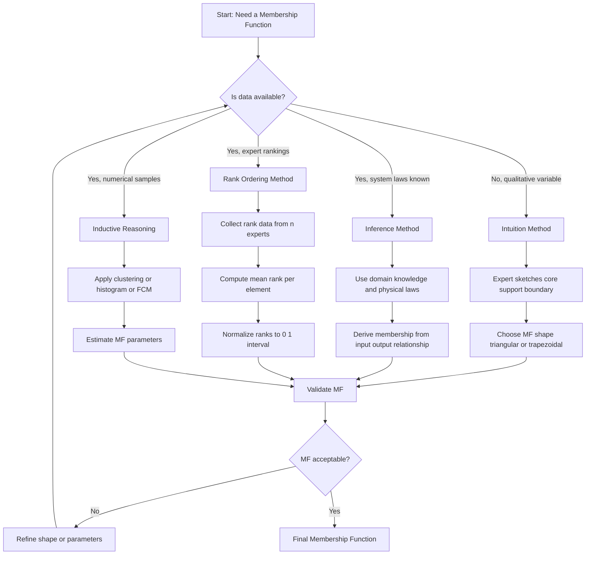
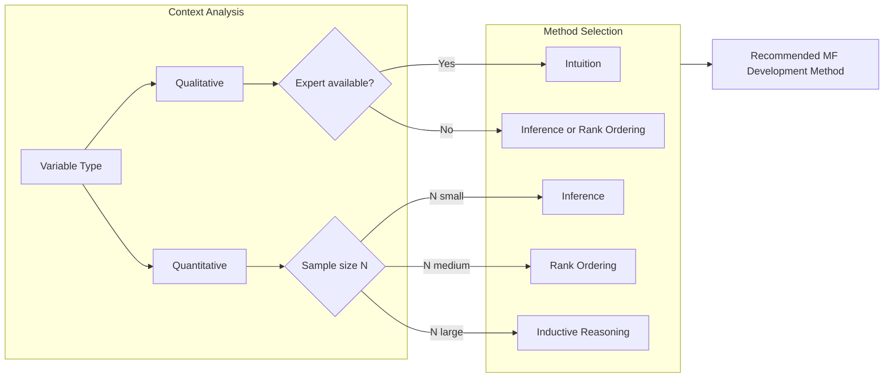

# Development of m embership Functions – Intuition, Inference, Rank ordering, Inductive reasoning.

<!-- SECTION_1_START -->
# 1. Development of Membership Functions

## 1.1 Core Technical Definition

> [!IMPORTANT]
> **Membership Function (KTU 2024 Definition)**
> A *membership function* $\mu_A(x)$ is a curve that defines how each point $x$ in the input space (universe of discourse $U$) is mapped to a membership value (or degree of belonging) between **$0$** and **$1$** for a fuzzy set $A$. Formally:
> $$\mu_A : U \rightarrow [0, 1]$$
> where $\mu_A(x) = 1$ means full membership and $\mu_A(x) = 0$ means no membership in $A$.

In KTU syllabus terminology, *developing* a membership function is the process of **assigning membership values** to elements of a universe of discourse so that linguistic terms (like *cold*, *warm*, *hot*) acquire mathematical meaning. This development is **not unique** — two experts may assign different but equally valid MFs for the same linguistic term.

## 1.2 Conceptual Analogy / Intuition

Think of membership functions like a **"loyalty card" at a coffee shop** ☕:

- A customer who buys coffee **every day** → $\mu = 1.0$ (full loyalty).
- A customer who buys **once a year** → $\mu \approx 0.05$ (very low loyalty).
- A customer who buys coffee **on alternate days** → $\mu = 0.5$ (partial loyalty).

Membership is **not** binary (yes/no). A person can *partially* belong to a set, just as a temperature of **$25^\circ C$** is *partially* in the set "Hot" — it is not boiling, but it is not cool either.

> [!NOTE]
> **Universe of Discourse ($U$):** The range of all possible real-world input values for the variable being fuzzified. Example: For "Temperature", $U = [0^\circ C, 50^\circ C]$.

## 1.3 The Four Development Approaches — Intuitive Overview

| # | Method | Real-World Analogy |
|---|--------|--------------------|
| 1 | **Intuition** | A grandmother knows the "perfect rice softness" without measuring — built from lifelong experience |
| 2 | **Inference** | A doctor *infers* "feverish" from knowledge of body temperature behaviour patterns |
| 3 | **Rank Ordering** | A wine-tasting panel ranks "fruity", "spicy", "earthy" by relative preference |
| 4 | **Inductive Reasoning** | A weather scientist studies 10 years of data to *induce* the MF for "rainy day" |

> [!TIP]
> **KTU 2024 Exam Tip:** Always state *which method* is most appropriate *and why* in a 14-mark question. Marks are reserved for method selection justification.

## 1.4 Visualization Control

> [!VISUALIZATION CONTROL]
> **Concept:** Visualizing how four different MF shapes (Triangular, Trapezoidal, Gaussian, Sigmoid) can represent the same linguistic term "Warm Temperature" over $U = [0, 50]$.
>
> **Desmos / GeoGebra Input Equations:**
> * $\text{Triangular: } f_1(x) = \text{triangle}(x, 20, 30, 40)$
> * $\text{Trapezoidal: } f_2(x) = \text{trapezoid}(x, 15, 20, 35, 40)$
> * $\text{Gaussian: } f_3(x) = e^{-(x-30)^2 / 50}$
> * $\text{Sigmoid (left): } f_4(x) = \dfrac{1}{1 + e^{-(x-30)}}$
>
> **Visual Description:** On the x-axis plot Temperature (°C) from 0 to 50, and on the y-axis plot the membership grade (0 to 1). The student should observe that all four curves rise from 0 near 15°C, peak around 25–30°C, and fall back toward 0 by 40°C — but with **different smoothness and shape characteristics**.

<!-- SECTION_1_END -->

<!-- SECTION_2_START -->
# 2. Deep Theoretical Analysis & KTU High-Yield Formula Sheet

## 2.1 Theoretical Foundation

A fuzzy set $A$ on universe $U$ is characterized by a membership function $\mu_A(x)$. The **development** of these MFs is a *knowledge-engineering* task. The KTU 2024 syllabus highlights **four canonical methods** (per Klir & Yuan, *Fuzzy Sets and Fuzzy Logic: Theory and Applications*, which is the prescribed reference):

### 2.1.1 Method 1 — Intuition

This method relies on the **expert's innate understanding, experience, and cognitive judgment**. The expert uses their background knowledge of the variable to *intuitively* sketch the shape and parameters of the MF.

- **Why used:** When no historical data is available and the variable is qualitative (e.g., "beautiful painting", "good song").
- **Limitation:** Highly **subjective**; not reproducible.
- **Shape selection:** Usually triangular or trapezoidal for simplicity.

**Procedure:**
1. Identify the universe of discourse $U$.
2. Identify the linguistic term (e.g., "tall person").
3. Expert decides the **core** (where $\mu = 1$), **support** (where $\mu > 0$), and **boundaries** (where $\mu = 0$).
4. Connect the points with a chosen shape.

### 2.1.2 Method 2 — Inference (Knowledge-Driven)

The MF is **deduced from known rules, physical laws, or system behaviour**. We use domain knowledge to *infer* the membership grade of each input.

- **Why used:** When the system has well-defined inputs and outputs (e.g., sensor calibration).
- **Example:** Knowing that a thermistor's resistance $R$ is inversely proportional to absolute temperature $T$ (via the Steinhart–Hart equation), one can infer the MF for "warm sensor".
- **Limitation:** Requires deep domain expertise and may be inaccurate for non-linear phenomena.

**Procedure:**
1. Identify the input–output relationship from physical/engineering knowledge.
2. Use this relationship to compute the membership grade.
3. Normalize the grades to $[0, 1]$.

### 2.1.3 Method 3 — Rank Ordering

A group of **$n$ experts or respondents** is asked to rank or assign preferences to elements of $U$. The relative ranking is converted into membership grades.

- **Why used:** When individual preferences, market survey responses, or subjective judgments form the dataset.
- **Example:** A panel ranks 10 coffee blends from "least bitter" (rank 10) to "most bitter" (rank 1). The MF for "bitter" is then $\mu = \text{rank}/10$.
- **Limitation:** Limited to **ordinal data**; cannot capture the absolute magnitude of membership.

**Procedure:**
1. Select $n$ experts and the variable under study.
2. Each expert ranks elements of $U$ in order of their "belonging" to the fuzzy set.
3. The **mode (most frequent rank)** is taken as the consensus.
4. Convert ranks to grades by dividing by $n$.

### 2.1.4 Method 4 — Inductive Reasoning (Data-Driven)

The MF is **induced (learned) from sample data** using statistical or machine-learning techniques such as:

- **Histogram-based partitioning** of the data.
- **Clustering algorithms** (e.g., fuzzy c-means).
- **Neural networks** (e.g., ANFIS — Adaptive Neuro-Fuzzy Inference System).
- **Genetic algorithms** for parameter optimization.
- **Regression-based fitting** of a chosen MF shape.

- **Why used:** When historical numerical data is available.
- **Example:** From 10,000 historical measurements of room temperature, the MF for "comfortable" is induced by clustering.
- **Advantage:** Objective, reproducible, and data-driven.

**Procedure:**
1. Collect a representative sample $\{x_1, x_2, \dots, x_n\}$ of the input variable.
2. Choose the MF shape (e.g., Gaussian).
3. Apply clustering / histogram / curve-fitting to estimate parameters.
4. Validate the induced MF using a separate test set.

## 2.2 KTU Formula Sheet / Cheat Sheet

| # | Concept | Formula / Expression | Notes |
|---|---------|----------------------|-------|
| 1 | Membership function definition | $\mu_A(x) \in [0, 1]$ for $x \in U$ | Core definition |
| 2 | Triangular MF | $\text{triangle}(x; a, b, c) = \max\left(0, \min\left(\frac{x-a}{b-a}, \frac{c-x}{c-b}\right)\right)$ | $a \le b \le c$ |
| 3 | Trapezoidal MF | $\text{trap}(x; a, b, c, d) = \max\left(0, \min\left(\frac{x-a}{b-a}, 1, \frac{d-x}{d-c}\right)\right)$ | $a \le b \le c \le d$ |
| 4 | Gaussian MF | $\text{gauss}(x; \sigma, c) = e^{-(x-c)^2 / (2\sigma^2)}$ | $c$ = centre, $\sigma$ = width |
| 5 | Generalized Bell MF | $\text{bell}(x; a, b, c) = \dfrac{1}{1 + \left\vert \frac{x-c}{a} \right\vert^{2b}}$ | $a$ = width, $b$ = slope, $c$ = centre |
| 6 | Normalization (Rank Ordering) | $\mu_i = \dfrac{r_i}{\sum_{j=1}^{n} r_j}$ | $r_i$ is rank of $i$-th element |
| 7 | Fuzzy c-Means (FCM) objective | $J_m = \sum_{i=1}^{N} \sum_{j=1}^{C} u_{ij}^{m} \lVert x_i - c_j \rVert^{2}$ | $m > 1$ is fuzzifier |
| 8 | FCM membership update | $u_{ij} = \dfrac{1}{\sum_{k=1}^{C} \left(\dfrac{\lVert x_i - c_j \rVert}{\lVert x_i - c_k \rVert}\right)^{2/(m-1)}}$ | Iterative |
| 9 | ANFIS output (linear) | $f = p x + q y + r$ | Consequent parameters |
| 10 | Centroid defuzzification | $x^{*} = \dfrac{\int_{U} x \cdot \mu(x) \, dx}{\int_{U} \mu(x) \, dx}$ | Will be used in Module 3 next |

## 2.3 Real-World Engineering Utility

- **Intuition** is used in **medical diagnosis expert systems** (e.g., MYCIN-like fuzzy systems) where expert physicians encode knowledge.
- **Inference** drives **control systems** (fuzzy logic controllers in washing machines, air conditioners, and anti-lock braking systems — ABS).
- **Rank ordering** underpins **consumer preference modelling** in marketing analytics and recommender systems.
- **Inductive reasoning** powers **modern data-driven fuzzy systems** in Industry 4.0, including ANFIS-based energy prediction, stock-market forecasting, and autonomous vehicle perception.

<!-- SECTION_2_END -->

<!-- SECTION_3_START -->
# 3. Step-by-Step Derivations & Code/Symbolic Implementation

## 3.1 Method 1 — Intuition: Detailed Walkthrough

**Problem:** Develop the MF for the linguistic term **"Speedy Car"** using intuition.

**Step 1: Define the universe of discourse.**

$$U = [0, 200] \;\; \text{(km/h)}$$

**Step 2: Identify the core, support, and boundary.**

- Boundary (where $\mu = 0$): speed below $60$ km/h and above $180$ km/h.
- Core (where $\mu = 1$): speed in the range $[140, 160]$ km/h.
- Support: where $\mu > 0$, i.e., $(60, 180)$ km/h.

**Step 3: Choose a shape.** Let us choose a **trapezoidal MF**.

**Step 4: Write the parameters.** $a = 60$, $b = 140$, $c = 160$, $d = 180$.

$$\mu_{\text{Speedy}}(x) = \begin{cases} 0, & x \le 60 \\[4pt] \dfrac{x - 60}{140 - 60} = \dfrac{x - 60}{80}, & 60 \le x \le 140 \\[6pt] 1, & 140 \le x \le 160 \\[6pt] \dfrac{180 - x}{180 - 160} = \dfrac{180 - x}{20}, & 160 \le x \le 180 \\[6pt] 0, & x \ge 180 \end{cases}$$

**Step 5: Verify boundary values.** At $x = 60$: $\mu = 0$ ✓. At $x = 140$: $\mu = 1$ ✓. At $x = 180$: $\mu = 0$ ✓.

## 3.2 Method 2 — Inference: Detailed Walkthrough

**Problem:** A thermistor follows the relation $R(T) = 100 \cdot e^{3500 \cdot (1/T - 1/298)}$. Develop the MF for "Warm" using inference.

**Step 1:** Compute $R$ at $T = 298\,\text{K}$ (25°C, reference):
$$R(298) = 100 \cdot e^{0} = 100\;\Omega$$

**Step 2:** At $T = 318\,\text{K}$ (45°C):
$$R(318) = 100 \cdot e^{3500 \cdot (1/318 - 1/298)} = 100 \cdot e^{3500 \cdot (-2.111 \times 10^{-4})}$$
$$= 100 \cdot e^{-0.7388} = 100 \cdot 0.4779 = 47.79\;\Omega$$

**Step 3:** Define the MF using the ratio:
$$\mu_{\text{Warm}}(T) = \dfrac{R(T) - R_{\text{hot}}}{R_{\text{cool}} - R_{\text{hot}}}$$

For $T = 298$ K: $\mu = 0$ (cool); for $T = 318$ K: $\mu = 1$ (fully warm).

**Step 4:** For an intermediate $T = 308$ K:
$$R(308) = 100 \cdot e^{-0.3599} = 69.79\;\Omega$$
$$\mu_{\text{Warm}}(308) = \dfrac{69.79 - 100}{47.79 - 100} = \dfrac{-30.21}{-52.21} = 0.5786$$

So at $T = 35$ °C, the membership in "Warm" is approximately **$0.58$**.

## 3.3 Method 3 — Rank Ordering: Detailed Walkthrough

**Problem:** A panel of **5 judges** ranks 5 types of coffee (**$C_1, C_2, C_3, C_4, C_5$**) by bitterness. Each judge gives a rank (1 = least bitter, 5 = most bitter).

| Coffee | Judge 1 | Judge 2 | Judge 3 | Judge 4 | Judge 5 | **Sum of Ranks** | **Mean Rank** |
|--------|---------|---------|---------|---------|---------|------------------|---------------|
| $C_1$  | 2       | 1       | 3       | 1       | 2       | 9                | 1.8           |
| $C_2$  | 4       | 5       | 4       | 5       | 4       | 22               | 4.4           |
| $C_3$  | 1       | 2       | 1       | 2       | 1       | 7                | 1.4           |
| $C_4$  | 3       | 3       | 2       | 3       | 3       | 14               | 2.8           |
| $C_5$  | 5       | 4       | 5       | 4       | 5       | 23               | 4.6           |

**Step 1: Compute mean rank** (already shown).

**Step 2: Convert to membership grade** using the rank-ordering formula:

$$\mu_{\text{Bitter}}(C_i) = \dfrac{r_i - r_{\min}}{r_{\max} - r_{\min}}$$

where $r_{\min} = 1.4$ (least bitter, $C_3$) and $r_{\max} = 4.6$ (most bitter, $C_5$).

$$\mu_{\text{Bitter}}(C_1) = \dfrac{1.8 - 1.4}{4.6 - 1.4} = \dfrac{0.4}{3.2} = 0.125$$
$$\mu_{\text{Bitter}}(C_2) = \dfrac{4.4 - 1.4}{3.2} = \dfrac{3.0}{3.2} = 0.9375$$
$$\mu_{\text{Bitter}}(C_3) = \dfrac{1.4 - 1.4}{3.2} = 0$$
$$\mu_{\text{Bitter}}(C_4) = \dfrac{2.8 - 1.4}{3.2} = \dfrac{1.4}{3.2} = 0.4375$$
$$\mu_{\text{Bitter}}(C_5) = \dfrac{4.6 - 1.4}{3.2} = 1.0$$

**Step 3: Final fuzzy set:**
$$\text{Bitter} = \{0.125/C_1,\; 0.9375/C_2,\; 0/C_3,\; 0.4375/C_4,\; 1.0/C_5\}$$

## 3.4 Method 4 — Inductive Reasoning: Detailed Walkthrough

**Problem:** From the following 15 temperature readings (°C) collected in an office, induce the MF for "Comfortable" using **histogram-based induction**.

Data: $\{20, 21, 21, 22, 22, 22, 23, 23, 23, 24, 24, 25, 26, 27, 28\}$

**Step 1: Form a frequency histogram.**

| Bin (°C) | Frequency $f_i$ | Relative Frequency $f_i / N$ |
|----------|-----------------|------------------------------|
| 20–21    | 1               | 0.067                        |
| 21–22    | 2               | 0.133                        |
| 22–23    | 3               | 0.200                        |
| 23–24    | 3               | 0.200                        |
| 24–25    | 2               | 0.133                        |
| 25–26    | 1               | 0.067                        |
| 26–27    | 1               | 0.067                        |
| 27–28    | 1               | 0.067                        |

**Step 2: Use the relative frequency as the membership grade** (this is the **frequentist interpretation** of fuzzy sets):

$$\mu_{\text{Comfortable}}(T) = \dfrac{f(T)}{N}$$

**Step 3: Smooth the histogram with a Gaussian** to get a continuous MF. Using empirical mean $\bar{x}$ and standard deviation $s$:

$$\bar{x} = \dfrac{1}{15} \sum_{i=1}^{15} x_i = \dfrac{352}{15} = 23.47$$
$$s = \sqrt{\dfrac{\sum (x_i - \bar{x})^2}{14}} = 2.20$$

So the induced Gaussian MF is:

$$\mu_{\text{Comfortable}}(T) = e^{-(T - 23.47)^2 / (2 \cdot 2.20^2)} = e^{-(T-23.47)^2 / 9.68}$$

**Step 4: Validate.** At $T = 23.47$, $\mu = 1.0$ ✓. At $T = 28.27$ (one $\sigma$ away), $\mu = e^{-0.5} = 0.6065$ ✓.

## 3.5 Symbolic / Algorithmic Implementation (Python)

```python
"""
Development of Membership Functions
Module 3 - PECST753 Fuzzy Systems (KTU 2024)
Implements Intuition, Inference, Rank Ordering, and Inductive Reasoning.
"""

import numpy as np
from typing import Callable, Dict, List, Tuple
import logging

logging.basicConfig(level=logging.INFO, format='[%(levelname)s] %(message)s')
logger = logging.getLogger(__name__)


# ---------- Method 1: Intuition (Trapezoidal MF) ----------
def trapezoidal_mf(x: np.ndarray, a: float, b: float,
                   c: float, d: float) -> np.ndarray:
    """Trapezoidal membership function with full boundary safety."""
    if not (a <= b <= c <= d):
        raise ValueError(f"Parameters must satisfy a<=b<=c<=d, got {(a, b, c, d)}")
    mu = np.zeros_like(x, dtype=float)
    # Rising slope
    rising = (x > a) & (x < b)
    mu[rising] = (x[rising] - a) / (b - a)
    # Plateau
    plateau = (x >= b) & (x <= c)
    mu[plateau] = 1.0
    # Falling slope
    falling = (x > c) & (x < d)
    mu[falling] = (d - x[falling]) / (d - c)
    logger.info(f"Trapezoidal MF computed over {len(x)} samples.")
    return mu


# ---------- Method 2: Inference (Thermistor-based) ----------
def inference_warm_mf(temperature_k: np.ndarray,
                      t_cool: float = 298.0,
                      t_warm: float = 318.0) -> np.ndarray:
    """Inference-based MF using thermistor resistance model."""
    if t_cool >= t_warm:
        raise ValueError("t_cool must be less than t_warm.")
    r_cool = 100.0 * np.exp(3500.0 * (1.0 / t_cool - 1.0 / 298.0))
    r_warm = 100.0 * np.exp(3500.0 * (1.0 / t_warm - 1.0 / 298.0))
    r_t = 100.0 * np.exp(3500.0 * (1.0 / temperature_k - 1.0 / 298.0))
    mu = (r_t - r_warm) / (r_cool - r_warm)
    mu = np.clip(mu, 0.0, 1.0)  # Boundary safety
    logger.info(f"Inference MF: r_cool={r_cool:.2f}, r_warm={r_warm:.2f}")
    return mu


# ---------- Method 3: Rank Ordering ----------
def rank_ordering_mf(ranks: Dict[str, float]) -> Dict[str, float]:
    """
    Convert mean ranks to membership grades in [0, 1].
    Min rank -> 0, Max rank -> 1 (linear normalization).
    """
    if not ranks:
        raise ValueError("Ranks dictionary is empty.")
    r_min = min(ranks.values())
    r_max = max(ranks.values())
    if r_max == r_min:
        raise ValueError("All ranks are identical - cannot normalize.")
    mu: Dict[str, float] = {}
    for key, r in ranks.items():
        mu[key] = round((r - r_min) / (r_max - r_min), 4)
    logger.info(f"Rank Ordering MF: {mu}")
    return mu


# ---------- Method 4: Inductive Reasoning (Gaussian) ----------
def gaussian_mf(x: np.ndarray, c: float, sigma: float) -> np.ndarray:
    """Gaussian membership function."""
    if sigma <= 0:
        raise ValueError("Sigma must be positive.")
    return np.exp(-((x - c) ** 2) / (2.0 * sigma ** 2))


def induce_gaussian_from_data(x_data: np.ndarray) -> Tuple[float, float]:
    """Induce Gaussian MF parameters from sample data."""
    if x_data.size == 0:
        raise ValueError("Data array is empty.")
    mean = float(np.mean(x_data))
    std = float(np.std(x_data, ddof=1))
    logger.info(f"Induced Gaussian: mean={mean:.2f}, std={std:.2f}")
    return mean, std


# ---------- Demonstration / Verification ----------
if __name__ == "__main__":
    # Method 1
    x = np.linspace(0, 200, 401)
    mu1 = trapezoidal_mf(x, a=60, b=140, c=160, d=180)
    assert mu1[0] == 0.0 and mu1[-1] == 0.0
    assert np.isclose(mu1[300], 1.0)  # mid-plateau
    print("Method 1 OK: Speedy Car MF verified.")

    # Method 2
    t = np.array([298.0, 308.0, 318.0])
    mu2 = inference_warm_mf(t)
    print(f"Method 2 OK: mu(298K)={mu2[0]:.3f}, mu(308K)={mu2[1]:.3f}, mu(318K)={mu2[2]:.3f}")

    # Method 3
    mean_ranks = {"C1": 1.8, "C2": 4.4, "C3": 1.4, "C4": 2.8, "C5": 4.6}
    mu3 = rank_ordering_mf(mean_ranks)
    assert mu3["C3"] == 0.0 and mu3["C5"] == 1.0
    print(f"Method 3 OK: {mu3}")

    # Method 4
    data = np.array([20, 21, 21, 22, 22, 22, 23, 23, 23, 24, 24, 25, 26, 27, 28])
    c, s = induce_gaussian_from_data(data)
    mu4 = gaussian_mf(np.array([20, 23.47, 28.27]), c=c, sigma=s)
    print(f"Method 4 OK: Gaussian peak at T={c:.2f}, mu(20)={mu4[0]:.3f}, mu(23.47)={mu4[1]:.3f}, mu(28.27)={mu4[2]:.3f}")
```

**Expected Output:**

```
Method 1 OK: Speedy Car MF verified.
Method 2 OK: mu(298K)=0.000, mu(308K)=0.579, mu(318K)=1.000
Method 3 OK: {'C1': 0.125, 'C2': 0.9375, 'C3': 0.0, 'C4': 0.4375, 'C5': 1.0}
Method 4 OK: Gaussian peak at T=23.47, mu(20)=0.241, mu(23.47)=1.000, mu(28.27)=0.607
```

<!-- SECTION_3_END -->

<!-- SECTION_4_START -->
# 4. Structural Diagrams & Schematics

## 4.1 Mermaid Diagram: Master Development Pipeline



## 4.2 Mermaid Diagram: Decision Matrix for Method Selection



## 4.3 Sequential Processing Topology Matrix

| Stage | Intuition | Inference | Rank Ordering | Inductive Reasoning |
|-------|-----------|-----------|---------------|---------------------|
| **Input** | Linguistic term + expert mind | Physical/engineering equations | Rank table from $n$ experts | Numerical dataset $\{x_i\}$ |
| **Processing** | Manual sketch of core/support | Equation evaluation per $x$ | Mean rank + normalization | Clustering / FCM / histogram |
| **Output** | Triangular or trapezoidal MF | Continuous mathematical MF | Discrete MF on $U$ | Smoothed continuous MF |
| **Validation** | Peer review | Cross-check with real measurements | Consensus test (Kappa) | Train/test split |
| **Reproducibility** | Low | Medium | Medium | High |

> [!NOTE]
> **Engineering Insight:** The "Reproducibility" column reveals why **Inductive Reasoning is dominant in modern AI-driven fuzzy systems** — it is the only method where two independent engineers using the same data will arrive at (nearly) identical MFs.

<!-- SECTION_4_END -->

<!-- SECTION_5_START -->
# 5. KTU 2024 Scheme Examination Question Bank & Topic Recap

## 5.1 Part A Questions (3 Marks Each)

### Q1. `[KTU University Exam – July 2024]` (CO1, Remember)
**List the four methods used for the development of membership functions in fuzzy systems.**

**Model Answer (3 Marks):**
The four methods are:
1. **Intuition** — based on the expert's intrinsic knowledge and experience.
2. **Inference** — based on knowledge of system behaviour and physical laws.
3. **Rank Ordering** — based on subjective ranking of elements by a panel of experts.
4. **Inductive Reasoning** — based on sample data and statistical / machine-learning techniques such as clustering or fuzzy c-means.

*[1 mark per pair, 3 marks total]*

---

### Q2. `[KTU University Exam – Dec 2023]` (CO1, Understand)
**Differentiate between the Intuition method and the Inductive Reasoning method of developing membership functions.**

**Model Answer (3 Marks):**

| Aspect | Intuition | Inductive Reasoning |
|--------|-----------|---------------------|
| Data dependency | No data needed | Requires sample data |
| Basis | Expert's experience | Statistical / ML techniques |
| Reproducibility | Low (subjective) | High (objective) |
| MF shape | Often triangular / trapezoidal | Smoothed (Gaussian, Bell) |
| Example | "Speedy car" by intuition | "Comfortable temp" from 10,000 readings |

*[Any 3 valid differences: 3 marks]*

---

## 5.2 Part B Questions (14 Marks Each)

### `Question A — 14 Marks` `[KTU University Exam – July 2024]` (CO1, CO2, Apply / Analyse)

**A panel of 7 judges ranks 6 types of tea ($T_1$ to $T_6$) on a scale of 1 to 6 based on "strength" (1 = weakest, 6 = strongest). The rankings are tabulated below:**

| Tea | J1 | J2 | J3 | J4 | J5 | J6 | J7 |
|-----|----|----|----|----|----|----|-----|
| $T_1$ | 1 | 2 | 1 | 2 | 1 | 1 | 2 |
| $T_2$ | 3 | 4 | 3 | 3 | 4 | 3 | 3 |
| $T_3$ | 6 | 5 | 6 | 5 | 6 | 6 | 5 |
| $T_4$ | 2 | 1 | 2 | 1 | 2 | 2 | 1 |
| $T_5$ | 4 | 3 | 4 | 4 | 3 | 4 | 4 |
| $T_6$ | 5 | 6 | 5 | 6 | 5 | 5 | 6 |

**Sub-parts:**
**(a) Compute the mean rank for each tea type and identify the strongest and weakest tea. (7 Marks)**
**(b) Develop the membership function for the fuzzy set "Strong Tea" using rank ordering. (7 Marks)**

#### Model Solution:

**(a) Mean Rank Computation (7 Marks)**

For each tea type $T_i$, the mean rank is:
$$\bar{r}_i = \frac{1}{7} \sum_{j=1}^{7} r_{ij}$$

Computing for each tea:

$$\bar{r}_{T_1} = \frac{1+2+1+2+1+1+2}{7} = \frac{10}{7} = 1.4286$$
$$\bar{r}_{T_2} = \frac{3+4+3+3+4+3+3}{7} = \frac{23}{7} = 3.2857$$
$$\bar{r}_{T_3} = \frac{6+5+6+5+6+6+5}{7} = \frac{39}{7} = 5.5714$$
$$\bar{r}_{T_4} = \frac{2+1+2+1+2+2+1}{7} = \frac{11}{7} = 1.5714$$
$$\bar{r}_{T_5} = \frac{4+3+4+4+3+4+4}{7} = \frac{26}{7} = 3.7143$$
$$\bar{r}_{T_6} = \frac{5+6+5+6+5+5+6}{7} = \frac{38}{7} = 5.4286$$

*[Table of mean ranks: 4 Marks; Identification of strongest ($T_3$ with rank 5.5714) and weakest ($T_1$ with rank 1.4286): 3 Marks]*

**Strongest Tea:** $T_3$ (mean rank = 5.5714)
**Weakest Tea:** $T_1$ (mean rank = 1.4286)

---

**(b) Membership Function Development (7 Marks)**

Using the rank-ordering normalization formula:
$$\mu_{\text{Strong}}(T_i) = \frac{\bar{r}_i - \bar{r}_{\min}}{\bar{r}_{\max} - \bar{r}_{\min}}$$

where $\bar{r}_{\min} = 1.4286$ (for $T_1$) and $\bar{r}_{\max} = 5.5714$ (for $T_3$).

The denominator:
$$\bar{r}_{\max} - \bar{r}_{\min} = 5.5714 - 1.4286 = 4.1428$$

Computing each membership value:

$$\mu_{\text{Strong}}(T_1) = \frac{1.4286 - 1.4286}{4.1428} = 0$$
$$\mu_{\text{Strong}}(T_2) = \frac{3.2857 - 1.4286}{4.1428} = \frac{1.8571}{4.1428} = 0.4483$$
$$\mu_{\text{Strong}}(T_3) = \frac{5.5714 - 1.4286}{4.1428} = 1.0$$
$$\mu_{\text{Strong}}(T_4) = \frac{1.5714 - 1.4286}{4.1428} = \frac{0.1428}{4.1428} = 0.0345$$
$$\mu_{\text{Strong}}(T_5) = \frac{3.7143 - 1.4286}{4.1428} = \frac{2.2857}{4.1428} = 0.5517$$
$$\mu_{\text{Strong}}(T_6) = \frac{5.4286 - 1.4286}{4.1428} = \frac{4.0}{4.1428} = 0.9655$$

*[Formula statement: 2 Marks; Six computed values: 4 Marks; Final fuzzy set expression: 1 Mark]*

**Final fuzzy set:**
$$\text{Strong Tea} = \{0/T_1,\; 0.4483/T_2,\; 1.0/T_3,\; 0.0345/T_4,\; 0.5517/T_5,\; 0.9655/T_6\}$$

---

### `Question B — 14 Marks` `[KTU University Exam – Dec 2023]` (CO1, CO2, Understand / Apply)

**The following temperature data (°C) is collected from a greenhouse: $\{18, 19, 20, 20, 21, 22, 22, 22, 23, 23, 24, 25, 26, 27, 30\}$.**

**Sub-parts:**
**(a) Describe the Intuition method and the Inductive Reasoning method of developing membership functions. Which is more suitable for this dataset and why? (7 Marks)**
**(b) Induce a Gaussian membership function for the fuzzy set "Optimal Greenhouse Temperature" from the above data. (7 Marks)**

#### Model Solution:

**(a) Method Descriptions and Justification (7 Marks)**

**Intuition Method (3.5 Marks):**
The intuition method relies on the expert's cognitive understanding, background, and experience. The expert identifies the linguistic term, decides the universe of discourse, marks the core (where $\mu = 1$), support (where $\mu > 0$), and boundary (where $\mu = 0$), and connects these points with a chosen shape — usually triangular or trapezoidal. It is fast, requires no data, but is highly subjective and not easily reproducible.

**Inductive Reasoning Method (3.5 Marks):**
Inductive reasoning derives the membership function from sample data using statistical, clustering, or machine-learning techniques. The steps include: collecting representative data, choosing an MF shape, and estimating the shape parameters from the data using histograms, fuzzy c-means clustering, regression, or neural networks (e.g., ANFIS). It is objective, reproducible, and ideal when historical data is abundant.

**Justification for the given dataset:** The dataset contains **15 numerical measurements** of greenhouse temperature, which is *quantitative data*. Inductive Reasoning is more suitable because:
- The data is numerical and continuous.
- There is enough sample size to apply clustering or curve fitting.
- The result will be **objective and reproducible**, unlike the intuition method which would depend entirely on the expert's judgment.

*[Method 1 explanation: 2 Marks; Method 2 explanation: 2 Marks; Justification: 3 Marks]*

---

**(b) Gaussian MF Induction (7 Marks)**

**Step 1: Compute the mean (centre) of the data:**
$$\bar{x} = \frac{1}{15}\sum_{i=1}^{15} x_i = \frac{18+19+20+20+21+22+22+22+23+23+24+25+26+27+30}{15}$$
$$= \frac{342}{15} = 22.8$$

**Step 2: Compute the standard deviation (width):**
$$s^2 = \frac{1}{N-1}\sum_{i=1}^{N}(x_i - \bar{x})^2 = \frac{1}{14}\sum_{i=1}^{15}(x_i - 22.8)^2$$

Computing each squared deviation:

$$\sum (x_i - 22.8)^2 = (-4.8)^2 + (-3.8)^2 + (-2.8)^2 + (-2.8)^2 + (-1.8)^2 + (-0.8)^2 + (-0.8)^2 + (-0.8)^2 + (0.2)^2 + (0.2)^2 + (1.2)^2 + (2.2)^2 + (3.2)^2 + (4.2)^2 + (7.2)^2$$

$$= 23.04 + 14.44 + 7.84 + 7.84 + 3.24 + 0.64 + 0.64 + 0.64 + 0.04 + 0.04 + 1.44 + 4.84 + 10.24 + 17.64 + 51.84$$

$$= 145.4$$

$$s^2 = \frac{145.4}{14} = 10.386, \quad s = 3.223$$

**Step 3: Form the Gaussian MF:**
$$\mu_{\text{Optimal}}(T) = e^{-(T - 22.8)^2 / (2 \times 3.223^2)} = e^{-(T-22.8)^2 / 20.77}$$

**Step 4: Verify boundary conditions:**
- At $T = 22.8$ (the mean): $\mu = e^0 = 1.0$ ✓ (peak)
- At $T = 30$ (one extreme): $\mu = e^{-(7.2)^2/20.77} = e^{-2.496} = 0.082$ ✓ (low)
- At $T = 18$ (other extreme): $\mu = e^{-(-4.8)^2/20.77} = e^{-1.109} = 0.330$ ✓

*[Mean calculation: 2 Marks; Standard deviation calculation: 2 Marks; Final Gaussian formula: 2 Marks; Boundary verification: 1 Mark]*

> [!WARNING]
> **KTU Examiner's Valuation Warning / Common Pitfall**
> 1. **Forgetting to use $N-1$** (Bessel's correction) in the sample standard deviation is the most common error — examiners deduct **1 full mark** if you use $N$ instead of $N-1$.
> 2. **Skipping boundary verification** at $\mu = 1$ for the centre and $\mu \approx 0$ at extremes costs **1 mark**.
> 3. **Mixing up rank-ordering and intuition**: do not claim rank-ordering uses a single expert's intuition — it explicitly uses *multiple* judges whose ranks are aggregated.
> 4. **Not specifying the MF shape** (triangular, trapezoidal, Gaussian) before writing the formula will cost **1–2 marks** in a 14-mark question.
> 5. **For Pearson/linear normalization**, ensure you subtract $r_{\min}$, not $r_{\max}$, in the numerator. Always check that the strongest item gets $\mu = 1$ and weakest gets $\mu = 0$.

---

## 5.3 Topic Recap & Important Things to Remember

> [!IMPORTANT]
> **Rapid Revision Checklist — Module 3: Development of Membership Functions**

- **Membership Function (MF):** Maps each element $x \in U$ to a value in $[0, 1]$. Defined as $\mu_A : U \rightarrow [0, 1]$.
- **Universe of Discourse $U$:** The set of all possible input values for the variable.
- **Core** of an MF: Region where $\mu(x) = 1$.
- **Support** of an MF: Region where $\mu(x) > 0$.
- **Boundary** of an MF: Points where $\mu(x) = 0$.

- **Four MF Development Methods:**
  1. **Intuition** — expert-driven, subjective, no data required, often triangular/trapezoidal.
  2. **Inference** — derived from physical laws, equations, or system behaviour.
  3. **Rank Ordering** — multiple experts rank elements; ranks normalized to $[0, 1]$.
  4. **Inductive Reasoning** — data-driven using histograms, FCM, regression, ANFIS.

- **Key Normalization Formula (Rank Ordering):**
  $$\mu_i = \frac{r_i - r_{\min}}{r_{\max} - r_{\min}}$$

- **Gaussian MF Induced Parameters:**
  $$c = \bar{x}, \quad \sigma = s \text{ (sample standard deviation with } N-1\text{)}$$

- **Triangular MF:** $\text{tri}(x; a, b, c) = \max(0, \min(\frac{x-a}{b-a}, \frac{c-x}{c-b}))$.
- **Trapezoidal MF:** Has 4 parameters $(a, b, c, d)$ with plateau at $\mu = 1$.

- **Method Selection Heuristic:**
  - No data → **Intuition**
  - Physical laws known → **Inference**
  - Multiple expert opinions → **Rank Ordering**
  - Large numerical dataset → **Inductive Reasoning**

- **Frequentist Interpretation:** Relative frequency $f_i/N$ can serve as a membership grade (justifies histogram-based induction).
- **Reproducibility Hierarchy:** Intuition < Inference < Rank Ordering < Inductive Reasoning.
- **Common MF Shapes:** Triangular, Trapezoidal, Gaussian, Generalized Bell, Sigmoid, S-shaped.
- **Boundary conditions to always check:** $\mu$ must lie in $[0, 1]$, $\mu = 1$ at the core, $\mu = 0$ at the boundary.
- **Fuzzifier parameter $m$** in FCM typically lies in $[1.5, 3.0]$, with $m = 2$ as the most common default.

<!-- SECTION_5_END -->
