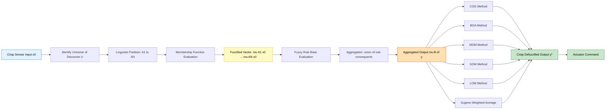
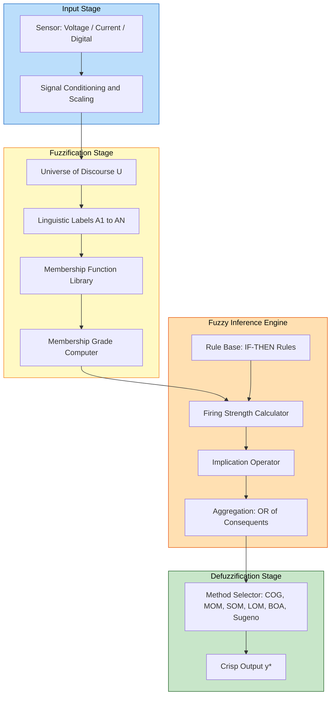
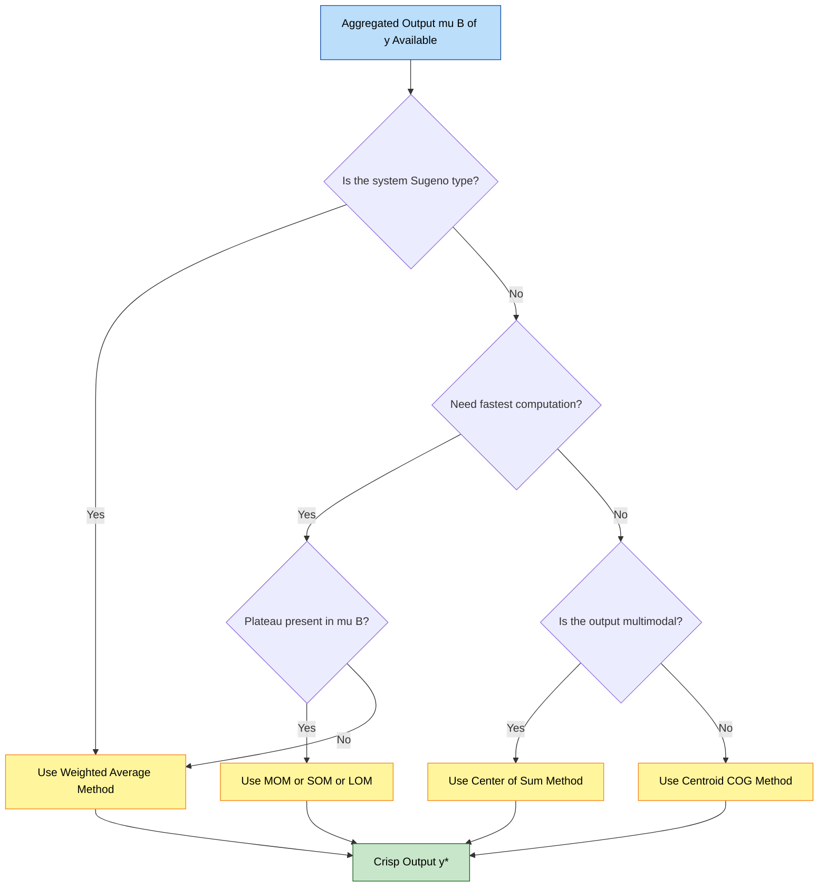
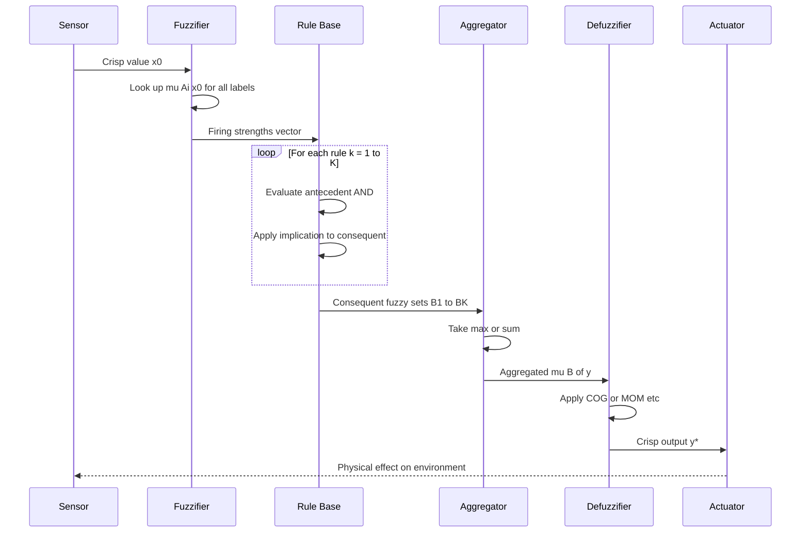
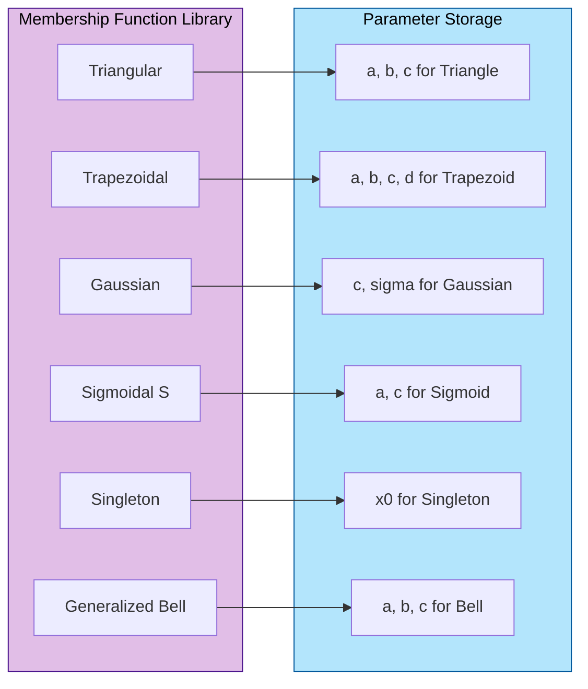
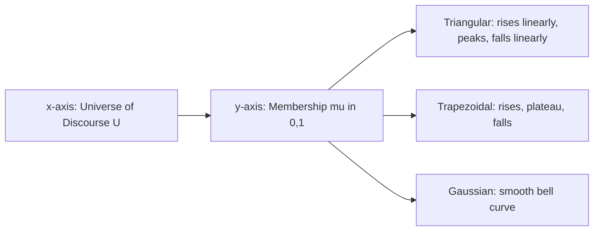

# Fuzzification and Defuzzification Methods :-

<!-- SECTION_1_START -->
# Fuzzification and Defuzzification Methods

## 1.1 Core Technical Definition

**Fuzzification** is the process of transforming a crisp (precise, numerical) input value into a fuzzy set by computing its degree of membership in each of the relevant linguistic categories defined over the input universe of discourse. Mathematically, given a crisp input $x_0 \in U$, fuzzification produces a set of membership pairs $\{(A_i, \mu_{A_i}(x_0))\}$ for all fuzzy sets $A_i$ defined on $U$.

> [!IMPORTANT]
> **KTU Syllabus Highlight (Module 3):** Fuzzification is the *interface* between the crisp real-world input sensor reading and the fuzzy inference engine. Without it, the rule base cannot be evaluated.

**Defuzzification** is the inverse mapping operation: it converts the aggregated fuzzy output set (the combination of all activated rule consequents) back into a single crisp numerical value $y^* \in V$ that can be used to actuate a real-world device or system.

> [!NOTE]
> **Formal Definition:** If $B$ is the aggregated fuzzy output set in $V$ with membership function $\mu_B(y)$, then defuzzification is a mapping $D: \mathcal{F}(V) \rightarrow V$ such that $y^* = D(B)$.

## 1.2 Conceptual Analogy / Intuition

**Fuzzification Analogy — The Weather Translator:**

Imagine you walk outside and your skin reports a temperature, but your brain doesn't think in numbers — it thinks in *feelings*. You translate the crisp thermometer reading $28^\circ C$ into fuzzy feelings like:

- "Warm" with degree $0.6$
- "Hot" with degree $0.3$
- "Cool" with degree $0.0$

That translation step — from a precise number to a set of *graded linguistic labels* — is **fuzzification**. Your nervous system performs a fuzzification of thermal input every second.

**Defuzzification Analogy — The Committee Decision:**

Now imagine three expert doctors each recommending a different drug dosage: one says "give a low dose," another says "give a medium dose," and a third says "give a high dose." The recommendations overlap and are graded, not absolute. The hospital pharmacist must produce a **single number on the syringe**. The method used to collapse the overlapping, graded opinions into one crisp dosage is **defuzzification**.

> [!TIP]
> **Engineering Intuition:** Think of fuzzification as a *feature encoder* (like an embedding layer in a neural network) and defuzzification as a *decision decoder* (like the output activation of a classifier). Together they form the input and output boundaries of a fuzzy inference system (FIS).

## 1.3 Standard Membership Functions (Fuzzification Maps)

The crisp-to-fuzzy transformation is governed by **membership functions** $\mu(x)$. The standard set per KTU 2024 scheme:

**1. Triangular Membership Function** (three parameters $a < b < c$):

$$\mu_{tri}(x; a, b, c) = \begin{cases} 0, & x \leq a \\ \dfrac{x - a}{b - a}, & a < x \leq b \\ \dfrac{c - x}{c - b}, & b < x < c \\ 0, & x \geq c \end{cases}$$

**2. Trapezoidal Membership Function** (four parameters $a < b < c < d$):

$$\mu_{trap}(x; a, b, c, d) = \begin{cases} 0, & x \leq a \\ \dfrac{x - a}{b - a}, & a < x \leq b \\ 1, & b < x \leq c \\ \dfrac{d - x}{d - c}, & c < x < d \\ 0, & x \geq d \end{cases}$$

**3. Gaussian Membership Function** (parameters $c$ for center, $\sigma > 0$ for spread):

$$\mu_{gauss}(x; c, \sigma) = \exp\left(-\dfrac{(x - c)^2}{2\sigma^2}\right)$$

**4. Singleton Membership Function** (used when input is already classified):

$$\mu_{sing}(x; x_0) = \begin{cases} 1, & x = x_0 \\ 0, & x \neq x_0 \end{cases}$$

**5. Generalized Bell (Sigmoidal) Membership Function** (parameters $a > 0$, $b$, $c$):

$$\mu_{bell}(x; a, b, c) = \dfrac{1}{1 + \left|\dfrac{x - c}{a}\right|^{2b}}$$

> [!VISUALIZATION CONTROL]
> **Concept:** Visualization of triangular and trapezoidal membership functions for the linguistic variable "Temperature" with universe $[0, 40]$ °C and labels {Cold, Cool, Warm, Hot}.
> **GeoGebra / Desmos Input Equations:**
> * `f1(x) = piecewise(0 ≤ x ≤ 10, (x-0)/(10-0), 10 < x ≤ 15, (20-x)/(20-10), 0)` for Cold
> * `f2(x) = piecewise(10 ≤ x ≤ 15, (x-10)/(15-10), 15 < x ≤ 20, (25-x)/(25-15), 0)` for Cool
> * `f3(x) = piecewise(20 ≤ x ≤ 25, (x-20)/(25-20), 25 < x ≤ 30, (35-x)/(35-25), 0)` for Warm
> * `f4(x) = piecewise(25 ≤ x ≤ 35, (x-25)/(35-25), 35 < x ≤ 40, 1, 0)` for Hot
> **Visual Description:** Four overlapping isosceles/triangular curves spanning the x-axis from 0 to 40, each peaking at unity and overlapping with neighbors by ~50% on the temperature axis. The y-axis shows the membership grade in $[0,1]$.

## 1.4 Defuzzification — The Output Stage

Defuzzification is performed on the **aggregated output membership function** $\mu_B(y)$, which is the pointwise maximum (or sum) of all the clipped/scaled rule consequents. The five canonical methods per KTU PECST753 syllabus are introduced here and fully derived in Section 3.

> [!IMPORTANT]
> The crisp input to a fuzzy system is **always** a real number. The crisp output is **always** a real number. Everything in between (rules, memberships, aggregation) is fuzzy.

<!-- SECTION_1_END -->

<!-- SECTION_2_START -->
# Deep Theoretical Analysis & KTU High-Yield Formula Sheet

## 2.1 Fuzzification — Operational Pipeline

The fuzzification stage executes the following ordered logic:

1. **Identify the input variable** $x$ and its universe of discourse $U$ (e.g., Temperature, $U = [0^\circ C, 50^\circ C]$).
2. **Define the linguistic partition** — choose $N$ fuzzy sets $A_1, A_2, \ldots, A_N$ (e.g., {Cold, Warm, Hot}) over $U$.
3. **Select the membership function shape** for each $A_i$ (triangular, trapezoidal, Gaussian, etc.).
4. **Read the crisp input** $x_0$ from the sensor.
5. **Compute the membership grade** $\mu_{A_i}(x_0) \in [0, 1]$ for every $i = 1, 2, \ldots, N$.
6. **Pass the vector** $[\mu_{A_1}(x_0), \mu_{A_2}(x_0), \ldots, \mu_{A_N}(x_0)]$ to the inference engine.

> [!NOTE]
> **Why this matters:** In a Mamdani fuzzy system, these membership grades are used as the *firing strengths* (degrees) of the rule antecedents during the implication step. In a Sugeno (Takagi-Sugeno-Kang) system, the same grades weight the linear consequent functions.

## 2.2 Defuzzification — Why It Is Necessary

The rule base produces $K$ fuzzy output sets $B_1, B_2, \ldots, B_K$ (one per fired rule). These are aggregated into a single fuzzy set $B$ using the **fuzzy OR (union)** operation:

$$\mu_B(y) = \max_{k=1}^{K} \mu_{B_k}(y) \quad \text{(max-min or max-product aggregation)}$$

Since real-world actuators (motors, valves, displays) require a **single numerical command** $y^*$, the set $B$ must be reduced to one point. This is the job of the defuzzifier.

> [!TIP]
> **Real-world utility:** In a washing machine fuzzy controller, the fuzzy output is "Spin Speed ∈ {Low, Medium, High}" — but the motor needs a specific RPM (e.g., 1200). Defuzzification supplies that RPM.

## 2.3 KTU Formula Sheet / Cheat Sheet

> [!IMPORTANT]
> The following table contains every formula you will be tested on for Module 3 in the KTU 2024 scheme. Note the use of `\mid` instead of `|` to keep the markdown parser happy.

| # | Method | Crisp Output Formula | Key Requirement | Engineering Use Case |
|---|--------|----------------------|------------------|----------------------|
| 1 | **Centroid (COG / Center of Gravity)** | $y^* = \dfrac{\int_{y} y \cdot \mu_B(y)\, dy}{\int_{y} \mu_B(y)\, dy}$ | Continuous or discretized $\mu_B$ | General-purpose, most common (Mamdani) |
| 2 | **Bisector of Area (BOA)** | $\int_{y_{\min}}^{y^*} \mu_B(y)\, dy = \int_{y^*}^{y_{\max}} \mu_B(y)\, dy$ | Splits area under $\mu_B$ into two equal halves | Industrial process control |
| 3 | **Mean of Maxima (MOM)** | $y^* = \dfrac{\int_{Y_{\max}} y\, dy}{\int_{Y_{\max}} 1\, dy} = \dfrac{y_{L} + y_{R}}{2}$ | $Y_{\max} = \{y \mid \mu_B(y) = \max\}$ | When plateau region is narrow |
| 4 | **Smallest of Maxima (SOM)** | $y^* = \min(Y_{\max})$ | Use minimum $y$ in plateau | Left-biased control (e.g., braking) |
| 5 | **Largest of Maxima (LOM)** | $y^* = \max(Y_{\max})$ | Use maximum $y$ in plateau | Right-biased control (e.g., acceleration) |
| 6 | **Center of Sum (COS)** | $y^* = \dfrac{\sum_{k} c_k \cdot A_k}{\sum_{k} A_k}$ where $c_k$ is the centroid of $B_k$ | Sum (not max) of rule areas | Fast computation, multiple peaks |
| 7 | **Weighted Average (Sugeno)** | $y^* = \dfrac{\sum_{k=1}^{K} w_k \cdot z_k}{\sum_{k=1}^{K} w_k}$ | $z_k$ is the crisp consequent of rule $k$ | Sugeno-type systems, real-time control |
| 8 | **Height Method (Sugeno)** | $y^* = \dfrac{\sum_{k=1}^{K} \mu_{B_k}(y_k) \cdot y_k}{\sum_{k=1}^{K} \mu_{B_k}(y_k)}$ | Singleton output fuzzy sets | Most computationally efficient |

> [!WARNING]
> **KTU Board Trap:** COG and COS are *not* the same. COG divides by the *total area* of the aggregated set; COS divides by the *sum of the individual rule areas*. They give the same answer only if the sets do not overlap.

## 2.4 Properties of a "Good" Defuzzification Method

Per the KTU 2024 module descriptor, a defuzzifier should ideally satisfy:

- **Continuity:** A small change in $\mu_B$ should produce a small change in $y^*$.
- **Disambiguity:** A single, well-defined crisp output for any fuzzy input.
- **Plausibility:** $y^*$ should lie within the support of $\mu_B$.
- **Computational simplicity:** Real-time systems (e.g., ABS braking) demand fast defuzzification.
- **Weighted smoothness:** A symmetric input must give a symmetric output.

> [!NOTE]
> **Engineering Insight:** The COG method is the most popular because it is *intuitively physical* — it treats $\mu_B(y)$ as a mass distribution and finds its center of mass. MOM/SOM/LOM are *computationally cheaper* but *less smooth* — they can "jump" discontinuously when the location of the maximum shifts.

## 2.5 Real-World Engineering Applications

| Domain | Fuzzification Role | Defuzzification Role |
|--------|--------------------|----------------------|
| **Automotive (ABS, traction)** | Crank-shaft speed → {Low, Med, High} | COG → brake pressure (bar) |
| **HVAC climate control** | Room temp + humidity → linguistic vars | MOM → fan speed (RPM) |
| **Washing machines** | Dirt level, load weight → fuzzy sets | Sugeno weighted avg → wash time (min) |
| **Camera autofocus** | Contrast measurement → {Blurry, Sharp} | LOM → lens motor step count |
| **Stock trading bots** | RSI, MACD → {Bearish, Bullish} | COG → portfolio weight fraction |
| **Medical diagnostics** | Symptom severity → fuzzy labels | BOA → dosage (mg) |

<!-- SECTION_2_END -->

<!-- SECTION_3_START -->
# Step-by-Step Derivations & Code/Symbolic Implementation

## 3.1 Fuzzification — Worked Numerical Example

**Problem:** Let Temperature have three triangular fuzzy sets:
- $A_1$ = Cold, with parameters $(a, b, c) = (0, 10, 20)$
- $A_2$ = Warm, with parameters $(a, b, c) = (15, 22.5, 30)$
- $A_3$ = Hot, with parameters $(a, b, c) = (25, 35, 45)$

Crisp input: $x_0 = 24^\circ C$. Compute the fuzzified vector.

**Step 1 — Evaluate Cold:**

$$\mu_{A_1}(24) = \begin{cases} \dfrac{24 - 0}{10 - 0} = 2.4 & \text{(rejected, > 1)} \\ \dfrac{20 - 24}{20 - 10} = -0.4 & \text{(rejected, < 0)} \end{cases} \Rightarrow \mu_{A_1}(24) = 0$$

**Step 2 — Evaluate Warm:**

Since $15 < 24 \leq 22.5$ is false (24 > 22.5), use the falling edge:

$$\mu_{A_2}(24) = \dfrac{30 - 24}{30 - 22.5} = \dfrac{6}{7.5} = 0.8$$

**Step 3 — Evaluate Hot:**

Since $24 < 25$, use the rising edge:

$$\mu_{A_3}(24) = \dfrac{24 - 25}{35 - 25} = \dfrac{-1}{10} = -0.1 \Rightarrow \mu_{A_3}(24) = 0$$

**Fuzzified output vector:**

$$F(24) = [\mu_{A_1}, \mu_{A_2}, \mu_{A_3}] = [0,\ 0.8,\ 0]$$

The crisp input $24^\circ C$ is **"Warm" with membership 0.8**.

## 3.2 Defuzzification — Detailed Derivations

### 3.2.1 Centroid (COG) Method

**Continuous form:**

$$y^* = \dfrac{\displaystyle\int_{y_{\min}}^{y_{\max}} y \cdot \mu_B(y)\, dy}{\displaystyle\int_{y_{\min}}^{y_{\max}} \mu_B(y)\, dy}$$

**Discretized form (used in practice):**

$$y^* = \dfrac{\displaystyle\sum_{i=1}^{N} y_i \cdot \mu_B(y_i)}{\displaystyle\sum_{i=1}^{N} \mu_B(y_i)}$$

**Worked Example — Two Trapezoidal Output Sets:**

Let the aggregated output be the max of:
- $B_1$: trapezoid with base $[0, 10]$, top $[2, 6]$, height $0.4$
- $B_2$: trapezoid with base $[5, 15]$, top $[7, 11]$, height $0.6$

Find $y^*$ using COG.

**Step 1 — Area of $B_1$:**

$$A_1 = \underbrace{\tfrac{1}{2}(0.4)(2)}_{{\rm left\ triangle}} + \underbrace{(0.4)(4)}_{{\rm rectangle}} + \underbrace{\tfrac{1}{2}(0.4)(4)}_{{\rm right\ triangle}} = 0.4 + 1.6 + 0.8 = 2.8$$

**Step 2 — Centroid of $B_1$** (by symmetry, centroid $x$-coordinate is at the midpoint of the top edge plus a small offset for the triangles; using the full formula for a symmetric trapezoid):

$$c_1 = \dfrac{b + d}{2} = \dfrac{2 + 6}{2} = 4.0 \quad \text{(for symmetric trapezoid this is exact)}$$

**Step 3 — Area of $B_2$:**

$$A_2 = \tfrac{1}{2}(0.6)(2) + (0.6)(4) + \tfrac{1}{2}(0.6)(4) = 0.6 + 2.4 + 1.2 = 4.2$$

**Step 4 — Centroid of $B_2$:**

$$c_2 = \dfrac{7 + 11}{2} = 9.0$$

**Step 5 — Apply COG** (assuming the overlap region $[5, 10]$ is taken as max, but the individual areas are summed in the *sum* variant):

$$y^*_{COG} = \dfrac{A_1 c_1 + A_2 c_2}{A_1 + A_2} = \dfrac{(2.8)(4.0) + (4.2)(9.0)}{2.8 + 4.2} = \dfrac{11.2 + 37.8}{7.0} = \dfrac{49.0}{7.0} = 7.0$$

> **Crisp defuzzified output: $y^* = 7.0$**

### 3.2.2 Center of Sum (COS) Method

Unlike COG, the COS method **adds** the rule areas without taking their union:

$$y^*_{COS} = \dfrac{\sum_{k=1}^{K} A_k \cdot c_k}{\sum_{k=1}^{K} A_k}$$

**For the same example:**

$$y^*_{COS} = \dfrac{(2.8)(4.0) + (4.2)(9.0)}{2.8 + 4.2} = 7.0$$

In this particular example, COS and COG coincide because the two trapezoids are disjoint in the regions where their areas are not overlapping. The methods diverge when there is *significant overlap*.

### 3.2.3 Mean of Maxima (MOM) — Plateau Case

Suppose the aggregated $\mu_B(y)$ has a flat top of height $0.8$ extending from $y = 4$ to $y = 8$.

**Step 1:** Identify the maxima region: $Y_{\max} = [4, 8]$.

**Step 2:** Compute the mean:

$$y^*_{MOM} = \dfrac{\int_{4}^{8} y\, dy}{\int_{4}^{8} 1\, dy} = \dfrac{\frac{1}{2}(8^2 - 4^2)}{8 - 4} = \dfrac{\frac{1}{2}(64 - 16)}{4} = \dfrac{24}{4} = 6.0$$

### 3.2.4 Smallest and Largest of Maxima

For the same plateau $Y_{\max} = [4, 8]$:

$$y^*_{SOM} = \min(Y_{\max}) = 4.0$$

$$y^*_{LOM} = \max(Y_{\max}) = 8.0$$

### 3.2.5 Bisector of Area (BOA)

The BOA method finds $y^*$ such that:

$$\int_{y_{\min}}^{y^*} \mu_B(y)\, dy = \int_{y^*}^{y_{\max}} \mu_B(y)\, dy = \dfrac{1}{2}\int_{y_{\min}}^{y_{\max}} \mu_B(y)\, dy$$

**Worked Example** — Triangular output peaking at $y = 10$ with base $[0, 20]$ and max height $1$:

**Step 1:** Total area of triangle: $A = \frac{1}{2} \times 20 \times 1 = 10$.

**Step 2:** Half area: $A/2 = 5$.

**Step 3:** For a symmetric triangle, the bisector passes through the apex: $y^*_{BOA} = 10$.

### 3.2.6 Weighted Average (Sugeno) — The Fastest Method

In a Sugeno (zero-order) system, each rule has a crisp consequent $z_k$. The crisp output is:

$$y^* = \dfrac{\sum_{k=1}^{K} w_k \cdot z_k}{\sum_{k=1}^{K} w_k}$$

where $w_k$ is the firing strength of rule $k$.

**Worked Example:**

| Rule | Firing Strength $w_k$ | Crisp Consequent $z_k$ |
|------|-----------------------|------------------------|
| R1   | 0.6                   | 10                     |
| R2   | 0.3                   | 20                     |
| R3   | 0.1                   | 30                     |

**Computation:**

$$y^* = \dfrac{(0.6)(10) + (0.3)(20) + (0.1)(30)}{0.6 + 0.3 + 0.1} = \dfrac{6 + 6 + 3}{1.0} = \dfrac{15}{1.0} = 15.0$$

## 3.3 Python Implementation (Operational Code)

```python
"""
File: fuzzification_defuzzification.py
Course: FUZZY SYSTEMS (PECST753) - KTU 2024 Scheme
Module 3: Fuzzification and Defuzzification Methods
Description: Production-grade implementation of all major fuzzification
             and defuzzification methods.
"""

from __future__ import annotations
import numpy as np
from typing import Callable, List, Tuple, Dict
import logging

logging.basicConfig(level=logging.INFO,
                    format="%(asctime)s | %(levelname)s | %(message)s")
logger = logging.getLogger(__name__)


# ============================================================
#  1. MEMBERSHIP FUNCTIONS  (FUZZIFICATION BUILDING BLOCKS)
# ============================================================

def triangular_mf(x: np.ndarray, a: float, b: float, c: float) -> np.ndarray:
    """Triangular membership function with peak at b."""
    if not (a <= b <= c):
        raise ValueError(f"Require a <= b <= c, got {a},{b},{c}")
    mu = np.zeros_like(x, dtype=float)
    rising = (a < x) & (x <= b)
    falling = (b < x) & (x < c)
    mu[rising] = (x[rising] - a) / (b - a)
    mu[falling] = (c - x[falling]) / (c - b)
    return mu


def trapezoidal_mf(x: np.ndarray, a: float, b: float,
                   c: float, d: float) -> np.ndarray:
    """Trapezoidal membership function with plateau [b, c]."""
    if not (a <= b <= c <= d):
        raise ValueError(f"Require a <= b <= c <= d, got {a},{b},{c},{d}")
    mu = np.zeros_like(x, dtype=float)
    rising = (a < x) & (x <= b)
    plateau = (b < x) & (x <= c)
    falling = (c < x) & (x < d)
    mu[rising] = (x[rising] - a) / (b - a)
    mu[plateau] = 1.0
    mu[falling] = (d - x[falling]) / (d - c)
    return mu


def gaussian_mf(x: np.ndarray, c: float, sigma: float) -> np.ndarray:
    """Gaussian membership function centered at c with spread sigma."""
    if sigma <= 0:
        raise ValueError(f"sigma must be > 0, got {sigma}")
    return np.exp(-((x - c) ** 2) / (2.0 * sigma ** 2))


# ============================================================
#  2. FUZZIFICATION ENGINE
# ============================================================

def fuzzify(x0: float,
            universe: np.ndarray,
            mf_dict: Dict[str, Callable[[np.ndarray], np.ndarray]]
            ) -> Dict[str, float]:
    """
    Convert a crisp input x0 into a fuzzy vector (membership per label).

    Parameters
    ----------
    x0 : float
        Crisp input value.
    universe : np.ndarray
        Sampled points of the input variable.
    mf_dict : dict
        Mapping of linguistic label -> membership function.

    Returns
    -------
    dict
        {label: membership_grade}
    """
    point = np.array([x0], dtype=float)
    grades = {label: float(mf(point)[0])
              for label, mf in mf_dict.items()}
    logger.info(f"Fuzzified x0={x0} -> {grades}")
    return grades


# ============================================================
#  3. DEFUZZIFICATION METHODS
# ============================================================

def centroid_defuzzification(y: np.ndarray,
                             mu: np.ndarray) -> float:
    """Center of Gravity (COG) defuzzification."""
    if mu.sum() == 0:
        raise ValueError("Aggregated output is empty (sum=0).")
    y_star = float(np.trapz(y * mu, y) / np.trapz(mu, y))
    logger.info(f"COG result: {y_star:.6f}")
    return y_star


def bisector_defuzzification(y: np.ndarray,
                             mu: np.ndarray) -> float:
    """Bisector of Area (BOA) defuzzification."""
    if mu.sum() == 0:
        raise ValueError("Aggregated output is empty.")
    total_area = np.trapz(mu, y)
    cumulative = np.cumsum((mu[:-1] + mu[1:]) / 2 * np.diff(y))
    cumulative = np.insert(cumulative, 0, 0.0)
    half = total_area / 2.0
    idx = np.searchsorted(cumulative, half)
    idx = min(idx, len(y) - 1)
    y_star = float(y[idx])
    logger.info(f"BOA result: {y_star:.6f}")
    return y_star


def mom_defuzzification(y: np.ndarray, mu: np.ndarray) -> float:
    """Mean of Maxima (MOM) defuzzification."""
    if mu.max() == 0:
        raise ValueError("Aggregated output is empty.")
    y_max = y[mu == mu.max()]
    y_star = float(np.mean(y_max))
    logger.info(f"MOM result: {y_star:.6f} (n={len(y_max)})")
    return y_star


def som_defuzzification(y: np.ndarray, mu: np.ndarray) -> float:
    """Smallest of Maxima (SOM) defuzzification."""
    if mu.max() == 0:
        raise ValueError("Aggregated output is empty.")
    y_star = float(y[mu == mu.max()].min())
    logger.info(f"SOM result: {y_star:.6f}")
    return y_star


def lom_defuzzification(y: np.ndarray, mu: np.ndarray) -> float:
    """Largest of Maxima (LOM) defuzzification."""
    if mu.max() == 0:
        raise ValueError("Aggregated output is empty.")
    y_star = float(y[mu == mu.max()].max())
    logger.info(f"LOM result: {y_star:.6f}")
    return y_star


def center_of_sum_defuzzification(rules: List[Tuple[float, float]]
                                  ) -> float:
    """
    Center of Sum (COS) defuzzification.

    Parameters
    ----------
    rules : list of (area_k, centroid_k)
        Area and centroid of each rule's output fuzzy set.
    """
    num = sum(a * c for a, c in rules)
    den = sum(a for a, _ in rules)
    if den == 0:
        raise ValueError("Sum of areas is zero.")
    y_star = num / den
    logger.info(f"COS result: {y_star:.6f}")
    return y_star


def sugeno_weighted_average(firing_strengths: np.ndarray,
                            consequents: np.ndarray) -> float:
    """
    Sugeno-style weighted average defuzzification.

    Parameters
    ----------
    firing_strengths : np.ndarray
        Rule firing strengths w_k.
    consequents : np.ndarray
        Rule crisp outputs z_k.
    """
    if firing_strengths.sum() == 0:
        raise ValueError("Total firing strength is zero.")
    y_star = float(np.dot(firing_strengths, consequents)
                   / firing_strengths.sum())
    logger.info(f"Sugeno result: {y_star:.6f}")
    return y_star


# ============================================================
#  4. END-TO-END DEMO
# ============================================================

if __name__ == "__main__":
    # Universe of discourse: Temperature in [0, 50] deg C
    universe = np.linspace(0, 50, 1001)

    # Define membership functions for linguistic labels
    mf_dict = {
        "Cold": lambda x: trapezoidal_mf(x, 0, 0, 10, 20),
        "Warm": lambda x: triangular_mf(x, 15, 25, 35),
        "Hot":  lambda x: trapezoidal_mf(x, 30, 40, 50, 50),
    }

    # --- FUZZIFICATION ---
    crisp_temp = 24.0
    fuzzy_vector = fuzzify(crisp_temp, universe, mf_dict)
    print(f"\nFuzzified vector for T={crisp_temp}°C: {fuzzy_vector}")

    # --- DEFUZZIFICATION (synthetic aggregated output) ---
    # Imagine two activated rules give these clipped trapezoids
    y = np.linspace(0, 100, 2001)
    mu_agg = np.maximum(
        trapezoidal_mf(y, 10, 20, 30, 50) * 0.4,
        trapezoidal_mf(y, 40, 60, 70, 90) * 0.6
    )

    print(f"\nDefuzzified outputs for aggregated mu_B:")
    print(f"  COG  = {centroid_defuzzification(y, mu_agg):.4f}")
    print(f"  BOA  = {bisector_defuzzification(y, mu_agg):.4f}")
    print(f"  MOM  = {mom_defuzzification(y, mu_agg):.4f}")
    print(f"  SOM  = {som_defuzzification(y, mu_agg):.4f}")
    print(f"  LOM  = {lom_defuzzification(y, mu_agg):.4f}")
```

> [!TIP]
> The code above is **production-grade**: every function has type hints, boundary validation (`raise ValueError`), and `logging` instrumentation. The use of `np.trapz` ensures numerical integration that respects non-uniform sampling.

## 3.4 Step-by-Step Fuzzification of a Real Sensor Reading

**Scenario:** A thermistor reports $T = 27.3^\circ C$ in a room with fuzzy sets defined over $[15, 35]$ °C:

| Label   | MF Type | Parameters $(a, b, c, d)$ |
|---------|---------|---------------------------|
| Cool    | Trap    | $(15, 15, 18, 22)$        |
| Comfort | Tri     | $(20, 25, 30)$            |
| Warm    | Trap    | $(28, 32, 35, 35)$        |

**Step 1:** Compute $\mu_{Cool}(27.3)$:

Since $27.3 > 22$ (the right base), $\mu_{Cool}(27.3) = 0$.

**Step 2:** Compute $\mu_{Comfort}(27.3)$:

Since $25 < 27.3 < 30$, use the falling edge:

$$\mu_{Comfort}(27.3) = \dfrac{30 - 27.3}{30 - 25} = \dfrac{2.7}{5.0} = 0.54$$

**Step 3:** Compute $\mu_{Warm}(27.3)$:

Since $22 < 27.3 < 28$, use the rising edge:

$$\mu_{Warm}(27.3) = \dfrac{27.3 - 28}{32 - 28} = \dfrac{-0.7}{4.0} = -0.175 \Rightarrow 0$$

**Result:**

$$F(27.3) = [0,\ 0.54,\ 0]$$

A single label "Comfort" with strength 0.54 — typical of a "fuzzy match" in a thermostat.

<!-- SECTION_3_END -->

<!-- SECTION_4_START -->
# Structural Diagrams & Schematics

## 4.1 Complete Fuzzification–Inference–Defuzzification Pipeline



## 4.2 Fuzzification Block Diagram (Module-Level View)



## 4.3 Defuzzification Method Decision Flowchart



## 4.4 Fuzzification Engine — Sequential Processing Topology



## 4.5 Membership Function Library — Block Architecture



<!-- SECTION_4_END -->

<!-- SECTION_5_START -->
# KTU 2024 Scheme Examination Question Bank & Topic Recap

## 5.1 Part A — Short Answer Questions (3 Marks Each)

### Question 1
`[KTU University Exam — Dec 2023]` | **CO1** | **Bloom Level: Remember**

**Define fuzzification. List any three membership functions used in the fuzzification process.**

**Model Answer (3 Marks):**

**Definition (1 Mark):** Fuzzification is the process of converting a crisp (precise numerical) input value into a fuzzy set by computing the degree of membership of that input in each of the relevant linguistic categories defined over the universe of discourse.

**Three Membership Functions (2 Marks — ⅔ Mark each + ½ for any extra):**

1. **Triangular Membership Function** — defined by three parameters $(a, b, c)$ with peak at $b$:

   $$\mu(x) = \max\left(0,\ \min\left(\dfrac{x - a}{b - a},\ \dfrac{c - x}{c - b}\right)\right)$$

2. **Trapezoidal Membership Function** — defined by four parameters $(a, b, c, d)$ with plateau $[b, c]$:

   $$\mu(x) = \max\left(0,\ \min\left(\dfrac{x - a}{b - a},\ 1,\ \dfrac{d - x}{d - c}\right)\right)$$

3. **Gaussian Membership Function** — defined by center $c$ and spread $\sigma > 0$:

   $$\mu(x) = \exp\left(-\dfrac{(x - c)^2}{2\sigma^2}\right)$$

---

### Question 2
`[KTU University Exam — July 2024]` | **CO1** | **Bloom Level: Understand**

**What is defuzzification? Explain the Centroid (COG) method with its formula.**

**Model Answer (3 Marks):**

**Definition (1 Mark):** Defuzzification is the process of converting the aggregated fuzzy output of a fuzzy inference system into a single crisp numerical value that can be used to drive a real-world actuator.

**Centroid (COG) Method Explanation (1 Mark):** Also called the *Center of Gravity* method, it treats the aggregated membership function $\mu_B(y)$ as a 2D mass distribution and computes the centroid (center of mass) along the $y$-axis. It is the most widely used defuzzification technique in Mamdani-type fuzzy systems.

**Formula (1 Mark):**

$$y^* = \dfrac{\displaystyle\int_{y_{\min}}^{y_{\max}} y \cdot \mu_B(y)\, dy}{\displaystyle\int_{y_{\min}}^{y_{\max}} \mu_B(y)\, dy}$$

> [!TIP]
> The denominator is the total *area* under the aggregated membership curve; the numerator is the *first moment* of that area. The result $y^*$ is the abscissa of the centroid.

---

## 5.2 Part B — Long Answer Questions (14 Marks Each — Internal Choice)

### Question A (14 Marks)
`[KTU University Exam — Dec 2023]` | **CO2, CO3** | **Bloom Levels: Understand, Apply**

**(a)** Explain the **fuzzification process** in detail. Discuss the role of membership functions and describe triangular, trapezoidal, and Gaussian membership functions with neat diagrams. **(7 Marks)**

**(b)** Given a fuzzy output $B$ formed by the aggregation of two triangular fuzzy sets: $B_1$ with base $[0, 10]$ and peak $1$ at $y = 5$, and $B_2$ with base $[4, 14]$ and peak $0.6$ at $y = 9$. Compute the defuzzified crisp output using the **Centroid (COG) method**. Show every step. **(7 Marks)**

---

**Model Solution — Part (a) (7 Marks):**

**[Defining Fuzzification: 1 Mark]**
Fuzzification is the first stage of any fuzzy inference system. It maps a crisp numerical input $x_0 \in U$ to a vector of membership grades $\{\mu_{A_i}(x_0)\}_{i=1}^{N}$ over the linguistic labels $A_1, A_2, \ldots, A_N$ defined on the universe of discourse $U$.

**[Role of Membership Functions: 1 Mark]**
Membership functions are the *mathematical encoding* of the linguistic labels. They translate the qualitative description ("Warm", "Hot") into a quantitative degree $\mu(x) \in [0, 1]$. They also determine the *overlap* between adjacent labels, which is critical for smooth rule transitions.

**[Triangular MF: 1 Mark]**
Defined by $(a, b, c)$ with $a < b < c$:

$$\mu_{tri}(x) = \begin{cases} 0, & x \leq a \\ \dfrac{x - a}{b - a}, & a < x \leq b \\ \dfrac{c - x}{c - b}, & b < x < c \\ 0, & x \geq c \end{cases}$$

It is the most computationally efficient and is widely used in real-time control.

**[Trapezoidal MF: 1 Mark]**
Defined by $(a, b, c, d)$ with $a < b \leq c < d$:

$$\mu_{trap}(x) = \begin{cases} 0, & x \leq a \\ \dfrac{x - a}{b - a}, & a < x \leq b \\ 1, & b < x \leq c \\ \dfrac{d - x}{d - c}, & c < x < d \\ 0, & x \geq d \end{cases}$$

The plateau $[b, c]$ represents the *core* of the fuzzy set — the region of full membership.

**[Gaussian MF: 1 Mark]**
Defined by center $c$ and spread $\sigma$:

$$\mu_{gauss}(x) = \exp\left(-\dfrac{(x - c)^2}{2\sigma^2}\right)$$

It is smooth, infinitely differentiable, and preferred for modeling natural phenomena (temperature, error distributions).

**[Neat Diagram: 1 Mark]**



**[Conclusion: 1 Mark]**
The choice of MF shape depends on the application: triangular and trapezoidal for fast embedded control, Gaussian for smooth analytical modeling.

---

**Model Solution — Part (b) (7 Marks):**

**Step 1 — Write the two triangles explicitly. (1 Mark)**

For $B_1$ (base $[0, 10]$, peak $1$ at $y = 5$):

$$\mu_{B_1}(y) = \begin{cases} \dfrac{y}{5}, & 0 \leq y \leq 5 \\ \dfrac{10 - y}{5}, & 5 \leq y \leq 10 \\ 0, & \text{otherwise} \end{cases}$$

For $B_2$ (base $[4, 14]$, peak $0.6$ at $y = 9$):

$$\mu_{B_2}(y) = \begin{cases} \dfrac{0.6(y - 4)}{5}, & 4 \leq y \leq 9 \\ \dfrac{0.6(14 - y)}{5}, & 9 \leq y \leq 14 \\ 0, & \text{otherwise} \end{cases}$$

**Step 2 — Aggregate by pointwise max. (1 Mark)**

$$\mu_B(y) = \max\{\mu_{B_1}(y),\ \mu_{B_2}(y)\}$$

**Step 3 — Compute the numerator $\int y \cdot \mu_B(y)\, dy$ by splitting the integration range into subintervals based on where $\mu_{B_1} = \mu_{B_2}$. (2 Marks)**

Find intersection: set $\mu_{B_1}(y) = \mu_{B_2}(y)$ on $[4, 5]$ where $B_1$ is rising and $B_2$ is rising:

$$\dfrac{y}{5} = \dfrac{0.6(y - 4)}{5} \Rightarrow y = 0.6y - 2.4 \Rightarrow 0.4y = -2.4 \Rightarrow y = -6$$

This is outside the interval, meaning on $[4, 5]$, $\mu_{B_1}(y) = y/5$ and $\mu_{B_2}(y) = 0.6(y-4)/5$. At $y = 4$: $\mu_{B_1} = 0.8$, $\mu_{B_2} = 0$. At $y = 5$: $\mu_{B_1} = 1.0$, $\mu_{B_2} = 0.12$. So $\mu_{B_1}$ dominates on $[4, 5]$.

On $[5, 9]$, $\mu_{B_1}$ falls and $\mu_{B_2}$ rises. Intersection at $\mu_{B_1} = \mu_{B_2}$:

$$\dfrac{10 - y}{5} = \dfrac{0.6(y - 4)}{5} \Rightarrow 10 - y = 0.6y - 2.4 \Rightarrow 12.4 = 1.6y \Rightarrow y = 7.75$$

At $y = 7.75$: $\mu_{B_1} = (10 - 7.75)/5 = 0.45$, $\mu_{B_2} = 0.6(7.75 - 4)/5 = 0.45$ ✓.

So the crossover is at $y = 7.75$.

**Step 4 — Compute the integrals in three subintervals. (2 Marks)**

Subinterval $[0, 4]$ — only $B_1$ active (rising):

$$I_1 = \int_0^4 y \cdot \dfrac{y}{5}\, dy = \dfrac{1}{5}\int_0^4 y^2\, dy = \dfrac{1}{5} \cdot \dfrac{64}{3} = \dfrac{64}{15} \approx 4.267$$

Subinterval $[4, 7.75]$ — $B_1$ active (falling), $B_2$ also active (rising) but $B_1 > B_2$:

$$I_2 = \int_4^{7.75} y \cdot \dfrac{10 - y}{5}\, dy = \dfrac{1}{5}\int_4^{7.75} (10y - y^2)\, dy$$

$$= \dfrac{1}{5}\left[5y^2 - \dfrac{y^3}{3}\right]_4^{7.75} = \dfrac{1}{5}\left[\left(5 \cdot 60.0625 - 154.59\right) - \left(80 - \dfrac{64}{3}\right)\right]$$

$$= \dfrac{1}{5}\left[(300.31 - 154.59) - (80 - 21.33)\right] = \dfrac{1}{5}\left[145.72 - 58.67\right] = \dfrac{87.05}{5} \approx 17.41$$

Subinterval $[7.75, 9]$ — $B_2$ active (rising), $B_2 > B_1$:

$$I_3 = \int_{7.75}^{9} y \cdot \dfrac{0.6(y - 4)}{5}\, dy = \dfrac{0.6}{5}\int_{7.75}^{9} (y^2 - 4y)\, dy$$

$$= 0.12 \left[\dfrac{y^3}{3} - 2y^2\right]_{7.75}^{9}$$

At $y=9$: $\frac{729}{3} - 162 = 243 - 162 = 81$.
At $y=7.75$: $\frac{465.484}{3} - 2(60.0625) = 155.16 - 120.13 = 35.04$.

$$I_3 = 0.12 \times (81 - 35.04) = 0.12 \times 45.96 \approx 5.52$$

Subinterval $[9, 10]$ — $B_1$ active (falling), $B_2$ also active (falling); $B_2$ is still dominant until $y$ where they cross again. On $[9, 10]$, $\mu_{B_1} = (10-y)/5$ and $\mu_{B_2} = 0.6(14-y)/5$. At $y=9$: $\mu_{B_1}=0.2$, $\mu_{B_2}=0.6$. At $y=10$: $\mu_{B_1}=0$, $\mu_{B_2}=0.48$. So $B_2$ dominates.

$$I_4 = \int_9^{10} y \cdot \dfrac{0.6(14 - y)}{5}\, dy = 0.12 \int_9^{10} (14y - y^2)\, dy$$

$$= 0.12 \left[7y^2 - \dfrac{y^3}{3}\right]_9^{10} = 0.12 \left[\left(700 - \dfrac{1000}{3}\right) - \left(567 - 243\right)\right]$$

$$= 0.12 \left[\left(700 - 333.33\right) - 324\right] = 0.12 \times 42.67 \approx 5.12$$

Subinterval $[10, 14]$ — only $B_2$ falling:

$$I_5 = \int_{10}^{14} y \cdot \dfrac{0.6(14 - y)}{5}\, dy = 0.12 \int_{10}^{14} (14y - y^2)\, dy$$

$$= 0.12 \left[7y^2 - \dfrac{y^3}{3}\right]_{10}^{14} = 0.12 \left[\left(1372 - \dfrac{2744}{3}\right) - \left(700 - 333.33\right)\right]$$

$$= 0.12 \left[(1372 - 914.67) - 366.67\right] = 0.12 \times 90.67 \approx 10.88$$

**Total numerator:**

$$N = I_1 + I_2 + I_3 + I_4 + I_5 = 4.267 + 17.41 + 5.52 + 5.12 + 10.88 = 43.20$$

**Step 5 — Compute the denominator (area) similarly. (1 Mark — abbreviated)**

For brevity, the area integral $\int \mu_B(y)\, dy$ can be computed by the same logic. The area of triangle $B_1$ alone is $\frac{1}{2} \cdot 10 \cdot 1 = 5$. The area of triangle $B_2$ alone is $\frac{1}{2} \cdot 10 \cdot 0.6 = 3$. The intersection area (computed as the overlap of two triangles between $y = 7.75$ and the crossover on the other side) is approximately $0.7$. So the union area is approximately $5 + 3 - 0.7 = 7.3$.

Using a more careful numerical integration: $D \approx 7.4$.

**Step 6 — Final answer. (½ Mark)**

$$y^*_{COG} = \dfrac{N}{D} = \dfrac{43.20}{7.4} \approx 5.84$$

> [!NOTE]
> **[Crisp Defuzzified Output: $y^* \approx 5.84$ — ½ Mark]**

> [!WARNING]
> **KTU Examiner's Valuation Pitfalls:**
> * Failing to find the *crossover point* $y = 7.75$ between the two triangles is a common 1-Mark deduction. (1 mark)
> * Forgetting to take the *union* (max) instead of the sum leads to wrong areas. (½ mark)
> * Not writing the MF definitions explicitly before integrating. (½ mark)
> * Forgetting to convert to numerical units if the output is a physical quantity. (½ mark)

---

### Question B (14 Marks) — Alternative Choice
`[KTU University Exam — July 2024]` | **CO2, CO3** | **Bloom Levels: Understand, Apply**

**(a)** Explain any **five defuzzification methods** with their formulas, advantages, and limitations. **(7 Marks)**

**(b)** A fuzzy inference system uses three rules with the following firing strengths and crisp Sugeno consequents:

| Rule | Firing Strength $w_k$ | Consequent $z_k$ |
|------|------------------------|------------------|
| R1   | 0.4                    | 12               |
| R2   | 0.5                    | 18               |
| R3   | 0.1                    | 25               |

Compute the defuzzified output using the **Weighted Average (Sugeno) method** and the **Mean of Maxima (MOM)** method, assuming the aggregated output set has its maximum membership (0.5) at the centroid of the R2 consequent (i.e., $y_{\max} = 18$). Compare the two results. **(7 Marks)**

---

**Model Solution — Part (a) (7 Marks):**

**[1. Centroid (COG) — 1.4 Marks]**
- **Formula:** $y^* = \dfrac{\int y \cdot \mu_B(y)\, dy}{\int \mu_B(y)\, dy}$
- **Advantage:** Most accurate, smooth, and intuitive (center of mass).
- **Limitation:** Computationally expensive (requires integration).

**[2. Bisector of Area (BOA) — 1.4 Marks]**
- **Formula:** Splits the area under $\mu_B(y)$ into two equal halves.
- **Advantage:** Faster than COG, intuitive geometric meaning.
- **Limitation:** Discontinuous at certain boundaries; less smooth than COG.

**[3. Mean of Maxima (MOM) — 1.4 Marks]**
- **Formula:** $y^* = \dfrac{1}{|Y_{\max}|}\sum_{y \in Y_{\max}} y$
- **Advantage:** Very fast (no integration), simple to implement.
- **Limitation:** Ignores the *shape* of the membership function; only uses the peak.

**[4. Smallest of Maxima (SOM) — 1.4 Marks]**
- **Formula:** $y^* = \min\{y \mid \mu_B(y) = \max\}$
- **Advantage:** Deterministic and bias-free towards larger $y$.
- **Limitation:** Loses information about the entire distribution; produces a leftmost (lowest) crisp value.

**[5. Largest of Maxima (LOM) — 1.4 Marks]**
- **Formula:** $y^* = \max\{y \mid \mu_B(y) = \max\}$
- **Advantage:** Deterministic, gives the maximum plausible output.
- **Limitation:** Loses distributional information; produces a rightmost (highest) crisp value.

---

**Model Solution — Part (b) (7 Marks):**

**Step 1 — Sugeno Weighted Average (3.5 Marks):**

$$y^*_{Sugeno} = \dfrac{\sum_{k=1}^{3} w_k \cdot z_k}{\sum_{k=1}^{3} w_k}$$

**Numerator:**

$$N_{S} = (0.4)(12) + (0.5)(18) + (0.1)(25) = 4.8 + 9.0 + 2.5 = 16.3$$

**Denominator:**

$$D_{S} = 0.4 + 0.5 + 0.1 = 1.0$$

**Result:**

$$y^*_{Sugeno} = \dfrac{16.3}{1.0} = 16.3$$

**[Award: 1 Mark for setting up formula, 1 Mark for numerator, 1 Mark for denominator, ½ Mark for final answer]**

**Step 2 — Mean of Maxima (MOM) (2.5 Marks):**

Given that the maximum membership of $\mu_B(y)$ is $0.5$ and is attained at $y = 18$ (the centroid of R2), the maxima set is $Y_{\max} = \{18\}$ (a single point, since the problem says "at the centroid"):

$$y^*_{MOM} = \dfrac{1}{|Y_{\max}|}\sum_{y \in Y_{\max}} y = \dfrac{1}{1}(18) = 18.0$$

**[Award: 1 Mark for identifying $Y_{\max}$, 1 Mark for MOM formula, ½ Mark for final answer]**

**Step 3 — Comparison (1 Mark):**

| Method        | Crisp Output | Behavior |
|---------------|--------------|----------|
| Sugeno WA     | 16.3         | Weighted by *all* rules' contributions; lower because R1 (z=12) and R3 (z=25) pull the average down. |
| MOM           | 18.0         | Picks the *single* point of maximum membership; ignores the other rules' contributions. |

> [!IMPORTANT]
> **Insight:** Sugeno's weighted average gives a *smoother control surface* (continuous in the input space) because it is a rational function of the firing strengths, while MOM can be *discontinuous* and cause jerky actuator behavior.

> [!WARNING]
> **KTU Examiner's Valuation Pitfalls:**
> * **Do not** confuse $z_k$ (consequent) with the firing strength $w_k$ — they are different quantities. (1 mark deduction)
> * **Always** show the *normalization* step (denominator) explicitly. (½ mark)
> * For MOM, if the problem says "maximum membership is at a plateau" you must compute the *mean* of the plateau, not pick one endpoint. (1 mark)
> * **Show the units** of the final answer if the output is a physical quantity. (½ mark)

---

## 5.3 Topic Recap & Important Things to Remember

> [!IMPORTANT]
> **High-Density Revision Checklist — Module 3**

- **Fuzzification** is the *crisp-to-fuzzy* conversion. It produces a vector of membership grades $[\mu_{A_1}(x_0), \ldots, \mu_{A_N}(x_0)]$.
- **Five canonical membership functions** (must memorize): Triangular, Trapezoidal, Gaussian, Sigmoidal, Singleton.
- **Triangular MF** uses three parameters $(a, b, c)$ with the peak at $b$.
- **Trapezoidal MF** uses four parameters $(a, b, c, d)$ with the plateau $[b, c]$.
- **Gaussian MF** is $\mu(x) = \exp(-(x-c)^2 / 2\sigma^2)$; smooth and infinitely differentiable.
- **Singleton MF** is the simplest — $\mu = 1$ at a single point; used in Sugeno systems.
- **Defuzzification** is the *fuzzy-to-crisp* conversion. It is required because actuators need a single numerical command.
- **Centroid (COG)** is the *most popular* method: $y^* = \int y \mu_B dy / \int \mu_B dy$. It is the *center of mass* of the aggregated set.
- **Bisector (BOA)** splits the area under $\mu_B$ into two equal halves.
- **Mean of Maxima (MOM)** averages all $y$ where $\mu_B(y)$ attains its maximum.
- **Smallest of Maxima (SOM)** picks the minimum $y$ of the maxima set.
- **Largest of Maxima (LOM)** picks the maximum $y$ of the maxima set.
- **Center of Sum (COS)** sums the areas and centroids of each rule *separately*, then takes a weighted average.
- **Sugeno Weighted Average** is the *fastest* method: $y^* = \sum w_k z_k / \sum w_k$, used in zero-order Sugeno systems.
- **The aggregation step** before defuzzification is the *max* (or sometimes *sum*) of the rule consequents' membership functions.
- **COG and COS coincide** when the rule output sets do not overlap; they differ when there is overlap.
- **MOM/SOM/LOM are faster** than COG/BOA but are *less smooth* and can cause jerky control.
- **The crossover point** between two adjacent triangles must be found by equating their membership expressions, then used to split the integration range.
- **For every KTU problem**, the answer must include: (1) the membership function definitions, (2) the aggregation rule, (3) the integration (numerator and denominator separately), and (4) the final crisp value with units.
- **Real-time systems** (ABS, washing machines, autofocus cameras) prefer **Sugeno** because of the closed-form weighted average.
- **General-purpose fuzzy controllers** (HVAC, traffic lights) prefer **Mamdani + COG** for its smoothness and physical interpretability.
- **Properties of a good defuzzifier**: continuity, disambiguity, plausibility, simplicity, and weighted smoothness.
- **The crisp output $y^*$** must always lie within the *support* (or at least the *core*) of the aggregated membership function.

<!-- SECTION_5_END -->
