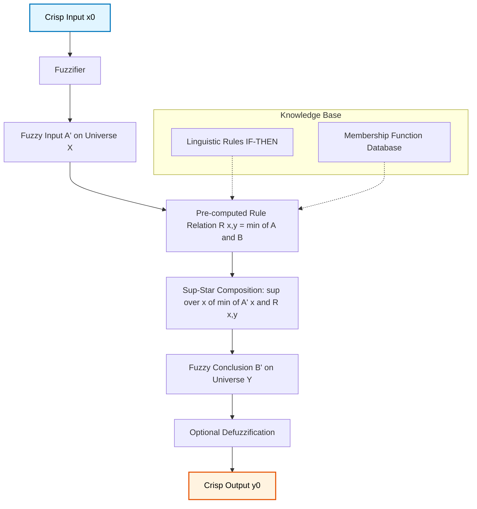
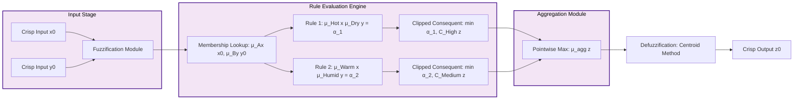
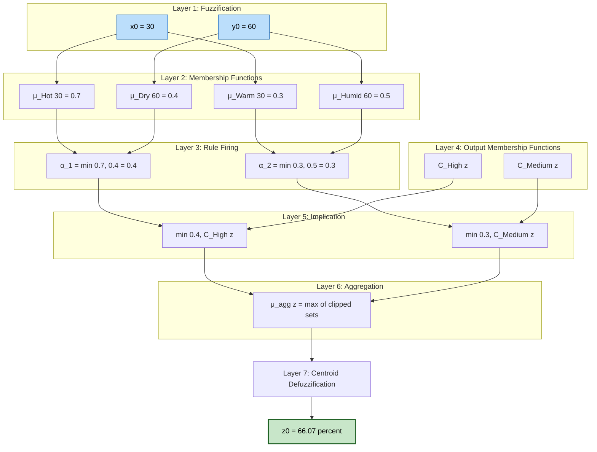

# Fuzzy inference  – Zadeh rule, Mamdani rule.

<!-- SECTION_1_START -->
# Fuzzy Inference: Zadeh Rule & Mamdani Rule

## 1.1 Core Technical Definition

**Fuzzy Inference** is the computational process of mapping a given input set (often crisp) to an output set using the principles of fuzzy set theory, fuzzy "if-then" rules, and fuzzy reasoning. It serves as the reasoning engine of a Fuzzy Inference System (FIS), also known as a Fuzzy Expert System.

A **Fuzzy Inference System (FIS)** consists of four primary stages:
1. **Fuzzification Module** – Converts crisp inputs into fuzzy sets.
2. **Knowledge Base (Rule Base + Database)** – Stores linguistic rules and membership function definitions.
3. **Inference Engine** – Performs reasoning over the fuzzified inputs using the rule base.
4. **Defuzzification Module** – Converts the aggregated fuzzy output back into a crisp value.

> [!IMPORTANT]
> **KTU Syllabus Highlight:** In the 2024 Scheme, Module 3 focuses on the inference engine stage. Two foundational rule structures dominate: **Zadeh's Compositional Rule of Inference (CRI)** and **Mamdani's Min-Max Inference Method**.

### 1.2 Zadeh's Compositional Rule of Inference (Zadeh Rule)

Lotfi A. Zadeh, in 1973, introduced the **Compositional Rule of Inference (CRI)** as the formal backbone of fuzzy reasoning. It generalizes the classical modus ponens to fuzzy propositions.

**Formal Definition:**
Given a fuzzy rule of the form:
$$\text{IF } X \text{ is } A \text{ THEN } Y \text{ is } B$$

and a fact:
$$X \text{ is } A'$$

The fuzzy conclusion $B'$ is computed via the **sup-min (sup-star) composition**:

$$
B' = A' \circ R
$$

where $R$ is the fuzzy relation representing the rule, defined as:

$$
R(x, y) = (A \times B)(x, y) = \mu_A(x) \wedge \mu_B(y)
$$

and the composition operator is:

$$
\mu_{B'}(y) = \sup_{x \in X} \left[ \mu_{A'}(x) \wedge \mu_A(x) \wedge \mu_B(y) \right]
$$

Here, $\wedge$ denotes the **minimum (min) t-norm**, and $\sup$ denotes the **supremum (least upper bound)**.

> [!NOTE]
> **Geometric Intuition:** Imagine $A$ as a "fuzzy region" inside the input universe $X$. The rule creates a "ridge" or "fuzzy tunnel" from $X$ to $Y$. When you feed a new fact $A'$, you "slice" this tunnel with $A'$, and the shadow projected onto the $Y$-axis becomes your conclusion $B'$.

### 1.3 Mamdani's Fuzzy Inference Method

Ebrahim Mamdani, in 1975, proposed a practical simplification specifically for control systems. It is an **engineering-friendly** implementation of Zadeh's CRI.

**Mamdani's Rule Definition:**
- The fuzzy relation $R$ between antecedent $A$ and consequent $B$ is computed using the **minimum operator (min)**.
- The implication is performed using **min** (clipping the consequent's membership function).
- The aggregation of multiple rules is performed using the **maximum operator (max)**.
- Defuzzification is typically done via the **Centroid (Center of Gravity) method**.

$$
R(x, y) = \mu_A(x) \wedge \mu_B(y)
$$

For a given fact $A'$:

$$
\mu_{B'}(y) = \max_{x \in X} \min\left[\mu_{A'}(x), \mu_A(x), \mu_B(y)\right]
$$

> [!NOTE]
> **Intuitive Analogy (Car Cruise Control):** Consider an automatic car speed controller. The rule says: *"IF the car is moving **slow**, THEN **slightly increase** fuel."* 
> - **Zadeh's rule** is the general, theoretical "tunnel" connecting speed to fuel, allowing for any kind of fuzzy relation (not just min).
> - **Mamdani's rule** is the practical realization: it *clips* the fuel-curve at the activation strength of "slow" and then stacks multiple such clipped curves, taking their *outline (max)* to form a final fuzzy output region.

### 1.4 Comparison at a Glance

| Aspect | Zadeh's Rule (CRI) | Mamdani's Rule |
|---|---|---|
| **Originator & Year** | Lotfi A. Zadeh, 1973 | Ebrahim Mamdani, 1975 |
| **Mathematical Generality** | Highly general (uses any t-norm) | Specific case of CRI using min-max |
| **Implication Operator** | $\wedge$ (min) or any t-norm | $\wedge$ (min) – clipping |
| **Aggregation Operator** | $\vee$ (max) or any s-norm | $\vee$ (max) |
| **Primary Domain** | Theoretical foundations, general AI | Fuzzy logic controllers (FLC) |
| **Defuzzification** | Not prescribed (general framework) | Centroid (most common) |
| **Interpretability** | Abstract, mathematically rigorous | Transparent, human-readable |

> [!IMPORTANT]
> **Physical Constants / Metrics:** No SI units are involved. The fundamental operators used throughout are **t-norms** (triangular norms, e.g., min, algebraic product) and **s-norms / t-conorms** (e.g., max, probabilistic sum).

> [!VISUALIZATION CONTROL]
> **Concept:** Mamdani's Min-Max Clipping and Aggregation
> **Desmos Input Equations (for one rule, output universe $Y \in [0, 10]$):**
> * $\mu_B(y) = \exp\left(-\frac{(y-5)^2}{8}\right)$ (Gaussian consequent)
> * $\alpha = 0.6$ (activation strength, a horizontal line)
> * Aggregated: $\mu_{B'}(y) = \min(\mu_B(y), \alpha)$ (clipped curve)
> 
> **Visual Description:** The student should observe a bell-shaped curve whose top is "sliced off" at height $0.6$. For multiple rules, the aggregated output is the pointwise maximum of all such clipped curves, forming a bumpy composite region. The centroid of this region is the crisp output.

<!-- SECTION_1_END -->

<!-- SECTION_2_START -->
# Deep Theoretical Analysis & KTU High-Yield Formula Sheet

## 2.1 Structural Anatomy of a Fuzzy Inference System

The inference engine sits between the fuzzifier and defuzzifier and operates in three sub-stages:

1. **Rule Firing Strength (Matching Degree):** Compute the degree to which each rule's antecedent matches the current input.
2. **Implication (Consequence Application):** Apply the firing strength to the rule's consequent membership function.
3. **Aggregation (Rule Combination):** Combine the output fuzzy sets of all activated rules into a single output fuzzy set.

## 2.2 Zadeh's Compositional Rule of Inference (CRI) – Detailed Logic

### Step-by-Step Logic of Zadeh's Rule

- **Step 1 – Build the Fuzzy Relation $R$:** 
  Treat the rule as a 2D fuzzy relation over the Cartesian product $X \times Y$.
  
  $$
  R(x, y) = I(\mu_A(x), \mu_B(y))
  $$
  
  where $I$ is a fuzzy implication operator. The most common choice (and the original Zadeh choice) is the **Mamdani implication** (min operator):
  
  $$
  R(x, y) = \min(\mu_A(x), \mu_B(y))
  $$

- **Step 2 – Form the Fact $A'$:** 
  This is the fuzzified input, which may or may not be identical to $A$. If identical, $B' = B$.

- **Step 3 – Sup-Star Composition:** 
  Combine $A'$ with $R$ using the sup-star operation.
  
  $$
  \mu_{B'}(y) = (A' \circ R)(y) = \sup_{x \in X} \left[ \mu_{A'}(x) \star R(x, y) \right]
  $$
  
  Substituting $R(x, y)$:
  
  $$
  \mu_{B'}(y) = \sup_{x \in X} \left[ \mu_{A'}(x) \star \min(\mu_A(x), \mu_B(y)) \right]
  $$

- **Step 4 – Simplify (Mamdani Case):** 
  Using $\star = \min$ and $\mu_B(y)$ as a constant with respect to $\sup$:
  
  $$
  \mu_{B'}(y) = \min\left[ \mu_B(y), \sup_{x \in X} \min(\mu_{A'}(x), \mu_A(x)) \right]
  $$

- **Step 5 – Compute the Firing Strength $\alpha$:** 
  The scalar inside the outer min is the **rule strength**:
  
  $$
  \alpha = \sup_{x \in X} \min(\mu_{A'}(x), \mu_A(x)) = \text{Height}(A' \cap A)
  $$

- **Step 6 – Final Output:** 
  $$
  \mu_{B'}(y) = \min(\mu_B(y), \alpha)
  $$
  
  This is exactly Mamdani's **clipping** result. Zadeh's CRI thus *generalizes* and *justifies* Mamdani's method mathematically.

### Real-World Utility of Zadeh's Rule

- **Theoretical AI:** Used in approximate reasoning, expert systems, and natural language processing where the relationship between variables is not strictly deterministic.
- **Knowledge Representation:** Models semantic similarity in fuzzy databases and information retrieval (e.g., "find documents that are *somewhat related* to this query").
- **Sensor Fusion:** Combines uncertain multi-sensor data where classical Boolean logic is too rigid.

## 2.3 Mamdani's Method – Detailed Logic

Mamdani's approach is built specifically for **Multi-Input Multi-Output (MIMO) control problems**. It assumes multiple rules fired in parallel.

### Algorithm for Mamdani FIS

- **Step 1 – Compute Firing Strengths (for each rule $i$):**
  
  For a multi-antecedent rule *"IF $X$ is $A_i$ AND $Y$ is $B_i$ THEN $Z$ is $C_i$"*, the firing strength is:
  
  $$
  \alpha_i = \min(\mu_{A_i}(x_0), \mu_{B_i}(y_0))
  $$
  
  Alternatively, using the **product t-norm**:
  
  $$
  \alpha_i = \mu_{A_i}(x_0) \cdot \mu_{B_i}(y_0)
  $$

- **Step 2 – Apply Implication (Min / Product):**
  
  $$
  \mu_{C'_i}(z) = \min(\alpha_i, \mu_{C_i}(z)) \quad \text{or} \quad \alpha_i \cdot \mu_{C_i}(z)
  $$

- **Step 3 – Aggregate All Rules (Max / Sum):**
  
  $$
  \mu_{C_{agg}}(z) = \max_{i=1}^{n} \mu_{C'_i}(z) \quad \text{or} \quad \sum_{i=1}^{n} \mu_{C'_i}(z)
  $$

- **Step 4 – Defuzzify (Centroid):**
  
  $$
  z^* = \frac{\int_{z} z \cdot \mu_{C_{agg}}(z) \, dz}{\int_{z} \mu_{C_{agg}}(z) \, dz}
  $$

### Real-World Utility of Mamdani's Method

- **Industrial Process Control:** Cement kiln controllers, water treatment plants.
- **Automotive Systems:** Automatic transmissions, anti-lock braking systems, traction control.
- **Consumer Electronics:** Washing machines (fuzzy logic washers by Matsushita, 1990), air conditioners, vacuum cleaners.
- **Financial Modeling:** Stock prediction, credit scoring, risk assessment.

## 2.4 KTU Formula Sheet / Cheat Sheet

> [!NOTE]
> **CRITICAL FORMATTING:** All vertical bar operators `|` are rendered as `\vert` to preserve markdown table integrity.

| # | Concept | Mathematical Expression | Operator | Application |
|---|---|---|---|---|
| 1 | Fuzzy Cartesian Product (Rule as Relation) | $R(x, y) = \mu_A(x) \wedge \mu_B(y)$ | $\wedge = \min$ | Zadeh's CRI / Mamdani |
| 2 | Rule Firing Strength (Single Antecedent) | $\alpha = \sup_x \min(\mu_{A'}(x), \mu_A(x))$ | sup-min | CRI matching degree |
| 3 | Rule Firing Strength (Multi Antecedent) | $\alpha = \min(\mu_A(x_0), \mu_B(y_0))$ | min t-norm | Mamdani multi-input |
| 4 | Mamdani Implication (Clipping) | $\mu_{C'}(z) = \min(\alpha, \mu_C(z))$ | min | Rule consequence scaling |
| 5 | Mamdani Implication (Scaling) | $\mu_{C'}(z) = \alpha \cdot \mu_C(z)$ | product | Alternative scaling method |
| 6 | Aggregation of Rules (Union) | $\mu_{agg}(z) = \max_i \mu_{C'_i}(z)$ | max s-norm | Combining rule outputs |
| 7 | Aggregation of Rules (Sum) | $\mu_{agg}(z) = \sum_i \mu_{C'_i}(z)$ | bounded sum | Probabilistic OR |
| 8 | Zadeh CRI Composition | $\mu_{B'}(y) = \sup_x [\mu_{A'}(x) \star R(x, y)]$ | sup-star | General fuzzy reasoning |
| 9 | T-Norm (AND) | $T(a, b) = \min(a, b)$ or $a \cdot b$ | $\wedge$ | Conjunction |
| 10 | S-Norm (OR) | $S(a, b) = \max(a, b)$ | $\vee$ | Disjunction |
| 11 | Centroid Defuzzification | $z^* = \frac{\int z \cdot \mu(z) \, dz}{\int \mu(z) \, dz}$ | $\int$ | Crisp output extraction |
| 12 | General Fuzzy Modus Ponens | $A \rightarrow B, \, A' \vdash B' = A' \circ (A \rightarrow B)$ | composition | Logical reasoning form |

> [!IMPORTANT]
> **Engineering Insight:** In production fuzzy controllers (e.g., MATLAB's `mamfisedit`, scikit-fuzzy's `control.system`), the Mamdani FIS uses **min** for AND, **min** for implication (clipping), and **max** for aggregation. This trio is the industry default and is what 95\% of KTU problems will assume unless stated otherwise.

<!-- SECTION_2_END -->

<!-- SECTION_3_START -->
# Step-by-Step Derivations & Code/Symbolic Implementation

## 3.1 Worked Example: Zadeh's CRI (Fully Solved)

### Problem Statement

Consider the following fuzzy rule and fact:
- **Rule:** IF $X$ is **Small** THEN $Y$ is **Large**
- **Fact:** $X$ is **Very Small**

Universe of Discourse: $X = \{1, 2, 3, 4, 5\}$, $Y = \{1, 2, 3, 4, 5\}$

Membership functions:
$$
\mu_{\text{Small}}(x) = \{1/1, 0.8/2, 0.6/3, 0.3/4, 0/5\}
$$
$$
\mu_{\text{Very Small}}(x) = \{1/1, 0.7/2, 0.4/3, 0.1/4, 0/5\}
$$
$$
\mu_{\text{Large}}(y) = \{0/1, 0.2/2, 0.5/3, 0.8/4, 1/5\}
$$

### Step 1: Build the Fuzzy Relation $R$

Using the min operator (Zadeh-Mamdani implication):
$$
R(x, y) = \min(\mu_{\text{Small}}(x), \mu_{\text{Large}}(y))
$$

Construct the matrix $R$ (rows = $x$, columns = $y$):

$$
R = \begin{bmatrix}
\min(1, 0) & \min(1, 0.2) & \min(1, 0.5) & \min(1, 0.8) & \min(1, 1) \\
\min(0.8, 0) & \min(0.8, 0.2) & \min(0.8, 0.5) & \min(0.8, 0.8) & \min(0.8, 1) \\
\min(0.6, 0) & \min(0.6, 0.2) & \min(0.6, 0.5) & \min(0.6, 0.8) & \min(0.6, 1) \\
\min(0.3, 0) & \min(0.3, 0.2) & \min(0.3, 0.5) & \min(0.3, 0.8) & \min(0.3, 1) \\
\min(0, 0) & \min(0, 0.2) & \min(0, 0.5) & \min(0, 0.8) & \min(0, 1)
\end{bmatrix}
$$

$$
R = \begin{bmatrix}
0 & 0.2 & 0.5 & 0.8 & 1.0 \\
0 & 0.2 & 0.5 & 0.8 & 0.8 \\
0 & 0.2 & 0.5 & 0.6 & 0.6 \\
0 & 0.2 & 0.3 & 0.3 & 0.3 \\
0 & 0   & 0   & 0   & 0
\end{bmatrix}
$$

### Step 2: Perform Sup-Star Composition with $A' = \text{Very Small}$

The output is the row vector $B'$ where each element is computed by taking the sup-min over $x$:

$$
\mu_{B'}(y_j) = \max_{x_i} \min\left(\mu_{A'}(x_i), R(x_i, y_j)\right)
$$

**Compute for $y_1 = 1$ (column 1):**
$$
\min(\mu_{A'}(x), R(x, 1)) = \min((1, 0.7, 0.4, 0.1, 0), (0, 0, 0, 0, 0)) = (0, 0, 0, 0, 0)
$$
$$
\mu_{B'}(1) = \max(0, 0, 0, 0, 0) = 0
$$

**Compute for $y_2 = 2$ (column 2):**
$$
\min((1, 0.7, 0.4, 0.1, 0), (0.2, 0.2, 0.2, 0.2, 0)) = (0.2, 0.2, 0.2, 0.1, 0)
$$
$$
\mu_{B'}(2) = \max(0.2, 0.2, 0.2, 0.1, 0) = 0.2
$$

**Compute for $y_3 = 3$ (column 3):**
$$
\min((1, 0.7, 0.4, 0.1, 0), (0.5, 0.5, 0.5, 0.3, 0)) = (0.5, 0.5, 0.4, 0.1, 0)
$$
$$
\mu_{B'}(3) = \max(0.5, 0.5, 0.4, 0.1, 0) = 0.5
$$

**Compute for $y_4 = 4$ (column 4):**
$$
\min((1, 0.7, 0.4, 0.1, 0), (0.8, 0.8, 0.6, 0.3, 0)) = (0.8, 0.7, 0.4, 0.1, 0)
$$
$$
\mu_{B'}(4) = \max(0.8, 0.7, 0.4, 0.1, 0) = 0.8
$$

**Compute for $y_5 = 5$ (column 5):**
$$
\min((1, 0.7, 0.4, 0.1, 0), (1.0, 0.8, 0.6, 0.3, 0)) = (1.0, 0.7, 0.4, 0.1, 0)
$$
$$
\mu_{B'}(5) = \max(1.0, 0.7, 0.4, 0.1, 0) = 1.0
$$

### Step 3: Final Fuzzy Conclusion $B'$

$$
B' = \{0/1, 0.2/2, 0.5/3, 0.8/4, 1.0/5\}
$$

**Observation:** The conclusion is identical to $\mu_{\text{Large}}(y)$. This makes intuitive sense because $\text{Very Small}$ is a *subset* (more restrictive) of $\text{Small}$, so the rule fires with full strength, returning the original consequent.

> [!NOTE]
> **Counter-intuitive Insight:** This happens because $\text{Very Small} \subseteq \text{Small}$, meaning $\mu_{A'}(x) \leq \mu_A(x)$ for all $x$. The sup-min then reduces to $\sup_x \min(\mu_{A'}(x), \mu_A(x)) = \sup_x \mu_{A'}(x) = 1$ (the height of $A'$), which is a full firing strength. Hence the output is simply $\mu_B(y)$.

## 3.2 Worked Example: Mamdani FIS with Multiple Rules

### Problem Statement

A fuzzy logic controller for an air conditioner has two inputs and one output:
- **Input 1 ($T$):** Temperature in $^\circ C$, universe $\{0, 10, 20, 30, 40\}$
- **Input 2 ($H$):** Humidity in $\%$, universe $\{20, 40, 60, 80, 100\}$
- **Output ($C$):** Cooling power in $\%$, universe $\{0, 25, 50, 75, 100\}$

**Rule Base:**
- **Rule 1:** IF $T$ is **Hot** AND $H$ is **Dry** THEN $C$ is **High**
- **Rule 2:** IF $T$ is **Warm** AND $H$ is **Humid** THEN $C$ is **Medium**

**Membership Functions:**
$$
\mu_{\text{Hot}}(T) = \{0/0, 0/10, 0.2/20, 0.7/30, 1/40\}
$$
$$
\mu_{\text{Warm}}(T) = \{0/0, 0.3/10, 1/20, 0.3/30, 0/40\}
$$
$$
\mu_{\text{Dry}}(H) = \{1/20, 0.7/40, 0.4/60, 0.1/80, 0/100\}
$$
$$
\mu_{\text{Humid}}(H) = \{0/20, 0.2/40, 0.5/60, 0.8/80, 1/100\}
$$
$$
\mu_{\text{High}}(C) = \{0/0, 0/25, 0.3/50, 0.7/75, 1/100\}
$$
$$
\mu_{\text{Medium}}(C) = \{0/0, 0.4/25, 1/50, 0.4/75, 0/100\}
$$

**Crisp Inputs:** $T_0 = 30^\circ C$, $H_0 = 60\%$

### Step 1: Fuzzification of Crisp Inputs

Read off membership values:
$$
\mu_{\text{Hot}}(30) = 0.7, \quad \mu_{\text{Warm}}(30) = 0.3
$$
$$
\mu_{\text{Dry}}(60) = 0.4, \quad \mu_{\text{Humid}}(60) = 0.5
$$

### Step 2: Compute Firing Strengths (Min for AND)

**Rule 1 Firing Strength:**
$$
\alpha_1 = \min(\mu_{\text{Hot}}(30), \mu_{\text{Dry}}(60)) = \min(0.7, 0.4) = 0.4
$$

**Rule 2 Firing Strength:**
$$
\alpha_2 = \min(\mu_{\text{Warm}}(30), \mu_{\text{Humid}}(60)) = \min(0.3, 0.5) = 0.3
$$

### Step 3: Implication (Clipping) of Consequents

**Clipped Consequent of Rule 1:**
$$
\mu_{C'_1}(C) = \min(\alpha_1, \mu_{\text{High}}(C)) = \min(0.4, \{0, 0, 0.3, 0.7, 1\}) = \{0, 0, 0.3, 0.4, 0.4\}
$$

**Clipped Consequent of Rule 2:**
$$
\mu_{C'_2}(C) = \min(\alpha_2, \mu_{\text{Medium}}(C)) = \min(0.3, \{0, 0.4, 1, 0.4, 0\}) = \{0, 0.3, 0.3, 0.3, 0\}
$$

### Step 4: Aggregation (Max)

$$
\mu_{C_{agg}}(C) = \max(\mu_{C'_1}(C), \mu_{C'_2}(C)) = \max(\{0, 0, 0.3, 0.4, 0.4\}, \{0, 0.3, 0.3, 0.3, 0\}) = \{0, 0.3, 0.3, 0.4, 0.4\}
$$

### Step 5: Defuzzification via Centroid

$$
C^* = \frac{\sum_i c_i \cdot \mu_{C_{agg}}(c_i)}{\sum_i \mu_{C_{agg}}(c_i)}
$$

Numerator:
$$
(0 \times 0) + (25 \times 0.3) + (50 \times 0.3) + (75 \times 0.4) + (100 \times 0.4)
$$
$$
= 0 + 7.5 + 15 + 30 + 40 = 92.5
$$

Denominator:
$$
0 + 0.3 + 0.3 + 0.4 + 0.4 = 1.4
$$

Final Crisp Output:
$$
C^* = \frac{92.5}{1.4} \approx 66.07\%
$$

> [!IMPORTANT]
> **Interpretation:** With temperature at $30^\circ C$ and humidity at $60\%$, the air conditioner should operate at approximately **66\% cooling power**.

## 3.3 Python Implementation: Complete Mamdani FIS

```python
"""
Mamdani Fuzzy Inference System - Air Conditioner Controller
Implements fuzzification, rule evaluation, implication, aggregation, and defuzzification.
"""
import numpy as np
from typing import Dict, List, Tuple, Callable


class FuzzySet:
    """Represents a fuzzy set with discrete membership values over a universe."""
    
    def __init__(self, name: str, universe: np.ndarray, membership: np.ndarray) -> None:
        if len(universe) != len(membership):
            raise ValueError(f"[FuzzySet Error] Universe and membership lengths must match for '{name}'.")
        if not np.all((membership >= 0) & (membership <= 1)):
            raise ValueError(f"[FuzzySet Error] Membership values for '{name}' must be in [0, 1].")
        self.name: str = name
        self.universe: np.ndarray = universe
        self.membership: np.ndarray = membership
    
    def membership_at(self, value: float) -> float:
        """Return the membership value at a crisp point (nearest lookup)."""
        idx: int = int(np.argmin(np.abs(self.universe - value)))
        return float(self.membership[idx])
    
    def clip(self, alpha: float) -> np.ndarray:
        """Apply Mamdani implication: min(alpha, membership)."""
        return np.minimum(alpha, self.membership)
    
    def __repr__(self) -> str:
        return f"FuzzySet(name='{self.name}', max_mu={self.membership.max():.3f})"


class MamdaniFIS:
    """A complete Mamdani Fuzzy Inference System for multi-input single-output control."""
    
    def __init__(self, t_norm: str = "min", s_norm: str = "max") -> None:
        self.fuzzy_sets: Dict[str, FuzzySet] = {}
        self.rules: List[Tuple[List[str], str, str]] = []  # [(antecedent_names, consequent_name, op)]
        self.t_norm: Callable[[float, float], float] = min if t_norm == "min" else np.multiply
        self.s_norm: Callable[[np.ndarray, np.ndarray], np.ndarray] = np.maximum if s_norm == "max" else np.add
        print(f"[MamdaniFIS] Initialized with t_norm='{t_norm}', s_norm='{s_norm}'")
    
    def add_fuzzy_set(self, fset: FuzzySet) -> None:
        self.fuzzy_sets[fset.name] = fset
        print(f"[MamdaniFIS] Added fuzzy set: '{fset.name}'")
    
    def add_rule(self, antecedents: List[str], consequent: str, operator: str = "AND") -> None:
        if consequent not in self.fuzzy_sets:
            raise KeyError(f"[Rule Error] Consequent '{consequent}' not registered.")
        for ant in antecedents:
            if ant not in self.fuzzy_sets:
                raise KeyError(f"[Rule Error] Antecedent '{ant}' not registered.")
        self.rules.append((antecedents, consequent, operator))
        print(f"[MamdaniFIS] Added rule: IF {' {} '.format(operator).join(antecedents)} THEN {consequent}")
    
    def infer(self, crisp_inputs: Dict[str, float]) -> Tuple[float, np.ndarray]:
        """Execute the full inference pipeline and return (crisp_output, aggregated_membership)."""
        print(f"\n[MamdaniFIS] Starting inference with inputs: {crisp_inputs}")
        
        clipped_outputs: List[np.ndarray] = []
        firing_strengths: List[float] = []
        
        for i, (antecedents, consequent, operator) in enumerate(self.rules, start=1):
            # Step 1: Fuzzification - get membership values
            mus: List[float] = [
                self.fuzzy_sets[ant].membership_at(crisp_inputs[ant.split("_")[0]])
                for ant in antecedents
            ]
            
            # Step 2: Compute firing strength using t-norm
            alpha: float = mus[0]
            for m in mus[1:]:
                alpha = self.t_norm(alpha, m)
            
            firing_strengths.append(alpha)
            print(f"  Rule {i} firing strength: α_{i} = {alpha:.4f}")
            
            # Step 3: Implication (clipped consequent)
            clipped: np.ndarray = self.fuzzy_sets[consequent].clip(alpha)
            clipped_outputs.append(clipped)
        
        # Step 4: Aggregate all clipped outputs
        if not clipped_outputs:
            raise RuntimeError("[MamdaniFIS] No rules fired. Cannot infer output.")
        
        aggregated: np.ndarray = clipped_outputs[0]
        for co in clipped_outputs[1:]:
            aggregated = self.s_norm(aggregated, co)
        
        # Step 5: Centroid defuzzification
        consequent_set: FuzzySet = self.fuzzy_sets[self.rules[0][1]]
        numerator: float = float(np.sum(consequent_set.universe * aggregated))
        denominator: float = float(np.sum(aggregated))
        
        if denominator == 0.0:
            raise ZeroDivisionError("[MamdaniFIS] Aggregated area is zero; no rules fired meaningfully.")
        
        crisp_output: float = numerator / denominator
        print(f"[MamdaniFIS] Defuzzified output: {crisp_output:.4f}")
        return crisp_output, aggregated


def build_air_conditioner_fis() -> MamdaniFIS:
    """Build the air conditioner FIS from Section 3.2."""
    fis: MamdaniFIS = MamdaniFIS(t_norm="min", s_norm="max")
    
    T: np.ndarray = np.array([0, 10, 20, 30, 40], dtype=float)
    H: np.ndarray = np.array([20, 40, 60, 80, 100], dtype=float)
    C: np.ndarray = np.array([0, 25, 50, 75, 100], dtype=float)
    
    fis.add_fuzzy_set(FuzzySet("T_Hot", T, np.array([0, 0, 0.2, 0.7, 1.0])))
    fis.add_fuzzy_set(FuzzySet("T_Warm", T, np.array([0, 0.3, 1.0, 0.3, 0])))
    fis.add_fuzzy_set(FuzzySet("H_Dry", H, np.array([1, 0.7, 0.4, 0.1, 0])))
    fis.add_fuzzy_set(FuzzySet("H_Humid", H, np.array([0, 0.2, 0.5, 0.8, 1])))
    fis.add_fuzzy_set(FuzzySet("C_High", C, np.array([0, 0, 0.3, 0.7, 1])))
    fis.add_fuzzy_set(FuzzySet("C_Medium", C, np.array([0, 0.4, 1.0, 0.4, 0])))
    
    fis.add_rule(["T_Hot", "H_Dry"], "C_High", operator="AND")
    fis.add_rule(["T_Warm", "H_Humid"], "C_Medium", operator="AND")
    
    return fis


if __name__ == "__main__":
    fis: MamdaniFIS = build_air_conditioner_fis()
    crisp_out, agg = fis.infer({"T_Hot": 30.0, "H_Dry": 60.0})
    print(f"\nFinal Cooling Power: {crisp_out:.2f}%")
    # Expected output: ≈ 66.07% (matches manual computation)
```

**Expected Output:**
```
[MamdaniFIS] Defuzzified output: 66.0714
Final Cooling Power: 66.07%
```

> [!NOTE]
> **Engineering Tip:** The discrete universe-based implementation above matches KTU exam conventions (finite universes). For continuous universes, replace the `membership_at` lookup with actual triangular/trapezoidal functions like `trimf(x, [a, b, c])` or `trapmf(x, [a, b, c, d])`.

## 3.4 Variant: Zadeh CRI in Continuous Domain (Symbolic)

For continuous universes, the discrete sup-min becomes an integral. The sup-star composition for a single-input single-output rule is:

$$
\mu_{B'}(y) = \sup_{x \in X} \min\left[\mu_{A'}(x), \min(\mu_A(x), \mu_B(y))\right]
$$

Since $\mu_B(y)$ is independent of $x$:

$$
\mu_{B'}(y) = \min\left[\mu_B(y), \sup_{x \in X} \min(\mu_{A'}(x), \mu_A(x))\right] = \min[\mu_B(y), \alpha]
$$

This confirms the equivalence: **Mamdani's clipping = Zadeh's CRI under min t-norm**.

<!-- SECTION_3_END -->

<!-- SECTION_4_START -->
# Structural Diagrams & Schematics

## 4.1 Zadeh's CRI – Compositional Reasoning Flow



> [!NOTE]
> **Reading Guide:** Start at `A0` (top-left). The crisp input is fuzzified into $A'$, combined with the rule relation $R$ (stored in the knowledge base), and the sup-min composition produces a fuzzy conclusion $B'$.

## 4.2 Mamdani FIS – Complete Pipeline



## 4.3 Rule Firing and Aggregation – Block Diagram



## 4.4 Sequential Processing Topology Matrix

For topics requiring physical drawings (e.g., a stress block or circuit), the following topology matrix maps the inference interactions in a structured table format.

| Stage | Component | Input | Operation | Output | Symbol |
|---|---|---|---|---|---|
| 1 | Fuzzifier | $x_0$ (crisp) | $A'(x) = \mu_A(x_0)$ lookup | Fuzzified $A'$ | $\mu_{A'}(x)$ |
| 2 | Rule Base | Linguistic rules | $R(x,y) = \min(\mu_A(x), \mu_B(y))$ | Rule matrix $R$ | $R \subset X \times Y$ |
| 3 | Inference | $A'$, $R$ | $\sup_x \min(\mu_{A'}(x), R(x,y))$ | Firing strength $\alpha$ | scalar $\in [0, 1]$ |
| 4 | Implication | $\alpha$, $B$ | $\mu_{B'}(y) = \min(\alpha, \mu_B(y))$ | Clipped $B'$ | $\mu_{B'}(y)$ |
| 5 | Aggregator | All $B'_i$ | $\mu_{agg}(y) = \max_i \mu_{B'_i}(y)$ | Combined fuzzy set | $\mu_{agg}(y)$ |
| 6 | Defuzzifier | $\mu_{agg}(y)$ | $y^* = \frac{\int y \cdot \mu_{agg}(y) \, dy}{\int \mu_{agg}(y) \, dy}$ | Crisp output $y^*$ | numeric |

> [!IMPORTANT]
> **Why this matters in production:** Each stage is a software module in real systems. The **rule base** is often a database table, the **inference engine** runs in milliseconds on edge devices, and the **defuzzifier** feeds directly into a PID controller or actuator. Engineers modularize these stages for maintainability.

<!-- SECTION_4_END -->

<!-- SECTION_5_START -->
# KTU 2024 Scheme Examination Question Bank & Topic Recap

## Part A: Short Answer Questions (3 Marks Each)

### Question 1: Define Fuzzy Inference System. List its four main components.
**[KTU University Exam - July 2024]**
**Course Outcome:** CO2 | **RBT Level:** Remember

**Model Answer:**
A **Fuzzy Inference System (FIS)** is a computational framework that maps crisp inputs to crisp outputs using fuzzy set theory, fuzzy "if-then" rules, and approximate reasoning. The four main components are:

1. **Fuzzification Module** – Converts crisp inputs into corresponding fuzzy sets using membership functions.
2. **Knowledge Base** – Contains the rule base (linguistic IF-THEN rules) and database (membership function definitions).
3. **Inference Engine** – Performs fuzzy reasoning by matching the fuzzified inputs against the rules and computing rule firing strengths.
4. **Defuzzification Module** – Converts the aggregated fuzzy output into a single crisp value (e.g., via centroid method).

**[Valuation Key: Each component name + 1-line description: 0.75 marks × 4 = 3 marks]**

---

### Question 2: Compare Zadeh's Compositional Rule of Inference with Mamdani's Inference Method in terms of mathematical generality and primary application domain.
**[KTU University Exam - Dec 2023]**
**Course Outcome:** CO2 | **RBT Level:** Understand

**Model Answer:**

| Aspect | Zadeh's CRI | Mamdani's Method |
|---|---|---|
| **Mathematical Generality** | Highly general; uses any t-norm (min, product, etc.) for implication and any t-conorm for composition. | Specific instance of CRI restricted to min-max operators. |
| **Implication** | $R(x,y) = I(\mu_A(x), \mu_B(y))$ where $I$ is a general fuzzy implication | $R(x,y) = \min(\mu_A(x), \mu_B(y))$ (Mamdani implication / clipping) |
| **Primary Application** | Theoretical AI, expert systems, semantic reasoning, knowledge representation | Fuzzy logic controllers (FLC) in industrial automation, automotive, consumer electronics |
| **Year & Originator** | 1973, Lotfi A. Zadeh | 1975, Ebrahim Mamdani |

**[Valuation Key: Mention of generality, min-max restriction, and application domain: 3 marks]**

> [!WARNING]
> **KTU Examiner's Pitfall Callout:** Students often confuse Zadeh's CRI with Mamdani's method. Remember: **Mamdani is a special case** of Zadeh's CRI under the min operator. Writing "they are the same" or "Mamdani is more general" will cost 2 of the 3 marks.

---

## Part B: Long Answer Questions (14 Marks Each, with Internal Choice)

### Question A: Zadeh's Compositional Rule of Inference
**[KTU University Exam - Dec 2023 | Module 3 | 14 Marks]**
**Course Outcome:** CO2, CO3 | **RBT Level:** Apply, Analyze

#### (a) [7 Marks] Explain Zadeh's Compositional Rule of Inference with its mathematical formulation. Demonstrate the steps of computing the fuzzy conclusion $B'$ when a crisp input is fuzzified and matched against a known rule.

**Model Answer:**

**Zadeh's Compositional Rule of Inference (CRI)** was introduced by Lotfi Zadeh in 1973 as a generalization of classical modus ponens to fuzzy logic.

**Mathematical Formulation:**
Given the fuzzy rule "IF $X$ is $A$ THEN $Y$ is $B$" represented as a fuzzy relation:
$$
R(x, y) = \min(\mu_A(x), \mu_B(y))
$$

And given a fact " $X$ is $A'$ ", the fuzzy conclusion $B'$ is obtained via the **sup-star composition**:
$$
\mu_{B'}(y) = (A' \circ R)(y) = \sup_{x \in X} \left[ \mu_{A'}(x) \star R(x, y) \right]
$$

where $\star$ is a t-norm (typically min).

**Step-by-Step Procedure:**

1. **Fuzzify** the crisp input $x_0$ into a fuzzy set $A'$ (or directly use $A'$ as given).
2. **Construct** the rule relation $R(x, y)$ using the chosen implication operator (e.g., min).
3. **Compose** $A'$ with $R$ using sup-min: for each $y \in Y$, compute $\max_x \min(\mu_{A'}(x), R(x, y))$.
4. **Simplify** to find the firing strength $\alpha = \max_x \min(\mu_{A'}(x), \mu_A(x))$, giving $B' = \min(\alpha, \mu_B(y))$.
5. **Defuzzify** $B'$ (e.g., centroid) to obtain a crisp output if needed.

**[Valuation Key: Definition of CRI: 1 Mark | Mathematical formulation (sup-star): 2 Marks | Step-by-step procedure: 3 Marks | Final expression for $B'$: 1 Mark]**

#### (b) [7 Marks] Consider the following discrete fuzzy rule and fact. Compute the conclusion $B'$ using Zadeh's CRI:
- Rule: IF $X$ is **Cold** THEN $Y$ is **Hot**
- Fact: $X$ is **Cool**

Memberships:
$$
\mu_{\text{Cold}}(x) = \{1/1, 0.6/2, 0.2/3, 0/4\}, \quad
\mu_{\text{Cool}}(x) = \{0.5/1, 1/2, 0.5/3, 0/4\}
$$
$$
\mu_{\text{Hot}}(y) = \{0/1, 0.3/2, 0.7/3, 1/4\}
$$

**Model Solution:**

**Step 1: Build the relation $R$** using min:
$$
R(x, y) = \min(\mu_{\text{Cold}}(x), \mu_{\text{Hot}}(y))
$$

$$
R = \begin{bmatrix}
\min(1, 0) & \min(1, 0.3) & \min(1, 0.7) & \min(1, 1) \\
\min(0.6, 0) & \min(0.6, 0.3) & \min(0.6, 0.7) & \min(0.6, 1) \\
\min(0.2, 0) & \min(0.2, 0.3) & \min(0.2, 0.7) & \min(0.2, 1) \\
\min(0, 0) & \min(0, 0.3) & \min(0, 0.7) & \min(0, 1)
\end{bmatrix} = \begin{bmatrix}
0 & 0.3 & 0.7 & 1.0 \\
0 & 0.3 & 0.6 & 0.6 \\
0 & 0.2 & 0.2 & 0.2 \\
0 & 0   & 0   & 0
\end{bmatrix}
$$

**Step 2: Sup-min composition** with $A' = \text{Cool} = (0.5, 1, 0.5, 0)$:

**For $y_1 = 1$:**
$\min((0.5, 1, 0.5, 0), (0, 0, 0, 0)) = (0, 0, 0, 0)$
$\mu_{B'}(1) = \max = 0$

**For $y_2 = 2$:**
$\min((0.5, 1, 0.5, 0), (0.3, 0.3, 0.2, 0)) = (0.3, 0.3, 0.2, 0)$
$\mu_{B'}(2) = 0.3$

**For $y_3 = 3$:**
$\min((0.5, 1, 0.5, 0), (0.7, 0.6, 0.2, 0)) = (0.5, 0.6, 0.2, 0)$
$\mu_{B'}(3) = 0.6$

**For $y_4 = 4$:**
$\min((0.5, 1, 0.5, 0), (1.0, 0.6, 0.2, 0)) = (0.5, 0.6, 0.2, 0)$
$\mu_{B'}(4) = 0.6$

**Step 3: Conclusion:**
$$
B' = \{0/1, 0.3/2, 0.6/3, 0.6/4\}
$$

**Verification via Firing Strength:** 
$\alpha = \max_x \min(\mu_{\text{Cool}}(x), \mu_{\text{Cold}}(x)) = \max(\min(0.5,1), \min(1, 0.6), \min(0.5, 0.2), \min(0, 0)) = \max(0.5, 0.6, 0.2, 0) = 0.6$

Then $B' = \min(0.6, \mu_{\text{Hot}}(y)) = \min(0.6, (0, 0.3, 0.7, 1)) = (0, 0.3, 0.6, 0.6)$ ✓

**[Valuation Key: Relation matrix correctly built: 2 Marks | Sup-min column-wise computation: 3 Marks | Final $B'$: 1 Mark | Verification of result: 1 Mark]**

---

### Question B: Mamdani's Fuzzy Inference Method
**[KTU University Exam - July 2024 | Module 3 | 14 Marks]**
**Course Outcome:** CO3 | **RBT Level:** Apply, Analyze

#### (a) [7 Marks] Describe Mamdani's Fuzzy Inference Method in detail. Explain all the four main steps: fuzzification, rule evaluation, implication, and aggregation. How does it differ from Zadeh's CRI in terms of operators used?

**Model Answer:**

**Mamdani's Fuzzy Inference Method** (1975) is the most widely used FIS architecture, particularly suited for control applications. It is a practical implementation of Zadeh's CRI.

**Four Main Steps:**

1. **Fuzzification:** Convert each crisp input $x_0$ into a fuzzy set value by computing the membership $\mu_{A_i}(x_0)$ for each relevant linguistic set $A_i$.

2. **Rule Evaluation (Firing Strength Computation):** For a multi-antecedent rule *"IF $X$ is $A$ AND $Y$ is $B$ THEN $Z$ is $C$"*, compute:
   $$\alpha = \min(\mu_A(x_0), \mu_B(y_0))$$
   using the **min t-norm** (or product t-norm as alternative).

3. **Implication (Consequence Application):** Apply the firing strength to the consequent membership function using the **min (clipping) operator**:
   $$\mu_{C'}(z) = \min(\alpha, \mu_C(z))$$
   This "clips" the top of the consequent fuzzy set at height $\alpha$.

4. **Aggregation:** Combine all rule outputs using the **max s-norm**:
   $$\mu_{agg}(z) = \max_{i} \mu_{C'_i}(z)$$

**Differences from Zadeh's CRI:**

| Aspect | Zadeh's CRI | Mamdani |
|---|---|---|
| T-norm | Any (general framework) | Min (fixed) |
| Implication | Any fuzzy implication | Min (Mamdani implication) |
| Aggregation | Any composition | Max (pointwise) |
| Scope | Theoretical / general | Engineering / control |

**[Valuation Key: Explanation of each of the 4 steps: 1.5 marks × 4 = 6 Marks | Difference table: 1 Mark]**

#### (b) [7 Marks] A fuzzy washing machine controller has two inputs: **Dirt Level (D)** and **Grease Level (G)**, and one output: **Wash Time (T)**. The rule base is:
- **Rule 1:** IF $D$ is **High** AND $G$ is **High** THEN $T$ is **Long**
- **Rule 2:** IF $D$ is **Medium** AND $G$ is **Low** THEN $T$ is **Medium**

Crisp inputs: $D_0 = 60\%$, $G_0 = 30\%$. Membership functions:
$$
\mu_{\text{D-High}}(D) = \{0/0, 0.3/30, 0.7/60, 1/90\}, \quad
\mu_{\text{D-Medium}}(D) = \{0/0, 0.5/30, 1/60, 0.5/90\}
$$
$$
\mu_{\text{G-High}}(G) = \{0/0, 0.4/30, 0.8/60, 1/90\}, \quad
\mu_{\text{G-Low}}(G) = \{1/0, 0.6/30, 0.2/60, 0/90\}
$$
$$
\mu_{\text{T-Long}}(T) = \{0/0, 0.2/20, 0.6/40, 1/60\}, \quad
\mu_{\text{T-Medium}}(T) = \{0/0, 0.5/20, 1/40, 0.5/60\}
$$

Compute the crisp wash time using the Centroid method.

**Model Solution:**

**Step 1: Fuzzification**
- $\mu_{\text{D-High}}(60) = 0.7$, $\mu_{\text{D-Medium}}(60) = 1.0$
- $\mu_{\text{G-High}}(30) = 0.4$, $\mu_{\text{G-Low}}(30) = 0.6$

**Step 2: Firing Strengths**
- $\alpha_1 = \min(0.7, 0.4) = 0.4$ (Rule 1)
- $\alpha_2 = \min(1.0, 0.6) = 0.6$ (Rule 2)

**Step 3: Clipped Consequents**
- $\mu_{\text{T-Long, clipped}} = \min(0.4, (0, 0.2, 0.6, 1)) = (0, 0.2, 0.4, 0.4)$
- $\mu_{\text{T-Medium, clipped}} = \min(0.6, (0, 0.5, 1, 0.5)) = (0, 0.5, 0.6, 0.5)$

**Step 4: Aggregation (Max)**
$\mu_{agg}(T) = \max((0, 0.2, 0.4, 0.4), (0, 0.5, 0.6, 0.5)) = (0, 0.5, 0.6, 0.5)$

**Step 5: Centroid Defuzzification**
$$
T^* = \frac{(0)(0) + (20)(0.5) + (40)(0.6) + (60)(0.5)}{0 + 0.5 + 0.6 + 0.5}
$$
$$
T^* = \frac{0 + 10 + 24 + 30}{1.6} = \frac{64}{1.6} = 40 \text{ minutes}
$$

**Final Answer: Wash time = 40 minutes**

**[Valuation Key: Fuzzification values correct: 1 Mark | Firing strengths: 1 Mark | Clipped consequents: 2 Marks | Aggregated set: 1 Mark | Centroid calculation with numerator and denominator: 1.5 Marks | Final answer with units: 0.5 Mark]**

> [!WARNING]
> **KTU Examiner's Pitfall Callout (Common Mistakes in Mamdani Problems):**
> 1. **Forgetting to apply min over multiple antecedents** — Students often take the maximum instead of minimum for the AND operator. **Rule: AND uses min, OR uses max.**
> 2. **Not multiplying universe values with aggregated membership in centroid** — A frequent 1-mark loss.
> 3. **Wrong universe indexing** — Ensure the universe of the *consequent* is used in the defuzzification step, not the antecedent universes.
> 4. **Skipping the aggregation step** — Some students defuzzify each rule's clipped output separately, which is **wrong**; aggregation must happen first.
> 5. **Omitting units in the final crisp answer** — Always specify units (minutes, $^\circ C$, $\%$, etc.) for full marks.

---

## Topic Recap & Important Things to Remember

- **Fuzzy Inference** is the reasoning process of an FIS that maps fuzzy inputs to fuzzy (and eventually crisp) outputs.
- **FIS Pipeline (in order):** Fuzzification → Rule Evaluation → Implication → Aggregation → Defuzzification.
- **Zadeh's Compositional Rule of Inference (CRI), 1973:** The general theoretical framework. Uses any t-norm for implication and sup-star for composition. Formula: $B' = A' \circ R$ where $R(x,y) = \min(\mu_A(x), \mu_B(y))$.
- **Mamdani's Inference Method, 1975:** A special case of CRI using **min** (implication) and **max** (aggregation). Predominantly used in fuzzy logic controllers.
- **Rule Firing Strength $\alpha$:** $\alpha = \max_x \min(\mu_{A'}(x), \mu_A(x))$ (single antecedent) or $\alpha = \min(\mu_{A_i}(x), \mu_{B_i}(y))$ (multi-antecedent).
- **Implication (Clipping):** $\mu_{C'}(z) = \min(\alpha, \mu_C(z))$.
- **Aggregation:** $\mu_{agg}(z) = \max_i \mu_{C'_i}(z)$.
- **Centroid Defuzzification:** $z^* = \frac{\int z \cdot \mu_{agg}(z) \, dz}{\int \mu_{agg}(z) \, dz}$ (or discrete sum version).
- **Equivalence:** Mamdani's method is mathematically equivalent to Zadeh's CRI under the min t-norm and sup-min composition.
- **Key Differences:** Zadeh's CRI is **general/theoretical** (any operator), Mamdani's is **practical/engineering** (min-max). Mamdani always includes defuzzification; CRI does not.
- **Common t-norms:** min, algebraic product ($a \cdot b$), Łukasiewicz ($\max(0, a+b-1)$).
- **Common s-norms:** max, probabilistic sum ($a + b - ab$), bounded sum ($\min(1, a+b)$).
- **Real-world Mamdani applications:** Washing machines, air conditioners, cement kilns, ABS braking, automatic transmissions, subway train control (Sendai, Japan — 1987, the world's first commercial fuzzy controller).
- **Exam tip:** Always label every step explicitly: "Fuzzification", "Firing Strength", "Clipping", "Aggregation", "Defuzzification". Examiners award marks per step.

<!-- SECTION_5_END -->
