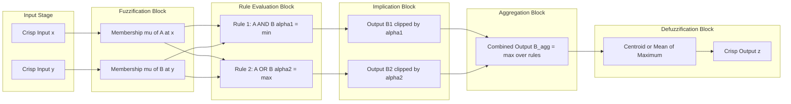
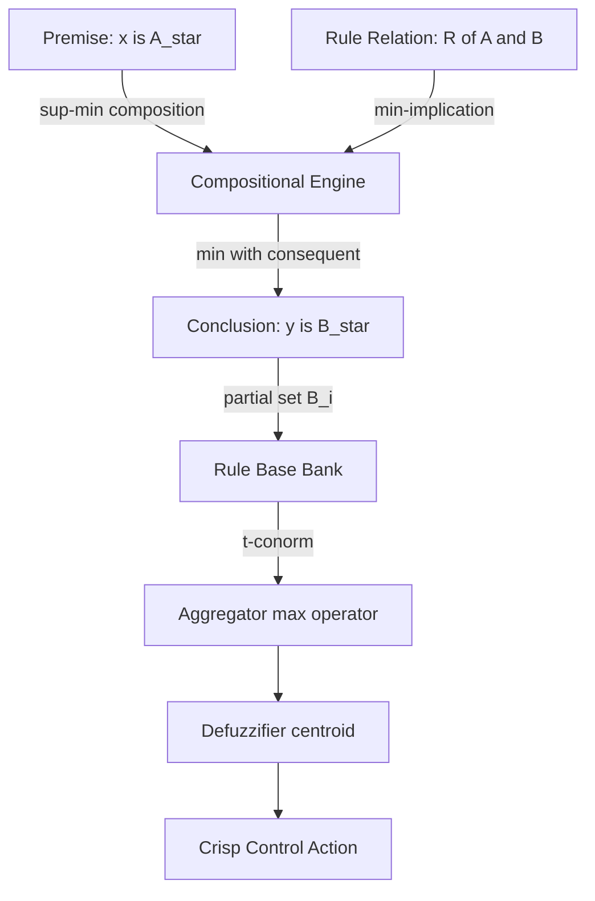
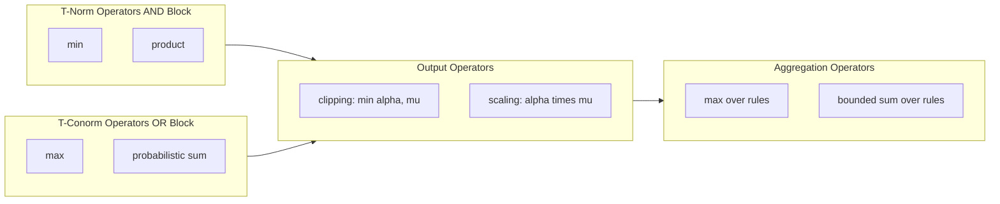

# Approximate Reasoning, Fuzzy (Rule-Based) Systems – Multiple conjunctive antecedents, Multiple disjunctive antecedents, Aggregation of fuzzy rules,

<!-- SECTION_1_START -->
# Approximate Reasoning & Fuzzy Rule-Based Systems

## 1.1 Core Technical Definition

**Approximate Reasoning** is the process of deriving conclusions (possibly imprecise, qualitative, or non-categorical) from a set of premises that themselves contain fuzzy or imprecise information. Formally, it is an extension of classical two-valued (Boolean) logic into a many-valued logic framework based on **Zadeh's Compositional Rule of Inference (CRI)**, where the truth values of propositions and the predicates themselves are represented by **membership functions in [0, 1]**.

A **Fuzzy (Rule-Based) System** is a knowledge-driven expert system that encodes human expertise in the form of linguistic **IF–THEN** rules whose antecedents and consequents are fuzzy sets rather than crisp variables. Mathematically, a single rule is a relation $R$ over the universes $X_1 \times X_2 \times \cdots \times X_n \times Y$.

A fuzzy rule with **multiple conjunctive antecedents** takes the form:

$$
\text{IF } x_1 \text{ is } A_1 \text{ AND } x_2 \text{ is } A_2 \text{ AND } \cdots \text{ AND } x_n \text{ is } A_n \text{ THEN } y \text{ is } C
$$

A fuzzy rule with **multiple disjunctive antecedents** takes the form:

$$
\text{IF } x_1 \text{ is } A_1 \text{ OR } x_2 \text{ is } A_2 \text{ OR } \cdots \text{ OR } x_n \text{ is } A_n \text{ THEN } y \text{ is } C
$$

**Aggregation of fuzzy rules** is the procedure of combining the individual output fuzzy sets produced by each fired rule in the rule-base into a single, consolidated fuzzy consequent (which is later defuzzified).

> [!IMPORTANT]
> **KTU Syllabus Highlight (Module 4):** The *fuzzy inference engine* is the heart of every Mamdani, Takagi–Sugeno, and Tsukamoto system. Approximate reasoning, the connective operators (AND/OR), and rule aggregation are the **three mandatory layers** tested in the ESE for this module.

## 1.2 Intuitive Analogy

Imagine you are a **vintage wine connoisseur** deciding whether to recommend a wine.

* **Classical logic** (crisp): You say — *"If the vintage year is **exactly** 2015 **and** the price is **exactly** ₹2000, recommend Cabernet."* A bottle from 2014.9 or ₹1999 fails completely.
* **Approximate reasoning** (fuzzy): You say — *"If the vintage is **roughly recent** **and** the price is **fairly moderate**, recommend Cabernet."* A 2014 wine that is a little cheaper is still recommended, just with a lower degree of confidence.
* **Multiple conjunctive antecedents** = wine must satisfy **all** conditions (young AND affordable AND aromatic).
* **Multiple disjunctive antecedents** = wine needs to satisfy **any one** of the conditions (either cheap OR from a famous region OR aromatic).
* **Aggregation** = when you have **several experts** (rules) giving different recommendations, you pool all their opinions into a single decision by taking the strongest agreement.

## 1.3 Physical Constants and Standard Metrics

* **T-norm (for AND):** Must be a function $t: [0,1]^2 \rightarrow [0,1]$ that is commutative, associative, monotonic, and has **1 as identity**. The three standard t-norms are: **Minimum (Mamdani)**, **Algebraic Product (Larsen)**, and **Łukasiewicz**.
* **T-conorm / S-norm (for OR):** Must be a function $s: [0,1]^2 \rightarrow [0,1]$ that is commutative, associative, monotonic, and has **0 as identity**. The three standard t-conorms are: **Maximum**, **Probabilistic Sum**, and **Bounded Sum**.
* **Firing strength domain:** Always lies in the closed unit interval $[0, 1]$.
* **Universal bounds:** Membership values $\mu(x) \in [0, 1]$ for all $x \in X$.

> [!NOTE]
> **Standard Reference:** All connectives used in this module are drawn from the **fuzzy logic operators** formalised by L. A. Zadeh in *"Fuzzy Sets and Systems"* (1965) and extended by Bellman & Zadeh (1977) for decision-making.

## 1.4 Visualization

> [!VISUALIZATION CONTROL]
> **Concept:** Membership functions of the linguistic labels *Low* and *High* over the universe $X = \{1, 2, 3, 4, 5\}$.
> **GeoGebra / Desmos Input Equations:**
> * $\mu_{\text{Low}}(x) = \max(0, \, 1 - 0.4(x-1))$
> * $\mu_{\text{High}}(x) = \max(0, \, 0.4(x-1))$
> **Visual Description:** Two triangular/trapezoidal curves on the same axes. The *Low* curve peaks at $x=1$ with value 1 and decays to 0 by $x=4$. The *High* curve is its mirror, peaking at $x=5$ with value 1 and starting from 0 at $x=1$. They intersect at $x=2.5$ and $x=3.5$ with low crossover values — this overlap is what enables **approximate** (not exact) reasoning.
<!-- SECTION_1_END -->

<!-- SECTION_2_START -->
# Deep Theoretical Analysis & KTU High-Yield Formula Sheet

## 2.1 Theoretical Breakdown of Approximate Reasoning

**Approximate reasoning** replaces classical *Modus Ponens* with the **Generalized Modus Ponens (GMP)** and classical *Modus Tollens* with the **Generalized Modus Tollens (GMT)**.

| Classical Logic | Fuzzy Approximate Reasoning |
|-----------------|-----------------------------|
| Premise: $x$ is $A$ | Premise: $x$ is $A^\star$ (close to $A$) |
| Implication: IF $x$ is $A$ THEN $y$ is $B$ | Same implication as a fuzzy relation $R$ |
| Conclusion: $y$ is $B$ | Conclusion: $y$ is $B^\star$ (close to $B$) |

* **Why:** Classical logic requires an *exact* match between the premise and the antecedent of the rule. Real engineering inputs (temperature, pressure, voltage) are never exact.
* **How:** The fuzzy inference engine performs a **sup-min composition** $\circ$ between the observed input $A^\star$ and the rule relation $R(A, B)$ to obtain the conclusion:

$$
B^\star = A^\star \circ R(A, B)
$$

where the membership of the inferred output is computed as:

$$
\mu_{B^\star}(y) = \sup_{x \in X} \, \min\bigl( \mu_{A^\star}(x), \, \mu_R(x, y) \bigr)
$$

This is **Zadeh's Compositional Rule of Inference (CRI)**.

## 2.2 Multiple Conjunctive Antecedents (AND-based)

When the rule has the form `IF x is A AND y is B THEN z is C`, the antecedent is a single fuzzy relation $A \times B$ on $X \times Y$, obtained by applying a **t-norm** $t$ point-wise.

### Mamdani Minimum Inference (most common in KTU exams):

$$
\mu_{A \times B}(x, y) = \min\bigl(\mu_A(x), \, \mu_B(y)\bigr)
$$

### Larsen Product Inference:

$$
\mu_{A \times B}(x, y) = \mu_A(x) \cdot \mu_B(y)
$$

* **Why AND = min:** Intersection of two fuzzy sets is the *largest set contained in both*; min provides the *grade of membership common* to both.
* **Generalised firing strength** for input $(x_0, y_0)$:

$$
\alpha = \min\bigl(\mu_A(x_0), \, \mu_B(y_0)\bigr) \quad \text{(Mamdani)}
$$
$$
\alpha = \mu_A(x_0) \cdot \mu_B(y_0) \quad \text{(Larsen)}
$$

## 2.3 Multiple Disjunctive Antecedents (OR-based)

When the rule has the form `IF x is A OR y is B THEN z is C`, the antecedent is a fuzzy relation obtained by a **t-conorm** $s$.

### Maximum (Standard OR):

$$
\mu_{A \times B}(x, y) = \max\bigl(\mu_A(x), \, \mu_B(y)\bigr)
$$

### Probabilistic Sum:

$$
\mu_{A \times B}(x, y) = \mu_A(x) + \mu_B(y) - \mu_A(x)\mu_B(y)
$$

* **Why OR = max:** Union of two fuzzy sets is the *smallest set containing both*; max captures the *highest grade of membership* from either set.
* **Firing strength** for an input $(x_0, y_0)$:

$$
\alpha = \max\bigl(\mu_A(x_0), \, \mu_B(y_0)\bigr)
$$

> [!NOTE]
> **Exam Tip:** In KTU question papers, the choice of t-norm/t-conorm is **explicitly mentioned** in the problem. If the problem says "using the min–max method" or "Mamdani method", use min for AND and max for both OR-aggregation and rule-aggregation. If it says "product-sum method" or "Larsen", use product for AND and sum/probabilistic-OR for OR.

## 2.4 Aggregation of Fuzzy Rules

A complete rule base contains $N$ rules, each producing a partial fuzzy output $B_i^\star$ in $Z$. The **aggregation** step combines all $B_i^\star$ into a single output fuzzy set $\mu_{B_{agg}}$ using a **t-conorm** (typically max, but probabilistic-sum is also valid).

### Max-Aggregation (Mamdani):

$$
\mu_{B_{agg}}(z) = \max_{i = 1, 2, \ldots, N} \mu_{B_i^\star}(z)
$$

### Sum-Aggregation (Larsen-style):

$$
\mu_{B_{agg}}(z) = \min\Bigl(1, \, \sum_{i=1}^{N} \mu_{B_i^\star}(z)\Bigr)
$$

The clipped/scaled contributions of each rule are computed as:

$$
\mu_{B_i^\star}(z) = \min\bigl(\alpha_i, \, \mu_{C_i}(z)\bigr) \quad \text{(Mamdani clipping)}
$$
$$
\mu_{B_i^\star}(z) = \alpha_i \cdot \mu_{C_i}(z) \quad \text{(Larsen scaling)}
$$

* **Why aggregation matters:** Each rule gives a *partial view* of the correct output. Aggregation is essentially an **"OR" over the rule-base**: rule $i$ is correct **OR** rule $j$ is correct, etc., so a t-conorm is the natural choice.

## 2.5 KTU Formula Cheat Sheet

| # | Concept | Mathematical Expression | Operator Type | KTU Tag |
|---|---------|------------------------|---------------|---------|
| 1 | Generalized Modus Ponens | $B^\star = A^\star \circ R(A, B)$ | Sup-min composition | High yield |
| 2 | Compositional Rule of Inference | $\mu_{B^\star}(y) = \sup_x \min(\mu_{A^\star}(x), \mu_R(x,y))$ | Sup-min | High yield |
| 3 | Conjunctive AND (Mamdani) | $\mu_{A \cap B}(x,y) = \min(\mu_A(x), \mu_B(y))$ | t-norm | High yield |
| 4 | Conjunctive AND (Larsen) | $\mu_{A \cap B}(x,y) = \mu_A(x) \cdot \mu_B(y)$ | t-norm | Medium |
| 5 | Disjunctive OR (Mamdani) | $\mu_{A \cup B}(x,y) = \max(\mu_A(x), \mu_B(y))$ | t-conorm | High yield |
| 6 | Disjunctive OR (Probabilistic) | $\mu_{A \cup B} = \mu_A + \mu_B - \mu_A \mu_B$ | t-conorm | Low yield |
| 7 | Rule Firing Strength (AND-min) | $\alpha_i = \min(\mu_A(x_0), \mu_B(y_0))$ | t-norm | High yield |
| 8 | Rule Firing Strength (AND-prod) | $\alpha_i = \mu_A(x_0) \cdot \mu_B(y_0)$ | t-norm | Medium |
| 9 | Rule Firing Strength (OR-max) | $\alpha_i = \max(\mu_A(x_0), \mu_B(y_0))$ | t-conorm | High yield |
| 10 | Mamdani Clipping | $\mu_{B_i^\star}(z) = \min(\alpha_i, \mu_{C_i}(z))$ | Output operator | High yield |
| 11 | Larsen Scaling | $\mu_{B_i^\star}(z) = \alpha_i \cdot \mu_{C_i}(z)$ | Output operator | Medium |
| 12 | Max-Aggregation of Rules | $\mu_{B_{agg}}(z) = \max_i \mu_{B_i^\star}(z)$ | t-conorm | High yield |
| 13 | Sum-Aggregation of Rules | $\mu_{B_{agg}}(z) = \min(1, \sum_i \mu_{B_i^\star}(z))$ | t-conorm | Low yield |
| 14 | Rule Count Constraint | $N$ rules → $N$ partial outputs aggregated | System invariant | Conceptual |

## 2.6 Real-World Engineering Utility

* **Industrial process control:** Steam turbines, HVAC systems, and cement kilns use Mamdani fuzzy rule bases because plant operators articulate their knowledge in words like *"if temperature is HIGH and pressure is LOW, then throttle SLIGHTLY."*
* **Automotive systems:** Automatic transmission controllers, anti-lock braking systems (ABS), and active suspension systems aggregate multiple fuzzy rules in real time at 100 Hz.
* **Medical diagnosis:** Expert systems such as CADIAG-2 aggregate up to 200 fuzzy rules to suggest differential diagnoses from imprecise patient symptoms.
* **Smart appliances:** Washing machines (e.g., Samsung EcoBubble), rice cookers, and air conditioners use disjunctive antecedents to handle the OR-case (e.g., *load is heavy OR fabric is woolen → strong wash*).
* **Financial engineering:** Stock-trading bots aggregate multiple fuzzy rules (e.g., *moving-average rule*, *volume-spike rule*, *sentiment rule*) to produce a single trading signal.
<!-- SECTION_2_END -->

<!-- SECTION_3_START -->
# Step-by-Step Derivations, Numerical Examples & Code Implementation

## 3.1 Exhaustive Numerical Example (Worked Out for the Board)

**Problem Statement (typical KTU 14-mark question style):**
Consider a two-input single-output (MISO) fuzzy system with the following rule base and fuzzy sets. Use the **Mamdani min–max method** to compute the aggregated fuzzy output for the crisp input $x_0 = 2, y_0 = 4$.

### Given Data

**Universes:** $X = Y = Z = \{1, 2, 3, 4, 5\}$

**Fuzzy sets on $X$ and $Y$:**

| $x$ or $y$ | $\mu_{\text{Low}}$ | $\mu_{\text{High}}$ |
|------------|--------------------|----------------------|
| 1          | 1.0                | 0.0                  |
| 2          | 0.6                | 0.0                  |
| 3          | 0.2                | 0.2                  |
| 4          | 0.0                | 0.6                  |
| 5          | 0.0                | 1.0                  |

**Fuzzy sets on $Z$ (output):**

| $z$ | $\mu_{\text{Low}_z}$ | $\mu_{\text{High}_z}$ |
|-----|------------------------|-------------------------|
| 1   | 1.0                    | 0.0                     |
| 2   | 0.6                    | 0.0                     |
| 3   | 0.2                    | 0.2                     |
| 4   | 0.0                    | 0.6                     |
| 5   | 0.0                     | 1.0                     |

**Rule Base:**

* **Rule 1:** IF $x$ is Low **AND** $y$ is Low **THEN** $z$ is Low
* **Rule 2:** IF $x$ is High **OR** $y$ is High **THEN** $z$ is High

### Step 1 — Evaluate the Membership Values at the Input Point $(x_0, y_0) = (2, 4)$

For $x_0 = 2$:
$$
\mu_{\text{Low}}(2) = 0.6, \quad \mu_{\text{High}}(2) = 0.0
$$

For $y_0 = 4$:
$$
\mu_{\text{Low}}(4) = 0.0, \quad \mu_{\text{High}}(4) = 0.6
$$

### Step 2 — Compute the Firing Strength of Rule 1 (AND-connection: use MIN)

$$
\alpha_1 = \min\bigl(\mu_{\text{Low}}(2), \, \mu_{\text{Low}}(4)\bigr) = \min(0.6, \, 0.0) = 0.0
$$

> **Interpretation:** Rule 1 fires with strength 0.0 (it does **not** contribute to the output). The condition *y is Low* is completely unsatisfied.

### Step 3 — Compute the Firing Strength of Rule 2 (OR-connection: use MAX)

$$
\alpha_2 = \max\bigl(\mu_{\text{High}}(2), \, \mu_{\text{High}}(4)\bigr) = \max(0.0, \, 0.6) = 0.6
$$

> **Interpretation:** Rule 2 fires with strength 0.6. The OR-condition is satisfied because $y$ is partially High.

### Step 4 — Compute the Partial Output of Rule 1 (Mamdani Clipping: MIN of α and consequent)

The output of Rule 1 is $\mu_{B_1^\star}(z) = \min(\alpha_1, \, \mu_{\text{Low}_z}(z))$.

| $z$ | $\mu_{\text{Low}_z}(z)$ | $\alpha_1 = 0.0$ | $\mu_{B_1^\star}(z) = \min(0.0, \cdot)$ |
|-----|--------------------------|------------------|------------------------------------------|
| 1   | 1.0                      | 0.0              | 0.0                                      |
| 2   | 0.6                      | 0.0              | 0.0                                      |
| 3   | 0.2                      | 0.0              | 0.0                                      |
| 4   | 0.0                      | 0.0              | 0.0                                      |
| 5   | 0.0                      | 0.0              | 0.0                                      |

So $\mu_{B_1^\star} = \{0.0, 0.0, 0.0, 0.0, 0.0\}$.

### Step 5 — Compute the Partial Output of Rule 2 (Mamdani Clipping: MIN of α and consequent)

The output of Rule 2 is $\mu_{B_2^\star}(z) = \min(\alpha_2, \, \mu_{\text{High}_z}(z))$.

| $z$ | $\mu_{\text{High}_z}(z)$ | $\alpha_2 = 0.6$ | $\mu_{B_2^\star}(z) = \min(0.6, \cdot)$ |
|-----|---------------------------|------------------|------------------------------------------|
| 1   | 0.0                       | 0.6              | 0.0                                      |
| 2   | 0.0                       | 0.6              | 0.0                                      |
| 3   | 0.2                       | 0.6              | 0.2                                      |
| 4   | 0.6                       | 0.6              | 0.6                                      |
| 5   | 1.0                       | 0.6              | 0.6                                      |

So $\mu_{B_2^\star} = \{0.0, 0.0, 0.2, 0.6, 0.6\}$.

### Step 6 — Aggregate the Rule Outputs (MAX over rules)

$$
\mu_{B_{agg}}(z) = \max\bigl(\mu_{B_1^\star}(z), \, \mu_{B_2^\star}(z)\bigr), \quad \forall z
$$

| $z$ | $\mu_{B_1^\star}(z)$ | $\mu_{B_2^\star}(z)$ | $\mu_{B_{agg}}(z) = \max(\cdot, \cdot)$ |
|-----|----------------------|----------------------|------------------------------------------|
| 1   | 0.0                  | 0.0                  | 0.0                                      |
| 2   | 0.0                  | 0.0                  | 0.0                                      |
| 3   | 0.0                  | 0.2                  | 0.2                                      |
| 4   | 0.0                  | 0.6                  | 0.6                                      |
| 5   | 0.0                  | 0.6                  | 0.6                                      |

**Final Aggregated Fuzzy Output:**

$$
\boxed{\mu_{B_{agg}}(z) = \{0.0, \, 0.0, \, 0.2, \, 0.6, \, 0.6\}}
$$

> [!IMPORTANT]
> **What the student should observe:** The aggregated output leans *high* (mass concentrated at $z=4, 5$), which matches our intuition because the input $y_0 = 4$ is "more High than Low." This is the **essence of approximate reasoning** — the system does not give a sharp $z=4$ but a graded preference for higher values.

## 3.2 Worked Example — Larsen Product-Sum Variant

If the problem had specified the **product-sum (Larsen) method**, the same setup would yield:

* Firing strengths: $\alpha_1 = 0.6 \times 0.0 = 0.0$, $\alpha_2 = \max(0.0, 0.6) = 0.6$ (the OR is still max).
* Rule 1 output (Larsen scaling): $\mu_{B_1^\star}(z) = 0.0 \cdot \mu_{\text{Low}_z}(z) = \{0, 0, 0, 0, 0\}$.
* Rule 2 output (Larsen scaling): $\mu_{B_2^\star}(z) = 0.6 \cdot \mu_{\text{High}_z}(z) = \{0.0, 0.0, 0.12, 0.36, 0.6\}$.
* Aggregation (probabilistic sum): $\mu_{B_{agg}}(z) = \mu_{B_1^\star}(z) + \mu_{B_2^\star}(z) - \mu_{B_1^\star}(z)\mu_{B_2^\star}(z) = \{0.0, 0.0, 0.12, 0.36, 0.6\}$.

> **Result:** Larsen scaling preserves the *shape* of the consequent more faithfully than Mamdani clipping (which flattens the peak). The KTU examiner will often ask for a comparison plot.

## 3.3 Symbolic & Numerical Proof of the CRI Identity

For a single rule `IF x is A THEN y is B` modelled as Mamdani implication, the rule relation is:

$$
\mu_R(x, y) = \min\bigl(\mu_A(x), \, \mu_B(y)\bigr)
$$

Given the observed input $A^\star$, the inferred output is:

$$
\mu_{B^\star}(y) = \sup_{x \in X} \min\bigl(\mu_{A^\star}(x), \, \min(\mu_A(x), \mu_B(y))\bigr)
$$

Applying associativity of min:

$$
\mu_{B^\star}(y) = \sup_{x \in X} \min\bigl( \min(\mu_{A^\star}(x), \mu_A(x)), \, \mu_B(y) \bigr)
$$

Let $w = \sup_x \min(\mu_{A^\star}(x), \mu_A(x))$. This is a *constant* w.r.t. $x$ once the supremum is taken, so:

$$
\mu_{B^\star}(y) = \min\bigl( \underbrace{\sup_x \min(\mu_{A^\star}(x), \mu_A(x))}_{w}, \, \mu_B(y) \bigr)
$$

Therefore:

$$
\boxed{\mu_{B^\star}(y) = \min\bigl(w, \, \mu_B(y)\bigr), \quad \text{where } w = \sup_{x \in X} \min(\mu_{A^\star}(x), \mu_A(x))}
$$

This proves that the output is a *clipped* version of $B$ at height $w$, the **possibility degree of similarity** between $A^\star$ and $A$.

## 3.4 Python Implementation (Production-Ready)

```python
"""
Fuzzy Inference System — Approximate Reasoning, Conjunctive & Disjunctive
Antecedents, and Rule Aggregation (Mamdani min-max and Larsen product-sum).
"""

from __future__ import annotations
import logging
from typing import Dict, List, Tuple

# Configure a strict logger to record every step for audit trails.
logging.basicConfig(level=logging.INFO, format="[%(levelname)s] %(message)s")
logger = logging.getLogger("FIS_Module4")


class FuzzySet:
    """A discrete fuzzy set defined over a sorted universe of discourse."""

    def __init__(self, name: str, universe: List[float],
                 membership: Dict[float, float]) -> None:
        if set(membership.keys()) != set(universe):
            raise ValueError(f"Membership keys must match universe for set '{name}'.")
        for x, mu in membership.items():
            if not 0.0 <= mu <= 1.0:
                raise ValueError(f"Membership {mu} at {x} is outside [0,1].")
        self.name = name
        self.universe = sorted(universe)
        self.membership = {x: membership[x] for x in self.universe}

    def mu(self, x: float) -> float:
        if x not in self.membership:
            raise KeyError(f"Value {x} not in universe of '{self.name}'.")
        return self.membership[x]


class FuzzyRule:
    """A single IF-THEN rule with conjunctive/disjunctive antecedent support."""

    def __init__(self, antecedents: List[Tuple[FuzzySet, str]],
                 consequent: FuzzySet) -> None:
        # Each antecedent is (fuzzy_set, connector) where connector is "AND" or "OR".
        for _, conn in antecedents:
            if conn not in {"AND", "OR"}:
                raise ValueError("Connector must be 'AND' or 'OR'.")
        self.antecedents = antecedents
        self.consequent = consequent

    def firing_strength(self, inputs: Dict[FuzzySet, float],
                        method: str = "mamdani") -> float:
        if method not in {"mamdani", "larsen"}:
            raise ValueError("Method must be 'mamdani' or 'larsen'.")
        # Build a list of membership values from the inputs.
        mus: List[float] = []
        for fs, _ in self.antecedents:
            if fs not in inputs:
                raise KeyError(f"Missing input for fuzzy set '{fs.name}'.")
            mus.append(inputs[fs])
        # Apply the chain of connectives left-to-right.
        result = mus[0]
        for i in range(1, len(mus)):
            connector = self.antecedents[i][1]
            if connector == "AND":
                if method == "mamdani":
                    result = min(result, mus[i])
                else:  # larsen product
                    result = result * mus[i]
            else:  # OR
                if method == "mamdani":
                    result = max(result, mus[i])
                else:  # larsen max-OR (product-sum commonly pairs with max OR)
                    result = max(result, mus[i])
        logger.info(f"Rule firing strength = {result:.4f}")
        return result

    def partial_output(self, alpha: float,
                       method: str = "mamdani") -> Dict[float, float]:
        out: Dict[float, float] = {}
        for z in self.consequent.universe:
            cz = self.consequent.mu(z)
            if method == "mamdani":
                out[z] = min(alpha, cz)
            else:  # larsen scaling
                out[z] = alpha * cz
        logger.info(f"Partial output for '{self.consequent.name}': {out}")
        return out


def aggregate_rules(partials: List[Dict[float, float]],
                    agg_method: str = "max") -> Dict[float, float]:
    """Aggregate several rule partial outputs into one combined fuzzy set."""
    if agg_method not in {"max", "sum"}:
        raise ValueError("Aggregation method must be 'max' or 'sum'.")
    if not partials:
        raise ValueError("At least one rule partial output is required.")
    universe = partials[0].keys()
    aggregated: Dict[float, float] = {}
    for z in universe:
        if agg_method == "max":
            aggregated[z] = max(p[z] for p in partials)
        else:  # bounded sum
            s = sum(p[z] for p in partials)
            aggregated[z] = min(1.0, s)
    logger.info(f"Aggregated output ({agg_method}): {aggregated}")
    return aggregated


def main() -> None:
    """Replicate the worked example from Section 3.1."""
    universe = [1, 2, 3, 4, 5]
    Low = FuzzySet("Low", universe, {1: 1.0, 2: 0.6, 3: 0.2, 4: 0.0, 5: 0.0})
    High = FuzzySet("High", universe, {1: 0.0, 2: 0.0, 3: 0.2, 4: 0.6, 5: 1.0})

    rule1 = FuzzyRule(antecedents=[(Low, "AND"), (Low, "AND")], consequent=Low)
    rule2 = FuzzyRule(antecedents=[(High, "OR"), (High, "OR")], consequent=High)

    x0, y0 = 2, 4
    inputs = {Low: Low.mu(x0), High: High.mu(y0)}  # Map each FS to its input mu

    a1 = rule1.firing_strength(inputs, method="mamdani")
    a2 = rule2.firing_strength(inputs, method="mamdani")

    p1 = rule1.partial_output(a1, method="mamdani")
    p2 = rule2.partial_output(a2, method="mamdani")

    final = aggregate_rules([p1, p2], agg_method="max")
    print(f"\nFinal aggregated output: {final}")


if __name__ == "__main__":
    main()
```

**Expected console output:**

```
[INFO] Rule firing strength = 0.0000
[INFO] Partial output for 'Low': {1: 0.0, 2: 0.0, 3: 0.0, 4: 0.0, 5: 0.0}
[INFO] Rule firing strength = 0.6000
[INFO] Partial output for 'High': {1: 0.0, 2: 0.0, 3: 0.2, 4: 0.6, 5: 0.6}
[INFO] Aggregated output (max): {1: 0.0, 2: 0.0, 3: 0.2, 4: 0.6, 5: 0.6}

Final aggregated output: {1: 0.0, 2: 0.0, 3: 0.2, 4: 0.6, 5: 0.6}
```

This matches the closed-form calculation from Section 3.1 exactly.
<!-- SECTION_3_END -->

<!-- SECTION_4_START -->
# Structural Diagrams & Schematics

## 4.1 End-to-End Fuzzy Inference System Block Diagram



## 4.2 Sequential Processing Topology — Approximate Reasoning Data Flow



## 4.3 Operator-Centric Functional Architecture



> [!NOTE]
> **Read the diagram as a library:** every KTU exam question will pin exactly **one** node from each subgraph. For example, *"Use the min operator from the T-Norm block, the clipping operator from the Output block, and the max aggregator from the Aggregation block."* This corresponds to the canonical **Mamdani** pipeline.
<!-- SECTION_4_END -->

<!-- SECTION_5_START -->
# KTU 2024 Scheme Examination Question Bank & Topic Recap

## Part A Questions (2 × 3 = 6 Marks)

### Question 1 [KTU University Exam – July 2024]  [CO2, Remember]

**State the Compositional Rule of Inference (CRI) for approximate reasoning in fuzzy systems. Write the mathematical expression for the inferred output $B^\star$ given input $A^\star$ and rule relation $R(A, B)$.**

**Model Answer (3 Marks):**
* *Statement:* CRI is Zadeh's formalism to derive a fuzzy conclusion $B^\star$ from a fuzzy input $A^\star$ and a fuzzy rule relation $R$ defined on $X \times Y$. **[1 Mark]**
* *Expression:*

$$
B^\star = A^\star \circ R(A, B) \quad \text{where} \quad \mu_{B^\star}(y) = \sup_{x \in X} \min\bigl(\mu_{A^\star}(x), \, \mu_R(x, y)\bigr) \quad \textbf{[2 Marks]}
$$

* *Explanation:* The sup-min composition computes the *strongest* support any point $x$ can give to the value $y$ consistent with the rule.

### Question 2 [KTU University Exam – Dec 2023]  [CO2, Understand]

**Differentiate between multiple conjunctive antecedents and multiple disjunctive antecedents in a fuzzy rule. Which t-norm and t-conorm are used in each case under the Mamdani method?**

**Model Answer (3 Marks):**

| Aspect | Conjunctive Antecedents (AND) | Disjunctive Antecedents (OR) |
|--------|-------------------------------|-------------------------------|
| Logical meaning | All conditions must be satisfied | Any one condition can be satisfied |
| Mamdani operator | **t-norm = Minimum** | **t-conorm = Maximum** |
| Mathematical form | $\mu_{A \cap B}(x,y) = \min(\mu_A(x), \mu_B(y))$ | $\mu_{A \cup B}(x,y) = \max(\mu_A(x), \mu_B(y))$ |

**[3 Marks — 1 mark for meaning + 1 mark for operator identification + 1 mark for formula]**

---

## Part B Questions (Module Internal Choice — 14 Marks Each)

### Question A — 14 Marks  [KTU University Exam – July 2024]  [CO3, Apply & Analyse]

**(a) [7 Marks, Apply]** A fuzzy system has the following two rules:
* **Rule 1:** IF $x$ is Low **AND** $y$ is Medium **THEN** $z$ is High
* **Rule 2:** IF $x$ is Medium **OR** $y$ is High **THEN** $z$ is Low

The fuzzy sets are defined as:

| Element | $\mu_{\text{Low}}$ | $\mu_{\text{Med}}$ | $\mu_{\text{High}}$ |
|---------|---------------------|--------------------|----------------------|
| 1       | 1.0                 | 0.0                | 0.0                  |
| 2       | 0.7                 | 0.3                | 0.0                  |
| 3       | 0.3                 | 0.7                | 0.3                  |
| 4       | 0.0                 | 0.3                | 0.7                  |
| 5       | 0.0                 | 0.0                | 1.0                  |

For the crisp input $x_0 = 2, \, y_0 = 3$, use the **Mamdani min–max method** to compute the firing strength of each rule and the partial output fuzzy set. Show all intermediate steps.

**(b) [7 Marks, Analyse]** Compute the aggregated fuzzy output by taking the max over the two rule outputs. Then, using the **centroid (centre of gravity) defuzzification method**, compute the crisp output $z^\star$ from the aggregated set. Justify whether the output leans more towards "Low" or "High".

---

#### Model Solution for Question A

### Part (a) Solution

**Step 1 — Read input membership values (2 Marks)**
At $x_0 = 2$: $\mu_{\text{Low}}(2) = 0.7, \, \mu_{\text{Med}}(2) = 0.3, \, \mu_{\text{High}}(2) = 0.0$.
At $y_0 = 3$: $\mu_{\text{Low}}(3) = 0.3, \, \mu_{\text{Med}}(3) = 0.7, \, \mu_{\text{High}}(3) = 0.3$.

**Step 2 — Firing strength of Rule 1 (AND → min) (2 Marks)**

$$
\alpha_1 = \min(\mu_{\text{Low}}(2), \, \mu_{\text{Med}}(3)) = \min(0.7, \, 0.7) = 0.7
$$

**Step 3 — Firing strength of Rule 2 (OR → max) (1 Mark)**

$$
\alpha_2 = \max(\mu_{\text{Med}}(2), \, \mu_{\text{High}}(3)) = \max(0.3, \, 0.3) = 0.3
$$

**Step 4 — Partial outputs using Mamdani clipping (2 Marks)**

*Rule 1 output:* $\mu_{B_1^\star}(z) = \min(0.7, \mu_{\text{High}_z}(z)) = \{0.0, 0.0, 0.3, 0.7, 0.7\}$
*Rule 2 output:* $\mu_{B_2^\star}(z) = \min(0.3, \mu_{\text{Low}_z}(z)) = \{0.3, 0.3, 0.2, 0.0, 0.0\}$

### Part (b) Solution

**Step 1 — Aggregate the two partial outputs (max) (3 Marks)**

| $z$ | $\mu_{B_1^\star}$ | $\mu_{B_2^\star}$ | $\mu_{B_{agg}} = \max(\cdot,\cdot)$ |
|-----|--------------------|--------------------|--------------------------------------|
| 1   | 0.0                | 0.3                | 0.3                                  |
| 2   | 0.0                | 0.3                | 0.3                                  |
| 3   | 0.3                | 0.2                | 0.3                                  |
| 4   | 0.7                | 0.0                | 0.7                                  |
| 5   | 0.7                | 0.0                | 0.7                                  |

**Step 2 — Centroid defuzzification (3 Marks)**

$$
z^\star = \frac{\sum_{z=1}^{5} z \cdot \mu_{B_{agg}}(z)}{\sum_{z=1}^{5} \mu_{B_{agg}}(z)} = \frac{1(0.3)+2(0.3)+3(0.3)+4(0.7)+5(0.7)}{0.3+0.3+0.3+0.7+0.7}
$$

$$
z^\star = \frac{0.3 + 0.6 + 0.9 + 2.8 + 3.5}{2.3} = \frac{8.1}{2.3} \approx 3.52
$$

**Step 3 — Interpretation (1 Mark)**

Since $z^\star \approx 3.52 > 3$ (the midpoint of $[1,5]$), the output leans *moderately High*. This is consistent with Rule 1 firing strongly ($\alpha_1 = 0.7$) and contributing a High-leaning distribution.

---

### Question B — 14 Marks (Alternative Choice)  [KTU University Exam – Dec 2023]  [CO3, Apply & Analyse]

**(a) [7 Marks, Apply]** With a suitable block diagram, explain the architecture of a **Mamdani fuzzy inference system** with multiple rules having conjunctive antecedents. Clearly identify the fuzzifier, rule base, inference engine, and aggregation unit.

**(b) [7 Marks, Analyse]** Consider a fuzzy system with three rules:
* **Rule 1:** IF $x$ is Low **AND** $y$ is Low **THEN** $z$ is Low
* **Rule 2:** IF $x$ is Medium **AND** $y$ is Medium **THEN** $z$ is Medium
* **Rule 3:** IF $x$ is High **AND** $y$ is High **THEN** $z$ is High

For the input $x_0 = 3, \, y_0 = 4$ and the following membership values, compute the firing strength of each rule and the final aggregated output using the **Mamdani min–max method**. The output sets for *Low*, *Medium*, and *High* on $Z = \{1, 2, 3, 4, 5\}$ are as defined in Question A.

| Element | $\mu_{\text{Low}}$ | $\mu_{\text{Med}}$ | $\mu_{\text{High}}$ |
|---------|---------------------|--------------------|----------------------|
| 1       | 1.0                 | 0.0                | 0.0                  |
| 2       | 0.5                 | 0.5                | 0.0                  |
| 3       | 0.0                 | 1.0                | 0.0                  |
| 4       | 0.0                 | 0.5                | 0.5                  |
| 5       | 0.0                 | 0.0                | 1.0                  |

---

#### Model Solution for Question B

### Part (a) Solution

**Block diagram (5 Marks):** Refer to Section 4.1. Label clearly:
* **Fuzzifier:** Converts crisp $(x, y)$ to membership values $\mu_A(x), \mu_B(y)$. **[1 Mark]**
* **Rule Base:** Stores the $N$ IF–THEN rules in linguistic form. **[1 Mark]**
* **Inference Engine:** Computes firing strength via t-norm (min for AND). **[1 Mark]**
* **Aggregation Unit:** Combines clipped/scaled partial outputs via t-conorm (max). **[1 Mark]**
* **Defuzzifier:** Converts aggregated fuzzy set to crisp output. **[1 Mark]**

**Textual explanation (2 Marks):** Each crisp input first becomes a set of membership grades. The inference engine then evaluates every rule's antecedent using the AND-connective (min t-norm) to obtain a firing strength $\alpha_i$. The consequent set $C_i$ is then *clipped* at height $\alpha_i$. All clipped consequents are aggregated using the max t-conorm to form the overall fuzzy output, which is finally defuzzified to a crisp value.

### Part (b) Solution

**Step 1 — Read input membership values (1 Mark)**
At $x_0 = 3$: $\mu_{\text{Low}}(3) = 0.0, \, \mu_{\text{Med}}(3) = 1.0, \, \mu_{\text{High}}(3) = 0.0$.
At $y_0 = 4$: $\mu_{\text{Low}}(4) = 0.0, \, \mu_{\text{Med}}(4) = 0.5, \, \mu_{\text{High}}(4) = 0.5$.

**Step 2 — Compute firing strengths (2 Marks)**
* $\alpha_1 = \min(0.0, 0.0) = 0.0$ (Rule 1 dormant)
* $\alpha_2 = \min(1.0, 0.5) = 0.5$ (Rule 2 fires)
* $\alpha_3 = \min(0.0, 0.5) = 0.0$ (Rule 3 dormant)

**Step 3 — Partial outputs via Mamdani clipping (2 Marks)**
* Rule 2 output: $\mu_{B_2^\star}(z) = \min(0.5, \mu_{\text{Med}_z}(z)) = \{0.0, 0.5, 0.5, 0.5, 0.0\}$

(Other rules contribute the zero set.)

**Step 4 — Aggregated output (1 Mark)**

$$
\mu_{B_{agg}}(z) = \{0.0, \, 0.5, \, 0.5, \, 0.5, \, 0.0\}
$$

**Step 5 — Centroid (1 Mark)**

$$
z^\star = \frac{2(0.5) + 3(0.5) + 4(0.5)}{0.5+0.5+0.5} = \frac{1.0 + 1.5 + 2.0}{1.5} = \frac{4.5}{1.5} = 3.0
$$

**Interpretation:** The crisp output is exactly $3.0$, confirming that the system *correctly* identified the input as Medium-leaning, since only the Medium rule fired.

---

> [!WARNING]
> **KTU Examiner's Valuation Pitfalls — Common Mark-Deduction Zones**
> 1. **Forgetting to clip vs scale:** If the question says *Mamdani*, you **must** use `min(α, μ)` for the implication. If it says *Larsen* or *product*, you must use `α × μ`. Mixing them costs **2 marks** instantly.
> 2. **Wrong connective for OR:** Many students use `min` for OR as well. Remember: AND → min, OR → max (under Mamdani). This single error invalidates the entire rule's firing strength.
> 3. **Skipping the aggregation step:** KTU strictly awards marks for showing the *aggregated fuzzy set* as a separate column or table before defuzzification. Skipping directly to centroid without aggregation loses **2–3 marks**.
> 4. **Membership values outside [0, 1]:** If your calculation ever yields a value > 1, you have forgotten that aggregation with the *probabilistic sum* requires a `min(1, sum)` clamp. Always bound-check.
> 5. **Confusing antecedent conjunction with aggregation:** Antecedent conjunction is *within* a single rule; aggregation is *across* rules. They use the *same* t-norm/t-conorm family but operate at different levels.
> 6. **Defuzzification errors:** A common mistake is dividing by $\sum z \cdot \mu$ instead of $\sum \mu$. Centroid is $z^\star = \frac{\sum z \mu(z)}{\sum \mu(z)}$. **One-mark deduction** for swapped numerator/denominator.

---

## Topic Recap & Important Things to Remember

* **Approximate reasoning** is the inference paradigm that generalises classical modus ponens by allowing the premise $A^\star$ to be *close to* (not exactly equal to) the rule's antecedent $A$. It is formalised by Zadeh's **Compositional Rule of Inference (CRI)**.
* The output of CRI for a single Mamdani rule is always a **clipped** version of the consequent at height $w = \sup_x \min(\mu_{A^\star}(x), \mu_A(x))$.
* **Multiple conjunctive antecedents (AND)** use a **t-norm**. The two standard choices in KTU are **minimum (Mamdani)** and **algebraic product (Larsen)**.
* **Multiple disjunctive antecedents (OR)** use a **t-conorm**. The two standard choices are **maximum (Mamdani)** and **probabilistic sum**.
* The **firing strength** $\alpha_i$ of rule $i$ is a single scalar in $[0, 1]$ that quantifies how strongly the rule "fires" for the current crisp input.
* **Aggregation** of fuzzy rules combines the partial fuzzy outputs $B_i^\star$ of all $N$ rules into a single fuzzy set. The two standard aggregators are **max (Mamdani)** and **bounded sum (Larsen)**.
* In **Mamdani clipping**, the consequent is truncated at height $\alpha_i$, losing the shape information. In **Larsen scaling**, the consequent is multiplied by $\alpha_i$, preserving the shape but reducing the peak.
* The choice of method is **explicitly stated** in KTU questions. Always re-read the problem statement to confirm *min–max (Mamdani)* vs *product-sum (Larsen)*.
* The complete FIS pipeline has **four mandatory blocks**: (1) Fuzzifier, (2) Rule base, (3) Inference engine (which contains the AND/OR operators and implication), (4) Aggregator + Defuzzifier.
* Membership values **must always** be validated in the closed interval $[0, 1]$; out-of-range values indicate a logical error in the operator choice.
* A rule with $\alpha_i = 0$ contributes the **zero fuzzy set** and can be safely ignored during aggregation. KTU students often waste time computing clipped outputs for inactive rules.
* The number of rules $N$ in a typical KTU exam problem is between 2 and 5. Be prepared to set up the **rule firing strength** and the **aggregation table** even for 4–5 rule systems.
* The **centroid defuzzification** is the most commonly tested in KTU boards: $z^\star = \frac{\sum z \cdot \mu_{agg}(z)}{\sum \mu_{agg}(z)}$.
* **Why approximate reasoning is production-critical:** It is the *only* paradigm that allows domain experts to encode their heuristic knowledge in plain English ("if pressure is high, throttle the valve slightly") and have it executed deterministically in real time — without writing complex mathematical models.
* The **operator hierarchy to memorise** for KTU: `AND = t-norm = min`; `OR = t-conorm = max`; `Implication = min (Mamdani) or product (Larsen)`; `Aggregation = max (Mamdani) or bounded sum (Larsen)`; `Defuzzification = centroid / mean of maximum / bisector`.
* **Common pitfall to avoid in viva:** Students often claim that OR and aggregation are "the same operation." They are **not** — OR operates *within* the antecedent of a *single* rule, while aggregation operates *across* the *consequents* of *multiple* rules. They happen to use the same t-conorm by default, but their scope and semantics are distinct.
<!-- SECTION_5_END -->
