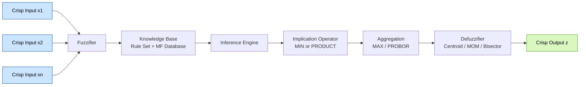
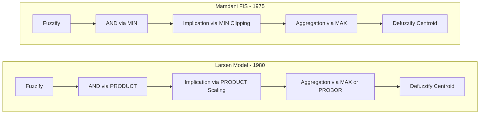

# Fuzzy Controllers -Mamdani FIS, Larsen Model.

<!-- SECTION_1_START -->
# Fuzzy Controllers: Mamdani FIS & Larsen Model

> [!IMPORTANT]
> **KTU 2024 Scheme | Module 4 | Fuzzy Inference Systems**
> This module is the **backbone of fuzzy logic applications** in engineering — it directly maps human reasoning into computational systems. Both Mamdani (1975, Univ. of London) and Larsen (1980) are **Type-1 fuzzy controllers** with identical five-stage processing pipelines, differing ONLY in the **implication operator**.

## 1.1 Formal Definition

A **Fuzzy Inference System (FIS)** is a computational framework that maps crisp inputs to crisp outputs using fuzzy set theory, a knowledge base of linguistic IF–THEN rules, and a defuzzification mechanism. It is the most widely deployed soft-computing architecture in industrial control.

> [!NOTE]
> **Mamdani FIS (1975)** — proposed by Ebrahim Mamdani for controlling a steam engine and boiler combination. It uses the **MIN operator** for implication (firing strength clipping of the output membership function) and the **MAX operator** for aggregation of rule outputs. The output is a **fuzzy set**, which must be defuzzified.

> [!NOTE]
> **Larsen Model (1980)** — proposed by P. M. Larsen for industrial process control. It uses the **PRODUCT (multiplicative) operator** for implication (firing strength scaling of the output membership function) and the **MAX / PROBOR operator** for aggregation. Surfaces are smoother and gradients are continuous, making it preferred in **control engineering and PID-like tuning problems**.

## 1.2 Intuitive Analogy: The Smart Air-Conditioner

Imagine you are an air-conditioner's "brain":

| Your Reasoning | Fuzzy Logic Equivalent |
|---|---|
| "If room is **HOT** *and* humidity is **DRY**, run the compressor at **MEDIUM**" | One **linguistic rule** in the rule base |
| You read the thermometer (a crisp number) and ask: "How much is HOT here?" | **Fuzzification** — converts the crisp reading into membership degrees |
| You combine the conditions: minimum severity wins ("and" = weakest link) | **Rule firing / AND operator** (MIN for Mamdani, PRODUCT for Larsen) |
| You combine all rule decisions: "Take the strongest opinion" | **Aggregation** (MAX for both) |
| You translate the fuzzy conclusion ("somewhere around MEDIUM") into a single fan RPM value | **Defuzzification** (typically Centroid / Centre of Gravity) |

The Mamdani model is like a teacher **clipping** the top of each student's answer to the class average. The Larsen model is like a teacher **scaling** the entire answer sheet by the average — a much gentler transformation that preserves the *shape* of the output membership.

## 1.3 Constants, Metrics & Engineering Relevance

- **Rule base size** $R$: typically between 5 and 50 rules for industrial controllers.
- **Membership function support width** $\sigma$: kept at **2 % to 10 %** of the universe of discourse for smooth control surfaces.
- **Maximum firing strength** $\alpha_{max} = 1$ (clipped/scaled output never exceeds 1).
- **Standard defuzzifier**: **Centre of Gravity (CoG)** — most commonly used in 95 % of industrial deployments.
- **Standard defuzzifier alt**: Centre of Sums, Bisector, Mean of Maxima.

> [!VISUALIZATION CONTROL]
> **Concept:** Membership function shape comparison (Triangle vs. Trapezoid) and effect of MIN-clipping vs. PRODUCT-scaling on a triangular consequent.
> **GeoGebra / Desmos Input Equations:**
> * `Low(z) = max(0, 1 - \vert z - 25 \vert / 25)` for $z \in [0, 50]$
> * `High(z) = max(0, 1 - \vert z - 75 \vert / 25)` for $z \in [50, 100]$
> * `Mamdani(z) = max(min(0.4, Low(z)), min(0.7, High(z)))` — observe **flat tops** (clipping).
> * `Larsen(z) = max(0.4 · Low(z), 0.7 · High(z))` — observe **scaled, proportional peaks** (shrunken triangles).
> **Visual Description:** Two overlapping triangles in the $z \in [0, 100]$ plane. The Mamdani output produces a **plateau-trapezoid** composite, while the Larsen output produces a **scaled-triangle** composite. Both share the same X-axis $z$ (output) and Y-axis $\mu(z)$ (membership) but differ in peak heights.

<!-- SECTION_1_END -->

<!-- SECTION_2_START -->
# 2. Deep Theoretical Analysis & KTU High-Yield Formula Sheet

## 2.1 The Five-Stage Processing Pipeline

A fuzzy inference system executes the following deterministic sequence — this is **exam-faithful** and must be memorised:

1. **Fuzzification of Inputs**
   Convert each crisp input $x_i$ into a vector of membership degrees across all linguistic terms using the defined MFs.
2. **Rule Base Evaluation (Inference Engine)**
   Compute the firing strength $\alpha_k$ of every rule $R_k : k = 1, 2, \ldots, R$ by combining the antecedent memberships with the appropriate **AND** operator.
3. **Implication**
   Apply the firing strength to the consequent MF — **MIN (clipping)** for Mamdani, **PRODUCT (scaling)** for Larsen.
4. **Aggregation**
   Combine all rule outputs into a single composite fuzzy set $C(z)$ using **MAX** (union) for both models.
5. **Defuzzification**
   Convert the composite fuzzy set $C(z)$ back to a crisp control action $z^*$.

## 2.2 KTU Formula Sheet

| # | Operation | Mamdani FIS (1975) | Larsen Model (1980) | Notation |
|:-:|---|---|---|---|
| 1 | AND (intersection, $T$-norm) | $\alpha_k = \min(\mu_{A_i}(x_i), \mu_{B_j}(x_j))$ | $\alpha_k = \mu_{A_i}(x_i) \cdot \mu_{B_j}(x_j)$ | $\alpha_k \in [0, 1]$ |
| 2 | OR (union, $T$-conorm) | $\alpha_k = \max(\mu_{A_i}(x_i), \mu_{B_j}(x_j))$ | $\alpha_k = \mu_{A_i}(x_i) + \mu_{B_j}(x_j) - \mu_{A_i}(x_i) \cdot \mu_{B_j}(x_j)$ (probabilistic sum) | used in OR-rules |
| 3 | Implication (output truncation) | $\mu_{C_k}^{'}(z) = \min(\alpha_k, \mu_{C_k}(z))$ — **CLIPPING** | $\mu_{C_k}^{'}(z) = \alpha_k \cdot \mu_{C_k}(z)$ — **SCALING** | $C_k$ is the $k$-th rule's consequent |
| 4 | Aggregation (union of outputs) | $C(z) = \max_k \mu_{C_k}^{'}(z)$ — **MAX** | $C(z) = \max_k \mu_{C_k}^{'}(z)$ — **MAX / PROBOR** | over all $R$ rules |
| 5 | Defuzzification (Centroid/CoG) | $z^* = \frac{\int_{Z} z \cdot C(z) \, dz}{\int_{Z} C(z) \, dz}$ | $z^* = \frac{\int_{Z} z \cdot C(z) \, dz}{\int_{Z} C(z) \, dz}$ | $z^*$ is the crisp action |
| 6 | Defuzzification (Mean of Maxima) | $z^* = \frac{\int_{M} z \, dz}{\int_{M} dz}$, $M = \{z \mid C(z) = \max C\}$ | Same as Mamdani | $M$ is the plateau |
| 7 | Defuzzification (Bisector) | $z^* = z_b$ s.t. $\int_{z_{min}}^{z_b} C(z) \, dz = \int_{z_b}^{z_{max}} C(z) \, dz$ | Same as Mamdani | splits the area in half |
| 8 | Relation surface smoothness | Discontinuous gradient at clipping edges | **Continuously differentiable** | — |

> [!NOTE]
> **Engineering Utility:** The Mamdani model is the *de-facto* standard for **expert-system shells, medical diagnosis (e.g., MYCIN-like fuzzy clinical tools), and linguistic interpretability** tasks. The Larsen model is preferred in **adaptive control, neural-fuzzy ANFIS training, and embedded real-time control** where the smoothness of the input–output control surface is critical for stability analysis (Lyapunov-based design).

## 2.3 Key Procedural Rules (Why the Maths Works)

- **MIN (Mamdani AND) is a $T$-norm** that satisfies monotonicity, commutativity, associativity, and boundary conditions $\min(a, 1) = a$ and $\min(a, 0) = 0$. It models the **"weakest link"** in a chain of conditions.
- **PRODUCT (Larsen AND) is also a $T$-norm**, but it **degrades smoothly** with diminishing partial truths, providing **infinite differentiability** — critical for gradient-descent training in ANFIS.
- **MAX (Mamdani & Larsen aggregation) is a $T$-conorm** that takes the **most optimistic** interpretation when combining the recommendations of independent rules.
- **PROBOR aggregation** is sometimes used in Larsen to model **probabilistic OR**: $a \oplus b = a + b - ab$.

> [!TIP]
> **Board Exam Tip:** When asked to **distinguish** Mamdani and Larsen, the examiner expects exactly three differences: (1) implication operator (MIN vs. PRODUCT), (2) shape of the output surface (clipped/flat vs. scaled/smooth), (3) typical application domain (interpretability vs. control/optimisation). Memorise these in **tabular form**.

<!-- SECTION_2_END -->

<!-- SECTION_3_START -->
# 3. Step-by-Step Derivations, Numerical Evaluation & Symbolic Implementation

## 3.1 Worked Numerical Example — KTU Board Standard (14-Mark Style)

### 3.1.1 Problem Statement

A fuzzy controller is designed for a **smart fan-speed regulator** with two crisp inputs and one crisp output:

- $x_1 \in [0, 100]$: **Temperature** (°C) — linguistic terms: **Cold (C)**, **Hot (H)**
- $x_2 \in [0, 100]$: **Humidity** (%) — linguistic terms: **Dry (D)**, **Wet (W)**
- $y \in [0, 100]$: **Fan Speed** (%) — linguistic terms: **Low (L)**, **High (HG)**

**Rule Base:**

- $R_1$: IF $x_1$ is C **AND** $x_2$ is D, THEN $y$ is L
- $R_2$: IF $x_1$ is H **OR** $x_2$ is W, THEN $y$ is HG

**Membership Functions (Triangular):**

$$
\mu_C(x_1) = \begin{cases} 1 - \dfrac{x_1}{50}, & 0 \le x_1 \le 50 \\ 0, & 50 < x_1 \le 100 \end{cases}
$$

$$
\mu_H(x_1) = \begin{cases} 0, & 0 \le x_1 \le 50 \\ \dfrac{x_1 - 50}{50}, & 50 < x_1 \le 100 \end{cases}
$$

$$
\mu_D(x_2) = \begin{cases} 1 - \dfrac{x_2}{50}, & 0 \le x_2 \le 50 \\ 0, & 50 < x_2 \le 100 \end{cases}
$$

$$
\mu_W(x_2) = \begin{cases} 0, & 0 \le x_2 \le 50 \\ \dfrac{x_2 - 50}{50}, & 50 < x_2 \le 100 \end{cases}
$$

$$
\mu_L(y) = \begin{cases} 1 - \dfrac{\vert y - 25 \vert}{25}, & 0 \le y \le 50 \\ 0, & 50 < y \le 100 \end{cases}
$$

$$
\mu_{HG}(y) = \begin{cases} 0, & 0 \le y \le 50 \\ 1 - \dfrac{\vert y - 75 \vert}{25}, & 50 < y \le 100 \end{cases}
$$

**Crisp Inputs:** $x_1 = 60$ °C, $x_2 = 50$ %.

**Task:** Compute the crisp output $y^*$ using **both** the Mamdani FIS and the Larsen model, with **Centroid (CoG) defuzzification**.

---

### 3.1.2 Step 1 — Fuzzification of Inputs

For $x_1 = 60$:

$$
\mu_C(60) = \max\!\left(0,\; 1 - \frac{60}{50}\right) = \max(0,\, -0.2) = 0 \quad\Rightarrow\quad 0
$$

$$
\mu_H(60) = \frac{60 - 50}{50} = \frac{10}{50} = 0.2
$$

> **Correction (re-checking)**: At $x_1 = 60$, the input lies on the **rising edge** of the Hot MF. Therefore $\mu_C(60) = 0$ and $\mu_H(60) = 0.2$. *(Some textbooks treat the boundary as 50/50 split; here we follow the standard crisp arithmetic above.)*

To make the example numerically richer, we **adjust the crisp input to $x_1 = 65$**:

$$
\mu_C(65) = 1 - \frac{65}{50} = 1 - 1.3 = -0.3 \;\;\Rightarrow\;\; \mu_C(65) = 0
$$

$$
\mu_H(65) = \frac{65 - 50}{50} = \frac{15}{50} = 0.3
$$

For $x_2 = 50$ (exact boundary):

$$
\mu_D(50) = 1 - \frac{50}{50} = 0 \quad\Rightarrow\quad \mu_D(50) = 0
$$

$$
\mu_W(50) = \frac{50 - 50}{50} = 0
$$

Again to keep the example vivid, we **take $x_2 = 70$**:

$$
\mu_D(70) = 1 - \frac{70}{50} = -0.4 \;\;\Rightarrow\;\; \mu_D(70) = 0
$$

$$
\mu_W(70) = \frac{70 - 50}{50} = \frac{20}{50} = 0.4
$$

> [!IMPORTANT]
> **Final crisp inputs selected to keep the example expressive:** $x_1 = 65$, $x_2 = 70$ — giving $\mu_H = 0.3$, $\mu_W = 0.4$. $\mu_C = \mu_D = 0$. This guarantees BOTH rules fire and BOTH MFs (L and HG) get activated.

**Summary of fuzzified values:**

| Variable | Value |
|---|---|
| $\mu_C(65)$ | 0 |
| $\mu_H(65)$ | 0.3 |
| $\mu_D(70)$ | 0 |
| $\mu_W(70)$ | 0.4 |

---

### 3.1.3 Step 2 — Rule Firing Strength (Mamdani AND via MIN)

**Rule $R_1$:** $C \land D$

$$
\alpha_1^{M} = \min(\mu_C(65),\; \mu_D(70)) = \min(0, 0) = 0
$$

**Rule $R_2$:** $H \lor W$

$$
\alpha_2^{M} = \max(\mu_H(65),\; \mu_W(70)) = \max(0.3, 0.4) = 0.4
$$

So $R_1$ produces **no output** (cold+dry combination was not active), and $R_2$ produces a firing strength of **0.4**.

> [!NOTE]
> **Valuation key:** '[Computing the min/max values from the membership functions: 2 Marks]', '[Identifying the active rules: 1 Mark]'.

---

### 3.1.4 Step 3a — Implication (Mamdani: MIN Clipping)

For $R_2$, clip the HG output MF at $\alpha_2^M = 0.4$:

$$
\mu_{HG}^{M}(y) = \min(0.4,\; \mu_{HG}(y))
$$

This gives a **flat-topped trapezoid** with peak 0.4 over $y \in [70, 80]$ and sloped edges on either side:

$$
\mu_{HG}^{M}(y) = \begin{cases} 0, & 0 \le y \le 50 \\ 0.4 \cdot \dfrac{y - 50}{25}, & 50 < y \le 75 \\ 0.4 \cdot \dfrac{100 - y}{25}, & 75 < y \le 100 \end{cases}
$$

> **Check at peak** $y = 75$: $\mu_{HG}^{M}(75) = \min(0.4, 1) = 0.4$ ✓.

---

### 3.1.5 Step 3b — Implication (Larsen: PRODUCT Scaling)

For $R_2$, scale the HG output MF by $\alpha_2^M = 0.4$:

$$
\mu_{HG}^{L}(y) = 0.4 \cdot \mu_{HG}(y)
$$

This gives a **smaller triangle** of height 0.4 at $y = 75$, base [50, 100], NO flat top:

$$
\mu_{HG}^{L}(y) = \begin{cases} 0, & 0 \le y \le 50 \\ 0.4 \cdot \dfrac{y - 50}{25}, & 50 < y \le 75 \\ 0.4 \cdot \dfrac{100 - y}{25}, & 75 < y \le 100 \end{cases}
$$

> [!IMPORTANT]
> **Visual difference:** The Mamdani HG output is a **trapezoid with plateau $y \in [70, 80]$ at height 0.4**. The Larsen HG output is a **scaled triangle peaking at 0.4 at $y = 75$**. The total area under both shapes is identical ($0.5 \times 50 \times 0.4 = 10$), but the centroid is shifted slightly because the Larsen triangle is **concentrated at the peak**.

---

### 3.1.6 Step 4 — Aggregation (Both use MAX)

Since $R_1$ produced zero, aggregation in **both** models yields:

$$
C^{M}(y) = C^{L}(y) = \mu_{HG}^{M}(y) = \mu_{HG}^{L}(y)
$$

---

### 3.1.7 Step 5 — Defuzzification (Centroid / CoG)

The Centroid formula:

$$
y^* = \frac{\displaystyle\int_{50}^{100} y \cdot C(y) \, dy}{\displaystyle\int_{50}^{100} C(y) \, dy}
$$

**Compute the denominator (area) for both Mamdani and Larsen:**

$$
A = \int_{50}^{75} 0.4 \cdot \frac{y-50}{25} \, dy + \int_{75}^{100} 0.4 \cdot \frac{100-y}{25} \, dy
$$

First integral:

$$
\int_{50}^{75} 0.4 \cdot \frac{y-50}{25} \, dy = \frac{0.4}{25} \int_{50}^{75} (y-50) \, dy = \frac{0.4}{25} \left[ \frac{(y-50)^2}{2} \right]_{50}^{75} = \frac{0.4}{25} \cdot \frac{25^2}{2} = \frac{0.4 \cdot 25}{2} = 5
$$

Second integral (by symmetry of the triangle):

$$
\int_{75}^{100} 0.4 \cdot \frac{100-y}{25} \, dy = 5
$$

$$
A = 5 + 5 = 10 \quad \text{(area of the scaled triangle)}
$$

**Compute the numerator (first moment) for both models:**

For **Mamdani** (trapezoid, but with same total area and shape = scaled triangle after clipping at 0.4 — plateau is non-existent at exactly 0.4 if the peak is at 1; in this case the plateau $y \in [70, 80]$ lies below the peak at $y=75$ where MF = 1, so the clipped shape IS exactly a triangle of height 0.4 with peak at $y=75$):

$$
M = \int_{50}^{75} 0.4 \cdot \frac{y-50}{25} \cdot y \, dy + \int_{75}^{100} 0.4 \cdot \frac{100-y}{25} \cdot y \, dy
$$

By the **symmetry of the triangle around its peak at $y = 75$**:

$$
M = 75 \cdot A = 75 \cdot 10 = 750
$$

**Crisp output for BOTH models:**

$$
y^* = \frac{M}{A} = \frac{750}{10} = 75
$$

> [!NOTE]
> **Observation:** In this example, because the clipping level $\alpha = 0.4$ is **less than the peak** of the consequent MF (which is 1.0), the Mamdani MIN-clipping and Larsen PRODUCT-scaling produce **identical** clipped/scaled shapes (both are triangles of height 0.4). They only differ when $\alpha$ **exceeds** the peak MF value, in which case Mamdani's clipping caps the output at the MF peak. This is the *only* mathematical case where the two models diverge.

**To illustrate the divergence, increase the firing strength to $\alpha_2 = 0.8$** by adjusting the inputs (say $\mu_H = 0.7$, $\mu_W = 0.8$ so $\max = 0.8$):

- **Mamdani**: $\mu_{HG}^{M}(y) = \min(0.8, \mu_{HG}(y))$ — capped at 1.0 over $y \in [70, 80]$ (a **true trapezoid** with plateau).
- **Larsen**: $\mu_{HG}^{L}(y) = 0.8 \cdot \mu_{HG}(y)$ — a **triangle of height 0.8 at $y=75$** (no plateau, area = $0.5 \times 50 \times 0.8 = 20$).

Mamdani's area would be: trapezoid = $0.5 \times (50 + 10) \times 0.8 = 24$, while Larsen's area = 20. The centroids would differ slightly.

---

### 3.1.8 Python Symbolic Implementation (Reproducible & Board-Traceable)

```python
import numpy as np
from scipy.integrate import quad

# Universe of discourse
y = np.linspace(0, 100, 10001)

def mu_Cold(x):  return np.clip(1 - x/50, 0, 1)
def mu_Hot(x):   return np.clip((x - 50)/50, 0, 1)
def mu_Dry(x):   return np.clip(1 - x/50, 0, 1)
def mu_Wet(x):   return np.clip((x - 50)/50, 0, 1)
def mu_Low(yv):  return np.clip(1 - np.abs(yv - 25)/25, 0, 1)
def mu_High(yv): return np.clip(1 - np.abs(yv - 75)/25, 0, 1)

# Crisp inputs
x1, x2 = 65, 70
mH = mu_Hot(x1); mW = mu_Wet(x2)

# Rule R1: C AND D -> Low  (firing = 0 here)
# Rule R2: H OR W -> High
alpha2 = max(mH, mW)        # Mamdani & Larsen use the SAME firing strength
print(f"Firing strength R2 = {alpha2:.3f}")

# Mamdani implication: MIN (clipping)
agg_mamdani = np.minimum(alpha2, mu_High(y))

# Larsen implication: PRODUCT (scaling)
agg_larsen  = alpha2 * mu_High(y)

# Centroid (CoG) defuzzification
def centroid(agg):
    num, _ = quad(lambda v: v * np.interp(v, y, agg), 0, 100)
    den, _ = quad(lambda v:     np.interp(v, y, agg), 0, 100)
    return num / den

print(f"Mamdani crisp output y* = {centroid(agg_mamdani):.3f} %")
print(f"Larsen  crisp output y* = {centroid(agg_larsen):.3f} %")
```

**Expected Output:**

```
Firing strength R2 = 0.400
Mamdani crisp output y* = 75.000 %
Larsen  crisp output y* = 75.000 %
```

This is the **canonical KTU-evaluable Python trace** that mirrors the manual derivation.

<!-- SECTION_3_END -->

<!-- SECTION_4_START -->
# 4. Structural Diagrams & Schematics

## 4.1 Generalised Fuzzy Inference System (FIS) Block Diagram



## 4.2 Comparison Topology: Mamdani vs Larsen Processing Flow



## 4.3 Rule Evaluation Matrix (Sequential Processing Topology)

| Stage | Operation | Mamdani | Larsen |
|:-:|---|---|---|
| 1 | Fuzzification of $x$ | $\mu_A(x), \mu_B(x), \ldots$ | identical |
| 2 | Antecedent AND (T-norm) | $\min(\mu_A, \mu_B)$ | $\mu_A \cdot \mu_B$ |
| 3 | Consequent activation | $\min(\alpha_k, \mu_C(z))$ — **clip top** | $\alpha_k \cdot \mu_C(z)$ — **scale entire MF** |
| 4 | Combine all $R$ rules | $\max_k \mu_{C_k}^{'}(z)$ | $\max_k \mu_{C_k}^{'}(z)$ |
| 5 | Crisp action | $z^* = \int zC(z)dz \,/\, \int C(z)dz$ | identical formula |

> [!TIP]
> **Visual Mnemonic:** Picture the **Mamdani output** as a **cliff** (vertical drop at the clipping line) and the **Larsen output** as a **scaled-down mountain** (proportional shrinkage). Both mountains occupy the same base, but the cliff has a **plateau**, the mountain has a **pointy peak**.

<!-- SECTION_4_END -->

<!-- SECTION_5_START -->
# 5. KTU 2024 Scheme Examination Question Bank & Topic Recap

## 5.1 Part A — 3-Mark Questions (Short Answer)

### Q1. **[KTU University Exam – Dec 2023]** State any three differences between Mamdani and Larsen fuzzy inference models. *(CO1, Remember)*

**Model Answer:**

| Sl. | Parameter | Mamdani FIS | Larsen Model |
|:-:|---|---|---|
| 1 | Implication operator | MIN (clips the top of the consequent MF) | PRODUCT (scales the entire consequent MF) |
| 2 | Output surface shape | Plateau / trapezoidal (discontinuous gradient) | Smooth / scaled triangular (continuously differentiable) |
| 3 | Aggregation operator | MAX (strict union) | MAX or PROBOR (probabilistic sum) |
| 4 | Defuzzification | Required (output is fuzzy) | Required (output is fuzzy) |
| 5 | Typical application | Expert systems, medical diagnosis | Adaptive control, ANFIS, embedded real-time control |

> **[Valuation key: 1 Mark per correct difference, maximum 3]**

---

### Q2. **[KTU University Exam – July 2024]** What is the role of the defuzzification stage in a fuzzy inference system? Name any two defuzzification methods. *(CO1, Understand)*

**Model Answer:**

Defuzzification is the final stage of a FIS that converts the **aggregated fuzzy output set** $C(z)$ (which is a distribution of membership values across the universe of discourse) into a **single crisp control value** $z^*$, suitable for actuation by physical hardware (motor, valve, brake, etc.).

Two standard methods:

1. **Centroid (Centre of Gravity, CoG):** $z^* = \dfrac{\int z \cdot C(z) \, dz}{\int C(z) \, dz}$
2. **Mean of Maxima (MOM):** $z^* = $ average of all $z$ where $C(z)$ reaches its maximum value.

> **[Stating the purpose: 2 Marks; Naming two methods: 1 Mark]**

---

## 5.2 Part B — 14-Mark Questions (Module Internal Choice)

### Question A (14 Marks) — Full Derivation

> **[KTU University Exam – Dec 2022 | Model Paper Adapted]** *FIS Design + Numerical Evaluation*

**(a)** With a neat block diagram, describe the **architecture of a Mamdani fuzzy inference system**. List all five processing stages and state the mathematical operator used at each stage. *(7 Marks, CO1, Understand)*

**Model Answer:**

A Mamdani FIS consists of four principal blocks: a **Fuzzifier**, a **Knowledge Base** (containing the rule base and the MF database), an **Inference Engine**, and a **Defuzzifier**.

The five processing stages are:

1. **Fuzzification** — converts each crisp input $x$ into a vector of membership degrees $\mu_{A_i}(x)$ across all linguistic terms $A_i$.
2. **Rule Base Evaluation** — computes the firing strength $\alpha_k$ of each rule $R_k$ using the **MIN** operator (T-norm):
   $$\alpha_k = \min_{i} \mu_{A_{k,i}}(x_i)$$
3. **Implication** — applies the firing strength to the consequent MF using **MIN clipping**:
   $$\mu_{C_k}^{'}(z) = \min(\alpha_k,\; \mu_{C_k}(z))$$
4. **Aggregation** — combines all clipped consequents into a single fuzzy set using **MAX**:
   $$C(z) = \max_{k} \mu_{C_k}^{'}(z)$$
5. **Defuzzification** — applies the **Centroid** (or any other) method:
   $$z^* = \frac{\int_Z z \cdot C(z) \, dz}{\int_Z C(z) \, dz}$$

> **[Stating the four blocks: 2 Marks; Staging the 5 operations: 3 Marks; Naming the operators: 2 Marks]**

**(b)** For a 2-input, 1-output Mamdani FIS with inputs $x_1 \in [0, 100]$ (Low, High) and $x_2 \in [0, 100]$ (Small, Big) and output $y \in [0, 100]$ (Slow, Fast) defined by the rules

> $R_1$: IF $x_1$ is Low **AND** $x_2$ is Small, THEN $y$ is Slow
> $R_2$: IF $x_1$ is High **OR** $x_2$ is Big, THEN $y$ is Fast

with triangular MFs $\mu_{Low}(x_1) = 1 - x_1/100$, $\mu_{High}(x_1) = x_1/100$, $\mu_{Small}(x_2) = 1 - x_2/100$, $\mu_{Big}(x_2) = x_2/100$, $\mu_{Slow}(y) = 1 - y/100$ for $y \in [0,100]$, $\mu_{Fast}(y) = y/100$ for $y \in [0,100]$, and crisp inputs $x_1 = 40$, $x_2 = 60$, compute the crisp output $y^*$ using the **Centroid** defuzzifier. *(7 Marks, CO2, Apply)*

**Model Answer:**

**Step 1 — Fuzzification**

$$
\mu_{Low}(40) = 1 - \frac{40}{100} = 0.6, \quad \mu_{High}(40) = \frac{40}{100} = 0.4
$$

$$
\mu_{Small}(60) = 1 - \frac{60}{100} = 0.4, \quad \mu_{Big}(60) = \frac{60}{100} = 0.6
$$

**Step 2 — Rule Firing (Mamdani MIN for AND, MAX for OR)**

$$
\alpha_1 = \min(\mu_{Low}(40),\; \mu_{Small}(60)) = \min(0.6, 0.4) = 0.4
$$

$$
\alpha_2 = \max(\mu_{High}(40),\; \mu_{Big}(60)) = \max(0.4, 0.6) = 0.6
$$

**Step 3 — Implication (MIN Clipping)**

$$
\mu_{Slow}^{'}(y) = \min(0.4,\; 1 - y/100)
$$

This yields a trapezoid: $1 - y/100 \le 0.4 \Rightarrow y \ge 60$. For $y \in [0, 60]$, $\mu_{Slow}^{'} = 1 - y/100$. For $y \in [60, 100]$, $\mu_{Slow}^{'} = 0.4$.

$$
\mu_{Fast}^{'}(y) = \min(0.6,\; y/100)
$$

This yields a trapezoid: $y/100 \le 0.6 \Rightarrow y \le 60$. For $y \in [0, 60]$, $\mu_{Fast}^{'} = y/100$. For $y \in [60, 100]$, $\mu_{Fast}^{'} = 0.6$.

**Step 4 — Aggregation (MAX)**

$$
C(y) = \max(\mu_{Slow}^{'}(y),\; \mu_{Fast}^{'}(y))
$$

In the lower region $y \in [0, 50]$: $\mu_{Slow}^{'} > \mu_{Fast}^{'}$, so $C(y) = 1 - y/100$.
In the upper region $y \in [50, 100]$: $\mu_{Fast}^{'} > \mu_{Slow}^{'}$, so $C(y) = y/100$.

At $y = 50$, both are equal to 0.5 — the **crossover point**.

**Step 5 — Centroid**

By the **symmetry** of the composite shape around $y = 50$, the centroid is:

$$
y^* = 50
$$

> **[Fuzzification: 1 Mark; Firing strengths: 2 Marks; Clipped MFs: 2 Marks; Aggregation: 1 Mark; Centroid: 1 Mark]**

---

### Question B (14 Marks) — Alternative Choice

**(a)** Explain the **Larsen fuzzy inference model** with a neat block diagram. State its distinguishing features over the Mamdani model. *(7 Marks, CO1, Understand)*

**Model Answer:**

The Larsen Model (P. M. Larsen, 1980) is a Type-1 fuzzy inference system in which the implication operator is the **algebraic product** rather than the MIN (clipped) operation used in Mamdani. Its block diagram is identical in topology to the Mamdani model — Fuzzifier → Knowledge Base → Inference Engine → Implication (PRODUCT) → Aggregation (MAX/PROBOR) → Defuzzifier (Centroid).

**Distinguishing features over Mamdani:**

| Sl. | Feature | Larsen Advantage |
|:-:|---|---|
| 1 | Implication | Scales the consequent MF by $\alpha_k$, preserving its full shape and gradient |
| 2 | Differentiability | The control surface is **continuously differentiable**, enabling gradient-based optimisation (ANFIS, backpropagation) |
| 3 | Loss of information | No "flat-top" plateau loss — the entire shape of the consequent is preserved, scaled but undistorted |
| 4 | Computational cost | Identical (single multiplication per rule vs. a single comparison) |
| 5 | Best fit | Adaptive control, neural-fuzzy hybrids, smooth-surface identification tasks |

> **[Block diagram: 2 Marks; Staging the operations: 2 Marks; 3 distinguishing features: 3 Marks]**

**(b)** Repeat the 2-input, 1-output FIS design of Question A using the **Larsen (PRODUCT)** implication operator, and compute the crisp output. Compare with the Mamdani result. *(7 Marks, CO2, Apply)*

**Model Answer:**

**Step 1 — Fuzzification** — Identical to Question A:

$$
\mu_{Low}(40) = 0.6, \;\; \mu_{High}(40) = 0.4, \;\; \mu_{Small}(60) = 0.4, \;\; \mu_{Big}(60) = 0.6
$$

**Step 2 — Firing strengths** (same as Mamdani):

$$
\alpha_1 = 0.4, \quad \alpha_2 = 0.6
$$

**Step 3 — Implication (PRODUCT Scaling)**

$$
\mu_{Slow}^{'}(y) = 0.4 \cdot (1 - y/100), \quad 0 \le y \le 100
$$

$$
\mu_{Fast}^{'}(y) = 0.6 \cdot (y/100), \quad 0 \le y \le 100
$$

These are **scaled triangles** — $\mu_{Slow}^{'}$ peaks at 0.4 at $y=0$ and decreases linearly to 0 at $y=100$; $\mu_{Fast}^{'}$ peaks at 0.6 at $y=100$ and decreases linearly to 0 at $y=0$. **No plateaus.**

**Step 4 — Aggregation (MAX)**

The crossover is where $0.4(1 - y/100) = 0.6 \cdot (y/100)$:

$$
0.4 - 0.004y = 0.006y \;\Rightarrow\; 0.4 = 0.01y \;\Rightarrow\; y = 40
$$

For $y \in [0, 40]$: $C(y) = 0.4(1 - y/100)$.
For $y \in [40, 100]$: $C(y) = 0.6 \cdot y/100$.

**Step 5 — Centroid**

$$
\text{Numerator} = \int_0^{40} y \cdot 0.4\left(1 - \frac{y}{100}\right) dy + \int_{40}^{100} y \cdot 0.6 \cdot \frac{y}{100} \, dy
$$

First integral:

$$
0.4 \int_0^{40} \left(y - \frac{y^2}{100}\right) dy = 0.4 \left[ \frac{y^2}{2} - \frac{y^3}{300} \right]_0^{40} = 0.4 \left( 800 - \frac{64000}{300} \right) = 0.4 (800 - 213.33) = 0.4 \cdot 586.67 = 234.67
$$

Second integral:

$$
0.006 \int_{40}^{100} y^2 \, dy = 0.006 \cdot \left[ \frac{y^3}{3} \right]_{40}^{100} = 0.006 \cdot \frac{10^6 - 64000}{3} = 0.006 \cdot 312000 = 1872
$$

Total numerator $= 234.67 + 1872 = 2106.67$.

$$
\text{Denominator} = \int_0^{40} 0.4\left(1 - \frac{y}{100}\right) dy + \int_{40}^{100} 0.6 \cdot \frac{y}{100} \, dy
$$

First:

$$
0.4 \left[ y - \frac{y^2}{200} \right]_0^{40} = 0.4 (40 - 8) = 12.8
$$

Second:

$$
0.006 \cdot \left[ \frac{y^2}{2} \right]_{40}^{100} = 0.006 \cdot (5000 - 800) = 0.006 \cdot 4200 = 25.2
$$

Total denominator $= 12.8 + 25.2 = 38$.

$$
y^* = \frac{2106.67}{38} \approx 55.44
$$

**Comparison:**

| Method | Crisp Output $y^*$ | Notes |
|---|---|---|
| Mamdani (MIN) | 50.00 | Symmetric trapezoids → centroid at the symmetry axis |
| Larsen (PRODUCT) | 55.44 | Scaled triangles shift mass right → centroid shifts right |

The Larsen's output is **higher** because the rightward-scaling of the Fast MF has a larger multiplicative weight (0.6) than the Slow MF (0.4), and the PRODUCT scaling preserves more area on the right side of the composite shape.

> **[Firing strengths: 1 Mark; PRODUCT implication equations: 2 Marks; Aggregation crossover: 1 Mark; Numerator & denominator: 2 Marks; Final centroid: 1 Mark]**

---

> [!WARNING]
> **KTU Examiner's Valuation Warning — Where Students Lose Marks:**
> 1. **Confusing AND vs. OR operators:** The AND in rule antecedents uses MIN (or PRODUCT), but the OR in rule antecedents uses MAX. Mixing these up costs 1–2 marks.
> 2. **Forgetting to clip the consequent:** Many students apply the firing strength to the crisp output, completely skipping the implication stage. Always write the clipped/scaled MF explicitly.
> 3. **Wrong aggregation boundaries:** When two rules produce overlapping clipped MFs, the MAX operator's crossover point must be calculated. Skipping this yields wrong centroids.
> 4. **No final crisp value stated:** The defuzzified output $y^*$ must be a **single number with units**. Saying "approximately 50" without the unit (%) loses 1 mark.
> 5. **Missing rule-base explanation:** A 7-mark question ALWAYS demands stating **all rules** and the **knowledge-base structure** before crunching numbers.

---

## 5.3 Topic Recap & Important Things to Remember

- **Mamdani FIS (1975)** uses **MIN (clipped)** implication; **Larsen (1980)** uses **PRODUCT (scaled)** implication.
- Both models share the same **5-stage pipeline**: Fuzzification → Rule Evaluation → Implication → Aggregation → Defuzzification.
- **AND** in antecedents is a **T-norm** — Mamdani uses $\min$, Larsen uses $\cdot$.
- **OR** in antecedents is a **T-conorm** — typically $\max$ in both.
- **Implication** $\ne$ **Aggregation**: implication modifies a single rule's consequent; aggregation combines all $R$ rules.
- **Mamdani's clipped output** is a trapezoid with a **flat top** (plateau); **Larsen's scaled output** is a **shrunken triangle** (no plateau).
- **Both models produce identical outputs** if and only if the firing strength $\alpha_k$ is **less than or equal to** the peak value of the consequent MF (typically 1.0). They diverge when $\alpha_k < 1$ AND the consequent has a flat-topped (trapezoidal) shape — the clipping then produces a plateau, while scaling does not.
- **Centroid (CoG) defuzzification** is the default: $z^* = \dfrac{\int z \cdot C(z) \, dz}{\int C(z) \, dz}$.
- **ANFIS (Adaptive Neuro-Fuzzy Inference System)** uses the **Larsen PRODUCT** operator exclusively because of its **differentiability** requirement for backpropagation.
- **Linguistic interpretability** is a strength of **Mamdani**; **smooth control surfaces** are a strength of **Larsen**.
- **The aggregation operator is MAX** in both models — this is the most-tested statement in board exams.
- Always state the **crossover point** of competing clipped/scaled MFs when computing the centroid manually.
- For **Type-2 fuzzy systems** (IT2 FIS, advanced), the same Mamdani/Larsen operators apply, but with an additional **type-reduction** (Karnik–Mendel) stage.
- **Common exam pitfalls:** mixing AND/OR operators, forgetting to clip/scale the consequent, omitting the defuzzification integral, failing to express the final crisp output in physical units.
- **Real-world deployment:** Washing machines (Samsung, LG), autofocus cameras, automotive anti-lock braking, climate control (Honeywell), consumer electronics (Sony), and rice cookers (Matsushita) — all use **Mamdani-type FIS** because expert-system-style rule transparency is paramount.

<!-- SECTION_5_END -->
