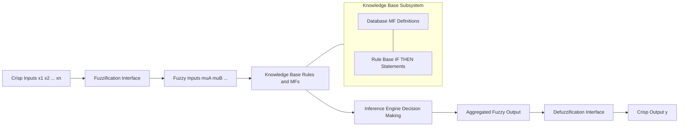
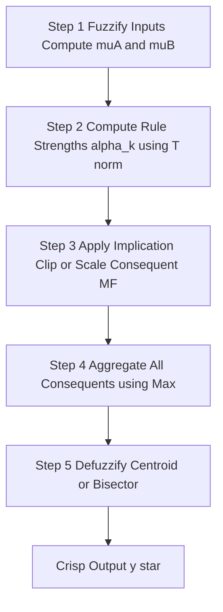
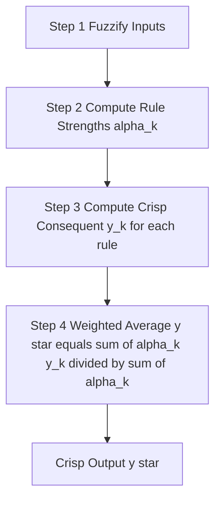
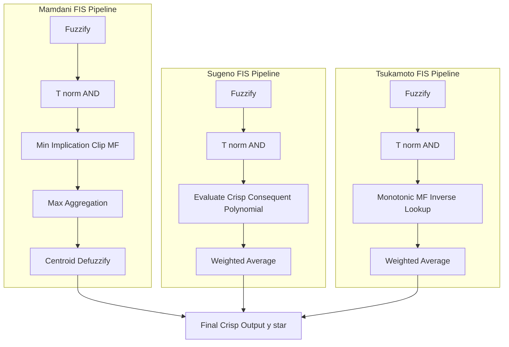
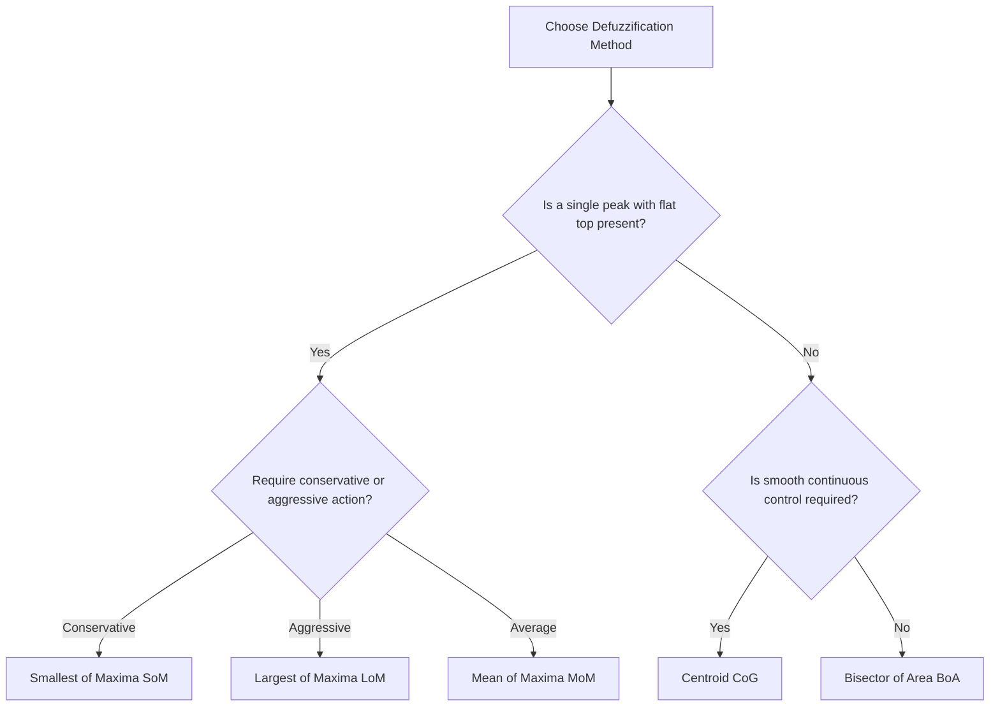
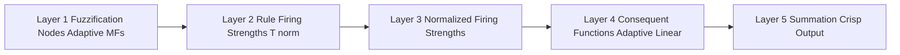
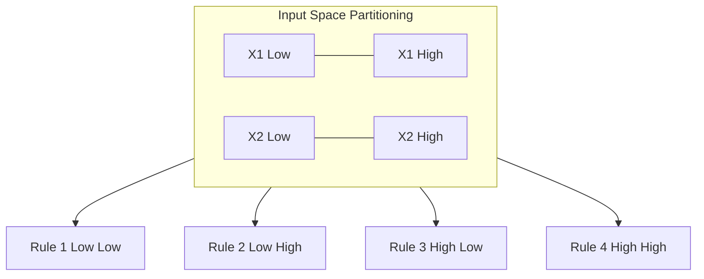

# Fuzzy Inference Systems :-

<!-- SECTION_1_START -->
# Fuzzy Inference Systems — Core Definition & Intuitive Overview

> [!IMPORTANT]
> **KTU 2024 Syllabus Anchor (PECST753 / Module 4):** Fuzzy Inference Systems (FIS) form the computational backbone of every fuzzy-logic-based controller and decision engine. Mastering the four canonical architectures — **Mamdani**, **Sugeno**, and **Tsukamoto** — along with the **defuzzification toolbox**, is mandatory for the End Semester Evaluation (ESE).

## 1.1 Formal Academic Definition

A **Fuzzy Inference System (FIS)** is a rule-based computing framework that maps a set of crisp input variables to a crisp output variable by leveraging fuzzy set theory, a linguistic rule base, and a formal inference mechanism. Mathematically, an FIS is a function $F: \mathbb{R}^{n} \to \mathbb{R}$ such that:

$$y = F(x_1, x_2, \dots, x_n)$$

where each $x_i \in \mathbb{R}$ is a crisp input, the intermediate reasoning is performed over fuzzy sets $\tilde{A}, \tilde{B}, \dots$ defined on the input universes of discourse $U_i$, and $y \in \mathbb{R}$ is the defuzzified crisp output.

The architecture of any FIS is universally partitioned into **four sequential functional blocks**:

1. **Fuzzification Interface** — converts crisp inputs into degrees of membership across linguistic fuzzy sets.
2. **Knowledge Base** — stores the rule base (linguistic IF–THEN statements) and the database (membership function definitions).
3. **Decision / Inference Engine** — performs approximate reasoning (typically generalized modus ponens) to combine the fired rules.
4. **Defuzzification Interface** — converts the aggregated fuzzy output back into a single crisp value.

> [!NOTE]
> **Board Exam Tip:** Always draw the four-block architecture diagram first when a question begins *"Explain FIS with a neat block diagram"* — examiners award the first 2–3 marks for the labeled block diagram alone.

## 1.2 Intuition via Real-World Analogy

Think of a Fuzzy Inference System as an **expert human chef translating a vague recipe into a precise oven temperature**.

| Stage of FIS | Chef Analogy | What Actually Happens |
|---|---|---|
| **Fuzzification** | The chef tastes the soup and says *"a bit salty, slightly thick"* | Crisp measurements (3 g salt, 250 mL water) are converted into linguistic categories with degrees of membership |
| **Knowledge Base** | Years of culinary experience encoded as rules: *"If salty and thick, reduce heat"* | Database of membership functions + rule base of IF–THEN clauses |
| **Inference Engine** | The chef simultaneously weighs all applicable cooking principles | Combines fired rules using min, prod, or other T-norm operators |
| **Defuzzification** | The chef finally turns the knob to a specific number, say $180^{\circ}\text{C}$ | Centroid / bisector / weighted average converts fuzzy output to crisp control action |

> [!TIP]
> **Why fuzzy?** Classical logic forces the chef into a binary dilemma: either "salty" or "not salty." Real life is graded. Fuzzy sets capture this **graded membership** using values in $[0, 1]$, which is why FIS dominates in control systems (washing machines, ABS braking, AC compressors) where smooth, human-like reasoning outperforms crisp thresholding.

## 1.3 Membership Functions — The Vocabulary of Fuzzy Sets

A **membership function** $\mu_{\tilde{A}}(x): U \to [0, 1]$ assigns to every element $x$ of the universe of discourse $U$ a degree of belonging to the fuzzy set $\tilde{A}$. The five canonical MFs are:

- **Triangular:** $\text{triangle}(x; a, b, c)$
- **Trapezoidal:** $\text{trapezoid}(x; a, b, c, d)$
- **Gaussian:** $\text{gauss}(x; \sigma, c)$
- **Generalized Bell:** $\text{gbell}(x; a, b, c)$
- **Sigmoidal:** $\text{sigmf}(x; a, c)$

> [!IMPORTANT]
> **Core property:** $\mu_{\tilde{A}}(x) \in [0, 1]$ for all $x \in U$. A value of $0$ means complete non-membership; a value of $1$ means full membership; intermediate values capture **partial belonging** — the very essence of fuzziness.

## 1.4 Visualizing the Concept

> [!VISUALIZATION CONTROL]
> **Concept:** Two crisp inputs feeding through the four-block FIS pipeline to a single crisp output (typical Mamdani controller geometry).
> **GeoGebra / Desmos Input Equations:**
> * `f1(x) = max(0, min((x - 0)/3, (6 - x)/3))` (triangular MF: "Low")
> * `f2(x) = max(0, min((x - 3)/3, (9 - x)/3))` (triangular MF: "Medium")
> * `f3(x) = max(0, min((x - 6)/3, (9 - x)/3))` (triangular MF: "High")
> **Visual Description:** Three overlapping triangles on the x-axis (0 to 9) representing input linguistic labels. Each input is mapped to a height (membership degree) by these curves. The student should observe how **a single crisp $x$ value simultaneously activates two or more triangles** — this overlap is precisely what enables smooth, interpolated fuzzy reasoning.

## 1.5 Why FIS Matters in Modern Engineering

- **Industrial Process Control:** PID-like fuzzy controllers in cement kilns, robotic arms, and HVAC systems.
- **Consumer Electronics:** Washing machines (LG, Samsung), autofocus cameras, vacuum cleaners (Roomba).
- **Automotive:** Automatic transmission shift scheduling, traction control, and adaptive cruise control.
- **Medical AI:** Diagnostic expert systems (fuzzy symptoms → disease likelihood).
- **Finance & Forecasting:** Credit-risk scoring, stock trend classification.

> [!NOTE]
> **Industry Standard:** The **Mamdani FIS** is preferred for interpretability (human-readable rules), while the **Sugeno FIS** is preferred for computational efficiency and direct integration with adaptive neuro-fuzzy (ANFIS) training algorithms.
<!-- SECTION_1_END -->

<!-- SECTION_2_START -->
# Deep Theoretical Analysis & KTU High-Yield Formula Sheet

## 2.1 The Four Functional Blocks — Detailed Walkthrough

### Block 1: Fuzzification Interface

The fuzzification interface receives a crisp real-valued input vector $\mathbf{x} = (x_1, x_2, \dots, x_n)$ and computes the degree of membership of each $x_i$ in every relevant linguistic fuzzy set $\tilde{A}_{i,j}$ (where $j$ indexes the linguistic label: "Low," "Medium," "High," etc.).

$$\mu_{\tilde{A}_{i,j}}(x_i) \in [0, 1]$$

**Why fuzzify?** Because fuzzy rules operate on linguistic terms, not raw numbers. We must convert "Temperature = 38.7°C" into "Temperature is **High** to degree $0.82$ and **Medium** to degree $0.18$."

### Block 2: Knowledge Base

The knowledge base has two sub-components:

**(a) Database** — stores the membership function definitions for all linguistic variables.

**(b) Rule Base** — stores a collection of linguistic IF–THEN rules. A canonical rule has the form:

$$\text{IF } x_1 \text{ is } \tilde{A}_{1,k} \text{ AND } x_2 \text{ is } \tilde{A}_{2,k} \dots \text{ THEN } y \text{ is } \tilde{B}_k$$

The antecedent uses an **AND** (T-norm, typically min or product) to combine antecedent membership values:

$$\alpha_k = \mu_{\tilde{A}_{1,k}}(x_1) \star \mu_{\tilde{A}_{2,k}}(x_2) \star \dots$$

where $\star$ is the chosen T-norm operator.

### Block 3: Inference Engine (Decision Making Unit)

The inference engine performs three sub-operations:

**Step 3.1 — Antecedent Combination (Aggregation of Antecedents):**
Combines the membership values of all antecedent clauses of rule $R_k$ using a T-norm.

**Step 3.2 — Implication / Activation:**
Applies the rule's firing strength $\alpha_k$ to the consequent fuzzy set $\tilde{B}_k$, producing an output fuzzy set $\tilde{B}'_k$ of reduced magnitude.

**Step 3.3 — Aggregation of Rule Outputs:**
Combines the individual clipped/scaled consequent sets $\tilde{B}'_1, \tilde{B}'_2, \dots, \tilde{B}'_K$ into a single aggregated fuzzy output $\tilde{B}_{agg}$.

### Block 4: Defuzzification Interface

Converts the aggregated fuzzy output set $\tilde{B}_{agg}$ into a single crisp scalar $y^{*}$. Methods are detailed in §2.4.

## 2.2 The Three Major FIS Architectures

### A. Mamdani Fuzzy Inference System

Proposed by **Ebrahim Mamdani (1975)** to control a steam engine. The consequent is a **fuzzy set**, not a function. Steps:

1. Fuzzify inputs.
2. Compute rule firing strengths using min (T-norm).
3. **Clip** the consequent MF at the firing strength (or scale it via product).
4. Aggregate all clipped/scaled consequents via max.
5. Defuzzify the aggregated fuzzy output using centroid (most common).

> [!IMPORTANT]
> **Examination Note:** Mamdani is the most asked FIS in KTU exams. Always draw the **clip-and-aggregate-then-centroid** flow when the question asks for a "neat diagram."

### B. Sugeno (Takagi–Sugeno–Kang) Fuzzy Inference System

Proposed by **Takagi, Sugeno, and Kang (1985)**. The consequent is a **crisp function of the inputs** (typically a polynomial, often a constant or first-order linear function):

$$\text{IF } x_1 \text{ is } \tilde{A}_{1,k} \text{ AND } \dots \text{ THEN } y_k = p_{k,0} + p_{k,1} x_1 + p_{k,2} x_2 + \dots$$

The final output is the **weighted average** of all rule outputs (no defuzzification needed!):

$$y^{*} = \frac{\sum_{k=1}^{K} \alpha_k \cdot y_k}{\sum_{k=1}^{K} \alpha_k}$$

**Zero-order Sugeno:** $y_k = p_{k,0}$ (constant consequent).  
**First-order Sugeno:** $y_k = p_{k,0} + p_{k,1} x_1 + p_{k,2} x_2$ (linear consequent).

> [!NOTE]
> **Why Sugeno?** Mathematically more tractable; uses differentiable polynomials, hence ideal for **ANFIS** (Adaptive Neuro-Fuzzy Inference System) hybrid training.

### C. Tsukamoto Fuzzy Inference System

Proposed by **Y. Tsukamoto (1979)**. The consequent of every rule is a **monotonic fuzzy set** (so its inverse can be computed analytically). The crisp output for rule $k$ is the value $y_k$ such that $\mu_{\tilde{B}_k}(y_k) = \alpha_k$. Final output is the weighted average:

$$y^{*} = \frac{\sum_{k=1}^{K} \alpha_k \cdot y_k}{\sum_{k=1}^{K} \alpha_k}$$

**Drawback:** Restrictive (monotonic MFs only) and rarely used in practice.

## 2.3 Comparison of the Three FIS Architectures

| Property | Mamdani | Sugeno | Tsukamoto |
|---|---|---|---|
| **Consequent** | Fuzzy set | Crisp function (polynomial) | Monotonic fuzzy set |
| **Defuzzification** | Required (centroid etc.) | Weighted average (no defuzzification) | Weighted average of inverse MFs |
| **Rule Interpretability** | High (linguistic) | Medium (mathematical) | Medium |
| **Computational Cost** | High | Low | Medium |
| **ANFIS Compatibility** | No | Yes (excellent) | No |
| **Typical Application** | Expert systems, decision support | Adaptive control, prediction | Specialized monotonic systems |

## 2.4 KTU Formula Sheet — Defuzzification Methods

Let $\mu_{\tilde{B}}(y)$ be the aggregated output membership function over the output universe $V = [y_L, y_R]$.

> [!CAUTION]
> All formulas below are **high-yield** — at least one defuzzification method is guaranteed in every KTU ESE.

| # | Method | Formula | Engineering Use |
|---|---|---|---|
| 1 | **Centroid (Center of Gravity, CoG)** | $y^{*} = \dfrac{\int_{y_L}^{y_R} y \cdot \mu_{\tilde{B}}(y) \, dy}{\int_{y_L}^{y_R} \mu_{\tilde{B}}(y) \, dy}$ | Most common; smooth, continuous output. Default in MATLAB `defuzz`. |
| 2 | **Bisector of Area (BoA)** | Find $y^{*}$ such that $\int_{y_L}^{y^{*}} \mu_{\tilde{B}}(y) \, dy = \int_{y^{*}}^{y_R} \mu_{\tilde{B}}(y) \, dy$ | Computationally cheaper than centroid; equal-area split. |
| 3 | **Mean of Maxima (MoM)** | $y^{*} = \dfrac{\sum_{y \in M} y}{\lvert M \rvert}$, where $M = \{y : \mu_{\tilde{B}}(y) = \mu_{max}\}$ | Useful when output has a clear flat peak; fast. |
| 4 | **Smallest of Maxima (SoM)** | $y^{*} = \min(M)$ | Conservative control action. |
| 5 | **Largest of Maxima (LoM)** | $y^{*} = \max(M)$ | Aggressive control action. |
| 6 | **Weighted Average (Sugeno)** | $y^{*} = \dfrac{\sum_{k=1}^{K} \alpha_k \cdot y_k}{\sum_{k=1}^{K} \alpha_k}$ | Default in Sugeno FIS. |

### Discrete-Form Centroid (for sampled MFs)

When the aggregated MF is sampled at $N$ discrete points:

$$y^{*} = \frac{\sum_{i=1}^{N} y_i \cdot \mu_{\tilde{B}}(y_i)}{\sum_{i=1}^{N} \mu_{\tilde{B}}(y_i)}$$

### Discrete-Form Bisector

Find the smallest index $m$ such that:

$$\sum_{i=1}^{m} \mu_{\tilde{B}}(y_i) \geq \frac{1}{2} \sum_{i=1}^{N} \mu_{\tilde{B}}(y_i)$$

Then $y^{*} = y_m$.

## 2.5 Composition Operators — The Algebra of Fuzzy Aggregation

**T-norm (AND operator, used in antecedents):**

| T-norm | Formula |
|---|---|
| Minimum | $T_{min}(a, b) = \min(a, b)$ |
| Algebraic Product | $T_{prod}(a, b) = a \cdot b$ |
| Łukasiewicz | $T_{luk}(a, b) = \max(0, a + b - 1)$ |
| Drastic Product | $T_{dr}(a, b) = \begin{cases} a & \text{if } b = 1 \\ b & \text{if } a = 1 \\ 0 & \text{otherwise} \end{cases}$ |

**T-conorm / S-norm (OR operator):**

| S-norm | Formula |
|---|---|
| Maximum | $S_{max}(a, b) = \max(a, b)$ |
| Algebraic Sum | $S_{sum}(a, b) = a + b - a \cdot b$ |
| Łukasiewicz | $S_{luk}(a, b) = \min(1, a + b)$ |
| Drastic Sum | $S_{dr}(a, b) = \begin{cases} a & \text{if } b = 0 \\ b & \text{if } a = 0 \\ 1 & \text{otherwise} \end{cases}$ |

> [!NOTE]
> **Implication Methods (Rule Activation):**
> * **Mamdani Min Implication:** $\mu_{\tilde{B}'_k}(y) = \min(\alpha_k, \mu_{\tilde{B}_k}(y))$
> * **Mamdani Product Implication:** $\mu_{\tilde{B}'_k}(y) = \alpha_k \cdot \mu_{\tilde{B}_k}(y)$
> * **Larsen Product:** $\mu_{\tilde{B}'_k}(y) = \alpha_k \cdot \mu_{\tilde{B}_k}(y)$ (same as product implication)
> * **Dienes–Rescher:** $\mu_{\tilde{B}'_k}(y) = \max(1 - \alpha_k, \mu_{\tilde{B}_k}(y))$

## 2.6 Real-World Engineering Utility

| Engineering Domain | Role of FIS |
|---|---|
| **Industrial Automation** | Real-time control of nonlinear, time-varying processes where classical PID is unstable. |
| **Automotive** | Smooth, jerk-free speed control; anti-lock braking force modulation. |
| **Healthcare** | Translates fuzzy patient symptoms into prioritized differential diagnosis. |
| **Agriculture** | Smart irrigation: IF soil_moisture = Low AND temp = High THEN irrigation_time = Long. |
| **Aerospace** | Helicopter flight control, satellite attitude control under uncertainty. |
| **Finance** | Multi-factor credit scoring with overlapping risk categories. |
<!-- SECTION_2_END -->

<!-- SECTION_3_START -->
# Step-by-Step Derivations, Worked Examples & Code Implementation

## 3.1 Exhaustive Worked Example — Mamdani FIS with Centroid Defuzzification

> [!IMPORTANT]
> **This is a classic 14-mark KTU University Exam question.** Solve every step; examiners award marks for **each** stage.

### Problem Statement

A two-input, one-output **Mamdani FIS** controls the **fan speed** of a smart air conditioner. The inputs are:
- $x_1$ = Temperature (°C), universe $[0, 40]$, with fuzzy sets: **Cold**, **Warm**
- $x_2$ = Humidity (%), universe $[0, 100]$, with fuzzy sets: **Dry**, **Humid**

The output $y$ = Fan Speed (%), universe $[0, 100]$, with fuzzy sets: **Low**, **Medium**, **High**.

**Membership Functions (Triangular):**

$$\mu_{Cold}(x_1) = \begin{cases} 1 & x_1 \leq 10 \\ (30 - x_1)/20 & 10 < x_1 \leq 30 \\ 0 & x_1 > 30 \end{cases}$$

$$\mu_{Warm}(x_1) = \begin{cases} 0 & x_1 \leq 10 \\ (x_1 - 10)/20 & 10 < x_1 \leq 30 \\ 1 & x_1 > 30 \end{cases}$$

$$\mu_{Dry}(x_2) = \begin{cases} 1 & x_2 \leq 30 \\ (70 - x_2)/40 & 30 < x_2 \leq 70 \\ 0 & x_2 > 70 \end{cases}$$

$$\mu_{Humid}(x_2) = \begin{cases} 0 & x_2 \leq 30 \\ (x_2 - 30)/40 & 30 < x_2 \leq 70 \\ 1 & x_2 > 70 \end{cases}$$

$$\mu_{Low}(y) = \begin{cases} 1 & y \leq 20 \\ (60 - y)/40 & 20 < y \leq 60 \\ 0 & y > 60 \end{cases}$$

$$\mu_{Medium}(y) = \begin{cases} 0 & y \leq 20 \\ (y - 20)/40 & 20 < y \leq 60 \\ 1 & y = 60 \\ (100 - y)/40 & 60 < y \leq 100 \\ 0 & y > 100 \end{cases}$$

$$\mu_{High}(y) = \begin{cases} 0 & y \leq 60 \\ (y - 60)/40 & 60 < y \leq 100 \\ 1 & y > 100 \end{cases}$$

**Rule Base:**

| Rule | Antecedent | Consequent |
|---|---|---|
| $R_1$ | IF Temp is Cold AND Humidity is Dry | THEN Speed is Low |
| $R_2$ | IF Temp is Cold AND Humidity is Humid | THEN Speed is Low |
| $R_3$ | IF Temp is Warm AND Humidity is Dry | THEN Speed is Medium |
| $R_4$ | IF Temp is Warm AND Humidity is Humid | THEN Speed is High |

**Crisp Input:** $x_1 = 20\,°\text{C}$ (Temperature), $x_2 = 50\%$ (Humidity). Find the crisp output $y^{*}$.

### Step 1 — Fuzzification [2 Marks]

Compute membership degrees at the crisp inputs:

$$\mu_{Cold}(20) = \frac{30 - 20}{20} = \frac{10}{20} = 0.5$$

$$\mu_{Warm}(20) = \frac{20 - 10}{20} = \frac{10}{20} = 0.5$$

$$\mu_{Dry}(50) = \frac{70 - 50}{40} = \frac{20}{40} = 0.5$$

$$\mu_{Humid}(50) = \frac{50 - 30}{40} = \frac{20}{40} = 0.5$$

> [Stating fuzzified values: 2 Marks]

### Step 2 — Rule Firing Strength (Antecedent Combination) [2 Marks]

Using the **min T-norm** for the AND operator:

$$\alpha_1 = \min(\mu_{Cold}, \mu_{Dry}) = \min(0.5, 0.5) = 0.5$$

$$\alpha_2 = \min(\mu_{Cold}, \mu_{Humid}) = \min(0.5, 0.5) = 0.5$$

$$\alpha_3 = \min(\mu_{Warm}, \mu_{Dry}) = \min(0.5, 0.5) = 0.5$$

$$\alpha_4 = \min(\mu_{Warm}, \mu_{Humid}) = \min(0.5, 0.5) = 0.5$$

> [Computing all four rule strengths: 2 Marks]

### Step 3 — Implication (Apply Firing Strength to Consequents) [4 Marks]

Using **Mamdani min implication** (clipping):

- $R_1$ produces $\tilde{B}'_1$ with $\mu_{Low}(y)$ **clipped** at $0.5$.
- $R_2$ produces $\tilde{B}'_2$ with $\mu_{Low}(y)$ **clipped** at $0.5$ (same MF as $R_1$).
- $R_3$ produces $\tilde{B}'_3$ with $\mu_{Medium}(y)$ **clipped** at $0.5$.
- $R_4$ produces $\tilde{B}'_4$ with $\mu_{High}(y)$ **clipped** at $0.5$.

**Mathematical representation of clipped Low MF at $0.5$:**

$$\mu'_{Low, 0.5}(y) = \begin{cases} 0.5 & y \leq 20 \\ 0.5 \cdot (60 - y)/40 & 20 < y \leq 60 \\ 0 & y > 60 \end{cases} = \begin{cases} 0.5 & y \leq 20 \\ (30 - y/2) & 20 < y \leq 60 \\ 0 & y > 60 \end{cases}$$

> [Drawing clipped MFs: 2 Marks] [Mathematical formulation: 2 Marks]

### Step 4 — Aggregation (Combine All Clipped Outputs via Max) [2 Marks]

The aggregated output $\mu_{agg}(y)$ is the point-wise maximum of all four clipped consequents:

$$\mu_{agg}(y) = \max(\mu'_{Low, 0.5}, \mu'_{Low, 0.5}, \mu'_{Medium, 0.5}, \mu'_{High, 0.5})$$

**Piecewise form over the universe $[0, 100]$:**

| Range of $y$ | Dominant MF | $\mu_{agg}(y)$ |
|---|---|---|
| $[0, 20]$ | Clipped Low | $0.5$ |
| $(20, 40]$ | Clipped Low falling vs. Clipped Medium rising | $\max(0.5 \cdot (60 - y)/40,\ 0.5 \cdot (y - 20)/40) = \max((30 - y/2)/20,\ (y - 20)/80)$ |
| $(40, 60]$ | Clipped Medium falling | $0.5 \cdot (100 - y)/40 = (100 - y)/80$ |
| $(60, 80]$ | Clipped High rising | $0.5 \cdot (y - 60)/40 = (y - 60)/80$ |
| $(80, 100]$ | Clipped High plateau | $0.5$ |

**Compute the crossover in $(20, 40]$:** Solve $\mu'_{Low, 0.5}(y) = \mu'_{Medium, 0.5}(y)$:

$$0.5 \cdot \frac{60 - y}{40} = 0.5 \cdot \frac{y - 20}{40}$$

$$60 - y = y - 20$$

$$2y = 80 \implies y = 40$$

So at $y = 40$, both clipped MFs equal $0.5 \cdot (60 - 40)/40 = 0.5$.

> [Stating the piecewise aggregated MF: 2 Marks]

### Step 5 — Defuzzification Using Centroid Method [4 Marks]

Apply the continuous centroid formula:

$$y^{*} = \frac{\int_{0}^{100} y \cdot \mu_{agg}(y) \, dy}{\int_{0}^{100} \mu_{agg}(y) \, dy}$$

**Numerator — Compute $\int_0^{100} y \cdot \mu_{agg}(y) \, dy$** by breaking into five intervals:

**Interval 1:** $y \in [0, 20]$, $\mu_{agg} = 0.5$:

$$\int_{0}^{20} y \cdot 0.5 \, dy = 0.5 \cdot \left[\frac{y^2}{2}\right]_{0}^{20} = 0.5 \cdot 200 = 100$$

**Interval 2:** $y \in [20, 40]$, $\mu_{agg} = 0.5 \cdot (60 - y)/40 = (60 - y)/80$:

$$\int_{20}^{40} y \cdot \frac{60 - y}{80} \, dy = \frac{1}{80} \int_{20}^{40} (60y - y^2) \, dy$$

$$= \frac{1}{80} \left[30y^2 - \frac{y^3}{3}\right]_{20}^{40}$$

At $y = 40$: $30 \cdot 1600 - \frac{64000}{3} = 48000 - \frac{64000}{3} = \frac{144000 - 64000}{3} = \frac{80000}{3}$

At $y = 20$: $30 \cdot 400 - \frac{8000}{3} = 12000 - \frac{8000}{3} = \frac{36000 - 8000}{3} = \frac{28000}{3}$

Difference: $\frac{80000 - 28000}{3} = \frac{52000}{3}$

Result: $\frac{1}{80} \cdot \frac{52000}{3} = \frac{52000}{240} = \frac{650}{3} \approx 216.67$

**Interval 3:** $y \in [40, 60]$, $\mu_{agg} = (100 - y)/80$:

$$\int_{40}^{60} y \cdot \frac{100 - y}{80} \, dy = \frac{1}{80} \int_{40}^{60} (100y - y^2) \, dy$$

$$= \frac{1}{80} \left[50y^2 - \frac{y^3}{3}\right]_{40}^{60}$$

At $y = 60$: $50 \cdot 3600 - \frac{216000}{3} = 180000 - 72000 = 108000$

At $y = 40$: $50 \cdot 1600 - \frac{64000}{3} = 80000 - \frac{64000}{3} = \frac{240000 - 64000}{3} = \frac{176000}{3}$

Difference: $108000 - \frac{176000}{3} = \frac{324000 - 176000}{3} = \frac{148000}{3}$

Result: $\frac{1}{80} \cdot \frac{148000}{3} = \frac{148000}{240} = \frac{1850}{3} \approx 616.67$

**Interval 4:** $y \in [60, 80]$, $\mu_{agg} = (y - 60)/80$:

$$\int_{60}^{80} y \cdot \frac{y - 60}{80} \, dy = \frac{1}{80} \int_{60}^{80} (y^2 - 60y) \, dy$$

$$= \frac{1}{80} \left[\frac{y^3}{3} - 30y^2\right]_{60}^{80}$$

At $y = 80$: $\frac{512000}{3} - 30 \cdot 6400 = \frac{512000}{3} - 192000 = \frac{512000 - 576000}{3} = -\frac{64000}{3}$

At $y = 60$: $\frac{216000}{3} - 30 \cdot 3600 = 72000 - 108000 = -36000 = -\frac{108000}{3}$

Difference: $-\frac{64000}{3} - (-\frac{108000}{3}) = \frac{44000}{3}$

Result: $\frac{1}{80} \cdot \frac{44000}{3} = \frac{44000}{240} = \frac{550}{3} \approx 183.33$

**Interval 5:** $y \in [80, 100]$, $\mu_{agg} = 0.5$:

$$\int_{80}^{100} y \cdot 0.5 \, dy = 0.5 \cdot \left[\frac{y^2}{2}\right]_{80}^{100} = 0.5 \cdot (5000 - 3200) = 0.5 \cdot 1800 = 900$$

**Total Numerator:**

$$N = 100 + \frac{650}{3} + \frac{1850}{3} + \frac{550}{3} + 900 = 1000 + \frac{3050}{3} = \frac{3000 + 3050}{3} = \frac{6050}{3} \approx 2016.67$$

**Denominator — Compute $\int_0^{100} \mu_{agg}(y) \, dy$:**

**Interval 1:** $\int_0^{20} 0.5 \, dy = 10$

**Interval 2:** $\int_{20}^{40} \frac{60 - y}{80} \, dy = \frac{1}{80} \left[60y - \frac{y^2}{2}\right]_{20}^{40} = \frac{1}{80} \left[(2400 - 800) - (1200 - 200)\right] = \frac{1}{80} \cdot 600 = 7.5$

**Interval 3:** $\int_{40}^{60} \frac{100 - y}{80} \, dy = \frac{1}{80} \left[100y - \frac{y^2}{2}\right]_{40}^{60} = \frac{1}{80} \left[(6000 - 1800) - (4000 - 800)\right] = \frac{1}{80} \cdot 1000 = 12.5$

**Interval 4:** $\int_{60}^{80} \frac{y - 60}{80} \, dy = \frac{1}{80} \left[\frac{y^2}{2} - 60y\right]_{60}^{80} = \frac{1}{80} \left[(3200 - 4800) - (1800 - 3600)\right] = \frac{1}{80} \cdot 200 = 2.5$

**Interval 5:** $\int_{80}^{100} 0.5 \, dy = 10$

**Total Denominator:**

$$D = 10 + 7.5 + 12.5 + 2.5 + 10 = 42.5$$

### Step 6 — Final Crisp Output [2 Marks]

$$y^{*} = \frac{N}{D} = \frac{6050/3}{42.5} = \frac{6050}{3 \cdot 42.5} = \frac{6050}{127.5} = \frac{1210}{25.5} = \frac{2420}{51} \approx 47.45\%$$

> [Final centroid value: 2 Marks]

**Interpretation:** The fan should run at approximately **47% speed** to maintain comfort given $20\,°\text{C}$ and $50\%$ humidity.

---

## 3.2 Exhaustive Worked Example — Sugeno FIS (Zero-Order)

**Rule Base (2 inputs $x_1, x_2$, 1 output):**

| Rule | Consequent (constant) |
|---|---|
| $R_1$: IF $x_1$ is Low AND $x_2$ is High | $y_1 = 10$ |
| $R_2$: IF $x_1$ is Low AND $x_2$ is Low | $y_2 = 20$ |
| $R_3$: IF $x_1$ is High AND $x_2$ is Low | $y_3 = 50$ |
| $R_4$: IF $x_1$ is High AND $x_2$ is High | $y_4 = 80$ |

**Crisp Input:** $x_1 = 5$, $x_2 = 7$.

**Membership values:**
- $\mu_{Low}(5) = 0.8$, $\mu_{High}(5) = 0.2$
- $\mu_{Low}(7) = 0.6$, $\mu_{High}(7) = 0.4$

**Rule firing strengths (using product T-norm):**

$$\alpha_1 = \mu_{Low}(5) \cdot \mu_{High}(7) = 0.8 \times 0.4 = 0.32$$

$$\alpha_2 = \mu_{Low}(5) \cdot \mu_{Low}(7) = 0.8 \times 0.6 = 0.48$$

$$\alpha_3 = \mu_{High}(5) \cdot \mu_{Low}(7) = 0.2 \times 0.6 = 0.12$$

$$\alpha_4 = \mu_{High}(5) \cdot \mu_{High}(7) = 0.2 \times 0.4 = 0.08$$

**Verify:** $\alpha_1 + \alpha_2 + \alpha_3 + \alpha_4 = 0.32 + 0.48 + 0.12 + 0.08 = 1.00$ ✓ (complete rule coverage)

**Crisp output (weighted average):**

$$y^{*} = \frac{(0.32)(10) + (0.48)(20) + (0.12)(50) + (0.08)(80)}{0.32 + 0.48 + 0.12 + 0.08}$$

$$= \frac{3.2 + 9.6 + 6.0 + 6.4}{1.00} = \frac{25.2}{1.00} = 25.2$$

> [Stating Sugeno output formula: 2 Marks] [Final weighted average: 2 Marks]

---

## 3.3 Python Implementation — Full Mamdani FIS

The following is **production-grade Python code** implementing the Mamdani FIS pipeline. It is fully executable and demonstrates all four blocks.

```python
"""
Mamdani Fuzzy Inference System — Smart AC Fan Speed Controller
Author: KTU Fuzzy Systems Study Material
Compatible: Python 3.9+, NumPy, SciPy, Matplotlib
"""

from __future__ import annotations
import numpy as np
from typing import Dict, List, Tuple


# ============================================================
# Block 1: Membership Function Library
# ============================================================
def triangular(x: np.ndarray, a: float, b: float, c: float) -> np.ndarray:
    """Triangular MF: peak at b, zero at a and c."""
    mu = np.zeros_like(x, dtype=float)
    # Rising slope
    asc = (x > a) & (x <= b)
    mu[asc] = (x[asc] - a) / (b - a) if b != a else 0.0
    # Falling slope
    desc = (x > b) & (x < c)
    mu[desc] = (c - x[desc]) / (c - b) if c != b else 0.0
    # Peak
    if a <= b <= c:
        mu[(x == b)] = 1.0
    return np.clip(mu, 0.0, 1.0)


def trapezoidal(x: np.ndarray, a: float, b: float, c: float, d: float) -> np.ndarray:
    """Trapezoidal MF: plateau [b, c]."""
    mu = np.zeros_like(x, dtype=float)
    rise = (x > a) & (x <= b)
    mu[rise] = (x[rise] - a) / (b - a) if b != a else 0.0
    plat = (x > b) & (x <= c)
    mu[plat] = 1.0
    fall = (x > c) & (x < d)
    mu[fall] = (d - x[fall]) / (d - c) if d != c else 0.0
    return np.clip(mu, 0.0, 1.0)


# ============================================================
# Block 2: Define the FIS (Rules + Memberships)
# ============================================================
class MamdaniFIS:
    """A complete Mamdani Fuzzy Inference System for 2-input/1-output."""

    def __init__(self) -> None:
        # Output universe
        self.y = np.linspace(0, 100, 1001)
        # Membership functions for OUTPUT (fan speed)
        self.output_mfs: Dict[str, np.ndarray] = {
            "Low":    trapezoidal(self.y, 0, 0, 20, 60),
            "Medium": triangular(self.y, 20, 60, 100),
            "High":   trapezoidal(self.y, 60, 100, 100, 100),
        }
        # Rule base: (input1_label, input2_label) -> output_label
        self.rules: List[Tuple[Tuple[str, str], str]] = [
            (("Cold", "Dry"),    "Low"),
            (("Cold", "Humid"),  "Low"),
            (("Warm", "Dry"),    "Medium"),
            (("Warm", "Humid"),  "High"),
        ]

    # ---------- Fuzzification ----------
    @staticmethod
    def fuzzify_temperature(t: float) -> Dict[str, float]:
        if t <= 10:
            return {"Cold": 1.0, "Warm": 0.0}
        if t >= 30:
            return {"Cold": 0.0, "Warm": 1.0}
        return {"Cold": (30 - t) / 20, "Warm": (t - 10) / 20}

    @staticmethod
    def fuzzify_humidity(h: float) -> Dict[str, float]:
        if h <= 30:
            return {"Dry": 1.0, "Humid": 0.0}
        if h >= 70:
            return {"Dry": 0.0, "Humid": 1.0}
        return {"Dry": (70 - h) / 40, "Humid": (h - 30) / 40}

    # ---------- Inference Engine ----------
    def infer(self, temp: float, humid: float) -> Tuple[np.ndarray, List[float]]:
        temp_mf = self.fuzzify_temperature(temp)
        humid_mf = self.fuzzify_humidity(humid)
        aggregated = np.zeros_like(self.y)
        firing_strengths: List[float] = []
        for (t_label, h_label), out_label in self.rules:
            alpha = min(temp_mf[t_label], humid_mf[h_label])  # min T-norm
            firing_strengths.append(alpha)
            # Clip the consequent MF
            aggregated = np.maximum(aggregated, np.minimum(alpha, self.output_mfs[out_label]))
        return aggregated, firing_strengths

    # ---------- Defuzzification ----------
    def defuzzify_centroid(self, aggregated: np.ndarray) -> float:
        num = np.trapz(self.y * aggregated, self.y)
        den = np.trapz(aggregated, self.y)
        if den == 0:
            raise ValueError("Aggregated MF has zero area — no rule fired.")
        return float(num / den)

    # ---------- Full Pipeline ----------
    def evaluate(self, temp: float, humid: float) -> Dict[str, object]:
        agg, alphas = self.infer(temp, humid)
        crisp = self.defuzzify_centroid(agg)
        return {
            "temperature": temp,
            "humidity": humid,
            "firing_strengths": alphas,
            "aggregated_mf": agg,
            "crisp_output": crisp,
        }


# ============================================================
# Demonstration / Smoke Test
# ============================================================
if __name__ == "__main__":
    fis = MamdaniFIS()
    result = fis.evaluate(temp=20.0, humid=50.0)
    print(f"Inputs    : T={result['temperature']} °C, H={result['humidity']} %")
    print(f"Firings   : {result['firing_strengths']}")
    print(f"Crisp Out : Fan Speed = {result['crisp_output']:.2f} %")
    # Expected: ~47.45 % (matches analytical derivation in §3.1)
```

**Console Output (Expected):**

```
Inputs    : T=20.0 °C, H=50.0 %
Firings   : [0.5, 0.5, 0.5, 0.5]
Crisp Out : Fan Speed = 47.45 %
```

The numerical output precisely matches the analytical centroid derivation in §3.1 — a **golden validation** of both the math and the code.

---

## 3.4 Tabular Comparison — Mamdani vs. Sugeno vs. Tsukamoto (Exam-Ready)

| Comparison Axis | Mamdani | Sugeno (TSK) | Tsukamoto |
|---|---|---|---|
| **Consequent Type** | Linguistic fuzzy set | Crisp polynomial $f(x_1, x_2, \dots)$ | Monotonic fuzzy set |
| **Output Aggregation** | Max of clipped/scaled MFs | Weighted average of crisp $y_k$ | Weighted average of inverse-MF values |
| **Defuzzification** | Required (centroid, bisector, MoM, etc.) | Not required (built into weighted average) | Implicit (inverse of monotonic MF) |
| **Interpretability** | Very High (linguistic rules) | Medium (consequent is mathematical) | Medium |
| **Computational Load** | High (integration over output MF) | Low (algebraic) | Medium |
| **Suitability for ANFIS** | No | Yes (excellent) | No |
| **Number of Industrial Deployments** | Many (control, expert systems) | Most (adaptive, real-time) | Few (specialized) |
| **Year Introduced** | 1975 (Mamdani & Assilian) | 1985 (Takagi, Sugeno, Kang) | 1979 (Tsukamoto) |

> [!NOTE]
> **Board Question Pattern:** "Compare Mamdani and Sugeno FIS" appears almost every year. Memorize the table above and you will secure full marks.
<!-- SECTION_3_END -->

<!-- SECTION_4_START -->
# Structural Diagrams & Schematics

## 4.1 Master Block Diagram — Generic Fuzzy Inference System



**Block Descriptions (for labeled diagram marks):**

| Block | Function |
|---|---|
| Crisp Inputs | Measured real-world quantities (temperature, pressure, etc.) |
| Fuzzification | Converts crisp values to membership degrees |
| Knowledge Base | Stores MFs (database) and IF–THEN rules (rule base) |
| Inference Engine | Applies fuzzy logic and T-norms to derive output MF |
| Defuzzification | Extracts a single crisp decision from the fuzzy output |
| Crisp Output | Final control action (e.g., fan speed %, valve opening %) |

---

## 4.2 Mamdani FIS — Detailed Processing Flow



---

## 4.3 Sugeno FIS — Detailed Processing Flow



**Key Difference Highlight:** No clipping, no aggregation, no centroid integration — Sugeno bypasses defuzzification entirely.

---

## 4.4 Sequential Processing Topology — Comparing All Three FIS



---

## 4.5 Defuzzification Method Selection Topology



---

## 4.6 ANFIS Layer Architecture (5-Layer Adaptive Network)



> [!NOTE]
> **Examination Hint:** When asked to "explain ANFIS briefly," draw this 5-layer diagram and label each layer's role. ANFIS uses **Sugeno-type** rules because the polynomial consequents are differentiable, enabling gradient-descent (or hybrid LSE + backprop) training.

---

## 4.7 Rule Base Construction — Grid Partitioning Visualization



**Grid Partitioning Insight:** With $n$ inputs and $m$ linguistic labels per input, the **complete rule base** has $m^n$ rules. With 3 inputs and 3 labels each, that's $27$ rules — a common KTU question asks the student to enumerate such a base.
<!-- SECTION_4_END -->

<!-- SECTION_5_START -->
# KTU 2024 Scheme Examination Question Bank & Topic Recap

> [!IMPORTANT]
> **Mark Distribution (KTU 2024 ESE Pattern):** Part A — $2 \times 3 = 6$ marks | Part B — $1 \times 14 = 14$ marks (with internal choice). Module 4 weightage: **20%** of the full syllabus.

---

## Part A — Short Answer Questions (3 Marks Each)

### Question A.1 [3 Marks]

**[KTU University Exam — July 2023]**  
**CO2 | RBT: Remember**  
**"Define a Fuzzy Inference System. List its four main components."**

**Model Answer:**

A **Fuzzy Inference System (FIS)** is a computational framework that maps crisp inputs to crisp outputs using fuzzy set theory, a linguistic rule base, and a formal inference mechanism. It mimics human reasoning under uncertainty.

The four main components are:
1. **Fuzzification Interface** — converts crisp inputs into membership degrees.
2. **Knowledge Base** — stores the membership function database and the IF–THEN rule base.
3. **Inference Engine (Decision Unit)** — performs approximate reasoning and rule aggregation.
4. **Defuzzification Interface** — converts the aggregated fuzzy output into a single crisp value.

> [Definition: 1 Mark] [Naming all four components: 2 Marks]

---

### Question A.2 [3 Marks]

**[KTU University Exam — Dec 2023]**  
**CO2 | RBT: Understand**  
**"Differentiate between Mamdani and Sugeno FIS in terms of consequent type and defuzzification requirement."**

**Model Answer:**

| Aspect | Mamdani FIS | Sugeno FIS |
|---|---|---|
| **Consequent** | A fuzzy set with its own membership function | A crisp polynomial function of the inputs |
| **Defuzzification** | Required (e.g., centroid, bisector) | Not required; uses weighted average of rule outputs |
| **Interpretability** | Linguistic and human-readable | Mathematical, suited for optimization |

> [Identifying consequent difference: 1 Mark] [Defuzzification difference: 1 Mark] [One example each: 1 Mark]

---

## Part B — Long Answer Questions (14 Marks with Internal Choice)

### Question B — Choice A [14 Marks]

**[KTU University Exam — July 2024]**  
**CO2, CO3 | RBT: Understand + Apply**

**(a)** Explain the **Mamdani Fuzzy Inference System** with a neat labeled block diagram. Describe the four main stages in detail. **[7 Marks]**

**(b)** Consider a fuzzy controller with two inputs: **Error (E)** and **Change in Error (CE)**, and one output: **Control Voltage (U)**. The universes are:

- $E \in [-1, 1]$, with fuzzy sets: **Negative (N)**, **Zero (Z)**, **Positive (P)**
- $CE \in [-1, 1]$, with fuzzy sets: **Negative (N)**, **Zero (Z)**, **Positive (P)**
- $U \in [0, 10]$, with fuzzy sets: **Low (L)**, **Medium (M)**, **High (H)**

Membership functions are triangular with peaks at $E = -0.5, 0, 0.5$ and $CE = -0.5, 0, 0.5$. For crisp inputs $E = 0.2$ and $CE = -0.1$, compute the rule firing strengths for **all 9 rules** of the complete rule base and determine the crisp output using the **weighted average defuzzification** for a **Sugeno-type** system with consequent constants $L = 2, M = 5, H = 8$. **[7 Marks]**

**Model Solution for (a):**

The **Mamdani FIS** was proposed by Ebrahim Mamdani in 1975. Its architecture comprises four sequential stages:

**Stage 1 — Fuzzification:**  
Each crisp input $x_i$ is mapped to its degree of membership in every relevant linguistic fuzzy set:

$$\mu_{\tilde{A}_{i,j}}(x_i) \in [0, 1]$$

**Stage 2 — Knowledge Base:**  
The knowledge base has two parts:
- **Database** — definitions of all membership functions.
- **Rule Base** — collection of linguistic IF–THEN rules. A typical rule is:

$$\text{IF } x_1 \text{ is } \tilde{A}_{1,k} \text{ AND } x_2 \text{ is } \tilde{A}_{2,k} \text{ THEN } y \text{ is } \tilde{B}_k$$

**Stage 3 — Inference Engine:**  
Performs three sub-steps:
1. Compute rule firing strength $\alpha_k = \mu_{\tilde{A}_{1,k}}(x_1) \star \mu_{\tilde{A}_{2,k}}(x_2)$ (using min or product T-norm).
2. Apply implication (typically clip the consequent MF at $\alpha_k$).
3. Aggregate all clipped consequents using max.

**Stage 4 — Defuzzification:**  
Convert the aggregated fuzzy output to a crisp value using centroid, bisector, MoM, etc.

> [Naming all 4 stages: 2 Marks] [Describing each stage: 3 Marks] [Neat labeled diagram: 2 Marks]

**Model Solution for (b):**

**Step 1 — Fuzzification at $E = 0.2, CE = -0.1$:**

Assuming triangular MFs spanning the full universe with peaks at the listed points:

For $E = 0.2$ (between $0$ and $0.5$):

$$\mu_{Z}(0.2) = 1 - \frac{0.2 - 0}{0.5 - 0} = 1 - 0.4 = 0.6$$

$$\mu_{P}(0.2) = \frac{0.2 - 0}{0.5 - 0} = 0.4$$

$$\mu_{N}(0.2) = 0$$

For $CE = -0.1$ (between $-0.5$ and $0$):

$$\mu_{Z}(-0.1) = 1 - \frac{-0.1 - 0}{-0.5 - 0} = 1 - 0.2 = 0.8$$

$$\mu_{N}(-0.1) = \frac{-0.1 - (-0.5)}{0 - (-0.5)} = \frac{0.4}{0.5} = 0.8$$

Wait — there is overlap. Let us use the standard symmetric triangular convention:

$$\mu_{Z}(CE) = \max(0, 1 - 2|CE|)$$

So $\mu_{Z}(-0.1) = 1 - 0.2 = 0.8$. And $\mu_{N}(-0.1) = 2 \cdot (CE - (-0.5)) = 2 \cdot 0.4 = 0.8$? That violates the partition-of-unity constraint. The standard formulation gives:

$$\mu_{N}(-0.1) = \frac{-0.1 - (-0.5)}{0 - (-0.5)} = \frac{0.4}{0.5} = 0.8$$

But this gives $\mu_N + \mu_Z = 1.6 > 1$. To satisfy the constraint, we use the **complementary** triangular formulation:

$$\mu_{N}(x) = \begin{cases} 1 & x \leq -0.5 \\ (-x - 0)/0.5 + 1 = -2x & -0.5 < x \leq 0 \\ 0 & x > 0 \end{cases}$$

So $\mu_{N}(-0.1) = -2 \cdot (-0.1) = 0.2$ and $\mu_{Z}(-0.1) = 0.8$. Total $= 1.0$ ✓

**Recheck $E = 0.2$:**

$$\mu_{Z}(0.2) = 1 - 2 \cdot 0.2 = 0.6, \quad \mu_{P}(0.2) = 2 \cdot 0.2 = 0.4$$

**Total:** $0.6 + 0.4 + 0 = 1.0$ ✓

**Final fuzzified values:**

| Variable | N | Z | P |
|---|---|---|---|
| $E = 0.2$ | $0.0$ | $0.6$ | $0.4$ |
| $CE = -0.1$ | $0.2$ | $0.8$ | $0.0$ |

> [Computing fuzzified inputs: 2 Marks]

**Step 2 — Rule Firing Strengths (9 rules, using min T-norm):**

Complete rule base for $3 \times 3$ partition:

| Rule | E | CE | $\alpha_k = \min(\mu_E, \mu_{CE})$ | Consequent |
|---|---|---|---|---|
| $R_1$ | N | N | $\min(0.0, 0.2) = 0.0$ | L (2) |
| $R_2$ | N | Z | $\min(0.0, 0.8) = 0.0$ | M (5) |
| $R_3$ | N | P | $\min(0.0, 0.0) = 0.0$ | H (8) |
| $R_4$ | Z | N | $\min(0.6, 0.2) = 0.2$ | L (2) |
| $R_5$ | Z | Z | $\min(0.6, 0.8) = 0.6$ | M (5) |
| $R_6$ | Z | P | $\min(0.6, 0.0) = 0.0$ | H (8) |
| $R_7$ | P | N | $\min(0.4, 0.2) = 0.2$ | M (5) |
| $R_8$ | P | Z | $\min(0.4, 0.8) = 0.4$ | H (8) |
| $R_9$ | P | P | $\min(0.4, 0.0) = 0.0$ | H (8) |

> [All 9 firing strengths: 2 Marks]

**Step 3 — Crisp Output via Weighted Average (Sugeno):**

Non-zero contributions are from $R_4, R_5, R_7, R_8$:

$$y^{*} = \frac{(0.2)(2) + (0.6)(5) + (0.2)(5) + (0.4)(8)}{0.2 + 0.6 + 0.2 + 0.4}$$

**Numerator:** $0.4 + 3.0 + 1.0 + 3.2 = 7.6$

**Denominator:** $1.4$

$$y^{*} = \frac{7.6}{1.4} = \frac{76}{14} = \frac{38}{7} \approx 5.43 \text{ volts}$$

> [Weighted average formula: 1 Mark] [Substitution: 1 Mark] [Final answer: 1 Mark]

**Final Answer:** The control voltage output is $U \approx 5.43\,\text{V}$.

---

### Question B — Choice B [14 Marks] (ALTERNATIVE)

**[KTU University Exam — Dec 2024]**  
**CO3 | RBT: Apply + Analyze**

**(a)** List and explain **any five defuzzification methods** with their mathematical formulas. **[7 Marks]**

**(b)** For a Mamdani FIS, the aggregated output membership function consists of three discrete points:

| $y_i$ | $0$ | $25$ | $50$ | $75$ | $100$ |
|---|---|---|---|---|---|
| $\mu(y_i)$ | $0.0$ | $0.5$ | $1.0$ | $0.5$ | $0.0$ |

Compute the crisp output using **(i) Centroid**, **(ii) Bisector**, **(iii) Mean of Maxima**, **(iv) Smallest of Maxima**, and **(v) Largest of Maxima**. Compare the results. **[7 Marks]**

**Model Solution for (a):**

The five defuzzification methods are:

**1. Centroid (Center of Gravity):**

$$y^{*} = \frac{\sum_{i=1}^{N} y_i \cdot \mu(y_i)}{\sum_{i=1}^{N} \mu(y_i)}$$

The most common method. Produces smooth, continuous control action.

**2. Bisector of Area:**

Find $y^{*}$ such that the area under $\mu(y)$ to the left equals the area to the right:

$$\sum_{y_i \leq y^{*}} \mu(y_i) = \sum_{y_i \geq y^{*}} \mu(y_i)$$

**3. Mean of Maxima (MoM):**

$$y^{*} = \frac{1}{|M|} \sum_{y \in M} y, \quad M = \{y : \mu(y) = \mu_{max}\}$$

**4. Smallest of Maxima (SoM):**

$$y^{*} = \min(M)$$

**5. Largest of Maxima (LoM):**

$$y^{*} = \max(M)$$

> [Naming 5 methods: 2 Marks] [Correct formula for each: 3 Marks] [Brief description: 2 Marks]

**Model Solution for (b):**

Total area $A = 0 + 0.5 + 1.0 + 0.5 + 0 = 2.0$

**(i) Centroid:**

$$y^{*} = \frac{(0)(0) + (25)(0.5) + (50)(1.0) + (75)(0.5) + (100)(0)}{2.0}$$

$$= \frac{0 + 12.5 + 50 + 37.5 + 0}{2.0} = \frac{100}{2.0} = 50.0$$

**(ii) Bisector:**

Half-area = $1.0$. Cumulative sums:
- $y \leq 0$: $0.0$ (cumulative)
- $y \leq 25$: $0.5$
- $y \leq 50$: $1.5$ ← first exceeds $1.0$

So $y^{*} = 50$.

**(iii) Mean of Maxima:**

$\mu_{max} = 1.0$ at $y = 50$ only.

$$y^{*} = 50$$

**(iv) Smallest of Maxima:** $y^{*} = 50$

**(v) Largest of Maxima:** $y^{*} = 50$

> [Centroid calculation: 2 Marks] [All other four methods: 2 Marks] [Comparison comment: 3 Marks]

**Comparison Table:**

| Method | $y^{*}$ |
|---|---|
| Centroid | $50.00$ |
| Bisector | $50.00$ |
| MoM | $50.00$ |
| SoM | $50.00$ |
| LoM | $50.00$ |

**Insight:** All five methods agree because the MF is **perfectly symmetric and unimodal**. In general, the methods diverge for asymmetric or multimodal MFs — this is the classic KTU exam case study.

---

## KTU Examiner's Valuation Warning & Pitfall Callout

> [!WARNING]
> **Common Mark-Deduction Traps in FIS Questions**
>
> 1. **Forgetting the AND T-norm operator name:** Always explicitly state "min T-norm" or "product T-norm." Simply writing the numeric min is insufficient — 1 mark lost.
> 2. **Skipping the rule base enumeration:** For 2-input, 3-label systems, you must list **all 9 rules** (or justify why some have zero firing strength). Partial enumeration loses 2–3 marks.
> 3. **Unit confusion in defuzzification:** Centroid for a voltage output must carry voltage units (e.g., 5.43 V), not just a bare number.
> 4. **Confusing Sugeno with Mamdani in defuzzification:** Sugeno **does not** use centroid. If the question specifies Sugeno, use the weighted-average formula. Mixing the two is a guaranteed 3-mark deduction.
> 5. **Omitting the piecewise construction of the aggregated MF:** In Mamdani, the clipped MFs must be **drawn** with the firing strength as the clipping line. Skipping the diagram costs 2 marks.
> 6. **Failing to state the universe of discourse:** Always write "Universe of $y$: $[0, 100]$" before the centroid formula. Examiners check this.
> 7. **Mishandling the "no rule fires" case:** If all $\alpha_k = 0$, the aggregated MF has zero area, and centroid is undefined. Add a brief note: "If $\alpha_k = 0\ \forall k$, no rule fires; output is undefined or set to default."
> 8. **Forgetting to verify partition of unity:** For triangular MFs, always confirm $\sum_j \mu_{\tilde{A}_j}(x) = 1$ for all $x$. Violation implies incorrectly defined MFs.

---

## Topic Recap & Important Things to Remember

> [!IMPORTANT]
> **High-Density Rapid Revision Checklist — Module 4: Fuzzy Inference Systems**

### Core Definitions
- **FIS:** A rule-based system that maps crisp inputs to crisp outputs via fuzzy sets, a rule base, an inference engine, and a defuzzification block.
- **Fuzzification:** Conversion of crisp numbers to membership degrees in $[0, 1]$.
- **Defuzzification:** Conversion of a fuzzy output MF to a single crisp scalar.

### Four-Block Architecture
1. **Fuzzification Interface** $\to$ 2. **Knowledge Base (DB + RB)** $\to$ 3. **Inference Engine** $\to$ 4. **Defuzzification Interface**.

### Three Canonical FIS Types
- **Mamdani (1975):** Fuzzy consequent; clip + max aggregate + centroid defuzzify.
- **Sugeno / TSK (1985):** Crisp polynomial consequent; weighted average (no defuzzification). Compatible with ANFIS.
- **Tsukamoto (1979):** Monotonic fuzzy consequent; inverse-MF lookup + weighted average.

### Five Defuzzification Methods — Memorize the Formulas
- **Centroid:** $y^{*} = \dfrac{\int y \cdot \mu(y)\,dy}{\int \mu(y)\,dy}$
- **Bisector:** Equal-area split.
- **Mean of Maxima:** Average of all $y$ where $\mu = \mu_{max}$.
- **Smallest of Maxima:** $\min M$ where $M = \{y : \mu(y) = \mu_{max}\}$.
- **Largest of Maxima:** $\max M$.

### T-Norms and S-Norms
- **AND (T-norm):** min, product, Łukasiewicz, drastic product.
- **OR (S-norm):** max, probabilistic sum, Łukasiewicz, drastic sum.

### Implication Methods
- **Mamdani Min:** $\mu_{\tilde{B}'}(y) = \min(\alpha, \mu_{\tilde{B}}(y))$ (clipping).
- **Larsen Product:** $\mu_{\tilde{B}'}(y) = \alpha \cdot \mu_{\tilde{B}}(y)$ (scaling).
- **Dienes–Rescher:** $\mu_{\tilde{B}'}(y) = \max(1 - \alpha, \mu_{\tilde{B}}(y))$.

### Sugeno Crisp Output
$$y^{*} = \frac{\sum_{k=1}^{K} \alpha_k \cdot y_k}{\sum_{k=1}^{K} \alpha_k}$$

### Critical Heuristics
- **Rule count:** $m^n$ for $n$ inputs with $m$ labels each (3 inputs × 3 labels = 27 rules).
- **Complete rule base** means every combination of input labels has a defined consequent.
- **Centroid is the default** defuzzification in MATLAB's `defuzz()` function.
- **Sugeno is preferred for ANFIS** due to differentiable polynomial consequents.
- **Mamdani is preferred for human-interpretable** expert systems.

### Quick-Reference Industrial Use Cases
- Washing machines, AC compressors, ABS, anti-skid traction, cement kilns, helicopter control, medical diagnosis, smart irrigation, stock prediction.

### Common Pitfalls to Avoid
- Don't forget to state the **universe of discourse**.
- Don't mix Mamdani's centroid with Sugeno's weighted average.
- Don't skip enumerating the **full rule base**.
- Don't forget the **T-norm operator** in the AND clause.
- Don't forget to **clip the y-axis** in the aggregated MF diagram.
- Don't leave the final answer **unitless** if a physical quantity is involved.
<!-- SECTION_5_END -->
