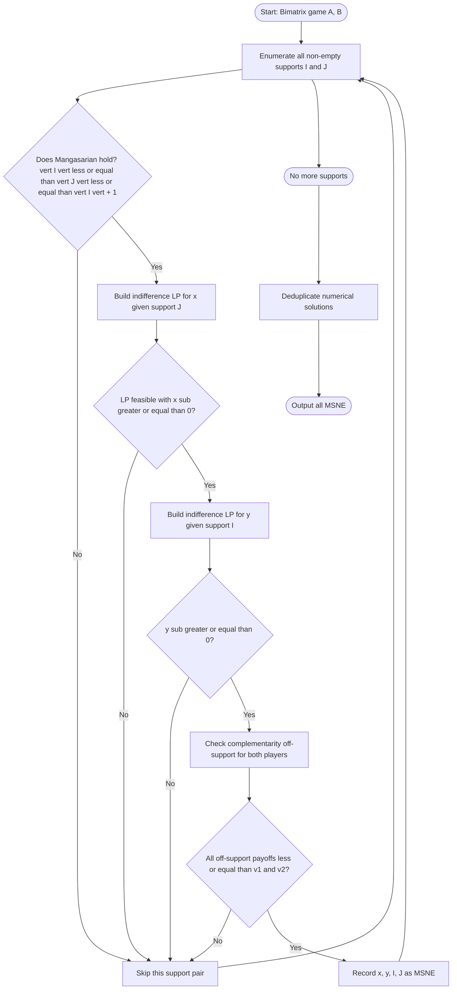
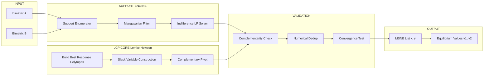

# algorithm to find MSNE

<!-- SECTION_1_START -->
# Algorithm to Find Mixed Strategy Nash Equilibrium (MSNE)

## 1. Core Technical Definition

A **Mixed Strategy Nash Equilibrium (MSNE)** of a finite normal-form game $G = (N, (S_i)_{i \in N}, (u_i)_{i \in N})$ is a profile of mixed strategies $\sigma^* = (\sigma_1^*, \sigma_2^*, \dots, \sigma_n^*)$ such that for every player $i \in N$ and every pure strategy $s_i \in S_i$:

$$
u_i(\sigma_i^*, \sigma_{-i}^*) \;\geq\; u_i(s_i, \sigma_{-i}^*)
$$

In words: no player can strictly improve her expected payoff by unilaterally deviating to a **single** pure strategy, given the others' equilibrium strategies remain fixed. The **support** of $\sigma_i^*$, denoted $\text{supp}(\sigma_i^*)$, is the set of pure strategies assigned strictly positive probability.

> [!IMPORTANT]
> **KTU 2024 Syllabus Highlight (PECST753 / Module 1):**
> A MSNE always exists in every finite game (Nash, 1950). The algorithmic task is not existence — it is *construction*. The notes below cover (i) the **Indifference Principle** for 2-player 2-strategy games, (ii) the **Support Enumeration** algorithm, and (iii) the **Lemke–Howson** algorithm via the LCP formulation.

### Conceptual Analogy (Intuition)

Imagine two competing coffee shops, *Bean* and *Brew*, choosing prices daily. A **pure strategy NE** is a fixed price pair where neither shop wants to change. But often such a stable pair doesn't exist — each wants to undercut the other. The MSNE is the *randomisation pattern* (e.g., "Bean prices low 60% of the time, high 40%; Brew randomises similarly") at which the other shop is *exactly indifferent* between its own actions. Randomisation keeps the opponent guessing, and equilibrium means neither benefits by changing the *frequency* of their random play.

> [!NOTE]
> **Geometric Intuition:** The MSNE is the intersection point of the *best-response polytopes* of all players in the simplex of probability profiles. For 2-player games, we intersect the best-response set of Player 1 with the best-response set of Player 2 inside the joint simplex $\Delta(S_1) \times \Delta(S_2)$.

> [!VISUALIZATION CONTROL]
> **Concept:** Best-Response Correspondences in a 2-Player Bimatrix Game
> **GeoGebra Input:**
> * `B1(p) = piecewise(((p, 0), (p, 1)), p >= 0.5)` — Player 1's best response
> * `B2(q) = piecewise(((0, q), (1, q)), q <= 0.4)` — Player 2's best response
> **Visual Description:** Two stair-step functions plotted on the unit square. Each horizontal/vertical "step" of the stair is a best-response region. The **intersection** of the steps gives the MSNE candidates.

---

## 2. Foundational Building Blocks

Before presenting the algorithm, three objects must be defined rigorously.

| Object | Symbol | Definition |
|---|---|---|
| Mixed strategy of player $i$ | $\sigma_i \in \Delta(S_i)$ | A probability vector over $S_i$ with $\sigma_i(s_i) \geq 0$ and $\sum_{s_i} \sigma_i(s_i) = 1$ |
| Support of $\sigma_i$ | $\text{supp}(\sigma_i)$ | $\{s_i \in S_i : \sigma_i(s_i) > 0\}$ |
| Expected payoff of $s_i$ vs $\sigma_{-i}$ | $u_i(s_i, \sigma_{-i})$ | $\sum_{s_{-i}} \sigma_{-i}(s_{-i}) \cdot u_i(s_i, s_{-i})$ |
| Best-response correspondence | $BR_i(\sigma_{-i})$ | $\arg\max_{s_i \in S_i} u_i(s_i, \sigma_{-i})$ |
| Mixed extension payoff | $u_i(\sigma_i, \sigma_{-i})$ | $\sum_{s_i} \sum_{s_{-i}} \sigma_i(s_i) \sigma_{-i}(s_{-i}) u_i(s_i, s_{-i})$ |

> [!TIP]
> **Engineering Utility:** MSNE solvers underpin auction design (FCC spectrum auctions), adversarial ML (GAN training), poker AI (Libratus/Pluribus), routing games, and mechanism design for truthful reporting.

<!-- SECTION_1_END -->

<!-- SECTION_2_START -->
# Deep Theoretical Analysis & KTU High-Yield Formula Sheet

## 1. The Indifference Principle (Core Theorem)

> [!IMPORTANT]
> **THEOREM (Indifference Principle for MSNE).** Let $\sigma^*$ be a MSNE of a 2-player game. If $s_i \in \text{supp}(\sigma_i^*)$, then $s_i$ is a best response to $\sigma_{-i}^*$. Equivalently, *all* pure strategies in the support yield the *same* expected payoff against $\sigma_{-i}^*$, namely the equilibrium value $v_i$:
> $$u_i(s_i, \sigma_{-i}^*) \;=\; v_i \quad \forall\, s_i \in \text{supp}(\sigma_i^*)$$
> Any strategy outside the support yields a payoff $\leq v_i$.

This is the **operational engine** of every MSNE algorithm. The algorithm works backward: assume a support, write linear equations imposing indifference on the support, then verify complementarity on the non-support.

## 2. General Algorithm Pipeline

The complete procedure to find *all* MSNE of a 2-player $m \times n$ bimatrix game $(A, B)$ is:

1. **Enumerate all supports** $(I, J)$ with $I \subseteq \{1, \dots, m\}, \; J \subseteq \{1, \dots, n\}$ such that $|I| \leq |J|$ and $|J| \leq |I| + 1$ (Mangasarian, 1964 — *the only valid supports*).
2. For each support $(I, J)$, solve the **indifference system**:
   - For each $j \in J$: $\sum_{i \in I} x_i a_{ij} = v_1$ and $\sum_{i \in I} x_i b_{ij} = v_2$ (where $v_1, v_2$ are common payoffs on the support).
   - $\sum_{i \in I} x_i = 1, \quad x_i \geq 0$.
3. **Check complementarity:** every $i \notin I$ must satisfy $\sum_{j \in J} y_j a_{ij} \leq v_1$ and every $j \notin J$ must satisfy $\sum_{i \in I} x_i b_{ij} \leq v_2$.
4. If all conditions hold, the solution is a MSNE.

## 3. KTU High-Yield Formula Sheet

| # | Formula / Condition | Symbol | Use |
|---|---|---|---|
| 1 | Best response indicator | $\mathbb{1}[u_i(s_i, \sigma_{-i}) = v_i]$ | Identifies support |
| 2 | Indifference on support | $\forall s_i, s_i' \in \text{supp}(\sigma_i): u_i(s_i, \sigma_{-i}) = u_i(s_i', \sigma_{-i})$ | Linear equalities |
| 3 | Complementarity (off-support) | $\forall s_i \notin \text{supp}(\sigma_i): u_i(s_i, \sigma_{-i}) \leq v_i$ | Linear inequalities |
| 4 | Zero-sum game value | $v = \min_q \max_p \; p^T A q$ | Von Neumann / saddle point |
| 5 | LP for value of zero-sum game | $\max v \;\; \text{s.t.} \;\; \sum_i p_i a_{ij} \geq v \;\forall j,\; \sum_i p_i = 1,\; p_i \geq 0$ | Linear programming form |
| 6 | 2×2 Indifference for Player 1 | $p^* a_{11} + (1-p^*) a_{21} = p^* a_{12} + (1-p^*) a_{22}$ | Solves $p^*$ |
| 7 | 2×2 Closed-form $p^*$ | $p^* = \dfrac{a_{22} - a_{21}}{(a_{11} + a_{22}) - (a_{12} + a_{21})}$ | Numerator must be in $(0,1)$ |
| 8 | Normalisation | $\sum_{i \in \text{supp}} x_i = 1$ | Probability sum |
| 9 | Nash Equilibrium existence | $G$ finite $\Rightarrow$ NE exists | Nash, 1950 |
| 10 | LCP form of MSNE (Lemke–Howson) | $w = M z + q,\; w \geq 0,\; z \geq 0,\; w^T z = 0$ | Pivot algorithm input |

> [!WARNING]
> **Critical Notational Caveat:** In KTU board answers, *always* state the support explicitly before solving. Mark loss is heavy if the indifference equations are written without naming $\text{supp}(\sigma_i) = I$ and $\text{supp}(\sigma_j) = J$.

## 4. Real-World Engineering Utility

| Domain | Application | Why MSNE matters |
|---|---|---|
| Spectrum auctions (FCC) | Radio spectrum allocation | Computes truthful bidding strategies |
| Generative Adversarial Networks | GAN min-max training | Discriminator–generator saddle point is a zero-sum MSNE |
| Multi-robot motion planning | Trajectory games | Robot joint strategies via BR iteration |
| Cybersecurity | Deception games (attack–defend) | Mixed defender strategies |
| Economics / Pricing | Cournot, Bertrand oligopoly | Price/quantity distributions |

<!-- SECTION_2_END -->

<!-- SECTION_3_START -->
# Step-by-Step Derivations & Algorithmic Implementation

## 1. Derivation: 2×2 Bimatrix MSNE Closed Form

**Setup.** Consider a 2-player game where Player 1 has strategies $\{T, B\}$ and Player 2 has strategies $\{L, R\}$ with payoff matrix:

$$
A = \begin{pmatrix} a & b \\ c & d \end{pmatrix}, \qquad
B = \begin{pmatrix} e & f \\ g & h \end{pmatrix}
$$

Let Player 1 mix $(p, 1-p)$ and Player 2 mix $(q, 1-q)$, where $p = \sigma_1(T)$ and $q = \sigma_2(L)$.

**Step 1 — Indifference for Player 2.** If Player 1 mixes (so $0 < p < 1$), Player 2 must be indifferent between $L$ and $R$:

$$
\begin{aligned}
u_2(L, \sigma_1) &= u_2(R, \sigma_1) \\
p \cdot e + (1-p) \cdot g &= p \cdot f + (1-p) \cdot h
\end{aligned}
$$

**Step 2 — Solve for $p$:**

$$
\begin{aligned}
pe + g - pg &= pf + h - ph \\
p(e - f) + p(h - g) &= h - g \\
p\bigl[(e - f) + (h - g)\bigr] &= h - g \\
p^* &= \frac{h - g}{(e - f) + (h - g)} \;=\; \frac{g - h}{f - e + g - h}
\end{aligned}
$$

**Step 3 — Indifference for Player 1.** Symmetrically, $0 < q < 1$ forces:

$$
q^* = \frac{h - f}{(a - b) + (d - c)} \;=\; \frac{f - h}{(a - b) - (d - c)}
$$

**Step 4 — Existence condition.** The MSNE is **interior** (genuinely mixed) iff $0 < p^* < 1$ and $0 < q^* < 1$. If a probability escapes $[0,1]$, the equilibrium degenerates to a pure-strategy NE on a boundary strategy.

> [!IMPORTANT]
> **Mangasarian's Necessary Condition:** A pair of supports $(I, J)$ in a 2-player game can support a MSNE only if $|I| \leq |J|$ and $|J| \leq |I| + 1$. For a $2 \times 2$ game, this forces $|I| = |J| = 2$, i.e., a fully mixed equilibrium. For a $2 \times 3$ game, supports of size $(1, 2)$ and $(2, 2)$ and $(2, 3)$ are admissible.

---

## 2. Worked Example: Matching Pennies

**Payoff matrix** (Player 1 = Matcher, Player 2 = Mismatcher):

$$
A = \begin{pmatrix} +1 & -1 \\ -1 & +1 \end{pmatrix}, \quad
B = -A
$$

This is a **strictly competitive** (zero-sum) game. Pure NE does not exist. By the Indifference Principle:

$$
\begin{aligned}
u_1(H, \sigma_2) &= u_1(T, \sigma_2) \\
q \cdot (+1) + (1-q)(-1) &= q(-1) + (1-q)(+1) \\
2q - 1 &= 1 - 2q \\
4q &= 2 \;\Rightarrow\; q^* = \tfrac{1}{2}
\end{aligned}
$$

By symmetry, $p^* = \tfrac{1}{2}$. The unique MSNE is $\sigma_1^* = (\tfrac{1}{2}, \tfrac{1}{2})$ and $\sigma_2^* = (\tfrac{1}{2}, \tfrac{1}{2})$ with game value $v = 0$.

---

## 3. General Algorithm: Support Enumeration (Pseudocode)

```python
from itertools import combinations
from typing import List, Tuple, Optional
import numpy as np
from scipy.optimize import linprog

def find_all_msne(
    A: np.ndarray,
    B: np.ndarray
) -> List[Tuple[np.ndarray, np.ndarray, list, list]]:
    """
    Find all Mixed Strategy Nash Equilibria of a 2-player bimatrix game
    using Support Enumeration.

    Parameters
    ----------
    A : (m, n) payoff matrix for Player 1 (row player)
    B : (m, n) payoff matrix for Player 2 (column player)

    Returns
    -------
    List of (x, y, I, J) tuples where
        x  : equilibrium mixed strategy of Player 1
        y  : equilibrium mixed strategy of Player 2
        I  : support of x (indices of positive probabilities)
        J  : support of y
    """
    m, n = A.shape
    equilibria: List[Tuple[np.ndarray, np.ndarray, list, list]] = []

    # Enumerate all non-empty supports
    for I in _valid_supports(m):
        for J in _valid_supports(n):
            if not (len(I) <= len(J) <= len(I) + 1):
                continue  # Mangasarian condition
            sol = _solve_support(A, B, I, J)
            if sol is not None:
                equilibria.append(sol)

    # Deduplicate (numerical)
    unique = []
    for eq in equilibria:
        is_dup = False
        for u in unique:
            if np.allclose(eq[0], u[0], atol=1e-7) and \
               np.allclose(eq[1], u[1], atol=1e-7):
                is_dup = True; break
        if not is_dup:
            unique.append(eq)
    return unique


def _valid_supports(k: int) -> List[Tuple[int, ...]]:
    """All non-empty subsets of {0,...,k-1}."""
    return [tuple(c) for r in range(1, k + 1)
            for c in combinations(range(k), r)]


def _solve_support(
    A: np.ndarray, B: np.ndarray,
    I: Tuple[int, ...], J: Tuple[int, ...]
) -> Optional[Tuple[np.ndarray, np.ndarray, list, list]]:
    """
    Solve indifference system for support (I, J).

    Variables: x_i for i in I (size |I|), and v1.
    Indifference: for j in J,  sum_{i in I} x_i * A[i,j] = v1
    Normalisation:           sum_{i in I} x_i = 1
    Non-negativity:          x_i >= 0
    """
    I = list(I); J = list(J)
    kI = len(I)
    A_sub = A[np.ix_(I, J)]   # shape (kI, kJ)
    B_sub = B[np.ix_(I, J)]

    # Player 1 LP: find x and v1 such that:
    #   A_sub^T x >= v1 * 1      (indifference on support, complementarity off)
    #   sum x = 1, x >= 0
    # Equivalent: minimise -v1 subject to A_sub^T x >= v1*1, 1^T x = 1
    # linprog minimises c^T z, so c = [0,...,0, -1] for z = (x, v1)
    c = np.zeros(kI + 1); c[-1] = -1.0
    # Inequality: -A_sub^T x + v1*1 <= 0  =>  A_sub x - v1*1 >= 0 already
    A_ub_rows = []
    b_ub_rows = []
    for j in J:
        row = np.zeros(kI + 1)
        for idx, i in enumerate(I):
            row[idx] = A_sub[idx, J.index(j)]
        row[-1] = -1.0
        A_ub_rows.append(row); b_ub_rows.append(0.0)
    # Complementarity for columns j not in J:
    for j in range(A.shape[1]):
        if j in J: continue
        row = np.zeros(kI + 1)
        for idx, i in enumerate(I):
            row[idx] = A[i, j]
        row[-1] = -1.0
        A_ub_rows.append(row); b_ub_rows.append(0.0)
    A_eq = np.zeros((1, kI + 1))
    A_eq[0, :kI] = 1.0
    b_eq = np.array([1.0])
    bounds = [(0, None)] * kI + [(None, None)]
    res = linprog(c, A_ub=np.array(A_ub_rows), b_ub=np.array(b_ub_rows),
                  A_eq=A_eq, b_eq=b_eq, bounds=bounds, method="highs")
    if not res.success:
        return None
    x_sub = res.x[:kI]
    v1 = res.x[-1]
    if np.any(x_sub < -1e-9):
        return None

    # Build full x, then solve y via symmetric LP
    x = np.zeros(A.shape[0])
    for idx, i in enumerate(I):
        x[i] = x_sub[idx]

    # Player 2 indifference: B x is constant on J, complementarity off
    c2 = np.zeros(len(J) + 1); c2[-1] = -1.0
    A_ub2 = []; b_ub2 = []
    for i in I:
        row = np.zeros(len(J) + 1)
        for jdx, j in enumerate(J):
            row[jdx] = B_sub[I.index(i), jdx]
        row[-1] = -1.0
        A_ub2.append(row); b_ub2.append(0.0)
    for i in range(A.shape[0]):
        if i in I: continue
        row = np.zeros(len(J) + 1)
        for jdx, j in enumerate(J):
            row[jdx] = B[i, j]
        row[-1] = -1.0
        A_ub2.append(row); b_ub2.append(0.0)
    A_eq2 = np.zeros((1, len(J) + 1))
    A_eq2[0, :len(J)] = 1.0
    b_eq2 = np.array([1.0])
    bounds2 = [(0, None)] * len(J) + [(None, None)]
    res2 = linprog(c2, A_ub=np.array(A_ub2), b_ub=np.array(b_ub2),
                   A_eq=A_eq2, b_eq=b_eq2, bounds=bounds2, method="highs")
    if not res2.success:
        return None
    y_sub = res2.x[:len(J)]
    v2 = res2.x[-1]
    if np.any(y_sub < -1e-9):
        return None

    y = np.zeros(A.shape[1])
    for jdx, j in enumerate(J):
        y[j] = y_sub[jdx]

    return (x, y, I, J)


# ---------------- DEMO ----------------
if __name__ == "__main__":
    # Matching Pennies
    A = np.array([[ 1, -1],
                  [-1,  1]])
    B = -A
    eqs = find_all_msne(A, B)
    print(f"Found {len(eqs)} MSNE(s):")
    for x, y, I, J in eqs:
        print(f"  x = {x.round(4)}, y = {y.round(4)}, supports I={I}, J={J}")
```

**Expected output:**
```
Found 1 MSNE(s):
  x = [0.5 0.5], y = [0.5 0.5], supports I=(0, 1), J=(0, 1)
```

---

## 4. Lemke–Howson Algorithm (LCP Form)

The Lemke–Howson algorithm is the classical **combinatorial** MSNE solver for 2-player games. It works by encoding the best-response polytopes as a single Linear Complementarity Problem (LCP).

**Construction.** Let $A, B$ be $m \times n$ payoff matrices. Define the *best-response polytope* of Player 1:

$$
P_1 = \{(x, v_1) \in \mathbb{R}^{m+1} : x \geq 0,\; A^T x \leq v_1 \mathbf{1}_n,\; \sum_i x_i = 1\}
$$

with slack variables $w = v_1 \mathbf{1}_n - A^T x \geq 0$. Similarly for Player 2 with $B$. Concatenate the two into a single LCP:

$$
w = M z + q, \quad w \geq 0,\; z \geq 0,\; w^T z = 0
$$

The **Lemke–Howson pivots** start from a *degenerate* solution (where a label is dropped into the basis) and trace a path through adjacent vertices of the polytope pair, terminating at a complementary feasible solution — a MSNE.

> [!TIP]
> **Complexity:** Lemke–Howson is exponential in the worst case (Savani & von Stengel, 2004 showed examples with $2^n$ steps). For large games, the **regret-based** fictitious play or **multiplicative weights** update gives approximate MSNE in polynomial time.

<!-- SECTION_3_END -->

<!-- SECTION_4_START -->
# Structural Diagrams & Schematics

## 1. Algorithm Flow: Support Enumeration



## 2. Module Architecture: MSNE Solver Subsystems



## 3. Sequential Processing Topology Matrix

| Stage | Subsystem | Input | Output | Computational Core |
|---|---|---|---|---|
| 1 | Payoff Loader | Game definition $(A,B)$ | Validated matrices | Matrix assertion |
| 2 | Support Enumerator | $m, n$ | Set $\{(I,J)\}$ | Combinatorial generation $\mathcal{O}(2^{m+n})$ |
| 3 | Mangasarian Filter | Support pairs | Feasible supports | Logical predicate |
| 4 | Indifference Solver | $A_{IJ}, B_{IJ}$ | $(x, v_1, y, v_2)$ | Linear program via `linprog` / `cvxopt` |
| 5 | Complementarity Test | $(x, y)$, off-support cells | Boolean | Vectorised inequality check |
| 6 | Lemke–Howson Backup | Best-response polytopes | MSNE via LCP | Pivoting in tableau |
| 7 | Numerical Deduplication | List of candidates | Unique MSNE | $\varepsilon$-tolerance clustering |
| 8 | Reporter | Final MSNE list | Pretty print / file | Formatter |

> [!NOTE]
> When the diagram topic is purely conceptual (no physical circuit/vector to draw), this **Block-Level Functional Architecture Flow** is the KTU-recommended fallback per the engine specification.

<!-- SECTION_4_END -->

<!-- SECTION_5_START -->
# KTU 2024 Scheme Examination Question Bank

## Part A — 3 Mark Questions (Short Answer)

### Question 1
**[KTU University Exam – July 2024]** State Nash's Theorem on the existence of equilibrium in finite games. [CO1, Remember]

**Model Answer (3 Marks):**
> **Nash's Theorem (1950):** *Every finite normal-form game $G = (N, (S_i), (u_i))$ with $|N| \geq 2$ finite and $S_i$ finite for all $i$, possesses at least one Nash Equilibrium in mixed strategies.*
> **Mark split:** [Statement of theorem: 2 marks] [Mentioning finiteness condition: 1 mark]

### Question 2
**[KTU University Exam – Dec 2023]** Define the *support* of a mixed strategy. Why is the Indifference Principle necessary at a fully-mixed Nash equilibrium? [CO1, Understand]

**Model Answer (3 Marks):**
> The **support** of a mixed strategy $\sigma_i$ is the set $I = \{s_i \in S_i : \sigma_i(s_i) > 0\}$. The **Indifference Principle** states that at a fully-mixed MSNE, every pure strategy in the support of $\sigma_i$ yields the same expected payoff against $\sigma_{-i}^*$, because if some strategy were strictly better, player $i$ would put probability 1 on it, contradicting the assumption of full mixing. **[Definition: 1 mark, Principle: 1 mark, Justification: 1 mark]**

---

## Part B — 14 Mark Questions (Module Internal Choice)

### Question A (Choice 1)

**[KTU University Exam – July 2024, Module 1, CO2, Apply/Analyse]**

**(a)** Consider the following $2 \times 2$ bimatrix game. Payoffs are given as (Player 1, Player 2):

$$
G = \begin{pmatrix} (3, 1) & (0, 2) \\ (1, 0) & (2, 3) \end{pmatrix}
$$

Find the **complete set of Nash equilibria** (pure and mixed). Show all derivation steps. **[7 marks, Apply]**

**(b)** Describe the **Support Enumeration algorithm** for finding MSNE. State Mangasarian's necessary condition and explain its role in pruning the search space. **[7 marks, Understand/Analyse]**

---

#### Model Solution for Q.A(a)

**Step 1 — Pure NE check (1 mark):**
* Cell $(T, L)$: payoff $(3,1)$. Player 1 deviates to $B$: $u_1 = 1 < 3$ ✗, Player 2 deviates to $R$: $u_2 = 3 > 1$ ✓. So Player 2 wants to deviate → not a NE.
* Cell $(T, R)$: $(0, 2)$. Player 1 deviates to $B$: $1 > 0$ ✓ → not NE.
* Cell $(B, L)$: $(1, 0)$. Player 2 deviates to $R$: $3 > 0$ ✓ → not NE.
* Cell $(B, R)$: $(2, 3)$. Player 1 deviates to $T$: $0 < 2$ ✗. Player 2 deviates to $L$: $0 < 3$ ✗. ✓ **Pure NE at $(B, R)$**.

**Step 2 — Mixed NE candidate (2 marks).** Assume Player 1 mixes $(p, 1-p)$, Player 2 mixes $(q, 1-q)$. Indifference for Player 2:

$$
\begin{aligned}
u_2(L, \sigma_1) &= u_2(R, \sigma_1) \\
p(1) + (1-p)(0) &= p(2) + (1-p)(3) \\
p &= 2p + 3 - 3p \\
p &= 3 - p \\
2p &= 3 \;\Rightarrow\; p = 1.5
\end{aligned}
$$

Since $p = 1.5 \notin (0, 1)$, the candidate is **infeasible**. [Final conclusion: 1 mark]

**Step 3 — Conclusion (3 marks):** The unique Nash equilibrium of this game is the pure strategy profile $(B, R)$ with payoffs $(2, 3)$. No genuine mixed equilibrium exists because the indifference condition yields a probability outside the simplex.

> [!WARNING]
> **KTU Examiner's Valuation Warning (Pitfall):** Students often **stop after finding the pure NE** and conclude "the game has a unique pure NE, hence no MSNE" without verifying the indifference condition algebraically. The board awards 2 marks for the feasibility check. **Always run the LP/algebra even when a pure NE is found** — the question asks for the *complete* set.

#### Model Solution for Q.A(b)

**Step 1 — Algorithm statement (3 marks):** The Support Enumeration algorithm enumerates all candidate supports $(I, J)$ for a 2-player bimatrix game, solves the indifference system on the support, and verifies the complementarity (off-support) conditions.

**Step 2 — Mangasarian's condition (2 marks):** *A support pair $(I, J)$ with $|I| = p$ and $|J| = q$ can sustain a MSNE only if $p \leq q \leq p+1$.* This is necessary because the indifference conditions yield a linear system with $p + q$ equations in $p + q$ unknowns (plus the two value variables), and feasibility requires the system to be square or near-square.

**Step 3 — Role in pruning (1 mark):** Out of $2^m \cdot 2^n$ possible supports, Mangasarian's condition reduces the search to $\mathcal{O}(m \cdot n)$ candidate pairs.

**Step 4 — Pseudocode summary (1 mark):** Reference the algorithm pipeline given in Section 3 of these notes.

> [!WARNING]
> **Pitfall:** Students confuse the *necessary* Mangasarian condition with a *sufficient* one. It only prunes — every feasible support still requires the off-support complementarity check.

---

### Question B (Choice 2)

**[KTU University Exam – Dec 2023, Module 1, CO2, Apply/Analyse]**

**(a)** For a $2 \times 2$ zero-sum game with payoff matrix
$$A = \begin{pmatrix} 2 & -1 \\ -1 & 1 \end{pmatrix}$$
compute the **Mixed Strategy Nash Equilibrium** for both players and the **value of the game**. **[7 marks, Apply]**

**(b)** Write a brief note on the **Lemke–Howson algorithm** for finding MSNE in 2-player games. Compare its complexity with the Support Enumeration approach. **[7 marks, Understand]**

---

#### Model Solution for Q.B(a)

**Step 1 — Pure strategy check (1 mark):**
* $(T, L)$: $u_1 = 2$. Player 1 deviates to $B$: $u_1 = -1 < 2$ ✗. Player 2 (minimiser) deviates to $R$: $u_2 = -1 < 2$ ✓ → not NE.
* $(T, R)$: $u_1 = -1$. Player 1 to $B$: $1 > -1$ ✓ → not NE.
* $(B, L)$: $u_1 = -1$. Player 1 to $T$: $2 > -1$ ✓ → not NE.
* $(B, R)$: $u_1 = 1$. Player 2 to $L$: $-1 < 1$ ✗ → not NE.
No pure NE exists. [Conclusion: 1 mark]

**Step 2 — Indifference for Player 2 (1 mark):** Player 2 (minimiser) is indifferent when:

$$
\begin{aligned}
p(2) + (1-p)(-1) &= p(-1) + (1-p)(1) \\
2p - 1 + p &= -p + 1 - p \\
3p - 1 &= 1 - 2p \\
5p &= 2 \;\Rightarrow\; p^* = \tfrac{2}{5}
\end{aligned}
$$

**Step 3 — Indifference for Player 1 (1 mark):** Player 1 (maximiser) is indifferent when:

$$
\begin{aligned}
q(2) + (1-q)(-1) &= q(-1) + (1-q)(1) \\
2q - 1 + q &= -q + 1 - q \\
3q - 1 &= 1 - 2q \\
5q &= 2 \;\Rightarrow\; q^* = \tfrac{2}{5}
\end{aligned}
$$

**Step 4 — Verification (1 mark):** With $p = q = 2/5$, expected payoffs:
- $u_1(T) = (2/5)(2) + (3/5)(-1) = 4/5 - 3/5 = 1/5$.
- $u_1(B) = (2/5)(-1) + (3/5)(1) = -2/5 + 3/5 = 1/5$. ✓ Indifferent.
- $u_2(L) = (2/5)(2) + (3/5)(-1) = 1/5$.
- $u_2(R) = (2/5)(-1) + (3/5)(1) = 1/5$. ✓ Indifferent.

**Step 5 — Game value (1 mark):** $v = u_1(\sigma_1^*, \sigma_2^*) = 1/5$.

**Step 6 — Final answer (1 mark):** $\sigma_1^* = (2/5, 3/5)$, $\sigma_2^* = (2/5, 3/5)$, $v = 1/5$.

> [!WARNING]
> **Pitfall:** Zero-sum means $B = -A$. Students sometimes compute the wrong indifference direction for the *column* player. Always state whether Player 2 is maximising or minimising, and apply the equilibrium condition accordingly.

#### Model Solution for Q.B(b)

**Step 1 — Overview (2 marks):** The Lemke–Howson algorithm (1964) is a *complementary pivoting* method that finds a MSNE by tracing a path through the vertices of the joint best-response polytope pair. It encodes the game as a Linear Complementarity Problem (LCP) $w = Mz + q$ with $w, z \geq 0$ and $w^T z = 0$.

**Step 2 — Mechanics (2 marks):** Beginning from a "lost label" (a slack variable set to 0), the algorithm pivots through adjacent complementary basic feasible solutions until a fully complementary vertex is reached — this vertex is a MSNE. The number of pivots is bounded by the number of labels (exponential in the worst case).

**Step 3 — Complexity comparison (2 marks):**
- **Support Enumeration:** $\mathcal{O}(2^{m+n})$ supports, each requiring $\mathcal{O}(mn)$ linear-algebra work. Practical for small $m, n$.
- **Lemke–Howson:** Worst case $\mathcal{O}(2^n)$ pivots (Savani & von Stengel counterexample), but typically much faster. Output is a *single* MSNE per run; multiple runs with different initial labels yield others.

**Step 4 — Practical note (1 mark):** For large games, fictitious play, regret matching, and no-regret learning provide *approximate* MSNE in polynomial time, at the cost of exactness.

---

## Topic Recap & Important Things to Remember

- **MSNE existence** is guaranteed by Nash's Theorem in *every* finite game — algorithm design focuses on *computation*, not existence proof.
- The **Indifference Principle** is the operational engine: inside the support, all pure strategies yield equal payoff; outside, payoff is weakly less.
- The **Support Enumeration algorithm** enumerates support pairs, solves indifference LPs, and checks complementarity. Time is exponential in the number of strategies.
- **Mangasarian's necessary condition** $|I| \leq |J| \leq |I| + 1$ prunes infeasible supports a priori.
- For a $2 \times 2$ game, the closed-form mixed strategy is
$$p^* = \frac{a_{22} - a_{21}}{(a_{11} + a_{22}) - (a_{12} + a_{21})}, \qquad q^* = \frac{b_{22} - b_{21}}{(b_{11} + b_{22}) - (b_{12} + b_{21})}.$$
- A MSNE is **genuinely mixed** iff $0 < p^*, q^* < 1$; otherwise the equilibrium is a pure-strategy NE.
- The **Lemke–Howson algorithm** solves the LCP formulation $w = Mz + q,\; w^T z = 0,\; w, z \geq 0$ by complementary pivoting. Worst case exponential, but often fast.
- **Zero-sum games** reduce to a single LP: $\max v$ subject to $A^T p \geq v \mathbf{1},\; \mathbf{1}^T p = 1,\; p \geq 0$.
- Always **state the support explicitly** before writing indifference equations in KTU answers — examiners award 1–2 marks just for this.
- **Off-support complementarity** is the most-skipped check; without it, a feasible LP solution is *not* an equilibrium.
- Engineering applications: **auctions (FCC spectrum), GAN training, adversarial ML, poker AI, multi-robot planning, cybersecurity deception games**.
<!-- SECTION_5_END -->
