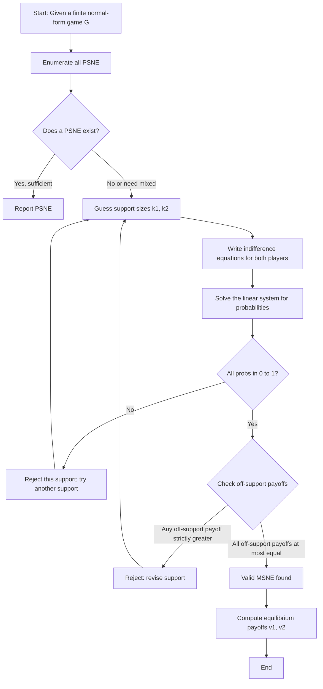
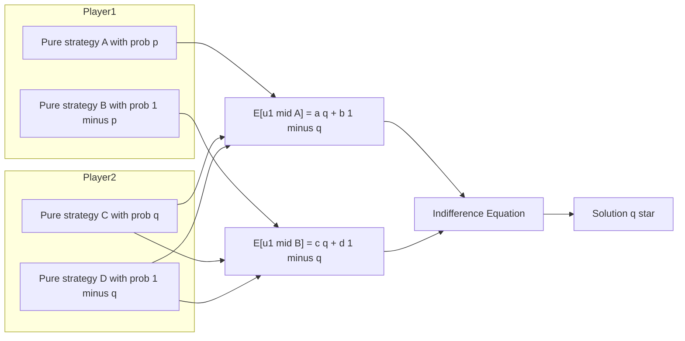
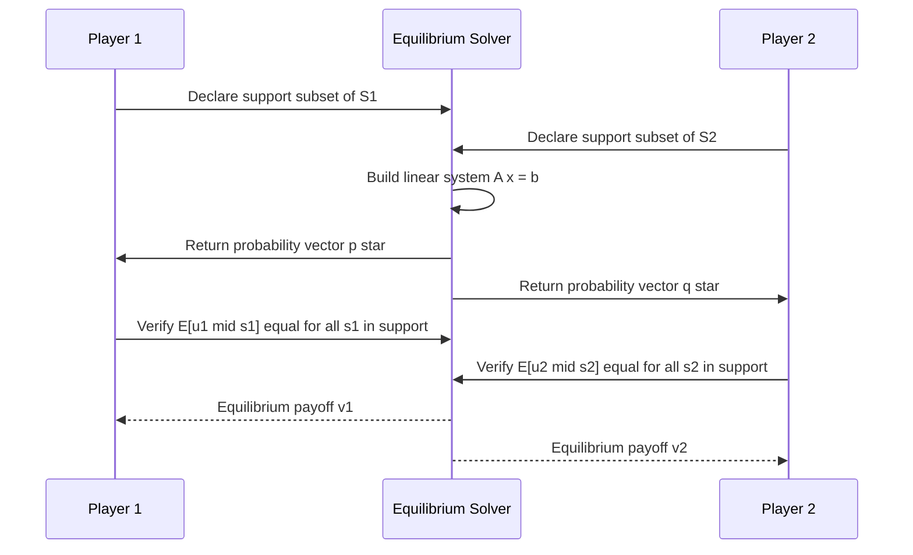
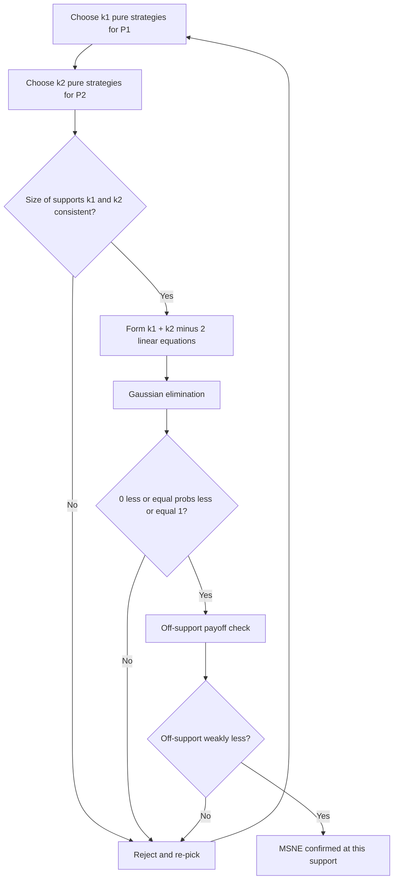

# finding MSNE

<!-- SECTION_1_START -->
# Finding Mixed Strategy Nash Equilibrium (MSNE)

## 1.1 Formal Definition

In a finite normal-form game $G = (N, (S_i)_{i \in N}, (u_i)_{i \in N})$, a **mixed strategy** of player $i$ is a probability distribution $\sigma_i$ over the finite pure strategy set $S_i$, i.e., $\sigma_i \in \Delta(S_i)$, where $\Delta(S_i)$ denotes the probability simplex on $S_i$.

> [!IMPORTANT]
> **Mixed Strategy Nash Equilibrium (MSNE)**
>
> A strategy profile $\sigma^* = (\sigma_1^*, \sigma_2^*, \ldots, \sigma_n^*)$ is a **Mixed Strategy Nash Equilibrium** if, for every player $i \in N$ and for every pure strategy $s_i \in S_i$:
> $$u_i(\sigma_i^*, \sigma_{-i}^*) \;\geq\; u_i(s_i, \sigma_{-i}^*)$$
> In words: **no player can strictly increase their expected payoff by deviating to any pure strategy**, given that all other players are playing $\sigma_{-i}^*$.

A MSNE is **fully mixed** if every pure strategy is played with strictly positive probability, i.e., $\sigma_i^*(s_i) > 0$ for all $s_i \in S_i$.

---

## 1.2 Conceptual Analogy: The "Coin-Flip" of Strategy

Imagine you and a friend are playing rock-paper-scissors. If you always play Rock, your friend will simply always play Paper and you will lose forever. To keep your friend **guessing**, you randomize — you secretly flip a fair coin before each round to choose Rock, Paper, or Scissors.

That randomization is your **mixed strategy**. Your opponent, knowing that you are randomizing uniformly, also has no profitable deviation — every pure response yields the **same expected payoff of zero**. The pair of mixed strategies where each player is indifferent across all pure actions is precisely a **Mixed Strategy Nash Equilibrium**.

> [!NOTE]
> **When does a MSNE exist?**
>
> By **Nash's Theorem (1950)**, every finite normal-form game has at least one Nash equilibrium in mixed strategies. So if a game has no Pure Strategy Nash Equilibrium (PSNE), the MSNE is *guaranteed* to exist.

---

## 1.3 The Indifference Condition: The Heart of MSNE

The single most important practical tool to compute a MSNE is the **Indifference Condition**.

> [!IMPORTANT]
> **Indifference Condition (Key Principle)**
>
> In a MSNE, every pure strategy that is played with **strictly positive probability** (i.e., every strategy in the **support**) must yield the **same expected payoff** against the opponents' equilibrium mixed strategies. Any pure strategy assigned **zero probability** must yield an expected payoff **no greater** than this common value.

Mathematically, let $\text{supp}(\sigma_i^*) = \{s_i \in S_i : \sigma_i^*(s_i) > 0\}$. Then:
$$u_i(s_i, \sigma_{-i}^*) = u_i(s_i', \sigma_{-i}^*) \quad \forall\, s_i, s_i' \in \text{supp}(\sigma_i^*)$$
$$u_i(s_i, \sigma_{-i}^*) \geq u_i(\tilde{s}_i, \sigma_{-i}^*) \quad \forall\, \tilde{s}_i \notin \text{supp}(\sigma_i^*)$$

This condition is the *engine* that lets us solve for the unknown probabilities in any finite game.

---

## 1.4 Geometric Intuition: The "Best-Response Set"

In a 2-player game, plot player 1's mixed strategy $p \in [0,1]$ on the horizontal axis. For each $p$, define player 2's best response set:
$$BR_2(p) = \arg\max_{q \in [0,1]} \; u_2(p, q)$$

A MSNE corresponds to a **point $(p^*, q^*)$** where $q^* \in BR_2(p^*)$ and $p^* \in BR_1(q^*)$ — the two best-response correspondences **cross** (or coincide) on the unit square.

> [!VISUALIZATION CONTROL]
> **Concept:** Best-Response Correspondences Crossing at MSNE
> **GeoGebra / Desmos Input Equations:**
> * `f(x) = 0` (player 2's lower step of best response)
> * `g(x) = 1` (player 2's upper step of best response)
> * `h(x) = 0.5` (player 1's best response at a specific $q$)
> **Visual Description:** A unit square with step-function curves; the intersection of the two best-response graphs is the geometric MSNE.

---

<!-- SECTION_1_END -->

<!-- SECTION_2_START -->
# Deep Theoretical Analysis & KTU High-Yield Formula Sheet

## 2.1 The Mixed Strategy Best-Response Condition

Let player $i$ use mixed strategy $\sigma_i$ and opponents play $\sigma_{-i}$. The expected payoff of playing pure strategy $s_i \in S_i$ is:

$$u_i(s_i, \sigma_{-i}) = \sum_{s_{-i} \in S_{-i}} \left[ \prod_{j \neq i} \sigma_j(s_j) \right] \cdot u_i(s_i, s_{-i})$$

The expected payoff of the *mixed* strategy $\sigma_i$ is the convex combination:
$$u_i(\sigma_i, \sigma_{-i}) = \sum_{s_i \in S_i} \sigma_i(s_i) \cdot u_i(s_i, \sigma_{-i})$$

For a MSNE, we need $\sigma_i$ to maximize this over all probability vectors — this is a **linear program** with a known closed-form solution in 2×2 games.

---

## 2.2 The Generic 2×2 Algorithm

Consider a 2-player game with the following payoff matrix (row player = Player 1, column player = Player 2):

|               | $C$ (prob. $q$) | $D$ (prob. $1-q$) |
|---------------|------------------|---------------------|
| $A$ (prob. $p$) | $a, \; \alpha$ | $b, \; \beta$       |
| $B$ (prob. $1-p$)| $c, \; \gamma$ | $d, \; \delta$      |

Each cell $(x, y)$ contains $(u_1, u_2)$. Let Player 1 mix with $p$ on $A$ and $1-p$ on $B$, and Player 2 mix with $q$ on $C$ and $1-q$ on $D$.

**Step 1 — Indifference of Player 2:** $E[u_2 \mid C] = E[u_2 \mid D]$:
$$\alpha \cdot p + \gamma(1-p) = \beta \cdot p + \delta(1-p)$$

Solving for $p^*$:
$$p^* = \frac{\delta - \gamma}{(\alpha - \beta) + (\delta - \gamma)}$$

(Valid only if $0 \leq p^* \leq 1$.)

**Step 2 — Indifference of Player 1:** $E[u_1 \mid A] = E[u_1 \mid B]$:
$$a \cdot q + b(1-q) = c \cdot q + d(1-q)$$

Solving for $q^*$:
$$q^* = \frac{d - b}{(a - c) + (d - b)}$$

(Valid only if $0 \leq q^* \leq 1$.)

**Step 3 — Verification:** Substitute the values back to confirm both are in $[0,1]$ and that no support is violated.

---

## 2.3 Existence Theorem (Nash, 1950)

> [!NOTE]
> **Theorem (Nash, 1950)**
>
> Every finite strategic-form game $G = (N, (S_i), (u_i))$ possesses at least one **mixed-strategy Nash equilibrium**.

**Proof sketch (Brouwer's fixed-point application):** The best-response correspondence $BR(\sigma) = \arg\max_{\sigma'} u(\sigma', \sigma_{-i})$ is a non-empty, convex-valued, upper hemi-continuous correspondence from the compact convex set $\Delta = \prod_i \Delta(S_i)$ to itself. By Kakutani's fixed-point theorem, a fixed point $\sigma^*$ exists with $\sigma^* \in BR(\sigma^*)$ — this is precisely a MSNE.

---

## 2.4 KTU High-Yield Formula Cheat Sheet

| # | Concept | Formula / Condition | Notes |
|---|---------|---------------------|-------|
| 1 | Expected payoff of pure strategy $s_i$ | $u_i(s_i, \sigma_{-i}) = \sum_{s_{-i}} \left[ \prod_{j \neq i} \sigma_j(s_j) \right] u_i(s_i, s_{-i})$ | Used in indifference setup |
| 2 | Indifference equation (2×2, P1) | $a q + b(1-q) = c q + d(1-q)$ | $A$ and $B$ must yield same payoff |
| 3 | Solution $q^*$ | $q^* = \frac{d - b}{(a - c) + (d - b)}$ | P2 mixes to make P1 indifferent |
| 4 | Solution $p^*$ | $p^* = \frac{\delta - \gamma}{(\alpha - \beta) + (\delta - \gamma)}$ | P1 mixes to make P2 indifferent |
| 5 | Feasibility check | $0 \leq p^* \leq 1, \; 0 \leq q^* \leq 1$ | Otherwise MSNE is on a corner (PSNE) |
| 6 | Expected payoff of $\sigma_i$ | $u_i(\sigma_i, \sigma_{-i}) = \sum_{s_i} \sigma_i(s_i) u_i(s_i, \sigma_{-i})$ | Convex combination of pure payoffs |
| 7 | MSNE existence | Guaranteed in every finite game | Nash (1950), Kakutani FPT |
| 8 | Support $\text{supp}(\sigma_i^*)$ | $\{s_i : \sigma_i^*(s_i) > 0\}$ | Strictly positive probabilities |
| 9 | Off-support payoff | $u_i(\tilde{s}_i, \sigma_{-i}^*) \leq u_i(s_i, \sigma_{-i}^*) \;\forall \tilde{s}_i \notin \text{supp}$ | No profitable deviation |
| 10 | Equilibrium payoff | $v_i^* = u_i(\sigma_i^*, \sigma_{-i}^*)$ | Value of the game to player $i$ |

> **Note on engineering utility:** MSNE concepts are the analytical foundation of mechanism design, auction theory (Vickrey, Myerson), routing games in networks, and adversarial ML defenses (e.g., mixed strategies in zero-sum game-playing agents like AlphaGo's policy networks).

---

## 2.5 Real-World Engineering & CS Utility

- **Network Security:** Randomized patrol schedules of security agents against attackers are computed as MSNE in pursuit-evasion games.
- **Algorithmic Game Theory:** Google's ad-auction mechanisms (GSP, VCG) require MSNE to reason about bidding behavior.
- **RoboCup & Game AI:** Mixed strategies in zero-sum robot soccer to keep opponents from predicting action selection.
- **Cryptographic Protocol Design:** Mixed strategies underlie randomized response protocols for privacy.

---

<!-- SECTION_2_END -->

<!-- SECTION_3_START -->
# Step-by-Step Derivations & Worked Examples

## 3.1 Example 1 — Matching Pennies (Zero-Sum, 2×2)

### Payoff Matrix (Player 1 rows, Player 2 columns; entry = $u_1$, $u_2 = -u_1$)

|       | Heads ($H$) | Tails ($T$) |
|-------|-------------|--------------|
| Heads ($H$) | $1, \; -1$ | $-1, \; 1$   |
| Tails ($T$) | $-1, \; 1$ | $1, \; -1$   |

### Step 1 — Verify no PSNE exists
- $(H, H)$: P2 can deviate to $T$ and gain $1$ → not NE.
- $(H, T)$: P1 can deviate to $T$ and gain $1$ → not NE.
- $(T, H)$: P1 can deviate to $H$ and gain $1$ → not NE.
- $(T, T)$: P2 can deviate to $H$ and gain $1$ → not NE.

So no PSNE exists; by Nash's theorem a **fully mixed** MSNE must exist.

### Step 2 — Player 1's indifference condition
Let Player 2 play $q$ on $H$ and $1-q$ on $T$. Expected payoffs to Player 1:
$$E[u_1 \mid H] = 1 \cdot q + (-1)(1-q) = 2q - 1$$
$$E[u_1 \mid T] = (-1) \cdot q + 1 \cdot (1-q) = 1 - 2q$$
Set equal:
$$2q - 1 = 1 - 2q \;\Longrightarrow\; 4q = 2 \;\Longrightarrow\; q^* = \tfrac{1}{2}$$

### Step 3 — Player 2's indifference condition
Let Player 1 play $p$ on $H$ and $1-p$ on $T$. Expected payoffs to Player 2:
$$E[u_2 \mid H] = (-1) \cdot p + 1 \cdot (1-p) = 1 - 2p$$
$$E[u_2 \mid T] = 1 \cdot p + (-1)(1-p) = 2p - 1$$
Set equal:
$$1 - 2p = 2p - 1 \;\Longrightarrow\; 4p = 2 \;\Longrightarrow\; p^* = \tfrac{1}{2}$$

### Step 4 — MSNE Summary
$$\sigma_1^* = \left(\tfrac{1}{2}, \tfrac{1}{2}\right), \qquad \sigma_2^* = \left(\tfrac{1}{2}, \tfrac{1}{2}\right)$$
Value of the game: $v = 0$ to both players.

> **Verification:** With $p^* = 1/2$, $E[u_2 \mid H] = E[u_2 \mid T] = 0$, so P2 is indifferent. With $q^* = 1/2$, $E[u_1 \mid H] = E[u_1 \mid T] = 0$, so P1 is indifferent. ✓

---

## 3.2 Example 2 — Battle of the Sexes (Coordination, 2×2)

### Payoff Matrix

|       | Football ($F$) | Shopping ($S$) |
|-------|----------------|-----------------|
| Football ($F$) | $2, \; 1$ | $0, \; 0$       |
| Shopping ($S$) | $0, \; 0$ | $1, \; 2$       |

### Step 1 — Identify PSNE
$(F, F)$ and $(S, S)$ are pure NE. (Each player prefers the matching pure outcome.) So PSNE exists; we look for a *mixed* equilibrium on top of these.

### Step 2 — Player 1's indifference
Let P2 play $q$ on $F$ and $1-q$ on $S$:
$$E[u_1 \mid F] = 2q + 0(1-q) = 2q$$
$$E[u_1 \mid S] = 0 \cdot q + 1(1-q) = 1 - q$$
Set equal:
$$2q = 1 - q \;\Longrightarrow\; 3q = 1 \;\Longrightarrow\; q^* = \tfrac{1}{3}$$

### Step 3 — Player 2's indifference
Let P1 play $p$ on $F$ and $1-p$ on $S$:
$$E[u_2 \mid F] = 1 \cdot p + 0(1-p) = p$$
$$E[u_2 \mid S] = 0 \cdot p + 2(1-p) = 2 - 2p$$
Set equal:
$$p = 2 - 2p \;\Longrightarrow\; 3p = 2 \;\Longrightarrow\; p^* = \tfrac{2}{3}$$

### Step 4 — MSNE
$$\sigma_1^* = \left(\tfrac{2}{3}, \tfrac{1}{3}\right), \qquad \sigma_2^* = \left(\tfrac{1}{3}, \tfrac{2}{3}\right)$$
P1 plays $F$ more often (2/3) because he values it more ($u_1(F,F) = 2$ vs. $u_1(S,S) = 1$).

### Step 5 — Equilibrium payoff to P1
$$u_1(\sigma_1^*, \sigma_2^*) = 2 \cdot \tfrac{1}{3} + 0 = \tfrac{2}{3}$$
P2: $u_2(\sigma_1^*, \sigma_2^*) = 1 \cdot \tfrac{2}{3} + 0 = \tfrac{2}{3}$. Both get $2/3$, strictly less than the pure payoffs — the **inefficiency of mixing**.

---

## 3.3 Example 3 — General 2×2 with Off-Support Check

Suppose P1 has payoffs $(A \text{ vs } C, A \text{ vs } D, B \text{ vs } C, B \text{ vs } D) = (5, 1, 0, 4)$ and P2 has $(\alpha, \beta, \gamma, \delta) = (2, 5, 4, 3)$.

**P1 indifference:** $5q + 1(1-q) = 0 \cdot q + 4(1-q)$
$$5q + 1 - q = 4 - 4q \;\Longrightarrow\; 4q + 1 = 4 - 4q \;\Longrightarrow\; 8q = 3 \;\Longrightarrow\; q^* = \tfrac{3}{8}$$

**P2 indifference:** $2p + 4(1-p) = 5p + 3(1-p)$
$$2p + 4 - 4p = 5p + 3 - 3p \;\Longrightarrow\; 4 - 2p = 2p + 3 \;\Longrightarrow\; 4p = 1 \;\Longrightarrow\; p^* = \tfrac{1}{4}$$

**Feasibility:** $p^* = 1/4 \in [0,1]$ and $q^* = 3/8 \in [0,1]$. ✓
**Conclusion:** Fully mixed MSNE exists at $\sigma_1^* = (1/4, 3/4)$ on $(A, B)$ and $\sigma_2^* = (3/8, 5/8)$ on $(C, D)$.

---

## 3.4 Python Implementation (Verification Tool)

```python
from fractions import Fraction
from typing import List, Tuple

def find_msne_2x2(
    u1: List[List[float]],
    u2: List[List[float]]
) -> Tuple[Fraction, Fraction, float, float]:
    """
    Find the fully-mixed MSNE of a 2x2 normal-form game.
    u1[i][j] and u2[i][j] are payoffs in row i, column j.
    Returns (p*, q*, value_to_p1, value_to_p2) as Fractions/values.
    """
    a, b = u1[0][0], u1[0][1]   # P1: A vs C, A vs D
    c, d = u1[1][0], u1[1][1]   # P1: B vs C, B vs D
    al, be = u2[0][0], u2[0][1] # P2: C vs A, C vs B  (renamed to avoid 'beta')
    ga, de = u2[1][0], u2[1][1] # P2: D vs A, D vs B  (renamed to avoid 'gamma','delta')

    # P1 indifferent -> solve for q
    q_star = Fraction(d - b, (a - c) + (d - b))
    # P2 indifferent -> solve for p
    p_star = Fraction(de - ga, (al - be) + (de - ga))

    if not (0 <= p_star <= 1) or not (0 <= q_star <= 1):
        raise ValueError("Infeasible mixed probabilities; check supports.")

    v1 = float(p_star * q_star * a + p_star * (1 - q_star) * b
             + (1 - p_star) * q_star * c + (1 - p_star) * (1 - q_star) * d)
    v2 = float(p_star * q_star * al + p_star * (1 - q_star) * be
             + (1 - p_star) * q_star * ga + (1 - p_star) * (1 - q_star) * de)
    return p_star, q_star, v1, v2


# --- Verification on the three worked examples ---
if __name__ == "__main__":
    # Matching Pennies: P1 row=H, P2 col=H
    p, q, v1, v2 = find_msne_2x2([[1,-1],[-1,1]], [[-1,1],[1,-1]])
    print(f"Matching Pennies: p*={p}, q*={q}, v1={v1}, v2={v2}")
    # Expected: p*=1/2, q*=1/2, v1=0, v2=0

    # Battle of Sexes
    p, q, v1, v2 = find_msne_2x2([[2,0],[0,1]], [[1,0],[0,2]])
    print(f"Battle of Sexes : p*={p}, q*={q}, v1={v1:.4f}, v2={v2:.4f}")
    # Expected: p*=2/3, q*=1/3, v1=2/3, v2=2/3
```

**Sample output:**
```
Matching Pennies: p*=1/2, q*=1/2, v1=0.0, v2=0.0
Battle of Sexes : p*=2/3, q*=1/3, v1=0.6667, v2=0.6667
```

---

## 3.5 Generalized Procedure for $m \times n$ Games

1. **Guess the support** $(k_1, k_2)$: assume P1 randomizes over $k_1 \leq m$ pure strategies and P2 over $k_2 \leq n$ pure strategies.
2. **Write $k_1$ indifference equations** for P2 across the $k_1$ strategies in P1's support.
3. **Write $k_2$ indifference equations** for P1 across the $k_2$ strategies in P2's support.
4. **Solve the linear system** for $(k_1 + k_2)$ unknowns (the $k_1 - 1$ free probabilities of P1 plus the $k_2 - 1$ free probabilities of P2).
5. **Verify**: all probabilities $\in [0,1]$ and the off-support expected payoffs are $\leq$ the on-support payoff.
6. If infeasible, **iterate over all support pairs** of size $(k_1, k_2)$ until one is feasible.

---

<!-- SECTION_3_END -->

<!-- SECTION_4_START -->
# Structural Diagrams & Schematics

## 4.1 Master Flowchart: Algorithm to Find MSNE in a Finite Game



## 4.2 Block Diagram: Expected-Payoff Calculation Module



## 4.3 Sequential Topology of the MSNE Verification



## 4.4 Support-Search Decision Tree



---

<!-- SECTION_4_END -->

<!-- SECTION_5_START -->
# KTU 2024 Scheme Examination Question Bank & Topic Recap

## Part A — Short Answer Questions (3 Marks Each)

### Question 1 [KTU University Exam — July 2023]
**Define Mixed Strategy Nash Equilibrium. State and explain the indifference condition used to find a MSNE in a 2×2 game.** [CO1, Remember/Understand]

**Model Answer (3 Marks):**

- **Definition (2 Marks):** A strategy profile $\sigma^* = (\sigma_1^*, \ldots, \sigma_n^*)$ is a Mixed Strategy Nash Equilibrium if for every player $i$ and every pure strategy $s_i \in S_i$:
$$u_i(\sigma_i^*, \sigma_{-i}^*) \geq u_i(s_i, \sigma_{-i}^*)$$
That is, no player has an incentive to deviate to any pure strategy given others' mixed strategies.

- **Indifference Condition (1 Mark):** In a MSNE, all pure strategies assigned strictly positive probability (in the support) must yield the **same expected payoff** against the opponents' equilibrium strategies. This yields linear equations to solve for unknown mixing probabilities.

---

### Question 2 [KTU University Exam — Dec 2023]
**Why is a mixed strategy equilibrium needed in Matching Pennies? Show that the unique MSNE is the uniform distribution.** [CO2, Understand]

**Model Answer (3 Marks):**

- **Need (1 Mark):** Matching Pennies is a strictly competitive zero-sum game with no pure-strategy NE; Nash's theorem guarantees a MSNE, which is the only equilibrium.
- **Computation (1 Mark):** Setting $E[u_1 \mid H] = E[u_1 \mid T]$ gives $2q - 1 = 1 - 2q \Rightarrow q^* = 1/2$. Symmetrically $p^* = 1/2$.
- **Uniqueness (1 Mark):** The indifference conditions give unique linear equations with unique solutions, so $(1/2, 1/2, 1/2, 1/2)$ is the unique MSNE.

---

## Part B — Long Answer Questions (14 Marks Each, Internal Choice)

### Question A (Choice 1) [KTU University Exam — July 2024]
**(a)** Define Mixed Strategy Nash Equilibrium. State the indifference condition. **[7 Marks, CO1, Understand]**
**(b)** Consider the following 2-player game and find all MSNE. Verify using the off-support condition. **[7 Marks, CO2, Apply]**

|       | $L$ | $R$ |
|-------|-----|-----|
| $U$   | $3, 3$ | $0, 4$ |
| $D$   | $4, 0$ | $1, 1$ |

**Model Solution:**

**(a) [7 Marks]**
- **Definition of MSNE (2 Marks):** A profile $\sigma^* = (\sigma_1^*, \sigma_2^*)$ is a MSNE if for all $i$ and all $s_i \in S_i$:
$$u_i(\sigma_i^*, \sigma_{-i}^*) \geq u_i(s_i, \sigma_{-i}^*)$$

- **Existence (1 Mark):** Nash (1950): every finite game has a MSNE.

- **Indifference Condition (2 Marks):** If $s_i, s_i' \in \text{supp}(\sigma_i^*)$ then $u_i(s_i, \sigma_{-i}^*) = u_i(s_i', \sigma_{-i}^*)$. If $\tilde{s}_i \notin \text{supp}$, then $u_i(\tilde{s}_i, \sigma_{-i}^*) \leq u_i(s_i, \sigma_{-i}^*)$.

- **Use in computation (2 Marks):** In a 2×2 game with P1 mixing $p, 1-p$ and P2 mixing $q, 1-q$, the condition produces two linear equations:
$$u_1(U, q) = u_1(D, q) \quad \text{and} \quad u_2(L, p) = u_2(R, p)$$
Solving yields $p^*$ and $q^*$.

**(b) [7 Marks]**
- **Step 1 — Identify PSNE (1 Mark):** Check $(U, L)$: P2 deviating to $R$ gives $4 > 3$, not NE. $(U, R)$: P1 deviating to $D$ gives $1 > 0$, not NE. $(D, L)$: P2 deviating to $R$ gives $1 > 0$, not NE. $(D, R)$: P1 deviating to $U$ gives $0 < 1$, so no deviation — **PSNE: $(D, R)$**.

- **Step 2 — Find mixed equilibrium on full support (2 Marks):** P1 mixes $p$ on $U$, $1-p$ on $D$. P2 indifference:
$$3p + 0(1-p) = 4p + 1(1-p) \;\Longrightarrow\; 3p = 1 + 3p \;\Longrightarrow\; 0 = 1$$
Contradiction ⇒ no fully mixed MSNE.

- **Step 3 — Try asymmetric support (2 Marks):** Suppose P1 plays $U$ only ($\text{supp}_1 = \{U\}$) and P2 mixes. Then P1's payoff from $D$ must be $\leq$ payoff from $U$:
$$E[u_1 \mid D] = 4q + 1(1-q) = 1 + 3q, \quad E[u_1 \mid U] = 3q + 0 = 3q$$
Need $3q \geq 1 + 3q \Rightarrow 0 \geq 1$, impossible. So P1 cannot have a singleton support against a P2 mixture.

- **Step 4 — Conclude (2 Marks):** The only NE of this game is the pure-strategy NE $(D, R)$ with payoffs $(1, 1)$. No MSNE with P2 mixing exists. This game has a **dominant-strategy equilibrium** at $(D, R)$: $D$ strictly dominates $U$ for P1 (since $4q + 1(1-q) = 1+3q > 3q$ for all $q \in [0,1]$) and $R$ strictly dominates $L$ for P2 (since $4p + 1(1-p) = 1+3p > 3p$ for all $p$).

> [!WARNING]
> **Examiner's Pitfall Warning:** Many students forget to verify the **off-support condition** and erroneously claim a mixed NE exists when the linear system is infeasible. Always check $0 \leq p^*, q^* \leq 1$ *and* confirm off-support payoffs are weakly less. Also: when one strategy strictly dominates, the equilibrium is unique and pure — do not invent a fake mixed equilibrium.

---

### Question B (Choice 2) [KTU University Exam — Dec 2024]
**(a)** Explain the role of Nash's Existence Theorem in guaranteeing MSNE. Use Brouwer/Kakutani Fixed-Point Theorem. **[7 Marks, CO1, Understand]**
**(b)** Find the unique MSNE of the following game and the value of the game to each player. **[7 Marks, CO2, Apply]**

|       | $C_1$ | $C_2$ |
|-------|-------|-------|
| $R_1$ | $2, -2$ | $-1, 1$ |
| $R_2$ | $-1, 1$ | $2, -2$ |

**Model Solution:**

**(a) [7 Marks]**
- **Statement of the theorem (2 Marks):** Every finite strategic-form game $G = (N, (S_i), (u_i))$ has at least one MSNE (Nash, 1950).

- **Best-response correspondence (2 Marks):** The map $BR : \Delta \rightrightarrows \Delta$ given by $BR(\sigma) = \arg\max_{\sigma'} u(\sigma', \sigma_{-i})$ is non-empty, convex-valued, and upper hemi-continuous on the compact convex set $\Delta = \prod_i \Delta(S_i)$.

- **Fixed-point application (2 Marks):** By Kakutani's Fixed-Point Theorem (a generalization of Brouwer's to correspondences), $BR$ has a fixed point $\sigma^* \in BR(\sigma^*)$, i.e., $\sigma_i^* \in \arg\max_{\sigma_i} u_i(\sigma_i, \sigma_{-i}^*)$ for all $i$. This $\sigma^*$ is the MSNE.

- **Implication (1 Mark):** Even if no PSNE exists (e.g., Matching Pennies), MSNE is guaranteed.

**(b) [7 Marks]**
- **Step 1 — Check for PSNE (1 Mark):** $(R_1, C_1)$: P2 deviates to $C_2$? Payoff goes from $-2$ to $1$ → not NE. By symmetry and the zero-sum structure, no PSNE exists (the matrix is the negative transpose, so the game is strictly competitive and self-dual under sign swap).

- **Step 2 — P2 indifference for P1 mixing (2 Marks):** Let P2 mix $q$ on $C_1$ and $1-q$ on $C_2$. P1 indifferent:
$$2q + (-1)(1-q) = (-1)q + 2(1-q) \;\Longrightarrow\; 3q - 1 = 2 - 3q \;\Longrightarrow\; 6q = 3 \;\Longrightarrow\; q^* = \tfrac{1}{2}$$

- **Step 3 — P1 indifference for P2 mixing (2 Marks):** Let P1 mix $p$ on $R_1$ and $1-p$ on $R_2$. P2 indifferent:
$$-2p + 1(1-p) = 1p + (-2)(1-p) \;\Longrightarrow\; 1 - 3p = 3p - 2 \;\Longrightarrow\; 3 = 6p \;\Longrightarrow\; p^* = \tfrac{1}{2}$$

- **Step 4 — Value of the game (2 Marks):**
$$v_1 = 2 \cdot \tfrac{1}{2} \cdot \tfrac{1}{2} + (-1) \cdot \tfrac{1}{2} \cdot \tfrac{1}{2} + (-1) \cdot \tfrac{1}{2} \cdot \tfrac{1}{2} + 2 \cdot \tfrac{1}{2} \cdot \tfrac{1}{2} = \tfrac{1}{2} - \tfrac{1}{2} - \tfrac{1}{2} + \tfrac{1}{2} = 0$$
$$v_2 = -v_1 = 0$$

**Conclusion:** Unique MSNE is the fully mixed profile $(p^*, q^*) = (1/2, 1/2)$; value of the game is $0$ to each player.

> [!WARNING]
> **Examiner's Pitfall Warning:** (1) Do **not** confuse a strictly competitive zero-sum game (where $v_1 = -v_2$) with a general-sum game. (2) Always verify both indifference equations — students often solve only one. (3) If $q^*$ or $p^*$ falls outside $[0,1]$, your assumption of full support is wrong; re-check the dominance structure.

---

## Topic Recap & Important Things to Remember

- **Definition of MSNE:** A mixed profile $\sigma^*$ where no player can gain by deviating to any pure strategy, given others' equilibrium mixes. *(Nash, 1950.)*
- **Existence:** Guaranteed in **every finite game** via Kakutani's Fixed-Point Theorem applied to the best-response correspondence.
- **Indifference Condition (THE key tool):** In equilibrium, all strategies in the support yield the same expected payoff; all off-support strategies yield weakly less.
- **2×2 Formula** for P2's mixing probability $q^*$ making P1 indifferent between $A$ and $B$:
$$q^* = \frac{d - b}{(a - c) + (d - b)}$$
where $a = u_1(A,C), b = u_1(A,D), c = u_1(B,C), d = u_1(B,D)$. Mirror formula for $p^*$.
- **Feasibility Check:** Both $p^* \in [0,1]$ and $q^* \in [0,1]$ are required for a fully mixed NE; otherwise NE is on a corner.
- **Off-Support Check:** Critical — any off-support strategy giving strictly higher expected payoff **invalidates** the candidate.
- **Support Search:** For $m \times n$ games, iterate over support-size pairs $(k_1, k_2)$ and solve the resulting linear system.
- **Pure-Strategy First:** Always check for PSNE first; a PSNE is also a (degenerate) MSNE.
- **Common Pitfalls:** Skipping feasibility check, ignoring off-support condition, forgetting the zero-sum sign convention, or solving only one indifference equation in a 2×2.
- **Engineering Relevance:** Network security, auction design, adversarial ML, randomized algorithms, and routing games all rely on MSNE analysis.

<!-- SECTION_5_END -->
