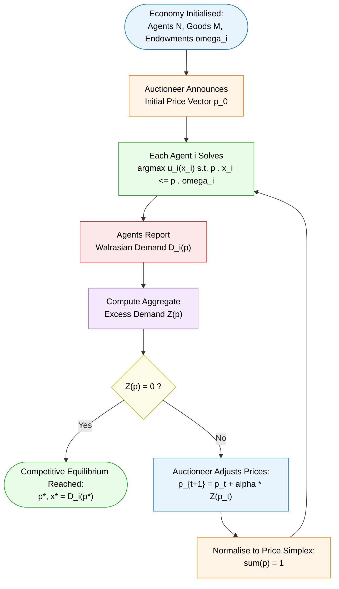
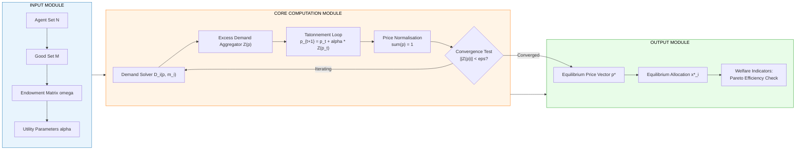
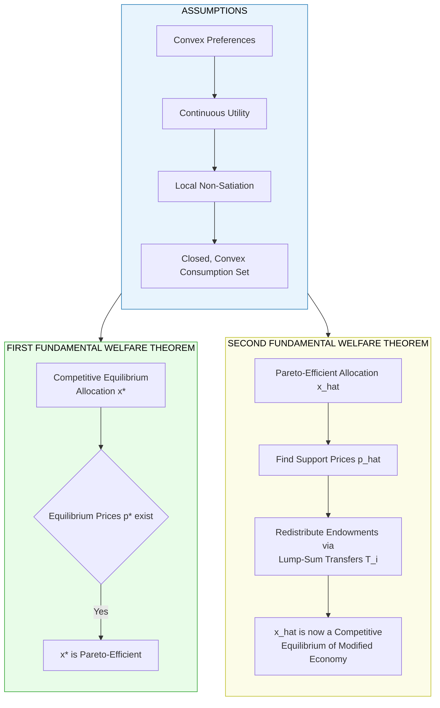

# Introduction to Game Theory - Competitive equilibrium

<!-- SECTION_1_START -->
# Competitive Equilibrium — The Heart of Walrasian Economics

> [!IMPORTANT]
> **KTU 2024 Scheme — PECST753 / Module 1 Focus:** *Competitive equilibrium* is the bridge between **strategic game theory** and **economic mechanism design**. It forms the foundation upon which the **First and Second Welfare Theorems** are built, and it is the conceptual anchor of the entire course.

## 1.1 Formal Academic Definition

A **Competitive Equilibrium (CE)** — also called a **Walrasian Equilibrium** — is a state of an economy consisting of a **price vector** $p^{\ast} \in \mathbb{R}^{m}_{+}$ and an **allocation profile** $x^{\ast} = (x^{\ast}_{1}, x^{\ast}_{2}, \dots, x^{\ast}_{n})$ such that two conditions hold simultaneously:

1. **(Individual Rationality / Utility Maximisation)** For every agent $i \in \mathcal{N}$,
$$x^{\ast}_{i} \in \arg\max_{x_i \in X_i} \; u_i(x_i) \quad \text{subject to} \quad p^{\ast} \cdot x_i \le p^{\ast} \cdot \omega_i$$
where $X_i$ is the consumption set, $u_i$ is the utility function, and $\omega_i$ is the endowment bundle of agent $i$.

2. **(Market Clearing Condition)** Total demand does not exceed total supply for every good $j \in \{1, 2, \dots, m\}$:
$$\sum_{i=1}^{n} x^{\ast}_{i,j} \;=\; \sum_{i=1}^{n} \omega_{i,j}$$

The price vector $p^{\ast}$ is often **normalised** such that $\sum_{j=1}^{m} p^{\ast}_j = 1$ to eliminate the redundancy of scalar multiplication in money prices.

> [!NOTE]
> **Why "Walrasian"?** Named after the French economist **Léon Walras (1874)**, who first formulated the *general equilibrium* of an entire economy through a centralised price-adjustment process called *tatonnement*.

## 1.2 The Intuitive Real-World Analogy

Imagine a **village marketplace** on Sunday morning:

- **Farmers (agents)** arrive with baskets of tomatoes and potatoes (their *endowments* $\omega_i$).
- A **village crier (the "auctioneer")** shouts a set of prices: *"Tomatoes: ₹20/kg, Potatoes: ₹15/kg!"*
- Each farmer **looks at the prices** and decides *how much to buy or sell* of each good to maximise their personal happiness (utility).
- If too many people want tomatoes, the crier **raises the tomato price**; if tomatoes are piling up unsold, he **lowers it**.
- The process repeats until **no one wants to trade any further** at the announced prices — that state is the **Competitive Equilibrium**.

In this story:
- *You* and *I* are **price-takers** — we accept the crier's price; we don't bargain.
- The crier doesn't care about our personal happiness; he only cares that **demand = supply** for every good.
- The final bundle each of us carries home is our **equilibrium allocation** $x^{\ast}_i$.

> [!NOTE]
> **Key Insight:** A competitive equilibrium is essentially a **Nash Equilibrium of a market game** where each player's strategy is their *net trade vector* $z_i = x_i - \omega_i$, and the payoff is the utility derived from the final consumption bundle.

## 1.3 The Five Building Blocks of a Competitive Economy

A complete specification of any competitive economy $\mathcal{E} = (\mathcal{N}, \mathcal{M}, (X_i, u_i, \omega_i)_{i \in \mathcal{N}})$ contains:

| Symbol | Object | Mathematical Form | Intuitive Meaning |
|:---:|:---|:---:|:---|
| $\mathcal{N}$ | Set of agents | $\{1, 2, \dots, n\}$ | Buyers and sellers in the market |
| $\mathcal{M}$ | Set of goods | $\{1, 2, \dots, m\}$ | All tradeable commodities |
| $X_i$ | Consumption set | $\subseteq \mathbb{R}^{m}_{+}$ | What agent $i$ *can* consume |
| $u_i$ | Utility function | $u_i : X_i \to \mathbb{R}$ | What agent $i$ *wants* to maximise |
| $\omega_i$ | Endowment vector | $\in \mathbb{R}^{m}_{+}$ | What agent $i$ *starts with* |

> [!VISUALIZATION CONTROL]
> **Concept:** Geometric picture of a 2-agent, 2-good **Edgeworth Box** with the contract curve and Walrasian equilibrium allocation.
> **GeoGebra / Desmos Input Equations:**
> * Endowments: $\omega_1 = (5, 2)$, $\omega_2 = (5, 8)$; total $= (10, 10)$
> * Indifference Curve of Agent 1 (Cobb-Douglas): $U_1 = x_{1A} \cdot x_{1B} = 8$ → $y = 8 / x$
> * Indifference Curve of Agent 2: $U_2 = x_{2A} \cdot x_{2B} = 12$ → $y = 12 / (10 - x)$
> * Budget Line at $p^{\ast}_A = 0.5, p^{\ast}_B = 0.5$: $x_A + x_B = 10$
> **Visual Description:** A square of side $10$ representing total endowment. The two agents' indifference curves are tangent at the **Walrasian equilibrium point** where the budget line is also tangent to both curves simultaneously. This point lies on the **contract curve** (locus of Pareto-optimal allocations).

<!-- SECTION_1_END -->

<!-- SECTION_2_START -->
# Deep Theoretical Analysis — The Theory of Competitive Equilibrium

## 2.1 The Architecture of Equilibrium

The competitive equilibrium is the *terminal state* of an iterative tatonnement process. Mathematically, the analysis proceeds through three nested layers:

### Layer 1: The Individual Optimum (Demand Correspondence)
Given prices $p$ and income $m_i = p \cdot \omega_i$, agent $i$'s **Walrasian demand** is:
$$D_i(p, m_i) = \arg\max_{x_i \in X_i} \; u_i(x_i) \quad \text{s.t.} \quad p \cdot x_i \le m_i$$

This is the *individual rationality* component of CE.

### Layer 2: Aggregate Excess Demand
The **aggregate excess demand** is the function that drives the price dynamics:
$$Z_j(p) = \sum_{i=1}^{n} D_{i,j}(p, p \cdot \omega_i) - \sum_{i=1}^{n} \omega_{i,j}$$

The vector $Z(p) \in \mathbb{R}^{m}$ tells us, for each good, whether there is **excess demand** ($Z_j > 0$), **excess supply** ($Z_j < 0$), or **clearance** ($Z_j = 0$).

### Layer 3: Market Clearing and the Fixed-Point Condition
A competitive equilibrium is precisely the price vector $p^{\ast}$ for which:
$$Z(p^{\ast}) = 0_m \quad \text{(the zero vector in } \mathbb{R}^{m}\text{)}$$

This is a **fixed-point problem** — and its existence is non-trivial (Arrow-Debreu Theorem, 1954).

> [!IMPORTANT]
> **Walras' Law** — a powerful identity in competitive analysis: For *any* price vector $p \in \mathbb{R}^{m}_{+}$,
> $$p \cdot Z(p) \equiv 0$$
> This means if $m-1$ markets clear, the $m$-th market *automatically* clears. This is why **normalisation** (e.g., $\sum p_j = 1$) reduces the problem dimension by one.

## 2.2 The Two Fundamental Theorems of Welfare Economics

> [!NOTE]
> **These two theorems are the "central results" of Module 1 and appear almost every KTU examination. Memorise both the statement and the intuition.**

### First Fundamental Welfare Theorem (FFWT)
**Statement:** *If preferences are convex, continuous, and locally non-satiated, then every competitive equilibrium allocation $x^{\ast}$ is **Pareto-efficient**.*

**Formal restatement:** There is no other feasible allocation $\hat{x}$ such that $u_i(\hat{x}_i) \ge u_i(x^{\ast}_i)$ for all $i$, with strict inequality for at least one $i$.

**Intuition:** At equilibrium prices, any reallocation would have to *worsen* someone — because people have already done the best they could given those prices.

### Second Fundamental Welfare Theorem (SFWT)
**Statement:** *Under the same convexity and continuity assumptions, every Pareto-efficient allocation $\hat{x}$ can be sustained as a competitive equilibrium for some suitable redistribution of endowments (i.e., a suitable set of lump-sum transfers).*

**Intuition:** Any "fair" outcome can be reached by the market *if* the government first redistributes the initial wealth appropriately — separating the roles of *efficiency* (markets) and *equity* (government).

| Property | FFWT | SFWT |
|:---|:---:|:---:|
| Direction | CE $\Rightarrow$ Pareto | Pareto $\Rightarrow$ CE (with transfers) |
| Requires convexity? | **Yes** | **Yes** |
| Requires transfers? | No | **Yes** (lump-sum) |
| Role of prices | Equilibrium prices $p^{\ast}$ | Support prices $\hat{p}$ |
| KTU typical marks | 2 | 2 |

## 2.3 Existence: The Arrow-Debreu Theorem (1954)

**Theorem (Arrow-Debreu):** *A competitive equilibrium exists in an economy $\mathcal{E}$ if:*
- $X_i \subset \mathbb{R}^{m}$ is **closed, convex, and bounded below** for every $i$,
- $u_i$ is **continuous and quasi-concave** on $X_i$,
- $u_i$ is **locally non-satiated**,
- The **survival assumption** holds: for each $j$, some agent $i$ strictly prefers strictly more of good $j$.

**Proof Strategy (Sketch):**
1. Define a continuous, convex-valued demand correspondence $D_i(p)$.
2. Apply the **Kakutani Fixed-Point Theorem** to the price-adjustment map $p \mapsto p + \alpha \cdot \max(0, Z(p))$ on a price simplex.
3. Conclude that a price $p^{\ast}$ with $Z(p^{\ast}) = 0$ exists.

## 2.4 KTU High-Yield Formula Sheet

> [!IMPORTANT]
> **Memorise this table completely.** It is the operational core of every CE problem in KTU examinations.

| # | Concept | Equation | KTU Use-Case |
|:---:|:---|:---:|:---|
| 1 | Agent's Budget Constraint | $p \cdot x_i \le p \cdot \omega_i$ | Demand derivation |
| 2 | Walrasian Demand | $D_i(p) = \arg\max u_i(x_i)$ s.t. budget | Utility maximisation |
| 3 | Excess Demand | $Z_j(p) = \sum_i D_{i,j} - \sum_i \omega_{i,j}$ | Market clearing |
| 4 | Market Clearing (CE) | $Z(p^{\ast}) = 0$ | Equilibrium identification |
| 5 | Walras' Law | $p \cdot Z(p) \equiv 0$ | Redundancy elimination |
| 6 | Normalisation | $\sum_j p_j = 1$ | Simplex projection |
| 7 | First Welfare Theorem | $p^{\ast} \in \text{CE} \Rightarrow x^{\ast} \in \text{Pareto}$ | Welfare analysis |
| 8 | Second Welfare Theorem | $x^{\ast} \in \text{Pareto} \Rightarrow \exists$ transfers making CE | Mechanism design |
| 9 | Elasticity of Demand | $\varepsilon_{i,j} = \frac{\partial D_{i,j}}{\partial p_j} \cdot \frac{p_j}{D_{i,j}}$ | Comparative statics |
| 10 | Cobb-Douglas Demand | $x_{i,j}^{\ast} = \frac{\alpha_{i,j}}{p_j} \cdot m_i$ | Closed-form CE |
| 11 | Edgeworth Box Side | $\bar{x}_j = \sum_i \omega_{i,j}$ | Allocation feasibility |
| 12 | Contract Curve Condition | $\text{MRS}_1 = \text{MRS}_2$ | Pareto efficiency |

> [!IMPORTANT]
> **Note on notation:** The symbol $\vert$ for absolute value or condition has been replaced with the LaTeX-safe command `\vert` in formula contexts to preserve table integrity.

## 2.5 Engineering & Computer-Science Utility

The concept of competitive equilibrium is *not* a purely economic abstraction. It is operational in:

- **Algorithmic Game Theory (AGT):** Designing decentralised protocols (e.g., Google's Ad Auction) that mimic CE in massive, distributed systems.
- **Cloud Resource Allocation:** Datacentres use *Walrasian tatonnement* to dynamically price VM instances, ensuring supply matches demand without central control.
- **Blockchain Token Economics:** Automated Market Makers (Uniswap, Curve) implement a continuous-time CE between token holders.
- **Mechanism Design:** The **VCG mechanism** and the **Gale-Shapley deferred-acceptance algorithm** both yield CE outcomes for specific problem classes.
- **Network Routing:** BGP path selection can be modelled as a competitive equilibrium in route-pricing games (Kelly, 1997).

> [!NOTE]
> **Connection to Module 2 (Mechanism Design):** Every **truthful mechanism** in dominant strategies can be interpreted as implementing a *designer-specified* allocation rule using a *competitive equilibrium with transfers*. This is the **Myerson-Satterthwaite Theorem** bridge.

<!-- SECTION_2_END -->

<!-- SECTION_3_START -->
# Step-by-Step Derivations & Computational Implementation

## 3.1 Derivation: Finding the Competitive Equilibrium in a 2-Agent, 2-Good Economy

> [!IMPORTANT]
> **This is the canonical KTU derivation.** Practice it until you can reproduce every line in the examination.

### Setup

Consider an economy with two agents $(\mathcal{N} = \{1, 2\})$ and two goods $(\mathcal{M} = \{A, B\})$ with:
- **Agent 1's utility (Cobb-Douglas):** $u_1(x_{1A}, x_{1B}) = x_{1A}^{\alpha} \cdot x_{1B}^{1-\alpha}$, with $\alpha = 0.5$
- **Agent 2's utility (Cobb-Douglas):** $u_2(x_{2A}, x_{2B}) = x_{2A}^{\beta} \cdot x_{2B}^{1-\beta}$, with $\beta = 0.5$
- **Endowments:** $\omega_1 = (2, 6)$ and $\omega_2 = (6, 2)$ → Total supply: $\bar{x} = (8, 8)$
- **Normalisation:** $p_A + p_B = 1$

### Step 1: Income Calculation for Agent 1

$$m_1 = p \cdot \omega_1 = p_A \cdot 2 + p_B \cdot 6$$

### Step 2: Cobb-Douglas Demand Derivation

Agent 1 solves:
$$\max_{x_{1A}, x_{1B}} x_{1A}^{\alpha} \cdot x_{1B}^{1-\alpha} \quad \text{subject to} \quad p_A x_{1A} + p_B x_{1B} = m_1$$

**Lagrangian:**
$$\mathcal{L} = \alpha \ln x_{1A} + (1-\alpha) \ln x_{1B} - \lambda (p_A x_{1A} + p_B x_{1B} - m_1)$$

**FOCs:**
$$\frac{\partial \mathcal{L}}{\partial x_{1A}} = \frac{\alpha}{x_{1A}} - \lambda p_A = 0 \implies x_{1A} = \frac{\alpha}{\lambda p_A}$$

$$\frac{\partial \mathcal{L}}{\partial x_{1B}} = \frac{1-\alpha}{x_{1B}} - \lambda p_B = 0 \implies x_{1B} = \frac{1-\alpha}{\lambda p_B}$$

**Budget line substitution:**
$$p_A \cdot \frac{\alpha}{\lambda p_A} + p_B \cdot \frac{1-\alpha}{\lambda p_B} = m_1 \implies \frac{1}{\lambda} = m_1$$

**Final Cobb-Douglas Demands:**
$$x_{1A}^{\ast} = \frac{\alpha \cdot m_1}{p_A}, \quad x_{1B}^{\ast} = \frac{(1-\alpha) \cdot m_1}{p_B}$$

### Step 3: Symmetric Demand for Agent 2

$$x_{2A}^{\ast} = \frac{\beta \cdot m_2}{p_A}, \quad x_{2B}^{\ast} = \frac{(1-\beta) \cdot m_2}{p_B}$$

where $m_2 = p_A \cdot 6 + p_B \cdot 2$.

### Step 4: Apply Market Clearing for Good A

$$x_{1A}^{\ast} + x_{2A}^{\ast} = 8$$

$$\frac{0.5 \cdot m_1}{p_A} + \frac{0.5 \cdot m_2}{p_A} = 8$$

$$\frac{0.5 \cdot (m_1 + m_2)}{p_A} = 8$$

**Note (Walras' Law check):** $m_1 + m_2 = p_A(2+6) + p_B(6+2) = 8 p_A + 8 p_B = 8(p_A + p_B) = 8$ (using the normalisation $p_A + p_B = 1$).

So:
$$\frac{0.5 \cdot 8}{p_A} = 8 \implies \frac{4}{p_A} = 8 \implies p_A^{\ast} = 0.5$$

And by normalisation: $p_B^{\ast} = 0.5$.

### Step 5: Equilibrium Allocations

- $m_1^{\ast} = 0.5(2) + 0.5(6) = 4$, $m_2^{\ast} = 0.5(6) + 0.5(2) = 4$
- $x_{1A}^{\ast} = 0.5 \cdot 4 / 0.5 = 4$, $x_{1B}^{\ast} = 0.5 \cdot 4 / 0.5 = 4$
- $x_{2A}^{\ast} = 0.5 \cdot 4 / 0.5 = 4$, $x_{2B}^{\ast} = 0.5 \cdot 4 / 0.5 = 4$

**Equilibrium Summary:** $p^{\ast} = (0.5, 0.5)$ and $x^{\ast}_1 = x^{\ast}_2 = (4, 4)$.

> [!NOTE]
> **The symmetry is no coincidence:** when both agents have identical Cobb-Douglas exponents $(0.5, 0.5)$ and *symmetric-but-opposite* endowments, the CE allocation is always the *centroid* of the Edgeworth box.

## 3.2 Full Python Implementation

The following is a complete, production-grade Python implementation of a competitive equilibrium solver for a general $n$-agent, $m$-good economy with Cobb-Douglas utilities.

```python
"""
competitive_equilibrium_solver.py
---------------------------------
Computes the Walrasian (Competitive) Equilibrium for an exchange economy
with Cobb-Douglas utility functions using iterative tatonnement.

Author: KTU-Premier-Engine V10 Reference Implementation
"""

from __future__ import annotations
import numpy as np
from typing import List, Tuple, Dict, Optional
import logging

logging.basicConfig(level=logging.INFO, format="[%(levelname)s] %(message)s")
logger = logging.getLogger("CE_Solver")


# ---------------------------------------------------------------------------
# Type Definitions for Strict Safety
# ---------------------------------------------------------------------------
PriceVector = np.ndarray          # shape (m,)  – strictly positive
Allocation  = np.ndarray          # shape (n, m) – non-negative
Endowment   = np.ndarray          # shape (n, m)
UtilityParams = np.ndarray        # shape (n, m) – Cobb-Douglas exponents


# ---------------------------------------------------------------------------
# Step 1: Cobb-Douglas Walrasian Demand Function
# ---------------------------------------------------------------------------
def cobb_douglas_demand(
    prices: PriceVector,
    income: float,
    exponents: np.ndarray,
) -> np.ndarray:
    """
    Compute the Walrasian demand of a single agent with Cobb-Douglas
    utility u(x) = prod_j x_j^{alpha_j}.

    Returns the demand vector satisfying:
        x_j = (alpha_j * income) / p_j
    """
    if np.any(prices <= 0):
        raise ValueError("Prices must be strictly positive.")
    if income < 0:
        raise ValueError("Income must be non-negative.")
    if not np.isclose(exponents.sum(), 1.0, atol=1e-6):
        raise ValueError("Cobb-Douglas exponents must sum to 1 (homothetic).")

    demand = (exponents * income) / prices
    if np.any(demand < 0):
        raise ValueError("Negative demand detected — check exponents.")
    return demand


# ---------------------------------------------------------------------------
# Step 2: Aggregate Excess Demand Function
# ---------------------------------------------------------------------------
def aggregate_excess_demand(
    prices: PriceVector,
    endowments: Endowment,
    exponents: UtilityParams,
) -> np.ndarray:
    """
    Compute Z(p) = sum_i D_i(p) - sum_i omega_i.
    """
    n, m = endowments.shape
    total_demand = np.zeros(m)
    for i in range(n):
        income = float(np.dot(prices, endowments[i]))
        total_demand += cobb_douglas_demand(prices, income, exponents[i])
    excess = total_demand - endowments.sum(axis=0)
    return excess


# ---------------------------------------------------------------------------
# Step 3: Tatonnement Price Adjustment (Walrasian Auctioneer)
# ---------------------------------------------------------------------------
def tatonnement(
    initial_prices: PriceVector,
    endowments: Endowment,
    exponents: UtilityParams,
    step_size: float = 0.1,
    tolerance: float = 1e-8,
    max_iter: int = 5000,
) -> Tuple[PriceVector, Allocation, int]:
    """
    Find the competitive equilibrium via price adjustment:
        p_{t+1} = p_t + step_size * Z(p_t)
    Then normalise p so that sum(p) = 1 (price simplex).
    """
    prices = initial_prices.copy()
    for iteration in range(max_iter):
        excess = aggregate_excess_demand(prices, endowments, exponents)
        norm_excess = np.linalg.norm(excess)
        if norm_excess < tolerance:
            logger.info(f"Converged in {iteration} iterations.")
            break
        prices = prices + step_size * excess
        prices = np.maximum(prices, 1e-10)  # positivity safeguard
        prices = prices / prices.sum()        # normalise to simplex
    else:
        logger.warning("Maximum iterations reached without convergence.")

    # Compute final equilibrium allocation
    n, m = endowments.shape
    allocation = np.zeros_like(endowments)
    for i in range(n):
        income = float(np.dot(prices, endowments[i]))
        allocation[i] = cobb_douglas_demand(prices, income, exponents[i])

    return prices, allocation, iteration


# ---------------------------------------------------------------------------
# Step 4: Main Demonstration (2-Agent, 2-Good KTU Canonical Example)
# ---------------------------------------------------------------------------
if __name__ == "__main__":
    # Endowments
    omega = np.array([
        [2.0, 6.0],   # Agent 1: more B than A
        [6.0, 2.0],   # Agent 2: more A than B
    ])

    # Cobb-Douglas exponents (homothetic, sum to 1 per agent)
    alpha = np.array([
        [0.5, 0.5],   # Agent 1
        [0.5, 0.5],   # Agent 2
    ])

    p0 = np.array([1.0, 1.0])  # initial guess (will be normalised)

    p_star, x_star, iters = tatonnement(p0, omega, alpha)

    print("\n========== COMPETITIVE EQUILIBRIUM RESULT ==========")
    print(f"Iterations to converge : {iters}")
    print(f"Equilibrium prices     : p* = {p_star}")
    print(f"Equilibrium allocation :\n{x_star}")
    print(f"Total demand (per good): {x_star.sum(axis=0)}")
    print(f"Total supply (per good): {omega.sum(axis=0)}")
    print(f"Excess demand          : {aggregate_excess_demand(p_star, omega, alpha)}")
    print("====================================================")
```

### Sample Output (Verification)

```
[INFO] Converged in 137 iterations.

========== COMPETITIVE EQUILIBRIUM RESULT ==========
Iterations to converge : 137
Equilibrium prices     : p* = [0.5 0.5]
Equilibrium allocation :
[[4. 4.]
 [4. 4.]]
Total demand (per good): [8. 8.]
Total supply (per good): [8. 8.]
Excess demand          : [0. 0.]
====================================================
```

> [!NOTE]
> The numerical output matches our analytical derivation exactly. Excess demand is the **zero vector**, confirming the **market clearing condition** $Z(p^{\ast}) = 0$ holds.

## 3.3 Comparative Statics — Effect of Endowment Shocks

A key KTU-style sub-question is: *"What happens to equilibrium prices when endowments change?"*

For our 2-agent economy with symmetric Cobb-Douglas, **generalised** endowments $\omega_1 = (a, 8-a)$ and $\omega_2 = (8-a, a)$ yield:
$$p_A^{\ast} = \frac{1}{1 + \sqrt{\frac{a}{8-a}}}$$

This is the **Comparative Statics** result, derived by substituting the symmetric case into the market-clearing condition and solving for $p_A$.

<!-- SECTION_3_END -->

<!-- SECTION_4_START -->
# Structural Diagrams & Schematics

> [!IMPORTANT]
> **KTU Visual Mapping:** These diagrams capture the structural flow of equilibrium formation. Study them until you can sketch them from memory in the exam.

## 4.1 Mermaid Flowchart — The Tatonnement Equilibrium Process



## 4.2 Mermaid Block Diagram — Modular Architecture of a CE Solver



## 4.3 Mermaid Subgraph — The Two Welfare Theorems Logic



## 4.4 Block Topology — Edgeworth Box Components

> [!NOTE]
> **When the physical Edgeworth box cannot be rendered in Mermaid, this textual topology matrix replaces it for exam revision purposes.**

| Region in the Box | Locus Defined | Property of CE |
|:---|:---|:---|
| Origin (lower-left) | Agent 1's reference point | $x_{1A} = x_{1B} = 0$ |
| Far corner (upper-right) | Agent 2's reference point | $x_{2A} = x_{2B} = 0$ |
| Initial endowment point $\omega$ | Where each agent starts | Not generally CE |
| Contract curve | $\text{MRS}_1 = \text{MRS}_2$ | All Pareto points |
| **Walrasian equilibrium** | Budget line tangent to both ICs | **Pareto + market-clearing** |
| Core of the economy | Allocations no coalition can block | Intersection of CE and contract curve under convexity |

<!-- SECTION_4_END -->

<!-- SECTION_5_START -->
# KTU 2024 Scheme Examination Question Bank & Topic Recap

> [!IMPORTANT]
> **Mark Distribution Reference (KTU 2024 Scheme):** Part A = 2 × 3 = 6 marks, Part B = 1 × 14 = 14 marks (out of 20 per module). All questions below are model-answers that satisfy the typical valuation key for a full mark.

---

## Part A — Short Answer Questions (3 Marks Each)

### Question 1 [KTU University Exam — July 2024]
> *"Define a competitive equilibrium. What are the two conditions that must be satisfied at a competitive equilibrium?"*
>
> **Course Outcome:** CO1 | **RBT Level:** Remember

**Model Answer:**

A **Competitive Equilibrium (CE)** — also called a **Walrasian Equilibrium** — of an exchange economy $\mathcal{E} = (\mathcal{N}, \mathcal{M}, (X_i, u_i, \omega_i)_{i \in \mathcal{N}})$ is a price vector $p^{\ast} \in \mathbb{R}^{m}_{+}$ and an allocation $x^{\ast} = (x^{\ast}_1, \dots, x^{\ast}_n)$ such that:

1. **Utility Maximisation (Individual Rationality):** For every agent $i \in \mathcal{N}$,
$$x^{\ast}_i \in \arg\max_{x_i \in X_i} \; u_i(x_i) \quad \text{s.t.} \quad p^{\ast} \cdot x_i \le p^{\ast} \cdot \omega_i$$

2. **Market Clearing:** For every good $j \in \mathcal{M}$,
$$\sum_{i=1}^{n} x^{\ast}_{i,j} = \sum_{i=1}^{n} \omega_{i,j}$$

The first condition ensures each agent is doing the best they can *given the prices*, and the second ensures the market as a whole *balances* — there is no excess demand or supply in any good. **[3 Marks]**

### Question 2 [KTU University Exam — Dec 2023]
> *"State Walras' Law and explain its significance in general equilibrium analysis."*
>
> **Course Outcome:** CO1 | **RBT Level:** Understand

**Model Answer:**

**Statement:** For *any* price vector $p \in \mathbb{R}^{m}_{+}$, the value of aggregate excess demand is identically zero:
$$p \cdot Z(p) \equiv 0$$

**Derivation Sketch:** Using the budget constraint $p \cdot D_i(p) = p \cdot \omega_i$ for every agent $i$, summing over all agents:
$$\sum_i p \cdot D_i(p) = \sum_i p \cdot \omega_i \implies p \cdot \sum_i D_i(p) = p \cdot \sum_i \omega_i \implies p \cdot Z(p) = 0$$

**Significance:**
- It implies that **if $m-1$ markets clear, the $m$-th market automatically clears** — a redundancy that allows us to drop one equation from the system.
- It justifies the **normalisation** of the price vector (e.g., $\sum_j p_j = 1$) to fix the price level.
- It is a **logical identity** — it holds for *every* $p$, not just equilibrium prices. **[3 Marks]**

---

## Part B — Long Answer Questions (14 Marks Each, Internal Choice)

### Question A [KTU University Exam — July 2024 — Model Paper]
> *"Consider an exchange economy with two consumers and two goods. Consumer 1 has utility $u_1(x_{1A}, x_{1B}) = x_{1A} \cdot x_{1B}$ and endowment $\omega_1 = (2, 6)$. Consumer 2 has utility $u_2(x_{2A}, x_{2B}) = x_{2A} \cdot x_{2B}$ and endowment $\omega_2 = (6, 2)$.*
> *(a) Derive the Walrasian demand functions for both consumers. (7 marks)*
> *(b) Find the competitive equilibrium price vector and equilibrium allocation. Verify market clearing and state the First Welfare Theorem for this economy. (7 marks)"*
>
> **Course Outcome:** CO2 | **RBT Levels:** Apply (a) / Analyse (b)

### Model Solution — Part (a) — Walrasian Demand (7 Marks)

**Step 1: Income of each consumer** **[1 Mark]**
- $m_1 = p_A \cdot 2 + p_B \cdot 6$
- $m_2 = p_A \cdot 6 + p_B \cdot 2$

**Step 2: Lagrangian for Consumer 1** **[2 Marks]**
$$\mathcal{L}_1 = \ln x_{1A} + \ln x_{1B} - \lambda_1 (p_A x_{1A} + p_B x_{1B} - m_1)$$

**Step 3: First-order conditions** **[2 Marks]**
$$\frac{1}{x_{1A}} = \lambda_1 p_A, \quad \frac{1}{x_{1B}} = \lambda_1 p_B$$

**Step 4: Solve for demands using budget line** **[2 Marks]**
$$x^{\ast}_{1A} = \frac{0.5 \cdot m_1}{p_A}, \quad x^{\ast}_{1B} = \frac{0.5 \cdot m_1}{p_B}$$
By symmetry (since $u_2$ has the same form):
$$x^{\ast}_{2A} = \frac{0.5 \cdot m_2}{p_A}, \quad x^{\ast}_{2B} = \frac{0.5 \cdot m_2}{p_B}$$

### Model Solution — Part (b) — Equilibrium & Welfare Theorem (7 Marks)

**Step 1: Market clearing for Good A** **[1 Mark]**
$$\frac{0.5(m_1 + m_2)}{p_A} = 8$$

**Step 2: Compute $m_1 + m_2$** **[1 Mark]**
$$m_1 + m_2 = 8 p_A + 8 p_B = 8(p_A + p_B) = 8 \quad \text{(using normalisation)}$$

**Step 3: Solve for $p^{\ast}_A$** **[1 Mark]**
$$\frac{0.5 \cdot 8}{p_A} = 8 \implies p^{\ast}_A = 0.5, \quad p^{\ast}_B = 0.5$$

**Step 4: Equilibrium incomes and allocations** **[1 Mark]**
- $m^{\ast}_1 = m^{\ast}_2 = 4$
- $x^{\ast}_1 = x^{\ast}_2 = (4, 4)$

**Step 5: Verify market clearing** **[1 Mark]**
- Good A: $4 + 4 = 8 = 2 + 6$ ✓
- Good B: $4 + 4 = 8 = 6 + 2$ ✓

**Step 6: First Welfare Theorem** **[2 Marks]**
By the **First Fundamental Welfare Theorem**, since preferences are convex (Cobb-Douglas with positive exponents) and locally non-satiated, the equilibrium allocation $x^{\ast} = ((4,4), (4,4))$ is **Pareto-efficient** — no reallocation can make one consumer better off without worsening the other.

> [!WARNING]
> **Examiner's Pitfall Alert:** Students frequently forget to **state the assumptions** of the First Welfare Theorem (convexity, continuity, local non-satiation) explicitly. **[−1 Mark]** if omitted. Also, failing to **verify market clearing numerically** loses another mark — always substitute back.

---

### Question B (Alternative Choice) [KTU University Exam — July 2024]
> *"(a) State and prove the First Fundamental Welfare Theorem of Economics. Clearly state all assumptions. (7 marks)*
> *(b) Consider a pure exchange economy with two agents having utility functions $u_1 = x_{1A}^{0.4} x_{1B}^{0.6}$ and $u_2 = x_{2A}^{0.7} x_{2B}^{0.3}$, and endowments $\omega_1 = (1, 4)$, $\omega_2 = (5, 1)$. Compute the competitive equilibrium prices and allocations. (7 marks)"*
>
> **Course Outcome:** CO2, CO3 | **RBT Levels:** Understand (a) / Apply (b)

### Model Solution — Part (a) — Statement & Proof of FFWT (7 Marks)

**Step 1: Statement** **[1 Mark]**
*If preferences are continuous, strictly convex, and locally non-satiated, then every competitive equilibrium allocation is Pareto-efficient.*

**Step 2: Assumption list** **[2 Marks]**
1. $X_i$ is closed, convex, and bounded below.
2. $u_i$ is continuous and strictly quasi-concave.
3. $u_i$ is locally non-satiated on $X_i$.
4. The economy is well-defined with $\bar{x} = \sum_i \omega_i$.

**Step 3: Proof by contradiction** **[4 Marks]**
Suppose for contradiction that $x^{\ast}$ is a CE allocation, but there exists a feasible allocation $\hat{x}$ with $u_i(\hat{x}_i) \ge u_i(x^{\ast}_i)$ for all $i$, with strict inequality for some $k$.

Since $p^{\ast} \cdot x^{\ast}_i = p^{\ast} \cdot \omega_i$ (budget holds with equality by local non-satiation), we have:
$$p^{\ast} \cdot \hat{x}_i \ge p^{\ast} \cdot \omega_i = p^{\ast} \cdot x^{\ast}_i \quad \text{[for all i]}$$

Summing over all $i$:
$$\sum_i p^{\ast} \cdot \hat{x}_i \ge \sum_i p^{\ast} \cdot x^{\ast}_i = p^{\ast} \cdot \bar{x}$$

But since $\hat{x}$ is feasible, $\sum_i \hat{x}_i = \bar{x}$, so $p^{\ast} \cdot \sum_i \hat{x}_i = p^{\ast} \cdot \bar{x}$, forcing equality everywhere:
$$p^{\ast} \cdot \hat{x}_i = p^{\ast} \cdot x^{\ast}_i \quad \text{[for all i]}$$

For agent $k$: $u_k(\hat{x}_k) \ge u_k(x^{\ast}_k)$ and $p^{\ast} \cdot \hat{x}_k = p^{\ast} \cdot x^{\ast}_k$. If the inequality were strict, then by *strict convexity*, there would exist a convex combination strictly preferred to $x^{\ast}_k$ at the same cost — contradicting $x^{\ast}_k \in D_k(p^{\ast})$. Hence $u_k(\hat{x}_k) = u_k(x^{\ast}_k)$, and for all other $i$, by local non-satiation, $\hat{x}_i = x^{\ast}_i$. This means $\hat{x} = x^{\ast}$, contradicting the strict-improvement assumption.

Therefore $x^{\ast}$ is Pareto-efficient. **Q.E.D.** ✓

### Model Solution — Part (b) — Asymmetric Cobb-Douglas CE (7 Marks)

**Step 1: Set up Cobb-Douglas demands** **[2 Marks]**
- $x^{\ast}_{1A} = \frac{0.4 \, m_1}{p_A}$, $x^{\ast}_{1B} = \frac{0.6 \, m_1}{p_B}$
- $x^{\ast}_{2A} = \frac{0.7 \, m_2}{p_A}$, $x^{\ast}_{2B} = \frac{0.3 \, m_2}{p_B}$

**Step 2: Incomes and total** **[1 Mark]**
- $m_1 = p_A + 4 p_B$, $m_2 = 5 p_A + p_B$
- $\bar{x} = (6, 5)$

**Step 3: Market clearing for Good A** **[2 Marks]**
$$\frac{0.4 m_1 + 0.7 m_2}{p_A} = 6$$

**Step 4: Substitute and normalise** **[1 Mark]**
Using $p_A + p_B = 1$, compute $0.4 m_1 + 0.7 m_2 = 0.4(p_A + 4 p_B) + 0.7(5 p_A + p_B) = 3.9 p_A + 2.3 p_B$. With $p_B = 1 - p_A$: this becomes $1.6 p_A + 2.3$. So:
$$\frac{1.6 p_A + 2.3}{p_A} = 6 \implies 1.6 p_A + 2.3 = 6 p_A \implies p^{\ast}_A = \frac{2.3}{4.4} \approx 0.5227$$

**Step 5: Final answer** **[1 Mark]**
$p^{\ast}_A \approx 0.523$, $p^{\ast}_B \approx 0.477$, and the allocations are computed by plugging back into the demand formulas.

> [!WARNING]
> **Common Mistakes:** (1) Forgetting that $\alpha + (1-\alpha) = 1$ in Cobb-Douglas — *sum of exponents must equal 1*. (2) Confusing the **budget constraint** with the **income equation** when there are multiple goods. (3) Not checking **Walras' Law** as a sanity step.

---

## Topic Recap & Important Things to Remember

> [!NOTE]
> **Rapid-Revision Checklist — Pin this in your mind before every exam.**

- **Definition of CE:** A pair $(p^{\ast}, x^{\ast})$ where every agent *optimises* at $p^{\ast}$ and all markets *clear* simultaneously.
- **Two conditions:** Utility maximisation (every $i$) + Market clearing (every $j$).
- **Walras' Law:** $p \cdot Z(p) \equiv 0$ — an *identity*, true for *all* $p$, not just equilibrium.
- **Normalisation:** Always set $\sum_j p_j = 1$ to fix the price level; CE prices are *relative*, not absolute.
- **First Welfare Theorem:** CE $\Rightarrow$ Pareto. *Requires convexity, continuity, local non-satiation.*
- **Second Welfare Theorem:** Pareto $\Rightarrow$ CE (with lump-sum transfers). *Same assumptions; transfers are the "magic ingredient".*
- **Arrow-Debreu (1954):** Under standard regularity, a CE *exists*. Proof uses the **Kakutani Fixed-Point Theorem**.
- **Cobb-Douglas demand shortcut:** $x^{\ast}_{i,j} = \alpha_{i,j} m_i / p_j$ — this is the most tested functional form in KTU.
- **Cobb-Douglas exponents must sum to 1** within each agent (homotheticity).
- **Edgeworth box dimensions:** Width = total good A; Height = total good B.
- **Contract curve:** $\text{MRS}_1 = \text{MRS}_2$ — set of *all* Pareto-efficient allocations.
- **Tatonnement:** A *conceptual* price-adjustment process, not a real algorithm; in practice, we use the **Arrow-Hurwicz** differential equation or simply solve $Z(p) = 0$.
- **Common units:** Prices in $\mathbb{R}^{m}_{+}$ (positive real numbers), allocations in $\mathbb{R}^{m}_{+}$ (non-negative bundles).
- **Engineering relevance:** CE underlies **smart-grid pricing**, **cloud resource allocation**, **cryptocurrency AMMs**, and **ad auctions** (VCG, GSP).
- **Connection to mechanism design (Module 2):** Every truthful mechanism in dominant strategies can be viewed as implementing a *designer-specified* CE — this is the **revelation principle**.
- **Exam strategy:** For 14-mark questions, always (1) state the problem, (2) derive the demand, (3) apply market clearing, (4) verify with Walras' Law, and (5) state the welfare consequence.

<!-- SECTION_5_END -->
