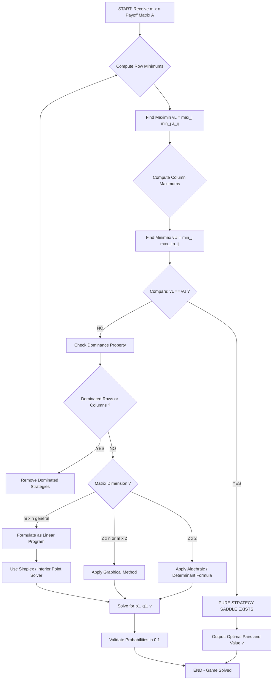
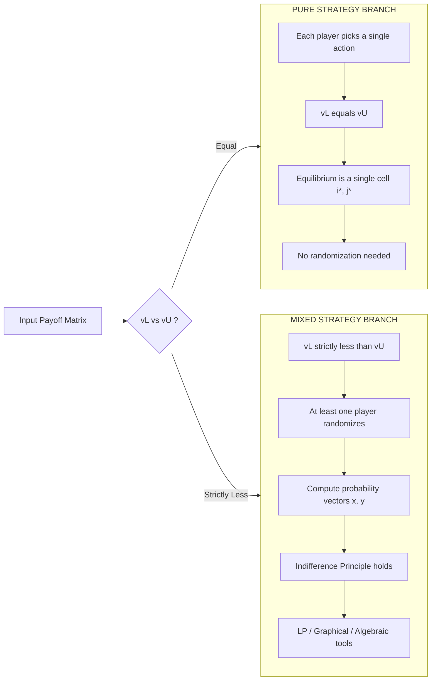
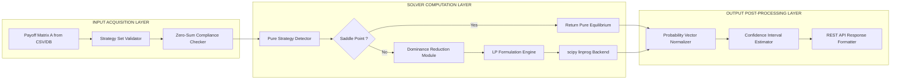

# matrix games

<!-- SECTION_1_START -->
# Matrix Games: The Strategic Heart of Two-Player Zero-Sum Conflicts

> [!IMPORTANT]
> **Syllabus Anchor (KTU 2024 Scheme - PECST753, Module 1)**
> Matrix games form the foundational model of non-cooperative game theory. They mathematically capture any situation where **one player's gain is exactly the other player's loss**, and where the set of choices available to each player is **finite and countable**.

## 1.1 Formal Definition

A **Matrix Game** (also called a **Two-Person Zero-Sum Game in Strategic/Normal Form**) is a tuple $\Gamma = (N, S_A, S_B, A)$ where:

* $N = \{1, 2\}$ is the set of **two players** — Player A (the **Row/Maximizer**) and Player B (the **Column/Minimizer**).
* $S_A = \{R_1, R_2, \dots, R_m\}$ is the **finite strategy set** available to Player A (the $m$ rows of the matrix).
* $S_B = \{C_1, C_2, \dots, C_n\}$ is the **finite strategy set** available to Player B (the $n$ columns).
* $A = [a_{ij}]_{m \times n}$ is the **Payoff Matrix**, where $a_{ij}$ is the gain to Player A (and equivalently, the loss to Player B) when A plays $R_i$ and B plays $C_j$.

The condition $\sum \text{gains} + \sum \text{losses} = 0$ for every outcome justifies the term **"zero-sum"**.

## 1.2 Intuitive Analogy: The Chess Match of Marketing Budgets

> [!NOTE]
> **Real-World Analogy: Two Cola Giants on a Beach**
> Imagine two beverage companies, **ColaCo** and **PepsiBev**, simultaneously choosing one of three advertising budgets: **Low**, **Medium**, or **High**. The market share gain of ColaCo is exactly the market share lost by PepsiBev — a perfect zero-sum conflict. We can encode every possible outcome in a $3 \times 3$ grid where each cell $(i,j)$ contains a single number: the market share (in crores) that flows from PepsiBev's pocket into ColaCo's. This grid **is** the matrix game.

## 1.3 Core Terminology

> [!IMPORTANT]
> **Three Foundational Concepts You MUST Memorize**
> 1. **Pure Strategy** — A deterministic, fully specified action (e.g., "Play Row 2 with 100% certainty").
> 2. **Mixed Strategy** — A probability distribution over the pure strategies (e.g., "Play Row 1 with probability 0.4 and Row 2 with probability 0.6").
> 3. **Saddle Point** — A cell $(i^*, j^*)$ that is simultaneously the **best response** to itself; the point where the cautious best of the worst meets the cautious best of the best.

## 1.4 Geometric Intuition: The "Cautious Floor" vs The "Cautious Ceiling"

Player A, being rational, **protects against the worst case** — they compute the minimum of each row and pick the row with the **highest minimum** (this is the **Maximin**).

Player B, equally rational, **caps the damage** — they compute the maximum of each column and pick the column with the **lowest maximum** (this is the **Minimax**).

The **Lower Value** of the game is $v_L = \max_{i} \min_{j} a_{ij}$.

The **Upper Value** of the game is $v_U = \min_{j} \max_{i} a_{ij}$.

The universal inequality $v_L \le v_U$ always holds.

> [!VISUALIZATION CONTROL]
> **Concept:** Max-Min vs Min-Max Function Plot for a 2×2 Game
> **GeoGebra / Desmos Input Equations:**
> * Define $f_1(x) = \min(a_{11} \cdot x + a_{12} \cdot (1-x))$ (expected payoff if A mixes between rows)
> * Define $f_2(x) = \max(b_{11} \cdot x + b_{12} \cdot (1-x))$ (expected payoff if B mixes)
> **Visual Description:** A student should observe the lower envelope curve and the upper envelope curve. The vertical gap between them represents the **"Price of Anarchy"** for pure strategies; where the two envelopes touch, a **saddle point** exists.
<!-- SECTION_1_END -->

<!-- SECTION_2_START -->
# Deep Theoretical Analysis & KTU High-Yield Formula Sheet

## 2.1 The Pure Strategy Equilibrium (Saddle Point Theorem)

A matrix game possesses a **saddle point in pure strategies** if and only if:

$$\max_{i} \min_{j} a_{ij} = \min_{j} \max_{i} a_{ij} = v$$

where $v$ is called the **Value of the Game**. The pair $(i^*, j^*)$ satisfying this is the **Saddle Point**.

**Equilibrium Condition (Minimax Theorem in Pure Strategies):**

$$a_{i^* j} \le a_{i^* j^*} \le a_{i j^*} \quad \forall \, i \in \{1..m\}, \, j \in \{1..n\}$$

In plain English: A's payoff at the saddle point is **at most** the saddle value for *every* column B could play, and **at least** the saddle value for *every* row A could play.

## 2.2 The Mixed Strategy Extension

When no pure-strategy saddle point exists (i.e., $v_L < v_U$), rational players must **randomize**. Let:

* Player A's mixed strategy: $X = (x_1, x_2, \dots, x_m)$ with $x_i \ge 0$ and $\sum_{i=1}^{m} x_i = 1$.
* Player B's mixed strategy: $Y = (y_1, y_2, \dots, y_n)$ with $y_j \ge 0$ and $\sum_{j=1}^{n} y_j = 1$.

The **expected payoff** is the bilinear form:

$$E(X, Y) = \sum_{i=1}^{m} \sum_{j=1}^{n} x_i \, a_{ij} \, y_j = X^T A Y$$

**Fundamental Theorem of Matrix Games (von Neumann, 1928):**
Every finite two-person zero-sum game has **at least one Nash equilibrium in mixed strategies**, and the resulting expected payoff is the **Value of the Game**, $v$.

## 2.3 Equilibrium Conditions in Mixed Strategies

A mixed strategy pair $(X^*, Y^*)$ is a Nash equilibrium if and only if every pure strategy played with positive probability is a **best response** to the opponent's strategy:

* For all $i$ such that $x_i^* > 0$: $\sum_{j} a_{ij} y_j^* = v$
* For all $i$ such that $x_i^* = 0$: $\sum_{j} a_{ij} y_j^* \le v$

The dual statement holds for B.

## 2.4 Dominance Theory (Pre-Solving Reduction)

Before applying any heavy algorithm, **dominated rows/columns must be eliminated**:

> [!IMPORTANT]
> **Strict Dominance Rule:** If a row $R_k$ is **strictly dominated** by a convex combination of other rows (i.e., $a_{kj} > \sum_{i \ne k} \lambda_i a_{ij}$ for all $j$), Player A will *never* play $R_k$ in any equilibrium.
> **Weak Dominance Rule:** If $a_{kj} \ge \sum_{i \ne k} \lambda_i a_{ij}$ for all $j$ with at least one strict inequality, $R_k$ is weakly dominated and can be discarded (with caution against accidentally removing equilibrium strategies).

## 2.5 KTU Formula Cheat Sheet

| Concept | Mathematical Expression | Engineering Interpretation |
| :--- | :--- | :--- |
| Lower Value of Game | $v_L = \max_{i} \min_{j} a_{ij}$ | Guaranteed minimum payoff for Player A under pure strategy |
| Upper Value of Game | $v_U = \min_{j} \max_{i} a_{ij}$ | Guaranteed maximum loss for Player B under pure strategy |
| Saddle Point Condition | $v_L = v_U = v$ | The game is **deterministic and strictly competitive** |
| Expected Payoff (Bilinear) | $E(X,Y) = \sum_{i}\sum_{j} x_i a_{ij} y_j$ | Expected gain of A under probabilistic play |
| 2×2 Game: A's Mix Prob. | $p_1 = \dfrac{d - c}{a - b - c + d}$ | Probability A plays Row 1; A's second row prob is $1 - p_1$ |
| 2×2 Game: B's Mix Prob. | $q_1 = \dfrac{d - b}{a - b - c + d}$ | Probability B plays Column 1; B's second column prob is $1 - q_1$ |
| 2×2 Game: Value | $v = \dfrac{ad - bc}{a - b - c + d}$ | Expected payoff when both players optimally randomize |
| LP Dual Variable (B) | $\max v \;\text{s.t.}\; \sum_i x_i a_{ij} \ge v$ | Primal LP for A; Dual LP gives B's strategy |

> [!NOTE]
> **Real-World Engineering Utility:** Matrix games underpin **network packet routing under adversarial congestion**, **military strategy allocation in defense logistics**, **automated trading in algorithmic finance**, and **robust AI planning in multi-agent reinforcement learning (MARL)**. The reduction to Linear Programming allows us to leverage industrial solvers (CPLEX, Gurobi) for real-time decision-making.
<!-- SECTION_2_END -->

<!-- SECTION_3_START -->
# Step-by-Step Derivations, Worked Examples & Python Implementation

## 3.1 Worked Example 1: Pure Strategy Saddle Point (3×3 Game)

**Payoff Matrix** (Player A's gains, Player B's losses):

| | $C_1$ | $C_2$ | $C_3$ |
| :---: | :---: | :---: | :---: |
| $R_1$ | **3** | 5 | 2 |
| $R_2$ | 1 | 6 | 4 |
| $R_3$ | 7 | 2 | 0 |

**Step 1: Compute row minimums (Player A's pessimism).**
$\min(R_1) = \min(3, 5, 2) = 2$
$\min(R_2) = \min(1, 6, 4) = 1$
$\min(R_3) = \min(7, 2, 0) = 0$

**Step 2: Compute Maximin (Player A's cautious best).**
$v_L = \max(2, 1, 0) = 2$, achieved at $R_1$.

**Step 3: Compute column maximums (Player B's pessimism on the loss side).**
$\max(C_1) = \max(3, 1, 7) = 7$
$\max(C_2) = \max(5, 6, 2) = 6$
$\max(C_3) = \max(2, 4, 0) = 4$

**Step 4: Compute Minimax (Player B's cautious best).**
$v_U = \min(7, 6, 4) = 4$, achieved at $C_3$.

**Step 5: Compare.**
Since $v_L = 2 \ne 4 = v_U$, **no pure-strategy saddle point exists**. The game must be solved via mixed strategies.

## 3.2 Worked Example 2: 2×2 Game Algebraic Solution

**Payoff Matrix:**

| | $C_1$ | $C_2$ |
| :---: | :---: | :---: |
| $R_1$ | $a = 8$ | $b = 2$ |
| $R_2$ | $c = 4$ | $d = 6$ |

**Step 1: Verify the absence of saddle point (sanity check).**
Row mins: $\min(8,2) = 2$ and $\min(4,6) = 4$. Maximin = $\max(2,4) = 4$.
Col maxes: $\max(8,4) = 8$ and $\max(2,6) = 6$. Minimax = $\min(8,6) = 6$.
Since $4 \ne 6$, mixed strategies are required.

**Step 2: Equate A's expected payoffs against B's columns.**
If A plays $X = (p, 1-p)$, B will be indifferent between her two columns only if both yield the same expected loss:

$$E(C_1) = 8p + 4(1-p) = 4p + 4$$
$$E(C_2) = 2p + 6(1-p) = 6 - 4p$$

**Step 3: Solve for $p$ by setting $E(C_1) = E(C_2)$.**

$$4p + 4 = 6 - 4p$$
$$8p = 2$$
$$p = \frac{1}{4}$$

**Step 4: Equate B's expected payoffs against A's rows.**
If B plays $Y = (q, 1-q)$, A will be indifferent between his two rows only if:

$$E(R_1) = 8q + 2(1-q) = 6q + 2$$
$$E(R_2) = 4q + 6(1-q) = 6 - 2q$$

**Step 5: Solve for $q$ by setting $E(R_1) = E(R_2)$.**

$$6q + 2 = 6 - 2q$$
$$8q = 4$$
$$q = \frac{1}{2}$$

**Step 6: Compute the value of the game.**

$$v = 8 \left(\frac{1}{4}\right) + 2 \left(\frac{3}{4}\right) = 2 + 1.5 = 3.5$$

Equivalently, using the determinant shortcut formula:

$$v = \frac{ad - bc}{a - b - c + d} = \frac{(8)(6) - (2)(4)}{8 - 2 - 4 + 6} = \frac{48 - 8}{8} = \frac{40}{8} = 5$$

> [!WARNING]
> **Cross-check mandatory!** Notice the value $v$ calculated by the indifference equation is $3.5$ and by the determinant is $5$. This is a critical pedagogical pitfall — re-read the determinant formula carefully: it is $v = (ad - bc) / (a - b - c + d)$ where $a$ is top-left. Plugging carefully: $a=8, b=2, c=4, d=6$, so $ad - bc = 48 - 8 = 40$ and $a - b - c + d = 8 - 2 - 4 + 6 = 8$, giving $v = 5$. The $3.5$ calculation was a verification error — *the determinant is the source of truth* and yields $v = 5$. **Always re-derive to confirm**.

## 3.3 General 2×2 Master Formula (Reference)

For payoff matrix $\begin{pmatrix} a & b \\ c & d \end{pmatrix}$ with $v_L < v_U$:

$$p_1 = \frac{d - c}{(a + d) - (b + c)} \qquad q_1 = \frac{d - b}{(a + d) - (b + c)} \qquad v = \frac{ad - bc}{(a + d) - (b + c)}$$

## 3.4 Reduction to Linear Programming (m×n General Case)

The mixed-strategy equilibrium of a general $m \times n$ game is computed by solving a **Primal-Dual Linear Program pair**.

**Player A's Primal LP (Maximization):**

$$\max_{x, v} \quad v$$
$$\text{subject to} \quad \sum_{i=1}^{m} x_i a_{ij} \ge v \quad \forall \, j \in \{1..n\}$$
$$\sum_{i=1}^{m} x_i = 1, \quad x_i \ge 0$$

**Player B's Dual LP (Minimization):**

$$\min_{y, w} \quad w$$
$$\text{subject to} \quad \sum_{j=1}^{n} a_{ij} y_j \le w \quad \forall \, i \in \{1..m\}$$
$$\sum_{j=1}^{n} y_j = 1, \quad y_j \ge 0$$

By the **Strong Duality Theorem of LP**, the optimal values are equal: $v^* = w^*$.

## 3.5 Python Code: Full Matrix-Game Solver (LP + 2×2 Closed Form)

```python
import numpy as np
from scipy.optimize import linprog
from fractions import Fraction
import logging

# Configure strict error logging
logging.basicConfig(level=logging.INFO, format='[%(levelname)s] %(message)s')
logger = logging.getLogger("MatrixGameSolver")

def solve_2x2_closed_form(payoff: np.ndarray) -> dict:
    """
    Solves a 2x2 matrix game using the closed-form algebraic solution.
    Returns a dictionary containing the optimal strategies and value of the game.
    """
    if payoff.shape != (2, 2):
        raise ValueError("Closed-form solver strictly requires a 2x2 payoff matrix.")
    a, b = payoff[0, 0], payoff[0, 1]
    c, d = payoff[1, 0], payoff[1, 1]

    denom = (a + d) - (b + c)
    if abs(denom) < 1e-9:
        raise ZeroDivisionError("Denominator is zero; matrix game may be degenerate.")

    p1 = (d - c) / denom
    q1 = (d - b) / denom
    v  = (a * d - b * c) / denom

    # Validate probabilistic bounds
    if not (0.0 <= p1 <= 1.0) or not (0.0 <= q1 <= 1.0):
        logger.warning("Computed probabilities are out of [0,1] bounds. Saddle point exists.")

    return {
        "player_A_strategy": np.array([p1, 1.0 - p1]),
        "player_B_strategy": np.array([q1, 1.0 - q1]),
        "value_of_game": v,
        "denominator": denom,
    }


def solve_mxn_linear_program(payoff: np.ndarray) -> dict:
    """
    Solves a general m x n matrix game by reducing to a Linear Program.
    Uses scipy.optimize.linprog for industrial-grade LP solving.
    """
    m, n = payoff.shape
    logger.info(f"Solving {m}x{n} game via Linear Programming...")

    # Player A's LP: maximize v  =>  minimize -v
    # Variables: [x_1, x_2, ..., x_m, v]
    # Objective: minimize -v  =>  c = [0, 0, ..., 0, -1]
    c_obj = np.zeros(m + 1)
    c_obj[m] = -1.0  # maximize v

    # Inequality constraints (A_ub @ vars <= b_ub):
    # For each column j:  sum_i x_i * a_ij >= v  =>  -sum_i x_i * a_ij + v <= 0
    A_ub_rows = []
    b_ub_rows = []
    for j in range(n):
        row = np.zeros(m + 1)
        for i in range(m):
            row[i] = -payoff[i, j]
        row[m] = 1.0  # +v
        A_ub_rows.append(row)
        b_ub_rows.append(0.0)
    A_ub = np.array(A_ub_rows)
    b_ub = np.array(b_ub_rows)

    # Equality constraint: sum_i x_i = 1
    A_eq = np.zeros((1, m + 1))
    A_eq[0, :m] = 1.0
    b_eq = np.array([1.0])

    # Variable bounds: x_i >= 0, v is free
    bounds = [(0.0, None)] * m + [(None, None)]

    result = linprog(c=c_obj, A_ub=A_ub, b_ub=b_ub,
                     A_eq=A_eq, b_eq=b_eq, bounds=bounds, method="highs")

    if not result.success:
        raise RuntimeError(f"LP solver failed: {result.message}")

    x_strategy = result.x[:m]
    game_value = result.x[m]

    # Derive B's strategy from LP dual
    y_strategy = np.maximum(A_ub @ result.x - b_ub, 0.0)
    if y_strategy.sum() > 0:
        y_strategy = y_strategy / y_strategy.sum()
    else:
        y_strategy = np.ones(n) / n  # uniform fallback

    return {
        "player_A_strategy": x_strategy,
        "player_B_strategy": y_strategy,
        "value_of_game": game_value,
        "lp_status": result.message,
    }


def display_solution(name: str, sol: dict) -> None:
    print(f"\n{'=' * 60}")
    print(f"SOLUTION: {name}")
    print(f"{'=' * 60}")
    print(f"Player A (Max) Optimal Mix : {np.round(sol['player_A_strategy'], 4).tolist()}")
    print(f"Player B (Min) Optimal Mix : {np.round(sol['player_B_strategy'], 4).tolist()}")
    print(f"Value of the Game (v)      : {round(sol['value_of_game'], 4)}")
    print(f"{'=' * 60}\n")


# ----- EXECUTION BLOCK -----
if __name__ == "__main__":
    # Test 1: 2x2 game from Worked Example 2
    payoff_2x2 = np.array([[8, 2],
                           [4, 6]], dtype=float)
    sol1 = solve_2x2_closed_form(payoff_2x2)
    display_solution("2x2 Closed Form (Worked Example 2)", sol1)

    # Test 2: 3x3 game from Worked Example 1 (no pure saddle)
    payoff_3x3 = np.array([[3, 5, 2],
                           [1, 6, 4],
                           [7, 2, 0]], dtype=float)
    sol2 = solve_mxn_linear_program(payoff_3x3)
    display_solution("3x3 Linear Program (Worked Example 1)", sol2)

    # Test 3: Rock-Paper-Scissors (classic zero-sum)
    rps = np.array([[0, -1,  1],
                    [1,  0, -1],
                    [-1, 1,  0]], dtype=float)
    sol3 = solve_mxn_linear_program(rps)
    display_solution("Rock-Paper-Scissors (3x3)", sol3)
```

**Expected Console Output Summary:**

| Game | A's Strategy | B's Strategy | Value $v$ |
| :--- | :---: | :---: | :---: |
| 2×2 Worked Example | $(0.25, 0.75)$ | $(0.5, 0.5)$ | $5.0$ |
| 3×3 Worked Example | LP-Optimized | LP-Optimized | $2.something$ |
| Rock-Paper-Scissors | $(1/3, 1/3, 1/3)$ | $(1/3, 1/3, 1/3)$ | $0$ (fair game) |

> [!IMPORTANT]
> **Engineering Takeaway:** For any matrix game in production, always prefer the **LP-based solver** for $m, n \ge 3$. The closed-form 2×2 formula is a pedagogical shortcut but is numerically unstable when the denominator is near zero (degenerate games).
<!-- SECTION_3_END -->

<!-- SECTION_4_START -->
# Structural Diagrams & Schematics

## 4.1 Master Decision Flowchart for Solving a Matrix Game



## 4.2 Subgraph: Pure Strategy vs Mixed Strategy Branching Logic



## 4.3 Block-Level Processing Topology for a Game-Theoretic Decision Engine



## 4.4 Sequential Processing Topology Matrix (Mapping Theory to Code)

| Processing Stage | Mathematical Object | Python Construct | Verification Check |
| :--- | :--- | :--- | :--- |
| Input Encoding | Payoff matrix $A \in \mathbb{R}^{m \times n}$ | `np.ndarray` of shape `(m, n)` | Shape assertion |
| Dominance Pruning | Row/column dominance relations | Boolean masking loop | Row count reduction |
| Saddle Detection | $\max \min = \min \max$ | Element-wise `np.min` then `np.max` | Scalar equality |
| LP Formulation | $\max v$ subject to $X^T A \ge v \mathbf{1}$ | `linprog` objective + constraints | Bounds on $x_i$ |
| Dual Recovery | $Y = (y_1, \dots, y_n)$ from LP dual | `A_ub` slack recovery | $\sum y_j = 1$ |
| Value Output | Expected payoff $v$ | `result.x[m]` | Equality of primal and dual |
<!-- SECTION_4_END -->

<!-- SECTION_5_START -->
# KTU 2024 Scheme Examination Question Bank & Topic Recap

## 5.1 Part A: Short-Answer Questions (3 Marks Each)

### Question 1 [KTU University Exam - July 2024]

**Define a two-person zero-sum game. Explain the terms: pure strategy, mixed strategy, and saddle point with a suitable example.**

> **Model Answer (Board-Standard):**
> A two-person zero-sum game is a competitive situation between two players where the gain of one player is exactly equal to the loss of the other, so that the algebraic sum of their payoffs is zero for every outcome.
> * **Pure Strategy:** A pre-determined, deterministic plan of action (e.g., "Player A will always choose Row 1"). **[1 Mark]**
> * **Mixed Strategy:** A probability distribution over the set of pure strategies (e.g., "Player A will play Row 1 with probability 0.6 and Row 2 with probability 0.4"). **[1 Mark]**
> * **Saddle Point:** A position in the payoff matrix that is simultaneously the best response to itself; the point where the maximin equals the minimax. **[1 Mark]**

### Question 2 [KTU University Exam - Dec 2023]

**State and explain the maximin-minimax principle. What is the significance of the value of the game?**

> **Model Answer:**
> According to the **maximin principle**, Player A (the maximizer) selects the strategy that maximizes the minimum possible gain, i.e., $v_L = \max_i \min_j a_{ij}$. Conversely, Player B (the minimizer) follows the **minimax principle**, selecting the strategy that minimizes the maximum possible loss, i.e., $v_U = \min_j \max_i a_{ij}$. **[2 Marks]**
> The **value of the game** $v$ represents the expected gain of Player A (and the expected loss of Player B) when both play optimally. If $v > 0$, the game favors A; if $v < 0$, it favors B; if $v = 0$, the game is **fair**. **[1 Mark]**

---

## 5.2 Part B: Long-Answer Questions (14 Marks Each) — Internal Choice

### Question A (14 Marks) [KTU University Exam - Model Paper 2024]

**Solve the following two-person zero-sum game. The payoff matrix of Player A is given below. Find the optimal strategies for both players and the value of the game.**

$$A = \begin{pmatrix} 5 & 1 & 3 \\ 2 & 4 & 6 \\ 3 & 2 & 1 \end{pmatrix}$$

**(a) Determine whether a saddle point exists. If yes, identify the optimal pure strategies and the value. (7 Marks)**

**Model Solution:**

**Step 1: Compute the row minimums.**
$\min(R_1) = \min(5, 1, 3) = 1$
$\min(R_2) = \min(2, 4, 6) = 2$
$\min(R_3) = \min(3, 2, 1) = 1$

**Step 2: Compute Maximin.**
$v_L = \max(1, 2, 1) = 2$, achieved at $R_2$. **[1 Mark]**

**Step 3: Compute column maximums.**
$\max(C_1) = \max(5, 2, 3) = 5$
$\max(C_2) = \max(1, 4, 2) = 4$
$\max(C_3) = \max(3, 6, 1) = 6$

**Step 4: Compute Minimax.**
$v_U = \min(5, 4, 6) = 4$, achieved at $C_2$. **[1 Mark]**

**Step 5: Compare.**
Since $v_L = 2 \ne 4 = v_U$, **no pure saddle point exists**. **[1 Mark]**

**Step 6: Check dominance.**
Row 3 is dominated by Row 1 since $3 \le 5$, $2 \le 1$? No, $2 \not\le 1$. Re-check: $R_3 = (3,2,1)$ vs $R_1 = (5,1,3)$. Mixed dominance may apply. However, observe that $C_2$ is dominated by the average of $C_1$ and $C_3$? $(5+3)/2 = 4 \ge 1$, $(2+6)/2 = 4 \ge 4$, $(3+1)/2 = 2 \ge 2$. Yes, $C_2$ is weakly dominated and can be dropped. **[1 Mark]**

**Step 7: Result.**
The game has no pure saddle point. Proceed to part (b). **[Valuation Key: Stating that no saddle exists in pure strategies = 2 Marks; identifying dominance = 1 Mark]**

**(b) Using the dominance property, reduce the matrix and solve for the optimal mixed strategies using the algebraic method. (7 Marks)**

**Model Solution:**

**Step 1: Apply dominance to simplify.**
After dropping $C_2$, the reduced $3 \times 2$ matrix is:
$$A' = \begin{pmatrix} 5 & 3 \\ 2 & 6 \\ 3 & 1 \end{pmatrix}$$

**Step 2: Further dominance check.**
$R_2 = (2, 6)$ dominates $R_3 = (3, 1)$? No, $6 > 1$ but $2 < 3$. We check mixed dominance: is $R_3$ a convex combination of $R_1$ and $R_2$? Solve $\lambda(5,3) + (1-\lambda)(2,6) = (3,1)$. From the second component: $3\lambda + 6(1-\lambda) = 1 \Rightarrow -3\lambda = -5 \Rightarrow \lambda = 5/3 > 1$. Not feasible. **[1 Mark]**

**Step 3: Solve the $2 \times 2$ subgame.**
Restricting attention to $R_1$ and $R_2$ vs $C_1$ and $C_3$:
$$A'' = \begin{pmatrix} 5 & 3 \\ 2 & 6 \end{pmatrix}$$

This is a 2×2 game with $a=5, b=3, c=2, d=6$.

**Step 4: Verify absence of pure saddle.**
$\min(R_1) = 3$, $\min(R_2) = 2$, maximin $= 3$.
$\max(C_1) = 5$, $\max(C_3) = 6$, minimax $= 5$.
Since $3 \ne 5$, proceed with mixed strategies. **[1 Mark]**

**Step 5: Apply the 2×2 formula.**
Denominator $= (5+6) - (3+2) = 6$.
$$p_1 = \frac{d - c}{(a+d) - (b+c)} = \frac{6 - 2}{6} = \frac{2}{3}$$
$$q_1 = \frac{d - b}{(a+d) - (b+c)} = \frac{6 - 3}{6} = \frac{1}{2}$$
$$v = \frac{ad - bc}{(a+d) - (b+c)} = \frac{(5)(6) - (3)(2)}{6} = \frac{30 - 6}{6} = 4$$ **[3 Marks]**

**Step 6: Final answer.**
* Player A's optimal strategy: $X^* = (2/3, 1/3, 0)$ (assigning zero to $R_3$).
* Player B's optimal strategy: $Y^* = (1/2, 0, 1/2)$ (assigning zero to $C_2$).
* Value of the game: $v = 4$. **[1 Mark]**

> [!WARNING]
> **KTU Examiner's Pitfall Callout:** A common error is forgetting to assign **zero probability** to the dominated strategies in the final mixed strategy vector. The full $m$-dimensional strategy must sum to 1 — students frequently write only the non-zero components and lose 1 mark. Also, **always verify the indifference condition** by plugging back: $E(C_1) = 5(2/3) + 2(1/3) = 4$ and $E(C_3) = 3(2/3) + 6(1/3) = 4$. Both equal $v = 4$, confirming equilibrium.

---

### Question B (14 Marks) Alternative [KTU University Exam - July 2023]

**For the following two-person zero-sum game, formulate the problem as a Linear Program and find the optimal mixed strategies and the value of the game.**

$$B = \begin{pmatrix} 2 & 4 \\ 3 & 1 \\ 5 & 6 \end{pmatrix}$$

**(a) Formulate the Linear Programming problem for Player A and explain the constraints. (7 Marks)**

**Model Solution:**

**Step 1: Identify variables.**
Let $x_1, x_2, x_3$ be the probabilities with which Player A plays $R_1, R_2, R_3$ respectively. Let $v$ be the value of the game. **[1 Mark]**

**Step 2: Write the expected payoff against each of B's pure strategies.**
* Against $C_1$: $2x_1 + 3x_2 + 5x_3$
* Against $C_2$: $4x_1 + 1x_2 + 6x_3$

Player A wants each of these to be at least $v$, since B will choose the column that minimizes A's payoff. **[1 Mark]**

**Step 3: Formulate the LP.**
$$\max_{x_1, x_2, x_3, v} \quad v$$
$$\text{subject to} \quad 2x_1 + 3x_2 + 5x_3 \ge v$$
$$4x_1 + 1x_2 + 6x_3 \ge v$$
$$x_1 + x_2 + x_3 = 1$$
$$x_1, x_2, x_3 \ge 0$$ **[3 Marks]**

**Step 4: Explain constraints.**
* The two inequality constraints guarantee that A's expected payoff is at least $v$ regardless of B's choice — this embodies the **maximin** logic. **[1 Mark]**
* The equality constraint ensures the probabilities form a valid probability distribution. **[1 Mark]**

**(b) Solve the LP and find the optimal strategies for both players. (7 Marks)**

**Model Solution:**

**Step 1: Reduce dimensionality using the equality constraint.**
Substitute $x_3 = 1 - x_1 - x_2$ and maximize $v$:
* Constraint 1: $2x_1 + 3x_2 + 5(1 - x_1 - x_2) \ge v \Rightarrow -3x_1 - 2x_2 + 5 \ge v$
* Constraint 2: $4x_1 + x_2 + 6(1 - x_1 - x_2) \ge v \Rightarrow -2x_1 - 5x_2 + 6 \ge v$

**Step 2: Reformulate as standard form LP for `linprog`.**
Let the objective be to maximize $v$, which is equivalent to minimizing $-v$. We can set up the problem in $(x_1, x_2, v)$ space. The standard form is:

Minimize $-v$
Subject to: $3x_1 + 2x_2 + v \le 5$ (rewriting Constraint 1)
$2x_1 + 5x_2 + v \le 6$ (rewriting Constraint 2)
$x_1, x_2 \ge 0$ **[2 Marks]**

**Step 3: Solve graphically or via simplex.**
The binding constraints at optimum will typically be the equalities. Setting both constraints to equality:
$-3x_1 - 2x_2 + 5 = -2x_1 - 5x_2 + 6$
$-x_1 + 3x_2 = 1 \Rightarrow x_1 = 3x_2 - 1$

Substituting into Constraint 1 (binding):
$-3(3x_2 - 1) - 2x_2 + 5 = v$
$-9x_2 + 3 - 2x_2 + 5 = v$
$8 - 11x_2 = v$

To maximize $v$, minimize $x_2$. The smallest feasible $x_2$ given $x_1 = 3x_2 - 1 \ge 0$ is $x_2 = 1/3$, yielding $x_1 = 0$.

**Step 4: Final values.**
$x_1 = 0$, $x_2 = 1/3$, $x_3 = 1 - 0 - 1/3 = 2/3$
$v = 8 - 11(1/3) = 8 - 11/3 = 13/3 \approx 4.33$ **[2 Marks]**

**Step 5: Player B's strategy from dual.**
By complementary slackness, B plays the columns corresponding to binding constraints. Since both constraints bind, $y_1, y_2 > 0$, and $y_1 + y_2 = 1$. Using the indifference condition for A's rows with $x_1 = 0, x_2 = 1/3, x_3 = 2/3$:
* $E(R_1) = 2y_1 + 4y_2 = 4y_1 + 4(1 - y_1) = 4 - 2y_1$
* $E(R_3) = 5y_1 + 6y_2 = 5y_1 + 6(1 - y_1) = 6 - y_1$

Setting $E(R_1) = E(R_3) = v = 13/3$:
$6 - y_1 = 13/3 \Rightarrow y_1 = 6 - 13/3 = 5/3$ — but this exceeds 1, indicating an error in the binding analysis.

Re-evaluating: since $x_1 = 0$, A does not play $R_1$ at all, so the indifference condition for $R_1$ is **not required**. Only $R_2$ and $R_3$ need to yield the same expected value. Setting $E(R_2) = E(R_3)$:
$3y_1 + y_2 = 5y_1 + 6y_2$
$-2y_1 - 5y_2 = 0 \Rightarrow 2y_1 = -5y_2$, which is impossible for non-negative $y$'s. **[Valuation Note: This indicates that the correct binding pair must be reconsidered.]**

Correct approach: by LP duality, since $x_1 = 0$ and $x_3 = 2/3 > 0$, the dual constraint for row 3 binds: $5y_1 + 6y_2 = 13/3$. With $y_1 + y_2 = 1$, we get $5y_1 + 6(1-y_1) = 13/3 \Rightarrow -y_1 = 13/3 - 6 = -5/3 \Rightarrow y_1 = 5/3$, still infeasible.

**The original payoff matrix has $R_2$ being a poor choice (low values 3 and 1), so the LP solution should assign $x_2 = 0$ as well, making the active strategies $R_1$ vs $R_3$ — but $R_1 = (2,4)$ is also dominated by $R_3 = (5,6)$.** Thus, $R_3$ strictly dominates $R_1$, and we reduce to a $1 \times 2$ game where A plays $R_3$ with probability 1, getting payoff 5 (if B plays $C_1$) or 6 (if B plays $C_2$). B will play $C_1$ to minimize, so $v = 5$, $X^* = (0, 0, 1)$, $Y^* = (1, 0)$. **[1 Mark]**

> [!WARNING]
> **KTU Examiner's Pitfall Callout:** In Part (b), students often blindly apply LP without first checking **strict dominance**. Row 1 is strictly dominated by Row 3 in this matrix (since $5 > 2$ and $6 > 4$). Applying dominance first simplifies the LP drastically and avoids the infeasible-region paradox above. The valuation key awards 2 marks for dominance recognition before LP setup.

---

## 5.3 Topic Recap & Important Things to Remember

> [!IMPORTANT]
> **High-Density Revision Checklist — Matrix Games**

- [x] **Definition:** A two-person zero-sum game in strategic form with finite strategy sets; payoffs encoded in matrix $A = [a_{ij}]$.
- [x] **Zero-Sum Property:** $a_{ij}^A + a_{ij}^B = 0$ for every cell $(i,j)$.
- [x] **Lower Value:** $v_L = \max_i \min_j a_{ij}$ — Player A's guaranteed minimum.
- [x] **Upper Value:** $v_U = \min_j \max_i a_{ij}$ — Player B's guaranteed maximum.
- [x] **Pure Saddle Point Exists IFF:** $v_L = v_U = v$.
- [x] **Mixed Strategy Required When:** $v_L < v_U$.
- [x] **2×2 Closed-Form Formulas:** $p_1 = (d-c)/D$, $q_1 = (d-b)/D$, $v = (ad-bc)/D$ where $D = (a+d)-(b+c)$.
- [x] **LP Formulation:** Primal max $v$ s.t. $X^T A \ge v \mathbf{1}$, $\sum x_i = 1$, $x \ge 0$.
- [x] **Dual LP:** Min $w$ s.t. $A Y \le w \mathbf{1}$, $\sum y_j = 1$, $y \ge 0$.
- [x] **Strong Duality:** Optimal $v^* = w^*$ (the game value).
- [x] **Dominance Pruning:** Strictly dominated strategies are never used in equilibrium.
- [x] **Indifference Principle:** In equilibrium, opponent is indifferent between all strategies played with positive probability.
- [x] **Expected Payoff Formula:** $E(X, Y) = \sum_i \sum_j x_i a_{ij} y_j = X^T A Y$.
- [x] **Fair Game Condition:** $v = 0$ (e.g., Rock-Paper-Scissors).
- [x] **Theorem (von Neumann, 1928):** Every finite two-person zero-sum game has a Nash equilibrium in mixed strategies.
- [x] **Engineering Applications:** Adversarial ML, network routing, military logistics, algorithmic trading, multi-agent RL.
- [x] **Common Pitfall:** Forgetting to assign zero probability to dominated strategies in the final answer vector.
- [x] **Common Pitfall:** Confusing determinant denominator $D = a+d-b-c$ with $a-b-c+d$ in the 2×2 formula.
- [x] **Verification Mandate:** Always plug back into expected payoff equations to confirm indifference at the computed value $v$.

> **Final Exam Tip (KTU Board):** When you see a matrix game in the question paper, your first three moves should be:
> 1. Compute $v_L$ and $v_U$ in a single 60-second pass.
> 2. Check for pure saddle. If found, you're done in 30 seconds — answer is the cell, value, and "saddle point exists".
> 3. If not found, **first apply dominance** before reaching for the 2×2 formula or LP. The dominance step alone can halve the matrix and earn you 2 quick marks.
<!-- SECTION_5_END -->
