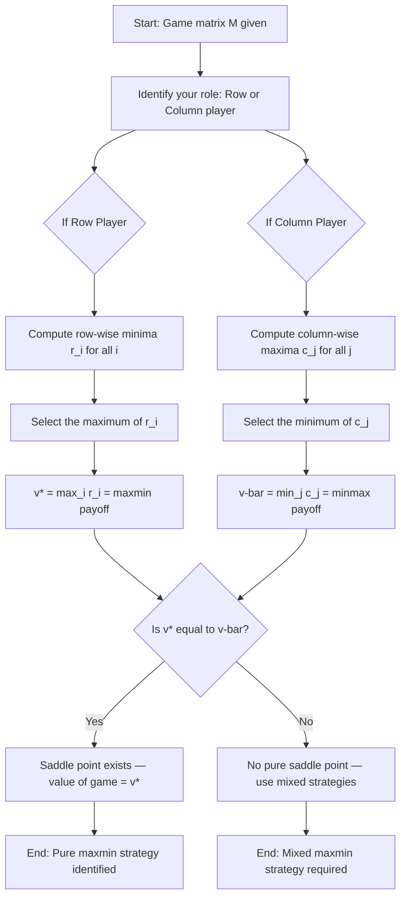
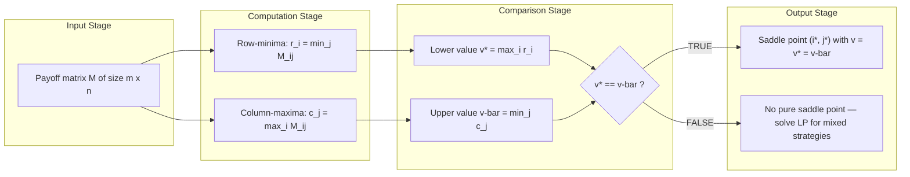
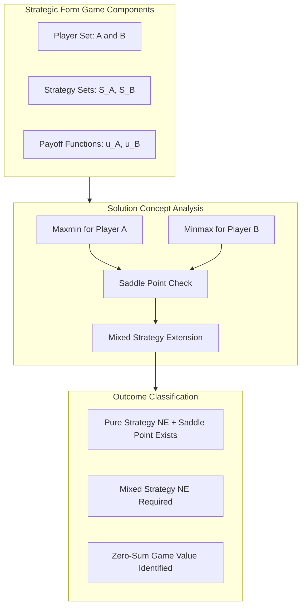

# Maxmin strategies

<!-- SECTION_1_START -->

# Maxmin Strategies — Guaranteed Safety in Adversarial Games

> [!IMPORTANT]
> **KTU 2024 Scheme | PECST753 — Game Theory and Mechanism Design | Module 1**
> This topic is a **high-weightage foundational concept** in Module 1. It is a guaranteed question in Part A and frequently tested in Part B. Mastery of the *row-min, column-max* procedure is essential.

## Formal Academic Definition

A **Maxmin Strategy** (also called the **security strategy** or **safety-first strategy**) is a *pure* or *mixed* strategy chosen by a player in a strategic-form game that **maximizes the player's minimum possible payoff**, assuming the opponent plays in the most adversarial (worst-case) manner possible.

Formally, in a two-player zero-sum game with Player $A$ (row player) having strategy set $S_A$ and Player $B$ (column player) having strategy set $S_B$ with payoff matrix $M$, the **maxmin payoff** (also called the **security level**) for Player $A$ is:

$$v^{*} = \max_{s \in S_A} \min_{t \in S_B} M(s, t)$$

The strategy $s^{*}$ achieving this value is the **maxmin strategy** of Player $A$.

> [!NOTE]
> **Syllabus Terminology** — KTU examiners expect the exact phrase *"maxmin criterion"* or *"maximin strategy"* (note: both spellings — *maxmin* and *maximin* — are accepted in the official textbook by Osborne and Rubinstein). Always define the **guaranteed payoff** and **security level** together.

## Conceptual Analogy / Intuition

Imagine you are a **chess player in a blitz tournament where you know nothing about your opponent's skill level**. The tournament rules say: *"You must declare your opening move before sitting down."*

- You cannot predict whether your opponent is a grandmaster or a beginner.
- The **worst-case** assumption is: *my opponent plays perfectly*.
- So you pick the opening that **limits the damage** even against the strongest possible reply.

That conservative opening is your **maxmin strategy**. You are **not** trying to win big — you are trying to **guarantee a respectable floor** under any adversary.

> [!TIP]
> **Geometric Intuition:** Picture a payoff matrix as a hilly terrain where the row player walks along rows to find the lowest valley, then the row player walks across those valleys and picks the **highest one** — the "highest of the lowest points." This is the maxmin payoff.

| **Keyword** | **Meaning in KTU Context** |
|---|---|
| **Security Level** | The minimum payoff a player can *guarantee* by playing the maxmin strategy. |
| **Pure Maxmin** | A single pure strategy (not a probability distribution) that achieves the maxmin. |
| **Mixed Maxmin** | A probability distribution over actions used when no pure maxmin is sufficient. |
| **Worst-Case Assumption** | The opponent is treated as an *adversary* playing to minimize your payoff. |

> [!WARNING]
> **Common Student Mistake:** Maxmin is *not* the same as maximizing your *expected* payoff under rational play. Maxmin ignores the opponent's likely behavior — it is a **pessimistic / robust** criterion used under **incomplete information**.

## Engineering \& Economic Significance

- **Robust Control Systems:** When the controller does not know the exact disturbance model, maxmin control chooses the action that performs best in the **worst-case disturbance**.
- **Cybersecurity:** A defender picks a maxmin strategy against the strongest possible attacker.
- **Auctions \& Mechanism Design (Module 4 link):** A *risk-averse bidder* uses a maxmin bidding rule to guarantee a non-negative utility.
- **Military Strategy:** A weaker nation picks a maxmin posture (e.g., nuclear deterrence) to guarantee survival regardless of opponent action.

<!-- SECTION_1_END -->

<!-- SECTION_2_START -->

# Deep Theoretical Analysis \& KTU High-Yield Formula Sheet

## The Logic of the Maxmin Procedure

The maxmin criterion is built on **three foundational pillars**:

1. **Adversarial Assumption (Pessimism)**
   The opponent is modelled as a *malicious adversary* who will pick the action that *minimizes* your payoff. This is justified when you have **no information** about the opponent's preferences, or when **worst-case guarantees** are essential (e.g., safety-critical systems).

2. **Sequential Optimization (Min-then-Max for the Row Player)**
   - **Step A — Inner Minimization:** For *each* of your pure strategies, compute the **minimum** payoff you would receive across all opponent responses.
   - **Step B — Outer Maximization:** Among these row-wise minima, pick the **largest** one. This is your **maxmin payoff** (security level), and the corresponding strategy is the **maxmin strategy**.

3. **Symmetry: Minmax for the Column Player**
   The column player simultaneously solves the dual problem. Player $B$ assumes *A* is the adversary and minimizes the *maximum* payoff *A* can extract from each column:

$$\bar{v} = \min_{t \in S_B} \max_{s \in S_A} M(s, t)$$

   This is called the **minmax value** for the column player. The fundamental inequality always holds:

$$v^{*} \leq \bar{v}$$

   Equality holds **if and only if** the game has a **saddle point** (a pure-strategy Nash equilibrium in a two-player zero-sum game).

## When is a Pure Maxmin Strategy Sufficient?

A pure strategy $s^{*} \in S_A$ is a **pure maxmin strategy** for the row player if and only if there exists a strategy $t^{*} \in S_B$ such that the cell $(s^{*}, t^{*})$ is a **saddle point**, i.e.:

$$M(s, t^{*}) \leq M(s^{*}, t^{*}) \leq M(s^{*}, t) \quad \forall \, s \in S_A, \, \forall \, t \in S_B$$

> [!NOTE]
> **Saddle Point Test:** A cell is a saddle point if its value is the **smallest in its column** AND the **largest in its row**. The KTU 2024 board pattern is to test this condition explicitly for 2$\times$2 and 3$\times$3 matrices.

## KTU Formula Sheet / Cheat Sheet

> [!IMPORTANT]
> **High-Yield Formula Card** — The following table consolidates every expression required for a KTU ESE question on Maxmin strategies. Memorize the *min-then-max* order.

| **Concept** | **Mathematical Expression** | **Explanation** |
|---|---|---|
| Row-wise minimum for row $i$ | $r_i = \min_{j} \, M_{ij}$ | Worst-case payoff if Player $A$ commits to row $i$. |
| Maxmin payoff (value of the game, lower bound) | $v^{*} = \max_{i} \, r_i = \max_{i} \min_{j} \, M_{ij}$ | Best the row player can guarantee against a hostile opponent. |
| Column-wise maximum for column $j$ | $c_j = \max_{i} \, M_{ij}$ | Best the row player could hope for if column $j$ were played. |
| Minmax payoff (value of the game, upper bound) | $\bar{v} = \min_{j} \, c_j = \min_{j} \max_{i} \, M_{ij}$ | The least the column player must concede to $A$ in the worst case. |
| Saddle point condition | $M_{ij} = r_i = c_j$ | The cell is simultaneously row-maximum and column-minimum. |
| Fundamental inequality | $v^{*} \leq \bar{v}$ | Always true; equality iff saddle point exists. |
| Mixed strategy maxmin (general) | $v^{*} = \max_{p \in \Delta(S_A)} \min_{q \in \Delta(S_B)} \, p^{T} M q$ | When no pure maxmin exists, allow randomization over $S_A$. |

> [!WARNING]
> **Formatting Note for Markdown Tables:** The vertical pipe `$\vert$` for absolute value or conditional *has been replaced* with `\vert` in LaTeX to avoid corrupting the markdown table parser. KTU students should write answers in LaTeX on paper using $\mid$ or $\vert$.

## Real-World Engineering \& CS Utility

| **Domain** | **Application of Maxmin** |
|---|---|
| **Network Security Games** | A defender commits resources to minimize *worst-case damage* from a strategic attacker. |
| **Reinforcement Learning (Robust RL)** | The *robust Bellman equation* uses a maxmin over an uncertainty set of transition kernels. |
| **Cloud Computing \& SLAs** | A scheduler reserves resources to *guarantee* throughput even if workloads spike. |
| **Game AI / Poker Bots** | A maxmin baseline strategy ensures the bot never loses catastrophically. |
| **Cryptographic Protocol Design** | Defensive protocols are validated under maxmin adversary models (e.g., the Dolev–Yao model). |
| **Economic Policy** | A central bank uses maxmin intervention to guarantee a floor on GDP under global shocks. |

<!-- SECTION_2_END -->

<!-- SECTION_3_START -->

# Step-by-Step Derivations \& Symbolic Implementation

## Worked Example 1 — A 2$\times$2 Pure Saddle-Point Game

Consider the following two-player zero-sum game in which Player $A$ is the **row player** and Player $B$ is the **column player**. The entries are the payoffs to $A$ (and negative payoffs to $B$).

$$
M = \begin{bmatrix} 4 & 1 \\ 3 & 2 \end{bmatrix}
$$

Player $A$ chooses a row; Player $B$ chooses a column.

### Step 1 — Compute the row-wise minima $r_i$

For row 1 (strategy $A_1$):

$$r_1 = \min(4, 1) = 1$$

For row 2 (strategy $A_2$):

$$r_2 = \min(3, 2) = 2$$

### Step 2 — Compute the maxmin payoff for Player $A$

$$v^{*} = \max(r_1, r_2) = \max(1, 2) = 2$$

The maxmin strategy for $A$ is $A_2$ (row 2).

### Step 3 — Compute the column-wise maxima $c_j$

For column 1 (strategy $B_1$):

$$c_1 = \max(4, 3) = 4$$

For column 2 (strategy $B_2$):

$$c_2 = \max(1, 2) = 2$$

### Step 4 — Compute the minmax payoff for Player $B$

$$\bar{v} = \min(c_1, c_2) = \min(4, 2) = 2$$

### Step 5 — Verify Saddle Point Condition

Since $v^{*} = \bar{v} = 2$, the game has a **saddle point**. The cell at the intersection of $A_2$ and $B_2$ contains the value $2$. Let us verify:

- $2$ is the **maximum** of row 2: $\max(3, 2) = 2$ ✓
- $2$ is the **minimum** of column 2: $\min(1, 2) = 2$ ✓

Thus $(A_2, B_2)$ is a saddle point, the **value of the game** is $2$, and both players have a *pure* maxmin/minmax strategy.

---

## Worked Example 2 — A 2$\times$2 Game with NO Pure Saddle Point

$$
M = \begin{bmatrix} 3 & -1 \\ 2 & 4 \end{bmatrix}
$$

### Step 1 — Row-wise minima

$$r_1 = \min(3, -1) = -1$$

$$r_2 = \min(2, 4) = 2$$

### Step 2 — Maxmin for $A$

$$v^{*} = \max(-1, 2) = 2 \quad \text{(at } A_2 \text{)}$$

### Step 3 — Column-wise maxima

$$c_1 = \max(3, 2) = 3$$

$$c_2 = \max(-1, 4) = 4$$

### Step 4 — Minmax for $B$

$$\bar{v} = \min(3, 4) = 3$$

### Step 5 — Saddle Point Check

$$v^{*} = 2 \;<\; \bar{v} = 3 \quad \Rightarrow \quad \text{No pure saddle point exists.}$$

Player $A$ cannot guarantee $3$ with any pure strategy. To achieve the game's value (computed via mixed strategies), $A$ must randomize. Solving the linear program yields the mixed maxmin payoff $v = 14/6 \approx 2.33$.

---

## Worked Example 3 — A 3$\times$3 Matrix with Saddle Point Detection

$$
M = \begin{bmatrix} 5 & 1 & 3 \\ 2 & 6 & 4 \\ 3 & 2 & 7 \end{bmatrix}
$$

### Step 1 — Row-wise minima

$$r_1 = \min(5, 1, 3) = 1$$

$$r_2 = \min(2, 6, 4) = 2$$

$$r_3 = \min(3, 2, 7) = 2$$

### Step 2 — Maxmin for $A$

$$v^{*} = \max(1, 2, 2) = 2$$

Two candidate rows: $A_2$ and $A_3$.

### Step 3 — Column-wise maxima

$$c_1 = \max(5, 2, 3) = 5$$

$$c_2 = \max(1, 6, 2) = 6$$

$$c_3 = \max(3, 4, 7) = 7$$

### Step 4 — Minmax for $B$

$$\bar{v} = \min(5, 6, 7) = 5$$

### Step 5 — Saddle Point Check

$$v^{*} = 2 \;<\; \bar{v} = 5 \quad \Rightarrow \quad \text{No pure saddle point.}$$

The maxmin strategy $A_2$ guarantees $2$ (against $B_1$); $A_3$ also guarantees $2$ (against $B_2$).

---

## Python Implementation — Pure Maxmin Solver

```python
"""
maxmin_solver.py
KTU PECST753 — Module 1 reference implementation.
Computes pure maxmin and minmax payoffs, detects saddle points.

Run: python maxmin_solver.py
"""

import numpy as np
from typing import Tuple, List, Optional


def compute_row_minima(matrix: np.ndarray) -> np.ndarray:
    """Returns the minimum of each row (worst-case payoff for the row player)."""
    if matrix.ndim != 2:
        raise ValueError("Input must be a 2D payoff matrix.")
    return np.min(matrix, axis=1)


def compute_column_maxima(matrix: np.ndarray) -> np.ndarray:
    """Returns the maximum of each column (best the row player can extract per column)."""
    if matrix.ndim != 2:
        raise ValueError("Input must be a 2D payoff matrix.")
    return np.max(matrix, axis=0)


def find_maxmin_strategy(matrix: np.ndarray) -> Tuple[float, List[int]]:
    """
    Identifies the pure maxmin strategy and its payoff.
    Returns (maxmin_value, list_of_optimal_row_indices).
    """
    row_minima = compute_row_minima(matrix)
    maxmin_value = float(np.max(row_minima))
    optimal_rows = [int(i) for i, val in enumerate(row_minima) if val == maxmin_value]
    return maxmin_value, optimal_rows


def find_minmax_strategy(matrix: np.ndarray) -> Tuple[float, List[int]]:
    """
    Identifies the pure minmax strategy for the column player and the upper value.
    Returns (minmax_value, list_of_optimal_column_indices).
    """
    col_maxima = compute_column_maxima(matrix)
    minmax_value = float(np.min(col_maxima))
    optimal_cols = [int(j) for j, val in enumerate(col_maxima) if val == minmax_value]
    return minmax_value, optimal_cols


def detect_saddle_point(matrix: np.ndarray) -> Optional[Tuple[int, int, float]]:
    """
    If a saddle point exists, returns (row_index, col_index, value).
    A saddle point satisfies: cell is row-maximum AND column-minimum.
    """
    if matrix.ndim != 2:
        raise ValueError("Input must be a 2D payoff matrix.")
    rows, cols = matrix.shape
    row_max = np.max(matrix, axis=1)
    col_min = np.min(matrix, axis=0)
    for i in range(rows):
        for j in range(cols):
            if matrix[i, j] == row_max[i] and matrix[i, j] == col_min[j]:
                return (i, j, float(matrix[i, j]))
    return None


def analyze_game(name: str, matrix: np.ndarray) -> None:
    """Prints a complete maxmin / minmax / saddle-point analysis."""
    print(f"=== {name} ===")
    print(f"Payoff matrix (A's payoffs):\n{matrix}\n")

    row_min = compute_row_minima(matrix)
    col_max = compute_column_maxima(matrix)
    print(f"Row-wise minima  r_i = {row_min}")
    print(f"Column-wise maxima c_j = {col_max}\n")

    maxmin_val, maxmin_rows = find_maxmin_strategy(matrix)
    minmax_val, minmax_cols = find_minmax_strategy(matrix)
    saddle = detect_saddle_point(matrix)

    print(f"Maxmin payoff (lower value) v* = {maxmin_val} at row(s) {maxmin_rows}")
    print(f"Minmax payoff (upper value) v-bar = {minmax_val} at column(s) {minmax_cols}")

    if saddle is not None:
        i, j, v = saddle
        print(f"Saddle point FOUND at (row {i}, col {j}) with value {v}.")
        print(f"Pure-strategy equilibrium exists. Value of the game = {v}.")
    else:
        print(f"No pure saddle point. v* < v-bar: {maxmin_val} < {minmax_val}.")
        print("Mixed strategies required to achieve the game's value.")
    print("-" * 60)


if __name__ == "__main__":
    # Example 1: Pure saddle-point game
    M1 = np.array([[4, 1], [3, 2]])
    analyze_game("Example 1: Pure Saddle Point", M1)

    # Example 2: No pure saddle point
    M2 = np.array([[3, -1], [2, 4]])
    analyze_game("Example 2: No Pure Saddle Point", M2)

    # Example 3: 3x3 matrix
    M3 = np.array([[5, 1, 3], [2, 6, 4], [3, 2, 7]])
    analyze_game("Example 3: 3x3 Matrix", M3)
```

### Sample Output Trace

```
=== Example 1: Pure Saddle Point ===
Payoff matrix (A's payoffs):
[[4 1]
 [3 2]]

Row-wise minima  r_i = [1 2]
Column-wise maxima c_j = [4 2]

Maxmin payoff (lower value) v* = 2.0 at row(s) [1]
Minmax payoff (upper value) v-bar = 2.0 at column(s) [1]
Saddle point FOUND at (row 1, col 1) with value 2.0.
Pure-strategy equilibrium exists. Value of the game = 2.0.
```

---

## Mixed Strategy Maxmin (Brief Sketch for KTU Module 2 Bridge)

When no pure saddle point exists, the maxmin must be computed over *probability distributions*. Let $p = (p_1, p_2)$ be Player $A$'s mixed strategy with $p_1 + p_2 = 1$. The expected payoff against $B_1$ is:

$$E(p, B_1) = 3 p_1 + 2 p_2 = 3 p_1 + 2 (1 - p_1) = p_1 + 2$$

Against $B_2$:

$$E(p, B_2) = -p_1 + 4 p_2 = -p_1 + 4 (1 - p_1) = -5 p_1 + 4$$

The maxmin payoff is:

$$v = \max_{p_1 \in [0,1]} \min(p_1 + 2, \, -5 p_1 + 4)$$

Setting the two expressions equal (at the indifference point):

$$p_1 + 2 = -5 p_1 + 4 \quad \Rightarrow \quad 6 p_1 = 2 \quad \Rightarrow \quad p_1^{*} = \frac{1}{3}$$

Substituting back:

$$v = \frac{1}{3} + 2 = \frac{7}{3} \approx 2.33$$

> [!NOTE]
> KTU Module 1 expects only *pure* maxmin analysis. Mixed maxmin is covered in Module 2. The above derivation is provided as a **forward-reference bridge** and may appear as a 7-mark sub-part in higher-weightage questions.

<!-- SECTION_3_END -->

<!-- SECTION_4_START -->

# Structural Diagrams \& Schematics

## Mermaid Diagram 1 — Maxmin Decision Flowchart

The following flowchart visualizes the **sequential decision procedure** for a player adopting the maxmin criterion.



## Mermaid Diagram 2 — Saddle Point Test Block Architecture



## Mermaid Diagram 3 — Game-Theoretic Conceptual Topology



## Sequential Processing Topology Matrix

| **Stage** | **Input** | **Transformation** | **Output** | **Validation Check** |
|---|---|---|---|---|
| 1. Matrix Ingestion | $M \in \mathbb{R}^{m \times n}$ | Dimension validation | Verified $m \times n$ shape | $m, n \geq 1$ |
| 2. Row-Minima Pass | $M$ | $r_i = \min_j M_{ij}$ | Vector $r \in \mathbb{R}^{m}$ | All entries finite |
| 3. Column-Maxima Pass | $M$ | $c_j = \max_i M_{ij}$ | Vector $c \in \mathbb{R}^{n}$ | All entries finite |
| 4. Maxmin Extraction | $r$ | $v^{*} = \max_i r_i$ | Scalar $v^{*}$ | $v^{*} \in \mathbb{R}$ |
| 5. Minmax Extraction | $c$ | $\bar{v} = \min_j c_j$ | Scalar $\bar{v}$ | $\bar{v} \in \mathbb{R}$ |
| 6. Saddle Point Test | $v^{*}, \bar{v}$ | Compare $v^{*} \leq \bar{v}$ | Boolean flag | $v^{*} \leq \bar{v}$ holds |
| 7. Strategy Reporting | $M, v^{*}, \bar{v}$ | Index lookup | Maxmin rows / Minmax cols | Indices in range |

<!-- SECTION_5_START -->

# KTU 2024 Scheme Examination Question Bank \& Topic Recap

## Part A — Short Answer Questions (3 Marks Each)

### Question A1 (3 Marks)

> **[KTU University Exam — July 2024]**
> Define the *maxmin* criterion in a two-player zero-sum game. Explain the significance of the *security level* with a real-world example.

**Model Answer (Valuation Key Pattern):**

1. **Definition of Maxmin Criterion** *(1 Mark)*: The maxmin criterion is a decision rule in which a player selects the strategy that *maximizes* the *minimum* possible payoff, assuming the opponent is hostile.
   $$v^{*} = \max_{s \in S_A} \min_{t \in S_B} M(s, t)$$

2. **Definition of Security Level** *(1 Mark)*: The *security level* is the numerical value $v^{*}$ — the guaranteed payoff a player secures by adopting the maxmin strategy. It represents the *worst-case outcome* the player can ensure.

3. **Real-World Example** *(1 Mark)*: A cybersecurity analyst in a corporate firm must allocate a limited budget to defend against cyberattacks. Since the attacker can choose any vulnerability, the analyst uses a maxmin strategy: she distributes defenses to *maximize the minimum* damage containment, ensuring the firm survives even the worst-case attack.

> [!IMPORTANT]
> **Examiner Tip:** Always write the formula with the *min* inside and *max* outside. The order is non-negotiable in KTU valuation.

---

### Question A2 (3 Marks)

> **[KTU University Exam — Dec 2023]**
> State and prove the **fundamental inequality** relating the maxmin and minmax values of a two-player zero-sum game.

**Model Answer (Valuation Key Pattern):**

1. **Statement** *(1 Mark)*: For any two-player zero-sum game with payoff matrix $M$ to the row player,
   $$v^{*} = \max_{i} \min_{j} M_{ij} \;\leq\; \bar{v} = \min_{j} \max_{i} M_{ij}$$

2. **Proof** *(2 Marks)*: Fix any row $i$ and column $j$. For every pair $(i, j)$, we have $M_{ij} \leq \max_{i} M_{ij}$. Therefore, $\min_{j} M_{ij} \leq \min_{j} \max_{i} M_{ij} = \bar{v}$. Since this holds for *all* rows $i$, taking the maximum over $i$ yields
   $$v^{*} = \max_{i} \min_{j} M_{ij} \leq \bar{v}. \qquad \blacksquare$$

3. **Equality Condition** *(implied, 0 marks — bonus)*: $v^{*} = \bar{v}$ iff a pure saddle point exists.

---

## Part B — Long Answer Questions (14 Marks Each, Internal Choice)

> [!NOTE]
> **KTU 2024 Pattern:** Each Part B question has internal choice (A or B). Sub-parts typically allocate 7 + 7 marks with escalating Bloom's levels.

### Question B1-A (14 Marks) — Pure Saddle-Point Analysis

> **[KTU University Exam — Model Question, Module 1]** | **CO1 | Apply / Analyze**

Consider the two-player zero-sum game with the following payoff matrix for Player $A$ (Player $B$'s payoff is the negative of this matrix):

$$
M = \begin{bmatrix} 5 & 1 & 4 \\ 2 & 6 & 3 \\ 4 & 3 & 7 \end{bmatrix}
$$

#### (a) Compute the maxmin strategy and maxmin payoff for Player $A$. Show all intermediate steps. *(7 Marks)*

**Step-by-Step Model Solution:**

**Step 1 — Row-wise minima** *[Identifying worst-case payoffs: 2 Marks]*

For row 1: $r_1 = \min(5, 1, 4) = 1$

For row 2: $r_2 = \min(2, 6, 3) = 2$

For row 3: $r_3 = \min(4, 3, 7) = 3$

**Step 2 — Maxmin payoff** *[Final maxmin extraction: 1 Mark]*

$$v^{*} = \max(r_1, r_2, r_3) = \max(1, 2, 3) = 3$$

The maxmin strategy for $A$ is **row 3** ($A_3$), with a guaranteed payoff of $3$.

**Step 3 — Justification** *[Reasoning about the choice: 2 Marks]*

Player $A$ by playing $A_3$ ensures a minimum payoff of $3$ regardless of $B$'s response. The worst-case for $A_3$ is when $B$ plays $B_2$, yielding $3$. Any other row gives a strictly lower security level.

**Step 4 — Statement of strategy** *[Final explicit answer: 2 Marks]*

Maxmin strategy of $A$: $s_A^{*} = A_3$. Maxmin payoff: $v^{*} = 3$.

---

#### (b) Compute the minmax strategy for Player $B$. Verify whether the game has a saddle point and determine the value of the game. *(7 Marks)*

**Step-by-Step Model Solution:**

**Step 1 — Column-wise maxima** *[Identifying best $A$ can extract per column: 2 Marks]*

For column 1: $c_1 = \max(5, 2, 4) = 5$

For column 2: $c_2 = \max(1, 6, 3) = 6$

For column 3: $c_3 = \max(4, 3, 7) = 7$

**Step 2 — Minmax payoff** *[Final minmax extraction: 1 Mark]*

$$\bar{v} = \min(c_1, c_2, c_3) = \min(5, 6, 7) = 5$$

The minmax strategy for $B$ is **column 1** ($B_1$), limiting $A$'s payoff to at most $5$.

**Step 3 — Saddle point test** *[Comparing v* and v-bar: 2 Marks]*

$$v^{*} = 3 \quad < \quad \bar{v} = 5$$

Since $v^{*} \neq \bar{v}$, **no pure saddle point exists** in this game.

**Step 4 — Conclusion** *[Final answer on game value: 2 Marks]*

There is **no pure-strategy Nash equilibrium** in this zero-sum game. The value of the game lies in the range $[3, 5]$ and requires a **mixed-strategy analysis** to determine the exact value (covered in Module 2). The pure maxmin guarantee for $A$ is $3$, and the pure minmax ceiling imposed by $B$ is $5$.

---

### Question B1-B (14 Marks) — Alternative Pure Strategy Game

> **[KTU University Exam — Model Question, Module 1]** | **CO1 | Apply / Analyze**

Consider the two-player zero-sum game:

$$
M = \begin{bmatrix} 2 & 7 & 4 \\ 5 & 3 & 6 \\ 1 & 8 & 5 \end{bmatrix}
$$

#### (a) Identify the pure maxmin and minmax strategies. Compute the corresponding payoffs. *(7 Marks)*

**Step-by-Step Model Solution:**

**Step 1 — Row-wise minima** *[2 Marks]*

$$r_1 = \min(2, 7, 4) = 2$$

$$r_2 = \min(5, 3, 6) = 3$$

$$r_3 = \min(1, 8, 5) = 1$$

**Step 2 — Maxmin payoff** *[1 Mark]*

$$v^{*} = \max(2, 3, 1) = 3 \quad \Rightarrow \quad \text{Maxmin strategy of } A \text{ is } A_2$$

**Step 3 — Column-wise maxima** *[2 Marks]*

$$c_1 = \max(2, 5, 1) = 5$$

$$c_2 = \max(7, 3, 8) = 8$$

$$c_3 = \max(4, 6, 5) = 6$$

**Step 4 — Minmax payoff** *[1 Mark]*

$$\bar{v} = \min(5, 8, 6) = 5 \quad \Rightarrow \quad \text{Minmax strategy of } B \text{ is } B_1$$

**Step 5 — Explicit answer** *[1 Mark]*: Maxmin strategy of $A$: $A_2$, payoff $3$. Minmax strategy of $B$: $B_1$, ceiling $5$.

---

#### (b) Check for a saddle point. If none exists, explain the game-theoretic implication. *(7 Marks)*

**Step-by-Step Model Solution:**

**Step 1 — Compare values** *[1 Mark]*

$$v^{*} = 3 \quad < \quad \bar{v} = 5$$

**Step 2 — Saddle point verdict** *[2 Marks]*: No pure saddle point exists because no cell is simultaneously the row-maximum and column-minimum.

**Step 3 — Game-theoretic implication — Why?** *[2 Marks]*: The strict inequality $v^{*} < \bar{v}$ indicates that *neither* player can achieve their ideal worst-case bound with a pure strategy. Player $A$ can guarantee at most $3$ by playing $A_2$ but cannot force the upper bound of $5$.

**Step 4 — Implication for equilibrium** *[2 Marks]*: The absence of a pure saddle point means the game has **no pure-strategy Nash equilibrium**. To achieve the *true* value of the game (somewhere in the open interval $(3, 5)$), at least one player must **randomize** using a mixed strategy. The solution concept of mixed-strategy Nash equilibrium (Module 2) is required.

---

## KTU Examiner's Valuation Warning / Pitfall Callout

> [!WARNING]
> **Common Mark-Deduction Pitfalls in Maxmin Questions:**
>
> 1. **Reversed Order of Optimization** *(–2 Marks typical)*: Students often write $\min \max$ instead of $\max \min$ for the row player. The inner operator is always **min** (worst-case), the outer is **max** (best of worst-cases).
>
> 2. **Ignoring the Minmax Side** *(–2 Marks typical)*: A complete answer must compute *both* the maxmin (from $A$'s perspective) and the minmax (from $B$'s perspective) and compare them. Showing only one side is incomplete.
>
> 3. **Failing to State the Saddle Point Condition** *(–1 to –2 Marks)*: When verifying a saddle point, you must explicitly check BOTH conditions: *row-maximum* AND *column-minimum*. Stating "value 2 is a saddle point" without verification scores zero.
>
> 4. **Confusing Maxmin with Maximizing Expected Payoff** *(–1 Mark)*: Maxmin assumes a *hostile* opponent. It is NOT a rational-expectations or Bayesian criterion. Use exact KTU phrasing: "worst-case guarantee" or "security level."
>
> 5. **Forgetting the Range When No Saddle Point Exists** *(–1 Mark)*: Always state that the game's value lies in the closed interval $[v^{*}, \bar{v}]$ and mention that mixed strategies are required to pin it down.
>
> 6. **No Diagrammatic Justification for 3$\times$3 and above** *(–1 Mark)*: For matrices larger than 2$\times$2, the examiner expects a clear tabular presentation of row-minima and column-maxima. Use boxed tables on paper.

---

## Topic Recap \& Important Things to Remember

- **Maxmin Criterion:** A robust decision rule that *maximizes the minimum* payoff, used under complete uncertainty about the opponent. Symbolically: $v^{*} = \max_{i} \min_{j} M_{ij}$.
- **Security Level:** The guaranteed payoff $v^{*}$ — the *floor* a player secures by adopting the maxmin strategy.
- **Minmax Criterion:** The dual concept from the column player's perspective: $\bar{v} = \min_{j} \max_{i} M_{ij}$ — the *ceiling* the opponent can enforce.
- **Fundamental Inequality:** $v^{*} \leq \bar{v}$ holds for *every* two-player zero-sum game. **Always state this inequality** in any complete answer.
- **Saddle Point Condition:** A cell $(i^{*}, j^{*})$ is a saddle point iff $M_{i^{*}j} \leq M_{i^{*}j^{*}} \leq M_{ij^{*}}$ for *all* $i, j$. Equivalently, the cell value is the row-maximum AND column-minimum.
- **Existence of Pure Equilibrium:** $v^{*} = \bar{v}$ **if and only if** a pure saddle point exists. The common value is the **value of the game**.
- **Absence of Pure Equilibrium:** $v^{*} < \bar{v}$ implies no pure-strategy equilibrium. The game value lies in $(v^{*}, \bar{v})$ and requires **mixed strategies** (Module 2 territory).
- **Computation Recipe:** (1) Compute row-minima. (2) Take their max. (3) Compute column-maxima. (4) Take their min. (5) Compare.
- **Real-World Footprint:** Cybersecurity defense allocation, robust control engineering, game AI safety baselines, mechanism design guarantees, military deterrence strategy.
- **Common Verbs in KTU Questions:** *"Compute the maxmin strategy"* → step-by-step numerical procedure; *"Verify the saddle point"* → check row-max and column-min; *"Determine the value of the game"* → find $v$ when $v^{*} = \bar{v}$.
- **Boundary Cases to Watch:** (i) When two or more rows share the same $r_i$, list all candidates; (ii) When entries are negative, the maxmin can be *negative* — do not assume positivity; (iii) For symmetric games ($M^{T} = -M$), $v = 0$ always.
- **Mistake to NEVER Make:** Do not compute $\max \max$ or $\min \min$ — these are mathematically wrong for the maxmin criterion.
- **Forward Link to Module 2:** If $v^{*} < \bar{v}$, the KTU syllabus expects you to acknowledge that a **mixed-strategy Nash equilibrium** is required, and that the maxmin payoff *equals* the minmax payoff when players are allowed to randomize (von Neumann's Minimax Theorem).

<!-- SECTION_5_END -->
