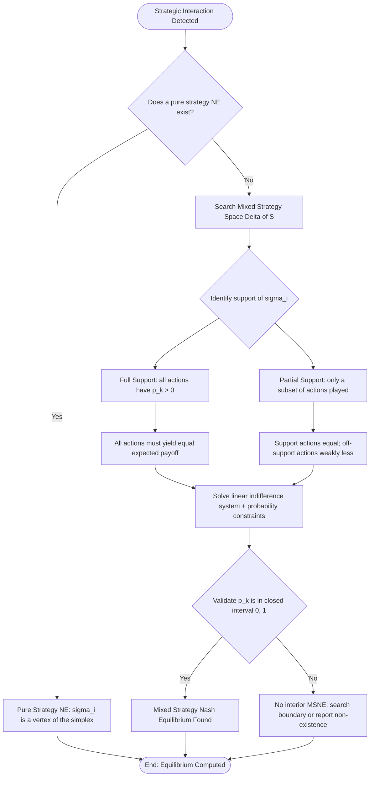
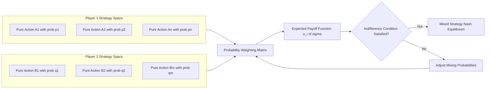

# Mixed strategies

<!-- SECTION_1_START -->
# Mixed Strategies in Game Theory

## 1. Formal Academic Definition

In the formal mathematical language of **non-cooperative game theory**, a **Mixed Strategy** is a strategy profile in which a player chooses to play a probability distribution over the set of available pure strategies, rather than deterministically selecting a single action. Formally, for a player $i$ with a finite pure strategy set $S_i = \{s_{i,1}, s_{i,2}, \dots, s_{i,n}\}$, a mixed strategy $\sigma_i$ is a probability vector:

$$\sigma_i = (p_1, p_2, \dots, p_n) \quad \text{where} \quad p_k \ge 0 \;\; \forall k \in \{1, \dots, n\} \quad \text{and} \quad \sum_{k=1}^{n} p_k = 1$$

The set of all such probability distributions is the **simplex** $\Delta(S_i)$, which is a convex, compact subset of $\mathbb{R}^{n}$. The collection of pure strategies that receive strictly positive probability under $\sigma_i$ is called the **support** of the mixed strategy, denoted $\text{supp}(\sigma_i) = \{k \in \{1, \dots, n\} : p_k > 0\}$.

> [!IMPORTANT]
> **KTU Syllabus Highlight — PECST753 / Module 1**
> A *pure strategy* is a degenerate mixed strategy that places probability **1** on a single action. Hence, mixed strategies are a strict **generalization** of pure strategies; they describe the broader strategic space $\Delta(S_i)$ that contains the pure strategies as its vertices.

A strategy profile $\sigma = (\sigma_1, \sigma_2, \dots, \sigma_n) \in \Delta(S_1) \times \Delta(S_2) \times \dots \times \Delta(S_n)$ forms a **Mixed Strategy Nash Equilibrium (MSNE)** if no player can increase their expected utility by unilaterally deviating to any other mixed strategy, given that the other players' strategies are held fixed.

## 2. Conceptual Analogy and Intuitive Overview

> [!NOTE]
> **Intuition Box — Why Randomize?**
> Imagine a soccer penalty kick. The kicker can shoot **Left (L)** or **Right (R)**, and the goalkeeper can dive **Left** or **Right**. If the kicker *always* shoots Left, the goalkeeper will *always* dive Left and save the goal. If the kicker *always* shoots Right, the goalkeeper dives Right. The kicker breaks this predictability by **randomizing** — sometimes L, sometimes R — and crucially, choosing the probabilities so that the goalkeeper is **indifferent** between diving L or R. This randomization is a mixed strategy.

The deeper game-theoretic insight is this: **A mixed strategy equilibrium is a situation where each player's randomization makes the other player willing to randomize too, and vice versa.** It is a self-consistent loop of uncertainty. The equilibrium probabilities are not arbitrary — they are precisely those that leave the opponent indifferent among all actions in the support.

Real-world examples include:
* **Rock-Paper-Scissors** — the unique equilibrium is each player choosing each action with probability $\frac{1}{3}$.
* **Bluffing in Poker** — a player bluffs with a frequency that keeps opponents indifferent between calling and folding.
* **Cybersecurity** — defenders randomize patrol routes so attackers cannot exploit predictable patterns.
* **Advertising** — firms randomize the timing and content of campaigns to keep competitors off-balance.

> [!VISUALIZATION CONTROL]
> **Concept:** Simplex of mixed strategies for a 2-action game.
> **GeoGebra / Desmos Input Equations:**
> * Point $A = (1, 0)$ — pure strategy Left
> * Point $B = (0, 1)$ — pure strategy Right
> * Line $L: x + y = 1$ for $x, y \ge 0$ — the simplex
> **Visual Description:** The student should observe a straight line segment connecting two vertices. Every point on the line represents a mixed strategy; the two endpoints are the pure strategies. The point $(\frac{1}{2}, \frac{1}{2})$ is the unique symmetric equilibrium of Matching Pennies.
<!-- SECTION_1_END -->

<!-- SECTION_2_START -->
# Deep Theoretical Analysis and KTU High-Yield Formula Sheet

## 1. Structural Breakdown of the Mixed Strategy Concept

A pure strategy is a single action. A mixed strategy is a *plan* that specifies a probability for every possible action. Below is the logical layering of the concept that examiners expect students to internalize.

* **Layer 1 — Pure Strategy Space:** The set of deterministic actions $S_i = \{s_{i,1}, \dots, s_{i,n}\}$. Each element is a vertex of the strategy simplex.
* **Layer 2 — Mixed Strategy Space:** The probability simplex $\Delta(S_i) = \left\{ \sigma_i \in \mathbb{R}^{n}_{\ge 0} : \sum_k p_k = 1 \right\}$. This is a continuous, convex set — a powerful mathematical property that enables the use of fixed-point theorems.
* **Layer 3 — Expected Payoff:** Given a strategy profile $\sigma = (\sigma_1, \dots, \sigma_n)$, the expected payoff to player $i$ is:
$$u_i(\sigma) = \sum_{s \in S} \left( \prod_{j=1}^{n} \sigma_j(s_j) \right) \cdot u_i(s)$$
where $S = S_1 \times S_2 \times \dots \times S_n$ is the set of all pure strategy profiles, and $s = (s_1, \dots, s_n)$ is a pure profile.
* **Layer 4 — Best Response:** A mixed strategy $\sigma_i^*$ is a **best response** to $\sigma_{-i}$ if $u_i(\sigma_i^*, \sigma_{-i}) \ge u_i(\sigma_i, \sigma_{-i})$ for all $\sigma_i \in \Delta(S_i)$.
* **Layer 5 — Mixed Strategy Nash Equilibrium (MSNE):** A profile $\sigma^*$ where every player's strategy is a best response to the others.

## 2. The Indifference Principle (Core Equivalence Theorem)

> [!IMPORTANT]
> **Equivalence Theorem for Finite Two-Player Games**
> A mixed strategy $\sigma_i^*$ is a best response to $\sigma_{-i}^*$ if and only if **every pure strategy in the support of $\sigma_i^*$ yields the same expected payoff**, and this payoff is **at least as large** as the payoff from any pure strategy outside the support. This is the *indifference condition* (also called the *equalizer condition*).

Mathematically, for a $2 \times 2$ game where Player 1 mixes with probability $q$ on action $A_1$ and $(1-q)$ on action $A_2$, while Player 2 mixes with probability $p$ on $B_1$ and $(1-p)$ on $B_2$:

$$\mathbb{E}[u_1 \mid A_1] = \mathbb{E}[u_1 \mid A_2] = v_1$$

where $v_1$ is the equilibrium expected payoff, and the equality expresses indifference. The same logic applies symmetrically to Player 2.

## 3. Existence Theorem

> [!NOTE]
> **Nash's Theorem (1950)** guarantees that every finite non-cooperative game (in either pure or mixed strategies) has at least one Nash equilibrium. This is established via Kakutani's fixed-point theorem applied to the best-response correspondence.

## 4. KTU Formula Sheet / Cheat Sheet

| Concept | Mathematical Expression | Interpretation |
| :--- | :--- | :--- |
| Mixed strategy of player $i$ | $\sigma_i = (p_1, p_2, \dots, p_n)$ | Probability distribution over $S_i$ |
| Simplex constraint | $\sum_{k=1}^{n} p_k = 1, \; p_k \ge 0$ | Probabilities sum to one, non-negative |
| Support of $\sigma_i$ | $\text{supp}(\sigma_i) = \{k : p_k > 0\}$ | Set of actions played with positive probability |
| Expected payoff | $u_i(\sigma) = \sum_s \left[ \prod_j \sigma_j(s_j) \right] u_i(s)$ | Weighted average over pure profiles |
| Indifference condition | $u_i(s_k, \sigma_{-i}) = v_i \; \forall s_k \in \text{supp}(\sigma_i)$ | All support actions yield equal expected payoff |
| Best response | $\sigma_i^* \in \arg\max_{\sigma_i \in \Delta(S_i)} u_i(\sigma_i, \sigma_{-i})$ | Optimal reply to opponents' strategy |
| MSNE | $\sigma_i^* \in BR_i(\sigma_{-i}^*) \; \forall i$ | Mutual best response |
| Expected payoff of action $A_k$ vs $\sigma_{-i}$ | $u_i(A_k, \sigma_{-i}) = \sum_{s_{-i}} \sigma_{-i}(s_{-i}) \cdot u_i(A_k, s_{-i})$ | Conditional expected payoff |
| $2 \times 2$ indifference equation | $p \cdot a + (1-p) \cdot b = p \cdot c + (1-p) \cdot d$ | Linear equation solving for opponent's mix |
| Symmetric RPS equilibrium | $\sigma_i = \left(\frac{1}{3}, \frac{1}{3}, \frac{1}{3}\right)$ | Uniform distribution over 3 actions |

## 5. Engineering and Real-World Utility

Mixed strategies are not just abstract mathematics; they underpin critical decision-making in:

* **Network Security:** Randomized intrusion-detection scheduling, where an attacker observing a pattern can exploit it. Cached randomized patrol routes in adversarial settings use MSNE to make attacks unprofitable.
* **Algorithmic Mechanism Design:** The **VCG mechanism** and **randomized auction formats** rely on mixed strategies of bidders to ensure incentive compatibility.
* **Cryptographic Protocol Design:** Adversaries in cryptographic games are often modeled as mixed strategies, and zero-knowledge proofs exploit indistinguishability under randomized adversary distributions.
* **Multi-Agent Reinforcement Learning:** Self-play algorithms such as **PSRO (Policy Space Response Oracles)** and **Counterfactual Regret Minimization (CFR)** compute approximate MSNE in large games like poker.
* **Economics of Competition:** Cournot and Bertrand competition models in industrial organization are solved using mixed-strategy reasoning about price and quantity perturbations.
<!-- SECTION_2_END -->

<!-- SECTION_3_START -->
# Step-by-Step Derivations and Worked Examples

## Example 1 — Matching Pennies (The Canonical Mixed Strategy Game)

### 1.1 The Payoff Matrix

Two players, $P_1$ and $P_2$, simultaneously show either **Heads (H)** or **Tails (T)**. If they match, $P_2$ wins a rupee from $P_1$; if they differ, $P_1$ wins a rupee from $P_2$. The payoff matrix (rows: $P_1$, columns: $P_2$) is:

| | $P_2$: H | $P_2$: T |
| :---: | :---: | :---: |
| **$P_1$: H** | $-1, \; +1$ | $+1, \; -1$ |
| **$P_1$: T** | $+1, \; -1$ | $-1, \; +1$ |

### 1.2 Why No Pure Strategy Equilibrium Exists

Inspecting the matrix row by row:
* If $P_2$ plays H, $P_1$ should play T (gets $+1$ instead of $-1$).
* If $P_2$ plays T, $P_1$ should play H (gets $+1$ instead of $-1$).

Inspecting column by column:
* If $P_1$ plays H, $P_2$ should play H (gets $+1$ instead of $-1$).
* If $P_1$ plays T, $P_2$ should play T (gets $+1$ instead of $-1$).

> [!NOTE]
> **Best-response cycles:** $H \to H \to T \to T \to H \to \cdots$. No cell is a mutual best response, so no pure-strategy Nash equilibrium exists. We must therefore search for a **mixed** equilibrium.

### 1.3 Setting Up the Indifference Equations

Let $P_1$ play H with probability $p$ and T with probability $1-p$. Let $P_2$ play H with probability $q$ and T with probability $1-q$.

**Step 1: Compute $P_2$'s expected payoff from playing H vs $\sigma_1$.**

$$\mathbb{E}[u_2 \mid H, \sigma_1] = p \cdot (+1) + (1-p) \cdot (-1) = 2p - 1$$

**Step 2: Compute $P_2$'s expected payoff from playing T vs $\sigma_1$.**

$$\mathbb{E}[u_2 \mid T, \sigma_1] = p \cdot (-1) + (1-p) \cdot (+1) = 1 - 2p$$

**Step 3: Apply the indifference condition for $P_2$.** For $P_2$ to mix between H and T, both pure actions must yield the same expected payoff.

$$2p - 1 = 1 - 2p$$

**Step 4: Solve for $p$.**

\begin{aligned}
2p - 1 &= 1 - 2p \\
2p + 2p &= 1 + 1 \\
4p &= 2 \\
p &= \frac{1}{2}
\end{aligned}

**Step 5: Compute $P_1$'s expected payoff from playing H vs $\sigma_2$.**

$$\mathbb{E}[u_1 \mid H, \sigma_2] = q \cdot (-1) + (1-q) \cdot (+1) = 1 - 2q$$

**Step 6: Compute $P_1$'s expected payoff from playing T vs $\sigma_2$.**

$$\mathbb{E}[u_1 \mid T, \sigma_2] = q \cdot (+1) + (1-q) \cdot (-1) = 2q - 1$$

**Step 7: Apply the indifference condition for $P_1$.**

$$1 - 2q = 2q - 1$$

**Step 8: Solve for $q$.**

\begin{aligned}
1 - 2q &= 2q - 1 \\
1 + 1 &= 2q + 2q \\
2 &= 4q \\
q &= \frac{1}{2}
\end{aligned}

### 1.4 Equilibrium and Expected Value

$$\boxed{\sigma_1^* = \left( \tfrac{1}{2}, \tfrac{1}{2} \right), \quad \sigma_2^* = \left( \tfrac{1}{2}, \tfrac{1}{2} \right)}$$

The equilibrium expected payoff to both players is $\mathbb{E}[u_1] = 1 - 2 \cdot \tfrac{1}{2} = 0$, and symmetrically $\mathbb{E}[u_2] = 0$. The game is **fair in expectation** under the equilibrium.

---

## Example 2 — Rock–Paper–Scissors (Three-Action Mixed Equilibrium)

### 2.1 The Payoff Matrix (Player 1's payoffs)

| | R | P | S |
| :---: | :---: | :---: | :---: |
| **R** | $0$ | $-1$ | $+1$ |
| **P** | $+1$ | $0$ | $-1$ |
| **S** | $-1$ | $+1$ | $0$ |

### 2.2 The Symmetric Equilibrium Claim

By symmetry of the game, we expect $\sigma_1 = \sigma_2 = (\tfrac{1}{3}, \tfrac{1}{3}, \tfrac{1}{3})$. We verify this is a Nash equilibrium.

**Expected payoff of R to Player 1 vs $\sigma_2 = (p_R, p_P, p_S)$:**

$$\mathbb{E}[u_1 \mid R] = p_R(0) + p_P(-1) + p_S(+1) = p_S - p_P$$

**Expected payoff of P to Player 1 vs $\sigma_2$:**

$$\mathbb{E}[u_1 \mid P] = p_R(+1) + p_P(0) + p_S(-1) = p_R - p_S$$

**Expected payoff of S to Player 1 vs $\sigma_2$:**

$$\mathbb{E}[u_1 \mid S] = p_R(-1) + p_P(+1) + p_S(0) = p_P - p_R$$

**Indifference condition:** For Player 1 to mix, all three must be equal.

\begin{aligned}
p_S - p_P &= p_R - p_S \\
2 p_S &= p_R + p_P
\end{aligned}

\begin{aligned}
p_R - p_S &= p_P - p_R \\
2 p_R &= p_P + p_S
\end{aligned}

\begin{aligned}
p_R + p_P + p_S &= 1
\end{aligned}

Solving this linear system: subtract the second from the first,

$$2 p_S - 2 p_R = p_R - p_P - p_P + p_S = p_R + p_S - 2 p_P$$

A faster way: by symmetry, suppose $p_R = p_P = p_S = \tfrac{1}{3}$. Then $p_S - p_P = 0 = p_R - p_S = p_P - p_R$, so all three expected payoffs are $0$. Player 1 is indifferent. The same argument holds for Player 2.

$$\boxed{\sigma^* = \left(\tfrac{1}{3}, \tfrac{1}{3}, \tfrac{1}{3}\right) \text{ for both players, with expected payoff } 0.}$$

> [!NOTE]
> The full support $\text{supp}(\sigma^*) = \{R, P, S\}$ is crucial: if Player 2 puts zero probability on some action, the indifference condition on Player 1 would fail. In particular, **no two-action mix can be an equilibrium** of Rock–Paper–Scissors — a classic KTU-style exercise.

---

## Example 3 — Algorithm: Computing the Mixed Nash Equilibrium of a 2x2 Game (Python)

```python
from dataclasses import dataclass
from typing import Tuple

@dataclass(frozen=True)
class PayoffMatrix:
    # Payoff matrix entries for a 2x2 game.
    # Rows: Player 1's actions (T for Top, B for Bottom)
    # Columns: Player 2's actions (L for Left, R for Right)
    a: float  # (T, L) -> Player 1
    b: float  # (T, R) -> Player 1
    c: float  # (B, L) -> Player 1
    d: float  # (B, R) -> Player 1


def mixed_nash_equilibrium_2x2(m: PayoffMatrix) -> Tuple[float, float]:
    """
    Computes the mixed-strategy Nash equilibrium probabilities (p, q)
    for a 2x2 game, where:
        p = probability Player 1 plays Top
        q = probability Player 2 plays Left
    
    Indifference for Player 2:
        q * a + (1 - q) * b = q * c + (1 - q) * d
    Indifference for Player 1:
        p * a + (1 - p) * c = p * b + (1 - p) * d
    
    Returns (p, q). If no interior equilibrium exists, returns (-1, -1).
    """
    denominator_q = (m.a - m.b - m.c + m.d)
    denominator_p = (m.a - m.b - m.c + m.d)
    
    if denominator_q == 0 or denominator_p == 0:
        return (-1.0, -1.0)  # No interior mixed equilibrium
    
    q = (m.d - m.b) / denominator_q
    p = (m.d - m.c) / denominator_p
    
    # Boundary validation: probabilities must lie in [0, 1]
    if not (0.0 <= p <= 1.0 and 0.0 <= q <= 1.0):
        return (-1.0, -1.0)
    
    return (p, q)


# === Validation on Matching Pennies ===
m = PayoffMatrix(a=-1, b=+1, c=+1, d=-1)
p, q = mixed_nash_equilibrium_2x2(m)
print(f"Matching Pennies equilibrium: p = {p:.4f}, q = {q:.4f}")
# Expected output: p = 0.5000, q = 0.5000
```

The algorithmic template generalizes to $n \times m$ games via **linear programming**: finding a mixed strategy that maximizes a player's minimum expected payoff is a one-shot LP solve. KTU examiners may ask for the LP formulation, which is:

$$\max_{p \ge 0, \; \sum_k p_k = 1} v \quad \text{subject to} \quad \sum_k p_k \cdot u_i(s_k, s_{-j}) \ge v \;\; \forall s_{-j} \in S_{-i}$$
<!-- SECTION_3_END -->

<!-- SECTION_4_START -->
# Structural Diagrams and Schematics

## 1. Mixed Strategy Equilibrium Decision Topology



## 2. Expected Payoff Computation Block Diagram



## 3. Sequential Processing Topology Matrix

| Stage | Process | Input | Output | Validation Check |
| :--- | :--- | :--- | :--- | :--- |
| 1 | Define strategy sets | $S_1, S_2$ | Cardinality $\vert S_1 \vert, \vert S_2 \vert$ | Finite set check |
| 2 | Enumerate payoff matrix | Payoff functions $u_1, u_2$ | Bimatrix $(A, B)$ | Valid real entries |
| 3 | Pure strategy NE scan | Bimatrix | Set of pure NE | Best-response intersection |
| 4 | Mixed strategy construction | Bimatrix, support guess | Linear system in $p, q$ | Non-singular denominator |
| 5 | Indifference solution | Linear system | Equilibrium $(p^*, q^*)$ | $p^*, q^* \in [0, 1]$ |
| 6 | Equilibrium validation | Strategy profile | Verified MSNE | Mutual best-response holds |

> [!NOTE]
> **Diagram Interpretation Note:** The Mermaid block diagrams above are functional schematics — they describe *how* the mixed equilibrium is computed step by step, rather than drawing the simplex geometrically. For a full geometric picture, students are encouraged to use GeoGebra to plot the 2-simplex and the indifference lines for the 2x2 case.
<!-- SECTION_4_END -->

<!-- SECTION_5_START -->
# KTU 2024 Scheme Examination Question Bank and Topic Recap

## Part A — Short Answer Questions (3 Marks Each)

### Question 1 **[KTU University Exam — July 2024]**
**Q: Define a mixed strategy in a non-cooperative game. How does it differ from a pure strategy? Illustrate with an example.** **[CO1, Remember/Understand]**

**Model Answer:**

A **pure strategy** is a deterministic plan of action chosen from a player's strategy set $S_i$. A **mixed strategy** is a probability distribution over the same strategy set, formally given by $\sigma_i = (p_1, p_2, \dots, p_n)$ such that $p_k \ge 0$ for all $k$ and $\sum_{k=1}^{n} p_k = 1$.

The key differences are:

| Aspect | Pure Strategy | Mixed Strategy |
| :--- | :--- | :--- |
| Nature | Deterministic | Probabilistic / Randomized |
| Mathematical object | Element $s_i \in S_i$ | Vector $\sigma_i \in \Delta(S_i)$ |
| Choice | Single action | Probability over all actions |
| Simplex location | Vertex of $\Delta(S_i)$ | Interior or edge of $\Delta(S_i)$ |

**Example:** In Rock–Paper–Scissors, choosing "Rock" is a pure strategy. Choosing "Rock with probability $\tfrac{1}{3}$, Paper with probability $\tfrac{1}{3}$, Scissors with probability $\tfrac{1}{3}$" is a mixed strategy.

> [!Valuation Cue]
> **[1 Mark]** for the formal definition with $\sum p_k = 1$ constraint; **[1 Mark]** for the comparative distinction; **[1 Mark]** for a valid illustration.

---

### Question 2 **[KTU University Exam — Dec 2023]**
**Q: What is the indifference condition that characterizes a mixed strategy Nash equilibrium? Why is it necessary?** **[CO1, Understand]**

**Model Answer:**

The **indifference condition** (also called the equalizer condition) states that in a Mixed Strategy Nash Equilibrium, every pure strategy in the **support** of a player's mixed strategy must yield the **same expected payoff** against the opponent's equilibrium strategy. Mathematically:

$$u_i(s_k, \sigma_{-i}^*) = u_i(s_{k'}, \sigma_{-i}^*) \quad \forall s_k, s_{k'} \in \text{supp}(\sigma_i^*)$$

Furthermore, the expected payoff from any action in the support must be **at least as large** as the payoff from any action outside the support:

$$u_i(s_k, \sigma_{-i}^*) \ge u_i(s_m, \sigma_{-i}^*) \quad \forall s_k \in \text{supp}(\sigma_i^*), \; s_m \notin \text{supp}(\sigma_i^*)$$

**Why is it necessary?** A player randomizes only when they are indifferent between the actions they randomize over; otherwise, they would place all their probability on the strictly best action. This condition is both necessary and sufficient for a player's mixed strategy to be a best response to the opponent's strategy in a finite two-player game.

> [!Valuation Cue]
> **[1 Mark]** for the formal statement; **[1 Mark]** for the off-support inequality; **[1 Mark]** for the necessity justification.

---

## Part B — Long Answer Questions (14 Marks Each, Internal Choice)

### Question A **[KTU University Exam — Dec 2024, Module 1, CO1, Apply]**

Consider a $2 \times 2$ game with the following bimatrix, where the row player is the firm $F$ and the column player is the rival firm $G$ (entries are profits in lakhs of rupees).

| | $G$: Low Price | $G$: High Price |
| :---: | :---: | :---: |
| **$F$: Low Price** | $3, \; 3$ | $5, \; 1$ |
| **$F$: High Price** | $1, \; 5$ | $4, \; 4$ |

#### Part (a) — Identify all pure strategy Nash equilibria. **[7 Marks, Understand]**

**Step 1: Best-response analysis for $F$.**
* If $G$ plays Low: $F$ gets $3$ (Low) vs $1$ (High) $\Rightarrow F$ plays **Low**.
* If $G$ plays High: $F$ gets $5$ (Low) vs $4$ (High) $\Rightarrow F$ plays **Low**.

So Low is a **dominant strategy** for $F$.

**Step 2: Best-response analysis for $G$.**
* If $F$ plays Low: $G$ gets $3$ (Low) vs $1$ (High) $\Rightarrow G$ plays **Low**.
* If $F$ plays High: $G$ gets $5$ (Low) vs $4$ (High) $\Rightarrow G$ plays **Low**.

So Low is a **dominant strategy** for $G$.

**Step 3: Identify the equilibrium.**

The cell (Low, Low) with payoffs $(3, 3)$ is a pure strategy Nash equilibrium. The cell (High, High) is **not** an equilibrium because each firm would deviate to Low for a higher payoff. No other pure NE exists.

$$\boxed{\text{PSNE: } (\text{Low}, \text{Low}) \text{ with payoffs } (3, 3).}$$

> [!Valuation Cue]
> **[2 Marks]** for $F$'s best-response table; **[2 Marks]** for $G$'s best-response table; **[2 Marks]** for identification of (Low, Low) as PSNE; **[1 Mark]** for ruling out (High, High).

#### Part (b) — Compute the mixed strategy Nash equilibrium (if one exists interior to the pure equilibrium). **[7 Marks, Apply]**

**Step 1: Set up the indifference equation for $G$.**
Let $F$ play Low with probability $p$ and High with $(1-p)$. Then $G$'s expected payoff from Low is:

$$\mathbb{E}[u_G \mid \text{Low}] = 3p + 5(1-p) = 5 - 2p$$

$G$'s expected payoff from High is:

$$\mathbb{E}[u_G \mid \text{High}] = 1 \cdot p + 4(1-p) = 4 - 3p$$

**Step 2: Solve for $p$.**

\begin{aligned}
5 - 2p &= 4 - 3p \\
5 - 4 &= -3p + 2p \\
1 &= -p \\
p &= -1
\end{aligned}

**Step 3: Validate the solution.**
Since $p = -1 \notin [0, 1]$, there is **no interior mixed strategy equilibrium**. The unique equilibrium is the pure strategy (Low, Low) found in part (a).

> [!NOTE]
> **Interpretation:** This is a **Prisoner's Dilemma** structure. The dominant-strategy equilibrium (Low, Low) is Pareto-dominated by (High, High), illustrating that Nash equilibria need not be socially optimal — a key KTU discussion point in mechanism design.

> [!Valuation Cue]
> **[2 Marks]** for setting up the indifference equation for $G$; **[2 Marks]** for solving the linear system; **[2 Marks]** for the domain validation $p \in [0, 1]$; **[1 Mark]** for the correct conclusion that no interior MSNE exists.

> [!WARNING]
> **KTU Examiner's Pitfall Warning:** A very common student error is to *assume* an interior mixed equilibrium exists and report a value outside $[0, 1]$ as if it were valid. Always **validate the domain** of the computed probabilities. If the solution lies outside $[0, 1]$, the answer must explicitly state that no interior MSNE exists.

---

### Question B **[KTU University Exam — July 2023, Module 1, CO1, Apply]** (Alternative Choice)

Consider a penalty-kick game where the kicker $K$ chooses to shoot **Left (L)** or **Right (R)**, and the goalkeeper $G$ dives **Left** or **Right**. The probability of scoring is given by the following matrix (K's payoff = probability of goal, G's payoff = $1 -$ probability of goal):

| | $G$: L | $G$: R |
| :---: | :---: | :---: |
| **$K$: L** | $0.6, \; 0.4$ | $0.9, \; 0.1$ |
| **$K$: R** | $0.8, \; 0.2$ | $0.5, \; 0.5$ |

#### Part (a) — Does a pure strategy Nash equilibrium exist? Justify. **[7 Marks, Understand]**

**Step 1: Best-response analysis for $K$.**
* If $G$ dives L: $K$ gets $0.6$ (L) vs $0.8$ (R) $\Rightarrow K$ plays **R**.
* If $G$ dives R: $K$ gets $0.9$ (L) vs $0.5$ (R) $\Rightarrow K$ plays **L**.

**Step 2: Best-response analysis for $G$.**
* If $K$ shoots L: $G$ gets $0.4$ (L) vs $0.1$ (R) $\Rightarrow G$ dives **L**.
* If $K$ shoots R: $G$ gets $0.2$ (L) vs $0.5$ (R) $\Rightarrow G$ dives **R**.

**Step 3: Identify the equilibrium.**

Checking each cell:
* (L, L): $K$ deviates to R. Not NE.
* (L, R): $K$ deviates to R. Not NE.
* (R, L): $K$ deviates to L. Not NE.
* (R, R): $K$ deviates to L. Not NE.

$$\boxed{\text{No pure strategy Nash equilibrium exists.}}$$

> [!Valuation Cue]
> **[2 Marks]** for $K$'s best-response table; **[2 Marks]** for $G$'s best-response table; **[2 Marks]** for checking all four cells; **[1 Mark]** for stating the conclusion.

#### Part (b) — Find the unique mixed strategy Nash equilibrium. **[7 Marks, Apply]**

**Step 1: Set up the indifference equation for $G$.**
Let $K$ play L with probability $p$ and R with $(1-p)$.

$$\mathbb{E}[u_G \mid L] = 0.4p + 0.1(1-p) = 0.1 + 0.3p$$

$$\mathbb{E}[u_G \mid R] = 0.2p + 0.5(1-p) = 0.5 - 0.3p$$

**Step 2: Solve for $p$.**

\begin{aligned}
0.1 + 0.3p &= 0.5 - 0.3p \\
0.6p &= 0.4 \\
p &= \frac{2}{3} \approx 0.6667
\end{aligned}

**Step 3: Set up the indifference equation for $K$.**
Let $G$ play L with probability $q$ and R with $(1-q)$.

$$\mathbb{E}[u_K \mid L] = 0.6q + 0.9(1-q) = 0.9 - 0.3q$$

$$\mathbb{E}[u_K \mid R] = 0.8q + 0.5(1-q) = 0.5 + 0.3q$$

**Step 4: Solve for $q$.**

\begin{aligned}
0.9 - 0.3q &= 0.5 + 0.3q \\
0.4 &= 0.6q \\
q &= \frac{2}{3} \approx 0.6667
\end{aligned}$$

**Step 5: Equilibrium and expected value.**

$$\boxed{\sigma_K^* = \left(\tfrac{2}{3}, \tfrac{1}{3}\right), \quad \sigma_G^* = \left(\tfrac{2}{3}, \tfrac{1}{3}\right)}$$

The expected goal probability is $\mathbb{E}[u_K] = 0.9 - 0.3 \cdot \tfrac{2}{3} = 0.9 - 0.2 = 0.7$. So the kicker scores $70\%$ of the time in equilibrium.

> [!Valuation Cue]
> **[2 Marks]** for setting up the indifference equation for $G$; **[1 Mark]** for solving $p$; **[2 Marks]** for setting up the indifference equation for $K$; **[1 Mark]** for solving $q$; **[1 Mark]** for the final expected payoff.

> [!WARNING]
> **KTU Examiner's Pitfall Warning:** Two recurring mistakes cost marks. **(1)** Mixing up the sign convention: ensure that the probabilities $p$ and $q$ refer to the *same* action (e.g., L) for both players when writing indifference. **(2)** Failing to verify that the expected payoff computed from either player's perspective is **identical** (it must be, by definition of equilibrium). Always cross-check by computing $\mathbb{E}[u_K]$ and $1 - \mathbb{E}[u_G]$ to ensure they match.

---

## Topic Recap and Important Things to Remember

> [!IMPORTANT]
> **Rapid Revision Checklist — Mixed Strategies (PECST753 / Module 1)**

* **Pure vs Mixed:** A pure strategy is a single action; a mixed strategy is a probability distribution over actions, residing in the simplex $\Delta(S_i)$.
* **Simplex Constraint:** Probabilities are non-negative and sum to exactly $1$.
* **Support:** The set of pure actions receiving strictly positive probability; off-support actions receive zero probability.
* **Best Response:** A strategy is a best response if it maximizes a player's expected utility given the opponent's strategy.
* **Mixed Strategy Nash Equilibrium (MSNE):** A profile where every player's strategy is a best response to the others' strategies.
* **Indifference Condition:** All pure strategies in the support of $\sigma_i^*$ must yield the **same** expected payoff; off-support actions yield weakly less.
* **Existence:** Nash's theorem guarantees at least one MSNE in every finite game.
* **Computation in $2 \times 2$ Games:** Set expected payoffs of the opponent's two pure actions equal, then solve the resulting linear equation for the mixing probability; always validate $p \in [0, 1]$.
* **Rock–Paper–Scissors Equilibrium:** $\left(\tfrac{1}{3}, \tfrac{1}{3}, \tfrac{1}{3}\right)$ is the unique symmetric MSNE; it requires full support.
* **Matching Pennies Equilibrium:** $\left(\tfrac{1}{2}, \tfrac{1}{2}\right)$ for both players, with zero expected payoff.
* **Common Mistake:** Forgetting to validate that computed mixing probabilities lie in the closed interval $[0, 1]$. If they do not, **no interior mixed equilibrium exists**.
* **Common Mistake:** Assuming that because a game has no pure equilibrium, it automatically has a *unique* mixed equilibrium. Multiple mixed equilibria (or none interior) are possible.
* **Algorithmic Connection:** Mixed strategies are the foundation of self-play in multi-agent RL algorithms such as Counterfactual Regret Minimization (CFR) and Policy Space Response Oracles (PSRO), and are central to security-game applications in cybersecurity.
* **Key Symbols to Memorize:** $\sigma_i$ (mixed strategy), $\Delta(S_i)$ (simplex), $\text{supp}(\sigma_i)$ (support), $u_i(\sigma)$ (expected payoff), $BR_i(\sigma_{-i})$ (best-response correspondence).
<!-- SECTION_5_END -->
