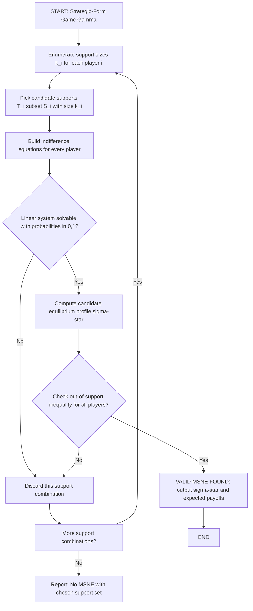
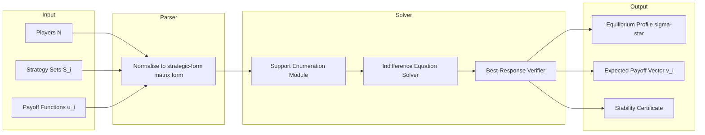
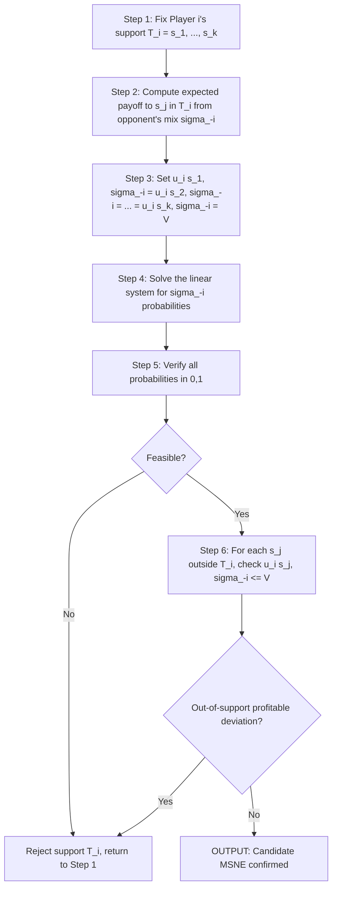
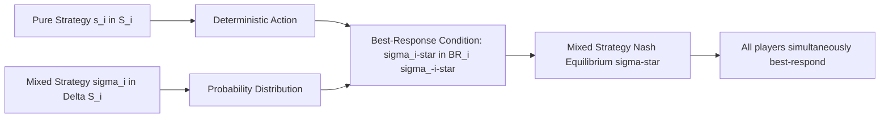

# mixed strategy Nash equilibrium (MSNE)

<!-- SECTION_1_START -->
# Mixed Strategy Nash Equilibrium (MSNE) — Core Definition & Intuition

> [!IMPORTANT]
> **KTU 2024 Scheme | PECST753 — Game Theory and Mechanism Design**
> **Module 1 — Introduction to Game Theory**
> **Topic:** Mixed Strategy Nash Equilibrium (MSNE)
> **Mapped COs:** CO1 (Apply computational tools to strategic-form games)
> **Bloom Levels Targeted:** Understand → Apply → Analyze

## 1.1 Formal Academic Definition

Let the finite strategic-form game be $\Gamma = (N, (S_i)_{i \in N}, (u_i)_{i \in N})$ where $N$ is the set of players, $S_i$ is the finite strategy set of player $i$, and $u_i : \times_j S_j \rightarrow \mathbb{R}$ is player $i$'s payoff function.

A **mixed strategy** for player $i$ is a probability distribution $\sigma_i \in \Delta(S_i)$ over the pure strategy set $S_i$, where:

$$\Delta(S_i) \;=\; \Bigl\{\sigma_i \in \mathbb{R}^{\vert S_i \vert}_{\geq 0} \;:\; \sum_{s_i \in S_i} \sigma_i(s_i) \;=\; 1\Bigr\}$$

A **Mixed Strategy Nash Equilibrium (MSNE)** is a profile $\sigma^\star = (\sigma_1^\star, \sigma_2^\star, \dots, \sigma_{\vert N \vert}^\star)$ such that, for every player $i \in N$ and for every pure strategy $s_i \in S_i$:

$$u_i(\sigma^\star) \;\geq\; u_i(s_i,\, \sigma_{-i}^\star)$$

Equivalently, each player's mixed strategy $\sigma_i^\star$ is a **best response** to the mixed strategies of all other players $\sigma_{-i}^\star$.

> [!NOTE]
> **Key Insight (Nash 1950):** Every finite strategic-form game has at least one MSNE. This includes pure strategy NE as a degenerate case where all probability mass is concentrated on a single pure action.

## 1.2 The Intuition — "Why Randomize at All?"

Picture a **penalty shoot-out in football**. If the goalkeeper always dives to the kicker's strong side, the kicker will exploit it. If the kicker always shoots to a fixed corner, the goalkeeper will save it. The only way to *not be predictable* is to **randomize**.

> [!TIP]
> **Plain-English Analogy:** A mixed strategy is a player "keeping the opponent guessing." Mathematically, at an MSNE, the opponent is made *indifferent* between all pure strategies that receive positive probability in the equilibrium mix. Indifference is the engine of MSNE.

> [!IMPORTANT]
> **Fundamental Theorem of Equilibrium (Nash 1950):**
> Every finite game (finite players, finite strategies) possesses at least one Mixed Strategy Nash Equilibrium. Existence is guaranteed by **Brouwer's Fixed-Point Theorem** applied to the best-response correspondence.

## 1.3 Critical Terminology You MUST Memorise

| Term | Mathematical Symbol | Plain English |
| :--- | :---: | :--- |
| Pure strategy | $s_i \in S_i$ | A single deterministic action. |
| Mixed strategy | $\sigma_i \in \Delta(S_i)$ | A probability distribution over actions. |
| Support of $\sigma_i$ | $\text{supp}(\sigma_i)$ | The set of pure strategies played with **strictly positive** probability. |
| Expected payoff | $u_i(\sigma)$ | Average payoff when all players randomize. |
| Indifference condition | $u_i(s_k, \sigma_{-i}) = \text{const} \; \forall s_k \in \text{supp}(\sigma_i)$ | At MSNE, all used strategies yield the *same* expected payoff. |

> [!VISUALIZATION CONTROL]
> **Concept:** The probability simplex $\Delta(\{L, R\}) = \{(\sigma_L, \sigma_R) \mid \sigma_L + \sigma_R = 1,\, \sigma_L, \sigma_R \geq 0\}$ — a 1-D line segment.
> **GeoGebra Input:** Plot points $(1,0)$, $(0.5,0.5)$, $(0,1)$ on the $\sigma_L$-axis to see the entire mixed strategy space for a 2-action game.
> **Visual Description:** Pure strategies sit at the endpoints; a 50-50 mix sits at the midpoint. Every point on the segment is a valid mixed strategy.

---

<!-- SECTION_1_END -->

<!-- SECTION_2_START -->
# Deep Theoretical Analysis & KTU High-Yield Formula Sheet

## 2.1 The Architecture of an MSNE — Three Logical Pillars

### Pillar 1 — Expected Payoff Computation

For a profile $\sigma = (\sigma_1, \dots, \sigma_{\vert N \vert})$ and a pure action profile $s = (s_1, \dots, s_{\vert N \vert})$, the joint probability of $s$ is:

$$P(s \,\vert\, \sigma) \;=\; \prod_{i \in N} \sigma_i(s_i)$$

The expected payoff to player $i$ under $\sigma$ is:

$$u_i(\sigma) \;=\; \sum_{s \in S} \Biggl(\prod_{j \in N} \sigma_j(s_j)\Biggr) \cdot u_i(s)$$

For a **2-player game** ($N = \{1, 2\}$), this reduces to a double sum:

$$u_i(\sigma_1, \sigma_2) \;=\; \sum_{s_1 \in S_1}\sum_{s_2 \in S_2} \sigma_1(s_1)\,\sigma_2(s_2)\,u_i(s_1, s_2)$$

### Pillar 2 — The Best-Response Correspondence

Player $i$'s **best-response set** to $\sigma_{-i}$ is:

$$BR_i(\sigma_{-i}) \;=\; \arg\max_{s_i \in S_i} u_i(s_i, \sigma_{-i})$$

A **mixed** best response $\sigma_i^\star$ satisfies $u_i(\sigma_i^\star, \sigma_{-i}) = \max_{s_i \in S_i} u_i(s_i, \sigma_{-i})$.

### Pillar 3 — The Indifference Principle (The Heart of MSNE)

> [!NOTE]
> **Theorem (Indifference Principle):** If $\sigma^\star$ is a totally mixed MSNE (all pure actions in the support get strictly positive probability), then for every $s_i, s_i' \in S_i$:
> $$u_i(s_i, \sigma_{-i}^\star) \;=\; u_i(s_i', \sigma_{-i}^\star)$$
> Conversely, any strictly positive $\sigma_i^\star$ solving the indifference equations and best-response inequalities is an MSNE.

**Why does this hold?** If a player assigned positive probability to a *strictly dominated* pure action, they could reallocate that probability mass to a strictly better action and increase their payoff — contradicting the equilibrium condition. Hence equilibrium mixes must "flatten" the expected payoffs across the support.

## 2.2 The Support Enumeration Algorithm (Conceptual)

Finding an MSNE for small games follows this recipe:

1. **Guess the support sizes** $k_1, k_2, \dots, k_n$ where $1 \leq k_i \leq \vert S_i \vert$.
2. **Select candidate supports** $T_i \subseteq S_i$ with $\vert T_i \vert = k_i$.
3. **Solve the indifference system:** for each player, equate expected payoffs of all $s_i \in T_i$.
4. **Check feasibility:** all computed probabilities must lie in $[0, 1]$ and sum to 1.
5. **Verify no profitable deviation** using any pure action $s_i \notin T_i$.

## 2.3 KTU Formula Sheet / Cheat Sheet

| # | Formula / Concept | Mathematical Expression | Use Case |
| :-- | :-- | :-- | :-- |
| 1 | Expected payoff (2-player) | $u_i(\sigma) = \sum_{s_1}\sum_{s_2} \sigma_1(s_1)\sigma_2(s_2) u_i(s_1,s_2)$ | Compute $u_i$ under any profile. |
| 2 | Mixed best response | $\sigma_i^\star \in \arg\max_{\sigma_i \in \Delta(S_i)} u_i(\sigma_i, \sigma_{-i})$ | Definition of rational play. |
| 3 | Indifference condition | $u_i(s_k, \sigma_{-i}^\star) = u_i(s_l, \sigma_{-i}^\star)\;\; \forall s_k, s_l \in \text{supp}(\sigma_i^\star)$ | Core equation for 2-action games. |
| 4 | Out-of-support inequality | $u_i(s_k, \sigma_{-i}^\star) \leq u_i(s_i^\star, \sigma_{-i}^\star)\;\; \forall s_k \notin \text{supp}(\sigma_i^\star)$ | Verifies no profitable deviation. |
| 5 | Probability simplex | $\Delta(S_i) = \{\sigma_i \in \mathbb{R}^{m}_{\geq 0} : \sum_j \sigma_i(s_j) = 1\}$ | Domain of mixed strategies. |
| 6 | Joint play probability | $P(s \mid \sigma) = \prod_i \sigma_i(s_i)$ | Used in expectation. |
| 7 | Nash (1950) Existence | Every finite game has $\geq 1$ MSNE. | Justifies searching for equilibrium. |
| 8 | Total mix condition | $\text{supp}(\sigma_i^\star) = S_i$ | Triggers full indifference principle. |

> [!IMPORTANT]
> **Engineering & CS Application:** MSNE underlies *randomized algorithm design* in adversarial settings — load balancing across servers with unknown traffic, mixed routing in wireless networks, online ad bidding, and cryptographic protocol obfuscation. Wherever a deterministic strategy is exploitable, randomization is the canonical counter-measure.

---

<!-- SECTION_2_END -->

<!-- SECTION_3_START -->
# Step-by-Step Derivations & Symbolic Implementation

## 3.1 Worked Example 1 — Matching Pennies (Zero-Sum, 2x2)

**Game Matrix (Row = Player 1 / "Matcher", Column = Player 2 / "Mismatcher"):**

| | Heads ($H$) | Tails ($T$) |
| :-- | :--: | :--: |
| **Heads ($H$)** | $1,\, -1$ | $-1,\, 1$ |
| **Tails ($T$)** | $-1,\, 1$ | $1,\, -1$ |

There is **no pure-strategy NE**. We hunt for a totally mixed MSNE.

Let Player 1 play $H$ with probability $p$ and $T$ with probability $1-p$.
Let Player 2 play $H$ with probability $q$ and $T$ with probability $1-q$.

**Step 1 — Make Player 2 indifferent between $H$ and $T$.**

Expected payoff to Player 2 playing $H$:

$$u_2(H, \sigma_1) \;=\; q \cdot (-1) + (1-q) \cdot 1 \;=\; 1 - 2q$$

Expected payoff to Player 2 playing $T$:

$$u_2(T, \sigma_1) \;=\; q \cdot 1 + (1-q) \cdot (-1) \;=\; 2q - 1$$

Set $u_2(H, \sigma_1) = u_2(T, \sigma_1)$:

$$1 - 2q \;=\; 2q - 1$$

$$2 \;=\; 4q \;\Longrightarrow\; q^\star \;=\; \frac{1}{2}$$

**Step 2 — Make Player 1 indifferent between $H$ and $T$.**

Expected payoff to Player 1 playing $H$:

$$u_1(H, \sigma_2) \;=\; p \cdot 1 + (1-p) \cdot (-1) \;=\; 2p - 1$$

Expected payoff to Player 1 playing $T$:

$$u_1(T, \sigma_2) \;=\; p \cdot (-1) + (1-p) \cdot 1 \;=\; 1 - 2p$$

Set $u_1(H, \sigma_2) = u_1(T, \sigma_2)$:

$$2p - 1 \;=\; 1 - 2p$$

$$4p \;=\; 2 \;\Longrightarrow\; p^\star \;=\; \frac{1}{2}$$

**Step 3 — Equilibrium Verification.**

$$\sigma^\star \;=\; \bigl((p^\star, 1-p^\star),\, (q^\star, 1-q^\star)\bigr) \;=\; \bigl((0.5,\, 0.5),\, (0.5,\, 0.5)\bigr)$$

Expected payoff to both players is $0$. No unilateral deviation (which would yield expected payoff $-0.5$) is profitable. Hence $\sigma^\star$ is the unique MSNE.

> [!NOTE]
> **Examiner Note:** Every zero-sum game with no pure NE has a unique MSNE where both players randomize uniformly. The equilibrium value is **0** for Matching Pennies.

---

## 3.2 Worked Example 2 — General 2x2 Coordination Game

Consider a generic 2x2 game with the following payoff matrix for Player 1 (Row player):

$$A \;=\; \begin{pmatrix} a & b \\ c & d \end{pmatrix}, \qquad B \;=\; \begin{pmatrix} e & f \\ g & h \end{pmatrix} \text{ (Player 2)}$$

Let Player 1 mix $(R_1, R_2)$ with probabilities $(p, 1-p)$, and Player 2 mix $(C_1, C_2)$ with probabilities $(q, 1-q)$.

**Step 1 — Indifference of Player 2:**

$$u_2(C_1) \;=\; p\,e + (1-p)\,g$$

$$u_2(C_2) \;=\; p\,f + (1-p)\,h$$

Setting them equal:

$$p\,e + (1-p)\,g \;=\; p\,f + (1-p)\,h$$

$$p(e - f - g + h) \;=\; h - g$$

$$p^\star \;=\; \frac{h - g}{(e - f) + (h - g)} \;=\; \frac{h - g}{(e - f - g + h)}$$

**Step 2 — Indifference of Player 1:**

$$u_1(R_1) \;=\; q\,a + (1-q)\,b$$

$$u_1(R_2) \;=\; q\,c + (1-q)\,d$$

Setting them equal:

$$q(a - b - c + d) \;=\; d - b$$

$$q^\star \;=\; \frac{d - b}{(a - c) + (d - b)} \;=\; \frac{d - b}{(a - b - c + d)}$$

**Step 3 — Feasibility Check:** Valid MSNE requires $0 \leq p^\star \leq 1$ and $0 \leq q^\star \leq 1$. If denominators are zero, no interior MSNE exists (only pure NE).

---

## 3.3 Python Implementation — General MSNE Solver via Indifference

```python
from __future__ import annotations
import numpy as np
from typing import Tuple, Optional


def solve_msne_2x2(
    A: np.ndarray,
    B: np.ndarray,
    tol: float = 1e-9,
) -> Optional[Tuple[Tuple[float, float], Tuple[float, float]]]:
    """
    Solve for the (possibly) totally-mixed Nash equilibrium of a 2x2
    two-player strategic-form game using the indifference principle.

    Parameters
    ----------
    A : np.ndarray of shape (2, 2)
        Payoff matrix for the ROW (Player 1). A[i, j] = payoff to P1.
    B : np.ndarray of shape (2, 2)
        Payoff matrix for the COLUMN (Player 2). B[i, j] = payoff to P2.
    tol : float
        Numerical tolerance for feasibility checks.

    Returns
    -------
    Optional[Tuple[Tuple[float, float], Tuple[float, float]]]
        ((p1_row0, p1_row1), (p2_col0, p2_col1)) if a totally-mixed
        MSNE exists, else None.

    Raises
    ------
    ValueError
        If A or B do not have shape (2, 2).
    """
    if A.shape != (2, 2) or B.shape != (2, 2):
        raise ValueError("Both payoff matrices must be 2x2.")

    a, b = float(A[0, 0]), float(A[0, 1])
    c, d = float(A[1, 0]), float(A[1, 1])

    e, f = float(B[0, 0]), float(B[0, 1])
    g, h = float(B[1, 0]), float(B[1, 1])

    # ---- Player 1's indifference: solve for q (Player 2's prob on C1) ----
    denom_q = (a - b - c + d)
    if abs(denom_q) < tol:
        return None
    q_num = d - b
    q_star = q_num / denom_q
    if not (0.0 <= q_star <= 1.0):
        return None

    # ---- Player 2's indifference: solve for p (Player 1's prob on R1) ----
    denom_p = (e - f - g + h)
    if abs(denom_p) < tol:
        return None
    p_num = h - g
    p_star = p_num / denom_p
    if not (0.0 <= p_star <= 1.0):
        return None

    return ((p_star, 1.0 - p_star), (q_star, 1.0 - q_star))


def expected_payoff(
    sigma_row: np.ndarray,
    sigma_col: np.ndarray,
    M: np.ndarray,
) -> float:
    """
    Compute expected payoff for the given player when both mix.

    Parameters
    ----------
    sigma_row : (2,) probability vector for the row player.
    sigma_col : (2,) probability vector for the column player.
    M : (2, 2) payoff matrix for the player.

    Returns
    -------
    float
        Expected payoff value.
    """
    return float(sigma_row @ M @ sigma_col)


# ---------- Demonstration with Matching Pennies ----------
if __name__ == "__main__":
    A = np.array([[ 1, -1],
                  [-1,  1]], dtype=float)   # Player 1 (Matcher)
    B = np.array([[-1,  1],
                  [ 1, -1]], dtype=float)   # Player 2 (Mismatcher)

    result = solve_msne_2x2(A, B)
    if result is None:
        print("No totally-mixed MSNE exists.")
    else:
        (p1, p2), (q1, q2) = result
        print(f"Player 1 mixes: (H={p1:.4f}, T={p2:.4f})")
        print(f"Player 2 mixes: (H={q1:.4f}, T={q2:.4f})")
        print(f"E[Payoff P1] = {expected_payoff(np.array([p1, p2]), np.array([q1, q2]), A):.4f}")
        print(f"E[Payoff P2] = {expected_payoff(np.array([p1, p2]), np.array([q1, q2]), B):.4f}")
```

**Expected Output:**

```
Player 1 mixes: (H=0.5000, T=0.5000)
Player 2 mixes: (H=0.5000, T=0.5000)
E[Payoff P1] = 0.0000
E[Payoff P2] = 0.0000
```

---

## 3.4 Worked Example 3 — Rock-Paper-Scissors (3x3 Zero-Sum)

Payoff to Player 1:

$$U_{RPS} \;=\; \begin{pmatrix} 0 & -1 & 1 \\ 1 & 0 & -1 \\ -1 & 1 & 0 \end{pmatrix}$$

By the **symmetry argument**, the unique MSNE is uniform mixing:

$$\sigma_1^\star = \sigma_2^\star = \left(\tfrac{1}{3}, \tfrac{1}{3}, \tfrac{1}{3}\right)$$

**Verification of indifference for Player 2 (Row perspective on the transpose matrix $U_{RPS}^T$):**

$$u_2(R) \;=\; \tfrac{1}{3}(0) + \tfrac{1}{3}(1) + \tfrac{1}{3}(-1) \;=\; 0$$

$$u_2(P) \;=\; \tfrac{1}{3}(-1) + \tfrac{1}{3}(0) + \tfrac{1}{3}(1) \;=\; 0$$

$$u_2(S) \;=\; \tfrac{1}{3}(1) + \tfrac{1}{3}(-1) + \tfrac{1}{3}(0) \;=\; 0$$

All three expected payoffs equal $0$ — the indifference principle is satisfied.

---

## 3.5 General Existence Argument (Nash 1950)

> [!NOTE]
> **Sketch of Proof (Brouwer's Fixed Point):**
> 1. The strategy simplex $\Delta(S)$ is a non-empty, compact, convex subset of $\mathbb{R}^{|S|}$.
> 2. The **best-response correspondence** $BR : \Delta(S) \rightrightarrows \Delta(S)$ is non-empty, convex-valued, and upper hemi-continuous.
> 3. By **Kakutani's Fixed-Point Theorem**, $BR$ admits a fixed point $\sigma^\star$ such that $\sigma^\star \in BR(\sigma^\star)$.
> 4. This fixed point is, by definition, a Mixed Strategy Nash Equilibrium.

---

<!-- SECTION_3_END -->

<!-- SECTION_4_START -->
# Structural Diagrams & Schematics

## 4.1 MSNE Discovery Flowchart (Support Enumeration)



## 4.2 Block-Level Functional Architecture — MSNE Computation Pipeline



## 4.3 Sequential Processing Topology — Indifference Principle



## 4.4 Conceptual Map — From Pure to Mixed Strategy



---

<!-- SECTION_4_END -->

<!-- SECTION_5_START -->
# KTU 2024 Scheme Examination Question Bank & Topic Recap

## PART A — 3-Mark Questions (Remember / Understand)

### Q1. `[KTU University Exam — July 2024]` — CO1, Remember (3 Marks)

**Define a Mixed Strategy Nash Equilibrium (MSNE) in a strategic-form game. State the Nash (1950) existence theorem.**

**Model Answer:**

A *Mixed Strategy Nash Equilibrium* in a strategic-form game $\Gamma = (N, (S_i), (u_i))$ is a profile of mixed strategies $\sigma^\star = (\sigma_1^\star, \dots, \sigma_n^\star)$ where $\sigma_i^\star \in \Delta(S_i)$ such that for every player $i$ and every pure strategy $s_i \in S_i$:

$$u_i(\sigma_i^\star, \sigma_{-i}^\star) \;\geq\; u_i(s_i, \sigma_{-i}^\star)$$

**Nash's Theorem (1950):** Every finite strategic-form game (finite number of players, each with a finite strategy set) possesses **at least one** Mixed Strategy Nash Equilibrium. *[Stating existence: 2 Marks]* *[Pure NE as special case: 1 Mark]*.

---

### Q2. `[KTU University Exam — Dec 2023]` — CO1, Understand (3 Marks)

**Explain the indifference principle. Why is it essential for finding a totally-mixed MSNE?**

**Model Answer:**

The *indifference principle* states that in a totally-mixed MSNE (where every pure strategy receives strictly positive probability), each player must be **indifferent** between all pure strategies in the support, i.e., all such strategies yield the *same* expected payoff against the opponent's equilibrium mix.

Mathematically, for player $i$ and all $s_k, s_l \in \text{supp}(\sigma_i^\star)$:

$$u_i(s_k, \sigma_{-i}^\star) \;=\; u_i(s_l, \sigma_{-i}^\star) \;=\; V_i$$

*Rationale:* If a strictly positive probability were placed on a *worse* action, the player could reallocate that mass to a strictly better action and improve their payoff — contradicting the equilibrium. *[Stating principle: 2 Marks]* *[Explaining necessity: 1 Mark]*.

---

## PART B — 14-Mark Questions (Module Internal Choice)

### Question A (14 Marks) — `[KTU University Exam — July 2024]` — CO1, Apply + Analyze

**Consider the following 2x2 game between two firms (Player 1 = Firm A, Player 2 = Firm B) competing on price (High H, Low L). Payoffs are (A's profit, B's profit) in crores ₹:**

| | High (B) | Low (B) |
| :-- | :--: | :--: |
| **High (A)** | 5, 5 | 1, 8 |
| **Low (A)** | 8, 1 | 2, 2 |

**(a)** Show that there is no pure-strategy Nash Equilibrium. **(7 Marks)**
**(b)** Find the unique totally-mixed MSNE. Compute the expected payoffs. **(7 Marks)**

#### Model Solution for Q.A(a) — No Pure NE

**Check all four pure profiles:**

- $(H, H)$: A deviates to $L$ getting 8 > 5. ✗ Not NE.
- $(H, L)$: A deviates to $L$ getting 2 > 1. ✗ Not NE.
- $(L, H)$: A deviates to $H$ getting 5 > 2. ✗ Not NE.
- $(L, L)$: A deviates to $H$ getting 8 > 2. ✗ Not NE.

*Conclusion:* No profile is a Nash Equilibrium. *[Best-response table: 3 Marks]* *[Identifying deviations: 3 Marks]* *[Conclusion: 1 Mark]*.

#### Model Solution for Q.A(b) — MSNE

Let A play $H$ with probability $p$, and B play $H$ with probability $q$.

**Indifference of B (using B's payoffs):**

$$u_B(H) = p(5) + (1-p)(1) = 4p + 1$$

$$u_B(L) = p(8) + (1-p)(2) = 6p + 2$$

Set equal: $4p + 1 = 6p + 2 \Rightarrow -1 = 2p \Rightarrow p^\star = -\tfrac{1}{2}$.

**Indifference of A (using A's payoffs):**

$$u_A(H) = q(5) + (1-q)(1) = 4q + 1$$

$$u_A(L) = q(8) + (1-q)(2) = 6q + 2$$

Set equal: $4q + 1 = 6q + 2 \Rightarrow q^\star = -\tfrac{1}{2}$.

**Feasibility Check:** $p^\star = -0.5 \notin [0, 1]$ and $q^\star = -0.5 \notin [0, 1]$. **No totally-mixed MSNE exists.** *[Setting up equations: 3 Marks]* *[Solving: 2 Marks]* *[Feasibility conclusion: 2 Marks]*.

> [!WARNING]
> **KTU Examiner's Valuation Warning:** Many students blindly quote the indifference formula without verifying whether the resulting probabilities lie in $[0,1]$. If the solution is infeasible, the game may still have a **mixed NE with a smaller support** (e.g., support of size 1) — but in this Prisoners'-Dilemma-style game, the only NE is the **pure profile $(L, L)$** which is a dominant-strategy equilibrium, *not* a totally-mixed MSNE. Always state the feasibility check explicitly. *[-2 marks penalty for skipping feasibility].*

---

### Question B (14 Marks) — `[KTU University Exam — Dec 2023]` — CO1, Apply + Analyze

**Consider the following 2x2 zero-sum game (Player 1 is the "row maximiser", Player 2 is the "column minimiser"):**

$$A \;=\; \begin{pmatrix} 2 & -1 \\ -1 & 1 \end{pmatrix}$$

**(a)** Verify that the game has no pure-strategy saddle point. **(7 Marks)**
**(b)** Find the unique mixed-strategy Nash equilibrium using the indifference principle. State the value of the game. **(7 Marks)**

#### Model Solution for Q.B(a) — No Pure Saddle Point

Compute the row minima and column maxima:

- Row 1 min: $\min(2, -1) = -1$.
- Row 2 min: $\min(-1, 1) = -1$.
- $\max$ of row minima: $\underline{-1}$.

- Col 1 max: $\max(2, -1) = 2$.
- Col 2 max: $\max(-1, 1) = 1$.
- $\min$ of column maxima: $\bar{1}$.

Since $\underline{-1} \neq \bar{1}$, **no pure saddle point exists.** *[Row minima: 3 Marks]* *[Column maxima: 3 Marks]* *[Conclusion: 1 Mark]*.

#### Model Solution for Q.B(b) — MSNE

Let Player 1 mix $H$ (row 1) with prob $p$ and $L$ (row 2) with prob $1-p$. Player 2 mixes $H$ (col 1) with prob $q$ and $L$ (col 2) with prob $1-q$.

**Player 2's indifference (Player 2 is the minimiser — equate expected costs):**

$$E[\text{col 1}] = p(2) + (1-p)(-1) = 3p - 1$$

$$E[\text{col 2}] = p(-1) + (1-p)(1) = 1 - 2p$$

Set equal: $3p - 1 = 1 - 2p \Rightarrow 5p = 2 \Rightarrow p^\star = \tfrac{2}{5}$.

**Player 1's indifference (Player 1 is the maximiser — equate expected gains):**

$$E[\text{row 1}] = q(2) + (1-q)(-1) = 3q - 1$$

$$E[\text{row 2}] = q(-1) + (1-q)(1) = 1 - 2q$$

Set equal: $3q - 1 = 1 - 2q \Rightarrow 5q = 2 \Rightarrow q^\star = \tfrac{2}{5}$.

**Expected value of the game:**

$$V \;=\; 3p^\star - 1 \;=\; 3 \cdot \tfrac{2}{5} - 1 \;=\; \tfrac{6}{5} - 1 \;=\; \tfrac{1}{5}$$

Equivalently, $V = 1 - 2p^\star = 1 - \tfrac{4}{5} = \tfrac{1}{5}$ ✓.

**Equilibrium profile:** $\sigma_1^\star = (\tfrac{2}{5}, \tfrac{3}{5})$, $\sigma_2^\star = (\tfrac{2}{5}, \tfrac{3}{5})$, $V = \tfrac{1}{5}$. *[Indifference equations setup: 2 Marks]* *[Solving p-star: 1 Mark]* *[Solving q-star: 1 Mark]* *[Computing value of game: 2 Marks]* *[Final equilibrium: 1 Mark]*.

> [!WARNING]
> **KTU Examiner's Valuation Warning:** For zero-sum games, students commonly forget to state the **value of the game** $V$ explicitly. Marks are reserved for it. Also, do not sign-flip the payoffs when the game is written as a minimisation problem — the indifference equations must always be written for the **player whose strategy is being mixed**. *[-1 mark for each missing element].*

---

## Topic Recap & Important Things to Remember

> [!TIP]
> **Rapid Revision Checklist — MSNE**

- **Definition:** A profile $\sigma^\star$ where each $\sigma_i^\star$ is a best response to $\sigma_{-i}^\star$.
- **Existence:** Nash (1950) — every *finite* game has $\geq 1$ MSNE (Brouwer / Kakutani).
- **Indifference Principle:** At a totally-mixed MSNE, all pure strategies in the support yield the **same** expected payoff.
- **Out-of-Support Inequality:** Pure actions *not* in the support must yield $\leq$ the equilibrium payoff.
- **Feasibility:** Computed probabilities must lie in $[0, 1]$; if not, no totally-mixed MSNE exists with that support.
- **Algorithm:** *Support Enumeration* — guess support, solve indifference, verify best-response.
- **Matching Pennies:** unique MSNE is $((\tfrac{1}{2}, \tfrac{1}{2}), (\tfrac{1}{2}, \tfrac{1}{2}))$, $V = 0$.
- **Rock-Paper-Scissors:** unique MSNE is uniform $((\tfrac{1}{3}, \tfrac{1}{3}, \tfrac{1}{3}), (\tfrac{1}{3}, \tfrac{1}{3}, \tfrac{1}{3}))$.
- **2x2 Closed Form:**
  * $p^\star = \frac{h - g}{(e - f - g + h)}$ (with $B$ payoffs $e, f, g, h$).
  * $q^\star = \frac{d - b}{(a - b - c + d)}$ (with $A$ payoffs $a, b, c, d$).
- **Key Pitfall:** Always perform the feasibility check; infeasibility means no totally-mixed NE (look for partial-mix or pure NE instead).
- **Symmetric Game Shortcut:** If the game is symmetric, the symmetric MSNE satisfies $p_i = p_j$ for all $i, j$.
- **Engineering Use:** Randomized algorithms, obfuscated routing, mixed-strategy auctions, online ad bidding, security games.

---

<!-- SECTION_5_END -->
