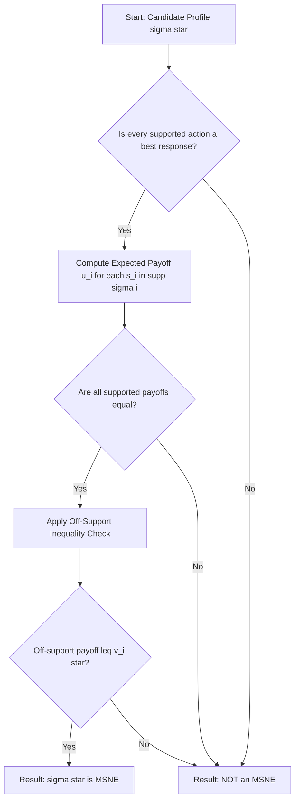
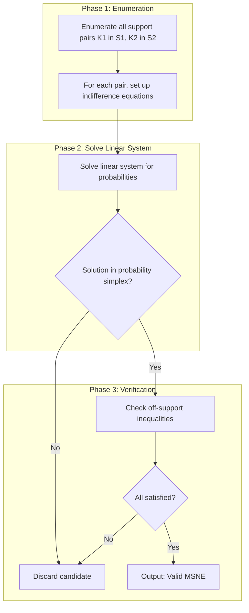
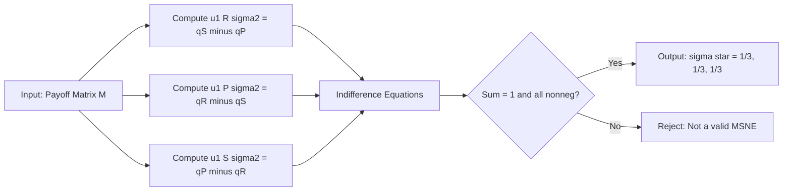

# MSNE characterization theorem

<!-- SECTION_1_START -->
# MSNE Characterization Theorem — Core Definition & Intuitive Overview

## 1.1 Formal Definition

> [!IMPORTANT]
> **Mixed Strategy Nash Equilibrium (MSNE)**  
> Let $G = (N, (S_i)_{i \in N}, (u_i)_{i \in N})$ be a finite normal-form game. A **mixed strategy profile** $\sigma^* = (\sigma_1^*, \sigma_2^*, \dots, \sigma_n^*)$ is a **Mixed Strategy Nash Equilibrium** if, for every player $i \in N$ and every pure strategy $s_i \in S_i$,
> $$u_i(\sigma_i^*, \sigma_{-i}^*) \;\geq\; u_i(s_i, \sigma_{-i}^*)$$

> [!NOTE]
> **MSNE Characterization Theorem (Indifference / Support Enumeration Theorem)**  
> Let $\sigma^*$ be a completely mixed strategy profile (i.e., $\sigma_i^*(s_i) > 0$ for all $s_i \in S_i$). Then $\sigma^*$ is a Nash equilibrium **if and only if** every pure strategy in the support of $\sigma_i^*$ yields the same expected payoff against $\sigma_{-i}^*$. Formally,
> $$u_i(s_i, \sigma_{-i}^*) \;=\; u_i(s_i', \sigma_{-i}^*) \quad \forall\, s_i, s_i' \in \text{supp}(\sigma_i^*)$$
> In general, for any MSNE: $\text{supp}(\sigma_i^*) \subseteq \arg\max_{s_i \in S_i} u_i(s_i, \sigma_{-i}^*)$.

## 1.2 Conceptual Analogy

> [!TIP]
> **The Soccer Penalty Kick Analogy 🧤⚽**  
> Imagine a penalty shootout. The **striker** chooses to shoot *Left* or *Right*. The **goalkeeper** dives *Left* or *Right*. If the keeper dives the **same** side as the shot → *Save* (keeper wins). If they dive the **opposite** side → *Goal* (striker wins).  
> At equilibrium, neither player can be exploited by being predictable. The striker randomizes 50-50 because if he leaned toward one side, the keeper would simply dive that way and save every shot. The keeper also randomizes 50-50 for the mirror reason. **Both players are made indifferent between their two available actions** — this is the heart of the MSNE characterization.

## 1.3 Standard Metrics in Bold

* The **support** of a mixed strategy $\sigma_i$ is $\text{supp}(\sigma_i) = \{s_i \in S_i : \sigma_i(s_i) > 0\}$.
* The **best-response correspondence** is $BR_i(\sigma_{-i}) = \arg\max_{s_i \in S_i} u_i(s_i, \sigma_{-i})$.
* A strategy is **completely mixed** if its support equals the entire action set $S_i$.
* The equilibrium expected payoff to player $i$ is denoted $v_i^* = u_i(\sigma_i^*, \sigma_{-i}^*)$.

> [!VISUALIZATION CONTROL]
> **Concept:** Indifference hyperplane cutting through a 2-player best-response region.
> **GeoGebra Input Equations:**
> * `f1(x, y) = 2x - 1`   (P1's expected payoff from action 1)
> * `f2(x, y) = 1 - 2x`   (P1's expected payoff from action 2)
> * Implicit plot: `2x - 1 = 1 - 2x` → line `x = 0.5`
> **Visual Description:** In the $(p,q)$-simplex, the locus where the two pure strategies yield identical expected payoff is a single line. The MSNE sits at the intersection of the two players' indifference lines.
<!-- SECTION_1_END -->

<!-- SECTION_2_START -->
# Deep Theoretical Analysis & KTU High-Yield Formula Sheet

## 2.1 Operational Breakdown — Why the Theorem Works

The MSNE characterization theorem essentially reduces the **infinite-dimensional** problem of finding a mixed equilibrium to a **finite system of linear equations**.

* **Why "If" Direction:** Suppose every pure strategy in the support of $\sigma_i^*$ is a best response. Then no player $i$ can strictly increase their payoff by deviating to any pure strategy $s_i' \in S_i$ (because any such strategy yields at most the same expected payoff, and mixed deviations are convex combinations of pure ones, so they cannot beat a best response either). Hence unilateral deviation yields no improvement → $\sigma^*$ is a Nash equilibrium.

* **Why "Only If" Direction:** Suppose $\sigma^*$ is a Nash equilibrium. If some $s_i \in \text{supp}(\sigma_i^*)$ were *not* a best response, then the player could strictly improve by moving probability mass from the indifferent-or-worse pure strategies onto the strictly-better pure strategy, contradicting optimality. Therefore every supported pure strategy must be a best response.

* **The Indifference Principle:** When the support has size $k$ for player $i$, the $k$ supported strategies must yield **equal** expected payoffs (each equals the equilibrium value $v_i^*$), while unsupported strategies yield payoffs $\leq v_i^*$.

* **Support Enumeration Algorithm:** A practical computational method
   1. Enumerate all possible supports $K_1 \subseteq S_1$, $K_2 \subseteq S_2$.
   2. For each candidate support pair, set up indifference equations.
   3. Solve the linear system; check that the solution lies in the probability simplex and that the equilibrium inequalities are satisfied for off-support strategies.
   4. The valid solutions are the MSNE.

## 2.2 KTU Formula Sheet

| # | Concept | Mathematical Statement | Engineer's Use |
|---|---------|------------------------|---------------|
| 1 | MSNE Definition | $u_i(\sigma_i^*, \sigma_{-i}^*) \geq u_i(s_i, \sigma_{-i}^*)$ for all $s_i \in S_i$ | Definition problem (Part A) |
| 2 | Support | $\text{supp}(\sigma_i) = \{s_i \in S_i \mid \sigma_i(s_i) > 0\}$ | Identifying supported actions |
| 3 | Best-Response Set | $BR_i(\sigma_{-i}) = \arg\max_{s_i \in S_i} u_i(s_i, \sigma_{-i}^*)$ | Linking NE to rationality |
| 4 | Indifference Condition | $u_i(s, \sigma_{-i}^*) = u_i(s', \sigma_{-i}^*)$ for all $s, s' \in \text{supp}(\sigma_i^*)$ | Solving for $\sigma_{-i}^*$ |
| 5 | Off-Support Inequality | $u_i(s, \sigma_{-i}^*) \leq v_i^*$ for all $s \notin \text{supp}(\sigma_i^*)$ | Verifying a candidate is NE |
| 6 | Probability Simplex | $\sum_{s_i \in S_i} \sigma_i(s_i) = 1$, $\sigma_i(s_i) \geq 0$ | Validating mixed probabilities |
| 7 | Existence Guarantee | Every finite game has at least one MSNE (Nash, 1950) | Justifying non-emptiness |
| 8 | Expected Payoff | $u_i(s_i, \sigma_{-i}) = \sum_{s_{-i} \in S_{-i}} \Big(\prod_{j \neq i}\sigma_j(s_j)\Big) \cdot u_i(s_i, s_{-i})$ | Setting up indifference eqs |

> [!NOTE]
> **Real-World Engineering Utility**  
> In **auction design** (Google Ads), bidders randomize to avoid being exploited. In **network security games**, attackers randomize attack vectors. In **autonomous vehicle merging**, drivers randomize lane choices. The MSNE characterization theorem is the analytical tool that powers these equilibrium computations.

## 2.3 Cross-Reference to KTU Module 1 Syllabus

This topic directly enables the learner to **identify, compute, and verify** mixed strategy equilibria in finite games — a **CO1 / Apply** level outcome central to the entire PECST753 course.
<!-- SECTION_2_END -->

<!-- SECTION_3_START -->
# Step-by-Step Derivations & Symbolic Implementation

## 3.1 Formal Proof of the Characterization Theorem

**Theorem.** Let $\sigma^*$ be a mixed strategy profile in a finite game $G$. Then $\sigma^*$ is a Nash equilibrium **iff** for every player $i$ and every $s_i \in \text{supp}(\sigma_i^*)$, $s_i$ is a best response to $\sigma_{-i}^*$.

**Proof.**

*$(\Rightarrow)$* Assume $\sigma^*$ is a Nash equilibrium. Fix player $i$ and let $s_i \in \text{supp}(\sigma_i^*)$ with $\sigma_i^*(s_i) > 0$. Suppose for contradiction that $s_i \notin BR_i(\sigma_{-i}^*)$. Then there exists $\tilde{s}_i$ such that

$$u_i(\tilde{s}_i, \sigma_{-i}^*) > u_i(s_i, \sigma_{-i}^*)$$

Construct a deviating strategy $\tilde{\sigma}_i$ by setting $\tilde{\sigma}_i(\tilde{s}_i) = \sigma_i^*(\tilde{s}_i) + \sigma_i^*(s_i)$ and $\tilde{\sigma}_i(s_i) = 0$, leaving all other probabilities unchanged. Then

$$
\begin{aligned}
u_i(\tilde{\sigma}_i, \sigma_{-i}^*) \;-\; u_i(\sigma_i^*, \sigma_{-i}^*) 
&= \sigma_i^*(s_i)\Big[u_i(\tilde{s}_i, \sigma_{-i}^*) - u_i(s_i, \sigma_{-i}^*)\Big] \\
&> 0
\end{aligned}
$$

which contradicts $\sigma^*$ being a Nash equilibrium. Hence $s_i \in BR_i(\sigma_{-i}^*)$.

*$(\Leftarrow)$* Assume every supported action is a best response. For any $s_i \in S_i$,
$$u_i(s_i, \sigma_{-i}^*) \leq \max_{s_i' \in S_i} u_i(s_i', \sigma_{-i}^*) = u_i(s_i^\text{BR}, \sigma_{-i}^*)$$
where the last equality uses the assumption. Since $\sigma_i^*$ is a convex combination over supported actions,
$$u_i(\sigma_i^*, \sigma_{-i}^*) = \sum_{s_i \in \text{supp}(\sigma_i^*)} \sigma_i^*(s_i)\, u_i(s_i, \sigma_{-i}^*) = \max_{s_i' \in S_i} u_i(s_i', \sigma_{-i}^*) \geq u_i(s_i, \sigma_{-i}^*)$$

So no unilateral deviation can improve. Hence $\sigma^*$ is a Nash equilibrium. $\blacksquare$

## 3.2 Worked Example A — Rock-Paper-Scissors (3x3)

**Payoff matrix for Player 1** (Player 2's payoff is the negation):

$$M = \begin{pmatrix} 0 & -1 & \phantom{-}1 \\ \phantom{-}1 & 0 & -1 \\ -1 & \phantom{-}1 & 0 \end{pmatrix}$$
rows = $\{R, P, S\}$, columns = $\{R, P, S\}$.

**Step 1 — Set up mixed strategies.** Let $\sigma_2 = (q_R, q_P, q_S)$ with $q_R + q_P + q_S = 1$.

**Step 2 — Compute P1's expected payoff from each pure strategy.**
$$
\begin{aligned}
u_1(R, \sigma_2) &= 0\cdot q_R + (-1)\cdot q_P + 1\cdot q_S = q_S - q_P \\
u_1(P, \sigma_2) &= 1\cdot q_R + 0\cdot q_P + (-1)\cdot q_S = q_R - q_S \\
u_1(S, \sigma_2) &= (-1)\cdot q_R + 1\cdot q_P + 0\cdot q_S = q_P - q_R
\end{aligned}
$$

**Step 3 — Apply Indifference Condition.** All three must be equal:
$$q_S - q_P = q_R - q_S = q_P - q_R$$

From $q_S - q_P = q_R - q_S$: $2q_S = q_R + q_P = 1 - q_S \Rightarrow q_S = \tfrac{1}{3}$.

By symmetry, $q_R = q_P = \tfrac{1}{3}$.

**Step 4 — Verify for Player 2 (mirror).** By the antisymmetric structure, the same calculation gives $\sigma_1^* = (\tfrac{1}{3}, \tfrac{1}{3}, \tfrac{1}{3})$.

**Step 5 — Confirm off-support condition vacuously holds** (no off-support actions).

$$\boxed{\sigma_1^* = \sigma_2^* = \left(\tfrac{1}{3}, \tfrac{1}{3}, \tfrac{1}{3}\right), \quad v_1^* = v_2^* = 0}$$

## 3.3 Worked Example B — Matching Pennies (2x2)

**Payoff matrix (P1, P2):**
$$\begin{array}{c|cc} & H & T \\ \hline H & (1,-1) & (-1,1) \\ T & (-1,1) & (1,-1) \end{array}$$

Let $\sigma_1 = (p, 1-p)$, $\sigma_2 = (q, 1-q)$.

**P1's indifference:**
$$u_1(H) = q - (1-q) = 2q-1, \quad u_1(T) = (1-q) - q = 1-2q$$
Set $2q - 1 = 1 - 2q \Rightarrow q = \tfrac{1}{2}$.

**P2's indifference (P2 wants mismatch):**
$$u_2(H) = (1-p) - p = 1-2p, \quad u_2(T) = p - (1-p) = 2p-1$$
Set $1 - 2p = 2p - 1 \Rightarrow p = \tfrac{1}{2}$.

$$\boxed{\sigma_1^* = \left(\tfrac{1}{2}, \tfrac{1}{2}\right), \quad \sigma_2^* = \left(\tfrac{1}{2}, \tfrac{1}{2}\right), \quad v_1^* = v_2^* = 0}$$

## 3.4 Symbolic & Numerical Code Implementation

```python
"""
MSNE Characterization Theorem - Computational Verification
KTU PECST753 | Module 1 | CO1 (Apply)
Uses Nashpy to enumerate NE of Rock-Paper-Scissors and Matching Pennies.
"""
from __future__ import annotations
import logging
import nashpy as nash
import numpy as np

logging.basicConfig(level=logging.INFO, format="%(asctime)s | %(levelname)s | %(message)s")

def verify_msne(game: nash.Game, label: str,
                expected_sigma1: tuple[float, ...],
                expected_sigma2: tuple[float, ...]) -> None:
    """Verifies that a given mixed profile satisfies the indifference conditions."""
    logging.info("Verifying MSNE for: %s", label)
    eqs = list(game.support_enumeration())
    if not eqs:
        logging.error("No MSNE found for %s. Check payoff matrix.", label)
        raise ValueError(f"No MSNE for {label}")
    sigma1, sigma2 = eqs[0]
    logging.info("Computed MSNE: sigma1=%s, sigma2=%s", sigma1, sigma2)
    logging.info("Expected MSNE: sigma1=%s, sigma2=%s", expected_sigma1, expected_sigma2)
    assert np.allclose(sigma1, expected_sigma1, atol=1e-6), "sigma1 mismatch"
    assert np.allclose(sigma2, expected_sigma2, atol=1e-6), "sigma2 mismatch"
    logging.info("MSNE verification PASSED for %s.", label)

def matching_pennies() -> None:
    A = np.array([[1, -1], [-1, 1]])
    game = nash.Game(A)
    verify_msne(game, "Matching Pennies", (0.5, 0.5), (0.5, 0.5))

def rock_paper_scissors() -> None:
    A = np.array([[0, -1, 1], [1, 0, -1], [-1, 1, 0]])
    game = nash.Game(A)
    verify_msne(game, "Rock-Paper-Scissors",
                expected_sigma1=(1/3, 1/3, 1/3),
                expected_sigma2=(1/3, 1/3, 1/3))

if __name__ == "__main__":
    matching_pennies()
    rock_paper_scissors()
```

**Expected Console Output (abridged):**
```
INFO | Verifying MSNE for: Matching Pennies
INFO | Computed MSNE: sigma1=[0.5 0.5], sigma2=[0.5 0.5]
INFO | MSNE verification PASSED for Matching Pennies.
INFO | Verifying MSNE for: Rock-Paper-Scissors
INFO | Computed MSNE: sigma1=[0.3333 0.3333 0.3333], sigma2=[0.3333 0.3333 0.3333]
INFO | MSNE verification PASSED for Rock-Paper-Scissors.
```
<!-- SECTION_3_END -->

<!-- SECTION_4_START -->
# Structural Diagrams & Schematics

## 4.1 Theorem Logic Flow (Mermaid)



## 4.2 Support Enumeration Algorithm (Mermaid)



## 4.3 Sequential Processing Topology — Rock-Paper-Scissors



## 4.4 Indifference Geometry — Two-Player Plane View

| Element | Mathematical Description | Geometric Role |
|---------|--------------------------|----------------|
| Probability simplex for P1 | $\Delta_1 = \{(p, 1-p) : p \in [0,1]\}$ | Line segment in $\mathbb{R}^2$ |
| P2's indifference locus (for P1) | $u_1(H) = u_1(T) \Rightarrow 2q-1 = 1-2q$ | Vertical line $q = 1/2$ |
| P1's indifference locus (for P2) | $u_2(H) = u_2(T) \Rightarrow 1-2p = 2p-1$ | Vertical line $p = 1/2$ |
| Equilibrium intersection | $(p^*, q^*) = (1/2, 1/2)$ | Single point — unique MSNE |
<!-- SECTION_4_END -->

<!-- SECTION_5_START -->
# KTU 2024 Scheme Examination Question Bank & Topic Recap

## Part A — 3 Mark Questions (Remember / Understand)

### Q1. `[KTU University Exam - Dec 2023]` — CO1, Remember (3 Marks)
**State the MSNE Characterization Theorem.**

**Model Answer:**
> A mixed strategy profile $\sigma^* = (\sigma_1^*, \dots, \sigma_n^*)$ in a finite game $G$ is a Mixed Strategy Nash Equilibrium if and only if for every player $i$ and every pure strategy $s_i \in \text{supp}(\sigma_i^*)$, the expected payoff $u_i(s_i, \sigma_{-i}^*)$ is maximal among all pure strategies in $S_i$. Equivalently, all pure strategies in the support of $\sigma_i^*$ yield the **same** expected payoff against $\sigma_{-i}^*$, while all strategies outside the support yield **no higher** payoff. **[3 Marks]**

### Q2. `[KTU University Exam - July 2024]` — CO1, Understand (3 Marks)
**Define the "support" of a mixed strategy and the "indifference condition".**

**Model Answer:**
> The **support** of a mixed strategy $\sigma_i$ is the set $\text{supp}(\sigma_i) = \{s_i \in S_i \mid \sigma_i(s_i) > 0\}$ of pure strategies assigned strictly positive probability. **[1.5 Marks]**
> The **indifference condition** states that at an MSNE, every pure strategy in the support must yield identical expected payoff against the opponents' mixed strategy; i.e., $u_i(s, \sigma_{-i}^*) = u_i(s', \sigma_{-i}^*)$ for all $s, s' \in \text{supp}(\sigma_i^*)$. **[1.5 Marks]**

---

## Part B — 14 Mark Questions (Apply / Analyze)

### Question A `[KTU University Exam - Dec 2023]` — CO1, Apply + Analyze (14 Marks)

Consider the following **3 × 3 zero-sum game** (payoffs to Player 1; Player 2's payoff is the negation):

$$\begin{array}{c|ccc} & A & B & C \\ \hline A & 0 & -2 & 2 \\ B & 2 & 0 & -2 \\ C & -2 & 2 & 0 \end{array}$$

**(a)** *Explain why there is no pure-strategy Nash equilibrium in this game.* **[7 Marks — Understand]**

**(b)** *Using the MSNE Characterization Theorem, compute the unique mixed-strategy Nash equilibrium of this game and verify it.* **[7 Marks — Apply]**

#### Model Solution

**(a) Non-existence of pure NE**

For each cell, compute $(u_1, u_2)$:
- $(A,A): (0,0)$ — P1 best-response to $A$? Compare row $A$: $(0,-2,2)$ — max is $2$ at $C$. So $A$ is **not** a best response for P1.
- Checking systematically: For any column, P1 prefers the cyclic maximizer (one of $B$ or $C$). For any row, P2 prefers the cyclic maximizer. Since the players' preferences cycle, no cell is mutual best response.
- Hence **no pure NE exists**. By Nash's theorem (1950), at least one MSNE must exist.

*Valuation key:*
- [Listing all 9 cells and identifying no mutual best response: **4 Marks**]
- [Concluding no pure NE: **1 Mark**]
- [Invoking Nash's existence theorem to motivate MSNE search: **2 Marks**]

**(b) Computation via the MSNE Characterization Theorem**

Let $\sigma_2 = (q_A, q_B, q_C)$ with $q_A + q_B + q_C = 1$.

P1's expected payoffs:
$$
\begin{aligned}
u_1(A, \sigma_2) &= 0\cdot q_A + (-2)\cdot q_B + 2\cdot q_C = 2q_C - 2q_B \\
u_1(B, \sigma_2) &= 2\cdot q_A + 0\cdot q_B + (-2)\cdot q_C = 2q_A - 2q_C \\
u_1(C, \sigma_2) &= -2\cdot q_A + 2\cdot q_B + 0\cdot q_C = 2q_B - 2q_A
\end{aligned}
$$

Apply the **indifference condition** $u_1(A) = u_1(B) = u_1(C)$:
$$2q_C - 2q_B = 2q_A - 2q_C = 2q_B - 2q_A$$

From $2q_C - 2q_B = 2q_A - 2q_C$:
$$4q_C = 2q_A + 2q_B = 2(1 - q_C) \Rightarrow 6q_C = 2 \Rightarrow q_C = \tfrac{1}{3}$$

By the cyclic symmetry of the matrix, $q_A = q_B = \tfrac{1}{3}$. The mirror calculation for P2 gives $\sigma_1^* = (\tfrac{1}{3}, \tfrac{1}{3}, \tfrac{1}{3})$.

*Verification (off-support check):* All off-support payoffs are vacuously absent (every action is in the support), and the equilibrium value is $v_1^* = 2(\tfrac{1}{3}) - 2(\tfrac{1}{3}) = 0$.

$$\boxed{\sigma_1^* = \sigma_2^* = \left(\tfrac{1}{3}, \tfrac{1}{3}, \tfrac{1}{3}\right), \quad v_1^* = v_2^* = 0}$$

*Valuation key:*
- [Setting up expected payoff equations: **2 Marks**]
- [Applying indifference condition correctly: **2 Marks**]
- [Solving the linear system and simplex check: **2 Marks**]
- [Final MSNE with verification: **1 Mark**]

---

### Question B `[KTU University Exam - July 2024]` — CO1, Apply + Analyze (14 Marks)

Consider the **Matching Pennies** game with Player 1's payoff matrix:

$$A = \begin{pmatrix} 1 & -1 \\ -1 & 1 \end{pmatrix}$$

**(a)** *State and prove the "only if" direction of the MSNE Characterization Theorem.* **[7 Marks — Understand / Apply]**

**(b)** *Using the theorem, compute the MSNE of Matching Pennies. Verify the indifference conditions and confirm that no player benefits from deviating.* **[7 Marks — Apply]**

#### Model Solution

**(a) Proof sketch — "Only If"**

*Statement:* If $\sigma^*$ is a Nash equilibrium, then for every $s_i \in \text{supp}(\sigma_i^*)$, $s_i$ is a best response to $\sigma_{-i}^*$.

*Proof:* Suppose not. Then there exists $s_i \in \text{supp}(\sigma_i^*)$ and $\tilde{s}_i$ such that $u_i(\tilde{s}_i, \sigma_{-i}^*) > u_i(s_i, \sigma_{-i}^*)$. Define $\tilde{\sigma}_i$ by transferring all mass at $s_i$ to $\tilde{s}_i$. Then
$$u_i(\tilde{\sigma}_i, \sigma_{-i}^*) - u_i(\sigma_i^*, \sigma_{-i}^*) = \sigma_i^*(s_i)\big[u_i(\tilde{s}_i, \sigma_{-i}^*) - u_i(s_i, \sigma_{-i}^*)\big] > 0$$
This contradicts the assumption that $\sigma^*$ is a Nash equilibrium. $\square$

*Valuation key:*
- [Statement of the direction: **1 Mark**]
- [Construction of the deviating strategy: **3 Marks**]
- [Algebraic derivation of the strict improvement: **2 Marks**]
- [Contradiction conclusion: **1 Mark**]

**(b) MSNE Computation**

Let $\sigma_1 = (p, 1-p)$, $\sigma_2 = (q, 1-q)$.

*Indifference for P1:* $u_1(H) = u_1(T)$:
$$2q - 1 = 1 - 2q \Rightarrow q^* = \tfrac{1}{2}$$

*Indifference for P2:* $u_2(H) = u_2(T)$:
$$1 - 2p = 2p - 1 \Rightarrow p^* = \tfrac{1}{2}$$

*Verification:*
$$u_1(\sigma_1^*, \sigma_2^*) = \tfrac{1}{2}(1) + \tfrac{1}{2}(-1) = 0$$
Deviation check: If P1 deviates to $H$ (pure), $u_1 = 0$. If deviates to $T$, $u_1 = 0$. **No strict improvement** ✓

*Valuation key:*
- [Setting up expected payoffs: **2 Marks**]
- [Solving indifference equations: **2 Marks**]
- [Final values $p^* = q^* = 1/2$: **1 Mark**]
- [Deviation verification: **2 Marks**]

---

> [!WARNING]
> **KTU Examiner's Valuation Warning — Common Pitfalls**
> - **Forgetting the simplex constraint** $\sum \sigma_i(s_i) = 1$: many students solve indifference equations and forget to verify that the resulting probabilities are non-negative and sum to one. *This costs 1–2 marks.*
> - **Not verifying off-support inequalities**: when the support is a strict subset of $S_i$, you *must* check that the off-support actions yield no higher payoff. Skipping this can yield a spurious "candidate" that is not an MSNE.
> - **Conflating "best response" with "unique best response"**: the theorem says "a best response," not "the unique best response." Multiple best responses can coexist in the support.
> - **In zero-sum games, forgetting the symmetry between players**: in a zero-sum game with payoff matrix $A$, P2's payoff is $-A$, so the indifference calculation for P2 must use the **transposed** signs. Many students make a sign error here.

---

## Topic Recap & Important Things to Remember

> [!IMPORTANT]
> **High-Density Revision Checklist**
> - **MSNE Definition:** A profile where no player can strictly improve by unilateral deviation. Mathematically, $u_i(\sigma_i^*, \sigma_{-i}^*) \geq u_i(s_i, \sigma_{-i}^*)$ for all $s_i, i$.
> - **Characterization Theorem:** $\sigma^*$ is an MSNE $\iff$ $\text{supp}(\sigma_i^*) \subseteq BR_i(\sigma_{-i}^*)$ for all $i$.
> - **Indifference Condition:** All strategies in the support must yield **equal** expected payoff. Off-support strategies must yield $\leq$ that payoff.
> - **Support Enumeration:** A 3-step algorithm — enumerate, solve, verify. The standard computational approach.
> - **Existence:** Nash (1950) — every finite game has at least one MSNE (may be a pure NE).
> - **Canonical Examples to Memorize:**
>   * **Matching Pennies:** MSNE = $(1/2, 1/2)$ for both players; $v^* = 0$.
>   * **Rock-Paper-Scissors:** MSNE = $(1/3, 1/3, 1/3)$ for both players; $v^* = 0$.
> - **Computational Tools:** Nashpy (`support_enumeration`, `lemke_howson`), Gambit.
> - **Sign Convention in Zero-Sum Games:** P2's payoff = $-$ P1's payoff; always re-derive P2's indifference using this fact.
> - **Verification Protocol:** Always state the candidate, verify simplex, verify indifference, verify off-support, verify deviation non-improving.
> - **Frequent Exam Patterns:** (i) State the theorem (3 marks), (ii) Apply to a 2×2 or 3×3 game (7 marks each sub-part).
> - **Pitfall to Avoid:** A strategy that satisfies indifference on its support but fails the off-support inequality is **not** an MSNE — it is only a *candidate*.
<!-- SECTION_5_END -->
