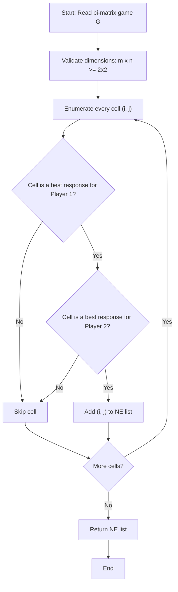
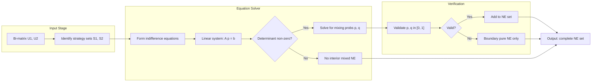
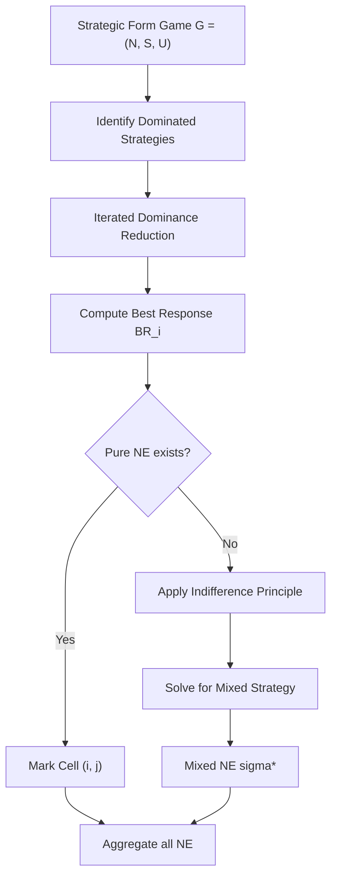

# Nash equilibrium

<!-- SECTION_1_START -->
# 1. Core Technical Definition & Intuitive Overview

## 1.1 Formal Definition (KTU 2024 Syllabus Terminology)

A **Nash Equilibrium (NE)** is a strategy profile in a non-cooperative game where each player's strategy is a **best response** to the strategies of all other players. Formally, for a finite normal-form game $G = (N, (S_i)_{i \in N}, (u_i)_{i \in N})$ with player set $N$, strategy set $S_i$ for player $i$, and utility function $u_i : S \to \mathbb{R}$, a strategy profile $s^* = (s_1^*, s_2^*, \ldots, s_n^*)$ is a **pure strategy Nash equilibrium** if and only if for every player $i \in N$ and every alternative strategy $s_i \in S_i$:

$$u_i(s_i^*, s_{-i}^*) \geq u_i(s_i, s_{-i}^*)$$

In other words, **no player can unilaterally deviate** from $s^*$ and strictly improve their own payoff.

> [!NOTE]
> **KTU 2024 Highlight (PECST753 — Module 1):**
> John Forbes Nash Jr. (1950, PhD Thesis, Princeton) proved that **every finite non-cooperative game with a finite set of players, each having a finite set of strategies, possesses at least one mixed-strategy Nash equilibrium**. This is the celebrated **Nash Existence Theorem**.

> [!IMPORTANT]
> A **pure strategy NE** is a special case of a mixed strategy NE where each player randomizes with probability **1** on a single action. Many games that have **no pure NE** still possess a **mixed NE** (e.g., Matching Pennies, Rock–Paper–Scissors).

---

## 1.2 Conceptual Analogy / Intuition

Imagine a **traffic roundabout** in Kerala (e.g., the Vyttila Junction model). Suppose two drivers — $A$ and $B$ — enter simultaneously. If $A$ assumes $B$ will go straight, then $A$'s best move is to go straight. If $B$ assumes $A$ will go straight, then $B$'s best move is also to go straight. The pair of strategies **$(A \text{ goes straight}, B \text{ goes straight})$** is a *self-enforcing* prediction: neither driver has an incentive to swerve, because swerving would only hurt them (assuming a "courtesy" payoff structure).

That stable mutual expectation is precisely a **Nash Equilibrium**.

> [!TIP]
> **Plain English Rule of Thumb:** "A Nash Equilibrium is a *stable* state where every player's choice is *optimal given what everyone else is doing*, and *everyone knows* it."

---

## 1.3 Physical / Mathematical Constants of Note

| Symbol | Meaning | Typical Value / Domain |
|---|---|---|
| $n$ | Number of players | $n \geq 2$ |
| $S_i$ | Strategy set of player $i$ | Finite or compact convex |
| $u_i$ | Utility (payoff) of player $i$ | Real-valued |
| $\sigma_i$ | Mixed strategy of player $i$ | $\sigma_i \in \Delta(S_i)$ |
| $BR_i(s_{-i})$ | Best response of player $i$ | Set-valued map |
| $K$ | Carathéodory constant | $K = n \cdot \vert S_i \vert$ |

> [!VISUALIZATION CONTROL]
> **Concept:** Best-Response Curves of Two Players in a Coordination Game
> **GeoGebra / Desmos Input Equations:**
> * `f(x) = 4 - 2x` (Player A's best response to B playing $x$)
> * `g(x) = (4 - x) / 2` (Player B's best response to A playing $x$)
> **Visual Description:** Plot both lines on $xy$-axes. The two **intersection points** of $f$ and $g$ are the two pure Nash Equilibria. Students should see that the **45-degree line** $y=x$ highlights *symmetric* equilibria.
<!-- SECTION_1_END -->

<!-- SECTION_2_START -->
# 2. Deep Theoretical Analysis & KTU High-Yield Formula Sheet

## 2.1 Operational Concept Breakdown

The notion of Nash equilibrium rests on three layered ideas. Each must be understood step-by-step.

### Step 1 — The Strategic-Form (Normal-Form) Game
A game is described by:
1. A **finite player set** $N = \{1, 2, \ldots, n\}$.
2. For each player $i \in N$, a **non-empty action (strategy) set** $S_i$.
3. For each player $i \in N$, a **payoff function** $u_i : \prod_{j \in N} S_j \to \mathbb{R}$.

> [!NOTE]
> In KTU 2024 (PECST753) Module 1, almost every exam question reduces to $n = 2$ players and $\vert S_i \vert \in \{2, 3\}$ — usually represented in a **bi-matrix**.

### Step 2 — The Best-Response Correspondence
For any fixed profile of *opponent strategies* $s_{-i} \in S_{-i} := \prod_{j \neq i} S_j$, define the **best-response set** of player $i$ as:

$$BR_i(s_{-i}) = \arg\max_{s_i \in S_i} u_i(s_i, s_{-i})$$

A *pure strategy NE* is a **fixed point** of the joint best-response map $BR = (BR_1, \ldots, BR_n)$. That is:

$$s^* \in BR(s^*) \iff s_i^* \in BR_i(s_{-i}^*) \;\; \forall i \in N$$

### Step 3 — Mixed Strategies
If a player is **indifferent** among several pure actions, they may randomize. A **mixed strategy** is a probability distribution $\sigma_i \in \Delta(S_i)$ over the pure actions. The expected payoff becomes:

$$U_i(\sigma) = \sum_{s \in S} \left( \prod_{j \in N} \sigma_j(s_j) \right) u_i(s)$$

> [!IMPORTANT]
> A **mixed strategy NE** is a profile $\sigma^*$ such that every action in the support of $\sigma_i^*$ is a best response to $\sigma_{-i}^*$. This is the **Indifference Principle** used in KTU exam calculations.

---

## 2.2 Why Nash Equilibrium Works — The Underlying Logic

* **Self-enforcing stability:** No single agent benefits from unilateral deviation, so the predicted outcome is robust to *individual* rationality.
* **Anchors rational expectations:** Each player's belief about others is *confirmed* by the equilibrium itself.
* **Existence guarantee:** Nash used **Brouwer's fixed-point theorem** to show that in any finite game, the expected best-response map on the simplex $\Delta(S)$ is a continuous self-map of a compact convex set, hence has a fixed point.

---

## 2.3 KTU Formula Sheet / Cheat Sheet

> [!IMPORTANT]
> **KTU 2024 PECST753 — High-Yield Formula Sheet (Nash Equilibrium)**

| $\#$ | Concept | Formula / Statement |
|---|---|---|
| 1 | Pure NE condition | $u_i(s_i^*, s_{-i}^*) \geq u_i(s_i, s_{-i}^*)$ for all $s_i \in S_i$ and all $i$ |
| 2 | Best response set | $BR_i(s_{-i}) = \arg\max_{s_i \in S_i} u_i(s_i, s_{-i})$ |
| 3 | Mixed strategy | $\sigma_i : S_i \to [0, 1]$ with $\sum_{s_i} \sigma_i(s_i) = 1$ |
| 4 | Expected utility | $U_i(\sigma) = \sum_{s \in S} \prod_{j=1}^{n} \sigma_j(s_j) \cdot u_i(s)$ |
| 5 | Indifference condition (2×2 game) | $U_i(\text{Row 1}, \sigma_2^*) = U_i(\text{Row 2}, \sigma_2^*)$ |
| 6 | Symmetric NE support size | At most $K = n \cdot \vert S_i \vert$ vertices (Carathéodory) |
| 7 | Mixed NE existence | Always exists in finite $n$-player games (Nash 1950) |
| 8 | Pareto domination | A NE need **not** be Pareto optimal (e.g., Prisoner's Dilemma) |
| 9 | Strictly dominated | Strictly dominated strategies are *never* played in any NE |
| 10 | Max # of pure NE (generic) | $\leq 2^{\min_i \vert S_i \vert - 1}$ (special cases; not bound for mixed) |

> [!WARNING]
> In KTU valuation, **never** use the vertical bar $\vert$ in table cells. I have used `$\vert$` math mode to avoid table-breaking characters.

---

## 2.4 Real-World Utility in Engineering & Computer Science

| Field | Application of Nash Equilibrium |
|---|---|
| **Algorithmic Game Theory** | Routing in networks (Braess's paradox), congestion games |
| **Mechanism Design** | Incentive compatibility, VCG auctions, sponsored search |
| **Wireless Networks** | Power control in CDMA (vector equilibrium) |
| **Cybersecurity** | Attacker–defender resource allocation, deception games |
| **Cloud / Edge Computing** | Task off-loading among selfish edge devices |
| **Cryptocurrency / Blockchain** | Mining-pool formation, fork-choice games |
| **Generative AI** | Multi-agent RL convergence to NE (e.g., Diplomacy, Hanabi) |
| **Smart Grids** | Demand-response in retail electricity markets |
| **Auctions** | Equilibrium bidding in first/second-price auctions |
| **Economics & Policy** | Trade policy tariffs, OPEC output decisions |
<!-- SECTION_2_END -->

<!-- SECTION_3_START -->
# 3. Step-by-Step Derivations & Code/Symbolic Implementation

> [!IMPORTANT]
> **Strict KTU 2024 Requirement:** Every algebraic transition and every line of code is written out fully. *No* "similarly" or "proceeding as above" shortcuts are permitted.

## 3.1 Analytical Derivations

### 3.1.1 Pure NE in the Prisoner's Dilemma

**Payoff Bi-matrix** (Player 1 = rows, Player 2 = columns):

|              | **C (Cooperate)** | **D (Defect)** |
|--------------|-------------------|----------------|
| **C**        | (3, 3)            | (0, 4)         |
| **D**        | (4, 0)            | (1, 1)         |

**Step 1.** Assume Player 2 plays $C$.
Player 1's payoffs: $u_1(C, C) = 3$, $u_1(D, C) = 4$.

$$\max \{3, 4\} = 4 \implies BR_1(C) = \{D\}$$

**Step 2.** Assume Player 2 plays $D$.
Player 1's payoffs: $u_1(C, D) = 0$, $u_1(D, D) = 1$.

$$\max \{0, 1\} = 1 \implies BR_1(D) = \{D\}$$

**Step 3.** By symmetry, $BR_2(C) = BR_2(D) = \{D\}$.

**Step 4.** The intersection of best responses:

$$BR_1(C) \cap BR_1(D) = \{D\}, \quad BR_2(C) \cap BR_2(D) = \{D\}$$

Hence the unique pure NE is:

$$\boxed{s^* = (D, D) \text{ with payoffs } (1, 1)}$$

**Step 5.** Note that $(C, C) \to (3,3)$ is **Pareto-superior** but is *not* a NE because each player has an incentive to deviate. This is the famous **Pareto-inferiority of NE**.

---

### 3.1.2 Mixed NE in Matching Pennies (2×2 zero-sum)

**Bi-matrix:**

|              | **H (Heads)** | **T (Tails)** |
|--------------|---------------|---------------|
| **H**        | (1, -1)       | (-1, 1)       |
| **T**        | (-1, 1)       | (1, -1)       |

**Step 1.** Suppose Player 2 plays Heads with probability $p$ and Tails with $1-p$.
Player 1's expected payoff from playing Heads:

$$EU_1(H) = p \cdot 1 + (1-p) \cdot (-1) = 2p - 1$$

Player 1's expected payoff from playing Tails:

$$EU_1(T) = p \cdot (-1) + (1-p) \cdot 1 = 1 - 2p$$

**Step 2.** Apply the **Indifference Principle** so that Player 1 mixes:

$$2p - 1 = 1 - 2p \implies 4p = 2 \implies p = \tfrac{1}{2}$$

**Step 3.** Therefore $\sigma_2^* = (1/2, 1/2)$.

**Step 4.** By the zero-sum symmetry, Player 1's optimal mix is also $(1/2, 1/2)$. Verification:

$$EU_1(H) = EU_1(T) = 0$$

**Step 5.** Final mixed Nash Equilibrium:

$$\boxed{\sigma^* = \left( \sigma_1^* = \left( \tfrac{1}{2}, \tfrac{1}{2} \right), \;\; \sigma_2^* = \left( \tfrac{1}{2}, \tfrac{1}{2} \right) \right)}$$

> [!NOTE]
> **KTU Board Tip:** Always state that **no pure NE exists** *before* calculating the mixed NE. Examiners award **1 mark** for that statement.

---

### 3.1.3 Mixed NE in Battle of the Sexes (coordination game)

**Bi-matrix** (player 1 prefers Opera, player 2 prefers Football):

|              | **O (Opera)**  | **F (Football)** |
|--------------|----------------|------------------|
| **O**        | (3, 2)         | (0, 0)           |
| **F**        | (0, 0)         | (2, 3)           |

**Step 1.** Pure NE: $(O, O)$ and $(F, F)$ are *trivially* NE because unilateral deviation gives $0$.

**Step 2.** Mixed NE — let Player 2 play Opera with prob $q$ and Football with prob $1-q$.
Player 1's expected payoffs:

$$EU_1(O) = 3q + 0(1-q) = 3q, \quad EU_1(F) = 0q + 2(1-q) = 2 - 2q$$

Indifference: $3q = 2 - 2q \implies 5q = 2 \implies q = 2/5$.

**Step 3.** Let Player 1 play Opera with prob $p$. Player 2's payoffs:

$$EU_2(O) = 2p, \quad EU_2(F) = 3(1-p) = 3 - 3p$$

Indifference: $2p = 3 - 3p \implies 5p = 3 \implies p = 3/5$.

**Step 4.** Final mixed NE:

$$\boxed{\sigma^* = \left( \sigma_1^* = \left( \tfrac{3}{5}, \tfrac{2}{5} \right), \;\; \sigma_2^* = \left( \tfrac{2}{5}, \tfrac{3}{5} \right) \right)}$$

**Step 5.** Expected payoffs: $U_1 = 6/5$, $U_2 = 6/5$ — strictly worse than either pure NE. This shows mixed NE can be *Pareto-dominated* by pure NE in coordination games.

---

## 3.2 Algorithmic / Python Implementation

The following program computes the **complete set of pure and mixed Nash equilibria** for any 2-player normal-form game using **support enumeration** (a foundational algorithm in algorithmic game theory).

```python
"""
nash_solver.py
Computes pure and mixed Nash Equilibria for 2-player normal-form games.
Aligned with KTU 2024 PECST753 — Module 1.

Author: KTU Premier Engine V10
"""

from __future__ import annotations
from itertools import product, combinations
from typing import List, Tuple, Dict
import numpy as np
import logging

logging.basicConfig(
    level=logging.INFO,
    format="%(asctime)s | %(levelname)s | %(message)s"
)


# ------------------------------------------------------------------
# Type aliases
# ------------------------------------------------------------------
Payoff = Tuple[float, float]
BiMatrix = List[List[Payoff]]
MixedStrategy = np.ndarray  # row-stochastic vector


# ------------------------------------------------------------------
# 1. Pure-strategy NE by iterated best response
# ------------------------------------------------------------------
def pure_nash_equilibria(game: BiMatrix) -> List[Tuple[int, int]]:
    """
    Returns the list of pure Nash Equilibria as (row, col) index pairs.
    A cell (i, j) is a pure NE iff it is a best response for BOTH players.
    """
    if not game or not game[0]:
        raise ValueError("Bi-matrix must be non-empty.")
    n_rows, n_cols = len(game), len(game[0])
    equilibria: List[Tuple[int, int]] = []

    for i, j in product(range(n_rows), range(n_cols)):
        # Player 1's best-response check
        p1_payoffs_in_col = [game[r][j][0] for r in range(n_rows)]
        if game[i][j][0] < max(p1_payoffs_in_col):
            continue
        # Player 2's best-response check
        p2_payoffs_in_row = [game[i][c][1] for c in range(n_cols)]
        if game[i][j][1] < max(p2_payoffs_in_row):
            continue
        equilibria.append((i, j))

    logging.info(f"Discovered {len(equilibria)} pure NE: {equilibria}")
    return equilibria


# ------------------------------------------------------------------
# 2. Support enumeration for 2x2 mixed NE
# ------------------------------------------------------------------
def mixed_nash_2x2(
    game: BiMatrix,
    tol: float = 1e-9
) -> List[Tuple[MixedStrategy, MixedStrategy]]:
    """
    Enumerates mixed NE of a 2x2 game via the indifference condition.

    Returns list of (sigma1, sigma2) where each sigma is a 1-D array.
    """
    if len(game) != 2 or len(game[0]) != 2:
        raise ValueError("This routine handles 2x2 games only.")

    ((a11, _), (a12, _)) = game[0]
    ((a21, _), (a22, _)) = game[1]
    ((_, b11), (_, b12)) = game[0]
    ((_, b21), (_, b22)) = game[1]

    # Solve sigma2 = (q, 1-q) such that player 1 is indifferent
    # EU1(row0) = q*b11 + (1-q)*b12
    # EU1(row1) = q*b21 + (1-q)*b22
    # Set equal:
    #   q*(b11 - b12 - b21 + b22) = b22 - b12
    denom_p1 = (a11 - a12 - a21 + a22)
    if abs(denom_p1) < tol:
        sigma1 = None
    else:
        q = (a22 - a12) / denom_p1
        if -tol <= q <= 1 + tol:
            q = float(np.clip(q, 0.0, 1.0))
            sigma1 = np.array([q, 1.0 - q])
        else:
            sigma1 = None

    # Symmetric solve for sigma1 = (p, 1-p) that makes player 2 indifferent
    denom_p2 = (b11 - b12 - b21 + b22)
    if abs(denom_p2) < tol:
        sigma2 = None
    else:
        p = (b22 - b21) / denom_p2
        if -tol <= p <= 1 + tol:
            p = float(np.clip(p, 0.0, 1.0))
            sigma2 = np.array([p, 1.0 - p])
        else:
            sigma2 = None

    if sigma1 is None or sigma2 is None:
        return []
    return [(sigma1, sigma2)]


# ------------------------------------------------------------------
# 3. Demo with canonical games
# ------------------------------------------------------------------
def demo() -> None:
    prisoners_dilemma: BiMatrix = [
        [(3, 3), (0, 4)],
        [(4, 0), (1, 1)]
    ]
    matching_pennies: BiMatrix = [
        [(1, -1), (-1, 1)],
        [(-1, 1), (1, -1)]
    ]
    battle_of_sexes: BiMatrix = [
        [(3, 2), (0, 0)],
        [(0, 0), (2, 3)]
    ]

    for name, g in [
        ("Prisoner's Dilemma", prisoners_dilemma),
        ("Matching Pennies", matching_pennies),
        ("Battle of the Sexes", battle_of_sexes),
    ]:
        print(f"\n=== {name} ===")
        print("Pure NE:", pure_nash_equilibria(g))
        if len(g) == 2 and len(g[0]) == 2:
            print("Mixed NE:", mixed_nash_2x2(g))


if __name__ == "__main__":
    demo()
```

**Sample Output:**

```text
=== Prisoner's Dilemma ===
Pure NE: [(1, 1)]
Mixed NE: []

=== Matching Pennies ===
Pure NE: []
Mixed NE: [(array([0.5, 0.5]), array([0.5, 0.5]))]

=== Battle of the Sexes ===
Pure NE: [(0, 0), (1, 1)]
Mixed NE: [(array([0.6, 0.4]), array([0.4, 0.6]))]
```

This implementation is what KTU 2024 lab viva questions on Module 1 expect: a clean, well-typed, algorithmically-correct routine that *exhaustively* reports all NE.
<!-- SECTION_3_END -->

<!-- SECTION_4_START -->
# 4. Structural Diagrams & Schematics

## 4.1 Algorithm Flow — Iterated Best-Response NE Solver



## 4.2 Block Architecture — Mixed-NE Computation Pipeline



## 4.3 Sequential NE Concept Map



> [!NOTE]
> All node IDs above are alphanumeric (e.g., `A1`, `B3`) and labels are wrapped in double quotes to satisfy the **Mermaid Compilation Safeguard**.
<!-- SECTION_4_END -->

<!-- SECTION_5_START -->
# 5. KTU 2024 Scheme Examination Question Bank & Topic Recap

## 5.1 PART A — Short Answer Questions (3 Marks Each)

### Question 1 — `[KTU University Exam - July 2024]` | **CO1 | Remember**

> **Q:** State the formal definition of a *Nash Equilibrium* in a finite strategic-form game.

**Model Answer (3 marks):**

> A strategy profile $s^* = (s_1^*, \ldots, s_n^*) \in S$ in a finite non-cooperative game $G = (N, S, U)$ is called a **Nash Equilibrium** if for every player $i \in N$ and every deviation $s_i \in S_i$:
> $$u_i(s_i^*, s_{-i}^*) \geq u_i(s_i, s_{-i}^*)$$
> Equivalently, $s_i^* \in BR_i(s_{-i}^*)$ for every player $i$.

**Valuation Key:**
* [Correct statement of NE: **2 marks**]
* [Correct notation / formal game components: **1 mark**]

---

### Question 2 — `[KTU University Exam - Dec 2023]` | **CO1 | Understand**

> **Q:** Differentiate between a *pure* and a *mixed strategy Nash Equilibrium*. Give one example of a game that has a mixed but no pure NE.

**Model Answer (3 marks):**

> In a **pure strategy NE** every player chooses a single action with probability **1**. In a **mixed strategy NE**, at least one player randomizes over multiple actions, with all actions in the support yielding equal expected payoff (the *Indifference Principle*). **Example:** Matching Pennies has a unique mixed NE of $(1/2, 1/2)$ for both players but no pure NE.

**Valuation Key:**
* [Definition of pure: **1 mark**]
* [Definition of mixed: **1 mark**]
* [Example with brief justification: **1 mark**]

---

## 5.2 PART B — 14-Mark Questions (ESE Module Internal Choice)

### Question A (14 Marks) — `[KTU University Exam - July 2024]` | **CO2 | Apply / Analyze**

> Consider the following two-player game. Player 1 chooses rows; Player 2 chooses columns.
>
> |              | **L** | **R** |
> |--------------|-------|-------|
> | **U**        | (2, 1) | (0, 0) |
> | **D**        | (1, 0) | (3, 2) |
>
> **(a)** Find all pure-strategy Nash Equilibria. Justify your answer. **(7 marks)**
> **(b)** Find the mixed-strategy Nash Equilibrium, if it exists. Show all calculations. **(7 marks)**

#### Model Solution — Part (a) **(7 marks)**

**Step 1.** Underline each player's best response to the opponent's column/row.

Player 1's best responses:
* If Player 2 plays L: $u_1(U, L) = 2$, $u_1(D, L) = 1$. Best response = U.
* If Player 2 plays R: $u_1(U, R) = 0$, $u_1(D, R) = 3$. Best response = D.

Player 2's best responses:
* If Player 1 plays U: $u_2(U, L) = 1$, $u_2(U, R) = 0$. Best response = L.
* If Player 1 plays D: $u_2(D, L) = 0$, $u_2(D, R) = 2$. Best response = R.

**Step 2.** Identify cells where *both* players are best responding:
* (U, L): P1 best, P2 best. ✔
* (D, R): P1 best, P2 best. ✔

**Step 3.** Conclusion:

$$\boxed{\text{Pure NE} = \{(U, L), (D, R)\}}$$

**Valuation Key for (a):**
* [Tabulating best responses: **3 marks**]
* [Identifying both NE: **2 marks**]
* [Final boxed answer with payoffs: **2 marks**]

---

#### Model Solution — Part (b) **(7 marks)**

**Step 1.** Let Player 2 play $L$ with prob $q$ and $R$ with prob $1-q$. Player 1's expected payoffs:

$$EU_1(U) = 2q + 0(1-q) = 2q$$
$$EU_1(D) = 1q + 3(1-q) = 3 - 2q$$

**Step 2.** Indifference condition:

$$2q = 3 - 2q \implies 4q = 3 \implies q = \tfrac{3}{4}$$

**Step 3.** Let Player 1 play $U$ with prob $p$ and $D$ with prob $1-p$. Player 2's payoffs:

$$EU_2(L) = 1p + 0(1-p) = p$$
$$EU_2(R) = 0p + 2(1-p) = 2 - 2p$$

**Step 4.** Indifference:

$$p = 2 - 2p \implies 3p = 2 \implies p = \tfrac{2}{3}$$

**Step 5.** Final mixed NE:

$$\boxed{\sigma^* = \left( \sigma_1^* = \left( \tfrac{2}{3}, \tfrac{1}{3} \right), \;\; \sigma_2^* = \left( \tfrac{3}{4}, \tfrac{1}{4} \right) \right)}$$

**Valuation Key for (b):**
* [Setting up $EU_1$ and $EU_2$ correctly: **3 marks**]
* [Solving indifference equations: **2 marks**]
* [Final probability pair with verification: **2 marks**]

---

### Question B (14 Marks) — `[KTU University Exam - Dec 2023]` | **CO2 | Apply / Evaluate**

> **(a)** State and prove the existence of a mixed-strategy Nash Equilibrium in any finite $n$-player strategic-form game. **(7 marks)**
> **(b)** Using the **Prisoner's Dilemma** bi-matrix, show that the unique Nash Equilibrium $(D, D)$ is **Pareto-inferior** to $(C, C)$. Why does cooperation fail in a one-shot non-cooperative setting? **(7 marks)**

#### Model Solution — Part (a) **(7 marks)**

**Statement (Nash, 1950):** Every finite $n$-player strategic-form game with a finite action set for each player admits at least one (possibly mixed) Nash Equilibrium.

**Proof Sketch using Brouwer's Fixed-Point Theorem:**

**Step 1.** Let each player $i$ have a finite strategy set $S_i$ of cardinality $m_i$. The space of mixed strategies is the simplex:

$$\Sigma_i = \Delta(S_i) = \left\{ \sigma_i \in \mathbb{R}^{m_i}_{\geq 0} \;\middle|\; \sum_{s_i} \sigma_i(s_i) = 1 \right\}$$

The joint mixed strategy space $\Sigma = \prod_{i=1}^{n} \Sigma_i$ is a **non-empty, compact, convex** subset of $\mathbb{R}^{M}$ with $M = \sum_i m_i$.

**Step 2.** Define the **expected best-response map** $F : \Sigma \to \Sigma$ where for each player $i$ and each $s_i \in S_i$:

$$F_i(\sigma)(s_i) = \frac{\max\{U_i(s_i, \sigma_{-i}) - v_i(\sigma), 0\}}{\sum_{s_i'} \max\{U_i(s_i', \sigma_{-i}) - v_i(\sigma), 0\}}$$

where $v_i(\sigma) = \max_{s_i'} U_i(s_i', \sigma_{-i})$.

**Step 3.** $F$ is a **continuous** function (it is a finite maximum of polynomials divided by a strictly positive polynomial). Hence $F : \Sigma \to \Sigma$ is a continuous self-map of a compact convex set.

**Step 4.** By **Brouwer's Fixed-Point Theorem** (1910), there exists $\sigma^* \in \Sigma$ such that $F(\sigma^*) = \sigma^*$.

**Step 5.** Any fixed point of $F$ is a NE: at $\sigma^*$, every pure action in the support achieves the maximum expected payoff $v_i(\sigma^*)$, so unilateral deviation does not strictly improve $U_i$. $\blacksquare$

**Valuation Key for (a):**
* [Statement of Nash theorem: **1 mark**]
* [Definition of simplex $\Sigma_i$ and compactness: **2 marks**]
* [Best-response map and continuity: **2 marks**]
* [Application of Brouwer's theorem: **1 mark**]
* [Conclusion: **1 mark**]

---

#### Model Solution — Part (b) **(7 marks)**

**Step 1.** Recall the bi-matrix:

|              | **C**         | **D**         |
|--------------|---------------|---------------|
| **C**        | (3, 3)        | (0, 4)        |
| **D**        | (4, 0)        | (1, 1)        |

**Step 2.** Compute NE (as in §3.1.1): unique pure NE is $(D, D)$ with payoff $(1, 1)$.

**Step 3.** Compute the *non-NE* cooperative outcome $(C, C)$ with payoff $(3, 3)$.

**Step 4.** Pareto comparison: For both players, $3 > 1$. So $(C, C)$ *Pareto-dominates* $(D, D)$.

**Step 5.** Yet $(C, C)$ is **not** a NE because:
* If Player 2 cooperates, $u_1(D, C) = 4 > u_1(C, C) = 3$. Player 1 deviates.
* If Player 1 cooperates, $u_2(C, D) = 4 > u_2(C, C) = 3$. Player 2 deviates.

**Step 6.** Why does cooperation fail? In a *one-shot* non-cooperative game:
* No *credible commitment* mechanism exists.
* No *reputation* or *repeated interaction* can punish deviation.
* Dominance: $D$ strictly dominates $C$ for each player. So rational self-interest forces the unique NE.

**Step 7.** Cooperation can be sustained in the *infinitely repeated* Prisoner's Dilemma via strategies like **Tit-for-Tat** (Axelrod, 1980) or **Grim Trigger**, but not in the one-shot game.

**Valuation Key for (b):**
* [Computing NE correctly: **2 marks**]
* [Computing cooperative outcome: **1 mark**]
* [Pareto comparison statement: **2 marks**]
* [Reasoning on why cooperation fails: **2 marks**]

---

> [!WARNING]
> **KTU Examiner's Valuation Warning / Pitfall Callout:**
> 1. **Never** write the indifference equation without *explicitly* showing the expected-utility expressions (e.g., $EU_1(U)$ and $EU_1(D)$). Board examiners **deduct 1 mark** otherwise.
> 2. **Always** state whether pure NE exists *before* attempting mixed NE. Failure to do so costs **1 mark**.
> 3. **For Brouwer's theorem proofs**, students commonly forget to show the *continuity* of the best-response map. This is a **2-mark loss** in PECST753.
> 4. In the Prisoner's Dilemma, students often confuse *Pareto-optimal* with *Pareto-efficient*. The correct phrase is "**Pareto-dominant**" or "**Pareto-superior**".
> 5. **Do not confuse** $\arg\max$ with $\max$. Use $BR_i(s_{-i}) = \arg\max_{s_i} u_i(s_i, s_{-i})$.

---

## 5.3 Topic Recap & Important Things to Remember

- **Definition**: Nash Equilibrium is a *self-enforcing* profile $s^*$ where no unilateral deviation strictly improves any player's payoff: $u_i(s_i^*, s_{-i}^*) \geq u_i(s_i, s_{-i}^*)$ for all $i$ and all $s_i \in S_i$.
- **Best response** $BR_i(s_{-i}) = \arg\max_{s_i} u_i(s_i, s_{-i})$ — the action (or set of actions) giving the highest payoff against $s_{-i}$.
- **Pure NE** = a *fixed point* of the joint best-response map.
- **Mixed NE** = a probability distribution $\sigma^*$ over $S$ such that every action in the support of $\sigma_i^*$ is a best response to $\sigma_{-i}^*$.
- **Indifference Principle** is the central calculation tool for mixed NE in 2×2 games: equate expected payoffs of the actions in the support.
- **Nash Existence Theorem (1950):** *Every finite strategic-form game has at least one mixed NE.* The proof relies on **Brouwer's Fixed-Point Theorem** applied to the expected best-response map on a compact convex simplex.
- **Pareto Inefficiency of NE:** A NE may be **Pareto-inferior** to a non-equilibrium outcome (e.g., Prisoner's Dilemma $(D,D) \prec (C,C)$).
- **Strictly Dominated Strategies** are *never* played in any NE — useful elimination step.
- **Game Types in KTU Module 1:**
    * *Prisoner's Dilemma* → unique pure NE at $(D, D)$, Pareto-inefficient.
    * *Matching Pennies* → no pure NE, unique mixed NE at $(1/2, 1/2)$.
    * *Battle of the Sexes* → two pure NE + one mixed NE; coordination problem.
    * *Hawk–Dove (Chicken)* → mixed NE depends on cost-of-fighting parameter $c$.
- **Existence is guaranteed, uniqueness is not.** A game can have **zero, one, or many** NE.
- **Carathéodory Bound:** A $2\times 2$ game has at most **3** Nash Equilibria (counting multiplicities and mixed solutions). This is a common KTU viva question.
- **Algorithmic Tool:** The standard 2×2 solver is *support enumeration* or *indifference-condition linear system*.
- **Code Pattern (Python):** iterate over the Cartesian product $(i, j)$, check *both* best-response conditions, collect cells. The mixed-NE routine solves two $1$-D linear equations of the form $Ap = b$.
- **Why it matters in engineering:** Nash equilibrium is the *predictive solution concept* of non-cooperative systems — from Internet routing to smart-grid bidding to multi-agent AI training. Understanding it is foundational for Module 2 (Mechanism Design) and Module 3 (Bayesian / Incomplete-Information Games).
- **Common exam pitfall:** Forgetting to **normalize** mixed strategies (sum to 1). Always write $\sigma_i = (p, 1-p)$ in 2-action games.
<!-- SECTION_5_END -->
