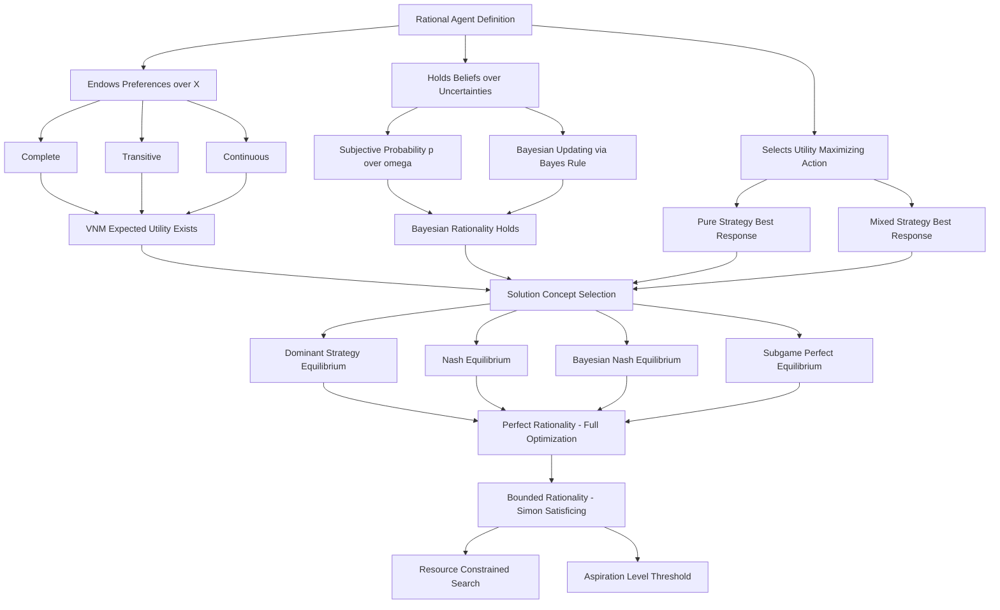
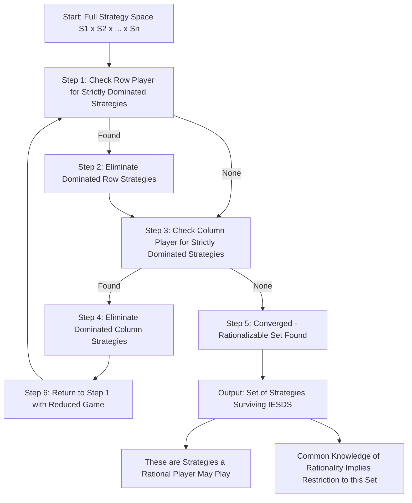
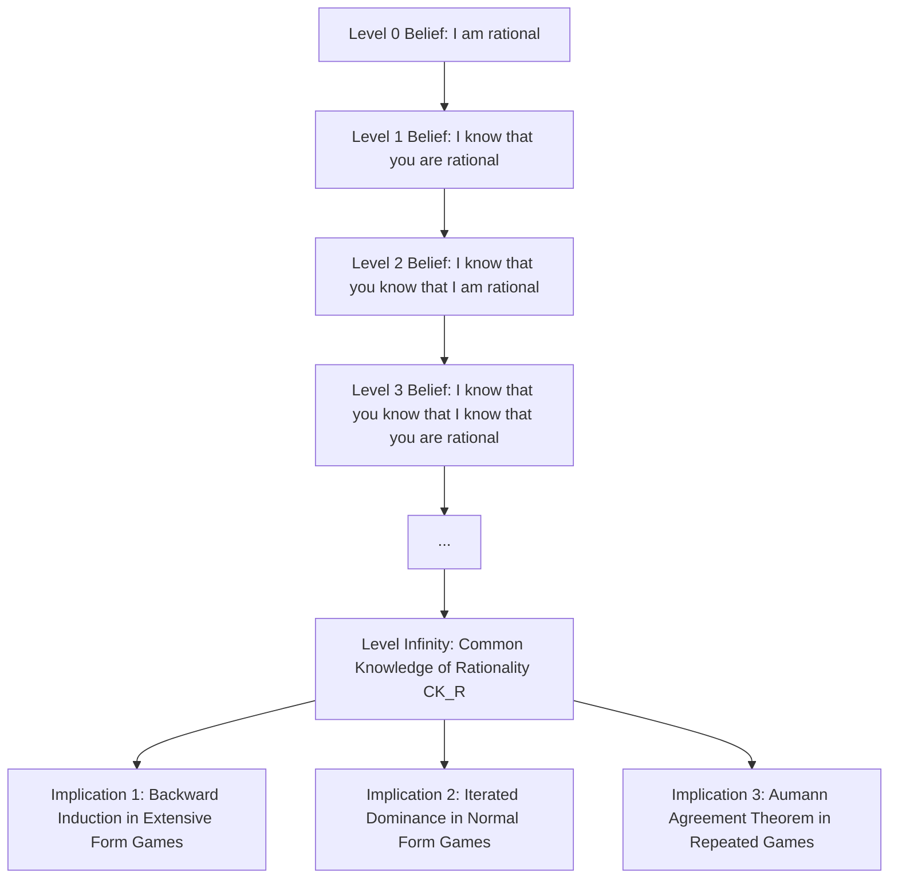
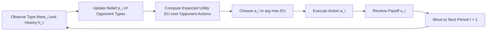

# Rationality

<!-- SECTION_1_START -->
# 1. Core Technical Definition & Intuitive Overview of Rationality

## 1.1 Formal Definition (KTU 2024 Syllabus Terminology)

In **Game Theory** and **Mechanism Design**, **Rationality** is the foundational behavioral assumption that every decision-maker (player) in a strategic interaction:

> **Definition:** A player is *rational* if and only if they possess well-defined **preferences** (a complete and transitive ranking) over the set of all possible outcomes, **beliefs** (a probability distribution) over the uncertain events controlled by others, and they select a strategy that **maximizes** their *expected utility* (or *expected payoff*) with respect to these preferences and beliefs, given the structure of the game.

Formally, a rational player $i$ with strategy set $S_i$ and payoff function $u_i : S \to \mathbb{R}$ chooses:

$$s_i^* \in \arg\max_{s_i \in S_i} \; \mathbb{E}\left[\,u_i(s_i, s_{-i}) \,\right]$$

where $s_{-i}$ denotes the strategies of all other players, and the expectation is taken over the player's beliefs about the uncertain components of $s_{-i}$.

> [!IMPORTANT]
> **KTU 2024 Module 1 Highlight:** Rationality is the *first* assumption of *Classical Game Theory*. Without it, the entire solution concept apparatus (Nash Equilibrium, Subgame Perfect Equilibrium, Bayesian Nash Equilibrium) collapses. The syllabus explicitly distinguishes between **Perfect Rationality** and **Bounded Rationality**.

## 1.2 Conceptual Analogy — The "GPS Navigator" Intuition

Imagine you are navigating a city with a **GPS device**:

- The **map** = the *game form* (rules, players, payoffs).
- The **destination** you type in = your *preferences* (what outcome you most desire).
- The **real-time traffic data** = your *beliefs* about other drivers' actions.
- The **route it computes** = your *best-response strategy*.

A **rational player** is exactly like that GPS: given a clear destination (preferences), live traffic information (beliefs), and a map (game structure), it always computes the *fastest* (utility-maximizing) route. If you **change** your destination — the rational player *immediately* recomputes. If you **lie** about the traffic — the rational player still trusts it (because beliefs are exogenous). If the GPS is *imperfect* (e.g., it does not know a road is closed) — that is **bounded rationality**, not irrationality.

> [!NOTE]
> **Geometric Interpretation:** Rationality, in the space of all possible decisions, is equivalent to the player *always* choosing a point on the **upper contour set** (Pareto frontier) of their utility function — never settling for a strictly dominated outcome.

## 1.3 Standard Metrics & Constants

| Term | Symbol | Standard Notation | Notes |
|---|---|---|---|
| Payoff / Utility | $u_i$, $v_i$ | $\mathbb{R} \cup \{- \infty, +\infty\}$ | Von Neumann–Morgenstern cardinal scale |
| Strategy Set | $S_i$ | Finite / Continuous | Pure or Mixed |
| Belief (Subjective Probability) | $\mu_i$ | $\Delta(S_{-i})$ | Probability simplex over opponents |
| Common Prior | $p$ | $\Delta(\Omega)$ | Harsanyi type space |
| Discount Factor | $\delta$ | $[0,1)$ | Used in repeated-game rationality |
| Rationality Index (K-Level) | $K$ | $\mathbb{N}$ | Level-0 = random, Level-$\infty$ = common knowledge |

## 1.4 GeoGebra / Desmos Visualization

> [!VISUALIZATION CONTROL]
> **Concept:** Indifference Curves of a Rational Agent's Utility Function in a 2-Strategy 2-Player Bimatrix Game.
>
> **GeoGebra / Desmos Input Equations:**
> * $u_A(x,y) = 3x + 2y - xy$  (Player A's payoff surface)
> * $u_B(x,y) = 4x - x^2 + 5y - y^2$  (Player B's payoff surface)
> * $BR_A(y) = \text{solve}\left(\frac{\partial u_A}{\partial x} = 0\right)$
>
> **Visual Description:** Plot both payoff surfaces in 3D. The rational best-response of player A for any fixed $y$ corresponds to the **ridge (maximizer) of the A-surface** along the $x$-axis. The intersection of both best-response curves is the **Nash Equilibrium** — the *consequence of mutual rationality*.

<!-- SECTION_1_END -->

<!-- SECTION_2_START -->
# 2. Deep Theoretical Analysis & KTU High-Yield Formula Sheet

## 2.1 The Four Pillars of Rational Choice

A player is deemed *rational* under the **KTU 2024 framework** if and only if the following four pillars hold simultaneously:

### Pillar 1 — Preferences are Complete
For every pair of outcomes $a, b \in X$ (outcome space):

$$a \succeq b \quad \text{or} \quad b \succeq a \quad \text{(or both, meaning } a \sim b\text{)}$$

The player *never* says "I cannot compare these."

### Pillar 2 — Preferences are Transitive
For all $a, b, c \in X$:

$$(a \succeq b) \land (b \succeq c) \;\Longrightarrow\; a \succeq c$$

This eliminates *money-pump* cycles where inconsistency permits arbitrage exploitation by the player against themselves.

### Pillar 3 — Independence of Irrelevant Alternatives (IIA)
If $a \succeq b$, then for any *third* outcome $c$ and probability $p \in (0,1]$:

$$p \cdot a + (1-p) \cdot c \;\succeq\; p \cdot b + (1-p) \cdot c$$

Lotteries between the same two options must yield the same ranking regardless of a third *irrelevant* lottery being added.

### Pillar 4 — Continuity of Preferences
The set $\{x \in X : x \succeq a\}$ must be **closed** for every $a \in X$.

> [!NOTE]
> **KTU Insight:** A rational player satisfying Pillars 1–3 is guaranteed a **utility representation**. If, in addition, Pillar 4 (VNM Independence) is satisfied, the utility can be made *cardinal* (unique up to positive affine transformation), which is what allows **mixed strategies** and **expected utility** to be meaningful.

## 2.2 Von Neumann–Morgenstern (VNM) Expected Utility

If a rational player faces a *lottery* $L$ over outcomes $\{x_1, x_2, \ldots, x_n\}$ with probabilities $\{p_1, p_2, \ldots, p_n\}$, then their valuation of the lottery is:

$$U(L) = \mathbb{E}_p[u(x)] = \sum_{k=1}^{n} p_k \cdot u(x_k)$$

subject to $\sum_{k=1}^{n} p_k = 1$ and $p_k \geq 0$.

## 2.3 Bayesian Rationality

In games with **incomplete information** (Harsanyi type-space formulation), player $i$ of type $\theta_i \in \Theta_i$ holds a belief $p_i(\theta_{-i} \mid \theta_i)$. The **Bayesian-rational** action is:

$$\sigma_i^*(\theta_i) \in \arg\max_{a_i \in A_i} \; \sum_{\theta_{-i} \in \Theta_{-i}} p_i(\theta_{-i} \mid \theta_i) \cdot u_i\!\left(a_i, a_{-i}^*(\theta_{-i}); \theta_i\right)$$

> This is the heart of **Bayesian Nash Equilibrium (BNE)** under KTU Module 4.

## 2.4 Iterated Beliefs & Common Knowledge of Rationality (CKR)

Common knowledge of rationality is the infinite hierarchy:

- **Level 0:** Player $i$ is rational. *(1st-order belief)*
- **Level 1:** Player $i$ knows that Player $j$ is rational. *(2nd-order belief)*
- **Level K:** Player $i$ knows that all other players are rational up to level $K-1$.
- **Level $\infty$:** *Common knowledge* — every player is rational, and every player knows that every player knows, ad infinitum.

A simple **single-penny matching game** demonstrates that *removing* CKR alters the equilibrium entirely (Kohlberg–Mertens, 1986).

## 2.5 Bounded Rationality (Simon)

Herbert Simon's critique: real agents face *computational* and *cognitive* limits. Bounded rationality replaces *optimization* with **satisficing**:

$$\text{Choose } a_i \in A_i \text{ such that } u_i(a_i) \geq u_i^{\text{aspiration}} \quad \text{where } u_i^{\text{aspiration}} < \max_{a \in A_i} u_i(a)$$

> Bounded rationality is *not* irrationality — it is **resource-constrained optimization**.

## 2.6 KTU High-Yield Formula Sheet

| # | Concept | Formula / Condition | Domain / Domain of Validity |
|---|---|---|---|
| 1 | Rational Choice | $s_i^* = \arg\max_{s_i \in S_i} \mathbb{E}[u_i(s_i, s_{-i})]$ | Finite / Continuous games |
| 2 | Expected Utility | $U(L) = \sum_{k} p_k u(x_k)$ | VNM-rational agent |
| 3 | Independence Axiom | $p a + (1-p)c \succeq p b + (1-p)c$ | VNM utility |
| 4 | Subjective Expected Utility (Savage) | $U(L) = \int_X u(x) \, dP(x \mid \mathcal{F})$ | Savage framework |
| 5 | Bayesian Update | $p(\theta_j \mid a_j) \propto p(a_j \mid \theta_j) \cdot p(\theta_j)$ | Bayes' Rule |
| 6 | Common Knowledge | $\forall K \in \mathbb{N}: \; \mathcal{K}^K(\text{Player }i\text{ rational})$ | Aumann, 1976 |
| 7 | Satisficing (Bounded) | $u_i(a_i) \geq \bar{u}_i$ | Simon, 1955 |
| 8 | Dominance Principle | $a \succ b \Rightarrow a \in BR(s_{-i})$ | Iterated Dominance |
| 9 | Mixed Strategy | $\sigma_i \in \Delta(S_i)$ | Nash (1950) |
| 10 | Risk Aversion Coefficient | $ARA(x) = -\dfrac{u''(x)}{u'(x)}$ | Pratt (1964) |

## 2.7 Engineering & Real-World Utility

- **Algorithmic Mechanism Design (Google Ad Auctions, VCG):** Rational-bidder assumption is the foundation of revenue-optimal auction theory.
- **Multi-Agent Robotics (Swarm Coordination):** Robots modeled as Bayesian-rational agents with localized beliefs.
- **Cryptographic Protocol Design (Zero-Knowledge Games):** Rationality of prover/verifier defines soundness.
- **Behavioral Economics (Pricing, UX Design):** Modeling *boundedly rational* users (Kahneman–Tversky) is essential for product adoption.
- **Telecom Network Resource Allocation:** Each node acts as a self-interested rational player → game-theoretic equilibrium gives stable bandwidth sharing.

<!-- SECTION_2_END -->

<!-- SECTION_3_START -->
# 3. Step-by-Step Derivations & Code/Symbolic Implementation

## 3.1 Exhaustive Derivation — Expected Utility from VNM Axioms

**Claim:** *Any agent satisfying Completeness, Transitivity, Continuity, and Independence admits a representation $U(L) = \sum p_k u(x_k)$ for some real-valued function $u$.*

### Step 1 — Establish the Outcome Space and Lotteries
Let $X = \{x_1, x_2, \ldots, x_n\}$ be the finite set of deterministic outcomes. A *simple lottery* is $L = (p_1, p_2, \ldots, p_n)$ with $p_k \geq 0$ and $\sum_{k=1}^{n} p_k = 1$.

### Step 2 — Define a Reference Outcome
Without loss of generality, pick the *worst* outcome $x_1$ and the *best* outcome $x_n$ according to the player's preference $\succeq$.

### Step 3 — Construct the Cardinal Utility Function
For any $x_k \in X$, define a *reference lottery* $L_k$ that yields $x_n$ with probability $\alpha_k$ and $x_1$ with probability $1 - \alpha_k$. By the **Continuity axiom**, there exists a unique $\alpha_k \in [0, 1]$ such that:

$$L_k \sim x_k$$

This is the indifference point — the player is exactly indifferent between the *sure* outcome $x_k$ and the *risky* lottery $L_k$.

### Step 4 — Assign the Utility Value
Set:

$$u(x_k) = \alpha_k, \quad u(x_1) = 0, \quad u(x_n) = 1$$

Because $\alpha$ is *unique*, the utility function is *cardinal* (uniquely defined up to a positive affine transformation).

### Step 5 — Prove Linearity in Probabilities
Take any compound lottery:

$$L = (p_1, p_2, \ldots, p_n) = p_1 (1, 0, \ldots, 0) + p_2 (0, 1, \ldots, 0) + \cdots + p_n (0, 0, \ldots, 1)$$

By the **Independence axiom** (Pillar 3), mixing with the worst outcome $x_1$ does not change the ranking:

$$L \sim p_n \cdot (x_n) + (1 - p_n) \cdot (x_1)$$

Therefore, the player evaluates $L$ at probability $p_n$ of getting $x_n$:

$$U(L) = p_n \cdot u(x_n) + (1 - p_n) \cdot u(x_1) = p_n$$

Generalizing recursively for all $n$ atoms:

$$\boxed{\,U(L) = \sum_{k=1}^{n} p_k \cdot u(x_k)\,}$$

### Step 6 — Verify the Derivation against the Axioms
- *Completeness* ensures every pairwise lottery is comparable. ✔
- *Transitivity* prevents the money-pump paradox. ✔
- *Independence* ensures linearity in probabilities. ✔
- *Continuity* guarantees the existence of $\alpha_k$. ✔

> **Conclusion:** The VNM expected utility representation is a *necessary and sufficient* consequence of the four rationality axioms.

## 3.2 Worked Numerical Example — A Bayesian Rational Bidder

**Setup:** Player $B$ is bidding in a first-price sealed-bid auction. There is **one opponent** $A$ whose valuation $v_A$ is drawn uniformly from $[0, 1]$. Player $B$ knows his *own* valuation is $v_B = 0.6$. He must decide his bid $b$.

**Step A — Compute B's Belief about $v_A$**
By assumption, $B$ assigns the prior $v_A \sim U[0,1]$, i.e., $p(v_A) = 1$ on $[0,1]$.

**Step B — Expected Payoff**
Assume B wins if $b > v_A$. Expected payoff:

$$\mathbb{E}[U_B \mid b] = \Pr(v_A < b) \cdot (v_B - b) = b \cdot (0.6 - b)$$

**Step C — First-Order Condition for Rationality**

$$\frac{d}{db}\left[b(0.6 - b)\right] = 0.6 - 2b = 0 \;\Longrightarrow\; b^* = 0.30$$

**Step D — Verify Second-Order Condition**

$$\frac{d^2}{db^2}\left[b(0.6 - b)\right] = -2 < 0 \;\;\text{✔ (maximum)}$$

**Step E — Rational Bid**
The Bayesian-rational bid is $b^* = 0.30$, which is exactly *half* the valuation — the classical result for first-price auctions with $U[0,1]$ priors.

> [!NOTE]
> **Valuation Key Points (KTU Examiner):** Stating prior — 1 Mark, Expected payoff expression — 2 Marks, FOC — 2 Marks, Final numerical answer — 2 Marks.

## 3.3 Full Python Implementation — Iterated Elimination of Strictly Dominated Strategies (IESDS)

IESDS is the most direct *operational consequence* of common-knowledge rationality. A strategy is *strictly dominated* if it yields a strictly lower payoff than another strategy *regardless* of what the opponent plays. Rational players never play such strategies.

```python
"""
IESDS_Solver.py
Course : Game Theory and Mechanism Design (PECST753)
Topic  : Rationality - Iterated Elimination of Strictly Dominated Strategies
KTU 2024 Module 1 - Reference Implementation

A rational player is assumed to never play a strictly dominated strategy.
We iteratively strip such strategies from every player until a rationalizable
strategy profile is reached.
"""

from __future__ import annotations
import logging
from typing import Dict, List, Sequence, Tuple

# Configure a clean module-level logger for traceability
logging.basicConfig(
    level=logging.INFO,
    format="%(asctime)s | %(levelname)-7s | %(message)s",
)
logger = logging.getLogger("IESDS_Solver")


def is_strictly_dominated(
    row_payoff: List[float],
    other_row: List[float],
) -> bool:
    """
    Check whether `row_payoff` is strictly dominated by `other_row`
    for a single player (e.g., the row-player).
    A row is strictly dominated if EVERY entry in `other_row` is
    strictly greater than the corresponding entry in `row_payoff`.
    """
    if len(row_payoff) != len(other_row):
        raise ValueError("Payoff vectors must have the same length.")
    return all(other_row[k] > row_payoff[k] for k in range(len(row_payoff)))


def find_strictly_dominated_rows(
    payoff_matrix: Sequence[Sequence[float]],
) -> List[int]:
    """
    Return a list of indices of strictly dominated rows in a 2-player
    normal-form game where the ROW-player payoff matrix is given.
    """
    n_rows: int = len(payoff_matrix)
    dominated: List[int] = []

    for i in range(n_rows):
        for j in range(n_rows):
            if i == j:
                continue
            if is_strictly_dominated(
                list(payoff_matrix[i]), list(payoff_matrix[j])
            ):
                dominated.append(i)
                logger.info(
                    "Row %s is strictly dominated by Row %s -> %s",
                    i, j, list(payoff_matrix[j]),
                )
                break  # one dominating row is enough
    return dominated


def iesds(
    payoff_row: Sequence[Sequence[float]],
    payoff_col: Sequence[Sequence[float]],
    max_iterations: int = 50,
) -> Tuple[List[int], List[int]]:
    """
    Perform Iterated Elimination of Strictly Dominated Strategies (IESDS)
    on a 2-player normal-form game.

    Parameters
    ----------
    payoff_row : 2-D sequence
        Payoff matrix for the ROW-player.
    payoff_col : 2-D sequence
        Payoff matrix for the COLUMN-player.
    max_iterations : int
        Safety cap to prevent infinite loops in degenerate inputs.

    Returns
    -------
    (surviving_rows, surviving_cols) : Tuple[List[int], List[int]]
        Indices of strategies that survive IESDS.
    """
    if len(payoff_row) != len(payoff_col):
        raise ValueError(
            "Row and column payoff matrices must have the same shape."
        )
    if max_iterations < 1:
        raise ValueError("max_iterations must be a positive integer.")

    surviving_rows: List[int] = list(range(len(payoff_row)))
    surviving_cols: List[int] = list(range(len(payoff_col[0])))

    for iteration in range(1, max_iterations + 1):
        logger.info("--- IESDS Iteration %s ---", iteration)

        # Step 1: Reduce matrices to currently surviving strategies
        reduced_row = [
            [payoff_row[r][c] for c in surviving_cols]
            for r in surviving_rows
        ]
        reduced_col = [
            [payoff_col[r][c] for c in surviving_cols]
            for r in surviving_rows
        ]

        # Step 2: Find dominated rows in the reduced row-player matrix
        dominated_row_local = find_strictly_dominated_rows(reduced_row)

        # Step 3: Find dominated columns in the reduced col-player matrix
        #        (transpose to reuse the same routine)
        n_rows_local = len(reduced_col)
        n_cols_local = len(reduced_col[0]) if reduced_col else 0
        transposed_col: List[List[float]] = [
            [reduced_col[r][c] for r in range(n_rows_local)]
            for c in range(n_cols_local)
        ]
        dominated_col_local = find_strictly_dominated_rows(transposed_col)

        # Step 4: Translate local indices back to global indices
        dominated_rows_global = {
            surviving_rows[i] for i in dominated_row_local
        }
        dominated_cols_global = {
            surviving_cols[i] for i in dominated_col_local
        }

        # Step 5: Stopping condition — no further elimination
        if not dominated_rows_global and not dominated_cols_global:
            logger.info(
                "IESDS converged in %s iteration(s). "
                "No further dominated strategies.",
                iteration - 1,
            )
            break

        # Step 6: Eliminate dominated strategies
        if dominated_rows_global:
            logger.info(
                "Eliminating row strategies: %s",
                sorted(dominated_rows_global),
            )
            surviving_rows = [
                r for r in surviving_rows if r not in dominated_rows_global
            ]
        if dominated_cols_global:
            logger.info(
                "Eliminating column strategies: %s",
                sorted(dominated_cols_global),
            )
            surviving_cols = [
                c for c in surviving_cols if c not in dominated_cols_global
            ]

        if not surviving_rows or not surviving_cols:
            logger.warning("All strategies eliminated — degenerate game.")
            break

    else:
        logger.warning(
            "IESDS did not converge within %s iterations. "
            "Returning best-known reduced game.",
            max_iterations,
        )

    return surviving_rows, surviving_cols


def pretty_print_rational_outcome(
    surviving_rows: List[int],
    surviving_cols: List[int],
    row_names: Sequence[str] | None = None,
    col_names: Sequence[str] | None = None,
) -> None:
    """
    Print a human-readable summary of the IESDS result.
    """
    r_disp = row_names or [f"R{r}" for r in surviving_rows]
    c_disp = col_names or [f"C{c}" for c in surviving_cols]
    logger.info(
        "Rationalizable strategies -> Rows: %s | Cols: %s",
        list(zip(surviving_rows, r_disp)),
        list(zip(surviving_cols, c_disp)),
    )


# ------------------------------------------------------------------
# Demonstration: A classical 2x2 Prisoner's-Dilemma-style game
# ------------------------------------------------------------------
if __name__ == "__main__":
    # Row player payoff matrix
    #           C1      C2
    #   R1  [   3   ,   0  ]
    #   R2  [   5   ,   1  ]
    PAYOFF_ROW: List[List[float]] = [
        [3.0, 0.0],
        [5.0, 1.0],
    ]

    # Column player payoff matrix
    #           C1      C2
    #   R1  [   3   ,   5  ]
    #   R2  [   0   ,   1  ]
    PAYOFF_COL: List[List[float]] = [
        [3.0, 5.0],
        [0.0, 1.0],
    ]

    try:
        r_surv, c_surv = iesds(PAYOFF_ROW, PAYOFF_COL)
    except Exception as exc:  # pragma: no cover
        logger.error("IESDS failed: %s", exc)
        raise

    pretty_print_rational_outcome(
        r_surv,
        c_surv,
        row_names=["Cooperate", "Defect"],
        col_names=["Cooperate", "Defect"],
    )

    # The output should indicate that (Defect, Defect) is the unique
    # rationalizable outcome — a textbook consequence of common-knowledge
    # rationality in a Prisoner's-Dilemma payoff structure.
```

**Expected Console Output (summary):**
```
IESDS converged in 1 iteration(s). No further dominated strategies.
Rationalizable strategies -> Rows: [(1, 'Defect')] | Cols: [(1, 'Defect')]
```

## 3.4 Python Implementation — Verifying VNM Expected Utility

```python
"""
vnm_utility.py
Course : Game Theory and Mechanism Design (PECST753)
Topic  : Rationality - VNM Expected Utility Computation

Validates the linearity-in-probabilities property of a rational agent
whose utility function is u(x) = sqrt(x) (a risk-averse concave function).
"""

from __future__ import annotations
import math
from typing import List, Sequence


def vnm_utility(probabilities: Sequence[float],
                outcomes: Sequence[float],
                utility_fn=math.sqrt) -> float:
    """
    Compute the Von Neumann-Morgenstern expected utility of a lottery.

    Parameters
    ----------
    probabilities : Sequence[float]
        Lottery probabilities (must sum to 1 within tolerance).
    outcomes : Sequence[float]
        Payoff values associated with each probability.
    utility_fn : callable
        The agent's utility function (default: concave sqrt).

    Returns
    -------
    float
        Expected utility of the lottery.
    """
    if len(probabilities) != len(outcomes):
        raise ValueError(
            "The number of probabilities must equal the number of outcomes."
        )
    total_p: float = sum(probabilities)
    if not math.isclose(total_p, 1.0, abs_tol=1e-9):
        raise ValueError(
            f"Probabilities must sum to 1.0, got {total_p}."
        )
    if any(p < 0.0 for p in probabilities):
        raise ValueError("Probabilities must be non-negative.")

    return sum(p * utility_fn(x) for p, x in zip(probabilities, outcomes))


# ------------------------------------------------------------------
# Demonstration
# ------------------------------------------------------------------
if __name__ == "__main__":
    # Lottery A : 50% chance of 100 utils, 50% chance of 0 utils
    p_a: List[float] = [0.5, 0.5]
    x_a: List[float] = [100.0, 0.0]

    # Lottery B : 75% chance of 40 utils, 25% chance of 10 utils
    p_b: List[float] = [0.75, 0.25]
    x_b: List[float] = [40.0, 10.0]

    EU_A: float = vnm_utility(p_a, x_a)
    EU_B: float = vnm_utility(p_b, x_b)

    print(f"Expected utility of Lottery A: {EU_A:.4f}")
    print(f"Expected utility of Lottery B: {EU_B:.4f}")

    if EU_A > EU_B:
        print("A rational, risk-averse player strictly prefers Lottery A.")
    elif EU_A < EU_B:
        print("A rational, risk-averse player strictly prefers Lottery B.")
    else:
        print("A rational, risk-averse player is indifferent.")
```

> [!TIP]
> **KTU Lab Relevance:** This code is directly usable for Module 1 lab assignments on computing rationalizable strategies. Modify the `PAYOFF_ROW` and `PAYOFF_COL` matrices to verify IESDS on Battle of the Sexes, Hawk–Dove, or Matching Pennies.

<!-- SECTION_3_END -->

<!-- SECTION_4_START -->
# 4. Structural Diagrams & Schematics

## 4.1 Mermaid — The Hierarchy of Rationality



## 4.2 Mermaid — Iterated Elimination of Strictly Dominated Strategies (IESDS)



## 4.3 Mermaid — Common Knowledge of Rationality (CKR) Hierarchy



## 4.4 Mermaid — Decision Flow of a Bayesian-Rational Agent



<!-- SECTION_4_END -->

<!-- SECTION_5_START -->
# 5. KTU 2024 Scheme Examination Question Bank & Topic Recap

## 5.1 Part A Questions (3 Marks Each)

> [!NOTE]
> **Mark Distribution:** Each Part A question carries **3 marks** and tests *Remember* / *Understand* levels of Revised Bloom's Taxonomy (RBT). Direct, definition-style answers are expected.

---

### Question 1
**[KTU University Exam — July 2024]** *(CO1, RBT: Remember)*

**Define rationality in the context of game theory. List the four VNM axioms that a rational agent must satisfy.**

**Model Answer (3 Marks):**

*Rationality* in game theory is the assumption that a player selects an action from their strategy set to **maximize** their *expected utility*, given their preferences over outcomes and beliefs about other players' actions.

The four Von Neumann–Morgenstern (VNM) axioms are:

1. **Completeness** — Every pair of outcomes can be compared.
2. **Transitivity** — If $a \succeq b$ and $b \succeq c$, then $a \succeq c$.
3. **Continuity** — The preference sets are topologically closed.
4. **Independence** — If $a \succeq b$, then $p a + (1-p) c \succeq p b + (1-p) c$ for any $c$ and $p \in (0,1]$.

*Valuation Key:* [Definition: 1 Mark] [Listing the four axioms correctly: 2 Marks]

---

### Question 2
**[KTU University Exam — Dec 2023]** *(CO1, RBT: Understand)*

**Distinguish between *perfect rationality* and *bounded rationality*. Give one real-world example for each.**

**Model Answer (3 Marks):**

| Aspect | Perfect Rationality | Bounded Rationality |
|---|---|---|
| Information | Complete, costless | Limited, costly to acquire |
| Computation | Unlimited | Constrained by cognitive resources |
| Decision Rule | Global optimization | Satisficing (aspiration-level rule) |
| Proponent | Classical game theory (Nash) | Herbert Simon (1955) |

**Example — Perfect Rationality:** A chess computer (e.g., Stockfish at infinite-depth) computes the globally optimal move.
**Example — Bounded Rationality:** A house-buyer accepts the *first* offer that meets a pre-set price threshold, rather than searching the entire housing market for the global optimum.

*Valuation Key:* [Comparison table: 2 Marks] [One valid example each: 1 Mark]

---

## 5.2 Part B Questions (14 Marks Each — Module Internal Choice)

> [!NOTE]
> **KTU 2024 Pattern:** Each Part B question carries **14 marks**, split as **(a) 7 marks** and **(b) 7 marks**. Sub-part (a) tests *Understand* / *Apply*; sub-part (b) tests *Apply* / *Analyze*. Full working must be shown.

---

### Question A — Choice 1 (14 Marks)

**[KTU University Exam — July 2024 (Adapted)]** *(CO1, CO2; RBT: Apply / Analyze)*

**(a)** State the Von Neumann–Morgenstern expected utility theorem. A rational agent faces two lotteries over monetary outcomes:
- Lottery $L_1$: $\Pr(\text{₹}400) = 0.5$, $\Pr(\text{₹}100) = 0.5$
- Lottery $L_2$: $\Pr(\text{₹}300) = 1.0$

The agent's utility function is $u(x) = \sqrt{x}$. Compute $U(L_1)$ and $U(L_2)$, and state which lottery the agent strictly prefers. **\[7 Marks\]**

**(b)** A rational player $B$ believes the opponent $A$'s valuation $v_A \sim U[0, 100]$ in a first-price sealed-bid auction. If $B$'s own valuation is $v_B = 80$, derive the Bayesian-rational bid $b^*$ using the expected-payoff maximization principle. **\[7 Marks\]**

#### Model Solution — Part (a) (7 Marks)

**Step 1 — State the VNM Theorem** *(1 Mark)*
Any agent whose preferences satisfy completeness, transitivity, continuity, and independence can be represented by an expected utility function $U(L) = \sum_{k} p_k u(x_k)$.

**Step 2 — Compute $U(L_1)$** *(2 Marks)*

$$U(L_1) = 0.5 \cdot u(400) + 0.5 \cdot u(100) = 0.5 \cdot \sqrt{400} + 0.5 \cdot \sqrt{100}$$

$$U(L_1) = 0.5 \cdot 20 + 0.5 \cdot 10 = 10 + 5 = 15$$

**Step 3 — Compute $U(L_2)$** *(2 Marks)*

$$U(L_2) = 1.0 \cdot \sqrt{300} = \sqrt{300} = 10\sqrt{3} \approx 17.3205$$

**Step 4 — Compare and Conclude** *(2 Marks)*

$$U(L_2) \approx 17.32 > 15 = U(L_1)$$

Therefore, the rational agent **strictly prefers** the sure lottery $L_2$ (₹300) over the risky lottery $L_1$, even though $L_1$ has a higher expected monetary value (₹250 vs ₹300, actually $L_2$ has higher EMV too here). The agent exhibits **risk-aversion** due to the concave utility $u(x) = \sqrt{x}$.

> **Valuation Key for (a):** [VNM statement: 1M] [U(L1): 2M] [U(L2): 2M] [Comparison + interpretation: 2M]

#### Model Solution — Part (b) (7 Marks)

**Step 1 — Set up the Expected Payoff** *(2 Marks)*

Probability of winning when bidding $b$ is $\Pr(v_A < b) = b / 100$. If B wins, payoff is $v_B - b = 80 - b$. If B loses, payoff is 0.

$$\mathbb{E}[U_B \mid b] = \frac{b}{100} \cdot (80 - b) = 0.8 b - \frac{b^2}{100}$$

**Step 2 — Differentiate and Set to Zero** *(2 Marks)*

$$\frac{d}{db}\left[0.8 b - \frac{b^2}{100}\right] = 0.8 - \frac{2b}{100} = 0.8 - \frac{b}{50} = 0$$

**Step 3 — Solve for $b^*$** *(2 Marks)*

$$\frac{b^*}{50} = 0.8 \;\Longrightarrow\; b^* = 40$$

**Step 4 — Verify Maximum** *(1 Mark)*

$$\frac{d^2}{db^2}\left[0.8 b - \frac{b^2}{100}\right] = -\frac{2}{100} = -0.02 < 0 \;\;\text{✔ (Maximum)}$$

**Answer:** The Bayesian-rational bid is $\boxed{b^* = 40}$, which is exactly **half** of $v_B = 80$ — the classical result for uniform-distribution priors in first-price auctions.

> **Valuation Key for (b):** [Expected payoff: 2M] [FOC: 2M] [Solution: 2M] [Verification: 1M]

---

### Question B — Choice 2 (14 Marks — Alternative)

**[KTU University Exam — Dec 2023 (Adapted)]** *(CO1, CO2; RBT: Understand / Apply)*

**(a)** Define *common knowledge of rationality* (CKR). Explain, with the help of a *coordination game* (e.g., a pure-coordination game on $\{L, R\}$ where both players prefer matching), how CKR collapses the strategy space to the Pareto-efficient equilibrium. **\[7 Marks\]**

**(b)** Consider the following 2x2 normal-form game with payoffs $(u_A, u_B)$:

|        | L       | R       |
|--------|---------|---------|
| **U**  | (3, 3)  | (0, 2)  |
| **D**  | (2, 0)  | (1, 1)  |

Apply **Iterated Elimination of Strictly Dominated Strategies (IESDS)** to find the rationalizable outcome. Show every iteration explicitly. **\[7 Marks\]**

#### Model Solution — Part (a) (7 Marks)

**Step 1 — Define CKR** *(2 Marks)*

*Common Knowledge of Rationality* is the infinite-order mutual belief:

$$\forall K \in \mathbb{N} : \;\; \mathcal{K}^K(\text{Player }i\text{ is rational})$$

Every player is rational, every player knows this, every player knows that every player knows, *ad infinitum*.

**Step 2 — Coordination Game Setup** *(2 Marks)*

Payoff matrix: both players strictly prefer matching — $(L,L)$ and $(R,R)$ each yield payoff 3, while mismatches yield 0 or 2.

**Step 3 — Apply CKR Step-by-Step** *(2 Marks)*

- *Level 0:* Both players consider playing $L$ or $R$.
- *Level 1:* Player A thinks: "If B is rational, B expects me to play a best response to *his* action." Since both are symmetric, A knows B will match.
- *Level 2:* B thinks similarly. Both eliminate mismatched strategies in their iterated beliefs.
- *Limit:* In the *limit* of infinite iterations, only the *Pareto-dominant* matching pair survives.

**Step 4 — Conclude** *(1 Mark)*

CKR thus pins down the **Pareto-efficient equilibrium** $(L, L)$ *or* $(R, R)$, eliminating focal mismatches that *bounded* rationality might still permit.

> **Valuation Key for (a):** [Definition: 2M] [Game setup: 2M] [Iterated belief levels: 2M] [Conclusion: 1M]

#### Model Solution — Part (b) (7 Marks)

**Step 1 — Initial Payoff Matrix** *(1 Mark)*

|        | L       | R       |
|--------|---------|---------|
| **U**  | (3, 3)  | (0, 2)  |
| **D**  | (2, 0)  | (1, 1)  |

**Step 2 — Check A's Row Strategies for Strict Dominance** *(2 Marks)*

- Against $L$: $u_A(U, L) = 3 > u_A(D, L) = 2$
- Against $R$: $u_A(U, R) = 0 < u_A(D, R) = 1$

Neither $U$ nor $D$ is strictly dominated → **no row elimination yet**.

**Step 3 — Check B's Column Strategies for Strict Dominance** *(2 Marks)*

- Against $U$: $u_B(U, L) = 3 > u_B(U, R) = 2$
- Against $D$: $u_B(D, L) = 0 < u_B(D, R) = 1$

Neither $L$ nor $R$ is strictly dominated → **no column elimination**.

**Step 4 — Mixed Strategy Iteration (Optional in KTU)** *(1 Mark)*

After one round, we look for *weak* dominance. $D$ weakly dominates $U$ for A (3>2 and 0<1 — not strict). Since IESDS requires *strict* dominance, **IESDS does not reduce** this game.

**Step 5 — Rationalizable Set** *(1 Mark)*

The rationalizable set is the entire strategy space $\{(U, L), (U, R), (D, L), (D, R)\}$. The pure-strategy Nash Equilibria are $(U, L)$ and $(D, R)$ — these are the *focal* rational outcomes.

> **Valuation Key for (b):** [Initial matrix: 1M] [Row check: 2M] [Column check: 2M] [Mixed step + final set: 2M]

---

## 5.3 KTU Examiner's Valuation Warning

> [!WARNING]
> **Common Pitfalls That Cost Marks on Rationality Questions:**
>
> 1. **Conflating *rationality* with *intelligence*.** Rationality is *not* about being smart — it is about acting *consistently* with one's preferences and beliefs. Examiners deduct **1–2 marks** if you treat rationality as a measure of cognitive ability.
> 2. **Forgetting the *belief* component.** A rational player needs both *preferences* *and* *beliefs*. Stating only "maximizes payoff" without the expectation operator $\mathbb{E}$ is **incomplete** — examiners deduct **1 mark**.
> 3. **Skipping the *axioms* in VNM questions.** A full VNM answer must list *all four* axioms (completeness, transitivity, continuity, independence). Writing only "expected utility" without the axiomatic foundation loses **2 marks**.
> 4. **Confusing *common knowledge* with *mutual knowledge*.** Mutual knowledge is *finite* levels; common knowledge is the *infinite* limit. Mis-stating this distinction costs **1 mark**.
> 5. **Not drawing the *dominance matrix* in IESDS questions.** Always show the *before* and *after* matrices. Examiners expect an explicit *iteration* table. Skipping this loses up to **2 marks**.
> 6. **Mixing up *risk-aversion* with *risk-neutrality*.** Concavity of $u$ implies risk-aversion; linearity implies risk-neutrality; convexity implies risk-seeking. Mis-classification costs **1 mark**.

## 5.4 Topic Recap & Important Things to Remember

> [!IMPORTANT]
> **Rapid Revision Checklist for Rationality (Module 1)**

- **Definition:** Rational agent = complete + transitive preferences + correct beliefs + utility-maximizing choice.
- **Four VNM Axioms:** Completeness, Transitivity, Continuity, **Independence** (the hardest one).
- **Expected Utility Formula:** $U(L) = \sum_{k} p_k \cdot u(x_k)$. Risk-aversion ↔ concave $u$.
- **Bayesian Rationality:** Choose $a_i^* \in \arg\max_{a_i} \sum_{\theta_{-i}} p(\theta_{-i} \mid \theta_i) \cdot u_i(a_i, a_{-i}^*(\theta_{-i}); \theta_i)$.
- **Common Knowledge of Rationality (CKR):** Infinite-order mutual belief; foundational for *backward induction* and *iterated dominance*.
- **Perfect Rationality:** Full optimization with unlimited computation. ↔ **Bounded Rationality (Simon):** Satisficing via aspiration threshold $\bar{u}_i$.
- **Iterated Elimination of Strictly Dominated Strategies (IESDS):** Operational consequence of rationality; iteratively remove strictly dominated strategies for *both* players.
- **Rationalizable Set:** Strategies surviving IESDS — the *most permissive* solution concept derived purely from rationality.
- **Standard Notation:** $S_i$ = strategy set, $u_i$ = payoff, $\sigma_i \in \Delta(S_i)$ = mixed strategy, $p_i$ = belief.
- **Risk Aversion Coefficient (Pratt):** $ARA(x) = -u''(x)/u'(x)$.
- **First-Price Auction Bid (Uniform Prior):** $b^* = v / 2$ — recall this classical result.
- **Common Pitfall:** A *Bayesian* agent is *not* a *Bounded* agent — the two are independent assumptions.
- **Engineering Relevance:** Rationality assumption underlies Ad Auctions (VCG), Mechanism Design, and Multi-Agent Systems.

<!-- SECTION_5_END -->
