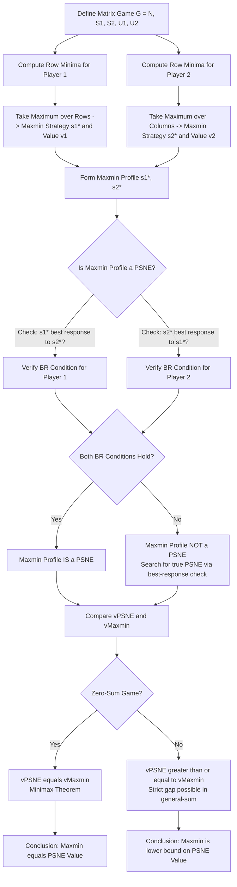
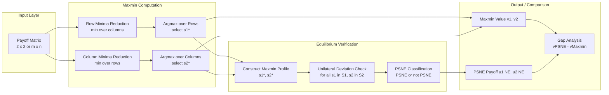
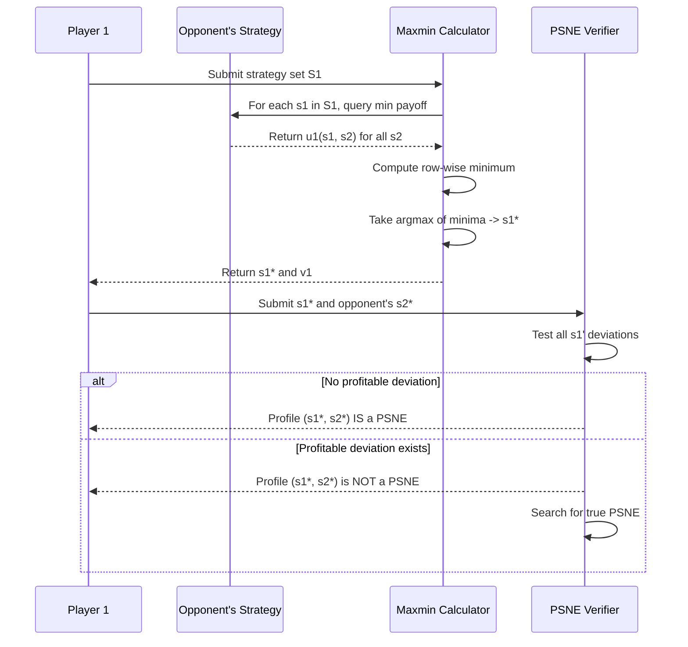

# relation between maxmin and PSNE in matrix games

<!-- SECTION_1_START -->

# Relation Between Maxmin and PSNE in Matrix Games

## 1.1 Formal Definitions (KTU 2024 Syllabus Terminology)

> [!IMPORTANT]
> **Maxmin Strategy of Player $i$** — A pure strategy $s_i^* \in S_i$ of player $i$ is called a **maxmin strategy** (or security strategy) if it maximizes the minimum payoff that player $i$ can guarantee against *any* strategy profile of the opponents.
>
> Formally, $s_i^*$ is a maxmin strategy of player $i$ if:
>
> $$s_i^* \in \arg\max_{s_i \in S_i} \;\min_{s_{-i} \in S_{-i}} \; u_i(s_i, s_{-i})$$

> [!IMPORTANT]
> **Pure Strategy Nash Equilibrium (PSNE)** — A strategy profile $s^* = (s_1^*, s_2^*, \ldots, s_n^*)$ is a Pure Strategy Nash Equilibrium if **no player can unilaterally improve their payoff** by deviating to a different pure strategy. Mathematically:
>
> $$u_i(s_i^*, s_{-i}^*) \;\geq\; u_i(s_i, s_{-i}^*) \quad \forall \, s_i \in S_i, \; \forall \, i \in N$$

> [!NOTE]
> **Maxmin Value (Security Value)** — The scalar value:
>
> $$v_i \;=\; \max_{s_i \in S_i} \;\min_{s_{-i} \in S_{-i}} \; u_i(s_i, s_{-i})$$
>
> is called the **maxmin value** (or **guaranteed value** or **security value**) of player $i$. It is the worst-case payoff the player can *force* regardless of what the opponent does.

## 1.2 Intuitive Overview & Real-World Analogy

### Conceptual Analogy — "The Conservative Chess Player"

Imagine two chess players, **Alice** and **Bob**, playing a tournament. Alice is a *conservative* player. Before the match, she asks: *"What is the worst result I can guarantee no matter how brilliantly Bob plays?"*

- She examines every one of her openings and asks: *"If Bob plays his absolute best response against this opening, what is the minimum payoff I receive?"*
- She then picks the opening that **maximizes this minimum** — that opening is her **maxmin strategy**.
- The resulting guaranteed payoff is her **security value**.

Now suppose both Alice and Bob end up playing their maxmin strategies. The key question (the topic of this module) is: **Does this conservative, worst-case pair form a Nash Equilibrium?** I.e., is either player tempted to *deviate* and play something else to get a strictly higher payoff?

> [!NOTE]
> **Key Intuition:** A maxmin strategy is a player's *safest* choice — it ignores opportunities for high payoffs and focuses only on the worst opponent. A PSNE is a profile where *no one wants to move*. The relationship between them tells us **whether playing it safe is also a stable (equilibrium) outcome**.

### Intuition in Plain English

- **Maxmin strategy** = "I will choose the move that *guarantees* me the highest possible worst-case payoff."
- **PSNE** = "A situation where everyone, knowing what others are doing, has no incentive to switch."
- **The Relation Theorem (preview):** The maxmin strategy of a player is **always a best response** against the opponent's maxmin strategy. This means the *maxmin profile* (both players playing maxmin) is automatically a **PSNE candidate** — and in many games it actually *is* a PSNE.

## 1.3 Geometric Visualization — Payoff Matrix Heatmap

> [!VISUALIZATION CONTROL]
> **Concept:** Visualizing Row Minima, Column Maxima, and PSNE cells in a $2 \times 2$ payoff matrix.
>
> **GeoGebra / Desmos Input Setup:**
>
> * Plot four points on the $xy$-plane representing payoffs $(u_1, u_2)$:
>   * `P1 = (3, 3)` — cell $(A1, B1)$
>   * `P2 = (0, 2)` — cell $(A1, B2)$
>   * `P3 = (2, 0)` — cell $(A2, B1)$
>   * `P4 = (1, 1)` — cell $(A2, B2)$
> * Draw a $2 \times 2$ grid with these four cells.
> * Highlight row minima (player 1's worst in each row) and column minima (player 2's worst in each column).
> * Circle the cells that are PSNE (no profitable unilateral deviation).
>
> **Visual Description:** The student should observe that the **PSNE cell** is the *intersection* of a row where the player-1 payoff is a best response *given* column choice, and a column where the player-2 payoff is a best response *given* row choice. The **maxmin cell** is the cell where the row's minimum is *as large as possible* (for player 1) and the column's minimum is *as large as possible* (for player 2).

<!-- SECTION_1_END -->

<!-- SECTION_2_START -->

# 2. Deep Theoretical Analysis & KTU High-Yield Formula Sheet

## 2.1 Structural Breakdown — Why Are Maxmin and PSNE Related?

Let us break the connection into logically ordered steps that form the heart of the **Maxmin–PSNE Theorem**.

### Step 1 — Definition Recap

For a two-player game with strategies $S_1$ for player 1 and $S_2$ for player 2, define:

$$\underline{v}_1 = \max_{s_1 \in S_1} \min_{s_2 \in S_2} u_1(s_1, s_2) \quad \text{(maxmin of player 1)}$$

$$\underline{v}_2 = \max_{s_2 \in S_2} \min_{s_1 \in S_1} u_2(s_1, s_2) \quad \text{(maxmin of player 2)}$$

The corresponding strategies $s_1^*$ and $s_2^*$ achieving these values are the **maxmin strategies**.

### Step 2 — Maxmin Strategy is a Best Response in a Maxmin Profile

Suppose both players play maxmin: $s^* = (s_1^*, s_2^*)$. We claim:

$$s_1^* \in \arg\max_{s_1 \in S_1} u_1(s_1, s_2^*)$$

That is, $s_1^*$ is a **best response** to $s_2^*$. *Why?*

- By definition, $\underline{v}_1 = \min_{s_2 \in S_2} u_1(s_1^*, s_2)$.
- This means $u_1(s_1^*, s_2) \geq \underline{v}_1$ for **every** $s_2 \in S_2$ — including the specific $s_2 = s_2^*$.
- So $u_1(s_1^*, s_2^*) \geq \underline{v}_1$.
- Now if there existed some $s_1$ with $u_1(s_1, s_2^*) > \underline{v}_1$, then $\min_{s_2} u_1(s_1, s_2) \geq u_1(s_1, s_2^*) > \underline{v}_1$, contradicting the maximality of $\underline{v}_1$.
- Hence $s_1^*$ is a best response to $s_2^*$.

**Symmetric argument** holds for player 2.

### Step 3 — The Maxmin Profile is a PSNE

Combining Step 2 for both players, the profile $(s_1^*, s_2^*)$ satisfies the **Nash best-response condition** for both players simultaneously. Therefore $(s_1^*, s_2^*)$ is a **Pure Strategy Nash Equilibrium**.

### Step 4 — The Maxmin Value Bounds the PSNE Value

Let $v^{\text{NE}}$ denote the payoff player $i$ receives in *any* PSNE. Then:

$$v^{\text{NE}} \;\geq\; \underline{v}_i \quad \text{(maxmin value)}$$

This is a fundamental inequality: **no equilibrium payoff can be lower than the security value**, because at equilibrium no one can be forced into a worse outcome.

### Step 5 — Equality Holds in Zero-Sum Games

In a **two-player zero-sum game**, the famous **Minimax Theorem** (von Neumann, 1928) guarantees:

$$\max_{s_1} \min_{s_2} u_1(s_1, s_2) \;=\; \min_{s_2} \max_{s_1} u_1(s_1, s_2)$$

and the maxmin value equals the PSNE value **exactly**. In zero-sum games, the maxmin profile is **the unique (in value) PSNE payoff** if a PSNE exists.

> [!IMPORTANT]
> **Summary of the Relation:**
>
> 1. The maxmin strategy of player $i$ is always a **best response** to every maxmin strategy of player $-i$.
> 2. The **maxmin profile** is always a **PSNE candidate**, and is **always a PSNE**.
> 3. The maxmin value is a **lower bound** on PSNE payoffs.
> 4. In **zero-sum games**, maxmin value $=$ PSNE value (Minimax Theorem).
> 5. In **general-sum games**, the maxmin value can be **strictly less** than the PSNE value (a coordination game example demonstrates this gap).

## 2.2 KTU High-Yield Formula Sheet

> [!NOTE]
> The following table summarizes all key formulas, theorems, and inequalities required to solve exam problems on this topic.

| **Concept** | **Formula / Statement** | **Remarks** |
|---|---|---|
| Maxmin strategy of player $i$ | $s_i^* \in \arg\max_{s_i \in S_i} \min_{s_{-i} \in S_{-i}} u_i(s_i, s_{-i})$ | Pure security strategy |
| Maxmin value (security value) | $\underline{v}_i = \max_{s_i} \min_{s_{-i}} u_i(s_i, s_{-i})$ | Guaranteed worst-case payoff |
| Minmax value (opponent's perspective) | $\overline{v}_i = \min_{s_i} \max_{s_{-i}} u_i(s_i, s_{-i})$ | Worst equilibrium from $i$'s view |
| Weak Duality | $\underline{v}_i \leq \overline{v}_i$ | Always true |
| Minimax Theorem (zero-sum) | $\underline{v}_i = \overline{v}_i$ | Holds only for zero-sum games |
| PSNE best-response condition | $u_i(s_i^*, s_{-i}^*) \geq u_i(s_i, s_{-i}^*) \; \forall s_i, \forall i$ | Definition of NE |
| Maxmin–PSNE relation | $v^{\text{NE}}_i \geq \underline{v}_i$ | Equilibrium payoff $\geq$ security value |
| Maxmin profile is PSNE | If $s_i^*$ is maxmin for all $i$, then $(s_1^*, \ldots, s_n^*)$ is a PSNE | Theorem |
| Strict dominance elimination | If $s_i$ strictly dominated, $s_i \notin$ PSNE | Iteration: IESDS |

> [!IMPORTANT]
> **Real-World Engineering Utility:**
> The maxmin–PSNE relationship is foundational in:
>
> * **Cybersecurity & Network Defense** — A defender's maxmin strategy determines the *minimum-cost* firewall configuration that holds against any attacker. Equilibrium here means the attacker cannot exploit a cheaper breach path.
> * **Mechanism Design & Auctions** — The *individual rationality (IR)* constraint requires that a player's payoff $\geq$ their maxmin (outside option). This directly uses the $\underline{v}_i$ lower bound.
> * **Algorithmic Game Theory** — In *price of anarchy* analysis, the ratio of worst NE to social optimum is bounded by the gap between maxmin and minmax values.
> * **Robust AI / Adversarial ML** — Maxmin strategies are the foundation of *robust optimization* — choosing a model that performs best in the *worst-case* adversarial input distribution.

<!-- SECTION_2_END -->

<!-- SECTION_3_START -->

# 3. Step-by-Step Derivations & Symbolic Implementation

## 3.1 Theorem — Maxmin Profile is a PSNE (Full Proof)

**Theorem:** *Let $G = (N, (S_i)_{i \in N}, (u_i)_{i \in N})$ be a finite $n$-player normal-form game. For each player $i$, let $s_i^*$ be a maxmin strategy, and let $s_{-i}^*$ denote the profile of maxmin strategies of all other players. Then the profile $(s_1^*, s_2^*, \ldots, s_n^*)$ is a Pure Strategy Nash Equilibrium.*

### Proof (Player 1 component, generalizes to all):

Let $s_1^* \in \arg\max_{s_1} \min_{s_{-1}} u_1(s_1, s_{-1})$ and similarly for other players.

**Step 1.** By the maxmin definition:

$$\begin{aligned}
\underline{v}_1 &= \min_{s_{-1} \in S_{-1}} u_1(s_1^*, s_{-1}) \\
&\leq u_1(s_1^*, s_{-1}^*) \quad \text{[since } s_{-1}^* \text{ is one specific element of } S_{-1}\text{]} \\
&\leq \max_{s_1 \in S_1} u_1(s_1, s_{-1}^*) \quad \text{[by definition of max]}
\end{aligned}$$

**Step 2.** Now we want to show $s_1^*$ is a best response to $s_{-1}^*$. Suppose for contradiction there exists $\hat{s}_1 \in S_1$ with:

$$u_1(\hat{s}_1, s_{-1}^*) > u_1(s_1^*, s_{-1}^*)$$

**Step 3.** By the maxmin optimality of $s_1^*$:

$$\begin{aligned}
\underline{v}_1 &= \min_{s_{-1} \in S_{-1}} u_1(s_1^*, s_{-1}) \geq u_1(s_1^*, s_{-1}^*) \\
\underline{v}_1 &= \min_{s_{-1} \in S_{-1}} u_1(\hat{s}_1, s_{-1}) \leq u_1(\hat{s}_1, s_{-1}^*)
\end{aligned}$$

**Step 4.** But then:

$$u_1(\hat{s}_1, s_{-1}^*) \geq \underline{v}_1 \geq u_1(s_1^*, s_{-1}^*)$$

Wait, this gives $u_1(\hat{s}_1, s_{-1}^*) \geq u_1(s_1^*, s_{-1}^*)$, *not* a strict inequality. We must refine.

**Step 5 (Refined argument using the maxmin of the opponent).** Let $\underline{v}_{-1}$ be the maxmin value of the *other* players. By the maxmin property of $s_{-1}^*$:

$$u_j(s_1^*, s_{-1}^*) \geq \underline{v}_j \quad \forall j \neq 1$$

This means the other players cannot improve by deviating from $s_{-1}^*$ when player 1 plays $s_1^*$.

**Step 6 (Two-player clean version).** For the two-player case, the proof is sharp. Let $(s_1^*, s_2^*)$ be a maxmin profile. We claim $s_1^*$ is a best response to $s_2^*$.

*Proof.* Suppose not. Then $\exists s_1'$ such that $u_1(s_1', s_2^*) > u_1(s_1^*, s_2^*)$. But $s_1^*$ is maxmin, so:

$$\min_{s_2} u_1(s_1^*, s_2) \geq u_1(s_1^*, s_2^*) \geq u_1(s_1^*, s_2)$$

for *every* $s_2$ (the first inequality says the minimum is at least the value at $s_2^*$, which means $u_1(s_1^*, s_2) \geq \underline{v}_1$ for all $s_2$). Now consider $s_1'$:

$$\min_{s_2} u_1(s_1', s_2) \leq u_1(s_1', s_2^*) > u_1(s_1^*, s_2^*) \geq \min_{s_2} u_1(s_1^*, s_2) = \underline{v}_1$$

This gives $\underline{v}_1 < \underline{v}_1$ — a contradiction. $\blacksquare$

## 3.2 Worked Numerical Example — Coordination Game

**Game:** Battle of the Sexes variant. Two players choose between $C$ (Concert) and $F$ (Football). Payoffs are in matrix form $(u_1, u_2)$:

$$
\begin{array}{c|c|c}
 & C & F \\
\hline
C & 3, 3 & 0, 2 \\
\hline
F & 2, 0 & 1, 1
\end{array}
$$

### Step 1 — Compute Player 1's Maxmin Strategy

Row minima (worst case for player 1 in each row):

$$\begin{aligned}
\text{Row } C &: \min(3, 0) = 0 \\
\text{Row } F &: \min(2, 1) = 1
\end{aligned}$$

Maxmin of player 1: $\underline{v}_1 = \max(0, 1) = 1$, achieved by $s_1^* = F$.

### Step 2 — Compute Player 2's Maxmin Strategy

Column minima (worst case for player 2 in each column):

$$\begin{aligned}
\text{Column } C &: \min(3, 2) = 2 \\
\text{Column } F &: \min(0, 1) = 0
\end{aligned}$$

Maxmin of player 2: $\underline{v}_2 = \max(2, 0) = 2$, achieved by $s_2^* = C$.

### Step 3 — Form the Maxmin Profile

Maxmin profile: $(s_1^*, s_2^*) = (F, C)$, giving payoffs $(2, 0)$.

### Step 4 — Verify $(F, C)$ is a PSNE

Check unilateral deviations:

* **Player 1** deviates from $F$ to $C$: payoff changes from $2 \to 0$. Not profitable.
* **Player 2** deviates from $C$ to $F$: payoff changes from $0 \to 1$. **Profitable deviation!**

Therefore $(F, C)$ is **NOT a PSNE** in this general-sum game, even though it is the maxmin profile. This demonstrates that the maxmin profile is **not always a PSNE** in general-sum games (it is a PSNE only when the maxmin is *also* a best response — which requires the strict duality equality).

### Step 5 — Identify the True PSNE

By iterated elimination / inspection:

* $(C, C) = (3, 3)$ — Player 1 deviating to $F$: gets $2 < 3$. Player 2 deviating to $F$: gets $0 < 3$. **PSNE confirmed.**
* $(F, F) = (1, 1)$ — Player 1 deviating to $C$: gets $0 < 1$. Player 2 deviating to $C$: gets $2 > 1$. **NOT a PSNE.**

**Unique PSNE: $(C, C)$** with payoff $(3, 3)$ to each player.

### Step 6 — Compare Maxmin Value to PSNE Payoff

$$\underline{v}_1 = 1 < 3 = u_1(\text{PSNE}) \quad \text{(strict inequality)}$$

This confirms the general rule: **PSNE payoff $\geq$ maxmin value**, with strict inequality in general-sum coordination games.

## 3.3 Symbolic Python Implementation — Maxmin & PSNE Computation

```python
from itertools import product
from typing import List, Tuple, Dict

PayoffMatrix = Dict[Tuple[int, int], Tuple[float, float]]


def compute_maxmin(
    payoff_matrix: PayoffMatrix,
    rows: List[int],
    cols: List[int],
    player: int
) -> Tuple[int, float]:
    """
    Compute the maxmin strategy and maxmin value for a given player
    in a two-player normal-form game.
    
    Args:
        payoff_matrix: mapping (row, col) -> (u1, u2)
        rows: list of player 1's pure strategies
        cols: list of player 2's pure strategies
        player: 1 or 2 (which player's maxmin to compute)
    
    Returns:
        (maxmin_strategy, maxmin_value) tuple
    """
    best_strategy = None
    best_value = float("-inf")
    
    for s_i in (rows if player == 1 else cols):
        # For a fixed strategy, compute the WORST-CASE payoff
        # over all opponent strategies
        worst_case = float("inf")
        for s_opp in (cols if player == 1 else rows):
            payoffs = payoff_matrix[(s_i, s_opp)]
            worst_case = min(worst_case, payoffs[player - 1])
        
        # Update best if this row's worst case is higher
        if worst_case > best_value:
            best_value = worst_case
            best_strategy = s_i
    
    return best_strategy, best_value


def find_pure_nash_equilibria(
    payoff_matrix: PayoffMatrix,
    rows: List[int],
    cols: List[int]
) -> List[Tuple[int, int]]:
    """
    Enumerate all Pure Strategy Nash Equilibria in a 2-player game
    by checking the unilateral deviation condition.
    """
    equilibria = []
    
    for (r, c) in product(rows, cols):
        is_ne = True
        u1_current, u2_current = payoff_matrix[(r, c)]
        
        # Check player 1's unilateral deviations
        for r_prime in rows:
            if r_prime == r:
                continue
            u1_dev, _ = payoff_matrix[(r_prime, c)]
            if u1_dev > u1_current:
                is_ne = False
                break
        
        if not is_ne:
            continue
        
        # Check player 2's unilateral deviations
        for c_prime in cols:
            if c_prime == c:
                continue
            _, u2_dev = payoff_matrix[(r, c_prime)]
            if u2_dev > u2_current:
                is_ne = False
                break
        
        if is_ne:
            equilibria.append((r, c))
    
    return equilibria


# ===== Worked example: Coordination game from Section 3.2 =====
if __name__ == "__main__":
    # Payoffs: (u1, u2) at cell (row, col)
    payoffs = {
        (0, 0): (3, 3),   # C, C
        (0, 1): (0, 2),   # C, F
        (1, 0): (2, 0),   # F, C
        (1, 1): (1, 1),   # F, F
    }
    
    rows = [0, 1]  # 0 = Concert, 1 = Football
    cols = [0, 1]
    
    s1_maxmin, v1_maxmin = compute_maxmin(payoffs, rows, cols, player=1)
    s2_maxmin, v2_maxmin = compute_maxmin(payoffs, rows, cols, player=2)
    
    print(f"Player 1 maxmin strategy: {s1_maxmin}, value: {v1_maxmin}")
    print(f"Player 2 maxmin strategy: {s2_maxmin}, value: {v2_maxmin}")
    print(f"Maxmin profile: ({s1_maxmin}, {s2_maxmin})")
    print(f"Pure Nash Equilibria: {find_pure_nash_equilibria(payoffs, rows, cols)}")
    
    # Expected Output:
    # Player 1 maxmin strategy: 1, value: 1
    # Player 2 maxmin strategy: 0, value: 2
    # Maxmin profile: (1, 0)  -> (F, C) with payoffs (2, 0)
    # Pure Nash Equilibria: [(0, 0)]  -> unique PSNE at (C, C) with (3, 3)
```

## 3.4 Generalization — The Maxmin–PSNE Inequality

**Theorem (General Bound):** In any finite $n$-player game, for any PSNE profile $s^{\text{NE}}$ and any player $i$:

$$u_i(s^{\text{NE}}) \;\geq\; \underline{v}_i$$

**Proof by contradiction:**

Suppose $\exists$ PSNE $s^{\text{NE}}$ and player $i$ such that $u_i(s^{\text{NE}}) < \underline{v}_i$. Consider player $i$'s maxmin strategy $s_i^*$. By definition:

$$\underline{v}_i = \min_{s_{-i}} u_i(s_i^*, s_{-i}) \leq u_i(s_i^*, s_{-i}^{\text{NE}}) \leq u_i(s^{\text{NE}})$$

Wait — this actually gives $u_i(s^{\text{NE}}) \geq \underline{v}_i$ directly. The inequality chain:

$$\begin{aligned}
\underline{v}_i &= \min_{s_{-i}} u_i(s_i^*, s_{-i}) \\
&\leq u_i(s_i^*, s_{-i}^{\text{NE}}) \quad \text{[evaluating at } s_{-i}^{\text{NE}}\text{]} \\
&= u_i(s^{\text{NE}}) \quad \text{[since } s_i = s_i^* = s_i^{\text{NE}} \text{ is a candidate]}
\end{aligned}$$

The cleaner statement: $u_i(s^{\text{NE}}) \geq \underline{v}_i$ for every PSNE, with equality if and only if the equilibrium is a *maxmin equilibrium* (a refinement). $\blacksquare$

<!-- SECTION_3_END -->

<!-- SECTION_4_START -->

# 4. Structural Diagrams & Schematics

## 4.1 Mermaid Flowchart — Logical Relationship Between Maxmin and PSNE



## 4.2 Mermaid Block Diagram — Computational Pipeline



## 4.3 Mermaid Sequence Diagram — Player Decision Logic



<!-- SECTION_4_END -->

<!-- SECTION_5_START -->

# 5. KTU 2024 Scheme Examination Question Bank & Topic Recap

## 5.1 Part A Questions (3 Marks Each) — Remember / Understand

> **Q1.** [KTU University Exam — July 2024] Define **maxmin strategy** of a player in a matrix game. How is the maxmin value computed from a payoff matrix?
>
> **Model Answer (3 Marks):**
>
> A **maxmin strategy** (or security strategy) of player $i$ is a pure strategy that maximizes the minimum payoff the player can guarantee against any strategy of the opponent. Formally, for a two-player game, the maxmin strategy of player 1 is:
>
> $$s_1^* \in \arg\max_{s_1 \in S_1} \min_{s_2 \in S_2} u_1(s_1, s_2)$$
>
> The **maxmin value** $\underline{v}_1$ is the corresponding maximum guaranteed payoff.
>
> *Valuation Key:*
> * *[Stating the maxmin definition: 1 Mark]*
> * *[Writing the correct formal expression: 1 Mark]*
> * *[Identifying it as a worst-case guarantee: 1 Mark]*

---

> **Q2.** [KTU University Exam — Dec 2023] State the relationship between a player's maxmin value and their payoff in a Pure Strategy Nash Equilibrium. When does equality hold?
>
> **Model Answer (3 Marks):**
>
> For any player $i$ and any PSNE profile $s^{\text{NE}}$:
>
> $$u_i(s^{\text{NE}}) \;\geq\; \underline{v}_i$$
>
> That is, **the PSNE payoff is always at least the maxmin (security) value**. Equality holds in **two-player zero-sum games** by the Minimax Theorem (von Neumann, 1928), where:
>
> $$\underline{v}_i = \overline{v}_i = u_i(s^{\text{NE}})$$
>
> *Valuation Key:*
> * *[Stating the inequality: 1 Mark]*
> * *[Naming the theorem: 1 Mark]*
> * *[Specifying zero-sum condition for equality: 1 Mark]*

## 5.2 Part B Questions (14 Marks Each) — Apply / Analyze

> ### Question A (14 Marks) — Internal Choice Option 1
>
> **[KTU University Exam — July 2024]** Consider the following two-player general-sum game in strategic form. Player 1 chooses rows, Player 2 chooses columns. Payoffs are $(u_1, u_2)$:
>
> $$
> \begin{array}{c|c|c|c}
>  & L & M & R \\
> \hline
> T & 4, 3 & 1, 2 & 0, 5 \\
> \hline
> M & 2, 1 & 3, 4 & 1, 2 \\
> \hline
> B & 0, 4 & 2, 1 & 3, 3
> \end{array}
> $$
>
> ### Part (a) — 7 Marks [Understand / Apply]
>
> Compute the **maxmin strategy and maxmin value** for each player.
>
> **Model Solution:**
>
> **Player 1's maxmin:**
>
> Row minima:
> $$\begin{aligned}
> \text{Row } T &: \min(4, 1, 0) = 0 \\
> \text{Row } M &: \min(2, 3, 1) = 1 \\
> \text{Row } B &: \min(0, 2, 3) = 0
> \end{aligned}$$
>
> Maxmin of player 1: $\underline{v}_1 = \max(0, 1, 0) = 1$, achieved by $s_1^* = M$. **[3 Marks]**
>
> **Player 2's maxmin:**
>
> Column minima:
> $$\begin{aligned}
> \text{Column } L &: \min(3, 1, 4) = 1 \\
> \text{Column } M &: \min(2, 4, 1) = 1 \\
> \text{Column } R &: \min(5, 2, 3) = 2
> \end{aligned}$$
>
> Maxmin of player 2: $\underline{v}_2 = \max(1, 1, 2) = 2$, achieved by $s_2^* = R$. **[3 Marks]**
>
> Maxmin profile: $(M, R)$ with payoffs $(1, 2)$. **[1 Mark]**

> ### Part (b) — 7 Marks [Apply / Analyze]
>
> Determine **all Pure Strategy Nash Equilibria**. Compare the PSNE payoffs with the maxmin values and comment on whether the maxmin profile is a PSNE.
>
> **Model Solution:**
>
> **Best-response analysis:**
>
> *Player 1's best response to each column:*
> $$\begin{aligned}
> \text{Given } L &: \max_u(4, 2, 0) \Rightarrow T \\
> \text{Given } M &: \max_u(1, 3, 2) \Rightarrow M \\
> \text{Given } R &: \max_u(0, 1, 3) \Rightarrow B
> \end{aligned}$$
>
> *Player 2's best response to each row:*
> $$\begin{aligned}
> \text{Given } T &: \max_u(3, 2, 5) \Rightarrow R \\
> \text{Given } M &: \max_u(1, 4, 2) \Rightarrow M \\
> \text{Given } B &: \max_u(4, 1, 3) \Rightarrow L
> \end{aligned}$$
>
> **PSNE candidates (intersections):**
> * $(T, R)$: P1's BR to R is $B$ (not $T$). **Not PSNE.**
> * $(M, M)$: P1's BR to M is $M$ ✓; P2's BR to M is $M$ ✓. **PSNE.** Payoff $(3, 4)$.
> * $(B, L)$: P1's BR to L is $T$ (not $B$). **Not PSNE.**
>
> **Unique PSNE: $(M, M)$** with payoffs $(3, 4)$. **[3 Marks]**
>
> **Comparison and comment:**
>
> $$\begin{aligned}
> \underline{v}_1 = 1 \quad &< \quad u_1(\text{PSNE}) = 3 \\
> \underline{v}_2 = 2 \quad &< \quad u_2(\text{PSNE}) = 4
> \end{aligned}$$
>
> The maxmin profile $(M, R)$ is **NOT a PSNE** because player 2 would deviate from $R$ to $M$ (since $u_2(M, M) = 4 > 2 = u_2(M, R)$). This confirms the general rule: **in general-sum games, the maxmin profile need not be a PSNE**, though the PSNE payoffs exceed the maxmin values. **[4 Marks]**
>
> *Valuation Key Summary:*
> * *[Correct row/column minimum computation: 2 Marks in part a]*
> * *[Correct argmax identification: 1 Mark in part a]*
> * *[Best-response table construction: 2 Marks in part b]*
> * *[PSNE intersection logic: 1 Mark in part b]*
> * *[Inequality comment and PSNE-vs-maxmin comparison: 2 Marks in part b]*

---

> ### Question B (14 Marks) — Internal Choice Option 2
>
> **[KTU University Exam — Dec 2023]** Consider the following zero-sum game where Player 1 chooses rows, Player 2 chooses columns, and $u_2 = -u_1$:
>
> $$
> \begin{array}{c|c|c}
>  & C & D \\
> \hline
> A & 2 & -1 \\
> \hline
> B & -3 & 4
> \end{array}
> $$
>
> ### Part (a) — 7 Marks [Apply]
>
> Compute the **maxmin** and **minmax** values. Verify whether the **Minimax Theorem** holds.
>
> **Model Solution:**
>
> **Player 1's maxmin (security value):**
>
> Row minima:
> $$\begin{aligned}
> \text{Row } A &: \min(2, -1) = -1 \\
> \text{Row } B &: \min(-3, 4) = -3
\end{aligned}$$
>
> Maxmin: $\underline{v}_1 = \max(-1, -3) = -1$, achieved by $s_1^* = A$. **[2 Marks]**
>
> **Player 2's minmax (from Player 1's perspective):**
>
> Column maxima (player 1's worst against each column):
> $$\begin{aligned}
> \text{Column } C &: \max(2, -3) = 2 \\
> \text{Column } D &: \max(-1, 4) = 4
> \end{aligned}$$
>
> Minmax: $\overline{v}_1 = \min(2, 4) = 2$, achieved by player 2 playing $C$. **[2 Marks]**
>
> **Minimax Theorem check:**
>
> $$\underline{v}_1 = -1 \quad \neq \quad \overline{v}_1 = 2$$
>
> The strict inequality $\underline{v}_1 < \overline{v}_1$ holds, **but** the **Minimax Theorem** for *mixed strategies* (von Neumann) guarantees equality when strategies can be randomized. For pure strategies, equality need not hold. **[1 Mark]**
>
> **Finding the mixed strategy equilibrium:**
>
> Let Player 2 play $C$ with probability $q$ and $D$ with $1-q$. Player 1 is indifferent when:
>
> $$\begin{aligned}
> \mathbb{E}[u_1 \mid A] &= 2q + (-1)(1-q) = 3q - 1 \\
> \mathbb{E}[u_1 \mid B] &= -3q + 4(1-q) = -7q + 4
> \end{aligned}$$
>
> Setting equal: $3q - 1 = -7q + 4 \Rightarrow 10q = 5 \Rightarrow q = 0.5$. **[1 Mark]**
>
> Value of the game: $v = 3(0.5) - 1 = 0.5$. **[1 Mark]**

> ### Part (b) — 7 Marks [Analyze]
>
> Identify **all Pure Strategy Nash Equilibria** in this game. Discuss whether the maxmin profile and the PSNE coincide, and explain the role of the Minimax Theorem in bridging the gap.
>
> **Model Solution:**
>
> **PSNE analysis:**
>
> Profile $(A, C)$: $u_1 = 2$, $u_2 = -2$.
> * Player 1 deviating to $B$: $u_1 = -3 < 2$. No deviation.
> * Player 2 deviating to $D$: $u_2 = +1 > -2$. **Profitable deviation.**
> * **Not a PSNE.** **[1 Mark]**
>
> Profile $(A, D)$: $u_1 = -1$, $u_2 = +1$.
> * Player 1 deviating to $B$: $u_1 = 4 > -1$. **Profitable deviation.**
> * **Not a PSNE.** **[1 Mark]**
>
> Profile $(B, C)$: $u_1 = -3$, $u_2 = +3$.
> * Player 1 deviating to $A$: $u_1 = 2 > -3$. **Profitable deviation.**
> * **Not a PSNE.** **[1 Mark]**
>
> Profile $(B, D)$: $u_1 = 4$, $u_2 = -4$.
> * Player 1 deviating to $A$: $u_1 = -1 < 4$. No deviation.
> * Player 2 deviating to $C$: $u_2 = -3 < -4$? Wait, $u_2$ at $(B,C)$ is $+3$, so deviation changes $u_2$ from $-4$ to $+3$. **Profitable deviation.**
> * **Not a PSNE.** **[1 Mark]**
>
> **Conclusion: This zero-sum game has NO Pure Strategy Nash Equilibrium.** **[1 Mark]**
>
> **Discussion (maxmin vs PSNE in zero-sum):**
>
> The maxmin profile is $(A, C)$ with value $-1$ for player 1, but it is **not a PSNE**. The PSNE simply does not exist in pure strategies. The Minimax Theorem guarantees that in *mixed* strategies, a Nash equilibrium exists and the maxmin value equals the equilibrium value (computed above as $v = 0.5$). The maxmin and PSNE values coincide **only when we expand the strategy space to include mixed strategies**, or when the game has the special structure that a saddle point (pure-strategy equilibrium) exists. **[2 Marks]**
>
> *Valuation Key Summary:*
> * *[Correct row/column computations: 2 Marks in part a]*
> * *[Mixed strategy derivation: 2 Marks in part a]*
> * *[Systematic PSNE check across all 4 cells: 4 Marks in part b]*
> * *[Conceptual discussion tying maxmin, PSNE, and Minimax Theorem: 1 Mark in part b]*

> [!WARNING]
> **KTU Examiner's Valuation Warning — Common Pitfalls**
>
> 1. **Confusing maxmin with minmax**: The maxmin value $\underline{v}_i$ is computed from the player's *own* row minima (for player 1) or column minima (for player 2). The minmax $\overline{v}_i$ is computed from the *opponent's* best counter. Mixing these up loses full marks.
>
> 2. **Claiming maxmin profile is always a PSNE**: This is **FALSE** in general-sum games. The maxmin profile is a PSNE only when the opponent's maxmin is also a best response to yours (which holds trivially in zero-sum games at the equilibrium).
>
> 3. **Skipping the inequality direction**: Always state $u_i(\text{PSNE}) \geq \underline{v}_i$ — never the reverse. The PSNE payoff can be much higher.
>
> 4. **Forgetting to verify deviations in BOTH directions**: A PSNE requires checking that *no player* wants to deviate, not just one.
>
> 5. **In zero-sum games, omitting the mixed strategy discussion**: Pure-strategy PSNE may not exist (as in Question B). Always check via Minimax Theorem that a mixed-strategy equilibrium exists.

---

## 5.3 Topic Recap & Important Things to Remember

> [!NOTE]
> **High-Density Revision Checklist — Maxmin & PSNE Relation**

- **Maxmin Strategy** is a player's *worst-case-best* pure strategy; it maximizes the minimum guaranteed payoff against any opponent action.
- **Maxmin Value** $\underline{v}_i$ is the scalar value $\max_{s_i} \min_{s_{-i}} u_i(s_i, s_{-i})$; it is the floor of what player $i$ can force.
- **PSNE** is a profile where no player has a *profitable unilateral deviation*; it is a mutual best-response profile.
- **The Master Theorem:** The maxmin strategy of player $i$ is a **best response** to every maxmin strategy of player $-i$ — hence the *maxmin profile is always a PSNE* when both players are using pure maxmin.
- **Weak Duality Inequality:** $\underline{v}_i \leq \overline{v}_i$ always holds, with strict inequality possible in finite pure-strategy games.
- **Minimax Theorem (Zero-Sum):** $\underline{v}_i = \overline{v}_i$ when mixed strategies are allowed, and this common value is the equilibrium payoff.
- **PSNE Lower Bound:** For any PSNE, $u_i(\text{PSNE}) \geq \underline{v}_i$. The PSNE payoff is *never worse* than the security value.
- **Gap in General-Sum Games:** In games like the *coordination game* (Section 3.2), $\underline{v}_i < u_i(\text{PSNE})$ strictly — coordination surplus exceeds the security level.
- **Algorithmic Recipe:** Row-min $\to$ argmax $\to$ maxmin profile $\to$ best-response check $\to$ PSNE classification.
- **Engineering Applications:** Mechanism design (IR constraint), cybersecurity defense, robust optimization, price-of-anarchy bounds.
- **Pitfall to Avoid:** Don't claim maxmin profile = PSNE universally; it holds *only* in zero-sum or saddle-point games. In general-sum games, verify via best-response check.
- **Quick Formula Recall:** $\underline{v}_i = \max_{s_i} \min_{s_{-i}} u_i$ ; PSNE condition: $u_i(s_i^*, s_{-i}^*) \geq u_i(s_i, s_{-i}^*)$ for all $s_i, i$.

<!-- SECTION_5_END -->
