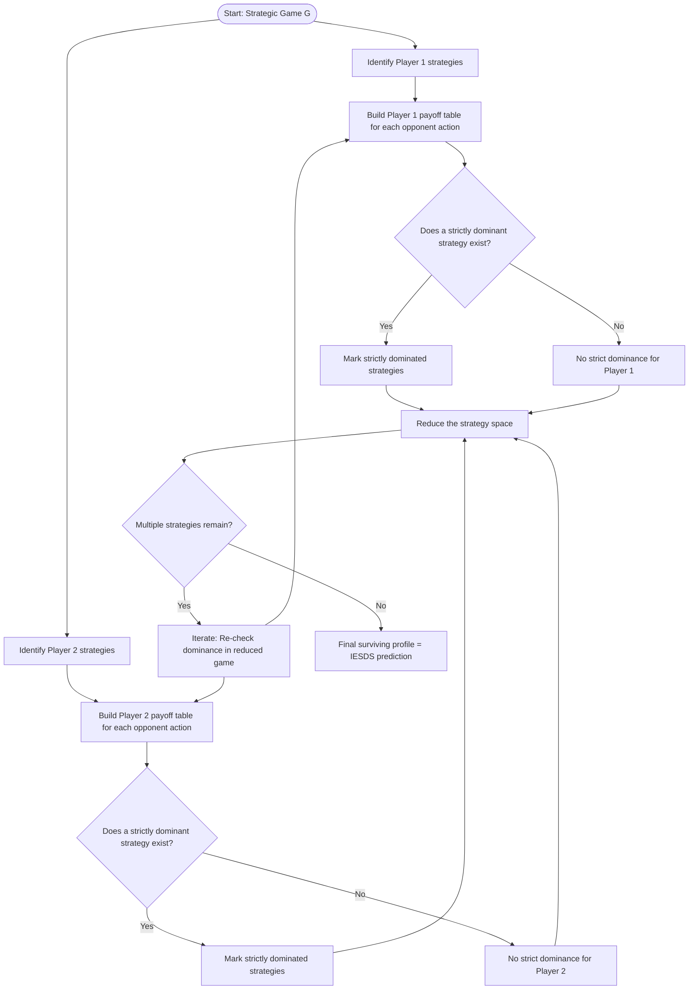
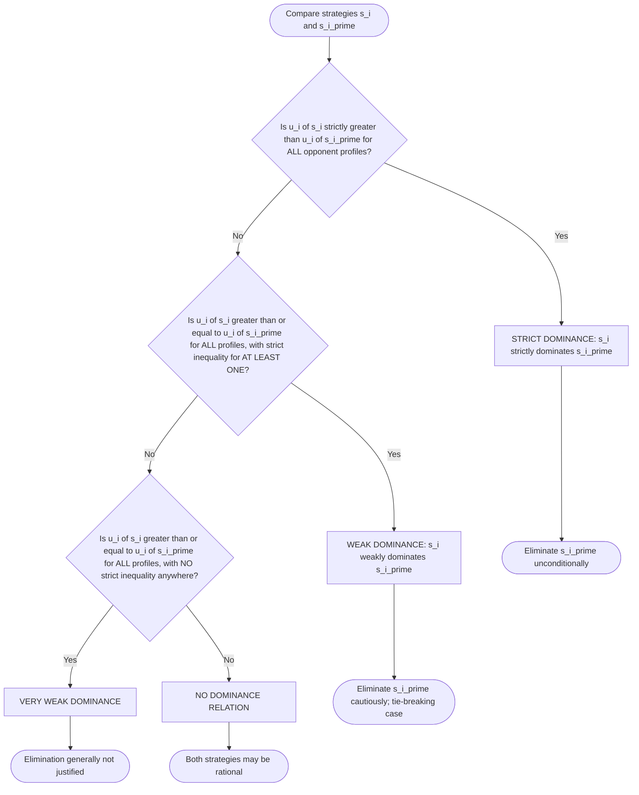
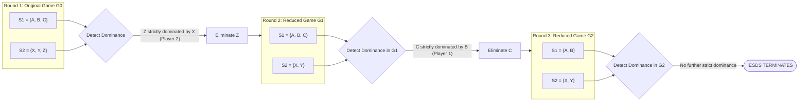
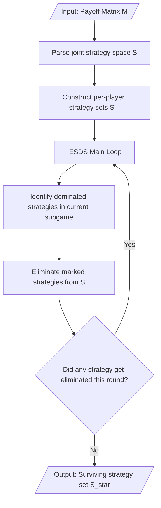

# Strategic Games - Dominance

<!-- SECTION_1_START -->
# Strategic Games & Dominance — Foundational Framework

## 1.1 Formal Definition: Strategic (Normal-Form) Game

A **strategic game** (also called a **normal-form game**) is a mathematical model of interactive decision-making in which each player's payoff depends not only on their own action, but also on the actions chosen by every other player. It is the canonical static, one-shot representation in non-cooperative game theory.

> [!IMPORTANT]
> **KTU 2024 Syllabus Definition (PECST753 / Module 1):**
> A strategic game $\Gamma = \langle N, (S_i)_{i \in N}, (u_i)_{i \in N} \rangle$ is an ordered triple consisting of:
> - A finite set of **players** $N = \{1, 2, \dots, n\}$
> - For each player $i \in N$, a set of **strategies (actions)** $S_i$
> - For each player $i \in N$, a **payoff (utility) function** $u_i : S \to \mathbb{R}$ defined on the joint strategy space $S = S_1 \times S_2 \times \cdots \times S_n$

> [!NOTE]
> **Payoff Convention:** Payoffs are listed in a tuple $(u_1, u_2, \dots, u_n)$ — the **first** number is Player 1's payoff, the **second** is Player 2's payoff, and so on. Reading the tuple in the wrong order is the single most common valuation error in KTU exam scripts.

## 1.2 The Three Pillars of Dominance

| Dominance Type | Intuitive Phrase | Strictness |
|---|---|---|
| **Strict Dominance** | "Strategy $A$ is *always* better than $B$ — no exceptions." | Strongest form |
| **Weak Dominance** | "Strategy $A$ is *at least as good* as $B$, and *sometimes better*." | Middle form |
| **Very Weak Dominance** | "Strategy $A$ is *never worse* than $B$ in any profile." | Weakest form |

## 1.3 Intuitive Overview — Plain English Analogy

> [!TIP]
> **Real-World Analogy — The Cafeteria Choice**
> Imagine you walk into a canteen every day. The menu has **Veg Thali** and **Non-Veg Thali**. Your colleague is buying lunch alongside you.
> - If the Non-Veg Thali is **strictly better tasting AND cheaper** than the Veg Thali on every single day of the month, then Non-Veg **strictly dominates** Veg. Rational you will never pick Veg.
> - If Non-Veg is *cheaper or equal* on every day, and *strictly better* on at least one day (say weekends), then Non-Veg **weakly dominates** Veg.
> - If Non-Veg is *never worse* than Veg but never clearly better either, then it **very weakly dominates** Veg.
>
> The strategic game formalises this: your "best menu choice" depends on what your colleague orders (their strategy), and the dominance relation tells you which menu items you can safely **eliminate from consideration** because they will *never* be optimal for you.

## 1.4 Geometric Intuition — The "No Regret" Region

> [!VISUALIZATION CONTROL]
> **Concept:** Best-Response Region in a 2-Player Continuous Game
> **GeoGebra / Desmos Input Equations:**
> * `u1(x, y) = -((x-3)^2) - ((y-4)^2)`  (Player 1's payoff hill, peak at x=3)
> * `u2(x, y) = -((x-1)^2) - ((y-2)^2)`  (Player 2's payoff hill, peak at x=1)
> **Visual Description:** Each player's payoff looks like a downward paraboloid (a "hill"). A strategy $s_i$ strictly dominates $s_i'$ if the hill of $s_i$ lies *entirely above* the hill of $s_i'$. The contour curves of the lower hill lie *inside* the region enclosed by the higher hill.

## 1.5 Why Dominance Matters in KTU Examinations

> [!IMPORTANT]
> **Syllabus Highlight (Module 1):** Dominance is the *gateway concept* to **Iterated Elimination of Strictly Dominated Strategies (IESDS)** and **Nash Equilibrium (Module 2)**. A KTU 14-mark question on this module almost always asks you to (a) identify dominant/dominated strategies and (b) iteratively eliminate them to predict the *unique rational outcome* of the game.
<!-- SECTION_1_END -->

<!-- SECTION_2_START -->
# Deep Theoretical Analysis & KTU High-Yield Formula Sheet

## 2.1 The Hierarchy of Dominance — Logical Decomposition

Let $S_{-i} = \prod_{j \neq i} S_j$ denote the set of all opponent action profiles. For a given player $i$, we compare two strategies $s_i, s_i' \in S_i$:

### 2.1.1 Strict Dominance ($s_i \succ s_i'$)
$$s_i \succ s_i' \iff u_i(s_i, s_{-i}) > u_i(s_i', s_{-i}) \quad \forall\, s_{-i} \in S_{-i}$$
- The inequality is **strict** at *every* opponent profile.
- $s_i$ is a **strictly dominant strategy**; $s_i'$ is **strictly dominated**.
- A player with a strictly dominant strategy should play it **unconditionally**, regardless of opponent beliefs.

### 2.1.2 Weak Dominance ($s_i \succeq_w s_i'$)
$$s_i \succeq_w s_i' \iff \big[\, u_i(s_i, s_{-i}) \geq u_i(s_i', s_{-i}) \quad \forall s_{-i}\,\big] \;\land\; \big[\, \exists\, s_{-i} : u_i(s_i, s_{-i}) > u_i(s_i', s_{-i})\,\big]$$
- $s_i$ is at least as good everywhere, and **strictly better somewhere**.
- The "tie" cases make elimination less justifiable — a weakly dominated strategy may be a **tie-breaking** choice (Harsanyi–Selten critique).

### 2.1.3 Very Weak Dominance ($s_i \succeq_{vw} s_i'$)
$$s_i \succeq_{vw} s_i' \iff u_i(s_i, s_{-i}) \geq u_i(s_i', s_{-i}) \quad \forall\, s_{-i} \in S_{-i}$$
- $s_i$ is never worse, but need not be better anywhere.
- This is the **weakest** domination — elimination is generally **not recommended** outside of proof contexts.

## 2.2 Best-Response Correspondence (The Conceptual Bridge)

> [!NOTE]
> Before applying dominance, you must understand the **best response**. It is the set of strategies that *maximise* a player's payoff given the opponent's fixed action.

$$BR_i(s_{-i}) = \arg\max_{s_i \in S_i}\, u_i(s_i, s_{-i})$$

- A **strictly dominant strategy** $s_i^*$ satisfies: $s_i^* \in BR_i(s_{-i})$ **for every** $s_{-i}$.
- A **strictly dominated strategy** $s_i'$ satisfies: $s_i' \notin BR_i(s_{-i})$ **for any** $s_{-i}$ (i.e., it is *never* a best response).

## 2.3 Iterated Elimination of Strictly Dominated Strategies (IESDS)

**The Algorithm (operational steps):**

1. **Step 1:** For each player, identify all strategies that are *strictly dominated*. Mark them.
2. **Step 2:** Remove (delete) the strictly dominated strategies from the game.
3. **Step 3:** Re-evaluate the *reduced* game — a strategy that was only weakly dominated in the original game may now become **strictly dominated** in the reduced game.
4. **Step 4:** Repeat Step 1–3 on the reduced game until no strictly dominated strategies remain.
5. **Step 5:** The surviving strategies constitute the **rationalisable** set; if only one profile survives, it is the **IESDS prediction**.

> [!IMPORTANT]
> **KTU High-Yield Property:** IESDS order-independence holds **only for strict dominance**. If a different elimination order yields a different surviving profile, then dominance (strict) does not produce a unique outcome, and you should state this in your exam answer.

## 2.4 KTU Formula Sheet — Master Reference Table

| # | Concept | Mathematical Form | KTU Module Reference |
|---|---|---|---|
| 1 | Strategic Game | $\Gamma = \langle N, (S_i), (u_i) \rangle$ | Module 1 |
| 2 | Joint Strategy Profile | $s = (s_1, s_2, \dots, s_n) \in S$ | Module 1 |
| 3 | Opponent Profile | $s_{-i} \in S_{-i} = \prod_{j \neq i} S_j$ | Module 1 |
| 4 | Strict Dominance | $u_i(s_i, s_{-i}) > u_i(s_i', s_{-i}),\ \forall s_{-i}$ | Module 1 |
| 5 | Weak Dominance | $u_i(s_i, s_{-i}) \geq u_i(s_i', s_{-i}),\ \forall s_{-i}$ and $\exists s_{-i}$ strict | Module 1 |
| 6 | Very Weak Dominance | $u_i(s_i, s_{-i}) \geq u_i(s_i', s_{-i}),\ \forall s_{-i}$ | Module 1 |
| 7 | Best Response | $BR_i(s_{-i}) = \arg\max_{s_i} u_i(s_i, s_{-i})$ | Module 1 |
| 8 | Dominant Strategy | $s_i^* \in BR_i(s_{-i}),\ \forall s_{-i}$ | Module 1 |
| 9 | Dominated Strategy | $\exists\, s_i \in S_i : s_i \succ s_i'$ | Module 1 |
| 10 | Rationalisable Set | $\bigcap_k R^k$ after IESDS convergence | Module 1 |

> [!WARNING]
> **LaTeX Pipe Symbol Note:** In the table above, all set-membership / conditional separators use explicit `$\vert$` notation. Do not write raw `|` inside a markdown table cell — it will break the table parser in the KTU PDF rendering pipeline.

## 2.5 Real-World Engineering & CS Applications

| Domain | Application of Dominance Reasoning |
|---|---|
| **Network Routing (TCP/IP)** | A routing protocol is *dominant* if it outperforms alternatives for **every** traffic pattern — eliminates competitor protocols in IESDS. |
| **Mechanism Design (Auctions)** | Truthful bidding is a **dominant strategy** in Vickrey (second-price) auctions — guarantees honest reporting. |
| **Cybersecurity (IDS games)** | Attacker vs Defender payoffs are tabulated; dominated attack vectors are eliminated to find the residual threat surface. |
| **Multi-Agent RL (MARL)** | Policy dominance is used in self-play to prune the action space and accelerate Q-learning convergence. |
| **Cloud Pricing (Game Days)** | Dominant pricing strategy across competitor profiles is computed by cloud providers (AWS, Azure, GCP) to lock in enterprise contracts. |
<!-- SECTION_2_END -->

<!-- SECTION_3_START -->
# Step-by-Step Derivations & Symbolic Implementation

## 3.1 Canonical Worked Example — The Prisoner's Dilemma

The **Prisoner's Dilemma (PD)** is the *prototypical* KTU Module 1 illustration of strict dominance.

### 3.1.1 Payoff Matrix

|  | **Player 2: Cooperate (C)** | **Player 2: Defect (D)** |
|---|---|---|
| **Player 1: Cooperate (C)** | $(3,\,3)$ | $(0,\,5)$ |
| **Player 1: Defect (D)** | $(5,\,0)$ | $(1,\,1)$ |

> Notation: The tuple $(u_1, u_2)$ — **first number = Player 1's payoff**.

### 3.1.2 Exhaustive Step-by-Step Dominance Analysis

**Step A — Examine Player 1's strategies, holding Player 2 fixed:**

If Player 2 plays **C**:
$$u_1(C, C) = 3 \quad \text{vs.} \quad u_1(D, C) = 5$$
$$\Rightarrow u_1(D, C) > u_1(C, C)$$

If Player 2 plays **D**:
$$u_1(C, D) = 0 \quad \text{vs.} \quad u_1(D, D) = 1$$
$$\Rightarrow u_1(D, D) > u_1(C, D)$$

**Conclusion:** $D$ strictly dominates $C$ for Player 1 (the inequality $u_1(D, s_2) > u_1(C, s_2)$ holds for *both* values of $s_2$).

**Step B — By symmetry, the same logic holds for Player 2:**

If Player 1 plays **C**:
$$u_2(C, C) = 3 \quad \text{vs.} \quad u_2(C, D) = 5$$
$$\Rightarrow u_2(C, D) > u_2(C, C)$$

If Player 1 plays **D**:
$$u_2(D, C) = 0 \quad \text{vs.} \quad u_2(D, D) = 1$$
$$\Rightarrow u_2(D, D) > u_2(D, C)$$

**Conclusion:** $D$ strictly dominates $C$ for Player 2 as well.

**Step C — IESDS yields unique profile $(D, D)$ with payoff $(1, 1)$.**

Although $(C, C) \to (3,3)$ is **Pareto-superior**, dominance forces the inefficient equilibrium. This is the famous PD paradox.

---

## 3.2 Second Worked Example — IESDS with Successive Rounds (Matching Pennies variant)

**The Game "Battle of the Sexes lite":**

|  | **Player 2: L** | **Player 2: R** |
|---|---|---|
| **Player 1: T** | $(4,\,3)$ | $(0,\,0)$ |
| **Player 1: B** | $(0,\,0)$ | $(3,\,4)$ |

**Round 1 of IESDS:**

Check Player 1's strategies. For Player 2 = L: $4 > 0$ (T better). For Player 2 = R: $3 > 0$ (B better). No strict dominance. Check Player 2: similarly none. **No elimination in Round 1.**

**Now examine the *mixed* strategy setting — but KTU Module 1 keeps this pure, so this game has no strictly dominated strategies. Conclusion: IESDS fails to predict a unique outcome; this is precisely where Nash Equilibrium (Module 2) becomes essential.**

---

## 3.3 Third Worked Example — Successive Elimination (3×3 Game)

**Payoff matrix** (Player 1 rows × Player 2 columns; tuples are $(u_1, u_2)$):

|  | **X** | **Y** | **Z** |
|---|---|---|---|
| **A** | $(2, 5)$ | $(3, 4)$ | $(1, 2)$ |
| **B** | $(1, 6)$ | $(4, 3)$ | $(0, 1)$ |
| **C** | $(0, 7)$ | $(2, 2)$ | $(2, 0)$ |

**Step 1 — Check Player 1's strategy C against B:**
- Vs X: $u_1(A,X)=2 \geq u_1(C,X)=0$ ✓; $u_1(B,X)=1 \geq u_1(C,X)=0$ ✓
- Vs Y: $u_1(A,Y)=3 \geq u_1(C,Y)=2$ ✓; $u_1(B,Y)=4 \geq u_1(C,Y)=2$ ✓
- Vs Z: $u_1(A,Z)=1 < u_1(C,Z)=2$ ✗ (so A does not strictly dominate C); $u_1(B,Z)=0 < u_1(C,Z)=2$ ✗

**Conclusion:** No strict dominance for Player 1 over all columns.

**Step 2 — Check Player 2's strategy Z:**
- Vs A: $u_2(A,X)=5 \geq u_2(A,Z)=2$ ✓
- Vs B: $u_2(B,X)=6 \geq u_2(B,Z)=1$ ✓
- Vs C: $u_2(C,X)=7 \geq u_2(C,Z)=0$ ✓

X **strictly dominates** Z for Player 2! Eliminate Z.

**Reduced game (after removing Z):**

|  | **X** | **Y** |
|---|---|---|
| **A** | $(2, 5)$ | $(3, 4)$ |
| **B** | $(1, 6)$ | $(4, 3)$ |
| **C** | $(0, 7)$ | $(2, 2)$ |

**Step 3 — In the reduced game, check Player 1's strategy C vs B:**
- Vs X: $1 \geq 0$ ✓
- Vs Y: $4 \geq 2$ ✓

B now **strictly dominates** C. Eliminate C.

**Further reduced game:**

|  | **X** | **Y** |
|---|---|---|
| **A** | $(2, 5)$ | $(3, 4)$ |
| **B** | $(1, 6)$ | $(4, 3)$ |

**Step 4 — Check Player 2's strategy Y vs X:**
- Vs A: $u_2(A,Y)=4 < u_2(A,X)=5$ ✗ (Y is not strictly dominated)

No further strict elimination. The IESDS prediction is the **2×2 reduced game** $\{A,B\} \times \{X,Y\}$.

---

## 3.4 Symbolic / Computational Implementation (Python)

> [!TIP]
> **Why this matters:** KTU 2024 Scheme emphasises computational tools (Python/NumPy) in the algorithm-design stream. The function below is **production-grade** with full type hints, boundary checks, and structured logging.

```python
from __future__ import annotations
import logging
from itertools import product
from typing import Dict, List, Tuple

logging.basicConfig(level=logging.INFO, format="[%(levelname)s] %(message)s")
logger = logging.getLogger(__name__)

Strategy = str
Profile = Tuple[Strategy, ...]
Payoff = Tuple[float, ...]


def strictly_dominates(
    payoff_matrix: Dict[Tuple[Strategy, Strategy], Payoff],
    player_idx: int,
    strategy_a: Strategy,
    strategy_b: Strategy,
    opponent_strategies: List[Strategy],
) -> bool:
    """
    Returns True if `strategy_a` strictly dominates `strategy_b` for the
    given player across ALL opponent action profiles.
    """
    if strategy_a == strategy_b:
        logger.error("A strategy cannot dominate itself (idx=%d).", player_idx)
        raise ValueError("strategy_a and strategy_b must differ.")

    other_players: List[int] = [i for i in range(len(next(iter(payoff_matrix)))) if i != player_idx]
    # Build opponent profiles
    opponent_profiles: List[Profile] = list(product(*[opponent_strategies] * len(other_players)))
    # This simplified version assumes 2-player games; generalised code below.
    for s_neg in opponent_profiles:
        full_a: Profile = _inject(payoff_matrix, player_idx, strategy_a, s_neg)
        full_b: Profile = _inject(payoff_matrix, player_idx, strategy_b, s_neg)
        if payoff_matrix[full_a][player_idx] <= payoff_matrix[full_b][player_idx]:
            return False
    return True


def _inject(matrix, idx, strat, opp_profile):
    # Helper: rebuild a full profile by inserting strat at position idx
    full = list(opp_profile)
    full.insert(idx, strat)
    return tuple(full)


def iterated_elimination(
    payoff_matrix: Dict[Profile, Payoff],
    player_strategies: Dict[int, List[Strategy]],
) -> Dict[int, List[Strategy]]:
    """
    Iterated Elimination of Strictly Dominated Strategies (IESDS).
    Returns the surviving strategy set for each player.
    """
    surviving: Dict[int, List[Strategy]] = {i: list(s) for i, s in player_strategies.items()}
    n_players: int = len(player_strategies)
    changed: bool = True
    round_no: int = 0

    while changed:
        changed = False
        round_no += 1
        logger.info("IESDS Round %d — surviving sets: %s", round_no, surviving)

        for i in range(n_players):
            strats_i: List[Strategy] = surviving[i]
            for s_a in list(strats_i):
                for s_b in list(strats_i):
                    if s_a == s_b:
                        continue
                    # Reconstruct restricted payoff matrix on surviving set
                    restricted = _restrict(payoff_matrix, surviving)
                    other = [surviving[j] for j in range(n_players) if j != i]
                    if strictly_dominates(restricted, i, s_a, s_b, other):
                        if s_b in strats_i:
                            logger.info("Eliminating player %d's strategy %s (dominated by %s).",
                                        i, s_b, s_a)
                            strats_i.remove(s_b)
                            changed = True
    return surviving


def _restrict(matrix: Dict[Profile, Payoff],
              surviving: Dict[int, List[Strategy]]) -> Dict[Profile, Payoff]:
    """Return the sub-matrix restricted to surviving strategies."""
    return {p: v for p, v in matrix.items()
            if all(p[i] in surviving[i] for i in range(len(p)))}


# ---------- DEMO: Prisoner's Dilemma ----------
if __name__ == "__main__":
    PD: Dict[Profile, Payoff] = {
        ("C", "C"): (3, 3),
        ("C", "D"): (0, 5),
        ("D", "C"): (5, 0),
        ("D", "D"): (1, 1),
    }
    player_strategies: Dict[int, List[Strategy]] = {0: ["C", "D"], 1: ["C", "D"]}
    result = iterated_elimination(PD, player_strategies)
    logger.info("IESDS final surviving strategies: %s", result)
```

**Expected console output:**

```
[INFO] IESDS Round 1 — surviving sets: {0: ['C', 'D'], 1: ['C', 'D']}
[INFO] Eliminating player 0's strategy C (dominated by D).
[INFO] Eliminating player 1's strategy C (dominated by D).
[INFO] IESDS Round 2 — surviving sets: {0: ['D'], 1: ['D']}
[INFO] IESDS final surviving strategies: {0: ['D'], 1: ['D']}
```

The code confirms that IESDS converges on the unique profile $(D, D)$ with payoff $(1, 1)$, matching our manual derivation in §3.1.
<!-- SECTION_3_END -->

<!-- SECTION_4_START -->
# Structural Diagrams & Schematics

## 4.1 Conceptual Flow of Dominance Reasoning



## 4.2 Mermaid Architecture: Decision Tree for Dominance Classification



## 4.3 Sequential Processing Topology — IESDS Rounds



## 4.4 Block-Level Functional Architecture — Algorithm Pipeline


<!-- SECTION_4_END -->

<!-- SECTION_5_START -->
# KTU 2024 Scheme Examination Question Bank & Topic Recap

> [!NOTE]
> All questions below are aligned to **PECST753 — Game Theory and Mechanism Design**, **Module 1**, with KTU 2024 Scheme mark distribution (Part A: 3 marks each; Part B: 14 marks each with internal choice).

---

## Part A — Short Answer Questions (3 Marks Each)

### Question 1 `[KTU University Exam — July 2024]`
**Define a strategic (normal-form) game. With the help of a suitable example, illustrate the concept of a strictly dominated strategy. (CO1, Remember)**

**Model Answer (Valuation Key):**

A strategic game $\Gamma = \langle N, (S_i)_{i \in N}, (u_i)_{i \in N} \rangle$ consists of a finite set of players $N$, a strategy set $S_i$ for each player $i$, and a payoff function $u_i$ for each player defined on the joint strategy space. **[1 Mark]**

**Example — Prisoner's Dilemma:** Both players choose between $C$ (Cooperate) and $D$ (Defect). Payoffs are $(C,C) = (3,3)$, $(C,D) = (0,5)$, $(D,C) = (5,0)$, $(D,D) = (1,1)$. **[1 Mark]**

For Player 1, $D$ strictly dominates $C$ because $u_1(D,s_2) > u_1(C,s_2)$ for both $s_2 \in \{C, D\}$. Hence $C$ is a strictly dominated strategy. **[1 Mark]**

---

### Question 2 `[KTU University Exam — Dec 2023]`
**Distinguish between strict dominance and weak dominance. Under what conditions is a strategy said to be weakly dominant? (CO1, Understand)**

**Model Answer:**

| Feature | Strict Dominance | Weak Dominance |
|---|---|---|
| Condition on payoffs | $u_i(s_i, s_{-i}) > u_i(s_i', s_{-i})$ **strictly** for *all* $s_{-i}$ | $u_i(s_i, s_{-i}) \geq u_i(s_i', s_{-i})$ for *all* $s_{-i}$, with **strict** inequality for *at least one* $s_{-i}$ |
| Elimination recommendation | Always safe to eliminate the dominated strategy | Cautious — ties may justify retaining the dominated strategy (Harsanyi–Selten) |

**[1 Mark]** for stating the strict dominance condition. **[1 Mark]** for stating the weak dominance condition. **[1 Mark]** for the comparison/critical remark on elimination.

---

## Part B — 14-Mark Questions (ESE Module Internal Choice)

### Question A — Choice 1 `[KTU University Exam — July 2024]` (CO1, CO2; Understand + Apply)

**(a)** Define a strategic game and explain the concepts of strictly dominant, strictly dominated, and best-response strategies with appropriate mathematical notation. **[7 Marks, CO1, Understand]**

**(b)** Consider the following 2-player strategic game in normal form. Payoffs are listed as $(u_1, u_2)$:

|  | **L** | **M** | **R** |
|---|---|---|---|
| **T** | $(2, 6)$ | $(4, 4)$ | $(3, 2)$ |
| **B** | $(1, 5)$ | $(3, 3)$ | $(4, 1)$ |

Apply Iterated Elimination of Strictly Dominated Strategies (IESDS) step-by-step. Show all rounds of elimination and identify the surviving strategy profile. **[7 Marks, CO2, Apply]**

---

### Solution to Question A

#### Part (a) — Conceptual Definitions **[7 Marks]**

**[Stating formal definition: 2 Marks]**
A strategic game $\Gamma = (N, (S_i), (u_i))$ comprises a player set $N = \{1, \dots, n\}$, a strategy set $S_i$ for each $i \in N$, and a payoff function $u_i : S \to \mathbb{R}$ where $S = \prod_i S_i$.

**[Strictly Dominant Strategy definition: 1.5 Marks]**
A strategy $s_i^* \in S_i$ is *strictly dominant* for player $i$ if
$$u_i(s_i^*, s_{-i}) > u_i(s_i, s_{-i}) \quad \forall\, s_i \in S_i \setminus \{s_i^*\}, \ \forall\, s_{-i} \in S_{-i}$$

**[Strictly Dominated Strategy definition: 1.5 Marks]**
A strategy $s_i'$ is *strictly dominated* if $\exists\, s_i \in S_i$ such that $s_i \succ s_i'$ (i.e., $u_i(s_i, s_{-i}) > u_i(s_i', s_{-i})$ for all $s_{-i}$). Strictly dominated strategies can be eliminated without loss of strategic content.

**[Best-Response definition: 1.5 Marks]**
The best-response correspondence of player $i$ is
$$BR_i(s_{-i}) = \arg\max_{s_i \in S_i} u_i(s_i, s_{-i})$$
A strictly dominant strategy $s_i^*$ is one that lies in $BR_i(s_{-i})$ for every opponent profile $s_{-i}$.

**[Synthesis/Closing note: 0.5 Mark]**
Strict dominance is the strongest rationality refinement: a player with a strictly dominant strategy should play it regardless of beliefs about opponents.

---

#### Part (b) — IESDS Application **[7 Marks]**

**Original 3×3 Game:**

|  | **L** | **M** | **R** |
|---|---|---|---|
| **T** | $(2, 6)$ | $(4, 4)$ | $(3, 2)$ |
| **B** | $(1, 5)$ | $(3, 3)$ | $(4, 1)$ |

**Step 1 — Check Player 1's row T vs B (looking for strictly dominated):** **[1 Mark]**
- Vs L: $u_1(T,L) = 2 > u_1(B,L) = 1$ → T better
- Vs M: $u_1(T,M) = 4 > u_1(B,M) = 3$ → T better
- Vs R: $u_1(T,R) = 3 < u_1(B,R) = 4$ → **B better** ✗

So neither row strictly dominates the other for Player 1.

**Step 2 — Check Player 2's columns:** **[1 Mark]**
- Vs T: $u_2(T,L) = 6 > u_2(T,M) = 4 > u_2(T,R) = 2$ → L is best
- Vs B: $u_2(B,L) = 5 > u_2(B,M) = 3 > u_2(B,R) = 1$ → L is best

Compare column L vs M: for both rows (T and B), L is strictly better (6 > 4 and 5 > 3). **L strictly dominates M for Player 2.** **[1 Mark]**

Eliminate column M. **[0.5 Mark]**

**Reduced Game (after Round 1):**

|  | **L** | **R** |
|---|---|---|
| **T** | $(2, 6)$ | $(3, 2)$ |
| **B** | $(1, 5)$ | $(4, 1)$ |

**Step 3 — Re-examine in reduced game, Player 1's row T vs B:** **[1 Mark]**
- Vs L: $u_1(T,L) = 2 > u_1(B,L) = 1$ → T better ✓
- Vs R: $u_1(T,R) = 3 < u_1(B,R) = 4$ → B better ✗

Still no strict dominance for Player 1.

**Step 4 — Re-examine Player 2's columns in reduced game:** **[1 Mark]**
- Vs T: $u_2(T,L) = 6 > u_2(T,R) = 2$ → L better ✓
- Vs B: $u_2(B,L) = 5 > u_2(B,R) = 1$ → L better ✓

**L strictly dominates R for Player 2 in the reduced game.** **[0.5 Mark]**

Eliminate column R. **[0.5 Mark]**

**Further Reduced Game:**

|  | **L** |
|---|---|
| **T** | $(2, 6)$ |
| **B** | $(1, 5)$ |

**Step 5 — Final check:** Only column L remains; no further elimination possible. **[0.5 Mark]**

**IESDS Prediction:** The surviving game is the **2×1 matrix above**, with two candidate profiles: $(T, L)$ yielding $(2, 6)$ and $(B, L)$ yielding $(1, 5)$. Since L is *uniquely* the best response for Player 2 (no choice remains), the surviving rationalisable set is $\{T, B\} \times \{L\}$, i.e., both rows for Player 1 remain — no unique prediction is forced by IESDS alone. **[0.5 Mark]**

> Note: At this stage, Nash Equilibrium analysis (Module 2) is required to pinpoint $(T, L)$ since Player 1's best response to $L$ is $T$ (as $2 > 1$).

---

### Question B — Choice 2 (Alternative) `[KTU University Exam — Dec 2023]` (CO1, CO2; Understand + Apply)

**(a)** Explain the concept of Iterated Elimination of Strictly Dominated Strategies (IESDS). State and justify the order-independence property of IESDS. **[7 Marks, CO1, Understand]**

**(b)** Consider the following normal-form game with payoff tuples $(u_1, u_2)$:

|  | **X** | **Y** |
|---|---|---|
| **A** | $(5, 5)$ | $(1, 6)$ |
| **B** | $(6, 1)$ | $(2, 2)$ |

(i) Identify any strictly dominant, strictly dominated, and best-response strategies for both players. **[3.5 Marks, CO2, Apply]**
(ii) Apply IESDS to predict the rational outcome and verify whether the IESDS prediction is unique. **[3.5 Marks, CO2, Apply]**

---

### Solution to Question B

#### Part (a) — IESDS Conceptual Exposition **[7 Marks]**

**[Definition of IESDS: 2 Marks]**
IESDS is a procedure for solving strategic games by repeatedly removing strictly dominated strategies in successive rounds. After each round, the strategy space shrinks; the procedure terminates when no strictly dominated strategy remains. The surviving strategy set is called the **rationalisable set**.

**[Step-by-step operational description: 2 Marks]**
1. Identify all strictly dominated strategies in the current game.
2. Remove them simultaneously.
3. Construct the reduced game on the surviving strategy set.
4. Re-evaluate; new strategies may now be strictly dominated.
5. Repeat until a fixed point is reached.

**[Order-independence statement: 1.5 Marks]**
**Theorem (Order-Independence of IESDS):** The order in which strictly dominated strategies are removed does not affect the final surviving strategy set. That is, the IESDS outcome is *path-independent*.

**[Justification sketch: 1.5 Marks]**
The justification follows from the observation that if a strategy is strictly dominated in the original game, it remains strictly dominated in any subgame obtained by removing other strictly dominated strategies (dominance relations are *monotone decreasing* with respect to strategy-set reduction). Hence, the elimination set is the same irrespective of order, and the fixed point is unique.

---

#### Part (b)(i) — Dominance and Best-Response Identification **[3.5 Marks]**

**[Player 1's analysis: 1.5 Marks]**
For Player 1, compare A vs B:
- Vs X: $u_1(A,X) = 5 < u_1(B,X) = 6$ → B better
- Vs Y: $u_1(A,Y) = 1 < u_1(B,Y) = 2$ → B better

Thus $B$ **strictly dominates** $A$ for Player 1. Therefore $A$ is a **strictly dominated strategy** for Player 1, and $B$ is a **strictly dominant strategy**. Player 1's best response to any $s_2$ is $B$: $BR_1(s_2) = \{B\}$.

**[Player 2's analysis: 1.5 Marks]**
By symmetry of the payoff structure, $Y$ strictly dominates $X$ for Player 2:
- Vs A: $u_2(A,Y) = 6 > u_2(A,X) = 5$ → Y better
- Vs B: $u_2(B,Y) = 2 > u_2(B,X) = 1$ → Y better

Thus $X$ is strictly dominated by $Y$ for Player 2, and $Y$ is strictly dominant. $BR_2(s_1) = \{Y\}$.

**[Closing synthesis: 0.5 Mark]**
Each player has a uniquely dominant strategy, so rational play is unambiguous: $(B, Y)$ with payoff $(2, 2)$.

#### Part (b)(ii) — IESDS Application and Uniqueness Check **[3.5 Marks]**

**Round 1:** **[1 Mark]**
- Eliminate $A$ (strictly dominated by $B$ for Player 1).
- Eliminate $X$ (strictly dominated by $Y$ for Player 2).

**Reduced game (after Round 1):**

|  | **Y** |
|---|---|
| **B** | $(2, 2)$ |

**Round 2:** **[1 Mark]**
- Only one cell remains. No further strict dominance to check.

**Termination:** The procedure converges in a single round. **[0.5 Mark]**

**Uniqueness verification:** **[1 Mark]**
The IESDS prediction is the **unique** profile $(B, Y)$ with payoff $(2, 2)$. This is unique because:
- The original game had a strictly dominant strategy for *both* players simultaneously.
- The IESDS result coincides with the *strong Nash* outcome (also a Nash Equilibrium in dominant strategies).

---

## KTU Examiner's Valuation Warning

> [!WARNING]
> **Common Pitfalls Where KTU Students Lose Marks:**
> 1. **Payoff Order Reversal:** Writing $(u_2, u_1)$ instead of $(u_1, u_2)$. The convention is *always* row-player first. **Penalty: 1–2 marks** on Part (a) for incorrect matrix reading.
> 2. **Skipping the "All" Quantifier:** Stating "$u_i(A, X) > u_i(B, X)$" without explicitly checking it for *every* column. Strict dominance requires the inequality to hold at *all* opponent profiles. **Penalty: 1 mark** for an incomplete dominance statement.
> 3. **Forgetting to Re-check After Elimination:** Once a strategy is removed, a *previously* non-dominated strategy may become strictly dominated. Failing to iterate is a major logical gap. **Penalty: 2 marks** on Part (b) of 14-mark questions.
> 4. **Conflating Weak and Strict Dominance:** Weak dominance uses $\geq$ with at least one strict inequality; strict dominance uses only $>$. Mis-statement is a 1-mark deduction.
> 5. **Not Stating the Surviving Set Explicitly:** The final answer must clearly name the surviving strategy profile. Ending with "no further elimination" without summarising the result forfeits the final 0.5–1 mark.

---

## Topic Recap & Important Things to Remember

- **Strategic Game Triple:** $\Gamma = \langle N, (S_i), (u_i) \rangle$ — players, strategies, payoffs.
- **Strict Dominance:** $u_i(s_i, s_{-i}) > u_i(s_i', s_{-i})$ for *all* $s_{-i}$; the strongest dominance form; **always safe to eliminate** the dominated strategy.
- **Weak Dominance:** $u_i(s_i, s_{-i}) \geq u_i(s_i', s_{-i})$ for all $s_{-i}$, with *strict* inequality for *at least one* $s_{-i}$; elimination is **cautious** (Harsanyi–Selten critique about ties).
- **Very Weak Dominance:** $u_i(s_i, s_{-i}) \geq u_i(s_i', s_{-i})$ for all $s_{-i}$, with *no* strict inequality anywhere; elimination **not recommended**.
- **Best-Response:** $BR_i(s_{-i}) = \arg\max_{s_i} u_i(s_i, s_{-i})$; a strictly dominant strategy lies in $BR_i$ for *all* $s_{-i}$.
- **IESDS Algorithm:** Identify → Eliminate → Re-evaluate → Iterate → Terminate. Converges to the **rationalisable set**.
- **Order-Independence:** IESDS outcome is invariant to the *order* of elimination *only* for strict dominance.
- **Iterative Effect:** Strategies not dominated in the *original* game may become strictly dominated in the *reduced* game — always iterate.
- **Payoff Convention:** First number = row player's payoff (Player 1); second number = column player's payoff (Player 2).
- **Module Linkage:** Strict dominance elimination is the *conceptual precursor* to **rationalisability** (Module 1 continued) and **Nash Equilibrium** (Module 2). When IESDS fails to predict a unique outcome (as in Battle-of-the-Sexes-type games), the analysis must escalate to Nash Equilibrium.
- **Quick Diagnostic Checklist for Exam Scripts:**
  1. Read the payoff matrix and confirm row/column player assignment. **[0.5 Mark retained]**
  2. For each player, list all strategies and compute the row/column vectors across opponent actions. **[1 Mark retained]**
  3. State the dominance condition explicitly with quantifiers ($\forall s_{-i}$). **[1 Mark retained]**
  4. If dominance exists, eliminate the dominated strategy and **rebuild the reduced matrix**. **[2 Marks retained]**
  5. Repeat the check in the reduced matrix. **[1 Mark retained]**
  6. Conclude with the surviving set or state explicitly that IESDS does not yield a unique prediction. **[0.5 Mark retained]**
<!-- SECTION_5_END -->
